# 5.8\. 在线补充材料#

> 原文：[`mmids-textbook.github.io/chap05_specgraph/supp/roch-mmids-specgraph-supp.html`](https://mmids-textbook.github.io/chap05_specgraph/supp/roch-mmids-specgraph-supp.html)

## 5.8.1\. 测验、解决方案、代码等。#

### 5.8.1.1\. 仅代码#

下面可以访问一个包含本章代码的交互式 Jupyter 笔记本（推荐使用 Google Colab）。鼓励您对其进行尝试。一些建议的计算练习散布在其中。笔记本也可以作为幻灯片使用。

+   [笔记本](https://github.com/MMiDS-textbook/MMiDS-textbook.github.io/blob/main/just_the_code/roch_mmids_chap_specgraph_notebook.ipynb) ([在 Colab 中打开](https://colab.research.google.com/github/MMiDS-textbook/MMiDS-textbook.github.io/blob/main/just_the_code/roch_mmids_chap_specgraph_notebook.ipynb))

+   [幻灯片](https://raw.githack.com/MMiDS-textbook/MMiDS-textbook.github.io/main/just_the_code/roch_mmids_chap_specgraph_notebook_slides.slides.html)

### 5.8.1.2\. 自我评估测验#

通过以下链接可以找到更广泛的自我评估测验的网络版本。

+   [第 5.2 节](https://raw.githack.com/MMiDS-textbook/MMiDS-textbook.github.io/main/quizzes/self-assessment/quiz_5_2.html)

+   [第 5.3 节](https://raw.githack.com/MMiDS-textbook/MMiDS-textbook.github.io/main/quizzes/self-assessment/quiz_5_3.html)

+   [第 5.4 节](https://raw.githack.com/MMiDS-textbook/MMiDS-textbook.github.io/main/quizzes/self-assessment/quiz_5_4.html)

+   [第 5.5 节](https://raw.githack.com/MMiDS-textbook/MMiDS-textbook.github.io/main/quizzes/self-assessment/quiz_5_5.html)

+   [第 5.6 节](https://raw.githack.com/MMiDS-textbook/MMiDS-textbook.github.io/main/quizzes/self-assessment/quiz_5_6.html)

### 5.8.1.3\. 自动测验#

可以在此处访问本章的自动生成的测验（推荐使用 Google Colab）。

+   [自动测验](https://github.com/MMiDS-textbook/MMiDS-textbook.github.io/blob/main/quizzes/auto_quizzes/roch-mmids-specgraph-autoquiz.ipynb) ([在 Colab 中打开](https://colab.research.google.com/github/MMiDS-textbook/MMiDS-textbook.github.io/blob/main/quizzes/auto_quizzes/roch-mmids-specgraph-autoquiz.ipynb))

### 5.8.1.4\. 奇数编号预热练习的解决方案#

*(在克劳德、Gemini 和 ChatGPT 的帮助下)*

**E5.2.1** \(V = \{1, 2, 3, 4\}\), \(E = \{\{1, 2\}, \{1, 3\}, \{2, 4\}, \{3, 4\}\}\)。这直接来自图作为一对 \(G = (V, E)\) 的定义。

**E5.2.3** 一种可能的路径是 \(1 \sim 2 \sim 4\)。它的长度是 2，因为它由两个边组成。

**E5.2.5** \(\delta^-(2) = 1\), \(\delta^+(2) = 2\)。一个顶点 \(v\) 的入度是目标为 \(v\) 的边的数量，出度是源为 \(v\) 的边的数量。

**E5.2.7** 图 \(G\) 是不连通的。顶点 1 和顶点 4 之间没有路径，这表明图是不连通的。

**E5.2.9** 连通分量的数量是 1。每对顶点之间都存在路径，因此图是连通的，只有一个连通分量。

**E5.2.11**

\[\begin{split} B = \begin{pmatrix} 1 & 1 & 0 & 0 \\ 1 & 0 & 1 & 0 \\ 0 & 1 & 0 & 1 \\ 0 & 0 & 1 & 1 \end{pmatrix}. \end{split}\]

入口 \(B_{ij}\) 为 1 如果顶点 \(i\) 与边 \(j\) 相邻，否则为 0。

**E5.2.13**

\[\begin{split} B = \begin{pmatrix} -1 & 0 & 1 & 0 \\ 1 & -1 & 0 & -1 \\ 0 & 1 & -1 & 0 \\ 0 & 0 & 0 & 1 \end{pmatrix}. \end{split}\]

入口 \(B_{ij}\) 为 1 如果边 \(j\) 离开顶点 \(i\)，为 -1 如果边 \(j\) 进入顶点 \(i\)，否则为 0。

**E5.2.15** 彼得森图是 3-正则的，正如文本所述。

**E5.3.1** 我们可以找到 \(A\) 的特征向量并将它们归一化以得到一个正交基。\(A\) 的特征多项式是 \((5-\lambda)² - 9 = \lambda² - 10\lambda + 16 = (\lambda - 2)(\lambda - 8)\)，因此特征值是 2 和 8。对于 \(\lambda = 2\)，一个特征向量是 \(\begin{pmatrix} -1 \\ 1 \end{pmatrix}\)，对于 \(\lambda = 8\)，一个特征向量是 \(\begin{pmatrix} 1 \\ 1 \end{pmatrix}\)。归一化这些向量，我们得到矩阵

\[\begin{split} W = \begin{pmatrix} -1/\sqrt{2} & 1/\sqrt{2} \\ 1/\sqrt{2} & 1/\sqrt{2} \end{pmatrix}. \end{split}\]

**E5.3.3** \(R_A(\mathbf{u}) = \frac{\langle \mathbf{u}, A\mathbf{u} \rangle}{\langle \mathbf{u}, \mathbf{u} \rangle} = \langle \mathbf{u}, A\mathbf{u} \rangle = \begin{pmatrix} \frac{\sqrt{3}}{2} & \frac{1}{2} \end{pmatrix} \begin{pmatrix} 3 & 1 \\ 1 & 2 \end{pmatrix} \begin{pmatrix} \frac{\sqrt{3}}{2} \\ \frac{1}{2} \end{pmatrix} = \frac{7}{2}\).

**E5.3.5** 要找到特征值，我们解特征方程：\(\det(A - \lambda I) = \begin{vmatrix} 2-\lambda & -1 \\ -1 & 2-\lambda \end{vmatrix} = (2-\lambda)² - 1 = \lambda² - 4\lambda + 3 = (\lambda - 1)(\lambda - 3) = 0\)。所以特征值是 \(\lambda_1 = 3\) 和 \(\lambda_2 = 1\)。要找到特征向量，我们为每个特征值解 \((A - \lambda_i I)\mathbf{v}_i = 0\)：对于 \(\lambda_1 = 3\)：\(\begin{pmatrix} -1 & -1 \\ -1 & -1 \end{pmatrix}\mathbf{v}_1 = \mathbf{0}\)，这给出 \(\mathbf{v}_1 = c\begin{pmatrix} 1 \\ -1 \end{pmatrix}\)。归一化后，我们得到 \(\mathbf{v}_1 = \frac{1}{\sqrt{2}}\begin{pmatrix} 1 \\ -1 \end{pmatrix}\)。对于 \(\lambda_2 = 1\)：\(\begin{pmatrix} 1 & -1 \\ -1 & 1 \end{pmatrix}\mathbf{v}_2 = \mathbf{0}\)，这给出 \(\mathbf{v}_2 = c\begin{pmatrix} 1 \\ 1 \end{pmatrix}\)。归一化后，我们得到 \(\mathbf{v}_2 = \frac{1}{\sqrt{2}}\begin{pmatrix} 1 \\ 1 \end{pmatrix}\)。为了验证 \(\lambda_1\) 的变分特征：\(R_A(\mathbf{v}_1) = \frac{\langle \mathbf{v}_1, A\mathbf{v}_1 \rangle}{\langle \mathbf{v}_1, \mathbf{v}_1 \rangle} = \frac{1}{2}\begin{pmatrix} 1 & 1 \end{pmatrix}\begin{pmatrix} 2 & -1 \\ -1 & 2 \end{pmatrix}\begin{pmatrix} 1 \\ 1 \end{pmatrix} = \frac{1}{2}(2 - 1 - 1 + 2) = 3 = \lambda_1\)。对于任何单位向量 \(\mathbf{u} = \begin{pmatrix} \cos\theta \\ \sin\theta \end{pmatrix}\)，我们有：\(R_A(\mathbf{u}) = \begin{pmatrix} \cos\theta & \sin\theta \end{pmatrix}\begin{pmatrix} 2 & -1 \\ -1 & 2 \end{pmatrix}\begin{pmatrix} \cos\theta \\ \sin\theta \end{pmatrix} = 2\cos²\theta + 2\sin²\theta - 2\cos\theta\sin\theta = 2 - 2\cos\theta\sin\theta \leq 2 + 2|\cos\theta\sin\theta| \leq 3\)，当 \(\theta = \frac{\pi}{4}\) 时取等号，这对应于 \(\mathbf{u} = \mathbf{v}_1\)。因此，\(\lambda_1 = \max_{\mathbf{u} \neq \mathbf{0}} R_A(\mathbf{u})\)。

**E5.3.7** 首先，我们找到与给定特征向量对应的特征值：\(A\mathbf{v}_1 = \begin{pmatrix} 1 & 2 & 0 \\ 2 & 1 & 0 \\ 0 & 0 & 3 \end{pmatrix} \frac{1}{\sqrt{2}} \begin{pmatrix} 1 \\ 1 \\ 0 \end{pmatrix} = \frac{1}{\sqrt{2}} \begin{pmatrix} 3 \\ 3 \\ 0 \end{pmatrix} = 3\mathbf{v}_1\)，所以 \(\lambda_1 = 3\)。\(A\mathbf{v}_2 = \begin{pmatrix} 1 & 2 & 0 \\ 2 & 1 & 0 \\ 0 & 0 & 3 \end{pmatrix} \frac{1}{\sqrt{2}} \begin{pmatrix} -1 \\ 1 \\ 0 \end{pmatrix} = \frac{1}{\sqrt{2}} \begin{pmatrix} -1 \\ 1 \\ 0 \end{pmatrix} = \mathbf{v}_2\)，所以 \(\lambda_2 = 1\)。\(A\mathbf{v}_3 = \begin{pmatrix} 1 & 2 & 0 \\ 2 & 1 & 0 \\ 0 & 0 & 3 \end{pmatrix} \begin{pmatrix} 0 \\ 0 \\ 1 \end{pmatrix} = \begin{pmatrix} 0 \\ 0 \\ 3 \end{pmatrix} = 3\mathbf{v}_3\)，所以 \(\lambda_3 = 3\)。

因此，特征值是 \(\lambda_1 = 3\), \(\lambda_2 = 1\), 和 \(\lambda_3 = 3\)。注意，\(\lambda_2\) 是第二个最小的特征值。

现在，让我们验证 \(\lambda_2\) 的变分特征。任何向量 \(\mathbf{u} \in V_2\) 可以表示为 \(\mathbf{u} = c_1 \mathbf{v}_1 + c_2 \mathbf{v}_2\)，其中 \(c_1\) 和 \(c_2\) 是一些标量。然后：

\(\langle \mathbf{u}, \mathbf{u} \rangle = \langle c_1 \mathbf{v}_1 + c_2 \mathbf{v}_2, c_1 \mathbf{v}_1 + c_2 \mathbf{v}_2 \rangle = c_1² \langle \mathbf{v}_1, \mathbf{v}_1 \rangle + 2c_1c_2 \langle \mathbf{v}_1, \mathbf{v}_2 \rangle + c_2² \langle \mathbf{v}_2, \mathbf{v}_2 \rangle = c_1² + c_2²\), 因为 \(\mathbf{v}_1\) 和 \(\mathbf{v}_2\) 是正交归一的。

\(\langle \mathbf{u}, A\mathbf{u} \rangle = \langle c_1 \mathbf{v}_1 + c_2 \mathbf{v}_2, A(c_1 \mathbf{v}_1 + c_2 \mathbf{v}_2) \rangle = \langle c_1 \mathbf{v}_1 + c_2 \mathbf{v}_2, 3c_1 \mathbf{v}_1 + c_2 \mathbf{v}_2 \rangle = 3c_1² + c_2²\), 因为 \(A\mathbf{v}_1 = 3\mathbf{v}_1\) 和 \(A\mathbf{v}_2 = \mathbf{v}_2\).

因此，\(R_A(\mathbf{u}) = \frac{\langle \mathbf{u}, A\mathbf{u} \rangle}{\langle \mathbf{u}, \mathbf{u} \rangle} = \frac{3c_1² + c_2²}{c_1² + c_2²} \geq 1\) 对于 \(V_2\) 中所有 \(\mathbf{u} \neq \mathbf{0}\) 都成立，当 \(c_1 = 0\) 时取等号。因此：\(\lambda_2 = \min_{\mathbf{0} \neq \mathbf{u} \in V_2} R_A(\mathbf{u}) = 1 = R_A(\mathbf{v}_2)\).

因此，第二小的特征值 \(\lambda_2\) 满足变分特征 \(\lambda_2 = \min_{\mathbf{0} \neq \mathbf{u} \in V_2} R_A(\mathbf{u})\).

**E5.4.1** 度矩阵 \(D\) 是

\[\begin{split} D = \begin{pmatrix} 1 & 0 & 0 & 0 \\ 0 & 3 & 0 & 0 \\ 0 & 0 & 2 & 0 \\ 0 & 0 & 0 & 2 \end{pmatrix}. \end{split}\]

拉普拉斯矩阵 \(L\) 是 \(L = D - A\):

\[\begin{split} L = \begin{pmatrix} 1 & -1 & 0 & 0 \\ -1 & 3 & -1 & -1 \\ 0 & -1 & 2 & -1 \\ 0 & -1 & -1 & 2 \end{pmatrix}. \end{split}\]

**E5.4.3**

\[\begin{split} L\mathbf{y}_1 = \begin{pmatrix} 2 & -1 & 0 & -1 & 0\\ -1 & 2 & -1 & 0 & 0\\ 0 & -1 & 3 & -1 & -1\\ -1 & 0 & -1 & 2 & 0\\ 0 & 0 & -1 & 0 & 1 \end{pmatrix} \cdot \frac{1}{\sqrt{5}}\begin{pmatrix} 1\\ 1\\ 1\\ 1\\ 1 \end{pmatrix} = \frac{1}{\sqrt{5}}\begin{pmatrix} 0\\ 0\\ 0\\ 0\\ 0 \end{pmatrix} = 0 \cdot \mathbf{y}_1. \end{split}\]

**E5.4.5** 让我们验证 \(\mathbf{y}_1\) 和 \(\mathbf{y}_2\) 是 \(L\) 的特征向量：

\[\begin{split} L\mathbf{y}_1 = \begin{pmatrix} 1 & -1 & 0 & 0\\ -1 & 2 & -1 & 0\\ 0 & -1 & 2 & -1\\ 0 & 0 & -1 & 1 \end{pmatrix} \cdot \frac{1}{2}\begin{pmatrix} 1\\ 1\\ 1\\ 1 \end{pmatrix} = \frac{1}{2}\begin{pmatrix} 0\\ 0\\ 0\\ 0 \end{pmatrix} = 0 \cdot \mathbf{y}_1, \end{split}\]\[\begin{split} L\mathbf{y}_2 = \begin{pmatrix} 1 & -1 & 0 & 0\\ -1 & 2 & -1 & 0\\ 0 & -1 & 2 & -1\\ 0 & 0 & -1 & 1 \end{pmatrix} \cdot \frac{1}{2}\begin{pmatrix} 1\\ \frac{1}{\sqrt{2}}\\ -\frac{1}{\sqrt{2}}\\ -1 \end{pmatrix} = (2 - \sqrt{2}) \cdot \frac{1}{2}\begin{pmatrix} 1\\ \frac{1}{\sqrt{2}}\\ -\frac{1}{\sqrt{2}}\\ -1 \end{pmatrix} = (2 - \sqrt{2}) \cdot \mathbf{y}_2. \end{split}\]

因此，\(\mathbf{y}_1\) 是一个特征值为 \(\mu_1 = 0\) 的特征向量，而 \(\mathbf{y}_2\) 是一个特征值为 \(\mu_2 = 2 - \sqrt{2}\) 的特征向量。

**E5.4.7** \(K_4\) 的最大度数为 \(\bar{\delta} = 3\)。使用界限 \(\bar{\delta} + 1 \leq \mu_n \leq 2\bar{\delta}\)，我们得到：

\[ 4 = \bar{\delta} + 1 \leq \mu_4 \leq 2\bar{\delta} = 6. \]

**E5.4.9** 对角线元素 \(L_{ii}\) 是顶点 \(i\) 的度数，非对角线元素 \(L_{ij}\)（对于 \(i \neq j\)）如果顶点 \(i\) 和 \(j\) 相邻则为 \(-1\)，否则为 0。因此，第 \(i\) 行元素之和

\[ \deg(i) - \sum_{j: \{i,j\} \in E} 1 = 0. \]

**E5.4.11** 对于任何向量 \(\mathbf{x} \in \mathbb{R}^n\)，我们有

\[ \mathbf{x}^T L_G \mathbf{x} = \sum_{\{i,j\} \in E} (x_i - x_j)² \ge 0. \]

由于这对所有 \(\mathbf{x}\) 都成立，\(L_G\) 是正半定的。

**E5.4.13** 在一个完全图中，每个顶点的度数为 \(n-1\)。因此，拉普拉斯矩阵是 \(L_G = nI - J\)，其中 \(I\) 是单位矩阵，\(J\) 是全一矩阵。\(J\) 的特征值为 \(n\)（重数 1）和，因为 \(J\) 的秩为 1，0（重数 \(n-1\)）。因此，\(L_G\) 的特征值为 0（重数 1）和 \(n\)（重数 \(n-1\)）。

**E5.5.1** \(|E(S, S^c)| = 2\)（\(S\) 和 \(S^c\) 之间的边是 \(\{1, 2\}\) 和 \(\{2, 3\}\)），且 \(\min\{|S|, |S^c|\} = 1\)。因此，\(\phi(S) = \frac{|E(S, S^c)|}{\min\{|S|, |S^c|\}} = 2\)。

**E5.5.3** 在一个有 \(n\) 个顶点的连通图中，割比的上限至少为 1，下限最多为 \(n/2\)，这是通过将图切成两个相等的部分来实现的。因此，等周数的最小可能值是 \(\frac{1}{n/2} = \frac{2}{n}\)。对于 \(n = 6\)，这是 \(\frac{1}{3}\)。

**E5.5.5** 切比雪夫不等式还表明 \(\frac{\phi_G²}{2\bar{\delta}} \leq \mu_2\)。因此，\(\phi_G \leq \sqrt{2\bar{\delta}\mu_2} = \sqrt{2 \cdot 4 \cdot 0.5} = 2\)。

**E5.5.7** 设 \(\mathbf{v}_1 = (1, 1, 1, 1)/2\)，\(\mathbf{v}_2 = (-1, -1, 1, 1)/2\)，\(\mathbf{v}_3 = (1, -1, -1, 1)/2\)，和 \(\mathbf{v}_4 = (1, -1, 1, -1)/2\)。这些向量构成一个正交归一列表。我们可以验证这些是 \(L\) 的特征向量，并找到它们对应的特征值：

\[\begin{split} L\mathbf{v}_1 = \begin{pmatrix} 2 & -1 & 0 & -1 \\ -1 & 2 & -1 & 0 \\ 0 & -1 & 2 & -1 \\ -1 & 0 & -1 & 2 \end{pmatrix} \frac{1}{2}\begin{pmatrix} 1 \\ 1 \\ 1 \\ 1 \end{pmatrix} = \begin{pmatrix} 0 \\ 0 \\ 0 \\ 0 \end{pmatrix} = 0 \cdot \mathbf{v}_1, \end{split}\]\[\begin{split} L\mathbf{v}_2 = \begin{pmatrix} 2 & -1 & 0 & -1 \\ -1 & 2 & -1 & 0 \\ 0 & -1 & 2 & -1 \\ -1 & 0 & -1 & 2 \end{pmatrix} \frac{1}{2}\begin{pmatrix} -1 \\ -1 \\ 1 \\ 1 \end{pmatrix} = \frac{1}{2}\begin{pmatrix} -2 \\ -2 \\ 2 \\ 2 \end{pmatrix} = 2 \cdot \mathbf{v}_2, \end{split}\]\[\begin{split} L\mathbf{v}_3 = \begin{pmatrix} 2 & -1 & 0 & -1 \\ -1 & 2 & -1 & 0 \\ 0 & -1 & 2 & -1 \\ -1 & 0 & -1 & 2 \end{pmatrix} \frac{1}{2}\begin{pmatrix} 1 \\ -1 \\ -1 \\ 1 \end{pmatrix} = \frac{1}{2}\begin{pmatrix} 2 \\ -2 \\ -2 \\ 2 \end{pmatrix} = 2 \cdot \mathbf{v}_3, \end{split}\]\[\begin{split} L\mathbf{v}_4 = \begin{pmatrix} 2 & -1 & 0 & -1 \\ -1 & 2 & -1 & 0 \\ 0 & -1 & 2 & -1 \\ -1 & 0 & -1 & 2 \end{pmatrix} \frac{1}{2}\begin{pmatrix} 1 \\ -1 \\ 1 \\ -1 \end{pmatrix} = \frac{1}{2}\begin{pmatrix} 4 \\ -4 \\ 4 \\ -4 \end{pmatrix} = 4 \cdot \mathbf{v}_4. \end{split}\]

因此，相应的特征值是 \(\mu_1 = 0\)，\(\mu_2 = 2\)，\(\mu_3 = 2\)，和 \(\mu_4 = 4\)。

**E5.5.9** 使用 Fiedler 向量 \(\mathbf{v}_2 = (-1, -1, 1, 1)/2\)，一个顺序是 \(\pi(1) = 1\)，\(\pi(2) = 2\)，\(\pi(3) = 3\)，\(\pi(4) = 4\)。

**E5.5.11** 为了找到等周数，我们需要考虑所有可能的切割并找到最小的切割比率。

让我们考虑所有可能的切割：

+   \(S = \{1\}\)，\(|E(S, S^c)| = 2\)，\(\min\{|S|, |S^c|\} = 1\)，因此 \(\phi(S) = 2\)。

+   \(S = \{1, 2\}\)，\(|E(S, S^c)| = 2\)，\(\min\{|S|, |S^c|\} = 2\)，因此 \(\phi(S) = 1\)。

+   \(S = \{1, 2, 3\}\)，\(|E(S, S^c)| = 2\)，\(\min\{|S|, |S^c|\} = 1\)，因此 \(\phi(S) = 2\)。

+   \(S = \{1, 2, 3, 4\}\)，\(|E(S, S^c)| = 2\)，\(\min\{|S|, |S^c|\} = 0\)，因此 \(\phi(S)\) 是未定义的。

+   等等。

最小切割比率是 \(1\)，由切割 \(S = \{1, 2\}\) 实现。因此，图的等周数是 \(\phi_G = 1\)。

将其与 E5.5.8 和 E5.5.10 的结果进行比较：

+   在 E5.5.8 中，我们发现 Fiedler 向量是 \((-1, -1, 1, 1)/2\)，这表明一个切割将顶点 \(\{1, 2\}\) 与 \(\{3, 4\}\) 分隔开来。

+   在 E5.5.10 中，使用基于 Fiedler 向量的排序，我们发现最小比率的切割是 \(S_2 = \{1, 2\}\)，切割比率为 \(1\)。

Fiedler 向量和基于它的谱聚类算法都能正确地识别出实现图等周数（Cheeger 常数）的切割。

现在，让我们将等周数与 Cheeger 不等式给出的界限进行比较。从 E5.5.7，我们知道拉普拉斯矩阵的第二个最小特征值是 \(\mu_2 = 2\)。图的度数最大值是 \(\bar{\delta} = 2\)。Cheeger 不等式表明：

\[\frac{\phi_G²}{2\bar{\delta}} \leq \mu_2 \leq 2\phi_G\]

将值代入，我们得到：

\[\frac{(\frac{1}{2})²}{2 \cdot 2} \leq 2 \leq 2 \cdot 1\]

简化为：

\[\frac{1}{16} \leq 2 \leq 2\]

我们可以看到等周数 \(\phi_G = 1\) 满足 Cheeger 不等式给出的界限。

**E5.5.13**

\[\begin{split} D = \begin{pmatrix} 2 & 0 & 0 & 0 & 0 \\ 0 & 3 & 0 & 0 & 0 \\ 0 & 0 & 3 & 0 & 0 \\ 0 & 0 & 0 & 1 & 0 \\ 0 & 0 & 0 & 0 & 1 \\ \end{pmatrix} \end{split}\]

度矩阵 \(D\) 是一个对角矩阵，其中每个条目 \(D_{ii}\) 是顶点 \(i\) 的度数。

**E5.5.15**

\[ \text{Cutset} = \{\{1, 3\}, \{2, 3\}, \{2, 4\}\}, \quad |E(S, S^c)| = 3 \]\[ \phi(S) = \frac{|E(S, S^c)|}{\min(|S|, |S^c|)} = \frac{3}{2} = 1.5 \]

切割集由 \(S\) 和 \(S^c\) 之间的边组成。切割比 \(\phi(S)\) 是切割集的大小除以较小子集的大小。

**E5.5.17**

```py
import networkx as nx
import matplotlib.pyplot as plt

G = nx.Graph()
edges = [(1, 2), (1, 3), (2, 3), (2, 4), (3, 5)]
G.add_edges_from(edges)
pos = nx.spring_layout(G)

nx.draw(G, pos, with_labels=True, node_color='lightblue', node_size=500, font_size=15)
nx.draw_networkx_edges(G, pos, edgelist=[(1, 3), (2, 3), (2, 4)], edge_color='r', width=2)
plt.show() 
```

此代码创建并显示带有红色高亮切割边的图。

**E5.6.1** 期望边数为 \(\mathbb{E}[|E|] = \binom{n}{2}p = \binom{6}{2} \cdot 0.4 = 15 \cdot 0.4 = 6\)。

**E5.6.3** 期望三角形数量为 \(\mathbb{E}[|T_3|] = \binom{n}{3}p³ = \binom{10}{3} \cdot 0.3³ = 120 \cdot 0.027 = 3.24\)。期望三角形密度为 \(\mathbb{E}[|T_3|/\binom{n}{3}] = p³ = 0.3³ = 0.027\)。

**E5.6.5** 块分配矩阵 \(Z\) 给出如下：

\[\begin{split} Z = \begin{pmatrix} 1 & 0 \\ 1 & 0 \\ 1 & 0 \\ 1 & 0 \\ 0 & 1 \\ 0 & 1 \\ 0 & 1 \\ 0 & 1 \end{pmatrix}. \end{split}\]

**E5.6.7** 在 \(G(4, 0.5)\) 中，顶点的度数遵循二项分布 \(\mathrm{Bin}(3, 0.5)\)。概率如下：

+   \(\mathbb{P}(d = 0) = (0.5)³ = 0.125\)

+   \(\mathbb{P}(d = 1) = 3 \cdot (0.5)³ = 0.375\)

+   \(\mathbb{P}(d = 2) = 3 \cdot (0.5)³ = 0.375\)

+   \(\mathbb{P}(d = 3) = (0.5)³ = 0.125\)

**E5.6.9** 方差为 \(\mathrm{Var}[|E|] = \binom{3}{2} \cdot p \cdot (1 - p) = 3 \cdot 0.5 \cdot 0.5 = 0.75\)。

**E5.6.11** 由于顶点 2 在块 \(C_1\) 中，顶点 4 在块 \(C_2\) 中，它们之间边的概率为 \(b_{1,2} = 1/4\)。

**E5.6.13** 每个顶点的期望度数为 \((p+q)n/2 = (1)(8)/2 = 4\)。

**E5.6.15** 设 \(A_{i,j}\) 为边 \(\{i,j\}\) 存在的指示随机变量。那么边的数量为 \(X = \sum_{i<j} A_{i,j}\)。由于边是独立的，

\[\begin{align*} \mathrm{Var}[X] &= \mathrm{Var}\left[\sum_{i<j} A_{i,j}\right] \\ &= \sum_{i<j} \mathrm{Var}[A_{i,j}] \\ &= \sum_{i<j} m_{i,j}(1-m_{i,j}) \\ &= \frac{1}{2}\left(1-\frac{1}{2}\right) + \frac{1}{4}\left(1-\frac{1}{4}\right) + \frac{1}{2}\left(1-\frac{1}{2}\right) \\ &= \frac{11}{16}. \end{align*}\]

### 5.8.1.5\. 学习成果#

+   定义无向图和有向图，并识别它们的关键组件，如顶点、边、路径和环。

+   识别特殊类型的图，包括完全图、树、森林和有向无环图（DAGs）。

+   确定图的连通性并识别其连通分量。

+   构建图的邻接矩阵、关联矩阵和拉普拉斯矩阵表示。

+   证明拉普拉斯矩阵的关键性质，如对称性和正半定性。

+   将图及其矩阵表示的概念扩展到加权图。

+   使用 Python 中的 NetworkX 包实现图表示和算法。

+   将图论概念应用于建模和分析现实世界的网络和关系。

+   使用一系列正交变换对矩阵进行对角化的方法概述谱定理的证明。

+   定义雷利商并解释它与特征向量和特征值的关系。

+   使用雷利商证明对称矩阵的最大、最小和第二小特征值的变分特征。

+   陈述 Courant-Fischer 定理，并解释其局部和全局公式在表征对称矩阵特征值方面的含义。

+   应用 Courant-Fischer 定理来表征对称矩阵的第三小特征值。

+   陈述拉普拉斯矩阵的关键性质，包括对称性、正半定性和与零特征值相关的常数特征向量。

+   证明图连通性与拉普拉斯矩阵的第二小特征值（代数连通性）之间的关系。

+   使用图的最大度数推导拉普拉斯矩阵最大特征值的界限。

+   将拉普拉斯矩阵第二小特征值的变分特征表述为一个约束优化问题。

+   解释如何使用拉普拉斯矩阵的特征向量进行图绘制并揭示图的潜在几何结构，使用变分特征。

+   计算简单图的拉普拉斯矩阵及其特征值和特征向量，并从图连通性和几何的角度解释结果。

+   计算给定图切割的切割比和等周数（Cheeger 常数）。

+   陈述 Cheeger 不等式，并解释其在将等周数与第二小拉普拉斯特征值相关联方面的意义。

+   描述基于 Fiedler 向量的图切割算法的主要步骤。

+   分析基于 Fiedler 向量的图切割算法的性能保证，并将其与最优切割进行比较。

+   应用谱聚类技术来识别图中的社区，并评估结果分区的好坏。

+   将最小二分问题表述为一个离散优化问题，并将其松弛为一个与拉普拉斯矩阵相关的连续优化问题。

+   定义非齐次 Erdős-Rényi（ER）随机图模型，并解释它如何推广标准 ER 模型。

+   使用 Python 和 NetworkX 生成非齐次 ER 图，并分析其性质，如边密度和连通概率。

+   计算 ER 随机图中边的期望数量和三角形的概率。

+   描述随机块模型（SBM）及其在创建具有植入划分的随机图中的作用，并解释它与同质性的关系。

+   构建具有指定块分配和边概率的 SBM，并使用 Python 和 NetworkX 可视化结果图。

+   计算给定块分配矩阵和连接概率的 SBM 的期望邻接矩阵。

+   将谱聚类算法应用于 SBM，并评估其在恢复地面真实社区结构方面的性能。

+   分析简化的对称随机块模型（SSBM）并推导其期望邻接矩阵的谱分解。

+   解释期望拉普拉斯矩阵的特征向量与 SSBM 中的社区结构之间的关系。

+   研究大型随机图拉普拉斯矩阵的特征值的行为，并讨论与随机矩阵理论的联系。

\(\aleph\)

## 5.8.2\. 其他部分#

### 5.8.2.1\. SBM 的谱性质#

SBM 为谱聚类的有效性提供了一个替代解释。

我们使用模型的一个玩具版本。具体来说，我们假设：

+   顶点数 \(n\) 是偶数。

+   顶点 \(1,\ldots,n/2\) 在块 \(C_1\) 中，而顶点 \(n/2+1,\ldots,n\) 在块 \(C_2\) 中。

+   块内连接概率是 \(b_{1,1} = b_{2,2} = p\)，块间连接概率是 \(b_{1,2} = b_{2,1} = q < p\)，其中 \(p, q \in (0,1)\)。

+   我们允许自环，其概率是块内连接概率。

在那种情况下，矩阵 \(M\) 是一个分块矩阵

\[\begin{split} M = \begin{pmatrix} p J & q J\\ qJ & pJ \end{pmatrix}, \end{split}\]

其中 \(J \in \mathbb{R}^{n/2 \times n/2}\) 是全一矩阵。我们称这个模型为对称随机块模型（SSBM）。

矩阵 \(M\) 是对称的。因此它有一个谱分解。计算是直接的。令 \(\mathbf{1}_m\) 为大小为 \(m\) 的全一向量。

**引理** **(SSBM 的谱分解)** 考虑上面的矩阵 \(M\)。令

\[\begin{split} \mathbf{q}_1 = \frac{1}{\sqrt{n}} \mathbf{1}_n \quad \text{和} \quad \mathbf{q}_2 = \frac{1}{\sqrt{n}} \begin{pmatrix} \mathbf{1}_{n/2} \\ - \mathbf{1}_{n/2} \end{pmatrix}. \end{split}\]

设 \(\mathbf{q}_3,\ldots,\mathbf{q}_n\) 为 \((\mathrm{span}\{\mathbf{q}_1, \mathbf{q}_2\})^\perp\) 的一个正交归一基。记 \(Q\) 为列向量分别为 \(\mathbf{q}_1,\ldots,\mathbf{q}_n\) 的矩阵。令

\[ \lambda_1 = \frac{p + q}{2} n \quad \text{和} \quad \lambda_2 = \frac{p - q}{2} n. \]

令 \(\lambda_3,\ldots,\lambda_n = 0\)。记 \(\Lambda\) 为对角线元素为 \(\lambda_1,\ldots,\lambda_n\) 的对角矩阵。

然后给出了 \(M\) 的一个谱分解

\[ M = Q \Lambda Q^T. \]

特别是，\(\mathbf{q}_i\) 是 \(M\) 的一个特征向量，其特征值为 \(\lambda_i\)。\(\flat\)

*证明*：我们从 \(\mathbf{q}_1\) 开始，并注意到根据分块矩阵的乘法公式和 \(J\) 的定义

\[\begin{align*} M \mathbf{q}_1 &= \begin{pmatrix} p J & q J\\ q J & p J \end{pmatrix} \frac{1}{\sqrt{n}} \mathbf{1}_n \\ &= \begin{pmatrix} p J & q J\\ q J & p J \end{pmatrix} \frac{1}{\sqrt{n}} \begin{pmatrix} \mathbf{1}_{\frac{n}{2}} \\ \mathbf{1}_{\frac{n}{2}} \end{pmatrix} \\ &= \frac{1}{\sqrt{n}} \begin{pmatrix} p J \mathbf{1}_{\frac{n}{2}} + q J \mathbf{1}_{\frac{n}{2}}\\ q J \mathbf{1}_{\frac{n}{2}} + p J \mathbf{1}_{\frac{n}{2}} \end{pmatrix} \\ &= \frac{1}{\sqrt{n}} \begin{pmatrix} (p + q) J \mathbf{1}_{\frac{n}{2}}\\ (p + q) J \mathbf{1}_{\frac{n}{2}} \end{pmatrix} \\ &= \frac{1}{\sqrt{n}} \begin{pmatrix} (p + q) \frac{n}{2} \mathbf{1}_{\frac{n}{2}}\\ (p + q) \frac{n}{2} \mathbf{1}_{\frac{n}{2}} \end{pmatrix} \\ &= \frac{p + q}{2} \sqrt{n} \begin{pmatrix} \mathbf{1}_{\frac{n}{2}}\\ \mathbf{1}_{\frac{n}{2}} \end{pmatrix} \\ &= \lambda_1 \mathbf{q}_1. \end{align*}\]

同样

\[\begin{align*} M \mathbf{q}_2 &= \begin{pmatrix} p J & q J\\ q J & p J \end{pmatrix} \frac{1}{\sqrt{n}} \begin{pmatrix} \mathbf{1}_{\frac{n}{2}} \\ - \mathbf{1}_{\frac{n}{2}} \end{pmatrix} \\ &= \frac{1}{\sqrt{n}} \begin{pmatrix} p J \mathbf{1}_{\frac{n}{2}} - q J \mathbf{1}_{\frac{n}{2}}\\ q J \mathbf{1}_{\frac{n}{2}} - p J \mathbf{1}_{\frac{n}{2}} \end{pmatrix} \\ &= \frac{1}{\sqrt{n}} \begin{pmatrix} (p - q) J \mathbf{1}_{\frac{n}{2}}\\ (q - p) J \mathbf{1}_{\frac{n}{2}} \end{pmatrix} \\ &= \frac{1}{\sqrt{n}} \begin{pmatrix} (p - q) \frac{n}{2} \mathbf{1}_{\frac{n}{2}}\\ (q - p) \frac{n}{2} \mathbf{1}_{\frac{n}{2}} \end{pmatrix} \\ &= \frac{p - q}{2} \sqrt{n} \begin{pmatrix} \mathbf{1}_{\frac{n}{2}}\\ - \mathbf{1}_{\frac{n}{2}} \end{pmatrix} \\ &= \lambda_2 \mathbf{q}_2. \end{align*}\]

矩阵 \(M\) 的秩为 2，因为它只有两列是不同的（假设 \(p \neq q\)）。根据**谱定理**，存在一个正交基。我们已经证明了 \(\mathbf{q}_1\) 和 \(\mathbf{q}_2\) 是具有非零特征值的特征向量（再次使用 \(p \neq q\)）。因此，剩余的特征向量必须构成 \(\mathrm{span}\{\mathbf{q}_1, \mathbf{q}_2\}\) 的正交补的基，并且它们必须具有特征值 \(0\)，因为它们位于零空间中。特别是，

\[ \lambda_3 = \lambda_4 = \ldots = \lambda_n = 0. \]

这证明了该命题。\(\square\)

为什么这与图切割相关？我们首先计算期望的拉普拉斯矩阵。为此，我们需要每个顶点的期望度。这可以通过以下方式获得

\[ \E[\delta(1)] = \E\left[\sum_{j=1}^n \mathbf{1}_{\{i,j\} \in E}\right] = \sum_{j=1}^n \E[\mathbf{1}_{\{i,j\} \in E}] = \sum_{j=1}^{n/2} p + \sum_{j=n/2}^n q = (p + q) \frac{n}{2}, \]

其中我们只计算了自环（如果存在）一次。对于其他顶点也是如此。因此

\[ \overline{L} := \E[L] = \E[D] - \E[A] = (p + q) \frac{n}{2} I_{n \times n} - M. \]

对于\(M\)的任意特征向量\(\mathbf{q}_i\)，我们注意到

\[ \overline{L} \,\mathbf{q}_i = (p + q) \frac{n}{2} I_{n \times n} \mathbf{q}_i - M \mathbf{q}_i = \left\{(p + q) \frac{n}{2} - \lambda_i \right\}\mathbf{q}_i, \]

即，\(\mathbf{q}_i\)也是\(\overline{L}\)的一个特征向量。因此，它的特征值是

\[ (p + q) \frac{n}{2} - \frac{p + q}{2} n = 0, \quad (p + q) \frac{n}{2} - \frac{p - q}{2} n = q n, \quad (p + q) \frac{n}{2}. \]

当\(p > q\)时，\(q n\)是\(\overline{L}\)的第二小特征值，对应的特征向量

\[\begin{split} \mathbf{q}_2 = \frac{1}{\sqrt{n}} \begin{pmatrix} \mathbf{1}_{n/2} \\ - \mathbf{1}_{n/2} \end{pmatrix}. \end{split}\]

关键观察：

> 与\(\overline{L}\)的第二小特征值对应的特征向量完美地通过将\(1/\sqrt{n}\)分配给块\(C_1\)中的顶点，将\(-1/\sqrt{n}\)分配给块\(C_2\)中的顶点来编码社区结构！

现在，在现实中，我们无法观察到\(\overline{L}\)。相反，我们计算实际的拉普拉斯算子\(L\)，这是一个期望为\(\overline{L}\)的随机矩阵。但结果证明，对于大的\(n\)，\(L\)对应其两个最小特征值的特征向量接近\(\mathbf{q}_1\)和\(\mathbf{q}_2\)。因此，我们可以从\(L\)中近似恢复社区结构。这远非显而易见，因为\(L\)和\(\overline{L}\)是两个非常不同的矩阵。

这个断言的正式证明超出了本课程的范围。但我们将通过数值方法来展示它。

**数值角落：** 我们首先在 SSBM 的情况下构建块分配和矩阵\(M\)。

```py
def build_ssbm(n, p, q):

    block_assignments = np.zeros(n, dtype=int)
    block_assignments[n//2:] = 1

    J = np.ones((n//2, n//2))

    M_top = np.hstack((p * J, q * J))
    M_bottom = np.hstack((q * J, p * J))
    M = np.vstack((M_top, M_bottom))

    return block_assignments, M 
```

这里有一个例子。

```py
n = 10
p = 0.8
q = 0.2

block_assignments, M = build_ssbm(n, p, q)
print("Block Assignments:\n", block_assignments)
print("Matrix M:\n", M) 
```

```py
Block Assignments:
 [0 0 0 0 0 1 1 1 1 1]
Matrix M:
 [[0.8 0.8 0.8 0.8 0.8 0.2 0.2 0.2 0.2 0.2]
 [0.8 0.8 0.8 0.8 0.8 0.2 0.2 0.2 0.2 0.2]
 [0.8 0.8 0.8 0.8 0.8 0.2 0.2 0.2 0.2 0.2]
 [0.8 0.8 0.8 0.8 0.8 0.2 0.2 0.2 0.2 0.2]
 [0.8 0.8 0.8 0.8 0.8 0.2 0.2 0.2 0.2 0.2]
 [0.2 0.2 0.2 0.2 0.2 0.8 0.8 0.8 0.8 0.8]
 [0.2 0.2 0.2 0.2 0.2 0.8 0.8 0.8 0.8 0.8]
 [0.2 0.2 0.2 0.2 0.2 0.8 0.8 0.8 0.8 0.8]
 [0.2 0.2 0.2 0.2 0.2 0.8 0.8 0.8 0.8 0.8]
 [0.2 0.2 0.2 0.2 0.2 0.8 0.8 0.8 0.8 0.8]] 
```

```py
seed = 535
rng = np.random.default_rng(seed)
G = mmids.inhomogeneous_er_random_graph(rng, n, M) 
```

在这种情况下，拉普拉斯算子的特征向量和特征值是：

```py
L = nx.laplacian_matrix(G).toarray()
eigenvalues, eigenvectors = LA.eigh(L) 
```

```py
print("Laplacian Matrix:\n", L) 
```

```py
Laplacian Matrix:
 [[ 5  0 -1 -1 -1  0  0 -1 -1  0]
 [ 0  4  0 -1 -1  0  0  0 -1 -1]
 [-1  0  5 -1  0 -1 -1  0 -1  0]
 [-1 -1 -1  5 -1  0  0  0  0 -1]
 [-1 -1  0 -1  3  0  0  0  0  0]
 [ 0  0 -1  0  0  4 -1 -1 -1  0]
 [ 0  0 -1  0  0 -1  5 -1 -1 -1]
 [-1  0  0  0  0 -1 -1  5 -1 -1]
 [-1 -1 -1  0  0 -1 -1 -1  6  0]
 [ 0 -1  0 -1  0  0 -1 -1  0  4]] 
```

```py
print("Eigenvalues:\n", eigenvalues) 
```

```py
Eigenvalues:
 [-1.03227341e-15  1.83189278e+00  3.17040405e+00  4.36335953e+00
  4.47745803e+00  5.00000000e+00  5.62350706e+00  6.78008860e+00
  7.17298485e+00  7.58030511e+00] 
```

```py
print("The first two eigenvectors:\n", eigenvectors[:,:2]) 
```

```py
The first two eigenvectors:
 [[ 0.31622777  0.09163939]
 [ 0.31622777  0.3432291 ]
 [ 0.31622777 -0.17409747]
 [ 0.31622777  0.28393334]
 [ 0.31622777  0.61535604]
 [ 0.31622777 -0.42850888]
 [ 0.31622777 -0.32008722]
 [ 0.31622777 -0.25633242]
 [ 0.31622777 -0.17853607]
 [ 0.31622777  0.02340419]] 
```

如预期的那样，第一个特征值大约为\(0\)，对应的特征向量与全一向量成比例。第二个特征值与预期的\(q n = 0.2 \cdot 10 = 2\)相当接近，对应的特征向量在两个块上有不同的符号。这与我们的预测一致。

特征值表现出随机矩阵中常见的有趣行为。对于较大的\(n\)，这更容易看出。

```py
n = 100
p = 0.8
q = 0.2
block_assignments, M = build_ssbm(n, p, q)
G = mmids.inhomogeneous_er_random_graph(rng, n, M)
L = nx.laplacian_matrix(G).toarray()
eigenvalues, eigenvectors = LA.eigh(L) 
```

```py
plt.figure(figsize=(10, 6))
plt.hist(eigenvalues, bins=30, color='lightblue', edgecolor='black')
plt.xlabel('Eigenvalue'), plt.ylabel('Frequency')
plt.show() 
```

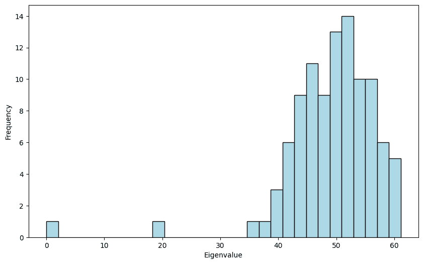

前两个特征值接近\(0\)和\(0.2 \cdot 100 = 20\)，正如预期的那样。其余的特征值围绕\( (0.2 + 0.8) 100 /2 = 50\)，但它们分布得很广，密度类似于半圆。这与[Wigner 的半圆定律](https://en.wikipedia.org/wiki/Wigner_semicircle_distribution)有关，这在随机矩阵理论中起着关键作用。

\(\unlhd\)

### 5.8.2.2\. Weyl 的不等式#

我们证明了关于特征值敏感性的一个不等式，这在某些应用中是有用的。

对于一个对称矩阵 \(C \in \mathbb{R}^{d \times d}\)，我们让 \(\lambda_j(C)\)，\(j=1, \ldots, d\)，是 \(C\) 的非递减顺序特征值，对应正交归一特征向量 \(\mathbf{v}_j\)，\(j=1, \ldots, d\)。以下引理是所谓 *Weyl 不等式* 的一种形式。

**引理** **(Weyl)** 设 \(A \in \mathbb{R}^{d \times d}\) 和 \(B \in \mathbb{R}^{d \times d}\) 是对称矩阵。那么，对于所有 \(j=1, \ldots, d\)，

\[ \max_{j \in [d]} \left|\lambda_j(B) - \lambda_j(A)\right| \leq \|B- A\|_2 \]

其中 \(\|C\|_2\) 是 \(C\) 的诱导 \(2\)-范数。\(\flat\)

*证明思路:* 我们使用特征值的极值特征与维度论证。

*证明:* 对于一个对称矩阵 \(C \in \mathbb{R}^{d \times d}\)，定义子空间

\[ \mathcal{V}_k(C) = \mathrm{span}(\mathbf{v}_1, \ldots, \mathbf{v}_k) \quad\text{和}\quad \mathcal{W}_{d-k+1}(C) = \mathrm{span}(\mathbf{v}_k, \ldots, \mathbf{v}_d) \]

其中 \(\mathbf{v}_1,\ldots,\mathbf{v}_d\) 构成 \(C\) 的特征向量的正交归一基。令 \(H = B - A\)。我们只证明上界。其他方向可以通过交换 \(A\) 和 \(B\) 的角色得到。因为

\[ \mathrm{dim}(\mathcal{V}_j(B)) + \mathrm{dim}(\mathcal{W}_{d-j+1}(A)) = j + (d-j+1) = d+1 \]

可以证明（试一试！）：

\[ \mathrm{dim}\left(\mathcal{V}_j(B) \cap \mathcal{W}_{d-j+1}(A)\right) \geq d+1 - d = 1. \]

因此 \(\mathcal{V}_j(B) \cap \mathcal{W}_{d-j+1}(A)\) 非空。令 \(\mathbf{v}\) 是该交集中的一个单位向量。

根据 *Courant-Fischer*，

\[ \lambda_j(B) \leq \langle \mathbf{v}, (A+H) \mathbf{v}\rangle = \langle \mathbf{v}, A \mathbf{v}\rangle + \langle \mathbf{v}, H \mathbf{v}\rangle \leq \lambda_j(A) + \langle \mathbf{v}, H \mathbf{v}\rangle. \]

此外，根据 *Cauchy-Schwarz*，由于 \(\|\mathbf{v}\|=1\)

\[ \langle \mathbf{v}, H \mathbf{v}\rangle \leq \|\mathbf{v}\| \|H\mathbf{v}\| \leq \|H\|_2 \]

这证明了命题。 \(\square\)

### 5.8.2.3\. 加权情况#

我们所介绍的概念也可以扩展到加权图，即具有边权重的图。这些权重可能是连接强度的度量。在本节中，我们简要描述这种扩展，这是 [离散微积分](https://en.wikipedia.org/wiki/Calculus_on_finite_weighted_graphs) 的基础。

**定义** **(加权图或有向图)** 加权图（或加权有向图）是一个三元组 \(G = (V, E, w)\)，其中 \((V, E)\) 是一个图（或有向图），且 \(w : E \to \mathbb{R}_+\) 是一个函数，它将正实数权重分配给边。为了方便起见，我们写 \(w_e = w_{ij} = w(i,j)\) 表示边 \(e = \{i,j\}\)（或在有向情况下 \(e = (i,j)\)）的权重。\(\natural\)

如同我们对图所做的那样，我们表示顶点 \(\{1,\ldots, n\}\) 和边 \(\{e_1,\ldots, e_{m}\}\)，其中 \(n = |V|\) 和 \(m =|E|\)。图的性质可以自然地推广。例如，我们定义顶点 \(i\) 的度为，在无向情况下，

\[ \delta(i) = \sum_{j:\{i,j\} \in E} w_{ij}. \]

类似地，在有向情况下，出度和入度如下

\[ \delta^+(i) = \sum_{j: (i,j) \in E} w_{ij} \qquad \text{和} \qquad \delta^+(i) = \sum_{j: (j,i) \in E} w_{ij}. \]

在无向情况下，邻接矩阵的推广如下。（对于有向情况也有类似的推广。）

**定义** **(加权图的邻接矩阵)** 设 \(G = (V, E, w)\) 为一个具有 \(n = |V|\) 个顶点的加权图。\(G\) 的邻接矩阵 \(A\) 是一个 \(n\times n\) 的对称矩阵，定义为

\[\begin{align*} A_{ij} = \begin{cases} w_{ij} & \text{if $\{i,j\} \in E$}\\ 0 & \text{o.w.} \end{cases} \end{align*}\]

\(\natural\)

对于有向情况，也有类似的推广。

**定义** **(加权有向图的邻接矩阵)** 设 \(G = (V, E, w)\) 为一个具有 \(n = |V|\) 个顶点的加权有向图。\(G\) 的邻接矩阵 \(A\) 是一个 \(n\times n\) 的矩阵，定义为

\[\begin{align*} A_{ij} = \begin{cases} w_{ij} & \text{if $(i,j) \in E$}\\ 0 & \text{o.w.} \end{cases} \end{align*}\]

\(\natural\)

**加权图的拉普拉斯矩阵** 在加权图的情况下，拉普拉斯矩阵可以定义为以下。

**定义** **(加权图的拉普拉斯矩阵)** 设 \(G = (V, E, w)\) 为一个具有 \(n = |V|\) 个顶点和邻接矩阵 \(A\) 的加权图。设 \(D = \mathrm{diag}(\delta(1), \ldots, \delta(n))\) 为加权度矩阵。与 \(G\) 相关的拉普拉斯矩阵定义为 \(L = D - A\)。 \(\natural\)

可以证明（试一试！）在加权情况下拉普拉斯二次型满足

\[ \langle \mathbf{x}, L \mathbf{x} \rangle = \sum_{\{i,j\} \in E} w_{ij} (x_i - x_j)² \]

对于 \(\mathbf{x} = (x_1,\ldots,x_n) \in \mathbb{R}^n\).

作为正半定矩阵（练习：为什么？），加权拉普拉斯矩阵具有正交归一的特征向量基，其特征值非负，满足我们上面推导出的变分特征。特别是，如果我们表示特征值为 \(0 = \mu_1 \leq \mu_2 \leq \cdots \leq \mu_n\)，根据 *Courant-Fischer*，可以得出

\[ \mu_2 = \min\left\{ \sum_{\{u, v\} \in E} w_{uv} (x_u - x_v)² \,:\, \mathbf{x} = (x_1, \ldots, x_n) \in \mathbb{R}^n, \sum_{u=1}^n x_u = 0, \sum_{u = 1}^n x_u² = 1 \right\}. \]

如果我们将割比推广为

\[ \phi(S) = \frac{\sum_{i \in S, j \in S^c} w_{ij}}{\min\{|S|, |S^c|\}} \]

对于 \(\emptyset \neq S \subset V\) 和令

\[ \phi_G = \min\left\{ \phi(S)\,:\, \emptyset \neq S \subset V \right\} \]

可以证明（试一试！）在加权情况下

\[ \mu_2 \leq 2 \phi_G \]

与无权情况相同。

**归一化拉普拉斯矩阵** 拉普拉斯矩阵的其他变体也已研究。接下来我们介绍了归一化拉普拉斯矩阵。回想一下，在加权情况下，度定义为 \(\delta(i) = \sum_{j:\{i,j\} \in E} w_{i,j}\)。

**定义** **（归一化拉普拉斯矩阵）** \(G = (V,E,w)\) 的归一化拉普拉斯矩阵，其邻接矩阵为 \(A\)，度矩阵为 \(D\)，定义为

\[ \mathcal{L} = I - D^{-1/2} A D^{-1/2}. \]

\(\natural\)

使用我们之前关于对角矩阵乘法的观察，\(\mathcal{L}\) 的项为

\[ (\mathcal{L})_{i,j} = (I - (D^{-1/2} A D^{-1/2})_{i,j} = 1 - \frac{a_{i,j}}{\sqrt{\delta(i) \delta(j)}}. \]

我们还注意到与拉普拉斯矩阵的以下关系：

\[ \mathcal{L} = D^{-1/2} L D^{-1/2}. \]

我们检查归一化拉普拉斯矩阵是对称的：

\[\begin{align*} \mathcal{L}^T &= I^T - (D^{-1/2} A D^{-1/2})^T\\ &= I - (D^{-1/2})^T A^T (D^{-1/2})^T\\ &= I - D^{-1/2} A D^{-1/2}\\ &= \mathcal{L}. \end{align*}\]

它也是正半定的。实际上，

\[ \mathbf{x}^T \mathcal{L} \mathbf{x} = \mathbf{x}^T D^{-1/2} L D^{-1/2} \mathbf{x} = (D^{-1/2} \mathbf{x})^T L (D^{-1/2} \mathbf{x}) \geq 0, \]

通过拉普拉斯矩阵的性质。

因此，根据 *谱定理*，我们可以写出

\[ \mathcal{L} = \sum_{i=1}^n \eta_i \mathbf{z}_i \mathbf{z}_i^T, \]

其中 \(\mathbf{z}_i\) 是 \(\mathcal{L}\) 的正交特征向量，并且特征值满足 \(0 \leq \eta_1 \leq \eta_2 \leq \cdots \leq \eta_n\).

另一个观察：因为常量向量是 \(L\) 的特征向量，其特征值为 \(0\)，我们得到 \(D^{1/2} \mathbf{1}\) 是 \(\mathcal{L}\) 的特征向量，其特征值为 \(0\)。因此 \(\eta_1 = 0\)，我们设

\[ (\mathbf{z}_1)_i = \left(\frac{D^{1/2} \mathbf{1}}{\|D^{1/2} \mathbf{1}\|_2}\right)_i = \sqrt{\frac{\delta(i)}{\sum_{i\in V} \delta(i)}}, \quad \forall i \in [n], \]

这使得 \(\mathbf{z}_1\) 成为一个单位范数向量。

与拉普拉斯矩阵的关系立即暗示（证明它！）：

\[ \mathbf{x}^T \mathcal{L} \mathbf{x} = \sum_{\{i,j\} \in E} w_{ij} \left(\frac{x_i}{\sqrt{\delta(i)}} - \frac{x_j}{\sqrt{\delta(j)}}\right)², \]

对于 \(\mathbf{x} = (x_1,\ldots,x_n)^T \in \mathbb{R}^n\).

通过变量变换

\[ y_i = \frac{x_i}{\sqrt{\delta(i)}}, \]

*Courant-Fischer* 这次给出了（为什么？）

\[ \eta_2 = \min\left\{ \sum_{\{u, v\} \in E} w_{uv} (y_u - y_v)² \,:\, \mathbf{y} = (y_1, \ldots, y_n)^T \in \mathbb{R}^n, \sum_{u=1}^n \delta(u) y_u = 0, \sum_{u = 1}^n \delta(u) y_u² = 1 \right\}. \]

对于顶点子集 \(S \subseteq V\)，令

\[ |S|_w = \sum_{i \in S} \delta(i), \]

我们将其称为 \(S\) 的体积。这是 \(S\) 大小加权度数的度量。

如果我们考虑归一化切割比率，或瓶颈比率，

\[ \phi^N(S) = \frac{\sum_{i \in S, j \in S^c} w_{ij}}{\min\{|S|_w, |S^c|_w\}} \]

对于 \(\emptyset \neq S \subset V\)，并令

\[ \phi^N_G = \min\left\{ \phi^N(S)\,:\, \emptyset \neq S \subset V \right\} \]

可以证明（试试看！）：

\[ \eta_2 \leq 2 \phi^N_G. \]

归一化切割比率与切割比率类似，不同之处在于切割的平衡性是以体积来衡量的。请注意，这个概念在无权情况下也很有用。

我们将在本章后面讨论归一化拉普拉斯的应用。

### 5.8.2.4\. 图像分割#

我们将给出这个主题中发展出的想法在图像分割上的不同、更复杂的应用。让我们引用维基百科：

> 在计算机视觉中，图像分割是将数字图像分割成多个段（像素集，也称为图像对象）的过程。分割的目的是简化图像的表示，或者将其改变为更有意义且更容易分析的形式。图像分割通常用于在图像中定位对象和边界（线条、曲线等）。更确切地说，图像分割是将标签分配给图像中的每个像素，使得具有相同标签的像素具有某些共同特征。

在整个过程中，我们将使用 `scikit-image` 库来处理图像。

```py
from skimage import io, segmentation, color
from skimage import graph
from sklearn.cluster import KMeans 
```

作为例子，这里是一张通过光学显微镜拍摄的细胞核图片，作为某些医学实验的一部分。图片来自 [这里](https://www.kaggle.com/c/data-science-bowl-2018/data)。在这里，我们使用了函数 `skimage.io.imread` 从文件中加载图像。

```py
img = io.imread('cell-nuclei.png')
fig, ax = plt.subplots(figsize=(6, 6))
ax.imshow(img)
plt.show() 
```

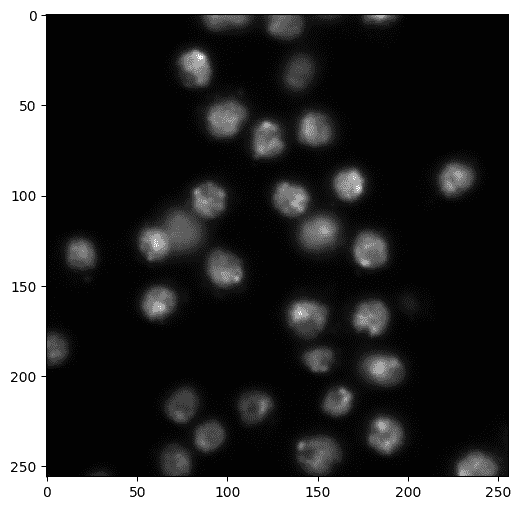

假设在这个实验的一部分，我们有一大批这样的图像，并且需要以某种方式跟踪细胞核（也许计算有多少个，或者从一帧跟踪到另一帧）。一个自然的预处理步骤是识别图像中的细胞核。我们使用图像分割来完成这个目的。

我们将回到下面的例子。让我们先看看一些其他的例子。

我们将首先使用以下 [威斯康星州地区地图](https://www.dhs.wisconsin.gov/areaadmin/index.htm)。

```py
img = io.imread('wisconsin-regions.png')
fig, ax = plt.subplots(figsize=(6, 6))
ax.imshow(img)
plt.show() 
```


像这样的彩色图像被编码为 \(3\) 维数组（或 [张量](https://en.wikipedia.org/wiki/Tensor)），这意味着它具有 \(3\) 个索引（与只有两个索引的矩阵不同）。

```py
img.shape 
```

```py
(709, 652, 3) 
```

前两个索引捕获像素的位置。第三个索引捕获 [RGB 颜色模型](https://en.wikipedia.org/wiki/RGB_color_model)。换句话说，图像中的每个像素都附有三个（介于 0 到 255 之间）的数字，这些数字编码了它的颜色。

例如，在位置 \((300,400)\) 的 RGB 颜色是：

```py
img[300,400,:] 
```

```py
array([111, 172, 232], dtype=uint8) 
```

```py
plt.imshow(np.reshape(img[300,400,:],(1,1,3)))
plt.show() 
```

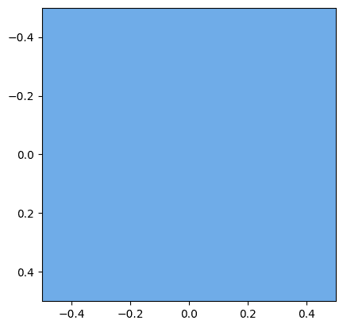

为了使用我们开发的谱图理论进行图像分割，我们将图像转换成图。

第一步是通过创建超像素，即颜色相似且接近的像素区域，来对图像进行粗化。为此，我们将使用[`skimage.segmentation.slic`](https://scikit-image.org/docs/stable/api/skimage.segmentation.html#skimage.segmentation.slic)，它本质上是在颜色空间上使用\(k\)-means 聚类来识别颜色相似且接近的像素块。它接受所需的超像素数量（`n_segments`）、紧密度参数（`compactness`）和光滑参数（`sigma`）作为输入。输出是每个像素的标签分配，形式为二维数组。

在通过[scikit-image](https://scikit-image.org/docs/dev/api/skimage.segmentation.html#skimage.segmentation.slic)选择参数`compactness`时：

> 平衡颜色接近度和空间接近度。较高的值会给空间接近度更多的权重，使超像素形状更接近正方形/立方体。此参数强烈依赖于图像对比度和图像中物体的形状。我们建议在选定值周围在对数尺度上探索可能的值，例如，0.01、0.1、1、10、100。

参数`sigma`控制对图像应用的前处理步骤中的模糊程度。在实践中，需要通过实验来选择合适的参数。

```py
labels1 = segmentation.slic(img, 
                            compactness=25, 
                            n_segments=100, 
                            sigma=2., 
                            start_label=0)
print(labels1) 
```

```py
[[ 0  0  0 ...  8  8  8]
 [ 0  0  0 ...  8  8  8]
 [ 0  0  0 ...  8  8  8]
 ...
 [77 77 77 ... 79 79 79]
 [77 77 77 ... 79 79 79]
 [77 77 77 ... 79 79 79]] 
```

使用函数[`skimage.color.label2rgb`](https://scikit-image.org/docs/dev/api/skimage.color.html#skimage.color.label2rgb)可视化超像素是一种巧妙的方法，该函数以图像和一个标签数组作为输入。在`kind='avg'`模式下，它输出一个新图像，其中每个像素的颜色被其标签的平均颜色所替代（即，所有具有相同标签的像素的 RGB 颜色的平均值）。正如他们所说，一张图片胜过千言万语——让我们看看它到底做了什么。

```py
out1 = color.label2rgb(labels1, img/255, kind='avg', bg_label=0)
out1.shape 
```

```py
(709, 652, 3) 
```

```py
fig, ax = plt.subplots(figsize=(6, 6))
ax.imshow(out1)
plt.show() 
```

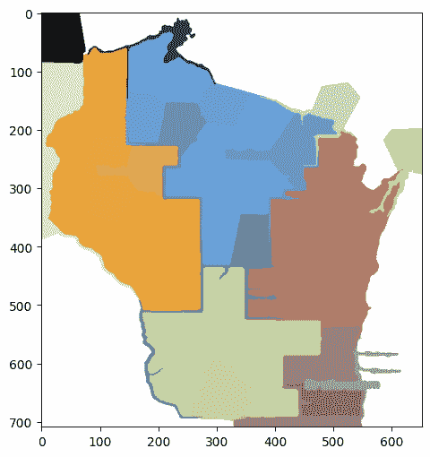

回想一下，我们的目标是把原始图像转换成图。在创建超像素的第一步之后，第二步是形成一个图，其节点是超像素。在相邻的超像素之间添加边，并为每条边分配一个权重，该权重反映了两个超像素之间平均颜色的差异。

我们使用[`skimage.graph.rag_mean_color`](https://scikit-image.org/docs/stable/api/skimage.graph.html#skimage.graph.rag_mean_color)。在`similarity`模式下，它使用以下权重公式（引用文档）：

> 两个相邻区域之间的权重是 exp(-d²/sigma)，其中 d=|c1-c2|，c1 和 c2 是两个区域的平均颜色。它表示两个区域之间的相似程度。

输出，被称为区域邻接图（RAG），是一个`NetworkX`图，可以使用该包进行操作。

```py
g = graph.rag_mean_color(img, labels1, mode='similarity')
nx.draw(g, pos=nx.spring_layout(g)) 
```

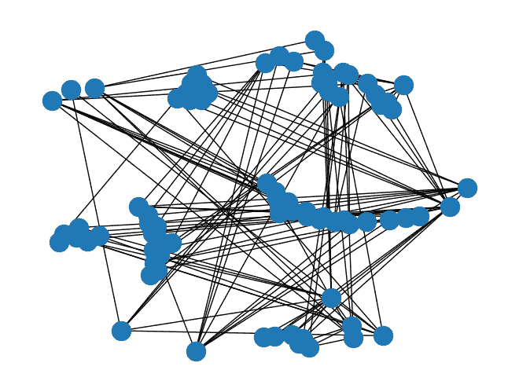

`scikit-image`还提供了一个更有效的方式来可视化 RAG，使用函数`skimage.future.graph.show_rag`。在这里，图被叠加在图像上，边权重通过颜色表示。

```py
fig, ax = plt.subplots(nrows=1, figsize=(6, 8))
lc = graph.show_rag(labels1, g, img, ax=ax)
fig.colorbar(lc, fraction=0.05, ax=ax)
plt.show() 
```

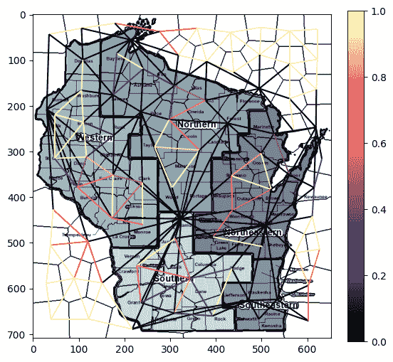

我们可以应用本章中开发的谱聚类技术。接下来，我们计算加权拉普拉斯算子的谱分解并绘制特征值。

```py
L = nx.laplacian_matrix(g).toarray()
print(L) 
```

```py
[[ 9.93627574e-01 -9.93627545e-01  0.00000000e+00 ...  0.00000000e+00
   0.00000000e+00  0.00000000e+00]
 [-9.93627545e-01  1.98331432e+00 -9.89686777e-01 ...  0.00000000e+00
   0.00000000e+00  0.00000000e+00]
 [ 0.00000000e+00 -9.89686777e-01  1.72084919e+00 ...  0.00000000e+00
   0.00000000e+00  0.00000000e+00]
 ...
 [ 0.00000000e+00  0.00000000e+00  0.00000000e+00 ...  4.03242708e-05
   0.00000000e+00  0.00000000e+00]
 [ 0.00000000e+00  0.00000000e+00  0.00000000e+00 ...  0.00000000e+00
   7.93893423e-01  0.00000000e+00]
 [ 0.00000000e+00  0.00000000e+00  0.00000000e+00 ...  0.00000000e+00
   0.00000000e+00  1.99992197e+00]] 
```

```py
w, v = LA.eigh(L)
plt.plot(np.sort(w))
plt.show() 
```

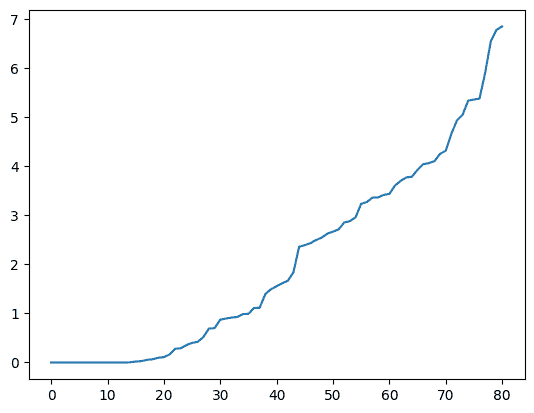

从理论上看，这表明这个图中大约有 15 个组件。我们将投影到 15 个维度，并应用 k-means 聚类来找到分割区域。我们不是使用自己的实现，而是使用来自`scikit-learn`库的`sklearn.cluster.KMeans`。该实现使用[\(k\)-means\(++\)](https://en.wikipedia.org/wiki/K-means%2B%2B)初始化，这在实践中特别有效。每个节点的标签分配可以通过`labels_`访问。

```py
ndims = 15 # number of dimensions to project to
nsegs = 10 # number of segments

top = np.argsort(w)[1:ndims]
topvecs = v[:,top]
topvals = w[top]

kmeans = KMeans(n_clusters=nsegs, random_state=12345).fit(topvecs)
assign_seg = kmeans.labels_
print(assign_seg) 
```

```py
[1 1 1 1 1 1 1 1 1 2 9 1 1 2 1 1 1 9 8 1 9 6 9 2 1 9 1 9 2 9 9 2 2 4 1 2 9
 9 2 4 3 2 4 4 2 2 9 2 4 3 1 5 2 4 3 4 2 0 5 4 5 3 3 4 0 0 0 5 5 1 5 1 3 0
 0 0 5 5 7 3 5] 
```

为了可视化分割，我们为每个分割区域（即超像素集合）分配一个随机颜色。这可以通过再次使用`skimage.color.label2rgb`函数来实现，这次在模式`kind='overlay'`下。首先，我们将原始图像中的每个像素的标签分配给它在这个聚类下的标签。回想一下，`labels1`将每个像素分配给其超像素（由 RAG 的节点表示），因此将`assign_seg`逐元素应用于`labels1`的结果是将一个簇分配给每个像素。在代码中：

```py
labels2 = assign_seg[labels1]
print(labels2) 
```

```py
[[1 1 1 ... 1 1 1]
 [1 1 1 ... 1 1 1]
 [1 1 1 ... 1 1 1]
 ...
 [5 5 5 ... 3 3 3]
 [5 5 5 ... 3 3 3]
 [5 5 5 ... 3 3 3]] 
```

```py
out2 = color.label2rgb(labels2, kind='overlay', bg_label=0)
out2.shape 
```

```py
(709, 652, 3) 
```

```py
fig, ax = plt.subplots(nrows=2, sharex=True, sharey=True, figsize=(16, 8))
ax[0].imshow(img)
ax[1].imshow(out2)
plt.show() 
```

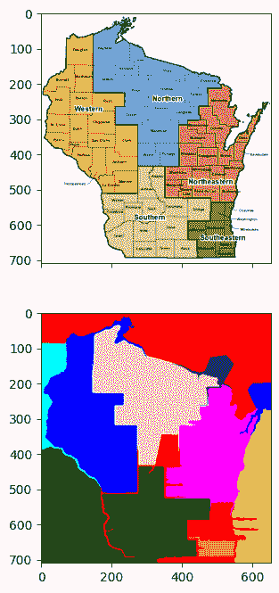

如您所见，结果是合理的，但远非完美。

为了便于使用，我们将上述主要步骤封装在子例程中。

```py
def imgseg_rag(img, compactness=30, n_spixels=400, sigma=0., figsize=(10,10)):
    labels1 = segmentation.slic(img, 
                                compactness=compactness, 
                                n_segments=n_spixels, 
                                sigma=sigma, 
                                start_label=0)
    out1 = color.label2rgb(labels1, img/255, kind='avg', bg_label=0)
    g = graph.rag_mean_color(img, labels1, mode='similarity')
    fig, ax = plt.subplots(figsize=figsize)
    ax.imshow(out1)
    plt.show()
    return labels1, g 
```

```py
def imgseg_eig(g):
    L = nx.laplacian_matrix(g).toarray()
    w, v = LA.eigh(L)
    plt.plot(np.sort(w))
    plt.show()
    return w,v 
```

```py
def imgseg_labels(w, v, n_dims=10, n_segments=5, random_state=0):
    top = np.argsort(w)[1:n_dims]
    topvecs = v[:,top]
    topvals = w[top]
    kmeans = KMeans(n_clusters=n_segments, 
                    random_state=random_state).fit(topvecs)
    assign_seg = kmeans.labels_
    labels2 = assign_seg[labels1]
    return labels2 
```

```py
def imgseg_viz(img, labels2, figsize=(20,10)):
    out2 = color.label2rgb(labels2, kind='overlay', bg_label=0)
    fig, ax = plt.subplots(nrows=2, sharex=True, sharey=True, figsize=figsize)
    ax[0].imshow(img)
    ax[1].imshow(out2)
    plt.show() 
```

让我们尝试一个更复杂的图像。这张图片来自[这里](https://www.reddit.com/r/aww/comments/169s6e/badgers_can_be_cute_too/)。

```py
img = io.imread('two-badgers.jpg')
fig, ax = plt.subplots(figsize=(10, 10))
ax.imshow(img)
plt.show() 
```

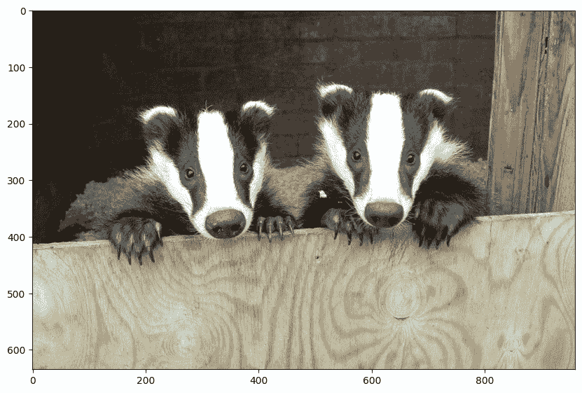

回想一下，参数的选择需要大量的调整。

```py
labels1, g = imgseg_rag(img, 
                        compactness=30, 
                        n_spixels=1000, 
                        sigma=0., 
                        figsize=(10,10)) 
```

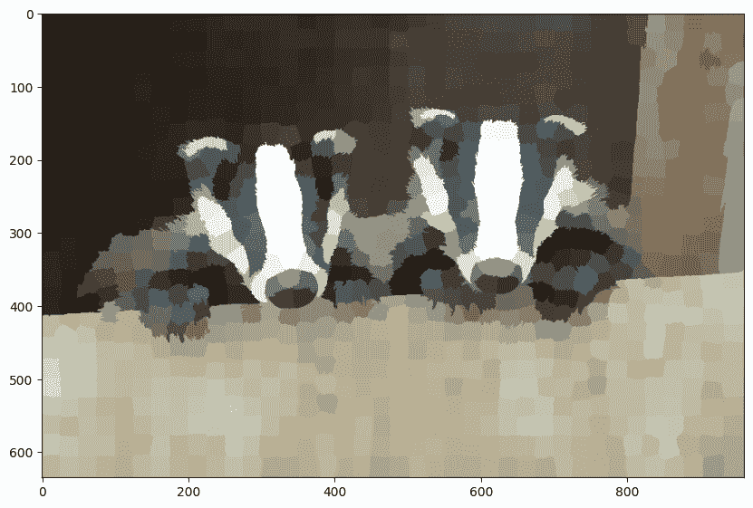

```py
w, v = imgseg_eig(g) 
```

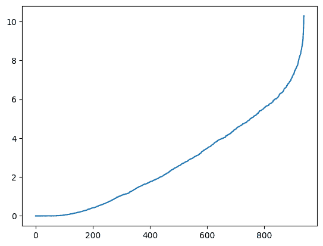

```py
labels2 = imgseg_labels(w, v, n_dims=60, n_segments=50, random_state=535)
imgseg_viz(img,labels2,figsize=(20,10)) 
```

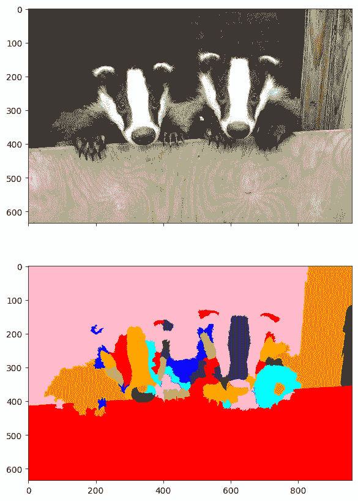

再次强调，结果远非完美 - 但也不算不合理。

最后，我们回到我们的医学示例。我们首先重新加载图像并找到超像素。

```py
img = io.imread('cell-nuclei.png')
labels1, g = imgseg_rag(img,compactness=40,n_spixels=300,sigma=0.1,figsize=(6,6)) 
```

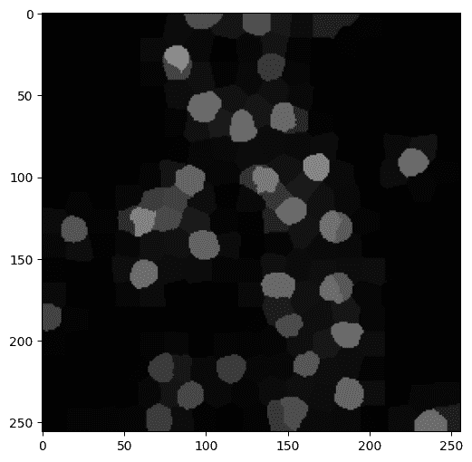

然后，我们形成加权拉普拉斯算子并绘制其特征值。这次，大约 \(40\) 维看起来是合适的。

```py
w, v = imgseg_eig(g) 
```

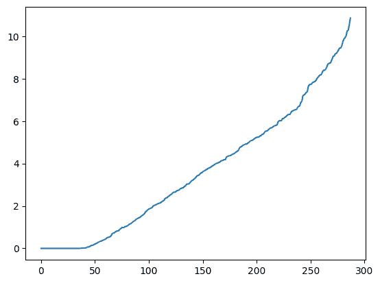

```py
labels2 = imgseg_labels(w, v, n_dims=40, n_segments=30, random_state=535)
imgseg_viz(img,labels2,figsize=(20,10)) 
```

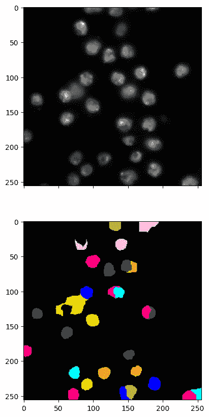

此方法相当挑剔。参数的选择会显著影响结果。您应该亲自看看。

我们提到 `scikit-image` 有一个与该方法密切相关的方法的实现，即归一化切割，`skimage.graph.cut_normalized`。[`skimage.graph.cut_normalized`](https://scikit-image.org/docs/dev/api/skimage.graph.html#skimage.graph.cut_normalized)。它不是在投影后执行 \(k\)-means，而是在 RAG 和结果子图上递归执行双向切割。

我们接下来尝试。结果如您所见，相似。

```py
labels2 = graph.cut_normalized(labels1, g)
imgseg_viz(img,labels2,figsize=(20,10)) 
```

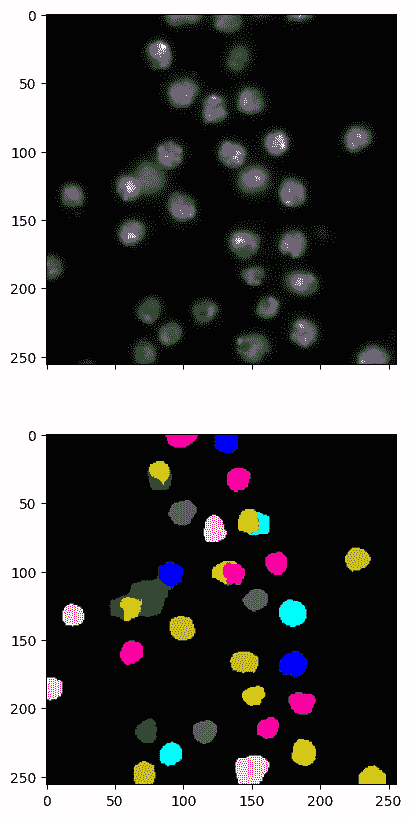

有许多其他图像分割方法。例如，请参阅[这里](https://scikit-image.org/docs/dev/api/skimage.segmentation.html#module-skimage.segmentation)。

## 5.8.1\. 问答，解答，代码等。#

### 5.8.1.1\. 仅代码。#

本章中的代码的交互式 Jupyter 笔记本可以通过以下链接访问（推荐使用 Google Colab）。鼓励您对其进行尝试。一些建议的计算练习散布在其中。该笔记本也可以作为幻灯片查看。

+   [笔记本](https://github.com/MMiDS-textbook/MMiDS-textbook.github.io/blob/main/just_the_code/roch_mmids_chap_specgraph_notebook.ipynb) ([在 Colab 中打开](https://colab.research.google.com/github/MMiDS-textbook/MMiDS-textbook.github.io/blob/main/just_the_code/roch_mmids_chap_specgraph_notebook.ipynb))

+   [幻灯片](https://raw.githack.com/MMiDS-textbook/MMiDS-textbook.github.io/main/just_the_code/roch_mmids_chap_specgraph_notebook_slides.slides.html)

### 5.8.1.2\. 自我评估问答。#

通过以下链接可以找到更全面的自我评估问答的网页版本。

+   [第 5.2 节](https://raw.githack.com/MMiDS-textbook/MMiDS-textbook.github.io/main/quizzes/self-assessment/quiz_5_2.html)

+   [第 5.3 节](https://raw.githack.com/MMiDS-textbook/MMiDS-textbook.github.io/main/quizzes/self-assessment/quiz_5_3.html)

+   [第 5.4 节](https://raw.githack.com/MMiDS-textbook/MMiDS-textbook.github.io/main/quizzes/self-assessment/quiz_5_4.html)

+   [第 5.5 节](https://raw.githack.com/MMiDS-textbook/MMiDS-textbook.github.io/main/quizzes/self-assessment/quiz_5_5.html)

+   [第 5.6 节](https://raw.githack.com/MMiDS-textbook/MMiDS-textbook.github.io/main/quizzes/self-assessment/quiz_5_6.html)

### 5.8.1.3\. 自动测验#

本章自动生成的测验可以在此处访问（推荐使用 Google Colab）。

+   [自动测验](https://github.com/MMiDS-textbook/MMiDS-textbook.github.io/blob/main/quizzes/auto_quizzes/roch-mmids-specgraph-autoquiz.ipynb) ([在 Colab 中打开](https://colab.research.google.com/github/MMiDS-textbook/MMiDS-textbook.github.io/blob/main/quizzes/auto_quizzes/roch-mmids-specgraph-autoquiz.ipynb))

### 5.8.1.4\. 奇数练习题的解答#

*(在克劳德、双子星和 ChatGPT 的帮助下)*

**E5.2.1** \(V = \{1, 2, 3, 4\}\)，\(E = \{\{1, 2\}, \{1, 3\}, \{2, 4\}, \{3, 4\}\}\)。这直接来自图作为一对\(G = (V, E)\)的定义。

**E5.2.3** 一个可能的路径是\(1 \sim 2 \sim 4\)。它的长度是 2，因为它由两个边组成。

**E5.2.5** \(\delta^-(2) = 1\)，\(\delta^+(2) = 2\)。顶点\(v\)的入度是目标为\(v\)的边的数量，出度是源为\(v\)的边的数量。

**E5.2.7** 图\(G\)不是连通的。顶点 1 和顶点 4 之间没有路径，这表明图不是连通的。

**E5.2.9** 连通分量的数量是 1。每对顶点之间都存在路径，因此图是连通的，只有一个连通分量。

**E5.2.11**

\[\begin{split} B = \begin{pmatrix} 1 & 1 & 0 & 0 \\ 1 & 0 & 1 & 0 \\ 0 & 1 & 0 & 1 \\ 0 & 0 & 1 & 1 \end{pmatrix}. \end{split}\]

如果顶点\(i\)与边\(j\)相关联，则\(B_{ij}\)的值为 1，否则为 0。

**E5.2.13**

\[\begin{split} B = \begin{pmatrix} -1 & 0 & 1 & 0 \\ 1 & -1 & 0 & -1 \\ 0 & 1 & -1 & 0 \\ 0 & 0 & 0 & 1 \end{pmatrix}. \end{split}\]

如果边\(j\)离开顶点\(i\)，则\(B_{ij}\)的值为 1；如果边\(j\)进入顶点\(i\)，则\(B_{ij}\)的值为-1；否则为 0。

**E5.2.15** 彼得森图是 3-正则的，正如文本所述。

**E5.3.1** 我们可以找到\(A\)的特征向量，并将它们归一化以得到一个正交基。\(A\)的特征多项式是\((5-\lambda)² - 9 = \lambda² - 10\lambda + 16 = (\lambda - 2)(\lambda - 8)\)，因此特征值是 2 和 8。对于\(\lambda = 2\)，一个特征向量是\(\begin{pmatrix} -1 \\ 1 \end{pmatrix}\)，对于\(\lambda = 8\)，一个特征向量是\(\begin{pmatrix} 1 \\ 1 \end{pmatrix}\)。归一化这些向量，我们得到矩阵

\[\begin{split} W = \begin{pmatrix} -1/\sqrt{2} & 1/\sqrt{2} \\ 1/\sqrt{2} & 1/\sqrt{2} \end{pmatrix}. \end{split}\]

**E5.3.3** \(R_A(\mathbf{u}) = \frac{\langle \mathbf{u}, A\mathbf{u} \rangle}{\langle \mathbf{u}, \mathbf{u} \rangle} = \langle \mathbf{u}, A\mathbf{u} \rangle = \begin{pmatrix} \frac{\sqrt{3}}{2} & \frac{1}{2} \end{pmatrix} \begin{pmatrix} 3 & 1 \\ 1 & 2 \end{pmatrix} \begin{pmatrix} \frac{\sqrt{3}}{2} \\ \frac{1}{2} \end{pmatrix} = \frac{7}{2}\).

**E5.3.5** 要找到特征值，我们解特征方程：\(\det(A - \lambda I) = \begin{vmatrix} 2-\lambda & -1 \\ -1 & 2-\lambda \end{vmatrix} = (2-\lambda)² - 1 = \lambda² - 4\lambda + 3 = (\lambda - 1)(\lambda - 3) = 0\). 因此，特征值是 \(\lambda_1 = 3\) 和 \(\lambda_2 = 1\). 要找到特征向量，我们为每个特征值解 \((A - \lambda_i I)\mathbf{v}_i = 0\): 对于 \(\lambda_1 = 3\): \(\begin{pmatrix} -1 & -1 \\ -1 & -1 \end{pmatrix}\mathbf{v}_1 = \mathbf{0}\)，这给出 \(\mathbf{v}_1 = c\begin{pmatrix} 1 \\ -1 \end{pmatrix}\). 归一化后，我们得到 \(\mathbf{v}_1 = \frac{1}{\sqrt{2}}\begin{pmatrix} 1 \\ -1 \end{pmatrix}\). 对于 \(\lambda_2 = 1\): \(\begin{pmatrix} 1 & -1 \\ -1 & 1 \end{pmatrix}\mathbf{v}_2 = \mathbf{0}\)，这给出 \(\mathbf{v}_2 = c\begin{pmatrix} 1 \\ 1 \end{pmatrix}\). 归一化后，我们得到 \(\mathbf{v}_2 = \frac{1}{\sqrt{2}}\begin{pmatrix} 1 \\ 1 \end{pmatrix}\). 要验证 \(\lambda_1\) 的变分特征：\(R_A(\mathbf{v}_1) = \frac{\langle \mathbf{v}_1, A\mathbf{v}_1 \rangle}{\langle \mathbf{v}_1, \mathbf{v}_1 \rangle} = \frac{1}{2}\begin{pmatrix} 1 & 1 \end{pmatrix}\begin{pmatrix} 2 & -1 \\ -1 & 2 \end{pmatrix}\begin{pmatrix} 1 \\ 1 \end{pmatrix} = \frac{1}{2}(2 - 1 - 1 + 2) = 3 = \lambda_1\). 对于任何单位向量 \(\mathbf{u} = \begin{pmatrix} \cos\theta \\ \sin\theta \end{pmatrix}\)，我们有：\(R_A(\mathbf{u}) = \begin{pmatrix} \cos\theta & \sin\theta \end{pmatrix}\begin{pmatrix} 2 & -1 \\ -1 & 2 \end{pmatrix}\begin{pmatrix} \cos\theta \\ \sin\theta \end{pmatrix} = 2\cos²\theta + 2\sin²\theta - 2\cos\theta\sin\theta = 2 - 2\cos\theta\sin\theta \leq 2 + 2|\cos\theta\sin\theta| \leq 3\)，当 \(\theta = \frac{\pi}{4}\) 时取等号，这对应于 \(\mathbf{u} = \mathbf{v}_1\). 因此，\(\lambda_1 = \max_{\mathbf{u} \neq \mathbf{0}} R_A(\mathbf{u})\).

**E5.3.7** 首先，我们找到与给定特征向量对应的特征值：\(A\mathbf{v}_1 = \begin{pmatrix} 1 & 2 & 0 \\ 2 & 1 & 0 \\ 0 & 0 & 3 \end{pmatrix} \frac{1}{\sqrt{2}} \begin{pmatrix} 1 \\ 1 \\ 0 \end{pmatrix} = \frac{1}{\sqrt{2}} \begin{pmatrix} 3 \\ 3 \\ 0 \end{pmatrix} = 3\mathbf{v}_1\), 所以 \(\lambda_1 = 3\). \(A\mathbf{v}_2 = \begin{pmatrix} 1 & 2 & 0 \\ 2 & 1 & 0 \\ 0 & 0 & 3 \end{pmatrix} \frac{1}{\sqrt{2}} \begin{pmatrix} -1 \\ 1 \\ 0 \end{pmatrix} = \frac{1}{\sqrt{2}} \begin{pmatrix} -1 \\ 1 \\ 0 \end{pmatrix} = \mathbf{v}_2\), 所以 \(\lambda_2 = 1\). \(A\mathbf{v}_3 = \begin{pmatrix} 1 & 2 & 0 \\ 2 & 1 & 0 \\ 0 & 0 & 3 \end{pmatrix} \begin{pmatrix} 0 \\ 0 \\ 1 \end{pmatrix} = \begin{pmatrix} 0 \\ 0 \\ 3 \end{pmatrix} = 3\mathbf{v}_3\), 所以 \(\lambda_3 = 3\).

所以特征值是 \(\lambda_1 = 3\), \(\lambda_2 = 1\), 和 \(\lambda_3 = 3\)。注意，\(\lambda_2\) 是第二个最小的特征值。

现在，让我们验证 \(\lambda_2\) 的变分特征。任何向量 \(\mathbf{u} \in V_2\) 可以写成 \(\mathbf{u} = c_1 \mathbf{v}_1 + c_2 \mathbf{v}_2\) 的形式，其中 \(c_1\) 和 \(c_2\) 是一些标量。然后：

\(\langle \mathbf{u}, \mathbf{u} \rangle = \langle c_1 \mathbf{v}_1 + c_2 \mathbf{v}_2, c_1 \mathbf{v}_1 + c_2 \mathbf{v}_2 \rangle = c_1² \langle \mathbf{v}_1, \mathbf{v}_1 \rangle + 2c_1c_2 \langle \mathbf{v}_1, \mathbf{v}_2 \rangle + c_2² \langle \mathbf{v}_2, \mathbf{v}_2 \rangle = c_1² + c_2²\), 因为 \(\mathbf{v}_1\) 和 \(\mathbf{v}_2\) 是正交归一的。

\(\langle \mathbf{u}, A\mathbf{u} \rangle = \langle c_1 \mathbf{v}_1 + c_2 \mathbf{v}_2, A(c_1 \mathbf{v}_1 + c_2 \mathbf{v}_2) \rangle = \langle c_1 \mathbf{v}_1 + c_2 \mathbf{v}_2, 3c_1 \mathbf{v}_1 + c_2 \mathbf{v}_2 \rangle = 3c_1² + c_2²\), 因为 \(A\mathbf{v}_1 = 3\mathbf{v}_1\) 和 \(A\mathbf{v}_2 = \mathbf{v}_2\).

因此，\(R_A(\mathbf{u}) = \frac{\langle \mathbf{u}, A\mathbf{u} \rangle}{\langle \mathbf{u}, \mathbf{u} \rangle} = \frac{3c_1² + c_2²}{c_1² + c_2²} \geq 1\) 对于 \(V_2\) 中所有 \(\mathbf{u} \neq \mathbf{0}\) 都成立，当 \(c_1 = 0\) 时取等号。因此：\(\lambda_2 = \min_{\mathbf{0} \neq \mathbf{u} \in V_2} R_A(\mathbf{u}) = 1 = R_A(\mathbf{v}_2)\).

因此，第二个最小的特征值 \(\lambda_2\) 确实满足变分特征 \(\lambda_2 = \min_{\mathbf{0} \neq \mathbf{u} \in V_2} R_A(\mathbf{u})\).

**E5.4.1** 度矩阵 \(D\) 是

\[\begin{split} D = \begin{pmatrix} 1 & 0 & 0 & 0 \\ 0 & 3 & 0 & 0 \\ 0 & 0 & 2 & 0 \\ 0 & 0 & 0 & 2 \end{pmatrix}. \end{split}\]

拉普拉斯矩阵 \(L\) 是 \(L = D - A\):

\[\begin{split} L = \begin{pmatrix} 1 & -1 & 0 & 0 \\ -1 & 3 & -1 & -1 \\ 0 & -1 & 2 & -1 \\ 0 & -1 & -1 & 2 \end{pmatrix}. \end{split}\]

**E5.4.3**

\[\begin{split} L\mathbf{y}_1 = \begin{pmatrix} 2 & -1 & 0 & -1 & 0\\ -1 & 2 & -1 & 0 & 0\\ 0 & -1 & 3 & -1 & -1\\ -1 & 0 & -1 & 2 & 0\\ 0 & 0 & -1 & 0 & 1 \end{pmatrix} \cdot \frac{1}{\sqrt{5}}\begin{pmatrix} 1\\ 1\\ 1\\ 1\\ 1 \end{pmatrix} = \frac{1}{\sqrt{5}}\begin{pmatrix} 0\\ 0\\ 0\\ 0\\ 0 \end{pmatrix} = 0 \cdot \mathbf{y}_1. \end{split}\]

**E5.4.5** 让我们验证 \(\mathbf{y}_1\) 和 \(\mathbf{y}_2\) 是 \(L\) 的特征向量：

\[\begin{split} L\mathbf{y}_1 = \begin{pmatrix} 1 & -1 & 0 & 0\\ -1 & 2 & -1 & 0\\ 0 & -1 & 2 & -1\\ 0 & 0 & -1 & 1 \end{pmatrix} \cdot \frac{1}{2}\begin{pmatrix} 1\\ 1\\ 1\\ 1 \end{pmatrix} = \frac{1}{2}\begin{pmatrix} 0\\ 0\\ 0\\ 0 \end{pmatrix} = 0 \cdot \mathbf{y}_1, \end{split}\]\[\begin{split} L\mathbf{y}_2 = \begin{pmatrix} 1 & -1 & 0 & 0\\ -1 & 2 & -1 & 0\\ 0 & -1 & 2 & -1\\ 0 & 0 & -1 & 1 \end{pmatrix} \cdot \frac{1}{2}\begin{pmatrix} 1\\ \frac{1}{\sqrt{2}}\\ -\frac{1}{\sqrt{2}}\\ -1 \end{pmatrix} = (2 - \sqrt{2}) \cdot \frac{1}{2}\begin{pmatrix} 1\\ \frac{1}{\sqrt{2}}\\ -\frac{1}{\sqrt{2}}\\ -1 \end{pmatrix} = (2 - \sqrt{2}) \cdot \mathbf{y}_2. \end{split}\]

因此，\(\mathbf{y}_1\) 是一个特征向量，其特征值为 \(\mu_1 = 0\)，而 \(\mathbf{y}_2\) 是一个特征向量，其特征值为 \(\mu_2 = 2 - \sqrt{2}\)。

**E5.4.7** \(K_4\) 的最大度数为 \(\bar{\delta} = 3\)。使用界限 \(\bar{\delta} + 1 \leq \mu_n \leq 2\bar{\delta}\)，我们得到：

\[ 4 = \bar{\delta} + 1 \leq \mu_4 \leq 2\bar{\delta} = 6. \]

**E5.4.9** 对角元素 \(L_{ii}\) 是顶点 \(i\) 的度数，非对角元素 \(L_{ij}\)（对于 \(i \neq j\)）如果顶点 \(i\) 和 \(j\) 相邻则为 \(-1\)，否则为 0。因此，第 \(i\) 行元素之和

\[ \deg(i) - \sum_{j: \{i,j\} \in E} 1 = 0. \]

**E5.4.11** 对于任何向量 \(\mathbf{x} \in \mathbb{R}^n\)，我们有

\[ \mathbf{x}^T L_G \mathbf{x} = \sum_{\{i,j\} \in E} (x_i - x_j)² \ge 0. \]

由于这对所有 \(\mathbf{x}\) 都成立，\(L_G\) 是正半定的。

**E5.4.13** 在一个完全图中，每个顶点的度数为 \(n-1\)。因此，拉普拉斯矩阵是 \(L_G = nI - J\)，其中 \(I\) 是单位矩阵，\(J\) 是全 1 矩阵。\(J\) 的特征值为 \(n\)（重数 1）和，因为 \(J\) 的秩为 1，0（重数 \(n-1\)）。因此，\(L_G\) 的特征值为 0（重数 1）和 \(n\)（重数 \(n-1\)）。

**E5.5.1** \(|E(S, S^c)| = 2\)（\(S\) 和 \(S^c\) 之间的边是 \(\{1, 2\}\) 和 \(\{2, 3\}\)），且 \(\min\{|S|, |S^c|\} = 1\)。因此，\(\phi(S) = \frac{|E(S, S^c)|}{\min\{|S|, |S^c|\}} = 2\)。

**E5.5.3** 在一个有 \(n\) 个顶点的连通图中，割比的上限至少为 1，下限最多为 \(n/2\)，这是通过将图切成两个相等部分实现的。因此，等周数的最小可能值为 \(\frac{1}{n/2} = \frac{2}{n}\)。对于 \(n = 6\)，这是 \(\frac{1}{3}\)。

**E5.5.5** Cheeger 不等式还表明 \(\frac{\phi_G²}{2\bar{\delta}} \leq \mu_2\)。因此，\(\phi_G \leq \sqrt{2\bar{\delta}\mu_2} = \sqrt{2 \cdot 4 \cdot 0.5} = 2\).

**E5.5.7** 令 \(\mathbf{v}_1 = (1, 1, 1, 1)/2\)，\(\mathbf{v}_2 = (-1, -1, 1, 1)/2\)，\(\mathbf{v}_3 = (1, -1, -1, 1)/2\)，\(\mathbf{v}_4 = (1, -1, 1, -1)/2\)。这些向量构成一个正交归一列表。我们可以验证这些是 \(L\) 的特征向量，并找到它们对应的特征值：

\[\begin{split} L\mathbf{v}_1 = \begin{pmatrix} 2 & -1 & 0 & -1 \\ -1 & 2 & -1 & 0 \\ 0 & -1 & 2 & -1 \\ -1 & 0 & -1 & 2 \end{pmatrix} \frac{1}{2}\begin{pmatrix} 1 \\ 1 \\ 1 \\ 1 \end{pmatrix} = \begin{pmatrix} 0 \\ 0 \\ 0 \\ 0 \end{pmatrix} = 0 \cdot \mathbf{v}_1, \end{split}\]\[\begin{split} L\mathbf{v}_2 = \begin{pmatrix} 2 & -1 & 0 & -1 \\ -1 & 2 & -1 & 0 \\ 0 & -1 & 2 & -1 \\ -1 & 0 & -1 & 2 \end{pmatrix} \frac{1}{2}\begin{pmatrix} -1 \\ -1 \\ 1 \\ 1 \end{pmatrix} = \frac{1}{2}\begin{pmatrix} -2 \\ -2 \\ 2 \\ 2 \end{pmatrix} = 2 \cdot \mathbf{v}_2, \end{split}\]\[\begin{split} L\mathbf{v}_3 = \begin{pmatrix} 2 & -1 & 0 & -1 \\ -1 & 2 & -1 & 0 \\ 0 & -1 & 2 & -1 \\ -1 & 0 & -1 & 2 \end{pmatrix} \frac{1}{2}\begin{pmatrix} 1 \\ -1 \\ -1 \\ 1 \end{pmatrix} = \frac{1}{2}\begin{pmatrix} 2 \\ -2 \\ -2 \\ 2 \end{pmatrix} = 2 \cdot \mathbf{v}_3, \end{split}\]\[\begin{split} L\mathbf{v}_4 = \begin{pmatrix} 2 & -1 & 0 & -1 \\ -1 & 2 & -1 & 0 \\ 0 & -1 & 2 & -1 \\ -1 & 0 & -1 & 2 \end{pmatrix} \frac{1}{2}\begin{pmatrix} 1 \\ -1 \\ 1 \\ -1 \end{pmatrix} = \frac{1}{2}\begin{pmatrix} 4 \\ -4 \\ 4 \\ -4 \end{pmatrix} = 4 \cdot \mathbf{v}_4. \end{split}\]

因此，相应的特征值为 \(\mu_1 = 0\)，\(\mu_2 = 2\)，\(\mu_3 = 2\)，和 \(\mu_4 = 4\)。

**E5.5.9** 使用 Fiedler 向量 \(\mathbf{v}_2 = (-1, -1, 1, 1)/2\)，一个排序是 \(\pi(1) = 1\)，\(\pi(2) = 2\)，\(\pi(3) = 3\)，\(\pi(4) = 4\)。

**E5.5.11** 要找到等周数，我们需要考虑所有可能的切割并找到最小的切割比率。

让我们考虑所有可能的切割：

+   \(S = \{1\}\)，\(|E(S, S^c)| = 2\)，\(\min\{|S|, |S^c|\} = 1\)，因此 \(\phi(S) = 2\)。

+   \(S = \{1, 2\}\)，\(|E(S, S^c)| = 2\)，\(\min\{|S|, |S^c|\} = 2\)，因此 \(\phi(S) = 1\)。

+   \(S = \{1, 2, 3\}\)，\(|E(S, S^c)| = 2\)，\(\min\{|S|, |S^c|\} = 1\)，因此 \(\phi(S) = 2\)。

+   \(S = \{1, 2, 3, 4\}\)，\(|E(S, S^c)| = 2\)，\(\min\{|S|, |S^c|\} = 0\)，因此 \(\phi(S)\) 是未定义的。

+   等等。

最小的切割比率为 \(1\)，由切割 \(S = \{1, 2\}\) 实现。因此，该图的等周数为 \(\phi_G = 1\)。

将这些结果与 E5.5.8 和 E5.5.10 的结果进行比较：

+   在 E5.5.8 中，我们发现 Fiedler 向量是 \((-1, -1, 1, 1)/2\)，这表明切割将顶点 \(\{1, 2\}\) 与 \(\{3, 4\}\) 分离。

+   在 E5.5.10 中，根据 Fiedler 向量的排序，我们找到了最小比率的切割 \(S_2 = \{1, 2\}\)，切割比率为 \(1\)。

既是 Fiedler 向量也是基于它的谱聚类算法正确地识别了达到图等周数（Cheeger 常数）的切割。

现在，让我们将等周数与 Cheeger 不等式给出的界限进行比较。从 E5.5.7 我们知道，拉普拉斯矩阵的第二小特征值是\(\mu_2 = 2\)。图的最大度数为\(\bar{\delta} = 2\)。Cheeger 不等式表明：

\[\frac{\phi_G²}{2\bar{\delta}} \leq \mu_2 \leq 2\phi_G\]

将值代入，我们得到：

\[\frac{(\frac{1}{2})²}{2 \cdot 2} \leq 2 \leq 2 \cdot 1\]

这简化为：

\[\frac{1}{16} \leq 2 \leq 2\]

我们可以看到，等周数\(\phi_G = 1\)满足 Cheeger 不等式给出的界限。

**E5.5.13**

\[\begin{split} D = \begin{pmatrix} 2 & 0 & 0 & 0 & 0 \\ 0 & 3 & 0 & 0 & 0 \\ 0 & 0 & 3 & 0 & 0 \\ 0 & 0 & 0 & 1 & 0 \\ 0 & 0 & 0 & 0 & 1 \\ \end{pmatrix} \end{split}\]

度矩阵\(D\)是一个对角矩阵，其中每个条目\(D_{ii}\)是顶点\(i\)的度数。

**E5.5.15**

\[ \text{Cutset} = \{\{1, 3\}, \{2, 3\}, \{2, 4\}\}, \quad |E(S, S^c)| = 3 \]\[ \phi(S) = \frac{|E(S, S^c)|}{\min(|S|, |S^c|)} = \frac{3}{2} = 1.5 \]

切割集由\(S\)和\(S^c\)之间的边组成。切割比\(\phi(S)\)是切割集的大小除以较小子集的大小。

**E5.5.17**

```py
import networkx as nx
import matplotlib.pyplot as plt

G = nx.Graph()
edges = [(1, 2), (1, 3), (2, 3), (2, 4), (3, 5)]
G.add_edges_from(edges)
pos = nx.spring_layout(G)

nx.draw(G, pos, with_labels=True, node_color='lightblue', node_size=500, font_size=15)
nx.draw_networkx_edges(G, pos, edgelist=[(1, 3), (2, 3), (2, 4)], edge_color='r', width=2)
plt.show() 
```

这段代码创建并显示带有红色高亮切割边的图。

**E5.6.1** 边的期望数量是\(\mathbb{E}[|E|] = \binom{n}{2}p = \binom{6}{2} \cdot 0.4 = 15 \cdot 0.4 = 6\).

**E5.6.3** 三角形的期望数量是\(\mathbb{E}[|T_3|] = \binom{n}{3}p³ = \binom{10}{3} \cdot 0.3³ = 120 \cdot 0.027 = 3.24\)。期望三角形密度是\(\mathbb{E}[|T_3|/\binom{n}{3}] = p³ = 0.3³ = 0.027\).

**E5.6.5** 块分配矩阵\(Z\)给出：

\[\begin{split} Z = \begin{pmatrix} 1 & 0 \\ 1 & 0 \\ 1 & 0 \\ 1 & 0 \\ 0 & 1 \\ 0 & 1 \\ 0 & 1 \\ 0 & 1 \end{pmatrix}. \end{split}\]

**E5.6.7** 在\(G(4, 0.5)\)中的顶点度数服从二项分布\(\mathrm{Bin}(3, 0.5)\)。概率如下：

+   \(\mathbb{P}(d = 0) = (0.5)³ = 0.125\)

+   \(\mathbb{P}(d = 1) = 3 \cdot (0.5)³ = 0.375\)

+   \(\mathbb{P}(d = 2) = 3 \cdot (0.5)³ = 0.375\)

+   \(\mathbb{P}(d = 3) = (0.5)³ = 0.125\)

**E5.6.9** 方差是\(\mathrm{Var}[|E|] = \binom{3}{2} \cdot p \cdot (1 - p) = 3 \cdot 0.5 \cdot 0.5 = 0.75\).

**E5.6.11** 由于顶点 2 在块\(C_1\)中，顶点 4 在块\(C_2\)中，它们之间边的概率是\(b_{1,2} = 1/4\).

**E5.6.13** 每个顶点的期望度数为\((p+q)n/2 = (1)(8)/2 = 4\).

**E5.6.15** 设\(A_{i,j}\)为边\(\{i,j\}\)存在的指示随机变量。那么边的数量是\(X = \sum_{i<j} A_{i,j}\)。由于边是独立的，

\[\begin{align*} \mathrm{Var}[X] &= \mathrm{Var}\left[\sum_{i<j} A_{i,j}\right] \\ &= \sum_{i<j} \mathrm{Var}[A_{i,j}] \\ &= \sum_{i<j} m_{i,j}(1-m_{i,j}) \\ &= \frac{1}{2}\left(1-\frac{1}{2}\right) + \frac{1}{4}\left(1-\frac{1}{4}\right) + \frac{1}{2}\left(1-\frac{1}{2}\right) \\ &= \frac{11}{16}. \end{align*}\]

### 5.8.1.5\. 学习成果#

+   定义无向图和有向图，并识别它们的关键组件，如顶点、边、路径和环。

+   识别特殊类型的图，包括完全图、树、森林和有向无环图（DAGs）。

+   确定图的连通性并识别其连通分量。

+   构造图的邻接矩阵、关联矩阵和 Laplacian 矩阵表示。

+   证明 Laplacian 矩阵的关键性质，如对称性和正半定。

+   将图及其矩阵表示的概念扩展到加权图。

+   使用 Python 中的 NetworkX 包实现图表示和算法。

+   将图论概念应用于模型化和分析现实世界的网络和关系。

+   概述使用一系列正交变换对矩阵进行对角化的 Spectral 定理的证明。

+   定义 Rayleigh 商并解释其与特征向量和特征值的关系。

+   使用 Rayleigh 商证明对称矩阵的最大、最小和第二小特征值的变分特征。

+   陈述 Courant-Fischer 定理并解释其局部和全局公式，用于对称矩阵的特征值。

+   应用 Courant-Fischer 定理来表征对称矩阵的第三小特征值。

+   陈述 Laplacian 矩阵的关键性质，包括对称性、正半定性和与零特征值相关的常数特征向量。

+   证明图连通性与 Laplacian 矩阵的第二小特征值（代数连通性）之间的关系。

+   利用图的最大度数推导 Laplacian 矩阵最大特征值的界限。

+   将 Laplacian 矩阵的第二小特征值的变分特征表述为一个约束优化问题。

+   解释如何使用 Laplacian 矩阵的特征向量进行图绘制并揭示图的潜在几何结构，使用变分特征。

+   计算简单图的 Laplacian 矩阵及其特征值和特征向量，并从图连通性和几何角度解释结果。

+   计算给定图割的割比和等周数（Cheeger 常数）。

+   陈述 Cheeger 不等式并解释其在将等周数与第二小 Laplacian 特征值相关联中的重要性。

+   描述基于 Fiedler 向量的图割算法的主要步骤。

+   分析基于 Fiedler 向量的图切割算法的性能保证，并将其与最优切割进行比较。

+   应用谱聚类技术来识别图中的社区，并评估所得分区质量。

+   将最小二分问题表述为一个离散优化问题，并将其松弛为一个与拉普拉斯矩阵相关的连续优化问题。

+   定义非齐次 Erdős-Rényi (ER) 随机图模型，并解释它如何推广标准 ER 模型。

+   使用 Python 和 NetworkX 生成非齐次 ER 图，并分析其属性，如边密度和连通性概率。

+   计算 ER 随机图中期望的边数和三角形数。

+   描述随机块模型 (SBM) 及其在创建具有植入分区的随机图中的作用，并解释它与同质性的关系。

+   使用 Python 和 NetworkX 构建具有指定块分配和边概率的 SBMs，并使用 Python 和 NetworkX 可视化生成的图。

+   根据块分配矩阵和连接概率计算 SBM 的期望邻接矩阵。

+   将谱聚类算法应用于 SBMs，并评估其在恢复真实社区结构方面的性能。

+   分析简化的对称随机块模型 (SSBM) 并推导其期望邻接矩阵的谱分解。

+   解释期望拉普拉斯矩阵的特征向量与 SSBM 中的社区结构之间的关系。

+   研究大随机图的拉普拉斯矩阵特征值的行为，并讨论与随机矩阵理论的联系。

\(\aleph\)

### 5.8.1.1\. 仅代码#

下面可以访问一个包含本章代码的交互式 Jupyter 笔记本（推荐使用 Google Colab）。鼓励您对其进行实验。一些建议的计算练习散布在其中。笔记本也可以作为幻灯片查看。

+   [笔记本](https://github.com/MMiDS-textbook/MMiDS-textbook.github.io/blob/main/just_the_code/roch_mmids_chap_specgraph_notebook.ipynb) ([在 Colab 中打开](https://colab.research.google.com/github/MMiDS-textbook/MMiDS-textbook.github.io/blob/main/just_the_code/roch_mmids_chap_specgraph_notebook.ipynb))

+   [幻灯片](https://raw.githack.com/MMiDS-textbook/MMiDS-textbook.github.io/main/just_the_code/roch_mmids_chap_specgraph_notebook_slides.slides.html)

### 5.8.1.2\. 自我评估测验#

通过以下链接可以获取更全面的自我评估测验版本。

+   [第 5.2 节](https://raw.githack.com/MMiDS-textbook/MMiDS-textbook.github.io/main/quizzes/self-assessment/quiz_5_2.html)

+   [第 5.3 节](https://raw.githack.com/MMiDS-textbook/MMiDS-textbook.github.io/main/quizzes/self-assessment/quiz_5_3.html)

+   [第 5.4 节](https://raw.githack.com/MMiDS-textbook/MMiDS-textbook.github.io/main/quizzes/self-assessment/quiz_5_4.html)

+   [第 5.5 节](https://raw.githack.com/MMiDS-textbook/MMiDS-textbook.github.io/main/quizzes/self-assessment/quiz_5_5.html)

+   [第 5.6 节](https://raw.githack.com/MMiDS-textbook/MMiDS-textbook.github.io/main/quizzes/self-assessment/quiz_5_6.html)

### 5.8.1.3\. 自动测验#

自动生成的本章测验可以在以下链接中访问（推荐使用 Google Colab）。

+   [自动测验](https://github.com/MMiDS-textbook/MMiDS-textbook.github.io/blob/main/quizzes/auto_quizzes/roch-mmids-specgraph-autoquiz.ipynb) ([在 Colab 中打开](https://colab.research.google.com/github/MMiDS-textbook/MMiDS-textbook.github.io/blob/main/quizzes/auto_quizzes/roch-mmids-specgraph-autoquiz.ipynb))

### 5.8.1.4\. 奇数练习题的解答#

*(在 Claude、Gemini 和 ChatGPT 的帮助下)*

**E5.2.1** \(V = \{1, 2, 3, 4\}\), \(E = \{\{1, 2\}, \{1, 3\}, \{2, 4\}, \{3, 4\}\}\)。这直接来自图作为一对\(G = (V, E)\)的定义。

**E5.2.3** 一个可能的路径是\(1 \sim 2 \sim 4\)。它的长度是 2，因为它由两个边组成。

**E5.2.5** \(\delta^-(2) = 1\)，\(\delta^+(2) = 2\)。顶点\(v\)的入度是目标为\(v\)的边的数量，出度是源为\(v\)的边的数量。

**E5.2.7** 图\(G\)是不连通的。顶点 1 和顶点 4 之间没有路径，这表明图是不连通的。

**E5.2.9** 连通分量的数量是 1。每对顶点之间都存在路径，因此图是连通的，只有一个连通分量。

**E5.2.11**

\[\begin{split} B = \begin{pmatrix} 1 & 1 & 0 & 0 \\ 1 & 0 & 1 & 0 \\ 0 & 1 & 0 & 1 \\ 0 & 0 & 1 & 1 \end{pmatrix}. \end{split}\]

如果顶点\(i\)与边\(j\)相关联，则条目\(B_{ij}\)为 1，否则为 0。

**E5.2.13**

\[\begin{split} B = \begin{pmatrix} -1 & 0 & 1 & 0 \\ 1 & -1 & 0 & -1 \\ 0 & 1 & -1 & 0 \\ 0 & 0 & 0 & 1 \end{pmatrix}. \end{split}\]

如果边\(j\)离开顶点\(i\)，则条目\(B_{ij}\)为 1；如果边\(j\)进入顶点\(i\)，则条目\(B_{ij}\)为-1；否则为 0。

**E5.2.15** 彼得森图是 3-正则的，正如文本中所述。

**E5.3.1** 我们可以找到\(A\)的特征向量，并将它们归一化以得到一个正交基。\(A\)的特征多项式是\((5-\lambda)² - 9 = \lambda² - 10\lambda + 16 = (\lambda - 2)(\lambda - 8)\)，因此特征值是 2 和 8。对于\(\lambda = 2\)，一个特征向量是\(\begin{pmatrix} -1 \\ 1 \end{pmatrix}\)，对于\(\lambda = 8\)，一个特征向量是\(\begin{pmatrix} 1 \\ 1 \end{pmatrix}\)。归一化这些向量，我们得到矩阵

\[\begin{split} W = \begin{pmatrix} -1/\sqrt{2} & 1/\sqrt{2} \\ 1/\sqrt{2} & 1/\sqrt{2} \end{pmatrix}. \end{split}\]

**E5.3.3** \(R_A(\mathbf{u}) = \frac{\langle \mathbf{u}, A\mathbf{u} \rangle}{\langle \mathbf{u}, \mathbf{u} \rangle} = \langle \mathbf{u}, A\mathbf{u} \rangle = \begin{pmatrix} \frac{\sqrt{3}}{2} & \frac{1}{2} \end{pmatrix} \begin{pmatrix} 3 & 1 \\ 1 & 2 \end{pmatrix} \begin{pmatrix} \frac{\sqrt{3}}{2} \\ \frac{1}{2} \end{pmatrix} = \frac{7}{2}\).

**E5.3.5** 要找到特征值，我们解特征方程：\(\det(A - \lambda I) = \begin{vmatrix} 2-\lambda & -1 \\ -1 & 2-\lambda \end{vmatrix} = (2-\lambda)² - 1 = \lambda² - 4\lambda + 3 = (\lambda - 1)(\lambda - 3) = 0\)。因此，特征值是 \(\lambda_1 = 3\) 和 \(\lambda_2 = 1\)。为了找到特征向量，我们解每个特征值对应的方程 \((A - \lambda_i I)\mathbf{v}_i = 0\)：对于 \(\lambda_1 = 3\)：\(\begin{pmatrix} -1 & -1 \\ -1 & -1 \end{pmatrix}\mathbf{v}_1 = \mathbf{0}\)，这给出 \(\mathbf{v}_1 = c\begin{pmatrix} 1 \\ -1 \end{pmatrix}\)。归一化后，我们得到 \(\mathbf{v}_1 = \frac{1}{\sqrt{2}}\begin{pmatrix} 1 \\ -1 \end{pmatrix}\)。对于 \(\lambda_2 = 1\)：\(\begin{pmatrix} 1 & -1 \\ -1 & 1 \end{pmatrix}\mathbf{v}_2 = \mathbf{0}\)，这给出 \(\mathbf{v}_2 = c\begin{pmatrix} 1 \\ 1 \end{pmatrix}\)。归一化后，我们得到 \(\mathbf{v}_2 = \frac{1}{\sqrt{2}}\begin{pmatrix} 1 \\ 1 \end{pmatrix}\)。为了验证 \(\lambda_1\) 的变分特征：\(R_A(\mathbf{v}_1) = \frac{\langle \mathbf{v}_1, A\mathbf{v}_1 \rangle}{\langle \mathbf{v}_1, \mathbf{v}_1 \rangle} = \frac{1}{2}\begin{pmatrix} 1 & 1 \end{pmatrix}\begin{pmatrix} 2 & -1 \\ -1 & 2 \end{pmatrix}\begin{pmatrix} 1 \\ 1 \end{pmatrix} = \frac{1}{2}(2 - 1 - 1 + 2) = 3 = \lambda_1\)。对于任何单位向量 \(\mathbf{u} = \begin{pmatrix} \cos\theta \\ \sin\theta \end{pmatrix}\)，我们有：\(R_A(\mathbf{u}) = \begin{pmatrix} \cos\theta & \sin\theta \end{pmatrix}\begin{pmatrix} 2 & -1 \\ -1 & 2 \end{pmatrix}\begin{pmatrix} \cos\theta \\ \sin\theta \end{pmatrix} = 2\cos²\theta + 2\sin²\theta - 2\cos\theta\sin\theta = 2 - 2\cos\theta\sin\theta \leq 2 + 2|\cos\theta\sin\theta| \leq 3\)，当 \(\theta = \frac{\pi}{4}\) 时取等号，这对应于 \(\mathbf{u} = \mathbf{v}_1\)。因此，\(\lambda_1 = \max_{\mathbf{u} \neq \mathbf{0}} R_A(\mathbf{u})\)。

**E5.3.7** 首先，我们找到对应给定特征向量的特征值：\(A\mathbf{v}_1 = \begin{pmatrix} 1 & 2 & 0 \\ 2 & 1 & 0 \\ 0 & 0 & 3 \end{pmatrix} \frac{1}{\sqrt{2}} \begin{pmatrix} 1 \\ 1 \\ 0 \end{pmatrix} = \frac{1}{\sqrt{2}} \begin{pmatrix} 3 \\ 3 \\ 0 \end{pmatrix} = 3\mathbf{v}_1\)，所以 \(\lambda_1 = 3\)。\(A\mathbf{v}_2 = \begin{pmatrix} 1 & 2 & 0 \\ 2 & 1 & 0 \\ 0 & 0 & 3 \end{pmatrix} \frac{1}{\sqrt{2}} \begin{pmatrix} -1 \\ 1 \\ 0 \end{pmatrix} = \frac{1}{\sqrt{2}} \begin{pmatrix} -1 \\ 1 \\ 0 \end{pmatrix} = \mathbf{v}_2\)，所以 \(\lambda_2 = 1\)。\(A\mathbf{v}_3 = \begin{pmatrix} 1 & 2 & 0 \\ 2 & 1 & 0 \\ 0 & 0 & 3 \end{pmatrix} \begin{pmatrix} 0 \\ 0 \\ 1 \end{pmatrix} = \begin{pmatrix} 0 \\ 0 \\ 3 \end{pmatrix} = 3\mathbf{v}_3\)，所以 \(\lambda_3 = 3\)。

因此，特征值是 \(\lambda_1 = 3\), \(\lambda_2 = 1\), 和 \(\lambda_3 = 3\)。注意，\(\lambda_2\) 是第二个最小的特征值。

现在，让我们验证 \(\lambda_2\) 的变分特征描述。任何向量 \(\mathbf{u} \in V_2\) 可以写成 \(\mathbf{u} = c_1 \mathbf{v}_1 + c_2 \mathbf{v}_2\) 的形式，其中 \(c_1\) 和 \(c_2\) 是一些标量。然后：

\(\langle \mathbf{u}, \mathbf{u} \rangle = \langle c_1 \mathbf{v}_1 + c_2 \mathbf{v}_2, c_1 \mathbf{v}_1 + c_2 \mathbf{v}_2 \rangle = c_1² \langle \mathbf{v}_1, \mathbf{v}_1 \rangle + 2c_1c_2 \langle \mathbf{v}_1, \mathbf{v}_2 \rangle + c_2² \langle \mathbf{v}_2, \mathbf{v}_2 \rangle = c_1² + c_2²\), since \(\mathbf{v}_1\) and \(\mathbf{v}_2\) are orthonormal.

\(\langle \mathbf{u}, A\mathbf{u} \rangle = \langle c_1 \mathbf{v}_1 + c_2 \mathbf{v}_2, A(c_1 \mathbf{v}_1 + c_2 \mathbf{v}_2) \rangle = \langle c_1 \mathbf{v}_1 + c_2 \mathbf{v}_2, 3c_1 \mathbf{v}_1 + c_2 \mathbf{v}_2 \rangle = 3c_1² + c_2²\), since \(A\mathbf{v}_1 = 3\mathbf{v}_1\) and \(A\mathbf{v}_2 = \mathbf{v}_2\).

因此，\(R_A(\mathbf{u}) = \frac{\langle \mathbf{u}, A\mathbf{u} \rangle}{\langle \mathbf{u}, \mathbf{u} \rangle} = \frac{3c_1² + c_2²}{c_1² + c_2²} \geq 1\) 对于 \(V_2\) 中所有 \(\mathbf{u} \neq \mathbf{0}\) 都成立，当 \(c_1 = 0\) 时取等号。因此：\(\lambda_2 = \min_{\mathbf{0} \neq \mathbf{u} \in V_2} R_A(\mathbf{u}) = 1 = R_A(\mathbf{v}_2)\)。

因此，确实，第二个最小的特征值 \(\lambda_2\) 满足变分特征描述 \(\lambda_2 = \min_{\mathbf{0} \neq \mathbf{u} \in V_2} R_A(\mathbf{u})\)。

**E5.4.1** 度矩阵 \(D\) 是

\[\begin{split} D = \begin{pmatrix} 1 & 0 & 0 & 0 \\ 0 & 3 & 0 & 0 \\ 0 & 0 & 2 & 0 \\ 0 & 0 & 0 & 2 \end{pmatrix}. \end{split}\]

拉普拉斯矩阵 \(L\) 是 \(L = D - A\):

\[\begin{split} L = \begin{pmatrix} 1 & -1 & 0 & 0 \\ -1 & 3 & -1 & -1 \\ 0 & -1 & 2 & -1 \\ 0 & -1 & -1 & 2 \end{pmatrix}. \end{split}\]

**E5.4.3**

\[\begin{split} L\mathbf{y}_1 = \begin{pmatrix} 2 & -1 & 0 & -1 & 0\\ -1 & 2 & -1 & 0 & 0\\ 0 & -1 & 3 & -1 & -1\\ -1 & 0 & -1 & 2 & 0\\ 0 & 0 & -1 & 0 & 1 \end{pmatrix} \cdot \frac{1}{\sqrt{5}}\begin{pmatrix} 1\\ 1\\ 1\\ 1\\ 1 \end{pmatrix} = \frac{1}{\sqrt{5}}\begin{pmatrix} 0\\ 0\\ 0\\ 0\\ 0 \end{pmatrix} = 0 \cdot \mathbf{y}_1. \end{split}\]

**E5.4.5** 让我们验证 \(\mathbf{y}_1\) 和 \(\mathbf{y}_2\) 是 \(L\) 的特征向量：

\[\begin{split} L\mathbf{y}_1 = \begin{pmatrix} 1 & -1 & 0 & 0\\ -1 & 2 & -1 & 0\\ 0 & -1 & 2 & -1\\ 0 & 0 & -1 & 1 \end{pmatrix} \cdot \frac{1}{2}\begin{pmatrix} 1\\ 1\\ 1\\ 1 \end{pmatrix} = \frac{1}{2}\begin{pmatrix} 0\\ 0\\ 0\\ 0 \end{pmatrix} = 0 \cdot \mathbf{y}_1, \end{split}\]\[\begin{split} L\mathbf{y}_2 = \begin{pmatrix} 1 & -1 & 0 & 0\\ -1 & 2 & -1 & 0\\ 0 & -1 & 2 & -1\\ 0 & 0 & -1 & 1 \end{pmatrix} \cdot \frac{1}{2}\begin{pmatrix} 1\\ \frac{1}{\sqrt{2}}\\ -\frac{1}{\sqrt{2}}\\ -1 \end{pmatrix} = (2 - \sqrt{2}) \cdot \frac{1}{2}\begin{pmatrix} 1\\ \frac{1}{\sqrt{2}}\\ -\frac{1}{\sqrt{2}}\\ -1 \end{pmatrix} = (2 - \sqrt{2}) \cdot \mathbf{y}_2. \end{split}\]

因此，\(\mathbf{y}_1\) 是特征值为 \(\mu_1 = 0\) 的特征向量，而 \(\mathbf{y}_2\) 是特征值为 \(\mu_2 = 2 - \sqrt{2}\) 的特征向量。

**E5.4.7** \(K_4\) 的最大度数为 \(\bar{\delta} = 3\)。使用界限 \(\bar{\delta} + 1 \leq \mu_n \leq 2\bar{\delta}\)，我们得到：

\[ 4 = \bar{\delta} + 1 \leq \mu_4 \leq 2\bar{\delta} = 6. \]

**E5.4.9** 对角线元素 \(L_{ii}\) 是顶点 \(i\) 的度数，而偏对角线元素 \(L_{ij}\)（对于 \(i \neq j\)）如果顶点 \(i\) 和 \(j\) 相邻则为 \(-1\)，否则为 0。因此，第 \(i\) 行元素之和为

\[ \deg(i) - \sum_{j: \{i,j\} \in E} 1 = 0. \]

**E5.4.11** 对于任意向量 \(\mathbf{x} \in \mathbb{R}^n\)，我们有

\[ \mathbf{x}^T L_G \mathbf{x} = \sum_{\{i,j\} \in E} (x_i - x_j)² \ge 0. \]

由于这对所有 \(\mathbf{x}\) 都成立，\(L_G\) 是正半定的。

**E5.4.13** 在完全图中，每个顶点的度数为 \(n-1\)。因此，拉普拉斯矩阵为 \(L_G = nI - J\)，其中 \(I\) 是单位矩阵，\(J\) 是全 1 矩阵。\(J\) 的特征值为 \(n\)（重数为 1）和，因为 \(J\) 的秩为 1，0（重数为 \(n-1\)）。因此，\(L_G\) 的特征值为 0（重数为 1）和 \(n\)（重数为 \(n-1\)）。

**E5.5.1** \(|E(S, S^c)| = 2\)（\(S\) 和 \(S^c\) 之间的边是 \(\{1, 2\}\) 和 \(\{2, 3\}\)），且 \(\min\{|S|, |S^c|\} = 1\)。因此，\(\phi(S) = \frac{|E(S, S^c)|}{\min\{|S|, |S^c|\}} = 2\)。

**E5.5.3** 在具有 \(n\) 个顶点的连通图中，割比的分子至少为 1，分母最多为 \(n/2\)，这是通过将图切成两个相等部分实现的。因此，等周数的最小可能值为 \(\frac{1}{n/2} = \frac{2}{n}\)。对于 \(n = 6\)，这个值是 \(\frac{1}{3}\)。

**E5.5.5** Cheeger 不等式还表明 \(\frac{\phi_G²}{2\bar{\delta}} \leq \mu_2\)。因此，\(\phi_G \leq \sqrt{2\bar{\delta}\mu_2} = \sqrt{2 \cdot 4 \cdot 0.5} = 2\)。

**E5.5.7** 令 \(\mathbf{v}_1 = (1, 1, 1, 1)/2\)，\(\mathbf{v}_2 = (-1, -1, 1, 1)/2\)，\(\mathbf{v}_3 = (1, -1, -1, 1)/2\)，和 \(\mathbf{v}_4 = (1, -1, 1, -1)/2\)。这些向量构成一个正交归一列表。我们可以验证这些是 \(L\) 的特征向量，并找到它们对应的特征值：

\[\begin{split} L\mathbf{v}_1 = \begin{pmatrix} 2 & -1 & 0 & -1 \\ -1 & 2 & -1 & 0 \\ 0 & -1 & 2 & -1 \\ -1 & 0 & -1 & 2 \end{pmatrix} \frac{1}{2}\begin{pmatrix} 1 \\ 1 \\ 1 \\ 1 \end{pmatrix} = \begin{pmatrix} 0 \\ 0 \\ 0 \\ 0 \end{pmatrix} = 0 \cdot \mathbf{v}_1, \end{split}\]\[\begin{split} L\mathbf{v}_2 = \begin{pmatrix} 2 & -1 & 0 & -1 \\ -1 & 2 & -1 & 0 \\ 0 & -1 & 2 & -1 \\ -1 & 0 & -1 & 2 \end{pmatrix} \frac{1}{2}\begin{pmatrix} -1 \\ -1 \\ 1 \\ 1 \end{pmatrix} = \frac{1}{2}\begin{pmatrix} -2 \\ -2 \\ 2 \\ 2 \end{pmatrix} = 2 \cdot \mathbf{v}_2, \end{split}\]\[\begin{split} L\mathbf{v}_3 = \begin{pmatrix} 2 & -1 & 0 & -1 \\ -1 & 2 & -1 & 0 \\ 0 & -1 & 2 & -1 \\ -1 & 0 & -1 & 2 \end{pmatrix} \frac{1}{2}\begin{pmatrix} 1 \\ -1 \\ -1 \\ 1 \end{pmatrix} = \frac{1}{2}\begin{pmatrix} 2 \\ -2 \\ -2 \\ 2 \end{pmatrix} = 2 \cdot \mathbf{v}_3, \end{split}\]\[\begin{split} L\mathbf{v}_4 = \begin{pmatrix} 2 & -1 & 0 & -1 \\ -1 & 2 & -1 & 0 \\ 0 & -1 & 2 & -1 \\ -1 & 0 & -1 & 2 \end{pmatrix} \frac{1}{2}\begin{pmatrix} 1 \\ -1 \\ 1 \\ -1 \end{pmatrix} = \frac{1}{2}\begin{pmatrix} 4 \\ -4 \\ 4 \\ -4 \end{pmatrix} = 4 \cdot \mathbf{v}_4. \end{split}\]

因此，相应的特征值为 \(\mu_1 = 0\)，\(\mu_2 = 2\)，\(\mu_3 = 2\)，和 \(\mu_4 = 4\)。

**E5.5.9** 使用 Fiedler 向量 \(\mathbf{v}_2 = (-1, -1, 1, 1)/2\)，一个顺序是 \(\pi(1) = 1\)，\(\pi(2) = 2\)，\(\pi(3) = 3\)，\(\pi(4) = 4\)。

**E5.5.11** 要找到等周数，我们需要考虑所有可能的切割并找到最小切割比率。

让我们考虑所有可能的切割：

+   \(S = \{1\}\)，\(|E(S, S^c)| = 2\)，\(\min\{|S|, |S^c|\} = 1\)，所以 \(\phi(S) = 2\)。

+   \(S = \{1, 2\}\)，\(|E(S, S^c)| = 2\)，\(\min\{|S|, |S^c|\} = 2\)，所以 \(\phi(S) = 1\)。

+   \(S = \{1, 2, 3\}\)，\(|E(S, S^c)| = 2\)，\(\min\{|S|, |S^c|\} = 1\)，所以 \(\phi(S) = 2\)。

+   \(S = \{1, 2, 3, 4\}\)，\(|E(S, S^c)| = 2\)，\(\min\{|S|, |S^c|\} = 0\)，所以 \(\phi(S)\) 是未定义的。

+   等等。

最小切割比率为 \(1\)，由切割 \(S = \{1, 2\}\) 实现。因此，该图的等周数为 \(\phi_G = 1\)。

将此与 E5.5.8 和 E5.5.10 的结果进行比较：

+   在 E5.5.8 中，我们发现 Fiedler 向量要么是 \((-1, -1, 1, 1)/2\)，这表明一个切割将顶点 \(\{1, 2\}\) 与 \(\{3, 4\}\) 分隔开来。

+   在 E5.5.10 中，基于 Fiedler 向量的排序，我们发现最小比率的切割是 \(S_2 = \{1, 2\}\)，切割比率为 \(1\)。

Fiedler 向量和基于它的谱聚类算法都能正确识别出实现图等周数（Cheeger 常数）的切割。

现在，让我们将等周数与 Cheeger 不等式给出的界限进行比较。从 E5.5.7，我们知道拉普拉斯矩阵的第二个最小特征值为 \(\mu_2 = 2\)。图的最大度数为 \(\bar{\delta} = 2\)。Cheeger 不等式表明：

\[\frac{\phi_G²}{2\bar{\delta}} \leq \mu_2 \leq 2\phi_G\]

将数值代入，我们得到：

\[\frac{(\frac{1}{2})²}{2 \cdot 2} \leq 2 \leq 2 \cdot 1\]

这可以简化为：

\[\frac{1}{16} \leq 2 \leq 2\]

我们可以看到等周数 \(\phi_G = 1\) 满足 Cheeger 不等式给出的界限。

**E5.5.13**

\[\begin{split} D = \begin{pmatrix} 2 & 0 & 0 & 0 & 0 \\ 0 & 3 & 0 & 0 & 0 \\ 0 & 0 & 3 & 0 & 0 \\ 0 & 0 & 0 & 1 & 0 \\ 0 & 0 & 0 & 0 & 1 \\ \end{pmatrix} \end{split}\]

度矩阵 \(D\) 是一个对角矩阵，其中每个条目 \(D_{ii}\) 是顶点 \(i\) 的度数。

**E5.5.15**

\[ \text{Cutset} = \{\{1, 3\}, \{2, 3\}, \{2, 4\}\}, \quad |E(S, S^c)| = 3 \]\[ \phi(S) = \frac{|E(S, S^c)|}{\min(|S|, |S^c|)} = \frac{3}{2} = 1.5 \]

切割集由 \(S\) 和 \(S^c\) 之间的边组成。切割比 \(\phi(S)\) 是切割集的大小除以较小子集的大小。

**E5.5.17**

```py
import networkx as nx
import matplotlib.pyplot as plt

G = nx.Graph()
edges = [(1, 2), (1, 3), (2, 3), (2, 4), (3, 5)]
G.add_edges_from(edges)
pos = nx.spring_layout(G)

nx.draw(G, pos, with_labels=True, node_color='lightblue', node_size=500, font_size=15)
nx.draw_networkx_edges(G, pos, edgelist=[(1, 3), (2, 3), (2, 4)], edge_color='r', width=2)
plt.show() 
```

此代码创建并显示带有红色高亮切割边的图。

**E5.6.1** 边的期望数量为 \(\mathbb{E}[|E|] = \binom{n}{2}p = \binom{6}{2} \cdot 0.4 = 15 \cdot 0.4 = 6\)。

**E5.6.3** 三角形的期望数量为 \(\mathbb{E}[|T_3|] = \binom{n}{3}p³ = \binom{10}{3} \cdot 0.3³ = 120 \cdot 0.027 = 3.24\)。期望三角形密度为 \(\mathbb{E}[|T_3|/\binom{n}{3}] = p³ = 0.3³ = 0.027\)。

**E5.6.5** 块分配矩阵 \(Z\) 为：

\[\begin{split} Z = \begin{pmatrix} 1 & 0 \\ 1 & 0 \\ 1 & 0 \\ 1 & 0 \\ 0 & 1 \\ 0 & 1 \\ 0 & 1 \\ 0 & 1 \end{pmatrix}. \end{split}\]

**E5.6.7** \(G(4, 0.5)\) 中顶点的度数遵循二项分布 \(\mathrm{Bin}(3, 0.5)\)。概率如下：

+   \(\mathbb{P}(d = 0) = (0.5)³ = 0.125\)

+   \(\mathbb{P}(d = 1) = 3 \cdot (0.5)³ = 0.375\)

+   \(\mathbb{P}(d = 2) = 3 \cdot (0.5)³ = 0.375\)

+   \(\mathbb{P}(d = 3) = (0.5)³ = 0.125\)

**E5.6.9** 方差为 \(\mathrm{Var}[|E|] = \binom{3}{2} \cdot p \cdot (1 - p) = 3 \cdot 0.5 \cdot 0.5 = 0.75\).

**E5.6.11** 由于顶点 2 在块 \(C_1\) 中，顶点 4 在块 \(C_2\) 中，它们之间边的概率为 \(b_{1,2} = 1/4\)。

**E5.6.13** 每个顶点的期望度数为 \((p+q)n/2 = (1)(8)/2 = 4\)。

**E5.6.15** 设 \(A_{i,j}\) 为边 \(\{i,j\}\) 存在的指示随机变量。则边的数量为 \(X = \sum_{i<j} A_{i,j}\)。由于边是独立的，

\[\begin{align*} \mathrm{Var}[X] &= \mathrm{Var}\left[\sum_{i<j} A_{i,j}\right] \\ &= \sum_{i<j} \mathrm{Var}[A_{i,j}] \\ &= \sum_{i<j} m_{i,j}(1-m_{i,j}) \\ &= \frac{1}{2}\left(1-\frac{1}{2}\right) + \frac{1}{4}\left(1-\frac{1}{4}\right) + \frac{1}{2}\left(1-\frac{1}{2}\right) \\ &= \frac{11}{16}. \end{align*}\]

### 5.8.1.5\. 学习成果#

+   定义无向图和有向图，并识别其关键组件，如顶点、边、路径和环。

+   识别特殊类型的图，包括完全图、树、森林和有向无环图（DAGs）。

+   确定图的连通性并识别其连通分量。

+   构造图的邻接矩阵、关联矩阵和拉普拉斯矩阵表示。

+   证明拉普拉斯矩阵的关键性质，如对称性和正半定性。

+   将图及其矩阵表示的概念扩展到加权图。

+   使用 Python 中的 NetworkX 包实现图表示和算法。

+   将图论概念应用于建模和分析现实世界的网络和关系。

+   使用一系列正交变换对矩阵进行对角化的方法概述谱定理的证明。

+   定义 Rayleigh 商并解释其与特征向量和特征值的关系。

+   使用 Rayleigh 商证明对称矩阵的最大、最小和第二小特征值的变分表征。

+   陈述 Courant-Fischer 定理并解释其关于对称矩阵特征值的局部和全局公式。

+   应用 Courant-Fischer 定理来表征对称矩阵的第三小特征值。

+   陈述拉普拉斯矩阵的关键性质，包括对称性、正半定性和与零特征值相关的常数特征向量。

+   证明图连通性与拉普拉斯矩阵的第二小特征值（代数连通性）之间的关系。

+   使用图的度数最大值推导拉普拉斯矩阵最大特征值的界限。

+   将拉普拉斯矩阵的第二小特征值的变分表征作为约束优化问题来表述。

+   解释如何使用变分表征利用拉普拉斯矩阵的特征向量进行图绘制并揭示图的潜在几何结构。

+   对于简单图，计算拉普拉斯矩阵及其特征值和特征向量，并从图连通性和几何角度解释结果。

+   计算给定图割的割比和等周数（Cheeger 常数）。

+   陈述 Cheeger 不等式并解释其在将等周数与第二小拉普拉斯特征值相关联中的重要性。

+   基于 Fiedler 向量描述图切割算法的主要步骤。

+   分析基于 Fiedler 向量的图切割算法的性能保证，并将其与最优切割进行比较。

+   将谱聚类技术应用于识别图中的社区，并评估结果划分的质量。

+   将最小二分问题表述为离散优化问题，并将其松弛为与拉普拉斯矩阵相关的连续优化问题。

+   定义非齐次 Erdős-Rényi (ER) 随机图模型，并解释它如何推广标准 ER 模型。

+   生成非齐次 ER 图，并使用 Python 和 NetworkX 分析其属性，如边密度和连通性概率。

+   计算 ER 随机图中期望的边数和三角形数。

+   描述随机块模型 (SBM) 及其在创建具有植入划分的随机图中的作用，并解释它与同质性的概念之间的关系。

+   构建具有指定块分配和边概率的 SBM，并使用 Python 和 NetworkX 可视化结果图。

+   根据块分配矩阵和连接概率计算 SBM 的期望邻接矩阵。

+   将谱聚类算法应用于 SBM，并评估其在恢复真实社区结构方面的性能。

+   分析简化的对称随机块模型 (SSBM) 并推导其期望邻接矩阵的谱分解。

+   解释期望拉普拉斯矩阵的特征向量与 SSBM 中的社区结构之间的关系。

+   研究大随机图的拉普拉斯矩阵的特征值的行为，并讨论与随机矩阵理论的联系。

\(\aleph\)

## 5.8.2. Additional sections#

### 5.8.2.1\. SBM 的谱性质#

SBM 为谱聚类的有效性提供了一个替代解释。

我们使用模型的一个玩具版本。具体来说，我们假设：

+   顶点数 \(n\) 是偶数。

+   顶点 \(1,\ldots,n/2\) 位于块 \(C_1\) 中，而顶点 \(n/2+1,\ldots,n\) 位于块 \(C_2\) 中。

+   块内连接概率是 \(b_{1,1} = b_{2,2} = p\)，块间连接概率是 \(b_{1,2} = b_{2,1} = q < p\)，其中 \(p, q \in (0,1)\)。

+   我们允许自环，其概率是块内连接概率。

在那种情况下，矩阵 \(M\) 是一个块矩阵

\[\begin{split} M = \begin{pmatrix} p J & q J\\ qJ & pJ \end{pmatrix}, \end{split}\]

其中 \(J \in \mathbb{R}^{n/2 \times n/2}\) 是全一矩阵。我们将此模型称为对称随机块模型 (SSBM)。

矩阵 \(M\) 是对称的。因此它有一个谱分解。计算很简单。设 \(\mathbf{1}_m\) 为大小为 \(m\) 的全一向量。

**引理** **(SSBM 的谱分解)** 考虑上述矩阵 \(M\)。设

\[\begin{split} \mathbf{q}_1 = \frac{1}{\sqrt{n}} \mathbf{1}_n \quad \text{和} \quad \mathbf{q}_2 = \frac{1}{\sqrt{n}} \begin{pmatrix} \mathbf{1}_{n/2} \\ - \mathbf{1}_{n/2} \end{pmatrix}. \end{split}\]

设 \(\mathbf{q}_3,\ldots,\mathbf{q}_n\) 为 \((\mathrm{span}\{\mathbf{q}_1, \mathbf{q}_2\})^\perp\) 的一个正交基。记 \(Q\) 为列向量为 \(\mathbf{q}_1,\ldots,\mathbf{q}_n\) 的矩阵。令

\[ \lambda_1 = \frac{p + q}{2} n \quad \text{和} \quad \lambda_2 = \frac{p - q}{2} n. \]

令 \(\lambda_3,\ldots,\lambda_n = 0\)。记 \(\Lambda\) 为对角线元素为 \(\lambda_1,\ldots,\lambda_n\) 的对角矩阵。

然后 \(M\) 的谱分解由以下给出

\[ M = Q \Lambda Q^T. \]

特别是，\(\mathbf{q}_i\) 是 \(M\) 的特征向量，其特征值为 \(\lambda_i\)。 \(\flat\)

*证明：* 我们从 \(\mathbf{q}_1\) 开始，并注意到通过分块矩阵乘法的公式和 \(J\) 的定义

\[\begin{align*} M \mathbf{q}_1 &= \begin{pmatrix} p J & q J\\ q J & p J \end{pmatrix} \frac{1}{\sqrt{n}} \mathbf{1}_n \\ &= \begin{pmatrix} p J & q J\\ q J & p J \end{pmatrix} \frac{1}{\sqrt{n}} \begin{pmatrix} \mathbf{1}_{\frac{n}{2}} \\ \mathbf{1}_{\frac{n}{2}} \end{pmatrix} \\ &= \frac{1}{\sqrt{n}} \begin{pmatrix} p J \mathbf{1}_{\frac{n}{2}} + q J \mathbf{1}_{\frac{n}{2}}\\ q J \mathbf{1}_{\frac{n}{2}} + p J \mathbf{1}_{\frac{n}{2}} \end{pmatrix} \\ &= \frac{1}{\sqrt{n}} \begin{pmatrix} (p + q) J \mathbf{1}_{\frac{n}{2}}\\ (p + q) J \mathbf{1}_{\frac{n}{2}} \end{pmatrix} \\ &= \frac{1}{\sqrt{n}} \begin{pmatrix} (p + q) \frac{n}{2} \mathbf{1}_{\frac{n}{2}}\\ (p + q) \frac{n}{2} \mathbf{1}_{\frac{n}{2}} \end{pmatrix} \\ &= \frac{p + q}{2} \sqrt{n} \begin{pmatrix} \mathbf{1}_{\frac{n}{2}}\\ \mathbf{1}_{\frac{n}{2}} \end{pmatrix} \\ &= \lambda_1 \mathbf{q}_1. \end{align*}\]

同样地

\[\begin{align*} M \mathbf{q}_2 &= \begin{pmatrix} p J & q J\\ q J & p J \end{pmatrix} \frac{1}{\sqrt{n}} \begin{pmatrix} \mathbf{1}_{\frac{n}{2}} \\ - \mathbf{1}_{\frac{n}{2}} \end{pmatrix} \\ &= \frac{1}{\sqrt{n}} \begin{pmatrix} p J \mathbf{1}_{\frac{n}{2}} - q J \mathbf{1}_{\frac{n}{2}}\\ q J \mathbf{1}_{\frac{n}{2}} - p J \mathbf{1}_{\frac{n}{2}} \end{pmatrix} \\ &= \frac{1}{\sqrt{n}} \begin{pmatrix} (p - q) J \mathbf{1}_{\frac{n}{2}}\\ (q - p) J \mathbf{1}_{\frac{n}{2}} \end{pmatrix} \\ &= \frac{1}{\sqrt{n}} \begin{pmatrix} (p - q) \frac{n}{2} \mathbf{1}_{\frac{n}{2}}\\ (q - p) \frac{n}{2} \mathbf{1}_{\frac{n}{2}} \end{pmatrix} \\ &= \frac{p - q}{2} \sqrt{n} \begin{pmatrix} \mathbf{1}_{\frac{n}{2}}\\ - \mathbf{1}_{\frac{n}{2}} \end{pmatrix} \\ &= \lambda_2 \mathbf{q}_2. \end{align*}\]

矩阵 \(M\) 的秩为 2，因为它只有两个不同的列（假设 \(p \neq q\)）。根据**谱定理**，存在一个特征向量的正交基。我们已经证明 \(\mathbf{q}_1\) 和 \(\mathbf{q}_2\) 是具有非零特征值的特征向量（再次使用 \(p \neq q\)）。因此，剩余的特征向量必须形成 \(\mathrm{span}\{\mathbf{q}_1, \mathbf{q}_2\}\) 的正交补的基，并且它们必须具有特征值 \(0\)，因为它们位于零空间中。特别是，

\[ \lambda_3 = \lambda_4 = \ldots = \lambda_n = 0. \]

这证明了断言。 \(\square\)

为什么这与图切割相关？我们首先计算期望的拉普拉斯矩阵。为此，我们需要每个顶点的期望度。这如下获得

\[ \E[\delta(1)] = \E\left[\sum_{j=1}^n \mathbf{1}_{\{i,j\} \in E}\right] = \sum_{j=1}^n \E[\mathbf{1}_{\{i,j\} \in E}] = \sum_{j=1}^{n/2} p + \sum_{j=n/2}^n q = (p + q) \frac{n}{2}, \]

其中我们只计算了自环（如果有的话）一次。其他顶点也是如此。因此

\[ \overline{L} := \E[L] = \E[D] - \E[A] = (p + q) \frac{n}{2} I_{n \times n} - M. \]

对于 \(M\) 的任何特征向量 \(\mathbf{q}_i\)，我们注意到

\[ \overline{L} \,\mathbf{q}_i = (p + q) \frac{n}{2} I_{n \times n} \mathbf{q}_i - M \mathbf{q}_i = \left\{(p + q) \frac{n}{2} - \lambda_i \right\}\mathbf{q}_i, \]

即，\(\mathbf{q}_i\) 也是 \(\overline{L}\) 的一个特征向量。因此，它的特征值是

\[ (p + q) \frac{n}{2} - \frac{p + q}{2} n = 0, \quad (p + q) \frac{n}{2} - \frac{p - q}{2} n = q n, \quad (p + q) \frac{n}{2}. \]

当 \(p > q\) 时，\(q n\) 是 \(\overline{L}\) 的第二个最小特征值，对应的特征向量为

\[\begin{split} \mathbf{q}_2 = \frac{1}{\sqrt{n}} \begin{pmatrix} \mathbf{1}_{n/2} \\ - \mathbf{1}_{n/2} \end{pmatrix}. \end{split}\]

关键观察：

> \(\overline{L}\) 的第二个最小特征值对应的特征向量通过将 \(1/\sqrt{n}\) 分配给 \(C_1\) 块中的顶点，将 \(-1/\sqrt{n}\) 分配给 \(C_2\) 块中的顶点完美地编码了社区结构！

现在，在现实中，我们无法观察到 \(\overline{L}\)。相反，我们计算实际的拉普拉斯矩阵 \(L\)，这是一个期望为 \(\overline{L}\) 的随机矩阵。但是，对于大的 \(n\)，\(L\) 的对应于其两个最小特征值的特征向量接近 \(\mathbf{q}_1\) 和 \(\mathbf{q}_2\)。因此，我们可以从 \(L\) 中近似恢复社区结构。这远非显而易见，因为 \(L\) 和 \(\overline{L}\) 是非常不同的矩阵。

对这个断言的正式证明超出了本课程的范围。但我们将通过数值方法来展示它。

**数值角落**：我们首先在 SSBM 的情况下构建块分配和矩阵 \(M\)。

```py
def build_ssbm(n, p, q):

    block_assignments = np.zeros(n, dtype=int)
    block_assignments[n//2:] = 1

    J = np.ones((n//2, n//2))

    M_top = np.hstack((p * J, q * J))
    M_bottom = np.hstack((q * J, p * J))
    M = np.vstack((M_top, M_bottom))

    return block_assignments, M 
```

这里有一个例子。

```py
n = 10
p = 0.8
q = 0.2

block_assignments, M = build_ssbm(n, p, q)
print("Block Assignments:\n", block_assignments)
print("Matrix M:\n", M) 
```

```py
Block Assignments:
 [0 0 0 0 0 1 1 1 1 1]
Matrix M:
 [[0.8 0.8 0.8 0.8 0.8 0.2 0.2 0.2 0.2 0.2]
 [0.8 0.8 0.8 0.8 0.8 0.2 0.2 0.2 0.2 0.2]
 [0.8 0.8 0.8 0.8 0.8 0.2 0.2 0.2 0.2 0.2]
 [0.8 0.8 0.8 0.8 0.8 0.2 0.2 0.2 0.2 0.2]
 [0.8 0.8 0.8 0.8 0.8 0.2 0.2 0.2 0.2 0.2]
 [0.2 0.2 0.2 0.2 0.2 0.8 0.8 0.8 0.8 0.8]
 [0.2 0.2 0.2 0.2 0.2 0.8 0.8 0.8 0.8 0.8]
 [0.2 0.2 0.2 0.2 0.2 0.8 0.8 0.8 0.8 0.8]
 [0.2 0.2 0.2 0.2 0.2 0.8 0.8 0.8 0.8 0.8]
 [0.2 0.2 0.2 0.2 0.2 0.8 0.8 0.8 0.8 0.8]] 
```

```py
seed = 535
rng = np.random.default_rng(seed)
G = mmids.inhomogeneous_er_random_graph(rng, n, M) 
```

在这种情况下，拉普拉斯矩阵的特征向量和特征值如下：

```py
L = nx.laplacian_matrix(G).toarray()
eigenvalues, eigenvectors = LA.eigh(L) 
```

```py
print("Laplacian Matrix:\n", L) 
```

```py
Laplacian Matrix:
 [[ 5  0 -1 -1 -1  0  0 -1 -1  0]
 [ 0  4  0 -1 -1  0  0  0 -1 -1]
 [-1  0  5 -1  0 -1 -1  0 -1  0]
 [-1 -1 -1  5 -1  0  0  0  0 -1]
 [-1 -1  0 -1  3  0  0  0  0  0]
 [ 0  0 -1  0  0  4 -1 -1 -1  0]
 [ 0  0 -1  0  0 -1  5 -1 -1 -1]
 [-1  0  0  0  0 -1 -1  5 -1 -1]
 [-1 -1 -1  0  0 -1 -1 -1  6  0]
 [ 0 -1  0 -1  0  0 -1 -1  0  4]] 
```

```py
print("Eigenvalues:\n", eigenvalues) 
```

```py
Eigenvalues:
 [-1.03227341e-15  1.83189278e+00  3.17040405e+00  4.36335953e+00
  4.47745803e+00  5.00000000e+00  5.62350706e+00  6.78008860e+00
  7.17298485e+00  7.58030511e+00] 
```

```py
print("The first two eigenvectors:\n", eigenvectors[:,:2]) 
```

```py
The first two eigenvectors:
 [[ 0.31622777  0.09163939]
 [ 0.31622777  0.3432291 ]
 [ 0.31622777 -0.17409747]
 [ 0.31622777  0.28393334]
 [ 0.31622777  0.61535604]
 [ 0.31622777 -0.42850888]
 [ 0.31622777 -0.32008722]
 [ 0.31622777 -0.25633242]
 [ 0.31622777 -0.17853607]
 [ 0.31622777  0.02340419]] 
```

第一个特征值大致为 \(0\)，正如预期的那样，对应的特征向量与全一向量成比例。第二个特征值与预期的 \(q n = 0.2 \cdot 10 = 2\) 相当接近，对应的特征向量在两个块上有不同的符号。这与我们的预测一致。

特征值表现出随机矩阵中常见的有趣行为。对于较大的 \(n\)，这更容易看出。

```py
n = 100
p = 0.8
q = 0.2
block_assignments, M = build_ssbm(n, p, q)
G = mmids.inhomogeneous_er_random_graph(rng, n, M)
L = nx.laplacian_matrix(G).toarray()
eigenvalues, eigenvectors = LA.eigh(L) 
```

```py
plt.figure(figsize=(10, 6))
plt.hist(eigenvalues, bins=30, color='lightblue', edgecolor='black')
plt.xlabel('Eigenvalue'), plt.ylabel('Frequency')
plt.show() 
```


前两个特征值如预期的那样接近 \(0\) 和 \(0.2 \cdot 100 = 20\)。其余的特征值围绕 \( (0.2 + 0.8) 100 /2 = 50\)，但它们分布得很广，密度类似于半圆。这与 [Wigner 的半圆定律](https://en.wikipedia.org/wiki/Wigner_semicircle_distribution) 有关，这在随机矩阵理论中起着关键作用。

\(\unlhd\)

### 5.8.2.2\. Weyl 不等式#

我们证明了关于特征值敏感性的一个不等式，这在某些应用中很有用。

对于一个对称矩阵 \(C \in \mathbb{R}^{d \times d}\)，我们令 \(\lambda_j(C)\)，\(j=1, \ldots, d\)，为 \(C\) 的特征值，按非递增顺序排列，对应的正交归一特征向量为 \(\mathbf{v}_j\)，\(j=1, \ldots, d\)。以下引理是所谓 *Weyl 不等式* 的一种形式。

**引理** **(Weyl)** 设 \(A \in \mathbb{R}^{d \times d}\) 和 \(B \in \mathbb{R}^{d \times d}\) 为对称矩阵。那么，对于所有 \(j=1, \ldots, d\)，

\[ \max_{j \in [d]} \left|\lambda_j(B) - \lambda_j(A)\right| \leq \|B- A\|_2 \]

其中 \(\|C\|_2\) 是 \(C\) 的诱导 \(2\)-范数。 \(\flat\)

*证明思路*: 我们使用特征值的极值特征与维度论证相结合。

*证明*: 对于一个对称矩阵 \(C \in \mathbb{R}^{d \times d}\)，定义子空间

\[ \mathcal{V}_k(C) = \mathrm{span}(\mathbf{v}_1, \ldots, \mathbf{v}_k) \quad\text{和}\quad \mathcal{W}_{d-k+1}(C) = \mathrm{span}(\mathbf{v}_k, \ldots, \mathbf{v}_d) \]

其中 \(\mathbf{v}_1,\ldots,\mathbf{v}_d\) 形成特征向量 \(C\) 的正交归一基。设 \(H = B - A\)。我们只证明上界。其他方向可以通过交换 \(A\) 和 \(B\) 的角色得出。因为

\[ \mathrm{dim}(\mathcal{V}_j(B)) + \mathrm{dim}(\mathcal{W}_{d-j+1}(A)) = j + (d-j+1) = d+1 \]

它可以证明（试试看！）：

\[ \mathrm{dim}\left(\mathcal{V}_j(B) \cap \mathcal{W}_{d-j+1}(A)\right) \geq d+1 - d = 1. \]

因此，\(\mathcal{V}_j(B) \cap \mathcal{W}_{d-j+1}(A)\) 是非空的。设 \(\mathbf{v}\) 是该交集中的一个单位向量。

根据 *Courant-Fischer*，

\[ \lambda_j(B) \leq \langle \mathbf{v}, (A+H) \mathbf{v}\rangle = \langle \mathbf{v}, A \mathbf{v}\rangle + \langle \mathbf{v}, H \mathbf{v}\rangle \leq \lambda_j(A) + \langle \mathbf{v}, H \mathbf{v}\rangle. \]

此外，根据 *Cauchy-Schwarz*，由于 \(\|\mathbf{v}\|=1\)

\[ \langle \mathbf{v}, H \mathbf{v}\rangle \leq \|\mathbf{v}\| \|H\mathbf{v}\| \leq \|H\|_2 \]

这证明了命题。 \(\square\)

### 5.8.2.3\. 加权情况#

我们所引入的概念也可以扩展到加权图中，即具有边权的图。这些权重可能是连接强度的度量。在本节中，我们简要描述这种扩展，这是离散微积分的基础。[离散微积分](https://en.wikipedia.org/wiki/Calculus_on_finite_weighted_graphs)。

**定义** **(加权图或有向图)** 加权图（或加权有向图）是一个三元组 \(G = (V, E, w)\)，其中 \((V, E)\) 是一个图（或有向图），且 \(w : E \to \mathbb{R}_+\) 是一个函数，它将正实数权重分配给边。为了方便起见，我们写 \(w_e = w_{ij} = w(i,j)\) 表示边 \(e = \{i,j\}\)（或在有向情况下 \(e = (i,j)\)）的权重。 \(\natural\)

正如我们在图中所做的那样，我们表示顶点 \(\{1,\ldots, n\}\) 和边 \(\{e_1,\ldots, e_{m}\}\)，其中 \(n = |V|\) 和 \(m =|E|\)。图的性质可以自然地推广。例如，定义顶点 \(i\) 的度为，在无向情况下，

\[ \delta(i) = \sum_{j:\{i,j\} \in E} w_{ij}. \]

类似地，在有向情况中，出度和入度分别是

\[ \delta^+(i) = \sum_{j: (i,j) \in E} w_{ij} \qquad \text{和} \qquad \delta^+(i) = \sum_{j: (j,i) \in E} w_{ij}. \]

在无向情况中，邻接矩阵被推广如下。（对于有向情况也有类似的推广。）

**定义** **(加权图的邻接矩阵)** 设 \(G = (V, E, w)\) 为一个具有 \(n = |V|\) 个顶点的加权图。\(G\) 的邻接矩阵 \(A\) 是一个 \(n\times n\) 的对称矩阵，定义为

\[\begin{align*} A_{ij} = \begin{cases} w_{ij} & \text{if $\{i,j\} \in E$}\\ 0 & \text{o.w.} \end{cases} \end{align*}\]

\(\natural\)

对于有向情况也有类似的推广。

**定义** **(加权有向图的邻接矩阵)** 设 \(G = (V, E, w)\) 为一个具有 \(n = |V|\) 个顶点的加权有向图。\(G\) 的邻接矩阵 \(A\) 是一个 \(n\times n\) 的矩阵，定义为

\[\begin{align*} A_{ij} = \begin{cases} w_{ij} & \text{if $(i,j) \in E$}\\ 0 & \text{o.w.} \end{cases} \end{align*}\]

\(\natural\)

**加权图的拉普拉斯矩阵** 在加权图的情况下，拉普拉斯矩阵可以定义为以下。

**定义** **(加权图的拉普拉斯矩阵)** 设 \(G = (V, E, w)\) 为一个具有 \(n = |V|\) 个顶点和邻接矩阵 \(A\) 的加权图。设 \(D = \mathrm{diag}(\delta(1), \ldots, \delta(n))\) 为加权度矩阵。与 \(G\) 相关的拉普拉斯矩阵定义为 \(L = D - A\)。 \(\natural\)

可以证明（试一试！）在加权情况下，拉普拉斯二次型满足

\[ \langle \mathbf{x}, L \mathbf{x} \rangle = \sum_{\{i,j\} \in E} w_{ij} (x_i - x_j)² \]

对于 \(\mathbf{x} = (x_1,\ldots,x_n) \in \mathbb{R}^n\).

作为正半定矩阵（练习：为什么？），加权拉普拉斯矩阵具有非负特征值的正交归一特征向量基，这些特征值满足我们上面推导出的变分特征。特别是，如果我们表示特征值为 \(0 = \mu_1 \leq \mu_2 \leq \cdots \leq \mu_n\)，根据 *Courant-Fischer*，可以得出

\[ \mu_2 = \min\left\{ \sum_{\{u, v\} \in E} w_{uv} (x_u - x_v)² \,:\, \mathbf{x} = (x_1, \ldots, x_n) \in \mathbb{R}^n, \sum_{u=1}^n x_u = 0, \sum_{u = 1}^n x_u² = 1 \right\}. \]

如果我们将割比推广为

\[ \phi(S) = \frac{\sum_{i \in S, j \in S^c} w_{ij}}{\min\{|S|, |S^c|\}} \]

对于 \(\emptyset \neq S \subset V\)，并令

\[ \phi_G = \min\left\{ \phi(S)\,:\, \emptyset \neq S \subset V \right\} \]

可以证明（试试看！）：

\[ \mu_2 \leq 2 \phi_G \]

如同无权情况。

**归一化拉普拉斯矩阵** 拉普拉斯矩阵的其他变体也已被研究。我们接下来介绍了归一化拉普拉斯矩阵。回想一下，在加权情况下，度定义为 \(\delta(i) = \sum_{j:\{i,j\} \in E} w_{i,j}\)。

**定义** **（归一化拉普拉斯矩阵）** \(G = (V,E,w)\) 的归一化拉普拉斯矩阵，其中 \(A\) 是邻接矩阵，\(D\) 是度矩阵，定义为

\[ \mathcal{L} = I - D^{-1/2} A D^{-1/2}. \]

\(\natural\)

使用我们之前关于对角矩阵乘法的观察，\(\mathcal{L}\) 的项为

\[ (\mathcal{L})_{i,j} = (I - (D^{-1/2} A D^{-1/2})_{i,j}) = 1 - \frac{a_{i,j}}{\sqrt{\delta(i) \delta(j)}}. \]

我们还注意到以下与拉普拉斯矩阵的关系：

\[ \mathcal{L} = D^{-1/2} L D^{-1/2}. \]

我们检查归一化拉普拉斯矩阵是对称的：

\[\begin{align*} \mathcal{L}^T &= I^T - (D^{-1/2} A D^{-1/2})^T\\ &= I - (D^{-1/2})^T A^T (D^{-1/2})^T\\ &= I - D^{-1/2} A D^{-1/2}\\ &= \mathcal{L}. \end{align*}\]

它也是正半定的。实际上，

\[ \mathbf{x}^T \mathcal{L} \mathbf{x} = \mathbf{x}^T D^{-1/2} L D^{-1/2} \mathbf{x} = (D^{-1/2} \mathbf{x})^T L (D^{-1/2} \mathbf{x}) \geq 0, \]

由拉普拉斯矩阵的性质。

因此，根据 *谱定理*，我们可以写出

\[ \mathcal{L} = \sum_{i=1}^n \eta_i \mathbf{z}_i \mathbf{z}_i^T, \]

其中 \(\mathbf{z}_i\) 是 \(\mathcal{L}\) 的正交归一特征向量，并且特征值满足 \(0 \leq \eta_1 \leq \eta_2 \leq \cdots \leq \eta_n\)。

另一个观察：因为常量向量是 \(L\) 的特征向量，其特征值为 \(0\)，所以我们得到 \(D^{1/2} \mathbf{1}\) 是 \(\mathcal{L}\) 的特征向量，其特征值为 \(0\)。因此 \(\eta_1 = 0\)，我们设

\[ (\mathbf{z}_1)_i = \left(\frac{D^{1/2} \mathbf{1}}{\|D^{1/2} \mathbf{1}\|_2}\right)_i = \sqrt{\frac{\delta(i)}{\sum_{i\in V} \delta(i)}}, \quad \forall i \in [n], \]

这使得 \(\mathbf{z}_1\) 成为一个单位范数向量。

与拉普拉斯矩阵的关系立即暗示（证明它！）：

\[ \mathbf{x}^T \mathcal{L} \mathbf{x} = \sum_{\{i,j\} \in E} w_{ij} \left(\frac{x_i}{\sqrt{\delta(i)}} - \frac{x_j}{\sqrt{\delta(j)}}\right)², \]

对于 \(\mathbf{x} = (x_1,\ldots,x_n)^T \in \mathbb{R}^n\).

通过变量变换

\[ y_i = \frac{x_i}{\sqrt{\delta(i)}}, \]

*Courant-Fischer* 给出了这个结果（为什么？）

\[ \eta_2 = \min\left\{ \sum_{\{u, v\} \in E} w_{uv} (y_u - y_v)² \,:\, \mathbf{y} = (y_1, \ldots, y_n)^T \in \mathbb{R}^n, \sum_{u=1}^n \delta(u) y_u = 0, \sum_{u = 1}^n \delta(u) y_u² = 1 \right\}. \]

对于顶点子集 \(S \subseteq V\)，设

\[ |S|_w = \sum_{i \in S} \delta(i), \]

我们将其称为 \(S\) 的体积。这是 \(S\) 大小的一个加权度量。

如果我们考虑归一化切割比率，或瓶颈比率，

\[ \phi^N(S) = \frac{\sum_{i \in S, j \in S^c} w_{ij}}{\min\{|S|_w, |S^c|_w\}} \]

对于 \(\emptyset \neq S \subset V\)，并设

\[ \phi^N_G = \min\left\{ \phi^N(S)\,:\, \emptyset \neq S \subset V \right\} \]

可以证明（试试看！）：

\[ \eta_2 \leq 2 \phi^N_G. \]

归一化切割比率与切割比率类似，不同之处在于切割平衡的概念是通过体积来衡量的。请注意，这个概念在无权情况中也是有用的。

我们将在本章后面讨论归一化拉普拉斯的应用。

### 5.8.2.4\. 图像分割#

我们将给出这个主题中发展出的思想在图像分割中的不同、更复杂的应用。让我们引用维基百科：

> 在计算机视觉中，图像分割是将数字图像分割成多个段（像素集，也称为图像对象）的过程。分割的目的是简化图像表示，或将其转换为更有意义且更容易分析的形式。图像分割通常用于在图像中定位对象和边界（线条、曲线等）。更精确地说，图像分割是将标签分配给图像中的每个像素，使得具有相同标签的像素具有某些共同特征。

在整个过程中，我们将使用 `scikit-image`（https://scikit-image.org）库来处理图像。

```py
from skimage import io, segmentation, color
from skimage import graph
from sklearn.cluster import KMeans 
```

例如，这里是一张通过光学显微镜拍摄的细胞核图片，作为某些医学实验的一部分。图片来源于[这里](https://www.kaggle.com/c/data-science-bowl-2018/data)。在这里，我们使用了函数 `skimage.io.imread`（https://scikit-image.org/docs/dev/api/skimage.io.html#skimage.io.imread）从文件中加载图像。

```py
img = io.imread('cell-nuclei.png')
fig, ax = plt.subplots(figsize=(6, 6))
ax.imshow(img)
plt.show() 
```


假设在这个实验中，我们有一大批这样的图像，并且需要以某种方式跟踪细胞核（可能计数有多少个，或者从一帧跟踪到另一帧）。一个自然的预处理步骤是在图像中识别细胞核。我们为此目的使用图像分割。

我们将回到下面的例子。让我们先看看一些其他的例子。

我们将首先使用以下 [威斯康星州地区图](https://www.dhs.wisconsin.gov/areaadmin/index.htm)。

```py
img = io.imread('wisconsin-regions.png')
fig, ax = plt.subplots(figsize=(6, 6))
ax.imshow(img)
plt.show() 
```


像这样的彩色图像被编码为三维数组（或 [张量](https://en.wikipedia.org/wiki/Tensor)），这意味着它有三个索引（与只有两个索引的矩阵不同）。

```py
img.shape 
```

```py
(709, 652, 3) 
```

前两个索引捕获像素的位置。第三个索引捕获 [RGB 颜色模型](https://en.wikipedia.org/wiki/RGB_color_model)。换句话说，图像中的每个像素都附有三个数字（介于 0 到 255 之间），这些数字编码了其颜色。

例如，在位置 \((300,400)\) 的 RGB 颜色是：

```py
img[300,400,:] 
```

```py
array([111, 172, 232], dtype=uint8) 
```

```py
plt.imshow(np.reshape(img[300,400,:],(1,1,3)))
plt.show() 
```


要使用我们开发的频谱图理论进行图像分割，我们首先将图像转换为图。

第一步是通过创建超像素（即颜色相似且邻近的像素区域）来细化图像。为此，我们将使用 `skimage.segmentation.slic`，它本质上是在颜色空间上使用 \(k\) 均值聚类来识别颜色相似且邻近的像素块。它接受所需的超像素数量（`n_segments`）、紧凑度参数（`compactness`）和平滑参数（`sigma`）作为输入。输出是每个像素的标签分配，形式为二维数组。

关于通过 [scikit-image](https://scikit-image.org/docs/dev/api/skimage.segmentation.html#skimage.segmentation.slic) 选择参数 `compactness`：

> 平衡颜色邻近度和空间邻近度。较高的值赋予空间邻近度更高的权重，使超像素形状更加方形/立方形。此参数强烈依赖于图像对比度和图像中物体的形状。我们建议在以对数刻度探索可能的值之前，先在选定的值周围进行细化，例如，0.01，0.1，1，10，100。

参数 `sigma` 控制对图像应用的前处理模糊程度。[模糊](https://en.wikipedia.org/wiki/Gaussian_blur) 在实践中需要通过实验来选择合适的参数。

```py
labels1 = segmentation.slic(img, 
                            compactness=25, 
                            n_segments=100, 
                            sigma=2., 
                            start_label=0)
print(labels1) 
```

```py
[[ 0  0  0 ...  8  8  8]
 [ 0  0  0 ...  8  8  8]
 [ 0  0  0 ...  8  8  8]
 ...
 [77 77 77 ... 79 79 79]
 [77 77 77 ... 79 79 79]
 [77 77 77 ... 79 79 79]] 
```

使用函数 `skimage.color.label2rgb`（[链接](https://scikit-image.org/docs/dev/api/skimage.color.html#skimage.color.label2rgb)）来可视化超像素是一种整洁的方法，该函数接受一个图像和一个标签数组作为输入。在 `kind='avg'` 模式下，它输出一个新图像，其中每个像素的颜色被其标签的平均颜色所替换（即，所有具有相同标签的像素的 RGB 颜色的平均值）。正如他们所说，一张图片胜过千言万语——让我们看看它做了什么。

```py
out1 = color.label2rgb(labels1, img/255, kind='avg', bg_label=0)
out1.shape 
```

```py
(709, 652, 3) 
```

```py
fig, ax = plt.subplots(figsize=(6, 6))
ax.imshow(out1)
plt.show() 
```


回想一下，我们的目标是把原始图像转换成图。在创建超像素的第一步之后，第二步是形成一个图，其节点是超像素。在相邻的超像素之间添加边，并为每条边分配一个权重，该权重反映了两个区域平均颜色之间的差异。

我们使用 `skimage.graph.rag_mean_color`（[链接](https://scikit-image.org/docs/stable/api/skimage.graph.html#skimage.graph.rag_mean_color)）。在 `similarity` 模式下，它使用以下权重公式（引用文档）：

> 两个相邻区域之间的权重是 exp(-d²/sigma)，其中 d=|c1-c2|，c1 和 c2 是两个区域的平均颜色。它表示两个区域有多相似。

输出，被称为区域邻接图（RAG），是一个 `NetworkX` 图，可以使用该包进行操作。

```py
g = graph.rag_mean_color(img, labels1, mode='similarity')
nx.draw(g, pos=nx.spring_layout(g)) 
```


`scikit-image` 还提供了一个更有效的方式来可视化 RAG，使用函数 `skimage.future.graph.show_rag`（[链接](https://scikit-image.org/docs/dev/api/skimage.future.graph.html#skimage.future.graph.show_rag)）。在这里，图被叠加在图像上，边权重通过颜色表示。

```py
fig, ax = plt.subplots(nrows=1, figsize=(6, 8))
lc = graph.show_rag(labels1, g, img, ax=ax)
fig.colorbar(lc, fraction=0.05, ax=ax)
plt.show() 
```


我们可以应用本章中开发的谱聚类技术。接下来，我们计算加权拉普拉斯算子的谱分解并绘制特征值。

```py
L = nx.laplacian_matrix(g).toarray()
print(L) 
```

```py
[[ 9.93627574e-01 -9.93627545e-01  0.00000000e+00 ...  0.00000000e+00
   0.00000000e+00  0.00000000e+00]
 [-9.93627545e-01  1.98331432e+00 -9.89686777e-01 ...  0.00000000e+00
   0.00000000e+00  0.00000000e+00]
 [ 0.00000000e+00 -9.89686777e-01  1.72084919e+00 ...  0.00000000e+00
   0.00000000e+00  0.00000000e+00]
 ...
 [ 0.00000000e+00  0.00000000e+00  0.00000000e+00 ...  4.03242708e-05
   0.00000000e+00  0.00000000e+00]
 [ 0.00000000e+00  0.00000000e+00  0.00000000e+00 ...  0.00000000e+00
   7.93893423e-01  0.00000000e+00]
 [ 0.00000000e+00  0.00000000e+00  0.00000000e+00 ...  0.00000000e+00
   0.00000000e+00  1.99992197e+00]] 
```

```py
w, v = LA.eigh(L)
plt.plot(np.sort(w))
plt.show() 
```


从理论上看，这表明这张图中大约有 15 个组件。我们将数据投影到 \(15\) 维，并应用 \(k\)-means 聚类来找到段。我们不是使用自己的实现，而是使用来自 `scikit-learn` 库的 `sklearn.cluster.KMeans`。该实现使用 [\(k\)-means\(++\)](https://en.wikipedia.org/wiki/K-means%2B%2B) 初始化，这在实践中特别有效。可以使用 `labels_` 访问每个节点的标签分配。

```py
ndims = 15 # number of dimensions to project to
nsegs = 10 # number of segments

top = np.argsort(w)[1:ndims]
topvecs = v[:,top]
topvals = w[top]

kmeans = KMeans(n_clusters=nsegs, random_state=12345).fit(topvecs)
assign_seg = kmeans.labels_
print(assign_seg) 
```

```py
[1 1 1 1 1 1 1 1 1 2 9 1 1 2 1 1 1 9 8 1 9 6 9 2 1 9 1 9 2 9 9 2 2 4 1 2 9
 9 2 4 3 2 4 4 2 2 9 2 4 3 1 5 2 4 3 4 2 0 5 4 5 3 3 4 0 0 0 5 5 1 5 1 3 0
 0 0 5 5 7 3 5] 
```

为了可视化分割，我们为每个段（即超像素集合）分配一个随机颜色。这可以通过再次使用 `skimage.color.label2rgb` 实现，这次在模式 `kind='overlay'` 下。首先，我们将原始图像中的每个像素的标签分配给它在这个聚类下的标签。回想一下，`labels1` 将每个像素分配给其超像素（由 RAG 的节点表示），因此将 `assign_seg` 元素应用于 `labels1` 的结果是将每个像素分配给一个簇。在代码中： 

```py
labels2 = assign_seg[labels1]
print(labels2) 
```

```py
[[1 1 1 ... 1 1 1]
 [1 1 1 ... 1 1 1]
 [1 1 1 ... 1 1 1]
 ...
 [5 5 5 ... 3 3 3]
 [5 5 5 ... 3 3 3]
 [5 5 5 ... 3 3 3]] 
```

```py
out2 = color.label2rgb(labels2, kind='overlay', bg_label=0)
out2.shape 
```

```py
(709, 652, 3) 
```

```py
fig, ax = plt.subplots(nrows=2, sharex=True, sharey=True, figsize=(16, 8))
ax[0].imshow(img)
ax[1].imshow(out2)
plt.show() 
```


如您所见，结果合理，但远非完美。

为了便于使用，我们将上述主要步骤封装在子程序中。

```py
def imgseg_rag(img, compactness=30, n_spixels=400, sigma=0., figsize=(10,10)):
    labels1 = segmentation.slic(img, 
                                compactness=compactness, 
                                n_segments=n_spixels, 
                                sigma=sigma, 
                                start_label=0)
    out1 = color.label2rgb(labels1, img/255, kind='avg', bg_label=0)
    g = graph.rag_mean_color(img, labels1, mode='similarity')
    fig, ax = plt.subplots(figsize=figsize)
    ax.imshow(out1)
    plt.show()
    return labels1, g 
```

```py
def imgseg_eig(g):
    L = nx.laplacian_matrix(g).toarray()
    w, v = LA.eigh(L)
    plt.plot(np.sort(w))
    plt.show()
    return w,v 
```

```py
def imgseg_labels(w, v, n_dims=10, n_segments=5, random_state=0):
    top = np.argsort(w)[1:n_dims]
    topvecs = v[:,top]
    topvals = w[top]
    kmeans = KMeans(n_clusters=n_segments, 
                    random_state=random_state).fit(topvecs)
    assign_seg = kmeans.labels_
    labels2 = assign_seg[labels1]
    return labels2 
```

```py
def imgseg_viz(img, labels2, figsize=(20,10)):
    out2 = color.label2rgb(labels2, kind='overlay', bg_label=0)
    fig, ax = plt.subplots(nrows=2, sharex=True, sharey=True, figsize=figsize)
    ax[0].imshow(img)
    ax[1].imshow(out2)
    plt.show() 
```

让我们尝试一个更复杂的图像。这张图片来自[这里](https://www.reddit.com/r/aww/comments/169s6e/badgers_can_be_cute_too/)。

```py
img = io.imread('two-badgers.jpg')
fig, ax = plt.subplots(figsize=(10, 10))
ax.imshow(img)
plt.show() 
```


回想一下，参数的选择需要大量的调整。

```py
labels1, g = imgseg_rag(img, 
                        compactness=30, 
                        n_spixels=1000, 
                        sigma=0., 
                        figsize=(10,10)) 
```


```py
w, v = imgseg_eig(g) 
```


```py
labels2 = imgseg_labels(w, v, n_dims=60, n_segments=50, random_state=535)
imgseg_viz(img,labels2,figsize=(20,10)) 
```


再次强调，结果远非完美——但也不算不合理。

最后，我们回到我们的医学示例。我们首先重新加载图像并找到超像素。

```py
img = io.imread('cell-nuclei.png')
labels1, g = imgseg_rag(img,compactness=40,n_spixels=300,sigma=0.1,figsize=(6,6)) 
```


我们随后形成加权拉普拉斯算子并绘制其特征值。这次，大约 \(40\) 维看起来是合适的。

```py
w, v = imgseg_eig(g) 
```


```py
labels2 = imgseg_labels(w, v, n_dims=40, n_segments=30, random_state=535)
imgseg_viz(img,labels2,figsize=(20,10)) 
```


这种方法相当挑剔。参数的选择会显著影响结果。您应该亲自看看。

我们提到，`scikit-image` 有一个与该方法密切相关的方法的实现，即归一化切割，[`skimage.graph.cut_normalized`](https://scikit-image.org/docs/dev/api/skimage.graph.html#skimage.graph.cut_normalized)。它不是在投影后执行 \(k\)-means，而是在 RAG 和结果子图上递归执行双向切割。

我们接下来尝试一下。结果如您所见相似。

```py
labels2 = graph.cut_normalized(labels1, g)
imgseg_viz(img,labels2,figsize=(20,10)) 
```


还有许多其他的图像分割方法。例如，请参阅[这里](https://scikit-image.org/docs/dev/api/skimage.segmentation.html#module-skimage.segmentation)。

### 5.8.2.1\. SBM 的谱性质#

SBM 为谱聚类的有效性提供了一个替代解释。

我们使用模型的一个玩具版本。具体来说，我们假设：

+   顶点数 \(n\) 是偶数。

+   顶点 \(1,\ldots,n/2\) 在块 \(C_1\) 中，而顶点 \(n/2+1,\ldots,n\) 在块 \(C_2\) 中。

+   块内连接概率为 \(b_{1,1} = b_{2,2} = p\)，块间连接概率为 \(b_{1,2} = b_{2,1} = q < p\)，其中 \(p, q \in (0,1)\)。

+   我们允许自环，其概率与块内连接概率相同。

在这种情况下，矩阵 \(M\) 是一个块矩阵

\[\begin{split} M = \begin{pmatrix} p J & q J\\ qJ & pJ \end{pmatrix}, \end{split}\]

其中 \(J \in \mathbb{R}^{n/2 \times n/2}\) 是全一矩阵。我们将此模型称为对称随机块模型（SSBM）。

矩阵 \(M\) 是对称的。因此它有一个谱分解。计算起来很简单。令 \(\mathbf{1}_m\) 为大小为 \(m\) 的全一向量。

**引理** **(SSBM 的谱分解)** 考虑上述矩阵 \(M\)。令

\[\begin{split} \mathbf{q}_1 = \frac{1}{\sqrt{n}} \mathbf{1}_n \quad \text{和} \quad \mathbf{q}_2 = \frac{1}{\sqrt{n}} \begin{pmatrix} \mathbf{1}_{n/2} \\ - \mathbf{1}_{n/2} \end{pmatrix}. \end{split}\]

设 \(\mathbf{q}_3,\ldots,\mathbf{q}_n\) 为 \((\mathrm{span}\{\mathbf{q}_1, \mathbf{q}_2\})^\perp\) 的一个正交基。用 \(Q\) 表示列向量分别为 \(\mathbf{q}_1,\ldots,\mathbf{q}_n\) 的矩阵。令

\[ \lambda_1 = \frac{p + q}{2} n \quad \text{和} \quad \lambda_2 = \frac{p - q}{2} n. \]

令 \(\lambda_3,\ldots,\lambda_n = 0\)。用 \(\Lambda\) 表示对角线元素为 \(\lambda_1,\ldots,\lambda_n\) 的对角矩阵。

然后 \(M\) 的谱分解给出

\[ M = Q \Lambda Q^T. \]

特别地，\(\mathbf{q}_i\) 是 \(M\) 的一个特征向量，其特征值为 \(\lambda_i\)。\(\flat\)

*证明* 我们从 \(\mathbf{q}_1\) 开始，并注意到根据块矩阵乘法公式和 \(J\) 的定义

\[\begin{align*} M \mathbf{q}_1 &= \begin{pmatrix} p J & q J\\ q J & p J \end{pmatrix} \frac{1}{\sqrt{n}} \mathbf{1}_n \\ &= \begin{pmatrix} p J & q J\\ q J & p J \end{pmatrix} \frac{1}{\sqrt{n}} \begin{pmatrix} \mathbf{1}_{\frac{n}{2}} \\ \mathbf{1}_{\frac{n}{2}} \end{pmatrix} \\ &= \frac{1}{\sqrt{n}} \begin{pmatrix} p J \mathbf{1}_{\frac{n}{2}} + q J \mathbf{1}_{\frac{n}{2}}\\ q J \mathbf{1}_{\frac{n}{2}} + p J \mathbf{1}_{\frac{n}{2}} \end{pmatrix} \\ &= \frac{1}{\sqrt{n}} \begin{pmatrix} (p + q) J \mathbf{1}_{\frac{n}{2}}\\ (p + q) J \mathbf{1}_{\frac{n}{2}} \end{pmatrix} \\ &= \frac{1}{\sqrt{n}} \begin{pmatrix} (p + q) \frac{n}{2} \mathbf{1}_{\frac{n}{2}}\\ (p + q) \frac{n}{2} \mathbf{1}_{\frac{n}{2}} \end{pmatrix} \\ &= \frac{p + q}{2} \sqrt{n} \begin{pmatrix} \mathbf{1}_{\frac{n}{2}}\\ \mathbf{1}_{\frac{n}{2}} \end{pmatrix} \\ &= \lambda_1 \mathbf{q}_1. \end{align*}\]

同样地

\[\begin{align*} M \mathbf{q}_2 &= \begin{pmatrix} p J & q J\\ q J & p J \end{pmatrix} \frac{1}{\sqrt{n}} \begin{pmatrix} \mathbf{1}_{\frac{n}{2}} \\ - \mathbf{1}_{\frac{n}{2}} \end{pmatrix} \\ &= \frac{1}{\sqrt{n}} \begin{pmatrix} p J \mathbf{1}_{\frac{n}{2}} - q J \mathbf{1}_{\frac{n}{2}}\\ q J \mathbf{1}_{\frac{n}{2}} - p J \mathbf{1}_{\frac{n}{2}} \end{pmatrix} \\ &= \frac{1}{\sqrt{n}} \begin{pmatrix} (p - q) J \mathbf{1}_{\frac{n}{2}}\\ (q - p) J \mathbf{1}_{\frac{n}{2}} \end{pmatrix} \\ &= \frac{1}{\sqrt{n}} \begin{pmatrix} (p - q) \frac{n}{2} \mathbf{1}_{\frac{n}{2}}\\ (q - p) \frac{n}{2} \mathbf{1}_{\frac{n}{2}} \end{pmatrix} \\ &= \frac{p - q}{2} \sqrt{n} \begin{pmatrix} \mathbf{1}_{\frac{n}{2}}\\ - \mathbf{1}_{\frac{n}{2}} \end{pmatrix} \\ &= \lambda_2 \mathbf{q}_2. \end{align*}\]

矩阵 \(M\) 的秩为 2，因为它只有两个不同的列（假设 \(p \neq q\)）。根据**谱定理**，存在一个正交基的特征向量。我们已经证明 \(\mathbf{q}_1\) 和 \(\mathbf{q}_2\) 是具有非零特征值的特征向量（再次使用 \(p \neq q\)）。因此，剩余的特征向量必须形成 \(\mathrm{span}\{\mathbf{q}_1, \mathbf{q}_2\}\) 的正交补的基，并且它们必须具有特征值 \(0\)，因为它们位于零空间中。特别是，

\[ \lambda_3 = \lambda_4 = \ldots = \lambda_n = 0. \]

这证明了该主张。 \(\square\)

为什么这与图割相关？我们首先计算期望的拉普拉斯矩阵。为此，我们需要每个顶点的期望度。这可以通过以下方式获得

\[ \E[\delta(1)] = \E\left[\sum_{j=1}^n \mathbf{1}_{\{i,j\} \in E}\right] = \sum_{j=1}^n \E[\mathbf{1}_{\{i,j\} \in E}] = \sum_{j=1}^{n/2} p + \sum_{j=n/2}^n q = (p + q) \frac{n}{2}, \]

其中我们只计算了自环（如果有的话）一次。其他顶点也是如此。因此

\[ \overline{L} := \E[L] = \E[D] - \E[A] = (p + q) \frac{n}{2} I_{n \times n} - M. \]

对于 \(M\) 的任意特征向量 \(\mathbf{q}_i\)，我们注意到

\[ \overline{L} \,\mathbf{q}_i = (p + q) \frac{n}{2} I_{n \times n} \mathbf{q}_i - M \mathbf{q}_i = \left\{(p + q) \frac{n}{2} - \lambda_i \right\}\mathbf{q}_i, \]

即，\(\mathbf{q}_i\) 也是 \(\overline{L}\) 的特征向量。因此，它的特征值是

\[ (p + q) \frac{n}{2} - \frac{p + q}{2} n = 0, \quad (p + q) \frac{n}{2} - \frac{p - q}{2} n = q n, \quad (p + q) \frac{n}{2}. \]

当 \(p > q\) 时，\(q n\) 是 \(\overline{L}\) 的第二小特征值，对应的特征向量

\[\begin{split} \mathbf{q}_2 = \frac{1}{\sqrt{n}} \begin{pmatrix} \mathbf{1}_{n/2} \\ - \mathbf{1}_{n/2} \end{pmatrix}. \end{split}\]

关键观察：

> 对应于 \(\overline{L}\) 第二小特征值的特征向量通过将 \(1/\sqrt{n}\) 分配给 \(C_1\) 块中的顶点，将 \(-1/\sqrt{n}\) 分配给 \(C_2\) 块中的顶点，完美地编码了社区结构！

现在，在现实中，我们无法观察到 \(\overline{L}\)。相反，我们计算实际的拉普拉斯矩阵 \(L\)，这是一个期望值为 \(\overline{L}\) 的随机矩阵。但结果是，对于大的 \(n\)，\(L\) 的对应于其两个最小特征值的特征向量接近 \(\mathbf{q}_1\) 和 \(\mathbf{q}_2\)。因此，我们可以从 \(L\) 中近似恢复社区结构。这远非显而易见，因为 \(L\) 和 \(\overline{L}\) 是非常不同的矩阵。

对这个断言的正式证明超出了本课程的范围。但我们将通过数值方法来展示它。

**数值角落：** 我们首先在 SSBM 的情况下构建块分配和矩阵 \(M\)。

```py
def build_ssbm(n, p, q):

    block_assignments = np.zeros(n, dtype=int)
    block_assignments[n//2:] = 1

    J = np.ones((n//2, n//2))

    M_top = np.hstack((p * J, q * J))
    M_bottom = np.hstack((q * J, p * J))
    M = np.vstack((M_top, M_bottom))

    return block_assignments, M 
```

这里有一个例子。

```py
n = 10
p = 0.8
q = 0.2

block_assignments, M = build_ssbm(n, p, q)
print("Block Assignments:\n", block_assignments)
print("Matrix M:\n", M) 
```

```py
Block Assignments:
 [0 0 0 0 0 1 1 1 1 1]
Matrix M:
 [[0.8 0.8 0.8 0.8 0.8 0.2 0.2 0.2 0.2 0.2]
 [0.8 0.8 0.8 0.8 0.8 0.2 0.2 0.2 0.2 0.2]
 [0.8 0.8 0.8 0.8 0.8 0.2 0.2 0.2 0.2 0.2]
 [0.8 0.8 0.8 0.8 0.8 0.2 0.2 0.2 0.2 0.2]
 [0.8 0.8 0.8 0.8 0.8 0.2 0.2 0.2 0.2 0.2]
 [0.2 0.2 0.2 0.2 0.2 0.8 0.8 0.8 0.8 0.8]
 [0.2 0.2 0.2 0.2 0.2 0.8 0.8 0.8 0.8 0.8]
 [0.2 0.2 0.2 0.2 0.2 0.8 0.8 0.8 0.8 0.8]
 [0.2 0.2 0.2 0.2 0.2 0.8 0.8 0.8 0.8 0.8]
 [0.2 0.2 0.2 0.2 0.2 0.8 0.8 0.8 0.8 0.8]] 
```

```py
seed = 535
rng = np.random.default_rng(seed)
G = mmids.inhomogeneous_er_random_graph(rng, n, M) 
```

在这种情况下，拉普拉斯矩阵的特征向量和特征值如下：

```py
L = nx.laplacian_matrix(G).toarray()
eigenvalues, eigenvectors = LA.eigh(L) 
```

```py
print("Laplacian Matrix:\n", L) 
```

```py
Laplacian Matrix:
 [[ 5  0 -1 -1 -1  0  0 -1 -1  0]
 [ 0  4  0 -1 -1  0  0  0 -1 -1]
 [-1  0  5 -1  0 -1 -1  0 -1  0]
 [-1 -1 -1  5 -1  0  0  0  0 -1]
 [-1 -1  0 -1  3  0  0  0  0  0]
 [ 0  0 -1  0  0  4 -1 -1 -1  0]
 [ 0  0 -1  0  0 -1  5 -1 -1 -1]
 [-1  0  0  0  0 -1 -1  5 -1 -1]
 [-1 -1 -1  0  0 -1 -1 -1  6  0]
 [ 0 -1  0 -1  0  0 -1 -1  0  4]] 
```

```py
print("Eigenvalues:\n", eigenvalues) 
```

```py
Eigenvalues:
 [-1.03227341e-15  1.83189278e+00  3.17040405e+00  4.36335953e+00
  4.47745803e+00  5.00000000e+00  5.62350706e+00  6.78008860e+00
  7.17298485e+00  7.58030511e+00] 
```

```py
print("The first two eigenvectors:\n", eigenvectors[:,:2]) 
```

```py
The first two eigenvectors:
 [[ 0.31622777  0.09163939]
 [ 0.31622777  0.3432291 ]
 [ 0.31622777 -0.17409747]
 [ 0.31622777  0.28393334]
 [ 0.31622777  0.61535604]
 [ 0.31622777 -0.42850888]
 [ 0.31622777 -0.32008722]
 [ 0.31622777 -0.25633242]
 [ 0.31622777 -0.17853607]
 [ 0.31622777  0.02340419]] 
```

如预期的那样，第一个特征值大约为 \(0\)，对应的特征向量与全一向量成比例。第二个特征值略接近预期的 \(q n = 0.2 \cdot 10 = 2\)，对应的特征向量在两个块上有不同的符号。这与我们的预测一致。

特征值表现出随机矩阵中常见的有趣行为。对于较大的 \(n\)，这更容易看出。

```py
n = 100
p = 0.8
q = 0.2
block_assignments, M = build_ssbm(n, p, q)
G = mmids.inhomogeneous_er_random_graph(rng, n, M)
L = nx.laplacian_matrix(G).toarray()
eigenvalues, eigenvectors = LA.eigh(L) 
```

```py
plt.figure(figsize=(10, 6))
plt.hist(eigenvalues, bins=30, color='lightblue', edgecolor='black')
plt.xlabel('Eigenvalue'), plt.ylabel('Frequency')
plt.show() 
```


前两个特征值接近 \(0\) 和 \(0.2 \cdot 100 = 20\)，正如预期的那样。其余的特征值围绕 \( (0.2 + 0.8) 100 /2 = 50\)，但它们分布得很广，密度类似于半圆。这与 [Wigner 的半圆定律](https://en.wikipedia.org/wiki/Wigner_semicircle_distribution)有关，这在随机矩阵理论中起着关键作用。

\(\unlhd\)

### 5.8.2.2\. Weyl 的不等式#

我们证明了一个关于特征值敏感度的不等式，这在某些应用中很有用。

对于一个对称矩阵 \(C \in \mathbb{R}^{d \times d}\)，我们令 \(\lambda_j(C)\)，\(j=1, \ldots, d\)，为 \(C\) 的特征值，按非递减顺序排列，对应的正交归一特征向量为 \(\mathbf{v}_j\)，\(j=1, \ldots, d\)。以下引理是所谓 *Weyl 不等式* 的一种形式。

**引理** **(Weyl)** 设 \(A \in \mathbb{R}^{d \times d}\) 和 \(B \in \mathbb{R}^{d \times d}\) 为对称矩阵。那么，对于所有 \(j=1, \ldots, d\)，

\[ \max_{j \in [d]} \left|\lambda_j(B) - \lambda_j(A)\right| \leq \|B- A\|_2 \]

其中 \(\|C\|_2\) 是 \(C\) 的诱导 \(2\)-范数。 \(\flat\)

*证明思路:* 我们使用特征值的极值特征与维度论证。

*证明:* 对于一个对称矩阵 \(C \in \mathbb{R}^{d \times d}\)，定义子空间

\[ \mathcal{V}_k(C) = \mathrm{span}(\mathbf{v}_1, \ldots, \mathbf{v}_k) \quad\text{和}\quad \mathcal{W}_{d-k+1}(C) = \mathrm{span}(\mathbf{v}_k, \ldots, \mathbf{v}_d) \]

其中 \(\mathbf{v}_1,\ldots,\mathbf{v}_d\) 构成 \(C\) 的特征向量的正交归一基。令 \(H = B - A\)。我们只证明上界。其他方向可以通过交换 \(A\) 和 \(B\) 的角色得到。因为

\[ \mathrm{dim}(\mathcal{V}_j(B)) + \mathrm{dim}(\mathcal{W}_{d-j+1}(A)) = j + (d-j+1) = d+1 \]

可以证明（试一试！）

\[ \mathrm{dim}\left(\mathcal{V}_j(B) \cap \mathcal{W}_{d-j+1}(A)\right) \geq d+1 - d = 1. \]

因此 \(\mathcal{V}_j(B) \cap \mathcal{W}_{d-j+1}(A)\) 非空。令 \(\mathbf{v}\) 为该交集中的一个单位向量。

根据 *Courant-Fischer*，

\[ \lambda_j(B) \leq \langle \mathbf{v}, (A+H) \mathbf{v}\rangle = \langle \mathbf{v}, A \mathbf{v}\rangle + \langle \mathbf{v}, H \mathbf{v}\rangle \leq \lambda_j(A) + \langle \mathbf{v}, H \mathbf{v}\rangle. \]

此外，根据 *Cauchy-Schwarz*，由于 \(\|\mathbf{v}\|=1\)

\[ \langle \mathbf{v}, H \mathbf{v}\rangle \leq \|\mathbf{v}\| \|H\mathbf{v}\| \leq \|H\|_2 \]

这证明了该命题。 \(\square\)

### 5.8.2.3\. 加权情况#

我们所介绍的概念也可以扩展到加权图，即具有边权重的图。这些权重可能是连接强度的度量。在本节中，我们简要描述这种扩展，这是 [离散微积分](https://en.wikipedia.org/wiki/Calculus_on_finite_weighted_graphs) 的基础。

**定义** **(加权图或有向图)** 加权图（或加权有向图）是一个三元组 \(G = (V, E, w)\)，其中 \((V, E)\) 是一个图（或有向图），且 \(w : E \to \mathbb{R}_+\) 是一个函数，它将正实数权重分配给边。为了方便记号，我们写 \(w_e = w_{ij} = w(i,j)\) 表示边 \(e = \{i,j\}\)（或在有向情况下 \(e = (i,j)\)）的权重。 \(\natural\)

正如我们在图论中所做的那样，我们表示顶点集合 \(\{1,\ldots, n\}\) 和边集合 \(\{e_1,\ldots, e_{m}\}\)，其中 \(n = |V|\) 和 \(m =|E|\)。图的性质可以自然地推广。例如，我们定义顶点 \(i\) 的度数为，在无向情况下，

\[ \delta(i) = \sum_{j:\{i,j\} \in E} w_{ij}. \]

同样，在有向情况下，出度和入度是

\[ \delta^+(i) = \sum_{j: (i,j) \in E} w_{ij} \qquad \text{和} \qquad \delta^+(i) = \sum_{j: (j,i) \in E} w_{ij}. \]

在无向情况下，邻接矩阵的推广如下。（对于有向情况也有类似的推广。）

**定义** **（加权图的邻接矩阵）** 设 \(G = (V, E, w)\) 是一个具有 \(n = |V|\) 个顶点的加权图。\(G\) 的邻接矩阵 \(A\) 是一个 \(n\times n\) 的对称矩阵，定义为

\[\begin{align*} A_{ij} = \begin{cases} w_{ij} & \text{if $\{i,j\} \in E$}\\ 0 & \text{o.w.} \end{cases} \end{align*}\]

\(\natural\)

对于有向情况，也有类似的推广。

**定义** **（加权有向图的邻接矩阵）** 设 \(G = (V, E, w)\) 是一个具有 \(n = |V|\) 个顶点的加权有向图。\(G\) 的邻接矩阵 \(A\) 是一个 \(n\times n\) 的矩阵，定义为

\[\begin{align*} A_{ij} = \begin{cases} w_{ij} & \text{if $(i,j) \in E$}\\ 0 & \text{o.w.} \end{cases} \end{align*}\]

\(\natural\)

**加权图的拉普拉斯矩阵** 在加权图的情况下，拉普拉斯矩阵可以定义为以下。

**定义** **（加权图的拉普拉斯矩阵）** 设 \(G = (V, E, w)\) 是一个具有 \(n = |V|\) 个顶点和邻接矩阵 \(A\) 的加权图。设 \(D = \mathrm{diag}(\delta(1), \ldots, \delta(n))\) 是加权度矩阵。与 \(G\) 相关的拉普拉斯矩阵定义为 \(L = D - A\)。\(\natural\)

可以证明（试一试！）在加权情况下拉普拉斯二次型满足

\[ \langle \mathbf{x}, L \mathbf{x} \rangle = \sum_{\{i,j\} \in E} w_{ij} (x_i - x_j)² \]

对于 \(\mathbf{x} = (x_1,\ldots,x_n) \in \mathbb{R}^n\)。

作为正半定矩阵（练习：为什么？），加权拉普拉斯矩阵具有正交归一的特征向量基，其特征值非负，并满足我们上面推导出的变分特征。特别是，如果我们表示特征值为 \(0 = \mu_1 \leq \mu_2 \leq \cdots \leq \mu_n\)，根据 *Courant-Fischer*，可以得出

\[ \mu_2 = \min\left\{ \sum_{\{u, v\} \in E} w_{uv} (x_u - x_v)² \,:\, \mathbf{x} = (x_1, \ldots, x_n) \in \mathbb{R}^n, \sum_{u=1}^n x_u = 0, \sum_{u = 1}^n x_u² = 1 \right\}. \]

如果我们将割比推广为

\[ \phi(S) = \frac{\sum_{i \in S, j \in S^c} w_{ij}}{\min\{|S|, |S^c|\}} \]

对于 \(\emptyset \neq S \subset V\)，并设

\[ \phi_G = \min\left\{ \phi(S)\,:\, \emptyset \neq S \subset V \right\} \]

可以证明（试一试！）有

\[ \mu_2 \leq 2 \phi_G \]

与无权情况相同。

**归一化拉普拉斯矩阵** 其他拉普拉斯矩阵的变体也已被研究。我们接下来介绍了归一化拉普拉斯矩阵。回想一下，在加权情况下，度数定义为 \(\delta(i) = \sum_{j:\{i,j\} \in E} w_{i,j}\)。

**定义** **(归一化拉普拉斯矩阵)** \(G = (V,E,w)\) 的归一化拉普拉斯矩阵，其中 \(A\) 是邻接矩阵，\(D\) 是度矩阵，定义为

\[ \mathcal{L} = I - D^{-1/2} A D^{-1/2}. \]

\(\natural\)

利用我们之前关于对角矩阵乘法的观察，\(\mathcal{L}\) 的项为

\[ (\mathcal{L})_{i,j} = (I - (D^{-1/2} A D^{-1/2})_{i,j} = 1 - \frac{a_{i,j}}{\sqrt{\delta(i) \delta(j)}}. \]

我们还注意到与拉普拉斯矩阵的关系：

\[ \mathcal{L} = D^{-1/2} L D^{-1/2}. \]

我们检查归一化拉普拉斯矩阵是对称的：

\[\begin{align*} \mathcal{L}^T &= I^T - (D^{-1/2} A D^{-1/2})^T\\ &= I - (D^{-1/2})^T A^T (D^{-1/2})^T\\ &= I - D^{-1/2} A D^{-1/2}\\ &= \mathcal{L}. \end{align*}\]

它也是正半定的。确实，

\[ \mathbf{x}^T \mathcal{L} \mathbf{x} = \mathbf{x}^T D^{-1/2} L D^{-1/2} \mathbf{x} = (D^{-1/2} \mathbf{x})^T L (D^{-1/2} \mathbf{x}) \geq 0, \]

由拉普拉斯矩阵的性质。

因此，根据**谱定理**，我们可以写出

\[ \mathcal{L} = \sum_{i=1}^n \eta_i \mathbf{z}_i \mathbf{z}_i^T, \]

其中 \(\mathbf{z}_i\) 是 \(\mathcal{L}\) 的正交归一特征向量，并且特征值满足 \(0 \leq \eta_1 \leq \eta_2 \leq \cdots \leq \eta_n\)。

另一个观察：因为常向量是 \(L\) 的特征向量，其特征值为 \(0\)，所以我们得到 \(D^{1/2} \mathbf{1}\) 是 \(\mathcal{L}\) 的特征向量，其特征值为 \(0\)。因此 \(\eta_1 = 0\)，我们设

\[ (\mathbf{z}_1)_i = \left(\frac{D^{1/2} \mathbf{1}}{\|D^{1/2} \mathbf{1}\|_2}\right)_i = \sqrt{\frac{\delta(i)}{\sum_{i\in V} \delta(i)}}, \quad \forall i \in [n], \]

这使得 \(\mathbf{z}_1\) 成为一个单位范数向量。

与拉普拉斯矩阵的关系立即表明（证明它！）：

\[ \mathbf{x}^T \mathcal{L} \mathbf{x} = \sum_{\{i,j\} \in E} w_{ij} \left(\frac{x_i}{\sqrt{\delta(i)}} - \frac{x_j}{\sqrt{\delta(j)}}\right)², \]

对于 \(\mathbf{x} = (x_1,\ldots,x_n)^T \in \mathbb{R}^n\)。

通过变量变换

\[ y_i = \frac{x_i}{\sqrt{\delta(i)}}, \]

*Courant-Fischer* 给出了这次（为什么？）

\[ \eta_2 = \min\left\{ \sum_{\{u, v\} \in E} w_{uv} (y_u - y_v)² \,:\, \mathbf{y} = (y_1, \ldots, y_n)^T \in \mathbb{R}^n, \sum_{u=1}^n \delta(u) y_u = 0, \sum_{u = 1}^n \delta(u) y_u² = 1 \right\}. \]

对于顶点子集 \(S \subseteq V\)，设

\[ |S|_w = \sum_{i \in S} \delta(i), \]

我们将其称为 \(S\) 的体积。它是 \(S\) 大小的度量，按度数加权。

如果我们考虑归一化切割比，或瓶颈比，

\[ \phi^N(S) = \frac{\sum_{i \in S, j \in S^c} w_{ij}}{\min\{|S|_w, |S^c|_w\}} \]

对于 \(\emptyset \neq S \subset V\)，设

\[ \phi^N_G = \min\left\{ \phi^N(S)\,:\, \emptyset \neq S \subset V \right\} \]

可以证明（试试看！）这样的

\[ \eta_2 \leq 2 \phi^N_G. \]

归一化切割比率与切割比率类似，不同之处在于切割平衡的概念是用体积来衡量的。请注意，这个概念在无权情况下也很有用。

我们将在本章后面部分介绍归一化拉普拉斯算子的一个应用。

### 5.8.2.4\. 图像分割#

我们将给出这个主题中发展出的想法在图像分割上的不同、更复杂的应用。让我们引用维基百科：

> 在计算机视觉中，图像分割是将数字图像分割成多个段（像素集，也称为图像对象）的过程。分割的目的是简化图像表示或将其转换为更有意义且更容易分析的形式。图像分割通常用于在图像中定位对象和边界（线条、曲线等）。更确切地说，图像分割是将标签分配给图像中的每个像素，使得具有相同标签的像素具有某些共同特征。

在整个过程中，我们将使用`[`scikit-image](https://scikit-image.org)`库来处理图像。

```py
from skimage import io, segmentation, color
from skimage import graph
from sklearn.cluster import KMeans 
```

例如，这是一张通过光学显微镜拍摄的细胞核图片，作为某些医学实验的一部分。图片来自[这里](https://www.kaggle.com/c/data-science-bowl-2018/data)。在这里，我们使用了函数`[`skimage.io.imread](https://scikit-image.org/docs/dev/api/skimage.io.html#skimage.io.imread)`从文件中加载图像。

```py
img = io.imread('cell-nuclei.png')
fig, ax = plt.subplots(figsize=(6, 6))
ax.imshow(img)
plt.show() 
```


假设在这个实验中，我们有一大批这样的图像，并且需要以某种方式跟踪细胞核（可能计数有多少个，或者从一帧跟踪到另一帧）。一个自然的预处理步骤是识别图像中的细胞核。我们使用图像分割来完成这个目的。

我们将回到下面的例子。让我们先看看一些进一步的例子。

我们将首先使用以下[威斯康星州地区地图](https://www.dhs.wisconsin.gov/areaadmin/index.htm)。

```py
img = io.imread('wisconsin-regions.png')
fig, ax = plt.subplots(figsize=(6, 6))
ax.imshow(img)
plt.show() 
```


一张如图这样的彩色图像被编码为三维数组（或[张量](https://en.wikipedia.org/wiki/Tensor))，这意味着它有三个索引（与只有两个索引的矩阵不同）。

```py
img.shape 
```

```py
(709, 652, 3) 
```

前两个索引捕获像素的位置。第三个索引捕获[RGB 颜色模型](https://en.wikipedia.org/wiki/RGB_color_model)。换句话说，图像中的每个像素都附有三个数字（介于 0 到 255 之间），这些数字编码了它的颜色。

例如，在位置(300,400)的 RGB 颜色是：

```py
img[300,400,:] 
```

```py
array([111, 172, 232], dtype=uint8) 
```

```py
plt.imshow(np.reshape(img[300,400,:],(1,1,3)))
plt.show() 
```


要使用我们开发的频谱图理论进行图像分割，我们将我们的图像转换成一个图。

第一步是通过创建超像素，即颜色相似且接近的像素区域，来简化图像。为此，我们将使用 `skimage.segmentation.slic`（[链接](https://scikit-image.org/docs/stable/api/skimage.segmentation.html#skimage.segmentation.slic)），其本质上是在颜色空间上使用 \(k\)-means 聚类来识别颜色相似且接近的像素块。它接受所需的超像素数量（`n_segments`）、紧凑度参数（`compactness`）和平滑参数（`sigma`）。输出是每个像素的标签分配，形式为一个二维数组。

关于参数 `compactness` 的选择，请参阅 [scikit-image](https://scikit-image.org/docs/dev/api/skimage.segmentation.html#skimage.segmentation.slic)：

> 平衡颜色接近度和空间接近度。较高的值赋予空间接近度更高的权重，使超像素形状更接近正方形/立方体。此参数强烈依赖于图像对比度和图像中物体的形状。我们建议在以对数刻度探索可能的值之前，先在选定的值周围进行细化，例如，0.01、0.1、1、10、100。

参数 `sigma` 控制对图像应用的前处理步骤中的模糊程度。[模糊](https://en.wikipedia.org/wiki/Gaussian_blur)。在实际操作中，需要通过实验来选择合适的参数。

```py
labels1 = segmentation.slic(img, 
                            compactness=25, 
                            n_segments=100, 
                            sigma=2., 
                            start_label=0)
print(labels1) 
```

```py
[[ 0  0  0 ...  8  8  8]
 [ 0  0  0 ...  8  8  8]
 [ 0  0  0 ...  8  8  8]
 ...
 [77 77 77 ... 79 79 79]
 [77 77 77 ... 79 79 79]
 [77 77 77 ... 79 79 79]] 
```

可视化超像素的一个整洁方法是使用函数 `skimage.color.label2rgb`（[链接](https://scikit-image.org/docs/dev/api/skimage.color.html#skimage.color.label2rgb)），它接受一个图像和一个标签数组作为输入。在模式 `kind='avg'` 下，它输出一个新图像，其中每个像素的颜色被其标签的平均颜色所替代（即，所有具有相同标签的像素的 RGB 颜色的平均值）。正如他们所说，一张图片胜过千言万语——让我们看看它到底做了什么。

```py
out1 = color.label2rgb(labels1, img/255, kind='avg', bg_label=0)
out1.shape 
```

```py
(709, 652, 3) 
```

```py
fig, ax = plt.subplots(figsize=(6, 6))
ax.imshow(out1)
plt.show() 
```


回想一下，我们的目标是把原始图像转换成一个图。在创建超像素的第一步之后，第二步是形成一个图，其节点是超像素。在相邻的超像素之间添加边，并为每条边分配一个权重，该权重反映了两个超像素之间平均颜色的差异。

我们使用 `skimage.graph.rag_mean_color`（[链接](https://scikit-image.org/docs/stable/api/skimage.graph.html#skimage.graph.rag_mean_color)）。在 `similarity` 模式下，它使用以下权重公式（引用文档）：

> 两个相邻区域之间的权重是 exp(-d²/sigma)，其中 d=|c1-c2|，c1 和 c2 是两个区域的平均颜色。它表示两个区域有多相似。

输出，被称为区域邻接图（RAG），是一个`NetworkX`图，可以使用该包进行操作。

```py
g = graph.rag_mean_color(img, labels1, mode='similarity')
nx.draw(g, pos=nx.spring_layout(g)) 
```


`scikit-image`还提供了一个更有效的方式来可视化 RAG，使用函数`[`skimage.future.graph.show_rag`](https://scikit-image.org/docs/dev/api/skimage.future.graph.html#skimage.future.graph.show_rag)。在这里，图被叠加在图像上，边权重通过颜色表示。

```py
fig, ax = plt.subplots(nrows=1, figsize=(6, 8))
lc = graph.show_rag(labels1, g, img, ax=ax)
fig.colorbar(lc, fraction=0.05, ax=ax)
plt.show() 
```


我们可以应用本章中开发的谱聚类技术。接下来，我们计算加权拉普拉斯算子的谱分解并绘制特征值。

```py
L = nx.laplacian_matrix(g).toarray()
print(L) 
```

```py
[[ 9.93627574e-01 -9.93627545e-01  0.00000000e+00 ...  0.00000000e+00
   0.00000000e+00  0.00000000e+00]
 [-9.93627545e-01  1.98331432e+00 -9.89686777e-01 ...  0.00000000e+00
   0.00000000e+00  0.00000000e+00]
 [ 0.00000000e+00 -9.89686777e-01  1.72084919e+00 ...  0.00000000e+00
   0.00000000e+00  0.00000000e+00]
 ...
 [ 0.00000000e+00  0.00000000e+00  0.00000000e+00 ...  4.03242708e-05
   0.00000000e+00  0.00000000e+00]
 [ 0.00000000e+00  0.00000000e+00  0.00000000e+00 ...  0.00000000e+00
   7.93893423e-01  0.00000000e+00]
 [ 0.00000000e+00  0.00000000e+00  0.00000000e+00 ...  0.00000000e+00
   0.00000000e+00  1.99992197e+00]] 
```

```py
w, v = LA.eigh(L)
plt.plot(np.sort(w))
plt.show() 
```


从理论上看，这表明图中大约有 15 个组件。我们将数据投影到 15 个维度，并应用 k-means 聚类来找到段。我们不是使用自己的实现，而是使用来自`scikit-learn`库的`[`sklearn.cluster.KMeans`](https://scikit-learn.org/stable/modules/generated/sklearn.cluster.KMeans.html)。该实现使用[\(k\)-means\(++\)](https://en.wikipedia.org/wiki/K-means%2B%2B)初始化，这在实践中特别有效。可以使用`labels_`访问每个节点的标签分配。

```py
ndims = 15 # number of dimensions to project to
nsegs = 10 # number of segments

top = np.argsort(w)[1:ndims]
topvecs = v[:,top]
topvals = w[top]

kmeans = KMeans(n_clusters=nsegs, random_state=12345).fit(topvecs)
assign_seg = kmeans.labels_
print(assign_seg) 
```

```py
[1 1 1 1 1 1 1 1 1 2 9 1 1 2 1 1 1 9 8 1 9 6 9 2 1 9 1 9 2 9 9 2 2 4 1 2 9
 9 2 4 3 2 4 4 2 2 9 2 4 3 1 5 2 4 3 4 2 0 5 4 5 3 3 4 0 0 0 5 5 1 5 1 3 0
 0 0 5 5 7 3 5] 
```

为了可视化分割，我们为每个段（即超级像素的集合）分配一个随机颜色。这可以通过再次使用`[`skimage.color.label2rgb`](https://scikit-image.org/docs/dev/api/skimage.color.html#skimage.color.label2rgb)`来完成，这次在模式`kind='overlay'`下。首先，我们将原始图像中的每个像素的标签分配给这个聚类。回想一下，`labels1`将每个像素分配给其超级像素（由 RAG 的节点表示），因此将`assign_seg`逐元素应用于`labels1`的结果是将一个簇分配给每个像素。在代码中：

```py
labels2 = assign_seg[labels1]
print(labels2) 
```

```py
[[1 1 1 ... 1 1 1]
 [1 1 1 ... 1 1 1]
 [1 1 1 ... 1 1 1]
 ...
 [5 5 5 ... 3 3 3]
 [5 5 5 ... 3 3 3]
 [5 5 5 ... 3 3 3]] 
```

```py
out2 = color.label2rgb(labels2, kind='overlay', bg_label=0)
out2.shape 
```

```py
(709, 652, 3) 
```

```py
fig, ax = plt.subplots(nrows=2, sharex=True, sharey=True, figsize=(16, 8))
ax[0].imshow(img)
ax[1].imshow(out2)
plt.show() 
```


如您所见，结果是合理的，但远非完美。

为了便于使用，我们将上述主要步骤封装在子程序中。

```py
def imgseg_rag(img, compactness=30, n_spixels=400, sigma=0., figsize=(10,10)):
    labels1 = segmentation.slic(img, 
                                compactness=compactness, 
                                n_segments=n_spixels, 
                                sigma=sigma, 
                                start_label=0)
    out1 = color.label2rgb(labels1, img/255, kind='avg', bg_label=0)
    g = graph.rag_mean_color(img, labels1, mode='similarity')
    fig, ax = plt.subplots(figsize=figsize)
    ax.imshow(out1)
    plt.show()
    return labels1, g 
```

```py
def imgseg_eig(g):
    L = nx.laplacian_matrix(g).toarray()
    w, v = LA.eigh(L)
    plt.plot(np.sort(w))
    plt.show()
    return w,v 
```

```py
def imgseg_labels(w, v, n_dims=10, n_segments=5, random_state=0):
    top = np.argsort(w)[1:n_dims]
    topvecs = v[:,top]
    topvals = w[top]
    kmeans = KMeans(n_clusters=n_segments, 
                    random_state=random_state).fit(topvecs)
    assign_seg = kmeans.labels_
    labels2 = assign_seg[labels1]
    return labels2 
```

```py
def imgseg_viz(img, labels2, figsize=(20,10)):
    out2 = color.label2rgb(labels2, kind='overlay', bg_label=0)
    fig, ax = plt.subplots(nrows=2, sharex=True, sharey=True, figsize=figsize)
    ax[0].imshow(img)
    ax[1].imshow(out2)
    plt.show() 
```

让我们尝试一个更复杂的图像。这张图片来自[这里](https://www.reddit.com/r/aww/comments/169s6e/badgers_can_be_cute_too/)。

```py
img = io.imread('two-badgers.jpg')
fig, ax = plt.subplots(figsize=(10, 10))
ax.imshow(img)
plt.show() 
```


回想一下，参数的选择需要大量的调整。

```py
labels1, g = imgseg_rag(img, 
                        compactness=30, 
                        n_spixels=1000, 
                        sigma=0., 
                        figsize=(10,10)) 
```


```py
w, v = imgseg_eig(g) 
```


```py
labels2 = imgseg_labels(w, v, n_dims=60, n_segments=50, random_state=535)
imgseg_viz(img,labels2,figsize=(20,10)) 
```


再次强调，结果远非完美——但也不算不合理。

最后，我们回到我们的医学示例。我们首先重新加载图像并找到超像素。

```py
img = io.imread('cell-nuclei.png')
labels1, g = imgseg_rag(img,compactness=40,n_spixels=300,sigma=0.1,figsize=(6,6)) 
```


然后我们形成加权拉普拉斯算子并绘制其特征值。这次，大约 \(40\) 个维度看起来是合适的。

```py
w, v = imgseg_eig(g) 
```


```py
labels2 = imgseg_labels(w, v, n_dims=40, n_segments=30, random_state=535)
imgseg_viz(img,labels2,figsize=(20,10)) 
```


这种方法相当挑剔。参数的选择会显著影响结果。您应该亲自看看。

我们提到 `scikit-image` 有一个与该方法密切相关的方法的实现，即归一化切割，`skimage.graph.cut_normalized`（[链接](https://scikit-image.org/docs/dev/api/skimage.graph.html#skimage.graph.cut_normalized)）。它不是在投影后执行 \(k\)-means，而是在 RAG 和结果子图上递归执行双向切割。

我们接下来尝试。结果如您所见，是相似的。

```py
labels2 = graph.cut_normalized(labels1, g)
imgseg_viz(img,labels2,figsize=(20,10)) 
```


还有许多其他的图像分割方法。例如，请参阅[这里](https://scikit-image.org/docs/dev/api/skimage.segmentation.html#module-skimage.segmentation)。
