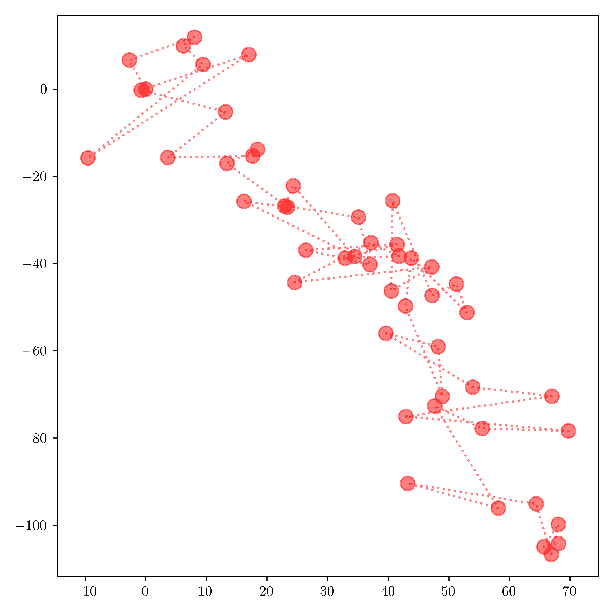

# 6.1. 动机示例：跟踪位置

> 原文：[`mmids-textbook.github.io/chap06_prob/01_motiv/roch-mmids-prob-motiv.html`](https://mmids-textbook.github.io/chap06_prob/01_motiv/roch-mmids-prob-motiv.html)

假设我们让一只赛博柯基在大型公园里自由奔跑。我们想知道它在任何时间的位置。为此，它植入了一个位置设备，该设备向跟踪应用程序发送信号。

这里是一个我们可能拥有的数据示例，我们将在本章后面通过模拟来解释。这些点是在固定时间间隔内记录的位置。虚线有助于追踪记录的时间顺序。

按照惯例，我们从 $(0,0)$ 开始。注意轨迹是如何蜿蜒的。一个问题可能是记录位置的时间间隔太远。但实际上，还有一个问题：跟踪设备是**不准确的**。

为了更好地估计真实轨迹，自然地，我们试图模拟测量中的噪声以及动力学本身。概率模型非常适合这个目的。

在本章中，我们将遇到各种这样的模型，并展示如何利用它们来估计未知状态（或参数）。特别是条件独立性将发挥关键作用。

我们将在本章后面回到位置跟踪。
