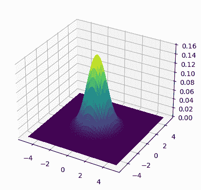

# 6.2\. 背景：参数族和最大似然估计介绍

> 原文：[`mmids-textbook.github.io/chap06_prob/02_parametric/roch-mmids-prob-parametric.html`](https://mmids-textbook.github.io/chap06_prob/02_parametric/roch-mmids-prob-parametric.html)

在本节中，我们介绍了一些用于构建统计模型的基本概念。我们还定义了一个常见的分布族，即指数族。

在本主题的整个讨论中，所有形式证明都是在有限支撑的离散分布的假设下进行的，以避免不必要的复杂性并专注于概念。但我们讨论的每件事都可以适应连续分布。

概率分布的参数族$\idx{parametric family}\xdi$ 是更复杂模型的基本构建块。参数族是指一个集合 $\{p_{\btheta}:\btheta \in \Theta\}$，其中 $p_{\btheta}$ 是在集合 $\S_{\btheta}$ 上的概率分布，$\btheta$ 是一个向量值参数。

**EXAMPLE:** **(伯努利)** 随机变量 $X$ 是参数 $q \in [0,1]$ 的伯努利分布 $\idx{Bernoulli}\xdi$，记作 $X \sim \mathrm{Ber}(q)$，如果它在 $\S_X = \{0,1\}$ 中取值，且 $\P[X=1] = q$。改变 $q$ 会产生伯努利分布族。 $\lhd$

在这里，我们专注于指数族，它包括许多常见的分布（包括伯努利分布）。

## 6.2.1\. 指数族#

在数据科学中，一个特别有用的概率分布类是 [指数族](https://en.wikipedia.org/wiki/Exponential_family#Vector_parameter)，它包括许多已知的案例。

**DEFINITION** **(指数族 - 离散情况)** $\idx{exponential family}\xdi$ 一个参数化的概率分布集合 $\{p_{\btheta}:\btheta \in \Theta\}$ 在离散空间 $\S$ 上是指数族，如果它可以写成以下形式

$$ p_{\btheta}(\mathbf{x}) = \frac{1}{Z(\btheta)} h(\mathbf{x}) \exp\left(\btheta^T \bphi(\mathbf{x})\right) $$

其中 $\btheta \in \mathbb{R}^m$ 是典型参数，$\bphi : \S \to \mathbb{R}^m$ 是充分统计量，$Z(\btheta)$ 是配分函数$\idx{partition function}\xdi$。引入对数配分函数$\idx{log-partition function}\xdi$ $A(\btheta) = \log Z(\btheta)$ 并重新写成

$$ p_{\btheta}(\mathbf{x}) = h(\mathbf{x}) \exp\left(\btheta^T \bphi(\mathbf{x}) - A(\btheta)\right). $$

$\natural$

**EXAMPLE:** **(伯努利，继续)** 对于 $x \in \{0,1\}$，当 $0 < q < 1$ 时，$\mathrm{Ber}(q)$ 分布可以写成

$$\begin{align*} q^{x} (1-q)^{1-x} &= (1-q) \left(\frac{q}{1-q}\right)^x\\ &= (1-q) \exp\left[x \log \left(\frac{q}{1-q}\right)\right]\\ &= \frac{1}{Z(\theta)} h(x) \exp(\theta \,\phi(x)) \end{align*}$$

其中我们定义 $h(x) \equiv 1$，$\phi(x) = x$，$\theta = \log \left(\frac{q}{1-q}\right)$，并且由于 $Z(\theta)$ 在 $p_\theta$ 中作为归一化常数，

$$ Z(\theta) = \sum_{x \in \{0,1\}} h(x) \exp(\theta \,\phi(x)) = 1 + e^\theta. $$

$\lhd$

以下是一个重要的推广。回忆一下，i.i.d. 是独立同分布的缩写。我们使用约定 $0! = 1$。

**EXAMPLE:** **(分类和多项式)** 一个分类变量$\idx{categorical}\xdi$ $\mathbf{Y}$ 取 $K \geq 2$ 个可能值。一个标准的选择是使用独热编码$\idx{one-hot encoding}\xdi$ $\S = \{\mathbf{e}_i : i=1,\ldots,K\}$，其中 $\mathbf{e}_i$ 是 $\mathbb{R}^K$ 中的第 $i$ 个标准基。分布由设置概率 $\bpi = (\pi_1,\ldots,\pi_K)$ 确定

$$ \pi_i = \P[\mathbf{Y} = \mathbf{e}_i]. $$

我们将此记为 $\mathbf{Y} \sim \mathrm{Cat}(\bpi)$，并假设对于所有 $i$，$\pi_i > 0$。

为了说明这是一个指数族，我们将概率质量函数在 $\mathbf{x} = (x_1,\ldots,x_K)$ 处写为

$$ \prod_{i=1}^K \pi_i^{x_i} = \exp\left(\sum_{i=1}^K x_i \log \pi_i \right). $$

因此，我们可以取 $h(\mathbf{x}) \equiv 1$，$\btheta = (\log \pi_i)_{i=1}^K$，$\bphi(\mathbf{x}) = (x_i)_{i=1}^K$，且 $Z(\btheta) \equiv 1$。如果我们认为 $n$ 是固定的，那么这是一个指数族。

[多项式分布](https://en.wikipedia.org/wiki/Multinomial_distribution)$\idx{multinomial}\xdi$ 作为独立分类变量的和出现。设 $n \geq 1$ 为试验次数（或样本数），设 $\mathbf{Y}_1,\ldots,\mathbf{Y}_n$ 是独立同分布的 $\mathrm{Cat}(\bpi)$。定义 $\mathbf{X} = \sum_{i=1}^n \mathbf{Y}_i$。在 $\mathbf{X}$ 处的概率质量函数为

$$ \mathbf{x} = (x_1,\ldots,x_K) \in \left\{ \mathbf{x} \in \{0,1,\ldots,n\}^K : \sum_{i=1}^K x_i = n \right\}=: \S $$

is

$$ \frac{n!}{x_1!\cdots x_K!} \prod_{i=1}^K \pi_i^{x_i} = \frac{n!}{x_1!\cdots x_K!} \exp\left(\sum_{i=1}^K x_i \log \pi_i\right) $$

我们还可以取 $h(\mathbf{x}) = \frac{n!}{x_1!\cdots x_K!}$，$\btheta = (\log \pi_i)_{i=1}^K$，$\bphi(\mathbf{x}) = (x_i)_{i=1}^K$，且 $Z(\btheta) \equiv 1$。

我们使用符号 $\mathbf{X} \sim \mathrm{Mult}(n, \bpi)$。$\lhd$

虽然我们迄今为止一直关注离散分布，但可以通过用密度函数替换质量函数来调整上述定义。我们给出两个重要的例子。

我们需要为我们的第一个例子定义一些概念。

矩阵 $A \in \mathbb{R}^{d \times d}$ 的迹 $\idx{trace}\xdi$，记作 $\mathrm{tr}(A)$，是其对角线元素的和。我们将需要以下迹恒等式，其证明留作练习：$\mathrm{tr}(ABC) = \mathrm{tr}(CAB) = \mathrm{tr}(BCA)$ 对于任何 $A, B, C$ 矩阵，其中 $AB$，$BC$ 和 $CA$ 都是定义良好的。

方阵 $A$ 的 [行列式](https://en.wikipedia.org/wiki/Determinant)$\idx{行列式}\xdi$ 表示为 $|A|$。对于我们的目的，考虑对称、正半定矩阵就足够了，其行列式是特征值（包括重复）的乘积。回忆一下，我们证明了对称矩阵的特征值（包括重复）序列是唯一的（在意义上，任何两个谱分解都有相同的特征值序列）。

对称、正定矩阵 $A \in \mathbb{R}^{d \times d}$ 必然是可逆的。实际上，它有一个谱分解

$$ A = Q \Lambda Q^T = \sum_{i=1}^d \lambda_i \mathbf{q}_i \mathbf{q}_i^T $$

其中 $\lambda_1 \geq \cdots \geq \lambda_d > 0$ 且 $\mathbf{q}_1, \ldots, \mathbf{q}_d$ 是正交归一。然后

$$ A^{-1} = Q \Lambda^{-1} Q^T. $$

要看到这一点，请注意

$$ A A^{-1} = Q \Lambda Q^T Q \Lambda^{-1} Q^T = Q Q^T = I_{d \times d}. $$

最后的等式来自于 $Q Q^T$ 是在正交归一基 $\mathbf{q}_1,\ldots,\mathbf{q}_d$ 上的正交投影的事实。同样，$A^{-1} A = I_{d \times d}$.

**示例：** **(多元高斯)** $\idx{多元正态}\xdi$ 在 $\mathbb{R}^d$ 上的多元高斯$\idx{多元高斯}\xdi$向量 $\mathbf{X} = (X_1,\ldots,X_d)$ 具有均值 $\bmu \in \mathbb{R}^d$ 和正定协方差矩阵 $\bSigma \in \mathbb{R}^{d \times d}$，其概率密度函数

$$ f_{\bmu, \bSigma}(\mathbf{x}) = \frac{1}{(2\pi)^{d/2} \,|\bSigma|^{1/2}} \exp\left(-\frac{1}{2}(\mathbf{x} - \bmu)^T \bSigma^{-1} (\mathbf{x} - \bmu)\right). $$

我们使用符号 $\mathbf{X} \sim N_d(\bmu, \bSigma)$.

可以证明，均值确实是

$$ \E[\mathbf{X}] = \bmu $$

并且协方差矩阵是

$$ \E[(\mathbf{X} - \bmu)(\mathbf{X} - \bmu)^T] = \E[\mathbf{X} \mathbf{X}^T] - \bmu \bmu^T = \bSigma. $$

在双变量$\idx{双变量高斯}\xdi$情况（即当 $d = 2$）$\idx{双变量正态}\xdi$中，协方差矩阵简化为

$$\begin{split} \bSigma = \begin{bmatrix} \sigma_1² & \rho \sigma_1 \sigma_2 \\ \rho \sigma_1 \sigma_2 & \sigma_2² \end{bmatrix} \end{split}$$

其中 $\sigma_1²$ 和 $\sigma_2²$ 分别是 $X_1$ 和 $X_2$ 的方差，并且

$$ \rho = \frac{\mathrm{Cov}[X_1,X_2]}{\sigma_1 \sigma_2} $$

是相关系数。回忆一下，根据 *柯西-施瓦茨不等式*，它位于 $[-1,1]$ 之间。

将密度重新写为

$$ f_{\bmu, \bSigma}(\mathbf{x}) = \frac{e^{-(1/2) \bmu^T \bSigma^{-1} \bmu}}{(2\pi)^{d/2} \,|\bSigma|^{1/2}} \exp\left(- \mathbf{x}^T \bSigma^{-1}\bmu - \frac{1}{2} \mathrm{tr}\left(\mathbf{x} \mathbf{x}^T \bSigma^{-1}\right)\right) $$

其中我们在指数的第一项中使用了 $\bSigma^{-1}$ 的对称性，在第二项中使用了之前的迹恒等式。括号中的表达式在 $\mathbf{x}$ 和 $\mathbf{x} \mathbf{x}^T$ 的条目上是线性的，然后可以作为充分统计量（形式上，使用[向量化](https://en.wikipedia.org/wiki/Vectorization_%28mathematics%29)）。确实请注意

$$ \mathbf{x}^T \bSigma^{-1}\bmu = \sum_{i=1}^d x_i (\bSigma^{-1}\bmu)_i $$

和

$$ \mathrm{tr}\left(\mathbf{x} \mathbf{x}^T \bSigma^{-1}\right) = \sum_{i = 1}^d \left(\sum_{j=1}^d (\mathbf{x} \mathbf{x}^T)_{i,j} (\bSigma^{-1})_{j,i}\right) = \sum_{i = 1}^d \sum_{j=1}^d x_i x_j (\bSigma^{-1})_{j,i}. $$

因此我们可以取

$$ \bphi(\mathbf{x}) = (x_1,\ldots,x_d, x_1 x_1, \ldots, x_d x_1, x_1 x_2, \ldots, x_d x_2, \ldots, x_1 x_d, \ldots, x_d x_d) $$

和 $h (\mathbf{x}) \equiv 1$. 显式地表达 $Z(\btheta)$ 并不简单。但请注意，$\btheta$ 包含 $\bSigma^{-1}$ 的所有条目，从中可以计算 $\bSigma$（例如，从[Cramer 的规则](https://en.wikipedia.org/wiki/Cramer%27s_rule#Finding_inverse_matrix)），进而从 $\bSigma^{-1}\bmu$ 的条目中提取出 $\bmu$。因此，归一化因子 $\frac{(2\pi)^{d/2} \,|\bSigma|^{1/2}}{e^{-(1/2) \bmu^T \bSigma^{-1} \bmu}}$ 在原则上可以用 $\btheta$ 来表达。

这表明多元正态分布是一个指数族。

矩阵 $\bLambda = \bSigma^{-1}$ 也被称为精度矩阵。

或者，设 $\mathbf{Z}$ 为标准正态 $d$-向量，设 $\bmu \in \mathbb{R}^d$，设 $\bSigma \in \mathbb{R}^{d \times d}$ 为正定矩阵。那么变换后的随机变量 $\mathbf{X} = \bmu + \bSigma \mathbf{Z}$ 是具有均值 $\bmu$ 和协方差矩阵 $\bSigma$ 的多元高斯分布。这可以使用[变量变换公式](https://en.wikipedia.org/wiki/Probability_density_function#Function_of_random_variables_and_change_of_variables_in_the_probability_density_function)来证明（试试看！）。$\lhd$

**数值角**: 下面的代码，用于绘制二元情况下的密度图，由 ChatGPT 从[gauss_plot_2d.ipynb](https://github.com/probml/pyprobml/blob/master/notebooks/book1/03/gauss_plot_2d.ipynb)改编而来。

**CHAT & LEARN** 请你的喜欢的 AI 聊天机器人解释这段代码！尝试不同的协方差矩阵。([在 Colab 中打开](https://colab.research.google.com/github/MMiDS-textbook/MMiDS-textbook.github.io/blob/main/just_the_code/roch_mmids_chap_prob_notebook.ipynb)) $\ddagger$

```py
from scipy.stats import multivariate_normal

def gaussian_pdf(X, Y, mean, cov):
    xy = np.stack([X.flatten(), Y.flatten()], axis=-1)
    return multivariate_normal.pdf(
        xy, mean=mean, cov=cov).reshape(X.shape)

def make_surface_plot(X, Y, Z):
    fig = plt.figure()
    ax = fig.add_subplot(111, projection='3d')
    surf = ax.plot_surface(
        X, Y, Z, cmap=plt.cm.viridis, antialiased=False)
    plt.show() 
```

我们绘制了均值为 $(0,0)$ 的密度图，使用了两个不同的协方差矩阵：

$$\begin{split} \bSigma_1 = \begin{bmatrix} 1.0 & 0 \\ 0 & 1.0 \end{bmatrix} \quad \text{and} \quad \bSigma_2 = \begin{bmatrix} \sigma_1² & \rho \sigma_1 \sigma_2 \\ \rho \sigma_1 \sigma_2 & \sigma_2² \end{bmatrix} \end{split}$$

其中 $\sigma_1 = 1.5$, $\sigma_2 = 0.5$ 和 $\rho = -0.75$。

<details class="hide above-input"><summary aria-label="Toggle hidden content">显示代码单元格源代码 隐藏代码单元格源代码</summary>

```py
start_point = 5
stop_point = 5
num_samples = 100
points = np.linspace(-start_point, stop_point, num_samples)
X, Y = np.meshgrid(points, points)

mean = np.array([0., 0.])
cov = np.array([[1., 0.], [0., 1.]])
make_surface_plot(X, Y, gaussian_pdf(X, Y, mean, cov)) 
```</details> <details class="hide above-input"><summary aria-label="Toggle hidden content">显示代码单元格源代码 隐藏代码单元格源代码</summary>

```py
mean = np.array([0., 0.])
cov = np.array([[1.5 ** 2., -0.75 * 1.5 * 0.5], 
                 [-0.75 * 1.5 * 0.5, 0.5 ** 2.]])
make_surface_plot(X, Y, gaussian_pdf(X, Y, mean, cov)) 
```</details> 

$\unlhd$

我们接下来要描述的[Dirichlet 分布](https://en.wikipedia.org/wiki/Dirichlet_distribution)，是一种自然概率分布，它覆盖了概率分布。特别是，它在[贝叶斯数据分析](https://en.wikipedia.org/wiki/Bayesian_statistics)中作为分类和多项式分布参数的[先验](https://en.wikipedia.org/wiki/Prior_probability)，很大程度上是因为一个称为[共轭先验](https://en.wikipedia.org/wiki/Conjugate_prior)的性质。我们在这里不会描述贝叶斯方法。

**EXAMPLE:** **(Dirichlet)** $\idx{Dirichlet}\xdi$ Dirichlet 分布是 $(K-1)$-simplex 上的分布

$$ \S = \Delta_{K} := \left\{ \mathbf{x} = (x_1, \ldots, x_K) : \mathbf{x} \geq \mathbf{0},\ \sum_{i=1}^K x_i = 1 \right\}. $$

它的参数是 $\balpha = (\alpha_1, \ldots, \alpha_K) \in \mathbb{R}$ 并且密度是

$$ f_{\balpha}(\mathbf{x}) = \frac{1}{B(\balpha)} \prod_{i=1}^K x_i^{\alpha_i-1}, \quad \mathbf{x} \in \Delta_{K} $$

其中归一化常数 $B(\balpha)$ 是[多元 Beta 函数](https://en.wikipedia.org/wiki/Beta_function#Multivariate_beta_function)。

将密度重新写为

$$ \frac{1}{B(\balpha)} \prod_{i=1}^K x_i^{\alpha_i-1} = \frac{1}{B(\balpha)} \frac{1}{\prod_{i=1}^K x_i} \exp\left(\sum_{i=1}^K \alpha_i \log x_i\right) $$

表明这是一个具有规范参数 $\balpha$ 和充分统计量 $(\log x_i)_{i=1}^K$ 的指数家族。 $\lhd$

更多示例请见[这里](https://en.wikipedia.org/wiki/Exponential_family#Table_of_distributions)。特别是，观察到一个分布可以作为指数家族有几种不同的表示形式。

**数值角:** 在 NumPy 中，正如我们之前所看到的，模块 `numpy.random` 提供了一种从各种标准分布中进行采样的方法。我们首先使用一个 [随机种子](https://en.wikipedia.org/wiki/Random_seed) 初始化 [伪随机数生成器](https://en.wikipedia.org/wiki/Pseudorandom_number_generator)$\idx{伪随机数生成器}\xdi$。回想一下，它允许结果可重现：使用相同的种子再次产生相同的结果。

```py
seed = 535
rng = np.random.default_rng(seed) 
```

这里有一些可用的 [概率分布](https://numpy.org/doc/stable/reference/random/generator.html#distributions) 列表。

```py
p = 0.1
N = 5
print(rng.binomial(1, p, size=N)) 
```

```py
[1 0 0 0 0] 
```

这里有一些其他示例。

```py
p = [0.1, 0.2, 0.7]
n = 100
print(rng.multinomial(n, p, size=N)) 
```

```py
[[ 9 12 79]
 [ 5 20 75]
 [13 18 69]
 [ 8 18 74]
 [ 8 24 68]] 
```

```py
mu = np.array([0.1, -0.3])
sig = np.array([[2., 0.],[0., 3.]])
print(rng.multivariate_normal(mu, sig, size=N)) 
```

```py
[[-0.7275232   2.66555155]
 [ 0.45641186 -2.65834344]
 [ 1.13188325  0.43920735]
 [ 0.69846716  2.49891659]
 [ 0.91725117  1.89618733]] 
```

$\unlhd$

**知识检查:** 已知形状参数 $k > 0$ 的韦伯尔分布具有以下形式

$$ f(x; \lambda) = \frac{k}{\lambda} \left(\frac{x}{\lambda}\right)^{k-1} e^{-(x/\lambda)^k}, $$

对于 $x \geq 0$，其中 $\lambda > 0$。

它的指数族形式的充分统计量是什么？

a) $x$

b) $\log x$

c) $x^{k-1}$

d) $x^k$

e) $(\log x, x^k)$

$\checkmark$

## 6.2.2\. 参数估计#

当通过分布的参数族建模数据时，参数必须从数据本身确定。在典型情况下，我们假设数据由 $n$ 个独立样本 $\mathbf{X}_1,\ldots,\mathbf{X}_n$ 组成，这些样本来自参数族 $p_{\btheta}$，其中 $\btheta \in \Theta$ 是未知的。存在许多用于估计 $\btheta$ 的方法，具体取决于上下文。在这里，我们关注 [最大似然估计](https://en.wikipedia.org/wiki/Maximum_likelihood_estimation)。它具有许多 [良好的理论特性](https://en.wikipedia.org/wiki/Maximum_likelihood_estimation#Properties)，我们在此不进行描述，以及 [缺点](https://stats.stackexchange.com/questions/261056/why-does-maximum-likelihood-estimation-have-issues-with-over-fitting)。

最大似然估计背后的思想简单直观：我们选择最大化观察数据概率的参数。

**定义** **(最大似然估计器)** $\idx{最大似然}\xdi$ 假设 $\mathbf{X}_1,\ldots,\mathbf{X}_n$ 是从参数族 $p_{\btheta^*}$ 中抽取的 $n$ 个独立样本，其中 $\btheta^* \in \Theta$ 是未知的。$\btheta$ 的最大似然估计定义为

$$ \hat\btheta_{\mathrm{MLE}} \in \arg\max\left\{ \prod_{i=1}^n p_{\btheta}(\mathbf{X}_i) \,:\, \btheta \in \Theta \right\}. $$

有时使用负对数似然 (NLL)$\idx{负对数似然}\xdi$ 是很有用的

$$ L_n(\btheta; \{\mathbf{X}_i\}_{i=1}^n) = - \sum_{i=1}^n \log p_{\btheta}(\mathbf{X}_i), $$

在这种情况下，我们是在最小化。 $\natural$

**EXAMPLE:** **(Biased coin)** 假设我们观察到一个未知概率 $\theta^*$ 产生 $1$ 的偏硬币的 $n$ 次抛掷 $X_1,\ldots, X_n \in \{0,1\}$。我们假设这些抛掷是独立的。我们计算参数 $\theta$ 的最大似然估计值。

定义是

$$ \hat\theta_{\mathrm{MLE}} \in \arg\min\left\{ L_n(\theta; \{X_i\}_{i=1}^n) \,:\, \theta \in \Theta = [0,1] \right\} $$

其中，使用我们之前的伯努利例子，NLL 是

$$\begin{align*} L_n(\theta; \{X_i\}_{i=1}^n) &= - \sum_{i=1}^n \log p_{\theta}(X_i)\\ &= - \sum_{i=1}^n \log \left[\theta^{X_i} (1- \theta)^{1 -X_i}\right]\\ &= - \sum_{i=1}^n \left[ X_i \log \theta + (1 -X_i) \log (1- \theta)\right]. \end{align*}$$

我们计算 $L_n(\theta; \{X_i\}_{i=1}^n)$ 关于 $\theta$ 的第一和二阶导数：

$$\begin{align*} \frac{\mathrm{d}}{\mathrm{d} \theta}L_n(\theta; \{X_i\}_{i=1}^n) &= - \sum_{i=1}^n \left[ \frac{X_i}{\theta} - \frac{1 -X_i}{1- \theta}\right]\\ &= - \frac{\sum_{i=1}^n X_i}{\theta} + \frac{n - \sum_{i=1}^n X_i}{1- \theta} \end{align*}$$

和

$$\begin{align*} \frac{\mathrm{d}²}{\mathrm{d} \theta²}L_n(\theta; \{X_i\}_{i=1}^n) &= \frac{\sum_{i=1}^n X_i}{\theta²} + \frac{n - \sum_{i=1}^n X_i}{(1- \theta)²}. \end{align*}$$

二阶导数非负，因此 NLL 是凸的。为了找到全局最小值，只需找到驻点。

我们使 NLL 的导数等于 $0$

$$\begin{align*} &0 = - \frac{\sum_{i=1}^n X_i}{\theta} + \frac{n - \sum_{i=1}^n X_i}{1- \theta}\\ & \iff \frac{\sum_{i=1}^n X_i}{\theta} = \frac{n - \sum_{i=1}^n X_i}{1- \theta}\\ & \iff (1- \theta)\sum_{i=1}^n X_i = \theta \left(n - \sum_{i=1}^n X_i \right)\\ & \iff \sum_{i=1}^n X_i = \theta n. \end{align*}$$

因此

$$ \hat\theta_{\mathrm{MLE}} = \frac{\sum_{i=1}^n X_i}{n}. $$

这实际上是一个自然的估计器：$1$ 的经验频率。 $\lhd$

我们对最大似然估计器给出另一种观点。假设对于所有 $\btheta \in \Theta$，$p_{\btheta}$ 都在固定有限集 $\X$ 上。给定样本 $\mathbf{X}_1,\ldots,\mathbf{X}_n$，对于每个 $\mathbf{x} \in \X$，令

$$ N_\mathbf{x} = \sum_{i=1}^n \mathbf{1}_{\{\mathbf{X}_i = \mathbf{x}\}} $$

计算数据中 $\mathbf{x}$ 出现的次数，并令

$$ \hat\mu_n(\mathbf{x}) = \frac{N_\mathbf{x}}{n} $$

为样本中 $\mathbf{x}$ 的经验频率。观察 $\hat\mu_n$ 是 $\X$ 上的一个概率分布。

以下定理用 [Kullback-Liebler divergence](https://en.wikipedia.org/wiki/Kullback%E2%80%93Leibler_divergence) 来描述最大似然估计器，这在前面一节中已介绍。

对于两个概率分布

$$ \mathbf{p}, \mathbf{q} \in \Delta_K := \left\{ (p_1,\ldots,p_K) \in [0,1]^K \,:\, \sum_{k=1}^K p_k = 1 \right\}, $$

它被定义为

$$ \mathrm{KL}(\mathbf{p} \| \mathbf{q}) = \sum_{i=1}^K p_i \log \frac{p_i}{q_i} $$

其中，我们只需将自身限制在 $\mathbf{q} > \mathbf{0}$ 的情况下，并且使用约定 $0 \log 0 = 0$（这样 $p_i = 0$ 的项对总和的贡献为 $0$）。

注意到 $\mathbf{p} = \mathbf{q}$ 意味着 $\mathrm{KL}(\mathbf{p} \| \mathbf{q}) = 0$。我们证明 $\mathrm{KL}(\mathbf{p} \| \mathbf{q}) \geq 0$，这是一个被称为 *吉布斯不等式* 的结果。

**定理** **(吉布斯)** $\idx{Gibbs' inequality}\xdi$ 对于任何 $\mathbf{p}, \mathbf{q} \in \Delta_K$ 且 $\mathbf{q} > \mathbf{0}$，

$$ \mathrm{KL}(\mathbf{p} \| \mathbf{q}) \geq 0. $$

$\sharp$

*证明*: 设 $I$ 为满足 $p_i > 0$ 的索引 $i$ 的集合。因此

$$ \mathrm{KL}(\mathbf{p} \| \mathbf{q}) = \sum_{i \in I} p_i \log \frac{p_i}{q_i}. $$

可以证明对于所有 $x > 0$，$\log x \leq x - 1$（试试看！）。所以

$$\begin{align*} \mathrm{KL}(\mathbf{p} \| \mathbf{q}) &= - \sum_{i \in I} p_i \log \frac{q_i}{p_i}\\ &\geq - \sum_{i \in I} p_i \left(\frac{q_i}{p_i} - 1\right)\\ &= - \sum_{i \in I} q_i + \sum_{i \in I} p_i\\ &= - \sum_{i \in I} q_i + 1\\ &\geq 0 \end{align*}$$

其中，我们在第一行使用了 $\log z^{-1} = - \log z$ 的性质，并在第四行使用了 $p_i = 0$ 对于所有 $i \notin I$ 的事实。 $\square$

**定理** **(通过 KL 的 MLE)** $\idx{MLE via KL theorem}\xdi$ 假设对于所有 $\btheta \in \Theta$，$p_{\btheta}$ 在一个固定的有限集合 $\X$ 上有支撑，并且对于所有 $\mathbf{x} \in \X$，$p_{\btheta}(\mathbf{x}) > 0$。给定从 $p_{\btheta^*}$ 中抽取的样本 $\mathbf{X}_1,\ldots,\mathbf{X}_n$，令 $\{\hat\mu_n(\mathbf{x})\}_{\mathbf{x} \in \X}$ 为相应的经验频率。那么 $\btheta$ 的最大似然估计量 $\hat\btheta_{\mathrm{MLE}}$ 也是以下方程的解

$$ \hat\btheta_{\mathrm{MLE}} \in \arg\min\left\{ \mathrm{KL}(\hat{\mu}_n \| p_{\btheta}) \,:\, \btheta \in \Theta \right\}. $$

$\sharp$

*证明思路*: 通过操作负对数似然来揭示其与 Kullback-Liebler 散度的关系。

*证明*: 我们可以将负对数似然重写为

$$ L_n(\btheta; \{\mathbf{X}_i\}_{i=1}^n) = - \sum_{i=1}^n \log p_{\btheta}(\mathbf{X}_i) = - \sum_{\mathbf{x} \in \X} N_{\mathbf{x}} \log p_{\btheta}(\mathbf{x}). $$

为了揭示 Kullback-Liebler 散度，我们进一步将前面的方程转换为

$$\begin{align*} \frac{1}{n} L_n(\btheta; \{\mathbf{X}_i\}_{i=1}^n) &= - \frac{1}{n} \sum_{\mathbf{x} \in \X} N_{\mathbf{x}} \log p_{\btheta}(\mathbf{x})\\ &= \sum_{\mathbf{x} \in \X} (N_{\mathbf{x}}/n) \log \frac{N_{\mathbf{x}}/n}{p_{\btheta}(\mathbf{x})} - \sum_{\mathbf{x} \in \X} (N_{\mathbf{x}}/n) \log (N_{\mathbf{x}}/n)\\ &= \sum_{\mathbf{x} \in \X} \hat\mu_n(\mathbf{x}) \log \frac{\hat\mu_n(\mathbf{x})}{p_{\btheta}(\mathbf{x})} - \sum_{\mathbf{x} \in \X} \hat\mu_n(\mathbf{x}) \log \hat\mu_n(\mathbf{x})\\ &= \mathrm{KL}(\hat{\mu}_n \| p_{\btheta}) + \mathrm{H}(\hat\mu_n), \end{align*}$$

其中，第二项被称为 $\hat\mu_n$ 的 [熵](https://en.wikipedia.org/wiki/Entropy_(information_theory))$\idx{熵}\xdi$。

因为 $\mathrm{H}(\hat\mu_n)$ 不依赖于 $\btheta$，最小化 $L_n(\btheta; \{\mathbf{X}_i\}_{i=1}^n)$ 等价于最小化 $\mathrm{KL}(\hat{\mu}_n \| p_{\btheta})$，正如所声称的那样。 $\square$

也就是说，最大似然估计器选择与 $\hat\mu_n$ 在 Kullback-Liebler 散度上最接近的参数分布。可以将其视为在 Kullback-Liebler 距离概念下将 $\hat\mu_n$ “投影”到 $\{p_{\btheta} : \btheta \in \Theta\}$ 空间中。

**EXAMPLE:** **(特殊情况)** 一个特殊情况是当 $\X$ 是有限的，$\btheta = (\theta_\mathbf{x})_{\mathbf{x} \in \X}$ 是 $\X$ 上的概率分布，且 $p_{\btheta} = \btheta$。也就是说，我们考虑 $\X$ 上所有概率分布的类别。给定从 $p_{\btheta^*}$ 中抽取的样本 $\mathbf{X}_1,\ldots,\mathbf{X}_n$，在这种情况下我们有

$$ \mathrm{KL}(\hat{\mu}_n \| p_{\btheta}) = \sum_{\mathbf{x} \in \X} \hat\mu_n(\mathbf{x}) \log \frac{\hat\mu_n(\mathbf{x})}{p_{\btheta}(\mathbf{x})} = \sum_{\mathbf{x} \in \X} \hat\mu_n(\mathbf{x}) \log \frac{\hat\mu_n(\mathbf{x})}{\theta_\mathbf{x}}, $$

其中，根据惯例，如果 $\hat\mu_n(\mathbf{x}) = 0$，则 $\hat\mu_n(\mathbf{x}) \log \frac{\hat\mu_n(\mathbf{x})}{\theta_\mathbf{x}} = 0$ 对于任何 $\theta_\mathbf{x}$ 都成立。因此，让 $\mathbb{X}_n = \{\mathbf{X}_1,\ldots,\mathbf{X}_n\}$ 成为样本中遇到的唯一值集合（忽略重复），我们有

$$ \mathrm{KL}(\hat{\mu}_n \| p_{\btheta}) = \sum_{\mathbf{x} \in \mathbb{X}_n} \hat\mu_n(\mathbf{x}) \log \frac{\hat\mu_n(\mathbf{x})}{\theta_\mathbf{x}}. $$

注意到 $\sum_{\mathbf{x} \in \mathbb{X}_n} \hat\mu_n(\mathbf{x}) = 1$.

我们之前已经建立了 *吉布斯不等式*，它说：对于任何 $\mathbf{p}, \mathbf{q} \in \Delta_K$ 且 $\mathbf{q} > \mathbf{0}$，都有 $\mathrm{KL}(\mathbf{p} \| \mathbf{q}) \geq 0$。

最小化 $\mathrm{KL}(\hat{\mu}_n \| p_{\btheta}) = 0$ 可以通过将所有 $\mathbf{x} \in \mathbb{X}_n$ 的 $\btheta_{\mathbf{x}}$ 设置为 $\hat\mu_n(\mathbf{x})$，以及所有 $\mathbf{x} \notin \mathbb{X}_n$ 的 $\btheta_{\mathbf{x}}$ 设置为 0 来实现。条件

$$ \sum_{\mathbf{x} \in \X} \btheta_{\mathbf{x}} = \sum_{\mathbf{x} \in \mathbb{X}_n} \btheta_{\mathbf{x}} + \sum_{\mathbf{x} \notin \mathbb{X}_n} \btheta_{\mathbf{x}} = \sum_{\mathbf{x} \in \mathbb{X}_n} \hat\mu_n(\mathbf{x}) = 1, $$

则满足。

因此在这种情况下，$\hat\mu_n$ 是一个最大似然估计量。

这里的一个特殊情况是 *有偏硬币* 例子。$\lhd$

**聊与学** 探索贝叶斯参数估计的概念。询问您最喜欢的 AI 聊天机器人贝叶斯参数估计与最大似然估计有何不同，并讨论它们的相对优缺点。以下是一些可能的后续问题。(1) 获取使用简单数据集的示例实现。(2) 分类别和多项分布与 Dirichlet 分布相关。询问它们之间的关系以及 Dirichlet 分布如何用于这些分布的贝叶斯推断。$\ddagger$

## 6.2.3\. 参数估计对于指数族#

对于指数族，最大似然估计具有特别自然的形式。我们将在离散情况下提供详细说明。

**定理** **(指数族的最大似然估计量)** $\idx{指数族的最大似然估计量}\xdi$ 假设 $p_{\btheta}$ 采用指数族形式

$$ p_{\btheta}(\mathbf{x}) = h(\mathbf{x}) \exp\left(\btheta^T \bphi(\mathbf{x}) - A(\btheta)\right), $$

支持集 $\S$ 是有限的，且 $A$ 在开集 $\Theta$ 上是两次连续可微的。设 $\mathbf{X}_1,\ldots,\mathbf{X}_n$ 是从参数族 $p_{\btheta^*}$ 中抽取的 $n$ 个独立样本，其中 $\btheta^* \in \Theta$ 是未知的。那么 $L_n(\btheta; \{\mathbf{X}_i\}_{i=1}^n)$，作为 $\btheta$ 的函数，是凸的，并且 $\btheta$ 的最大似然估计量（如果存在）解决了以下矩匹配方程组

$$ \E[\bphi(\mathbf{X})] = \frac{1}{n} \sum_{i=1}^n \bphi(\mathbf{X}_i), $$

其中 $\mathbf{X} \sim p_{\hat\btheta_{\mathrm{MLE}}}$。$\sharp$

回想一下，随机向量 $\mathbf{Z}$ 的协方差矩阵，其值在 $\mathbb{R}^m$ 中，且各分量具有有限的方差，定义为 $\mathrm{K}_{\mathbf{Z}, \mathbf{Z}} = \E[(\mathbf{Z} - \E[\mathbf{Z}])(\mathbf{Z} - \E[\mathbf{Z}])^T]$，它是一个正半定矩阵。它有时也记为 $\bSigma_\mathbf{Z}$。

函数 $A$ 具有一些值得强调的性质，这些性质将在证明中使用。

**引理** **(A 的导数)** 假设 $p_{\btheta}$ 采用指数族形式

$$ p_{\btheta}(\mathbf{x}) = h(\mathbf{x}) \exp\left(\btheta^T \bphi(\mathbf{x}) - A(\btheta)\right), $$

支持集 $\S$ 是有限的，且 $A$ 在开集 $\Theta$ 上是两次连续可微的。那么

$$ \nabla A(\theta) = \E[\phi(\mathbf{X})] \qquad \text{and} \qquad \mathbf{H}_A (\theta) = \mathrm{K}_{\phi(\mathbf{X}), \phi(\mathbf{X})}, $$

其中 $\mathbf{X} \sim p_{\theta}$. $\flat$

*证明思路:* 直接计算得出。

*证明:* 我们首先观察到

$$ A(\theta) = \log Z(\theta) = \log\left(\sum_{\mathbf{x} \in \S} h(\mathbf{x}) \exp(\theta^T \phi(\mathbf{x}))\right), $$

其中我们使用了这样一个事实，根据定义，$Z(\theta)$ 是 $p_{\theta}$ 的归一化常数。特别是，由于 $A(\theta)$ 是有限加权指数和的对数，该函数 $A(\theta)$ 是连续可微的。因此，作为 $\theta$ 的函数，$p_{\theta}(\mathbf{x})$ 也是连续可微的。

从上面的公式和微积分的基本规则，

$$\begin{align*} \frac{\partial}{\partial \theta_j} A(\theta) &= \frac{\partial}{\partial \theta_j} \log\left(\sum_{\mathbf{x} \in \S} h(\mathbf{x}) \exp(\theta^T \phi(\mathbf{x}))\right)\\ &= \frac{\sum_{\mathbf{x} \in \S} h(\mathbf{x}) \,\phi_j(\mathbf{x}) \exp(\theta^T \phi(\mathbf{x}))}{\sum_{\mathbf{x} \in \S} h(\mathbf{x}) \exp(\theta^T \phi(\mathbf{x}))}\\ &= \sum_{\mathbf{x} \in \S} \phi_j(\mathbf{x}) \frac{1}{Z(\theta)} h(\mathbf{x}) \exp(\theta^T \phi(\mathbf{x}))\\ &= \sum_{\mathbf{x} \in \S} \phi_j(\mathbf{x}) h(\mathbf{x}) \exp(\theta^T \phi(\mathbf{x}) - A(\theta))\\ &= \E[\phi_j(\mathbf{X})], \end{align*}$$

其中 $\mathbf{X} \sim p_{\theta}$.

再次求导，这次是对 $\theta_i$ 求导，我们得到

$$\begin{align*} \frac{\partial²}{\partial \theta_i \partial \theta_j} A(\theta) &= \frac{\partial}{\partial \theta_i} \left\{\sum_{\mathbf{x} \in \S} \phi_j(\mathbf{x}) h(\mathbf{x}) \exp(\theta^T \phi(\mathbf{x}) - A(\theta))\right\}\\ &= \sum_{\mathbf{x} \in \S} \phi_j(\mathbf{x}) h(\mathbf{x}) \exp(\theta^T \phi(\mathbf{x}) - A(\theta)) \left\{\phi_i(\mathbf{x}) - \frac{\partial}{\partial \theta_i} A(\theta) \right\}\\ &= \sum_{\mathbf{x} \in \S} \phi_i(\mathbf{x}) \phi_j(\mathbf{x}) h(\mathbf{x}) \exp(\theta^T \phi(\mathbf{x}) - A(\theta))\\ & \qquad - \left(\sum_{\mathbf{x} \in \S} \phi_i(\mathbf{x}) h(\mathbf{x}) \exp(\theta^T \phi(\mathbf{x}) - A(\theta)) \right)\\ & \qquad\qquad \times \left(\sum_{\mathbf{x} \in \S} \phi_j(\mathbf{x}) h(\mathbf{x}) \exp(\theta^T \phi(\mathbf{x}) - A(\theta)) \right)\\ &= \E[\phi_i(\mathbf{X})\phi_j(\mathbf{X})] - \E[\phi_i(\mathbf{X})]\E[\phi_j(\mathbf{X})], \end{align*}$$

其中再次 $\mathbf{X} \sim p_{\theta}$。这就完成了证明。 $\square$

现在我们准备证明主要定理。

*证明:* *(指数族的最大似然估计)* 我们首先计算负对数似然函数的驻点，为此我们需要关于 $\theta \in \mathbb{R}^m$ 的梯度。我们还需要二阶导数来建立凸性。我们有

$$\begin{align*} \frac{\partial}{\partial \theta_j} \{- \log p_{\btheta}(\mathbf{x})\} &= \frac{\partial}{\partial \theta_j} \left\{- \log h(\mathbf{x}) - \btheta^T \bphi(\mathbf{x}) + A(\btheta)\right\}\\ &= - \phi_j(\mathbf{x}) + \frac{\partial}{\partial \theta_j} A(\btheta). \end{align*}$$

和

$$\begin{align*} \frac{\partial²}{\partial \theta_i \partial \theta_j} \{- \log p_{\btheta}(\mathbf{x})\} &= \frac{\partial}{\partial \theta_i} \left\{- \phi_j(\mathbf{x}) + \frac{\partial}{\partial \theta_j} A(\btheta)\right\}\\ &= \frac{\partial²}{\partial \theta_i \partial \theta_j} A(\btheta). \end{align*}$$

我们使用上面得到的 $A$ 的导数表达式。

将其代入负对数似然函数的公式（作为 $\btheta$ 的函数），我们得到相对于 $\btheta$ 的梯度

$$\begin{align*} \nabla_\btheta L_n(\btheta; \{\mathbf{X}_i\}_{i=1}^n) &= - \sum_{i=1}^n \nabla_\btheta \log p_{\btheta}(\mathbf{X}_i)\\ &= \sum_{i=1}^n \{- \bphi(\mathbf{X}_i) + \nabla_\btheta A(\btheta)\}\\ &= \sum_{i=1}^n \{- \bphi(\mathbf{X}_i) + \E[\bphi(\mathbf{X})]\}. \end{align*}$$

在统计学中，这也被称为 [得分](https://en.wikipedia.org/wiki/Score_(statistics))。

对于相对于 $\btheta$ 的 Hessian 矩阵，我们得到

$$\begin{align*} \mathbf{H}_{L_n}(\btheta; \{\mathbf{X}_i\}_{i=1}^n) = \sum_{i=1}^n \mathbf{H}_A (\btheta) = n \,\mathrm{K}_{\bphi(\mathbf{X}), \bphi(\mathbf{X})}. \end{align*}$$

这在统计学中也被称为 [观测信息](https://en.wikipedia.org/wiki/Observed_information)。（实际上，在这种情况下，它简化为 [费舍尔信息](https://en.wikipedia.org/wiki/Fisher_information)。）由于 $\mathrm{K}_{\bphi(\mathbf{X}), \bphi(\mathbf{X})}$ 是正半定的，所以 $\mathbf{H}_{L_n}(\btheta; \{\mathbf{X}_i\}_{i=1}^n)$ 也是正半定的。

因此，驻点 $\hat\btheta_{\mathrm{MLE}}$ 必须满足

$$ \mathbf{0} = \nabla L_n(\btheta; \{\mathbf{X}_i\}_{i=1}^n) = \sum_{i=1}^n \{- \bphi(\mathbf{X}_i) + \E[\bphi(\mathbf{X})]\}, $$

其中 $\mathbf{X} \sim p_{\hat\btheta_{\mathrm{MLE}}}$ 或，经过重新排列，

$$ \E[\bphi(\mathbf{X})] = \frac{1}{n} \sum_{i=1}^n \bphi(\mathbf{X}_i). $$

因为 $L_n$ 是凸函数，所以一个驻点（如果存在）必然是全局最小值（反之亦然）。$\square$

**示例：** **(伯努利/偏硬币，继续)** 对于 $x \in \{0,1\}$，回忆一下，$\mathrm{Ber}(q)$ 分布可以写成

$$\begin{align*} p_{\theta}(x) &= \frac{1}{Z(\theta)} h(x) \exp(\theta \,\phi(x)) \end{align*}$$

其中我们定义 $h(x) \equiv 1$，$\phi(x) = x$，$\theta = \log \left(\frac{q}{1-q}\right)$ 和 $Z(\theta) = 1 + e^\theta$。设 $X_1,\ldots,X_n$ 是从 $p_{\theta^*}$ 中独立抽取的样本。

对于 $X \sim p_{\hat\theta_{\mathrm{MLE}}}$，矩匹配方程简化为

$$ \hat{q}_{\mathrm{MLE}} := \E[X] = \E[\phi(X)] = \frac{1}{n} \sum_{i=1}^n \phi(X_i) = \frac{1}{n} \sum_{i=1}^n X_i. $$

为了用 $\hat\theta_{\mathrm{MLE}}$ 来计算左侧，我们使用关系 $\theta = \log \left(\frac{q}{1-q}\right)$，即，

$$ \hat\theta_{\mathrm{MLE}} = \log \left(\frac{\frac{1}{n} \sum_{i=1}^n X_i}{1-\frac{1}{n} \sum_{i=1}^n X_i}\right). $$

因此，当 $\frac{1}{n} \sum_{i=1}^n X_i \neq 0, 1$ 时，$\hat\theta_{\mathrm{MLE}}$ 是有定义的。

定义 $q^*$ 为

$$ \theta^* = \log \left(\frac{q^*}{1-q^*}\right) $$

即，

$$ q^* = \frac{e^{\theta^*}}{1+e^{\theta^*}} = \frac{1}{1 + e^{-\theta*}} = \sigma(\theta^*), $$

其中 $\sigma$ 是 sigmoid 函数。

根据大数定律，当 $n \to +\infty$ 时，我们得到收敛

$$ \frac{1}{n} \sum_{i=1}^n X_i \to q^*, $$

几乎肯定。

因为函数 $\log \left(\frac{q}{1-q}\right)$ 在 $q \in (0,1)$ 上是连续的，所以我们还有

$$ \hat\theta_{\mathrm{MLE}} = \log \left(\frac{\frac{1}{n} \sum_{i=1}^n X_i}{1-\frac{1}{n} \sum_{i=1}^n X_i}\right) \to \log \left(\frac{q^*}{1-q^*}\right) = \theta^*. $$

也就是说，当样本数量增加时，最大似然估计量 $\hat\theta_{\mathrm{MLE}}$ 有保证收敛到真实参数 $\theta^*$。这个基本性质被称为 [统计一致性](https://en.wikipedia.org/wiki/Consistent_estimator)$\idx{statistical consistency}\xdi$。 $\lhd$

在指数族中，最大似然估计量在更一般的情况下保持统计一致性，前提是满足某些技术条件。这里我们不再提供更多细节。

与前一个例子不同，在指数族中，并不总是有一个显式的最大似然估计量公式。相反，在这种情况下，使用优化方法，例如 [牛顿法](https://en.wikipedia.org/wiki/Newton%27s_method_in_optimization)。

**EXAMPLE:** **(Multivariate Gaussian)** 我们为有限的 $\mathcal{S}$ 建立了定理，但它更普遍地成立。考虑多元高斯情况。在这里，充分统计量是

$$ \bphi(\mathbf{x}) = (x_1,\ldots,x_d, x_1 x_1, \ldots, x_d x_1, x_1 x_2, \ldots, x_d x_2, \ldots, x_1 x_d, \ldots, x_d x_d) $$

这实际上是将向量 $\mathbf{x}$ 本身与其矩阵 $\mathbf{x} \mathbf{x}^T$ 的向量形式堆叠起来。因此，矩匹配方程简化为

$$ \E[\mathbf{X}] = \frac{1}{n} \sum_{i=1}^n \mathbf{X}_i $$

和

$$ \E[\mathbf{X} \mathbf{X}^T ] = \frac{1}{n} \sum_{i=1}^n \mathbf{X}_i \mathbf{X}_i^T. $$

第一个方程说明选择 $\bmu = \frac{1}{n} \sum_{i=1}^n \mathbf{X}_i$。第二个方程说明取

$$ \bSigma = \E[\mathbf{X} \mathbf{X}^T] - \E[\mathbf{X}]\,\E[\mathbf{X}]^T = \frac{1}{n} \sum_{i=1}^n \mathbf{X}_i \mathbf{X}_i^T - \left(\frac{1}{n} \sum_{i=1}^n \mathbf{X}_i\right) \left(\frac{1}{n} \sum_{i=1}^n \mathbf{X}_i^T \right). $$

$\lhd$

**KNOWLEDGE CHECK:** 再次考虑具有已知形状参数 $k > 0$ 的威布尔分布。

a) 计算 $\E[X^k]$。[*提示:* 进行变量替换。]

b) $\lambda$ 的最大似然估计（MLE）是什么？

$\checkmark$

## 6.2.4\. 广义线性模型#

广义线性模型（广义线性模型$\idx{generalized linear model}\xdi$，GLM）通过指数族对线性回归进行了广泛的推广。引用自[Wikipedia](https://en.wikipedia.org/wiki/Generalized_linear_model)，它们出现的背景如下：

> 普通线性回归预测给定未知量（响应变量，一个随机变量）的期望值作为一组观察值（预测器）的线性组合。这意味着预测器的常数变化会导致响应变量的常数变化（即线性响应模型）。当响应变量可以无限变化，或者更一般地，对于与预测变量变化相比变化相对较小的任何数量，例如人类身高时，这是合适的。然而，对于某些类型的响应变量，这些假设是不合适的。例如，在响应变量预期始终为正且变化范围很广的情况下，常数输入变化会导致几何变化（即指数变化），而不是常数变化。 [...] 同样，预测是/否选择概率（伯努利变量）的模型甚至更不适合作为线性响应模型，因为概率在两端都有界（它们必须在 0 和 1 之间）。 [...] 广义线性模型通过允许响应变量具有任意分布（而不是仅仅正态分布），以及响应变量的任意函数（连接函数）与预测值线性变化（而不是假设响应本身必须线性变化）来涵盖所有这些情况。

在其最简单的形式中，广义线性模型假设结果变量 $y \in \mathbb{R}$ 是由指数族 $p_\theta$ 生成的，其中 $\theta \in \mathbb{R}$ 是预测变量 $\mathbf{x} \in \mathbb{R}^d$ 的线性组合。也就是说，我们假设 $\theta = \mathbf{w}^T \mathbf{x}$ 对于未知的 $\mathbf{w} \in \mathbb{R}^d$，并且 $y$ 的概率分布形式为

$$ p_{\mathbf{w}^T \mathbf{x}}(y) = h(y) \exp\left((\mathbf{w}^T\mathbf{x}) \,\phi(y) - A(\mathbf{w}^T \mathbf{x})\right) $$

对于某个充分统计量 $\phi(y)$。我们进一步假设 $A$ 在 $\mathbb{R}$ 上是两次连续可微的。

给定数据点$(\mathbf{x}_i,y_i)_{i=1}^n$，模型使用最大似然法进行拟合，如下。在样本独立的情况下，数据的似然是$\prod_{i=1}^n p_{\mathbf{w}^T \mathbf{x}_i}(y_i)$，我们希望最大化$\mathbf{w}$（这与最大化$\theta$不同！）。像以前一样，我们处理负对数似然，我们将其表示为（这里有一点符号滥用）

$$ L_n(\mathbf{w};\{(\mathbf{x}_i,y_i)_{i=1}^n\}) = - \sum_{i=1}^n \log p_{\mathbf{w}^T \mathbf{x}_i}(y_i). $$

关于$\mathbf{w}$的梯度由以下给出

$$\begin{align*} \nabla_\mathbf{w} L_n(\mathbf{w};\{(\mathbf{x}_i,y_i)_{i=1}^n\}) &= - \sum_{i=1}^n \nabla_\mathbf{w} \log\left[ h(y_i) \exp\left(\mathbf{w}^T \mathbf{x}_i \phi(y_i) - A(\mathbf{w}^T \mathbf{x}_i)\right)\right]\\ &= - \sum_{i=1}^n \nabla_\mathbf{w} \left[\log h(y_i) + \mathbf{w}^T \mathbf{x}_i \phi(y_i) - A(\mathbf{w}^T \mathbf{x}_i)\right]\\ &= - \sum_{i=1}^n \left[ \mathbf{x}_i \phi(y_i) - \nabla_\mathbf{w} A(\mathbf{w}^T \mathbf{x}_i)\right]. \end{align*}$$

通过链式法则和我们的前公式，

$$ \nabla_\mathbf{w} A(\mathbf{w}^T \mathbf{x}_i) = A'(\mathbf{w}^T \mathbf{x}_i) \,\mathbf{x}_i = \mu(\mathbf{w}; \mathbf{x}_i) \,\mathbf{x}_i $$

其中$\mu(\mathbf{w}; \mathbf{x}_i) = \E[\phi(Y_i)]$，$Y_i \sim p_{\mathbf{w}^T \mathbf{x}_i}$。也就是说，

$$ \nabla_\mathbf{w} L_n(\mathbf{w};\{(\mathbf{x}_i,y_i)_{i=1}^n\}) = - \sum_{i=1}^n \mathbf{x}_i (\phi(y_i) - \mu(\mathbf{w}; \mathbf{x}_i)). $$

通过链式法则和我们的前公式，$A(\mathbf{w}^T \mathbf{x}_i)$的 Hessian 是

$$ A''(\mathbf{w}^T \mathbf{x}_i) \,\mathbf{x}_i \mathbf{x}_i^T = \sigma² (\mathbf{w}; \mathbf{x}_i) \,\mathbf{x}_i \mathbf{x}_i^T $$

其中$\sigma²(\mathbf{w}; \mathbf{x}_i) = \mathrm{K}_{\phi(Y_i), \phi(Y_i)} = \var[\phi(Y_i)]$，$Y_i \sim p_{\mathbf{w}^T \mathbf{x}_i}$。因此，负对数似然的 Hessian 是

$$ \mathbf{H}_{L_n}(\mathbf{w}) = \sum_{i=1}^n \sigma²(\mathbf{w}; \mathbf{x}_i) \,\mathbf{x}_i \mathbf{x}_i^T $$

这是有半正定性的（证明它！）。

因此，负对数似然是凸的，最大似然估计器$\hat{\mathbf{w}}_{\mathrm{MLE}}$解方程$\nabla_\mathbf{w} L_n(\mathbf{w};\{(\mathbf{x}_i,y_i)_{i=1}^n\}) = \mathbf{0}$，即，

$$ \sum_{i=1}^n \mathbf{x}_i \mu(\mathbf{w}; \mathbf{x}_i) = \sum_{i=1}^n \mathbf{x}_i \phi(y_i). $$

我们接下来回顾线性回归和逻辑回归。

**示例：** **(线性回归)** $\idx{线性回归}\xdi$ 考虑$p_\theta$是一个均值为$\theta$且方差固定的单变量高斯分布的情况。也就是说，

$$\begin{align*} p_{\theta}(y) &= \frac{1}{\sqrt{2 \pi}} \exp\left(- \frac{(y - \theta)²}{2}\right)\\ &= \frac{1}{\sqrt{2 \pi}} \exp\left(- \frac{1}{2}[y² - 2 y \theta + \theta²]\right)\\ &= \frac{1}{\sqrt{2 \pi}} \exp\left(- \frac{y²}{2}\right) \exp\left(\theta y - \frac{\theta²}{2}\right)\\ &= h(y) \exp\left(\theta \phi(y) - A(\theta)\right), \end{align*}$$

在这里，$\phi(y) = y$ 且 $A(\theta) = \theta²/2$。我们现在假设 $\theta = \mathbf{x}^T \mathbf{w}$ 以获得相应的广义线性模型。

给定数据点 $(\mathbf{x}_i,y_i)_{i=1}^n$，回忆一下最大似然估计量 $\hat{\mathbf{w}}_{\mathrm{MLE}}$ 解决了以下方程

$$ \sum_{i=1}^n \mathbf{x}_i \mu(\mathbf{w}; \mathbf{x}_i) = \sum_{i=1}^n \mathbf{x}_i \phi(y_i) $$

其中 $\mu(\mathbf{w}; \mathbf{x}_i) = \E[\phi(Y_i)]$，且 $Y_i \sim p_{\mathbf{x}_i^T \mathbf{w}}$。这里 $\E[\phi(Y_i)] = \E[Y_i] = \mathbf{x}_i^T \mathbf{w}$。因此，方程简化为

$$ \sum_{i=1}^n \mathbf{x}_i \mathbf{x}_i^T \mathbf{w} = \sum_{i=1}^n \mathbf{x}_i y_i. $$

你可能不认识这个方程，但我们之前以不同的形式遇到过它。设 $A$ 为行 $i$ 等于 $\mathbf{x}_i$ 的矩阵，设 $\mathbf{y}$ 为第 $i$ 个元素等于 $y_i$ 的向量。那么

$$ \sum_{i=1}^n \mathbf{x}_i \mathbf{x}_i^T = A^T A \qquad \text{和} \qquad \sum_{i=1}^n \mathbf{x}_i y_i = A^T \mathbf{y} $$

可以逐项检查或使用我们之前对矩阵-矩阵乘积（外积形式）和矩阵-向量乘积（作为列的线性组合）的描述来验证。因此，上述方程等价于 $A^T A \mathbf{w} = A^T \mathbf{y}$ - 线性回归的正则方程。

为了理解这个发现，我们回顾一下负对数似然

$$\begin{align*} L_n(\mathbf{w};\{(\mathbf{x}_i,y_i)_{i=1}^n\}) &= - \sum_{i=1}^n \log p_{\mathbf{x}_i^T \mathbf{w}}(y_i)\\ &= - \sum_{i=1}^n \log \left(\frac{1}{\sqrt{2 \pi}} \exp\left(- \frac{(y_i - \mathbf{x}_i^T \mathbf{w})²}{2}\right)\right)\\ &= - \log (\sqrt{2 \pi}) + \frac{1}{2} \sum_{i=1}^n (y_i - \mathbf{x}_i^T \mathbf{w})². \end{align*}$$

注意到在 $\mathbf{w}$ 上最小化这个表达式等价于求解最小二乘问题，因为第一项不依赖于 $\mathbf{w}$，而 $1/2$ 的因子不影响最优解。

虽然我们已经从概率模型重新推导出最小二乘问题，但应该注意的是，高斯假设实际上并不是线性回归所必需的。相反，它为相同的问题提供了不同的视角。 $\lhd$

**示例：** **(逻辑回归)** $\idx{logistic regression}\xdi$ 考虑 $p_{\theta}$ 是伯努利分布的情况。也就是说，对于 $y \in \{0,1\}$，

$$\begin{align*} p_{\theta}(y) &= h(y) \exp(\theta \,\phi(y) - A(\theta)), \end{align*}$$

其中 $h(y) \equiv 1$，$\phi(y) = y$ 和 $A(\theta) = \log(1 + e^\theta)$。我们假设 $\theta = \mathbf{x}^T \mathbf{w}$ 以获得相应的广义线性模型。给定数据点 $(\mathbf{x}_i,y_i)_{i=1}^n$，最大似然估计量 $\hat{\mathbf{w}}_{\mathrm{MLE}}$ 解方程

$$ \sum_{i=1}^n \mathbf{x}_i \mu(\mathbf{w}; \mathbf{x}_i) = \sum_{i=1}^n \mathbf{x}_i \phi(y_i) $$

其中 $\mu(\mathbf{w}; \mathbf{x}_i) = \E[\phi(Y_i)]$，且 $Y_i \sim p_{\mathbf{x}_i^T \mathbf{w}}$。在这里，根据 $A$ 的梯度公式，

$$ \E[\phi(Y_i)] = \E[Y_i] = A'(\mathbf{x}_i^T \mathbf{w}) = \frac{e^{\mathbf{x}_i^T \mathbf{w}}}{1 + e^{\mathbf{x}_i^T \mathbf{w}}} = \sigma(\mathbf{x}_i^T \mathbf{w}), $$

其中 $\sigma$ 是 sigmoid 函数。因此，方程简化为

$$ \sum_{i=1}^n \mathbf{x}_i \sigma(\mathbf{x}_i^T \mathbf{w}) = \sum_{i=1}^n \mathbf{x}_i y_i. $$

在这种情况下，方程不能显式求解。相反，我们可以使用梯度下降或其变体来直接最小化负对数似然。后者是

$$\begin{align*} L_n(\mathbf{w};\{(\mathbf{x}_i,y_i)_{i=1}^n\}) &= - \sum_{i=1}^n \log p_{\mathbf{x}_i^T \mathbf{w}}(y_i)\\ &= - \sum_{i=1}^n \log \left(\exp((\mathbf{x}_i^T \mathbf{w}) y_i - \log(1 + e^{\mathbf{x}_i^T \mathbf{w}}))\right)\\ &= - \sum_{i=1}^n \left[(\mathbf{x}_i^T \mathbf{w}) y_i - \log(1 + e^{\mathbf{x}_i^T \mathbf{w}})\right]\\ &= - \sum_{i=1}^n \left[y_i \log(e^{\mathbf{x}_i^T \mathbf{w}}) - (y_i + (1-y_i))\log(1 + e^{\mathbf{x}_i^T \mathbf{w}})\right]\\ &= - \sum_{i=1}^n \left[y_i \log(\sigma(\mathbf{x}_i^T \mathbf{w})) + (1-y_i) \log(1 -\sigma(\mathbf{x}_i^T \mathbf{w}))\right]. \end{align*}$$

最小化 $L_n(\mathbf{w};\{(\mathbf{x}_i,y_i)_{i=1}^n\})$ 等价于逻辑回归。

要使用梯度下降，我们计算

$$\begin{align*} \nabla_\mathbf{w} L_n(\mathbf{w};\{(\mathbf{x}_i,y_i)_{i=1}^n\}) &= - \sum_{i=1}^n \mathbf{x}_i (\phi(y_i) - \mu(\mathbf{w}; \mathbf{x}_i))\\ &= - \sum_{i=1}^n \mathbf{x}_i (y_i - \sigma(\mathbf{x}_i^T \mathbf{w})). \end{align*}$$

这个表达式确实与我们之前推导出的逻辑回归结果一致。$\lhd$

**CHAT & LEARN** 广义线性模型可以扩展以处理更复杂的数据结构。请你的心仪 AI 聊天机器人解释广义加性模型（GAMs）是什么以及它们与广义线性模型有何不同。还要了解 GAMs 的常见应用。$\ddagger$

***自我评估测验*** *(由 Claude、Gemini 和 ChatGPT 协助)*

**1** 以下哪项不是指数族分布的例子？

a) 伯努利

b) 类别型

c) 均匀分布

d) 多变量高斯分布

**2** 在指数族形式 $p_{\boldsymbol{\theta}}(\mathbf{x}) = h(\mathbf{x}) \exp(\boldsymbol{\theta}^T \boldsymbol{\phi}(\mathbf{x}) - A(\boldsymbol{\theta}))$ 中，$A(\boldsymbol{\theta})$ 代表什么？

a) 充分统计量

b) 对数配分函数

c) 标准参数

d) 基础测度

**3** 给定从参数族 $p_{\boldsymbol{\theta}^*}$ 中抽取的 $n$ 个独立样本 $X_1, \ldots, X_n$，其中 $\boldsymbol{\theta}^* \in \Theta$ 是未知的，最大似然估计量 $\hat{\boldsymbol{\theta}}_{\mathrm{MLE}}$ 定义为：

a) $\hat{\boldsymbol{\theta}}_{\mathrm{MLE}} \in \arg\max \left\{ \prod_{i=1}^n p_{\boldsymbol{\theta}}(X_i) : \boldsymbol{\theta} \in \Theta \right\}$

b) $\hat{\boldsymbol{\theta}}_{\mathrm{MLE}} \in \arg\min \left\{ \prod_{i=1}^n p_{\boldsymbol{\theta}}(X_i) : \boldsymbol{\theta} \in \Theta \right\}$

c) $\hat{\boldsymbol{\theta}}_{\mathrm{MLE}} \in \arg\max \left\{ \sum_{i=1}^n p_{\boldsymbol{\theta}}(X_i) : \boldsymbol{\theta} \in \Theta \right\}$

d) $\hat{\boldsymbol{\theta}}_{\mathrm{MLE}} \in \arg\min \left\{ \sum_{i=1}^n p_{\boldsymbol{\theta}}(X_i) : \boldsymbol{\theta} \in \Theta \right\}$

**4** 在广义线性模型中，最大似然估计量 $\hat{\mathbf{w}}_{\mathrm{MLE}}$ 解决以下方程：

a) $\sum_{i=1}^n \mathbf{x}_i \mu(\mathbf{w}; \mathbf{x}_i) = \sum_{i=1}^n \mathbf{x}_i \phi(y_i)$

b) $\sum_{i=1}^n \mathbf{x}_i \mu(\mathbf{w}; \mathbf{x}_i) = \sum_{i=1}^n y_i \phi(\mathbf{x}_i)$

c) $\sum_{i=1}^n \mu(\mathbf{w}; \mathbf{x}_i) = \sum_{i=1}^n \phi(y_i)$

d) $\sum_{i=1}^n \mu(\mathbf{w}; \mathbf{x}_i) = \sum_{i=1}^n y_i$

**5** 在逻辑回归中，用于结果变量的分布是什么？

a) 正态分布

b) 泊松分布

c) 伯努利分布

d) 指数分布

1 题的答案：c. 理由：文本提供了伯努利、分类和多元高斯分布作为指数族成员的例子。然而，均匀分布不符合指数族形式。

2 题的答案：b. 理由：文本中提到 $A(\boldsymbol{\theta}) = \log Z(\boldsymbol{\theta})$，其中 $Z(\boldsymbol{\theta})$ 被称为配分函数。

3 题的答案：a. 理由：文本提供了最大似然估计量的定义，即 $\hat{\boldsymbol{\theta}}_{\mathrm{MLE}} \in \arg\max \left\{ \prod_{i=1}^n p_{\boldsymbol{\theta}}(X_i) : \boldsymbol{\theta} \in \Theta \right\}$。

4 题的答案：a. 理由：文本推导出方程 $\sum_{i=1}^n \mathbf{x}_i \mu(\mathbf{w}; \mathbf{x}_i) = \sum_{i=1}^n \mathbf{x}_i \phi(y_i)$，这是广义线性模型中最大似然估计量所解决的方程。

5 题的答案：c. 理由：文本描述逻辑回归为一种 GLM，其中结果变量被假设遵循伯努利分布。

## 6.2.1\. 指数族#

数据科学中特别有用的一类概率分布是 [指数族](https://en.wikipedia.org/wiki/Exponential_family#Vector_parameter)，它包括许多已知的案例。

**定义：** **（指数族 - 离散情况）** $\idx{exponential family}\xdi$ 一个参数化的概率分布集合 $\{p_{\btheta}:\btheta \in \Theta\}$ 在离散空间 $\S$ 上是指数族，如果它可以写成以下形式

$$ p_{\btheta}(\mathbf{x}) = \frac{1}{Z(\btheta)} h(\mathbf{x}) \exp\left(\btheta^T \bphi(\mathbf{x})\right) $$

其中 $\btheta \in \mathbb{R}^m$ 是标准参数，$\bphi : \S \to \mathbb{R}^m$ 是充分统计量，$Z(\btheta)$ 是配分函数 $\idx{partition function}\xdi$。通常方便引入对数配分函数 $\idx{log-partition function}\xdi$ $A(\btheta) = \log Z(\btheta)$ 并重新写成

$$ p_{\btheta}(\mathbf{x}) = h(\mathbf{x}) \exp\left(\btheta^T \bphi(\mathbf{x}) - A(\btheta)\right). $$

$\natural$

**示例：** **（伯努利，继续）** 对于 $x \in \{0,1\}$，当 $0 < q < 1$ 时，$\mathrm{Ber}(q)$ 分布可以写成

$$\begin{align*} q^{x} (1-q)^{1-x} &= (1-q) \left(\frac{q}{1-q}\right)^x\\ &= (1-q) \exp\left[x \log \left(\frac{q}{1-q}\right)\right]\\ &= \frac{1}{Z(\theta)} h(x) \exp(\theta \,\phi(x)) \end{align*}$$

其中我们定义 $h(x) \equiv 1$，$\phi(x) = x$，$\theta = \log \left(\frac{q}{1-q}\right)$，并且由于 $Z(\theta)$ 作为 $p_\theta$ 中的规范化常数，

$$ Z(\theta) = \sum_{x \in \{0,1\}} h(x) \exp(\theta \,\phi(x)) = 1 + e^\theta. $$

$\lhd$

以下是一个重要的推广。回忆一下，i.i.d. 是独立同分布的缩写。我们使用约定 $0! = 1$。

**示例：** **（分类和多项式）** 一个分类变量 $\idx{categorical}\xdi$ $\mathbf{Y}$ 取 $K \geq 2$ 个可能的值。一个标准的选择是使用独热编码 $\idx{one-hot encoding}\xdi$ $\S = \{\mathbf{e}_i : i=1,\ldots,K\}$，其中 $\mathbf{e}_i$ 是 $\mathbb{R}^K$ 中的第 $i$ 个标准基。分布由设置概率 $\bpi = (\pi_1,\ldots,\pi_K)$ 来指定

$$ \pi_i = \P[\mathbf{Y} = \mathbf{e}_i]. $$

我们表示 $\mathbf{Y} \sim \mathrm{Cat}(\bpi)$，并假设对所有 $i$，$\pi_i > 0$。

为了看出这是一个指数族，将概率质量函数在 $\mathbf{x} = (x_1,\ldots,x_K)$ 处写成

$$ \prod_{i=1}^K \pi_i^{x_i} = \exp\left(\sum_{i=1}^K x_i \log \pi_i \right). $$

因此我们可以取 $h(\mathbf{x}) \equiv 1$，$\btheta = (\log \pi_i)_{i=1}^K$，$\bphi(\mathbf{x}) = (x_i)_{i=1}^K$ 和 $Z(\btheta) \equiv 1$。

[多项式分布](https://en.wikipedia.org/wiki/Multinomial_distribution)$\idx{multinomial}\xdi$ 作为独立分类变量的和而出现。设 $n \geq 1$ 为试验次数（或样本数），设 $\mathbf{Y}_1,\ldots,\mathbf{Y}_n$ 是 i.i.d. $\mathrm{Cat}(\bpi)$。定义 $\mathbf{X} = \sum_{i=1}^n \mathbf{Y}_i$。在 $\mathbf{X}$ 处的概率质量函数为

$$ \mathbf{x} = (x_1,\ldots,x_K) \in \left\{ \mathbf{x} \in \{0,1,\ldots,n\}^K : \sum_{i=1}^K x_i = n \right\}=: \S $$

是

$$ \frac{n!}{x_1!\cdots x_K!} \prod_{i=1}^K \pi_i^{x_i} = \frac{n!}{x_1!\cdots x_K!} \exp\left(\sum_{i=1}^K x_i \log \pi_i\right) $$

我们可以取 $h(\mathbf{x}) = \frac{n!}{x_1!\cdots x_K!}$，$\btheta = (\log \pi_i)_{i=1}^K$，$\bphi(\mathbf{x}) = (x_i)_{i=1}^K$ 和 $Z(\btheta) \equiv 1$。如果我们把 $n$ 视为固定值，这是一个指数族。

我们使用符号 $\mathbf{X} \sim \mathrm{Mult}(n, \bpi)$. $\lhd$

虽然我们迄今为止一直关注离散分布，但可以通过用密度函数替换质量函数来调整上述定义。我们给出两个重要的例子。

我们需要为我们的第一个例子定义一些内容。

矩阵 $A \in \mathbb{R}^{d \times d}$ 的迹，记为 $\mathrm{tr}(A)$，是其对角线元素的和。我们需要以下迹恒等式，其证明留作练习：$\mathrm{tr}(ABC) = \mathrm{tr}(CAB) = \mathrm{tr}(BCA)$ 对于任何矩阵 $A, B, C$，其中 $AB$，$BC$ 和 $CA$ 是有定义的。

矩阵 $A$ 的行列式记为 $|A|$。对于我们的目的，考虑对称的半正定矩阵就足够了，其行列式是特征值（包括重复）的乘积。回想一下，我们证明了对称矩阵的特征值序列（包括重复）是唯一的（在意义上，任何两个谱分解都有相同的特征值序列）。

一个对称的正定矩阵 $A \in \mathbb{R}^{d \times d}$ 必然是可逆的。实际上，它有一个特征分解

$$ A = Q \Lambda Q^T = \sum_{i=1}^d \lambda_i \mathbf{q}_i \mathbf{q}_i^T $$

其中 $\lambda_1 \geq \cdots \geq \lambda_d > 0$ 且 $\mathbf{q}_1, \ldots, \mathbf{q}_d$ 是正交归一的。然后

$$ A^{-1} = Q \Lambda^{-1} Q^T. $$

要看到这一点，请注意

$$ A A^{-1} = Q \Lambda Q^T Q \Lambda^{-1} Q^T = Q Q^T = I_{d \times d}. $$

最后的等式来自于 $Q Q^T$ 是在正交归一基 $\mathbf{q}_1,\ldots,\mathbf{q}_d$ 上的正交投影。同样，$A^{-1} A = I_{d \times d}$。

**EXAMPLE:** **(Multivariate Gaussian)** $\idx{multivariate normal}\xdi$ 一个多元高斯$\idx{multivariate Gaussian}\xdi$向量 $\mathbf{X} = (X_1,\ldots,X_d)$ 在 $\mathbb{R}^d$ 上，均值为 $\bmu \in \mathbb{R}^d$，协方差矩阵为正定的 $\bSigma \in \mathbb{R}^{d \times d}$，其概率密度函数为

$$ f_{\bmu, \bSigma}(\mathbf{x}) = \frac{1}{(2\pi)^{d/2} \,|\bSigma|^{1/2}} \exp\left(-\frac{1}{2}(\mathbf{x} - \bmu)^T \bSigma^{-1} (\mathbf{x} - \bmu)\right). $$

我们使用符号 $\mathbf{X} \sim N_d(\bmu, \bSigma)$。

可以证明，确实均值是

$$ \E[\mathbf{X}] = \bmu $$

协方差矩阵是

$$ \E[(\mathbf{X} - \bmu)(\mathbf{X} - \bmu)^T] = \E[\mathbf{X} \mathbf{X}^T] - \bmu \bmu^T = \bSigma. $$

在二元$\idx{bivariate Gaussian}\xdi$情况（即当 $d = 2$）$\idx{bivariate normal}\xdi$，协方差矩阵简化为

$$\begin{split} \bSigma = \begin{bmatrix} \sigma_1² & \rho \sigma_1 \sigma_2 \\ \rho \sigma_1 \sigma_2 & \sigma_2² \end{bmatrix} \end{split}$$

其中 $\sigma_1²$ 和 $\sigma_2²$ 分别是 $X_1$ 和 $X_2$ 的方差，并且

$$ \rho = \frac{\mathrm{Cov}[X_1,X_2]}{\sigma_1 \sigma_2} $$

是相关系数。回想一下，根据 *柯西-施瓦茨不等式*，它位于 $[-1,1]$ 之间。

将密度重新写为

$$ f_{\bmu, \bSigma}(\mathbf{x}) = \frac{e^{-(1/2) \bmu^T \bSigma^{-1} \bmu}}{(2\pi)^{d/2} \,|\bSigma|^{1/2}} \exp\left(- \mathbf{x}^T \bSigma^{-1}\bmu - \frac{1}{2} \mathrm{tr}\left(\mathbf{x} \mathbf{x}^T \bSigma^{-1}\right)\right) $$

在指数的第一项中，我们使用了 $\bSigma^{-1}$ 的对称性质，在第二项中使用了之前的迹恒等式。括号中的表达式在 $\mathbf{x}$ 和 $\mathbf{x} \mathbf{x}^T$ 的条目上是线性的，然后可以作为充分统计量（形式上，使用[向量化](https://en.wikipedia.org/wiki/Vectorization_%28mathematics%29)）。确实，请注意

$$ \mathbf{x}^T \bSigma^{-1}\bmu = \sum_{i=1}^d x_i (\bSigma^{-1}\bmu)_i $$

和

$$ \mathrm{tr}\left(\mathbf{x} \mathbf{x}^T \bSigma^{-1}\right) = \sum_{i = 1}^d \left(\sum_{j=1}^d (\mathbf{x} \mathbf{x}^T)_{i,j} (\bSigma^{-1})_{j,i}\right) = \sum_{i = 1}^d \sum_{j=1}^d x_i x_j (\bSigma^{-1})_{j,i}. $$

因此我们可以取

$$ \bphi(\mathbf{x}) = (x_1,\ldots,x_d, x_1 x_1, \ldots, x_d x_1, x_1 x_2, \ldots, x_d x_2, \ldots, x_1 x_d, \ldots, x_d x_d) $$$$\begin{align*} \btheta &= \bigg(-(\bSigma^{-1}\bmu)_1,\ldots,-(\bSigma^{-1}\bmu)_d,\\ &\qquad - \frac{1}{2}(\bSigma^{-1})_{1,1}, \ldots, - \frac{1}{2}(\bSigma^{-1})_{1,d},\\ &\qquad - \frac{1}{2}(\bSigma^{-1})_{2,1}, \ldots, - \frac{1}{2}(\bSigma^{-1})_{2,d},\\ &\qquad \ldots, - \frac{1}{2}(\bSigma^{-1})_{d,1}, \ldots,- \frac{1}{2}(\bSigma^{-1})_{d,d}\bigg) \end{align*}$$

且 $h (\mathbf{x}) \equiv 1$. 将 $Z(\btheta)$ 明确表达出来并不直接。但请注意，$\btheta$ 包含了 $\bSigma^{-1}$ 的所有条目，从中可以计算出 $\bSigma$（例如，从[Cramer 的规则](https://en.wikipedia.org/wiki/Cramer%27s_rule#Finding_inverse_matrix)），进而从 $\bSigma^{-1}\bmu$ 的条目中提取出 $\bmu$ 在 $\btheta$ 中。因此，归一化因子 $\frac{(2\pi)^{d/2} \,|\bSigma|^{1/2}}{e^{-(1/2) \bmu^T \bSigma^{-1} \bmu}}$ 在原则上可以用 $\btheta$ 来表达。

这表明多元正态分布是一个指数族。

矩阵 $\bLambda = \bSigma^{-1}$ 也被称为精度矩阵。

或者，设 $\mathbf{Z}$ 为标准正态 $d$-向量，设 $\bmu \in \mathbb{R}^d$，设 $\bSigma \in \mathbb{R}^{d \times d}$ 为正定矩阵。那么变换后的随机变量 $\mathbf{X} = \bmu + \bSigma \mathbf{Z}$ 是具有均值 $\bmu$ 和协方差矩阵 $\bSigma$ 的多元高斯分布。这可以通过[变量变换公式](https://en.wikipedia.org/wiki/Probability_density_function#Function_of_random_variables_and_change_of_variables_in_the_probability_density_function)（试一试！）来证明。 $\lhd$

**数值角:** 下面的代码，用于绘制二元情况的密度图，是由 ChatGPT 从 [gauss_plot_2d.ipynb](https://github.com/probml/pyprobml/blob/master/notebooks/book1/03/gauss_plot_2d.ipynb) 调整的。

**聊天与学习:** 请你的喜欢的 AI 聊天机器人解释这段代码！尝试不同的协方差矩阵。([在 Colab 中打开](https://colab.research.google.com/github/MMiDS-textbook/MMiDS-textbook.github.io/blob/main/just_the_code/roch_mmids_chap_prob_notebook.ipynb)) $\ddagger$

```py
from scipy.stats import multivariate_normal

def gaussian_pdf(X, Y, mean, cov):
    xy = np.stack([X.flatten(), Y.flatten()], axis=-1)
    return multivariate_normal.pdf(
        xy, mean=mean, cov=cov).reshape(X.shape)

def make_surface_plot(X, Y, Z):
    fig = plt.figure()
    ax = fig.add_subplot(111, projection='3d')
    surf = ax.plot_surface(
        X, Y, Z, cmap=plt.cm.viridis, antialiased=False)
    plt.show() 
```

我们绘制了均值 $(0,0)$ 的密度，使用了两个不同的协方差矩阵：

$$\begin{split} \bSigma_1 = \begin{bmatrix} 1.0 & 0 \\ 0 & 1.0 \end{bmatrix} \quad \text{和} \quad \bSigma_2 = \begin{bmatrix} \sigma_1² & \rho \sigma_1 \sigma_2 \\ \rho \sigma_1 \sigma_2 & \sigma_2² \end{bmatrix} \end{split}$$

其中 $\sigma_1 = 1.5$，$\sigma_2 = 0.5$ 和 $\rho = -0.75$。

<details class="hide above-input"><summary aria-label="Toggle hidden content">显示代码单元格源代码 隐藏代码单元格源代码</summary>

```py
start_point = 5
stop_point = 5
num_samples = 100
points = np.linspace(-start_point, stop_point, num_samples)
X, Y = np.meshgrid(points, points)

mean = np.array([0., 0.])
cov = np.array([[1., 0.], [0., 1.]])
make_surface_plot(X, Y, gaussian_pdf(X, Y, mean, cov)) 
```</details> <details class="hide above-input"><summary aria-label="Toggle hidden content">显示代码单元格源代码 隐藏代码单元格源代码</summary>

```py
mean = np.array([0., 0.])
cov = np.array([[1.5 ** 2., -0.75 * 1.5 * 0.5], 
                 [-0.75 * 1.5 * 0.5, 0.5 ** 2.]])
make_surface_plot(X, Y, gaussian_pdf(X, Y, mean, cov)) 
```</details> 

$\unlhd$

[狄利克雷分布](https://en.wikipedia.org/wiki/Dirichlet_distribution)是我们接下来要描述的，它是一种自然概率分布，覆盖概率分布。特别是，它在[贝叶斯数据分析](https://en.wikipedia.org/wiki/Bayesian_statistics)中作为分类和多项式分布参数的[先验](https://en.wikipedia.org/wiki/Prior_probability)，很大程度上是因为一个称为[共轭性](https://en.wikipedia.org/wiki/Conjugate_prior)的性质。我们在这里不会描述贝叶斯方法。

**示例:** **(狄利克雷)** $\idx{Dirichlet}\xdi$ 狄利克雷分布是 $(K-1)$-单纯形的分布

$$ \S = \Delta_{K} := \left\{ \mathbf{x} = (x_1, \ldots, x_K) : \mathbf{x} \geq \mathbf{0},\ \sum_{i=1}^K x_i = 1 \right\}. $$

它的参数是 $\balpha = (\alpha_1, \ldots, \alpha_K) \in \mathbb{R}$，密度函数为

$$ f_{\balpha}(\mathbf{x}) = \frac{1}{B(\balpha)} \prod_{i=1}^K x_i^{\alpha_i-1}, \quad \mathbf{x} \in \Delta_{K} $$

其中归一化常数 $B(\balpha)$ 是 [多元 Beta 函数](https://en.wikipedia.org/wiki/Beta_function#Multivariate_beta_function)。

将密度重新写为

$$ \frac{1}{B(\balpha)} \prod_{i=1}^K x_i^{\alpha_i-1} = \frac{1}{B(\balpha)} \frac{1}{\prod_{i=1}^K x_i} \exp\left(\sum_{i=1}^K \alpha_i \log x_i\right) $$

表明这是一个具有规范参数 $\balpha$ 和充分统计量 $(\log x_i)_{i=1}^K$ 的指数族。 $\lhd$

在 [这里](https://en.wikipedia.org/wiki/Exponential_family#Table_of_distributions) 可以找到更多示例。特别是，注意同一个分布可以作为指数族有几种表示形式。

**数值角:** 在 NumPy 中，正如我们之前所看到的，模块 `numpy.random` 提供了一种从各种标准分布中进行采样的方法。我们首先使用 [随机种子](https://en.wikipedia.org/wiki/Random_seed) 初始化 [伪随机数生成器](https://en.wikipedia.org/wiki/Pseudorandom_number_generator)$\idx{伪随机数生成器}\xdi$。回想一下，它允许结果可重现：使用相同的种子再次产生相同的结果。

```py
seed = 535
rng = np.random.default_rng(seed) 
```

这里列出了可用的 [概率分布](https://numpy.org/doc/stable/reference/random/generator.html#distributions)。

```py
p = 0.1
N = 5
print(rng.binomial(1, p, size=N)) 
```

```py
[1 0 0 0 0] 
```

这里有一些其他的例子。

```py
p = [0.1, 0.2, 0.7]
n = 100
print(rng.multinomial(n, p, size=N)) 
```

```py
[[ 9 12 79]
 [ 5 20 75]
 [13 18 69]
 [ 8 18 74]
 [ 8 24 68]] 
```

```py
mu = np.array([0.1, -0.3])
sig = np.array([[2., 0.],[0., 3.]])
print(rng.multivariate_normal(mu, sig, size=N)) 
```

```py
[[-0.7275232   2.66555155]
 [ 0.45641186 -2.65834344]
 [ 1.13188325  0.43920735]
 [ 0.69846716  2.49891659]
 [ 0.91725117  1.89618733]] 
```

$\unlhd$

**知识检查:** 已知形状参数 $k > 0$ 的 Weibull 分布具有以下形式

$$ f(x; \lambda) = \frac{k}{\lambda} \left(\frac{x}{\lambda}\right)^{k-1} e^{-(x/\lambda)^k}, $$

对于 $x \geq 0$，其中 $\lambda > 0$。

它的指数族形式的充分统计量是什么？

a) $x$

b) $\log x$

c) $x^{k-1}$

d) $x^k$

e) $(\log x, x^k)$

$\checkmark$

## 6.2.2\. 参数估计#

当通过分布族对数据进行建模时，参数必须从数据本身确定。在典型情况下，我们假设数据由来自参数族 $p_{\btheta}$ 的未知 $\btheta \in \Theta$ 的 $n$ 个独立样本 $\mathbf{X}_1,\ldots,\mathbf{X}_n$ 组成。根据上下文，存在许多用于估计 $\btheta$ 的方法。在这里，我们关注 [最大似然估计](https://en.wikipedia.org/wiki/Maximum_likelihood_estimation)。它具有许多 [良好的理论特性](https://en.wikipedia.org/wiki/Maximum_likelihood_estimation#Properties)，我们在此不进行描述，以及 [缺点](https://stats.stackexchange.com/questions/261056/why-does-maximum-likelihood-estimation-have-issues-with-over-fitting)。

最大似然估计背后的思想简单直观：我们选择最大化观察数据概率的参数。

**定义：** **(最大似然估计器)** $\idx{maximum likelihood}\xdi$ 假设 $\mathbf{X}_1,\ldots,\mathbf{X}_n$ 是来自参数族 $p_{\btheta^*}$ 的 $n$ 个独立样本，其中 $\btheta^* \in \Theta$ 是未知的。$\btheta$ 的最大似然估计定义为

$$ \hat\btheta_{\mathrm{MLE}} \in \arg\max\left\{ \prod_{i=1}^n p_{\btheta}(\mathbf{X}_i) \,:\, \btheta \in \Theta \right\}. $$

有时使用负对数似然（NLL）$\idx{negative log-likelihood}\xdi$ 是很有用的

$$ L_n(\btheta; \{\mathbf{X}_i\}_{i=1}^n) = - \sum_{i=1}^n \log p_{\btheta}(\mathbf{X}_i), $$

在这种情况下，我们是在最小化。$\natural$

**示例：** **(有偏硬币)** 假设我们观察到一个有偏硬币的 $n$ 次抛掷 $X_1,\ldots, X_n \in \{0,1\}$，该硬币产生 $1$ 的未知概率为 $\theta^*$。我们假设这些抛掷是独立的。我们计算参数 $\theta$ 的最大似然估计值。

定义是

$$ \hat\theta_{\mathrm{MLE}} \in \arg\min\left\{ L_n(\theta; \{X_i\}_{i=1}^n) \,:\, \theta \in \Theta = [0,1] \right\} $$

其中，使用我们之前的伯努利示例，负对数似然函数是

$$\begin{align*} L_n(\theta; \{X_i\}_{i=1}^n) &= - \sum_{i=1}^n \log p_{\theta}(X_i)\\ &= - \sum_{i=1}^n \log \left[\theta^{X_i} (1- \theta)^{1 -X_i}\right]\\ &= - \sum_{i=1}^n \left[ X_i \log \theta + (1 -X_i) \log (1- \theta)\right]. \end{align*}$$

我们计算 $L_n(\theta; \{X_i\}_{i=1}^n)$ 关于 $\theta$ 的一阶和二阶导数：

$$\begin{align*} \frac{\mathrm{d}}{\mathrm{d} \theta}L_n(\theta; \{X_i\}_{i=1}^n) &= - \sum_{i=1}^n \left[ \frac{X_i}{\theta} - \frac{1 -X_i}{1- \theta}\right]\\ &= - \frac{\sum_{i=1}^n X_i}{\theta} + \frac{n - \sum_{i=1}^n X_i}{1- \theta} \end{align*}$$

和

$$\begin{align*} \frac{\mathrm{d}²}{\mathrm{d} \theta²}L_n(\theta; \{X_i\}_{i=1}^n) &= \frac{\sum_{i=1}^n X_i}{\theta²} + \frac{n - \sum_{i=1}^n X_i}{(1- \theta)²}. \end{align*}$$

二阶导数非负，因此负对数似然函数是凸的。为了找到全局最小值，只需找到一个驻点。

我们将 NLL 的导数设为 $0$

$$\begin{align*} &0 = - \frac{\sum_{i=1}^n X_i}{\theta} + \frac{n - \sum_{i=1}^n X_i}{1- \theta}\\ & \iff \frac{\sum_{i=1}^n X_i}{\theta} = \frac{n - \sum_{i=1}^n X_i}{1- \theta}\\ & \iff (1- \theta)\sum_{i=1}^n X_i = \theta \left(n - \sum_{i=1}^n X_i \right)\\ & \iff \sum_{i=1}^n X_i = \theta n. \end{align*}$$

所以

$$ \hat\theta_{\mathrm{MLE}} = \frac{\sum_{i=1}^n X_i}{n}. $$

这实际上是一个自然估计器：$1$ 的经验频率。$\lhd$

我们从另一个角度来探讨最大似然估计器。假设对于所有 $\btheta \in \Theta$，$p_{\btheta}$ 都在固定有限集合 $\X$ 上有支撑。给定样本 $\mathbf{X}_1,\ldots,\mathbf{X}_n$，对于每个 $\mathbf{x} \in \X$，让

$$ N_\mathbf{x} = \sum_{i=1}^n \mathbf{1}_{\{\mathbf{X}_i = \mathbf{x}\}} $$

计算数据中 $\mathbf{x}$ 出现的次数，并让

$$ \hat\mu_n(\mathbf{x}) = \frac{N_\mathbf{x}}{n} $$

是样本中 $\mathbf{x}$ 的经验频率。注意到 $\hat\mu_n$ 是 $\X$ 上的一个概率分布。

以下定理从 [Kullback-Liebler 散度](https://en.wikipedia.org/wiki/Kullback%E2%80%93Leibler_divergence)$\idx{Kullback-Liebler 散度}\xdi$ 的角度描述了最大似然估计器，该散度在前面章节中已介绍。

对于两个概率分布

$$ \mathbf{p}, \mathbf{q} \in \Delta_K := \left\{ (p_1,\ldots,p_K) \in [0,1]^K \,:\, \sum_{k=1}^K p_k = 1 \right\}, $$

它被定义为

$$ \mathrm{KL}(\mathbf{p} \| \mathbf{q}) = \sum_{i=1}^K p_i \log \frac{p_i}{q_i} $$

其中我们只需将 ourselves 限制在 $\mathbf{q} > \mathbf{0}$ 的情况，并且我们使用约定 $0 \log 0 = 0$（这样 $p_i = 0$ 的项对总和的贡献为 $0$）。

注意到 $\mathbf{p} = \mathbf{q}$ 意味着 $\mathrm{KL}(\mathbf{p} \| \mathbf{q}) = 0$。我们证明 $\mathrm{KL}(\mathbf{p} \| \mathbf{q}) \geq 0$，这是一个被称为 *吉布斯不等式* 的结果。

**定理** **(吉布斯)** $\idx{吉布斯不等式}\xdi$ 对于任何 $\mathbf{p}, \mathbf{q} \in \Delta_K$ 且 $\mathbf{q} > \mathbf{0}$，

$$ \mathrm{KL}(\mathbf{p} \| \mathbf{q}) \geq 0. $$

$\sharp$

*证明* 令 $I$ 为索引 $i$ 的集合，使得 $p_i > 0$。因此

$$ \mathrm{KL}(\mathbf{p} \| \mathbf{q}) = \sum_{i \in I} p_i \log \frac{p_i}{q_i}. $$

可以证明对于所有 $x > 0$，$\log x \leq x - 1$。所以

$$\begin{align*} \mathrm{KL}(\mathbf{p} \| \mathbf{q}) &= - \sum_{i \in I} p_i \log \frac{q_i}{p_i}\\ &\geq - \sum_{i \in I} p_i \left(\frac{q_i}{p_i} - 1\right)\\ &= - \sum_{i \in I} q_i + \sum_{i \in I} p_i\\ &= - \sum_{i \in I} q_i + 1\\ &\geq 0 \end{align*}$$

其中我们在第一行使用了 $\log z^{-1} = - \log z$ 的性质，并在第四行使用了 $p_i = 0$ 对于所有 $i \notin I$ 的事实。$\square$

**定理** **(最大似然估计通过 KL 散度)** $\idx{通过 KL 散度的最大似然估计定理}\xdi$ 假设对于所有 $\btheta \in \Theta$，$p_{\btheta}$ 在一个固定的有限集合 $\X$ 上有支撑，并且对于所有 $\mathbf{x} \in \X$，$p_{\btheta}(\mathbf{x}) > 0$。给定从 $p_{\btheta^*}$ 中抽取的样本 $\mathbf{X}_1,\ldots,\mathbf{X}_n$，令 $\{\hat\mu_n(\mathbf{x})\}_{\mathbf{x} \in \X}$ 为相应的经验频率。那么 $\btheta$ 的最大似然估计器 $\hat\btheta_{\mathrm{MLE}}$ 也是以下方程的解：

$$ \hat\btheta_{\mathrm{MLE}} \in \arg\min\left\{ \mathrm{KL}(\hat{\mu}_n \| p_{\btheta}) \,:\, \btheta \in \Theta \right\}. $$

$\sharp$

*证明思路:* 通过操作负对数似然来揭示其与 Kullback-Liebler 散度的关系。

*证明* 我们可以将负对数似然重写为

$$ L_n(\btheta; \{\mathbf{X}_i\}_{i=1}^n) = - \sum_{i=1}^n \log p_{\btheta}(\mathbf{X}_i) = - \sum_{\mathbf{x} \in \X} N_{\mathbf{x}} \log p_{\btheta}(\mathbf{x}). $$

为了突出 Kullback-Liebler 距离，我们进一步将前面的方程转换为

$$\begin{align*} \frac{1}{n} L_n(\btheta; \{\mathbf{X}_i\}_{i=1}^n) &= - \frac{1}{n} \sum_{\mathbf{x} \in \X} N_{\mathbf{x}} \log p_{\btheta}(\mathbf{x})\\ &= \sum_{\mathbf{x} \in \X} (N_{\mathbf{x}}/n) \log \frac{N_{\mathbf{x}}/n}{p_{\btheta}(\mathbf{x})} - \sum_{\mathbf{x} \in \X} (N_{\mathbf{x}}/n) \log (N_{\mathbf{x}}/n)\\ &= \sum_{\mathbf{x} \in \X} \hat\mu_n(\mathbf{x}) \log \frac{\hat\mu_n(\mathbf{x})}{p_{\btheta}(\mathbf{x})} - \sum_{\mathbf{x} \in \X} \hat\mu_n(\mathbf{x}) \log \hat\mu_n(\mathbf{x})\\ &= \mathrm{KL}(\hat{\mu}_n \| p_{\btheta}) + \mathrm{H}(\hat\mu_n), \end{align*}$$

第二项被称为 $\hat\mu_n$ 的 [熵](https://en.wikipedia.org/wiki/Entropy_(information_theory))$\idx{熵}\xdi$。

因为 $\mathrm{H}(\hat\mu_n)$ 不依赖于 $\btheta$，所以最小化 $L_n(\btheta; \{\mathbf{X}_i\}_{i=1}^n)$ 等价于最小化 $\mathrm{KL}(\hat{\mu}_n \| p_{\btheta})$，正如所声称的那样。 $\square$

也就是说，最大似然估计选择与 $\hat\mu_n$ 在 Kullback-Liebler 距离上最接近的参数分布。可以这样理解，即在 Kullback-Liebler 距离的概念下，“投影” $\hat\mu_n$ 到 $\{p_{\btheta} : \btheta \in \Theta\}$ 空间。

**示例：** **（特殊情况）** 一个特殊情况是当 $\X$ 是有限的，$\btheta = (\theta_\mathbf{x})_{\mathbf{x} \in \X}$ 是 $\X$ 上的概率分布，且 $p_{\btheta} = \btheta$。也就是说，我们考虑 $\X$ 上所有概率分布的类别。给定从 $p_{\btheta^*}$ 中抽取的样本 $\mathbf{X}_1,\ldots,\mathbf{X}_n$，在这种情况下，我们有

$$ \mathrm{KL}(\hat{\mu}_n \| p_{\btheta}) = \sum_{\mathbf{x} \in \X} \hat\mu_n(\mathbf{x}) \log \frac{\hat\mu_n(\mathbf{x})}{p_{\btheta}(\mathbf{x})} = \sum_{\mathbf{x} \in \X} \hat\mu_n(\mathbf{x}) \log \frac{\hat\mu_n(\mathbf{x})}{\theta_\mathbf{x}}, $$

其中，请注意，按照惯例，如果 $\hat\mu_n(\mathbf{x}) = 0$，则对于任何 $\theta_\mathbf{x}$，$\hat\mu_n(\mathbf{x}) \log \frac{\hat\mu_n(\mathbf{x})}{\theta_\mathbf{x}} = 0$。因此，设 $\mathbb{X}_n = \{\mathbf{X}_1,\ldots,\mathbf{X}_n\}$ 为样本中遇到的不同的值集合（忽略重复），我们有

$$ \mathrm{KL}(\hat{\mu}_n \| p_{\btheta}) = \sum_{\mathbf{x} \in \mathbb{X}_n} \hat\mu_n(\mathbf{x}) \log \frac{\hat\mu_n(\mathbf{x})}{\theta_\mathbf{x}}. $$

注意到 $\sum_{\mathbf{x} \in \mathbb{X}_n} \hat\mu_n(\mathbf{x}) = 1$。

我们之前已经建立了 *吉布斯不等式*，它说：对于任何 $\mathbf{p}, \mathbf{q} \in \Delta_K$ 且 $\mathbf{q} > \mathbf{0}$，都有 $\mathrm{KL}(\mathbf{p} \| \mathbf{q}) \geq 0$。

最小的 $\mathrm{KL}(\hat{\mu}_n \| p_{\btheta}) = 0$ 可以通过将所有 $\mathbf{x} \in \mathbb{X}_n$ 的 $\btheta_{\mathbf{x}}$ 设置为 $\hat\mu_n(\mathbf{x})$，以及所有 $\mathbf{x} \notin \mathbb{X}_n$ 的 $\btheta_{\mathbf{x}}$ 设置为 0 来实现。满足条件

$$ \sum_{\mathbf{x} \in \X} \btheta_{\mathbf{x}} = \sum_{\mathbf{x} \in \mathbb{X}_n} \btheta_{\mathbf{x}} + \sum_{\mathbf{x} \notin \mathbb{X}_n} \btheta_{\mathbf{x}} = \sum_{\mathbf{x} \in \mathbb{X}_n} \hat\mu_n(\mathbf{x}) = 1, $$

然后满足。

因此，在这种情况下 $\hat\mu_n$ 是一个最大似然估计量。

这的一个特例是 *有偏硬币* 例子。$\lhd$

**CHAT & LEARN** 探索贝叶斯参数估计的概念。询问您最喜欢的 AI 聊天机器人贝叶斯参数估计与最大似然估计有何不同，并讨论它们的相对优缺点。以下是一些可能的后续问题。(1) 获取使用简单数据集的示例实现。(2) 分类别和多项分布与 Dirichlet 分布有关。询问它们之间的关系以及 Dirichlet 分布如何用于这些分布的贝叶斯推断。$\ddagger$

## 6.2.3\. 指数族参数估计#

对于指数族，最大似然估计具有特别自然的形式。我们将在离散情况下提供详细信息。

**定理** **(指数族的最大似然估计量)** $\idx{指数族的最大似然估计量}\xdi$ 假设 $p_{\btheta}$ 采用指数族形式

$$ p_{\btheta}(\mathbf{x}) = h(\mathbf{x}) \exp\left(\btheta^T \bphi(\mathbf{x}) - A(\btheta)\right), $$

假设支持 $\S$ 是有限的，并且 $A$ 在开集 $\Theta$ 上是两次连续可微的。设 $\mathbf{X}_1,\ldots,\mathbf{X}_n$ 是从参数族 $p_{\btheta^*}$ 中抽取的 $n$ 个独立样本，其中 $\btheta^* \in \Theta$ 是未知的。那么 $L_n(\btheta; \{\mathbf{X}_i\}_{i=1}^n)$，作为一个关于 $\btheta$ 的函数，是凸的，并且 $\btheta$ 的最大似然估计量（如果存在）解决了以下矩匹配方程组

$$ \E[\bphi(\mathbf{X})] = \frac{1}{n} \sum_{i=1}^n \bphi(\mathbf{X}_i), $$

其中 $\mathbf{X} \sim p_{\hat\btheta_{\mathrm{MLE}}}$. $\sharp$

回想一下，一个随机向量 $\mathbf{Z}$ 的协方差矩阵，其值在 $\mathbb{R}^m$ 中，且其分量具有有限的方差，定义为 $\mathrm{K}_{\mathbf{Z}, \mathbf{Z}} = \E[(\mathbf{Z} - \E[\mathbf{Z}])(\mathbf{Z} - \E[\mathbf{Z}])^T]$，它是一个正半定矩阵。它有时也记为 $\bSigma_\mathbf{Z}$。

函数 $A$ 具有一些值得强调的性质，这些性质将在证明中使用。

**引理** **(A 的导数)** 假设 $p_{\btheta}$ 采用指数族形式

$$ p_{\btheta}(\mathbf{x}) = h(\mathbf{x}) \exp\left(\btheta^T \bphi(\mathbf{x}) - A(\btheta)\right), $$

假设支持集 $\S$ 是有限的，并且 $A$ 在开集 $\Theta$ 上是二阶连续可微的。那么

$$ \nabla A(\btheta) = \E[\bphi(\mathbf{X})] \qquad \text{和} \qquad \mathbf{H}_A (\btheta) = \mathrm{K}_{\bphi(\mathbf{X}), \bphi(\mathbf{X})}, $$

其中 $\mathbf{X} \sim p_{\btheta}$. $\flat$

*证明思路:* 直接计算得出。

*证明:* 我们首先观察到

$$ A(\btheta) = \log Z(\btheta) = \log\left(\sum_{\mathbf{x} \in \S} h(\mathbf{x}) \exp(\btheta^T \bphi(\mathbf{x}))\right), $$

其中我们使用了这样一个事实：根据定义，$Z(\btheta)$ 是 $p_{\btheta}$ 的归一化常数。特别是，由于是指数函数的有限加权求和的对数，函数 $A(\btheta)$ 是连续可微的。因此，作为 $\btheta$ 的函数，$p_{\btheta}(\mathbf{x})$ 也是连续可微的。

从上述公式和微积分的基本规则，

$$\begin{align*} \frac{\partial}{\partial \theta_j} A(\btheta) &= \frac{\partial}{\partial \theta_j} \log\left(\sum_{\mathbf{x} \in \S} h(\mathbf{x}) \exp(\btheta^T \bphi(\mathbf{x}))\right)\\ &= \frac{\sum_{\mathbf{x} \in \S} h(\mathbf{x}) \,\phi_j(\mathbf{x}) \exp(\btheta^T \bphi(\mathbf{x}))}{\sum_{\mathbf{x} \in \S} h(\mathbf{x}) \exp(\btheta^T \bphi(\mathbf{x}))}\\ &= \sum_{\mathbf{x} \in \S} \phi_j(\mathbf{x}) \frac{1}{Z(\btheta)} h(\mathbf{x}) \exp(\btheta^T \bphi(\mathbf{x}))\\ &= \sum_{\mathbf{x} \in \S} \phi_j(\mathbf{x}) h(\mathbf{x}) \exp(\btheta^T \bphi(\mathbf{x}) - A(\btheta))\\ &= \E[\phi_j(\mathbf{X})], \end{align*}$$

其中 $\mathbf{X} \sim p_{\btheta}$。

再次求导，这次是对 $\theta_i$ 求导，我们得到

$$\begin{align*} \frac{\partial²}{\partial \theta_i \partial \theta_j} A(\btheta) &= \frac{\partial}{\partial \theta_i} \left\{\sum_{\mathbf{x} \in \S} \phi_j(\mathbf{x}) h(\mathbf{x}) \exp(\btheta^T \bphi(\mathbf{x}) - A(\btheta))\right\}\\ &= \sum_{\mathbf{x} \in \S} \phi_j(\mathbf{x}) h(\mathbf{x}) \exp(\btheta^T \bphi(\mathbf{x}) - A(\btheta)) \left\{\phi_i(\mathbf{x}) - \frac{\partial}{\partial \theta_i} A(\btheta) \right\}\\ &= \sum_{\mathbf{x} \in \S} \phi_i(\mathbf{x}) \phi_j(\mathbf{x}) h(\mathbf{x}) \exp(\btheta^T \bphi(\mathbf{x}) - A(\btheta))\\ & \qquad - \left(\sum_{\mathbf{x} \in \S} \phi_i(\mathbf{x}) h(\mathbf{x}) \exp(\btheta^T \bphi(\mathbf{x}) - A(\btheta)) \right)\\ & \qquad\qquad \times \left(\sum_{\mathbf{x} \in \S} \phi_j(\mathbf{x}) h(\mathbf{x}) \exp(\btheta^T \bphi(\mathbf{x}) - A(\btheta)) \right)\\ &= \E[\phi_i(\mathbf{X})\phi_j(\mathbf{X})] - \E[\phi_i(\mathbf{X})]\E[\phi_j(\mathbf{X})], \end{align*}$$

其中再次 $\mathbf{X} \sim p_{\btheta}$。这就完成了证明。 $\square$

我们现在可以开始证明主要定理。

*证明：*(指数族的最大似然估计器)* 我们首先计算负对数似然函数的驻点，为此我们需要 $\btheta \in \mathbb{R}^m$ 的梯度。我们还需要二阶导数来建立凸性。我们有

$$\begin{align*} \frac{\partial}{\partial \theta_j} \{- \log p_{\btheta}(\mathbf{x})\} &= \frac{\partial}{\partial \theta_j} \left\{- \log h(\mathbf{x}) - \btheta^T \bphi(\mathbf{x}) + A(\btheta)\right\}\\ &= - \phi_j(\mathbf{x}) + \frac{\partial}{\partial \theta_j} A(\btheta). \end{align*}$$

以及

$$\begin{align*} \frac{\partial²}{\partial \theta_i \partial \theta_j} \{- \log p_{\btheta}(\mathbf{x})\} &= \frac{\partial}{\partial \theta_i} \left\{- \phi_j(\mathbf{x}) + \frac{\partial}{\partial \theta_j} A(\btheta)\right\}\\ &= \frac{\partial²}{\partial \theta_i \partial \theta_j} A(\btheta). \end{align*}$$

我们使用上面得到的 $A$ 的导数表达式。

将其代入负对数似然函数（作为 $\btheta$ 的函数）的公式中，我们得到关于 $\btheta$ 的梯度

$$\begin{align*} \nabla_\btheta L_n(\btheta; \{\mathbf{X}_i\}_{i=1}^n) &= - \sum_{i=1}^n \nabla_\btheta \log p_{\btheta}(\mathbf{X}_i)\\ &= \sum_{i=1}^n \{- \bphi(\mathbf{X}_i) + \nabla_\btheta A(\btheta)\}\\ &= \sum_{i=1}^n \{- \bphi(\mathbf{X}_i) + \E[\bphi(\mathbf{X})]\}. \end{align*}$$

这在统计学中也被称为[得分](https://en.wikipedia.org/wiki/Score_(statistics))。

对于 $\btheta$ 的 Hessian 矩阵，我们得到

$$\begin{align*} \mathbf{H}_{L_n}(\btheta; \{\mathbf{X}_i\}_{i=1}^n) = \sum_{i=1}^n \mathbf{H}_A (\btheta) = n \,\mathrm{K}_{\bphi(\mathbf{X}), \bphi(\mathbf{X})}. \end{align*}$$

这在统计学中也被称为[观测信息](https://en.wikipedia.org/wiki/Observed_information)。 (实际上，在这种情况下，它简化为[Fisher 信息](https://en.wikipedia.org/wiki/Fisher_information)。) 由于 $\mathrm{K}_{\bphi(\mathbf{X}), \bphi(\mathbf{X})}$ 是正半定的，因此 $\mathbf{H}_{L_n}(\btheta; \{\mathbf{X}_i\}_{i=1}^n)$ 也是正半定的。

因此，驻点 $\hat\btheta_{\mathrm{MLE}}$ 必须满足

$$ \mathbf{0} = \nabla L_n(\btheta; \{\mathbf{X}_i\}_{i=1}^n) = \sum_{i=1}^n \{- \bphi(\mathbf{X}_i) + \E[\bphi(\mathbf{X})]\}, $$

其中 $\mathbf{X} \sim p_{\hat\btheta_{\mathrm{MLE}}}$ 或，经过重新排列，

$$ \E[\bphi(\mathbf{X})] = \frac{1}{n} \sum_{i=1}^n \bphi(\mathbf{X}_i). $$

因为 $L_n$ 是凸函数，所以一个驻点（如果存在）必然是全局最小值（反之亦然）。 $\square$

**EXAMPLE:** **(伯努利/偏硬币，继续)** 对于 $x \in \{0,1\}$，回忆一下 $\mathrm{Ber}(q)$ 分布可以写成

$$\begin{align*} p_{\theta}(x) &= \frac{1}{Z(\theta)} h(x) \exp(\theta \,\phi(x)) \end{align*}$$

其中我们定义 $h(x) \equiv 1$，$\phi(x) = x$，$\theta = \log \left(\frac{q}{1-q}\right)$ 和 $Z(\theta) = 1 + e^\theta$。设 $X_1,\ldots,X_n$ 是从 $p_{\theta^*}$ 独立抽取的样本。

对于 $X \sim p_{\hat\theta_{\mathrm{MLE}}}$，矩匹配方程简化为

$$ \hat{q}_{\mathrm{MLE}} := \E[X] = \E[\phi(X)] = \frac{1}{n} \sum_{i=1}^n \phi(X_i) = \frac{1}{n} \sum_{i=1}^n X_i. $$

为了用 $\hat\theta_{\mathrm{MLE}}$ 来计算左侧，我们使用关系 $\theta = \log \left(\frac{q}{1-q}\right)$，即，

$$ \hat\theta_{\mathrm{MLE}} = \log \left(\frac{\frac{1}{n} \sum_{i=1}^n X_i}{1-\frac{1}{n} \sum_{i=1}^n X_i}\right). $$

因此，当 $\frac{1}{n} \sum_{i=1}^n X_i \neq 0, 1$ 时，$\hat\theta_{\mathrm{MLE}}$ 是有定义的。

定义 $q^*$ 为

$$ \theta^* = \log \left(\frac{q^*}{1-q^*}\right) $$

即，

$$ q^* = \frac{e^{\theta^*}}{1+e^{\theta^*}} = \frac{1}{1 + e^{-\theta*}} = \sigma(\theta^*), $$

其中 $\sigma$ 是 Sigmoid 函数。

根据大数定律，当 $n \to +\infty$ 时，我们得到收敛

$$ \frac{1}{n} \sum_{i=1}^n X_i \to q^*, $$

几乎必然。

因为函数 $\log \left(\frac{q}{1-q}\right)$ 在 $q \in (0,1)$ 上是连续的，所以我们还有

$$ \hat\theta_{\mathrm{MLE}} = \log \left(\frac{\frac{1}{n} \sum_{i=1}^n X_i}{1-\frac{1}{n} \sum_{i=1}^n X_i}\right) \to \log \left(\frac{q^*}{1-q^*}\right) = \theta^*. $$

用话来说，最大似然估计量 $\hat\theta_{\mathrm{MLE}}$ 在样本数量增加时保证收敛到真实参数 $\theta^*$。这个基本性质被称为[统计一致性](https://en.wikipedia.org/wiki/Consistent_estimator)$\idx{statistical consistency}\xdi$. $\lhd$

在指数族下，当满足某些技术条件时，统计一致性对于最大似然估计量更普遍地成立。这里我们不再提供更多细节。

与前一个例子不同，在指数族下，并不总是有最大似然估计量的显式公式。在这种情况下，可以使用优化方法，例如 [牛顿法](https://en.wikipedia.org/wiki/Newton%27s_method_in_optimization)。

**EXAMPLE:** **(多元高斯)** 我们为有限的 $\mathcal{S}$ 建立了定理，但它具有更一般的适用性。考虑多元高斯情况。在这种情况下，充分统计量是

$$ \bphi(\mathbf{x}) = (x_1,\ldots,x_d, x_1 x_1, \ldots, x_d x_1, x_1 x_2, \ldots, x_d x_2, \ldots, x_1 x_d, \ldots, x_d x_d) $$

这仅仅是向量 $\mathbf{x}$ 本身堆叠上矩阵 $\mathbf{x} \mathbf{x}^T$ 的向量形式。因此，矩匹配方程归结为

$$ \E[\mathbf{X}] = \frac{1}{n} \sum_{i=1}^n \mathbf{X}_i $$

以及

$$ \E[\mathbf{X} \mathbf{X}^T ] = \frac{1}{n} \sum_{i=1}^n \mathbf{X}_i \mathbf{X}_i^T. $$

第一个方程表示选择 $\bmu = \frac{1}{n} \sum_{i=1}^n \mathbf{X}_i$。第二个方程表示取

$$ \bSigma = \E[\mathbf{X} \mathbf{X}^T] - \E[\mathbf{X}]\,\E[\mathbf{X}]^T = \frac{1}{n} \sum_{i=1}^n \mathbf{X}_i \mathbf{X}_i^T - \left(\frac{1}{n} \sum_{i=1}^n \mathbf{X}_i\right) \left(\frac{1}{n} \sum_{i=1}^n \mathbf{X}_i^T \right). $$

$\lhd$

**知识检查：** 再次考虑已知形状参数 $k > 0$ 的韦伯尔分布。

a) 计算 $\E[X^k]$。[*提示：进行变量替换。*]

b) $\lambda$ 的最大似然估计（MLE）是什么？

$\checkmark$

## 6.2.4\. 广义线性模型#

广义线性模型$\idx{广义线性模型}\xdi$ (GLM) 通过使用指数族对线性回归进行了广泛的推广。引用自 [维基百科](https://en.wikipedia.org/wiki/Generalized_linear_model)，它们出现的背景如下：

> 普通线性回归预测给定未知量（响应变量，一个随机变量）的期望值作为一个观察值集合（预测变量）的线性组合。这意味着预测变量的一个常数变化会导致响应变量（即线性响应模型）的常数变化。当响应变量可以在任一方向上无限变化时，或者更一般地说，对于与预测变量变化相比变化相对较小的任何数量，例如人类身高，这是合适的。然而，对于某些类型的响应变量，这些假设是不合适的。例如，在响应变量预期始终为正且在广泛范围内变化的情况下，恒定的输入变化会导致几何变化（即指数变化），而不是恒定变化。 [...] 类似地，预测是/否选择的概率（伯努利变量）的模型甚至更不适合作为线性响应模型，因为概率在两端都是有限的（它们必须在 0 和 1 之间）。 [...] 广义线性模型通过允许响应变量具有任意分布（而不是仅仅正态分布），以及响应变量的任意函数（连接函数）与预测值线性变化（而不是假设响应本身必须线性变化）来涵盖所有这些情况。

在其最简单形式中，广义线性模型假设结果变量 $y \in \mathbb{R}$ 是从指数族 $p_\theta$ 生成的，其中 $\theta \in \mathbb{R}$ 是预测变量 $\mathbf{x} \in \mathbb{R}^d$ 的线性组合。也就是说，我们假设 $\theta = \mathbf{w}^T \mathbf{x}$ 对于未知的 $\mathbf{w} \in \mathbb{R}^d$，并且 $y$ 的概率分布形式如下

$$ p_{\mathbf{w}^T \mathbf{x}}(y) = h(y) \exp\left((\mathbf{w}^T\mathbf{x}) \,\phi(y) - A(\mathbf{w}^T \mathbf{x})\right) $$

对于某个充分统计量 $\phi(y)$，我们进一步假设 $A$ 在 $\mathbb{R}$ 上是二阶连续可微的。

给定数据点 $(\mathbf{x}_i,y_i)_{i=1}^n$，模型使用最大似然法进行拟合。在样本独立的情况下，数据的似然函数是 $\prod_{i=1}^n p_{\mathbf{w}^T \mathbf{x}_i}(y_i)$，我们希望最大化 $\mathbf{w}$（这与最大化 $\theta$ 不同！）。像以前一样，我们处理负对数似然函数，我们将其表示为（这里有一点符号上的滥用）

$$ L_n(\mathbf{w};\{(\mathbf{x}_i,y_i)_{i=1}^n\}) = - \sum_{i=1}^n \log p_{\mathbf{w}^T \mathbf{x}_i}(y_i). $$

关于 $\mathbf{w}$ 的梯度由以下给出

$$\begin{align*} \nabla_\mathbf{w} L_n(\mathbf{w};\{(\mathbf{x}_i,y_i)_{i=1}^n\}) &= - \sum_{i=1}^n \nabla_\mathbf{w} \log\left[ h(y_i) \exp\left(\mathbf{w}^T \mathbf{x}_i \phi(y_i) - A(\mathbf{w}^T \mathbf{x}_i)\right)\right]\\ &= - \sum_{i=1}^n \nabla_\mathbf{w} \left[\log h(y_i) + \mathbf{w}^T \mathbf{x}_i \phi(y_i) - A(\mathbf{w}^T \mathbf{x}_i)\right]\\ &= - \sum_{i=1}^n \left[ \mathbf{x}_i \phi(y_i) - \nabla_\mathbf{w} A(\mathbf{w}^T \mathbf{x}_i)\right]. \end{align*}$$

通过链式法则和我们的前公式，

$$ \nabla_\mathbf{w} A(\mathbf{w}^T \mathbf{x}_i) = A'(\mathbf{w}^T \mathbf{x}_i) \,\mathbf{x}_i = \mu(\mathbf{w}; \mathbf{x}_i) \,\mathbf{x}_i $$

其中 $\mu(\mathbf{w}; \mathbf{x}_i) = \E[\phi(Y_i)]$，且 $Y_i \sim p_{\mathbf{w}^T \mathbf{x}_i}$。也就是说，

$$ \nabla_\mathbf{w} L_n(\mathbf{w};\{(\mathbf{x}_i,y_i)_{i=1}^n\}) = - \sum_{i=1}^n \mathbf{x}_i (\phi(y_i) - \mu(\mathbf{w}; \mathbf{x}_i)). $$

$A(\mathbf{w}^T \mathbf{x}_i)$ 的 Hessian 矩阵，再次通过链式法则和我们的前公式，是

$$ A''(\mathbf{w}^T \mathbf{x}_i) \,\mathbf{x}_i \mathbf{x}_i^T = \sigma² (\mathbf{w}; \mathbf{x}_i) \,\mathbf{x}_i \mathbf{x}_i^T $$

其中 $\sigma²(\mathbf{w}; \mathbf{x}_i) = \mathrm{K}_{\phi(Y_i), \phi(Y_i)} = \var[\phi(Y_i)]$，且 $Y_i \sim p_{\mathbf{w}^T \mathbf{x}_i}$。因此，负对数似然函数的 Hessian 矩阵是

$$ \mathbf{H}_{L_n}(\mathbf{w}) = \sum_{i=1}^n \sigma²(\mathbf{w}; \mathbf{x}_i) \,\mathbf{x}_i \mathbf{x}_i^T $$

这是有界半正定的（证明它！）。

因此，负对数似然函数是凸的，最大似然估计量 $\hat{\mathbf{w}}_{\mathrm{MLE}}$ 满足方程 $\nabla_\mathbf{w} L_n(\mathbf{w};\{(\mathbf{x}_i,y_i)_{i=1}^n\}) = \mathbf{0}$，即，

$$ \sum_{i=1}^n \mathbf{x}_i \mu(\mathbf{w}; \mathbf{x}_i) = \sum_{i=1}^n \mathbf{x}_i \phi(y_i). $$

我们接下来回顾线性回归和逻辑回归。

**示例：** **(线性回归)** $\idx{linear regression}\xdi$ 考虑 $p_\theta$ 是一个均值为 $\theta$ 且方差固定的单变量高斯分布的情况。也就是说，

$$\begin{align*} p_{\theta}(y) &= \frac{1}{\sqrt{2 \pi}} \exp\left(- \frac{(y - \theta)²}{2}\right)\\ &= \frac{1}{\sqrt{2 \pi}} \exp\left(- \frac{1}{2}[y² - 2 y \theta + \theta²]\right)\\ &= \frac{1}{\sqrt{2 \pi}} \exp\left(- \frac{y²}{2}\right) \exp\left(\theta y - \frac{\theta²}{2}\right)\\ &= h(y) \exp\left(\theta \phi(y) - A(\theta)\right), \end{align*}$$

在这里，$\phi(y) = y$ 且 $A(\theta) = \theta²/2$。我们现在假设 $\theta = \mathbf{x}^T \mathbf{w}$ 以获得相应的广义线性模型。

给定数据点 $(\mathbf{x}_i,y_i)_{i=1}^n$，回忆一下最大似然估计量 $\hat{\mathbf{w}}_{\mathrm{MLE}}$ 解决了以下方程

$$ \sum_{i=1}^n \mathbf{x}_i \mu(\mathbf{w}; \mathbf{x}_i) = \sum_{i=1}^n \mathbf{x}_i \phi(y_i) $$

其中 $\mu(\mathbf{w}; \mathbf{x}_i) = \E[\phi(Y_i)]$，且 $Y_i \sim p_{\mathbf{x}_i^T \mathbf{w}}$。这里 $\E[\phi(Y_i)] = \E[Y_i] = \mathbf{x}_i^T \mathbf{w}$。因此，方程简化为

$$ \sum_{i=1}^n \mathbf{x}_i \mathbf{x}_i^T \mathbf{w} = \sum_{i=1}^n \mathbf{x}_i y_i. $$

你可能不认识这个方程，但我们之前以不同的形式遇到过它。设 $A$ 为行 $i$ 等于 $\mathbf{x}_i$ 的矩阵，设 $\mathbf{y}$ 为第 $i$ 个元素等于 $y_i$ 的向量。那么

$$ \sum_{i=1}^n \mathbf{x}_i \mathbf{x}_i^T = A^T A \qquad \text{和} \qquad \sum_{i=1}^n \mathbf{x}_i y_i = A^T \mathbf{y} $$

可以逐项检查或使用我们之前对矩阵-矩阵乘积（外积形式）和矩阵-向量乘积（作为列的线性组合）的描述来验证。因此，上述方程等价于 $A^T A \mathbf{w} = A^T \mathbf{y}$ - 线性回归的正则方程。

为了理解这个发现，我们回顾一下负对数似然

$$\begin{align*} L_n(\mathbf{w};\{(\mathbf{x}_i,y_i)_{i=1}^n\}) &= - \sum_{i=1}^n \log p_{\mathbf{x}_i^T \mathbf{w}}(y_i)\\ &= - \sum_{i=1}^n \log \left(\frac{1}{\sqrt{2 \pi}} \exp\left(- \frac{(y_i - \mathbf{x}_i^T \mathbf{w})²}{2}\right)\right)\\ &= - \log (\sqrt{2 \pi}) + \frac{1}{2} \sum_{i=1}^n (y_i - \mathbf{x}_i^T \mathbf{w})². \end{align*}$$

观察到在 $\mathbf{w}$ 上最小化这个表达式等价于求解最小二乘问题，因为第一项不依赖于 $\mathbf{w}$，而 $1/2$ 的系数不影响最优解。

虽然我们从概率模型重新推导了最小二乘问题，但应该注意的是，高斯假设实际上并不是线性回归所必需的。相反，它为相同的问题提供了不同的视角。 $\lhd$

**示例：** **(逻辑回归)** $\idx{logistic regression}\xdi$ 考虑 $p_{\theta}$ 是伯努利分布的情况。也就是说，对于 $y \in \{0,1\}$,

$$\begin{align*} p_{\theta}(y) &= h(y) \exp(\theta \,\phi(y) - A(\theta)), \end{align*}$$

其中 $h(y) \equiv 1$，$\phi(y) = y$，且 $A(\theta) = \log(1 + e^\theta)$。我们假设 $\theta = \mathbf{x}^T \mathbf{w}$ 以获得相应的广义线性模型。给定数据点 $(\mathbf{x}_i,y_i)_{i=1}^n$，最大似然估计量 $\hat{\mathbf{w}}_{\mathrm{MLE}}$ 解这个方程

$$ \sum_{i=1}^n \mathbf{x}_i \mu(\mathbf{w}; \mathbf{x}_i) = \sum_{i=1}^n \mathbf{x}_i \phi(y_i) $$

其中 $\mu(\mathbf{w}; \mathbf{x}_i) = \E[\phi(Y_i)]$，且 $Y_i \sim p_{\mathbf{x}_i^T \mathbf{w}}$。在这里，根据我们关于 $A$ 的梯度的公式，

$$ \E[\phi(Y_i)] = \E[Y_i] = A'(\mathbf{x}_i^T \mathbf{w}) = \frac{e^{\mathbf{x}_i^T \mathbf{w}}}{1 + e^{\mathbf{x}_i^T \mathbf{w}}} = \sigma(\mathbf{x}_i^T \mathbf{w}), $$

其中 $\sigma$ 是 Sigmoid 函数。因此，方程简化为

$$ \sum_{i=1}^n \mathbf{x}_i \sigma(\mathbf{x}_i^T \mathbf{w}) = \sum_{i=1}^n \mathbf{x}_i y_i. $$

在这种情况下，方程不能显式求解。相反，我们可以使用梯度下降或其变体来直接最小化负对数似然。后者是

$$\begin{align*} L_n(\mathbf{w};\{(\mathbf{x}_i,y_i)_{i=1}^n\}) &= - \sum_{i=1}^n \log p_{\mathbf{x}_i^T \mathbf{w}}(y_i)\\ &= - \sum_{i=1}^n \log \left(\exp((\mathbf{x}_i^T \mathbf{w}) y_i - \log(1 + e^{\mathbf{x}_i^T \mathbf{w}}))\right)\\ &= - \sum_{i=1}^n \left[(\mathbf{x}_i^T \mathbf{w}) y_i - \log(1 + e^{\mathbf{x}_i^T \mathbf{w}})\right]\\ &= - \sum_{i=1}^n \left[y_i \log(e^{\mathbf{x}_i^T \mathbf{w}}) - (y_i + (1-y_i))\log(1 + e^{\mathbf{x}_i^T \mathbf{w}})\right]\\ &= - \sum_{i=1}^n \left[y_i \log(\sigma(\mathbf{x}_i^T \mathbf{w})) + (1-y_i) \log(1 -\sigma(\mathbf{x}_i^T \mathbf{w}))\right]. \end{align*}$$

最小化 $L_n(\mathbf{w};\{(\mathbf{x}_i,y_i)_{i=1}^n\})$ 等同于逻辑回归。

要使用梯度下降，我们计算

$$\begin{align*} \nabla_\mathbf{w} L_n(\mathbf{w};\{(\mathbf{x}_i,y_i)_{i=1}^n\}) &= - \sum_{i=1}^n \mathbf{x}_i (\phi(y_i) - \mu(\mathbf{w}; \mathbf{x}_i))\\ &= - \sum_{i=1}^n \mathbf{x}_i (y_i - \sigma(\mathbf{x}_i^T \mathbf{w})). \end{align*}$$

这个表达式确实与我们之前推导出的逻辑回归结果一致。$\lhd$

**CHAT & LEARN** 广义线性模型可以扩展以处理更复杂的数据结构。请你的最爱 AI 聊天机器人解释广义加性模型（GAMs）是什么以及它们与广义线性模型有何不同。还要了解 GAMs 的一些常见应用。$\ddagger$

***自我评估测验*** *(由 Claude、Gemini 和 ChatGPT 协助)*

**1** 以下哪项不是指数族分布的例子？

a) 伯努利分布

b) 类别分布

c) 均匀分布

d) 多变量高斯分布

**2** 在指数族形式 $p_{\boldsymbol{\theta}}(\mathbf{x}) = h(\mathbf{x}) \exp(\boldsymbol{\theta}^T \boldsymbol{\phi}(\mathbf{x}) - A(\boldsymbol{\theta}))$ 中，$A(\boldsymbol{\theta})$ 代表什么？

a) 充分统计量

b) 对数配分函数

c) 标准参数

d) 基础测度

**3** 给定 $n$ 个独立样本 $X_1, \ldots, X_n$，它们来自具有未知 $\boldsymbol{\theta}^* \in \Theta$ 的参数族 $p_{\boldsymbol{\theta}^*}$，最大似然估计量 $\hat{\boldsymbol{\theta}}_{\mathrm{MLE}}$ 定义为：

a) $\hat{\boldsymbol{\theta}}_{\mathrm{MLE}} \in \arg\max \left\{ \prod_{i=1}^n p_{\boldsymbol{\theta}}(X_i) : \boldsymbol{\theta} \in \Theta \right\}$

b) $\hat{\boldsymbol{\theta}}_{\mathrm{MLE}} \in \arg\min \left\{ \prod_{i=1}^n p_{\boldsymbol{\theta}}(X_i) : \boldsymbol{\theta} \in \Theta \right\}$

c) $\hat{\boldsymbol{\theta}}_{\mathrm{MLE}} \in \arg\max \left\{ \sum_{i=1}^n p_{\boldsymbol{\theta}}(X_i) : \boldsymbol{\theta} \in \Theta \right\}$

d) $\hat{\boldsymbol{\theta}}_{\mathrm{MLE}} \in \arg\min \left\{ \sum_{i=1}^n p_{\boldsymbol{\theta}}(X_i) : \boldsymbol{\theta} \in \Theta \right\}$

**4** 在广义线性模型中，最大似然估计量 $\hat{\mathbf{w}}_{\mathrm{MLE}}$ 解决以下方程：

a) $\sum_{i=1}^n \mathbf{x}_i \mu(\mathbf{w}; \mathbf{x}_i) = \sum_{i=1}^n \mathbf{x}_i \phi(y_i)$

b) $\sum_{i=1}^n \mathbf{x}_i \mu(\mathbf{w}; \mathbf{x}_i) = \sum_{i=1}^n y_i \phi(\mathbf{x}_i)$

c) $\sum_{i=1}^n \mu(\mathbf{w}; \mathbf{x}_i) = \sum_{i=1}^n \phi(y_i)$

d) $\sum_{i=1}^n \mu(\mathbf{w}; \mathbf{x}_i) = \sum_{i=1}^n y_i$

**5** 在逻辑回归中，结果变量使用哪种分布？

a) 正态分布

b) 泊松分布

c) 伯努利分布

d) 指数分布

答案 1：c. 证明：文本提供了伯努利分布、分类分布和多变量高斯分布作为指数族成员的例子。然而，均匀分布不符合指数族的形式。

答案 2：b. 证明：文本指出 $A(\boldsymbol{\theta}) = \log Z(\boldsymbol{\theta})$，其中 $Z(\boldsymbol{\theta})$ 被称为配分函数。

答案 3：a. 证明：文本提供了最大似然估计量的定义为 $\hat{\boldsymbol{\theta}}_{\mathrm{MLE}} \in \arg\max \left\{ \prod_{i=1}^n p_{\boldsymbol{\theta}}(X_i) : \boldsymbol{\theta} \in \Theta \right\}$。

答案 4：a. 证明：文本推导出方程 $\sum_{i=1}^n \mathbf{x}_i \mu(\mathbf{w}; \mathbf{x}_i) = \sum_{i=1}^n \mathbf{x}_i \phi(y_i)$ 是最大似然估计量在广义线性模型中解决的方程。

答案 5：c. 证明：文本描述逻辑回归为一种广义线性模型，其中结果变量被假定为遵循伯努利分布。
