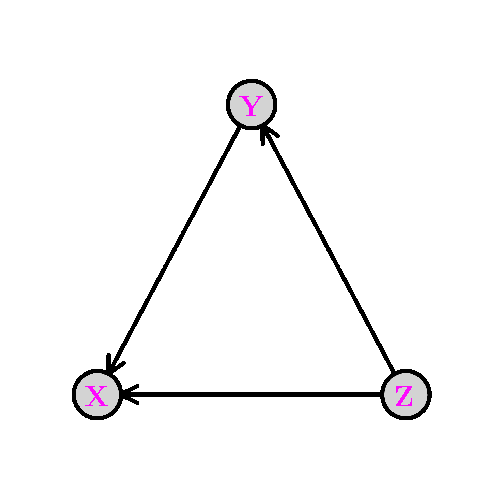
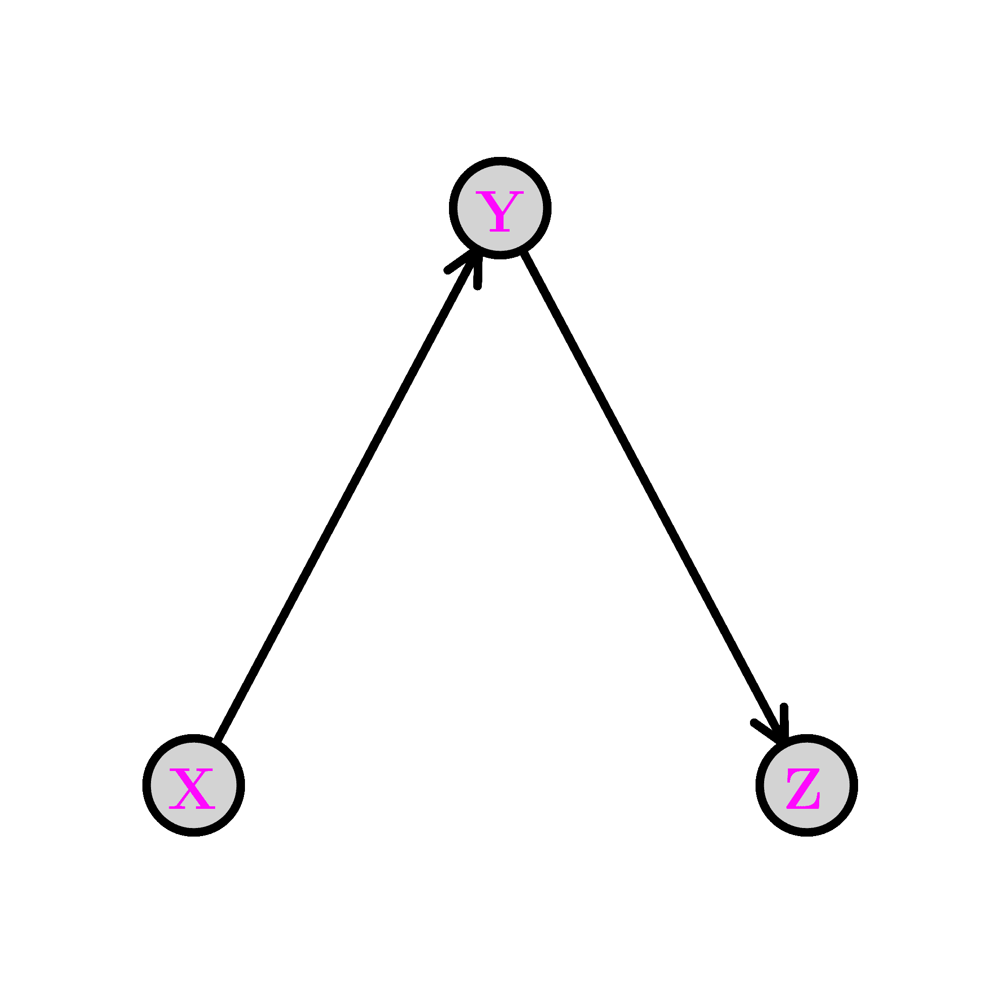
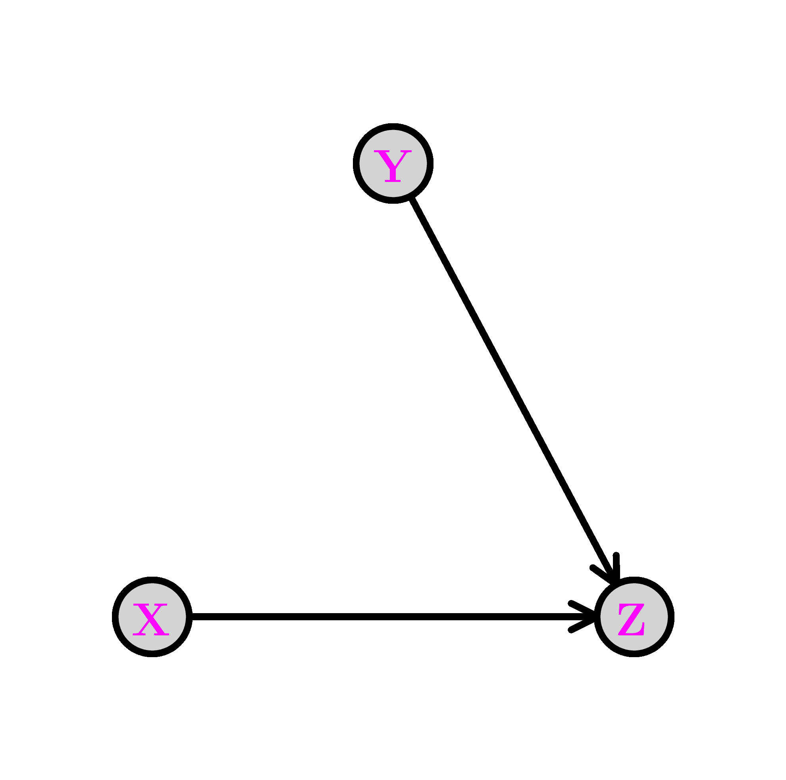
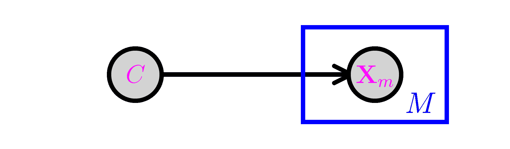

# 6.3\. 建模更复杂的依赖关系 1：使用条件独立性

> 原文：[`mmids-textbook.github.io/chap06_prob/03_joint/roch-mmids-prob-joint.html`](https://mmids-textbook.github.io/chap06_prob/03_joint/roch-mmids-prob-joint.html)

在本节中，我们讨论从更简单的构建块构建联合分布的两个标准技术中的第一个：1) 施加条件独立性关系和 2) 对未观察到的随机变量进行边缘化。将它们结合起来产生了一类称为概率图模型的模型，我们在这里不进行一般性讨论。像以前一样，我们在有限支持情况下进行严格的推导，但这些可以适应连续或混合情况。

## 6.3.1\. 条件概率回顾#

我们首先回顾条件概念，这在概率建模和推理中通常起着关键作用。

**条件概率** 我们从事件开始。在整个过程中，我们都在一个固定的概率空间 $(\Omega, \mathcal{F}, \P)$ 上工作，我们假设它是离散的，即 $\Omega$ 中元素的数量是可数的。

**定义** **(条件概率)** $\idx{条件概率}\xdi$ 设 $A$ 和 $B$ 是两个事件，且 $\mathbb{P}[B] > 0$。$B$ 条件下 $A$ 的条件概率定义为

$$ \P[A|B] = \frac{\P[A \cap B]}{\P[B]}. $$

$\natural$

直观解释大致如下：知道事件 $B$ 已经发生，观察 $A$ 的更新概率是其限制在 $B$ 上的概率，适当归一化以反映 $B$ 外的输出已更新概率为 $0$。

条件概率通常像“无条件”概率一样表现。例如，参见问题 6.8、7.1 和 7.9。

独立性可以用条件概率来描述。用词来说，如果对其中一个事件的发生进行条件化不会改变另一个事件发生的概率，则 $A$ 和 $B$ 是独立的。

**引理** 设 $A$ 和 $B$ 是两个概率大于零的事件。如果 $A$ 和 $B$ 是独立的，我们将表示为 $A \indep B$，当且仅当 $\P[A|B] = \P[A]$ 且 $\P[B|A] = \P[B]$。$\flat$

**证明**：如果 $A$ 和 $B$ 是独立的，那么 $\P[A \cap B] = \P[A] \P[B]$，这意味着

$$ \P[A|B] = \frac{\P[A \cap B]}{\P[B]} = \frac{\P[A] \P[B]}{\P[B]} = \P[A]. $$

在相反的方向上，

$$ \P[A] = \P[A|B] = \frac{\P[A \cap B]}{\P[B]} $$

经过重新排列后，意味着 $\P[A \cap B] = \P[A]\P[B]$。$\square$

条件概率通常以三种基本方式使用，我们接下来回顾。证明可以在大多数概率教科书中找到。

+   **乘法法则** $\idx{乘法法则}\xdi$ 对于任何事件集合 $A_1,\ldots,A_r$，

$$ \P\left[\cap_{i=1}^r A_i\right] = \prod_{i=1}^r \P\left[A_i \,\middle|\, \cap_{j=1}^{i-1} A_j \right]. $$

+   **全概率公式：** $\idx{全概率公式}\xdi$ 对于任何事件 $B$ 和任何 $\Omega$ 的划分$\idx{划分}\xdi$ $A_1,\ldots,A_r$，

$$ \P[B] = \sum_{i=1}^r \P[B|A_i] \P[A_i]. $$

+   **贝叶斯定理：** $\idx{贝叶斯定理}\xdi$ 对于任何具有正概率的事件 $A$ 和 $B$，

$$ \P[A|B] = \frac{\P[B|A]\P[A]}{\P[B]}. $$

显然，上述所有公式在所有条件概率都定义良好时都成立。

**对随机变量的条件化** 条件概率自然地扩展到随机变量。如果 $X$ 是一个离散随机变量，我们让 $p_X$ 是它的概率质量函数，$\S_X$ 是它的支撑集，即它具有正概率的值的集合。然后我们可以对事件 $\{X = x\}$ 进行条件化，对于任何 $x \in \S_X$。

我们接下来定义条件概率质量函数。

**定义** **（条件概率质量函数）** 设 $X$ 和 $Y$ 是具有联合概率质量函数 $p_{X, Y}$ 和边缘 $p_X$ 和 $p_Y$ 的离散随机变量。给定 $Y$ 的 $X$ 的条件概率质量函数$\idx{条件概率质量函数}\xdi$ 定义为

$$ p_{X|Y}(x|y) := P[X=x|Y=y] = \frac{p_{X,Y}(x,y)}{p_Y(y)} $$

这是在所有 $x \in \S_X$ 和 $y \in \S_Y$ 上定义的。 $\natural$

条件期望可以自然地定义为条件概率质量函数的期望。

**定义** **（条件期望）** $\idx{条件期望}\xdi$ 设 $X$ 和 $Y$ 是离散随机变量，其中 $X$ 取实数值且具有有限均值。当 $Y = y$ 时，$X$ 的条件期望由以下公式给出

$$ \E[X|Y=y] = \sum_{x \in \S_X} x\, p_{X|Y}(x|y). $$

$\natural$

更一般地，对于 $X$ 的值域上的函数 $f$，我们可以定义

$$ \E[f(X)|Y=y] = \sum_{x \in \S_X} f(x)\, p_{X|Y}(x|y). $$

我们提到一个有用的公式：*全期望公式*$\idx{全期望公式}\xdi$，它是全概率公式的期望版本。它读作

$$ \E[f(X)] = \sum_{y \in \S_Y} \E[f(X)|Y=y] \,p_Y(y). $$

**条件期望作为最小二乘估计器** 将 $\E[X|Y=y]$ 视为 $y$ 的函数，导致条件期望的一个基本特征。

**定理** 设 $X$ 和 $Y$ 是离散随机变量，其中 $X$ 取实数值且具有有限方差。那么条件期望 $h(y) = \E[X|Y=y]$ 最小化最小二乘准则

$$ \min_{h} \E\left[(X - h(Y))²\right] $$

其中最小值是在所有 $y$ 的实值函数上取的。 $\sharp$

*证明：* 将 $h(y)$ 视为一个向量 $\mathbf{h} = (h_y)_{y \in \S_Y}$，由 $\S_Y$（根据假设是可数的）索引，其中 $h_y = h(y) \in \mathbb{R}$。然后

$$\begin{align*} \mathcal{L}(\mathbf{h}) &=\E\left[(X - h(Y))²\right]\\ &= \sum_{x\in \S_X} \sum_{y \in \S_Y} (x - h_y)² p_{X,Y}(x,y)\\ &= \sum_{y \in \S_Y} \left[\sum_{x\in \S_X} (x - h_y)² p_{X,Y}(x,y)\right]. \end{align*}$$

将方括号内的和式展开（我们用 $q_y$ 表示，并把它看作是 $h_y$ 的函数）得到

$$\begin{align*} q_y(h_y) &:= \sum_{x\in \S_X} (x - h_y)² p_{X,Y}(x,y)\\ &= \sum_{x\in \S_X} [x² - 2 x h_y + h_y²] \,p_{X,Y}(x,y)\\ &= \left\{\sum_{x\in \S_X} x² p_{X,Y}(x,y)\right\} + \left\{- 2 \sum_{x\in \S_X} x p_{X,Y}(x,y)\right\} h_y + \left\{p_Y(y)\right\} h_y². \end{align*}$$

根据最小化二次函数引理，$q_y(h_y)$ 的唯一全局最小值（假设 $p_Y(y) > 0$）在以下位置取得

$$ h_y = - \frac{- 2 \sum_{x\in \S_X} x p_{X,Y}(x,y)}{2 p_Y(y)}. $$

重新排列后，我们得到

$$ h_y = \sum_{x\in \S_X} x \frac{p_{X,Y}(x,y)}{p_Y(y)} = \sum_{x\in \S_X} x p_{X|Y}(x|y) = \E[X|Y=y] $$

如所声称。 $\square$

**条件独立性** 接下来，我们讨论条件独立性。我们首先给出其形式定义。

**定义** **（条件独立性）** $\idx{conditional independence}\xdi$ 设 $A, B, C$ 是满足 $\P[C] > 0$ 的事件。那么 $A$ 和 $B$ 在给定 $C$ 的条件下是条件独立的，记作 $A \indep B | C$，如果

$$ \P[A \cap B| C] = \P[A|C] \,\P[B|C]. $$

$\natural$

用话来说，引用 [维基百科](https://en.wikipedia.org/wiki/Conditional_independence)：

> $A$ 和 $B$ 在给定 $C$ 的条件下是条件独立的，当且仅当，在知道 $C$ 发生的条件下，$A$ 发生的知识不会提供关于 $B$ 发生可能性的信息，同样，$B$ 发生的知识也不会提供关于 $A$ 发生可能性的信息。

通常，条件独立的事件不是（无条件）独立的。

**示例：** 假设我有两个六面的骰子。骰子 1 的面是 $\{1,3,5,7,9,11\}$，骰子 2 的面是 $\{2, 4, 6, 8, 10, 12\}$。假设我进行以下实验：我随机均匀地选择两个骰子中的一个，然后掷这个骰子两次。设 $X_1$ 和 $X_2$ 为掷骰子的结果。考虑事件 $A = \{X_1 = 1\}$，$B = \{X_2 = 2\}$，和 $C = \{\text{选择骰子 1}\}$。事件 $A$ 和 $B$ 显然是相关的：如果 $A$ 发生，那么我知道选择了骰子 1，因此 $B$ 不能发生。一个事件的知识提供了关于另一个事件发生可能性的信息。根据全概率定律，

$$ \P[A] = \P[A|C]\P[C] + \P[A|C^c]\P[C^c] = \frac{1}{6}\frac{1}{2} + 0 \frac{1}{2} = \frac{1}{12}. $$

同样 $\P[B] = \frac{1}{12}$。然而 $\P[A \cap B] = 0 \neq \frac{1}{12} \frac{1}{12}$。

另一方面，我们声称在 $C$ 的条件下 $A$ 和 $B$ 是条件独立的。这从直观上很清楚：一旦我选择了一个骰子，两次投掷是独立的。对于给定的骰子选择，一次投掷的知识不会提供关于另一次投掷可能性的任何信息。注意，在最后一条陈述中，“对于给定的骰子选择”这个短语是关键的。正式来说，通过我们的实验，我们有 $\P[A|C] = 1/6$，$\P[B|C] = 0$ 和 $\P[A \cap B|C] = 0$。所以确实

$$ \P[A \cap B| C] = \P[A|C] \,\P[B|C] $$

正如所声称的。$\lhd$

条件独立性自然扩展到随机向量。

**定义** **（随机向量的条件独立性）** 设 $\bX, \bY, \bW$ 为离散随机向量。那么当给定 $\bW$ 时，$\bX$ 和 $\bY$ 被称为条件独立，记为 $\bX \indep \bY | \bW$，如果对于所有 $\bx \in \S_\bX$，$\by \in \S_\bY$ 和 $\bw \in \S_\bW$

$$ \P[\bX = \bx, \bY = \by|\bW = \bw] = \P[\bX = \bx |\bW = \bw] \,\P[\bY = \by|\bW = \bw]. $$

$\natural$

一个重要的后果是我们可以省略独立变量的条件。

**引理** **（独立性的作用）** $\idx{role of independence lemma}\xdi$ 设 $\bX, \bY, \bW$ 为离散随机向量，使得 $\bX \indep \bY | \bW$。对于所有 $\bx \in \S_\bX$，$\by \in \S_\bY$ 和 $\bw \in \S_\bW$，

$$ \P[\bX = \bx | \bY=\by, \bW=\bw] = \P[\bX = \bx | \bW = \bw]. $$

$\flat$

*证明：* 在之前的练习中，我们证明了 $A \indep B | C$ 蕴含 $\P[A | B\cap C] = \P[A | C]$。这蕴含了所声称的。$\square$

**交流与学习** 条件独立性的概念与概率图模型中的 d-separation 概念密切相关。请你的喜欢的 AI 聊天机器人解释 d-separation。$\ddagger$

## 6.3.2\. 基本配置#

构建复杂概率分布的一个强大方法是使用条件独立性。三个随机变量的情况可以说明关键的概率关系。根据乘法规则，我们可以写出

$$ \P[X=x, Y=y, Z=z] = \P[X=x] \,\P[Y=y|X=x] \,\P[Z=z | X=x, Y=y]. $$

这可以通过一个有向图方便地表示，其中顶点是变量。回想一下，一个从 $i$ 到 $j$ 的箭头 $(i,j)$ 表示 $i$ 是 $j$ 的父节点，而 $j$ 是 $i$ 的子节点。设 $\pa(i)$ 为 $i$ 的父节点集合。下面的有向图 $G = (V, E)$ 编码了以下采样方案，称为祖先采样：

1.  首先，我们根据其边缘概率 $\P[X=x]$ 选择 $X$。注意 $X$ 在 $G$ 中没有父节点。

1.  第二步，我们根据条件概率分布（CPD）$\P[Y=y|X=x]$ 选择 $Y$。注意 $X$ 是 $Y$ 唯一的父节点。

1.  最后，我们根据条件概率分布 $\P[Z=z|X=x, Y=y]$ 选择 $Z$。注意 $Z$ 的父节点是 $X$ 和 $Y$。


上面的图是无环的，也就是说，它没有有向循环。变量 $X, Y, Z$ 是 [拓扑排序](https://en.wikipedia.org/wiki/Topological_sorting)$\idx{topological order}\xdi$，也就是说，所有边 $(i,j)$ 都满足 $i$ 在该顺序中先于 $j$。

如果使用不同的顺序应用乘法规则，相同的联合分布可以用不同的有向图表示。例如，

$$ \P[X=x, Y=y, Z=z] = \P[Z=z] \,\P[Y=y|Z=z] \,\P[X=x | Z=z, Y=y] $$

如此表示的以下有向图。这次拓扑排序是 $Z, Y, X$。



**分支** $\idx{fork}\xdi$ 在上面的第一个图中移除边表示条件独立性关系。例如，移除从 $Y$ 到 $Z$ 的边得到以下图，称为分支。我们用 $Y \leftarrow X \rightarrow Z$ 表示这种配置。


联合分布可以简化如下：

$$ \P[X=x, Y=y, Z=z] = \P[X=x] \,\P[Y=y|X=x] \,\P[Z=z | X=x]. $$

因此，在这种情况下，变化的是 $Z$ 的 CPD 不依赖于 $Y$ 的值。根据 *独立性角色* 公理，这对应于假设条件独立性 $Z \indep Y|X$。实际上，我们可以直接从联合分布中验证这个说法

$$\begin{align*} \P[Y= y, Z=z|X=x] &= \frac{\P[X=x, Y= y, Z=z]}{\P[X=x]}\\ &= \frac{\P[X=x] \,\P[Y=y|X=x] \,\P[Z=z | X=x]}{\P[X=x]}\\ &= \P[Y=y|X=x] \,\P[Z=z | X=x] \end{align*}$$

如所述。

**链** $\idx{chain}\xdi$ 移除从 $X$ 到 $Z$ 的边得到以下图，称为链（或管道）。我们用 $X \rightarrow Y \rightarrow Z$ 表示这种配置。



联合分布可以简化如下：

$$ \P[X=x, Y=y, Z=z] = \P[X=x] \,\P[Y=y|X=x] \,\P[Z=z | Y=y]. $$

在这种情况下，变化的是 $Z$ 的条件概率分布（CPD）不依赖于 $X$ 的值。与分支结构相比，相应的条件独立性关系是 $Z \indep X|Y$。实际上，我们可以直接验证这个说法。

$$\begin{align*} \P[X= x, Z=z|Y=y] &= \frac{\P[X=x, Y= y, Z=z]}{\P[Y=y]}\\ &= \frac{\P[X=x] \,\P[Y=y|X=x] \,\P[Z=z | Y=y]}{\P[Y=y]} \end{align*}$$

现在我们必须使用 *贝叶斯定理* 来得到

$$\begin{align*} &= \frac{\P[X=x] \,\P[Y=y|X=x] \,\P[Z=z | Y=y]}{\P[Y=y]}\\ &= \frac{\P[Y=y|X=x]\,\P[X=x]}{\P[Y=y]} \P[Z=z | Y=y]\\ &= \P[X=x|Y=y] \,\P[Z=z | Y=y] \end{align*}$$

如所述。

对于任何联合概率为正的 $x, y, z$，我们可以重新写

$$\begin{align*} &\P[X=x, Y=y, Z=z]\\ &= \P[X=x] \,\P[Y=y|X=x] \,\P[Z=z | Y=y]\\ &= \P[Y=y] \,\P[X=x|Y=y] \,\P[Z=z | Y=y], \end{align*}$$

其中我们使用了以下事实

$$ \P[X=x, Y=y] = \P[X=x] \,\P[Y=y|X=x] = \P[Y=y] \,\P[X=x|Y=y] $$

根据条件概率的定义。换句话说，我们已经证明了链 $X \rightarrow Y \rightarrow Z$ 实际上等同于分叉 $X \leftarrow Y \rightarrow Z$。特别是，它们都对应于假设条件独立性关系 $Z \indep X|Y$，尽管它们捕获了采样联合分布的不同方式。

**碰撞节点** $\idx{collider}\xdi$ 从 $X$ 到 $Y$ 移除边得到以下图，称为碰撞节点。我们用 $X \rightarrow Z \leftarrow Y$ 表示这种配置。



联合分布简化如下：

$$ \P[X=x, Y=y, Z=z] = \P[X=x] \,\P[Y=y] \,\P[Z=z | X=x, Y=y]. $$

在这种情况下，发生变化的是 $Y$ 的 CPD 不依赖于 $X$ 的值。与分叉和链进行比较。这次我们有 $X \indep Y$。确实，我们可以直接检查这个说法

$$\begin{align*} \P[X= x, Y=y] &= \sum_{z \in \S_z} \P[X=x, Y=y, Z=z]\\ &= \sum_{z \in \S_z} \P[X=x] \,\P[Y=y] \,\P[Z=z | X=x, Y=y]\\ &= \P[X=x] \,\P[Y=y] \end{align*}$$

如所声称的。特别是，碰撞节点不能被重新构造成链或分叉，因为其基本假设更强。

可能出人意料的是，对 $Z$ 进行条件化通常会使 $X$ 和 $Y$ 依赖。这被称为解释或伯克森悖论。

## 6.3.3\. 示例：朴素贝叶斯\#

我们在广义线性模型小节中为逻辑回归提供的基于模型的论证使用了所谓的[判别方法](https://en.wikipedia.org/wiki/Discriminative_model)$\idx{判别模型}\xdi$，其中指定了目标 $y$ 在特征 $\mathbf{x}$ 给定下的条件分布——但不是数据的完整分布 $(\mathbf{x}, y)$。这里我们给出一个[生成方法](https://en.wikipedia.org/wiki/Generative_model)$\idx{生成模型}\xdi$的例子，它模型化了完整分布。关于每种方法的优缺点讨论，例如请参阅[这里](https://en.wikipedia.org/wiki/Discriminative_model#Contrast_with_generative_model)。

朴素贝叶斯$\idx{朴素贝叶斯}\xdi$模型是监督学习的一个简单离散模型。它在文档分类中很有用，例如，我们将使用这个术语来具体说明。我们假设一个文档有一个来自列表 $\mathcal{C} = \{1, \ldots, K\}$ 的单个主题 $C$，其概率分布为 $\pi_k = \P[C = k]$。存在一个大小为 $M$ 的词汇表，我们用伯努利变量 $X_m \in \{0,1\}$ 记录文档中单词 $m$ 的存在或不存在，其中 $p_{k,m} = \P[X_m = 1|C = k]$。我们用 $\bX = (X_1, \ldots, X_M)$ 表示相应的向量。

条件独立性假设接下来：我们假设，给定一个主题 $C$，单词出现是独立的。也就是说，

$$\begin{align*} \P[\bX = \bx|C=k] &= \prod_{m=1}^M \P[X_m = x_m|C = k]\\ &= \prod_{m=1}^M p_{k,m}^{x_m} (1-p_{k,m})^{1-x_m}. \end{align*}$$

最后，联合分布是

$$\begin{align*} \P[C = k, \bX = \bx] &= \P[\bX = \bx|C=k] \,\P[C=k]\\ &= \pi_k \prod_{m=1}^M p_{k,m}^{x_m} (1-p_{k,m})^{1-x_m}. \end{align*}$$

从图形上看，这类似于一个以 $C$ 为中心，$M$ 个叉臂的叉。这使用所谓的板符号表示。下面角上的带有 $M$ 的方框表示 $X_m$ 被重复 $M$ 次，所有副本在给定 $C$ 的条件下都是条件独立的。



**模型拟合** 在使用模型进行预测之前，必须首先从训练数据 $\{\bx_i, c_i\}_{i=1}^n$ 中拟合模型。在这种情况下，这意味着估计未知参数 $\bpi$ 和 $\{\bp_k\}_{k=1}^K$，其中 $\bp_k = (p_{k,1},\ldots, p_{k,M})$。对于每个 $k, m$，让

$$ N_{k,m} = \sum_{i=1}^n \mathbf{1}_{\{c_i = k\}} x_{i,m}, \quad N_{k} = \sum_{i=1}^n \mathbf{1}_{\{c_i = k\}}. $$

我们使用最大似然估计，回想起来，这涉及到找到最大化观察数据概率的参数

$$ \mathcal{L}(\bpi, \{\bp_k\}; \{\bx_i, c_i\}) = \prod_{i=1}^n \pi_{c_i} \prod_{m=1}^M p_{c_i, m}^{x_{i,m}} (1-p_{c_i, m})^{1-x_{i,m}}. $$

这里，像往常一样，我们假设样本是独立同分布的。我们取对数将乘积转换为和，并考虑负对数似然（NLL）

$$\begin{align*} & L_n(\bpi, \{\bp_k\}; \{\bx_i, c_i\})\\ &\quad = - \sum_{i=1}^n \log \pi_{c_i} - \sum_{i=1}^n \sum_{m=1}^M [x_{i,m} \log p_{c_{i}, m} + (1-x_{i,m}) \log (1-p_{c_i, m})]\\ &\quad = - \sum_{k=1}^K N_k \log \pi_k - \sum_{k=1}^K \sum_{m=1}^M [N_{k,m} \log p_{k,m} + (N_k-N_{k,m}) \log (1-p_{k,m})]. \end{align*}$$

NLL 可以自然地分解为依赖于不同参数集的几个项——因此可以分别优化。首先，有一个只依赖于 $\pi_k$ 的项

$$ J_0(\bpi; \{\bx_i, c_i\}) = - \sum_{k=1}^K N_k \log \pi_k. $$

剩余的和可以进一步拆分为 $KM$ 项，每一项只依赖于固定 $k$ 和 $m$ 的 $p_{km}$

$$ J_{k,m}(p_{k,m}; \{\bx_i, c_i\}) = - N_{k,m} \log p_{k,m} - (N_k-N_{k,m}) \log (1-p_{k,m}). $$

所以

$$ L_n(\bpi, \{\bp_k\}; \{\bx_i, c_i\}) = J_0(\bpi; \{\bx_i, c_i\}) + \sum_{k=1}^K \sum_{m=1}^M J_{k,m}(p_{k,m}; \{\bx_i, c_i\}). $$

我们分别最小化这些项。我们假设对于所有 $k$，$N_k > 0$。

我们使用最大似然估计的特殊情况，我们之前在示例中已经解决过，其中我们考虑了有限集上所有概率分布的空间。在这种情况下，最大似然估计量由经验频率给出。请注意，最小化 $J_0(\bpi; \{\bx_i, c_i\})$ 正是这种形式：我们观察到来自类别 $k$ 的 $N_k$ 个样本，并寻求 $\pi_k$ 的最大似然估计量，即观察到 $k$ 的概率。因此，解决方案很简单

$$ \hat{\pi}_k = \frac{N_k}{N}, $$

对于所有 $k$。同样，对于每个 $k$ 和 $m$，$J_{k,m}$ 也具有相同的形式。在这里，状态对应于类别 $k$ 的文档中单词 $m$ 的存在或不存在，我们观察到 $N_{k,m}$ 个类型为 $k$ 的文档，其中单词 $m$ 存在。因此，解决方案是

$$ \hat{p}_{k,m} = \frac{N_{k,m}}{N_k} $$

对于所有 $k, m$。

**预测** 要预测新文档的类别，自然是在 $k$ 上最大化给定 $\{\bX = \bx\}$ 的 $\{C=k\}$ 的概率。根据贝叶斯定理，

$$\begin{align*} \P[C=k | \bX = \bx] &= \frac{\P[C = k, \bX = \bx]}{\P[\bX = \bx]}\\ &= \frac{\pi_k \prod_{m=1}^M p_{k,m}^{x_m} (1-p_{k,m})^{1-x_m}} {\sum_{k'=1}^K \pi_{k'} \prod_{m=1}^M p_{k',m}^{x_m} (1-p_{k',m})^{1-x_m}}. \end{align*}$$

由于分母实际上不依赖于 $k$，最大化 $\P[C=k | \bX = \bx]$ 简化为最大化分子 $\pi_k \prod_{m=1}^M p_{k,m}^{x_m} (1-p_{k,m})^{1-x_m}$，这是很容易计算的。像之前一样，我们取负对数——这有一些数值优势——并将其称为 *得分*

$$\begin{align*} &- \log\left(\pi_k \prod_{m=1}^M p_{k,m}^{x_m} (1-p_{k,m})^{1-x_m}\right)\\ &\qquad = -\log\pi_k - \sum_{m=1}^M [x_m \log p_{k,m} + (1-x_m) \log (1-p_{k,m})]. \end{align*}$$

更具体地说，取负对数在这里是一个好主意，因为计算概率的乘积可能会产生非常小的数字，当它们低于机器精度时，会被近似为零。这被称为 [下溢](https://en.wikipedia.org/wiki/Arithmetic_underflow)$\idx{underflow}\xdi$。通过取负对数，这些概率被转换成合理大小的正数，乘积变成了这些数的和。此外，因为这种转换是单调的，我们可以直接使用转换后的值来计算最优得分，这是我们预测步骤中的最终目标。由于参数是未知的，我们用 $\hat{\pi}_k$ 和 $\hat{p}_{k,m}$ 来代替 $\pi_k$ 和 $p_{k,m}$。

**CHAT & LEARN** 向您最喜欢的 AI 聊天机器人询问有关下溢（underflow）及其表亲上溢（overflow$\idx{overflow}\xdi$）问题的更多信息，特别是在乘以概率的上下文中。$\ddagger$

虽然最大似然估计具有[理想的理论特性](https://en.wikipedia.org/wiki/Maximum_likelihood_estimation#Properties)，但它确实存在[过拟合](https://towardsdatascience.com/parameter-inference-maximum-aposteriori-estimate-49f3cd98267a)的问题。例如，如果一个特定的词$m$在任何训练文档中都没有出现，那么观察到包含该词的新文档的概率被估计为任何类别的$0$（即，对于所有$k$，$\hat{p}_{k,m} = 0$，因此$\hat \pi_k \prod_{m=1}^M \hat{p}_{k,m}^{x_m} (1-\hat{p}_{k,m})^{1-x_m} = 0$对于所有$k$）并且上述最大化问题没有很好地定义。

处理这个问题的一个方法是对数平滑（[Laplace smoothing](https://en.wikipedia.org/wiki/Additive_smoothing)$\idx{Laplace smoothing}\xdi$）。

$$ \bar{\pi}_k = \frac{N_k + \alpha}{N + K \alpha}, \quad \bar{p}_{k,m} = \frac{N_{k,m} + \beta}{N_k + 2 \beta} $$

其中$\alpha, \beta > 0$，这可以通过贝叶斯或正则化视角来证明。

我们实现了带有 Laplace 平滑的朴素贝叶斯模型。

我们将数据编码到表中，其中行是类别，列是特征。条目是对应的$N_{k,m}$。此外，我们还提供了向量$(N_k)_k$。

```py
def nb_fit_table(N_km, N_k, alpha=1., beta=1.):

    K, M = N_km.shape
    N = np.sum(N_k)
    pi_k = (N_k + alpha) / (N + K * alpha)
    p_km = (N_km + beta) / (N_k[:, np.newaxis] + 2 * beta)

    return pi_k, p_km 
```

使用`N_k[:, np.newaxis]`将一维数组`N_k`重塑为二维列向量。例如，如果`N_k`的形状为$(K,)$，那么`N_k[:, np.newaxis]`将其形状更改为$(K, 1)$。这允许在表达式中进行除法。

```py
p_km = (N_km + beta) / (N_k[:, np.newaxis] + 2 * beta) 
```

为了正确地与[广播](https://numpy.org/doc/stable/user/basics.broadcasting.html)一起工作，确保`N_km`的每一行元素都除以`N_k`中相应的值。

下一个函数计算$\pi_k \prod_{m=1}^M p_{k,m}^{x_m} (1-p_{k,m})^{1-x_m}$的负对数，即$k$的得分，并输出一个得分最低的$k$。

```py
def nb_predict(pi_k, p_km, x, label_set):

    K = len(pi_k)

    score_k = np.zeros(K)
    for k in range(K):

        score_k[k] -= np.log(pi_k[k])
        score_k[k] -= np.sum(x * np.log(p_km[k,:]) 
                               + (1 - x)*np.log(1 - p_km[k,:]))

    return label_set[np.argmin(score_k, axis=0)] 
```

**数值角落:** 我们使用[Stack Overflow](https://stackoverflow.com/questions/10059594/)的一个简单示例：

> **示例:** 假设我们有关于 1000 件水果的数据。它们可能是香蕉、橙子或其他水果。我们知道每件水果的 3 个特征：它是否长，是否甜，以及它的颜色是否为黄色[如下表所示]。

| 水果 | 长的 | 甜的 | 黄色的 | 总计 |
| --- | --- | --- | --- | --- |
| 香蕉 | 400 | 350 | 450 | 500 |
| 橙子 | 0 | 150 | 300 | 300 |
| 其他 | 100 | 150 | 50 | 200 |
| 总计 | 500 | 650 | 800 | 1000 |

```py
N_km = np.array([[400., 350., 450.],
                 [0., 150., 300.],
                 [100., 150., 50.]])
N_k = np.array([500., 300., 200.]) 
```

我们在我们的简单数据集上运行`nb_fit_table`。

```py
pi_k, p_km = nb_fit_table(N_km, N_k)
print(pi_k) 
```

```py
[0.4995015 0.3000997 0.2003988] 
```

```py
print(p_km) 
```

```py
[[0.79880478 0.69920319 0.89840637]
 [0.00331126 0.5        0.99668874]
 [0.5        0.74752475 0.25247525]] 
```

继续我们之前的例子：

> 假设我们被给出了一个未知水果的特性，并要求对其进行分类。我们被告知该水果是长的、甜的和黄色的。它是香蕉吗？它是橙子吗？还是它是其他水果？

我们在包含上述引用中提到的额外水果的数据集上运行`nb_predict`。

```py
label_set = ['Banana', 'Orange', 'Other']
x = np.array([1., 1., 1.])
nb_predict(pi_k, p_km, x, label_set) 
```

```py
'Banana' 
```

$\unlhd$

**CHAT & LEARN** 拉普拉斯平滑是更一般技术，即贝叶斯参数估计的一个特例。请你的最爱 AI 聊天机器人解释贝叶斯参数估计以及它与最大似然估计和拉普拉斯平滑的关系。 $\ddagger$

***自我评估测验*** *(由克莱德、双子星和 ChatGPT 协助)*

**1** 以下哪个关于条件概率的陈述是不正确的？

a) 对于事件 $A$ 和 $B$，当 $\mathbb{P}[B] > 0$ 时，有 $\mathbb{P}[A|B] = \frac{\mathbb{P}[A \cap B]}{\mathbb{P}[B]}$。

b) 如果 $A$ 和 $B$ 是独立的，那么 $\mathbb{P}[A|B] = \mathbb{P}[A]$。

c) 条件概率可以用来表达乘法规则和全概率公式。

d) 对于任何事件 $A$ 和 $B$，有 $\mathbb{P}[A|B] = \mathbb{P}[B|A]$。

**2** 以下哪个是事件 $A$ 和 $B$ 在事件 $C$ 条件下的条件独立性（记作 $A \perp\!\!\!\perp B \mid C$）的正确数学表达式？

a) $\mathbb{P}[A \cap B \mid C] = \mathbb{P}[A \mid C] + \mathbb{P}[B \mid C]$

b) $\mathbb{P}[A \cup B \mid C] = \mathbb{P}[A \mid C] \mathbb{P}[B \mid C]$

c) $\mathbb{P}[A \cap B \mid C] = \mathbb{P}[A \mid C] \mathbb{P}[B \mid C]$

d) $\mathbb{P}[A \mid B \cap C] = \mathbb{P}[A \mid C]$

**3** 在分叉配置 $Y \leftarrow X \rightarrow Z$ 中，以下哪个条件独立性关系始终成立？

a) $X \perp\!\!\!\perp Y \mid Z$

b) $Y \perp\!\!\!\perp Z \mid X$

c) $X \perp\!\!\!\perp Z \mid Y$

d) $Y \perp\!\!\!\perp Z$

**4** 在碰撞配置 $X \rightarrow Z \leftarrow Y$ 中，以下哪个条件独立性关系始终成立？

a) $X \perp\!\!\!\perp Y \mid Z$

b) $Y \perp\!\!\!\perp Z \mid X$

c) $X \perp\!\!\!\perp Z \mid Y$

d) $X \perp\!\!\!\perp Y$

**5** 以下哪个最好地描述了文档分类的朴素贝叶斯模型的图形表示？

a) 以主题变量为中心，以单词变量为链环的链。

b) 以主题变量为中心的碰撞器，以单词变量为父变量。

c) 以主题变量为中心，以单词变量为枝条的叉形。

d) 包含所有变量对边的完整图。

1 的答案：d. 理由：一般来说，$\mathbb{P}[A|B] \neq \mathbb{P}[B|A]$。贝叶斯定理提供了这两个条件概率之间的正确关系。

2 的答案：c. 理由：文本中提到，“然后 $A$ 和 $B$ 在 $C$ 的条件下是条件独立的，记作 $A \perp\!\!\!\perp B \mid C$，如果 $\mathbb{P}[A \cap B \mid C] = \mathbb{P}[A \mid C] \mathbb{P}[B \mid C]$。”

答案 3：b. 证明：文本中提到，“从 $Y$ 到 $Z$ 移除边后得到以下图，称为分叉。我们用 $Y \leftarrow X \rightarrow Z$ 表示这种配置。[...] 相应的条件独立性关系是 $Z \perp\!\!\!\perp Y \mid X$。”

答案 4：d. 证明：文本中提到，“从 $X$ 到 $Y$ 移除边后得到以下图，称为碰撞器。我们用 $X \rightarrow Z \leftarrow Y$ 表示这种配置。[...] 这次我们有 $X \perp\!\!\!\perp Y$。”

答案 5：c. 证明：文本中提到，“从图形上看，这与以 $C$ 为中心、$M$ 为 $X_m$ 的支点的分叉相似。”

## 6.3.1\. 条件化回顾#

我们首先回顾条件化的概念，这在概率建模和推理中通常起着关键作用。

**条件概率** 我们从事件开始。在整个过程中，我们在一个固定的概率空间 $(\Omega, \mathcal{F}, \P)$ 上工作，我们假设它是离散的，即 $\Omega$ 中元素的数量是可数的。

**定义** **（条件概率）** $\idx{conditional probability}\xdi$ 设 $A$ 和 $B$ 是两个事件，且 $\mathbb{P}[B] > 0$。$B$ 给定 $A$ 的条件概率定义为

$$ \P[A|B] = \frac{\P[A \cap B]}{\P[B]}. $$

$\natural$

直观的解释大致如下：知道事件 $B$ 已经发生，观察 $A$ 的更新概率是其限制在 $B$ 上的概率，并且适当地归一化以反映 $B$ 之外的结果更新概率为 $0$。

条件概率通常表现得像“无条件”概率。（例如，参见问题 6.8、7.1 和 7.9。）

独立性可以用条件概率来描述。换句话说，如果基于其中一个事件已经发生来条件化，不会改变另一个事件发生的概率，那么 $A$ 和 $B$ 是独立的。

**引理** 设 $A$ 和 $B$ 是两个概率大于零的事件。那么 $A$ 和 $B$ 是独立的，我们将其表示为 $A \indep B$，当且仅当 $\P[A|B] = \P[A]$ 和 $\P[B|A] = \P[B]$。 $\flat$

*证明：* 如果 $A$ 和 $B$ 是独立的，那么 $\P[A \cap B] = \P[A] \P[B]$，这表明

$$ \P[A|B] = \frac{\P[A \cap B]}{\P[B]} = \frac{\P[A] \P[B]}{\P[B]} = \P[A]. $$

在相反的方向，

$$ \P[A] = \P[A|B] = \frac{\P[A \cap B]}{\P[B]} $$

经过重新排列后，意味着 $\P[A \cap B] = \P[A]\P[B]$。 $\square$

条件概率通常以三种基本方式使用，我们将在下面回忆。证明可以在大多数概率教科书中找到。

+   **乘法法则：** $\idx{multiplication rule}\xdi$ 对于任何事件集合 $A_1,\ldots,A_r$，

$$ \P\left[\cap_{i=1}^r A_i\right] = \prod_{i=1}^r \P\left[A_i \,\middle|\, \cap_{j=1}^{i-1} A_j \right]. $$

+   **全概率公式:** $\idx{全概率公式}\xdi$ 对于任何事件 $B$ 和任何 $\Omega$ 的划分 $\idx{划分}\xdi$ $A_1,\ldots,A_r$，

$$ \P[B] = \sum_{i=1}^r \P[B|A_i] \P[A_i]. $$

+   **贝叶斯定理:** $\idx{贝叶斯定理}\xdi$ 对于任何具有正概率的事件 $A$ 和 $B$，

$$ \P[A|B] = \frac{\P[B|A]\P[A]}{\P[B]}. $$

显然，上述所有公式在所有条件概率都定义良好的情况下成立。

**对随机变量的条件化** 条件概率自然地扩展到随机变量。如果 $X$ 是一个离散随机变量，我们让 $p_X$ 是它的概率质量函数，$\S_X$ 是它的支撑集，即它具有正概率的值的集合。然后我们可以对任何 $x \in \S_X$ 的事件 $\{X = x\}$ 进行条件化。

我们接下来定义条件概率质量函数。

**定义** **(条件概率质量函数)** 设 $X$ 和 $Y$ 是具有联合概率质量函数 $p_{X, Y}$ 和边缘 $p_X$ 和 $p_Y$ 的离散随机变量。$X$ 给定 $Y$ 的条件概率质量函数$\idx{条件概率质量函数}\xdi$ 定义为

$$ p_{X|Y}(x|y) := P[X=x|Y=y] = \frac{p_{X,Y}(x,y)}{p_Y(y)} $$

该公式适用于所有 $x \in \S_X$ 和 $y \in \S_Y$。$\natural$

然后，条件期望可以自然地定义为条件概率质量函数的期望。

**定义** **(条件期望)** $\idx{条件期望}\xdi$ 设 $X$ 和 $Y$ 是离散随机变量，其中 $X$ 取实数值且具有有限均值。给定 $Y = y$ 的 $X$ 的条件期望由

$$ \E[X|Y=y] = \sum_{x \in \S_X} x\, p_{X|Y}(x|y). $$

$\natural$

更一般地，对于 $X$ 的值域上的函数 $f$，我们可以定义

$$ \E[f(X)|Y=y] = \sum_{x \in \S_X} f(x)\, p_{X|Y}(x|y). $$

我们提到一个有用的公式：**全期望公式**$\idx{全期望公式}\xdi$，它是**全概率公式**的期望版本。它读作

$$ \E[f(X)] = \sum_{y \in \S_Y} \E[f(X)|Y=y] \,p_Y(y). $$

**条件期望作为最小二乘估计器** 将 $\E[X|Y=y]$ 视为 $y$ 的函数，导致条件期望的一个基本特征描述。

**定理** 设 $X$ 和 $Y$ 是离散随机变量，其中 $X$ 取实数值且具有有限方差。那么条件期望 $h(y) = \E[X|Y=y]$ 最小化最小二乘准则

$$ \min_{h} \E\left[(X - h(Y))²\right] $$

其中最小值是在所有 $y$ 的实值函数上取的。$\sharp$

*证明:* 将 $h(y)$ 视为一个向量 $\mathbf{h} = (h_y)_{y \in \S_Y}$，由 $\S_Y$ （根据假设是可数的）索引，其中 $h_y = h(y) \in \mathbb{R}$。然后

$$\begin{align*} \mathcal{L}(\mathbf{h}) &=\E\left[(X - h(Y))²\right]\\ &= \sum_{x\in \S_X} \sum_{y \in \S_Y} (x - h_y)² p_{X,Y}(x,y)\\ &= \sum_{y \in \S_Y} \left[\sum_{x\in \S_X} (x - h_y)² p_{X,Y}(x,y)\right]. \end{align*}$$

展开方括号中的和（我们将其表示为 $q_y$ 并将其视为 $h_y$ 的函数）给出

$$\begin{align*} q_y(h_y) &:= \sum_{x\in \S_X} (x - h_y)² p_{X,Y}(x,y)\\ &= \sum_{x\in \S_X} [x² - 2 x h_y + h_y²] \,p_{X,Y}(x,y)\\ &= \left\{\sum_{x\in \S_X} x² p_{X,Y}(x,y)\right\} + \left\{- 2 \sum_{x\in \S_X} x p_{X,Y}(x,y)\right\} h_y + \left\{p_Y(y)\right\} h_y². \end{align*}$$

根据最小化二次函数引理，在 $p_Y(y) > 0$ 的条件下，$q_y(h_y)$ 的唯一全局最小值在

$$ h_y = - \frac{- 2 \sum_{x\in \S_X} x p_{X,Y}(x,y)}{2 p_Y(y)}. $$

重新排列后，我们得到

$$ h_y = \sum_{x\in \S_X} x \frac{p_{X,Y}(x,y)}{p_Y(y)} = \sum_{x\in \S_X} x p_{X|Y}(x|y) = \E[X|Y=y] $$

如所声称。 $\square$

**条件独立性** 接下来，我们讨论条件独立性。我们首先从其形式定义开始。

**定义** **（条件独立性）** $\idx{条件独立性}\xdi$ 设 $A, B, C$ 为事件，且 $\P[C] > 0$。那么 $A$ 和 $B$ 在给定 $C$ 的条件下是条件独立的，表示为 $A \indep B | C$，如果

$$ \P[A \cap B| C] = \P[A|C] \,\P[B|C]. $$

$\natural$

用文字来说，引用 [维基百科](https://en.wikipedia.org/wiki/Conditional_independence):

> $A$ 和 $B$ 在给定 $C$ 的条件下是条件独立的，当且仅当，在知道 $C$ 发生的条件下，$A$ 发生的知识不会提供关于 $B$ 发生可能性的信息，反之亦然。

一般而言，条件独立事件不是（无条件）独立的。

**示例**：想象我有两个六面的骰子。骰子 1 的面是 $\{1,3,5,7,9,11\}$，骰子 2 的面是 $\{2, 4, 6, 8, 10, 12\}$。假设我进行以下实验：我随机选择两个骰子中的一个，然后掷两次。设 $X_1$ 和 $X_2$ 为掷出的结果。考虑事件 $A = \{X_1 = 1\}$，$B = \{X_2 = 2\}$，和 $C = \{\text{选择骰子 1}\}$。事件 $A$ 和 $B$ 显然是相关的：如果 $A$ 发生，那么我知道选择了骰子 1，因此 $B$ 不能发生。一个事件的知识提供了关于另一个事件发生可能性的信息。形式上，根据全概率定律，

$$ \P[A] = \P[A|C]\P[C] + \P[A|C^c]\P[C^c] = \frac{1}{6}\frac{1}{2} + 0 \frac{1}{2} = \frac{1}{12}. $$

类似地 $\P[B] = \frac{1}{12}$。然而 $\P[A \cap B] = 0 \neq \frac{1}{12} \frac{1}{12}$。

另一方面，我们断言，在给定 $C$ 的条件下，$A$ 和 $B$ 是条件独立的。这从直观上很清楚：一旦我选择了一个骰子，两次投掷是独立的。对于给定的骰子选择，一次投掷的知识不会提供关于另一次投掷可能性的任何信息。注意，在最后一条陈述中，“对于给定的骰子选择”这个短语是关键的。根据我们的实验，我们有 $\P[A|C] = 1/6$，$\P[B|C] = 0$ 和 $\P[A \cap B|C] = 0$。因此，确实

$$ \P[A \cap B| C] = \P[A|C] \,\P[B|C] $$

如所声称。$\lhd$

条件独立性自然扩展到随机向量。

**定义** **(随机向量的条件独立性)** 设 $\bX, \bY, \bW$ 是离散随机向量。如果对于所有 $\bx \in \S_\bX$，$\by \in \S_\bY$ 和 $\bw \in \S_\bW$，

$$ \P[\bX = \bx, \bY = \by|\bW = \bw] = \P[\bX = \bx |\bW = \bw] \,\P[\bY = \by|\bW = \bw]. $$

$\natural$

一个重要的后果是我们可以省略独立变量的条件。

**引理** **(独立性的作用)** $\idx{独立性的作用引理}\xdi$ 设 $\bX, \bY, \bW$ 是离散随机向量，使得 $\bX \indep \bY | \bW$。对于所有 $\bx \in \S_\bX$，$\by \in \S_\bY$ 和 $\bw \in \S_\bW$，

$$ \P[\bX = \bx | \bY=\by, \bW=\bw] = \P[\bX = \bx | \bW = \bw]. $$

$\flat$

*证明* 在之前的练习中，我们证明了 $A \indep B | C$ 蕴含 $\P[A | B\cap C] = \P[A | C]$。这证明了我们的断言。$\square$

**CHAT & LEARN** 条件独立性的概念与概率图模型中的 d-separation 概念密切相关。请你的喜欢的 AI 聊天机器人解释 d-separation。$\ddagger$

## 6.3.2\. 基本配置#

构建复杂概率分布的一个强大方法是使用条件独立性。三个随机变量的情况可以说明关键的概率关系。根据乘法法则，我们可以写出

$$ \P[X=x, Y=y, Z=z] = \P[X=x] \,\P[Y=y|X=x] \,\P[Z=z | X=x, Y=y]. $$

这可以通过一个有向图方便地表示，其中顶点是变量。回想一下，从 $i$ 到 $j$ 的箭头 $(i,j)$ 表示 $i$ 是 $j$ 的父节点，而 $j$ 是 $i$ 的子节点。设 $\pa(i)$ 为 $i$ 的父节点集合。下面的有向图 $G = (V, E)$ 编码了以下采样方案，称为祖先采样：

1.  首先，我们根据其边缘概率分布 $\P[X=x]$ 选择 $X$。注意 $X$ 在 $G$ 中没有父节点。

1.  第二步，我们根据条件概率分布 (CPD) $\P[Y=y|X=x]$ 选择 $Y$。注意 $X$ 是 $Y$ 的唯一父节点。

1.  最后我们根据条件概率分布 $\P[Z=z|X=x, Y=y]$ 选择 $Z$。注意 $Z$ 的父节点是 $X$ 和 $Y$。


上面的图是无环的，也就是说，它没有有向循环。变量 $X, Y, Z$ 按照拓扑顺序排列（[拓扑排序](https://en.wikipedia.org/wiki/Topological_sorting)$\idx{拓扑排序}\xdi$），也就是说，所有边 $(i,j)$ 都满足 $i$ 在该顺序中先于 $j$。

如果使用不同的顺序应用乘法规则，相同的联合分布可以用不同的有向图表示。例如，

$$ \P[X=x, Y=y, Z=z] = \P[Z=z] \,\P[Y=y|Z=z] \,\P[X=x | Z=z, Y=y] $$

表示为以下有向图。这次拓扑顺序是 $Z, Y, X$。


**分叉** $\idx{分叉}\xdi$ 在上面的第一个图中移除边编码了条件独立性关系。例如，移除从 $Y$ 到 $Z$ 的边得到以下图，称为分叉。我们用 $Y \leftarrow X \rightarrow Z$ 表示这种配置。


联合分布可以简化如下：

$$ \P[X=x, Y=y, Z=z] = \P[X=x] \,\P[Y=y|X=x] \,\P[Z=z | X=x]. $$

因此，在这种情况下，变化的是 $Z$ 的条件概率表（CPD）不依赖于 $Y$ 的值。根据 *独立性的作用* 公理，这对应于假设条件独立性 $Z \indep Y|X$。确实，我们可以直接从联合分布中验证这一说法

$$\begin{align*} \P[Y= y, Z=z|X=x] &= \frac{\P[X=x, Y= y, Z=z]}{\P[X=x]}\\ &= \frac{\P[X=x] \,\P[Y=y|X=x] \,\P[Z=z | X=x]}{\P[X=x]}\\ &= \P[Y=y|X=x] \,\P[Z=z | X=x] \end{align*}$$

如所声称的。

**链** $\idx{链}\xdi$ 从 $X$ 到 $Z$ 移除边得到以下图，称为链（或管道）。我们用 $X \rightarrow Y \rightarrow Z$ 表示这种配置。


联合分布可以简化如下：

$$ \P[X=x, Y=y, Z=z] = \P[X=x] \,\P[Y=y|X=x] \,\P[Z=z | Y=y]. $$

在这种情况下，变化的是 $Z$ 的条件概率表（CPD）不依赖于 $X$ 的值。与分叉进行比较。相应的条件独立性关系是 $Z \indep X|Y$。确实，我们可以直接从联合分布中验证这一说法

$$\begin{align*} \P[X= x, Z=z|Y=y] &= \frac{\P[X=x, Y= y, Z=z]}{\P[Y=y]}\\ &= \frac{\P[X=x] \,\P[Y=y|X=x] \,\P[Z=z | Y=y]}{\P[Y=y]} \end{align*}$$

现在我们必须使用 *贝叶斯定理* 来得到

$$\begin{align*} &= \frac{\P[X=x] \,\P[Y=y|X=x] \,\P[Z=z | Y=y]}{\P[Y=y]}\\ &= \frac{\P[Y=y|X=x]\,\P[X=x]}{\P[Y=y]} \P[Z=z | Y=y]\\ &= \P[X=x|Y=y] \,\P[Z=z | Y=y] \end{align*}$$

如所声称的。

对于任何 $x, y, z$，其中联合概率为正，我们可以重新写为

$$\begin{align*} &\P[X=x, Y=y, Z=z]\\ &= \P[X=x] \,\P[Y=y|X=x] \,\P[Z=z | Y=y]\\ &= \P[Y=y] \,\P[X=x|Y=y] \,\P[Z=z | Y=y], \end{align*}$$

其中我们使用了

$$ \P[X=x, Y=y] = \P[X=x] \,\P[Y=y|X=x] = \P[Y=y] \,\P[X=x|Y=y] $$

根据条件概率的定义。换句话说，我们已经表明链 $X \rightarrow Y \rightarrow Z$ 实际上等同于分支 $X \leftarrow Y \rightarrow Z$。特别是，它们都对应于假设条件独立性关系 $Z \indep X|Y$，尽管它们捕获了采样联合分布的不同方式。

**碰撞器** $\idx{碰撞器}\xdi$ 从 $X$ 到 $Y$ 移除边得到以下图，称为碰撞器。我们用 $X \rightarrow Z \leftarrow Y$ 表示这种配置。


联合分布可以简化如下：

$$ \P[X=x, Y=y, Z=z] = \P[X=x] \,\P[Y=y] \,\P[Z=z | X=x, Y=y]. $$

在这种情况下，变化的是 $Y$ 的条件概率表（CPD）不依赖于 $X$ 的值。将其与分支和链进行比较。这次我们有 $X \indep Y$。确实，我们可以直接验证这个说法

$$\begin{align*} \P[X= x, Y=y] &= \sum_{z \in \S_z} \P[X=x, Y=y, Z=z]\\ &= \sum_{z \in \S_z} \P[X=x] \,\P[Y=y] \,\P[Z=z | X=x, Y=y]\\ &= \P[X=x] \,\P[Y=y] \end{align*}$$

如所声称的。特别是，碰撞器不能被重新构造成链或分支，因为其基本假设更强。

可能出人意料的是，对 $Z$ 进行条件化通常会使 $X$ 和 $Y$ 依赖。这被称为解释消除或伯克森悖论。

## 6.3.3\. 示例：朴素贝叶斯#

我们在广义线性模型的子节中为逻辑回归提供的基于模型的论证使用了所谓的[判别方法](https://en.wikipedia.org/wiki/Discriminative_model)$\idx{判别模型}\xdi$，其中指定了目标 $y$ 在特征 $\mathbf{x}$ 给定下的条件分布——但不是数据的完整分布 $(\mathbf{x}, y)$。这里我们给出了[生成方法](https://en.wikipedia.org/wiki/Generative_model)$\idx{生成模型}\xdi$的例子，它模型化了完整分布。关于每种方法的优缺点讨论，例如，请参阅[这里](https://en.wikipedia.org/wiki/Discriminative_model#Contrast_with_generative_model)。

基于朴素贝叶斯$\idx{朴素贝叶斯}\xdi$模型是一个简单的监督学习离散模型。它在文档分类中很有用，例如，我们将使用这个术语来具体说明。我们假设一个文档有一个单一的主题 $C$，来自列表 $\mathcal{C} = \{1, \ldots, K\}$，其概率分布为 $\pi_k = \P[C = k]$。存在一个大小为 $M$ 的词汇表，我们使用伯努利变量 $X_m \in \{0,1\}$ 记录文档中单词 $m$ 的存在或不存在，其中 $p_{k,m} = \P[X_m = 1|C = k]$。我们用 $\bX = (X_1, \ldots, X_M)$ 表示相应的向量。

接下来是条件独立性假设：我们假设，给定一个主题 $C$，单词出现是独立的。也就是说，

$$\begin{align*} \P[\bX = \bx|C=k] &= \prod_{m=1}^M \P[X_m = x_m|C = k]\\ &= \prod_{m=1}^M p_{k,m}^{x_m} (1-p_{k,m})^{1-x_m}. \end{align*}$$

最后，联合分布是

$$\begin{align*} \P[C = k, \bX = \bx] &= \P[\bX = \bx|C=k] \,\P[C=k]\\ &= \pi_k \prod_{m=1}^M p_{k,m}^{x_m} (1-p_{k,m})^{1-x_m}. \end{align*}$$

图形上，这类似于一个以 $C$ 为中心、$M$ 个叉状支的叉子。这使用所谓的板符号表示。下面角上的带有 $M$ 的框表示 $X_m$ 被重复 $M$ 次，所有副本在给定 $C$ 的条件下都是条件独立的。


**模型拟合** 在使用模型进行预测之前，必须首先从训练数据 $\{\bx_i, c_i\}_{i=1}^n$ 中拟合模型。在这种情况下，这意味着估计未知参数 $\bpi$ 和 $\{\bp_k\}_{k=1}^K$，其中 $\bp_k = (p_{k,1},\ldots, p_{k,M})$。对于每个 $k, m$，让

$$ N_{k,m} = \sum_{i=1}^n \mathbf{1}_{\{c_i = k\}} x_{i,m}, \quad N_{k} = \sum_{i=1}^n \mathbf{1}_{\{c_i = k\}}. $$

我们使用最大似然估计，回想一下，这涉及到找到最大化观察数据概率的参数

$$ \mathcal{L}(\bpi, \{\bp_k\}; \{\bx_i, c_i\}) = \prod_{i=1}^n \pi_{c_i} \prod_{m=1}^M p_{c_i, m}^{x_{i,m}} (1-p_{c_i, m})^{1-x_{i,m}}. $$

这里，像往常一样，我们假设样本是独立同分布的。我们取对数将乘积转换为和，并考虑负对数似然（NLL）

$$\begin{align*} & L_n(\bpi, \{\bp_k\}; \{\bx_i, c_i\})\\ &\quad = - \sum_{i=1}^n \log \pi_{c_i} - \sum_{i=1}^n \sum_{m=1}^M [x_{i,m} \log p_{c_{i}, m} + (1-x_{i,m}) \log (1-p_{c_i, m})]\\ &\quad = - \sum_{k=1}^K N_k \log \pi_k - \sum_{k=1}^K \sum_{m=1}^M [N_{k,m} \log p_{k,m} + (N_k-N_{k,m}) \log (1-p_{k,m})]. \end{align*}$$

NLL 可以自然地分解为几个依赖于不同参数集的项——因此可以分别优化。首先，有一个只依赖于 $\pi_k$ 的项

$$ J_0(\bpi; \{\bx_i, c_i\}) = - \sum_{k=1}^K N_k \log \pi_k. $$

剩余的和可以进一步分解为 $KM$ 项，每项只依赖于固定 $k$ 和 $m$ 的 $p_{km}$

$$ J_{k,m}(p_{k,m}; \{\bx_i, c_i\}) = - N_{k,m} \log p_{k,m} - (N_k-N_{k,m}) \log (1-p_{k,m}). $$

所以

$$ L_n(\bpi, \{\bp_k\}; \{\bx_i, c_i\}) = J_0(\bpi; \{\bx_i, c_i\}) + \sum_{k=1}^K \sum_{m=1}^M J_{k,m}(p_{k,m}; \{\bx_i, c_i\}). $$

我们分别最小化这些项。我们假设对于所有 $k$，$N_k > 0$。

我们使用最大似然估计的特殊情况，我们之前在示例中已经解决了这个问题，其中我们考虑了有限集上所有概率分布的空间。在这种情况下，最大似然估计量由经验频率给出。请注意，最小化 $J_0(\bpi; \{\bx_i, c_i\})$ 正是这种形式：我们观察到来自类别 $k$ 的 $N_k$ 个样本，我们寻求 $\pi_k$ 的最大似然估计，即观察到 $k$ 的概率。因此，解决方案很简单

$$ \hat{\pi}_k = \frac{N_k}{N}, $$

对于所有 $k$。同样，对于每个 $k$，$m$，$J_{k,m}$ 也是这种形式。在这里，状态对应于类别 $k$ 的文档中单词 $m$ 的存在或不存在，我们观察到 $k$ 类型的 $N_{k,m}$ 个文档，其中单词 $m$ 存在。因此，解决方案是

$$ \hat{p}_{k,m} = \frac{N_{k,m}}{N_k} $$

对于所有 $k, m$。

**预测** 要预测新文档的类别，自然是在 $k$ 上最大化给定 $\{\bX = \bx\}$ 的 $\{C=k\}$ 的概率。根据贝叶斯定理，

$$\begin{align*} \P[C=k | \bX = \bx] &= \frac{\P[C = k, \bX = \bx]}{\P[\bX = \bx]}\\ &= \frac{\pi_k \prod_{m=1}^M p_{k,m}^{x_m} (1-p_{k,m})^{1-x_m}} {\sum_{k'=1}^K \pi_{k'} \prod_{m=1}^M p_{k',m}^{x_m} (1-p_{k',m})^{1-x_m}}. \end{align*}$$

由于分母实际上不依赖于 $k$，最大化 $\P[C=k | \bX = \bx]$ 简化为最大化分子 $\pi_k \prod_{m=1}^M p_{k,m}^{x_m} (1-p_{k,m})^{1-x_m}$，这是容易计算的。正如我们之前所做的那样，我们取负对数——这有一些数值优势——并将其称为 *得分*

$$\begin{align*} &- \log\left(\pi_k \prod_{m=1}^M p_{k,m}^{x_m} (1-p_{k,m})^{1-x_m}\right)\\ &\qquad = -\log\pi_k - \sum_{m=1}^M [x_m \log p_{k,m} + (1-x_m) \log (1-p_{k,m})]. \end{align*}$$

更具体地说，取负对数在这里是一个好主意，因为计算概率的乘积可能会产生非常小的数字，当它们低于机器精度时，会被近似为零。这被称为[下溢](https://en.wikipedia.org/wiki/Arithmetic_underflow)$\idx{underflow}\xdi$。通过取负对数，这些概率被转换成合理大小的正数，而乘积变成了这些数的和。此外，因为这种转换是单调的，我们可以直接使用转换后的值来计算最优得分，这是我们预测步骤中的最终目标。由于参数是未知的，我们用 $\hat{\pi}_k$ 和 $\hat{p}_{k,m}$ 来代替 $\pi_k$ 和 $p_{k,m}$。

**CHAT & LEARN** 向您喜欢的 AI 聊天机器人询问有关下溢问题及其表亲溢出$\idx{overflow}\xdi$的信息，特别是在乘以概率的上下文中。$\ddagger$

虽然最大似然估计具有 [理想的理论特性](https://en.wikipedia.org/wiki/Maximum_likelihood_estimation#Properties)，但它确实存在 [过拟合](https://towardsdatascience.com/parameter-inference-maximum-aposteriori-estimate-49f3cd98267a) 的问题。例如，如果某个特定的词 $m$ 在任何训练文档中都没有出现，那么观察到包含该词的新文档的概率被估计为任何类别的 $0$（即，对于所有 $k$，$\hat{p}_{k,m} = 0$，因此 $\hat \pi_k \prod_{m=1}^M \hat{p}_{k,m}^{x_m} (1-\hat{p}_{k,m})^{1-x_m} = 0$ 对于所有 $k$）并且上述最大化问题没有很好地定义。

处理这种问题的一种方法是 [拉普拉斯平滑](https://en.wikipedia.org/wiki/Additive_smoothing)$\idx{Laplace smoothing}\xdi$。

$$ \bar{\pi}_k = \frac{N_k + \alpha}{N + K \alpha}, \quad \bar{p}_{k,m} = \frac{N_{k,m} + \beta}{N_k + 2 \beta} $$

其中 $\alpha, \beta > 0$，这可以通过贝叶斯或正则化视角来证明。

我们使用拉普拉斯平滑实现朴素贝叶斯模型。

我们将数据编码到一个表格中，其中行是类别，列是特征。条目是对应的 $N_{k,m}$ 值。此外，我们还提供了向量 $(N_k)_k$。

```py
def nb_fit_table(N_km, N_k, alpha=1., beta=1.):

    K, M = N_km.shape
    N = np.sum(N_k)
    pi_k = (N_k + alpha) / (N + K * alpha)
    p_km = (N_km + beta) / (N_k[:, np.newaxis] + 2 * beta)

    return pi_k, p_km 
```

使用 `N_k[:, np.newaxis]` 将一维数组 `N_k` 转换为二维列向量。例如，如果 `N_k` 的形状为 $(K,)$，那么 `N_k[:, np.newaxis]` 将其形状更改为 $(K, 1)$。这允许在表达式中进行除法，确保 `N_km` 每行的每个元素都除以 `N_k` 中相应的值。

```py
p_km = (N_km + beta) / (N_k[:, np.newaxis] + 2 * beta) 
```

为了正确使用 [广播](https://numpy.org/doc/stable/user/basics.broadcasting.html)，确保 `N_km` 每行的每个元素都除以 `N_k` 中相应的值。

下一个函数计算 $\pi_k \prod_{m=1}^M p_{k,m}^{x_m} (1-p_{k,m})^{1-x_m}$ 的负对数，即 $k$ 的得分，并输出一个得分最低的 $k$。

```py
def nb_predict(pi_k, p_km, x, label_set):

    K = len(pi_k)

    score_k = np.zeros(K)
    for k in range(K):

        score_k[k] -= np.log(pi_k[k])
        score_k[k] -= np.sum(x * np.log(p_km[k,:]) 
                               + (1 - x)*np.log(1 - p_km[k,:]))

    return label_set[np.argmin(score_k, axis=0)] 
```

**数值角**：我们使用 [Stack Overflow](https://stackoverflow.com/questions/10059594/) 中的一个简单例子：

> **示例**：假设我们有关于 1000 件水果的数据。它们可能是香蕉、橙子或其他某种水果。我们知道每件水果的 3 个特征：它是否是长形的，是否是甜的，以及它的颜色是否是黄色的[如下表所示]。

| 水果 | 长形 | 甜 | 黄色 | 总计 |
| --- | --- | --- | --- | --- |
| 香蕉 | 400 | 350 | 450 | 500 |
| 橙子 | 0 | 150 | 300 | 300 |
| 其他 | 100 | 150 | 50 | 200 |
| 总计 | 500 | 650 | 800 | 1000 |

```py
N_km = np.array([[400., 350., 450.],
                 [0., 150., 300.],
                 [100., 150., 50.]])
N_k = np.array([500., 300., 200.]) 
```

我们在我们的简单数据集上运行 `nb_fit_table`。

```py
pi_k, p_km = nb_fit_table(N_km, N_k)
print(pi_k) 
```

```py
[0.4995015 0.3000997 0.2003988] 
```

```py
print(p_km) 
```

```py
[[0.79880478 0.69920319 0.89840637]
 [0.00331126 0.5        0.99668874]
 [0.5        0.74752475 0.25247525]] 
```

继续我们之前的例子：

> 假设我们被给出了一个未知水果的性质，并要求对其进行分类。我们被告知这个水果是长形的、甜的和黄色的。它是香蕉吗？它是橙子吗？还是它是其他某种水果？

我们在我们的数据集上运行 `nb_predict`，并添加了上面引用的额外水果。

```py
label_set = ['Banana', 'Orange', 'Other']
x = np.array([1., 1., 1.])
nb_predict(pi_k, p_km, x, label_set) 
```

```py
'Banana' 
```

$\unlhd$

**CHAT & LEARN** 拉普拉斯平滑是更一般技术（贝叶斯参数估计）的一种特殊情况。请你的 AI 聊天机器人解释贝叶斯参数估计以及它与最大似然估计和拉普拉斯平滑的关系。 $\ddagger$

***自我评估测验*** *(由 Claude, Gemini 和 ChatGPT 协助)*

**1** 以下哪个关于条件概率的陈述是不正确的？

a) $\mathbb{P}[A|B] = \frac{\mathbb{P}[A \cap B]}{\mathbb{P}[B]}$ 对于事件 $A$ 和 $B$，其中 $\mathbb{P}[B] > 0$.

b) 如果 $A$ 和 $B$ 是独立的，那么 $\mathbb{P}[A|B] = \mathbb{P}[A]$.

c) 条件概率可以用来表达乘法规则和全概率定律。

d) $\mathbb{P}[A|B] = \mathbb{P}[B|A]$ 对于任何事件 $A$ 和 $B$.

**2** 以下哪个是事件 $A$ 和 $B$ 在事件 $C$ 条件下的条件独立性（表示为 $A \perp\!\!\!\perp B \mid C$）的正确数学表达式？

a) $\mathbb{P}[A \cap B \mid C] = \mathbb{P}[A \mid C] + \mathbb{P}[B \mid C]$

b) $\mathbb{P}[A \cup B \mid C] = \mathbb{P}[A \mid C] \mathbb{P}[B \mid C]$

c) $\mathbb{P}[A \cap B \mid C] = \mathbb{P}[A \mid C] \mathbb{P}[B \mid C]$

d) $\mathbb{P}[A \mid B \cap C] = \mathbb{P}[A \mid C]$

**3** 在 $Y \leftarrow X \rightarrow Z$ 的叉配置中，以下哪个条件独立性关系始终成立？

a) $X \perp\!\!\!\perp Y \mid Z$

b) $Y \perp\!\!\!\perp Z \mid X$

c) $X \perp\!\!\!\perp Z \mid Y$

d) $Y \perp\!\!\!\perp Z$

**4** 在 $X \rightarrow Z \leftarrow Y$ 的碰撞配置中，以下哪个条件独立性关系始终成立？

a) $X \perp\!\!\!\perp Y \mid Z$

b) $Y \perp\!\!\!\perp Z \mid X$

c) $X \perp\!\!\!\perp Z \mid Y$

d) $X \perp\!\!\!\perp Y$

**5** 以下哪个最好地描述了文档分类的朴素贝叶斯模型的图形表示？

a) 以主题变量为中心，以单词变量为链环的链。

b) 以主题变量为中心，以单词变量为父变量的碰撞。

c) 以主题变量为中心，以单词变量为叉尖的叉。

d) 一个包含所有变量对边的完整图。

答案 1：d. 理由：一般来说，$\mathbb{P}[A|B] \neq \mathbb{P}[B|A]$。贝叶斯定理提供了这两个条件概率之间的正确关系。

答案 2：c. 理由：文本中提到，“然后 $A$ 和 $B$ 在给定 $C$ 的条件下是条件独立的，表示为 $A \perp\!\!\!\perp B \mid C$，如果 $\mathbb{P}[A \cap B \mid C] = \mathbb{P}[A \mid C] \mathbb{P}[B \mid C]$.”

答案 3：b. 证明：文本中提到，“从 $Y$ 到 $Z$ 移除边得到以下图，称为叉子。我们用 $Y \leftarrow X \rightarrow Z$ 表示这种配置。[...] 对应的条件独立性关系是 $Z \perp\!\!\!\perp Y \mid X$。”

答案 4：d. 证明：文本中提到，“从 $X$ 到 $Y$ 移除边得到以下图，称为碰撞图。我们用 $X \rightarrow Z \leftarrow Y$ 表示这种配置。[...] 这次我们有 $X \perp\!\!\!\perp Y$。”

答案 5：c. 证明：文本中提到，“从图形上看，这与一个以 $C$ 为中心，$M$ 为 $X_m$ 的叉子相似。”
