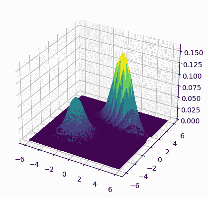
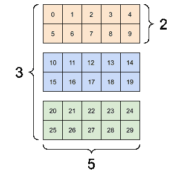
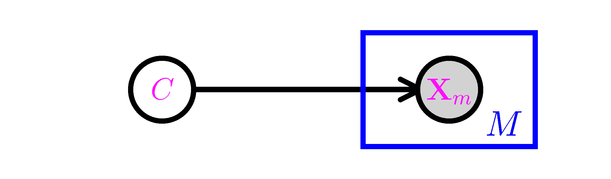
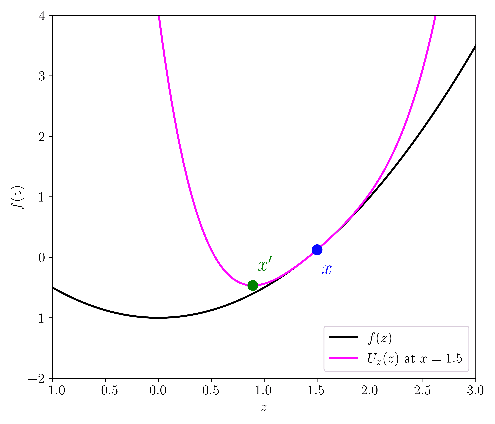
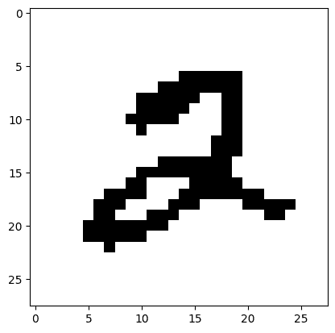
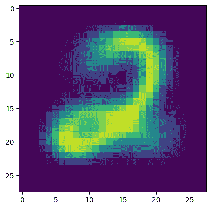
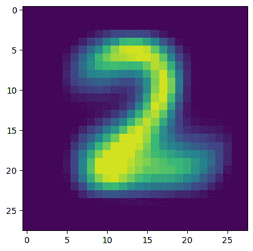

# 6.4\. 建模更复杂的依赖关系 2：边缘化未观察到的变量

> 原文：[`mmids-textbook.github.io/chap06_prob/04_em/roch-mmids-prob-em.html`](https://mmids-textbook.github.io/chap06_prob/04_em/roch-mmids-prob-em.html)

在本节中，我们继续介绍从更简单的构建块构建联合分布的第二种技术：边缘化未观察到的随机变量。

## 6.4.1\. 混合#

混合$\idx{mixture}\xdi$是定义概率分布的一种自然方式。基本思想是考虑一对随机向量 $(\bX,\bY)$ 并假设 $\bY$ 是未观察到的。对观察到的向量 $\bX$ 的影响是 $\bY$ 被边缘化。事实上，根据全概率定律，对于任何 $\bx \in \S_\bX$

$$\begin{align*} p_\bX(\bx) &= \P[\bX = \bx]\\ &= \sum_{\by \in \S_\bY} \P[\bX=\bx|\bY=\by] \,\P[\bY=\by]\\ &= \sum_{\by \in \S_\bY} p_{\bX|\bY}(\bx|\by) \,p_\bY(\by) \end{align*}$$

在这里，我们使用了事件 $\{\bY=\by\}$，其中 $\by \in \S_\bY$，构成了概率空间的一个划分。我们解释这个方程为定义 $p_\bX(\bx)$ 为 $p_{\bX|\bY}(\bx|\by)$，其中 $\by \in \S_\bY$，的凸组合——一种混合——具有混合权重 $p_\bY(\by)$。一般来说，我们需要指定完整的条件概率分布（CPD）：$p_{\bX|\bY}(\bx|\by), \forall \bx \in \S_{\bX}, \by \in \S_\bY$。但假设混合权重和/或 CPD 来自参数族可以帮助降低模型的复杂性。

这可以用一个有向图表示，其中从 $\mathbf{Y}$ 的顶点到 $\mathbf{X}$ 的顶点有一条有向边。进一步，我们让 $\mathbf{X}$ 的顶点被阴影覆盖以表示它是被观察到的，而 $\mathbf{Y}$ 的顶点没有被阴影覆盖以表示它没有被观察到。数学上，这对应于我们之前应用的全概率定律。


在参数背景下，这产生了一种丰富的方法来扩展分布族。假设 $\{p_{\btheta}:\btheta \in \Theta\}$ 是一个参数分布族。设 $K \geq 2$，$\btheta_1, \ldots, \btheta_K \in \Theta$ 和 $\bpi = (\pi_1,\ldots,\pi_K) \in \Delta_K$。假设 $Y \sim \mathrm{Cat}(\bpi)$ 并且条件分布满足

$$ p_{\bX|Y}(\bx|i) = p_{\btheta_i}(\bx). $$

我们将其表示为 $\bX|\{Y=i\} \sim p_{\btheta_i}$。然后我们获得混合模型

$$ p_{\bX}(\bx) = \sum_{i=1}^K p_{\bX|Y}(\bx|i) \,p_Y(i) = \sum_{i=1}^K \pi_i p_{\btheta_i}(\bx). $$

**EXAMPLE:** **(多项式混合)** 设 $n, m , K \geq 1$，$\bpi \in \Delta_K$，并且对于 $i=1,\ldots,K$，$\mathbf{p}_i = (p_{i1},\ldots,p_{im}) \in \Delta_m$。假设 $Y \sim \mathrm{Cat}(\bpi)$ 并且条件分布是

$$ \bX|\{Y=i\} \sim \mathrm{Mult}(n, \mathbf{p}_i). $$

然后 $\bX$ 是多项式混合。其分布如下

$$ p_\bX(\bx) = \sum_{i=1}^K \pi_i \frac{n!}{x_1!\cdots x_m!} \prod_{j=1}^m p_{ij}^{x_j}. $$

$\lhd$

接下来是一个重要的连续示例。

**示例：** **（高斯混合模型）** $\idx{Gaussian mixture model}\xdi$ 对于 $i=1,\ldots,K$，设 $\bmu_i$ 和 $\bSigma_i$ 为多元高斯的均值和协方差矩阵。设 $\bpi \in \Delta_K$。高斯混合模型（GMM）的获得如下：取 $Y \sim \mathrm{Cat}(\bpi)$ 和

$$ \bX|\{Y=i\} \sim N_d(\bmu_i, \bSigma_i). $$

其概率密度函数（PDF）的形式如下

$$ f_\bX(\bx) = \sum_{i=1}^K \pi_i \frac{1}{(2\pi)^{d/2} \,|\bSigma_i|^{1/2}} \exp\left(-\frac{1}{2}(\mathbf{x} - \bmu_i)^T \bSigma_i^{-1} (\bx - \bmu_i)\right). $$

$\lhd$

**数值角落：** 我们绘制了均值 $\bmu_1 = (-2,-2)$ 和 $\bmu_2 = (2,2)$ 以及协方差矩阵的密度

$$\begin{split} \bSigma_1 = \begin{bmatrix} 1.0 & 0 \\ 0 & 1.0 \end{bmatrix} \quad \text{和} \quad \bSigma_2 = \begin{bmatrix} \sigma_1² & \rho \sigma_1 \sigma_2 \\ \rho \sigma_1 \sigma_2 & \sigma_2² \end{bmatrix} \end{split}$$

其中 $\sigma_1 = 1.5$，$\sigma_2 = 0.5$ 和 $\rho = -0.75$。混合权重为 $\pi_1 = 0.25$ 和 $\pi_2 = 0.75$。

```py
from scipy.stats import multivariate_normal

def gmm2_pdf(X, Y, mean1, cov1, pi1, mean2, cov2, pi2):
    xy = np.stack([X.flatten(), Y.flatten()], axis=-1)
    Z1 = multivariate_normal.pdf(
        xy, mean=mean1, cov=cov1).reshape(X.shape) 
    Z2 = multivariate_normal.pdf(
        xy, mean=mean2, cov=cov2).reshape(X.shape) 
    return pi1 * Z1 + pi2 * Z2 
```

<details class="hide above-input"><summary aria-label="Toggle hidden content">显示代码单元格源 隐藏代码单元格源</summary>

```py
start_point = 6
stop_point = 6
num_samples = 100
points = np.linspace(-start_point, stop_point, num_samples)
X, Y = np.meshgrid(points, points)

mean1 = np.array([-2., -2.])
cov1 = np.array([[1., 0.], [0., 1.]])
pi1 = 0.5
mean2 = np.array([2., 2.])
cov2 = np.array([[1.5 ** 2., -0.75 * 1.5 * 0.5], 
                 [-0.75 * 1.5 * 0.5, 0.5 ** 2.]])
pi2 = 0.5
Z = gmm2_pdf(X, Y, mean1, cov1, pi1, mean2, cov2, pi2)
mmids.make_surface_plot(X, Y, Z) 
```</details> 

$\unlhd$

在 NumPy 中，正如我们之前所看到的，模块 `numpy.random` 也提供了一种通过使用 `numpy.random.Generator.choice` 来从混合模型中采样的方法。

例如，我们考虑多元高斯的混合。我们稍微改变一下符号以跟踪 Python 的索引。对于 $i=0,1$，我们有一个均值 $\bmu_i \in \mathbb{R}^d$ 和一个正定协方差矩阵 $\bSigma_i \in \mathbb{R}^{d \times d}$。我们还有一个混合权重 $\phi_0, \phi_1 \in (0,1)$，使得 $\phi_0 + \phi_1 = 1$。假设我们想要生成总共 $n$ 个样本。

对于每个样本 $j=1,\ldots, n$，独立于其他所有事物：

1.  我们首先随机选择一个组件 $i \in \{0,1\}$，根据混合权重，即 $i=0$ 以概率 $\phi_0$ 被选中，$i=1$ 以概率 $\phi_1$ 被选中。

1.  我们根据均值 $\bmu_i$ 和协方差 $\bSigma_i$ 生成一个样本 $\bX_j = (X_{j,1},\ldots,X_{j,d})$，它服从一个多元高斯分布。

这可以通过再次使用 `numpy.random.Generator.choice` 来选择每个样本的成分，并使用 `numpy.random.Generator.multivariate_normal` 来生成多元高斯分布来实现。为了方便，我们将均值和协方差矩阵堆叠到一个具有新维度的数组中。因此，例如，协方差矩阵现在将是一个三维数组，即具有 $3$ 个索引的数组。第一个索引对应于成分（这里 $0$ 或 $1$)。

**图：三个矩阵([来源](https://www.tensorflow.org/guide/tensor#basics))



$\bowtie$

**图：三个矩阵堆叠成一个三维数组([来源](https://www.tensorflow.org/guide/tensor#basics))


$\bowtie$

代码如下。它返回一个 `d` 行 `n` 列的数组 `X`，其中每一行是从一个两成分高斯混合分布中抽取的样本。

```py
def gmm2(rng, d, n, phi0, phi1, mu0, sigma0, mu1, sigma1):

    phi = np.stack((phi0, phi1))
    mu = np.stack((mu0, mu1))
    sigma = np.stack((sigma0,sigma1))

    X = np.zeros((n,d))
    component = rng.choice(2, size=n, p=phi)
    for i in range(n):
        X[i,:] = rng.multivariate_normal(
            mu[component[i],:],
            sigma[component[i],:,:])

    return X 
```

**数值角**: 让我们尝试以下参数。我们首先定义协方差矩阵，并展示当它们被堆叠到三维数组中时会发生什么（正如在 `gmm2` 中所做的那样）。

```py
d = 2
sigma0 = np.outer(np.array([2., 2.]), np.array([2., 2.])) 
sigma0 += np.outer(np.array([-0.5, 0.5]), np.array([-0.5, 0.5]))
sigma1 = 2 * np.identity(d)
sigma = np.stack((sigma0,sigma1))
print(sigma[0,:,:]) 
```

```py
[[4.25 3.75]
 [3.75 4.25]] 
```

```py
print(sigma[1,:,:]) 
```

```py
[[2\. 0.]
 [0\. 2.]] 
```

然后我们定义其余的参数。

```py
seed = 535
rng = np.random.default_rng(seed) 

n, w = 200, 5.
phi0 = 0.8
phi1 = 0.2
mu0 = np.concatenate(([w], np.zeros(d-1)))
mu1 = np.concatenate(([-w], np.zeros(d-1)))
X = gmm2(rng, d, n, phi0, phi1, mu0, sigma0, mu1, sigma1)

plt.scatter(X[:,0], X[:,1], s=5, marker='o', c='k')
plt.axis('equal')
plt.show() 
```


$\unlhd$

## 6.4.2. 示例：多元伯努利混合和 EM 算法#

令 $\mathcal{C} = \{1, \ldots, K\}$ 为一个类别的集合。令 $C$ 为一个取值在 $\mathcal{C}$ 中的随机变量，对于 $m=1, \ldots, M$，令 $X_i$ 取值在 $\{0,1\}$ 中。定义 $\pi_k = \P[C = k]$ 和 $p_{k,m} = \P[X_m = 1|C = k]$ 对于 $m = 1,\ldots, M$。我们用 $\bX = (X_1, \ldots, X_M)$ 表示相应的 $X_i$ 的向量，并假设在 $C$ 条件下这些条目是条件独立的。

然而，我们这次假设 $C$ 本身是*未观察到的*。因此，得到的联合分布是混合分布

$$\begin{align*} \P[\bX = \bx] &= \sum_{k=1}^K \P[C = k, \bX = \bx]\\ &= \sum_{k=1}^K \P[\bX = \bx|C=k] \,\P[C=k]\\ &= \sum_{k=1}^K \pi_k \prod_{m=1}^M p_{k,m}^{x_m} (1-p_{k,m})^{1-x_m}. \end{align*}$$

从图形上看，这与朴素贝叶斯模型相同，只是 $C$ 未被观察到，因此没有被阴影覆盖。



这种类型的模型在聚类任务中特别有用，其中 $c_k$s 可以被视为不同的簇。类似于我们在上一节中所做的，我们的目标是根据样本推断参数，然后根据其特征预测旧样本或新样本的类别。主要的 - 重要的 - 差异是样本的真实标签没有被观察到。正如我们将看到的，这大大增加了任务的复杂性。

**模型拟合** 我们首先从训练数据 $\{\bx_i\}_{i=1}^n$ 中拟合模型。回想一下，相应的类标签 $c_i$s 是未观察到的。在这种类型的模型中，它们被称为隐藏或潜在变量，我们将在下面回到它们的推理。

我们希望使用最大似然估计，即最大化观察数据的概率

$$ \mathcal{L}(\bpi, \{\bp_k\}; \{\bx_i\}) = \prod_{i=1}^n \left( \sum_{k=1}^K \pi_{k} \prod_{m=1}^M p_{k, m}^{x_{i,m}} (1-p_{k, m})^{1-x_{i,m}}\right). $$

如同往常，我们假设样本是独立同分布的。考虑负对数似然（NLL）

$$\begin{align*} L_n(\bpi, \{\bp_k\}; \{\bx_i\}) &= - \sum_{i=1}^n \log \left( \sum_{k=1}^K \pi_{k} \prod_{m=1}^M p_{k, m}^{x_{i,m}} (1-p_{k, m})^{1-x_{i,m}}\right). \end{align*}$$

已经，我们看到事情可能比在监督（或完全观察）的情况下更复杂。NLL 不能分解为依赖于不同参数集的项之和。

到这一点，一个人可以退回到优化领域，并使用基于梯度的方法来最小化 NLL。的确，这是一个选择，但请注意，必须小心地考虑问题的约束性质（即参数之和为 1）。有大量的约束优化技术适合这项任务。

而不是在这个上下文中更受欢迎的方法，即 EM 算法，它基于主成分最小化的通用原则，我们在 $k$-means 算法和光滑情况下的梯度下降收敛证明中隐式地遇到了这个原则。在回到混合模型拟合之前，我们将在下一小节中详细阐述这个重要的原则。

**主成分最小化** $\idx{majorization-minimization}\xdi$ 这是一个看似简单却强大的观察。假设我们想要最小化一个函数 $f : \mathbb{R}^d \to \mathbb{R}$。找到 $f$ 的局部最小值可能并不容易。但想象一下，对于每个 $\mathbf{x} \in \mathbb{R}^d$，我们都有一个代理函数 $U_{\mathbf{x}} : \mathbb{R}^d \to \mathbb{R}$，它（1）以下意义上支配 $f$

$$ U_\mathbf{x}(\mathbf{z}) \geq f(\mathbf{z}), \quad \forall \mathbf{z} \in \mathbb{R}^d $$

并且（2）在 $\mathbf{x}$ 处等于 $f$

$$ U_\mathbf{x}(\mathbf{x}) = f(\mathbf{x}). $$

我们说 $U_\mathbf{x}$ 在 $\mathbf{x}$ 处主元化 $f$。然后我们在下一个引理中证明 $U_\mathbf{x}$ 可以用来向最小化 $f$ 的方向前进，也就是说，找到一个点 $\mathbf{x}'$ 使得 $f(\mathbf{x}') \leq f(\mathbf{x})$。如果 $U_\mathbf{x}$ 比本身更容易最小化，比如说可以计算出一个显式的最小值，那么这个观察自然导致了一个迭代算法。



**引理** **(主元-最小化)** $\idx{主元-最小化引理}\xdi$ 设 $f : \mathbb{R}^d \to \mathbb{R}$ 并假设 $U_{\mathbf{x}}$ 在 $\mathbf{x}$ 处主元化 $f$。设 $\mathbf{x}'$ 是 $U_\mathbf{x}$ 的全局最小值。那么

$$ f(\mathbf{x}') \leq f(\mathbf{x}). $$

$\flat$

*证明:* 确实

$$ f(\mathbf{x}') \leq U_\mathbf{x}(\mathbf{x}') \leq U_{\mathbf{x}}(\mathbf{x}) = f(\mathbf{x}), $$

其中第一个不等式来自于 $U_\mathbf{x}$ 的支配性质，第二个不等式来自于 $\mathbf{x}'$ 是 $U_\mathbf{x}$ 的全局最小值，等式来自于 $U_{\mathbf{x}}$ 在 $\mathbf{x}$ 处等于 $f$。 $\square$

我们已经遇到过这个想法。

**示例** **(最小化光滑函数)** 设 $f : \mathbb{R}^d \to \mathbb{R}$ 是 $L$-光滑的。根据光滑函数的**二次界**，对于所有 $\mathbf{x}, \mathbf{z} \in \mathbb{R}^d$，都有

$$ f(\mathbf{z}) \leq U_{\mathbf{x}}(\mathbf{z}) := f(\mathbf{x}) + \nabla f(\mathbf{x})^T(\mathbf{z} - \mathbf{x}) + \frac{L}{2} \|\mathbf{z} - \mathbf{x}\|². $$

通过证明 $U_{\mathbf{x}}$ 在 $\mathbf{z} = \mathbf{x} - (1/L)\nabla f(\mathbf{x})$ 处达到最小值，我们之前得到了下降保证

$$ f(\mathbf{x} - (1/L)\nabla f(\mathbf{x})) \leq f(\mathbf{x}) - \frac{1}{2 L} \|\nabla f(\mathbf{x})\|² $$

对于梯度下降，这在其收敛性分析$\idx{收敛性分析}\xdi$中扮演了核心角色$\lhd$。 $\lhd$

**示例** **($k$-均值)** $\idx{Lloyd 的算法}\xdi$ 设 $\mathbf{x}_1,\ldots,\mathbf{x}_n$ 是 $\mathbb{R}^d$ 中的 $n$ 个向量。一种将 $k$-均值聚类问题表述为最小化的方法是

$$ f(\bmu_1,\ldots,\bmu_K) = \sum_{i=1}^n \min_{j \in [K]} \|\mathbf{x}_i - \bmu_j\|² $$

在中心 $\bmu_1,\ldots,\bmu_K$ 上，记住 $[K] = \{1,\ldots,K\}$。对于固定的 $\bmu_1,\ldots,\bmu_K$ 和 $\mathbf{m} = (\bmu_1,\ldots,\bmu_K)$，定义

$$ c_\mathbf{m}(i) \in \arg\min\left\{\|\mathbf{x}_i - \bmu_j\|² \ :\ j \in [K]\right\}, \quad i=1,\ldots,n $$

和

$$ U_\mathbf{m}(\blambda_1,\ldots,\blambda_K) = \sum_{i=1}^n \|\mathbf{x}_i - \blambda_{c_\mathbf{m}(i)}\|² $$

对于 $\blambda_1,\ldots,\blambda_K \in \mathbb{R}^d$。也就是说，我们固定了在 $\bmu_1,\ldots,\bmu_K$ 下的最优聚类分配，然后改变中心。

我们声称 $U_\mathbf{m}$ 在 $\bmu_1,\ldots,\bmu_K$ 处是 $f$ 的主导函数。实际上

$$ f(\blambda_1,\ldots,\blambda_K) = \sum_{i=1}^n \min_{j \in [K]} \|\mathbf{x}_i - \blambda_j\|² \leq \sum_{i=1}^n \|\mathbf{x}_i - \blambda_{c_\mathbf{m}(i)}\|² = U_\mathbf{m}(\blambda_1,\ldots,\blambda_K) $$

和

$$ f(\bmu_1,\ldots,\bmu_K) = \sum_{i=1}^n \min_{j \in [K]} \|\mathbf{x}_i - \bmu_j\|² = \sum_{i=1}^n \|\mathbf{x}_i - \bmu_{c_\mathbf{m}(i)}\|² = U_\mathbf{m}(\bmu_1,\ldots,\bmu_K). $$

此外，$U_\mathbf{m}(\blambda_1,\ldots,\blambda_K)$ 很容易最小化。我们之前已经证明，最优代表是

$$ \boldsymbol{\mu}_j' = \frac{1}{|C_j|} \sum_{i\in C_j} \mathbf{x}_i $$

其中 $C_j = \{i : c_\mathbf{m}(i) = j\}$.

*主次最小化引理* 意味着

$$ f(\bmu_1',\ldots,\bmu_K') \leq f(\bmu_1,\ldots,\bmu_K). $$

这个论点等同于我们之前对 $k$-means 算法的分析。$\lhd$

**CHAT & LEARN** 多变量伯努利混合模型假设有固定数量的簇。请向您喜欢的 AI 聊天机器人询问该模型的贝叶斯非参数扩展，例如狄利克雷过程混合模型，它可以自动从数据中推断簇的数量。$\ddagger$

**EM 算法** [期望最大化 (EM) 算法](https://en.wikipedia.org/wiki/Expectation%E2%80%93maximization_algorithm)$\idx{EM algorithm}\xdi$ 是一个应用广泛的原理实例，该原理适用于混合参数估计。在这里，我们专注于多变量伯努利混合。

回想一下，要最小化的目标是

$$\begin{align*} L_n(\bpi, \{\bp_k\}; \{\bx_i\}) &= - \sum_{i=1}^n \log \left( \sum_{k=1}^K \pi_{k} \prod_{m=1}^M p_{k, m}^{x_{i,m}} (1-p_{k, m})^{1-x_{i,m}}\right). \end{align*}$$

为了简化符号并突出一般思想，我们令 $\btheta = (\bpi, \{\bp_k\})$，用 $\Theta$ 表示 $\btheta$ 的允许值集合，并使用 $\P_{\btheta}$ 表示在参数 $\btheta$ 下计算概率。我们还将回到用未观察到的潜在变量 $\{C_i\}$ 来描述模型。也就是说，我们写出 NLL 为

$$\begin{align*} L_n(\btheta) &= - \sum_{i=1}^n \log \left( \sum_{k=1}^K \P_{\btheta}[\bX_i = \bx_i|C_i = k] \,\P_{\btheta}[C_i = k]\right)\\ &= - \sum_{i=1}^n \log \left( \sum_{k=1}^K \P_{\btheta}[\bX_i = \bx_i, C_i = k] \right). \end{align*}$$

为了推导出一个主导函数，我们使用了负对数的凸性。实际上

$$ \frac{\partial}{\partial z}[- \log z] = - \frac{1}{z} \quad \text{and} \quad \frac{\partial²}{\partial² z}[- \log z] = \frac{1}{z²} > 0, \quad \forall z > 0. $$

构造的第一步并不明显 – 它只是有效。对于每个 $i=1,\ldots,n$，我们让 $r_{k,i}^{\btheta}$，$k=1,\ldots,K$，成为 $[K]$ 上的严格正概率分布。换句话说，它为每个 $i$ 定义了一个凸组合。然后我们利用凸性得到上界

$$\begin{align*} L_n(\tilde\btheta) &= - \sum_{i=1}^n \log \left( \sum_{k=1}^K r_{k,i}^{\btheta} \frac{\P_{\tilde\btheta}[\bX_i = \bx_i, C_i = k]}{r_{k,i}^{\btheta}} \right)\\ &\leq - \sum_{i=1}^n \sum_{k=1}^K r_{k,i}^{\btheta} \log \left(\frac{\P_{\tilde\btheta}[\bX_i = \bx_i, C_i = k]}{r_{k,i}^{\btheta}} \right), \end{align*}$$

这对于任何 $\tilde\btheta = (\tilde\bpi, \{\tilde\bp_k\}) \in \Theta$ 都成立。

我们选择

$$ r_{k,i}^{\btheta} = \P_{\btheta}[C_i = k|\bX_i = \bx_i] $$

（我们暂时假设它是严格正的）并且我们用 $Q_{n}(\tilde\btheta|\btheta)$ 表示不等式的右侧（作为 $\tilde\btheta$ 的函数）。

我们做出两个观察。

1- *支配性质*: 对于任何 $\tilde\btheta \in \Theta$，上述不等式立即意味着 $L_n(\tilde\btheta) \leq Q_n(\tilde\btheta|\btheta)$。

2- *在 $\btheta$ 处的等价性*: 在 $\tilde\btheta = \btheta$，

$$\begin{align*} Q_n(\btheta|\btheta) &= - \sum_{i=1}^n \sum_{k=1}^K r_{k,i}^{\btheta} \log \left(\frac{\P_{\btheta}[\bX_i = \bx_i, C_i = k]}{r_{k,i}^{\btheta}} \right)\\ &= - \sum_{i=1}^n \sum_{k=1}^K r_{k,i}^{\btheta} \log \left(\frac{\P_{\btheta}[C_i = k | \bX_i = \bx_i] \P_{\btheta}[\bX_i = \bx_i]}{r_{k,i}^{\btheta}} \right)\\ &= - \sum_{i=1}^n \sum_{k=1}^K r_{k,i}^{\btheta} \log \P_{\btheta}[\bX_i = \bx_i]\\ &= - \sum_{i=1}^n \log \P_{\btheta}[\bX_i = \bx_i]\\ &= L_n(\btheta). \end{align*}$$

上述两个性质表明，$Q_n(\tilde\btheta|\btheta)$，作为 $\tilde\btheta$ 的函数，在 $\btheta$ 处主次于 $L_n$。

**引理** **(EM 保证)** $\idx{EM guarantee}\xdi$ 设 $\btheta^*$ 是 $Q_n(\tilde\btheta|\btheta)$ 作为 $\tilde\btheta$ 的函数的全局最小化者，前提是它存在。那么

$$ L_n(\btheta^*) \leq L_n(\btheta). $$

$\flat$

*证明:* 该结果直接来自 *主次最小化引理*。 $\square$

我们从中得到了什么？正如我们之前提到的，如果 $Q_n$ 比本身更容易最小化，那么使用 *主次最小化引理* 是有意义的。让我们看看为什么在这里是这样的。

*E 步:* 函数 $Q_n$ 自然分解为两个部分

$$\begin{align*} Q_n(\tilde\btheta|\btheta) &= - \sum_{i=1}^n \sum_{k=1}^K r_{k,i}^{\btheta} \log \left(\frac{\P_{\tilde\btheta}[\bX_i = \bx_i, C_i = k]}{r_{k,i}^{\btheta}} \right)\\ &= - \sum_{i=1}^n \sum_{k=1}^K r_{k,i}^{\btheta} \log \P_{\tilde\btheta}[\bX_i = \bx_i, C_i = k] + \sum_{i=1}^n \sum_{k=1}^K r_{k,i}^{\btheta} \log r_{k,i}^{\btheta}. \end{align*}$$

因为 $r_{k,i}^{\btheta}$ 依赖于 $\btheta$ 但不依赖于 $\tilde\btheta$，所以第二个项与关于 $\tilde\btheta$ 的优化无关。

上述第一个项可以写成

$$\begin{align*} & - \sum_{i=1}^n \sum_{k=1}^K r_{k,i}^{\btheta} \log \P_{\tilde\btheta}[\bX_i = \bx_i, C_i = k]\\ &= - \sum_{i=1}^n \sum_{k=1}^K r_{k,i}^{\btheta} \log \left(\tilde{\pi}_{k} \prod_{m=1}^M \tilde{p}_{k, m}^{x_{i,m}} (1-\tilde{p}_{k,m})^{1-x_{i,m}}\right)\\ &= - \sum_{k=1}^K \eta_k^{\btheta} \log \tilde{\pi}_k - \sum_{k=1}^K \sum_{m=1}^M [\eta_{k,m}^{\btheta} \log \tilde{p}_{k,m} + (\eta_k^{\btheta}-\eta_{k,m}^{\btheta}) \log (1-\tilde{p}_{k,m})], \end{align*}$$

在这里，我们定义了 $k=1,\ldots,K$ 的情况，

$$ \eta_{k,m}^{\btheta} = \sum_{i=1}^n x_{i,m} r_{k,i}^{\btheta} \quad \text{和} \quad \eta_k^{\btheta} = \sum_{i=1}^n r_{k,i}^{\btheta}. $$

这里是关键观察：这个最后的表达式本质上与完全观察的朴素贝叶斯模型的 NLL 相同，只是将项 $\mathbf{1}_{\{c_i = k\}}$ 替换为 $r_{k,i}^{\btheta}$。如果 $\btheta$ 是我们当前参数的估计，那么量 $r_{k,i}^{\btheta} = \P_{\btheta}[C_i = k|\bX_i = \bx_i]$ 是我们在当前参数 $\btheta$ 下对样本 $\bx_i$ 来自簇 $k$ 的概率的估计。我们之前已经计算了 $r_{k,i}^{\btheta}$ 以在朴素贝叶斯模型下进行预测。我们展示了在那里，

$$ r_{k,i}^{\btheta} = \frac{\pi_k \prod_{m=1}^M p_{k,m}^{x_{i,m}} (1-p_{k,m})^{1-x_{i,m}}} {\sum_{k'=1}^K \pi_{k'} \prod_{m=1}^M p_{k',m}^{x_{i,m}} (1-p_{k',m})^{1-x_{i,m}}}, $$

在这个新的上下文中被称为簇 $k$ 对数据点 $i$ 的责任。因此，我们可以这样解释上述表达式：变量 $\mathbf{1}_{\{c_i = k\}}$ 在这里没有观察到，但我们已经根据观察到的数据 $\{\bx_i\}$ 估计了它们的条件概率分布，并且我们是在这个分布上取期望。

E 步骤（以及 EM）中的“E”代表“期望”，这指的是使用一个本质上为期望 NLL 的代理函数。

*M 步骤:* 从实际的角度来看，在 $\tilde\btheta$ 上最小化 $Q_n(\tilde\btheta|\btheta)$ 实际上是一种拟合朴素贝叶斯模型的变体——而且所有这一切的最终结果是有一个简单的公式！回想一下，这是因为朴素贝叶斯模型中的 NLL 分解：它自然地分解成依赖于不同参数集的项，每个参数集都可以用闭式表达式进行优化。从推导中可以看出，$Q_n$ 也是如此。

在调整我们之前的计算以拟合朴素贝叶斯模型时，我们得到 $Q_n(\tilde\btheta|\btheta)$ 在以下情况下最小化：

$$ \pi_k^* = \frac{\eta_k^{\btheta}}{n} \quad \text{和} \quad p_{k,m}^* = \frac{\eta_{k,m}^{\btheta}}{\eta_k^{\btheta}} \quad \forall k \in [K], m \in [M]. $$

我们使用了以下事实

$$\begin{align*} \sum_{k=1}^K \eta_k^{\btheta} &= \sum_{k=1}^K \sum_{i=1}^n r_{k,i}^{\btheta}\\ &= \sum_{i=1}^n \sum_{k=1}^K \P_{\btheta}[C_i = k|\bX_i = \bx_i]\\ &= \sum_{i=1}^n 1\\ &= n, \end{align*}$$

因为条件概率 $\P_{\btheta}[C_i = k|\bX_i = \bx_i]$ 在 $k$ 上求和时总和为 1。

M 步（和 EM）中的“M”代表最大化，在这里由于使用了 NLL，它变成了最小化。

总结来说，在这种情况下，EM 算法的工作原理如下。假设我们有一些数据点 $\{\bx_i\}_{i=1}^n$，我们固定了 $K$，并且我们有一些初始参数估计 $\btheta⁰ = (\bpi⁰, \{\bp_k⁰\}) \in \Theta$，其中 $\pi_k⁰$s 和 $p_{k,m}⁰$s 都是严格正的。对于 $t = 0,1,\ldots, T-1$，我们计算所有 $i \in [n]$，$k \in [K]$，和 $m \in [M]$ 的值

$$ r_{k,i}^t = \frac{\pi_k^t \prod_{m=1}^M (p_{k,m}^t)^{x_{i,m}} (1-p_{k,m}^t)^{1-x_{i,m}}} {\sum_{k'=1}^K \pi_{k'}^t \prod_{m=1}^M (p_{k',m}^t)^{x_{i,m}} (1-p_{k',m}^t)^{1-x_{i,m}}}, \quad \text{(E 步)} $$$$ \eta_{k,m}^t = \sum_{i=1}^n x_{i,m} r_{k,i}^t \quad \text{和} \quad \eta_k^t = \sum_{i=1}^n r_{k,i}^t, $$

和

$$ \pi_k^{t+1} = \frac{\eta_k^t}{n} \quad \text{和} \quad p_{k,m}^{t+1} = \frac{\eta_{k,m}^t}{\eta_k^t}. \quad \text{(M 步)} $$

假设对于所有 $m$，$\sum_{i=1}^n x_{i,m} > 0$，则 $\eta_{k,m}^t$s 和 $\eta_k^t$s 对于所有 $t$ 都保持正值，并且算法是良好定义的。*EM 保证*规定 NLL 不能恶化，尽管请注意，它并不保证收敛到全局最小值。

我们实现了多元伯努利混合的 EM 算法。为此，我们调整了我们之前的朴素贝叶斯程序。我们还允许使用拉普拉斯平滑。

```py
def responsibility(pi_k, p_km, x):

    K = len(pi_k)
    score_k = np.zeros(K)
    for k in range(K):

        score_k[k] -= np.log(pi_k[k])
        score_k[k] -= np.sum(x * np.log(p_km[k,:]) 
                             + (1 - x) * np.log(1 - p_km[k,:]))
    r_k = np.exp(-score_k)/(np.sum(np.exp(-score_k)))

    return r_k

def update_parameters(eta_km, eta_k, eta, alpha, beta):

    K = len(eta_k)
    pi_k = (eta_k+alpha) / (eta+K*alpha)
    p_km = (eta_km+beta) / (eta_k[:,np.newaxis]+2*beta)

    return pi_k, p_km 
```

我们接下来实现 E 步和 M 步。

```py
def em_bern(X, K, pi_0, p_0, maxiters = 10, alpha=0., beta=0.):

    n, M = X.shape
    pi_k = pi_0
    p_km = p_0

    for _ in range(maxiters):

        # E Step
        r_ki = np.zeros((K,n))
        for i in range(n):
            r_ki[:,i] = responsibility(pi_k, p_km, X[i,:])

        # M Step 
        eta_km = np.zeros((K,M))
        eta_k = np.sum(r_ki, axis=-1)
        eta = np.sum(eta_k)
        for k in range(K):
            for m in range(M):
                eta_km[k,m] = np.sum(X[:,m] * r_ki[k,:]) 
        pi_k, p_km = update_parameters(
            eta_km, eta_k, eta, alpha, beta)

    return pi_k, p_km 
```

**数值角**: 我们在一个非常简单的数据集上测试了该算法。

```py
X = np.array([[1., 1., 1.],[1., 1., 1.],[1., 1., 1.],[1., 0., 1.],
              [0., 1., 1.],[0., 0., 0.],[0., 0., 0.],[0., 0., 1.]])
n, M = X.shape
K = 2
pi_0 = np.ones(K)/K
p_0 = rng.random((K,M))

pi_k, p_km = em_bern(
    X, K, pi_0, p_0, maxiters=100, alpha=0.01, beta=0.01)

print(pi_k) 
```

```py
[0.66500949 0.33499051] 
```

```py
print(p_km) 
```

```py
[[0.74982646 0.74982646 0.99800266]
 [0.00496739 0.00496739 0.25487292]] 
```

我们计算向量 $(0, 0, 1)$ 在每个簇中的概率。

```py
x_test = np.array([0., 0., 1.])
print(responsibility(pi_k, p_km, x_test)) 
```

```py
[0.32947702 0.67052298] 
```

**聊天与学习**: EM 算法有时会陷入局部最优。请向您的首选 AI 聊天机器人询问初始化 EM 算法以避免此问题的策略，例如使用多次随机重启或使用 k-means 算法进行初始化。([在 Colab 中打开](https://colab.research.google.com/github/MMiDS-textbook/MMiDS-textbook.github.io/blob/main/just_the_code/roch_mmids_chap_prob_notebook.ipynb)) $\ddagger$

$\unlhd$

## 6.4.3\. 手写数字聚类#

为了给出一个更复杂的例子，我们使用了 MNIST 数据集。

再次引用[Wikipedia](https://en.wikipedia.org/wiki/MNIST_database)：

> MNIST 数据库（修改后的国家标准与技术研究院数据库）是一个包含大量手写数字的大型数据库，常用于训练各种图像处理系统。该数据库在机器学习领域的训练和测试中也得到了广泛应用。它是通过“重新混合”NIST 原始数据集的样本创建的。创建者认为，由于 NIST 的训练数据集是从美国人口普查局员工那里获得的，而测试数据集是从美国高中生那里获得的，因此它不适合机器学习实验。此外，NIST 的黑白图像被归一化以适应 28x28 像素的边界框，并进行了抗锯齿处理，这引入了灰度级别。MNIST 数据库包含 60,000 张训练图像和 10,000 张测试图像。训练集和测试集各有一半来自 NIST 的训练数据集，另一半来自 NIST 的测试数据集。

**图示：** MNIST 样本图像 ([来源](https://commons.wikimedia.org/wiki/File:MnistExamples.png))


$\bowtie$

**数值角：** 我们从 PyTorch 中加载它。数据可以通过 `torchvision.datasets.MNIST` ([链接](https://pytorch.org/vision/stable/generated/torchvision.datasets.MNIST.html)) 访问。下面的 `squeeze()` ([链接](https://pytorch.org/docs/stable/generated/torch.Tensor.squeeze.html)) 从图像中移除了颜色维度，使其变为灰度图。`numpy()` ([链接](https://pytorch.org/docs/stable/generated/torch.Tensor.numpy.html)) 将 PyTorch 张量转换为 NumPy 数组。有关数据加载的详细信息，请参阅 `torch.utils.data.DataLoader` ([链接](https://pytorch.org/docs/stable/data.html#torch.utils.data.DataLoader))。我们将在下一章中详细介绍 PyTorch。

<details class="hide above-input"><summary aria-label="Toggle hidden content">显示代码单元格源代码 隐藏代码单元格源代码</summary>

```py
from torchvision import datasets, transforms
from torch.utils.data import DataLoader

mnist = datasets.MNIST(root='./data', train=True, 
                       download=True, transform=transforms.ToTensor())
train_loader = DataLoader(mnist, batch_size=len(mnist), shuffle=False)

imgs, labels = next(iter(train_loader))
imgs = imgs.squeeze().numpy()
labels = labels.numpy() 
```</details>

我们通过四舍五入像素将灰度图像转换为黑白图像。

```py
imgs = np.round(imgs) 
```

写 $2$ 有两种常见方式。让我们看看多元伯努利混合能否找到它们。我们提取了标记为 $2$ 的图像。

```py
mask = labels == 2
imgs2 = imgs[mask]
labels2 = labels[mask] 
```

第一张图像如下。

<details class="hide above-input"><summary aria-label="Toggle hidden content">显示代码单元格源代码 隐藏代码单元格源代码</summary>

```py
plt.imshow(imgs2[0], cmap='gray_r')
plt.show() 
```</details> 

接下来，我们将图像转换为向量。

```py
X = imgs2.reshape(len(imgs2), -1) 
```

我们用 $2$ 个簇运行算法。

```py
n, M = X.shape
K = 2
pi_0 = np.ones(K)/K
p_0 = rng.random((K,M))

pi_k, p_km = em_bern(
    X, K, pi_0, p_0, maxiters=10, alpha=1., beta=1.)

print(pi_k) 
```

```py
[nan nan] 
```

哎呀。出错了。我们遇到了一个数值问题，下溢，我们之前简要讨论过。为了确认这一点，我们再次运行代码，但要求 Python 使用 `numpy.seterr`（https://numpy.org/doc/stable/reference/generated/numpy.seterr.html）来警告我们。（默认情况下，警告是关闭的，但可以使用 `warnings.resetwarnings`（https://docs.python.org/3/library/warnings.html#warnings.resetwarnings）重新激活。）

```py
warnings.resetwarnings()
old_settings = np.seterr(all='warn')

pi_k, p_km = em_bern(
    X, K, pi_0, p_0, maxiters=10, alpha=1., beta=1.) 
```

```py
/var/folders/k0/7k0fxl7j54q4k8dyqnrc6sz00000gr/T/ipykernel_84428/861379570.py:10: RuntimeWarning: underflow encountered in exp
  r_k = np.exp(-score_k)/(np.sum(np.exp(-score_k)))
/var/folders/k0/7k0fxl7j54q4k8dyqnrc6sz00000gr/T/ipykernel_84428/861379570.py:10: RuntimeWarning: invalid value encountered in divide
  r_k = np.exp(-score_k)/(np.sum(np.exp(-score_k))) 
```

$\unlhd$

当我们计算责任

$$ r_{k,i}^t = \frac{\pi_k^t \prod_{m=1}^M (p_{k,m}^t)^{x_{i,m}} (1-p_{k,m}^t)^{1-x_{i,m}}} {\sum_{k'=1}^K \pi_{k'}^t \prod_{m=1}^M (p_{k',m}^t)^{x_{i,m}} (1-p_{k',m}^t)^{1-x_{i,m}}}, $$

我们首先计算分子中每个项的负对数，就像在朴素贝叶斯案例中做的那样。但这次我们应用函数 $e^{-x}$，因为这次我们不仅仅是在计算一个最优分数。当所有分数都很高时，这一步可能会导致下溢，也就是说，产生非常小的数字，它们会被 NumPy 四舍五入到零。然后定义 `r_k` 的比率就不明确了。

为了处理这个问题，我们引入了一种称为对数和指数技巧（log-sum-exp trick）的技术（在 ChatGPT 的一些帮助下）。考虑一个函数 $\mathbf{a} = (a_1, \ldots, a_n)$ 的计算，其形式如下

$$ h(\mathbf{a}) = \log \left( \sum_{i=1}^{n} e^{-a_i} \right). $$

当 $a_i$ 的值是很大的正数时，项 $e^{-a_i}$ 可以非常小，以至于下溢到零。为了解决这个问题，对数和指数技巧涉及一个移位，将这两个项带入一个更有利的数值范围。

它的进行过程如下：

1.  识别 $a_i$ 中的最小值 $M$

    $$ M = \min\{a_1, a_2, \ldots, a_n\}. $$

1.  在指数之前从每个 $a_i$ 中减去 $M$

    $$ \log \left( \sum_{i=1}^{n} e^{-a_i} \right) = \log \left( e^{-M} \sum_{i=1}^{n} e^{- (a_i - M)} \right). $$

1.  使用对数性质重写

    $$ = -M + \log \left( \sum_{i=1}^{n} e^{-(a_i - M)} \right). $$

为什么这有助于避免下溢？通过从每个 $a_i$ 中减去 $M$，即集合中的最小值：（i）$\{e^{-(a_i - M)} : i = 1,\ldots,n\}$ 中的最大项变为 $e⁰ = 1$；并且（ii）所有其他项都在 0 和 1 之间，因为它们是非正数的指数。这种操作避免了项下溢到零，因为即使是非常大的值，当通过 $M$ 移位时，也不太可能达到下溢阈值。

这里有一个例子。假设你有一个 $\mathbf{a} = (1000, 1001, 1002)$。

+   直接计算：$e^{-1000}$，$e^{-1001}$，和 $e^{-1002}$ 可能都会下溢到零。

+   使用对数和指数技巧：减去 $M = 1000$，得到 $e^{0}$，$e^{-1}$，和 $e^{-2}$，所有这些都有意义、非零的结果，准确地贡献到总和。

我们在 NumPy 中实现。

```py
def log_sum_exp_trick(a):
    min_val = np.min(a)
    return - min_val + np.log(np.sum(np.exp(- a + min_val))) 
```

**数值角落：** 我们在一个简单的例子上尝试它。

```py
a = np.array([1000, 1001, 1002]) 
```

我们首先尝试直接计算。

```py
np.log(np.sum(np.exp(-a))) 
```

```py
/var/folders/k0/7k0fxl7j54q4k8dyqnrc6sz00000gr/T/ipykernel_84428/214275762.py:1: RuntimeWarning: underflow encountered in exp
  np.log(np.sum(np.exp(-a)))
/var/folders/k0/7k0fxl7j54q4k8dyqnrc6sz00000gr/T/ipykernel_84428/214275762.py:1: RuntimeWarning: divide by zero encountered in log
  np.log(np.sum(np.exp(-a))) 
```

```py
-inf 
```

预计会得到下溢错误和无用的输出。

接下来，我们尝试 log-sum-exp 技巧。

```py
log_sum_exp_trick(a) 
```

```py
-999.5923940355556 
```

这次我们得到了一个看似合理的输出，略大于预期的 $-1000$（为什么？）。

$\unlhd$

在这个长——但很重要！——的括号之后，我们回到 EM 算法。我们通过在子程序`responsibility`中实现 log-sum-exp 技巧来修改它。

```py
def responsibility(pi_k, p_km, x):

    K = len(pi_k)
    score_k = np.zeros(K)
    for k in range(K):

        score_k[k] -= np.log(pi_k[k])
        score_k[k] -= np.sum(x * np.log(p_km[k,:]) 
                             + (1 - x) * np.log(1 - p_km[k,:]))
    r_k = np.exp(-score_k - log_sum_exp_trick(score_k))

    return r_k 
```

**数值角**: 我们回到只有 2s 的 MNIST 示例。

```py
pi_k, p_km = em_bern(X, K, pi_0, p_0, maxiters=10, alpha=1., beta=1.) 
```

这里是一个簇的参数。

```py
plt.figure()
plt.imshow(p_km[0,:].reshape((28,28)))
plt.show() 
```



这里是另一个。

```py
plt.figure()
plt.imshow(p_km[1,:].reshape((28,28)))
plt.show() 
```



现在模型已经训练好，我们计算每个簇中示例图像的概率。我们使用之前绘制的数据集的第一张图像。

```py
responsibility(pi_k, p_km, X[0,:]) 
```

```py
array([1.00000000e+00, 5.09357087e-17]) 
```

它确实识别出第二个簇更有可能。

**尝试一下！** 在 MNIST 示例中，正如我们所看到的，涉及的概率非常小，责任值接近 $0$ 或 $1$。实现一个 EM 的变体，称为硬 EM，用最大的责任值的一热编码替换责任值。再次在 MNIST 示例上测试它。([在 Colab 中打开](https://colab.research.google.com/github/MMiDS-textbook/MMiDS-textbook.github.io/blob/main/just_the_code/roch_mmids_chap_prob_notebook.ipynb))

$\unlhd$

**聊天与学习** 多元伯努利混合模型是潜在变量模型的一个简单例子。请你的 AI 聊天机器人讨论更复杂的潜在变量模型，如变分自编码器或高斯过程潜在变量模型，以及它们在无监督学习中的应用。 $\ddagger$

***自我评估测验*** *(有 Claude、Gemini 和 ChatGPT 的帮助)*

**1** 在多元伯努利混合模型中，联合分布由以下给出：

a) $\mathbb{P}[\mathbf{X} = \mathbf{x}] = \prod_{k=1}^K \mathbb{P}[C = k, \mathbf{X} = \mathbf{x}]$

b) $\mathbb{P}[\mathbf{X} = \mathbf{x}] = \sum_{k=1}^K \mathbb{P}[\mathbf{X} = \mathbf{x}|C = k] \mathbb{P}[C = k]$

c) $\mathbb{P}[\mathbf{X} = \mathbf{x}] = \prod_{k=1}^K \mathbb{P}[\mathbf{X} = \mathbf{x}|C = k] \mathbb{P}[C = k]$

d) $\mathbb{P}[\mathbf{X} = \mathbf{x}] = \sum_{\mathbf{x}} \mathbb{P}[C = k, \mathbf{X} = \mathbf{x}]$

**2** 主导-最小化原理表明：

a) 如果 $U_{\mathbf{x}}$ 在 $\mathbf{x}$ 处主导 $f$，那么 $U_{\mathbf{x}}$ 的全局最小值 $\mathbf{x}'$ 满足 $f(\mathbf{x}') \geq f(\mathbf{x})$。

b) 如果 $U_{\mathbf{x}}$ 在 $\mathbf{x}$ 处主导 $f$，那么 $U_{\mathbf{x}}$ 的全局最小值 $\mathbf{x}'$ 满足 $f(\mathbf{x}') \leq f(\mathbf{x})$。

c) 如果 $U_{\mathbf{x}}$ 在 $\mathbf{x}$ 处次主导 $f$，那么 $U_{\mathbf{x}}$ 的全局最小值 $\mathbf{x}'$ 满足 $f(\mathbf{x}') \geq f(\mathbf{x})$。

d) 如果$U_{\mathbf{x}}$在$\mathbf{x}$处次支配$f$，那么$U_{\mathbf{x}}$的全局最小值$\mathbf{x}'$满足$f(\mathbf{x}') \leq f(\mathbf{x})$。

**3** 在多变量伯努利混合的 EM 算法中，M 步骤包括：

a) 更新参数$\pi_k$和$p_{k,m}$

b) 计算责任$r_{k,i}^t$

c) 最小化负对数似然

d) 应用对数和指数技巧

**4** 多变量伯努利混合模型由以下图模型表示：

a)

```py
G = nx.DiGraph()
G.add_node("X", shape="circle", style="filled", fillcolor="gray")
G.add_node("C", shape="circle", style="filled", fillcolor="white")
G.add_edge("C", "X") 
```

b)

```py
G = nx.DiGraph()
G.add_node("X", shape="circle", style="filled", fillcolor="white")
G.add_node("C", shape="circle", style="filled", fillcolor="gray")
G.add_edge("C", "X") 
```

c)

```py
G = nx.DiGraph()
G.add_node("X", shape="circle", style="filled", fillcolor="gray")
G.add_node("C", shape="circle", style="filled", fillcolor="gray")
G.add_edge("C", "X") 
```

d)

```py
G = nx.DiGraph()
G.add_node("X", shape="circle", style="filled", fillcolor="white")
G.add_node("C", shape="circle", style="filled", fillcolor="white")
G.add_edge("C", "X") 
```

**5** 在聚类的背景下，EM 算法 E 步骤中计算的责任有什么解释？

a) 他们表示每个数据点到簇中心的距离。

b) 它们表示每个数据点属于每个簇的概率。

c) 他们确定最佳簇数量。

d) 它们用于 M 步骤中初始化簇中心。

1 号的答案：b. 理由：文本指出，“$\mathbb{P}[\mathbf{X} = \mathbf{x}] = \sum_{k=1}^K \mathbb{P}[C = k, \mathbf{X} = \mathbf{x}] = \sum_{k=1}^K \mathbb{P}[\mathbf{X} = \mathbf{x}|C = k] \mathbb{P}[C = k]$。”

2 号的答案：b. 理由：“设$f: \mathbb{R}^d \to \mathbb{R}$并且假设$U_{\mathbf{x}}$在$\mathbf{x}$处主支配$f$。设$\mathbf{x}'$是$U_{\mathbf{x}}(\mathbf{z})$作为$\mathbf{z}$的函数的全局最小值，如果存在的话。那么$f(\mathbf{x}') \leq f(\mathbf{x})$。”

3 号的答案：a. 理由：在 EM 算法的总结中，M 步骤被描述为更新参数：“$\pi_k^{t+1} = \frac{\eta_k^t}{n}$和$p_{k,m}^{t+1} = \frac{\eta_{k,m}^t}{\eta_k^t}$，”这需要责任值。

4 号的答案：b. 理由：文本指出，“数学上，这相当于应用我们之前使用的全概率定律。进一步，我们让$X$的顶点被阴影覆盖以表示它是已观察到的，而$Y$的顶点没有被阴影覆盖以表示它没有被观察到。”

5 号的答案：b. 理由：文本将责任定义为“在当前参数下，样本来自簇$k$的概率的估计。”

## 6.4.1\. 混合\#

混合$\idx{mixture}\xdi$是定义概率分布的自然方式。基本思想是考虑一对随机向量$(\bX,\bY)$并假设$\bY$是未观察到的。对观察向量$\bX$的影响是$\bY$被边缘化。实际上，根据全概率定律，对于任何$\bx \in \S_\bX$

$$\begin{align*} p_\bX(\bx) &= \P[\bX = \bx]\\ &= \sum_{\by \in \S_\bY} \P[\bX=\bx|\bY=\by] \,\P[\bY=\by]\\ &= \sum_{\by \in \S_\bY} p_{\bX|\bY}(\bx|\by) \,p_\bY(\by) \end{align*}$$

其中我们使用了事件 $\{\bY=\by\}$，$\by \in \S_\bY$，构成了概率空间的划分。我们解释这个方程为定义 $p_\bX(\bx)$ 为 $p_{\bX|\bY}(\bx|\by)$，$\by \in \S_\bY$ 的凸组合——混合——，混合权重为 $p_\bY(\by)$。一般来说，我们需要指定完整的条件概率分布（CPD）：$p_{\bX|\bY}(\bx|\by), \forall \bx \in \S_{\bX}, \by \in \S_\bY$。但假设混合权重和/或 CPD 来自参数化族可以帮助减少模型的复杂性。

该模型可以用一个有向图表示，其中从 $\mathbf{Y}$ 的顶点到 $\mathbf{X}$ 的顶点有一条有向边。进一步地，我们让 $\mathbf{X}$ 的顶点被阴影覆盖以表示它被观察，而 $\mathbf{Y}$ 的顶点没有被阴影覆盖以表示它没有被观察。从数学上来说，这对应于应用我们之前使用的全概率定律。


在参数化背景下，这产生了一种丰富的方法来扩展分布族。假设 $\{p_{\btheta}:\btheta \in \Theta\}$ 是一个参数化的分布族。令 $K \geq 2$，$\btheta_1, \ldots, \btheta_K \in \Theta$ 和 $\bpi = (\pi_1,\ldots,\pi_K) \in \Delta_K$。假设 $Y \sim \mathrm{Cat}(\bpi)$ 并且条件分布满足

$$ p_{\bX|Y}(\bx|i) = p_{\btheta_i}(\bx). $$

我们将其写作 $\bX|\{Y=i\} \sim p_{\btheta_i}$。然后我们得到混合模型

$$ p_{\bX}(\bx) = \sum_{i=1}^K p_{\bX|Y}(\bx|i) \,p_Y(i) = \sum_{i=1}^K \pi_i p_{\btheta_i}(\bx). $$

**示例：** **(多项式混合)** 设 $n, m , K \geq 1$，$\bpi \in \Delta_K$，对于 $i=1,\ldots,K$，$\mathbf{p}_i = (p_{i1},\ldots,p_{im}) \in \Delta_m$。假设 $Y \sim \mathrm{Cat}(\bpi)$ 并且条件分布是

$$ \bX|\{Y=i\} \sim \mathrm{Mult}(n, \mathbf{p}_i). $$

那么 $\bX$ 是多项式的混合。它的分布是

$$ p_\bX(\bx) = \sum_{i=1}^K \pi_i \frac{n!}{x_1!\cdots x_m!} \prod_{j=1}^m p_{ij}^{x_j}. $$

$\lhd$

接下来是一个重要的连续示例。

**示例：** **(高斯混合模型)** $\idx{高斯混合模型}\xdi$ 对于 $i=1,\ldots,K$，设 $\bmu_i$ 和 $\bSigma_i$ 是多元高斯的均值和协方差矩阵。设 $\bpi \in \Delta_K$。高斯混合模型（GMM）的获得如下：取 $Y \sim \mathrm{Cat}(\bpi)$ 和

$$ \bX|\{Y=i\} \sim N_d(\bmu_i, \bSigma_i). $$

其概率密度函数（PDF）的形式是

$$ f_\bX(\bx) = \sum_{i=1}^K \pi_i \frac{1}{(2\pi)^{d/2} \,|\bSigma_i|^{1/2}} \exp\left(-\frac{1}{2}(\mathbf{x} - \bmu_i)^T \bSigma_i^{-1} (\bx - \bmu_i)\right). $$

$\lhd$

**数值角落：** 我们绘制了均值 $\bmu_1 = (-2,-2)$ 和 $\bmu_2 = (2,2)$ 以及协方差矩阵的密度图

$$\begin{split} \bSigma_1 = \begin{bmatrix} 1.0 & 0 \\ 0 & 1.0 \end{bmatrix} \quad \text{和} \quad \bSigma_2 = \begin{bmatrix} \sigma_1² & \rho \sigma_1 \sigma_2 \\ \rho \sigma_1 \sigma_2 & \sigma_2² \end{bmatrix} \end{split}$$

其中 $\sigma_1 = 1.5$，$\sigma_2 = 0.5$ 和 $\rho = -0.75$。混合权重为 $\pi_1 = 0.25$ 和 $\pi_2 = 0.75$。

```py
from scipy.stats import multivariate_normal

def gmm2_pdf(X, Y, mean1, cov1, pi1, mean2, cov2, pi2):
    xy = np.stack([X.flatten(), Y.flatten()], axis=-1)
    Z1 = multivariate_normal.pdf(
        xy, mean=mean1, cov=cov1).reshape(X.shape) 
    Z2 = multivariate_normal.pdf(
        xy, mean=mean2, cov=cov2).reshape(X.shape) 
    return pi1 * Z1 + pi2 * Z2 
```

<details class="hide above-input"><summary aria-label="Toggle hidden content">显示代码单元格源 隐藏代码单元格源</summary>

```py
start_point = 6
stop_point = 6
num_samples = 100
points = np.linspace(-start_point, stop_point, num_samples)
X, Y = np.meshgrid(points, points)

mean1 = np.array([-2., -2.])
cov1 = np.array([[1., 0.], [0., 1.]])
pi1 = 0.5
mean2 = np.array([2., 2.])
cov2 = np.array([[1.5 ** 2., -0.75 * 1.5 * 0.5], 
                 [-0.75 * 1.5 * 0.5, 0.5 ** 2.]])
pi2 = 0.5
Z = gmm2_pdf(X, Y, mean1, cov1, pi1, mean2, cov2, pi2)
mmids.make_surface_plot(X, Y, Z) 
```</details> 

$\unlhd$

在 NumPy 中，正如我们之前所看到的，模块 `numpy.random` 也提供了一种通过使用 `numpy.random.Generator.choice` 来从混合模型中采样的方法。

例如，我们考虑多元高斯混合。我们稍微改变一下符号以跟踪 Python 的索引。对于 $i=0,1$，我们有一个均值 $\bmu_i \in \mathbb{R}^d$ 和一个正定协方差矩阵 $\bSigma_i \in \mathbb{R}^{d \times d}$。我们还有一个混合权重 $\phi_0, \phi_1 \in (0,1)$，使得 $\phi_0 + \phi_1 = 1$。假设我们想要生成总共 $n$ 个样本。

对于每个样本 $j=1,\ldots, n$，独立于其他所有内容：

1.  我们首先随机选择一个分量 $i \in \{0,1\}$，根据混合权重，即 $i=0$ 以概率 $\phi_0$ 被选中，$i=1$ 以概率 $\phi_1$ 被选中。

1.  我们根据均值 $\bmu_i$ 和协方差 $\bSigma_i$ 生成一个样本 $\bX_j = (X_{j,1},\ldots,X_{j,d})$，这是一个多元高斯分布。

这可以通过再次使用 `numpy.random.Generator.choice` 来选择每个样本的分量，并使用 `numpy.random.Generator.multivariate_normal` 来生成多元高斯分布来实现。为了方便，我们将均值和协方差堆叠到一个具有新维度的数组中。因此，例如，协方差矩阵现在将位于一个三维数组中，即具有 $3$ 个索引的数组。第一个索引对应于分量（这里 $0$ 或 $1$）。

**图：** 三个矩阵 ([来源](https://www.tensorflow.org/guide/tensor#basics))


$\bowtie$

**图：** 将三个矩阵堆叠成一个三维数组 ([来源](https://www.tensorflow.org/guide/tensor#basics))


$\bowtie$

以下代码如下。它返回一个 `d` 行 `n` 列的数组 `X`，其中每一行是从一个双分量高斯混合模型中采样的样本。

```py
def gmm2(rng, d, n, phi0, phi1, mu0, sigma0, mu1, sigma1):

    phi = np.stack((phi0, phi1))
    mu = np.stack((mu0, mu1))
    sigma = np.stack((sigma0,sigma1))

    X = np.zeros((n,d))
    component = rng.choice(2, size=n, p=phi)
    for i in range(n):
        X[i,:] = rng.multivariate_normal(
            mu[component[i],:],
            sigma[component[i],:,:])

    return X 
```

**数值角**: 让我们用以下参数尝试一下。我们首先定义协方差矩阵，并展示当它们堆叠成一个三维数组（正如在`gmm2`中那样）时会发生什么。

```py
d = 2
sigma0 = np.outer(np.array([2., 2.]), np.array([2., 2.])) 
sigma0 += np.outer(np.array([-0.5, 0.5]), np.array([-0.5, 0.5]))
sigma1 = 2 * np.identity(d)
sigma = np.stack((sigma0,sigma1))
print(sigma[0,:,:]) 
```

```py
[[4.25 3.75]
 [3.75 4.25]] 
```

```py
print(sigma[1,:,:]) 
```

```py
[[2\. 0.]
 [0\. 2.]] 
```

然后我们定义其余的参数。

```py
seed = 535
rng = np.random.default_rng(seed) 

n, w = 200, 5.
phi0 = 0.8
phi1 = 0.2
mu0 = np.concatenate(([w], np.zeros(d-1)))
mu1 = np.concatenate(([-w], np.zeros(d-1)))
X = gmm2(rng, d, n, phi0, phi1, mu0, sigma0, mu1, sigma1)

plt.scatter(X[:,0], X[:,1], s=5, marker='o', c='k')
plt.axis('equal')
plt.show() 
```


$\unlhd$

## 6.4.2. 示例：多元伯努利混合与 EM 算法#

令 $\mathcal{C} = \{1, \ldots, K\}$ 为一个类别的集合。令 $C$ 为一个取值在 $\mathcal{C}$ 中的随机变量，对于 $m=1, \ldots, M$，令 $X_i$ 取值在 $\{0,1\}$ 中。定义 $\pi_k = \P[C = k]$ 和 $p_{k,m} = \P[X_m = 1|C = k]$ 对于 $m = 1,\ldots, M$。我们用 $\bX = (X_1, \ldots, X_M)$ 表示相应的 $X_i$ 的向量，并假设在 $C$ 给定的情况下，这些条目是条件独立的。

然而，这次我们假设 $C$ 本身是*未观察到的*。因此，得到的联合分布是混合分布

$$\begin{align*} \P[\bX = \bx] &= \sum_{k=1}^K \P[C = k, \bX = \bx]\\ &= \sum_{k=1}^K \P[\bX = \bx|C=k] \,\P[C=k]\\ &= \sum_{k=1}^K \pi_k \prod_{m=1}^M p_{k,m}^{x_m} (1-p_{k,m})^{1-x_m}. \end{align*}$$

从图形上看，这与朴素贝叶斯模型相同，只是 $C$ 未被观察，因此没有被阴影覆盖。


这种类型的模型在聚类任务中特别有用，其中 $c_k$ 可以被视为不同的簇。类似于我们在上一节中所做的，我们的目标是根据样本推断参数，然后根据其特征预测旧样本或新样本的类别。主要的——实质性的——区别是样本的真实标签没有被观察到。正如我们将看到的，这大大增加了任务的复杂性。

**模型拟合**: 我们首先从训练数据 $\{\bx_i\}_{i=1}^n$ 中拟合模型。回想一下，相应的类别标签 $c_i$s 是未观察到的。在这种类型的模型中，它们被称为隐藏或潜在变量，我们将在下面回到它们的推断。

我们希望使用最大似然估计，即最大化观察数据的概率

$$ \mathcal{L}(\bpi, \{\bp_k\}; \{\bx_i\}) = \prod_{i=1}^n \left( \sum_{k=1}^K \pi_{k} \prod_{m=1}^M p_{k, m}^{x_{i,m}} (1-p_{k, m})^{1-x_{i,m}}\right). $$

如同往常，我们假设样本是独立同分布的。考虑负对数似然（NLL）

$$\begin{align*} L_n(\bpi, \{\bp_k\}; \{\bx_i\}) &= - \sum_{i=1}^n \log \left( \sum_{k=1}^K \pi_{k} \prod_{m=1}^M p_{k, m}^{x_{i,m}} (1-p_{k, m})^{1-x_{i,m}}\right). \end{align*}$$

已经，我们看到事情可能比监督（或完全观察）的情况更复杂。NLL 不能分解为依赖于不同参数集的项之和。

在这一点上，可以退回到优化领域，并使用基于梯度的方法来最小化负对数似然（NLL）。确实，这是一个选择，但请注意，必须小心地考虑到问题的约束性质（即参数之和为 1）。有许多适合此任务的约束优化技术。

而在这个背景下，更常见的方法是 EM 算法，它基于最大化和最小化的一般原理，我们在 k-means 算法和光滑情况下的梯度下降收敛证明中隐式地遇到过。在下一小节中，我们将详细阐述这个重要的原理，然后再回到混合模型拟合。

**最大化和最小化** $\idx{majorization-minimization}\xdi$ 这里有一个看似简单但强大的观察。假设我们想要最小化一个函数 $f : \mathbb{R}^d \to \mathbb{R}$。找到 $f$ 的局部最小值可能不容易。但想象一下，对于每个 $\mathbf{x} \in \mathbb{R}^d$，我们都有一个代理函数 $U_{\mathbf{x}} : \mathbb{R}^d \to \mathbb{R}$，它（1）以下意义上支配 $f$

$$ U_\mathbf{x}(\mathbf{z}) \geq f(\mathbf{z}), \quad \forall \mathbf{z} \in \mathbb{R}^d $$

并且（2）在 $\mathbf{x}$ 处等于 $f$

$$ U_\mathbf{x}(\mathbf{x}) = f(\mathbf{x}). $$

我们说 $U_\mathbf{x}$ 在 $\mathbf{x}$ 处对 $f$ 进行最大化。然后我们在下一个引理中证明 $U_\mathbf{x}$ 可以用来朝着最小化 $f$ 做出进展，也就是说，找到一个点 $\mathbf{x}'$ 使得 $f(\mathbf{x}') \leq f(\mathbf{x})$。如果此外 $U_\mathbf{x}$ 比本身更容易最小化，比如说，因为可以计算出一个显式的最小值，那么这个观察自然导致了一个迭代算法。


**引理** **(最大化和最小化)** $\idx{majorization-minimization lemma}\xdi$ 设 $f : \mathbb{R}^d \to \mathbb{R}$，并假设 $U_{\mathbf{x}}$ 在 $\mathbf{x}$ 处对 $f$ 进行最大化。设 $\mathbf{x}'$ 是 $U_\mathbf{x}$ 的全局最小值。那么

$$ f(\mathbf{x}') \leq f(\mathbf{x}). $$

$\flat$

*证明：* 确实

$$ f(\mathbf{x}') \leq U_\mathbf{x}(\mathbf{x}') \leq U_{\mathbf{x}}(\mathbf{x}) = f(\mathbf{x}), $$

其中第一个不等式来自 $U_\mathbf{x}$ 的支配性质，第二个不等式来自 $\mathbf{x}'$ 是 $U_\mathbf{x}$ 的全局最小值的事实，等式来自 $U_{\mathbf{x}}$ 在 $\mathbf{x}$ 处等于 $f$ 的事实。 $\square$

我们已经遇到过这个想法。

**示例：** **（最小化光滑函数）** 设 $f : \mathbb{R}^d \to \mathbb{R}$ 为 $L$-光滑。根据 *光滑函数的二次界*，对于所有 $\mathbf{x}, \mathbf{z} \in \mathbb{R}^d$，都有

$$ f(\mathbf{z}) \leq U_{\mathbf{x}}(\mathbf{z}) := f(\mathbf{x}) + \nabla f(\mathbf{x})^T(\mathbf{z} - \mathbf{x}) + \frac{L}{2} \|\mathbf{z} - \mathbf{x}\|². $$

通过证明 $U_{\mathbf{x}}$ 在 $\mathbf{z} = \mathbf{x} - (1/L)\nabla f(\mathbf{x})$ 处达到最小值，我们之前获得了下降保证

$$ f(\mathbf{x} - (1/L)\nabla f(\mathbf{x})) \leq f(\mathbf{x}) - \frac{1}{2 L} \|\nabla f(\mathbf{x})\|² $$

对于梯度下降，它在其收敛性分析（$\idx{收敛性分析}\xdi$）中扮演了核心角色。$\lhd$

**示例：** **（$k$-means）** $\idx{Lloyd's algorithm}\xdi$ 设 $\mathbf{x}_1,\ldots,\mathbf{x}_n$ 是 $\mathbb{R}^d$ 中的 $n$ 个向量。一种将 $k$-means 聚类问题表述为最小化的方法是

$$ f(\bmu_1,\ldots,\bmu_K) = \sum_{i=1}^n \min_{j \in [K]} \|\mathbf{x}_i - \bmu_j\|² $$

在中心 $\bmu_1,\ldots,\bmu_K$ 上，记住 $[K] = \{1,\ldots,K\}$。对于固定的 $\bmu_1,\ldots,\bmu_K$ 和 $\mathbf{m} = (\bmu_1,\ldots,\bmu_K)$，定义

$$ c_\mathbf{m}(i) \in \arg\min\left\{\|\mathbf{x}_i - \bmu_j\|² \ :\ j \in [K]\right\}, \quad i=1,\ldots,n $$

和

$$ U_\mathbf{m}(\blambda_1,\ldots,\blambda_K) = \sum_{i=1}^n \|\mathbf{x}_i - \blambda_{c_\mathbf{m}(i)}\|² $$

对于 $\blambda_1,\ldots,\blambda_K \in \mathbb{R}^d$。也就是说，我们固定了在 $\bmu_1,\ldots,\bmu_K$ 下的最优簇分配，然后改变中心。

我们声称 $U_\mathbf{m}$ 在 $\bmu_1,\ldots,\bmu_K$ 处是 $f$ 的主函数。确实

$$ f(\blambda_1,\ldots,\blambda_K) = \sum_{i=1}^n \min_{j \in [K]} \|\mathbf{x}_i - \blambda_j\|² \leq \sum_{i=1}^n \|\mathbf{x}_i - \blambda_{c_\mathbf{m}(i)}\|² = U_\mathbf{m}(\blambda_1,\ldots,\blambda_K) $$

和

$$ f(\bmu_1,\ldots,\bmu_K) = \sum_{i=1}^n \min_{j \in [K]} \|\mathbf{x}_i - \bmu_j\|² = \sum_{i=1}^n \|\mathbf{x}_i - \bmu_{c_\mathbf{m}(i)}\|² = U_\mathbf{m}(\bmu_1,\ldots,\bmu_K). $$

此外，$U_\mathbf{m}(\blambda_1,\ldots,\blambda_K)$ 很容易最小化。我们之前已经证明了最优代表是

$$ \boldsymbol{\mu}_j' = \frac{1}{|C_j|} \sum_{i\in C_j} \mathbf{x}_i $$

其中 $C_j = \{i : c_\mathbf{m}(i) = j\}$.

*主函数-最小化引理* 意味着

$$ f(\bmu_1',\ldots,\bmu_K') \leq f(\bmu_1,\ldots,\bmu_K). $$

这个论点等价于我们之前对 $k$-means 算法的分析。$\lhd$

**聊天与学习** 多变量伯努利混合模型假设有固定的簇数。请向您的首选 AI 聊天机器人询问该模型的贝叶斯非参数扩展，例如狄利克雷过程混合模型，它可以自动从数据中推断簇数。$\ddagger$

**EM 算法** [期望最大化（EM）算法](https://en.wikipedia.org/wiki/Expectation%E2%80%93maximization_algorithm)$\idx{EM algorithm}\xdi$ 是主次最小化原理的一个实例，该原理广泛应用于混合参数估计。在这里，我们关注多元伯努利混合。

回想一下，要最小化的目标是

$$\begin{align*} L_n(\bpi, \{\bp_k\}; \{\bx_i\}) &= - \sum_{i=1}^n \log \left( \sum_{k=1}^K \pi_{k} \prod_{m=1}^M p_{k, m}^{x_{i,m}} (1-p_{k, m})^{1-x_{i,m}}\right). \end{align*}$$

为了简化符号并突出一般思想，我们让 $\btheta = (\bpi, \{\bp_k\})$，用 $\Theta$ 表示 $\btheta$ 的允许值集合，并使用 $\P_{\btheta}$ 表示在参数 $\btheta$ 下计算概率。我们还将回到用未观察到的潜在变量 $\{C_i\}$ 来描述模型。也就是说，我们写出 NLL 为

$$\begin{align*} L_n(\btheta) &= - \sum_{i=1}^n \log \left( \sum_{k=1}^K \P_{\btheta}[\bX_i = \bx_i|C_i = k] \,\P_{\btheta}[C_i = k]\right)\\ &= - \sum_{i=1}^n \log \left( \sum_{k=1}^K \P_{\btheta}[\bX_i = \bx_i, C_i = k] \right). \end{align*}$$

为了推导一个主函数，我们使用负对数的凸性。确实

$$ \frac{\partial}{\partial z}[- \log z] = - \frac{1}{z} \quad \text{和} \quad \frac{\partial²}{\partial² z}[- \log z] = \frac{1}{z²} > 0, \quad \forall z > 0. $$

构造的第一步并不明显——它只是有效。对于每个 $i=1,\ldots,n$，我们让 $r_{k,i}^{\btheta}$，$k=1,\ldots,K$，是 $[K]$ 上一个严格正的概率分布。换句话说，它为每个 $i$ 定义了一个凸组合。然后我们使用凸性来获得上界

$$\begin{align*} L_n(\tilde\btheta) &= - \sum_{i=1}^n \log \left( \sum_{k=1}^K r_{k,i}^{\btheta} \frac{\P_{\tilde\btheta}[\bX_i = \bx_i, C_i = k]}{r_{k,i}^{\btheta}} \right)\\ &\leq - \sum_{i=1}^n \sum_{k=1}^K r_{k,i}^{\btheta} \log \left(\frac{\P_{\tilde\btheta}[\bX_i = \bx_i, C_i = k]}{r_{k,i}^{\btheta}} \right), \end{align*}$$

这对任何 $\tilde\btheta = (\tilde\bpi, \{\tilde\bp_k\}) \in \Theta$ 都成立。

我们选择

$$ r_{k,i}^{\btheta} = \P_{\btheta}[C_i = k|\bX_i = \bx_i] $$

（我们暂时假设它是严格正的）并将不等式的右边表示为 $Q_{n}(\tilde\btheta|\btheta)$（作为 $\tilde\btheta$ 的函数）。

我们有两个观察。

1- *支配性质*: 对于任何 $\tilde\btheta \in \Theta$，上述不等式立即意味着 $L_n(\tilde\btheta) \leq Q_n(\tilde\btheta|\btheta)$。

2- *在 $\btheta$ 上的等价性*: 在 $\tilde\btheta = \btheta$，

$$\begin{align*} Q_n(\btheta|\btheta) &= - \sum_{i=1}^n \sum_{k=1}^K r_{k,i}^{\btheta} \log \left(\frac{\P_{\btheta}[\bX_i = \bx_i, C_i = k]}{r_{k,i}^{\btheta}} \right)\\ &= - \sum_{i=1}^n \sum_{k=1}^K r_{k,i}^{\btheta} \log \left(\frac{\P_{\btheta}[C_i = k | \bX_i = \bx_i] \P_{\btheta}[\bX_i = \bx_i]}{r_{k,i}^{\btheta}} \right)\\ &= - \sum_{i=1}^n \sum_{k=1}^K r_{k,i}^{\btheta} \log \P_{\btheta}[\bX_i = \bx_i]\\ &= - \sum_{i=1}^n \log \P_{\btheta}[\bX_i = \bx_i]\\ &= L_n(\btheta). \end{align*}$$

上述两个性质表明，$Q_n(\tilde\btheta|\btheta)$ 作为 $\tilde\btheta$ 的函数，在 $\btheta$ 处对 $L_n$ 进行了主优。

**引理** **(EM 保证)** $\idx{EM guarantee}\xdi$ 设 $\btheta^*$ 是 $Q_n(\tilde\btheta|\btheta)$ 作为 $\tilde\btheta$ 的函数的全局最小化者，前提是它存在。那么

$$ L_n(\btheta^*) \leq L_n(\btheta). $$

$\flat$

*证明:* 结果直接来自 *Majorization-Minimization Lemma*. $\square$

我们从中学到了什么？正如我们之前提到的，如果 $Q_n$ 比本身更容易最小化 $L_n$，那么使用 *Majorization-Minimization Lemma* 是有意义的。让我们看看为什么在这里是这样的情况。

*E Step:* 函数 $Q_n$ 自然分解为两个部分

$$\begin{align*} Q_n(\tilde\btheta|\btheta) &= - \sum_{i=1}^n \sum_{k=1}^K r_{k,i}^{\btheta} \log \left(\frac{\P_{\tilde\btheta}[\bX_i = \bx_i, C_i = k]}{r_{k,i}^{\btheta}} \right)\\ &= - \sum_{i=1}^n \sum_{k=1}^K r_{k,i}^{\btheta} \log \P_{\tilde\btheta}[\bX_i = \bx_i, C_i = k] + \sum_{i=1}^n \sum_{k=1}^K r_{k,i}^{\btheta} \log r_{k,i}^{\btheta}. \end{align*}$$

因为 $r_{k,i}^{\btheta}$ 依赖于 $\btheta$ *但不依赖于 $\tilde\btheta$*，第二个部分与关于 $\tilde\btheta$ 的优化无关。

上述第一个部分可以写成

$$\begin{align*} & - \sum_{i=1}^n \sum_{k=1}^K r_{k,i}^{\btheta} \log \P_{\tilde\btheta}[\bX_i = \bx_i, C_i = k]\\ &= - \sum_{i=1}^n \sum_{k=1}^K r_{k,i}^{\btheta} \log \left(\tilde{\pi}_{k} \prod_{m=1}^M \tilde{p}_{k, m}^{x_{i,m}} (1-\tilde{p}_{k,m})^{1-x_{i,m}}\right)\\ &= - \sum_{k=1}^K \eta_k^{\btheta} \log \tilde{\pi}_k - \sum_{k=1}^K \sum_{m=1}^M [\eta_{k,m}^{\btheta} \log \tilde{p}_{k,m} + (\eta_k^{\btheta}-\eta_{k,m}^{\btheta}) \log (1-\tilde{p}_{k,m})], \end{align*}$$

其中我们定义，对于 $k=1,\ldots,K$，

$$ \eta_{k,m}^{\btheta} = \sum_{i=1}^n x_{i,m} r_{k,i}^{\btheta} \quad \text{and} \quad \eta_k^{\btheta} = \sum_{i=1}^n r_{k,i}^{\btheta}. $$

这里是关键观察：这个最后的表达式本质上与完全观测的朴素贝叶斯模型的 NLL 相同，只是将项 $\mathbf{1}_{\{c_i = k\}}$ 替换为 $r_{k,i}^{\btheta}$。如果 $\btheta$ 是我们当前参数的估计，那么量 $r_{k,i}^{\btheta} = \P_{\btheta}[C_i = k|\bX_i = \bx_i]$ 是我们在当前参数 $\btheta$ 下对样本 $\bx_i$ 来自簇 $k$ 的概率的估计。我们之前已经计算了在朴素贝叶斯模型下的 $r_{k,i}^{\btheta}$ 用于预测。我们展示了

$$ r_{k,i}^{\btheta} = \frac{\pi_k \prod_{m=1}^M p_{k,m}^{x_{i,m}} (1-p_{k,m})^{1-x_{i,m}}} {\sum_{k'=1}^K \pi_{k'} \prod_{m=1}^M p_{k',m}^{x_{i,m}} (1-p_{k',m})^{1-x_{i,m}}}, $$

在这个新背景下被称为簇 $k$ 对数据点 $i$ 的责任。因此，我们可以这样解释上面的表达式：变量 $\mathbf{1}_{\{c_i = k\}}$ 在这里没有观察到，但我们已经根据观察到的数据 $\{\bx_i\}$ 估计了它们的条件概率分布，并且我们是在那个分布上取期望。

E Step（以及 EM）中的“E”代表“期望”，这指的是使用一个本质上为期望 NLL 的代理函数。

*M Step:* 从实际的角度来看，在 $\tilde\btheta$ 上最小化 $Q_n(\tilde\btheta|\btheta)$ 实际上是一种拟合朴素贝叶斯模型的变体——所有这一切的最终结果是有一个直接的公式！回想一下，这是因为朴素贝叶斯模型中的 NLL 分解：它自然地分解成依赖于不同参数集的项，每个都可以用闭式表达式进行优化。同样，$Q_n$ 也是如此，这应该从推导中清楚可见。

适应我们之前用于拟合朴素贝叶斯模型的计算，我们得到 $Q_n(\tilde\btheta|\btheta)$ 在

$$ \pi_k^* = \frac{\eta_k^{\btheta}}{n} \quad \text{和} \quad p_{k,m}^* = \frac{\eta_{k,m}^{\btheta}}{\eta_k^{\btheta}} \quad \forall k \in [K], m \in [M]. $$

我们使用了以下事实

$$\begin{align*} \sum_{k=1}^K \eta_k^{\btheta} &= \sum_{k=1}^K \sum_{i=1}^n r_{k,i}^{\btheta}\\ &= \sum_{i=1}^n \sum_{k=1}^K \P_{\btheta}[C_i = k|\bX_i = \bx_i]\\ &= \sum_{i=1}^n 1\\ &= n, \end{align*}$$

因为条件概率 $\P_{\btheta}[C_i = k|\bX_i = \bx_i]$ 在 $k$ 上求和时总和为 1。

M Step（以及 EM）中的“M”代表最大化，在这里由于使用了负对数似然（NLL），它变成了最小化。

总结来说，在这种情况下，EM 算法的工作方式如下。假设我们有一些数据点 $\{\bx_i\}_{i=1}^n$，我们固定了 $K$，并且我们有一些初始参数估计 $\btheta⁰ = (\bpi⁰, \{\bp_k⁰\}) \in \Theta$，其中 $\pi_k⁰$s 和 $p_{k,m}⁰$s 是严格正的。对于 $t = 0,1,\ldots, T-1$，我们对于所有 $i \in [n]$，$k \in [K]$，和 $m \in [M]$ 计算

$$ r_{k,i}^t = \frac{\pi_k^t \prod_{m=1}^M (p_{k,m}^t)^{x_{i,m}} (1-p_{k,m}^t)^{1-x_{i,m}}} {\sum_{k'=1}^K \pi_{k'}^t \prod_{m=1}^M (p_{k',m}^t)^{x_{i,m}} (1-p_{k',m}^t)^{1-x_{i,m}}}, \quad \text{(E 步)} $$$$ \eta_{k,m}^t = \sum_{i=1}^n x_{i,m} r_{k,i}^t \quad \text{和} \quad \eta_k^t = \sum_{i=1}^n r_{k,i}^t, $$

和

$$ \pi_k^{t+1} = \frac{\eta_k^t}{n} \quad \text{和} \quad p_{k,m}^{t+1} = \frac{\eta_{k,m}^t}{\eta_k^t}. \quad \text{(M 步)} $$

在所有 $m$ 上，如果 $\sum_{i=1}^n x_{i,m} > 0$，则 $\eta_{k,m}^t$ 和 $\eta_k^t$ 在所有 $t$ 上保持正值，算法是良好定义的。*EM 保证*规定 NLL 不能恶化，尽管请注意，它并不保证收敛到全局最小值。

我们实现了多元伯努利混合的 EM 算法。为此，我们调整了之前的朴素贝叶斯程序。我们还允许使用拉普拉斯平滑的可能性。

```py
def responsibility(pi_k, p_km, x):

    K = len(pi_k)
    score_k = np.zeros(K)
    for k in range(K):

        score_k[k] -= np.log(pi_k[k])
        score_k[k] -= np.sum(x * np.log(p_km[k,:]) 
                             + (1 - x) * np.log(1 - p_km[k,:]))
    r_k = np.exp(-score_k)/(np.sum(np.exp(-score_k)))

    return r_k

def update_parameters(eta_km, eta_k, eta, alpha, beta):

    K = len(eta_k)
    pi_k = (eta_k+alpha) / (eta+K*alpha)
    p_km = (eta_km+beta) / (eta_k[:,np.newaxis]+2*beta)

    return pi_k, p_km 
```

我们接下来实现 E 步和 M 步。

```py
def em_bern(X, K, pi_0, p_0, maxiters = 10, alpha=0., beta=0.):

    n, M = X.shape
    pi_k = pi_0
    p_km = p_0

    for _ in range(maxiters):

        # E Step
        r_ki = np.zeros((K,n))
        for i in range(n):
            r_ki[:,i] = responsibility(pi_k, p_km, X[i,:])

        # M Step 
        eta_km = np.zeros((K,M))
        eta_k = np.sum(r_ki, axis=-1)
        eta = np.sum(eta_k)
        for k in range(K):
            for m in range(M):
                eta_km[k,m] = np.sum(X[:,m] * r_ki[k,:]) 
        pi_k, p_km = update_parameters(
            eta_km, eta_k, eta, alpha, beta)

    return pi_k, p_km 
```

**数值角落：** 我们在一个非常简单的数据集上测试了该算法。

```py
X = np.array([[1., 1., 1.],[1., 1., 1.],[1., 1., 1.],[1., 0., 1.],
              [0., 1., 1.],[0., 0., 0.],[0., 0., 0.],[0., 0., 1.]])
n, M = X.shape
K = 2
pi_0 = np.ones(K)/K
p_0 = rng.random((K,M))

pi_k, p_km = em_bern(
    X, K, pi_0, p_0, maxiters=100, alpha=0.01, beta=0.01)

print(pi_k) 
```

```py
[0.66500949 0.33499051] 
```

```py
print(p_km) 
```

```py
[[0.74982646 0.74982646 0.99800266]
 [0.00496739 0.00496739 0.25487292]] 
```

我们计算向量 $(0, 0, 1)$ 在每个聚类中的概率。

```py
x_test = np.array([0., 0., 1.])
print(responsibility(pi_k, p_km, x_test)) 
```

```py
[0.32947702 0.67052298] 
```

**CHAT & LEARN** EM 算法有时会陷入局部最优。请向您的首选 AI 聊天机器人询问初始化 EM 算法以避免此问题的策略，例如使用多次随机重启或使用 k-means 算法进行初始化。([在 Colab 中打开](https://colab.research.google.com/github/MMiDS-textbook/MMiDS-textbook.github.io/blob/main/just_the_code/roch_mmids_chap_prob_notebook.ipynb)) $\ddagger$

$\unlhd$

## 6.4.3\. 手写数字聚类#

为了给出一个更复杂的例子，我们使用 MNIST 数据集。

再次引用 [维基百科](https://en.wikipedia.org/wiki/MNIST_database)：

> MNIST 数据库（修改后的国家标准与技术研究院数据库）是一个常用的手写数字大型数据库，常用于训练各种图像处理系统。该数据库在机器学习领域的训练和测试中也得到了广泛应用。该数据库是通过“重新混合”NIST 原始数据集的样本创建的。创建者认为，由于 NIST 的训练数据集是从美国人口普查局员工那里获得的，而测试数据集是从美国高中生那里获得的，因此它不适合机器学习实验。此外，NIST 的黑白图像被归一化以适应 28x28 像素的边界框，并进行了抗锯齿处理，这引入了灰度级别。MNIST 数据库包含 60,000 张训练图像和 10,000 张测试图像。训练集和测试集各有一半来自 NIST 的训练数据集，另一半来自 NIST 的测试数据集。

**图：** MNIST 样本图像 ([来源](https://commons.wikimedia.org/wiki/File:MnistExamples.png))


$\bowtie$

**数值角落：** 我们从 PyTorch 中加载它。数据可以通过 `torchvision.datasets.MNIST` 访问。[`squeeze()`](https://pytorch.org/docs/stable/generated/torch.Tensor.squeeze.html) 以下从图像中移除了颜色维度，该图像是灰度的。[`numpy()`](https://pytorch.org/docs/stable/generated/torch.Tensor.numpy.html) 将 PyTorch 张量转换为 NumPy 数组。有关数据加载的详细信息，请参阅[torch.utils.data.DataLoader](https://pytorch.org/docs/stable/data.html#torch.utils.data.DataLoader)。我们将在下一章中更多地介绍 PyTorch。

<details class="hide above-input"><summary aria-label="Toggle hidden content">显示代码单元格源 隐藏代码单元格源</summary>

```py
from torchvision import datasets, transforms
from torch.utils.data import DataLoader

mnist = datasets.MNIST(root='./data', train=True, 
                       download=True, transform=transforms.ToTensor())
train_loader = DataLoader(mnist, batch_size=len(mnist), shuffle=False)

imgs, labels = next(iter(train_loader))
imgs = imgs.squeeze().numpy()
labels = labels.numpy() 
```</details>

我们通过四舍五入像素来将灰度图像转换为黑白图像。

```py
imgs = np.round(imgs) 
```

写 $2$ 有两种常见的方式。让我们看看多元伯努利混合能否找到它们。我们提取标记为 $2$ 的图像。

```py
mask = labels == 2
imgs2 = imgs[mask]
labels2 = labels[mask] 
```

第一张图像如下。

<details class="hide above-input"><summary aria-label="Toggle hidden content">显示代码单元格源 隐藏代码单元格源</summary>

```py
plt.imshow(imgs2[0], cmap='gray_r')
plt.show() 
```</details> 

接下来，我们将图像转换为向量。

```py
X = imgs2.reshape(len(imgs2), -1) 
```

我们用 $2$ 个聚类运行算法。

```py
n, M = X.shape
K = 2
pi_0 = np.ones(K)/K
p_0 = rng.random((K,M))

pi_k, p_km = em_bern(
    X, K, pi_0, p_0, maxiters=10, alpha=1., beta=1.)

print(pi_k) 
```

```py
[nan nan] 
```

哎呀。出问题了。我们遇到了一个数值问题，下溢，我们之前简要讨论过。为了确认这一点，我们再次运行代码，但要求 Python 使用 `numpy.seterr` [警告我们](https://numpy.org/doc/stable/reference/generated/numpy.seterr.html)。（默认情况下，警告是关闭的，但可以使用 `warnings.resetwarnings` [重新激活](https://docs.python.org/3/library/warnings.html#warnings.resetwarnings)。）

```py
warnings.resetwarnings()
old_settings = np.seterr(all='warn')

pi_k, p_km = em_bern(
    X, K, pi_0, p_0, maxiters=10, alpha=1., beta=1.) 
```

```py
/var/folders/k0/7k0fxl7j54q4k8dyqnrc6sz00000gr/T/ipykernel_84428/861379570.py:10: RuntimeWarning: underflow encountered in exp
  r_k = np.exp(-score_k)/(np.sum(np.exp(-score_k)))
/var/folders/k0/7k0fxl7j54q4k8dyqnrc6sz00000gr/T/ipykernel_84428/861379570.py:10: RuntimeWarning: invalid value encountered in divide
  r_k = np.exp(-score_k)/(np.sum(np.exp(-score_k))) 
```

$\unlhd$

当我们计算责任

$$ r_{k,i}^t = \frac{\pi_k^t \prod_{m=1}^M (p_{k,m}^t)^{x_{i,m}} (1-p_{k,m}^t)^{1-x_{i,m}}} {\sum_{k'=1}^K \pi_{k'}^t \prod_{m=1}^M (p_{k',m}^t)^{x_{i,m}} (1-p_{k',m}^t)^{1-x_{i,m}}}, $$

我们首先计算分子中每个项的负对数，就像在朴素贝叶斯案例中做的那样。但这次我们应用函数 $e^{-x}$，因为这次我们不仅仅是在计算一个最优分数。当所有分数都很高时，这一步可能会导致下溢，也就是说，产生非常小的数字，它们会被 NumPy 四舍五入到零。然后定义 `r_k` 的比率就不再明确了。

为了处理这个问题，我们引入了一种称为对数和指数技巧的技术（在 ChatGPT 的一些帮助下）。考虑一个形如 $\mathbf{a} = (a_1, \ldots, a_n)$ 的函数 $\mathbf{a}$ 的计算

$$ h(\mathbf{a}) = \log \left( \sum_{i=1}^{n} e^{-a_i} \right). $$

当 $a_i$ 的值是大的正数时，项 $e^{-a_i}$ 可以非常小，以至于它们下溢到零。为了解决这个问题，log-sum-exp 技巧涉及一个移位，将这些项带入一个更有利的数值范围。

它按以下方式进行：

1.  在 $a_i$ 中识别最小值 $M$

    $$ M = \min\{a_1, a_2, \ldots, a_n\}. $$

1.  在指数运算之前从每个 $a_i$ 中减去 $M$

    $$ \log \left( \sum_{i=1}^{n} e^{-a_i} \right) = \log \left( e^{-M} \sum_{i=1}^{n} e^{- (a_i - M)} \right). $$

1.  使用对数性质重写

    $$ = -M + \log \left( \sum_{i=1}^{n} e^{-(a_i - M)} \right). $$

为什么这有助于解决下溢问题？通过从每个 $a_i$ 中减去集合中的最小值 $M$：（i）集合 $\{e^{-(a_i - M)} : i = 1,\ldots,n\}$ 中的最大项变为 $e⁰ = 1$；（ii）所有其他项都在 0 和 1 之间，因为它们是非正数的指数。这种操作避免了项下溢到零，因为即使是非常大的值，当通过 $M$ 移位时，也不太可能达到下溢阈值。

这里有一个例子。想象一下，你有一个 $\mathbf{a} = (1000, 1001, 1002)$。

+   直接计算：$e^{-1000}$，$e^{-1001}$，和 $e^{-1002}$ 可能都会下溢到零。

+   使用 log-sum-exp 技巧：减去 $M = 1000$，得到 $e^{0}$，$e^{-1}$，和 $e^{-2}$，所有有意义的非零结果，准确地贡献到总和。

我们在 NumPy 中实现它。

```py
def log_sum_exp_trick(a):
    min_val = np.min(a)
    return - min_val + np.log(np.sum(np.exp(- a + min_val))) 
```

**数值角落：** 我们在一个简单的例子上尝试它。

```py
a = np.array([1000, 1001, 1002]) 
```

我们首先尝试直接计算。

```py
np.log(np.sum(np.exp(-a))) 
```

```py
/var/folders/k0/7k0fxl7j54q4k8dyqnrc6sz00000gr/T/ipykernel_84428/214275762.py:1: RuntimeWarning: underflow encountered in exp
  np.log(np.sum(np.exp(-a)))
/var/folders/k0/7k0fxl7j54q4k8dyqnrc6sz00000gr/T/ipykernel_84428/214275762.py:1: RuntimeWarning: divide by zero encountered in log
  np.log(np.sum(np.exp(-a))) 
```

```py
-inf 
```

预计我们会得到一个下溢错误和一个无用的输出。

接下来，我们尝试 log-sum-exp 技巧。

```py
log_sum_exp_trick(a) 
```

```py
-999.5923940355556 
```

这次我们得到了一个看似合理的输出，略大于预期的 $-1000$（为什么？）。

$\unlhd$

在这个长但重要的括号之后，我们回到 EM 算法。我们通过在子程序 `responsibility` 中实现 log-sum-exp 技巧来修改它。

```py
def responsibility(pi_k, p_km, x):

    K = len(pi_k)
    score_k = np.zeros(K)
    for k in range(K):

        score_k[k] -= np.log(pi_k[k])
        score_k[k] -= np.sum(x * np.log(p_km[k,:]) 
                             + (1 - x) * np.log(1 - p_km[k,:]))
    r_k = np.exp(-score_k - log_sum_exp_trick(score_k))

    return r_k 
```

**数值角落：** 我们回到只有 2 的 MNIST 例子。

```py
pi_k, p_km = em_bern(X, K, pi_0, p_0, maxiters=10, alpha=1., beta=1.) 
```

这里是一个簇的参数。

```py
plt.figure()
plt.imshow(p_km[0,:].reshape((28,28)))
plt.show() 
```


这里是另一个。

```py
plt.figure()
plt.imshow(p_km[1,:].reshape((28,28)))
plt.show() 
```


现在模型已经训练好，我们计算一个示例图像属于每个簇的概率。我们使用我们之前绘制的数据集中的第一个图像。

```py
responsibility(pi_k, p_km, X[0,:]) 
```

```py
array([1.00000000e+00, 5.09357087e-17]) 
```

它确实识别出第二个簇更有可能。

**TRY IT!** 在 MNIST 示例中，正如我们所见，涉及的概率非常小，责任接近 $0$ 或 $1$。实现 EM 的一个变体，称为硬 EM，它用最大的责任的一热编码替换责任。再次在 MNIST 示例上测试它。([在 Colab 中打开](https://colab.research.google.com/github/MMiDS-textbook/MMiDS-textbook.github.io/blob/main/just_the_code/roch_mmids_chap_prob_notebook.ipynb))

$\unlhd$

**CHAT & LEARN** 多元伯努利混合模型是潜在变量模型的一个简单例子。请你的喜欢的 AI 聊天机器人讨论更复杂的潜在变量模型，例如变分自编码器或高斯过程潜在变量模型，以及它们在无监督学习中的应用。 $\ddagger$

***自我评估测验*** *(由 Claude, Gemini 和 ChatGPT 协助)*

**1** 在多元伯努利混合模型中，联合分布由以下给出：

a) $\mathbb{P}[\mathbf{X} = \mathbf{x}] = \prod_{k=1}^K \mathbb{P}[C = k, \mathbf{X} = \mathbf{x}]$

b) $\mathbb{P}[\mathbf{X} = \mathbf{x}] = \sum_{k=1}^K \mathbb{P}[\mathbf{X} = \mathbf{x}|C = k] \mathbb{P}[C = k]$

c) $\mathbb{P}[\mathbf{X} = \mathbf{x}] = \prod_{k=1}^K \mathbb{P}[\mathbf{X} = \mathbf{x}|C = k] \mathbb{P}[C = k]$

d) $\mathbb{P}[\mathbf{X} = \mathbf{x}] = \sum_{\mathbf{x}} \mathbb{P}[C = k, \mathbf{X} = \mathbf{x}]$

**2** 主优-次优原理表明：

a) 如果 $U_{\mathbf{x}}$ 在 $\mathbf{x}$ 处对 $f$ 进行主优，那么 $U_{\mathbf{x}}$ 的全局最小值 $\mathbf{x}'$ 满足 $f(\mathbf{x}') \geq f(\mathbf{x})$.

b) 如果 $U_{\mathbf{x}}$ 在 $\mathbf{x}$ 处对 $f$ 进行主优，那么 $U_{\mathbf{x}}$ 的全局最小值 $\mathbf{x}'$ 满足 $f(\mathbf{x}') \leq f(\mathbf{x})$.

c) 如果 $U_{\mathbf{x}}$ 在 $\mathbf{x}$ 处对 $f$ 进行次优，那么 $U_{\mathbf{x}}$ 的全局最小值 $\mathbf{x}'$ 满足 $f(\mathbf{x}') \geq f(\mathbf{x})$.

d) 如果 $U_{\mathbf{x}}$ 在 $\mathbf{x}$ 处对 $f$ 进行次优，那么 $U_{\mathbf{x}}$ 的全局最小值 $\mathbf{x}'$ 满足 $f(\mathbf{x}') \leq f(\mathbf{x})$.

**3** 在多元伯努利混合的 EM 算法中，M 步骤包括：

a) 更新参数 $\pi_k$ 和 $p_{k,m}$

b) 计算责任 $r_{k,i}^t$

c) 最小化负对数似然

d) 应用 log-sum-exp 技巧

**4** 多元伯努利混合模型由以下图模型表示：

a)

```py
G = nx.DiGraph()
G.add_node("X", shape="circle", style="filled", fillcolor="gray")
G.add_node("C", shape="circle", style="filled", fillcolor="white")
G.add_edge("C", "X") 
```

b)

```py
G = nx.DiGraph()
G.add_node("X", shape="circle", style="filled", fillcolor="white")
G.add_node("C", shape="circle", style="filled", fillcolor="gray")
G.add_edge("C", "X") 
```

c)

```py
G = nx.DiGraph()
G.add_node("X", shape="circle", style="filled", fillcolor="gray")
G.add_node("C", shape="circle", style="filled", fillcolor="gray")
G.add_edge("C", "X") 
```

d)

```py
G = nx.DiGraph()
G.add_node("X", shape="circle", style="filled", fillcolor="white")
G.add_node("C", shape="circle", style="filled", fillcolor="white")
G.add_edge("C", "X") 
```

**5** 在聚类的背景下，EM 算法 E 步骤中计算的责任有什么解释？

a) 他们表示每个数据点到聚类中心的距离。

b) 它们表示每个数据点属于每个聚类的概率。

c) 他们确定最佳聚类数量。

d) 它们用于在 M 步骤中初始化聚类中心。

答案 1：b. 理由：文本中提到，“$\mathbb{P}[\mathbf{X} = \mathbf{x}] = \sum_{k=1}^K \mathbb{P}[C = k, \mathbf{X} = \mathbf{x}] = \sum_{k=1}^K \mathbb{P}[\mathbf{X} = \mathbf{x}|C = k] \mathbb{P}[C = k]$.”

答案 2：b. 理由：“设 $f: \mathbb{R}^d \to \mathbb{R}$ 并假设 $U_{\mathbf{x}}$ 在 $\mathbf{x}$ 处主支配 $f$。设 $\mathbf{x}'$ 是 $U_{\mathbf{x}}(\mathbf{z})$ 作为 $\mathbf{z}$ 的函数的全局最小值，如果存在的话。那么 $f(\mathbf{x}') \leq f(\mathbf{x})$。”

答案 3：a. 理由：在 EM 算法的总结中，M 步被描述为更新参数：“$\pi_k^{t+1} = \frac{\eta_k^t}{n}$ 和 $p_{k,m}^{t+1} = \frac{\eta_{k,m}^t}{\eta_k^t}$，”这需要责任值。

答案 4：b. 理由：从数学上讲，这相当于应用我们之前使用的全概率定律。进一步，我们让 $X$ 的顶点被阴影覆盖以表示它被观察，而 $Y$ 的顶点没有被阴影覆盖以表示它没有被观察。”

答案 5：b. 理由：文本中提到的责任是“在当前参数下，我们对样本来自簇 $k$ 的概率的估计。”
