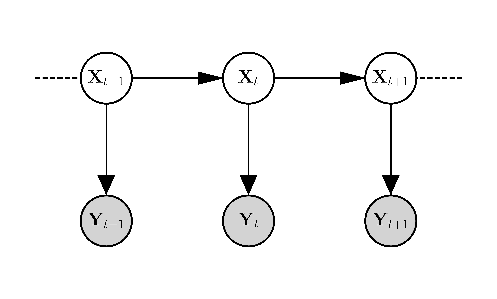
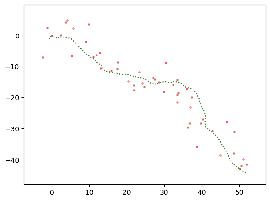
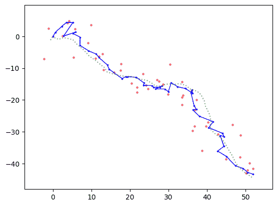

# 6.5\. 应用：线性高斯模型和卡尔曼滤波

> 原文：[`mmids-textbook.github.io/chap06_prob/05_kalman/roch-mmids-prob-kalman.html`](https://mmids-textbook.github.io/chap06_prob/05_kalman/roch-mmids-prob-kalman.html)

在本节中，我们说明了线性高斯模型在目标跟踪中的应用。我们首先给出一些背景信息。

## 6.5.1\. 多变量高斯分布：边缘和条件分布#

我们将需要多变量高斯分布的边缘和条件密度。为此，我们需要各种关于块矩阵的公式和结果。

**块矩阵的性质** 回想一下，块矩阵有一个方便的代数，类似于通常的矩阵代数。考虑一个具有相同行和列划分的平方块矩阵，即，

$$\begin{split} A = \begin{pmatrix} A_{11} & A_{12}\\ A_{21} & A_{22} \end{pmatrix} \end{split}$$

其中 $A \in \mathbb{R}^{n \times n}$，$A_{ij} \in \mathbb{R}^{n_i \times n_j}$ 对于 $i, j = 1, 2$，且满足条件 $n_1 + n_2 = n$。然后可以简单地检查（试试看！）转置可以写成

$$\begin{split} A^T = \begin{pmatrix} A_{11}^T & A_{21}^T\\ A_{12}^T & A_{22}^T \end{pmatrix}. \end{split}$$

特别地，如果 $A$ 是对称的，那么 $A_{11} = A_{11}^T$，$A_{22} = A_{22}^T$，且 $A_{21} = A_{12}^T$。

**示例：** 例如，考虑 $\mathbf{z} = (\mathbf{z}_1, \mathbf{z}_2)$，其中 $\mathbf{z}_1 \in \mathbb{R}^{n_1}$ 和 $\mathbf{z}_2 \in \mathbb{R}^{n_2}$。我们想要计算二次型

$$\begin{split} \mathbf{z}^T \begin{pmatrix} A_{11} & A_{12}\\ A_{12}^T & A_{22} \end{pmatrix} \mathbf{z} \end{split}$$

其中 $A_{ij} \in \mathbb{R}^{n_i \times n_j}$ 对于 $i,j = 1, 2$，且满足条件 $n_1 + n_2 = n$，以及 $A_{11}^T = A_{11}$ 和 $A_{22}^T = A_{22}$。

我们应用块矩阵乘法公式两次得到

$$\begin{align*} &(\mathbf{z}_1, \mathbf{z}_2)^T \begin{pmatrix} A_{11} & A_{12}\\ A_{12}^T & A_{22} \end{pmatrix} (\mathbf{z}_1, \mathbf{z}_2)\\ &= (\mathbf{z}_1, \mathbf{z}_2)^T \begin{pmatrix} A_{11} \mathbf{z}_1 + A_{12} \mathbf{z}_2\\ A_{12}^T \mathbf{z}_1 + A_{22} \mathbf{z}_2 \end{pmatrix}\\ &= \mathbf{z}_1^T A_{11} \mathbf{z}_1 + \mathbf{z}_1^T A_{12} \mathbf{z}_2 + \mathbf{z}_2^T A_{12}^T \mathbf{z}_1 + \mathbf{z}_2^T A_{22} \mathbf{z}_2\\ &= \mathbf{z}_1^T A_{11} \mathbf{z}_1 + 2 \mathbf{z}_1^T A_{12} \mathbf{z}_2 + \mathbf{z}_2^T A_{22} \mathbf{z}_2. \end{align*}$$

$\lhd$

**示例：** 设 $A_{ii} \in \mathbb{R}^{n_i \times n_i}$ 对于 $i = 1, 2$ 是可逆的。我们声称

$$\begin{split} \begin{pmatrix} A_{11} & \mathbf{0}\\ \mathbf{0} & A_{22} \end{pmatrix}^{-1} = \begin{pmatrix} A_{11}^{-1} & \mathbf{0}\\ \mathbf{0} & A_{22}^{-1} \end{pmatrix}. \end{split}$$

右侧的矩阵由 $A_{11}$ 和 $A_{22}$ 的可逆性定义良好。我们使用分块矩阵的矩阵乘积公式来验证这个命题。上面的矩阵是分块对角矩阵。

事实上，我们得到

$$\begin{align*} &\begin{pmatrix} A_{11} & \mathbf{0}\\ \mathbf{0} & A_{22} \end{pmatrix} \begin{pmatrix} A_{11}^{-1} & \mathbf{0}\\ \mathbf{0} & A_{22}^{-1} \end{pmatrix}\\ &= \begin{pmatrix} A_{11} A_{11}^{-1} + \mathbf{0} & \mathbf{0} + \mathbf{0}\\ \mathbf{0} + \mathbf{0} & \mathbf{0} + A_{22} A_{22}^{-1} \end{pmatrix} = \begin{pmatrix} I_{n_1 \times n_1} & \mathbf{0}\\ \mathbf{0} & I_{n_2 \times n_2} \end{pmatrix} = I_{n \times n} \end{align*}$$

并且对于其他方向也有类似的结果。 $\lhd$

**示例:** 设 $A_{21} \in \mathbb{R}^{n_2 \times n_1}$。那么我们声称

$$\begin{split} \begin{pmatrix} I_{n_1 \times n_1} & \mathbf{0}\\ A_{21} & I_{n_2 \times n_2} \end{pmatrix}^{-1} = \begin{pmatrix} I_{n_1 \times n_1} & \mathbf{0}\\ - A_{21} & I_{n_2 \times n_2} \end{pmatrix}. \end{split}$$

对于分块上三角矩阵的情况，也有类似的公式。特别是，这样的矩阵是可逆的（可以通过其他方式证明，例如通过行列式）。

只需检查：

$$\begin{align*} &\begin{pmatrix} I_{n_1 \times n_1} & \mathbf{0}\\ A_{21} & I_{n_2 \times n_2} \end{pmatrix} \begin{pmatrix} I_{n_1 \times n_1} & \mathbf{0}\\ -A_{21} & I_{n_2 \times n_2} \end{pmatrix}\\ &= \begin{pmatrix} I_{n_1 \times n_1} I_{n_1 \times n_1} + \mathbf{0} & \mathbf{0} + \mathbf{0}\\ A_{21} I_{n_1 \times n_1} + (-A_{21}) I_{n_1 \times n_1} & \mathbf{0} + I_{n_2 \times n_2} I_{n_2 \times n_2} \end{pmatrix} = \begin{pmatrix} I_{n_1 \times n_1} & \mathbf{0}\\ \mathbf{0} & I_{n_2 \times n_2} \end{pmatrix} = I_{n \times n} \end{align*}$$

取转置得到分块上三角矩阵情况的类似公式。 $\lhd$

**分块矩阵的求逆** 我们将需要一个关于分块矩阵求逆的经典公式。我们从 Schur 补的概念开始。

**定义** **(Schur 补)** $\idx{Schur complement}\xdi$ 考虑矩阵 $B \in \mathbb{R}^{n \times n}$ 以分块形式

$$\begin{split} B = \begin{pmatrix} B_{11} & B_{12}\\ B_{21} & B_{22} \end{pmatrix} \end{split}$$

其中 $B_{11} \in \mathbb{R}^{n_1 \times n_1}$, $B_{22} \in \mathbb{R}^{n - n_1 \times n - n_1}$, $B_{12} \in \mathbb{R}^{n_1 \times n - n_1}$, 和 $B_{21} \in \mathbb{R}^{n - n_1 \times n_1}$。然后，如果 $B_{22}$ 是可逆的，那么分块 $B_{22}$ 的 Schur 补定义为矩阵

$$ B/B_{22} := B_{11} - B_{12} B_{22}^{-1} B_{21}. $$

同样，如果 $B_{11}$ 是可逆的，

$$ B/B_{11} := B_{22} - B_{21} B_{11}^{-1} B_{12}. $$

$\natural$

**引理** **(分块矩阵的求逆)** $\idx{inverting a block matrix lemma}\xdi$ 考虑矩阵 $B \in \mathbb{R}^{n \times n}$ 以分块形式表示

$$\begin{split} B = \begin{pmatrix} B_{11} & B_{12}\\ B_{21} & B_{22} \end{pmatrix} \end{split}$$

其中 $B_{11} \in \mathbb{R}^{n_1 \times n_1}$, $B_{22} \in \mathbb{R}^{n - n_1 \times n - n_1}$, $B_{12} \in \mathbb{R}^{n_1 \times n - n_1}$, 和 $B_{21} \in \mathbb{R}^{n - n_1 \times n_1}$。然后，假设 $B_{22}$ 是可逆的，

$$\begin{split} B^{-1} = \begin{pmatrix} (B/B_{22})^{-1} & - (B/B_{22})^{-1} B_{12} B_{22}^{-1}\\ - B_{22}^{-1} B_{21} (B/B_{22})^{-1} & B_{22}^{-1} B_{21} (B/B_{22})^{-1} B_{12} B_{22}^{-1} + B_{22}^{-1} \end{pmatrix}. \end{split}$$

或者，假设 $B_{11}$ 是可逆的，

$$\begin{split} B^{-1} = \begin{pmatrix} B_{11}^{-1} B_{12} (B/B_{11})^{-1} B_{21} B_{11}^{-1} + B_{11}^{-1} & - B_{11}^{-1} B_{12} (B/B_{11})^{-1}\\ - (B/B_{11})^{-1} B_{21} B_{11}^{-1} & (B/B_{11})^{-1} \end{pmatrix}. \end{split}$$

$\flat$

*证明思路:* 证明这一点的办法之一是乘以 $B$ 和 $B^{-1}$，检查是否得到单位矩阵（试试看！）。我们给出一个更长的证明，以提供更多关于公式来源的见解。

诀窍是左乘和右乘 $B$，使用精心选择的具有对角线为单位矩阵的块三角矩阵（我们知道根据之前的例子它们是可逆的）来产生对角线为可逆矩阵的块对角矩阵（我们知道根据之前的例子如何求逆）。

*证明:* 我们只证明第一个公式。证明是基于分块矩阵的矩阵乘积公式进行的计算。我们需要，如果 $C$、$D$ 和 $E$ 是可逆的且大小相同，那么 $(CDE)^{-1} = E^{-1} D^{-1} C^{-1}$（检查它！）。

我们进行了一系列观察。

1- 我们的第一步是使用一个可逆矩阵在右上角得到一个零块。注意（回想一下，这里的乘法顺序很重要！）

$$\begin{align*} &\begin{pmatrix} I_{n_1 \times n_1} & - B_{12} B_{22}^{-1}\\ \mathbf{0} & I_{n_2 \times n_2} \end{pmatrix} \begin{pmatrix} B_{11} & B_{12}\\ B_{21} & B_{22} \end{pmatrix}\\ &= \begin{pmatrix} B_{11} - B_{12} B_{22}^{-1} B_{21} & B_{12} - B_{12} B_{22}^{-1} B_{22}\\ \mathbf{0} + B_{21} & \mathbf{0} + B_{22} \end{pmatrix} = \begin{pmatrix} B/B_{22} & \mathbf{0}\\ B_{21} & B_{22} \end{pmatrix}. \end{align*}$$

2- 接下来，我们在左下角得到一个零块。从上一个显示的最终矩阵开始，

$$\begin{align*} & \begin{pmatrix} B/B_{22} & \mathbf{0}\\ B_{21} & B_{22} \end{pmatrix} \begin{pmatrix} I_{n_1 \times n_1} & \mathbf{0}\\ - B_{22}^{-1} B_{21} & I_{n_2 \times n_2} \end{pmatrix}\\ &= \begin{pmatrix} B/B_{22} + \mathbf{0} & \mathbf{0} + \mathbf{0} \\ B_{21} - B_{22} B_{22}^{-1} B_{21} & \mathbf{0} + B_{22} \end{pmatrix} = \begin{pmatrix} B/B_{22} & \mathbf{0}\\ \mathbf{0} & B_{22} \end{pmatrix}. \end{align*}$$

3- 结合最后两个步骤，我们证明了

$$\begin{split} \begin{pmatrix} I_{n_1 \times n_1} & - B_{12} B_{22}^{-1}\\ \mathbf{0} & I_{n_2 \times n_2} \end{pmatrix} \begin{pmatrix} B_{11} & B_{12}\\ B_{21} & B_{22} \end{pmatrix} \begin{pmatrix} I_{n_1 \times n_1} & \mathbf{0}\\ - B_{22}^{-1} B_{21} & I_{n_2 \times n_2} \end{pmatrix} = \begin{pmatrix} B/B_{22} & \mathbf{0}\\ \mathbf{0} & B_{22} \end{pmatrix}. \end{split}$$

使用三个可逆矩阵乘积的逆公式，我们得到

$$\begin{align*} &\begin{pmatrix} I_{n_1 \times n_1} & \mathbf{0}\\ - B_{22}^{-1} B_{21} & I_{n_2 \times n_2} \end{pmatrix}^{-1} \begin{pmatrix} B_{11} & B_{12}\\ B_{21} & B_{22} \end{pmatrix}^{-1} \begin{pmatrix} I_{n_1 \times n_1} & - B_{12} B_{22}^{-1}\\ \mathbf{0} & I_{n_2 \times n_2} \end{pmatrix}^{-1}\\ &= \begin{pmatrix} B/B_{22} & \mathbf{0}\\ \mathbf{0} & B_{22} \end{pmatrix}^{-1}. \end{align*}$$

4- 通过重新排列并使用块对角矩阵逆的公式，我们最终得到

$$\begin{align*} &\begin{pmatrix} B_{11} & B_{12}\\ B_{21} & B_{22} \end{pmatrix}^{-1}\\ &= \begin{pmatrix} I_{n_1 \times n_1} & \mathbf{0}\\ - B_{22}^{-1} B_{21} & I_{n_2 \times n_2} \end{pmatrix} \begin{pmatrix} B/B_{22} & \mathbf{0}\\ \mathbf{0} & B_{22} \end{pmatrix}^{-1} \begin{pmatrix} I_{n_1 \times n_1} & - B_{12} B_{22}^{-1}\\ \mathbf{0} & I_{n_2 \times n_2} \end{pmatrix}\\ &= \begin{pmatrix} I_{n_1 \times n_1} & \mathbf{0}\\ - B_{22}^{-1} B_{21} & I_{n_2 \times n_2} \end{pmatrix} \begin{pmatrix} (B/B_{22})^{-1} & \mathbf{0}\\ \mathbf{0} & B_{22}^{-1} \end{pmatrix} \begin{pmatrix} I_{n_1 \times n_1} & - B_{12} B_{22}^{-1}\\ \mathbf{0} & I_{n_2 \times n_2} \end{pmatrix}\\ &= \begin{pmatrix} I_{n_1 \times n_1} & \mathbf{0}\\ - B_{22}^{-1} B_{21} & I_{n_2 \times n_2} \end{pmatrix} \begin{pmatrix} (B/B_{22})^{-1} + \mathbf{0}& - (B/B_{22})^{-1} B_{12} B_{22}^{-1} + \mathbf{0}\\ \mathbf{0} + \mathbf{0} & \mathbf{0} + B_{22}^{-1} \end{pmatrix}\\ &= \begin{pmatrix} I_{n_1 \times n_1} & \mathbf{0}\\ - B_{22}^{-1} B_{21} & I_{n_2 \times n_2} \end{pmatrix} \begin{pmatrix} (B/B_{22})^{-1} & - (B/B_{22})^{-1} B_{12} B_{22}^{-1} \\ \mathbf{0} & B_{22}^{-1} \end{pmatrix}\\ &= \begin{pmatrix} (B/B_{22})^{-1} & - (B/B_{22})^{-1} B_{12} B_{22}^{-1}\\ - B_{22}^{-1} B_{21} (B/B_{22})^{-1} & B_{22}^{-1} B_{21} (B/B_{22})^{-1} B_{12} B_{22}^{-1} + B_{22}^{-1} \end{pmatrix}, \end{align*}$$

如所声称。 $\square$

**正定情况** 在应用求逆公式时，我们只需将注意力限制在正定情况，接下来的引理将保证所需的可逆性条件。

首先：

**引理** **(正定矩阵的可逆性)** $\idx{invertibility of positive definite matrices}\xdi$ 设 $B \in \mathbb{R}^{n \times n}$ 为对称，正定。那么 $B$ 是可逆的。 $\flat$

*证明：* 对于任何 $\mathbf{x} \neq \mathbf{0}$，根据正定性，有 $\mathbf{x}^T B \mathbf{x} > 0$。特别是，必须满足 $\mathbf{x}^T B \mathbf{x} \neq 0$，因此，通过反证法，$B \mathbf{x} \neq \mathbf{0}$（因为对于任何 $\mathbf{z}$，都有 $\mathbf{z}^T \mathbf{0} = 0$）。这个结论来自于线性独立的等价定义。 $\square$

主子矩阵是通过删除一些行和列得到的正方形子矩阵。此外，我们还需要保证剩余的行索引集合与剩余的列索引集合相同。

**引理** **（主子矩阵）** $\idx{principal submatrices lemma}\xdi$ 设 $B \in \mathbb{R}^{n \times n}$ 是正定的，并且设 $Z \in \mathbb{R}^{n \times p}$ 具有满列秩。那么 $Z^T B Z$ 是正定的。特别是，所有正定矩阵的主子矩阵都是正定的。 $\flat$

*证明：* 如果 $\mathbf{x} \neq \mathbf{0}$，那么 $\mathbf{x}^T (Z^T B Z) \mathbf{x} = \mathbf{y}^T B \mathbf{y}$，其中我们定义 $\mathbf{y} = Z \mathbf{x}$。因为 $Z$ 具有满列秩且 $\mathbf{x} \neq \mathbf{0}$，根据线性独立的等价定义，可以得出 $\mathbf{y} \neq \mathbf{0}$。因此，由于 $B \succ 0$，我们有 $\mathbf{y}^T B \mathbf{y} > 0$，这证明了第一个结论。对于第二个结论，取 $Z$ 的形式为 $(\mathbf{e}_{m_1}\ \mathbf{e}_{m_2}\ \ldots\ \mathbf{e}_{m_p})$，其中索引 $m_1, \ldots, m_p$ 是不同的且递增的。由于这些列是不同的基向量，因此 $Z$ 的列是线性无关的。 $\square$

为了更好地理解证明中的最后一个结论，请注意

$$ (Z^T B Z)_{i,j} = (Z^T)_{i,\cdot} B Z_{\cdot,j} = (Z_{\cdot,i})^T B Z_{\cdot,j} = \sum_{k=1}^n \sum_{\ell=1}^n Z_{k,i} B_{k,\ell} Z_{\ell,j}. $$

因此，如果 $Z$ 的第 $i$ 列是 $\mathbf{e}_{m_i}$ 并且 $Z$ 的第 $j$ 列是 $\mathbf{e}_{m_j}$，那么最右边的求和只取一个元素，即 $B_{m_i, m_j}$。换句话说，$Z^T B Z$ 是 $B$ 对应于行和列 $m_1, \ldots, m_p$ 的主子矩阵。

**知识检查：** 考虑以下矩阵

$$\begin{split} A = \begin{pmatrix} 1 & 3 & 0 & 2\\ 2 & 8 & 4 & 0\\ 6 & 1 & 1 & 4\\ 3 & 2 & 0 & 1 \end{pmatrix} \qquad\text{and}\qquad Z = \begin{pmatrix} 0 & 0\\ 1 & 0\\ 0 & 0\\ 0 & 1 \end{pmatrix} \end{split}$$

以下哪个矩阵是 $Z^T A Z$？

a) $\begin{pmatrix} 1 & 0\\ 6 & 1 \end{pmatrix}$

b) $\begin{pmatrix} 8 & 0\\ 2 & 1 \end{pmatrix}$

c) $\begin{pmatrix} 2 & 8 & 4 & 0\\ 3 & 2 & 0 & 1 \end{pmatrix}$

d) $\begin{pmatrix} 1 & 0\\ 2 & 4\\ 6 & 1\\ 3 & 0 \end{pmatrix}$

$\checkmark$

**引理** **（舒尔补）** $\idx{Schur complement lemma}\xdi$ 设 $B \in \mathbb{R}^{n \times n}$ 是正定的，并以分块形式表示

$$\begin{split} B = \begin{pmatrix} B_{11} & B_{12}\\ B_{12}^T & B_{22} \end{pmatrix} \end{split}$$

其中 $B_{11} \in \mathbb{R}^{n_1 \times n_1}$ 和 $B_{22} \in \mathbb{R}^{n - n_1 \times n - n_1}$ 是对称的，且 $B_{12} \in \mathbb{R}^{n_1 \times n - n_1}$ 。然后，$B_{11}$ 的 Schur 补，即矩阵 $B/B_{11} := B_{22} - B_{12}^T B_{11}^{-1} B_{12}$，是良好定义的、对称的且正定的。对于 $B/B_{22} := B_{11} - B_{12} B_{22}^{-1} B_{12}^T$ 也同样成立。$\flat$

*证明:* 根据 *主子矩阵引理*，$B_{11}$ 是正定的。根据 *正定矩阵的可逆性*，$B_{11}$ 因此是可逆的。因此，Schur 补是良好定义的。此外，它是对称的，因为

$$ (B/B_{11})^T = B_{22}^T - (B_{12}^T B_{11}^{-1} B_{12})^T = B_{22} - B_{12}^T B_{11}^{-1} B_{12} = B/B_{11}, $$

由 $B_{11}$、$B_{22}$ 和 $B_{11}^{-1}$ 的对称性（证明最后一个！）。

对于非零的 $\mathbf{x} \in \mathbb{R}^{n_2}$，令

$$\begin{split} \mathbf{z} = \begin{pmatrix} \mathbf{z}_1\\ \mathbf{z}_2 \end{pmatrix} = \begin{pmatrix} B_{11}^{-1} B_{12} \mathbf{x}\\ - \mathbf{x} \end{pmatrix}. \end{split}$$

从观察结果得出结论，

$$\begin{align*} &\mathbf{z}^T \begin{pmatrix} B_{11} & B_{12}\\ B_{12}^T & B_{22} \end{pmatrix} \mathbf{z}\\ &= \mathbf{z}_1^T B_{11} \mathbf{z}_1 + 2 \mathbf{z}_1^T B_{12} \mathbf{z}_2 + \mathbf{z}_2^T B_{22} \mathbf{z}_2\\ &= (B_{11}^{-1} B_{12} \mathbf{x})^T B_{11} B_{11}^{-1} B_{12} \mathbf{x} + 2 (B_{11}^{-1} B_{12} \mathbf{x})^T B_{12} (- \mathbf{x}) + (- \mathbf{x})^T B_{22} (- \mathbf{x})\\ &= \mathbf{x}^T B_{12}^T B_{11}^{-1} B_{12}\,\mathbf{x} - 2 \mathbf{x}^T B_{12}^T B_{11}^{-1} B_{12}\,\mathbf{x} + \mathbf{x}^T B_{22}\,\mathbf{x}\\ &= \mathbf{x}^T(B_{22} - B_{12}^T B_{11}^{-1} B_{12})\,\mathbf{x}. \end{align*}$$

$\square$

**边缘和条件** 我们现在可以推导出多元高斯分布的边缘和条件分布$\idx{多元高斯}\xdi$。回想一下，一个在 $\mathbb{R}^d$ 上的多元高斯$\idx{多元正态}\xdi$向量 $\mathbf{X} = (X_1,\ldots,X_d)$ 具有均值 $\bmu \in \mathbb{R}^d$ 和正定协方差矩阵 $\bSigma \in \mathbb{R}^{d \times d}$，其概率密度函数为

$$ f_{\bmu, \bSigma}(\mathbf{x}) = \frac{1}{(2\pi)^{d/2} \,|\bSigma|^{1/2}} \exp\left(-\frac{1}{2}(\mathbf{x} - \bmu)^T \bSigma^{-1} (\mathbf{x} - \bmu)\right). $$

回想一下，计算 $|\bSigma|$ 的一种方法是将 $\bSigma$ 的所有特征值（包括重复的）相乘。矩阵 $\bLambda = \bSigma^{-1}$ 被称为精度矩阵。

将 $\mathbf{X}$ 分块为列向量 $(\mathbf{X}_1, \mathbf{X}_2)$，其中 $\mathbf{X}_i \in \mathbb{R}^{d_i}$，$i=1,2$，且 $d_1 + d_2 = d$。类似地，考虑相应的块向量和矩阵

$$\begin{split} \bmu = \begin{pmatrix} \bmu_1\\ \bmu_2 \end{pmatrix} \qquad \bSigma = \begin{pmatrix} \bSigma_{11} & \bSigma_{12}\\ \bSigma_{21} & \bSigma_{22} \end{pmatrix} \qquad \bLambda = \begin{pmatrix} \bLambda_{11} & \bLambda_{12}\\ \bLambda_{21} & \bLambda_{22} \end{pmatrix}. \end{split}$$

注意到由于 $\bSigma$ 的对称性，我们有 $\bSigma_{21} = \bSigma_{12}^T$。此外，可以证明一个对称可逆矩阵有一个对称的逆（试试看！）因此 $\bLambda_{21} = \bLambda_{12}^T$。

我们需要计算边缘分布$\idx{marginal}\xdi$ $f_{\mathbf{X}_1}(\mathbf{x}_1)$ 和 $f_{\mathbf{X}_2}(\mathbf{x}_2)$，以及给定 $\mathbf{X}_2$ 的 $\mathbf{X}_1$ 的条件密度，我们将其表示为 $f_{\mathbf{X}_1|\mathbf{X}_2}(\mathbf{x}_1|\mathbf{x}_2)$，同样 $f_{\mathbf{X}_2|\mathbf{X}_1}(\mathbf{x}_2|\mathbf{x}_1)$。

根据乘法规则，联合密度 $f_{\mathbf{X}_1,\mathbf{X}_2}(\mathbf{x}_1,\mathbf{x}_2)$ 可以分解为

$$ f_{\mathbf{X}_1,\mathbf{X}_2}(\mathbf{x}_1,\mathbf{x}_2) = f_{\mathbf{X}_1|\mathbf{X}_2}(\mathbf{x}_1|\mathbf{x}_2) f_{\mathbf{X}_2}(\mathbf{x}_2). $$

我们使用 *Inverting a Block Matrix* 引理将 $f_{\mathbf{X}_1,\mathbf{X}_2}(\mathbf{x}_1,\mathbf{x}_2)$ 重写为这种形式，并“揭示”涉及的边缘和条件$\idx{conditional}\xdi$。确实，一旦联合密度以这种形式存在，通过对 $\mathbf{x}_1$ 进行积分，我们得到 $\mathbf{X}_2$ 的边缘密度为 $f_{\mathbf{X}_2}$，而给定 $\mathbf{X}_2$ 的 $\mathbf{X}_1$ 的条件密度是通过联合密度和边缘密度的比值得到的。

实际上，使用该引理的证明中推导出的表达式会更简单，具体来说

$$\begin{align*} &\begin{pmatrix} \bSigma_{11} & \bSigma_{12}\\ \bSigma_{21} & \bSigma_{22} \end{pmatrix}^{-1}\\ &= \begin{pmatrix} I_{d_1 \times d_1} & \mathbf{0}\\ - \bSigma_{22}^{-1} \bSigma_{12}^T & I_{d_2 \times d_2} \end{pmatrix} \begin{pmatrix} (\bSigma/\bSigma_{22})^{-1} & \mathbf{0}\\ \mathbf{0} & \bSigma_{22}^{-1} \end{pmatrix} \begin{pmatrix} I_{d_1 \times d_1} & - \bSigma_{12} \bSigma_{22}^{-1}\\ \mathbf{0} & I_{d_2 \times d_2} \end{pmatrix}. \end{align*}$$

我们将使用事实，即最后一行的第一个矩阵是第三个矩阵的转置（检查一下！）。

为了评估联合密度，我们需要展开指数中出现的二次函数 $(\mathbf{x} - \bmu)^T \bSigma^{-1} (\mathbf{x} - \bmu)$。我们将这一过程分为几个步骤。

1- 首先注意

$$\begin{split} \begin{pmatrix} I_{d_1 \times d_1} & - \bSigma_{12} \bSigma_{22}^{-1}\\ \mathbf{0} & I_{d_2 \times d_2} \end{pmatrix} \begin{pmatrix} \mathbf{x}_1 - \bmu_1\\ \mathbf{x}_2 - \bmu_2 \end{pmatrix} = \begin{pmatrix} (\mathbf{x}_1 - \bmu_1) - \bSigma_{12} \bSigma_{22}^{-1} (\mathbf{x}_2 - \bmu_2) \\ \mathbf{x}_2 - \bmu_2 \end{pmatrix} \end{split}$$

对于其转置也是如此。我们定义

$$ \bmu_{1|2}(\mathbf{x}_2) := \bmu_1 + \bSigma_{12} \bSigma_{22}^{-1} (\mathbf{x}_2 - \bmu_2). $$

2- 将此代入二次函数中，我们得到

$$\begin{align*} &(\mathbf{x} - \bmu)^T \bSigma^{-1} (\mathbf{x} - \bmu)\\ &= \begin{pmatrix} \mathbf{x}_1 - \bmu_{1|2}(\mathbf{x}_2) \\ \mathbf{x}_2 - \bmu_2 \end{pmatrix}^T \begin{pmatrix} (\bSigma/\bSigma_{22})^{-1} & \mathbf{0}\\ \mathbf{0} & \bSigma_{22}^{-1} \end{pmatrix} \begin{pmatrix} \mathbf{x}_1 - \bmu_{1|2}(\mathbf{x}_2) \\ \mathbf{x}_2 - \bmu_2 \end{pmatrix}\\ &= (\mathbf{x}_1 - \bmu_{1|2}(\mathbf{x}_2))^T (\bSigma/\bSigma_{22})^{-1} (\mathbf{x}_1 - \bmu_{1|2}(\mathbf{x}_2)) + (\mathbf{x}_2 - \bmu_2)^T \bSigma_{22}^{-1} (\mathbf{x}_2 - \bmu_2). \end{align*}$$

注意到这两个项都与原始二次函数具有相同的形式。

3- 回到密度函数，我们使用 $\propto$ 来表示表达式在常数项（不依赖于 $\mathbf{x}$）的范围内成立。利用指数和的性质，我们得到

$$\begin{align*} &f_{\mathbf{X}_1,\mathbf{X}_2}(\mathbf{x}_1,\mathbf{x}_2)\\ &\propto \exp\left(-\frac{1}{2}(\mathbf{x} - \bmu)^T \bSigma^{-1} (\mathbf{x} - \bmu)\right)\\ &\propto \exp\left(-\frac{1}{2}(\mathbf{x}_1 - \bmu_{1|2}(\mathbf{x}_2))^T (\bSigma/\bSigma_{22})^{-1} (\mathbf{x}_1 - \bmu_{1|2}(\mathbf{x}_2))\right)\\ & \qquad \times \exp\left(-\frac{1}{2}(\mathbf{x}_2 - \bmu_2)^T \bSigma_{22}^{-1} (\mathbf{x}_2 - \bmu_2)\right). \end{align*}$$

4- 我们已经证明了

$$ f_{\mathbf{X}_1|\mathbf{X}_2}(\mathbf{x}_1|\mathbf{x}_2) \propto \exp\left(-\frac{1}{2}(\mathbf{x}_1 - \bmu_{1|2}(\mathbf{x}_2))^T (\bSigma/\bSigma_{22})^{-1} (\mathbf{x}_1 - \bmu_{1|2}(\mathbf{x}_2))\right) $$

和

$$ f_{\mathbf{X}_2}(\mathbf{x}_2) \propto \exp\left(-\frac{1}{2}(\mathbf{x}_2 - \bmu_2)^T \bSigma_{22}^{-1} (\mathbf{x}_2 - \bmu_2)\right). $$

换句话说，$\mathbf{X}_2$ 的边缘密度是具有均值 $\bmu_2$ 和协方差 $\bSigma_{22}$ 的多元高斯分布。给定 $\mathbf{X}_2$ 的 $\mathbf{X}_1$ 的条件密度是具有均值 $\bmu_{1|2}(\mathbf{X}_2)$ 和协方差 $\bSigma/\bSigma_{22} = \bSigma_{11} - \bSigma_{12} \bSigma_{22}^{-1} \bSigma_{12}^T$ 的多元高斯分布。我们将其表示为

$$ \mathbf{X}_1|\mathbf{X}_2 \sim N_{d_1}(\bmu_{1|2}(\mathbf{X}_2), \bSigma/\bSigma_{22}) $$

和

$$ \mathbf{X}_2 \sim N_{d_2}(\bmu_2, \bSigma_{22}). $$

同样地，通过交换 $\mathbf{X}_1$ 和 $\mathbf{X}_2$ 的角色，我们可以看到 $\mathbf{X}_1$ 的边缘密度是具有均值 $\bmu_1$ 和协方差 $\bSigma_{11}$ 的多元高斯分布。给定 $\mathbf{X}_1$ 的 $\mathbf{X}_2$ 的条件密度是具有均值 $\bmu_{2|1}(\mathbf{X}_1) = \bmu_2 + \bSigma_{21} \bSigma_{11}^{-1} (\mathbf{X}_1 - \bmu_1)$ 和协方差 $\bSigma/\bSigma_{11} = \bSigma_{22} - \bSigma_{12}^T \bSigma_{11}^{-1} \bSigma_{12}$ 的多元高斯分布。

**知识检查：** 假设 $(X_1, X_2)$ 是一个均值为 $(0,0)$，方差为 $2$，相关系数为 $-1/2$ 的双变量高斯分布。在 $X_2 = 1$ 的条件下，$X_1$ 的均值是多少？

a) $1/2$

b) $-1/2$

c) $1$

d) $-1$

$\checkmark$

## 6.5.2\. 卡尔曼滤波#

我们考虑一个随机过程$\idx{随机过程}\xdi$ $\{\bX_t\}_{t=0}^T$（即一组随机向量——通常按时间索引）的状态空间 $\S = \mathbb{R}^{d_0}$ 的以下形式

$$ \bX_{t+1} = F \,\bX_t + \bW_t $$

其中，$\bW_t$s 是独立同分布的 $N_{d_0}(\mathbf{0}, Q)$，$F$ 和 $Q$ 是已知的 $d_0 \times d_0$ 矩阵。我们用 $\bX_0 \sim N_{d_0}(\bmu_0, \bSigma_0)$ 表示初始状态。我们假设过程 $\{\bX_t\}_{t=1}^T$ 没有被观察到，而是辅助观察过程 $\{\bY_t\}_{t=1}^T$ 满足状态空间 $\S = \mathbb{R}^{d}$，满足以下条件

$$ \bY_t = H\,\bX_t + \bV_t $$

其中，$\bV_t$s 是独立同分布的 $N_d(\mathbf{0}, R)$，$H \in \mathbb{R}^{d \times d_0}$ 和 $R \in \mathbb{R}^{d \times d}$ 是已知的矩阵。这是一个线性高斯系统$\idx{线性高斯系统}\xdi$（也称为线性高斯状态空间模型）的例子。

我们的目标是根据观察过程推断未观察到的状态。具体来说，我们考虑滤波问题。引用 [维基百科](https://en.wikipedia.org/wiki/Hidden_Markov_model#Filtering)：

> 任务是计算给定模型参数和一系列观察值后，序列末尾最后一个潜在状态的分布，即计算 P(x(t)|y(1),…,y(t))。当认为潜在变量的序列是过程在一系列时间点移动的潜在状态，每个时间点都有相应的观察值时，通常使用此任务。然后，自然要询问过程在序列末尾的状态。

**关键引理** 给定线性高斯模型的结构，以下引理将发挥关键作用。

**引理** **(线性高斯系统)** $\idx{线性高斯系统引理}\xdi$ 设 $\bW \sim N_{d}(\bmu, \bSigma)$ 和 $\bW'|\bW \sim N_{d'}(A \,\bW, \bSigma')$，其中 $A \in \mathbb{R}^{d' \times d}$ 是一个确定性矩阵，$\bSigma \in \mathbb{R}^{d \times d}$ 和 $\bSigma' \in \mathbb{R}^{d' \times d'}$ 是正定的。那么，$(\bW, \bW')$ 是多元高斯分布，其均值向量为

$$\begin{split} \bmu'' = \begin{pmatrix} \bmu \\ A\bmu \end{pmatrix} \end{split}$$

和正定的协方差矩阵

$$\begin{split} \bSigma'' = \begin{pmatrix} \bSigma & \bSigma A^T\\ A \bSigma & A \bSigma A^T + \bSigma' \end{pmatrix}. \end{split}$$

$\flat$

**知识检查：** $\bSigma''$ 的每个块的维度是多少？ $\checkmark$

*证明：* 我们有

$$\begin{align*} &f_{\bW, \bW'}(\bw, \bw')\\ &= f_{\bW}(\bw) \, f_{\bW'|\bW}(\bw'|\bw)\\ &\propto \exp\left(-\frac{1}{2}(\bw - \bmu)^T \bSigma^{-1} (\bw - \bmu)\right)\\ & \qquad \times \exp\left(-\frac{1}{2}(\bw' - A \bw)^T (\bSigma')^{-1} (\bw' - A \bw)\right)\\ &\propto \exp\left(-\frac{1}{2}\left[(\bw - \bmu)^T \bSigma^{-1} (\bw - \bmu) + (\bw' - A \bw)^T (\bSigma')^{-1} (\bw' - A \bw)\right]\right). \end{align*}$$

我们将指数中的平方函数重写如下

$$\begin{align*} &(\bw - \bmu)^T \bSigma^{-1} (\bw - \bmu) + (\bw' - A \bw)^T (\bSigma')^{-1} (\bw' - A \bw)\\ &=(\bw - \bmu)^T \bSigma^{-1} (\bw - \bmu)\\ & \qquad + ([\bw' - A\bmu] - A[\bw-\bmu])^T (\bSigma')^{-1} ([\bw' - A\bmu] - A[\bw-\bmu])\\ &=(\bw - \bmu)^T (A^T (\bSigma')^{-1} A + \bSigma^{-1}) (\bw - \bmu)\\ & \qquad - 2 (\bw-\bmu)^T A^T (\bSigma')^{-1} (\bw' - A\bmu) + (\bw' - A\bmu)^T (\bSigma')^{-1} (\bw' - A\bmu)\\ &= \begin{pmatrix} \bw - \bmu \\ \bw' - A\bmu \end{pmatrix}^T \begin{pmatrix} A^T (\bSigma')^{-1} A + \bSigma^{-1} & - A^T (\bSigma')^{-1}\\ - (\bSigma')^{-1} A & (\bSigma')^{-1} \end{pmatrix} \begin{pmatrix} \bw - \bmu \\ \bw' - A\bmu \end{pmatrix}\\ &= \begin{pmatrix} \bw - \bmu \\ \bw' - A\bmu \end{pmatrix}^T \bLambda'' \begin{pmatrix} \bw - \bmu \\ \bw' - A\bmu \end{pmatrix}, \end{align*}$$

其中最后一行定义了 $\bLambda''$，第二行显示它是正定的（为什么？）。我们已经证明了 $(\bW, \bW')$ 是具有均值 $(\bmu, A\bmu)$ 的多元高斯分布。

我们使用**逆矩阵块引理**来求逆 $\bLambda''$ 并揭示协方差矩阵。 (也可以直接计算协方差；试试看！) 我们将 $\bLambda''$ 分解为块

$$\begin{split} \bLambda'' = \begin{pmatrix} \bLambda''_{11} & \bLambda''_{12}\\ (\bLambda''_{12})^T & \bLambda''_{22} \end{pmatrix} \end{split}$$

其中 $\bLambda''_{11} \in \mathbb{R}^{d \times d}$，$\bLambda''_{22} \in \mathbb{R}^{d' \times d'}$，和 $\bLambda''_{12} \in \mathbb{R}^{d \times d'}$。回忆一下，逆矩阵是

$$\begin{split} B^{-1} = \begin{pmatrix} (B/B_{22})^{-1} & -(B/B_{22})^{-1} B_{12} B_{22}^{-1}\\ -B_{22}^{-1} B_{12}^T (B/B_{22})^{-1} & B_{22}^{-1} B_{12}^T (B/B_{22})^{-1} B_{12} B_{22}^{-1} + B_{22}^{-1} \end{pmatrix} \end{split}$$

其中这里 $B = \bLambda''$.

Schur 补是

$$\begin{align*} \bLambda'' / \bLambda''_{22} &= \bLambda''_{11} - \bLambda''_{12} (\bLambda''_{22})^{-1} (\bLambda''_{12})^T\\ &= A^T (\bSigma')^{-1} A + \bSigma^{-1} - (- A^T (\bSigma')^{-1}) ((\bSigma')^{-1})^{-1} (- A^T (\bSigma')^{-1})^T\\ &= A^T (\bSigma')^{-1} A + \bSigma^{-1} - A^T (\bSigma')^{-1} \bSigma' (\bSigma')^{-1} A\\ &= A^T (\bSigma')^{-1} A + \bSigma^{-1} - A^T (\bSigma')^{-1} A\\ &= \bSigma^{-1}. \end{align*}$$

因此 $(\bLambda'' / \bLambda''_{22})^{-1} = \bSigma$.

此外，

$$\begin{align*} - (\bLambda''/\bLambda''_{22})^{-1} \bLambda''_{12} (\bLambda''_{22})^{-1} &= - \bSigma (- A^T (\bSigma')^{-1}) ((\bSigma')^{-1})^{-1}\\ &= \bSigma A^T (\bSigma')^{-1} \bSigma'\\ &= \bSigma A^T \end{align*}$$

以及

$$\begin{align*} &(\bLambda''_{22})^{-1} (\bLambda''_{12})^T (\bLambda''/\bLambda''_{22})^{-1} \bLambda''_{12} (\bLambda''_{22})^{-1} + (\bLambda''_{22})^{-1}\\ &= ((\bSigma')^{-1})^{-1} (- A^T (\bSigma')^{-1})^T \bSigma (-A^T (\bSigma')^{-1}) ((\bSigma')^{-1})^{-1} + ((\bSigma')^{-1})^{-1}\\ &= \bSigma' (\bSigma')^{-1} A \bSigma A^T (\bSigma')^{-1} \bSigma' + \bSigma'\\ &= A \bSigma A^T + \bSigma'. \end{align*}$$

将其代入块矩阵逆的公式中，完成证明。 $\square$

**联合分布** 我们将之前的符号扩展如下：对于在相同概率空间上定义的两个不相交的有限随机向量集合 $\{\mathbf{U}_i\}_i$ 和 $\{\mathbf{W}_j\}_j$，我们令 $f_{\{\mathbf{U}_i\}_i, \{\mathbf{W}_j\}_j}$ 为它们的联合密度，$f_{\{\mathbf{U}_i\}_i | \{\mathbf{W}_j\}_j}$ 为 $\{\mathbf{U}_i\}_i$ 在 $\{\mathbf{W}_j\}_j$ 条件下的条件密度，$f_{\{\mathbf{U}_i\}_i}$ 为 $\{\mathbf{U}_i\}_i$ 的边缘密度。形式上，我们的目标是计算

$$ f_{\bX_{t}|\bY_{1:t}} := f_{\{\bX_{t}\}|\{\bY_1,\ldots,\bY_{t}\}} $$

在 $t$ 上递归地定义，其中我们定义 $\bY_{1:t} = \{\bY_1,\ldots,\bY_{t}\}$。我们将看到在此计算中出现的所有密度都是多元高斯分布，因此跟踪均值和协方差就足够了。

形式上，我们假设整个过程（包括观测和未观测部分）的密度为

$$ f_{\bX_0}(\bx_0) \prod_{t=1}^{T} f_{\bX_{t}|\bX_{t-1}}(\bx_{t}|\bx_{t-1}) f_{\bY_{t}|\bX_{t}}(\by_{t}|\bx_{t}) $$

其中模型的描述规定如下

$$ \bX_{t}|\bX_{t-1} \sim N_{d_0}(F \,\bX_{t-1}, Q). $$

以及

$$ \bY_t|\bX_t \sim N_d(H\,\bX_t, R) $$

对于所有 $t \geq 1$ 和 $\bX_0 \sim N_{d_0}(\bmu_0, \bSigma_0)$。我们假设 $\bmu_0$ 和 $\bSigma_0$ 是已知的。通过归纳应用 *线性高斯系统引理*，我们可以证明整个过程 $(\bX_{0:T}, \bY_{1:T})$ 是联合多元高斯分布（试试看！）特别是，所有边缘和条件都是多元高斯分布。

图形上，它可以表示如下，其中每个变量是一个节点，其条件分布只依赖于其父节点。



**条件独立性** 全过程联合密度的规定形式暗示了许多条件独立性关系。我们需要以下两个：

1- 在给定 $\bX_{t-1}$ 的条件下，$\bX_t$ 与 $\bY_{1:t-1}$ 是条件独立的。

2- 在给定 $\bX_{t}$ 的条件下，$\bY_t$ 与 $\bY_{1:t-1}$ 是条件独立的。

我们证明第一个，并将第二个留作练习。实际上，我们证明了一个更强的结论：$\bX_t$ 在给定 $\bX_{t-1}$ 的条件下与 $\bX_{0:t-2}, \bY_{1:t-1}$ 条件独立。

首先，通过积分 $\by_T$，然后 $\bx_{T}$，然后 $\by_{T-1}$，然后 $\bx_{T-1}$，……，然后 $\by_t$，我们看到 $(\bX_{0:t}, \bY_{1:t-1})$ 的联合密度是

$$ f_{\bX_0}(\bx_0) \left(\prod_{s=1}^{t-1} f_{\bX_{s}|\bX_{s-1}}(\bx_{s}|\bx_{s-1}) f_{\bY_{s}|\bX_{s}}(\by_{s}|\bx_{s})\right) f_{\bX_{t}|\bX_{t-1}}(\bx_{t}|\bx_{t-1}). $$

类似地，$(\bX_{0:t-1}, \bY_{1:t-1})$ 的联合密度是

$$ f_{\bX_0}(\bx_0) \left(\prod_{s=1}^{t-1} f_{\bX_{s}|\bX_{s-1}}(\bx_{s}|\bx_{s-1}) f_{\bY_{s}|\bX_{s}}(\by_{s}|\bx_{s})\right). $$

给定 $\bX_{t-1}$ 的条件密度是通过将第一个表达式除以 $\bX_{t-1}$ 的边缘密度得到的

$$\begin{align*} &\frac{f_{\bX_0}(\bx_0) \left(\prod_{s=1}^{t-1} f_{\bX_{s}|\bX_{s-1}}(\bx_{s}|\bx_{s-1}) f_{\bY_{s}|\bX_{s}}(\by_{s}|\bx_{s})\right) f_{\bX_{t}|\bX_{t-1}}(\bx_{t}|\bx_{t-1})}{f_{\bX_{t-1}}(\bx_{t-1})}\\ &= \frac{f_{\bX_0}(\bx_0) \left(\prod_{s=1}^{t-1} f_{\bX_{s}|\bX_{s-1}}(\bx_{s}|\bx_{s-1}) f_{\bY_{s}|\bX_{s}}(\by_{s}|\bx_{s})\right) f_{\bX_{t}|\bX_{t-1}}(\bx_{t}|\bx_{t-1})}{f_{\bX_{t-1}}(\bx_{t-1})}\\ &= \frac{f_{\bX_0}(\bx_0) \left(\prod_{s=1}^{t-1} f_{\bX_{s}|\bX_{s-1}}(\bx_{s}|\bx_{s-1}) f_{\bY_{s}|\bX_{s}}(\by_{s}|\bx_{s})\right) }{f_{\bX_{t-1}}(\bx_{t-1})}f_{\bX_{t}|\bX_{t-1}}(\bx_{t}|\bx_{t-1})\\ &= f_{\bX_{0:t-2}, \bY_{1:t-1}|\bX_{t-1}}(\bx_{0:t-2}, \by_{1:t-1}|\bx_{t-1}) f_{\bX_{t}|\bX_{t-1}}(\bx_{t}|\bx_{t-1})\\ \end{align*}$$

如所述。

**算法** $\idx{卡尔曼滤波}\xdi$ 我们给出一个递归算法来解决滤波问题，即计算条件密度 $f_{\bX_{t}|\bY_{1:t}}$ 的均值向量和协方差矩阵。

**初始步骤**：首先计算 $f_{\bX_1|\bY_1}$。我们通过一系列观察来完成这一任务，这些观察将直接推广。

1- 我们有 $\bX_0 \sim N_{d_0}(\bmu_0, \bSigma_0)$ 和 $\bX_{1}|\bX_{0} \sim N_{d_0}(F \,\bX_0, Q)$。因此，根据**线性高斯系统引理**，联合向量 $(\bX_0, \bX_{1})$ 是具有均值向量 $(\bmu_0, F \bmu_0)$ 和协方差矩阵的多变量高斯分布

$$\begin{split} \begin{pmatrix} \bSigma_0 & \bSigma_0 F^T\\ F \bSigma_0 & F \bSigma_0 F^T + Q \end{pmatrix}. \end{split}$$

因此，$\bX_{1}$ 的边缘密度是具有均值向量 $F \bmu_0$ 和协方差矩阵的多变量高斯分布

$$ P_0 := F \bSigma_0 F^T + Q. $$

2- 将关于 $\bX_{1}$ 边缘密度的先前观察与 $\bY_1|\bX_1 \sim N_d(H\,\bX_1, R)$ 的实际情况结合起来，**线性高斯系统引理**表明 $(\bX_1, \bY_{1})$ 是具有均值向量 $(F \bmu_0, H F \bmu_0)$ 和协方差矩阵的多变量高斯分布

$$\begin{split} \begin{pmatrix} P_0 & P_0 H^T\\ H P_0 & H P_0 H^T + R \end{pmatrix}. \end{split}$$

最后，定义 $K_1 := P_0 H^T (H P_0 H^T + R)^{-1}$。这个新的观测和条件密度公式给出

$$ \bX_1|\bY_1 \sim N_d(\bmu_1, \bSigma_1) $$

其中我们定义

$$\begin{align*} \bmu_1 &:= F \bmu_0 + P_0 H^T (H P_0 H^T + R)^{-1} (\mathbf{Y}_1 - H F \bmu_0)\\ &= F \bmu_0 + K_1 (\mathbf{Y}_1 - H F \bmu_0) \end{align*}$$

并且

$$\begin{align*} \bSigma_1 &:= P_0 - P_0 H^T (H P_0 H^T + R)^{-1} H P_0\\ &= (I_{d_0 \times d_0} - K_1 H) P_0. \end{align*}$$

*一般步骤:* 假设通过归纳法，$\bX_{t-1}|\bY_{1:t-1} \sim N_{d_0}(\bmu_{t-1}, \bSigma_{t-1})$，其中 $\bmu_{t-1}$ 依赖于 $\bY_{1:t-1}$（但 $\bSigma_{t-1}$ 不依赖），我们推导出下一步。它非常接近初始步骤。

1- 预测：我们首先根据 $\bY_{1:t-1}$ “预测” $\bX_{t}$。我们使用 $\bX_{t-1}|\bY_{1:t-1} \sim N_{d_0}(\bmu_{t-1}, \bSigma_{t-1})$ 的事实。此外，我们有 $\bX_{t}|\bX_{t-1} \sim N_{d_0}(F \,\bX_{t-1}, Q)$ 并且 $\bX_t$ 在给定 $\bX_{t-1}$ 的条件下与 $\bY_{1:t-1}$ 条件独立。因此，根据 *独立性角色公理*，$\bX_{t}|\{\bX_{t-1}, \bY_{1:t-1}\} \sim N_{d_0}(F \,\bX_{t-1}, Q)$。根据 *线性高斯系统公理*，条件在 $\bY_{1:t-1}$ 上 $(\bX_{t-1}, \bX_{t})$ 的联合向量是具有均值向量 $(\bmu_{t-1}, F \bmu_{t-1})$ 和协方差矩阵的多变量高斯分布

$$\begin{split} \begin{pmatrix} \bSigma_{t-1} & \bSigma_{t-1} F^T\\ F \bSigma_{t-1} & F \bSigma_{t-1} F^T + Q \end{pmatrix}. \end{split}$$

因此，给定 $\bY_{1:t-1}$ 的 $\bX_{t}$ 的条件边缘密度是具有均值向量 $F \bmu_{t-1}$ 和协方差矩阵的多变量高斯分布

$$ P_{t-1} := F \bSigma_{t-1} F^T + Q. $$

2- 更新：接下来我们使用新的观测 $\bY_{t}$ “更新”对 $\bX_{t}$ 的预测。我们有 $\bY_{t}|\bX_{t} \sim N_d(H\,\bX_{t}, R)$ 并且 $\bY_t$ 在给定 $\bX_{t}$ 的条件下与 $\bY_{1:t-1}$ 条件独立。因此，根据 *独立性角色* 公理，$\bY_{t}|\{\bX_{t}, \bY_{1:t-1}\} \sim N_d(H\,\bX_{t}, R)$。结合之前的观测，*线性高斯系统* 公理表明，给定 $\bY_{1:t-1}$ 的 $(\bX_{t}, \bY_{t})$ 是具有均值向量 $(F \bmu_{t-1}, H F \bmu_{t-1})$ 和协方差矩阵的多变量高斯分布

$$\begin{split} \begin{pmatrix} P_{t-1} & P_{t-1} H^T\\ H P_{t-1} & H P_{t-1} H^T + R \end{pmatrix}. \end{split}$$

最后，定义 $K_{t} := P_{t-1} H^T (H P_{t-1} H^T + R)^{-1}$。这个新的观测和条件密度公式给出

$$ \bX_{t}|\{\bY_t, \bY_{1:t-1}\} = \bX_{t}|\bY_{1:t} \sim N_d(\bmu_{t}, \bSigma_{t}) $$

其中我们定义

$$\begin{align*} \bmu_{t} &:= F \bmu_{t-1} + K_{t} (\mathbf{Y}_{t} - H F \bmu_{t-1}) \end{align*}$$

并且

$$\begin{align*} \bSigma_{t} &= (I_{d_0 \times d_0} - K_{t} H) P_{t-1}. \end{align*}$$

*总结：* 设 $\bmu_t$ 和 $\bSigma_t$ 为 $\bX_t$ 在 $\bY_{1:t}$ 条件下的均值和协方差矩阵。这些量的递推关系如下：

$$\begin{align*} \bmu_t &= F\,\bmu_{t-1} + K_{t} (\bY_{t} - H F \bmu_{t-1})\\ \bSigma_t &= (I_{d_0 \times d_0} - K_t H) P_{t-1} \end{align*}$$

其中

$$\begin{align*} P_{t-1} &= F \,\bSigma_{t-1} F^T + Q\\ K_t &= P_{t-1} H^T (H P_{t-1} H^T + R)^{-1} \end{align*}$$

这个矩阵被称为卡尔曼增益矩阵。向量 $\bY_{t} - H F \bmu_{t-1}$ 被称为创新；它将新的观测值 $\bY_{t}$ 与基于先前观测值的预测期望 $H F \bmu_{t-1}$ 进行比较。因此，从某种意义上说，卡尔曼增益矩阵$\idx{Kalman gain matrix}\xdi$ 代表了在更新状态估计 $\bmu_t$ 时对时间 $t$ 的观测所赋予的“权重”。上述解被称为卡尔曼滤波。

**CHAT & LEARN** 探索序列蒙特卡洛方法的概念，也称为粒子滤波器，作为卡尔曼滤波的替代方案。向您喜欢的 AI 聊天机器人询问粒子滤波器的解释和实现。尝试在数据集上使用它。（[在 Colab 中打开](https://colab.research.google.com/github/MMiDS-textbook/MMiDS-textbook.github.io/blob/main/just_the_code/roch_mmids_chap_prob_notebook.ipynb)) $\ddagger$

## 6.5.3\. 返回位置跟踪#

我们将卡尔曼滤波应用于位置跟踪。回到我们的机械狗示例，我们想象我们得到了关于它在公园中连续位置的有噪声观测值。（想想 GPS 测量。）我们希望通过上述方法获得其位置的更好估计。

**图：** 机械狗（*来源：[Midjourney](https://www.midjourney.com/)*）


$\bowtie$

我们将真实位置建模为在 2 维位置 $(z_{1,t}, z_{2,t})_t$ 和速度 $(\dot{z}_{1,t}, \dot{z}_{2,t})_t$ 上，以 $\Delta$ 时间间隔采样的线性高斯系统。形式上，

$$\begin{split} \bX_t = (z_{1,t}, z_{2,t}, \dot{z}_{1,t}, \dot{z}_{2,t}), \quad F = \begin{pmatrix} 1 & 0 & \Delta & 0\\ 0 & 1 & 0 & \Delta\\ 0 & 0 & 1 & 0\\ 0 & 0 & 0 & 1 \end{pmatrix}, \end{split}$$

因此，未观测到的动力学是

$$\begin{split} \begin{pmatrix} z_{1,t+1}\\ z_{2,t+1}\\ \dot{z}_{1,t+1}\\ \dot{z}_{2,t+1} \end{pmatrix} = \bX_{t+1} = F \,\bX_t + \bW_t = \begin{pmatrix} z_{1,t} + \Delta \dot{z}_{1,t} + W_{1,t}\\ z_{2,t} + \Delta \dot{z}_{2,t} + W_{2,t}\\ \dot{z}_{1,t} + \dot{W}_{1,t}\\ \dot{z}_{2,t} + \dot{W}_{2,t} \end{pmatrix} \end{split}$$

其中 $\bW_t = (W_{1,t}, W_{2,t}, \dot{W}_{1,t}, \dot{W}_{2,t}) \sim N_{d_0}(\mathbf{0}, Q)$ 且 $Q$ 已知。

用话来说，速度保持不变，直到高斯扰动。位置按相应维度的速度成比例变化，再次直到高斯扰动。

观测值 $(\tilde{z}_{1,t}, \tilde{z}_{2,t})_t$ 被建模为

$$\begin{split} \bY_t = (\tilde{z}_{1,t}, \tilde{z}_{2,t}), \quad H = \begin{pmatrix} 1 & 0 & 0 & 0\\ 0 & 1 & 0 & 0\\ \end{pmatrix}. \end{split}$$

因此，观测过程满足

$$\begin{split} \begin{pmatrix} \tilde{z}_{1,t}\\ \tilde{z}_{2,t} \end{pmatrix} = \bY_t = H\,\bX_t + \bV_t = \begin{pmatrix} z_{1,t} + V_{1,t}\\ z_{2,t} + V_{2,t} \end{pmatrix} \end{split}$$

其中 $\bV_t = (V_{1,t}, V_{2,t}) \sim N_d(\mathbf{0}, R)$ 且 $R$ 是已知的。

用话来说，我们只能观察到位置，直到高斯噪声。

**实现卡尔曼滤波** 我们使用已知的协方差矩阵，按照上述描述实现了卡尔曼滤波。为了简化，我们取 $\Delta = 1$。代码改编自 [[Mur0](https://github.com/probml/pmtk3/blob/master/demos/kalmanTrackingDemo.m)]。

我们将在从上述线性高斯模型中抽取的模拟路径上测试卡尔曼滤波。以下函数创建这样的路径及其有噪声的观测值。

```py
def lgSamplePath(rng, ss, os, F, H, Q, R, init_mu, init_Sig, T):
    x = np.zeros((ss,T)) 
    y = np.zeros((os,T))

    x[:,0] = rng.multivariate_normal(init_mu, init_Sig)
    for t in range(1,T):
        x[:,t] = rng.multivariate_normal(F @ x[:,t-1],Q)
        y[:,t] = rng.multivariate_normal(H @ x[:,t],R)

    return x, y 
```

**数值角落**：这里有一个例子。

```py
seed = 535
rng = np.random.default_rng(seed)
ss = 4 # state size
os = 2 # observation size
F = np.array([[1., 0., 1., 0.],
              [0., 1., 0., 1.],
              [0., 0., 1., 0.],
              [0., 0., 0., 1.]]) 
H = np.array([[1., 0., 0., 0.],
              [0., 1, 0., 0.]])
Q = 0.1 * np.diag(np.ones(ss))
R = 10 * np.diag(np.ones(os))
init_mu = np.array([0., 0., 1., 1.])
init_Sig = 1 * np.diag(np.ones(ss))
T = 50
x, y = lgSamplePath(rng, ss, os, F, H, Q, R, init_mu, init_Sig, T) 
```

在下一个图中（以及本节中），点表示有噪声的观测值。未观测到的真实路径也以虚线表示。

<details class="hide above-input"><summary aria-label="Toggle hidden content">显示代码单元格源代码 隐藏代码单元格源代码</summary>

```py
plt.scatter(y[0,:], y[1,:], s=5, c='r', alpha=0.5)
plt.plot(x[0,:], x[1,:], c='g', linestyle='dotted')
plt.xlim((np.min(y[0,:])-5, np.max(y[0,:])+5)) 
plt.ylim((np.min(y[1,:])-5, np.max(y[1,:])+5))
plt.show() 
```</details> 

$\unlhd$

以下函数实现了卡尔曼滤波。完整的递归被分解成几个步骤。我们使用 `numpy.linalg.inv` 来计算卡尔曼增益矩阵。下面，`mu_pred` 是 $F \bmu_{t-1}$，而 `Sig_pred` 是 $P_{t-1} = F \bSigma_{t-1} F^T + Q$，这是在 *预测* 步骤中根据 $\bY_{1:t-1}$ 计算出的 $\bX_{t}$ 的均值向量和协方差矩阵。

```py
def kalmanUpdate(ss, F, H, Q, R, y_t, mu_prev, Sig_prev):

    mu_pred = F @ mu_prev
    Sig_pred = F @ Sig_prev @ F.T + Q

    e_t = y_t - H @ mu_pred
    S = H @ Sig_pred @ H.T + R
    Sinv = LA.inv(S)
    K = Sig_pred @ H.T @ Sinv

    mu_new = mu_pred + K @ e_t
    Sig_new = (np.diag(np.ones(ss)) - K @ H) @ Sig_pred

    return mu_new, Sig_new 
```

```py
def kalmanFilter(ss, os, y, F, H, Q, R, init_mu, init_Sig, T):

    mu = np.zeros((ss, T))
    Sig = np.zeros((ss, ss, T))
    mu[:,0] = init_mu
    Sig[:,:,0] = init_Sig
    for t in range(1,T):
        mu[:,t], Sig[:,:,t] = kalmanUpdate(ss, F, H, Q, R, y[:,t], mu[:,t-1], Sig[:,:,t-1])

    return mu, Sig 
```

**数值角落**：我们将此应用于位置跟踪示例。推断出的状态，或者更准确地说，它们的估计均值，以蓝色表示。请注意，我们还推断出每个时间点的速度，但我们没有绘制这些信息。

<details class="hide above-input"><summary aria-label="Toggle hidden content">显示代码单元格源代码 隐藏代码单元格源代码</summary>

```py
init_mu = np.array([0., 0., 1., 1.])
init_Sig = 1 * np.diag(np.ones(ss))
mu, Sig = kalmanFilter(ss, os, y, F, H, Q, R, init_mu, init_Sig, T)
plt.plot(mu[0,:], mu[1,:], c='b', marker='s', markersize=2, linewidth=1)
plt.scatter(y[0,:], y[1,:], s=5, c='r', alpha=0.5)
plt.plot(x[0,:], x[1,:], c='g', linestyle='dotted', alpha=0.5)
plt.xlim((np.min(y[0,:])-5, np.max(y[0,:])+5)) 
plt.ylim((np.min(y[1,:])-5, np.max(y[1,:])+5))
plt.show() 
```</details> 

为了量化与观测值相比推断出的均值改进，我们计算两种情况下的均方误差。

```py
dobs = x[0:1,:] - y[0:1,:]
mse_obs = np.sqrt(np.sum(dobs**2))
print(mse_obs) 
```

```py
22.891982252201856 
```

```py
dfilt = x[0:1,:] - mu[0:1,:]
mse_filt = np.sqrt(np.sum(dfilt**2))
print(mse_filt) 
```

```py
9.778610100463018 
```

我们确实观察到显著的减少。

$\unlhd$

**聊天与学习** 卡尔曼滤波假设状态演变和观测模型参数是已知的。向您喜欢的 AI 聊天机器人询问从数据中估计这些参数的方法，例如期望最大化算法或变分贝叶斯方法。 $\ddagger$

***自我评估测验*** *(在 Claude、Gemini 和 ChatGPT 的帮助下)*

**1** 以下哪个是正定矩阵 $B = \begin{pmatrix} B_{11} & B_{12} \\ B_{12}^T & B_{22} \end{pmatrix}$ 中 $B_{11}$ 块的 Schur 补？

a) $B_{22} - B_{12}^T B_{11}^{-1} B_{12}$

b) $B_{11} - B_{12} B_{22}^{-1} B_{12}^T$

c) $B_{22}$

d) $B_{11}$

**2** 以下关于正定矩阵 $B$ 中 $B_{11}$ 块的 Schur 补 $B/B_{11}$ 的哪个说法是正确的？

a) 它总是对称的。

b) 它总是正定的。

c) a 和 b 都正确。

d) 既不是 a 也不是 b。

**3** 在多元高斯分布中，$\mathbf{X}_1$ 给定 $\mathbf{X}_2$ 的条件分布是什么？

a) $\mathbf{X}_1 | \mathbf{X}_2 \sim N_{d_1}(\boldsymbol{\mu}_1 + \bSigma_{12}\bSigma_{22}^{-1}(\mathbf{X}_2 - \boldsymbol{\mu}_2), \bSigma_{11} - \bSigma_{12}\bSigma_{22}^{-1}\bSigma_{12}^T)$

b) $\mathbf{X}_1 | \mathbf{X}_2 \sim N_{d_1}(\boldsymbol{\mu}_1 - \bSigma_{12}\bSigma_{22}^{-1}(\mathbf{X}_2 - \boldsymbol{\mu}_2), \bSigma_{11} + \bSigma_{12}\bSigma_{22}^{-1}\bSigma_{12}^T)$

c) $\mathbf{X}_1 | \mathbf{X}_2 \sim N_{d_1}(\boldsymbol{\mu}_1 + \bSigma_{12}\bSigma_{22}^{-1}(\mathbf{X}_2 - \boldsymbol{\mu}_2), \bSigma_{11} + \bSigma_{12}\bSigma_{22}^{-1}\bSigma_{12}^T)$

d) $\mathbf{X}_1 | \mathbf{X}_2 \sim N_{d_1}(\boldsymbol{\mu}_1 - \bSigma_{12}\bSigma_{22}^{-1}(\mathbf{X}_2 - \boldsymbol{\mu}_2), \bSigma_{11} - \bSigma_{12}\bSigma_{22}^{-1}\bSigma_{12}^T)$

**4** 在线性高斯系统中，以下关于条件独立性关系的哪个说法是正确的？

a) 在给定 $\mathbf{X}_{t-1}$ 的条件下，$\mathbf{X}_t$ 与 $\mathbf{Y}_{1:t-1}$ 条件独立。

b) $\mathbf{Y}_t$ 在给定 $\mathbf{X}_t$ 的条件下与 $\mathbf{Y}_{1:t-1}$ 条件独立。

c) 在给定 $\mathbf{X}_{t-1}$ 的条件下，$\mathbf{X}_t$ 与 $\mathbf{X}_{t-2}$ 条件独立。

d) 以上所有。

**5** 在卡尔曼滤波中，卡尔曼增益矩阵 $K_t$ 代表什么？

a) 时间 $t$ 状态估计的协方差矩阵。

b) 时间 $t$ 观测的协方差矩阵。

c) 在更新状态估计时，赋予时间 $t$ 观测的权重。

d) 在预测当前状态时赋予先前状态估计的权重。

1 的答案：a. 理由：文本中将 $B_{11}$ 的 Schur 补定义为 $B / B_{11} := B_{22} - B_{12}^T B_{11}^{-1} B_{12}$。

2 的答案：c. 理由：文本中提到“$B_{11}$ 块的 Schur 补，即矩阵 $B/B_{11} := B_{22} - B_{12}^T B_{11}^{-1} B_{12}$，是对称且正定的。”

3 的答案：a. 理由：文本中推导了给定 $\mathbf{X}_2$ 的 $\mathbf{X}_1$ 的条件分布为 $\mathbf{X}_1 | \mathbf{X}_2 \sim N_{d_1}(\boldsymbol{\mu}_1 + \bSigma_{12}\bSigma_{22}^{-1}(\mathbf{X}_2 - \boldsymbol{\mu}_2), \bSigma_{11} - \bSigma_{12}\bSigma_{22}^{-1}\bSigma_{12}^T)$。

答案 4：d. 证明：文本明确指出这些条件独立性关系。

答案 5：c. 证明：文本定义 $K_t := P_{t-1} H^T (H P_{t-1} H^T + R)^{-1}$ 为卡尔曼增益矩阵，它用于更新状态估计 $\boldsymbol{\mu}_t := F \boldsymbol{\mu}_{t-1} + K_t (\mathbf{Y}_t - H F \boldsymbol{\mu}_{t-1})$，其中 $K_t$ 权衡创新 $(\mathbf{Y}_t - H F \boldsymbol{\mu}_{t-1})$。

## 6.5.1\. 多变量高斯分布：边缘和条件分布#

我们将需要多变量高斯分布的边缘和条件密度。为此，我们需要各种关于分块矩阵的公式和结果。

**分块矩阵的性质** 回想一下，分块矩阵有一个方便的代数，类似于通常的矩阵代数。考虑一个行和列划分相同的平方分块矩阵，即，

$$\begin{split} A = \begin{pmatrix} A_{11} & A_{12}\\ A_{21} & A_{22} \end{pmatrix} \end{split}$$

其中 $A \in \mathbb{R}^{n \times n}$，$A_{ij} \in \mathbb{R}^{n_i \times n_j}$ 对于 $i, j = 1, 2$，条件是 $n_1 + n_2 = n$。那么可以简单地检查（试试看！）转置可以写成

$$\begin{split} A^T = \begin{pmatrix} A_{11}^T & A_{21}^T\\ A_{12}^T & A_{22}^T \end{pmatrix}. \end{split}$$

特别地，如果 $A$ 是对称的，那么 $A_{11} = A_{11}^T$，$A_{22} = A_{22}^T$ 和 $A_{21} = A_{12}^T$。

**示例：** 例如，考虑 $\mathbf{z} = (\mathbf{z}_1, \mathbf{z}_2)$，其中 $\mathbf{z}_1 \in \mathbb{R}^{n_1}$ 和 $\mathbf{z}_2 \in \mathbb{R}^{n_2}$。我们想要计算二次型

$$\begin{split} \mathbf{z}^T \begin{pmatrix} A_{11} & A_{12}\\ A_{12}^T & A_{22} \end{pmatrix} \mathbf{z} \end{split}$$

其中 $A_{ij} \in \mathbb{R}^{n_i \times n_j}$ 对于 $i,j = 1, 2$，条件是 $n_1 + n_2 = n$，且 $A_{11}^T = A_{11}$ 和 $A_{22}^T = A_{22}$。

我们两次应用分块矩阵乘法公式得到

$$\begin{align*} &(\mathbf{z}_1, \mathbf{z}_2)^T \begin{pmatrix} A_{11} & A_{12}\\ A_{12}^T & A_{22} \end{pmatrix} (\mathbf{z}_1, \mathbf{z}_2)\\ &= (\mathbf{z}_1, \mathbf{z}_2)^T \begin{pmatrix} A_{11} \mathbf{z}_1 + A_{12} \mathbf{z}_2\\ A_{12}^T \mathbf{z}_1 + A_{22} \mathbf{z}_2 \end{pmatrix}\\ &= \mathbf{z}_1^T A_{11} \mathbf{z}_1 + \mathbf{z}_1^T A_{12} \mathbf{z}_2 + \mathbf{z}_2^T A_{12}^T \mathbf{z}_1 + \mathbf{z}_2^T A_{22} \mathbf{z}_2\\ &= \mathbf{z}_1^T A_{11} \mathbf{z}_1 + 2 \mathbf{z}_1^T A_{12} \mathbf{z}_2 + \mathbf{z}_2^T A_{22} \mathbf{z}_2. \end{align*}$$

$\lhd$

**示例：** 设 $A_{ii} \in \mathbb{R}^{n_i \times n_i}$ 对于 $i = 1, 2$ 是可逆的。我们声称

$$\begin{split} \begin{pmatrix} A_{11} & \mathbf{0}\\ \mathbf{0} & A_{22} \end{pmatrix}^{-1} = \begin{pmatrix} A_{11}^{-1} & \mathbf{0}\\ \mathbf{0} & A_{22}^{-1} \end{pmatrix}. \end{split}$$

右侧的矩阵由 $A_{11}$ 和 $A_{22}$ 的可逆性定义。我们使用分块矩阵的乘积公式来验证这个断言。上面的矩阵是分块对角矩阵。

事实上，我们得到

$$\begin{align*} &\begin{pmatrix} A_{11} & \mathbf{0}\\ \mathbf{0} & A_{22} \end{pmatrix} \begin{pmatrix} A_{11}^{-1} & \mathbf{0}\\ \mathbf{0} & A_{22}^{-1} \end{pmatrix}\\ &= \begin{pmatrix} A_{11} A_{11}^{-1} + \mathbf{0} & \mathbf{0} + \mathbf{0}\\ \mathbf{0} + \mathbf{0} & \mathbf{0} + A_{22} A_{22}^{-1} \end{pmatrix} = \begin{pmatrix} I_{n_1 \times n_1} & \mathbf{0}\\ \mathbf{0} & I_{n_2 \times n_2} \end{pmatrix} = I_{n \times n} \end{align*}$$

并且对于其他方向也是类似的。 $\lhd$

**EXAMPLE:** 设 $A_{21} \in \mathbb{R}^{n_2 \times n_1}$。那么我们断言

$$\begin{split} \begin{pmatrix} I_{n_1 \times n_1} & \mathbf{0}\\ A_{21} & I_{n_2 \times n_2} \end{pmatrix}^{-1} = \begin{pmatrix} I_{n_1 \times n_1} & \mathbf{0}\\ - A_{21} & I_{n_2 \times n_2} \end{pmatrix}. \end{split}$$

对于分块上三角的情况，也有类似的公式。特别是，这样的矩阵是可逆的（可以通过其他方式证明，例如通过行列式）。

只需检查：

$$\begin{align*} &\begin{pmatrix} I_{n_1 \times n_1} & \mathbf{0}\\ A_{21} & I_{n_2 \times n_2} \end{pmatrix} \begin{pmatrix} I_{n_1 \times n_1} & \mathbf{0}\\ -A_{21} & I_{n_2 \times n_2} \end{pmatrix}\\ &= \begin{pmatrix} I_{n_1 \times n_1} I_{n_1 \times n_1} + \mathbf{0} & \mathbf{0} + \mathbf{0}\\ A_{21} I_{n_1 \times n_1} + (-A_{21}) I_{n_1 \times n_1} & \mathbf{0} + I_{n_2 \times n_2} I_{n_2 \times n_2} \end{pmatrix} = \begin{pmatrix} I_{n_1 \times n_1} & \mathbf{0}\\ \mathbf{0} & I_{n_2 \times n_2} \end{pmatrix} = I_{n \times n} \end{align*}$$

取转置可以得到分块上三角情况的类似公式。 $\lhd$

**Inverting a block matrix** 我们需要使用一个经典的分块矩阵求逆公式。我们从 Schur 补的概念开始。

**DEFINITION** **(Schur Complement)** $\idx{Schur Complement}\xdi$ 考虑矩阵 $B \in \mathbb{R}^{n \times n}$ 的分块形式

$$\begin{split} B = \begin{pmatrix} B_{11} & B_{12}\\ B_{21} & B_{22} \end{pmatrix} \end{split}$$

其中 $B_{11} \in \mathbb{R}^{n_1 \times n_1}$，$B_{22} \in \mathbb{R}^{n - n_1 \times n - n_1}$，$B_{12} \in \mathbb{R}^{n_1 \times n - n_1}$，和 $B_{21} \in \mathbb{R}^{n - n_1 \times n_1}$。那么，如果 $B_{22}$ 是可逆的，$B_{22}$ 的 Schur 补定义为矩阵

$$ B/B_{22} := B_{11} - B_{12} B_{22}^{-1} B_{21}. $$

类似地，如果 $B_{11}$ 是可逆的，

$$ B/B_{11} := B_{22} - B_{21} B_{11}^{-1} B_{12}. $$

$\natural$

**LEMMA** **(Inverting a Block Matrix)** $\idx{inverting a block matrix lemma}\xdi$ 考虑矩阵 $B \in \mathbb{R}^{n \times n}$ 的分块形式为

$$\begin{split} B = \begin{pmatrix} B_{11} & B_{12}\\ B_{21} & B_{22} \end{pmatrix} \end{split}$$

其中 $B_{11} \in \mathbb{R}^{n_1 \times n_1}$，$B_{22} \in \mathbb{R}^{n - n_1 \times n - n_1}$，$B_{12} \in \mathbb{R}^{n_1 \times n - n_1}$，和 $B_{21} \in \mathbb{R}^{n - n_1 \times n_1}$。然后，如果 $B_{22}$ 是可逆的，

$$\begin{split} B^{-1} = \begin{pmatrix} (B/B_{22})^{-1} & - (B/B_{22})^{-1} B_{12} B_{22}^{-1}\\ - B_{22}^{-1} B_{21} (B/B_{22})^{-1} & B_{22}^{-1} B_{21} (B/B_{22})^{-1} B_{12} B_{22}^{-1} + B_{22}^{-1} \end{pmatrix}. \end{split}$$

或者，如果 $B_{11}$ 是可逆的，

$$\begin{split} B^{-1} = \begin{pmatrix} B_{11}^{-1} B_{12} (B/B_{11})^{-1} B_{21} B_{11}^{-1} + B_{11}^{-1} & - B_{11}^{-1} B_{12} (B/B_{11})^{-1}\\ - (B/B_{11})^{-1} B_{21} B_{11}^{-1} & (B/B_{11})^{-1} \end{pmatrix}. \end{split}$$

$\flat$

*证明思路:* 证明这一点的其中一种方法是将 $B$ 和 $B^{-1}$ 相乘并检查是否得到单位矩阵（试试看！）我们给出一个更长的证明，它提供了更多关于公式来源的见解。

诀窍是左乘和右乘 $B$ 以精心选择的具有对角线为单位矩阵的分块三角矩阵（我们知道根据前一个例子它们是可逆的）以产生对角线上有可逆矩阵的分块对角矩阵（我们知道根据前一个例子如何求逆）。

*证明:* 我们只证明第一个公式。证明是基于分块矩阵的矩阵乘积公式的一个计算。我们需要知道，如果 $C$、$D$ 和 $E$ 是可逆的并且大小相同，那么 $(CDE)^{-1} = E^{-1} D^{-1} C^{-1}$（检查一下！）。

我们做出一系列观察。

1- 我们的第一步是使用可逆矩阵在右上角得到一个零块。注意（回想一下，这里的乘法顺序很重要！）

$$\begin{align*} &\begin{pmatrix} I_{n_1 \times n_1} & - B_{12} B_{22}^{-1}\\ \mathbf{0} & I_{n_2 \times n_2} \end{pmatrix} \begin{pmatrix} B_{11} & B_{12}\\ B_{21} & B_{22} \end{pmatrix}\\ &= \begin{pmatrix} B_{11} - B_{12} B_{22}^{-1} B_{21} & B_{12} - B_{12} B_{22}^{-1} B_{22}\\ \mathbf{0} + B_{21} & \mathbf{0} + B_{22} \end{pmatrix} = \begin{pmatrix} B/B_{22} & \mathbf{0}\\ B_{21} & B_{22} \end{pmatrix}. \end{align*}$$

2- 接下来我们在左下角得到一个零块。从上一个显示的最终矩阵开始，

$$\begin{align*} & \begin{pmatrix} B/B_{22} & \mathbf{0}\\ B_{21} & B_{22} \end{pmatrix} \begin{pmatrix} I_{n_1 \times n_1} & \mathbf{0}\\ - B_{22}^{-1} B_{21} & I_{n_2 \times n_2} \end{pmatrix}\\ &= \begin{pmatrix} B/B_{22} + \mathbf{0} & \mathbf{0} + \mathbf{0} \\ B_{21} - B_{22} B_{22}^{-1} B_{21} & \mathbf{0} + B_{22} \end{pmatrix} = \begin{pmatrix} B/B_{22} & \mathbf{0}\\ \mathbf{0} & B_{22} \end{pmatrix}. \end{align*}$$

3- 结合最后两个步骤，我们证明了

$$\begin{split} \begin{pmatrix} I_{n_1 \times n_1} & - B_{12} B_{22}^{-1}\\ \mathbf{0} & I_{n_2 \times n_2} \end{pmatrix} \begin{pmatrix} B_{11} & B_{12}\\ B_{21} & B_{22} \end{pmatrix} \begin{pmatrix} I_{n_1 \times n_1} & \mathbf{0}\\ - B_{22}^{-1} B_{21} & I_{n_2 \times n_2} \end{pmatrix} = \begin{pmatrix} B/B_{22} & \mathbf{0}\\ \mathbf{0} & B_{22} \end{pmatrix}. \end{split}$$

使用三个可逆矩阵乘积的逆公式，我们得到

$$\begin{align*} &\begin{pmatrix} I_{n_1 \times n_1} & \mathbf{0}\\ - B_{22}^{-1} B_{21} & I_{n_2 \times n_2} \end{pmatrix}^{-1} \begin{pmatrix} B_{11} & B_{12}\\ B_{21} & B_{22} \end{pmatrix}^{-1} \begin{pmatrix} I_{n_1 \times n_1} & - B_{12} B_{22}^{-1}\\ \mathbf{0} & I_{n_2 \times n_2} \end{pmatrix}^{-1}\\ &= \begin{pmatrix} B/B_{22} & \mathbf{0}\\ \mathbf{0} & B_{22} \end{pmatrix}^{-1}. \end{align*}$$

4- 通过重新排列并使用分块对角矩阵的逆公式，我们最终得到

$$\begin{align*} &\begin{pmatrix} B_{11} & B_{12}\\ B_{21} & B_{22} \end{pmatrix}^{-1}\\ &= \begin{pmatrix} I_{n_1 \times n_1} & \mathbf{0}\\ - B_{22}^{-1} B_{21} & I_{n_2 \times n_2} \end{pmatrix} \begin{pmatrix} B/B_{22} & \mathbf{0}\\ \mathbf{0} & B_{22} \end{pmatrix}^{-1} \begin{pmatrix} I_{n_1 \times n_1} & - B_{12} B_{22}^{-1}\\ \mathbf{0} & I_{n_2 \times n_2} \end{pmatrix}\\ &= \begin{pmatrix} I_{n_1 \times n_1} & \mathbf{0}\\ - B_{22}^{-1} B_{21} & I_{n_2 \times n_2} \end{pmatrix} \begin{pmatrix} (B/B_{22})^{-1} & \mathbf{0}\\ \mathbf{0} & B_{22}^{-1} \end{pmatrix} \begin{pmatrix} I_{n_1 \times n_1} & - B_{12} B_{22}^{-1}\\ \mathbf{0} & I_{n_2 \times n_2} \end{pmatrix}\\ &= \begin{pmatrix} I_{n_1 \times n_1} & \mathbf{0}\\ - B_{22}^{-1} B_{21} & I_{n_2 \times n_2} \end{pmatrix} \begin{pmatrix} (B/B_{22})^{-1} + \mathbf{0}& - (B/B_{22})^{-1} B_{12} B_{22}^{-1} + \mathbf{0}\\ \mathbf{0} + \mathbf{0} & \mathbf{0} + B_{22}^{-1} \end{pmatrix}\\ &= \begin{pmatrix} I_{n_1 \times n_1} & \mathbf{0}\\ - B_{22}^{-1} B_{21} & I_{n_2 \times n_2} \end{pmatrix} \begin{pmatrix} (B/B_{22})^{-1} & - (B/B_{22})^{-1} B_{12} B_{22}^{-1} \\ \mathbf{0} & B_{22}^{-1} \end{pmatrix}\\ &= \begin{pmatrix} (B/B_{22})^{-1} & - (B/B_{22})^{-1} B_{12} B_{22}^{-1}\\ - B_{22}^{-1} B_{21} (B/B_{22})^{-1} & B_{22}^{-1} B_{21} (B/B_{22})^{-1} B_{12} B_{22}^{-1} + B_{22}^{-1} \end{pmatrix}, \end{align*}$$

如所声称。 $\square$

**正定情况** 在应用求逆公式时，我们只需将注意力限制在正定情况，其中接下来的引理保证了所需的可逆性条件。

首先：

**引理** **(正定矩阵的可逆性)** $\idx{正定矩阵的可逆性}\xdi$ 设 $B \in \mathbb{R}^{n \times n}$ 为对称，正定。则 $B$ 是可逆的。 $\flat$

*证明:* 对于任何 $\mathbf{x} \neq \mathbf{0}$，根据正定性的定义，有 $\mathbf{x}^T B \mathbf{x} > 0$。特别是，必须有 $\mathbf{x}^T B \mathbf{x} \neq 0$，因此，通过反证法，$B \mathbf{x} \neq \mathbf{0}$（因为对于任何 $\mathbf{z}$，都有 $\mathbf{z}^T \mathbf{0} = 0$）。这个结论来自于线性无关的等价定义。$\square$

主子矩阵是通过删除一些行和列得到的正方形子矩阵。此外，我们要求剩余的行索引集合与剩余的列索引集合相同。

**引理** **(主子矩阵)** $\idx{principal submatrices lemma}\xdi$ 设 $B \in \mathbb{R}^{n \times n}$ 是正定的，并且设 $Z \in \mathbb{R}^{n \times p}$ 具有满列秩。那么 $Z^T B Z$ 是正定的。特别是，所有正定矩阵的主子矩阵都是正定的。$\flat$

*证明:* 如果 $\mathbf{x} \neq \mathbf{0}$，那么 $\mathbf{x}^T (Z^T B Z) \mathbf{x} = \mathbf{y}^T B \mathbf{y}$，其中我们定义 $\mathbf{y} = Z \mathbf{x}$。因为 $Z$ 具有满列秩且 $\mathbf{x} \neq \mathbf{0}$，根据线性无关的等价定义，可以得出 $\mathbf{y} \neq \mathbf{0}$。因此，由于 $B \succ 0$，我们有 $\mathbf{y}^T B \mathbf{y} > 0$，这证明了第一个结论。对于第二个结论，取 $Z$ 的形式为 $(\mathbf{e}_{m_1}\ \mathbf{e}_{m_2}\ \ldots\ \mathbf{e}_{m_p})$，其中索引 $m_1, \ldots, m_p$ 是不同的且递增的。$Z$ 的列是线性无关的，因为它们是不同的基向量。$\square$

为了更好地理解证明中的最后一个结论，请注意

$$ (Z^T B Z)_{i,j} = (Z^T)_{i,\cdot} B Z_{\cdot,j} = (Z_{\cdot,i})^T B Z_{\cdot,j} = \sum_{k=1}^n \sum_{\ell=1}^n Z_{k,i} B_{k,\ell} Z_{\ell,j}. $$

因此，如果 $Z$ 的第 $i$ 列是 $\mathbf{e}_{m_i}$ 且 $Z$ 的第 $j$ 列是 $\mathbf{e}_{m_j}$，那么最右边的求和只取一个元素，即 $B_{m_i, m_j}$。换句话说，$Z^T B Z$ 是对应于行和列 $m_1, \ldots, m_p$ 的 $B$ 的主子矩阵。

**知识检查:** 考虑以下矩阵

$$\begin{split} A = \begin{pmatrix} 1 & 3 & 0 & 2\\ 2 & 8 & 4 & 0\\ 6 & 1 & 1 & 4\\ 3 & 2 & 0 & 1 \end{pmatrix} \qquad\text{and}\qquad Z = \begin{pmatrix} 0 & 0\\ 1 & 0\\ 0 & 0\\ 0 & 1 \end{pmatrix} \end{split}$$

以下哪个矩阵是 $Z^T A Z$？

a) $\begin{pmatrix} 1 & 0\\ 6 & 1 \end{pmatrix}$

b) $\begin{pmatrix} 8 & 0\\ 2 & 1 \end{pmatrix}$

c) $\begin{pmatrix} 2 & 8 & 4 & 0\\ 3 & 2 & 0 & 1 \end{pmatrix}$

d) $\begin{pmatrix} 1 & 0\\ 2 & 4\\ 6 & 1\\ 3 & 0 \end{pmatrix}$

$\checkmark$

**引理** **(舒尔补)** $\idx{Schur complement lemma}\xdi$ 设 $B \in \mathbb{R}^{n \times n}$ 是正定的，并且将其写成块形式

$$\begin{split} B = \begin{pmatrix} B_{11} & B_{12}\\ B_{12}^T & B_{22} \end{pmatrix} \end{split}$$

其中 $B_{11} \in \mathbb{R}^{n_1 \times n_1}$ 和 $B_{22} \in \mathbb{R}^{n - n_1 \times n - n_1}$ 是对称的，且 $B_{12} \in \mathbb{R}^{n_1 \times n - n_1}$。然后，块 $B_{11}$ 的 Schur 补，即矩阵 $B/B_{11} := B_{22} - B_{12}^T B_{11}^{-1} B_{12}$，是良好定义的、对称的且正定的。对于 $B/B_{22} := B_{11} - B_{12} B_{22}^{-1} B_{12}^T$ 也同样成立。$\flat$

*证明:* 根据 *主子矩阵引理*，$B_{11}$ 是正定的。根据 *正定矩阵的可逆性*，$B_{11}$ 因此是可逆的。因此 Schur 补是良好定义的。此外，由于 $B_{11}$、$B_{22}$ 和 $B_{11}^{-1}$ 的对称性（证明最后一个！），它也是对称的。

$$ (B/B_{11})^T = B_{22}^T - (B_{12}^T B_{11}^{-1} B_{12})^T = B_{22} - B_{12}^T B_{11}^{-1} B_{12} = B/B_{11}, $$

通过 $B_{11}$、$B_{22}$ 和 $B_{11}^{-1}$ 的对称性。

对于非零 $\mathbf{x} \in \mathbb{R}^{n_2}$，让

$$\begin{split} \mathbf{z} = \begin{pmatrix} \mathbf{z}_1\\ \mathbf{z}_2 \end{pmatrix} = \begin{pmatrix} B_{11}^{-1} B_{12} \mathbf{x}\\ - \mathbf{x} \end{pmatrix}. \end{split}$$

结果可从以下观察得出：

$$\begin{align*} &\mathbf{z}^T \begin{pmatrix} B_{11} & B_{12}\\ B_{12}^T & B_{22} \end{pmatrix} \mathbf{z}\\ &= \mathbf{z}_1^T B_{11} \mathbf{z}_1 + 2 \mathbf{z}_1^T B_{12} \mathbf{z}_2 + \mathbf{z}_2^T B_{22} \mathbf{z}_2\\ &= (B_{11}^{-1} B_{12} \mathbf{x})^T B_{11} B_{11}^{-1} B_{12} \mathbf{x} + 2 (B_{11}^{-1} B_{12} \mathbf{x})^T B_{12} (- \mathbf{x}) + (- \mathbf{x})^T B_{22} (- \mathbf{x})\\ &= \mathbf{x}^T B_{12}^T B_{11}^{-1} B_{12}\,\mathbf{x} - 2 \mathbf{x}^T B_{12}^T B_{11}^{-1} B_{12}\,\mathbf{x} + \mathbf{x}^T B_{22}\,\mathbf{x}\\ &= \mathbf{x}^T(B_{22} - B_{12}^T B_{11}^{-1} B_{12})\,\mathbf{x}. \end{align*}$$

$\square$

**边缘和条件概率** 我们现在可以推导出多元高斯分布的边缘和条件概率分布$\idx{多元高斯}\xdi$。回想一下，在 $\mathbb{R}^d$ 上的多元高斯$\idx{多元正态}\xdi$向量 $\mathbf{X} = (X_1,\ldots,X_d)$ 具有均值 $\bmu \in \mathbb{R}^d$ 和正定协方差矩阵 $\bSigma \in \mathbb{R}^{d \times d}$，其概率密度函数为

$$ f_{\bmu, \bSigma}(\mathbf{x}) = \frac{1}{(2\pi)^{d/2} \,|\bSigma|^{1/2}} \exp\left(-\frac{1}{2}(\mathbf{x} - \bmu)^T \bSigma^{-1} (\mathbf{x} - \bmu)\right). $$

回想一下，计算 $|\bSigma|$ 的一种方法是将 $\bSigma$ 的所有特征值（包括重复的）相乘。矩阵 $\bLambda = \bSigma^{-1}$ 被称为精度矩阵。

将 $\mathbf{X}$ 分解为列向量 $(\mathbf{X}_1, \mathbf{X}_2)$，其中 $\mathbf{X}_i \in \mathbb{R}^{d_i}$，$i=1,2$，且 $d_1 + d_2 = d$。类似地，考虑相应的块向量和矩阵

$$\begin{split} \bmu = \begin{pmatrix} \bmu_1\\ \bmu_2 \end{pmatrix} \qquad \bSigma = \begin{pmatrix} \bSigma_{11} & \bSigma_{12}\\ \bSigma_{21} & \bSigma_{22} \end{pmatrix} \qquad \bLambda = \begin{pmatrix} \bLambda_{11} & \bLambda_{12}\\ \bLambda_{21} & \bLambda_{22} \end{pmatrix}. \end{split}$$

注意，由于 $\bSigma$ 的对称性，我们有 $\bSigma_{21} = \bSigma_{12}^T$。此外，可以证明一个对称且可逆的矩阵有一个对称的逆矩阵（试试看！）因此 $\bLambda_{21} = \bLambda_{12}^T$。

我们试图计算边缘分布$\idx{marginal}\xdi$ $f_{\mathbf{X}_1}(\mathbf{x}_1)$ 和 $f_{\mathbf{X}_2}(\mathbf{x}_2)$，以及给定 $\mathbf{X}_2$ 的 $\mathbf{X}_1$ 的条件密度，我们将其表示为 $f_{\mathbf{X}_1|\mathbf{X}_2}(\mathbf{x}_1|\mathbf{x}_2)$，同样 $f_{\mathbf{X}_2|\mathbf{X}_1}(\mathbf{x}_2|\mathbf{x}_1)$。

根据乘法规则，联合密度 $f_{\mathbf{X}_1,\mathbf{X}_2}(\mathbf{x}_1,\mathbf{x}_2)$ 可以分解为

$$ f_{\mathbf{X}_1,\mathbf{X}_2}(\mathbf{x}_1,\mathbf{x}_2) = f_{\mathbf{X}_1|\mathbf{X}_2}(\mathbf{x}_1|\mathbf{x}_2) f_{\mathbf{X}_2}(\mathbf{x}_2). $$

我们使用 *逆矩阵的块矩阵* 引理将 $f_{\mathbf{X}_1,\mathbf{X}_2}(\mathbf{x}_1,\mathbf{x}_2)$ 重写为这种形式，并“揭示”涉及的边缘和条件$\idx{conditional}\xdi$。确实，一旦联合密度以这种形式存在，通过对 $\mathbf{x}_1$ 进行积分，我们得到 $\mathbf{X}_2$ 的边缘密度为 $f_{\mathbf{X}_2}$，而给定 $\mathbf{X}_2$ 的 $\mathbf{X}_1$ 的条件密度是通过联合密度和边缘密度的比值得到的。

实际上，使用该引理的证明中推导出的表达式会更简单，具体来说

$$\begin{align*} &\begin{pmatrix} \bSigma_{11} & \bSigma_{12}\\ \bSigma_{21} & \bSigma_{22} \end{pmatrix}^{-1}\\ &= \begin{pmatrix} I_{d_1 \times d_1} & \mathbf{0}\\ - \bSigma_{22}^{-1} \bSigma_{12}^T & I_{d_2 \times d_2} \end{pmatrix} \begin{pmatrix} (\bSigma/\bSigma_{22})^{-1} & \mathbf{0}\\ \mathbf{0} & \bSigma_{22}^{-1} \end{pmatrix} \begin{pmatrix} I_{d_1 \times d_1} & - \bSigma_{12} \bSigma_{22}^{-1}\\ \mathbf{0} & I_{d_2 \times d_2} \end{pmatrix}. \end{align*}$$

我们将使用事实，即最后一行上的第一个矩阵是第三个矩阵的转置（检查一下！）。

为了评估联合密度，我们需要展开指数中出现的二次函数 $(\mathbf{x} - \bmu)^T \bSigma^{-1} (\mathbf{x} - \bmu)$。我们将这一过程分解为几个步骤。

1- 首先注意

$$\begin{split} \begin{pmatrix} I_{d_1 \times d_1} & - \bSigma_{12} \bSigma_{22}^{-1}\\ \mathbf{0} & I_{d_2 \times d_2} \end{pmatrix} \begin{pmatrix} \mathbf{x}_1 - \bmu_1\\ \mathbf{x}_2 - \bmu_2 \end{pmatrix} = \begin{pmatrix} (\mathbf{x}_1 - \bmu_1) - \bSigma_{12} \bSigma_{22}^{-1} (\mathbf{x}_2 - \bmu_2) \\ \mathbf{x}_2 - \bmu_2 \end{pmatrix} \end{split}$$

同样地，对于其转置也是如此。我们定义

$$ \bmu_{1|2}(\mathbf{x}_2) := \bmu_1 + \bSigma_{12} \bSigma_{22}^{-1} (\mathbf{x}_2 - \bmu_2). $$

2- 将其代入二次函数中，我们得到

$$\begin{align*} &(\mathbf{x} - \bmu)^T \bSigma^{-1} (\mathbf{x} - \bmu)\\ &= \begin{pmatrix} \mathbf{x}_1 - \bmu_{1|2}(\mathbf{x}_2) \\ \mathbf{x}_2 - \bmu_2 \end{pmatrix}^T \begin{pmatrix} (\bSigma/\bSigma_{22})^{-1} & \mathbf{0}\\ \mathbf{0} & \bSigma_{22}^{-1} \end{pmatrix} \begin{pmatrix} \mathbf{x}_1 - \bmu_{1|2}(\mathbf{x}_2) \\ \mathbf{x}_2 - \bmu_2 \end{pmatrix}\\ &= (\mathbf{x}_1 - \bmu_{1|2}(\mathbf{x}_2))^T (\bSigma/\bSigma_{22})^{-1} (\mathbf{x}_1 - \bmu_{1|2}(\mathbf{x}_2)) + (\mathbf{x}_2 - \bmu_2)^T \bSigma_{22}^{-1} (\mathbf{x}_2 - \bmu_2). \end{align*}$$

注意，这两个项与原始二次函数具有相同的形式。

3- 返回密度函数，我们用$\propto$表示该表达式在常数项上成立，该常数项不依赖于$\mathbf{x}$。利用指数和的指数等于指数的乘积，我们得到

$$\begin{align*} &f_{\mathbf{X}_1,\mathbf{X}_2}(\mathbf{x}_1,\mathbf{x}_2)\\ &\propto \exp\left(-\frac{1}{2}(\mathbf{x} - \bmu)^T \bSigma^{-1} (\mathbf{x} - \bmu)\right)\\ &\propto \exp\left(-\frac{1}{2}(\mathbf{x}_1 - \bmu_{1|2}(\mathbf{x}_2))^T (\bSigma/\bSigma_{22})^{-1} (\mathbf{x}_1 - \bmu_{1|2}(\mathbf{x}_2))\right)\\ & \qquad \times \exp\left(-\frac{1}{2}(\mathbf{x}_2 - \bmu_2)^T \bSigma_{22}^{-1} (\mathbf{x}_2 - \bmu_2)\right). \end{align*}$$

4- 我们已经证明

$$ f_{\mathbf{X}_1|\mathbf{X}_2}(\mathbf{x}_1|\mathbf{x}_2) \propto \exp\left(-\frac{1}{2}(\mathbf{x}_1 - \bmu_{1|2}(\mathbf{x}_2))^T (\bSigma/\bSigma_{22})^{-1} (\mathbf{x}_1 - \bmu_{1|2}(\mathbf{x}_2))\right) $$

和

$$ f_{\mathbf{X}_2}(\mathbf{x}_2) \propto \exp\left(-\frac{1}{2}(\mathbf{x}_2 - \bmu_2)^T \bSigma_{22}^{-1} (\mathbf{x}_2 - \bmu_2)\right). $$

换句话说，$\mathbf{X}_2$的边缘密度是具有均值$\bmu_2$和协方差$\bSigma_{22}$的多变量高斯分布。给定$\mathbf{X}_2$的$\mathbf{X}_1$的条件密度是具有均值$\bmu_{1|2}(\mathbf{X}_2)$和协方差$\bSigma/\bSigma_{22} = \bSigma_{11} - \bSigma_{12} \bSigma_{22}^{-1} \bSigma_{12}^T$的多变量高斯分布。我们将其表示为

$$ \mathbf{X}_1|\mathbf{X}_2 \sim N_{d_1}(\bmu_{1|2}(\mathbf{X}_2), \bSigma/\bSigma_{22}) $$

和

$$ \mathbf{X}_2 \sim N_{d_2}(\bmu_2, \bSigma_{22}). $$

类似地，通过交换$\mathbf{X}_1$和$\mathbf{X}_2$的角色，我们可以看到$\mathbf{X}_1$的边缘密度是具有均值$\bmu_1$和协方差$\bSigma_{11}$的多变量高斯分布。给定$\mathbf{X}_1$的$\mathbf{X}_2$的条件密度是具有均值$\bmu_{2|1}(\mathbf{X}_1) = \bmu_2 + \bSigma_{21} \bSigma_{11}^{-1} (\mathbf{X}_1 - \bmu_1)$和协方差$\bSigma/\bSigma_{11} = \bSigma_{22} - \bSigma_{12}^T \bSigma_{11}^{-1} \bSigma_{12}$的多变量高斯分布。

**知识检查：** 假设$(X_1, X_2)$是一个均值为$(0,0)$，方差为$2$，相关系数为$-1/2$的双变量高斯分布。在$X_2 = 1$的条件下，$X_1$的均值是多少？

a) $1/2$

b) $-1/2$

c) $1$

d) $-1$

$\checkmark$

## 6.5.2\. 卡尔曼滤波#

我们考虑一个随机过程$\idx{stochastic process}\xdi$ $\{\bX_t\}_{t=0}^T$（即一组随机向量——通常按时间索引）的状态空间$\S = \mathbb{R}^{d_0}$具有以下形式

$$ \bX_{t+1} = F \,\bX_t + \bW_t $$

其中$\bW_t$s 是独立同分布的$N_{d_0}(\mathbf{0}, Q)$，$F$和$Q$是已知的$d_0 \times d_0$矩阵。我们用$\bX_0 \sim N_{d_0}(\bmu_0, \bSigma_0)$表示初始状态。我们假设过程$\{\bX_t\}_{t=1}^T$没有被观察到，而是辅助观察过程$\{\bY_t\}_{t=1}^T$，其状态空间为$\S = \mathbb{R}^{d}$满足

$$ \bY_t = H\,\bX_t + \bV_t $$

其中$\bV_t$s 是独立同分布的$N_d(\mathbf{0}, R)$，$H \in \mathbb{R}^{d \times d_0}$和$R \in \mathbb{R}^{d \times d}$是已知的矩阵。这是一个线性高斯系统$\idx{linear-Gaussian system}\xdi$（也称为线性高斯状态空间模型）的例子。

我们的目标是根据观察到的过程推断未观察到的状态。具体来说，我们研究滤波问题。引用[Wikipedia](https://en.wikipedia.org/wiki/Hidden_Markov_model#Filtering)：

> 任务是在给定模型参数和一系列观察值的情况下，计算序列末尾最后一个潜在状态的分布，即计算 P(x(t)|y(1),…,y(t))。当认为潜在变量的序列是过程在一系列时间点移动的潜在状态，每个时间点都有相应的观察值时，通常使用此任务。然后，自然地会询问过程在序列末尾的状态。

**关键引理** 给定线性高斯模型的结构，以下引理将发挥关键作用。

**引理** **(线性高斯系统)** $\idx{linear-Gaussian system lemma}\xdi$ 设$\bW \sim N_{d}(\bmu, \bSigma)$和$\bW'|\bW \sim N_{d'}(A \,\bW, \bSigma')$，其中$A \in \mathbb{R}^{d' \times d}$是一个确定性矩阵，且$\bSigma \in \mathbb{R}^{d \times d}$和$\bSigma' \in \mathbb{R}^{d' \times d'}$是正定的。那么，$(\bW, \bW')$是多元高斯分布，其均值向量为

$$\begin{split} \bmu'' = \begin{pmatrix} \bmu \\ A\bmu \end{pmatrix} \end{split}$$

和正定协方差矩阵

$$\begin{split} \bSigma'' = \begin{pmatrix} \bSigma & \bSigma A^T\\ A \bSigma & A \bSigma A^T + \bSigma' \end{pmatrix}. \end{split}$$

$\flat$

**知识检查：** $\bSigma''$的每个块的维度是什么？$\checkmark$

*证明：* 我们有

$$\begin{align*} &f_{\bW, \bW'}(\bw, \bw')\\ &= f_{\bW}(\bw) \, f_{\bW'|\bW}(\bw'|\bw)\\ &\propto \exp\left(-\frac{1}{2}(\bw - \bmu)^T \bSigma^{-1} (\bw - \bmu)\right)\\ & \qquad \times \exp\left(-\frac{1}{2}(\bw' - A \bw)^T (\bSigma')^{-1} (\bw' - A \bw)\right)\\ &\propto \exp\left(-\frac{1}{2}\left[(\bw - \bmu)^T \bSigma^{-1} (\bw - \bmu) + (\bw' - A \bw)^T (\bSigma')^{-1} (\bw' - A \bw)\right]\right). \end{align*}$$

我们将指数中的平方函数重写为如下形式

$$\begin{align*} &(\bw - \bmu)^T \bSigma^{-1} (\bw - \bmu) + (\bw' - A \bw)^T (\bSigma')^{-1} (\bw' - A \bw)\\ &=(\bw - \bmu)^T \bSigma^{-1} (\bw - \bmu)\\ & \qquad + ([\bw' - A\bmu] - A[\bw-\bmu])^T (\bSigma')^{-1} ([\bw' - A\bmu] - A[\bw-\bmu])\\ &=(\bw - \bmu)^T (A^T (\bSigma')^{-1} A + \bSigma^{-1}) (\bw - \bmu)\\ & \qquad - 2 (\bw-\bmu)^T A^T (\bSigma')^{-1} (\bw' - A\bmu) + (\bw' - A\bmu)^T (\bSigma')^{-1} (\bw' - A\bmu)\\ &= \begin{pmatrix} \bw - \bmu \\ \bw' - A\bmu \end{pmatrix}^T \begin{pmatrix} A^T (\bSigma')^{-1} A + \bSigma^{-1} & - A^T (\bSigma')^{-1}\\ - (\bSigma')^{-1} A & (\bSigma')^{-1} \end{pmatrix} \begin{pmatrix} \bw - \bmu \\ \bw' - A\bmu \end{pmatrix}\\ &= \begin{pmatrix} \bw - \bmu \\ \bw' - A\bmu \end{pmatrix}^T \bLambda'' \begin{pmatrix} \bw - \bmu \\ \bw' - A\bmu \end{pmatrix}, \end{align*}$$

其中最后一行定义了 $\bLambda''$，第二行显示它是正定的（为什么？）。我们已经证明了 $(\bW, \bW')$ 是具有均值 $(\bmu, A\bmu)$ 的多元高斯分布。

我们使用 *块矩阵求逆引理* 来求 $\bLambda''$ 的逆并揭示协方差矩阵。（也可以直接计算协方差；试试看！）我们将 $\bLambda''$ 分解为块

$$\begin{split} \bLambda'' = \begin{pmatrix} \bLambda''_{11} & \bLambda''_{12}\\ (\bLambda''_{12})^T & \bLambda''_{22} \end{pmatrix} \end{split}$$

其中 $\bLambda''_{11} \in \mathbb{R}^{d \times d}$，$\bLambda''_{22} \in \mathbb{R}^{d' \times d'}$，和 $\bLambda''_{12} \in \mathbb{R}^{d \times d'}$。回忆一下，逆是

$$\begin{split} B^{-1} = \begin{pmatrix} (B/B_{22})^{-1} & -(B/B_{22})^{-1} B_{12} B_{22}^{-1}\\ -B_{22}^{-1} B_{12}^T (B/B_{22})^{-1} & B_{22}^{-1} B_{12}^T (B/B_{22})^{-1} B_{12} B_{22}^{-1} + B_{22}^{-1} \end{pmatrix} \end{split}$$

其中这里 $B = \bLambda''$.

Schur 补是

$$\begin{align*} \bLambda'' / \bLambda''_{22} &= \bLambda''_{11} - \bLambda''_{12} (\bLambda''_{22})^{-1} (\bLambda''_{12})^T\\ &= A^T (\bSigma')^{-1} A + \bSigma^{-1} - (- A^T (\bSigma')^{-1}) ((\bSigma')^{-1})^{-1} (- A^T (\bSigma')^{-1})^T\\ &= A^T (\bSigma')^{-1} A + \bSigma^{-1} - A^T (\bSigma')^{-1} \bSigma' (\bSigma')^{-1} A\\ &= A^T (\bSigma')^{-1} A + \bSigma^{-1} - A^T (\bSigma')^{-1} A\\ &= \bSigma^{-1}. \end{align*}$$

因此 $(\bLambda'' / \bLambda''_{22})^{-1} = \bSigma$.

此外，

$$\begin{align*} - (\bLambda''/\bLambda''_{22})^{-1} \bLambda''_{12} (\bLambda''_{22})^{-1} &= - \bSigma (- A^T (\bSigma')^{-1}) ((\bSigma')^{-1})^{-1}\\ &= \bSigma A^T (\bSigma')^{-1} \bSigma'\\ &= \bSigma A^T \end{align*}$$

和

$$\begin{align*} &(\bLambda''_{22})^{-1} (\bLambda''_{12})^T (\bLambda''/\bLambda''_{22})^{-1} \bLambda''_{12} (\bLambda''_{22})^{-1} + (\bLambda''_{22})^{-1}\\ &= ((\bSigma')^{-1})^{-1} (- A^T (\bSigma')^{-1})^T \bSigma (-A^T (\bSigma')^{-1}) ((\bSigma')^{-1})^{-1} + ((\bSigma')^{-1})^{-1}\\ &= \bSigma' (\bSigma')^{-1} A \bSigma A^T (\bSigma')^{-1} \bSigma' + \bSigma'\\ &= A \bSigma A^T + \bSigma'. \end{align*}$$

将其代入块矩阵逆的公式中，完成证明。 $\square$

**联合分布** 我们将之前的符号扩展如下：对于在相同概率空间上定义的两个不相交的有限随机向量集合 $\{\mathbf{U}_i\}_i$ 和 $\{\mathbf{W}_j\}_j$，我们令 $f_{\{\mathbf{U}_i\}_i, \{\mathbf{W}_j\}_j}$ 为它们的联合密度，$f_{\{\mathbf{U}_i\}_i | \{\mathbf{W}_j\}_j}$ 为 $\{\mathbf{U}_i\}_i$ 在 $\{\mathbf{W}_j\}_j$ 条件下的条件密度，以及 $f_{\{\mathbf{U}_i\}_i}$ 为 $\{\mathbf{U}_i\}_i$ 的边缘密度。正式来说，我们的目标是递归地在 $t$ 上进行计算，其中我们定义 $\bY_{1:t} = \{\bY_1,\ldots,\bY_{t}\}$。我们将看到在这个计算中出现的所有密度都是多元高斯分布，因此跟踪均值和协方差就足够了。

$$ f_{\bX_{t}|\bY_{1:t}} := f_{\{\bX_{t}\}|\{\bY_1,\ldots,\bY_{t}\}} $$

递归地在 $t$ 上，其中我们定义 $\bY_{1:t} = \{\bY_1,\ldots,\bY_{t}\}$。我们将看到在这个计算中出现的所有密度都是多元高斯分布，因此跟踪均值和协方差就足够了。

正式来说，我们假设整个过程（包括观测和未观测部分）的密度是

$$ f_{\bX_0}(\bx_0) \prod_{t=1}^{T} f_{\bX_{t}|\bX_{t-1}}(\bx_{t}|\bx_{t-1}) f_{\bY_{t}|\bX_{t}}(\by_{t}|\bx_{t}) $$

其中模型描述指定了

$$ \bX_{t}|\bX_{t-1} \sim N_{d_0}(F \,\bX_{t-1}, Q). $$

和

$$ \bY_t|\bX_t \sim N_d(H\,\bX_t, R) $$

对于所有 $t \geq 1$ 和 $\bX_0 \sim N_{d_0}(\bmu_0, \bSigma_0)$。我们假设 $\bmu_0$ 和 $\bSigma_0$ 是已知的。通过归纳应用 *线性高斯系统引理*，可以证明整个过程 $(\bX_{0:T}, \bY_{1:T})$ 是联合多元高斯分布（试试看！）特别是，所有边缘和条件分布都是多元高斯分布。

图形上，它可以表示如下，其中每个变量是一个节点，其条件分布只依赖于其父节点。


**条件独立性** 整个过程的联合密度的指定形式暗示了许多条件独立性关系。我们将需要以下两个：

1- $\bX_t$ 在给定 $\bX_{t-1}$ 的条件下与 $\bY_{1:t-1}$ 条件独立

2- $\bY_t$ 在给定 $\bX_{t}$ 的条件下与 $\bY_{1:t-1}$ 条件独立。

我们证明第一个，并将第二个留作练习。实际上，我们证明了一个更强的结论：$\bX_t$ 在给定 $\bX_{t-1}$ 的条件下与 $\bX_{0:t-2}, \bY_{1:t-1}$ 条件独立。

首先，通过积分 $\by_T$，然后 $\bx_{T}$，接着 $\by_{T-1}$，然后 $\bx_{T-1}$，……，最后 $\by_t$，我们可以看到 $(\bX_{0:t}, \bY_{1:t-1})$ 的联合密度是

$$ f_{\bX_0}(\bx_0) \left(\prod_{s=1}^{t-1} f_{\bX_{s}|\bX_{s-1}}(\bx_{s}|\bx_{s-1}) f_{\bY_{s}|\bX_{s}}(\by_{s}|\bx_{s})\right) f_{\bX_{t}|\bX_{t-1}}(\bx_{t}|\bx_{t-1}). $$

类似地，$(\bX_{0:t-1}, \bY_{1:t-1})$ 的联合密度是

$$ f_{\bX_0}(\bx_0) \left(\prod_{s=1}^{t-1} f_{\bX_{s}|\bX_{s-1}}(\bx_{s}|\bx_{s-1}) f_{\bY_{s}|\bX_{s}}(\by_{s}|\bx_{s})\right). $$

在给定 $\bX_{t-1}$ 的条件下，通过将第一个表达式除以 $\bX_{t-1}$ 的边缘密度来获得条件密度

$$\begin{align*} &\frac{f_{\bX_0}(\bx_0) \left(\prod_{s=1}^{t-1} f_{\bX_{s}|\bX_{s-1}}(\bx_{s}|\bx_{s-1}) f_{\bY_{s}|\bX_{s}}(\by_{s}|\bx_{s})\right) f_{\bX_{t}|\bX_{t-1}}(\bx_{t}|\bx_{t-1})}{f_{\bX_{t-1}}(\bx_{t-1})}\\ &= \frac{f_{\bX_0}(\bx_0) \left(\prod_{s=1}^{t-1} f_{\bX_{s}|\bX_{s-1}}(\bx_{s}|\bx_{s-1}) f_{\bY_{s}|\bX_{s}}(\by_{s}|\bx_{s})\right) f_{\bX_{t}|\bX_{t-1}}(\bx_{t}|\bx_{t-1})}{f_{\bX_{t-1}}(\bx_{t-1})}\\ &= \frac{f_{\bX_0}(\bx_0) \left(\prod_{s=1}^{t-1} f_{\bX_{s}|\bX_{s-1}}(\bx_{s}|\bx_{s-1}) f_{\bY_{s}|\bX_{s}}(\by_{s}|\bx_{s})\right) }{f_{\bX_{t-1}}(\bx_{t-1})}f_{\bX_{t}|\bX_{t-1}}(\bx_{t}|\bx_{t-1})\\ &= f_{\bX_{0:t-2}, \bY_{1:t-1}|\bX_{t-1}}(\bx_{0:t-2}, \by_{1:t-1}|\bx_{t-1}) f_{\bX_{t}|\bX_{t-1}}(\bx_{t}|\bx_{t-1})\\ \end{align*}$$

如所声称的。

**算法** $\idx{卡尔曼滤波器}\xdi$ 我们给出一个递归算法来解决滤波问题，即计算条件密度 $f_{\bX_{t}|\bY_{1:t}}$ 的均值向量和协方差矩阵。

*初始步骤:* 首先计算 $f_{\bX_1|\bY_1}$。我们通过一系列观察来完成这项工作，这些观察将直接推广。

1- 我们有 $\bX_0 \sim N_{d_0}(\bmu_0, \bSigma_0)$ 和 $\bX_{1}|\bX_{0} \sim N_{d_0}(F \,\bX_0, Q)$。因此，根据 *线性高斯系统引理*，联合向量 $(\bX_0, \bX_{1})$ 是具有均值向量 $(\bmu_0, F \bmu_0)$ 和协方差矩阵的多变量高斯分布

$$\begin{split} \begin{pmatrix} \bSigma_0 & \bSigma_0 F^T\\ F \bSigma_0 & F \bSigma_0 F^T + Q \end{pmatrix}. \end{split}$$

因此，$\bX_{1}$ 的边缘密度是具有均值向量 $F \bmu_0$ 和协方差矩阵的多变量高斯分布

$$ P_0 := F \bSigma_0 F^T + Q. $$

2- 将关于 $\bX_{1}$ 边缘密度的先前观察与 $\bY_1|\bX_1 \sim N_d(H\,\bX_1, R)$ 的事实结合起来，*线性高斯系统引理* 表明 $(\bX_1, \bY_{1})$ 是具有均值向量 $(F \bmu_0, H F \bmu_0)$ 和协方差矩阵的多变量高斯分布

$$\begin{split} \begin{pmatrix} P_0 & P_0 H^T\\ H P_0 & H P_0 H^T + R \end{pmatrix}. \end{split}$$

最后，定义 $K_1 := P_0 H^T (H P_0 H^T + R)^{-1}$。这个新的观测值和条件密度公式给出

$$ \bX_1|\bY_1 \sim N_d(\bmu_1, \bSigma_1) $$

其中我们定义

$$\begin{align*} \bmu_1 &:= F \bmu_0 + P_0 H^T (H P_0 H^T + R)^{-1} (\mathbf{Y}_1 - H F \bmu_0)\\ &= F \bmu_0 + K_1 (\mathbf{Y}_1 - H F \bmu_0) \end{align*}$$

和

$$\begin{align*} \bSigma_1 &:= P_0 - P_0 H^T (H P_0 H^T + R)^{-1} H P_0\\ &= (I_{d_0 \times d_0} - K_1 H) P_0. \end{align*}$$

*一般步骤：* 假设通过归纳法，$\bX_{t-1}|\bY_{1:t-1} \sim N_{d_0}(\bmu_{t-1}, \bSigma_{t-1})$，其中 $\bmu_{t-1}$ 依赖于 $\bY_{1:t-1}$（但 $\bSigma_{t-1}$ 不依赖于 $\bY_{1:t-1}$），我们推导出下一步。这非常接近初始步骤。

1- 预测：我们首先根据 $\bY_{1:t-1}$ 来“预测” $\bX_{t}$。我们使用的事实是 $\bX_{t-1}|\bY_{1:t-1} \sim N_{d_0}(\bmu_{t-1}, \bSigma_{t-1})$。此外，我们有 $\bX_{t}|\bX_{t-1} \sim N_{d_0}(F \,\bX_{t-1}, Q)$ 并且在给定 $\bX_{t-1}$ 的条件下，$\bX_t$ 与 $\bY_{1:t-1}$ 条件独立。因此，根据**独立性作用引理**，$\bX_{t}|\{\bX_{t-1}, \bY_{1:t-1}\} \sim N_{d_0}(F \,\bX_{t-1}, Q)$。根据**线性高斯系统引理**，在给定 $\bY_{1:t-1}$ 的联合向量 $(\bX_{t-1}, \bX_{t})$ 是具有均值向量 $(\bmu_{t-1}, F \bmu_{t-1})$ 和协方差矩阵的多变量高斯分布。

$$\begin{split} \begin{pmatrix} \bSigma_{t-1} & \bSigma_{t-1} F^T\\ F \bSigma_{t-1} & F \bSigma_{t-1} F^T + Q \end{pmatrix}. \end{split}$$

作为结果，给定 $\bY_{1:t-1}$ 的 $\bX_{t}$ 的条件边缘密度是具有均值向量 $F \bmu_{t-1}$ 和协方差矩阵的多变量高斯分布。

$$ P_{t-1} := F \bSigma_{t-1} F^T + Q. $$

2- 更新：接下来我们使用新的观测值 $\bY_{t}$ 来“更新”对 $\bX_{t}$ 的预测。我们有 $\bY_{t}|\bX_{t} \sim N_d(H\,\bX_{t}, R)$ 并且在给定 $\bX_{t}$ 的条件下，$\bY_t$ 与 $\bY_{1:t-1}$ 条件独立。因此，根据**独立性作用**引理，$\bY_{t}|\{\bX_{t}, \bY_{1:t-1}\} \sim N_d(H\,\bX_{t}, R)$。结合之前的观测，**线性高斯系统**引理表明，给定 $\bY_{1:t-1}$ 的 $(\bX_{t}, \bY_{t})$ 是具有均值向量 $(F \bmu_{t-1}, H F \bmu_{t-1})$ 和协方差矩阵的多变量高斯分布。

$$\begin{split} \begin{pmatrix} P_{t-1} & P_{t-1} H^T\\ H P_{t-1} & H P_{t-1} H^T + R \end{pmatrix}. \end{split}$$

最后，定义 $K_{t} := P_{t-1} H^T (H P_{t-1} H^T + R)^{-1}$。这个新的观测值和条件密度公式给出

$$ \bX_{t}|\{\bY_t, \bY_{1:t-1}\} = \bX_{t}|\bY_{1:t} \sim N_d(\bmu_{t}, \bSigma_{t}) $$

其中我们定义

$$\begin{align*} \bmu_{t} &:= F \bmu_{t-1} + K_{t} (\mathbf{Y}_{t} - H F \bmu_{t-1}) \end{align*}$$

和

$$\begin{align*} \bSigma_{t} &= (I_{d_0 \times d_0} - K_{t} H) P_{t-1}. \end{align*}$$

*摘要:* 设 $\bmu_t$ 和 $\bSigma_t$ 为 $\bX_t$ 在 $\bY_{1:t}$ 条件下的均值和协方差矩阵。这些量的递归关系如下：

$$\begin{align*} \bmu_t &= F\,\bmu_{t-1} + K_{t} (\bY_{t} - H F \bmu_{t-1})\\ \bSigma_t &= (I_{d_0 \times d_0} - K_t H) P_{t-1} \end{align*}$$

其中

$$\begin{align*} P_{t-1} &= F \,\bSigma_{t-1} F^T + Q\\ K_t &= P_{t-1} H^T (H P_{t-1} H^T + R)^{-1} \end{align*}$$

这个矩阵被称为卡尔曼增益矩阵。向量 $\bY_{t} - H F \bmu_{t-1}$ 被称为创新；它将新的观测值 $\bY_{t}$ 与基于先前观测值的预测期望 $H F \bmu_{t-1}$ 进行比较。因此，从某种意义上说，卡尔曼增益矩阵$\idx{Kalman gain matrix}\xdi$ 代表了在更新状态估计 $\bmu_t$ 时对时间 $t$ 的观测所赋予的“权重”。上述解被称为卡尔曼滤波。

**CHAT & LEARN** 探索序列蒙特卡洛方法的概念，也称为粒子滤波器，作为卡尔曼滤波的替代方案。向您喜欢的 AI 聊天机器人询问粒子滤波的解释和实现。尝试在以下数据集上使用它。([在 Colab 中打开](https://colab.research.google.com/github/MMiDS-textbook/MMiDS-textbook.github.io/blob/main/just_the_code/roch_mmids_chap_prob_notebook.ipynb)) $\ddagger$

## 6.5.3\. 返回位置跟踪#

我们将卡尔曼滤波应用于位置跟踪。回到我们的机器狗示例，我们想象我们得到了关于它在公园中连续位置的有噪声观测值。（想想 GPS 测量。）我们试图使用上述方法获得其位置的更好估计。

**图:** 机器狗（*来源:* 使用 [Midjourney](https://www.midjourney.com/) 制作）


$\bowtie$

我们将真实位置建模为在 2 维位置 $(z_{1,t}, z_{2,t})_t$ 和速度 $(\dot{z}_{1,t}, \dot{z}_{2,t})_t$ 上采样的线性高斯系统，时间间隔为 $\Delta$。形式上，

$$\begin{split} \bX_t = (z_{1,t}, z_{2,t}, \dot{z}_{1,t}, \dot{z}_{2,t}), \quad F = \begin{pmatrix} 1 & 0 & \Delta & 0\\ 0 & 1 & 0 & \Delta\\ 0 & 0 & 1 & 0\\ 0 & 0 & 0 & 1 \end{pmatrix}, \end{split}$$

因此，未观测的动力学是

$$\begin{split} \begin{pmatrix} z_{1,t+1}\\ z_{2,t+1}\\ \dot{z}_{1,t+1}\\ \dot{z}_{2,t+1} \end{pmatrix} = \bX_{t+1} = F \,\bX_t + \bW_t = \begin{pmatrix} z_{1,t} + \Delta \dot{z}_{1,t} + W_{1,t}\\ z_{2,t} + \Delta \dot{z}_{2,t} + W_{2,t}\\ \dot{z}_{1,t} + \dot{W}_{1,t}\\ \dot{z}_{2,t} + \dot{W}_{2,t} \end{pmatrix} \end{split}$$

其中 $\bW_t = (W_{1,t}, W_{2,t}, \dot{W}_{1,t}, \dot{W}_{2,t}) \sim N_{d_0}(\mathbf{0}, Q)$ 且 $Q$ 已知。

用话来说，速度保持不变，直到高斯扰动。位置按比例变化，与对应维度的速度成正比，再次直到高斯扰动。

观测值 $(\tilde{z}_{1,t}, \tilde{z}_{2,t})_t$ 被建模为

$$\begin{split} \bY_t = (\tilde{z}_{1,t}, \tilde{z}_{2,t}), \quad H = \begin{pmatrix} 1 & 0 & 0 & 0\\ 0 & 1 & 0 & 0\\ \end{pmatrix}. \end{split}$$

因此，观察到的过程满足

$$\begin{split} \begin{pmatrix} \tilde{z}_{1,t}\\ \tilde{z}_{2,t} \end{pmatrix} = \bY_t = H\,\bX_t + \bV_t = \begin{pmatrix} z_{1,t} + V_{1,t}\\ z_{2,t} + V_{2,t} \end{pmatrix} \end{split}$$

其中 $\bV_t = (V_{1,t}, V_{2,t}) \sim N_d(\mathbf{0}, R)$ 且 $R$ 已知。

用话来说，我们只观察到位置，直到高斯噪声。

**实现卡尔曼滤波** 我们使用已知的协方差矩阵实现了上述描述的卡尔曼滤波。为了简单起见，我们取 $\Delta = 1$。代码改编自 [[Mur0](https://github.com/probml/pmtk3/blob/master/demos/kalmanTrackingDemo.m)]。

我们将在从上述线性高斯模型中抽取的模拟路径上测试卡尔曼滤波。以下函数创建这样的路径及其有噪声的观测值。

```py
def lgSamplePath(rng, ss, os, F, H, Q, R, init_mu, init_Sig, T):
    x = np.zeros((ss,T)) 
    y = np.zeros((os,T))

    x[:,0] = rng.multivariate_normal(init_mu, init_Sig)
    for t in range(1,T):
        x[:,t] = rng.multivariate_normal(F @ x[:,t-1],Q)
        y[:,t] = rng.multivariate_normal(H @ x[:,t],R)

    return x, y 
```

**数值角落:** 这里有一个例子。

```py
seed = 535
rng = np.random.default_rng(seed)
ss = 4 # state size
os = 2 # observation size
F = np.array([[1., 0., 1., 0.],
              [0., 1., 0., 1.],
              [0., 0., 1., 0.],
              [0., 0., 0., 1.]]) 
H = np.array([[1., 0., 0., 0.],
              [0., 1, 0., 0.]])
Q = 0.1 * np.diag(np.ones(ss))
R = 10 * np.diag(np.ones(os))
init_mu = np.array([0., 0., 1., 1.])
init_Sig = 1 * np.diag(np.ones(ss))
T = 50
x, y = lgSamplePath(rng, ss, os, F, H, Q, R, init_mu, init_Sig, T) 
```

在下一个图中（以及本节中），点代表有噪声的观测值。未观测到的真实路径也以虚线表示。

<details class="hide above-input"><summary aria-label="Toggle hidden content">显示代码单元格源 隐藏代码单元格源</summary>

```py
plt.scatter(y[0,:], y[1,:], s=5, c='r', alpha=0.5)
plt.plot(x[0,:], x[1,:], c='g', linestyle='dotted')
plt.xlim((np.min(y[0,:])-5, np.max(y[0,:])+5)) 
plt.ylim((np.min(y[1,:])-5, np.max(y[1,:])+5))
plt.show() 
```</details> 

$\unlhd$

以下函数实现了卡尔曼滤波。完整的递归被分解成几个步骤。我们使用 `numpy.linalg.inv` 来计算卡尔曼增益矩阵。下面，`mu_pred` 是 $F \bmu_{t-1}$，而 `Sig_pred` 是 $P_{t-1} = F \bSigma_{t-1} F^T + Q$，这是在 *预测* 步骤中根据 $\bY_{1:t-1}$ 计算的 $\bX_{t}$ 的均值向量和协方差矩阵。

```py
def kalmanUpdate(ss, F, H, Q, R, y_t, mu_prev, Sig_prev):

    mu_pred = F @ mu_prev
    Sig_pred = F @ Sig_prev @ F.T + Q

    e_t = y_t - H @ mu_pred
    S = H @ Sig_pred @ H.T + R
    Sinv = LA.inv(S)
    K = Sig_pred @ H.T @ Sinv

    mu_new = mu_pred + K @ e_t
    Sig_new = (np.diag(np.ones(ss)) - K @ H) @ Sig_pred

    return mu_new, Sig_new 
```

```py
def kalmanFilter(ss, os, y, F, H, Q, R, init_mu, init_Sig, T):

    mu = np.zeros((ss, T))
    Sig = np.zeros((ss, ss, T))
    mu[:,0] = init_mu
    Sig[:,:,0] = init_Sig
    for t in range(1,T):
        mu[:,t], Sig[:,:,t] = kalmanUpdate(ss, F, H, Q, R, y[:,t], mu[:,t-1], Sig[:,:,t-1])

    return mu, Sig 
```

**数值角落:** 我们将此应用于位置跟踪示例。推断出的状态，或者更确切地说，它们的估计均值，以蓝色表示。请注意，我们还推断出每个时间点的速度，但我们没有绘制该信息。

<details class="hide above-input"><summary aria-label="Toggle hidden content">显示代码单元格源 隐藏代码单元格源</summary>

```py
init_mu = np.array([0., 0., 1., 1.])
init_Sig = 1 * np.diag(np.ones(ss))
mu, Sig = kalmanFilter(ss, os, y, F, H, Q, R, init_mu, init_Sig, T)
plt.plot(mu[0,:], mu[1,:], c='b', marker='s', markersize=2, linewidth=1)
plt.scatter(y[0,:], y[1,:], s=5, c='r', alpha=0.5)
plt.plot(x[0,:], x[1,:], c='g', linestyle='dotted', alpha=0.5)
plt.xlim((np.min(y[0,:])-5, np.max(y[0,:])+5)) 
plt.ylim((np.min(y[1,:])-5, np.max(y[1,:])+5))
plt.show() 
```</details> 

为了量化与观测值相比推断出的均值改进，我们计算两种情况下的均方误差。

```py
dobs = x[0:1,:] - y[0:1,:]
mse_obs = np.sqrt(np.sum(dobs**2))
print(mse_obs) 
```

```py
22.891982252201856 
```

```py
dfilt = x[0:1,:] - mu[0:1,:]
mse_filt = np.sqrt(np.sum(dfilt**2))
print(mse_filt) 
```

```py
9.778610100463018 
```

我们确实观察到显著的减少。

$\unlhd$

**聊天与学习** 卡尔曼滤波假设状态演变和观测模型参数是已知的。向您喜欢的 AI 聊天机器人询问从数据中估计这些参数的方法，例如期望最大化算法或变分贝叶斯方法。 $\ddagger$

***自我评估测验*** *(由 Claude、Gemini 和 ChatGPT 协助)*

**1** 以下哪个是正定矩阵 $B = \begin{pmatrix} B_{11} & B_{12} \\ B_{12}^T & B_{22} \end{pmatrix}$ 中 $B_{11}$ 块的舒尔补？

a) $B_{22} - B_{12}^T B_{11}^{-1} B_{12}$

b) $B_{11} - B_{12} B_{22}^{-1} B_{12}^T$

c) $B_{22}$

d) $B_{11}$

**2** 关于正定矩阵 $B$ 中 $B_{11}$ 块的舒尔补 $B/B_{11}$ 以下哪个是正确的？

a) 它总是对称的。

b) 它总是正定的。

c) a 和 b 都正确。

d) 既不是 a 也不是 b。

**3** 在多元高斯分布中，$\mathbf{X}_1$ 在给定 $\mathbf{X}_2$ 的条件分布是什么？

a) $\mathbf{X}_1 | \mathbf{X}_2 \sim N_{d_1}(\boldsymbol{\mu}_1 + \bSigma_{12}\bSigma_{22}^{-1}(\mathbf{X}_2 - \boldsymbol{\mu}_2), \bSigma_{11} - \bSigma_{12}\bSigma_{22}^{-1}\bSigma_{12}^T)$

b) $\mathbf{X}_1 | \mathbf{X}_2 \sim N_{d_1}(\boldsymbol{\mu}_1 - \bSigma_{12}\bSigma_{22}^{-1}(\mathbf{X}_2 - \boldsymbol{\mu}_2), \bSigma_{11} + \bSigma_{12}\bSigma_{22}^{-1}\bSigma_{12}^T)$

c) $\mathbf{X}_1 | \mathbf{X}_2 \sim N_{d_1}(\boldsymbol{\mu}_1 + \bSigma_{12}\bSigma_{22}^{-1}(\mathbf{X}_2 - \boldsymbol{\mu}_2), \bSigma_{11} + \bSigma_{12}\bSigma_{22}^{-1}\bSigma_{12}^T)$

d) $\mathbf{X}_1 | \mathbf{X}_2 \sim N_{d_1}(\boldsymbol{\mu}_1 - \bSigma_{12}\bSigma_{22}^{-1}(\mathbf{X}_2 - \boldsymbol{\mu}_2), \bSigma_{11} - \bSigma_{12}\bSigma_{22}^{-1}\bSigma_{12}^T)$

**4** 在线性高斯系统中，关于条件独立性关系以下哪个是正确的？

a) $\mathbf{X}_t$ 在给定 $\mathbf{X}_{t-1}$ 的条件下与 $\mathbf{Y}_{1:t-1}$ 条件独立。

b) $\mathbf{Y}_t$ 在给定 $\mathbf{X}_t$ 的条件下与 $\mathbf{Y}_{1:t-1}$ 条件独立。

c) $\mathbf{X}_t$ 在给定 $\mathbf{X}_{t-1}$ 的条件下与 $\mathbf{X}_{t-2}$ 条件独立。

d) 以上所有选项。

**5** 在卡尔曼滤波中，卡尔曼增益矩阵 $K_t$ 代表什么？

a) 时间 $t$ 时状态估计的协方差矩阵。

b) 时间 $t$ 时观测的协方差矩阵。

c) 在更新状态估计时，给予时间 $t$ 时观测的权重。

d) 预测当前状态时给予先前状态估计的权重。

1 的答案：a. 理由：文本将 $B_{11}$ 的舒尔补定义为 $B / B_{11} := B_{22} - B_{12}^T B_{11}^{-1} B_{12}$。

2 的答案：c. 理由：文本中提到“$B_{11}$ 块的舒尔补，即矩阵 $B/B_{11} := B_{22} - B_{12}^T B_{11}^{-1} B_{12}$，是对称且正定的。”

3 的答案：a. 理由：文本中推导出 $\mathbf{X}_1$ 在给定 $\mathbf{X}_2$ 的条件分布为 $\mathbf{X}_1 | \mathbf{X}_2 \sim N_{d_1}(\boldsymbol{\mu}_1 + \bSigma_{12}\bSigma_{22}^{-1}(\mathbf{X}_2 - \boldsymbol{\mu}_2), \bSigma_{11} - \bSigma_{12}\bSigma_{22}^{-1}\bSigma_{12}^T)$。

答案 4：d. 证明：文本明确指出这些条件独立性关系。

答案 5：c. 证明：文本将 $K_t := P_{t-1} H^T (H P_{t-1} H^T + R)^{-1}$ 定义为卡尔曼增益矩阵，该矩阵用于更新状态估计 $\boldsymbol{\mu}_t := F \boldsymbol{\mu}_{t-1} + K_t (\mathbf{Y}_t - H F \boldsymbol{\mu}_{t-1})$，其中 $K_t$ 权衡了创新 $(\mathbf{Y}_t - H F \boldsymbol{\mu}_{t-1})$。
