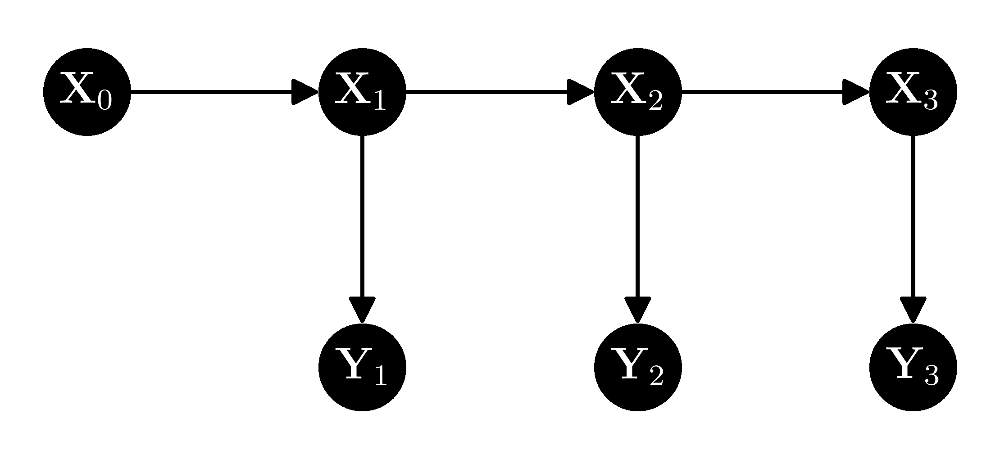

# 6.6\. 练习题#

> 原文：[`mmids-textbook.github.io/chap06_prob/exercises/roch-mmids-prob-exercises.html`](https://mmids-textbook.github.io/chap06_prob/exercises/roch-mmids-prob-exercises.html)

## 6.6.1\. 预习工作表#

*(在克劳德、双子座和 ChatGPT 的帮助下)*

**第 6.2 节**

**E6.2.1** 对于一个有 \(K = 3\) 个类别和概率 \(\pi_1 = 0.2\)，\(\pi_2 = 0.5\)，和 \(\pi_3 = 0.3\) 的分类变量 \(\mathbf{Y}\)，计算概率 \(\mathbb{P}(\mathbf{Y} = \mathbf{e}_2)\)。

**E6.2.2** 给定一个包含 10 次抛硬币的数据集 \((1, 0, 1, 1, 0, 0, 1, 1, 0, 1)\)，找到伯努利分布参数 \(q\) 的最大似然估计。

**E6.2.3** 证明伯努利分布参数的最大似然估计在统计上是一致的。

**E6.2.4** 给定一个数据集 \(\{(x_i, y_i)\}_{i=1}^n\)，其中 \(x_i \in \mathbb{R}\) 和 \(y_i \in \{0, 1\}\)，写出逻辑回归的负对数似然函数并计算其梯度。

**E6.2.5** 对于数据集 \(\{(1, 1), (2, 0), (3, 1), (4, 0)\}\)，使用学习率 \(\eta = 0.1\) 和初始参数 \(w = 0\) 进行逻辑回归的一步梯度下降。

**E6.2.6** 计算具有泊松分布均值 \(\lambda\) 的广义线性模型负对数似然函数的梯度和国值。

**E6.2.7** 一个离散随机变量 \(X\) 的概率质量函数如下

\[ P(X = x) = \frac{1}{Z(\theta)} h(x) \exp(\theta x), \]

其中 \(x \in \{-1, 0, 1\}\)。找到 \(Z(\theta)\) 的值。

**E6.2.8** 设 \(X\) 是一个具有以下概率质量函数的随机变量

\[ P(X = x) = \frac{1}{Z(\theta)} \exp(\theta x²), \]

其中 \(x \in \{-1, 0, 1\}\)。找到配分函数 \(Z(\theta)\)。

**E6.2.9** 给定从具有 \(n = 4\) 次试验和 \(K = 3\) 个类别的多项式分布中抽取的样本 \(\{X_1 = 1, X_2 = 2, X_3 = 2, X_4 = 3\}\)，计算每个类别的经验频率。

**E6.2.10** 计算协方差矩阵 \(\boldsymbol{\Sigma} = \begin{pmatrix} 4 & 2 \\ 2 & 3 \end{pmatrix}\) 的行列式。

**E6.2.11** 对于一个均值为 \(\boldsymbol{\mu} = \begin{pmatrix} 1 \\ 2 \end{pmatrix}\) 和协方差矩阵 \(\boldsymbol{\Sigma} = \begin{pmatrix} 2 & 1 \\ 1 & 2 \end{pmatrix}\) 的二维多元高斯向量 \(\mathbf{X} \in \mathbb{R}²\)，计算观察到 \(\mathbf{X} = \begin{pmatrix} 1 \\ 3 \end{pmatrix}\) 的对数似然。

**第 6.3 节**

**E6.3.1** 给定事件 \(A\) 和 \(B\)，其中 \(P(A) = 0.4\)，\(P(B) = 0.5\)，和 \(P(A \cap B) = 0.2\)，计算条件概率 \(P(A|B)\)。

**E6.3.2** 给定随机变量 \(X\) 和 \(Y\)，它们的联合概率质量函数 \(p_{X,Y}(x,y) = \frac{1}{4}\) 对于 \(x, y \in \{0, 1\}\)，找到 \(P(Y=1|X=0)\)。

**E6.3.3** 对于一个离散随机变量 \(X\)，其条件概率为 \(\mathbb{P}(X = 1|Y = y) = 0.3\) 和 \(\mathbb{P}(X = 2|Y = y) = 0.7\)，计算条件期望 \(\mathbb{E}[X|Y=y]\)。

**E6.3.4** 对于事件 \(A\) 和 \(B\)，已知 \(P(A|B) = 0.6\) 和 \(P(B) = 0.5\)，计算 \(P(A \cap B)\)。

**E6.3.5** 给定事件 \(A\)，\(B\)，和 \(C\)，其概率分别为 \(P[A] = 0.6\)，\(P[B] = 0.5\)，\(P[C] = 0.4\)，\(P[A \cap B] = 0.3\)，\(P[A \cap C] = 0.2\)，\(P[B \cap C] = 0.1\)，和 \(P[A \cap B \cap C] = 0.05\)，计算 \(P[A \mid B \cap C]\)。

**E6.3.6** 给定事件 \(A\)，\(B\)，和 \(C\)，其概率分别为 \(P[A] = 0.7\)，\(P[B \mid A] = 0.6\)，和 \(P[C \mid A \cap B] = 0.4\)，计算 \(P[A \cap B \cap C]\)。

**E6.3.7** 给定事件 \(A\)，\(B\)，和 \(C\)，其概率分别为 \(P[A] = 0.8\)，\(P[B] = 0.6\)，和 \(P[C] = 0.5\)，并且假设 \(A\)，\(B\)，和 \(C\) 是成对独立的，计算 \(P[A \cap B \cap C]\)。

**E6.3.8** 设 \(X, Y, Z\) 是取值在 \(\{0,1\}\) 的随机变量。给定一个叉形配置 \(Y \leftarrow X \rightarrow Z\)，其中 \((P[X=x])_{x} = (0.2, 0.8)\)，\(P([Y=y \mid X=x])_{x,y} = \begin{pmatrix} 0.6 & 0.4 \\ 0.3 & 0.7 \end{pmatrix}\)，和 \((P[Z=z \mid X=x])_{x,z} = \begin{pmatrix} 0.8 & 0.2 \\ 0.1 & 0.9 \end{pmatrix}\)，计算 \((P[Y=y, Z=z])_{y,z}\)。

**E6.3.9** 设 \(X, Y, Z\) 是取值在 \(\{0,1\}\) 的随机变量。给定一个链式配置 \(X \rightarrow Y \rightarrow Z\)，其中 \((P[X=x])_x = (0.3, 0.7)\)，\((P[Y=y \mid X=x])_{x,y} = \begin{pmatrix} 0.2 & 0.8 \\ 0.6 & 0.4 \end{pmatrix}\)，和 \((P[Z=z \mid Y=y])_{y,z} = \begin{pmatrix} 0.5 & 0.5 \\ 0.1 & 0.9 \end{pmatrix}\)，计算 \((P[X=x, Z=z])_{x,z}\)。

**E6.3.10** 考虑一个具有 4 个单词和 2 个主题的文档分类问题。给定 \(\pi = (0.5, 0.5)\)，\(p_1 = (0.1, 0.5, 0.1, 0.5)\)，和 \(p_2 = (0.5, 0.5, 0.1, 0.1)\)，计算 \(P[C = 1, X = (1, 0, 1, 0)]\)。

**E6.3.11** 考虑一个具有 3 个单词和 2 个主题的文档分类问题。给定一个训练数据集，其中 \(N_{1,1} = 10\)，\(N_{1,2} = 20\)，\(N_{1,3} = 20\)，\(N_{2,1} = 40\)，\(N_{2,2} = 30\)，\(N_{2,3} = 30\)，\(N_1 = 50\)，和 \(N_2 = 100\)，计算 \(\pi_1\)，\(p_{1,1}\)，和 \(p_{2,1}\) 的最大似然估计。

**E6.3.12** 假设 \(A\)，\(B\)，和 \(C\) 是事件，且 \(P[C] > 0\)，\(A \indep B | C\)。如果 \(P[A|C] = 0.3\) 和 \(P[B|C] = 0.6\)，计算 \(P[A \cap B | C]\)。

**E6.3.13** 考虑以下图模型：

```py
G = nx.DiGraph()
G.add_edges_from([("X", "Y"), ("X", "Z")]) 
```

使用概率链式法则写下联合概率分布 \(P[X=x, Y=y, Z=z]\)。

**E6.3.14** 在朴素贝叶斯模型中，如果一个文档包含单词“love”和“great”但没有其他词汇表中的单词，并且模型参数为 \(p_{1,\text{love}} = 0.8\)，\(p_{1,\text{great}} = 0.7\)，\(p_{2,\text{love}} = 0.2\)，和 \(p_{2,\text{great}} = 0.3\)，那么文档更有可能属于哪个等可能类别（1 或 2）？

**第 6.4 节**

**E6.4.1** 设 \(X\) 是一个服从两个伯努利分布混合的随机变量，参数为 \(p_1 = 0.3\) 和 \(p_2 = 0.8\)，混合权重 \(\pi_1 = 0.6\) 和 \(\pi_2 = 0.4\)。计算 \(P(X = 1)\)。

**E6.4.2** 在具有两个成分的高斯混合模型（GMM）中，假设 \(\boldsymbol{\mu}_1 = (1, 2)\)，\(\boldsymbol{\mu}_2 = (-1, -1)\)，\(\Sigma_1 = \Sigma_2 = I_{2 \times 2}\)，并且 \(\pi_1 = \pi_2 = 0.5\)。写出这个 GMM 的概率密度函数。

**E6.4.3** 给定一个由两个多元伯努利分布组成的混合，参数为 \(\pi_1 = 0.4\)，\(\pi_2 = 0.6\)，\(p_{1,1} = 0.7\)，\(p_{1,2} = 0.3\)，\(p_{2,1} = 0.2\)，和 \(p_{2,2} = 0.8\)，计算观察数据点 \(\mathbf{x} = (1, 0)\) 的概率。

**E6.4.4** 给定一个由两个一元高斯分布组成的混合，参数为 \(\pi_1 = 0.3\)，\(\pi_2 = 0.7\)，\(\mu_1 = 1\)，\(\mu_2 = 4\)，\(\sigma_1² = 1\)，和 \(\sigma_2² = 2\)，计算在 \(x = 2\) 处的概率密度函数。

**E6.4.5** 给定一个由两个多元伯努利分布组成的混合，参数为 \(\pi_1 = 0.5\)，\(\pi_2 = 0.5\)，\(p_{1,1} = 0.8\)，\(p_{1,2} = 0.2\)，\(p_{2,1} = 0.1\)，和 \(p_{2,2} = 0.9\)，计算数据点 \(\mathbf{x}_i = (1, 1)\) 的责任度 \(r_{1,i}\) 和 \(r_{2,i}\)。

**E6.4.6** 给定一个由两个多元伯努利分布组成的混合，参数为 \(\pi_1 = 0.4\)，\(\pi_2 = 0.6\)，\(p_{1,1} = 0.7\)，\(p_{1,2} = 0.1\)，\(p_{2,1} = 0.2\)，和 \(p_{2,2} = 0.3\)，计算数据点 \(\mathbf{x}_i = (0, 1)\) 的责任度 \(r_{1,i}\) 和 \(r_{2,i}\)。

**E6.4.7** 给定一个由两个多元伯努利分布组成的混合，参数为 \(\pi_1 = 0.6\)，\(\pi_2 = 0.4\)，以及数据点 \(\mathbf{x}_1 = (1, 0)\) 和 \(\mathbf{x}_2 = (0, 1)\) 的责任度 \(r_{1,1} = 0.8\) 和 \(r_{2,2} = 0.2\)，使用 EM 算法的 M 步更新参数 \(\pi_1\) 和 \(\pi_2\)。

**E6.4.8** 给定一个由两个多元伯努利分布组成的混合，参数为 \(\pi_1 = 0.5\)，\(\pi_2 = 0.5\)，责任度 \(r_{1,1} = 0.7\)，\(r_{1,2} = 0.3\)，对于数据点 \(\mathbf{x}_1 = (1, 1)\) 和 \(\mathbf{x}_2 = (0, 0)\)，使用 EM 算法的 M 步更新参数 \(\pi_1\) 和 \(\pi_2\)。

**E6.4.9** 在多元伯努利混合的 EM 算法中，假设你有三个数据点：\(\mathbf{x}_1 = (1, 0, 1)\)，\(\mathbf{x}_2 = (0, 1, 0)\)，和 \(\mathbf{x}_3 = (1, 1, 1)\)。如果当前的参数估计是 \(\pi_1 = 0.4\)，\(\pi_2 = 0.6\)，\(p_{1,1} = 0.2\)，\(p_{1,2} = 0.7\)，\(p_{1,3} = 0.9\)，\(p_{2,1} = 0.8\)，\(p_{2,2} = 0.3\)，和 \(p_{2,3} = 0.5\)，计算责任度 \(r_{1,2}\)（簇 1 对数据点 2 的责任度）。

**E6.4.10** 设 \(f(x) = x²\)。找到一个函数 \(U_x(z)\)，使得在 \(x = 2\) 处 \(U_x(z)\) 优于 \(f\)。

**E6.4.11** 对于具有成分均值 \(\mu_1 = -1\)，\(\mu_2 = 3\) 和混合权重 \(\pi_1 = 0.5\)，\(\pi_2 = 0.5\) 的高斯混合模型，计算期望值 \(\mathbb{E}[X]\)。

**E6.4.12** 给定混合权重 \(\pi_1 = 0.3\)，\(\pi_2 = 0.7\) 和成分密度 \(p_{\theta_1}(x) = 0.25\)，\(p_{\theta_2}(x) = 0.75\)，计算对数似然 \(\log(p_X(x))\)。

**E6.4.13** 对于具有两个成分的高斯混合模型，\(\pi_1 = 0.4\)，\(\pi_2 = 0.6\)，\(\mu_1 = 0\)，\(\mu_2 = 4\)，\(\sigma_1² = 1\)，\(\sigma_2² = 2\)，计算 \(\mathrm{Var}(X)\)。

**第 6.5 节**

**E6.5.1** 给定一个正定矩阵 \(B = \begin{pmatrix} 2 & 1 \\ 1 & 3 \end{pmatrix}\)，计算 \(B / B_{11}\) 的 Schur 补。

**E6.5.2** 给定一个分块矩阵

\[\begin{split} A = \begin{pmatrix} 1 & 2 & 0 \\ 3 & 4 & 5 \\ 0 & 6 & 7  \end{pmatrix}, \end{split}\]

将 \(A\) 分解为 4 个块，其中 \(A_{11}\) 由前两行和列构成。

**E6.5.3** 计算在 E6.5.2 中给出的矩阵 \(A\) 中块 \(A_{11}\) 的 Schur 补。

**E6.5.4** 给定一个具有均值 \(\boldsymbol{\mu} = (1, 2)\) 和协方差矩阵 \(\bSigma = \begin{pmatrix} 2 & 1 \\ 1 & 3 \end{pmatrix}\) 的多元高斯向量 \(\mathbf{X} = (X_1, X_2)\)，计算 \(X_1\) 的边缘均值和方差。

**E6.5.5** 给定一个具有均值 \(\boldsymbol{\mu} = (1, 2)\) 和协方差矩阵 \(\bSigma = \begin{pmatrix} 2 & 1 \\ 1 & 3 \end{pmatrix}\) 的多元高斯向量 \(\mathbf{X} = (X_1, X_2)\)，计算在 \(X_2 = 3\) 条件下 \(X_1\) 的条件均值。

**E6.5.6** 给定一个多元高斯向量 \(\mathbf{X} = (X_1, X_2) \sim N_2\left( \begin{pmatrix} 0 \\ 0 \end{pmatrix}, \begin{pmatrix} 2 & 1 \\ 1 & 2 \end{pmatrix} \right)\)，计算 \(\mathbb{E}[X_1 | X_2 = 1]\)。

**E6.5.7** 设 \(\mathbf{X} = (X_1, X_2)\) 为一个具有均值向量 \(\boldsymbol{\mu} = (0, 0)\) 和协方差矩阵 \(\bSigma = \begin{pmatrix} 4 & 1 \\ 1 & 2 \end{pmatrix}\) 的多元高斯随机变量。求 \(X_2 = 1\) 条件下 \(X_1\) 的条件分布。

**E6.5.8** 设 \(\mathbf{X} = (X_1, X_2, X_3)\) 为一个具有均值向量 \(\boldsymbol{\mu} = (1, -1, 0)\) 和协方差矩阵 \(\bSigma = \begin{pmatrix} 3 & 1 & 0 \\ 1 & 2 & -1 \\ 0 & -1 & 1 \end{pmatrix}\) 的多元高斯随机变量。写出 \((X_1, X_3)\) 的边缘分布。

**E6.5.9** 设 \(\mathbf{X}\) 为一个具有均值向量 \(\begin{pmatrix} 1 \\ -2 \end{pmatrix}\) 和协方差矩阵 \(\begin{pmatrix} 3 & 1 \\ 1 & 2 \end{pmatrix}\) 的多元高斯随机变量。求线性变换 \(\mathbf{Y} = A\mathbf{X}\) 的分布，其中 \(A = \begin{pmatrix} 1 & 2 \\ -1 & 1 \end{pmatrix}\)。

**E6.5.10** 给定一个具有状态演化 \(\mathbf{X}_{t+1} = \begin{pmatrix} 1 & 1 \\ 0 & 1 \end{pmatrix} \mathbf{X}_t + \mathbf{W}_t\) 的线性高斯系统，其中 \(\mathbf{W}_t \overset{iid}{\sim} N_2(0, I_2)\)，以及初始状态分布 \(\mathbf{X}_0 \sim N_2((1, 1), I_2)\)，计算 \(X_1\) 的均值和协方差矩阵。

**E6.5.11** 给定一个具有观测模型 \(Y_t = \begin{pmatrix} 1 & 0 \end{pmatrix} \mathbf{X}_t + V_t\) 的线性高斯系统，其中 \(V_t \overset{iid}{\sim} N_1(0, 1)\)，以及状态分布 \(\mathbf{X}_t \sim N_2((1, 2), I_2)\)，计算 \(Y_t\) 的均值和方差。

**E6.5.12** 给定一个具有状态演化 \(\mathbf{X}_{t+1} = \begin{pmatrix} 1 & 1 \\ 0 & 1 \end{pmatrix} \mathbf{X}_t + \mathbf{W}_t\) 的线性高斯系统，其中 \(\mathbf{W}_t \overset{iid}{\sim} N_2(0, I_2)\)，观测模型 \(Y_t = \begin{pmatrix} 1 & 0 \end{pmatrix} \mathbf{X}_t + V_t\)，其中 \(V_t \overset{iid}{\sim} N_1(0, 1)\)，以及初始状态分布 \(\mathbf{X}_0 \sim N_2((1, 1), I_2)\)，计算卡尔曼增益矩阵 \(K_1\)。

**E6.5.13** 给定测量模型 \(Y_t = H \mathbf{X}_t + V_t\)，其中 \(H = \begin{pmatrix} 1 & 0 \end{pmatrix}\) 且 \(V_t \sim N_1(0, 0.1)\)，在 \(Y_t = 3\) 和 \(\boldsymbol{\mu}_{\text{pred}} = \begin{pmatrix} 3 \\ 1 \end{pmatrix}\) 的条件下，计算创新 \(e_t = Y_t - H \boldsymbol{\mu}_{\text{pred}}\)。

**E6.5.14** 确定 E6.5.13 中模型的卡尔曼增益矩阵 \(K_t = \bSigma_{\text{pred}} H^T (H \bSigma_{\text{pred}} H^T + R)^{-1}\)，其中 \(\bSigma_{\text{pred}} = \begin{pmatrix} 0.2 & 0.1 \\ 0.1 & 0.2 \end{pmatrix}\) 和 \(R = 0.1\)。

**E6.5.15** 使用 E6.5.14 中的卡尔曼增益矩阵 \(K_t\)，在 \(\boldsymbol{\mu}_{\text{pred}} = \begin{pmatrix} 3 \\ 1 \end{pmatrix}\) 和 \(e_t = Y_t - H \boldsymbol{\mu}_{\text{pred}} = 0\) 的条件下，更新状态估计 \(\boldsymbol{\mu}_t\)。

**E6.5.16** 使用 E6.5.14 中的卡尔曼增益矩阵 \(K_t\) 和 \(\bSigma_{\text{pred}} = \begin{pmatrix} 0.2 & 0.1 \\ 0.1 & 0.2 \end{pmatrix}\)，计算更新后的协方差矩阵 \(\bSigma_t = (I - K_t H) \bSigma_{\text{pred}}\)。

## 6.6.2\. 问题#

**6.1** 使用谱分解证明如果 \(A \in \mathbb{R}^{n \times n}\) 是正定的，那么它是可逆的。 \(\lhd\)

**6.2** 设 \(\mathbf{X} = (X_1,\ldots,X_n) \in \mathbb{R}^d\) 是一个随机向量，并假设对于所有 \(i=1,\ldots,n\)，\(\mathbb{E}[X_i²] < +\infty\)。回忆一下，协方差矩阵 \(C \in \mathbb{R}^{n \times n}\) 的元素

\[ C_{ij} = \mathrm{Cov}[X_i, X_j] = \mathbb{E}[(X_i - \mathbb{E}[X_i])(X_j - \mathbb{E}[X_j])]. \]

a) 证明 \(C\) 是对称的。

b) 证明 \(C\) 是正半定的。[提示：计算

\[ \mathbb{E}\left[\left\{\mathbf{z}^T (\mathbf{X} - \mathbb{E}[\mathbf{X}])\right\}²\right]. \]

]

\(\lhd\)

**6.3** 证明

\[ \mathrm{K}_{\mathbf{Z}, \mathbf{Z}} = \E[\mathbf{Z} \mathbf{Z}^T] - \E[\mathbf{Z}]\E[\mathbf{Z}]^T \]

\(\lhd\)

**6.4** 证明 \(\mathrm{H}_{L_n}(\mathbf{w})\) 是正半定，其中 \(L_n\) 是广义线性模型中的负对数似然。 \(\lhd\)

**6.5** 假设对于每个 \(i\)，\(p_{\theta_i}\) 是均值为 \(\theta_i = \mathbf{x}_i^T \mathbf{w}\) 且已知方差 \(\sigma_i²\) 的单变量高斯分布。证明 \(\mathbf{w}\) 的最大似然估计量解决了之前作业中定义的加权最小二乘问题。 \(\lhd\)

**6.6** a) 证明泊松分布的指数族形式，均值为 \(\lambda\)，具有充分统计量 \(\phi(y) = y\) 和自然参数 \(\theta = \log \lambda\)。

b) 在泊松回归中，我们假设 \(p_\theta(y)\) 是泊松分布，\(\theta = \mathbf{x}^T \mathbf{w}\)。计算在这种情况下负对数似然函数的梯度和国值。 \(\lhd\)

**6.7** 对于 \(i=1, \ldots, K\)，设 \(p_i\) 是集合 \(\S_i \subseteq \mathbb{R}\) 上的概率质量函数，具有均值 \(\mu_i\) 和方差 \(\sigma_i²\)。设 \(\bpi = (\pi_1,\ldots,\pi_K) \in \Delta_K\)。假设 \(X\) 从混合分布中抽取

\[ p_X(x) = \sum_{i=1}^K \pi_i p_i(x). \]

建立以下公式：

a) \(\mu := \E[X] = \sum_{i=1}^K \pi_i \mu_i\)

b) \(\var[X] = \sum_{i=1}^K \pi_i (\sigma_i² + \mu_i² - \mu²)\)。

\(\lhd\)

**6.8** 设 \(A\), \(B\) 和 \(C\) 为事件。使用乘法法则证明

\[ \P[A \cap B|C] = \P[A|B \cap C] \,\P[B| C]. \]

用语言来说，条件概率满足乘法法则。 \(\lhd\)

**6.9** 设 \(A, B ,C\) 为事件，使得 \(\P[C] > 0\) 和 \(A \indep B | C\)。证明 \(A \indep B^c | C\)。 \(\lhd\)

**6.10** 设 \(A, B, C\) 为事件，使得 \(\P[B \cap C], \P[A \cap C] > 0\)。证明 \(A \indep B | C\) 当且仅当

\[ \P[A | B\cap C] = \P[A | C] \quad \text{和} \quad \P[B | A\cap C] = \P[B | C]. \]

\(\lhd\)

**6.11** 设 \(A, B, C\) 为事件，使得 \(\P[B \cap C] > 0\)。

a) 首先证明

\[ \P[A|B\cap C] = \frac{\P[C|A\cap B] \,\P[A|B]}{\P[C|A\cap B] \,\P[A|B] + \P[C|A^c\cap B] \,\P[A^c|B]}. \]

b) 现在假设 \(\mathbf{1}_B \indep \mathbf{1}_C | \mathbf{1}_A\)。证明

\[ \P[A|B\cap C] = \frac{\P[C|A] \,\P[A|B]}{\P[C|A] \,\P[A|B] + \P[C|A^c] \,\P[A^c|B]}. \]

\(\lhd\)

**6.12** 设 \(\bX, \bY, \bZ, \bW\) 为离散随机向量。证明 \(\bX \indep (\bY, \bZ) | \bW\) 意味着 \(\bX \indep \bY|\bW\) 和 \(\bX \indep \bZ|\bW\)。 \(\lhd\)

**6.13** 设 \(\bX, \bY, \bZ\) 为离散随机向量。假设 \(\bX \indep \bY | \bZ\) 和 \(\bX \indep \bZ\)。证明 \(\bX \indep (\bY, \bZ)\)。 \(\lhd\)

**6.14** 设 \(A \in \mathbb{R}^{n \times n}\) 为可逆矩阵。

a) 证明 \((A^T)^{-1} = (A^{-1})^T\)。[*提示:* 使用逆的定义。]

b) 此外，假设 \(A\) 是对称的。证明 \(A^{-1}\) 是对称的。

\(\lhd\)

**6.15** 一个随机矩阵 \(\mathbf{M} = (M_{i,j})_{i,j} \in \mathbb{R}^{\ell \times d}\) 是一个其元素是相关随机变量的矩阵，即它们位于同一个概率空间中。随机矩阵的期望是一个（确定的）矩阵，其元素是 \(\mathbf{M}\) 元素的期望

\[\begin{split} \mathbb{E}[\mathbf{M}] = \begin{pmatrix} \E[M_{1,1}] & \cdots & \E[M_{1,d}]\\ \vdots & \ddots & \vdots\\ \E[M_{\ell,1}] & \cdots & \E[M_{\ell,d}] \end{pmatrix}. \end{split}\]

证明随机变量的期望线性推广到

\[ \E[A \mathbf{M} + B] = A\,\E[\mathbf{M}] + B \]

对于一个确定的矩阵 \(A \in \mathbb{R}^{k \times \ell}\) 和向量 \(\mathbf{b} \in \mathbb{R}^{\ell \times d}\)。\(\lhd\)

**6.16** 回想一下，一个方阵 \(A\) 的迹，记为 \(\mathrm{tr}(A)\)，是其对角线元素的和。对于一个矩阵 \(A = (a_{i,j})_{i,j} \in \mathbb{R}^{n \times m}\)，\(A\) 的向量化为以下向量

\[ \mathrm{vec}(A) = (a_{1,1},\ldots,a_{n,1}, a_{1,2},\ldots,a_{n,2},\ldots,a_{1,m},\ldots,a_{n,m}) \]

即，它是通过将矩阵的列堆叠在一起得到的。证明对于任意的 \(A, B \in \mathbb{R}^{n \times n}\)，都有 \(\mathrm{tr}(A^T B) = \mathrm{vec}(A)^T \mathrm{vec}(B)\). \(\lhd\)

**6.17** 设 \(\mathbf{X}_1, \ldots, \mathbf{X}_n\) 是 \(\mathbb{R}^d\) 中的随机向量。证明

\[\begin{align*} &\frac{1}{n} \sum_{i=1}^n \mathbf{X}_i \mathbf{X}_i^T - \left(\frac{1}{n} \sum_{i=1}^n \mathbf{X}_i\right) \left(\frac{1}{n} \sum_{i=1}^n \mathbf{X}_i^T \right)\\ &= \frac{1}{n} \sum_{i=1}^n \left[\mathbf{X}_i - \left(\frac{1}{n} \sum_{i=1}^n \mathbf{X}_i\right)\right] \left[ \mathbf{X}_i^T - \left(\frac{1}{n} \sum_{i=1}^n \mathbf{X}_i^T \right)\right]. \end{align*}\]

\(\lhd\)

**6.18** 回想一下，一个分类变量 \(\mathbf{Y}\) 取 \(K \geq 2\) 个可能的值。我们假设它取值在集合 \(\S_{\mathbf{Y}} = \{\mathbf{e}_i : i=1,\ldots,K\}\) 中，其中 \(\mathbf{e}_i\) 是 \(\mathbb{R}^K\) 中的第 \(i\) 个标准基。分布通过设置概率 \(\bpi = (\pi_1,\ldots,\pi_K)\) 来指定，其中 \(\pi_i = \P[\mathbf{Y} = \mathbf{e}_i]\)。我们用 \(\mathbf{Y} \sim \mathrm{Cat}(\bpi)\) 表示，并假设对所有 \(i\)，\(\pi_i > 0\)。多项式分布作为独立分类变量的和出现。设 \(n \geq 1\) 为试验次数，设 \(\mathbf{Y}_1,\ldots,\mathbf{Y}_n\) 是独立同分布的 \(\mathrm{Cat}(\bpi)\)。定义 \(\mathbf{X} = \sum_{i=1}^n \mathbf{Y}_i\)。\(\mathbf{X}\) 在

\[ \mathbf{x} = (x_1,\ldots,x_K) \in \left\{ \mathbf{x} \in \{0,1,\ldots,n\}^K : \sum_{i=1}^K x_i = n \right\}=: \S_{\mathbf{X}} \]

是

\[ p_{\mathbf{X}}(\mathbf{x}) = \frac{n!}{x_1!\cdots x_K!} \prod_{i=1}^K \pi_i^{x_i}. \]

我们写 \(\mathbf{X} \sim \mathrm{Mult}(n, \bpi)\)。设 \(\mu_\mathbf{X}\) 和 \(\Sigma_{\mathbf{X}}\) 是其均值向量和协方差矩阵。

a) 通过指定 \(h\)，\(\bphi\) 和 \(A\) 来证明多项式分布是指数族。证明你的答案。

b) 证明 \(\mu_\mathbf{X} = n \bpi\).

c) 证明 \(\Sigma_{\mathbf{X}} = n[\mathrm{Diag}(\bpi) - \bpi \bpi^T]\)。

\(\lhd\)

**6.19** 设 \(\bX \in \mathbb{R}^d\) 是一个具有均值 \(\bmu\) 和协方差 \(\bSigma\) 的随机向量，且 \(B \in \mathbb{R}^{\ell \times d}\) 是一个确定性矩阵。定义随机向量 \(\bY = B \bX\)。

a) 计算 \(\E[\bY]\)。

b) 计算 \(\mathrm{Cov}[\bX, \bY]\)。

c) 计算 \(\mathrm{Cov}[\bY, \bY]\)。

\(\lhd\)

**6.20** 设过程 \((\bX_{0:T}, \bY_{1:T})\) 具有以下形式的联合密度

\[ f_{\bX_0}(\bx_0) \prod_{t=1}^{T} f_{\bX_{t}|\bX_{t-1}}(\bx_{t}|\bx_{t-1}) f_{\bY_{t}|\bX_{t}}(\by_{t}|\bx_{t}). \]

证明对于任何 \(t = 1,\ldots, T\)，\(\bY_t\) 在给定 \(\bX_{t}\) 的条件下与 \(\bY_{1:t-1}\) 条件独立。

\(\lhd\)

**6.21** 考虑一个具有相同行和列划分的方阵块，即，

\[\begin{split} A = \begin{pmatrix} A_{11} & A_{12}\\ A_{21} & A_{22} \end{pmatrix} \end{split}\]

其中 \(A \in \mathbb{R}^{n \times n}\)，\(A_{ij} \in \mathbb{R}^{n_i \times n_j}\) 对于 \(i, j = 1, 2\)，且满足 \(n_1 + n_2 = n\)。证明转置可以写成

\[\begin{split} A^T = \begin{pmatrix} A_{11}^T & A_{21}^T\\ A_{12}^T & A_{22}^T \end{pmatrix} \end{split}\]

通过写出 \((A^T)_{i,j}\) 的形式，其中 \(A\) 是块。确保仔细考虑所有情况（例如，\(i \leq n_1\) 和 \(j > n_1\) 等）。

\(\lhd\)

**6.22** 通过直接计算 \(B B^{-1}\) 和 \(B^{-1} B\) 使用分块矩阵的乘法公式来证明 *逆矩阵分块矩阵引理*。\(\lhd\)

**6.23** 设 \(A, B \in \mathbb{R}^{n \times n}\) 是可逆矩阵。以下哪些矩阵也是可逆的？指定其逆矩阵或提供反例。

a)

\[ A + B \]

b)

\[\begin{split} \begin{pmatrix} A & \mathbf{0}\\ \mathbf{0} & B \end{pmatrix} \end{split}\]

c)

\[\begin{split} \begin{pmatrix} A & A + B\\ \mathbf{0} & B \end{pmatrix} \end{split}\]

d)

\[ ABA \]

\(\lhd\)

**6.24** 在 EM 算法的推导中，严格证明以下公式

\[ \pi_k^* = \frac{\eta_k^{\btheta}}{n} \quad \text{和} \quad p_{k,m}^* = \frac{\eta_{k,m}^{\btheta}}{\eta_k^{\btheta}} \quad \forall k \in [K], m \in [M] \]

通过逐步调整朴素贝叶斯模型中的论点。\(\lhd\)

**6.25** 考虑以下线性高斯系统的图形表示：



证明以下命题：

a) \(Y_3\) 在给定 \(X_2\) 的条件下与 \(X_1\) 条件独立。

b) \(Y_3\) 在给定 \(X_2\) 的条件下与 \(Y_1\) 条件独立。

c) \(X_3\) 在给定 \(X_2\) 的条件下与 \(X_1\) 条件独立。

\(\lhd\)

**6.26** 重新计算 *Schur 补引理* 证明中的计算 \(B / B_{22}\)。\(\lhd\)

**6.27** 设 \(\mathbf{X} = (X_1, X_2, X_3)\) 服从 \(N_3(\bmu, \bSigma)\) 分布，其中

\[\begin{split} \bmu = \begin{pmatrix} 2\\ -1\\ 3 \end{pmatrix} \qquad \bSigma = \begin{pmatrix} 4 & 1 & 0\\ 1 & 2 & 1\\ 0 & 1 & 3 \end{pmatrix}. \end{split}\]

a) 计算 \(f_{X_1,X_2|X_3}\)，即给定 \(X_3\) 的 \((X_1, X_2)\) 的条件密度。

b) 在边缘密度 \(f_{X_1, X_2}\) 下，\(X_1\) 和 \(X_2\) 之间的相关系数是多少？

\(\lhd\)

**6.28** 考虑分块矩阵

\[\begin{split} \begin{pmatrix} C & B & \mathbf{0}\\ B^T & \mathbf{0} & D\\ \mathbf{0} & \mathbf{0} & B B^T \end{pmatrix} \end{split}\]

假设 \(B \in \mathbb{R}^{2 \times 5}\)。块 \(C\) 和 \(D\) 的维度是什么？证明你的答案。

\(\lhd\)

**6.29** a) 设 \(A_{11} \in \mathbb{R}^{n \times n}\) 和 \(A_{22} \in \mathbb{R}^{m \times m}\) 是可逆的。设 \(A_{12} \in \mathbb{R}^{n \times m}\)。找到分块矩阵的逆

\[\begin{split} A = \begin{pmatrix} A_{11} & A_{12}\\ \mathbf{0} & A_{22} \end{pmatrix}. \end{split}\]

[提示：你可以通过考虑块为标量的情形来猜测解决方案。]

b) 设 \(\mathbf{b} \in \mathbb{R}^n\) 是一个非零向量。证明块矩阵

\[\begin{split} B = \begin{pmatrix} I_{n \times n} & \mathbf{b}\\ \mathbf{b}^T & 0 \end{pmatrix} \end{split}\]

通过建立 \(B \mathbf{z} = \mathbf{0}\) 蕴含 \(\mathbf{z} = \mathbf{0}\) 来证明 \(B\) 是可逆的。\(\lhd\)

## 6.6.1\. 预习工作表#

*(在 Claude、Gemini 和 ChatGPT 的帮助下)*

**第 6.2 节**

**E6.2.1** 对于一个有 \(K = 3\) 个类别和概率 \(\pi_1 = 0.2\)，\(\pi_2 = 0.5\)，和 \(\pi_3 = 0.3\) 的分类变量 \(\mathbf{Y}\)，计算 \(\mathbb{P}(\mathbf{Y} = \mathbf{e}_2)\) 的概率。

**E6.2.2** 给定一个 10 次抛硬币的数据集 \((1, 0, 1, 1, 0, 0, 1, 1, 0, 1)\)，找到伯努利分布参数 \(q\) 的最大似然估计。

**E6.2.3** 证明伯努利分布参数的最大似然估计在统计上是一致的。

**E6.2.4** 给定一个数据集 \(\{(x_i, y_i)\}_{i=1}^n\)，其中 \(x_i \in \mathbb{R}\) 和 \(y_i \in \{0, 1\}\)，写出逻辑回归的负对数似然函数并计算其梯度。

**E6.2.5** 对于数据集 \(\{(1, 1), (2, 0), (3, 1), (4, 0)\}\)，使用学习率 \(\eta = 0.1\) 和初始参数 \(w = 0\) 进行逻辑回归的一步梯度下降。

**E6.2.6** 计算具有泊松分布均值 \(\lambda\) 的广义线性模型负对数似然函数的梯度和 Hessian 矩阵。

**E6.2.7** 一个离散随机变量 \(X\) 的概率质量函数由以下给出

\[ P(X = x) = \frac{1}{Z(\theta)} h(x) \exp(\theta x), \]

其中 \(x \in \{-1, 0, 1\}\)。求 \(Z(\theta)\) 的值。

**E6.2.8** 设 \(X\) 是一个随机变量，其概率质量函数如下

\[ P(X = x) = \frac{1}{Z(\theta)} \exp(\theta x²), \]

在 \(x \in \{-1, 0, 1\}\) 的范围内，找到配分函数 \(Z(\theta)\)。

**E6.2.9** 给定从具有 \(n = 4\) 次试验和 \(K = 3\) 个类别的多项式分布中抽取的样本 \(\{X_1 = 1, X_2 = 2, X_3 = 2, X_4 = 3\}\)，计算每个类别的经验频率。

**E6.2.10** 计算协方差矩阵 \(\boldsymbol{\Sigma} = \begin{pmatrix} 4 & 2 \\ 2 & 3 \end{pmatrix}\) 的行列式。

**E6.2.11** 对于一个二维多元高斯向量 \(\mathbf{X} \in \mathbb{R}²\)，其均值 \(\boldsymbol{\mu} = \begin{pmatrix} 1 \\ 2 \end{pmatrix}\) 和协方差矩阵 \(\boldsymbol{\Sigma} = \begin{pmatrix} 2 & 1 \\ 1 & 2 \end{pmatrix}\)，计算观察 \(\mathbf{X} = \begin{pmatrix} 1 \\ 3 \end{pmatrix}\) 的对数似然。

**第 6.3 节**

**E6.3.1** 给定事件 \(A\) 和 \(B\)，其中 \(P(A) = 0.4\)、\(P(B) = 0.5\) 和 \(P(A \cap B) = 0.2\)，计算条件概率 \(P(A|B)\)。

**E6.3.2** 给定随机变量 \(X\) 和 \(Y\)，其联合概率质量函数 \(p_{X,Y}(x,y) = \frac{1}{4}\) 对于 \(x, y \in \{0, 1\}\)，找到 \(P(Y=1|X=0)\)。

**E6.3.3** 对于一个离散随机变量 \(X\)，其条件概率 \(\mathbb{P}(X = 1|Y = y) = 0.3\) 和 \(\mathbb{P}(X = 2|Y = y) = 0.7\)，计算条件期望 \(\mathbb{E}[X|Y=y]\)。

**E6.3.4** 对于事件 \(A\) 和 \(B\)，其中 \(P(A|B) = 0.6\) 和 \(P(B) = 0.5\)，计算 \(P(A \cap B)\)。

**E6.3.5** 给定事件 \(A\)、\(B\)、\(C\)，其中 \(P[A] = 0.6\)、\(P[B] = 0.5\)、\(P[C] = 0.4\)、\(P[A \cap B] = 0.3\)、\(P[A \cap C] = 0.2\)、\(P[B \cap C] = 0.1\) 和 \(P[A \cap B \cap C] = 0.05\)，计算 \(P[A \mid B \cap C]\)。

**E6.3.6** 给定事件 \(A\)、\(B\) 和 \(C\)，其中 \(P[A] = 0.7\)、\(P[B \mid A] = 0.6\) 和 \(P[C \mid A \cap B] = 0.4\)，计算 \(P[A \cap B \cap C]\)。

**E6.3.7** 给定事件 \(A\)、\(B\) 和 \(C\)，其中 \(P[A] = 0.8\)、\(P[B] = 0.6\) 和 \(P[C] = 0.5\)，并且假设 \(A\)、\(B\) 和 \(C\) 是两两独立的，计算 \(P[A \cap B \cap C]\)。

**E6.3.8** 设 \(X, Y, Z\) 是取值在 \(\{0,1\}\) 的随机变量。给定一个叉形配置 \(Y \leftarrow X \rightarrow Z\)，其中 \((P[X=x])_{x} = (0.2, 0.8)\)，\(P([Y=y \mid X=x])_{x,y} = \begin{pmatrix} 0.6 & 0.4 \\ 0.3 & 0.7 \end{pmatrix}\)，以及 \((P[Z=z \mid X=x])_{x,z} = \begin{pmatrix} 0.8 & 0.2 \\ 0.1 & 0.9 \end{pmatrix}\)，计算 \((P[Y=y, Z=z])_{y,z}\)。

**E6.3.9** 设 \(X, Y, Z\) 是取值在 \(\{0,1\}\) 的随机变量。给定一个链形配置 \(X \rightarrow Y \rightarrow Z\)，其中 \((P[X=x])_x = (0.3, 0.7)\)，\((P[Y=y \mid X=x])_{x,y} = \begin{pmatrix} 0.2 & 0.8 \\ 0.6 & 0.4 \end{pmatrix}\)，以及 \((P[Z=z \mid Y=y])_{y,z} = \begin{pmatrix} 0.5 & 0.5 \\ 0.1 & 0.9 \end{pmatrix}\)，计算 \((P[X=x, Z=z])_{x,z}\)。

**E6.3.10** 考虑一个包含 4 个单词和 2 个主题的文档分类问题。给定 \(\pi = (0.5, 0.5)\), \(p_1 = (0.1, 0.5, 0.1, 0.5)\), 和 \(p_2 = (0.5, 0.5, 0.1, 0.1)\)，计算 \(P[C = 1, X = (1, 0, 1, 0)]\)。

**E6.3.11** 考虑一个包含 3 个单词和 2 个主题的文档分类问题。给定一个训练数据集，其中 \(N_{1,1} = 10\), \(N_{1,2} = 20\), \(N_{1,3} = 20\), \(N_{2,1} = 40\), \(N_{2,2} = 30\), \(N_{2,3} = 30\), \(N_1 = 50\), 和 \(N_2 = 100\)，计算 \(\pi_1\), \(p_{1,1}\)，和 \(p_{2,1}\) 的最大似然估计。

**E6.3.12** 假设 \(A\), \(B\), 和 \(C\) 是事件，且 \(P[C] > 0\) 和 \(A \indep B | C\)。如果 \(P[A|C] = 0.3\) 和 \(P[B|C] = 0.6\)，计算 \(P[A \cap B | C]\)。

**E6.3.13** 考虑以下图模型：

```py
G = nx.DiGraph()
G.add_edges_from([("X", "Y"), ("X", "Z")]) 
```

使用概率的链式法则写下联合概率分布 \(P[X=x, Y=y, Z=z]\)。

**E6.3.14** 在朴素贝叶斯模型中，如果一个文档包含单词“love”和“great”但没有其他词汇表中的单词，并且模型参数为 \(p_{1,\text{love}} = 0.8\), \(p_{1,\text{great}} = 0.7\), \(p_{2,\text{love}} = 0.2\), 和 \(p_{2,\text{great}} = 0.3\)，那么文档更有可能属于哪个等可能类别（1 或 2）？

**第 6.4 节**

**E6.4.1** 设 \(X\) 是一个服从两个伯努利分布混合的随机变量，其参数为 \(p_1 = 0.3\) 和 \(p_2 = 0.8\)，混合权重 \(\pi_1 = 0.6\) 和 \(\pi_2 = 0.4\)。计算 \(P(X = 1)\)。

**E6.4.2** 在一个具有两个成分的高斯混合模型（GMM）中，假设 \(\boldsymbol{\mu}_1 = (1, 2)\), \(\boldsymbol{\mu}_2 = (-1, -1)\), \(\Sigma_1 = \Sigma_2 = I_{2 \times 2}\)，和 \(\pi_1 = \pi_2 = 0.5\)。写下这个 GMM 的概率密度函数。

**E6.4.3** 给定两个多元伯努利分布的混合，参数为 \(\pi_1 = 0.4\), \(\pi_2 = 0.6\), \(p_{1,1} = 0.7\), \(p_{1,2} = 0.3\), \(p_{2,1} = 0.2\), 和 \(p_{2,2} = 0.8\)，计算观察数据点 \(\mathbf{x} = (1, 0)\) 的概率。

**E6.4.4** 给定两个一元高斯分布的混合，参数为 \(\pi_1 = 0.3\), \(\pi_2 = 0.7\), \(\mu_1 = 1\), \(\mu_2 = 4\), \(\sigma_1² = 1\), 和 \(\sigma_2² = 2\)，计算在 \(x = 2\) 处的概率密度函数。

**E6.4.5** 给定两个多元伯努利分布的混合，参数为 \(\pi_1 = 0.5\), \(\pi_2 = 0.5\), \(p_{1,1} = 0.8\), \(p_{1,2} = 0.2\), \(p_{2,1} = 0.1\), 和 \(p_{2,2} = 0.9\)，计算数据点 \(\mathbf{x}_i = (1, 1)\) 的责任 \(r_{1,i}\) 和 \(r_{2,i}\)。

**E6.4.6** 给定两个多元伯努利分布的混合，参数为 \(\pi_1 = 0.4\), \(\pi_2 = 0.6\), \(p_{1,1} = 0.7\), \(p_{1,2} = 0.1\), \(p_{2,1} = 0.2\), 和 \(p_{2,2} = 0.3\)，计算数据点 \(\mathbf{x}_i = (0, 1)\) 的责任 \(r_{1,i}\) 和 \(r_{2,i}\)。

**E6.4.7** 给定两个多元伯努利分布的混合，参数为 \(\pi_1 = 0.6\), \(\pi_2 = 0.4\)，和责任 \(r_{1,1} = 0.8\) 和 \(r_{2,2} = 0.2\) 对于数据点 \(\mathbf{x}_1 = (1, 0)\) 和 \(\mathbf{x}_2 = (0, 1)\)，使用 EM 算法的 M 步更新参数 \(\pi_1\) 和 \(\pi_2\)。

**E6.4.8** 给定两个多元伯努利分布的混合，参数为 \(\pi_1 = 0.5\), \(\pi_2 = 0.5\)，和责任 \(r_{1,1} = 0.7\), \(r_{1,2} = 0.3\) 对于数据点 \(\mathbf{x}_1 = (1, 1)\) 和 \(\mathbf{x}_2 = (0, 0)\)，使用 EM 算法的 M 步更新参数 \(\pi_1\) 和 \(\pi_2\)。

**E6.4.9** 在多元伯努利混合的 EM 算法中，假设你有三个数据点：\(\mathbf{x}_1 = (1, 0, 1)\)，\(\mathbf{x}_2 = (0, 1, 0)\)，和 \(\mathbf{x}_3 = (1, 1, 1)\)。如果当前的参数估计是 \(\pi_1 = 0.4\), \(\pi_2 = 0.6\), \(p_{1,1} = 0.2\), \(p_{1,2} = 0.7\), \(p_{1,3} = 0.9\), \(p_{2,1} = 0.8\), \(p_{2,2} = 0.3\), 和 \(p_{2,3} = 0.5\)，计算责任 \(r_{1,2}\)（簇 1 对数据点 2 的责任）。

**E6.4.10** 设 \(f(x) = x²\)。找到一个函数 \(U_x(z)\)，使得在 \(x = 2\) 处 \(U_x(z)\) 优于 \(f\)。

**E6.4.11** 对于具有成分均值 \(\mu_1 = -1\), \(\mu_2 = 3\) 和混合权重 \(\pi_1 = 0.5\), \(\pi_2 = 0.5\) 的高斯混合模型，计算期望值 \(\mathbb{E}[X]\)。

**E6.4.12** 考虑混合权重 \(\pi_1 = 0.3\), \(\pi_2 = 0.7\) 和成分密度 \(p_{\theta_1}(x) = 0.25\), \(p_{\theta_2}(x) = 0.75\)，计算对数似然 \(\log(p_X(x))\)。

**E6.4.13** 对于具有两个成分的高斯混合模型，\(\pi_1 = 0.4\), \(\pi_2 = 0.6\), \(\mu_1 = 0\), \(\mu_2 = 4\)，和 \(\sigma_1² = 1\), \(\sigma_2² = 2\)，计算 \(\mathrm{Var}(X)\)。

**第 6.5 节**

**E6.5.1** 给定一个正定矩阵 \(B = \begin{pmatrix} 2 & 1 \\ 1 & 3 \end{pmatrix}\)，计算 \(B / B_{11}\) 的 Schur 补。

**E6.5.2** 给定一个分块矩阵

\[\begin{split} A = \begin{pmatrix} 1 & 2 & 0 \\ 3 & 4 & 5 \\ 0 & 6 & 7  \end{pmatrix}, \end{split}\]

将 \(A\) 分成 4 个块，其中 \(A_{11}\) 由前两行和列形成。

**E6.5.3** 计算矩阵 \(A\) 中 \(A_{11}\) 块的 Schur 补，其中 \(A\) 在 E6.5.2 中给出。

**E6.5.4** 给定一个具有均值 \(\boldsymbol{\mu} = (1, 2)\) 和协方差矩阵 \(\bSigma = \begin{pmatrix} 2 & 1 \\ 1 & 3 \end{pmatrix}\) 的多元高斯向量 \(\mathbf{X} = (X_1, X_2)\)，计算 \(X_1\) 的边缘均值和方差。

**E6.5.5** 给定一个具有均值 \(\boldsymbol{\mu} = (1, 2)\) 和协方差矩阵 \(\bSigma = \begin{pmatrix} 2 & 1 \\ 1 & 3 \end{pmatrix}\) 的多元高斯向量 \(\mathbf{X} = (X_1, X_2)\)，计算在 \(X_2 = 3\) 条件下 \(X_1\) 的条件均值。

**E6.5.6** 给定多元高斯向量 \(\mathbf{X} = (X_1, X_2) \sim N_2\left( \begin{pmatrix} 0 \\ 0 \end{pmatrix}, \begin{pmatrix} 2 & 1 \\ 1 & 2 \end{pmatrix} \right)\)，计算 \(\mathbb{E}[X_1 | X_2 = 1]\)。

**E6.5.7** 设 \(\mathbf{X} = (X_1, X_2)\) 为一个具有均值向量 \(\boldsymbol{\mu} = (0, 0)\) 和协方差矩阵 \(\bSigma = \begin{pmatrix} 4 & 1 \\ 1 & 2 \end{pmatrix}\) 的多元高斯随机变量。求 \(X_1\) 在 \(X_2 = 1\) 条件下的条件分布。

**E6.5.8** 设 \(\mathbf{X} = (X_1, X_2, X_3)\) 为一个具有均值向量 \(\boldsymbol{\mu} = (1, -1, 0)\) 和协方差矩阵 \(\bSigma = \begin{pmatrix} 3 & 1 & 0 \\ 1 & 2 & -1 \\ 0 & -1 & 1 \end{pmatrix}\) 的多元高斯随机变量。写出 \((X_1, X_3)\) 的边缘分布。

**E6.5.9** 设 \(\mathbf{X}\) 为一个具有均值向量 \(\begin{pmatrix} 1 \\ -2 \end{pmatrix}\) 和协方差矩阵 \(\begin{pmatrix} 3 & 1 \\ 1 & 2 \end{pmatrix}\) 的多元高斯随机变量。求线性变换 \(\mathbf{Y} = A\mathbf{X}\) 的分布，其中 \(A = \begin{pmatrix} 1 & 2 \\ -1 & 1 \end{pmatrix}\)。

**E6.5.10** 给定一个具有状态演化 \(\mathbf{X}_{t+1} = \begin{pmatrix} 1 & 1 \\ 0 & 1 \end{pmatrix} \mathbf{X}_t + \mathbf{W}_t\) 的线性高斯系统，其中 \(\mathbf{W}_t \overset{iid}{\sim} N_2(0, I_2)\)，以及初始状态分布 \(\mathbf{X}_0 \sim N_2((1, 1), I_2)\)，计算 \(X_1\) 的均值和协方差矩阵。

**E6.5.11** 给定一个具有观测模型 \(Y_t = \begin{pmatrix} 1 & 0 \end{pmatrix} \mathbf{X}_t + V_t\) 的线性高斯系统，其中 \(V_t \overset{iid}{\sim} N_1(0, 1)\)，以及状态分布 \(\mathbf{X}_t \sim N_2((1, 2), I_2)\)，计算 \(Y_t\) 的均值和方差。

**E6.5.12** 给定一个具有状态演化 \(\mathbf{X}_{t+1} = \begin{pmatrix} 1 & 1 \\ 0 & 1 \end{pmatrix} \mathbf{X}_t + \mathbf{W}_t\) 的线性高斯系统，其中 \(\mathbf{W}_t \overset{iid}{\sim} N_2(0, I_2)\)，观测模型 \(Y_t = \begin{pmatrix} 1 & 0 \end{pmatrix} \mathbf{X}_t + V_t\)，其中 \(V_t \overset{iid}{\sim} N_1(0, 1)\)，以及初始状态分布 \(\mathbf{X}_0 \sim N_2((1, 1), I_2)\)，计算卡尔曼增益矩阵 \(K_1\)。

**E6.5.13** 给定测量模型 \(Y_t = H \mathbf{X}_t + V_t\)，其中 \(H = \begin{pmatrix} 1 & 0 \end{pmatrix}\) 且 \(V_t \sim N_1(0, 0.1)\)，在 \(Y_t = 3\) 和 \(\boldsymbol{\mu}_{\text{pred}} = \begin{pmatrix} 3 \\ 1 \end{pmatrix}\) 的条件下，计算创新 \(e_t = Y_t - H \boldsymbol{\mu}_{\text{pred}}\)。

**E6.5.14** 确定模型 E6.5.13 中的卡尔曼增益矩阵 \(K_t = \bSigma_{\text{pred}} H^T (H \bSigma_{\text{pred}} H^T + R)^{-1}\)，其中 \(\bSigma_{\text{pred}} = \begin{pmatrix} 0.2 & 0.1 \\ 0.1 & 0.2 \end{pmatrix}\) 和 \(R = 0.1\)。

**E6.5.15** 使用 E6.5.14 中的卡尔曼增益矩阵 \(K_t\)，根据 \(\boldsymbol{\mu}_{\text{pred}} = \begin{pmatrix} 3 \\ 1 \end{pmatrix}\) 和 \(e_t = Y_t - H \boldsymbol{\mu}_{\text{pred}} = 0\) 更新状态估计 \(\boldsymbol{\mu}_t\)。

**E6.5.16** 使用 E6.5.14 中的卡尔曼增益矩阵 \(K_t\) 和 \(\bSigma_{\text{pred}} = \begin{pmatrix} 0.2 & 0.1 \\ 0.1 & 0.2 \end{pmatrix}\) 计算更新的协方差矩阵 \(\bSigma_t = (I - K_t H) \bSigma_{\text{pred}}\)。

## 6.6.2\. 问题#

**6.1** 使用谱分解证明如果 \(A \in \mathbb{R}^{n \times n}\) 是正定的，那么它是可逆的。 \(\lhd\)

**6.2** 设 \(\mathbf{X} = (X_1,\ldots,X_n) \in \mathbb{R}^d\) 为一个随机向量，并假设对于所有 \(i=1,\ldots,n\)，\(\mathbb{E}[X_i²] < +\infty\)。回忆一下，协方差矩阵 \(C \in \mathbb{R}^{n \times n}\) 的元素

\[ C_{ij} = \mathrm{Cov}[X_i, X_j] = \mathbb{E}[(X_i - \mathbb{E}[X_i])(X_j - \mathbb{E}[X_j])]. \]

a) 证明 \(C\) 是对称的。

b) 证明 \(C\) 是正半定的。[提示：计算

\[ \mathbb{E}\left[\left\{\mathbf{z}^T (\mathbf{X} - \mathbb{E}[\mathbf{X}])\right\}²\right]. \]

]

\(\lhd\)

**6.3** 证明

\[ \mathrm{K}_{\mathbf{Z}, \mathbf{Z}} = \E[\mathbf{Z} \mathbf{Z}^T] - \E[\mathbf{Z}]\E[\mathbf{Z}]^T \]

\(\lhd\)

**6.4** 证明 \(\mathrm{H}_{L_n}(\mathbf{w})\) 是正半定的，其中 \(L_n\) 是广义线性模型中的负对数似然。 \(\lhd\)

**6.5** 假设对于每个 \(i\)，\(p_{\theta_i}\) 是一个均值为 \(\theta_i = \mathbf{x}_i^T \mathbf{w}\) 且已知方差 \(\sigma_i²\) 的单变量高斯分布。证明 \(\mathbf{w}\) 的最大似然估计量解决了在之前作业中定义的加权最小二乘问题。 \(\lhd\)

**6.6** a) 证明泊松分布的指数族形式，均值为 \(\lambda\)，具有充分统计量 \(\phi(y) = y\) 和自然参数 \(\theta = \log \lambda\)。

b) 在泊松回归中，我们假设 \(p_\theta(y)\) 是泊松分布，\(\theta = \mathbf{x}^T \mathbf{w}\)。计算在这种情况下负对数似然函数的梯度和国值。 \(\lhd\)

**6.7** 对于 \(i=1, \ldots, K\)，设 \(p_i\) 是集合 \(\S_i \subseteq \mathbb{R}\) 上的概率质量函数，具有均值 \(\mu_i\) 和方差 \(\sigma_i²\)。设 \(\bpi = (\pi_1,\ldots,\pi_K) \in \Delta_K\)。假设 \(X\) 从混合分布

\[ p_X(x) = \sum_{i=1}^K \pi_i p_i(x). \]

建立以下公式：

a) \(\mu := \E[X] = \sum_{i=1}^K \pi_i \mu_i\)

b) \(\var[X] = \sum_{i=1}^K \pi_i (\sigma_i² + \mu_i² - \mu²)\).

\(\lhd\)

**6.8** 设 \(A\)、\(B\) 和 \(C\) 为事件。使用乘法法则证明

\[ \P[A \cap B|C] = \P[A|B \cap C] \,\P[B| C]. \]

换句话说，条件概率满足乘法法则。 \(\lhd\)

**6.9** 设 \(A, B ,C\) 为事件，使得 \(\P[C] > 0\) 且 \(A \indep B | C\)。证明 \(A \indep B^c | C\)。\(\lhd\)

**6.10** 设 \(A, B, C\) 为事件，使得 \(\P[B \cap C], \P[A \cap C] > 0\)。证明 \(A \indep B | C\) 当且仅当

\[ \P[A | B\cap C] = \P[A | C] \quad \text{和} \quad \P[B | A\cap C] = \P[B | C]. \]

\(\lhd\)

**6.11** 设 \(A, B, C\) 为事件，使得 \(\P[B \cap C] > 0\)。

a) 首先证明

\[ \P[A|B\cap C] = \frac{\P[C|A\cap B] \,\P[A|B]}{\P[C|A\cap B] \,\P[A|B] + \P[C|A^c\cap B] \,\P[A^c|B]}. \]

b) 现在假设 \(\mathbf{1}_B \indep \mathbf{1}_C | \mathbf{1}_A\)。证明

\[ \P[A|B\cap C] = \frac{\P[C|A] \,\P[A|B]}{\P[C|A] \,\P[A|B] + \P[C|A^c] \,\P[A^c|B]}. \]

\(\lhd\)

**6.12** 设 \(\bX, \bY, \bZ, \bW\) 为离散随机向量。证明 \(\bX \indep (\bY, \bZ) | \bW\) 意味着 \(\bX \indep \bY|\bW\) 和 \(\bX \indep \bZ|\bW\)。\(\lhd\)

**6.13** 设 \(\bX, \bY, \bZ\) 为离散随机向量。假设 \(\bX \indep \bY | \bZ\) 且 \(\bX \indep \bZ\)。证明 \(\bX \indep (\bY, \bZ)\)。\(\lhd\)

**6.14** 设 \(A \in \mathbb{R}^{n \times n}\) 为可逆矩阵。

a) 证明 \((A^T)^{-1} = (A^{-1})^T\)。[*提示:* 使用逆的定义。]

b) 假设此外 \(A\) 是对称的。证明 \(A^{-1}\) 是对称的。

\(\lhd\)

**6.15** 随机矩阵 \(\mathbf{M} = (M_{i,j})_{i,j} \in \mathbb{R}^{\ell \times d}\) 是一个元素为相关随机变量的矩阵，即它们位于同一个概率空间中。随机矩阵的期望是（确定性的）矩阵，其元素是 \(\mathbf{M}\) 元素的期望

\[\begin{split} \mathbb{E}[\mathbf{M}] = \begin{pmatrix} \E[M_{1,1}] & \cdots & \E[M_{1,d}]\\ \vdots & \ddots & \vdots\\ \E[M_{\ell,1}] & \cdots & \E[M_{\ell,d}] \end{pmatrix}. \end{split}\]

证明随机变量的期望线性推广到

\[ \E[A \mathbf{M} + B] = A\,\E[\mathbf{M}] + B \]

对于一个确定性的矩阵 \(A \in \mathbb{R}^{k \times \ell}\) 和向量 \(\mathbf{b} \in \mathbb{R}^{\ell \times d}\). \(\lhd\)

**6.16** 回忆一下，方阵 \(A\) 的[迹](https://en.wikipedia.org/wiki/Trace_(linear_algebra))，记为 \(\mathrm{tr}(A)\)，是其对角线元素的和。对于矩阵 \(A = (a_{i,j})_{i,j} \in \mathbb{R}^{n \times m}\)，\(A\) 的向量化为以下向量

\[ \mathrm{vec}(A) = (a_{1,1},\ldots,a_{n,1}, a_{1,2},\ldots,a_{n,2},\ldots,a_{1,m},\ldots,a_{n,m}) \]

即，它是通过将矩阵的列堆叠在一起得到的。证明对于任何 \(A, B \in \mathbb{R}^{n \times n}\)，都有 \(\mathrm{tr}(A^T B) = \mathrm{vec}(A)^T \mathrm{vec}(B)\). \(\lhd\)

**6.17** 设 \(\mathbf{X}_1, \ldots, \mathbf{X}_n\) 为 \(\mathbb{R}^d\) 中的随机向量。证明

\[\begin{align*} &\frac{1}{n} \sum_{i=1}^n \mathbf{X}_i \mathbf{X}_i^T - \left(\frac{1}{n} \sum_{i=1}^n \mathbf{X}_i\right) \left(\frac{1}{n} \sum_{i=1}^n \mathbf{X}_i^T \right)\\ &= \frac{1}{n} \sum_{i=1}^n \left[\mathbf{X}_i - \left(\frac{1}{n} \sum_{i=1}^n \mathbf{X}_i\right)\right] \left[ \mathbf{X}_i^T - \left(\frac{1}{n} \sum_{i=1}^n \mathbf{X}_i^T \right)\right]. \end{align*}\]

\(\lhd\)

**6.18** 回忆一下，一个分类变量 \(\mathbf{Y}\) 取 \(K \geq 2\) 个可能的值。我们假设它取值在集合 \(\S_{\mathbf{Y}} = \{\mathbf{e}_i : i=1,\ldots,K\}\) 中，其中 \(\mathbf{e}_i\) 是 \(\mathbb{R}^K\) 中的第 \(i\) 个标准基。分布由设置概率 \(\bpi = (\pi_1,\ldots,\pi_K)\) 来指定，其中 \(\pi_i = \P[\mathbf{Y} = \mathbf{e}_i]\)。我们用 \(\mathbf{Y} \sim \mathrm{Cat}(\bpi)\) 表示，并假设对于所有 \(i\)，\(\pi_i > 0\)。多项式分布作为独立分类变量的和出现。设 \(n \geq 1\) 是试验次数，设 \(\mathbf{Y}_1,\ldots,\mathbf{Y}_n\) 是独立同分布的 \(\mathrm{Cat}(\bpi)\)。定义 \(\mathbf{X} = \sum_{i=1}^n \mathbf{Y}_i\)。\(\mathbf{X}\) 在

\[ \mathbf{x} = (x_1,\ldots,x_K) \in \left\{ \mathbf{x} \in \{0,1,\ldots,n\}^K : \sum_{i=1}^K x_i = n \right\}=: \S_{\mathbf{X}} \]

is

\[ p_{\mathbf{X}}(\mathbf{x}) = \frac{n!}{x_1!\cdots x_K!} \prod_{i=1}^K \pi_i^{x_i}. \]

我们写 \(\mathbf{X} \sim \mathrm{Mult}(n, \bpi)\)。设 \(\mu_\mathbf{X}\) 和 \(\Sigma_{\mathbf{X}}\) 是其均值向量和协方差矩阵。

a) 证明多项式分布是指数族分布，通过指定 \(h\)，\(\bphi\) 和 \(A\)。证明你的答案。

b) 证明 \(\mu_\mathbf{X} = n \bpi\)。

c) 证明 \(\Sigma_{\mathbf{X}} = n[\mathrm{Diag}(\bpi) - \bpi \bpi^T]\)。

\(\lhd\)

**6.19** 设 \(\bX \in \mathbb{R}^d\) 是一个具有均值 \(\bmu\) 和协方差 \(\bSigma\) 的随机向量，设 \(B \in \mathbb{R}^{\ell \times d}\) 是一个确定性矩阵。定义随机向量 \(\bY = B \bX\)。

a) 计算 \(\E[\bY]\).

b) 计算 \(\mathrm{Cov}[\bX, \bY]\).

c) 计算 \(\mathrm{Cov}[\bY, \bY]\).

\(\lhd\)

**6.20** 设过程 \((\bX_{0:T}, \bY_{1:T})\) 具有如下形式的联合密度

\[ f_{\bX_0}(\bx_0) \prod_{t=1}^{T} f_{\bX_{t}|\bX_{t-1}}(\bx_{t}|\bx_{t-1}) f_{\bY_{t}|\bX_{t}}(\by_{t}|\bx_{t}). \]

证明对于任意的 \(t = 1,\ldots, T\)，\(\bY_t\) 在给定 \(\bX_{t}\) 的条件下与 \(\bY_{1:t-1}\) 条件独立。

\(\lhd\)

**6.21** 考虑一个行和列具有相同划分的方阵块，即，

\[\begin{split} A = \begin{pmatrix} A_{11} & A_{12}\\ A_{21} & A_{22} \end{pmatrix} \end{split}\]

其中 \(A \in \mathbb{R}^{n \times n}\)，\(A_{ij} \in \mathbb{R}^{n_i \times n_j}\) 对于 \(i, j = 1, 2\) 满足条件 \(n_1 + n_2 = n\)。证明转置可以写成

\[\begin{split} A^T = \begin{pmatrix} A_{11}^T & A_{21}^T\\ A_{12}^T & A_{22}^T \end{pmatrix} \end{split}\]

通过写出 \((A^T)_{i,j}\) 的值来表示 \(A\) 的块。确保仔细考虑所有情况（例如，\(i \leq n_1\) 和 \(j > n_1\) 等）。

\(\lhd\)

**6.22** 通过直接计算 \(B B^{-1}\) 和 \(B^{-1} B\) 使用分块矩阵的乘法公式来证明 *求分块矩阵逆引理*。\(\lhd\)

**6.23** 设 \(A, B \in \mathbb{R}^{n \times n}\) 是可逆矩阵。以下哪些矩阵也是可逆的？指定逆矩阵或提供反例。

a)

\[ A + B \]

b)

\[\begin{split} \begin{pmatrix} A & \mathbf{0}\\ \mathbf{0} & B \end{pmatrix} \end{split}\]

c)

\[\begin{split} \begin{pmatrix} A & A + B\\ \mathbf{0} & B \end{pmatrix} \end{split}\]

d)

\[ ABA \]

\(\lhd\)

**6.24** 在 EM 算法的推导中，严格证明以下公式

\[ \pi_k^* = \frac{\eta_k^{\btheta}}{n} \quad \text{和} \quad p_{k,m}^* = \frac{\eta_{k,m}^{\btheta}}{\eta_k^{\btheta}} \quad \forall k \in [K], m \in [M] \]

通过逐步调整朴素贝叶斯模型的论点。\(\lhd\)

**6.25** 考虑以下线性高斯系统的图形表示：


证明以下陈述：

a) \(Y_3\) 在给定 \(X_2\) 的条件下与 \(X_1\) 条件独立。

b) \(Y_3\) 在给定 \(X_2\) 的条件下与 \(Y_1\) 条件独立。

c) \(X_3\) 在给定 \(X_2\) 的条件下与 \(X_1\) 条件独立。

\(\lhd\)

**6.26** 重新计算证明 *Schur 补引理* 中的 \(B / B_{22}\) 的计算。\(\lhd\)

**6.27** 设 \(\mathbf{X} = (X_1, X_2, X_3)\) 分布为 \(N_3(\bmu, \bSigma)\)，其中

\[\begin{split} \bmu = \begin{pmatrix} 2\\ -1\\ 3 \end{pmatrix} \qquad \bSigma = \begin{pmatrix} 4 & 1 & 0\\ 1 & 2 & 1\\ 0 & 1 & 3 \end{pmatrix}. \end{split}\]

a) 计算 \(f_{X_1,X_2|X_3}\)，即给定 \(X_3\) 的 \((X_1, X_2)\) 的条件密度。

b) 在边缘密度 \(f_{X_1, X_2}\) 下，\(X_1\) 和 \(X_2\) 之间的相关系数是多少？

\(\lhd\)

**6.28** 考虑以下分块矩阵

\[\begin{split} \begin{pmatrix} C & B & \mathbf{0}\\ B^T & \mathbf{0} & D\\ \mathbf{0} & \mathbf{0} & B B^T \end{pmatrix} \end{split}\]

假设 \(B \in \mathbb{R}^{2 \times 5}\)。块 \(C\) 和 \(D\) 的维度是什么？证明你的答案。

\(\lhd\)

**6.29** a) 设 \(A_{11} \in \mathbb{R}^{n \times n}\) 和 \(A_{22} \in \mathbb{R}^{m \times m}\) 是可逆的。设 \(A_{12} \in \mathbb{R}^{n \times m}\)。求以下分块矩阵的逆

\[\begin{split} A = \begin{pmatrix} A_{11} & A_{12}\\ \mathbf{0} & A_{22} \end{pmatrix}. \end{split}\]

[提示：你可以通过考虑块为标量的情形来猜测解。]

b) 设 \(\mathbf{b} \in \mathbb{R}^n\) 是一个非零向量。证明以下分块矩阵

\[\begin{split} B = \begin{pmatrix} I_{n \times n} & \mathbf{b}\\ \mathbf{b}^T & 0 \end{pmatrix} \end{split}\]

通过建立 \(B \mathbf{z} = \mathbf{0}\) 意味着 \(\mathbf{z} = \mathbf{0}\) 来证明其可逆性。 \(\lhd\)
