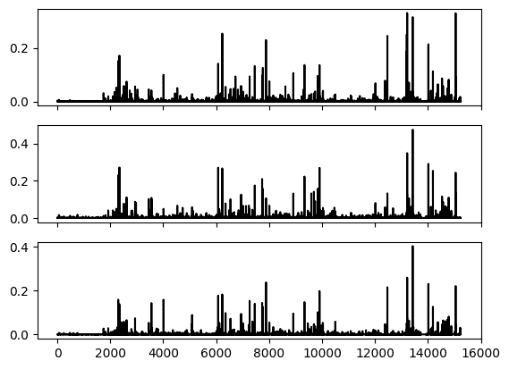
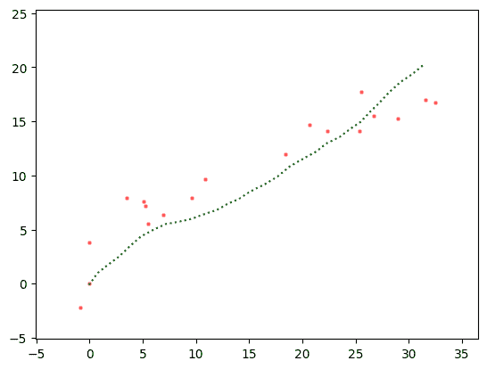
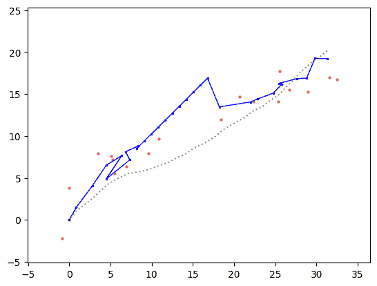
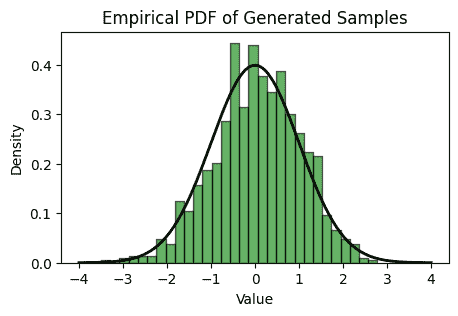

# 6.7\. 在线补充材料#

> 原文：[`mmids-textbook.github.io/chap06_prob/supp/roch-mmids-prob-supp.html`](https://mmids-textbook.github.io/chap06_prob/supp/roch-mmids-prob-supp.html)

## 6.7.1\. 测验、解答、代码等.#

### 6.7.1.1\. 仅代码#

一个包含本章代码的交互式 Jupyter 笔记本可以在此访问（推荐使用 Google Colab）。鼓励您对其进行尝试。一些建议的计算练习散布在其中。笔记本也可以作为幻灯片查看。

+   [笔记本](https://github.com/MMiDS-textbook/MMiDS-textbook.github.io/blob/main/just_the_code/roch_mmids_chap_prob_notebook.ipynb) ([在 Colab 中打开](https://colab.research.google.com/github/MMiDS-textbook/MMiDS-textbook.github.io/blob/main/just_the_code/roch_mmids_chap_prob_notebook.ipynb))

+   [幻灯片](https://raw.githack.com/MMiDS-textbook/MMiDS-textbook.github.io/main/just_the_code/roch_mmids_chap_prob_notebook_slides.slides.html)

### 6.7.1.2\. 自我评估测验#

通过以下链接可以获取更全面的自我评估测验的网页版本。

+   [第 6.2 节](https://raw.githack.com/MMiDS-textbook/MMiDS-textbook.github.io/main/quizzes/self-assessment/quiz_6_2.html)

+   [第 6.3 节](https://raw.githack.com/MMiDS-textbook/MMiDS-textbook.github.io/main/quizzes/self-assessment/quiz_6_3.html)

+   [第 6.4 节](https://raw.githack.com/MMiDS-textbook/MMiDS-textbook.github.io/main/quizzes/self-assessment/quiz_6_4.html)

+   [第 6.5 节](https://raw.githack.com/MMiDS-textbook/MMiDS-textbook.github.io/main/quizzes/self-assessment/quiz_6_5.html)

### 6.7.1.3\. 自动测验#

可以在此处访问本章的自动生成的测验（推荐使用 Google Colab）。

+   [自动测验](https://github.com/MMiDS-textbook/MMiDS-textbook.github.io/blob/main/quizzes/auto_quizzes/roch-mmids-prob-autoquiz.ipynb) ([在 Colab 中打开](https://colab.research.google.com/github/MMiDS-textbook/MMiDS-textbook.github.io/blob/main/quizzes/auto_quizzes/roch-mmids-prob-autoquiz.ipynb))

### 6.7.1.4\. 奇数编号预热练习的解答#

*(由 Claude、Gemini 和 ChatGPT 协助)*

**E6.2.1** \(Y\) 落在第二类中的概率是：

\[ \mathbb{P}(Y = e_2) = \pi_2 = 0.5. \]

**E6.2.3** 设 \(X_1, \ldots, X_n\) 为独立同分布的伯努利\((q^*)\)。最大似然估计是 \(\hat{q}_{\mathrm{MLE}} = \frac{1}{n} \sum_{i=1}^n X_i\)。根据大数定律，当 \(n \to \infty\) 时，

\[ \hat{q}_{\mathrm{MLE}} \to \mathbb{E}[X_1] = q^* \]

几乎肯定。

**E6.2.5** 在 \(w = 0\) 处的梯度是：

\[ \nabla_w L_4(0; \{(x_i, y_i)\}_{i=1}⁴) = -\sum_{i=1}⁴ x_i(y_i - \sigma(0)) = -\frac{1}{2}(1 - 2 + 3 - 4) = 1. \]

梯度下降一步后的更新参数是：

\[ w' = w - \eta \nabla_w L_4(w; \{(x_i, y_i)\}_{i=1}⁴) = 0 - 0.1 \cdot 1 = -0.1. \]

**E6.2.7** 我们必须满足 \(\sum_{x=-1}¹ \mathbb{P}(X=x) = 1\)。这意味着

\[ \frac{1}{Z(\theta)} (h(-1)e^{-\theta} + h(0) + h(1)e^{\theta}) = 1. \]

因此，

\[ Z(\theta) = h(-1)e^{-\theta} + h(0) + h(1)e^{\theta}. \]

**E6.2.9** 每个类别的经验频率由以下给出：

\[ \hat{\pi}_i = \frac{N_i}{n}, \]

其中 \(N_i\) 是类别 \(i\) 在样本中出现的次数。计数如下：

\[ N_1 = 1, \quad N_2 = 2, \quad N_3 = 1. \]

因此，经验频率如下：

\[ \hat{\pi}_1 = \frac{1}{4} = 0.25, \quad \hat{\pi}_2 = \frac{2}{4} = 0.5, \quad \hat{\pi}_3 = \frac{1}{4} = 0.25. \]

**E6.2.11** 多元高斯分布的对数似然由以下给出：

\[ \log \mathcal{L}(\boldsymbol{\mu}, \boldsymbol{\Sigma}; \mathbf{X}) = -\frac{1}{2} \left[ (\mathbf{X} - \boldsymbol{\mu})^T \boldsymbol{\Sigma}^{-1} (\mathbf{X} - \boldsymbol{\mu}) + \log |\boldsymbol{\Sigma}| + 2 \log(2\pi) \right]. \]

首先，计算 \(\boldsymbol{\Sigma}\) 的逆和行列式：

\[\begin{split} \boldsymbol{\Sigma}^{-1} = \frac{1}{3} \begin{pmatrix} 2 & -1 \\ -1 & 2 \end{pmatrix}, \quad |\boldsymbol{\Sigma}| = 3. \end{split}\]

然后，

\[\begin{split} \mathbf{X} - \boldsymbol{\mu} = \begin{pmatrix} 1 \\ 3 \end{pmatrix} - \begin{pmatrix} 1 \\ 2 \end{pmatrix} = \begin{pmatrix} 0 \\ 1 \end{pmatrix}. \end{split}\]

因此，

\[\begin{split} (\mathbf{X} - \boldsymbol{\mu})^T \boldsymbol{\Sigma}^{-1} (\mathbf{X} - \boldsymbol{\mu}) = \begin{pmatrix} 0 & 1 \end{pmatrix} \frac{1}{3} \begin{pmatrix} 2 & -1 \\ -1 & 2 \end{pmatrix} \begin{pmatrix} 0 \\ 1 \end{pmatrix} = \frac{1}{3} \cdot 2 = \frac{2}{3}. \end{split}\]

因此，对数似然为：$\( \log \mathcal{L} = -\frac{1}{2} \left[ \frac{2}{3} + \log 3 + 2 \log (2\pi) \right] \approx -3.178. \)$

**E6.3.1** \(\mathbb{P}(A|B) = \frac{\mathbb{P}(A \cap B)}{\mathbb{P}(B)} = \frac{0.2}{0.5} = 0.4.\) 这是从条件概率的定义得出的。

**E6.3.3** \(\mathbb{E}[X|Y=y] = 1 \cdot 0.3 + 2 \cdot 0.7 = 0.3 + 1.4 = 1.7.\) 这就是离散随机变量的条件期望的定义。

**E6.3.5**

\[\begin{align*} \mathbb{P}[A \mid B \cap C] &= \frac{\mathbb{P}[A \cap (B \cap C)]}{\mathbb{P}[B \cap C]} \\ &= \frac{\mathbb{P}[A \cap B \cap C]}{\mathbb{P}[B \cap C]} \\ &= \frac{0.05}{0.1} \\ &= 0.5. \end{align*}\]

**E6.3.7** 如果 \(A\)、\(B\) 和 \(C\) 是成对独立的，那么它们也是相互独立的。因此，

\[\begin{align*} \mathbb{P}[A \cap B \cap C] &= \mathbb{P}[A] \mathbb{P}[B] \mathbb{P}[C] \\ &= 0.8 \cdot 0.6 \cdot 0.5 \\ &= 0.24. \end{align*}\]

**E6.3.9**

\[\begin{align*} (\mathbb{P}[X=x, Z=z])_{x,z} &= \sum_{y} (\mathbb{P}[X=x, Y = y, Z=z])_{x,z} \\ &= \sum_{y} [(\mathbb{P}[X=x])_x \odot (\mathbb{P}[Y = y \mid X=x])_x] (\mathbb{P}[Z=z \mid Y = y])_z \\ &= [(\mathbb{P}[X=x])_x \odot (\mathbb{P}[Y = 0 \mid X=x])_x] (\mathbb{P}[Z=z \mid Y = 0])_z\\ & \quad + [(\mathbb{P}[X=x])_x \odot (\mathbb{P}[Y = 1 \mid X=x])_x] (\mathbb{P}[Z=z \mid Y = 1])_z \\ &= \begin{pmatrix} 0.3 \cdot 0.2 \cdot 0.5 & 0.3 \cdot 0.2 \cdot 0.5 \\ 0.7 \cdot 0.6 \cdot 0.5 & 0.7 \cdot 0.6 \cdot 0.5 \end{pmatrix} + \begin{pmatrix} 0.3 \cdot 0.8 \cdot 0.1 & 0.3 \cdot 0.8 \cdot 0.9 \\ 0.7 \cdot 0.4 \cdot 0.1 & 0.7 \cdot 0.4 \cdot 0.9 \end{pmatrix} \\ &= \begin{pmatrix} 0.03 & 0.03 \\ 0.21 & 0.21 \end{pmatrix} + \begin{pmatrix} 0.024 & 0.216 \\ 0.028 & 0.252 \end{pmatrix} \\ &= \begin{pmatrix} 0.054 & 0.246 \\ 0.238 & 0.462 \end{pmatrix}. \end{align*}\]

**E6.3.11**

\[\begin{align*} \hat{\pi}_1 &= \frac{N_1}{N_1 + N_2} = \frac{50}{50 + 100} = \frac{1}{3}, \\ \hat{p}_{1,1} &= \frac{N_{1,1}}{N_1} = \frac{10}{50} = 0.2, \\ \hat{p}_{2,1} &= \frac{N_{2,1}}{N_2} = \frac{40}{100} = 0.4. \end{align*}\]

**E6.3.13**

\[ \mathbb{P}[X=x, Y=y, Z=z] = \mathbb{P}[X=x]\mathbb{P}[Y=y|X=x]\mathbb{P}[Z=z|X=x]. \]

**E6.4.1**

\[\begin{align*} \mathbb{P}(X = 1) &= \sum_{i=1}² \pi_i p_i \\ &= (0.6)(0.3) + (0.4)(0.8) \\ &= 0.5 \end{align*}\]

**E6.4.3** \(\mathbb{P}[X = (1, 0)] = \pi_1 p_{1,1} (1 - p_{1,2}) + \pi_2 p_{2,1} (1 - p_{2,2}) = 0.4 \cdot 0.7 \cdot 0.7 + 0.6 \cdot 0.2 \cdot 0.2 = 0.196 + 0.024 = 0.22\).

**E6.4.5** \(r_{1,i} = \frac{\pi_1 p_{1,1} p_{1,2}}{\pi_1 p_{1,1} p_{1,2} + \pi_2 p_{2,1} p_{2,2}} = \frac{0.5 \cdot 0.8 \cdot 0.2}{0.5 \cdot 0.8 \cdot 0.2 + 0.5 \cdot 0.1 \cdot 0.9} = \frac{0.08}{0.08 + 0.045} \approx 0.64\), \(r_{2,i} = 1 - r_{1,i} \approx 0.36\).

**E6.4.7** \(\pi_1 = \frac{\eta_1}{n} = \frac{r_{1,1} + r_{1,1}}{2} = \frac{0.8 + 0.8}{2} = 0.8\), \(\pi_2 = 1 - \pi_1 = 0.2\).

**E6.4.9**

\[\begin{align*} r_{1,2} &= \frac{\pi_1 \prod_{m=1}³ p_{1,m}^{x_{2,m}} (1 - p_{1,m})^{1-x_{2,m}}}{\sum_{k=1}² \pi_k \prod_{m=1}³ p_{k,m}^{x_{2,m}} (1 - p_{k,m})^{1-x_{2,m}}} \\ &= \frac{(0.4)(0.2)⁰(0.8)¹(0.9)⁰(0.1)¹}{(0.4)(0.2)⁰(0.8)¹(0.9)⁰(0.1)¹ + (0.6)(0.8)⁰(0.2)¹(0.5)⁰(0.5)¹} \\ &= \frac{0.032}{0.032 + 0.06} \\ &= \frac{8}{23} \end{align*}\]

**E6.4.11**

\[ \mathbb{E}[X] = \pi_1 \mu_1 + \pi_2 \mu_2 = 0.5 \times (-1) + 0.5 \times 3 = -0.5 + 1.5 = 1. \]

**E6.4.13**

\[ \mathrm{Var}(X) = \pi_1 (\sigma_1² + \mu_1²) + \pi_2 (\sigma_2² + \mu_2²) - \left(\pi_1 \mu_1 + \pi_2 \mu_2\right)², \]\[ \mathrm{Var}(X) = 0.4 (1 + 0²) + 0.6 (2 + 4²) - (0.4 \times 0 + 0.6 \times 4)² = 0.4 \times 1 + 0.6 \times 18 - 2.4², \]\[ \mathrm{Var}(X) = 0.4 + 10.8 - 5.76 = 5.44. \]

**E6.5.1**

\[ B / B_{11} = B_{22} - B_{12}^T B_{11}^{-1} B_{12} = 3 - 1 \cdot \frac{1}{2} \cdot 1 = \frac{5}{2}, \]

使用 Schur 补的定义。

**E6.5.3** \(A\)中\(A_{11}\)的 Schur 补由以下给出

\[\begin{split} A/A_{11} = A_{22} - A_{21}A_{11}^{-1}A_{12} = 7 - \begin{pmatrix} 0 & 6 \end{pmatrix} \begin{pmatrix} 1 & 2 \\ 3 & 4 \end{pmatrix}^{-1} \begin{pmatrix} 0 \\ 5 \end{pmatrix}. \end{split}\]

首先，计算 \(A_{11}^{-1}\)：

\[\begin{split} A_{11}^{-1} = \frac{1}{1 \cdot 4 - 2 \cdot 3} \begin{pmatrix} 4 & -2 \\ -3 & 1 \end{pmatrix} = \begin{pmatrix} -2 & 1 \\ 1.5 & -0.5 \end{pmatrix}. \end{split}\]

然后，

\[\begin{split} A/A_{11} = 7 - \begin{pmatrix} 0 & 6 \end{pmatrix} \begin{pmatrix} -2 & 1 \\ 1.5 & -0.5 \end{pmatrix} \begin{pmatrix} 0 \\ 5 \end{pmatrix} = 7 + (6 \cdot 0.5 \cdot 5) = 22. \end{split}\]

**E6.5.5** 在 \(X_2 = 3\) 的条件下，\(X_1\) 的条件均值是

\[ \mu_{1|2}(3) = \mu_1 + \bSigma_{12} \bSigma_{22}^{-1} (3 - \bmu_2) = 1 + 1 \cdot \frac{1}{3} (3 - 2) = \frac{4}{3}, \]

使用多元高斯条件均值的公式。

**E6.5.7** 在 \(X_2 = 1\) 的条件下，\(X_1\) 的条件分布是高斯分布，均值为 \(\mu_{1|2} = \mu_1 + \bSigma_{12} \bSigma_{22}^{-1} (1 - \mu_2) = \frac{1}{2}\)，方差为 \(\bSigma_{1|2} = \bSigma_{11} - \bSigma_{12} \bSigma_{22}^{-1} \bSigma_{21} = \frac{7}{2}\)。

**E6.5.9** \(\bY\) 的分布是高斯分布，均值向量为 \(A\bmu = \begin{pmatrix} -3 \\ -3 \end{pmatrix}\)，协方差矩阵为 \(A\bSigma A^T = \begin{pmatrix} 8 & 1 \\ 1 & 6 \end{pmatrix}\)。

**E6.5.11** \(Y_t\) 的均值是

\[\begin{split} \mathbb{E}[Y_t] = \begin{pmatrix} 1 & 0 \end{pmatrix} \mathbb{E}[\bX_t] = \begin{pmatrix} 1 & 0 \end{pmatrix} \begin{pmatrix} 1 \\ 2 \end{pmatrix} = 1, \end{split}\]

并且 \(Y_t\) 的方差是

\[\begin{split} \mathrm{Var}[Y_t] = \begin{pmatrix} 1 & 0 \end{pmatrix} \mathrm{Cov}[\bX_t] \begin{pmatrix} 1 \\ 0 \end{pmatrix} + 1 = \begin{pmatrix} 1 & 0 \end{pmatrix} \begin{pmatrix} 1 \\ 0 \end{pmatrix} + 1 = 2, \end{split}\]

使用线性高斯系统的性质。

**E6.5.13** 创新是

\[\begin{split} e_t = Y_t - H \bmu_{\text{pred}} = 3 - \begin{pmatrix} 1 & 0 \end{pmatrix} \begin{pmatrix} 3 \\ 1 \end{pmatrix} = 3 - 3 = 0. \end{split}\]

**E6.5.15** 更新后的状态估计是

\[\begin{split} \bmu_t = \bmu_{\text{pred}} + K_t e_t = \begin{pmatrix} 3 \\ 1 \end{pmatrix} + \begin{pmatrix} \frac{2}{3} \\ \frac{1}{3} \end{pmatrix} \cdot 0 = \begin{pmatrix} 3 \\ 1 \end{pmatrix}. \end{split}\]

### 6.7.1.5\. 学习成果#

+   定义指数族，并给出属于此族的一些常见概率分布的例子。

+   推导指数族的极大似然估计量并解释其性质。

+   证明在特定条件下，最大似然估计量是统计一致的。

+   使用指数族来制定广义线性模型，并将线性回归和逻辑回归表达为特殊情况。

+   计算广义线性模型的负对数似然函数的梯度和国值。

+   解释广义线性模型中最大似然估计的矩匹配方程。

+   应用乘法规则、全概率定律和贝叶斯定理来解决涉及条件概率的问题。

+   计算离散随机变量的条件概率质量函数和条件期望。

+   定义条件独立性，并从条件概率的角度数学地表达它。

+   区分在表示条件独立性关系的图模型中，叉形、链形和碰撞形配置的不同。

+   在条件独立性的假设下，推导朴素贝叶斯模型的联合概率分布。

+   实现最大似然估计以拟合朴素贝叶斯模型的参数。

+   应用朴素贝叶斯模型进行预测并评估其准确性。

+   在拟合朴素贝叶斯模型时，实现拉普拉斯平滑来解决训练数据中未见词语的问题。

+   将朴素贝叶斯模型应用于对实际数据集进行情感分析，并解释结果。

+   定义混合为分布的凸组合，并使用全概率定律表达混合模型的概率分布。

+   识别混合模型的例子，如多项式混合和高斯混合模型，并识别它们的概率密度函数。

+   解释在混合模型中边际化未观察到的随机变量的概念。

+   使用负对数似然函数为多元伯努利混合的参数估计公式化目标函数。

+   描述极大化-极小化原理及其在期望-最大化（EM）算法中的应用。

+   在多元伯努利混合的 EM 算法的背景下推导 E 步和 M 步更新。

+   实现多元伯努利混合的 EM 算法，并将其应用于实际数据集，例如从 MNIST 数据集中聚类手写数字。

+   识别并解决在实现 EM 算法过程中可能出现的数值问题，例如下溢，通过应用如对数和指数技巧等技术。

+   定义块矩阵和 Schur 补，并通过例子和证明展示它们的性质。

+   使用块矩阵的性质和 Schur 补的性质推导多元高斯分布的边缘和条件分布。

+   描述线性高斯系统模型及其组成部分，包括状态演化和观测过程。

+   解释卡尔曼滤波算法的目的和关键步骤，包括预测和更新步骤。

+   在给定状态演化和观测模型以及初始状态分布的情况下，用代码实现卡尔曼滤波算法。

+   将卡尔曼滤波应用于位置跟踪问题，并从估计的对象路径和算法性能的角度解释结果。

\(\aleph\)

## 6.7.2\. 其他部分#

### 6.7.2.1\. 情感分析#

作为朴素贝叶斯模型的应用，我们考虑情感分析的任务，这是一个分类问题。我们使用可在此处获得的[数据集](https://www.kaggle.com/crowdflower/twitter-airline-sentiment)。从那里引用：

> 一项关于美国各大航空公司问题的情感分析工作。从 2015 年 2 月开始抓取了 Twitter 数据，并要求参与者首先对积极、消极和中立的推文进行分类，然后对消极原因（如“航班延误”或“服务粗鲁”）进行分类。

我们首先加载一个清理过的数据版本，并查看其摘要。

```py
data = pd.read_csv('twitter-sentiment.csv', encoding='latin-1')
data.head() 
```

|  | 时间 | 用户 | 情感 | 文本 |
| --- | --- | --- | --- | --- |
| 0 | 2/24/15 11:35 | cairdin | 中立 | @VirginAmerica @dhepburn 说的。 |
| 1 | 2/24/15 11:15 | jnardino | 积极 | @VirginAmerica 加上你增加了商业广告... |
| 2 | 2/24/15 11:15 | yvonnalynn | 中立 | @VirginAmerica 我今天没有... 必须意味着我... |
| 3 | 2/24/15 11:15 | jnardino | 消极 | @VirginAmerica 真是太具有侵略性了... |
| 4 | 2/24/15 11:14 | jnardino | 消极 | @VirginAmerica 真的是一件非常糟糕的事情... |

```py
len(data.index) 
```

```py
14640 
```

我们从数据集中提取文本信息。

```py
corpus = data['text']
print(corpus) 
```

```py
0                      @VirginAmerica What @dhepburn said.
1        @VirginAmerica plus you've added commercials t...
2        @VirginAmerica I didn't today... Must mean I n...
3        @VirginAmerica it's really aggressive to blast...
4        @VirginAmerica and it's a really big bad thing...
                               ...                        
14635    @AmericanAir thank you we got on a different f...
14636    @AmericanAir leaving over 20 minutes Late Flig...
14637    @AmericanAir Please bring American Airlines to...
14638    @AmericanAir you have my money, you change my ...
14639    @AmericanAir we have 8 ppl so we need 2 know h...
Name: text, Length: 14640, dtype: object 
```

接下来，我们通过使用`sklearn.feature_extraction.text.CountVectorizer`（[链接](https://scikit-learn.org/stable/modules/generated/sklearn.feature_extraction.text.CountVectorizer.html#sklearn.feature_extraction.text.CountVectorizer.fit_transform)）创建文档-词矩阵，将我们的数据集转换为矩阵。引用[维基百科](https://en.wikipedia.org/wiki/Document-term_matrix)：

> 文档-词矩阵或词-文档矩阵是一个数学矩阵，描述了在文档集合中出现的词的频率。在文档-词矩阵中，行对应于集合中的文档，列对应于术语。

默认情况下，它首先对数据进行预处理。特别是，它将所有单词转换为小写并删除标点符号。更仔细的预处理还包括词干提取，尽管我们在这里没有这样做。关于后者，引用[维基百科](https://en.wikipedia.org/wiki/Stemming)：

> 在语言学形态学和信息检索中，词干提取是将屈折（或有时是派生）词还原到它们的词干、词根或基本形式的过程——通常是一个书面词形式。[...] 一个可以提取词干的计算机程序或子程序可以称为词干程序、词干算法或词干提取器。[...] 对于在 stem cat 上操作的英语词干提取器应识别出 cats、catlike 和 catty 这样的字符串。词干算法也可能将 fishing、fished 和 fisher 等词还原到词干 fish。词干不一定是单词，例如，Porter 算法将 argue、argued、argues、arguing 和 argus 还原到词干 argu。

```py
from sklearn.feature_extraction.text import CountVectorizer 
```

```py
vectorizer = CountVectorizer()
count = vectorizer.fit_transform(corpus)
print(count[:2,]) 
```

```py
 (0, 14376)	1
  (0, 14654)	1
  (0, 4872)	1
  (0, 11739)	1
  (1, 14376)	1
  (1, 10529)	1
  (1, 15047)	1
  (1, 14296)	1
  (1, 2025)	1
  (1, 4095)	1
  (1, 13425)	1
  (1, 13216)	1
  (1, 5733)	1
  (1, 13021)	1 
```

可以按以下方式访问所有术语的列表。

```py
terms = np.array(vectorizer.get_feature_names_out())
print(terms) 
```

```py
['00' '000' '000114' ... 'ü_ù__' 'üi' 'ýã'] 
```

由于我们使用了多元伯努利朴素贝叶斯模型，使用文档-词矩阵的一个变体会更方便，其中每个词要么存在要么不存在。请注意，在推文数据（非常短的文档，可能很少重复单词）的上下文中，可能没有太大的区别。

```py
X = (count > 0).astype(int)
print(X[:2,]) 
```

```py
 (0, 4872)	1
  (0, 11739)	1
  (0, 14376)	1
  (0, 14654)	1
  (1, 2025)	1
  (1, 4095)	1
  (1, 5733)	1
  (1, 10529)	1
  (1, 13021)	1
  (1, 13216)	1
  (1, 13425)	1
  (1, 14296)	1
  (1, 14376)	1
  (1, 15047)	1 
```

我们还从数据集中提取标签（`neutral`、`positive`、`negative`）。

```py
y = data['sentiment'].to_numpy()
print(y) 
```

```py
['neutral' 'positive' 'neutral' ... 'neutral' 'negative' 'neutral'] 
```

我们使用[`sklearn.model_selection.train_test_split`](https://scikit-learn.org/stable/modules/generated/sklearn.model_selection.train_test_split.html)将数据分为训练集和测试集。

```py
from sklearn.model_selection import train_test_split 
```

```py
X_train, X_test, y_train, y_test = train_test_split(X, y, test_size=0.1, random_state=535) 
```

我们使用朴素贝叶斯方法。我们首先构建矩阵\(N_{k,m}\)和向量\(N_k\)。

```py
label_set = ['positive', 'negative', 'neutral']
N_km = np.zeros((len(label_set), len(terms)))
N_k = np.zeros(len(label_set))
for i, k in enumerate(label_set):
    k_rows = (y_train == k)
    N_km[i, :] = np.sum(X_train[k_rows, :] > 0, axis=0)
    N_k[i] = np.sum(k_rows) 
```

上面的`[`enumerate`](https://docs.python.org/3/library/functions.html#enumerate)函数在循环期间为`label_set`列表中的每个项目提供索引和值。这使得代码能够在同一时间使用标签的值（`k`）和它的数值位置（`i`）。

我们已经准备好在数据集上训练。

```py
pi_k, p_km = mmids.nb_fit_table(N_km, N_k)
print(pi_k) 
```

```py
[0.16071022 0.62849989 0.21078989] 
```

```py
print(p_km) 
```

```py
[[0.00047192 0.00330345 0.00047192 ... 0.00094384 0.00094384 0.00047192]
 [0.00144858 0.00229358 0.00012071 ... 0.00012071 0.00012071 0.00024143]
 [0.00071968 0.00143937 0.00071968 ... 0.00035984 0.00035984 0.00071968]] 
```

接下来，我们为每个标签\(k\)绘制向量\(p_{k,m}\)。

```py
fig, (ax1,ax2,ax3) = plt.subplots(3, 1, sharex=True)
ax1.plot(p_km[0,:], c='k')
ax2.plot(p_km[1,:], c='k')
ax3.plot(p_km[2,:], c='k')
plt.show() 
```



我们可以在测试推文中进行预测。例如，对于第 5 个测试推文：

```py
mmids.nb_predict(pi_k, p_km, X_test[4,:].toarray(), label_set) 
```

```py
'positive' 
```

下面的代码计算了测试数据集的整体准确率。

```py
acc = 0
for i in range(len(y_test)):
    if mmids.nb_predict(pi_k, p_km, X_test[i,:].toarray(), label_set) == y_test[i]:
        acc += 1
acc/(len(y_test)) 
```

```py
0.7670765027322405 
```

为了更好地理解朴素贝叶斯在不同标签之间揭示的差异，我们识别出在某个标签中特别常见但在另一个标签中不常见的单词。回想一下，标签`1`对应`positive`，而标签`2`对应`negative`。

```py
pos_terms = (p_km[0,:] > 0.02) & (p_km[1,:] < 0.02)
print(terms[pos_terms]) 
```

```py
['_ù' 'amazing' 'appreciate' 'awesome' 'best' 'crew' 'first' 'flying'
 'good' 'great' 'll' 'love' 'made' 'much' 'new' 'response' 'see' 'thank'
 'thx' 'very' 'well' 'work'] 
```

注意，许多积极的词汇确实出现在这个列表中：`awesome`、`best`、`great`、`love`、`thank`。

```py
neg_terms = (p_km[1,:] > 0.02) & (p_km[0,:] < 0.02)
print(terms[neg_terms]) 
```

```py
['about' 'after' 'again' 'agent' 'airport' 'am' 'another' 'any' 'bag'
 'bags' 'because' 'by' 'call' 'cancelled' 'change' 'check' 'days' 'delay'
 'delayed' 'did' 'don' 'due' 'even' 'ever' 'flighted' 'flightled' 'go'
 'going' 'has' 'here' 'hold' 'hour' 'hours' 'how' 'hrs' 'if' 'last' 'late'
 'lost' 'luggage' 'make' 'minutes' 'more' 'need' 'never' 'off' 'only' 'or'
 'over' 'people' 'phone' 'really' 'should' 'sitting' 'someone' 'still'
 'take' 'than' 'them' 'then' 'told' 'trying' 've' 'wait' 'waiting' 'want'
 'weather' 'what' 'when' 'why' 'worst'] 
```

这次，我们注意到：`bag`、`cancelled`、`delayed`、`hours`、`phone`。

**CHAT & LEARN** 在情感分析示例中使用的词袋表示法是一种简单但有限的方式来表示文本数据。更高级的表示，如词嵌入和转换器模型，可以捕捉到更多的语义信息。请你的 AI 聊天机器人解释这些表示以及它们如何用于文本分类任务。\(\ddagger\)

### 6.7.2.2\. 卡尔曼滤波：缺失数据#

在卡尔曼滤波中，我们还可以允许某些观测值缺失的可能性。想象一下，比如在穿过隧道时丢失了 GPS 信号。上面的递归仍然有效，唯一的修改是在没有观测值的时间\(t\)处，涉及\(\bY_t\)的*更新*方程被省略。在 Numpy 中，我们可以使用[`NaN`](https://numpy.org/doc/stable/reference/constants.html#numpy.nan)来表示观测值的缺失。（或者，也可以使用[numpy.ma](https://numpy.org/doc/stable/reference/maskedarray.generic.html)模块。）

我们使用与上面相同的样本路径，但屏蔽了 \(t=10,\ldots,20\) 时刻的观测值。

```py
seed = 535
rng = np.random.default_rng(seed)
ss = 4
os = 2
F = np.array([[1., 0., 1., 0.],
              [0., 1., 0., 1.],
              [0., 0., 1., 0.],
              [0., 0., 0., 1.]]) 
H = np.array([[1., 0., 0., 0.],
              [0., 1, 0., 0.]])
Q = 0.01 * np.diag(np.ones(ss))
R = 10 * np.diag(np.ones(os))
init_mu = np.array([0., 0., 1., 1.])
init_Sig = Q
T = 30
x, y = mmids.lgSamplePath(rng, ss, os, F, H, Q, R, init_mu, init_Sig, T) 
```

```py
for i in range(10,20):
    y[0,i] = np.nan
    y[1,i] = np.nan 
```

这里是我们试图推断的样本。

<details class="hide above-input"><summary aria-label="Toggle hidden content">显示代码单元格源代码 隐藏代码单元格源代码</summary>

```py
plt.scatter(y[0,:], y[1,:], s=5, c='r', alpha=0.5)
plt.plot(x[0,:], x[1,:], c='g', linestyle='dotted')
plt.xlim((np.min(x[0,:])-5, np.max(x[0,:])+5)) 
plt.ylim((np.min(x[1,:])-5, np.max(x[1,:])+5))
plt.show() 
```[详情] 

我们相应地修改递归，即在没有可用于更新的观测值时跳过 *更新* 步骤。

```py
def kalmanUpdate(ss, F, H, Q, R, y_t, mu_prev, Sig_prev):
    mu_pred = F @ mu_prev
    Sig_pred = F @ Sig_prev @ F.T + Q
    if np.isnan(y_t[0]) or np.isnan(y_t[1]):
        return mu_pred, Sig_pred
    else:
        e_t = y_t - H @ mu_pred
        S = H @ Sig_pred @ H.T + R
        Sinv = LA.inv(S)
        K = Sig_pred @ H.T @ Sinv
        mu_new = mu_pred + K @ e_t
        Sig_new = (np.diag(np.ones(ss)) - K @ H) @ Sig_pred
        return mu_new, Sig_new 
```

```py
init_mu = np.array([0., 0., 1., 1.])
init_Sig = 1 * np.diag(np.ones(ss))
mu, Sig = mmids.kalmanFilter(ss, os, y, F, H, Q, R, init_mu, init_Sig, T) 
```

<details class="hide above-input"><summary aria-label="Toggle hidden content">显示代码单元格源代码 隐藏代码单元格源代码</summary>

```py
plt.plot(mu[0,:], mu[1,:], c='b', marker='s', markersize=2, linewidth=1)
plt.scatter(y[0,:], y[1,:], s=5, c='r', alpha=0.5)
plt.plot(x[0,:], x[1,:], c='g', linestyle='dotted', alpha=0.5)
plt.xlim((np.min(x[0,:])-5, np.max(x[0,:])+5)) 
plt.ylim((np.min(x[1,:])-5, np.max(x[1,:])+5))
plt.show() 
```[详情] 

### 6.7.2.3. Cholesky 分解#

在本节中，我们推导出一个重要的矩阵分解，并将其应用于生成多元高斯分布。我们还回顾了最小二乘问题。我们从动机开始。

**生成多元高斯分布**: 假设我们想要从具有给定均值向量 \(\bmu \in \mathbb{R}^d\) 和正定协方差矩阵 \(\bSigma \in \mathbb{R}^{d \times d}\) 的多元高斯分布 \(\bX \sim N_d(\bmu, \bSigma)\) 中生成样本。当然，在 Numpy 中，我们可以使用 `numpy.random.Generator.multivariate_normal`。[链接](https://numpy.org/doc/stable/reference/random/generated/numpy.random.Generator.multivariate_normal.html). 但它背后的原理是什么？更确切地说，假设我们能够从 \([0,1]\) 中的均匀随机变量中获得无限多的样本 \(U_1, U_2, U_3, \ldots\)。我们如何将它们转换以获得 \(N_d(\bmu, \bSigma)\) 的样本。

我们从最简单的情况开始：\(d=1\)，\(\mu = 0\)，\(\sigma² = 1\)。也就是说，我们首先生成一个一元标准正态分布。我们之前已经看到了实现这一点的配方，即逆变换抽样方法。具体来说，回想一下，随机变量 \(Z\) 的累积分布函数（CDF）定义为

\[ F_Z(z) = \mathbb{P}[Z \leq z], \qquad \forall z \in \mathbb{R}. \]

令 \(\mathcal{Z}\) 为 \(F_Z(z) \in (0,1)\) 的区间，并假设 \(F_X\) 在 \(\mathcal{Z}\) 上是严格递增的。令 \(U \sim \mathrm{U}[0,1]\)。然后可以证明

\[ \mathbb{P}[F_X^{-1}(U) \leq z] = F_X(z). \]

因此取 \(F_Z = \Phi\)，标准正态分布的 CDF。那么 \(Z = \Phi^{-1}(U)\) 是 \(N(0,1)\)。

我们如何生成一个 \(N(\mu, \sigma²)\) 的变量，对于任意的 \(\mu \in \mathbb{R}\) 和 \(\sigma² > 0\)？我们使用线性变换的 Gaussian 仍然是 Gaussian 的这一事实。特别是，如果 \(Z \sim N(0,1)\)，那么

\[ X = \mu + \sigma Z \]

是 \(N(\mu, \sigma²)\)。

**数值角**: 在 Python 中，\(\Phi^{-1}\) 可以通过使用 `scipy.stats.norm.ppf` 来访问。[链接](https://docs.scipy.org/doc/scipy/reference/generated/scipy.stats.norm.html). 我们接下来实现这个功能（在 ChatGPT 的帮助下）。

```py
from scipy.stats import norm

def generate_standard_normal_samples_using_inverse_cdf(n, mu, sigma2):
    # Step 1: Generate uniform [0,1] random variables
    U = rng.uniform(0, 1, n)

    # Step 2: Apply the inverse CDF (ppf) of the standard normal distribution
    Z = norm.ppf(U)

    return mu + sigma2 * Z 
```

我们生成 1000 个样本并绘制经验分布图。

```py
# Generate 1000 standard normal samples
samples = generate_standard_normal_samples_using_inverse_cdf(1000, 0 , 1) 
```

<details class="hide above-input"><summary aria-label="切换隐藏内容">显示代码单元格源代码 隐藏代码单元格源代码</summary>

```py
# Plot the empirical PDF
plt.figure(figsize=(5, 3))

# Plot histogram of the samples with density=True to normalize the histogram
count, bins, ignored = plt.hist(samples, bins=30, density=True, alpha=0.6, color='g', edgecolor='black')

# Plot the theoretical standard normal PDF for comparison
x = np.linspace(-4, 4, 1000)
plt.plot(x, norm.pdf(x), 'k', linewidth=2)

plt.title('Empirical PDF of Generated Samples')
plt.xlabel('Value')
plt.ylabel('Density')
plt.show() 
```</details> 

\(\unlhd\)

**CHAT & LEARN** 事实证明，有一种巧妙的方法可以从 \(N(0,1)\) 中生成两个独立的样本，而不依赖于对 \(\Phi^{-1}\) 的访问。这被称为 Box-Muller 变换。向您最喜欢的 AI 聊天机器人询问它。修改我们上面的代码以实现它。 \(\ddagger\)

我们继续到多元情况。我们像以前一样进行。首先，我们如何生成一个 \(d\) 维高斯分布，其均值向量为 \(\bmu = \mathbf{0}\) 和单位协方差矩阵 \(\bSigma = I_{d \times d}\)？很简单——它有 \(d\) 个独立的分量，每个分量都是标准正态分布。所以让 \(U_1, \ldots, U_d\) 是独立的均匀 \([0,1]\) 变量，那么

\[ \mathbf{Z} = (\Phi^{-1}(U_1),\ldots,\Phi^{-1}(U_d)) \]

是 \(N(\mathbf{0}, I_{d \times d})\)。

我们现在寻求生成一个具有任意均值向量 \(\bmu\) 和正定协方差矩阵 \(\bSigma\) 的多元高斯分布。同样，我们使用线性变换

\[ \mathbf{X} = \mathbf{a} + A \mathbf{Z}. \]

对于 \(a \in \mathbb{R}^d\) 和 \(A \in \mathbb{R}^{d \times d}\) 的正确选择是什么？我们需要匹配获得和期望的均值和协方差。我们从均值开始。根据期望的线性，

\[ \E[\mathbf{X}] = \E[\mathbf{a} + A \mathbf{Z}] = \mathbf{a} + A \,\E[\mathbf{Z}] = \mathbf{a}. \]

因此我们选择 \(\mathbf{a} := \bmu\).

至于协方差，使用**线性变换的协方差**，我们得到

\[ \cov[\mathbf{X}] = A \,\cov[\mathbf{Z}] A^T = A A^T. \]

现在我们有一个问题：什么是一个矩阵 \(A\)，使得

\[ A A^T = \bSigma? \]

在某种意义上，我们正在寻找协方差矩阵的“平方根”。有几种方法可以做到这一点。Cholesky 分解是其中之一。在介绍它之后，我们返回到从 \(N(\bmu, \bSigma)\) 生成样本。

**矩阵分解** 本节的关键线性代数结果是以下内容。下一定理中的矩阵分解称为 Cholesky 分解。它有众多[应用](https://en.wikipedia.org/wiki/Cholesky_decomposition#Applications)。

**定理** **(Cholesky 分解)** 任何正定矩阵 \(B \in \mathbb{R}^{n \times n}\) 可以唯一分解为

\[ B = L L^T \]

其中 \(L \in \mathbb{R}^{n \times n}\) 是一个下三角矩阵，对角线上的元素为正。 \(\sharp\)

证明如下。它基于推导出计算 Cholesky 分解的算法：我们从 \(L\) 的左上角开始，通过依次计算其下一行基于之前构建的子矩阵来增长 \(L\)。请注意，因为 \(L\) 是下三角矩阵，所以我们只需要计算其对角线及其以下的元素。我们首先给出算法，然后证明它是良定义的。

**图示：** 访问模式 ([来源](https://en.wikipedia.org/wiki/File:Chol.gif))


\(\bowtie\)

**示例：** 在进行一般方法之前，我们先给出一个小例子，以提供一些关于其操作方式的直观理解。我们需要一个正定矩阵。考虑以下矩阵

\[\begin{split} A = \begin{pmatrix} 1 & 2 & 1\\ 0 & -2 & 1\\ 0 & 0 & 1\\ 0 & 0 & 0 \end{pmatrix}. \end{split}\]

它具有满列秩（为什么？）。回想一下，在这种情况下，\(B = A^T A\) 是正定的。

那就是矩阵

\[\begin{split} B = A^T A = \begin{pmatrix} 1 & 2 & 1\\ 2 & 8 & 0\\ 1 & 0 & 3 \end{pmatrix} \end{split}\]

是正定的。

设 \(L = (\ell_{i,j})_{i,j=1}³\) 为下三角矩阵。我们寻求解 \(L L^T = B\) 对于 \(L\) 的非零元素。观察如下

\[\begin{split} \begin{pmatrix} \ell_{1,1} & 0 & 0\\ \ell_{2,1} & \ell_{2,2} & 0\\ \ell_{3,1} & \ell_{3,2} & \ell_{3,3} \end{pmatrix} \begin{pmatrix} \ell_{1,1} & \ell_{2,1} & \ell_{3,1}\\ 0 & \ell_{2,2} & \ell_{3,2}\\ 0 & 0 & \ell_{3,3} \end{pmatrix} = \begin{pmatrix} \ell_{1,1}² & \ell_{1,1}\ell_{2,1} & \ell_{1,1}\ell_{3,1}\\ \ell_{1,1}\ell_{2,1} & \ell_{2,1}² + \ell_{2,2}² & \ell_{2,1}\ell_{3,1} + \ell_{2,2}\ell_{3,2}\\ \ell_{1,1}\ell_{3,1} & \ell_{2,1}\ell_{3,1} + \ell_{2,2}\ell_{3,2} & \ell_{3,1}² + \ell_{3,2}² + \ell_{3,3} \end{pmatrix}. \end{split}\]

系统如下

\[\begin{split} \begin{pmatrix} \ell_{1,1}² & \ell_{1,1}\ell_{2,1} & \ell_{1,1}\ell_{3,1}\\ \ell_{1,1}\ell_{2,1} & \ell_{2,1}² + \ell_{2,2}² & \ell_{2,1}\ell_{3,1} + \ell_{2,2}\ell_{3,2}\\ \ell_{1,1}\ell_{3,1} & \ell_{2,1}\ell_{3,1} + \ell_{2,2}\ell_{3,2} & \ell_{3,1}² + \ell_{3,2}² + \ell_{3,3}² \end{pmatrix} = \begin{pmatrix} 1 & 2 & 1\\ 2 & 8 & 0\\ 1 & 0 & 3 \end{pmatrix} \end{split}\]

竟然相当简单就能解决。

1.  从第一个元素，我们得到 \(\ell_{1,1} = 1\)（我们在 \(\ell_{1,1}² = 1\) 中取了正解）。

1.  既然 \(\ell_{1,1}\) 已知，从第二行的第一个元素 \(\ell_{1,1}\ell_{2,1} =2\) 可以确定 \(\ell_{2,1}\)。也就是说，\(\ell_{2,1} =2\)。然后第二行的第二个元素给出 \(\ell_{2,2}\) 通过 \(\ell_{2,1}² + \ell_{2,2}² = 8\)。所以 \(\ell_{2,2} = 2\)（我们再次取正解）。

1.  我们转向第三行。第一个元素给出 \(\ell_{3,1} = 1\)，第二个元素给出 \(\ell_{3,2} = -1\)，最后第三个元素导致 \(\ell_{3,3} = 1\)。

因此我们有

\[\begin{split} L = \begin{pmatrix} \ell_{1,1} & 0 & 0\\ \ell_{2,1} & \ell_{2,2} & 0\\ \ell_{3,1} & \ell_{3,2} & \ell_{3,3} \end{pmatrix} = \begin{pmatrix} 1 & 0 & 0\\ 2 & 2 & 0\\ 1 & -1 & 1 \end{pmatrix}. \end{split}\]

\(\lhd\)

为了详细说明 \(B\) 的 Cholesky 分解 \(L L^T\) 的计算，我们需要一些符号。写出 \(B = (b_{i,j})_{i,j=1}^n\) 和 \(L = (\ell_{i,j})_{i,j=1}^n\)。令 \(L_{(k)} = (\ell_{i,j})_{i,j=1}^k\) 为 \(L\) 的前 \(k\) 行和列，令 \(\bflambda_{(k)}^T = (\ell_{k,1},\ldots,\ell_{k,k-1})\) 为 \(L\) 的第 \(k\) 行的前 \(k-1\) 个元素的行向量，并令 \(\bfbeta_{(k)}^T = (b_{k,1},\ldots,b_{k,k-1})\) 为 \(B\) 的第 \(k\) 行的前 \(k-1\) 个元素的行向量。

策略是先计算 \(L_{(1)}\)，然后 \(L_{(2)}\)，然后 \(L_{(3)}\)，依此类推。根据上述符号，\(L_{(j)}\) 可以写成块形式为

\[\begin{split} L_{(j)} = \begin{pmatrix} L_{(j-1)} & \mathbf{0}\\ \bflambda_{(j)}^T & \ell_{j,j}. \end{pmatrix} \end{split}\]

因此，一旦 \(L_{(j-1)}\) 已知，为了计算 \(L_{(j)}\)，只需要 \(\bflambda_{(j)}\) 和 \(\ell_{j,j}\)。我们接下来将证明它们满足容易解决的方程组。

我们首先注意到矩阵方程 \(L L^T = B\) 的 \((1,1)\) 个元素意味着

\[ \ell_{1,1}² = b_{1,1}. \]

因此，我们设置

\[ L_{(1)} = \ell_{1,1} = \sqrt{b_{1,1}}. \]

为了使这一步定义良好，需要满足 \(b_{1,1} > 0\)。很容易看出，这可以从 \(B\) 的正定性得出：

\[ 0 < \langle \mathbf{e}_1, B \mathbf{e}_1\rangle = \mathbf{e}_1^T B_{\cdot,1} = b_{1,1}. \]

通过归纳法进行，假设 \(L_{(j-1)}\) 已被构造。矩阵方程 \(L L^T = B\) 的第 \(j\) 行的前 \(j-1\) 个元素转换为

\[ L_{j,\cdot} (L^T)_{\cdot,1:j-1} = \bflambda_{(j)}^T L_{(j-1)}^T = \bfbeta_{(j)}^T, \]

其中 \((L^T)_{\cdot,1:j-1}\) 表示 \(L^T\) 的前 \(j-1\) 列。在上面的第一个等式中，我们使用了 \(L^T\) 是上三角的事实。取转置，得到的线性方程组

\[ L_{(j-1)} \bflambda_{(j)} = \bfbeta_{(j)} \]

可以通过前向替换（因为 \(\bfbeta_{(j)}\) 是输入的一部分，且 \(L_{(j-1)}\) 已被先前计算）来解决。这个系统有唯一解的事实（更具体地说，\(L_{(j-1)}\) 的对角线元素是严格正的）在 *Cholesky 分解定理* 的证明中得到了确立。

矩阵方程 \((j,j)\)-th 项 \(L L^T = B\) 转换为

\[ L_{j,\cdot} (L^T)_{\cdot,j} = \sum_{k=1}^j \ell_{j,k}² = b_{j,j}, \]

其中再次使用了 \(L^T\) 是上三角的事实。由于 \(\ell_{j,1}, \ldots, \ell_{j,j-1}\) 是 \(\bflambda_{(j)}\) 的元素，它们已经被确定。因此，我们可以设置

\[ \ell_{j,j} = \sqrt{b_{j,j} - \sum_{k=1}^{j-1} \ell_{j,k}²}. \]

我们在 *Cholesky 分解定理* 的证明中确立了我们对正数取平方根的事实。最后，从 \(L_{(j-1)}\)，\(\bflambda_{(j)}\) 和 \(\ell_{j,j}\) 中，我们构建 \(L_{(j)}\)。

**数值角:** 我们实现了上述算法。在我们的原始实现中，我们假设 \(B\) 是正定的，因此所有步骤都是定义良好的。

```py
def cholesky(B):
    n = B.shape[0] 
    L = np.zeros((n, n))
    for j in range(n):
        L[j,0:j] = mmids.forwardsubs(L[0:j,0:j],B[j,0:j])
        L[j,j] = np.sqrt(B[j,j] - LA.norm(L[j,0:j])**2)
    return L 
```

这里有一个简单的例子。

```py
B = np.array([[2., 1.],[1., 2.]])
print(B) 
```

```py
[[2\. 1.]
 [1\. 2.]] 
```

```py
L = cholesky(B)
print(L) 
```

```py
[[1.41421356 0\.        ]
 [0.70710678 1.22474487]] 
```

我们可以检查它是否产生正确的分解。

```py
print(L @ L.T) 
```

```py
[[2\. 1.]
 [1\. 2.]] 
```

\(\unlhd\)

**Cholesky 分解定理的证明** 我们给出了 *Cholesky 分解定理* 的证明。

*证明思路:* 假设通过归纳法，矩阵 \(B\) 的左上角具有 Cholesky 分解，那么可以找到剩余行的方程，这些方程可以通过前一小节中建立的性质唯一求解。

*证明:* 如果 \(n=1\)，我们之前已经证明了 \(b_{1,1} > 0\)，因此我们可以取 \(L = [\ell_{1,1}]\)，其中 \(\ell_{1,1} = \sqrt{b_{1,1}}\)。假设对于 \(\mathbb{R}^{(n-1) \times (n-1)}\) 中的正定矩阵，结果成立，我们首先将 \(B = L L^T\) 以分块形式重写

\[\begin{split} \begin{pmatrix} B_{11} & \bfbeta_{12}\\ \bfbeta_{12}^T & \beta_{22} \end{pmatrix} = \begin{pmatrix} \Lambda_{11} & \mathbf{0}\\ \bflambda_{12}^T & \lambda_{22} \end{pmatrix} \begin{pmatrix} \Lambda_{11}^T & \bflambda_{12}\\ \mathbf{0}^T & \lambda_{22} \end{pmatrix} \end{split}\]

其中 \(B_{11}, \Lambda_{11} \in \mathbb{R}^{n-1 \times n-1}\)，\(\bfbeta_{12}, \bflambda_{12} \in \mathbb{R}^{n-1}\) 和 \(\beta_{22}, \lambda_{22} \in \mathbb{R}\)。通过分块矩阵代数，我们得到以下系统

\[\begin{split} B_{11} = \Lambda_{11} \Lambda_{11}^T\\ \bfbeta_{12} = \Lambda_{11} \bflambda_{12}\\ \beta_{22} = \bflambda_{12}^T \bflambda_{12} + \lambda_{22}². \end{split}\]

根据主子矩阵引理，主子矩阵 \(B_{11}\) 是正定的。因此，通过归纳法，存在一个唯一的下三角矩阵 \(\Lambda_{11}\)，其对角线元素为正，满足第一个方程。然后我们可以通过前向替换从第二个方程中获取 \(\bfbeta_{12}\)。最后我们得到

\[ \lambda_{22} = \sqrt{\beta_{22} - \bflambda_{12}^T \bflambda_{12}}. \]

我们确实需要检查上面的平方根是否存在。也就是说，我们需要论证平方根内的表达式是非负的。实际上，为了使这个断言成立，我们需要它严格为正。我们注意到平方根内的表达式实际上是块 \(B_{11}\) 的 Schur 补：

\[\begin{align*} \beta_{22} - \bflambda_{12}^T \bflambda_{12} &= \beta_{22} - (\Lambda_{11}^{-1} \bfbeta_{12})^T (\Lambda_{11}^{-1} \bfbeta_{12})\\ &= \beta_{22} - \bfbeta_{12}^T (\Lambda_{11}^{-1})^T \Lambda_{11}^{-1} \bfbeta_{12}\\ &= \beta_{22} - \bfbeta_{12}^T (\Lambda_{11} \Lambda_{11}^T)^{-1} \bfbeta_{12}\\ &= \beta_{22} - \bfbeta_{12}^T (B_{11})^{-1} \bfbeta_{12} \end{align*}\]

在第一行我们使用了方程 \(\bfbeta_{12} = \Lambda_{11} \bflambda_{12}\)，在第三行使用了恒等式 \((Q W)^{-1} = W^{-1} Q^{-1}\) 和 \((Q^T)^{-1} = (Q^{-1})^T\)（见下面的练习），在第四行使用了方程 \(B_{11} = \Lambda_{11} \Lambda_{11}^T\)。根据 *Schur 补引理*，Schur 补是正定的。因为在这种情况下它是一个标量，所以它是严格正的（证明它！），这完成了证明。 \(\square\)

**回到多元高斯分布** 回到我们的动机，我们可以通过首先生成

\[ \mathbf{Z} = (\Phi^{-1}(U_1),\ldots,\Phi^{-1}(U_d)) \]

其中 \(U_1, \ldots, U_d\) 是独立的 \([0,1]\) 均匀变量，然后设置

\[ \mathbf{X} = \bmu + L \mathbf{Z}, \]

其中 \(\bSigma = L L^T\) 是 \(\bSigma\) 的 Cholesky 分解。

**数值角:** 我们实现了这个方法。

```py
def generate_multivariate_normal_samples_using_cholesky(n, d, mu, Sig):

    # Compute Cholesky decomposition
    L = cholesky(Sig)

    # Initialization
    X = np.zeros((n,d))
    for i in range(n):

            # Generate standard normal vector
            Z = generate_standard_normal_samples_using_inverse_cdf(d, 0 , 1)

            # Apply the inverse CDF (ppf) of the standard normal distribution
            X[i,:] = mu + L @ Z 

    return X 
```

我们生成一些样本作为示例。

```py
mu = np.array([-1.,0.,1.])
Sig = np.array([[1., 2., 1.],[2., 8., 0.],[1., 0., 3.]])
X = generate_multivariate_normal_samples_using_cholesky(10, 3, mu, Sig) 
```

<details class="hide above-input"><summary aria-label="切换隐藏内容">显示代码单元格源代码 隐藏代码单元格源代码</summary>

```py
print(X) 
```</details>

```py
[[-0.47926185  1.97223283  2.73780609]
 [-2.69005319 -4.19788834 -0.43130768]
 [ 0.41957285  3.91719212  2.08604427]
 [-2.11532949 -5.34557983  0.69521104]
 [-2.41203356 -1.84032486 -0.82207565]
 [-1.46121329  0.4821332   0.55005982]
 [-0.84981594  0.67074839  0.16360931]
 [-2.19097155 -1.98022929 -1.06365711]
 [-2.75113597 -3.47560492 -0.26607926]
 [ 0.130848    6.07312936 -0.08800829]] 
```

\(\unlhd\)

**使用 Cholesky 分解求解最小二乘问题** Cholesky 分解的另一个应用是求解最小二乘问题。在本节中，我们限制在 \(A \in \mathbb{R}^{n\times m}\) 具有满列秩的情况。根据 *最小二乘与正半定引理*，我们随后有 \(A^T A\) 是正定的。根据 *Cholesky 分解定理*，我们可以将这个矩阵分解为 \(A^T A = L L^T\)，其中 \(L\) 是下三角矩阵，对角线元素为正。正则方程随后简化为

\[ L L^T \mathbf{x} = A^T \mathbf{b}. \]

这个系统可以通过两个步骤求解。我们首先求解

\[ L \mathbf{z} = A^T \mathbf{b} \]

通过前向替换求解。然后我们得到以下方程的解

\[ L^T \mathbf{x} = \mathbf{z} \]

通过回代求解。注意，\(L^T\) 确实是一个上三角矩阵。

**数值角:** 我们在下面实现了这个算法。在我们的原始实现中，我们假设 \(A\) 具有满列秩，因此所有步骤都是定义良好的。

```py
def ls_by_chol(A, b):
    L = cholesky(A.T @ A)
    z = mmids.forwardsubs(L, A.T @ b)
    return mmids.backsubs(L.T, z) 
```

\(\unlhd\)

Cholesky 分解的其他应用简要描述[在此](https://en.wikipedia.org/wiki/Cholesky_decomposition#Applications)。

## 6.7.1\. 问答、解答、代码等。#

### 6.7.1.1\. 只展示代码#

一个包含本章代码的交互式 Jupyter 笔记本可以在此访问（推荐使用 Google Colab）。鼓励您对其进行尝试。一些建议的计算练习散布在其中。笔记本也可以作为幻灯片查看。

+   [笔记本](https://github.com/MMiDS-textbook/MMiDS-textbook.github.io/blob/main/just_the_code/roch_mmids_chap_prob_notebook.ipynb) ([在 Colab 中打开](https://colab.research.google.com/github/MMiDS-textbook/MMiDS-textbook.github.io/blob/main/just_the_code/roch_mmids_chap_prob_notebook.ipynb))

+   [幻灯片](https://raw.githack.com/MMiDS-textbook/MMiDS-textbook.github.io/main/just_the_code/roch_mmids_chap_prob_notebook_slides.slides.html)

### 6.7.1.2\. 自我评估测验#

通过以下链接可以获取更广泛的自我评估测验版本。

+   [第 6.2 节](https://raw.githack.com/MMiDS-textbook/MMiDS-textbook.github.io/main/quizzes/self-assessment/quiz_6_2.html)

+   [第 6.3 节](https://raw.githack.com/MMiDS-textbook/MMiDS-textbook.github.io/main/quizzes/self-assessment/quiz_6_3.html)

+   [第 6.4 节](https://raw.githack.com/MMiDS-textbook/MMiDS-textbook.github.io/main/quizzes/self-assessment/quiz_6_4.html)

+   [第 6.5 节](https://raw.githack.com/MMiDS-textbook/MMiDS-textbook.github.io/main/quizzes/self-assessment/quiz_6_5.html)

### 6.7.1.3\. 自动测验#

可以在此处访问本章的自动生成的测验（推荐使用 Google Colab）。

+   [自动测验](https://github.com/MMiDS-textbook/MMiDS-textbook.github.io/blob/main/quizzes/auto_quizzes/roch-mmids-prob-autoquiz.ipynb) ([在 Colab 中打开](https://colab.research.google.com/github/MMiDS-textbook/MMiDS-textbook.github.io/blob/main/quizzes/auto_quizzes/roch-mmids-prob-autoquiz.ipynb))

### 6.7.1.4\. 奇数编号预热练习的解答#

*(在 Claude、Gemini 和 ChatGPT 的帮助下)*

**E6.2.1** \(Y\) 在第二类中的概率是：

\[ \mathbb{P}(Y = e_2) = \pi_2 = 0.5. \]

**E6.2.3** 设 \(X_1, \ldots, X_n\) 为独立同分布的伯努利\((q^*)\)。最大似然估计是 \(\hat{q}_{\mathrm{MLE}} = \frac{1}{n} \sum_{i=1}^n X_i\)。根据大数定律，当 \(n \to \infty\) 时，

\[ \hat{q}_{\mathrm{MLE}} \to \mathbb{E}[X_1] = q^* \]

几乎必然。

**E6.2.5** 在 \(w = 0\) 处的梯度是：

\[ \nabla_w L_4(0; \{(x_i, y_i)\}_{i=1}⁴) = -\sum_{i=1}⁴ x_i(y_i - \sigma(0)) = -\frac{1}{2}(1 - 2 + 3 - 4) = 1. \]

梯度下降一步后的更新参数是：

\[ w' = w - \eta \nabla_w L_4(w; \{(x_i, y_i)\}_{i=1}⁴) = 0 - 0.1 \cdot 1 = -0.1. \]

**E6.2.7** 我们必须满足 \(\sum_{x=-1}¹ \mathbb{P}(X=x) = 1\)。这表明

\[ \frac{1}{Z(\theta)} (h(-1)e^{-\theta} + h(0) + h(1)e^{\theta}) = 1. \]

因此，

\[ Z(\theta) = h(-1)e^{-\theta} + h(0) + h(1)e^{\theta}. \]

**E6.2.9** 每个类别的经验频率如下：

\[ \hat{\pi}_i = \frac{N_i}{n}, \]

其中 \(N_i\) 是类别 \(i\) 在样本中出现的次数。计数如下：

\[ N_1 = 1, \quad N_2 = 2, \quad N_3 = 1. \]

因此，经验频率为：

\[ \hat{\pi}_1 = \frac{1}{4} = 0.25, \quad \hat{\pi}_2 = \frac{2}{4} = 0.5, \quad \hat{\pi}_3 = \frac{1}{4} = 0.25. \]

**E6.2.11** 多元高斯分布的对数似然由以下给出：

\[ \log \mathcal{L}(\boldsymbol{\mu}, \boldsymbol{\Sigma}; \mathbf{X}) = -\frac{1}{2} \left[ (\mathbf{X} - \boldsymbol{\mu})^T \boldsymbol{\Sigma}^{-1} (\mathbf{X} - \boldsymbol{\mu}) + \log |\boldsymbol{\Sigma}| + 2 \log(2\pi) \right]. \]

首先，计算 \(\boldsymbol{\Sigma}\) 的逆和行列式：

\[\begin{split} \boldsymbol{\Sigma}^{-1} = \frac{1}{3} \begin{pmatrix} 2 & -1 \\ -1 & 2 \end{pmatrix}, \quad |\boldsymbol{\Sigma}| = 3. \end{split}\]

然后，

\[\begin{split} \mathbf{X} - \boldsymbol{\mu} = \begin{pmatrix} 1 \\ 3 \end{pmatrix} - \begin{pmatrix} 1 \\ 2 \end{pmatrix} = \begin{pmatrix} 0 \\ 1 \end{pmatrix}. \end{split}\]

因此，

\[\begin{split} (\mathbf{X} - \boldsymbol{\mu})^T \boldsymbol{\Sigma}^{-1} (\mathbf{X} - \boldsymbol{\mu}) = \begin{pmatrix} 0 & 1 \end{pmatrix} \frac{1}{3} \begin{pmatrix} 2 & -1 \\ -1 & 2 \end{pmatrix} \begin{pmatrix} 0 \\ 1 \end{pmatrix} = \frac{1}{3} \cdot 2 = \frac{2}{3}. \end{split}\]

因此，对数似然为：$\( \log \mathcal{L} = -\frac{1}{2} \left[ \frac{2}{3} + \log 3 + 2 \log (2\pi) \right] \approx -3.178. \)$

**E6.3.1** \(\mathbb{P}(A|B) = \frac{\mathbb{P}(A \cap B)}{\mathbb{P}(B)} = \frac{0.2}{0.5} = 0.4.\) 这遵循条件概率的定义。

**E6.3.3** \(\mathbb{E}[X|Y=y] = 1 \cdot 0.3 + 2 \cdot 0.7 = 0.3 + 1.4 = 1.7.\) 这是离散随机变量的条件期望的定义。

**E6.3.5**

\[\begin{align*} \mathbb{P}[A \mid B \cap C] &= \frac{\mathbb{P}[A \cap (B \cap C)]}{\mathbb{P}[B \cap C]} \\ &= \frac{\mathbb{P}[A \cap B \cap C]}{\mathbb{P}[B \cap C]} \\ &= \frac{0.05}{0.1} \\ &= 0.5. \end{align*}\]

**E6.3.7** 如果 \(A\)，\(B\) 和 \(C\) 是两两独立的，那么它们也是相互独立的。因此，

\[\begin{align*} \mathbb{P}[A \cap B \cap C] &= \mathbb{P}[A] \mathbb{P}[B] \mathbb{P}[C] \\ &= 0.8 \cdot 0.6 \cdot 0.5 \\ &= 0.24. \end{align*}\]

**E6.3.9**

\[\begin{align*} (\mathbb{P}[X=x, Z=z])_{x,z} &= \sum_{y} (\mathbb{P}[X=x, Y = y, Z=z])_{x,z} \\ &= \sum_{y} [(\mathbb{P}[X=x])_x \odot (\mathbb{P}[Y = y \mid X=x])_x] (\mathbb{P}[Z=z \mid Y = y])_z \\ &= [(\mathbb{P}[X=x])_x \odot (\mathbb{P}[Y = 0 \mid X=x])_x] (\mathbb{P}[Z=z \mid Y = 0])_z\\ & \quad + [(\mathbb{P}[X=x])_x \odot (\mathbb{P}[Y = 1 \mid X=x])_x] (\mathbb{P}[Z=z \mid Y = 1])_z \\ &= \begin{pmatrix} 0.3 \cdot 0.2 \cdot 0.5 & 0.3 \cdot 0.2 \cdot 0.5 \\ 0.7 \cdot 0.6 \cdot 0.5 & 0.7 \cdot 0.6 \cdot 0.5 \end{pmatrix} + \begin{pmatrix} 0.3 \cdot 0.8 \cdot 0.1 & 0.3 \cdot 0.8 \cdot 0.9 \\ 0.7 \cdot 0.4 \cdot 0.1 & 0.7 \cdot 0.4 \cdot 0.9 \end{pmatrix} \\ &= \begin{pmatrix} 0.03 & 0.03 \\ 0.21 & 0.21 \end{pmatrix} + \begin{pmatrix} 0.024 & 0.216 \\ 0.028 & 0.252 \end{pmatrix} \\ &= \begin{pmatrix} 0.054 & 0.246 \\ 0.238 & 0.462 \end{pmatrix}. \end{align*}\]

**E6.3.11**

\[\begin{align*} \hat{\pi}_1 &= \frac{N_1}{N_1 + N_2} = \frac{50}{50 + 100} = \frac{1}{3}, \\ \hat{p}_{1,1} &= \frac{N_{1,1}}{N_1} = \frac{10}{50} = 0.2, \\ \hat{p}_{2,1} &= \frac{N_{2,1}}{N_2} = \frac{40}{100} = 0.4. \end{align*}\]

**E6.3.13**

\[ \mathbb{P}[X=x, Y=y, Z=z] = \mathbb{P}[X=x]\mathbb{P}[Y=y|X=x]\mathbb{P}[Z=z|X=x]. \]

**E6.4.1**

\[\begin{align*} \mathbb{P}(X = 1) &= \sum_{i=1}² \pi_i p_i \\ &= (0.6)(0.3) + (0.4)(0.8) \\ &= 0.5 \end{align*}\]

**E6.4.3** \(\mathbb{P}[X = (1, 0)] = \pi_1 p_{1,1} (1 - p_{1,2}) + \pi_2 p_{2,1} (1 - p_{2,2}) = 0.4 \cdot 0.7 \cdot 0.7 + 0.6 \cdot 0.2 \cdot 0.2 = 0.196 + 0.024 = 0.22\).

**E6.4.5** \(r_{1,i} = \frac{\pi_1 p_{1,1} p_{1,2}}{\pi_1 p_{1,1} p_{1,2} + \pi_2 p_{2,1} p_{2,2}} = \frac{0.5 \cdot 0.8 \cdot 0.2}{0.5 \cdot 0.8 \cdot 0.2 + 0.5 \cdot 0.1 \cdot 0.9} = \frac{0.08}{0.08 + 0.045} \approx 0.64\), \(r_{2,i} = 1 - r_{1,i} \approx 0.36\).

**E6.4.7** \(\pi_1 = \frac{\eta_1}{n} = \frac{r_{1,1} + r_{1,1}}{2} = \frac{0.8 + 0.8}{2} = 0.8\), \(\pi_2 = 1 - \pi_1 = 0.2\).

**E6.4.9**

\[\begin{align*} r_{1,2} &= \frac{\pi_1 \prod_{m=1}³ p_{1,m}^{x_{2,m}} (1 - p_{1,m})^{1-x_{2,m}}}{\sum_{k=1}² \pi_k \prod_{m=1}³ p_{k,m}^{x_{2,m}} (1 - p_{k,m})^{1-x_{2,m}}} \\ &= \frac{(0.4)(0.2)⁰(0.8)¹(0.9)⁰(0.1)¹}{(0.4)(0.2)⁰(0.8)¹(0.9)⁰(0.1)¹ + (0.6)(0.8)⁰(0.2)¹(0.5)⁰(0.5)¹} \\ &= \frac{0.032}{0.032 + 0.06} \\ &= \frac{8}{23} \end{align*}\]

**E6.4.11**

\[ \mathbb{E}[X] = \pi_1 \mu_1 + \pi_2 \mu_2 = 0.5 \times (-1) + 0.5 \times 3 = -0.5 + 1.5 = 1. \]

**E6.4.13**

\[ \mathrm{Var}(X) = \pi_1 (\sigma_1² + \mu_1²) + \pi_2 (\sigma_2² + \mu_2²) - \left(\pi_1 \mu_1 + \pi_2 \mu_2\right)², \]\[ \mathrm{Var}(X) = 0.4 (1 + 0²) + 0.6 (2 + 4²) - (0.4 \times 0 + 0.6 \times 4)² = 0.4 \times 1 + 0.6 \times 18 - 2.4², \]\[ \mathrm{Var}(X) = 0.4 + 10.8 - 5.76 = 5.44. \]

**E6.5.1**

\[ B / B_{11} = B_{22} - B_{12}^T B_{11}^{-1} B_{12} = 3 - 1 \cdot \frac{1}{2} \cdot 1 = \frac{5}{2}, \]

使用 Schur 补的定义。

**E6.5.3** \(A\) 中 \(A_{11}\) 的 Schur 补为

\[\begin{split} A/A_{11} = A_{22} - A_{21}A_{11}^{-1}A_{12} = 7 - \begin{pmatrix} 0 & 6 \end{pmatrix} \begin{pmatrix} 1 & 2 \\ 3 & 4 \end{pmatrix}^{-1} \begin{pmatrix} 0 \\ 5 \end{pmatrix}. \end{split}\]

首先，计算 \(A_{11}^{-1}\):

\[\begin{split} A_{11}^{-1} = \frac{1}{1 \cdot 4 - 2 \cdot 3} \begin{pmatrix} 4 & -2 \\ -3 & 1 \end{pmatrix} = \begin{pmatrix} -2 & 1 \\ 1.5 & -0.5 \end{pmatrix}. \end{split}\]

然后，

\[\begin{split} A/A_{11} = 7 - \begin{pmatrix} 0 & 6 \end{pmatrix} \begin{pmatrix} -2 & 1 \\ 1.5 & -0.5 \end{pmatrix} \begin{pmatrix} 0 \\ 5 \end{pmatrix} = 7 + (6 \cdot 0.5 \cdot 5) = 22. \end{split}\]

**E6.5.5** 在 \(X_2 = 3\) 的条件下，\(X_1\) 的条件均值为

\[ \mu_{1|2}(3) = \mu_1 + \bSigma_{12} \bSigma_{22}^{-1} (3 - \bmu_2) = 1 + 1 \cdot \frac{1}{3} (3 - 2) = \frac{4}{3}, \]

使用多元高斯条件均值的公式。

**E6.5.7** 在 \(X_2 = 1\) 的条件下，\(X_1\) 的条件分布是高斯分布，均值为 \(\mu_{1|2} = \mu_1 + \bSigma_{12} \bSigma_{22}^{-1} (1 - \mu_2) = \frac{1}{2}\)，方差为 \(\bSigma_{1|2} = \bSigma_{11} - \bSigma_{12} \bSigma_{22}^{-1} \bSigma_{21} = \frac{7}{2}\)。

**E6.5.9** \(\bY\) 的分布是高斯分布，其均值向量为 \(A\bmu = \begin{pmatrix} -3 \\ -3 \end{pmatrix}\)，协方差矩阵为 \(A\bSigma A^T = \begin{pmatrix} 8 & 1 \\ 1 & 6 \end{pmatrix}\)。

**E6.5.11** \(Y_t\) 的均值为

\[\begin{split} \mathbb{E}[Y_t] = \begin{pmatrix} 1 & 0 \end{pmatrix} \mathbb{E}[\bX_t] = \begin{pmatrix} 1 & 0 \end{pmatrix} \begin{pmatrix} 1 \\ 2 \end{pmatrix} = 1, \end{split}\]

\(Y_t\) 的方差为

\[\begin{split} \mathrm{Var}[Y_t] = \begin{pmatrix} 1 & 0 \end{pmatrix} \mathrm{Cov}[\bX_t] \begin{pmatrix} 1 \\ 0 \end{pmatrix} + 1 = \begin{pmatrix} 1 & 0 \end{pmatrix} \begin{pmatrix} 1 \\ 0 \end{pmatrix} + 1 = 2, \end{split}\]

利用线性高斯系统的性质。

**E6.5.13** 创新为

\[\begin{split} e_t = Y_t - H \bmu_{\text{pred}} = 3 - \begin{pmatrix} 1 & 0 \end{pmatrix} \begin{pmatrix} 3 \\ 1 \end{pmatrix} = 3 - 3 = 0. \end{split}\]

**E6.5.15** 更新后的状态估计为

\[\begin{split} \bmu_t = \bmu_{\text{pred}} + K_t e_t = \begin{pmatrix} 3 \\ 1 \end{pmatrix} + \begin{pmatrix} \frac{2}{3} \\ \frac{1}{3} \end{pmatrix} \cdot 0 = \begin{pmatrix} 3 \\ 1 \end{pmatrix}. \end{split}\]

### 6.7.1.5\. 学习成果#

+   定义指数族，并给出属于此族的一些常见概率分布的例子。

+   推导指数族的最大似然估计量并解释其性质。

+   在一定条件下，证明最大似然估计量在统计上是一致的。

+   使用指数族来制定广义线性模型，并将线性回归和逻辑回归作为特殊情况表达。

+   计算广义线性模型中负对数似然函数的梯度和对 Hessian 矩阵。

+   解释广义线性模型中最大似然估计量的矩匹配方程。

+   应用乘法规则、全概率公式和贝叶斯公式来解决涉及条件概率的问题。

+   计算离散随机变量的条件概率质量函数和条件期望。

+   定义条件独立性，并以条件概率的形式对其进行数学表达。

+   在图形模型中区分叉积、链式和碰撞配置，这些模型表示条件独立性关系。

+   在条件独立性的假设下，推导朴素贝叶斯模型的联合概率分布。

+   实施最大似然估计以拟合朴素贝叶斯模型的参数。

+   应用朴素贝叶斯模型进行预测并评估其准确性。

+   在拟合朴素贝叶斯模型时，通过拉普拉斯平滑来解决训练数据中未见词的问题。

+   将朴素贝叶斯模型应用于对实际数据集进行情感分析，并解释结果。

+   定义混合为分布的凸组合，并使用全概率定律表达混合模型的概率分布。

+   识别混合模型的例子，例如多项式混合和高斯混合模型，并识别它们的概率密度函数。

+   解释在混合模型中边际化未观察到的随机变量的概念。

+   使用负对数似然函数为多元伯努利混合的参数估计制定目标函数。

+   描述极大化-极小化原理及其在期望最大化（EM）算法中的应用。

+   在多元伯努利混合的背景下，推导 EM 算法的 E 步和 M 步更新。

+   实现多元伯努利混合的 EM 算法，并将其应用于实际数据集，例如从 MNIST 数据集中聚类手写数字。

+   通过应用如对数和指数技巧等技术，识别并解决在 EM 算法实现过程中可能出现的数值问题，例如下溢。

+   定义块矩阵和 Schur 补，并通过示例和证明展示它们的性质。

+   利用块矩阵和 Schur 补的性质推导多元高斯分布的边缘和条件分布。

+   描述线性高斯系统模型及其组成部分，包括状态演化和观测过程。

+   解释卡尔曼滤波算法的目的和关键步骤，包括预测和更新步骤。

+   在给定状态演化和观测模型以及初始状态分布的情况下，用代码实现卡尔曼滤波算法。

+   将卡尔曼滤波应用于位置跟踪问题，并从估计的对象路径和算法性能的角度解释结果。

\(\aleph\)

### 6.7.1.1\. 仅代码#

以下是可以访问的包含本章代码的交互式 Jupyter 笔记本（推荐使用 Google Colab）。鼓励您对其进行实验。一些建议的计算练习散布在其中。笔记本也可以作为幻灯片使用。

+   [笔记本](https://github.com/MMiDS-textbook/MMiDS-textbook.github.io/blob/main/just_the_code/roch_mmids_chap_prob_notebook.ipynb) ([在 Colab 中打开](https://colab.research.google.com/github/MMiDS-textbook/MMiDS-textbook.github.io/blob/main/just_the_code/roch_mmids_chap_prob_notebook.ipynb))

+   [幻灯片](https://raw.githack.com/MMiDS-textbook/MMiDS-textbook.github.io/main/just_the_code/roch_mmids_chap_prob_notebook_slides.slides.html)

### 6.7.1.2\. 自我评估测验#

通过以下链接可以获得更广泛的自我评估测验的网页版本。

+   [第 6.2 节](https://raw.githack.com/MMiDS-textbook/MMiDS-textbook.github.io/main/quizzes/self-assessment/quiz_6_2.html)

+   [第 6.3 节](https://raw.githack.com/MMiDS-textbook/MMiDS-textbook.github.io/main/quizzes/self-assessment/quiz_6_3.html)

+   [第 6.4 节](https://raw.githack.com/MMiDS-textbook/MMiDS-textbook.github.io/main/quizzes/self-assessment/quiz_6_4.html)

+   [第 6.5 节](https://raw.githack.com/MMiDS-textbook/MMiDS-textbook.github.io/main/quizzes/self-assessment/quiz_6_5.html)

### 6.7.1.3\. 自动测验#

本章自动生成的测验可以在此处访问（推荐使用 Google Colab）。

+   [自动测验](https://github.com/MMiDS-textbook/MMiDS-textbook.github.io/blob/main/quizzes/auto_quizzes/roch-mmids-prob-autoquiz.ipynb) ([在 Colab 中打开](https://colab.research.google.com/github/MMiDS-textbook/MMiDS-textbook.github.io/blob/main/quizzes/auto_quizzes/roch-mmids-prob-autoquiz.ipynb))

### 6.7.1.4\. 奇数编号的预热练习的解答#

*(在克劳德、双子星和 ChatGPT 的帮助下)*

**E6.2.1** \(Y\) 落在第二类中的概率是：

\[ \mathbb{P}(Y = e_2) = \pi_2 = 0.5. \]

**E6.2.3** 设 \(X_1, \ldots, X_n\) 为独立同分布的伯努利分布 \((q^*)\)。最大似然估计为 \(\hat{q}_{\mathrm{MLE}} = \frac{1}{n} \sum_{i=1}^n X_i\)。根据大数定律，当 \(n \to \infty\) 时，

\[ \hat{q}_{\mathrm{MLE}} \to \mathbb{E}[X_1] = q^* \]

几乎肯定。

**E6.2.5** 在 \(w = 0\) 处的梯度为：

\[ \nabla_w L_4(0; \{(x_i, y_i)\}_{i=1}⁴) = -\sum_{i=1}⁴ x_i(y_i - \sigma(0)) = -\frac{1}{2}(1 - 2 + 3 - 4) = 1. \]

梯度下降一步后的更新参数为：

\[ w' = w - \eta \nabla_w L_4(w; \{(x_i, y_i)\}_{i=1}⁴) = 0 - 0.1 \cdot 1 = -0.1. \]

**E6.2.7** 我们必须满足 \(\sum_{x=-1}¹ \mathbb{P}(X=x) = 1\)。这意味着

\[ \frac{1}{Z(\theta)} (h(-1)e^{-\theta} + h(0) + h(1)e^{\theta}) = 1. \]

因此，

\[ Z(\theta) = h(-1)e^{-\theta} + h(0) + h(1)e^{\theta}. \]

**E6.2.9** 每个类别的经验频率由以下给出：

\[ \hat{\pi}_i = \frac{N_i}{n}, \]

其中 \(N_i\) 是类别 \(i\) 在样本中出现的次数。计数如下：

\[ N_1 = 1, \quad N_2 = 2, \quad N_3 = 1. \]

因此，经验频率为：

\[ \hat{\pi}_1 = \frac{1}{4} = 0.25, \quad \hat{\pi}_2 = \frac{2}{4} = 0.5, \quad \hat{\pi}_3 = \frac{1}{4} = 0.25. \]

**E6.2.11** 多元高斯分布的对数似然由以下给出：

\[ \log \mathcal{L}(\boldsymbol{\mu}, \boldsymbol{\Sigma}; \mathbf{X}) = -\frac{1}{2} \left[ (\mathbf{X} - \boldsymbol{\mu})^T \boldsymbol{\Sigma}^{-1} (\mathbf{X} - \boldsymbol{\mu}) + \log |\boldsymbol{\Sigma}| + 2 \log(2\pi) \right]. \]

首先，计算 \(\boldsymbol{\Sigma}\) 的逆和行列式：

\[\begin{split} \boldsymbol{\Sigma}^{-1} = \frac{1}{3} \begin{pmatrix} 2 & -1 \\ -1 & 2 \end{pmatrix}, \quad |\boldsymbol{\Sigma}| = 3. \end{split}\]

然后，

\[\begin{split} \mathbf{X} - \boldsymbol{\mu} = \begin{pmatrix} 1 \\ 3 \end{pmatrix} - \begin{pmatrix} 1 \\ 2 \end{pmatrix} = \begin{pmatrix} 0 \\ 1 \end{pmatrix}. \end{split}\]

因此，

\[\begin{split} (\mathbf{X} - \boldsymbol{\mu})^T \boldsymbol{\Sigma}^{-1} (\mathbf{X} - \boldsymbol{\mu}) = \begin{pmatrix} 0 & 1 \end{pmatrix} \frac{1}{3} \begin{pmatrix} 2 & -1 \\ -1 & 2 \end{pmatrix} \begin{pmatrix} 0 \\ 1 \end{pmatrix} = \frac{1}{3} \cdot 2 = \frac{2}{3}. \end{split}\]

所以对数似然为：$\( \log \mathcal{L} = -\frac{1}{2} \left[ \frac{2}{3} + \log 3 + 2 \log (2\pi) \right] \approx -3.178. \)$

**E6.3.1** \(\mathbb{P}(A|B) = \frac{\mathbb{P}(A \cap B)}{\mathbb{P}(B)} = \frac{0.2}{0.5} = 0.4.\) 这遵循条件概率的定义。

**E6.3.3** \(\mathbb{E}[X|Y=y] = 1 \cdot 0.3 + 2 \cdot 0.7 = 0.3 + 1.4 = 1.7.\) 这是离散随机变量的条件期望的定义。

**E6.3.5**

\[\begin{align*} \mathbb{P}[A \mid B \cap C] &= \frac{\mathbb{P}[A \cap (B \cap C)]}{\mathbb{P}[B \cap C]} \\ &= \frac{\mathbb{P}[A \cap B \cap C]}{\mathbb{P}[B \cap C]} \\ &= \frac{0.05}{0.1} \\ &= 0.5. \end{align*}\]

**E6.3.7** 如果 \(A\)、\(B\) 和 \(C\) 是两两独立的，那么它们也是相互独立的。因此，

\[\begin{align*} \mathbb{P}[A \cap B \cap C] &= \mathbb{P}[A] \mathbb{P}[B] \mathbb{P}[C] \\ &= 0.8 \cdot 0.6 \cdot 0.5 \\ &= 0.24. \end{align*}\]

**E6.3.9**

\[\begin{align*} (\mathbb{P}[X=x, Z=z])_{x,z} &= \sum_{y} (\mathbb{P}[X=x, Y = y, Z=z])_{x,z} \\ &= \sum_{y} [(\mathbb{P}[X=x])_x \odot (\mathbb{P}[Y = y \mid X=x])_x] (\mathbb{P}[Z=z \mid Y = y])_z \\ &= [(\mathbb{P}[X=x])_x \odot (\mathbb{P}[Y = 0 \mid X=x])_x] (\mathbb{P}[Z=z \mid Y = 0])_z\\ & \quad + [(\mathbb{P}[X=x])_x \odot (\mathbb{P}[Y = 1 \mid X=x])_x] (\mathbb{P}[Z=z \mid Y = 1])_z \\ &= \begin{pmatrix} 0.3 \cdot 0.2 \cdot 0.5 & 0.3 \cdot 0.2 \cdot 0.5 \\ 0.7 \cdot 0.6 \cdot 0.5 & 0.7 \cdot 0.6 \cdot 0.5 \end{pmatrix} + \begin{pmatrix} 0.3 \cdot 0.8 \cdot 0.1 & 0.3 \cdot 0.8 \cdot 0.9 \\ 0.7 \cdot 0.4 \cdot 0.1 & 0.7 \cdot 0.4 \cdot 0.9 \end{pmatrix} \\ &= \begin{pmatrix} 0.03 & 0.03 \\ 0.21 & 0.21 \end{pmatrix} + \begin{pmatrix} 0.024 & 0.216 \\ 0.028 & 0.252 \end{pmatrix} \\ &= \begin{pmatrix} 0.054 & 0.246 \\ 0.238 & 0.462 \end{pmatrix}. \end{align*}\]

**E6.3.11**

\[\begin{align*} \hat{\pi}_1 &= \frac{N_1}{N_1 + N_2} = \frac{50}{50 + 100} = \frac{1}{3}, \\ \hat{p}_{1,1} &= \frac{N_{1,1}}{N_1} = \frac{10}{50} = 0.2, \\ \hat{p}_{2,1} &= \frac{N_{2,1}}{N_2} = \frac{40}{100} = 0.4. \end{align*}\]

**E6.3.13**

\[ \mathbb{P}[X=x, Y=y, Z=z] = \mathbb{P}[X=x]\mathbb{P}[Y=y|X=x]\mathbb{P}[Z=z|X=x]. \]

**E6.4.1**

\[\begin{align*} \mathbb{P}(X = 1) &= \sum_{i=1}² \pi_i p_i \\ &= (0.6)(0.3) + (0.4)(0.8) \\ &= 0.5 \end{align*}\]

**E6.4.3** \(\mathbb{P}[X = (1, 0)] = \pi_1 p_{1,1} (1 - p_{1,2}) + \pi_2 p_{2,1} (1 - p_{2,2}) = 0.4 \cdot 0.7 \cdot 0.7 + 0.6 \cdot 0.2 \cdot 0.2 = 0.196 + 0.024 = 0.22\).

**E6.4.5** \(r_{1,i} = \frac{\pi_1 p_{1,1} p_{1,2}}{\pi_1 p_{1,1} p_{1,2} + \pi_2 p_{2,1} p_{2,2}} = \frac{0.5 \cdot 0.8 \cdot 0.2}{0.5 \cdot 0.8 \cdot 0.2 + 0.5 \cdot 0.1 \cdot 0.9} = \frac{0.08}{0.08 + 0.045} \approx 0.64\), \(r_{2,i} = 1 - r_{1,i} \approx 0.36\).

**E6.4.7** \(\pi_1 = \frac{\eta_1}{n} = \frac{r_{1,1} + r_{1,1}}{2} = \frac{0.8 + 0.8}{2} = 0.8\), \(\pi_2 = 1 - \pi_1 = 0.2\).

**E6.4.9**

\[\begin{align*} r_{1,2} &= \frac{\pi_1 \prod_{m=1}³ p_{1,m}^{x_{2,m}} (1 - p_{1,m})^{1-x_{2,m}}}{\sum_{k=1}² \pi_k \prod_{m=1}³ p_{k,m}^{x_{2,m}} (1 - p_{k,m})^{1-x_{2,m}}} \\ &= \frac{(0.4)(0.2)⁰(0.8)¹(0.9)⁰(0.1)¹}{(0.4)(0.2)⁰(0.8)¹(0.9)⁰(0.1)¹ + (0.6)(0.8)⁰(0.2)¹(0.5)⁰(0.5)¹} \\ &= \frac{0.032}{0.032 + 0.06} \\ &= \frac{8}{23} \end{align*}\]

**E6.4.11**

\[ \mathbb{E}[X] = \pi_1 \mu_1 + \pi_2 \mu_2 = 0.5 \times (-1) + 0.5 \times 3 = -0.5 + 1.5 = 1. \]

**E6.4.13**

\[ \mathrm{Var}(X) = \pi_1 (\sigma_1² + \mu_1²) + \pi_2 (\sigma_2² + \mu_2²) - \left(\pi_1 \mu_1 + \pi_2 \mu_2\right)², \]\[ \mathrm{Var}(X) = 0.4 (1 + 0²) + 0.6 (2 + 4²) - (0.4 \times 0 + 0.6 \times 4)² = 0.4 \times 1 + 0.6 \times 18 - 2.4², \]\[ \mathrm{Var}(X) = 0.4 + 10.8 - 5.76 = 5.44. \]

**E6.5.1**

\[ B / B_{11} = B_{22} - B_{12}^T B_{11}^{-1} B_{12} = 3 - 1 \cdot \frac{1}{2} \cdot 1 = \frac{5}{2}, \]

使用 Schur 补的定义。

**E6.5.3** \(A_{11}\) 在 \(A\) 中的 Schur 补由以下给出

\[\begin{split} A/A_{11} = A_{22} - A_{21}A_{11}^{-1}A_{12} = 7 - \begin{pmatrix} 0 & 6 \end{pmatrix} \begin{pmatrix} 1 & 2 \\ 3 & 4 \end{pmatrix}^{-1} \begin{pmatrix} 0 \\ 5 \end{pmatrix}. \end{split}\]

首先，计算 \(A_{11}^{-1}\):

\[\begin{split} A_{11}^{-1} = \frac{1}{1 \cdot 4 - 2 \cdot 3} \begin{pmatrix} 4 & -2 \\ -3 & 1 \end{pmatrix} = \begin{pmatrix} -2 & 1 \\ 1.5 & -0.5 \end{pmatrix}. \end{split}\]

然后，

\[\begin{split} A/A_{11} = 7 - \begin{pmatrix} 0 & 6 \end{pmatrix} \begin{pmatrix} -2 & 1 \\ 1.5 & -0.5 \end{pmatrix} \begin{pmatrix} 0 \\ 5 \end{pmatrix} = 7 + (6 \cdot 0.5 \cdot 5) = 22. \end{split}\]

**E6.5.5** 在 \(X_2 = 3\) 条件下 \(X_1\) 的条件均值是

\[ \mu_{1|2}(3) = \mu_1 + \bSigma_{12} \bSigma_{22}^{-1} (3 - \bmu_2) = 1 + 1 \cdot \frac{1}{3} (3 - 2) = \frac{4}{3}, \]

使用多元高斯条件均值的公式。

**E6.5.7** 在 \(X_2 = 1\) 条件下 \(X_1\) 的条件分布是高斯分布，均值为 \(\mu_{1|2} = \mu_1 + \bSigma_{12} \bSigma_{22}^{-1} (1 - \mu_2) = \frac{1}{2}\) 和方差 \(\bSigma_{1|2} = \bSigma_{11} - \bSigma_{12} \bSigma_{22}^{-1} \bSigma_{21} = \frac{7}{2}\).

**E6.5.9** \(\bY\) 的分布是高斯分布，均值向量为 \(A\bmu = \begin{pmatrix} -3 \\ -3 \end{pmatrix}\) 和协方差矩阵 \(A\bSigma A^T = \begin{pmatrix} 8 & 1 \\ 1 & 6 \end{pmatrix}\).

**E6.5.11** \(Y_t\) 的均值是

\[\begin{split} \mathbb{E}[Y_t] = \begin{pmatrix} 1 & 0 \end{pmatrix} \mathbb{E}[\bX_t] = \begin{pmatrix} 1 & 0 \end{pmatrix} \begin{pmatrix} 1 \\ 2 \end{pmatrix} = 1, \end{split}\]

\(Y_t\) 的方差是

\[\begin{split} \mathrm{Var}[Y_t] = \begin{pmatrix} 1 & 0 \end{pmatrix} \mathrm{Cov}[\bX_t] \begin{pmatrix} 1 \\ 0 \end{pmatrix} + 1 = \begin{pmatrix} 1 & 0 \end{pmatrix} \begin{pmatrix} 1 \\ 0 \end{pmatrix} + 1 = 2, \end{split}\]

利用线性高斯系统的性质。

**E6.5.13** 创新是

\[\begin{split} e_t = Y_t - H \bmu_{\text{pred}} = 3 - \begin{pmatrix} 1 & 0 \end{pmatrix} \begin{pmatrix} 3 \\ 1 \end{pmatrix} = 3 - 3 = 0. \end{split}\]

**E6.5.15** 更新的状态估计是

\[\begin{split} \bmu_t = \bmu_{\text{pred}} + K_t e_t = \begin{pmatrix} 3 \\ 1 \end{pmatrix} + \begin{pmatrix} \frac{2}{3} \\ \frac{1}{3} \end{pmatrix} \cdot 0 = \begin{pmatrix} 3 \\ 1 \end{pmatrix}. \end{split}\]

### 6.7.1.5\. 学习成果#

+   定义指数族并给出属于此族的一些常见概率分布的例子。

+   推导指数族的最大似然估计量并解释其性质。

+   在一定条件下证明最大似然估计量是统计一致的。

+   使用指数族来制定广义线性模型，并将线性回归和逻辑回归表示为特殊情况。

+   计算广义线性模型负对数似然函数的梯度和 Hessian 矩阵。

+   解释广义线性模型中最大似然估计量的矩匹配方程。

+   应用乘法法则、全概率定律和贝叶斯法则来解决涉及条件概率的问题。

+   计算离散随机变量的条件概率质量函数和条件期望。

+   定义条件独立性并用条件概率的数学术语表达。

+   在表示条件独立性关系的图模型中区分分支、链和碰撞配置。

+   在条件独立性的假设下推导朴素贝叶斯模型的联合概率分布。

+   实施最大似然估计来拟合朴素贝叶斯模型的参数。

+   应用朴素贝叶斯模型进行预测并评估其准确性。

+   在拟合朴素贝叶斯模型时，使用拉普拉斯平滑来解决训练数据中未见词的问题。

+   将朴素贝叶斯模型应用于对现实世界数据集进行情感分析并解释结果。

+   定义混合分布为分布的凸组合，并使用全概率定律表达混合模型的概率分布。

+   识别混合模型的例子，如多项式混合和高斯混合模型，并识别它们的概率密度函数。

+   在混合模型背景下，解释消除未观察到的随机变量的概念。

+   使用负对数似然函数，为多元伯努利混合的参数估计公式化目标函数。

+   描述极大化-极小化原理及其在期望最大化（EM）算法中的应用。

+   在多元伯努利混合的背景下，推导 EM 算法的 E 步和 M 步更新。

+   实现多元伯努利混合的 EM 算法，并将其应用于 MNIST 数据集中的手写数字聚类等实际数据集。

+   识别并解决在 EM 算法实现过程中可能出现的数值问题，如下溢，通过应用如对数和指数技巧等技术。

+   定义分块矩阵和 Schur 补，并通过示例和证明展示它们的性质。

+   利用分块矩阵的性质和 Schur 补的性质，推导多元高斯分布的边缘和条件分布。

+   描述线性高斯系统模型及其组成部分，包括状态演化和观测过程。

+   解释卡尔曼滤波算法的目的和关键步骤，包括预测和更新步骤。

+   根据状态演化和观测模型以及初始状态分布，用代码实现卡尔曼滤波算法。

+   将卡尔曼滤波应用于位置跟踪问题，并从估计的对象路径和算法性能的角度解释结果。

\(\aleph\)

## 6.7.2. Additional sections#

### 6.7.2.1. Sentiment analysis#

作为朴素贝叶斯模型的应用，我们考虑情感分析的任务，这是一个分类问题。我们使用可在此处找到的数据集[这里](https://www.kaggle.com/crowdflower/twitter-airline-sentiment)。引用如下：

> 对美国各大航空公司的相关问题进行情感分析。从 2015 年 2 月开始抓取 Twitter 数据，并要求参与者首先对正面、负面和中性推文进行分类，然后对负面原因（如“航班延误”或“服务粗鲁”）进行分类。

我们首先加载一个清理过的数据版本，并查看其摘要。

```py
data = pd.read_csv('twitter-sentiment.csv', encoding='latin-1')
data.head() 
```

|  | 时间 | 用户 | 情感 | 文本 |
| --- | --- | --- | --- | --- |
| 0 | 2/24/15 11:35 | cairdin | 中立 | @VirginAmerica @dhepburn 说的。 |
| 1 | 2/24/15 11:15 | jnardino | 正面 | @VirginAmerica 除此之外，你还增加了广告... |
| 2 | 2/24/15 11:15 | yvonnalynn | 中立 | @VirginAmerica 我今天没有...肯定意味着我... |
| 3 | 2/24/15 11:15 | jnardino | 负面 | @VirginAmerica 真的很具侵略性... |
| 4 | 2/24/15 11:14 | jnardino | 负面 | @VirginAmerica 真的是一件非常糟糕的事情... |

```py
len(data.index) 
```

```py
14640 
```

我们从该数据集中提取文本信息。

```py
corpus = data['text']
print(corpus) 
```

```py
0                      @VirginAmerica What @dhepburn said.
1        @VirginAmerica plus you've added commercials t...
2        @VirginAmerica I didn't today... Must mean I n...
3        @VirginAmerica it's really aggressive to blast...
4        @VirginAmerica and it's a really big bad thing...
                               ...                        
14635    @AmericanAir thank you we got on a different f...
14636    @AmericanAir leaving over 20 minutes Late Flig...
14637    @AmericanAir Please bring American Airlines to...
14638    @AmericanAir you have my money, you change my ...
14639    @AmericanAir we have 8 ppl so we need 2 know h...
Name: text, Length: 14640, dtype: object 
```

接下来，我们通过使用 `sklearn.feature_extraction.text.CountVectorizer` 创建文档-词矩阵将我们的数据集转换为矩阵。引用 [维基百科](https://en.wikipedia.org/wiki/Document-term_matrix)：

> 文档-词矩阵或词-文档矩阵是一个数学矩阵，描述了在文档集合中出现的术语的频率。在文档-词矩阵中，行对应于集合中的文档，列对应于术语。

默认情况下，它首先预处理数据。特别是，它将所有单词转换为小写并删除标点符号。更仔细的预处理还包括词干提取，尽管我们在这里没有这样做。关于后者，引用 [维基百科](https://en.wikipedia.org/wiki/Stemming)：

> 在语言学形态学和信息检索中，词干提取是将屈折（或有时是派生）词还原到其词干、词根或基本形式的过程——通常是一个书面词形式。 [...] 一个进行词干提取的计算机程序或子程序可以称为词干提取程序、词干提取算法或词干提取器。 [...] 对于在 stem cat 上操作的英语词干提取器，应识别出这样的字符串，如 cats、catlike 和 catty。词干提取算法也可能将 fishing、fished 和 fisher 等单词还原到词干 fish。词干不一定是单词，例如，Porter 算法将 argue、argued、argues、arguing 和 argus 还原到词干 argu。

```py
from sklearn.feature_extraction.text import CountVectorizer 
```

```py
vectorizer = CountVectorizer()
count = vectorizer.fit_transform(corpus)
print(count[:2,]) 
```

```py
 (0, 14376)	1
  (0, 14654)	1
  (0, 4872)	1
  (0, 11739)	1
  (1, 14376)	1
  (1, 10529)	1
  (1, 15047)	1
  (1, 14296)	1
  (1, 2025)	1
  (1, 4095)	1
  (1, 13425)	1
  (1, 13216)	1
  (1, 5733)	1
  (1, 13021)	1 
```

所有术语的列表可以通过以下方式访问。

```py
terms = np.array(vectorizer.get_feature_names_out())
print(terms) 
```

```py
['00' '000' '000114' ... 'ü_ù__' 'üi' 'ýã'] 
```

由于我们使用了多元伯努利朴素贝叶斯模型，使用每个单词要么存在要么不存在的文档-词矩阵的变体将更方便。请注意，在推文数据（这些数据是可能很少单词重复的非常短的文档）的上下文中，可能没有太大的区别。

```py
X = (count > 0).astype(int)
print(X[:2,]) 
```

```py
 (0, 4872)	1
  (0, 11739)	1
  (0, 14376)	1
  (0, 14654)	1
  (1, 2025)	1
  (1, 4095)	1
  (1, 5733)	1
  (1, 10529)	1
  (1, 13021)	1
  (1, 13216)	1
  (1, 13425)	1
  (1, 14296)	1
  (1, 14376)	1
  (1, 15047)	1 
```

我们还从数据集中提取了标签（`neutral`、`positive`、`negative`）。

```py
y = data['sentiment'].to_numpy()
print(y) 
```

```py
['neutral' 'positive' 'neutral' ... 'neutral' 'negative' 'neutral'] 
```

我们使用 `sklearn.model_selection.train_test_split` 将数据分为训练集和测试集。

```py
from sklearn.model_selection import train_test_split 
```

```py
X_train, X_test, y_train, y_test = train_test_split(X, y, test_size=0.1, random_state=535) 
```

我们使用朴素贝叶斯方法。我们首先构建矩阵 \(N_{k,m}\) 和向量 \(N_k\)。

```py
label_set = ['positive', 'negative', 'neutral']
N_km = np.zeros((len(label_set), len(terms)))
N_k = np.zeros(len(label_set))
for i, k in enumerate(label_set):
    k_rows = (y_train == k)
    N_km[i, :] = np.sum(X_train[k_rows, :] > 0, axis=0)
    N_k[i] = np.sum(k_rows) 
```

如上所示，`enumerate` 函数在循环中为 `label_set` 列表中的每个项目提供索引和值。这使得代码能够同时使用标签的值（`k`）及其数值位置（`i`）。

我们已经准备好在数据集上训练。

```py
pi_k, p_km = mmids.nb_fit_table(N_km, N_k)
print(pi_k) 
```

```py
[0.16071022 0.62849989 0.21078989] 
```

```py
print(p_km) 
```

```py
[[0.00047192 0.00330345 0.00047192 ... 0.00094384 0.00094384 0.00047192]
 [0.00144858 0.00229358 0.00012071 ... 0.00012071 0.00012071 0.00024143]
 [0.00071968 0.00143937 0.00071968 ... 0.00035984 0.00035984 0.00071968]] 
```

接下来，我们为每个标签 \(k\) 绘制向量 \(p_{k,m}\)。

```py
fig, (ax1,ax2,ax3) = plt.subplots(3, 1, sharex=True)
ax1.plot(p_km[0,:], c='k')
ax2.plot(p_km[1,:], c='k')
ax3.plot(p_km[2,:], c='k')
plt.show() 
```


我们可以在测试推文中进行预测。例如，对于第 5 个测试推文：

```py
mmids.nb_predict(pi_k, p_km, X_test[4,:].toarray(), label_set) 
```

```py
'positive' 
```

下面的代码计算了测试数据集的整体准确率。

```py
acc = 0
for i in range(len(y_test)):
    if mmids.nb_predict(pi_k, p_km, X_test[i,:].toarray(), label_set) == y_test[i]:
        acc += 1
acc/(len(y_test)) 
```

```py
0.7670765027322405 
```

为了更好地理解朴素贝叶斯在不同标签之间的差异，我们识别出在某个标签中特别常见但在另一个标签中不常见的单词。回想一下，标签`1`对应`positive`，而标签`2`对应`negative`。

```py
pos_terms = (p_km[0,:] > 0.02) & (p_km[1,:] < 0.02)
print(terms[pos_terms]) 
```

```py
['_ù' 'amazing' 'appreciate' 'awesome' 'best' 'crew' 'first' 'flying'
 'good' 'great' 'll' 'love' 'made' 'much' 'new' 'response' 'see' 'thank'
 'thx' 'very' 'well' 'work'] 
```

注意到这个列表中确实出现了许多积极的词汇：`awesome`、`best`、`great`、`love`、`thank`。

```py
neg_terms = (p_km[1,:] > 0.02) & (p_km[0,:] < 0.02)
print(terms[neg_terms]) 
```

```py
['about' 'after' 'again' 'agent' 'airport' 'am' 'another' 'any' 'bag'
 'bags' 'because' 'by' 'call' 'cancelled' 'change' 'check' 'days' 'delay'
 'delayed' 'did' 'don' 'due' 'even' 'ever' 'flighted' 'flightled' 'go'
 'going' 'has' 'here' 'hold' 'hour' 'hours' 'how' 'hrs' 'if' 'last' 'late'
 'lost' 'luggage' 'make' 'minutes' 'more' 'need' 'never' 'off' 'only' 'or'
 'over' 'people' 'phone' 'really' 'should' 'sitting' 'someone' 'still'
 'take' 'than' 'them' 'then' 'told' 'trying' 've' 'wait' 'waiting' 'want'
 'weather' 'what' 'when' 'why' 'worst'] 
```

这次，我们注意到：`bag`、`cancelled`、`delayed`、`hours`、`phone`。

**CHAT & LEARN** 在情感分析示例中使用的词袋表示法是一种简单但有限的表示文本数据的方法。更高级的表示方法，如词嵌入和转换器模型，可以捕捉到更多的语义信息。请你的 AI 聊天机器人解释这些表示方法以及它们如何用于文本分类任务。\(\ddagger\)

### 6.7.2.2\. 卡尔曼滤波：缺失数据#

在卡尔曼滤波中，我们还可以允许某些观测数据缺失的可能性。例如，想象一下在穿过隧道时丢失 GPS 信号的情况。上述递归仍然有效，唯一的修改是在没有观测数据的时间点\(t\)处，涉及\(\bY_t\)的*更新*方程被省略。在 Numpy 中，我们可以使用[`NaN`](https://numpy.org/doc/stable/reference/constants.html#numpy.nan)来表示观测数据的缺失。（或者，也可以使用[numpy.ma](https://numpy.org/doc/stable/reference/maskedarray.generic.html)模块。）

我们使用与上面相同的样本路径，但在时间点\(t=10,\ldots,20\)处屏蔽观测数据。

```py
seed = 535
rng = np.random.default_rng(seed)
ss = 4
os = 2
F = np.array([[1., 0., 1., 0.],
              [0., 1., 0., 1.],
              [0., 0., 1., 0.],
              [0., 0., 0., 1.]]) 
H = np.array([[1., 0., 0., 0.],
              [0., 1, 0., 0.]])
Q = 0.01 * np.diag(np.ones(ss))
R = 10 * np.diag(np.ones(os))
init_mu = np.array([0., 0., 1., 1.])
init_Sig = Q
T = 30
x, y = mmids.lgSamplePath(rng, ss, os, F, H, Q, R, init_mu, init_Sig, T) 
```

```py
for i in range(10,20):
    y[0,i] = np.nan
    y[1,i] = np.nan 
```

这里是我们试图推断的样本。

<details class="hide above-input"><summary aria-label="切换隐藏内容">显示代码单元格源代码 隐藏代码单元格源代码</summary>

```py
plt.scatter(y[0,:], y[1,:], s=5, c='r', alpha=0.5)
plt.plot(x[0,:], x[1,:], c='g', linestyle='dotted')
plt.xlim((np.min(x[0,:])-5, np.max(x[0,:])+5)) 
plt.ylim((np.min(x[1,:])-5, np.max(x[1,:])+5))
plt.show() 
```</details> 

我们相应地修改了递归过程，即在没有任何观测数据可用于更新时，跳过*更新*步骤。

```py
def kalmanUpdate(ss, F, H, Q, R, y_t, mu_prev, Sig_prev):
    mu_pred = F @ mu_prev
    Sig_pred = F @ Sig_prev @ F.T + Q
    if np.isnan(y_t[0]) or np.isnan(y_t[1]):
        return mu_pred, Sig_pred
    else:
        e_t = y_t - H @ mu_pred
        S = H @ Sig_pred @ H.T + R
        Sinv = LA.inv(S)
        K = Sig_pred @ H.T @ Sinv
        mu_new = mu_pred + K @ e_t
        Sig_new = (np.diag(np.ones(ss)) - K @ H) @ Sig_pred
        return mu_new, Sig_new 
```

```py
init_mu = np.array([0., 0., 1., 1.])
init_Sig = 1 * np.diag(np.ones(ss))
mu, Sig = mmids.kalmanFilter(ss, os, y, F, H, Q, R, init_mu, init_Sig, T) 
```

<details class="hide above-input"><summary aria-label="切换隐藏内容">显示代码单元格源代码 隐藏代码单元格源代码</summary>

```py
plt.plot(mu[0,:], mu[1,:], c='b', marker='s', markersize=2, linewidth=1)
plt.scatter(y[0,:], y[1,:], s=5, c='r', alpha=0.5)
plt.plot(x[0,:], x[1,:], c='g', linestyle='dotted', alpha=0.5)
plt.xlim((np.min(x[0,:])-5, np.max(x[0,:])+5)) 
plt.ylim((np.min(x[1,:])-5, np.max(x[1,:])+5))
plt.show() 
```</details> 

### 6.7.2.3\. 谷歌分解#

在本节中，我们推导出一个重要的矩阵分解，并将其应用于生成多元高斯分布。我们还回顾了最小二乘问题。我们从动机开始。

**生成多元高斯分布** 假设我们想要从具有给定均值向量 \(\bmu \in \mathbb{R}^d\) 和正定协方差矩阵 \(\bSigma \in \mathbb{R}^{d \times d}\) 的多元高斯分布 \(\bX \sim N_d(\bmu, \bSigma)\) 中生成样本。当然，在 Numpy 中，我们可以使用 `numpy.random.Generator.multivariate_normal`。但它的原理是什么？更确切地说，假设我们能够从 \([0,1]\) 区间内的均匀随机变量中获得无限多的样本 \(U_1, U_2, U_3, \ldots\)。我们如何将它们转换以获得 \(N_d(\bmu, \bSigma)\) 的样本。

我们从最简单的情况开始：\(d=1\)，\(\mu = 0\)，\(\sigma² = 1\)。也就是说，我们首先生成一个一元标准正态分布。我们之前已经看到了实现这一点的配方，即逆变换抽样方法。具体来说，回想一下，随机变量 \(Z\) 的累积分布函数（CDF）定义为

\[ F_Z(z) = \mathbb{P}[Z \leq z], \qquad \forall z \in \mathbb{R}. \]

设 \(\mathcal{Z}\) 为 \(F_Z(z) \in (0,1)\) 的区间，并假设 \(F_X\) 在 \(\mathcal{Z}\) 上严格递增。设 \(U \sim \mathrm{U}[0,1]\)。然后可以证明：

\[ \mathbb{P}[F_X^{-1}(U) \leq z] = F_X(z). \]

所以取 \(F_Z = \Phi\)，标准正态分布的 CDF。那么 \(Z = \Phi^{-1}(U)\) 是 \(N(0,1)\)。

我们如何生成一个 \(N(\mu, \sigma²)\) 变量，对于任意的 \(\mu \in \mathbb{R}\) 和 \(\sigma² > 0\)？我们使用线性变换的 Gaussian 仍然是 Gaussian 的这一事实。特别是，如果 \(Z \sim N(0,1)\)，那么

\[ X = \mu + \sigma Z \]

是 \(N(\mu, \sigma²)\)。

**NUMERICAL CORNER:** 在 Python 中，\(\Phi^{-1}\) 可以使用 `scipy.stats.norm.ppf` 访问。```py
# Plot the empirical PDF
plt.figure(figsize=(5, 3))

# Plot histogram of the samples with density=True to normalize the histogram
count, bins, ignored = plt.hist(samples, bins=30, density=True, alpha=0.6, color='g', edgecolor='black')

# Plot the theoretical standard normal PDF for comparison
x = np.linspace(-4, 4, 1000)
plt.plot(x, norm.pdf(x), 'k', linewidth=2)

plt.title('Empirical PDF of Generated Samples')
plt.xlabel('Value')
plt.ylabel('Density')
plt.show() 
```。我们接下来实现它（在 ChatGPT 的帮助下）。

```py
from scipy.stats import norm

def generate_standard_normal_samples_using_inverse_cdf(n, mu, sigma2):
    # Step 1: Generate uniform [0,1] random variables
    U = rng.uniform(0, 1, n)

    # Step 2: Apply the inverse CDF (ppf) of the standard normal distribution
    Z = norm.ppf(U)

    return mu + sigma2 * Z 
```

我们生成 1000 个样本并绘制经验分布。

```py
# Generate 1000 standard normal samples
samples = generate_standard_normal_samples_using_inverse_cdf(1000, 0 , 1) 
```

<details class="hide above-input"><summary aria-label="Toggle hidden content">显示代码单元格源 隐藏代码单元格源</summary>

```py
# Plot the empirical PDF
plt.figure(figsize=(5, 3))

# Plot histogram of the samples with density=True to normalize the histogram
count, bins, ignored = plt.hist(samples, bins=30, density=True, alpha=0.6, color='g', edgecolor='black')

# Plot the theoretical standard normal PDF for comparison
x = np.linspace(-4, 4, 1000)
plt.plot(x, norm.pdf(x), 'k', linewidth=2)

plt.title('Empirical PDF of Generated Samples')
plt.xlabel('Value')
plt.ylabel('Density')
plt.show() 
```</details> 

\(\unlhd\)

**CHAT & LEARN** 事实证明，有一种巧妙的方法可以生成两个独立的 \(N(0,1)\) 样本，而不依赖于对 \(\Phi^{-1}\) 的访问。它被称为 Box-Muller 变换。向您最喜欢的 AI 聊天机器人询问它。修改我们上面的代码以实现它。\(\ddagger\)

我们继续到多元情况。我们像以前一样进行。首先，我们如何生成一个均值向量为 \(\bmu = \mathbf{0}\) 和单位协方差矩阵 \(\bSigma = I_{d \times d}\) 的 \(d\) 维 Gaussian？很简单——它有 \(d\) 个独立的分量，每个分量都是标准正态分布。所以让 \(U_1, \ldots, U_d\) 是独立的 \([0,1]\) 均匀变量，那么

\[ \mathbf{Z} = (\Phi^{-1}(U_1),\ldots,\Phi^{-1}(U_d)) \]

是 \(N(\mathbf{0}, I_{d \times d})\)。

我们现在试图生成具有任意均值向量 \(\bmu\) 和正定协方差矩阵 \(\bSigma\) 的多元高斯分布。同样，我们使用线性变换

\[ \mathbf{X} = \mathbf{a} + A \mathbf{Z}. \]

对于 \(a \in \mathbb{R}^d\) 和 \(A \in \mathbb{R}^{d \times d}\) 的正确选择是什么？我们需要匹配获得和期望的均值和协方差。我们从均值开始。通过期望的线性，我们得到

\[ \E[\mathbf{X}] = \E[\mathbf{a} + A \mathbf{Z}] = \mathbf{a} + A \,\E[\mathbf{Z}] = \mathbf{a}. \]

因此我们选择 \(\mathbf{a} := \bmu\)。

至于协方差，使用**线性变换的协方差**，我们得到

\[ \cov[\mathbf{X}] = A \,\cov[\mathbf{Z}] A^T = A A^T. \]

现在我们有一个问题：什么是一个矩阵 \(A\)，使得

\[ A A^T = \bSigma? \]

在某种意义上，我们正在寻找协方差矩阵的某种“平方根”。有几种方法可以做到这一点。Cholesky 分解是其中之一。在介绍它之后，我们将回到从 \(N(\bmu, \bSigma)\) 中生成样本。

**矩阵分解** 本节的关键线性代数结果是以下内容。下一定理中的矩阵分解称为 Cholesky 分解。它有许多[应用](https://en.wikipedia.org/wiki/Cholesky_decomposition#Applications)。

**定理** **(Cholesky 分解)** 任何正定矩阵 \(B \in \mathbb{R}^{n \times n}\) 可以唯一分解为

\[ B = L L^T \]

其中 \(L \in \mathbb{R}^{n \times n}\) 是一个对角线有正元素的 \(n \times n\) 的下三角矩阵。 \(\sharp\)

证明如下。它基于推导出计算 Cholesky 分解的算法：我们从左上角开始逐步计算下一行，基于之前构造的子矩阵。注意，因为 \(L\) 是下三角矩阵，所以我们只需要计算其对角线及其以下的元素。我们首先给出算法，然后证明它是良定义的。

**图示:** 访问模式 ([来源](https://en.wikipedia.org/wiki/File:Chol.gif))


\(\bowtie\)

**EXAMPLE:** 在介绍通用方法之前，我们先给出一个小例子，以提供一些关于其操作直觉。我们需要一个正定矩阵。考虑以下矩阵

\[\begin{split} A = \begin{pmatrix} 1 & 2 & 1\\ 0 & -2 & 1\\ 0 & 0 & 1\\ 0 & 0 & 0 \end{pmatrix}. \end{split}\]

它具有满列秩（为什么？）。回想一下，在这种情况下，\(B = A^T A\) 是正定的。

那就是矩阵

\[\begin{split} B = A^T A = \begin{pmatrix} 1 & 2 & 1\\ 2 & 8 & 0\\ 1 & 0 & 3 \end{pmatrix} \end{split}\]

是正定的。

设 \(L = (\ell_{i,j})_{i,j=1}³\) 为下三角矩阵。我们试图求解 \(L L^T = B\) 对于 \(L\) 的非零项。观察如下

\[\begin{split} \begin{pmatrix} \ell_{1,1} & 0 & 0\\ \ell_{2,1} & \ell_{2,2} & 0\\ \ell_{3,1} & \ell_{3,2} & \ell_{3,3} \end{pmatrix} \begin{pmatrix} \ell_{1,1} & \ell_{2,1} & \ell_{3,1}\\ 0 & \ell_{2,2} & \ell_{3,2}\\ 0 & 0 & \ell_{3,3} \end{pmatrix} = \begin{pmatrix} \ell_{1,1}² & \ell_{1,1}\ell_{2,1} & \ell_{1,1}\ell_{3,1}\\ \ell_{1,1}\ell_{2,1} & \ell_{2,1}² + \ell_{2,2}² & \ell_{2,1}\ell_{3,1} + \ell_{2,2}\ell_{3,2}\\ \ell_{1,1}\ell_{3,1} & \ell_{2,1}\ell_{3,1} + \ell_{2,2}\ell_{3,2} & \ell_{3,1}² + \ell_{3,2}² + \ell_{3,3} \end{pmatrix}. \end{split}\]

该系统

\[\begin{split} \begin{pmatrix} \ell_{1,1}² & \ell_{1,1}\ell_{2,1} & \ell_{1,1}\ell_{3,1}\\ \ell_{1,1}\ell_{2,1} & \ell_{2,1}² + \ell_{2,2}² & \ell_{2,1}\ell_{3,1} + \ell_{2,2}\ell_{3,2}\\ \ell_{1,1}\ell_{3,1} & \ell_{2,1}\ell_{3,1} + \ell_{2,2}\ell_{3,2} & \ell_{3,1}² + \ell_{3,2}² + \ell_{3,3}² \end{pmatrix} = \begin{pmatrix} 1 & 2 & 1\\ 2 & 8 & 0\\ 1 & 0 & 3 \end{pmatrix} \end{split}\]

解决起来相当简单。

1.  从第一个元素，我们得到 \(\ell_{1,1} = 1\)（我们取了 \(\ell_{1,1}² = 1\) 的正解）。

1.  已知 \(\ell_{1,1}\) 后，从第二行的第一个元素 \(\ell_{1,1}\ell_{2,1} =2\) 可以确定 \(\ell_{2,1}\)。即，\(\ell_{2,1} =2\)。然后第二行的第二个元素通过 \(\ell_{2,1}² + \ell_{2,2}² = 8\) 给出 \(\ell_{2,2}\)。所以 \(\ell_{2,2} = 2\)（我们再次取正解）。

1.  我们转向第三行。第一个元素给出 \(\ell_{3,1} = 1\)，第二个元素给出 \(\ell_{3,2} = -1\)，最后第三个元素导致 \(\ell_{3,3} = 1\)。

因此我们有

\[\begin{split} L = \begin{pmatrix} \ell_{1,1} & 0 & 0\\ \ell_{2,1} & \ell_{2,2} & 0\\ \ell_{3,1} & \ell_{3,2} & \ell_{3,3} \end{pmatrix} = \begin{pmatrix} 1 & 0 & 0\\ 2 & 2 & 0\\ 1 & -1 & 1 \end{pmatrix}. \end{split}\]

\(\lhd\)

为了详细说明 \(B\) 的 Cholesky 分解 \(L L^T\) 的计算，我们需要一些符号。将 \(B\) 写成 \((b_{i,j})_{i,j=1}^n\)，将 \(L\) 写成 \((\ell_{i,j})_{i,j=1}^n\)。令 \(L_{(k)} = (\ell_{i,j})_{i,j=1}^k\) 为 \(L\) 的前 \(k\) 行和列，令 \(\bflambda_{(k)}^T = (\ell_{k,1},\ldots,\ell_{k,k-1})\) 为 \(L\) 的第 \(k\) 行的前 \(k-1\) 个元素的行向量，并令 \(\bfbeta_{(k)}^T = (b_{k,1},\ldots,b_{k,k-1})\) 为 \(B\) 的第 \(k\) 行的前 \(k-1\) 个元素的行向量。

策略是先计算 \(L_{(1)}\)，然后 \(L_{(2)}\)，接着 \(L_{(3)}\) 等等。根据上述符号，\(L_{(j)}\) 可以写成块形式。

\[\begin{split} L_{(j)} = \begin{pmatrix} L_{(j-1)} & \mathbf{0}\\ \bflambda_{(j)}^T & \ell_{j,j}. \end{pmatrix} \end{split}\]

因此，一旦 \(L_{(j-1)}\) 已知，为了计算 \(L_{(j)}\)，只需要 \(\bflambda_{(j)}\) 和 \(\ell_{j,j}\)。接下来我们将展示它们满足容易解决的方程组。

我们首先注意到矩阵方程 \(L L^T = B\) 的 \((1,1)\) 项意味着

\[ \ell_{1,1}² = b_{1,1}. \]

因此我们设定

\[ L_{(1)} = \ell_{1,1} = \sqrt{b_{1,1}}. \]

为了使这一步定义良好，需要满足 \(b_{1,1} > 0\)。很容易看出，这遵循 \(B\) 的正定性：

\[ 0 < \langle \mathbf{e}_1, B \mathbf{e}_1\rangle = \mathbf{e}_1^T B_{\cdot,1} = b_{1,1}. \]

通过归纳法进行，假设 \(L_{(j-1)}\) 已经构建。矩阵方程 \(L L^T = B\) 的第 \(j\) 行的前 \(j-1\) 个元素转化为

\[ L_{j,\cdot} (L^T)_{\cdot,1:j-1} = \bflambda_{(j)}^T L_{(j-1)}^T = \bfbeta_{(j)}^T, \]

其中 \((L^T)_{\cdot,1:j-1}\) 表示 \(L^T\) 的前 \(j-1\) 列。在上面的第一个等式中，我们使用了 \(L^T\) 是上三角的事实。取转置，得到的线性方程组

\[ L_{(j-1)} \bflambda_{(j)} = \bfbeta_{(j)} \]

可以通过前向替换（因为 \(\bfbeta_{(j)}\) 是输入的一部分，且 \(L_{(j-1)}\) 已先前计算）来解决。这个系统有唯一解（更具体地说，\(L_{(j-1)}\) 的对角线元素是严格正的）的事实已在 *Cholesky 分解定理* 的证明中确立。

矩阵方程 \(L L^T = B\) 的 \((j,j)\) 个元素转化为

\[ L_{j,\cdot} (L^T)_{\cdot,j} = \sum_{k=1}^j \ell_{j,k}² = b_{j,j}, \]

其中再次使用了 \(L^T\) 是上三角的事实。由于 \(\ell_{j,1}, \ldots, \ell_{j,j-1}\) 是 \(\bflambda_{(j)}\) 的元素，它们已经确定。因此我们可以设定

\[ \ell_{j,j} = \sqrt{b_{j,j} - \sum_{k=1}^{j-1} \ell_{j,k}²}. \]

我们取正数平方根的事实已在 *Cholesky 分解定理* 的证明中确立。最后，从 \(L_{(j-1)}\)，\(\bflambda_{(j)}\) 和 \(\ell_{j,j}\) 中，我们构建 \(L_{(j)}\)。

**数值角:** 我们实现了上述算法。在我们的朴素实现中，我们假设 \(B\) 是正定的，因此所有步骤都是定义良好的。

```py
def cholesky(B):
    n = B.shape[0] 
    L = np.zeros((n, n))
    for j in range(n):
        L[j,0:j] = mmids.forwardsubs(L[0:j,0:j],B[j,0:j])
        L[j,j] = np.sqrt(B[j,j] - LA.norm(L[j,0:j])**2)
    return L 
```

这里有一个简单的例子。

```py
B = np.array([[2., 1.],[1., 2.]])
print(B) 
```

```py
[[2\. 1.]
 [1\. 2.]] 
```

```py
L = cholesky(B)
print(L) 
```

```py
[[1.41421356 0\.        ]
 [0.70710678 1.22474487]] 
```

我们可以检查它是否产生正确的分解。

```py
print(L @ L.T) 
```

```py
[[2\. 1.]
 [1\. 2.]] 
```

\(\unlhd\)

**Cholesky 分解定理的证明** 我们给出 *Cholesky 分解定理* 的证明。

*证明思路:* 假设通过归纳法，矩阵 \(B\) 的左上角具有 Cholesky 分解，可以找到剩余行的方程，这些方程可以通过前一小节中建立的属性唯一解决。

*证明:* 如果 \(n=1\)，我们之前已经证明 \(b_{1,1} > 0\)，因此我们可以取 \(L = [\ell_{1,1}]\) 其中 \(\ell_{1,1} = \sqrt{b_{1,1}}\)。假设对于 \(\mathbb{R}^{(n-1) \times (n-1)}\) 中的正定矩阵，结果成立，我们首先将 \(B = L L^T\) 重写为分块形式

\[\begin{split} \begin{pmatrix} B_{11} & \bfbeta_{12}\\ \bfbeta_{12}^T & \beta_{22} \end{pmatrix} = \begin{pmatrix} \Lambda_{11} & \mathbf{0}\\ \bflambda_{12}^T & \lambda_{22} \end{pmatrix} \begin{pmatrix} \Lambda_{11}^T & \bflambda_{12}\\ \mathbf{0}^T & \lambda_{22} \end{pmatrix} \end{split}\]

其中 \(B_{11}, \Lambda_{11} \in \mathbb{R}^{n-1 \times n-1}\)，\(\bfbeta_{12}, \bflambda_{12} \in \mathbb{R}^{n-1}\) 和 \(\beta_{22}, \lambda_{22} \in \mathbb{R}\)。通过分块矩阵代数，我们得到以下系统

\[\begin{split} B_{11} = \Lambda_{11} \Lambda_{11}^T\\ \bfbeta_{12} = \Lambda_{11} \bflambda_{12}\\ \beta_{22} = \bflambda_{12}^T \bflambda_{12} + \lambda_{22}². \end{split}\]

通过**主子矩阵引理**，主子矩阵 \(B_{11}\) 是正定的。因此，通过归纳法，存在一个唯一的下三角矩阵 \(\Lambda_{11}\) 具有正的对角元素，满足第一个方程。然后我们可以通过前向替换从第二个方程中得到 \(\bfbeta_{12}\)。最后我们得到

\[ \lambda_{22} = \sqrt{\beta_{22} - \bflambda_{12}^T \bflambda_{12}}. \]

我们确实需要检查上述平方根的存在性。也就是说，我们需要证明平方根内的表达式是非负的。实际上，为了使这个断言成立，我们需要它严格为正。我们注意到平方根内的表达式实际上是分块 \(B_{11}\) 的 Schur 补：

\[\begin{align*} \beta_{22} - \bflambda_{12}^T \bflambda_{12} &= \beta_{22} - (\Lambda_{11}^{-1} \bfbeta_{12})^T (\Lambda_{11}^{-1} \bfbeta_{12})\\ &= \beta_{22} - \bfbeta_{12}^T (\Lambda_{11}^{-1})^T \Lambda_{11}^{-1} \bfbeta_{12}\\ &= \beta_{22} - \bfbeta_{12}^T (\Lambda_{11} \Lambda_{11}^T)^{-1} \bfbeta_{12}\\ &= \beta_{22} - \bfbeta_{12}^T (B_{11})^{-1} \bfbeta_{12} \end{align*}\]

其中我们在第一行使用了方程 \(\bfbeta_{12} = \Lambda_{11} \bflambda_{12}\)，在第三行使用了恒等式 \((Q W)^{-1} = W^{-1} Q^{-1}\) 和 \((Q^T)^{-1} = (Q^{-1})^T\)（见下面的练习），在第四行使用了方程 \(B_{11} = \Lambda_{11} \Lambda_{11}^T\)。根据**Schur 补引理**，Schur 补是正定的。因为在这种情况下它是一个标量，所以它是严格正的（证明它！），这完成了证明。 \(\square\)

**回到多元高斯分布** 回到我们的动机，我们可以通过首先生成

\[ \mathbf{Z} = (\Phi^{-1}(U_1),\ldots,\Phi^{-1}(U_d)) \]

其中 \(U_1, \ldots, U_d\) 是独立的均匀 \([0,1]\) 变量，然后设置

\[ \mathbf{X} = \bmu + L \mathbf{Z}, \]

其中 \(\bSigma = L L^T\) 是 \(\bSigma\) 的 Cholesky 分解。

**数值角**: 我们实现了这种方法。

```py
def generate_multivariate_normal_samples_using_cholesky(n, d, mu, Sig):

    # Compute Cholesky decomposition
    L = cholesky(Sig)

    # Initialization
    X = np.zeros((n,d))
    for i in range(n):

            # Generate standard normal vector
            Z = generate_standard_normal_samples_using_inverse_cdf(d, 0 , 1)

            # Apply the inverse CDF (ppf) of the standard normal distribution
            X[i,:] = mu + L @ Z 

    return X 
```

我们生成一些样本作为示例。

```py
mu = np.array([-1.,0.,1.])
Sig = np.array([[1., 2., 1.],[2., 8., 0.],[1., 0., 3.]])
X = generate_multivariate_normal_samples_using_cholesky(10, 3, mu, Sig) 
```

<details class="hide above-input"><summary aria-label="Toggle hidden content">显示代码单元格源代码 隐藏代码单元格源代码</summary>

```py
print(X) 
```</details>

```py
[[-0.47926185  1.97223283  2.73780609]
 [-2.69005319 -4.19788834 -0.43130768]
 [ 0.41957285  3.91719212  2.08604427]
 [-2.11532949 -5.34557983  0.69521104]
 [-2.41203356 -1.84032486 -0.82207565]
 [-1.46121329  0.4821332   0.55005982]
 [-0.84981594  0.67074839  0.16360931]
 [-2.19097155 -1.98022929 -1.06365711]
 [-2.75113597 -3.47560492 -0.26607926]
 [ 0.130848    6.07312936 -0.08800829]] 
```

\(\unlhd\)

**使用 Cholesky 分解求解最小二乘问题** Cholesky 分解的另一个应用是求解最小二乘问题。在本节中，我们限制 \(A \in \mathbb{R}^{n\times m}\) 具有满列秩的情况。根据**最小二乘与正半定引理**，我们随后有 \(A^T A\) 是正定的。根据**Cholesky 分解定理**，我们可以将这个矩阵分解为 \(A^T A = L L^T\)，其中 \(L\) 是下三角矩阵，对角线元素为正。然后正则方程简化为

\[ L L^T \mathbf{x} = A^T \mathbf{b}. \]

这个系统可以通过两个步骤解决。我们首先获得以下方程的解

\[ L \mathbf{z} = A^T \mathbf{b} \]

通过前向替换。然后我们获得以下方程的解

\[ L^T \mathbf{x} = \mathbf{z} \]

通过回代。注意 \(L^T\) 确实是一个上三角矩阵。

**数值角:** 我们在下面实现此算法。在我们的朴素实现中，我们假设 \(A\) 具有满列秩，因此所有步骤都是定义良好的。

```py
def ls_by_chol(A, b):
    L = cholesky(A.T @ A)
    z = mmids.forwardsubs(L, A.T @ b)
    return mmids.backsubs(L.T, z) 
```

\(\unlhd\)

Cholesky 分解的其他应用简要描述[在此](https://en.wikipedia.org/wiki/Cholesky_decomposition#Applications)。

### 6.7.2.1\. 情感分析#

作为朴素贝叶斯模型的应用，我们考虑情感分析的任务，这是一个分类问题。我们使用可在此[获取](https://www.kaggle.com/crowdflower/twitter-airline-sentiment)的数据集。引用如下：

> 关于美国各大航空公司问题的情感分析工作。从 2015 年 2 月开始抓取 Twitter 数据，并要求贡献者首先对正面、负面和中立推文进行分类，然后对负面原因（如“晚班”或“粗鲁的服务”）进行分类。

我们首先加载一个清理后的数据版本，并查看其摘要。

```py
data = pd.read_csv('twitter-sentiment.csv', encoding='latin-1')
data.head() 
```

|  | 时间 | 用户 | 情感 | 文本 |
| --- | --- | --- | --- | --- |
| 0 | 2/24/15 11:35 | cairdin | 中立 | @VirginAmerica What @dhepburn said. |
| 1 | 2/24/15 11:15 | jnardino | 正面 | @VirginAmerica plus you've added commercials t... |
| 2 | 2/24/15 11:15 | yvonnalynn | 中立 | @VirginAmerica I didn't today... Must mean I n... |
| 3 | 2/24/15 11:15 | jnardino | 负面 | @VirginAmerica it's really aggressive to blast... |
| 4 | 2/24/15 11:14 | jnardino | 负面 | @VirginAmerica 和这是一件真正糟糕的事情... |

```py
len(data.index) 
```

```py
14640 
```

我们从该数据集中提取文本信息。

```py
corpus = data['text']
print(corpus) 
```

```py
0                      @VirginAmerica What @dhepburn said.
1        @VirginAmerica plus you've added commercials t...
2        @VirginAmerica I didn't today... Must mean I n...
3        @VirginAmerica it's really aggressive to blast...
4        @VirginAmerica and it's a really big bad thing...
                               ...                        
14635    @AmericanAir thank you we got on a different f...
14636    @AmericanAir leaving over 20 minutes Late Flig...
14637    @AmericanAir Please bring American Airlines to...
14638    @AmericanAir you have my money, you change my ...
14639    @AmericanAir we have 8 ppl so we need 2 know h...
Name: text, Length: 14640, dtype: object 
```

接下来，我们通过创建文档-词矩阵将我们的数据集转换为矩阵，使用[`sklearn.feature_extraction.text.CountVectorizer`](https://scikit-learn.org/stable/modules/generated/sklearn.feature_extraction.text.CountVectorizer.html#sklearn.feature_extraction.text.CountVectorizer.fit_transform)。引用[维基百科](https://en.wikipedia.org/wiki/Document-term_matrix):

> 文档-词矩阵或词-文档矩阵是一个数学矩阵，描述了在文档集合中出现的术语的频率。在文档-词矩阵中，行对应于集合中的文档，列对应于术语。

默认情况下，它首先预处理数据。特别是，它将所有单词转换为小写并删除标点符号。更仔细的预处理还应包括词干提取，尽管我们在这里没有这样做。关于后者，引用 [维基百科](https://en.wikipedia.org/wiki/Stemming)：

> 在语言学形态学和信息检索中，词干提取是将屈折（或有时是派生）词还原到其词干、词根或基本形式的过程——通常是一个书面词形式。[...] 一个可以提取词干的计算机程序或子程序可能被称为词干程序、词干算法或词干器。[...] 对于在词干 cat 上操作的英语词干器，应识别出这样的字符串，如 cats、catlike 和 catty。词干算法也可能将 fishing、fished 和 fisher 等词还原到词干 fish。词干不一定是单词，例如，Porter 算法将 argue、argued、argues、arguing 和 argus 还原到词干 argu。

```py
from sklearn.feature_extraction.text import CountVectorizer 
```

```py
vectorizer = CountVectorizer()
count = vectorizer.fit_transform(corpus)
print(count[:2,]) 
```

```py
 (0, 14376)	1
  (0, 14654)	1
  (0, 4872)	1
  (0, 11739)	1
  (1, 14376)	1
  (1, 10529)	1
  (1, 15047)	1
  (1, 14296)	1
  (1, 2025)	1
  (1, 4095)	1
  (1, 13425)	1
  (1, 13216)	1
  (1, 5733)	1
  (1, 13021)	1 
```

所有术语的列表可以通过以下方式访问。

```py
terms = np.array(vectorizer.get_feature_names_out())
print(terms) 
```

```py
['00' '000' '000114' ... 'ü_ù__' 'üi' 'ýã'] 
```

由于我们使用了多元伯努利朴素贝叶斯模型，使用文档-词矩阵的一个变体将更加方便，其中每个单词要么存在，要么不存在。请注意，在推文数据（这些是非常短的文档，可能几乎没有单词重复）的上下文中，可能没有太大的差异。

```py
X = (count > 0).astype(int)
print(X[:2,]) 
```

```py
 (0, 4872)	1
  (0, 11739)	1
  (0, 14376)	1
  (0, 14654)	1
  (1, 2025)	1
  (1, 4095)	1
  (1, 5733)	1
  (1, 10529)	1
  (1, 13021)	1
  (1, 13216)	1
  (1, 13425)	1
  (1, 14296)	1
  (1, 14376)	1
  (1, 15047)	1 
```

我们还从数据集中提取标签（`neutral`、`positive`、`negative`）。

```py
y = data['sentiment'].to_numpy()
print(y) 
```

```py
['neutral' 'positive' 'neutral' ... 'neutral' 'negative' 'neutral'] 
```

我们使用 `sklearn.model_selection.train_test_split`（[链接](https://scikit-learn.org/stable/modules/generated/sklearn.model_selection.train_test_split.html)）将数据分为训练集和测试集。

```py
from sklearn.model_selection import train_test_split 
```

```py
X_train, X_test, y_train, y_test = train_test_split(X, y, test_size=0.1, random_state=535) 
```

我们使用朴素贝叶斯方法。我们首先构建矩阵 \(N_{k,m}\) 和向量 \(N_k\)。

```py
label_set = ['positive', 'negative', 'neutral']
N_km = np.zeros((len(label_set), len(terms)))
N_k = np.zeros(len(label_set))
for i, k in enumerate(label_set):
    k_rows = (y_train == k)
    N_km[i, :] = np.sum(X_train[k_rows, :] > 0, axis=0)
    N_k[i] = np.sum(k_rows) 
```

如上所述，`enumerate` 函数在循环期间为 `label_set` 列表中的每个项目提供索引和值。这使得代码能够在同一时间使用标签的值（`k`）及其数值位置（`i`）。

我们已经准备好在数据集上训练。

```py
pi_k, p_km = mmids.nb_fit_table(N_km, N_k)
print(pi_k) 
```

```py
[0.16071022 0.62849989 0.21078989] 
```

```py
print(p_km) 
```

```py
[[0.00047192 0.00330345 0.00047192 ... 0.00094384 0.00094384 0.00047192]
 [0.00144858 0.00229358 0.00012071 ... 0.00012071 0.00012071 0.00024143]
 [0.00071968 0.00143937 0.00071968 ... 0.00035984 0.00035984 0.00071968]] 
```

接下来，我们绘制每个标签 \(k\) 的向量 \(p_{k,m}\)。

```py
fig, (ax1,ax2,ax3) = plt.subplots(3, 1, sharex=True)
ax1.plot(p_km[0,:], c='k')
ax2.plot(p_km[1,:], c='k')
ax3.plot(p_km[2,:], c='k')
plt.show() 
```


我们可以对测试推文进行预测。例如，对于第 5 条测试推文：

```py
mmids.nb_predict(pi_k, p_km, X_test[4,:].toarray(), label_set) 
```

```py
'positive' 
```

以下计算测试数据的整体准确率。

```py
acc = 0
for i in range(len(y_test)):
    if mmids.nb_predict(pi_k, p_km, X_test[i,:].toarray(), label_set) == y_test[i]:
        acc += 1
acc/(len(y_test)) 
```

```py
0.7670765027322405 
```

为了更好地理解朴素贝叶斯在不同标签之间的差异，我们识别出在某个标签中特别常见但在另一个标签中不常见的单词。回想一下，标签 `1` 对应于 `positive`，而标签 `2` 对应于 `negative`。

```py
pos_terms = (p_km[0,:] > 0.02) & (p_km[1,:] < 0.02)
print(terms[pos_terms]) 
```

```py
['_ù' 'amazing' 'appreciate' 'awesome' 'best' 'crew' 'first' 'flying'
 'good' 'great' 'll' 'love' 'made' 'much' 'new' 'response' 'see' 'thank'
 'thx' 'very' 'well' 'work'] 
```

注意到这个列表中确实出现了许多积极的词汇：`awesome`、`best`、`great`、`love`、`thank`。

```py
neg_terms = (p_km[1,:] > 0.02) & (p_km[0,:] < 0.02)
print(terms[neg_terms]) 
```

```py
['about' 'after' 'again' 'agent' 'airport' 'am' 'another' 'any' 'bag'
 'bags' 'because' 'by' 'call' 'cancelled' 'change' 'check' 'days' 'delay'
 'delayed' 'did' 'don' 'due' 'even' 'ever' 'flighted' 'flightled' 'go'
 'going' 'has' 'here' 'hold' 'hour' 'hours' 'how' 'hrs' 'if' 'last' 'late'
 'lost' 'luggage' 'make' 'minutes' 'more' 'need' 'never' 'off' 'only' 'or'
 'over' 'people' 'phone' 'really' 'should' 'sitting' 'someone' 'still'
 'take' 'than' 'them' 'then' 'told' 'trying' 've' 'wait' 'waiting' 'want'
 'weather' 'what' 'when' 'why' 'worst'] 
```

这次，我们注意到：`bag`、`cancelled`、`delayed`、`hours`、`phone`。

**CHAT & LEARN** 在情感分析示例中使用的词袋表示法是一种简单但有限的方式来表示文本数据。更高级的表示方法，如词嵌入和转换器模型，可以捕捉到更多的语义信息。请你的心仪 AI 聊天机器人解释这些表示方法以及它们如何用于文本分类任务。 \(\ddagger\)

### 6.7.2.2\. 卡尔曼滤波：缺失数据#

在卡尔曼滤波中，我们还可以允许存在某些观测数据缺失的可能性。想象一下，例如在穿过隧道时丢失 GPS 信号的情况。上述递归仍然有效，唯一的修改是在没有观测数据的时间点 \(t\)，涉及 \(\bY_t\) 的 *更新* 方程被省略。在 NumPy 中，我们可以使用 `NaN`（[`numpy.org/doc/stable/reference/constants.html#numpy.nan`](https://numpy.org/doc/stable/reference/constants.html#numpy.nan)）来表示观测数据的缺失。（或者，也可以使用 [numpy.ma](https://numpy.org/doc/stable/reference/maskedarray.generic.html) 模块。）

我们使用与上面相同的样本路径，但在 \(t=10,\ldots,20\) 的时间点对观测数据进行掩码。

```py
seed = 535
rng = np.random.default_rng(seed)
ss = 4
os = 2
F = np.array([[1., 0., 1., 0.],
              [0., 1., 0., 1.],
              [0., 0., 1., 0.],
              [0., 0., 0., 1.]]) 
H = np.array([[1., 0., 0., 0.],
              [0., 1, 0., 0.]])
Q = 0.01 * np.diag(np.ones(ss))
R = 10 * np.diag(np.ones(os))
init_mu = np.array([0., 0., 1., 1.])
init_Sig = Q
T = 30
x, y = mmids.lgSamplePath(rng, ss, os, F, H, Q, R, init_mu, init_Sig, T) 
```

```py
for i in range(10,20):
    y[0,i] = np.nan
    y[1,i] = np.nan 
```

这里是我们试图推断的样本。

<details class="hide above-input"><summary aria-label="Toggle hidden content">显示代码单元格源代码 隐藏代码单元格源代码</summary>

```py
plt.scatter(y[0,:], y[1,:], s=5, c='r', alpha=0.5)
plt.plot(x[0,:], x[1,:], c='g', linestyle='dotted')
plt.xlim((np.min(x[0,:])-5, np.max(x[0,:])+5)) 
plt.ylim((np.min(x[1,:])-5, np.max(x[1,:])+5))
plt.show() 
```</details> 

我们相应地修改了递归，即在没有可用于更新的观测数据时跳过 *更新* 步骤。

```py
def kalmanUpdate(ss, F, H, Q, R, y_t, mu_prev, Sig_prev):
    mu_pred = F @ mu_prev
    Sig_pred = F @ Sig_prev @ F.T + Q
    if np.isnan(y_t[0]) or np.isnan(y_t[1]):
        return mu_pred, Sig_pred
    else:
        e_t = y_t - H @ mu_pred
        S = H @ Sig_pred @ H.T + R
        Sinv = LA.inv(S)
        K = Sig_pred @ H.T @ Sinv
        mu_new = mu_pred + K @ e_t
        Sig_new = (np.diag(np.ones(ss)) - K @ H) @ Sig_pred
        return mu_new, Sig_new 
```

```py
init_mu = np.array([0., 0., 1., 1.])
init_Sig = 1 * np.diag(np.ones(ss))
mu, Sig = mmids.kalmanFilter(ss, os, y, F, H, Q, R, init_mu, init_Sig, T) 
```

<details class="hide above-input"><summary aria-label="Toggle hidden content">显示代码单元格源代码 隐藏代码单元格源代码</summary>

```py
plt.plot(mu[0,:], mu[1,:], c='b', marker='s', markersize=2, linewidth=1)
plt.scatter(y[0,:], y[1,:], s=5, c='r', alpha=0.5)
plt.plot(x[0,:], x[1,:], c='g', linestyle='dotted', alpha=0.5)
plt.xlim((np.min(x[0,:])-5, np.max(x[0,:])+5)) 
plt.ylim((np.min(x[1,:])-5, np.max(x[1,:])+5))
plt.show() 
```</details> 

### 6.7.2.3\. Cholesky 分解#

在本节中，我们推导出一个重要的矩阵分解方法并将其应用于生成多元高斯分布。我们还回顾了最小二乘问题。我们从动机开始。

**生成多元高斯分布** 假设我们想要从具有给定均值向量 \(\bmu \in \mathbb{R}^d\) 和正定协方差矩阵 \(\bSigma \in \mathbb{R}^{d \times d}\) 的多元高斯分布 \(\bX \sim N_d(\bmu, \bSigma)\) 中生成样本。当然，在 Numpy 中，我们可以使用 `numpy.random.Generator.multivariate_normal`（[链接](https://numpy.org/doc/stable/reference/random/generated/numpy.random.Generator.multivariate_normal.html)）。但它的原理是什么？更确切地说，假设我们能够从 \([0,1]\) 区间内的均匀随机变量中获得无限多的样本 \(U_1, U_2, U_3, \ldots\)。我们如何将它们转换以获得 \(N_d(\bmu, \bSigma)\) 的样本。

我们从最简单的情况开始：\(d=1\)，\(\mu = 0\)，和 \(\sigma² = 1\)。也就是说，我们首先生成一个一元标准正态分布。我们之前已经看到了一个生成这种分布的方法，即逆变换抽样方法。具体来说，回忆一下，随机变量 \(Z\) 的累积分布函数（CDF）定义为

\[ F_Z(z) = \mathbb{P}[Z \leq z], \qquad \forall z \in \mathbb{R}. \]

设 \(\mathcal{Z}\) 为 \(F_Z(z) \in (0,1)\) 的区间，并假设 \(F_X\) 在 \(\mathcal{Z}\) 上严格递增。设 \(U \sim \mathrm{U}[0,1]\)。那么可以证明

\[ \mathbb{P}[F_X^{-1}(U) \leq z] = F_X(z). \]

所以取 \(F_Z = \Phi\)，标准正态分布的 CDF。那么 \(Z = \Phi^{-1}(U)\) 是 \(N(0,1)\)。

我们如何生成一个 \(N(\mu, \sigma²)\) 的变量，对于任意的 \(\mu \in \mathbb{R}\) 和 \(\sigma² > 0\)？我们利用线性变换后的高斯分布仍然是高斯分布的事实。特别是，如果 \(Z \sim N(0,1)\)，那么

\[ X = \mu + \sigma Z \]

是 \(N(\mu, \sigma²)\)。

**NUMERICAL CORNER:** 在 Python 中，\(\Phi^{-1}\) 可以使用 `scipy.stats.norm.ppf`（[链接](https://docs.scipy.org/doc/scipy/reference/generated/scipy.stats.norm.html)）访问。我们接下来实现这一点（在 ChatGPT 的帮助下）。

```py
from scipy.stats import norm

def generate_standard_normal_samples_using_inverse_cdf(n, mu, sigma2):
    # Step 1: Generate uniform [0,1] random variables
    U = rng.uniform(0, 1, n)

    # Step 2: Apply the inverse CDF (ppf) of the standard normal distribution
    Z = norm.ppf(U)

    return mu + sigma2 * Z 
```

我们生成 1000 个样本并绘制经验分布。

```py
# Generate 1000 standard normal samples
samples = generate_standard_normal_samples_using_inverse_cdf(1000, 0 , 1) 
```

<details class="hide above-input"><summary aria-label="Toggle hidden content">显示代码单元格源代码 隐藏代码单元格源代码</summary>

```py
# Plot the empirical PDF
plt.figure(figsize=(5, 3))

# Plot histogram of the samples with density=True to normalize the histogram
count, bins, ignored = plt.hist(samples, bins=30, density=True, alpha=0.6, color='g', edgecolor='black')

# Plot the theoretical standard normal PDF for comparison
x = np.linspace(-4, 4, 1000)
plt.plot(x, norm.pdf(x), 'k', linewidth=2)

plt.title('Empirical PDF of Generated Samples')
plt.xlabel('Value')
plt.ylabel('Density')
plt.show() 
```</details> 

\(\unlhd\)

**CHAT & LEARN** 事实证明，有一种巧妙的方法可以生成两个独立的 \(N(0,1)\) 样本，而不依赖于对 \(\Phi^{-1}\) 的访问。这被称为 Box-Muller 变换。向你的首选 AI 聊天机器人询问它。修改我们上面的代码以实现它。 \(\ddagger\)

我们继续到多元情况。我们像以前一样进行。首先，我们如何生成一个均值向量为 \(\bmu = \mathbf{0}\) 和单位协方差矩阵 \(\bSigma = I_{d \times d}\) 的 \(d\) 维高斯分布？很简单——它有 \(d\) 个独立的分量，每个分量都是标准正态分布。所以让 \(U_1, \ldots, U_d\) 是独立的 \([0,1]\) 均匀变量，那么

\[ \mathbf{Z} = (\Phi^{-1}(U_1),\ldots,\Phi^{-1}(U_d)) \]

是 \(N(\mathbf{0}, I_{d \times d})\)。

我们现在寻求生成具有任意均值向量 \(\bmu\) 和正定协方差矩阵 \(\bSigma\) 的多元高斯分布。同样，我们使用线性变换

\[ \mathbf{X} = \mathbf{a} + A \mathbf{Z}. \]

对于 \(a \in \mathbb{R}^d\) 和 \(A \in \mathbb{R}^{d \times d}\) 的正确选择是什么？我们需要匹配获得的和期望的均值和协方差。我们从均值开始。通过期望的线性，

\[ \E[\mathbf{X}] = \E[\mathbf{a} + A \mathbf{Z}] = \mathbf{a} + A \,\E[\mathbf{Z}] = \mathbf{a}. \]

因此我们选择 \(\mathbf{a} := \bmu\)。

对于协方差，使用**线性变换的协方差**，我们得到

\[ \cov[\mathbf{X}] = A \,\cov[\mathbf{Z}] A^T = A A^T. \]

现在我们有一个问题：什么是一个矩阵 \(A\)，使得

\[ A A^T = \bSigma? \]

在某种意义上，我们正在寻找协方差矩阵的“平方根”。有几种方法可以做到这一点。Cholesky 分解是其中之一。在介绍它之后，我们返回到从 \(N(\bmu, \bSigma)\) 生成样本。

**矩阵分解** 本节的关键线性代数结果是以下内容。下一定理中的矩阵分解称为 Cholesky 分解。它有许多[应用](https://en.wikipedia.org/wiki/Cholesky_decomposition#Applications)。

**定理** **(Cholesky 分解)** 任何正定矩阵 \(B \in \mathbb{R}^{n \times n}\) 可以唯一分解为

\[ B = L L^T \]

其中 \(L \in \mathbb{R}^{n \times n}\) 是一个对角线有正元素的下三角矩阵。 \(\sharp\)

证明如下。它基于推导出计算 Cholesky 分解的算法：我们从左上角开始逐步计算下一行，基于之前构造的子矩阵。注意，因为 \(L\) 是下三角矩阵，所以只需计算其对角线及其以下的元素。我们首先给出算法，然后证明它是良定义的。

**图示：访问模式 ([来源](https://en.wikipedia.org/wiki/File:Chol.gif))**


\(\bowtie\)

**示例** 在进行一般方法之前，我们给出一个小示例，以提供一些关于其操作方式的感觉。我们需要一个正定矩阵。考虑以下矩阵

\[\begin{split} A = \begin{pmatrix} 1 & 2 & 1\\ 0 & -2 & 1\\ 0 & 0 & 1\\ 0 & 0 & 0 \end{pmatrix}. \end{split}\]

它具有满列秩（为什么？）。回想一下，在这种情况下，\(B = A^T A\) 是正定的。

那就是矩阵

\[\begin{split} B = A^T A = \begin{pmatrix} 1 & 2 & 1\\ 2 & 8 & 0\\ 1 & 0 & 3 \end{pmatrix} \end{split}\]

是正定的。

令 \(L = (\ell_{i,j})_{i,j=1}³\) 为下三角矩阵。我们寻求求解 \(L L^T = B\) 的非零元素 \(L\)。观察如下

\[\begin{split} \begin{pmatrix} \ell_{1,1} & 0 & 0\\ \ell_{2,1} & \ell_{2,2} & 0\\ \ell_{3,1} & \ell_{3,2} & \ell_{3,3} \end{pmatrix} \begin{pmatrix} \ell_{1,1} & \ell_{2,1} & \ell_{3,1}\\ 0 & \ell_{2,2} & \ell_{3,2}\\ 0 & 0 & \ell_{3,3} \end{pmatrix} = \begin{pmatrix} \ell_{1,1}² & \ell_{1,1}\ell_{2,1} & \ell_{1,1}\ell_{3,1}\\ \ell_{1,1}\ell_{2,1} & \ell_{2,1}² + \ell_{2,2}² & \ell_{2,1}\ell_{3,1} + \ell_{2,2}\ell_{3,2}\\ \ell_{1,1}\ell_{3,1} & \ell_{2,1}\ell_{3,1} + \ell_{2,2}\ell_{3,2} & \ell_{3,1}² + \ell_{3,2}² + \ell_{3,3} \end{pmatrix}. \end{split}\]

该系统

\[\begin{split} \begin{pmatrix} \ell_{1,1}² & \ell_{1,1}\ell_{2,1} & \ell_{1,1}\ell_{3,1}\\ \ell_{1,1}\ell_{2,1} & \ell_{2,1}² + \ell_{2,2}² & \ell_{2,1}\ell_{3,1} + \ell_{2,2}\ell_{3,2}\\ \ell_{1,1}\ell_{3,1} & \ell_{2,1}\ell_{3,1} + \ell_{2,2}\ell_{3,2} & \ell_{3,1}² + \ell_{3,2}² + \ell_{3,3}² \end{pmatrix} = \begin{pmatrix} 1 & 2 & 1\\ 2 & 8 & 0\\ 1 & 0 & 3 \end{pmatrix} \end{split}\]

解决起来相当简单。

1.  从第一个元素，我们得到 \(\ell_{1,1} = 1\)（我们取了 \(\ell_{1,1}² = 1\) 的正解）。

1.  假设 \(\ell_{1,1}\) 已知，从第二行的第一个元素 \(\ell_{1,1}\ell_{2,1} =2\) 可以确定 \(\ell_{2,1}\)。即，\(\ell_{2,1} =2\)。然后，第二行的第二个元素给出 \(\ell_{2,2}\) 通过 \(\ell_{2,1}² + \ell_{2,2}² = 8\)。所以 \(\ell_{2,2} = 2\)（再次取正解）。

1.  我们转向第三行。第一个元素给出 \(\ell_{3,1} = 1\)，第二个元素给出 \(\ell_{3,2} = -1\)，最后第三个元素导致 \(\ell_{3,3} = 1\)。

因此我们有

\[\begin{split} L = \begin{pmatrix} \ell_{1,1} & 0 & 0\\ \ell_{2,1} & \ell_{2,2} & 0\\ \ell_{3,1} & \ell_{3,2} & \ell_{3,3} \end{pmatrix} = \begin{pmatrix} 1 & 0 & 0\\ 2 & 2 & 0\\ 1 & -1 & 1 \end{pmatrix}. \end{split}\]

\(\lhd\)

为了详细说明 \(B\) 的 Cholesky 分解 \(L L^T\) 的计算，我们需要一些符号。将 \(B = (b_{i,j})_{i,j=1}^n\) 和 \(L = (\ell_{i,j})_{i,j=1}^n\) 写下来。令 \(L_{(k)} = (\ell_{i,j})_{i,j=1}^k\) 为 \(L\) 的前 \(k\) 行和列，令 \(\bflambda_{(k)}^T = (\ell_{k,1},\ldots,\ell_{k,k-1})\) 为 \(L\) 的第 \(k\) 行的前 \(k-1\) 个元素的行向量，并令 \(\bfbeta_{(k)}^T = (b_{k,1},\ldots,b_{k,k-1})\) 为 \(B\) 的第 \(k\) 行的前 \(k-1\) 个元素的行向量。

策略是先计算 \(L_{(1)}\)，然后 \(L_{(2)}\)，然后 \(L_{(3)}\)，依此类推。使用上述符号，\(L_{(j)}\) 可以写成块形式如下

\[\begin{split} L_{(j)} = \begin{pmatrix} L_{(j-1)} & \mathbf{0}\\ \bflambda_{(j)}^T & \ell_{j,j}. \end{pmatrix} \end{split}\]

因此，一旦 \(L_{(j-1)}\) 已知，为了计算 \(L_{(j)}\)，只需要 \(\bflambda_{(j)}\) 和 \(\ell_{j,j}\)。我们接下来将展示它们满足容易解决的方程组。

我们首先注意到矩阵方程 \(L L^T = B\) 的 \((1,1)\) 元素意味着

\[ \ell_{1,1}² = b_{1,1}. \]

因此我们设置

\[ L_{(1)} = \ell_{1,1} = \sqrt{b_{1,1}}. \]

为了使这一步定义良好，需要满足 \(b_{1,1} > 0\)。很容易看出，这源于 \(B\) 的正定性：

\[ 0 < \langle \mathbf{e}_1, B \mathbf{e}_1\rangle = \mathbf{e}_1^T B_{\cdot,1} = b_{1,1}. \]

通过归纳法进行，假设 \(L_{(j-1)}\) 已经构建。矩阵方程 \(L L^T = B\) 的第 \(j\) 行的前 \(j-1\) 个元素转化为

\[ L_{j,\cdot} (L^T)_{\cdot,1:j-1} = \bflambda_{(j)}^T L_{(j-1)}^T = \bfbeta_{(j)}^T, \]

其中 \((L^T)_{\cdot,1:j-1}\) 表示 \(L^T\) 的前 \(j-1\) 列。在上面的第一个等式中，我们使用了 \(L^T\) 是上三角的事实。取转置，得到的线性方程组

\[ L_{(j-1)} \bflambda_{(j)} = \bfbeta_{(j)} \]

可以通过前向替换（因为 \(\bfbeta_{(j)}\) 是输入的一部分，且 \(L_{(j-1)}\) 之前已经计算过）来解决。这个系统有唯一解的事实（更具体地说，\(L_{(j-1)}\) 的对角线元素是严格正的）在 *Cholesky 分解定理* 的证明中已经确立。

矩阵方程 \(L L^T = B\) 的 \((j,j)\)-th 项转化为

\[ L_{j,\cdot} (L^T)_{\cdot,j} = \sum_{k=1}^j \ell_{j,k}² = b_{j,j}, \]

其中我们再次使用了 \(L^T\) 是上三角的事实。由于 \(\ell_{j,1}, \ldots, \ell_{j,j-1}\) 是 \(\bflambda_{(j)}\) 的元素，它们已经被确定。因此，我们可以设置

\[ \ell_{j,j} = \sqrt{b_{j,j} - \sum_{k=1}^{j-1} \ell_{j,k}²}. \]

我们取正量平方根的事实在 *Cholesky 分解定理* 的证明中已经确立。最后，从 \(L_{(j-1)}\)，\(\bflambda_{(j)}\) 和 \(\ell_{j,j}\)，我们构建 \(L_{(j)}\)。

**数值角:** 我们实现了上述算法。在我们的朴素实现中，我们假设 \(B\) 是正定的，因此所有步骤都是定义良好的。

```py
def cholesky(B):
    n = B.shape[0] 
    L = np.zeros((n, n))
    for j in range(n):
        L[j,0:j] = mmids.forwardsubs(L[0:j,0:j],B[j,0:j])
        L[j,j] = np.sqrt(B[j,j] - LA.norm(L[j,0:j])**2)
    return L 
```

这里有一个简单的例子。

```py
B = np.array([[2., 1.],[1., 2.]])
print(B) 
```

```py
[[2\. 1.]
 [1\. 2.]] 
```

```py
L = cholesky(B)
print(L) 
```

```py
[[1.41421356 0\.        ]
 [0.70710678 1.22474487]] 
```

我们可以检查它是否产生正确的分解。

```py
print(L @ L.T) 
```

```py
[[2\. 1.]
 [1\. 2.]] 
```

\(\unlhd\)

**Cholesky 分解定理的证明** 我们给出 *Cholesky 分解定理* 的证明。

*证明思路:* 假设通过归纳法，矩阵 \(B\) 的左上角具有 Cholesky 分解，然后找到剩余行的方程，这些方程可以通过前一小节中建立的属性唯一解决。

*证明:* 如果 \(n=1\)，我们之前已经证明 \(b_{1,1} > 0\)，因此我们可以取 \(L = [\ell_{1,1}]\)，其中 \(\ell_{1,1} = \sqrt{b_{1,1}}\)。假设对于 \(\mathbb{R}^{(n-1) \times (n-1)}\) 中的正定矩阵，结果成立，我们首先将 \(B = L L^T\) 以分块形式重写

\[\begin{split} \begin{pmatrix} B_{11} & \bfbeta_{12}\\ \bfbeta_{12}^T & \beta_{22} \end{pmatrix} = \begin{pmatrix} \Lambda_{11} & \mathbf{0}\\ \bflambda_{12}^T & \lambda_{22} \end{pmatrix} \begin{pmatrix} \Lambda_{11}^T & \bflambda_{12}\\ \mathbf{0}^T & \lambda_{22} \end{pmatrix} \end{split}\]

其中 \(B_{11}, \Lambda_{11} \in \mathbb{R}^{n-1 \times n-1}\), \(\bfbeta_{12}, \bflambda_{12} \in \mathbb{R}^{n-1}\) 和 \(\beta_{22}, \lambda_{22} \in \mathbb{R}\)。通过分块矩阵代数，我们得到以下系统

\[\begin{split} B_{11} = \Lambda_{11} \Lambda_{11}^T\\ \bfbeta_{12} = \Lambda_{11} \bflambda_{12}\\ \beta_{22} = \bflambda_{12}^T \bflambda_{12} + \lambda_{22}². \end{split}\]

通过**主子矩阵引理**，主子矩阵 \(B_{11}\) 是正定的。因此，通过归纳法，存在一个唯一的下三角矩阵 \(\Lambda_{11}\) 具有正的对角元素，满足第一个方程。然后我们可以通过前向替换从第二个方程中求得 \(\bfbeta_{12}\)。最后我们得到

\[ \lambda_{22} = \sqrt{\beta_{22} - \bflambda_{12}^T \bflambda_{12}}. \]

我们确实需要检查上面的平方根是否存在。也就是说，我们需要证明平方根内的表达式是非负的。实际上，为了使这个陈述成立，我们需要它严格为正。我们注意到平方根内的表达式实际上是块 \(B_{11}\) 的舒尔补：

\[\begin{align*} \beta_{22} - \bflambda_{12}^T \bflambda_{12} &= \beta_{22} - (\Lambda_{11}^{-1} \bfbeta_{12})^T (\Lambda_{11}^{-1} \bfbeta_{12})\\ &= \beta_{22} - \bfbeta_{12}^T (\Lambda_{11}^{-1})^T \Lambda_{11}^{-1} \bfbeta_{12}\\ &= \beta_{22} - \bfbeta_{12}^T (\Lambda_{11} \Lambda_{11}^T)^{-1} \bfbeta_{12}\\ &= \beta_{22} - \bfbeta_{12}^T (B_{11})^{-1} \bfbeta_{12} \end{align*}\]

其中我们在第一行使用了方程 \(\bfbeta_{12} = \Lambda_{11} \bflambda_{12}\)，在第三行使用了恒等式 \((Q W)^{-1} = W^{-1} Q^{-1}\) 和 \((Q^T)^{-1} = (Q^{-1})^T\)（见下面的练习），在第四行使用了方程 \(B_{11} = \Lambda_{11} \Lambda_{11}^T\)。通过**舒尔补引理**，舒尔补是正定的。因为在这种情况下它是一个标量，所以它是严格正的（证明它！），这完成了证明。 \(\square\)

**回到多元高斯分布** 回到我们的动机，我们可以通过首先生成

\[ \mathbf{Z} = (\Phi^{-1}(U_1),\ldots,\Phi^{-1}(U_d)) \]

其中 \(U_1, \ldots, U_d\) 是独立的均匀 \([0,1]\) 变量，然后设置

\[ \mathbf{X} = \bmu + L \mathbf{Z}, \]

其中 \(\bSigma = L L^T\) 是 \(\bSigma\) 的 Cholesky 分解。

**数值角**：我们实现了这种方法。

```py
def generate_multivariate_normal_samples_using_cholesky(n, d, mu, Sig):

    # Compute Cholesky decomposition
    L = cholesky(Sig)

    # Initialization
    X = np.zeros((n,d))
    for i in range(n):

            # Generate standard normal vector
            Z = generate_standard_normal_samples_using_inverse_cdf(d, 0 , 1)

            # Apply the inverse CDF (ppf) of the standard normal distribution
            X[i,:] = mu + L @ Z 

    return X 
```

我们生成一些样本作为示例。

```py
mu = np.array([-1.,0.,1.])
Sig = np.array([[1., 2., 1.],[2., 8., 0.],[1., 0., 3.]])
X = generate_multivariate_normal_samples_using_cholesky(10, 3, mu, Sig) 
```

<details class="hide above-input"><summary aria-label="Toggle hidden content">显示代码单元格源代码 隐藏代码单元格源代码</summary>

```py
print(X) 
```

```py
[[-0.47926185  1.97223283  2.73780609]
 [-2.69005319 -4.19788834 -0.43130768]
 [ 0.41957285  3.91719212  2.08604427]
 [-2.11532949 -5.34557983  0.69521104]
 [-2.41203356 -1.84032486 -0.82207565]
 [-1.46121329  0.4821332   0.55005982]
 [-0.84981594  0.67074839  0.16360931]
 [-2.19097155 -1.98022929 -1.06365711]
 [-2.75113597 -3.47560492 -0.26607926]
 [ 0.130848    6.07312936 -0.08800829]] 
```

\(\unlhd\)

**使用 Cholesky 分解求解最小二乘问题** Cholesky 分解的另一个应用是解决最小二乘问题。在本节中，我们限制自己考虑的情况是 \(A \in \mathbb{R}^{n\times m}\) 具有满列秩。根据**最小二乘与正半定引理**，我们随后有 \(A^T A\) 是正定的。根据**Cholesky 分解定理**，我们可以将这个矩阵分解为 \(A^T A = L L^T\)，其中 \(L\) 是下三角矩阵，对角线元素为正。然后正则方程简化为

\[ L \mathbf{z} = A^T \mathbf{b} \]

**数值角:** 我们在下面实现这个算法。在我们的原始实现中，我们假设 \(A\) 具有满列秩，因此所有步骤都是定义良好的。

然后我们得到

通过前向替换。

这个系统可以通过两个步骤求解。我们首先得到

通过回代。注意 \(L^T\) 确实是一个上三角矩阵。

\[ L L^T \mathbf{x} = A^T \mathbf{b}. \]

```py
def ls_by_chol(A, b):
    L = cholesky(A.T @ A)
    z = mmids.forwardsubs(L, A.T @ b)
    return mmids.backsubs(L.T, z) 
```

\[ L^T \mathbf{x} = \mathbf{z} \]

Cholesky 分解的其他应用简要描述[在此](https://en.wikipedia.org/wiki/Cholesky_decomposition#Applications)。
