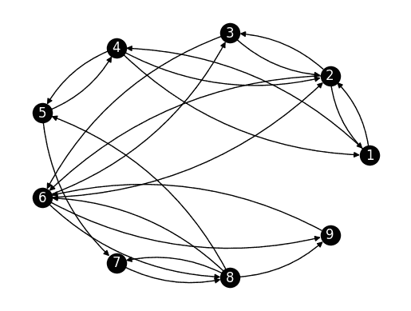

# 7.2\. 背景知识：有限马尔可夫链的元素#

> 原文：[`mmids-textbook.github.io/chap07_rwmc/02_mcdefs/roch-mmids-rwmc-mcdefs.html`](https://mmids-textbook.github.io/chap07_rwmc/02_mcdefs/roch-mmids-rwmc-mcdefs.html)

正如我们提到的，我们感兴趣的是分析一个随机游走“扩散”在图上的行为。在我们开发这些技术之前，将它们纳入有限状态空间上的离散时间马尔可夫链的更一般框架中将是值得的。实际上，马尔可夫链在数据科学中有许多更多的应用。

## 7.2.1\. 基本定义#

离散时间马尔可夫链\(\idx{马尔可夫链}\xdi\)是一个随机过程\(\idx{随机过程}\xdi\)，即在这种情况下由时间索引的一组随机变量。我们假设随机变量在公共有限状态空间 \(\S\) 中取值。使其成为“马尔可夫的”是因为“它忘记了过去”，在“它的未来只依赖于它的当前状态”的意义上。更正式地说：

**定义:** **(离散时间马尔可夫链)** 随机变量序列 \((X_t)_{t \geq 0} = (X_0, X_1, X_2, \ldots)\) 在有限状态空间 \(\S\) 中取值，如果对于所有 \(t \geq 1\) 和所有 \(x_0,x_1,\ldots,x_t \in \S\)

\[ (*)\qquad\P[X_t = x_t\,|\,X_{t-1} = x_{t-1}, X_{t-2} = x_{t-2},\ldots,X_0 = x_0] = \P[X_t = x_t\,|\,X_{t-1} = x_{t-1}] \]

假设条件概率是良好定义的。 \(\natural\)

为了清楚起见，条件中的事件是

\[ \{X_{t-1} = x_{t-1}, X_{t-2} = x_{t-2},\ldots,X_0 = x_0\} = \{X_{t-1} = x_{t-1}\} \cap \{X_{t-2} = x_{t-2}\} \cap \cdots \cap \{X_0 = x_0\}. \]

有时假设公共状态空间 \(\S\) 的形式为 \([m] = \{1,\ldots,m\}\) 会很方便。

**示例:** **(天气模型)** 这是一个简单的天气模型。每一天要么是 \(\mathrm{Dry}\) 要么是 \(\mathrm{Wet}\)。我们将转换建模为马尔可夫链；直观上，我们假设明天的天气只依赖于今天的天气——以一种随机的方式，与过去独立。假设天气变化的概率是 \(25\%\)。更正式地说，让 \(X_t \in \mathcal{S}\) 表示第 \(t\) 天的天气，其中 \(\mathcal{S} = \{\mathrm{Dry}, \mathrm{Wet}\}\)。假设 \(X_0 = \mathrm{Dry}\)，并且让 \((Z_t)_{t \geq 0}\) 是一个独立同分布的（即独立、同分布）随机变量序列，其值在 \(\{\mathrm{Same}, \mathrm{Change}\}\) 中，满足

\[ \mathbb{P}[Z_t = \mathrm{Same}] = 1 - \mathbb{P}[Z_t = \mathrm{Change}] = 3/4. \]

然后定义对于所有 \(t \geq 0\)

\[\begin{split} X_{t+1} = f(X_t, Z_t) = \begin{cases} X_t & \text{if } Z_t = \mathrm{Same},\\ \mathrm{Wet} & \text{if } X_t = \mathrm{Dry} \text{ and } Z_t = \mathrm{Change},\\ \mathrm{Dry} & \text{if } X_t = \mathrm{Wet} \text{ and } Z_t = \mathrm{Change}. \end{cases} \end{split}\]

我们声称 \((X_t)_{t \geq 0}\) 是一个马尔可夫链。我们使用两个观察结果：

1- 通过组合，

\[ X_1 = f(X_0, Z_0), \]\[ X_2 = f(X_1,Z_1) = f(f(X_0,Z_0),Z_1), \]\[ X_3 = f(X_2,Z_2) = f(f(X_1,Z_1),Z_2) = f(f(f(X_0,Z_0),Z_1),Z_2), \]

并且，更一般地，

\[ X_t = f(X_{t-1},Z_{t-1}) = f(f(X_{t-2},Z_{t-2}),Z_{t-1}) = f(f(\cdots f(f(X_0,Z_0),Z_1),\cdots),Z_{t-1}) \]

是 \(X_0 = \mathrm{Dry}\) 和 \(Z_0,\ldots,Z_{t-1}\) 的确定性函数。

2- 对于任何 \(x_1,\ldots,x_t \in \S\)，存在一个唯一的 \(z \in \{\mathrm{Same}, \mathrm{Change}\}\) 值，使得 \(x_t = f(x_{t-1}, z)\)，即如果 \(x_t = x_{t-1}\)，则必须有 \(z = \mathrm{Same}\)，如果 \(x_t \neq x_{t-1}\)，则必须有 \(z = \mathrm{Change}\)。

固定 \(x_0 = \mathrm{Dry}\)。对于任何 \(x_1,\ldots,x_t \in \S\)，令 \(z\) 如观察 2 所述，

\[\begin{align*} &\P[X_t = x_t\,|\,X_{t-1} = x_{t-1}, X_{t-2} = x_{t-2},\ldots,X_0 = x_0]\\ &= \P[f(X_{t-1}, Z_{t-1}) = x_t \,|\, X_{t-1} = x_{t-1}, X_{t-2} = x_{t-2},\ldots,X_0 = x_0]\\ &= \P[f(x_{t-1}, Z_{t-1}) = x_t \,|\, X_{t-1} = x_{t-1}, X_{t-2} = x_{t-2},\ldots,X_0 = x_0]\\ &= \P[Z_{t-1} = z \,|\, X_{t-1} = x_{t-1}, X_{t-2} = x_{t-2},\ldots,X_0 = x_0]\\ &= \P[Z_{t-1} = z], \end{align*}\]

其中我们使用了 \(Z_{t-1}\) 与 \(Z_{t-2},\ldots,Z_0\) 和 \(X_0\)（它是确定的）独立，因此根据观察 1，\(Z_{t-1}\) 与 \(X_{t-1},\ldots,X_0\) 独立。同样的论证表明

\[ \P[X_t = x_t\,|\,X_{t-1} = x_{t-1}] = \P[Z_{t-1} = z], \]

这证明了该主张。

更一般地，可以选择 \(X_0\) 根据初始分布，独立于序列 \((Z_t)_{t \geq 0}\)。上述论证可以适应这种情况。\(\lhd\)

**示例：** **(彼得森图上的随机游走)** 设 \(G = (V,E)\) 为彼得森图。每个顶点 \(i\) 的度数为 \(3\)，即它有三个邻居，我们用 \(v_{i,1}, v_{i,2}, v_{i,3}\) 表示，顺序任意。例如，用 \(1,\ldots, 10\) 表示顶点，顶点 \(9\) 的邻居为 \(v_{9,1} = 4, v_{9,2} = 6, v_{9,3} = 7\)。

我们考虑在 \(G\) 上的以下随机游走。我们从 \(X_0 = 1\) 开始。然后，对于每个 \(t\geq 0\)，我们让 \(X_{t+1}\) 成为 \(X_t\) 的一个均匀选择的邻居，与之前的历史无关。也就是说，我们从邻居随机跳到邻居。形式上，固定 \(X_0 = 1\) 并让 \((Z_t)_{t \geq 0}\) 是一个在 \(\{1,2,3\}\) 中取值的独立同分布随机变量序列，满足

\[ \mathbb{P}[Z_t = 1] = \mathbb{P}[Z_t = 2] = \mathbb{P}[Z_t = 3] = 1/3. \]

然后定义，对于所有 \(t \geq 0\)，\(X_{t+1} = f(X_t, Z_t) = v_{i,Z_t}\) 如果 \(X_t = v_i\)。

通过与上一个例子类似的论证，\((X_t)_{t \geq 0}\) 是一个马尔可夫链。同样，在上一个例子中，可以选择 \(X_0\) 根据初始分布，独立于序列 \((Z_t)_{t \geq 0}\)。\(\lhd\)

在马尔可夫链定义中的条件 \((*)\) 有各种有用的推广。这些都是所谓的 *马尔可夫性质*\(\idx{马尔可夫性质}\xdi\) 的特殊情况，可以概括为：给定当前状态，过去和未来是独立的。我们在这里记录一个足够通用的版本。设 \((X_t)_{t \geq 0}\) 是定义在状态空间 \(\mathcal{S}\) 上的马尔可夫链。对于任意整数 \(h \geq 0\)，\(x_{t-1}\in \mathcal{S}\) 和长度为 \(t-1\) 和 \(h+1\) 的状态序列的子集 \(\mathcal{P} \subseteq \mathcal{S}^{t-1}\)，\(\mathcal{F} \subseteq \mathcal{S}^{h+1}\)，都有

\[\begin{align*} \P[(X_t,\ldots,X_{t+h}) \in \mathcal{F}\,|\,X_{t-1} = x_{t-1}, (X_0,\ldots,X_{t-2}) \in \mathcal{P}] &= \P[(X_t,\ldots,X_{t+h}) \in \mathcal{F}\,|\,X_{t-1} = x_{t-1}]. \end{align*}\]

马尔可夫性质的一个重要含义是样本路径的分布，即形式为 \(\{X_0 = x_0, X_1 = x_1, \ldots, X_T = x_T\}\) 的事件，大大简化了。

**定理** **(样本路径的分布)** \(\idx{样本路径的分布}\xdi\) 对于任意 \(x_0, x_1, \ldots, x_T \in \mathcal{S}\)，

\[ \P[X_0 = x_0, X_1 = x_1, \ldots, X_T = x_T] = \P[X_0 = x_0] \,\prod_{t=1}^T \,\P[X_t = x_t\,|\,X_{t-1} = x_{t-1}]. \]

\(\sharp\)

*证明思路:* 我们使用 *乘法规则* 和 *马尔可夫性质*。

*证明:* 我们首先应用 *乘法规则*

\[ \P\left[\cap_{i=1}^r A_i\right] = \prod_{i=1}^r \P\left[A_i \,\middle|\, \cap_{j=1}^{i-1} A_j \right]. \]

其中 \(A_i = \{X_{i-1} = x_{i-1}\}\) 和 \(r = T+1\)。这给出

\[\begin{align*} &\P[X_0 = x_0, X_1 = x_1, \ldots, X_T = x_T]\\ &= \P[X_0 = x_0] \,\prod_{t=1}^T \P[X_t = x_t\,|\,X_{t-1} = x_{t-1}, \ldots, X_0 = x_0]. \end{align*}\]

然后我们使用 *马尔可夫性质* 来简化乘积中的每一项。 \(\square\)

**示例:** **(天气模型，继续)** 回到之前示例中的天气模型，固定 \(x_0 = \mathrm{Dry}\) 和 \(x_1,\ldots,x_t \in \S\)。然后，根据 *样本路径的分布*，

\[ \P[X_0 = x_0, X_1 = x_1, \ldots, X_T = x_T] = \P[X_0 = x_0] \,\prod_{t=1}^T \,\P[X_t = x_t\,|\,X_{t-1} = x_{t-1}]. \]

根据假设 \(\P[X_0 = x_0] = 1\)。此外，我们之前已经证明

\[ \P[X_t = x_t\,|\,X_{t-1} = x_{t-1}] = \P[Z_{t-1} = z_{t-1}], \]

其中 \(z_{t-1} = \mathrm{Same}\) 如果 \(x_t = x_{t-1}\)，而 \(z_{t-1} = \mathrm{Change}\) 如果 \(x_t \neq x_{t-1}\)。

因此，使用 \(Z_t\) 的分布，

\[\begin{split} \P[X_t = x_t\,|\,X_{t-1} = x_{t-1}] = \begin{cases} 3/4 & \text{if $x_t = x_{t-1}$},\\ 1/4 & \text{if $x_t \neq x_{t-1}$}. \end{cases} \end{split}\]

设 \(n_T = |\{0 < t \leq T : x_t = x_{t-1}\}|\) 为没有变化的转换次数。那么，

\[\begin{align*} \P[X_0 = x_0, X_1 = x_1, \ldots, X_T = x_T] &= \P[X_0 = x_0] \,\prod_{t=1}^T \,\P[X_t = x_t\,|\,X_{t-1} = x_{t-1}]\\ &= \prod_{t=1}^T\P[Z_{t-1} = z_{t-1}]\\ &= (3/4)^{n_T} (1/4)^{T - n_T}. \end{align*}\]

\(\lhd\)

在以后，观察样本路径的 *分布* 的一般化将是有用的。

\[ \P[X_{s+1} = x_{s+1}, X_{s+2} = x_{s+2}, \ldots, X_T = x_T\,|\,X_s = x_s] = \prod_{t=s+1}^T \,\P[X_t = x_t\,|\,X_{t-1} = x_{t-1}]. \]

根据 *样本路径的分布*，为了指定过程的分布，只需指定

1.  *初始分布*\(\idx{initial distribution}\xdi\) \(\mu_x := \P[X_0 = x]\) 对于所有 \(x\)；并且

1.  对于所有 \(t\), \(x\), \(x'\)，的 *转移概率*\(\idx{transition probability}\xdi\) \(\P[X_{t+1} = x\,|\,X_{t} = x']\)。

## 7.2.2\. 时间齐次情况：转移矩阵#

通常进一步假设过程是 *时间齐次的*\(\idx{time-homogeneous process}\xdi\)，这意味着转移概率不依赖于 \(t\)：

\[ \P[X_{t+1} =x\,|\,X_{t} = x'] = \P[X_1 =x\,|\,X_{0} = x'] =: p_{x',x}, \quad \forall t=1,\ldots \]

其中最后一个等式是一个定义。然后我们可以将转移概率收集到一个矩阵中。

**定义：** **(转移矩阵)** \(\idx{transition matrix}\xdi\) 矩阵

\[ P = (p_{x',x})_{x,x' \in \S} \]

被称为链的转移矩阵。 \(\natural\)

我们还让 \(\mu_{x} = \P[X_0 = x]\)，并将 \(\bmu = (\mu_{x})_{x \in \S}\) 视为一个向量。在马尔可夫链理论中，将概率分布如 \(\bmu\) 视为 *行向量* 是一种惯例。我们将在后面看到为什么这会稍微简化一些符号。

**示例：** **(天气模型，继续)** 回到天气模型，让我们按以下方式编号状态：\(1 = \mathrm{Dry}\) 和 \(2 = \mathrm{Wet}\)。然后转移矩阵是

\[\begin{split} P = \begin{pmatrix} 3/4 & 1/4\\ 1/4 & 3/4 \end{pmatrix}. \end{split}\]

\(\lhd\)

**示例：** **(彼得森图的随机游走，继续)** 再次考虑彼得森图 \(G = (V,E)\) 上的随机游走。我们给顶点编号 \(1, 2,\ldots, 10\)。为了计算转移矩阵，我们列出每个顶点的邻居，并在相应的列中放入值 \(1/3\)。例如，顶点 \(1\) 的邻居有 \(2\), \(5\) 和 \(6\)，因此第 \(1\) 行在第 \(2\), \(5\) 和 \(6\) 列中都有 \(1/3\)。依此类推。

我们得到：

\[\begin{split} P = \begin{pmatrix} 0 & 1/3 & 0 & 0 & 1/3 & 1/3 & 0 & 0 & 0 & 0\\ 1/3 & 0 & 1/3 & 0 & 0 & 0 & 1/3 & 0 & 0 & 0\\ 0 & 1/3 & 0 & 1/3 & 0 & 0 & 0 & 1/3 & 0 & 0\\ 0 & 0 & 1/3 & 0 & 1/3 & 0 & 0 & 0 & 1/3 & 0\\ 1/3 & 0 & 0 & 1/3 & 0 & 0 & 0 & 0 & 0 & 1/3\\ 1/3 & 0 & 0 & 0 & 0 & 0 & 0 & 1/3 & 1/3 & 0\\ 0 & 1/3 & 0 & 0 & 0 & 0 & 0 & 0 & 1/3 & 1/3\\ 0 & 0 & 1/3 & 0 & 0 & 1/3 & 0 & 0 & 0 & 1/3\\ 0 & 0 & 0 & 1/3 & 0 & 1/3 & 1/3 & 0 & 0 & 0\\ 0 & 0 & 0 & 0 & 1/3 & 0 & 1/3 & 1/3 & 0 & 0 \end{pmatrix} \end{split}\]

我们已经遇到了一个编码每个顶点邻居的矩阵，即邻接矩阵。在这里，我们可以通过将邻接矩阵乘以 \(1/3\) 来恢复转移矩阵。 \(\lhd\)

转移矩阵具有非常特殊的结构。

**定理：** **（转移矩阵是随机的）** \(\idx{transition matrix is stochastic theorem}\xdi\) 转移矩阵 \(P\) 是一个随机矩阵\(\idx{stochastic matrix}\xdi\)，即所有项都是非负的，且所有行和为 \(1\)。 \(\sharp\)

*证明：* 确实，

\[ \sum_{x \in \S} p_{x',x} = \sum_{x \in \S} \P[X_1 = x\,|\,X_{0} = x'] = \P[X_1 \in \S \,|\,X_{0} = x'] = 1 \]

通过条件概率的性质。 \(\square\)

以矩阵形式，条件可以表述为 \(P \mathbf{1} = \mathbf{1}\)，其中 \(\mathbf{1}\) 是适当大小的全一向量。

我们已经看到任何转移矩阵都是随机的。反过来，任何随机矩阵都是马尔可夫链的转移矩阵。也就是说，我们可以通过选择状态数 \(n\)、\(\mathcal{S} = [n]\) 上的初始分布以及随机矩阵 \(P \in \mathbb{R}^{n\times n}\) 来指定一个马尔可夫链。\(P\) 的第 \(i\) 行规定了在当前处于状态 \(i\) 的情况下下一个状态的概率分布。

**示例：** **（机器人吸尘器）** 假设一个机器人吸尘器在一个大宅邸中四处游荡，以下房间：\(1=\mathrm{Study}\)，\(2=\mathrm{Hall}\)，\(3=\mathrm{Lounge}\)，\(4=\mathrm{Library}\)，\(5=\mathrm{Billiard\ Room}\)，\(6=\mathrm{Dining\ Room}\)，\(7=\mathrm{Conservatory}\)，\(8=\mathrm{Ball\ Room}\)，\(9=\mathrm{Kitchen}\)。

**图：** 一个扳手（*来源：[Midjourney](https://www.midjourney.com/)*）


\(\bowtie\)

一旦它清理完一个房间，它就会根据以下随机矩阵（检查它是否是随机的！）移动到附近的另一个房间：

\[\begin{split} P = \begin{pmatrix} 0 & 0.8 & 0 & 0.2 & 0 & 0 & 0 & 0 & 0\\ 0.3 & 0 & 0.2 & 0 & 0 & 0.5 & 0 & 0 & 0\\ 0 & 0.6 & 0 & 0 & 0 & 0.4 & 0 & 0 & 0\\ 0.1 & 0.1 & 0 & 0 & 0.8 & 0 & 0 & 0 & 0\\ 0 & 0 & 0 & 0.25 & 0 & 0 & 0.75 & 0 & 0\\ 0 & 0.15 & 0.15 & 0 & 0 & 0 & 0 & 0.35 & 0.35\\ 0 & 0 & 0 & 0 & 0 & 0 & 0 & 1 & 0\\ 0 & 0 & 0 & 0 & 0.3 & 0.4 & 0.2 & 0 & 0.1\\ 0 & 0 & 0 & 0 & 0 & 1 & 0 & 0 & 0 \end{pmatrix} \end{split}\]

假设初始分布 \(\bmu\) 在状态空间上均匀分布，并令 \(X_t\) 为迭代 \(t\) 时真空所在的房间。那么 \((X_t)_{t\geq 0}\) 是一个马尔可夫链。与之前的例子不同，\(P\) 不是对称的。特别是，它的行和为 \(1\) 但列和不等于 \(1\)。（检查一下！）\(\lhd\)

当行和列的和都等于 \(1\) 时，我们说 \(P\) 是双随机。

使用刚刚引入的符号，样本路径的分布进一步简化为

\[ \P[X_0 = x_0, X_1 = x_1, \ldots, X_T = x_T] = \mu_{x_0} \prod_{t=1}^T p_{x_{t-1},x_t}. \]

这个公式有一个显著的结果。\(X_s\) 的边缘分布是 \(P\) 的矩阵幂。通常，我们用 \(P^s\) 表示 \(P\) 的 \(s\) 次矩阵幂。回忆一下，\(\bmu\) 是一个行向量。

**THEOREM** **(Time Marginals)** \(\idx{time marginals theorem}\xdi\) 对于任何 \(s \geq 1\) 和 \(x_s \in \S\)

\[ \P[X_s = x_s] = \left(\bmu P^s\right)_{x_s}. \]

\(\sharp\)

*Proof idea:* 策略是考虑 \(\P[X_s = x_s]\) 作为时间 \(s\) 对所有轨迹到时间 \(s\) 的边缘——这些量我们知道如何计算其概率。然后我们使用*样本路径的分布*和“推进和”。这在简单情况下更容易理解。我们首先处理 \(s=2\) 的情况。

对所有轨迹到时间 \(2\) 的和，

\[\begin{align*} &\P[X_2 = x_2]\\ &= \sum_{x_0 \in \S} \sum_{x_{1} \in \S} \P[X_0 = x_0, X_1 = x_1, X_2 = x_2]\\ &= \sum_{x_0 \in \S} \sum_{x_{1} \in \S} \mu_{x_0} p_{x_{0},x_1} p_{x_{1},x_2}, \end{align*}\]

其中我们使用了*样本路径的分布*。

将 \(x_1\) 的和推进进去，这变成

\[\begin{align*} &= \sum_{x_0 \in \S} \mu_{x_0} \sum_{x_{1} \in \S} p_{x_{0},x_1} p_{x_{1},x_2}\\ &= \sum_{x_0 \in \S} \mu_{x_0} (P²)_{x_{0},x_2}, \end{align*}\]

其中我们识别了矩阵乘积的定义——这里 \(P²\)。结果随之而来。

*Proof:* 对于任何 \(s\)，根据边缘的定义，

\[ \P[X_s = x_s] = \sum_{x_0, \ldots, x_{s-1} \in \S} \P[X_0 = x_0, X_1 = x_1,\ldots,X_{s-1} = x_{s-1}, X_s = x_s]. \]

使用时间齐次情况下的*样本路径的分布*，这可以评估为

\[\begin{align*} \P[X_s = x_s] &= \sum_{x_0, \ldots, x_{s-1} \in \S} \mu_{x_0} \prod_{t=1}^s p_{x_{t-1},x_t}. \end{align*}\]

该和可以通过尽可能将单个和推进到和式中来简化

\[\begin{align*} &\sum_{x_0, \ldots, x_{s-1} \in \S} \mu_{x_0} \prod_{t=1}^{s} p_{x_{t-1},x_t}\\ & \quad = \sum_{x_0 \in \S} \mu_{x_0} \sum_{x_{1} \in \S} p_{x_{0},x_{1}} \cdots \sum_{x_{s-2} \in \S} p_{x_{s-3},x_{s-2}} \sum_{x_{s-1} \in \S} p_{x_{s-2},x_{s-1}} \,p_{x_{s-1},x_s}\\ & \quad = \sum_{x_0 \in \S} \mu_{x_0} \sum_{x_{1} \in \S} p_{x_{0},x_{1}} \cdots \sum_{x_{s-2} \in \S} p_{x_{s-3},x_{s-2}} \, \left(P²\right)_{x_{s-2}, x_s} \\ & \quad = \sum_{x_0 \in \S} \mu_{x_0} \sum_{x_{1} \in \S} p_{x_{0},x_{1}} \cdots \sum_{x_{s-3} \in \S} p_{x_{s-4},x_{s-3}} \, \left(P³\right)_{x_{s-3}, x_s} \\ & \quad = \cdots \\ & \quad = \left(\bmu P^s\right)_{x_s}, \end{align*}\]

在第二行中，我们将最内层的和识别为矩阵乘积，然后继续类似地进行。\(\square\)

特殊情况 \(\bmu = \mathbf{e}_x^T\) 给出对于任何 \(x, y \in [n]\)

\[ \P[X_s = y\,|\,X_0 = x] = (\boldsymbol{\mu} P^s)_y = (\mathbf{e}_x^T P^s)_y = (P^s)_{x,y}. \]

**EXAMPLE:** **(Weather Model, continued)** 假设第 \(0\) 天是 \(\mathrm{Dry}\)，即初始分布是 \(\bmu = (1,0)^T\)。第 \(2\) 天是 \(\mathrm{Wet}\) 的概率是多少？我们应用上述公式得到 \(\P[X_2 = 2] = \left(\bmu P²\right)_{2}\)。注意，

\[\begin{align*} \bmu P² &= (1,0)^T \begin{pmatrix} 3/4 & 1/4\\ 1/4 & 3/4 \end{pmatrix} \begin{pmatrix} 3/4 & 1/4\\ 1/4 & 3/4 \end{pmatrix}\\ &= (3/4,1/4)^T \begin{pmatrix} 3/4 & 1/4\\ 1/4 & 3/4 \end{pmatrix}\\ &= (10/16,6/16)^T\\ &= (5/8,3/8)^T. \end{align*}\]

所以答案是 \(3/8\). \(\lhd\)

以后将很有用，观察到 *时间边缘定理* 可以推广到

\[ \P[X_t = x_t\,|\,X_s = x_s] = (P^{t-s})_{x_s,x_t}, \]

对于 \(s \leq t\)。

在时间齐次的情况下，表示转移矩阵的另一种方法是使用显示所有可能转移的有向图。

**定义** **（转移图）** \(\idx{transition graph}\xdi\) 设 \((X_t)_{t \geq 0}\) 是状态空间 \(\mathcal{S} = [n]\) 上的马尔可夫链，其转移矩阵为 \(P = (p_{i,j})_{i,j=1}^{n}\)。\((X_t)_{t \geq 0}\) 的转移图（或状态转移图）是一个有向图，其顶点为 \([n]\)，如果且仅当 \(p_{i,j} > 0\) 时，从 \(i\) 到 \(j\) 有一个有向边。我们通常将权重 \(p_{i,j}\) 联系到那条边。\(\natural\)

**数值角**: 回到我们的 *机器人吸尘器示例*，可以通过将 \(P\) 视为转移图的有向权重邻接矩阵来获得链的转移图。

```py
P_robot = np.array([[0, 0.8, 0, 0.2, 0, 0, 0, 0, 0],
                    [0.3, 0, 0.2, 0, 0, 0.5, 0, 0, 0],
                    [0, 0.6, 0, 0, 0, 0.4, 0, 0, 0],
                    [0.1, 0.1, 0, 0, 0.8, 0, 0, 0, 0],
                    [0, 0, 0, 0.25, 0, 0, 0.75, 0, 0],
                    [0, 0.15, 0.15, 0, 0, 0, 0, 0.35, 0.35],
                    [0, 0, 0, 0, 0, 0, 0, 1, 0],
                    [0, 0, 0, 0, 0.3, 0.4, 0.2, 0, 0.1],
                    [0, 0, 0, 0, 0, 1, 0, 0, 0]]) 
```

我们从一个邻接矩阵定义一个图。参见 `networkx.from_numpy_array()`（https://networkx.org/documentation/stable/reference/generated/networkx.convert_matrix.from_numpy_array.html）。

```py
G_robot = nx.from_numpy_array(P_robot, create_using=nx.DiGraph) 
```

在有向图上以可读的方式绘制边权重并不简单。我们在这里不会这样做。

<details class="hide above-input"><summary aria-label="切换隐藏内容">显示代码单元格源代码 隐藏代码单元格源代码</summary>

```py
n_robot = P_robot.shape[0]
nx.draw_networkx(G_robot, pos=nx.circular_layout(G_robot), 
                 labels={i: i+1 for i in range(n_robot)}, 
                 node_color='black', font_color='white', 
                 connectionstyle='arc3, rad = 0.2')
plt.axis('off')
plt.show() 
```</details> 

\(\unlhd\)

一旦我们指定了转移矩阵（以及初始分布），我们就可以模拟相应的马尔可夫链。这有助于通过大数定律（approximately）计算复杂事件的概率。以下是一些生成给定时间 \(T\) 的样本路径的代码。我们假设状态空间是 \([n]\)。我们使用 `rng.choice`（https://numpy.org/doc/stable/reference/random/generated/numpy.random.Generator.choice.html）来生成每个转移。

```py
def SamplePath(rng, mu, P, T):

    n = mu.shape[0]
    X = np.zeros(T+1)
    for i in range(T+1):
        if i == 0:
            X[i] = rng.choice(a=np.arange(start=1,stop=n+1),p=mu)
        else:
            X[i] = rng.choice(a=np.arange(start=1,stop=n+1),p=P[int(X[i-1]-1),:])

    return X 
```

**数值角**: 让我们用我们的 *机器人吸尘器* 来试一试。我们将初始分布设为均匀分布。

```py
seed = 535
rng = np.random.default_rng(seed)
mu = np.ones(n_robot) / n_robot
print(SamplePath(rng, mu, P_robot, 10)) 
```

```py
[9\. 6\. 3\. 6\. 8\. 6\. 2\. 1\. 2\. 6\. 8.] 
```

例如，我们可以使用模拟来近似房间 \(9\) 在时间 \(10\) 之前被访问的期望次数。为此，我们运行模拟多次（例如 \(1000\) 次）并计算访问 \(9\) 的平均次数。

```py
z = 9
N_samples = 1000
visits_to_z = np.zeros(N_samples)

for i in range(N_samples):
    visits_to_z[i] = np.count_nonzero(SamplePath(rng, mu, P_robot, 10) == z)

print(np.mean(visits_to_z)) 
```

```py
1.193 
```

\(\unlhd\)

**CHAT & LEARN** 马尔可夫决策过程（MDPs）是用于模拟在结果部分随机且部分受决策者控制的决策情境的框架。请你的首选 AI 聊天机器人解释 MDP 的基本组成部分以及它们如何与马尔可夫链相关联。讨论 MDP 的应用，例如在机器人学或博弈论中。 \(\ddagger\)

***自我评估测验*** *(由 Claude、Gemini 和 ChatGPT 协助)*

**1** 关于马尔可夫链的转移矩阵 \(P\) 的以下哪个说法是正确的？

a) \(P\) 的所有条目都是非负的，并且所有列之和为 1。

b) \(P\) 的所有条目都是非负的，并且所有行之和为 1。

c) \(P\) 的所有条目都是非负的，并且行和列之和都为 1。

d) \(P\) 的所有条目都是非负的，并且行或列之和为 1，但不能同时为两者。

**2** 马尔可夫性质是什么？

a) 过去和未来是独立的。

b) 在给定当前的情况下，过去和未来是独立的。

c) 在给定过去的情况下，现在和未来是独立的。

d) 过去、现在和未来都是独立的。

**3** 考虑在状态空间 \(S\) 上的马尔可夫链 \((X_t)_{t \ge 0}\)。以下哪个等式是马尔可夫性质的直接结果？

a) \(\mathbb{P}[X_{t+1} = x_{t+1} | X_t = x_t] = \mathbb{P}[X_{t+1} = x_{t+1}]\)

b) \(\mathbb{P}[X_{t+1} = x_{t+1} | X_t = x_t, X_{t-1} = x_{t-1}] = \mathbb{P}[X_{t+1} = x_{t+1} | X_t = x_t]\)

c) \(\mathbb{P}[X_{t+1} = x_{t+1} | X_t = x_t] = \mathbb{P}[X_{t+1} = x_{t+1} | X_0 = x_0]\)

d) \(\mathbb{P}[X_{t+1} = x_{t+1} | X_t = x_t, X_{t-1} = x_{t-1}] = \mathbb{P}[X_{t+1} = x_{t+1}]\)

**4** 考虑一个具有转移矩阵 \(P = (p_{i,j})_{i,j}\) 和初始分布 \(\mu\) 的马尔可夫链 \((X_t)_{t\geq0}\)。以下关于样本路径 \((X_0, X_1, \ldots, X_T)\) 的分布的哪个说法是正确的？

a) \(\mathbb{P}[X_0 = x_0, X_1 = x_1, \ldots, X_T = x_T] = \mu_{x_0} \prod_{t=1}^T p_{x_{t-1},x_t}\)

b) \(\mathbb{P}[X_0 = x_0, X_1 = x_1, \ldots, X_T = x_T] = \mu_{x_0} \sum_{t=1}^T p_{x_{t-1},x_t}\)

c) \(\mathbb{P}[X_0 = x_0, X_1 = x_1, \ldots, X_T = x_T] = \prod_{t=0}^T \mu_{x_t}\)

d) \(\mathbb{P}[X_0 = x_0, X_1 = x_1, \ldots, X_T = x_T] = \sum_{t=0}^T \mu_{x_t}\)

**5** 在 Petersen 图上的随机游走示例中，如果当前状态是顶点 9，那么在下一步转移到顶点 4 的概率是多少？

a) 0

b) 1/10

c) 1/3

d) 1

答案 1：b. 理由：文本中提到“转移矩阵 \(P\) 是一个随机矩阵，即所有条目都是非负的，并且所有行之和为 1。”

答案 2：b. 理由：文本将马尔可夫性质总结为“在给定当前的情况下，过去和未来是独立的。”

答案 3：b. 理由：这是对马尔可夫性质的直接陈述，其中未来状态 \(X_{t+1}\) 只依赖于当前状态 \(X_t\)，而不依赖于过去状态 \(X_{t-1}\)。

答案 4：a. 证明：文本说明了*样本路径的分布*：

\[ \mathbb{P}[X_0 = x_0, X_1 = x_1, \ldots, X_T = x_T] = \mu_{x_0} \prod_{t=1}^T p_{x_{t-1},x_t}. \]

答案 5：c. 证明：在 Petersen 图中，每个顶点有 3 个邻居，随机游走随机选择一个。

## 7.2.1\. 基本定义#

一个离散时间马尔可夫链\(\idx{Markov chain}\xdi\)是一个随机过程\(\idx{stochastic process}\xdi\)，即在这种情况下，由时间索引的一组随机变量。我们假设随机变量在共同的有限状态空间 \(\S\) 中取值。使其成为“马尔可夫的”是因为它在某种意义上“忘记了过去”，即“它的未来只取决于它的当前状态。”更正式地说：

**定义** **(离散时间马尔可夫链)** 随机变量序列 \((X_t)_{t \geq 0} = (X_0, X_1, X_2, \ldots)\) 在有限状态空间 \(\S\) 中取值，如果对于所有 \(t \geq 1\) 和所有 \(x_0,x_1,\ldots,x_t \in \S\)，

\[ (*)\qquad\P[X_t = x_t\,|\,X_{t-1} = x_{t-1}, X_{t-2} = x_{t-2},\ldots,X_0 = x_0] = \P[X_t = x_t\,|\,X_{t-1} = x_{t-1}] \]

条件概率定义良好。 \(\natural\)

为了清晰起见，条件中的事件是

\[ \{X_{t-1} = x_{t-1}, X_{t-2} = x_{t-2},\ldots,X_0 = x_0\} = \{X_{t-1} = x_{t-1}\} \cap \{X_{t-2} = x_{t-2}\} \cap \cdots \cap \{X_0 = x_0\}. \]

有时假设共同的态空间 \(\S\) 的形式为 \([m] = \{1,\ldots,m\}\) 会很方便。

**示例** **(天气模型)** 这是一个简单的天气模型。每一天要么是 \(\mathrm{Dry}\) 要么是 \(\mathrm{Wet}\)。我们将转换建模为马尔可夫链；直观上，我们假设明天的天气只依赖于今天的天气——以一种独立于过去的随机方式。假设天气变化的概率是 \(25\%\)。更正式地说，让 \(X_t \in \mathcal{S}\) 表示第 \(t\) 天的天气，其中 \(\mathcal{S} = \{\mathrm{Dry}, \mathrm{Wet}\}\)。假设 \(X_0 = \mathrm{Dry}\)，并让 \((Z_t)_{t \geq 0}\) 是一个独立同分布的（即独立且同分布）随机变量序列，取值在 \(\{\mathrm{Same}, \mathrm{Change}\}\) 中，满足

\[ \mathbb{P}[Z_t = \mathrm{Same}] = 1 - \mathbb{P}[Z_t = \mathrm{Change}] = 3/4. \]

然后定义对于所有 \(t \geq 0\)，

\[\begin{split} X_{t+1} = f(X_t, Z_t) = \begin{cases} X_t & \text{if $Z_t = \mathrm{Same}$},\\ \mathrm{Wet} & \text{if $X_t = \mathrm{Dry}$ and $Z_t = \mathrm{Change}$},\\ \mathrm{Dry} & \text{if $X_t = \mathrm{Wet}$ and $Z_t = \mathrm{Change}$}. \end{cases} \end{split}\]

我们声称 \((X_t)_{t \geq 0}\) 是一个马尔可夫链。我们使用两个观察结果：

1- 通过组合，

\[ X_1 = f(X_0, Z_0), \]\[ X_2 = f(X_1,Z_1) = f(f(X_0,Z_0),Z_1), \]\[ X_3 = f(X_2,Z_2) = f(f(X_1,Z_1),Z_2) = f(f(f(X_0,Z_0),Z_1),Z_2), \]

and, more generally,

\[ X_t = f(X_{t-1},Z_{t-1}) = f(f(X_{t-2},Z_{t-2}),Z_{t-1}) = f(f(\cdots f(f(X_0,Z_0),Z_1),\cdots),Z_{t-1}) \]

是 \(X_0 = \mathrm{Dry}\) 和 \(Z_0,\ldots,Z_{t-1}\) 的确定性函数。

2- 对于任何 \(x_1,\ldots,x_t \in \S\)，存在一个唯一的 \(z \in \{\mathrm{Same}, \mathrm{Change}\}\) 的值，使得 \(x_t = f(x_{t-1}, z)\)，即如果 \(x_t = x_{t-1}\)，则必须有 \(z = \mathrm{Same}\)；如果 \(x_t \neq x_{t-1}\)，则必须有 \(z = \mathrm{Change}\)。

固定 \(x_0 = \mathrm{Dry}\)。对于任何 \(x_1,\ldots,x_t \in \S\)，让 \(z\) 如观察 2 中所述，

\[\begin{align*} &\P[X_t = x_t\,|\,X_{t-1} = x_{t-1}, X_{t-2} = x_{t-2},\ldots,X_0 = x_0]\\ &= \P[f(X_{t-1}, Z_{t-1}) = x_t \,|\, X_{t-1} = x_{t-1}, X_{t-2} = x_{t-2},\ldots,X_0 = x_0]\\ &= \P[f(x_{t-1}, Z_{t-1}) = x_t \,|\, X_{t-1} = x_{t-1}, X_{t-2} = x_{t-2},\ldots,X_0 = x_0]\\ &= \P[Z_{t-1} = z \,|\, X_{t-1} = x_{t-1}, X_{t-2} = x_{t-2},\ldots,X_0 = x_0]\\ &= \P[Z_{t-1} = z], \end{align*}\]

其中我们使用了 \(Z_{t-1}\) 与 \(Z_{t-2},\ldots,Z_0\) 和 \(X_0\)（它是确定的）是独立的，因此根据观察 1，\(Z_{t-1}\) 与 \(X_{t-1},\ldots,X_0\) 也是独立的。同样的论证表明

\[ \P[X_t = x_t\,|\,X_{t-1} = x_{t-1}] = \P[Z_{t-1} = z], \]

这就证明了该命题。

更一般地，可以根据初始分布独立于序列 \((Z_t)_{t \geq 0}\) 来选择 \(X_0\)。上述论证可以适应这种情况。\(\lhd\)

**示例：** **（彼得森图上的随机游走）** 设 \(G = (V,E)\) 为彼得森图。每个顶点 \(i\) 的度数为 \(3\)，即它有三个邻居，我们用 \(v_{i,1}, v_{i,2}, v_{i,3}\) 表示，顺序任意。例如，如上所述，用 \(1,\ldots, 10\) 表示顶点，顶点 \(9\) 的邻居为 \(v_{9,1} = 4, v_{9,2} = 6, v_{9,3} = 7\)。

我们考虑在 \(G\) 上的以下随机游走。我们从 \(X_0 = 1\) 开始。然后，对于每个 \(t \geq 0\)，我们让 \(X_{t+1}\) 成为 \(X_t\) 的一个均匀选择的邻居，独立于之前的历史。也就是说，我们从邻居随机跳到邻居。形式上，固定 \(X_0 = 1\) 并让 \((Z_t)_{t \geq 0}\) 是一个在 \(\{1,2,3\}\) 中取值的独立同分布随机变量序列，满足

\[ \mathbb{P}[Z_t = 1] = \mathbb{P}[Z_t = 2] = \mathbb{P}[Z_t = 3] = 1/3. \]

然后，对于所有 \(t \geq 0\)，定义 \(X_{t+1} = f(X_t, Z_t) = v_{i,Z_t}\)，如果 \(X_t = v_i\)。

通过与上一个例子类似的论证，\((X_t)_{t \geq 0}\) 是一个马尔可夫链。同样地，正如前一个例子中那样，可以选择 \(X_0\) 根据初始分布，独立于序列 \((Z_t)_{t \geq 0}\)。\(\lhd\)

在马尔可夫链定义中的条件 \((*)\) 有各种有用的推广。这些都是所谓的马尔可夫性质\(\idx{Markov property}\xdi\)的特殊情况，可以总结为：给定当前状态，过去和未来是独立的。我们在此记录一个足够通用的版本。设 \((X_t)_{t \geq 0}\) 是定义在状态空间 \(\mathcal{S}\) 上的马尔可夫链。对于任何整数 \(h \geq 0\)，\(x_{t-1}\in \mathcal{S}\) 和长度为 \(t-1\) 和 \(h+1\) 的状态序列的子集 \(\mathcal{P} \subseteq \mathcal{S}^{t-1}\)，\(\mathcal{F} \subseteq \mathcal{S}^{h+1}\)，它成立，

\[\begin{align*} \P[(X_t,\ldots,X_{t+h}) \in \mathcal{F}\,|\,X_{t-1} = x_{t-1}, (X_0,\ldots,X_{t-2}) \in \mathcal{P}] &= \P[(X_t,\ldots,X_{t+h}) \in \mathcal{F}\,|\,X_{t-1} = x_{t-1}]. \end{align*}\]

马尔可夫性质的一个重要含义是样本路径的分布，即形式为 \(\{X_0 = x_0, X_1 = x_1, \ldots, X_T = x_T\}\) 的事件，大大简化了。

**定理** **(样本路径的分布)** \(\idx{distribution of a sample path}\xdi\) 对于任何 \(x_0, x_1, \ldots, x_T \in \mathcal{S}\)，

\[ \P[X_0 = x_0, X_1 = x_1, \ldots, X_T = x_T] = \P[X_0 = x_0] \,\prod_{t=1}^T \,\P[X_t = x_t\,|\,X_{t-1} = x_{t-1}]. \]

\(\sharp\)

*证明思路:* 我们使用乘法规则和马尔可夫性质。

*证明:* 我们首先应用乘法规则

\[ \P\left[\cap_{i=1}^r A_i\right] = \prod_{i=1}^r \P\left[A_i \,\middle|\, \cap_{j=1}^{i-1} A_j \right]. \]

其中 \(A_i = \{X_{i-1} = x_{i-1}\}\) 且 \(r = T+1\)。这给出

\[\begin{align*} &\P[X_0 = x_0, X_1 = x_1, \ldots, X_T = x_T]\\ &= \P[X_0 = x_0] \,\prod_{t=1}^T \P[X_t = x_t\,|\,X_{t-1} = x_{t-1}, \ldots, X_0 = x_0]. \end{align*}\]

然后我们使用马尔可夫性质来简化乘积中的每一项。\(\square\)

**示例:** **(天气模型，继续)** 回到之前示例中的天气模型，固定 \(x_0 = \mathrm{Dry}\) 和 \(x_1,\ldots,x_t \in \S\)。然后，根据样本路径的分布，

\[ \P[X_0 = x_0, X_1 = x_1, \ldots, X_T = x_T] = \P[X_0 = x_0] \,\prod_{t=1}^T \,\P[X_t = x_t\,|\,X_{t-1} = x_{t-1}]. \]

根据假设 \(\P[X_0 = x_0] = 1\). 此外，我们之前已经证明过，

\[ \P[X_t = x_t\,|\,X_{t-1} = x_{t-1}] = \P[Z_{t-1} = z_{t-1}], \]

其中 \(z_{t-1} = \mathrm{Same}\) 如果 \(x_t = x_{t-1}\)，而 \(z_{t-1} = \mathrm{Change}\) 如果 \(x_t \neq x_{t-1}\)。

因此，使用 \(Z_t\) 的分布，

\[\begin{split} \P[X_t = x_t\,|\,X_{t-1} = x_{t-1}] = \begin{cases} 3/4 & \text{如果 $x_t = x_{t-1}$},\\ 1/4 & \text{如果 $x_t \neq x_{t-1}$}. \end{cases} \end{split}\]

设 \(n_T = |\{0 < t \leq T : x_t = x_{t-1}\}|\) 为无变化转换的数量。那么，

\[\begin{align*} \P[X_0 = x_0, X_1 = x_1, \ldots, X_T = x_T] &= \P[X_0 = x_0] \,\prod_{t=1}^T \,\P[X_t = x_t\,|\,X_{t-1} = x_{t-1}]\\ &= \prod_{t=1}^T\P[Z_{t-1} = z_{t-1}]\\ &= (3/4)^{n_T} (1/4)^{T - n_T}. \end{align*}\]

\(\lhd\)

在以后，观察样本路径的**分布**可以推广到

\[ \P[X_{s+1} = x_{s+1}, X_{s+2} = x_{s+2}, \ldots, X_T = x_T\,|\,X_s = x_s] = \prod_{t=s+1}^T \,\P[X_t = x_t\,|\,X_{t-1} = x_{t-1}]. \]

基于样本路径的**分布**，为了指定过程的分布，只需指定

1.  **初始分布**\(\idx{初始分布}\xdi\) \(\mu_x := \P[X_0 = x]\) 对于所有 \(x\)；并且

1.  对于所有 \(t\)，\(x\)，\(x'\) 的**转移概率**\(\idx{转移概率}\xdi\) \(\P[X_{t+1} = x\,|\,X_{t} = x']\)。

## 7.2.2\. 时间齐次情况：转移矩阵#

通常还会进一步假设过程是**时间齐次**的\(\idx{时间齐次过程}\xdi\)，这意味着转移概率不依赖于 \(t\)：

\[ \P[X_{t+1} =x\,|\,X_{t} = x'] = \P[X_1 =x\,|\,X_{0} = x'] =: p_{x',x}, \quad \forall t=1,\ldots \]

其中最后一个等式是一个定义。然后我们可以将转移概率收集到一个矩阵中。

**定义** **(转移矩阵)** \(\idx{转移矩阵}\xdi\) 矩阵

\[ P = (p_{x',x})_{x,x' \in \S} \]

被称为链的转移矩阵。\(\natural\)

我们还让 \(\mu_{x} = \P[X_0 = x]\)，并将 \(\bmu = (\mu_{x})_{x \in \S}\) 视为一个向量。在马尔可夫链理论中，将概率分布如 \(\bmu\) 视为**行向量**是惯例。我们将在以后看到为什么这会稍微简化符号。

**示例：** **(天气模型，继续)** 回到天气模型，让我们按以下方式编号状态：\(1 = \mathrm{Dry}\) 和 \(2 = \mathrm{Wet}\)。然后转移矩阵是

\[\begin{split} P = \begin{pmatrix} 3/4 & 1/4\\ 1/4 & 3/4 \end{pmatrix}. \end{split}\]

\(\lhd\)

**示例：** **(彼得森图上的随机游走，继续)** 再次考虑彼得森图 \(G = (V,E)\) 上的随机游走。我们给顶点编号 \(1, 2,\ldots, 10\)。为了计算转移矩阵，我们列出每个顶点的邻居，并在相应的列中放入值 \(1/3\)。例如，顶点 \(1\) 的邻居是 \(2\), \(5\) 和 \(6\)，所以第 \(1\) 行在第 \(2\), \(5\) 和 \(6\) 列中都有 \(1/3\)。以此类推。

我们得到：

\[\begin{split} P = \begin{pmatrix} 0 & 1/3 & 0 & 0 & 1/3 & 1/3 & 0 & 0 & 0 & 0\\ 1/3 & 0 & 1/3 & 0 & 0 & 0 & 1/3 & 0 & 0 & 0\\ 0 & 1/3 & 0 & 1/3 & 0 & 0 & 0 & 1/3 & 0 & 0\\ 0 & 0 & 1/3 & 0 & 1/3 & 0 & 0 & 0 & 1/3 & 0\\ 1/3 & 0 & 0 & 1/3 & 0 & 0 & 0 & 0 & 0 & 1/3\\ 1/3 & 0 & 0 & 0 & 0 & 0 & 0 & 1/3 & 1/3 & 0\\ 0 & 1/3 & 0 & 0 & 0 & 0 & 0 & 0 & 1/3 & 1/3\\ 0 & 0 & 1/3 & 0 & 0 & 1/3 & 0 & 0 & 0 & 1/3\\ 0 & 0 & 0 & 1/3 & 0 & 1/3 & 1/3 & 0 & 0 & 0\\ 0 & 0 & 0 & 0 & 1/3 & 0 & 1/3 & 1/3 & 0 & 0 \end{pmatrix} \end{split}\]

我们已经遇到了一个编码每个顶点邻居的矩阵，即邻接矩阵。这里我们可以通过将邻接矩阵乘以 \(1/3\) 来恢复转移矩阵。\(\lhd\)

转移矩阵具有非常特殊的结构。

**定理** **(转移矩阵是随机的)** \(\idx{转移矩阵是随机的定理}\xdi\) 转移矩阵 \(P\) 是一个随机矩阵\(\idx{随机矩阵}\xdi\)，即所有元素都是非负的，并且所有行的和都等于 1。 \(\sharp\)

*证明*：确实，

\[ \sum_{x \in \S} p_{x',x} = \sum_{x \in \S} \P[X_1 = x\,|\,X_{0} = x'] = \P[X_1 \in \S \,|\,X_{0} = x'] = 1 \]

根据条件概率的性质。 \(\square\)

以矩阵形式，条件可以表述为 \(P \mathbf{1} = \mathbf{1}\)，其中 \(\mathbf{1}\) 是适当大小的全一向量。

我们已经看到任何转移矩阵都是随机的。反过来，任何随机矩阵都是马尔可夫链的转移矩阵。也就是说，我们可以通过选择状态数 \(n\)、\(\mathcal{S} = [n]\) 上的初始分布以及 \(P \in \mathbb{R}^{n\times n}\) 随机矩阵来指定一个马尔可夫链。\(P\) 的第 \(i\) 行规定了在当前处于状态 \(i\) 的情况下下一个状态的概率分布。

**示例** **(机器人吸尘器)** 假设一个机器人吸尘器在一个大宅邸中四处游荡，以下房间：\(1=\mathrm{书房}\)，\(2=\mathrm{大厅}\)，\(3=\mathrm{客厅}\)，\(4=\mathrm{图书馆}\)，\(5=\mathrm{台球室}\)，\(6=\mathrm{餐厅}\)，\(7=\mathrm{温室}\)，\(8=\mathrm{舞厅}\)，\(9=\mathrm{厨房}\)。

**图示**：一个扳手 (*来源：[Midjourney](https://www.midjourney.com/))


\(\bowtie\)

一旦它清理完一个房间，它会根据以下随机矩阵移动到附近的另一个房间（检查它是否是随机的！）：

\[\begin{split} P = \begin{pmatrix} 0 & 0.8 & 0 & 0.2 & 0 & 0 & 0 & 0 & 0\\ 0.3 & 0 & 0.2 & 0 & 0 & 0.5 & 0 & 0 & 0\\ 0 & 0.6 & 0 & 0 & 0 & 0.4 & 0 & 0 & 0\\ 0.1 & 0.1 & 0 & 0 & 0.8 & 0 & 0 & 0 & 0\\ 0 & 0 & 0 & 0.25 & 0 & 0 & 0.75 & 0 & 0\\ 0 & 0.15 & 0.15 & 0 & 0 & 0 & 0 & 0.35 & 0.35\\ 0 & 0 & 0 & 0 & 0 & 0 & 0 & 1 & 0\\ 0 & 0 & 0 & 0 & 0.3 & 0.4 & 0.2 & 0 & 0.1\\ 0 & 0 & 0 & 0 & 0 & 1 & 0 & 0 & 0 \end{pmatrix} \end{split}\]

假设初始分布 \(\bmu\) 在状态空间上是均匀的，并且让 \(X_t\) 表示在迭代 \(t\) 时吸尘器所在的房间。那么 \((X_t)_{t\geq 0}\) 是一个马尔可夫链。与之前的例子不同，\(P\) 不是对称的。特别是，它的行和为 \(1\)，但列和不为 \(1\)。（检查它！） \(\lhd\)

当行和列的和都等于 \(1\) 时，我们说 \(P\) 是双随机。

使用刚刚引入的符号，样本路径的分布进一步简化为

\[ \P[X_0 = x_0, X_1 = x_1, \ldots, X_T = x_T] = \mu_{x_0} \prod_{t=1}^T p_{x_{t-1},x_t}. \]

这个公式有一个显著的结果。\(X_s\) 的边缘分布是 \(P\) 的矩阵幂。通常，我们用 \(P^s\) 表示 \(P\) 的 \(s\) 次矩阵幂。回忆一下，\(\bmu\) 是一个行向量。

**定理** **(时间边缘)** \(\idx{时间边缘定理}\xdi\) 对于任何 \(s \geq 1\) 和 \(x_s \in \S\)

\[ \P[X_s = x_s] = \left(\bmu P^s\right)_{x_s}. \]

\(\sharp\)

*证明思路:* 思路是将 \(\P[X_s = x_s]\) 视为时间 \(s\) 的所有轨迹的边缘——这些是我们知道如何计算概率的量。然后我们使用 *样本路径分布* 并“推入”这些和。这在一个简单的情况下更容易理解。我们首先处理 \(s=2\) 的情况。

对所有直到时间 \(2\) 的轨迹求和，

\[\begin{align*} &\P[X_2 = x_2]\\ &= \sum_{x_0 \in \S} \sum_{x_{1} \in \S} \P[X_0 = x_0, X_1 = x_1, X_2 = x_2]\\ &= \sum_{x_0 \in \S} \sum_{x_{1} \in \S} \mu_{x_0} p_{x_{0},x_1} p_{x_{1},x_2}, \end{align*}\]

其中我们使用了 *样本路径分布*。

将 \(x_1\) 的和推入，这变为

\[\begin{align*} &= \sum_{x_0 \in \S} \mu_{x_0} \sum_{x_{1} \in \S} p_{x_{0},x_1} p_{x_{1},x_2}\\ &= \sum_{x_0 \in \S} \mu_{x_0} (P²)_{x_{0},x_2}, \end{align*}\]

其中我们识别了矩阵乘法的定义——这里 \(P²\)。然后结果随之而来。

*证明:* 对于任何 \(s\)，根据边缘的定义，

\[ \P[X_s = x_s] = \sum_{x_0, \ldots, x_{s-1} \in \S} \P[X_0 = x_0, X_1 = x_1,\ldots,X_{s-1} = x_{s-1}, X_s = x_s]. \]

在时间齐次情况下，使用 *样本路径分布*，这可以计算为

\[\begin{align*} \P[X_s = x_s] &= \sum_{x_0, \ldots, x_{s-1} \in \S} \mu_{x_0} \prod_{t=1}^s p_{x_{t-1},x_t}. \end{align*}\]

通过尽可能将单个和推入求和项中，可以简化这个和

\[\begin{align*} &\sum_{x_0, \ldots, x_{s-1} \in \S} \mu_{x_0} \prod_{t=1}^{s} p_{x_{t-1},x_t}\\ & \quad = \sum_{x_0 \in \S} \mu_{x_0} \sum_{x_{1} \in \S} p_{x_{0},x_{1}} \cdots \sum_{x_{s-2} \in \S} p_{x_{s-3},x_{s-2}} \sum_{x_{s-1} \in \S} p_{x_{s-2},x_{s-1}} \,p_{x_{s-1},x_s}\\ & \quad = \sum_{x_0 \in \S} \mu_{x_0} \sum_{x_{1} \in \S} p_{x_{0},x_{1}} \cdots \sum_{x_{s-2} \in \S} p_{x_{s-3},x_{s-2}} \, \left(P²\right)_{x_{s-2}, x_s} \\ & \quad = \sum_{x_0 \in \S} \mu_{x_0} \sum_{x_{1} \in \S} p_{x_{0},x_{1}} \cdots \sum_{x_{s-3} \in \S} p_{x_{s-4},x_{s-3}} \, \left(P³\right)_{x_{s-3}, x_s} \\ & \quad = \cdots \\ & \quad = \left(\bmu P^s\right)_{x_s}, \end{align*}\]

在第二行中，我们识别了最内层的和为矩阵乘法，然后继续类似地进行。 \(\square\)

特殊情况 \(\bmu = \mathbf{e}_x^T\) 给出对于任何 \(x, y \in [n]\)

\[ \P[X_s = y\,|\,X_0 = x] = (\boldsymbol{\mu} P^s)_y = (\mathbf{e}_x^T P^s)_y = (P^s)_{x,y}. \]

**例题** **(天气模型，继续)** 假设第 \(0\) 天是 \(\mathrm{Dry}\)，即初始分布是 \(\bmu = (1,0)^T\)。第 \(2\) 天是 \(\mathrm{Wet}\) 的概率是多少？我们应用上述公式得到 \(\P[X_2 = 2] = \left(\bmu P²\right)_{2}\)。注意，

\[\begin{align*} \bmu P² &= (1,0)^T \begin{pmatrix} 3/4 & 1/4\\ 1/4 & 3/4 \end{pmatrix} \begin{pmatrix} 3/4 & 1/4\\ 1/4 & 3/4 \end{pmatrix}\\ &= (3/4,1/4)^T \begin{pmatrix} 3/4 & 1/4\\ 1/4 & 3/4 \end{pmatrix}\\ &= (10/16,6/16)^T\\ &= (5/8,3/8)^T. \end{align*}\]

因此答案是 \(3/8\)。\(\lhd\)

以后我们会发现，**时间边缘定理**可以推广到

\[ \P[X_t = x_t\,|\,X_s = x_s] = (P^{t-s})_{x_s,x_t}, \]

对于 \(s \leq t\)。

在时间齐次的情况下，用表示转换矩阵的另一种方法是使用显示所有可能转换的有向图。

**定义** **(转换图)** \(\idx{transition graph}\xdi\) 设 \((X_t)_{t \geq 0}\) 是定义在状态空间 \(\mathcal{S} = [n]\) 上的马尔可夫链，其转换矩阵为 \(P = (p_{i,j})_{i,j=1}^{n}\)。\((X_t)_{t \geq 0}\) 的转换图（或状态转换图）是一个有向图，其顶点为 \([n]\)，如果且仅当 \(p_{i,j} > 0\) 时，从 \(i\) 到 \(j\) 有一个有向边。我们通常将权重 \(p_{i,j}\) 赋予该边。\(\natural\)

**数值角**: 回到我们的**机器人吸尘器示例**，通过将 \(P\) 视为转换图的加权邻接矩阵，我们可以获得链的转换图。

```py
P_robot = np.array([[0, 0.8, 0, 0.2, 0, 0, 0, 0, 0],
                    [0.3, 0, 0.2, 0, 0, 0.5, 0, 0, 0],
                    [0, 0.6, 0, 0, 0, 0.4, 0, 0, 0],
                    [0.1, 0.1, 0, 0, 0.8, 0, 0, 0, 0],
                    [0, 0, 0, 0.25, 0, 0, 0.75, 0, 0],
                    [0, 0.15, 0.15, 0, 0, 0, 0, 0.35, 0.35],
                    [0, 0, 0, 0, 0, 0, 0, 1, 0],
                    [0, 0, 0, 0, 0.3, 0.4, 0.2, 0, 0.1],
                    [0, 0, 0, 0, 0, 1, 0, 0, 0]]) 
```

我们从邻接矩阵定义一个图。参见[`networkx.from_numpy_array()`](https://networkx.org/documentation/stable/reference/generated/networkx.convert_matrix.from_numpy_array.html)。

```py
G_robot = nx.from_numpy_array(P_robot, create_using=nx.DiGraph) 
```

在有向图中以可读的方式绘制边权重并不简单。我们这里不会这样做。

<details class="hide above-input"><summary aria-label="Toggle hidden content">显示代码单元格源代码 隐藏代码单元格源代码</summary>

```py
n_robot = P_robot.shape[0]
nx.draw_networkx(G_robot, pos=nx.circular_layout(G_robot), 
                 labels={i: i+1 for i in range(n_robot)}, 
                 node_color='black', font_color='white', 
                 connectionstyle='arc3, rad = 0.2')
plt.axis('off')
plt.show() 
```</details> 

\(\unlhd\)

一旦我们指定了转换矩阵（以及初始分布），我们就可以模拟相应的马尔可夫链。这有助于通过大数定律计算（近似）复杂事件的概率。以下是一些生成从某个给定时间 \(T\) 开始的样本路径的代码。我们假设状态空间是 \([n]\)。我们使用[`rng.choice`](https://numpy.org/doc/stable/reference/random/generated/numpy.random.Generator.choice.html)来生成每个转换。

```py
def SamplePath(rng, mu, P, T):

    n = mu.shape[0]
    X = np.zeros(T+1)
    for i in range(T+1):
        if i == 0:
            X[i] = rng.choice(a=np.arange(start=1,stop=n+1),p=mu)
        else:
            X[i] = rng.choice(a=np.arange(start=1,stop=n+1),p=P[int(X[i-1]-1),:])

    return X 
```

**数值角**: 让我们用我们的**机器人吸尘器**来试一试。我们将初始分布设为均匀分布。

```py
seed = 535
rng = np.random.default_rng(seed)
mu = np.ones(n_robot) / n_robot
print(SamplePath(rng, mu, P_robot, 10)) 
```

```py
[9\. 6\. 3\. 6\. 8\. 6\. 2\. 1\. 2\. 6\. 8.] 
```

例如，我们可以使用模拟来近似房间 \(9\) 在时间 \(10\) 之前被访问的期望次数。为此，我们运行模拟多次（例如 \(1000\) 次）并计算访问 \(9\) 的平均次数。

```py
z = 9
N_samples = 1000
visits_to_z = np.zeros(N_samples)

for i in range(N_samples):
    visits_to_z[i] = np.count_nonzero(SamplePath(rng, mu, P_robot, 10) == z)

print(np.mean(visits_to_z)) 
```

```py
1.193 
```

\(\unlhd\)

**CHAT & LEARN** 马尔可夫决策过程 (MDPs) 是一个用于模拟在结果部分随机且部分受决策者控制的决策情境的框架。请你的首选 AI 聊天机器人解释 MDP 的基本组成部分以及它们与马尔可夫链的关系。讨论 MDP 的一些应用，例如在机器人学或博弈论中。\(\ddagger\)

***自我评估测验*** *(由 Claude、Gemini 和 ChatGPT 协助)*

**1** 以下关于马尔可夫链的转移矩阵 \(P\) 的哪个说法是正确的？

a) \(P\) 的所有项都是非负的，并且所有列的和为 1。

b) \(P\) 的所有项都是非负的，并且所有行的和为 1。

c) \(P\) 的所有项都是非负的，并且行和列的和都为 1。

d) \(P\) 的所有项都是非负的，并且行或列的和为 1，但不是两者都为 1。

**2** 马尔可夫性质是什么？

a) 在给定当前状态的情况下，过去和未来是独立的。

b) 在给定当前状态的情况下，过去和未来是独立的。

c) 给定过去，现在和未来是独立的。

d) 过去、现在和未来都是独立的。

**3** 考虑一个在状态空间 \(S\) 上的马尔可夫链 \((X_t)_{t \ge 0}\)。以下哪个方程是马尔可夫性质的直接结果？

a) \(\mathbb{P}[X_{t+1} = x_{t+1} | X_t = x_t] = \mathbb{P}[X_{t+1} = x_{t+1}]\)

b) \(\mathbb{P}[X_{t+1} = x_{t+1} | X_t = x_t, X_{t-1} = x_{t-1}] = \mathbb{P}[X_{t+1} = x_{t+1} | X_t = x_t]\)

c) \(\mathbb{P}[X_{t+1} = x_{t+1} | X_t = x_t] = \mathbb{P}[X_{t+1} = x_{t+1} | X_0 = x_0]\)

d) \(\mathbb{P}[X_{t+1} = x_{t+1} | X_t = x_t, X_{t-1} = x_{t-1}] = \mathbb{P}[X_{t+1} = x_{t+1}]\)

**4** 考虑一个马尔可夫链 \((X_t)_{t\geq0}\)，其转移矩阵为 \(P = (p_{i,j})_{i,j}\) 和初始分布 \(\mu\)。以下关于样本路径 \((X_0, X_1, \ldots, X_T)\) 的分布哪个是正确的？

a) \(\mathbb{P}[X_0 = x_0, X_1 = x_1, \ldots, X_T = x_T] = \mu_{x_0} \prod_{t=1}^T p_{x_{t-1},x_t}\)

b) \(\mathbb{P}[X_0 = x_0, X_1 = x_1, \ldots, X_T = x_T] = \mu_{x_0} \sum_{t=1}^T p_{x_{t-1},x_t}\)

c) \(\mathbb{P}[X_0 = x_0, X_1 = x_1, \ldots, X_T = x_T] = \prod_{t=0}^T \mu_{x_t}\)

d) \(\mathbb{P}[X_0 = x_0, X_1 = x_1, \ldots, X_T = x_T] = \sum_{t=0}^T \mu_{x_t}\)

**5** 在 Petersen 图的随机游走示例中，如果当前状态是顶点 9，那么在下一步转移到顶点 4 的概率是多少？

a) 0

b) 1/10

c) 1/3

d) 1

答案 1：b. 理由：文本指出“转移矩阵 \(P\) 是一个随机矩阵，即所有项都是非负的，并且所有行的和为 1。”

答案 2：b. 理由：文本将马尔可夫性质总结为“给定当前状态，过去和未来是独立的。”

答案 3：b. 理由：这是对马尔可夫性质的直接陈述，其中未来状态 \(X_{t+1}\) 只依赖于当前状态 \(X_t\)，而不依赖于过去状态 \(X_{t-1}\)。

答案 4：a. 证明：文本说明了**样本路径的分布**：

\[ \mathbb{P}[X_0 = x_0, X_1 = x_1, \ldots, X_T = x_T] = \mu_{x_0} \prod_{t=1}^T p_{x_{t-1},x_t}. \]

答案 5：c. 证明：在彼得森图中，每个顶点有 3 个邻居，随机游走会随机选择其中一个。
