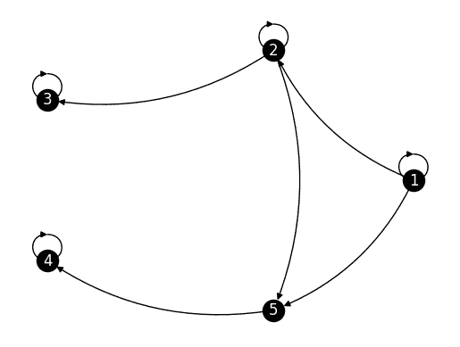

# 7.3\. 极限行为 1：稳态分布

> 原文：[`mmids-textbook.github.io/chap07_rwmc/03_stat/roch-mmids-rwmc-stat.html`](https://mmids-textbook.github.io/chap07_rwmc/03_stat/roch-mmids-rwmc-stat.html)

我们继续探索基本的马尔可夫链理论。在本节中，我们开始研究链的长期行为。与上一节一样，我们将自己限制在有限空间离散时间马尔可夫链，这些链也是时间齐次的。

## 7.3.1\. 定义#

马尔可夫链的一个重要性质是，当运行足够长时间后，它们会收敛到一种“平衡”状态。我们在这里发展了这一理论的一部分。我们所说的“平衡”是什么意思？这里有一个关键的定义。

**定义** **(稳态分布)** $\idx{stationary distribution}\xdi$ 设 $(X_t)_{t \geq 0}$ 是在 $\mathcal{S} = [n]$ 上的马尔可夫链，其转移矩阵为 $P = (p_{i,j})_{i,j=1}^n$。一个在 $[n]$ 上的概率分布 $\bpi = (\pi_i)_{i=1}^n$ 是 $(X_t)_{t \geq 0}$（或 $P$）的稳态分布，如果：

$$ \sum_{i=1}^n \pi_i p_{i,j} = \pi_j, \qquad \forall j \in \mathcal{S}. $$

$\natural$

以矩阵形式，这个条件可以表述为

$$ \bpi P = \bpi, $$

其中回忆一下，我们将 $\bpi$ 视为一个行向量。一种表述方式是，$\bpi$ 是 $P$ 的一个固定点（通过左乘）。另一种表述方式是，$\bpi$ 是 $P$ 的一个左（行）特征向量，其特征值为 $1$。

为了看到稳态分布确实是一个平衡状态，我们注意到以下事实。

**引理** **(稳态)** $\idx{stationarity lemma}\xdi$ 设 $\mathbf{z} \in \mathbb{R}^n$ 是转移矩阵 $P \in \mathbb{R}^{n \times n}$ 的一个左特征向量，其特征值为 $1$。那么对于所有整数 $s \geq 0$，有 $\mathbf{z} P^s = \mathbf{z}$。$\flat$

*证明:* 确实，

$$ \mathbf{z} P^s = (\mathbf{z} P)P^{s-1} = \mathbf{z} P^{s-1} = (\mathbf{z} P) P^{s-2} = \mathbf{z} P^{s-2} = \cdots = \mathbf{z}. $$

$\square$

假设初始分布等于一个稳态分布 $\bpi$。那么，根据 *时间边缘定理* 和 *稳态引理*，任何时间 $s \geq 1$ 的分布是

$$ \bpi P^s = \bpi. $$

即，所有时间的分布确实保持稳态。

在下一节中，我们将推导出一个惊人的事实：在满足某些条件下，从任意初始分布开始的马尔可夫链在 $t \to +\infty$ 的极限中收敛到一个稳态分布。

**示例** **(天气模型，继续)** 回到天气模型，我们计算一个稳态分布。我们需要 $\bpi = (\pi_1, \pi_2)^T$ 满足

$$\begin{split} (\pi_1, \pi_2)^T \begin{pmatrix} 3/4 & 1/4\\ 1/4 & 3/4 \end{pmatrix} = (\pi_1, \pi_2)^T \end{split}$$

即，

$$\begin{align*} &\frac{3}{4} \pi_1 + \frac{1}{4} \pi_2 = \pi_1\\ &\frac{1}{4} \pi_1 + \frac{3}{4} \pi_2 = \pi_2. \end{align*}$$

你可以检查，经过重新排列，这两个方程实际上是同一个方程。

然而，我们还有一些进一步的限制：$\bpi$ 是一个概率分布。因此 $\pi_1, \pi_2 \geq 0$ 且 $\pi_1 + \pi_2 = 1$。将后者代入第一个方程，我们得到

$$ \frac{3}{4} \pi_1 + \frac{1}{4} (1 - \pi_1) = \pi_1 $$

因此我们需要

$$ \pi_1 = \frac{1/4}{1/2} = \frac{1}{2}. $$

并且 $\pi_2 = 1 - \pi_1 = 1/2$。上面的第二个方程也自动满足。$\lhd$

之前的例子相当特殊。它可以推广到所有双随机矩阵（例如，包括 *Petersen 图上的随机游走*）。实际上，我们声称在双随机情况下，均匀分布总是一个平稳分布。设 $P = (p_{i,j})_{i,j=1}^n$ 是定义在 $[n]$ 上的双随机矩阵，设 $\bpi = (\pi_i)_{i=1}^n$ 是 $[n]$ 上的均匀分布。那么对于所有 $j \in [n]$

$$ \sum_{i=1}^n \pi_i p_{i,j} = \sum_{i=1}^n \frac{1}{n} p_{i,j} = \frac{1}{n} \sum_{i=1}^n p_{i,j} = \frac{1}{n} = \pi_j $$

因为列的和为 $1$。这证明了我们的断言。

平稳分布是否保证存在？它是唯一的吗？为了回答这个问题，我们首先需要一些与链的长期行为相关的图论概念。

**定义** **($x \to y$)** 如果存在一个状态序列 $z_0 = x, z_1, z_2, \ldots, z_{r-1}, z_r = y$，使得对于所有 $\ell = 1,\ldots,r$，则称状态 $x \in \S$ 与状态 $y \in \S$ 通信。

$$ p_{z_{\ell-1},z_\ell} > 0. $$

我们将这个性质表示为 $x \to y$. $\natural$

在链的转移图中，条件 $x \to y$ 表示从 $x$ 到 $y$ 存在一条有向路径。重要的是要看到以下两种情况之间的区别：（1）从 $x$ 到 $y$ 存在一条直接边（这暗示 $x \to y$ 但不是必要的）和（2）从 $x$ 到 $y$ 存在一条有向路径。参见下一个例子。

**示例** **(机器人吸尘器，继续)** 回到 *机器人吸尘器示例*，回忆一下转移图。虽然从 $4$ 到 $3$ 没有直接边，但我们确实有通过路径 $(4,2), (2,3)$ 的 $4 \to 3$。我们有 $3 \to 4$ 吗？$\lhd$

这是图论概念对链的长期行为的一个重要后果。

**引理** **(通信)** $\idx{communication lemma}\xdi$ 如果 $x \to y$，则存在一个整数 $r \geq 1$ 使得

$$ \P[X_r = y\,|\,X_0 = x] = (\mathbf{e}_x^T P^r)_y = (P^r)_{x,y} > 0. $$

$\flat$

*证明思路:* 我们通过 $x \to y$ 的定义中特定状态序列的访问概率来降低陈述中的概率。

*证明:* 根据定义 $x \to y$，存在一个状态序列 $z_0 = x, z_1, z_2, \ldots, z_{r-1}, z_r = y$，使得对于所有 $\ell = 1,\ldots,r$，$p_{z_{\ell-1},z_\ell} > 0$。因此，

$$\begin{align*} &\P[X_r = y\,|\,X_0 = x]\\ &\geq \P[X_1=z_1,X_2=z_2,\ldots,X_{r-1}= z_{r-1}, X_r = y\,|\,X_0 = x]\\ &= \prod_{\ell=1}^r \P[X_\ell = z_\ell\,|\,X_{\ell-1} = z_{\ell-1}]\\ &= \prod_{\ell=1}^r p_{z_{\ell-1},z_\ell} > 0, \end{align*}$$

如所声称。 $\square$

以下示例表明引理中的概率是正的，但可能不是 $1$。它还提供了一些关于平稳分布唯一性的问题的见解。

**数值角落**：考虑以下有向图上的随机游走，我们将其称为*双水龙头示例*（为什么你认为是这样？）。

```py
G_sinks = nx.DiGraph()
n_sinks = 5

for i in range(n_sinks):
    G_sinks.add_node(i)

G_sinks.add_edge(0, 0, weight=1/3)
G_sinks.add_edge(0, 1, weight=1/3)
G_sinks.add_edge(1, 1, weight=1/3)
G_sinks.add_edge(1, 2, weight=1/3)
G_sinks.add_edge(2, 2, weight=1)
G_sinks.add_edge(3, 3, weight=1)
G_sinks.add_edge(0, 4, weight=1/3)
G_sinks.add_edge(1, 4, weight=1/3)
G_sinks.add_edge(4, 3, weight=1)

nx.draw_networkx(G_sinks, pos=nx.circular_layout(G_sinks), 
                 labels={i: i+1 for i in range(n_sinks)}, 
                 node_color='black', font_color='white', 
                 connectionstyle='arc3, rad = -0.2')
plt.axis('off')
plt.show() 
```



在这里我们有 $1 \to 4$（为什么？）。*通信引理*表明，当从 $1$ 开始时，$(X_t)_{t \geq 0}$ 以正概率访问 $4$。但这个概率不是 $1$。事实上，我们也有 $1 \to 3$（为什么？），所以以正概率访问 $3$ 也是可能的。但如果我们在此之前访问 $4$，我们将永远停留在 $3$ 上，因此无法随后到达 $4$。

实际上，直观上看，如果我们运行这个链足够长，我们最终会卡在 $3$ 或 $4$ 上。这会产生不同的平稳分布。转移矩阵如下。

```py
P_sinks = nx.adjacency_matrix(G_sinks).toarray()
print(P_sinks) 
```

```py
[[0.33333333 0.33333333 0\.         0\.         0.33333333]
 [0\.         0.33333333 0.33333333 0\.         0.33333333]
 [0\.         0\.         1\.         0\.         0\.        ]
 [0\.         0\.         0\.         1\.         0\.        ]
 [0\.         0\.         0\.         1\.         0\.        ]] 
```

容易验证 $\bpi = (0,0,1,0,0)^T$ 和 $\bpi' = (0,0,0,1,0)^T$ 都是平稳分布。

```py
pi = np.array([0.,0.,1.,0.,0.])
pi_prime = np.array([0.,0.,0.,1.,0.]) 
```

```py
pi @ P_sinks 
```

```py
array([0., 0., 1., 0., 0.]) 
```

```py
pi_prime @ P_sinks 
```

```py
array([0., 0., 0., 1., 0.]) 
```

实际上，在这种情况下有无限多个平稳分布。

$\unlhd$

为了避免前一个示例中的行为，我们引入以下假设。

**定义** **（不可约性）** $\idx{irreducibility}\xdi$ 在 $\mathcal{S}$ 上的马尔可夫链是不可约的，如果对于所有 $x, y \in \mathcal{S}$ 且 $x \neq y$，我们有 $x \to y$ 和 $y \to x$。在这种情况下，我们也称转移矩阵是不可约的。$\natural$

在图形术语中，一个马尔可夫链是不可约的，当且仅当其转移图是强连通的。

**数值角落**：因为不可约性最终是一个图论性质，所以使用 NetworkX 很容易检查。为此，我们使用函数 [`is_strongly_connected()`](https://networkx.org/documentation/stable/reference/algorithms/generated/networkx.algorithms.components.is_strongly_connected.html)。回顾*机器人吸尘器示例*：

```py
P_robot = np.array([[0, 0.8, 0, 0.2, 0, 0, 0, 0, 0],
                    [0.3, 0, 0.2, 0, 0, 0.5, 0, 0, 0],
                    [0, 0.6, 0, 0, 0, 0.4, 0, 0, 0],
                    [0.1, 0.1, 0, 0, 0.8, 0, 0, 0, 0],
                    [0, 0, 0, 0.25, 0, 0, 0.75, 0, 0],
                    [0, 0.15, 0.15, 0, 0, 0, 0, 0.35, 0.35],
                    [0, 0, 0, 0, 0, 0, 0, 1, 0],
                    [0, 0, 0, 0, 0.3, 0.4, 0.2, 0, 0.1],
                    [0, 0, 0, 0, 0, 1, 0, 0, 0]])

G_robot = nx.from_numpy_array(P_robot, create_using=nx.DiGraph)

print(nx.is_strongly_connected(G_robot)) 
```

```py
True 
```

再次考虑*双水龙头示例*。结果证明它并非不可约：

```py
print(nx.is_strongly_connected(G_sinks)) 
```

```py
False 
```

$\unlhd$

## 7.3.2\. 存在性#

在不可约的情况下，结果是一个平稳分布总是存在——并且实际上是唯一的。（在这种情况下，只有一个强连通分量就足以保证唯一性成立，但这里我们不会推导这一点。此外，在有限情况下，平稳分布总是存在，但同样我们不会在这里证明这一点。）

**定理** **(平稳分布的存在性)** **(平稳分布的存在性)** 设 $P$ 是 $[n]$ 上的不可约转移矩阵。那么存在一个唯一的平稳分布 $\bpi$。进一步，$\bpi$ 的所有项都是严格正的。 $\sharp$

*证明：* 证明并不直接。我们通过一系列的命题来建立存在性。

**引理** **(步骤 1)** 存在一个非零行向量 $\mathbf{z} \in \mathbb{R}^n$，使得 $\mathbf{z} P = \mathbf{z}$。 $\flat$

**引理** **(步骤 2)** 设 $\mathbf{z} \in \mathbb{R}^n$ 是一个非零行向量 $\mathbf{z} P = \mathbf{z}$。那么

$$ \bpi = \frac{1}{\sum_{x} z_x} \mathbf{z} $$

是 $P$ 的严格正的平稳分布。 $\flat$

**引理** **(步骤 3)** 设 $\bpi_1$ 和 $\bpi_2$ 是 $P$ 的平稳分布。那么 $\bpi_1 = \bpi_2$。 $\flat$

*证明：* *(引理（步骤 1))* 因为 $P$ 是随机的，根据定义，我们有 $P \mathbf{1} = \mathbf{1}$，其中 $\mathbf{1}$ 是维度为 $n$ 的全一列向量。换句话说，

$$ (P - I) \mathbf{1} = \mathbf{0} $$

即，$P - I$ 的列线性相关。特别是 $\mathrm{rk}(P-I) < n$。由此又可推出，根据*行秩等于列秩定理*，$P - I$ 的行也线性相关。因此，存在一个非零行向量 $\mathbf{z} \in \mathbb{R}^n$，使得 $\mathbf{z}(P-I) = \mathbf{0}$，或者重新排列后

$$ \mathbf{z}P = \mathbf{z}. $$

这就证明了该命题。 $\square$

*证明：* *(引理（步骤 2))* 我们将证明分成几个部分。

为了利用不可约性，我们首先构造一个以 $\mathbf{z}$ 作为特征值 $1$ 的左特征向量的正随机矩阵。然后我们证明 $\mathbf{z}$ 的所有项具有相同的符号。最后，我们对 $\mathbf{z}$ 进行归一化。

**引理** **(步骤 2a)** 存在一个非负整数 $h$，使得

$$ R = \frac{1}{h+1}[I + P + P² + \cdots + P^h] $$

只包含严格正的项，并且满足 $\mathbf{z} R = \mathbf{z}$。 $\flat$

**引理** **(步骤 2b)** $\mathbf{z}$ 的项要么都是非负的，要么都是非正的。 $\flat$

**引理** **(步骤 2c)** 设 $\bpi = \frac{\mathbf{z}}{\mathbf{z}\mathbf{1}}$。那么 $\bpi$ 是一个严格正的平稳分布。 $\flat$

我们接下来证明这些命题。

*证明：* *(引理（步骤 2a))* 通过不可约性和*通信引理*，对于任意的 $x, y \in [n]$，存在 $h_{x,y}$ 使得 $(P^{h_{x,y}})_{x,y} > 0$。现在定义

$$ h = \max_{x,y \in [n]} h_{x,y}. $$

可以证明（试一试！）对于所有 $s$，$P^s$（作为随机矩阵的乘积）本身也是一个随机矩阵。特别是，它有非负的项。因此，对于每个 $x,y$，

$$ R_{x,y} = \frac{1}{h+1}[I_{x,y} + P_{x,y} + (P²)_{x,y} + \cdots + (P^h)_{x,y}] \geq \frac{1}{h+1} (P^{h_{x,y}})_{x,y} > 0. $$

可以证明（试试看！）$R$（作为随机矩阵的凸组合）本身也是一个随机矩阵。

此外，根据 *平稳性引理*，由于 $\mathbf{z} P = \mathbf{z}$，因此对于所有 $s$，有 $\mathbf{z} P^s = \mathbf{z}$。因此，

$$ \mathbf{z} R = \frac{1}{h+1}[\mathbf{z}I + \mathbf{z}P + \mathbf{z}P² + \cdots + \mathbf{z}P^h] = \frac{1}{h+1}[\mathbf{z} + \mathbf{z} + \mathbf{z} + \cdots + \mathbf{z}] = \mathbf{z}. $$

这就完成了证明。$\square$

*证明:* *(引理（步骤 2b）)* 我们通过反证法进行论证。假设 $\mathbf{z} = (z_x)_{x \in [n]}$ 的两个条目具有不同的符号。比如说 $z_i > 0$ 而 $z_j < 0$。令 $R = (r_{x,y})_{x,y=1}^n$。根据 *步骤 2a*，

$$ |z_y| = \left|\sum_{x} z_x r_{x,y}\right| = \left|\sum_{x: z_x \geq 0} z_x r_{x,y} + \sum_{x: z_x < 0} z_x r_{x,y}\right|. $$

因为对于所有 $x,y$，$r_{x,y} > 0$，所以最右边表达式的第一个项是严格正的（因为至少是 $z_i r_{i,y} > 0$），而第二个项是严格负的（因为至多是 $z_j r_{j,y} < 0$）。因此，由于抵消，这个表达式严格小于绝对值之和

$$ |z_y| < \sum_{x} |z_x| r_{x,y}. $$

由于 $R$ 是根据前一个命题的证明得出的随机矩阵，我们在对 $y$ 求和后得出

$$ \sum_{y} |z_y| < \sum_{y} \sum_{x} |z_x| r_{x,y} = \sum_{x} |z_x| \sum_{y} r_{x,y} = \sum_{x} |z_x|, $$

这是一个矛盾，证明了该命题。$\square$

*证明:* *(引理（步骤 2c）)* 现在定义 $\bpi = (\pi_x)_{x \in [n]}$ 为

$$ \pi_ x = \frac{z_x}{\sum_{i} z_i} = \frac{|z_x|}{\sum_{i} |z_i|} \geq 0, $$

其中第二个等式来自 *步骤 2b*。我们还使用了 $\mathbf{z} \neq \mathbf{0}$ 的事实。对于所有 $y$，

$$ \sum_{x} \pi_x p_{x,y} = \sum_{x} \frac{z_x}{\sum_{i} z_i} p_{x,y} = \frac{1}{\sum_{i} z_i} \sum_{x} z_x p_{x,y} = \frac{z_y}{\sum_{i} z_i} = \pi_y. $$

同样，用 *步骤 2a* 中的 $p_{x,y}$ 替换 $r_{x,y}$ 也成立。由于 $r_{x,y} > 0$ 且 $\mathbf{z} \neq \mathbf{0}$，因此对于所有 $y$，有 $\pi_y > 0$。这证明了该命题。$\square$

这就完成了 *引理（步骤 2）* 的证明。$\square$

剩下要证明的是唯一性。

假设有两个不同的平稳分布 $\bpi_1$ 和 $\bpi_2$。由于它们是不同的，它们不是彼此的倍数，因此它们是线性无关的。应用 Gram-Schmidt 算法：

$$ \mathbf{q}_1 = \frac{\bpi_1}{\|\bpi_1\|} \qquad \text{和} \qquad\mathbf{q}_2 = \frac{\bpi_2 - \langle \bpi_2, \mathbf{q}_1 \rangle \mathbf{q}_1}{\|\bpi_2 - \langle \bpi_2, \mathbf{q}_1 \rangle \mathbf{q}_1\|}. $$

然后

$$ \mathbf{q}_1 P = \frac{\bpi_1}{\|\bpi_1\|} P = \frac{\bpi_1 P}{\|\bpi_1\|} = \frac{\bpi_1}{\|\bpi_1\|} = \mathbf{q}_1 $$

并且 $\mathbf{q}_1$ 的所有条目都是严格正的。

同样，

$$\begin{align*} \mathbf{q}_2 P &= \frac{\bpi_2 - \langle \bpi_2, \mathbf{q}_1 \rangle \mathbf{q}_1}{\|\bpi_2 - \langle \bpi_2, \mathbf{q}_1 \rangle \mathbf{q}_1\|} P\\ &= \frac{\bpi_2 P - \langle \bpi_2, \mathbf{q}_1 \rangle \mathbf{q}_1 P}{\|\bpi_2 - \langle \bpi_2, \mathbf{q}_1 \rangle \mathbf{q}_1\|}\\ &= \frac{\bpi_2 - \langle \bpi_2, \mathbf{q}_1 \rangle \mathbf{q}_1}{\|\bpi_2 - \langle \bpi_2, \mathbf{q}_1 \rangle \mathbf{q}_1\|}\\ &= \mathbf{q}_2. \end{align*}$$

根据 *步骤 2a-2c*，存在 $\mathbf{q}_2$ 的一个倍数，比如说 $\mathbf{q}_2' = \alpha \mathbf{q}_2$，其中 $\alpha \neq 0$，使得 $\mathbf{q}_2' P = \mathbf{q}_2'$ 并且 $\mathbf{q}_2'$ 的所有项都是严格正的。

根据 Gram-Schmidt 算法的性质，

$$ \langle \mathbf{q}_1, \mathbf{q}_2' \rangle = \langle \mathbf{q}_1, \alpha \mathbf{q}_2 \rangle = \alpha \langle \mathbf{q}_1, \mathbf{q}_2 \rangle = 0. $$

但这产生了矛盾——两个向量都是严格正的。这就完成了证明。 $\square$

关于 $P$ 的特征值的几个更多观察。

(1) 当 $\lambda$ 是 $P$ 的左特征值（即，对于某个 $\mathbf{z} \in \mathbb{R}^n$ 作为行向量，有 $\mathbf{z} P = \lambda \mathbf{z}$）时，它也是 $P$ 的右特征值（即，对于某个 $\mathbf{y} \in \mathbb{R}^n$，有 $P \mathbf{y} = \lambda \mathbf{y}$）。一种使用我们之前的结果来观察这种方法的方式是注意到 $\mathbf{z} P = \lambda \mathbf{z}$ 等价于 $P^T \mathbf{z}^T = \lambda \mathbf{z}^T$，或者换句话说 $(P^T - \lambda I) \mathbf{z}^T = \mathbf{0}$，因此

$$ \mathbf{z}^T \in \mathrm{null}(P^T - \lambda I). $$

同样，$P \mathbf{y} = \lambda \mathbf{y}$ 等价于

$$ \mathbf{y} \in \mathrm{null}(P - \lambda I). $$

根据 *秩-零度定理*，这两个零空间具有相同的维度，因为 $(P - \lambda I)^T = P^T - \lambda I^T = P^T - \lambda I$。特别是，当其中一个的维度大于 $0$（即，它包含非零向量）时，另一个也是如此。

这并不是说它们是同一个空间——只是它们的维度相同！换句话说，左特征值和右特征值是相同的，但左特征向量和右特征向量 *不是*。

(2) 在前一个定理中，我们已证明，如果 $P$ 是不可约的，那么它有一个唯一的（在缩放意义上的）特征值为 $1$ 的左特征向量。根据第一个观察结果，$\mathbf{1}$ 在这种情况下也是 $P$ 的唯一特征值为 $1$ 的右特征向量。也就是说，$1$ 的 [几何重数](https://en.wikipedia.org/wiki/Eigenvalues_and_eigenvectors#Eigenspaces,_geometric_multiplicity,_and_the_eigenbasis_for_matrices) 是 $1$。

(3) 那么其他特征值呢？假设对于非零行向量 $\mathbf{z}$，有 $\mathbf{z} P = \lambda \mathbf{z}$，那么对等式左边取 $\ell_1$ 范数，我们得到

$$\begin{align*} \|\mathbf{z} P\|_1 &= \sum_{j=1}^n \left|\sum_{i=1}^n z_i p_{i,j} \right| \leq \sum_{j=1}^n \sum_{i=1}^n |z_i| p_{i,j} = \sum_{i=1}^n |z_i| \sum_{j=1}^n p_{i,j} = \sum_{i=1}^n |z_i| = \|\mathbf{z}\|_1, \end{align*}$$

其中我们使用了 $P$ 是随机的。

最左侧表达式的 $\ell_1$ 范数为 $\|\lambda \mathbf{z} \|_1 = |\lambda| \|\mathbf{z} \|_1$。因此 $|\lambda| \|\mathbf{z} \|_1 \leq \|\mathbf{z}\|_1$，简化后意味着 $|\lambda| \leq 1$。

(3) 因此，$P$ 的所有左特征值和右特征值的绝对值都小于或等于 $1$。在不可约情况下，我们知道 $1$ 被达到，并且具有几何重数 $1$。那么 $-1$ 呢？假设 $\mathbf{z} P = - \mathbf{z}$。然后再次将 $P$ 应用到两边，我们得到

$$ \mathbf{z} P² = - \mathbf{z} P = \mathbf{z}. $$

所以 *如果* $P²$（它也是随机的）是不可约的，那么就存在唯一的这样的 $\mathbf{z}$。

但我们已知一个。确实，$P$ 的唯一平稳分布 $\bpi$ 满足

$$ \bpi P² = \bpi P = \bpi. $$

但它不满足 $\bpi P = - \bpi$。因此，在那个情况下没有特征值 $-1$ 的特征向量。

**数值角:** 通常，计算平稳分布不像我们上面考虑的简单例子那样直接。我们以一些数值方法来结束本小节。

回到 *机器人吸尘器*，在这个情况下找到 $\bpi P =\bpi$ 的解并不明显。一种方法是注意到，取转置后，这个条件等价于 $P^T \bpi^T = \bpi^T$。也就是说，$\bpi^T$ 是 $P^T$ 的一个特征向量，其特征值为 $1$。（或者，如我们之前提到的，行向量 $\bpi$ 是 $P$ 的一个左特征向量，其特征值为 $1$。）它还必须满足 $\bpi \geq 0$，并且至少有一个条目非零。在这里，我们使用 NumPy。

```py
w, v = LA.eig(P_robot.T) 
```

如下所示，第一个特征值大约为 $1$。

```py
print(w) 
```

```py
[ 1\.        +0.j          0.67955052+0.j          0.50519638+0.j
 -0.70014828+0.j         -0.59989603+0.j         -0.47710224+0.32524037j
 -0.47710224-0.32524037j  0.03475095+0.04000569j  0.03475095-0.04000569j] 
```

对应的特征向量大约是非负的。

```py
print(v[:,0]) 
```

```py
[0.08933591+0.j 0.27513917+0.j 0.15744007+0.j 0.06794162+0.j
 0.20029774+0.j 0.68274825+0.j 0.24751961+0.j 0.48648149+0.j
 0.28761004+0.j] 
```

为了获得一个平稳分布，我们移除虚部并将其归一化，使其总和为 $1$。

```py
pi_robot = np.real(v[:,0]) / np.sum(np.real(v[:,0]))
print(pi_robot) 
```

```py
[0.03581295 0.11029771 0.06311453 0.02723642 0.0802953  0.27369992
 0.09922559 0.19502056 0.11529703] 
```

或者，我们可以解这个线性系统

$$ \sum_{i=1}^n \pi_i p_{i,j} = \pi_j, \qquad \forall j \in [n]. $$

结果表明，最后一个方程是其他方程的线性组合（参见 *问题 7.21*），所以我们将其删除，并用条件 $\sum_{i=1}^n \pi_i = 1$ 代替它。

结果线性系统的左侧（在取转置以处理列向量后）为：

```py
n_robot = P_robot.shape[0]
A = np.copy(P_robot.T) - np.diag(np.ones(n_robot))
A[n_robot-1,:] = np.ones(n_robot)
print(A) 
```

```py
[[-1\.    0.3   0\.    0.1   0\.    0\.    0\.    0\.    0\.  ]
 [ 0.8  -1\.    0.6   0.1   0\.    0.15  0\.    0\.    0\.  ]
 [ 0\.    0.2  -1\.    0\.    0\.    0.15  0\.    0\.    0\.  ]
 [ 0.2   0\.    0\.   -1\.    0.25  0\.    0\.    0\.    0\.  ]
 [ 0\.    0\.    0\.    0.8  -1\.    0\.    0\.    0.3   0\.  ]
 [ 0\.    0.5   0.4   0\.    0\.   -1\.    0\.    0.4   1\.  ]
 [ 0\.    0\.    0\.    0\.    0.75  0\.   -1\.    0.2   0\.  ]
 [ 0\.    0\.    0\.    0\.    0\.    0.35  1\.   -1\.    0\.  ]
 [ 1\.    1\.    1\.    1\.    1\.    1\.    1\.    1\.    1\.  ]] 
```

结果线性系统的右侧为：

```py
b = np.concatenate((np.zeros(n_robot-1),[1.]))
print(b) 
```

```py
[0\. 0\. 0\. 0\. 0\. 0\. 0\. 0\. 1.] 
```

我们使用 `numpy.linalg.solve()` 解这个线性系统。

```py
pi_robot_solve = LA.solve(A,b)
print(pi_robot_solve) 
```

```py
[0.03581295 0.11029771 0.06311453 0.02723642 0.0802953  0.27369992
 0.09922559 0.19502056 0.11529703] 
```

这种最后的方法被称为“替换方程”。

$\unlhd$

**CHAT & LEARN** 佩龙-弗罗本尼乌斯定理是关于某些类型矩阵（包括不可约随机矩阵）的特征值和特征向量的强大结果。请向您最喜欢的 AI 聊天机器人解释佩龙-弗罗本尼乌斯定理及其与本节内容的关联。 $\ddagger$

***自我评估测验*** *(在克劳德、双子座和 ChatGPT 的帮助下)*

**1** 以下哪个是概率分布 $\boldsymbol{\pi} = (\pi_i)_{i=1}^n$ 成为具有转移矩阵 $P = (p_{i,j})_{i,j=1}^n$ 的马尔可夫链的平稳分布的正确条件？

a) $\sum_{j=1}^n \pi_i p_{i,j} = \pi_j$ 对于所有 $i \in [n]$

b) $\sum_{i=1}^n \pi_i p_{i,j} = \pi_j$ 对于所有 $j \in [n]$

c) $\sum_{j=1}^n \pi_i p_{i,j} = \pi_i$ 对于所有 $i \in [n]$

d) $\sum_{i=1}^n \pi_i p_{i,j} = \pi_i$ 对于所有 $j \in [n]$

**2** 以下哪个是概率分布 $\pi$ 成为具有转移矩阵 $P$ 的马尔可夫链的平稳分布条件的矩阵形式？

a) $\boldsymbol{\pi} P = \boldsymbol{\pi}$

b) $P \boldsymbol{\pi} = \boldsymbol{\pi}$

c) $\boldsymbol{\pi} P^T = \boldsymbol{\pi}^T$

d) $P^T \boldsymbol{\pi}^T = \boldsymbol{\pi}$

**3** 一个马尔可夫链是不可约的，如果：

a) 每个状态都与每个其他状态通信。

b) 存在一个状态与每个其他状态通信。

c) 该链的转移图是强连通的。

d) a 和 c 都正确。

**4** 考虑以下马尔可夫链的转移图：

```py
G = nx.DiGraph()
G.add_edges_from([(1, 2), (2, 1), (2, 3), (3, 3)]) 
```

这个马尔可夫链是不可约的吗？

a) 是

b) 否

**5** 在不可约马尔可夫链中，对应于特征值 1 的左和右特征向量：

a) 相同，只是缩放不同。

b) 总是不同的。

c) 互为转置。

d) 不一定相互关联。

1 题的答案：b. 理由：文本指出，如果概率分布 $\boldsymbol{\pi} = (\pi_i)_{i=1}^n$ 在 $[n]$ 上是转移矩阵 $P = (p_{i,j})_{i,j=1}^n$ 的马尔可夫链的平稳分布，那么对于所有 $j \in [n]$，都有 $\sum_{i=1}^n \pi_i p_{i,j} = \pi_j$。

2 题的答案：a. 理由：文本指出，概率分布 $\boldsymbol{\pi}$ 成为具有转移矩阵 $P$ 的马尔可夫链的平稳分布的条件可以写成矩阵形式 $\boldsymbol{\pi} P = \boldsymbol{\pi}$，其中 $\boldsymbol{\pi}$ 被视为一个行向量。

3 题的答案：d. 理由：文本指出，如果对于所有 $x, y \in S$ 且 $x \neq y$，我们都有 $x \to y$ 和 $y \to x$，那么在 $S$ 上的马尔可夫链是不可约的。它还提到，马尔可夫链是不可约的当且仅当其转移图是强连通的。

4 题的答案：b. 理由：马尔可夫链不可约，因为没有从状态 3 回到状态 1 的方法。

5 的答案：d. 证明：文本指出，对于不可约马尔可夫链，左特征值和右特征值是相同的，但左特征向量和右特征向量不一定相同。它还提到特征值 1 的几何重数为 1，这意味着对应于特征值 1 的左特征向量和右特征向量在缩放上可能是唯一的，但它们不一定相互关联。

## 7.3.1\. 定义#

马尔可夫链的一个重要性质是，当运行足够长时间时，它们会收敛到一种“平衡”状态。我们在这里发展了这一理论的部分内容。我们所说的“平衡”是什么意思？这里有一个关键的定义。

**定义：** **(平稳分布)** $\idx{stationary distribution}\xdi$ 设 $(X_t)_{t \geq 0}$ 是 $\mathcal{S} = [n]$ 上的马尔可夫链，其转移矩阵为 $P = (p_{i,j})_{i,j=1}^n$。一个概率分布 $\bpi = (\pi_i)_{i=1}^n$ 在 $[n]$ 上是 $(X_t)_{t \geq 0}$（或 $P$）的平稳分布（如果）：

$$ \sum_{i=1}^n \pi_i p_{i,j} = \pi_j, \qquad \forall j \in \mathcal{S}. $$

$\natural$

在矩阵形式中，这个条件可以表述为

$$ \bpi P = \bpi, $$

其中，记住我们将 $\bpi$ 视为一个行向量。一种说法是，$\bpi$ 是 $P$ 的一个固定点（通过左乘）。另一种说法是，$\bpi$ 是 $P$ 的一个左（行）特征向量，其特征值为 $1$。

为了看到平稳分布确实是一个平衡态，我们注意到以下事实。

**引理：** **(平稳性)** $\idx{stationarity lemma}\xdi$ 设 $\mathbf{z} \in \mathbb{R}^n$ 是转移矩阵 $P \in \mathbb{R}^{n \times n}$ 的左特征向量，其特征值为 $1$。那么对于所有整数 $s \geq 0$，有 $\mathbf{z} P^s = \mathbf{z}$。$\flat$

*证明：* 确实，

$$ \mathbf{z} P^s = (\mathbf{z} P)P^{s-1} = \mathbf{z} P^{s-1} = (\mathbf{z} P) P^{s-2} = \mathbf{z} P^{s-2} = \cdots = \mathbf{z}. $$

$\square$

假设初始分布等于一个平稳分布 $\bpi$。那么，根据*时间边缘定理*和*平稳性引理*，任何时间 $s \geq 1$ 的分布是

$$ \bpi P^s = \bpi. $$

那就是所有时间的分布确实保持平稳。

在下一节中，我们将推导出一个显著的事实：在特定条件下，从任意初始分布开始的马尔可夫链在 $t \to +\infty$ 的极限中收敛到一个平稳分布。

**示例：** **(天气模型，继续)** 回到天气模型，我们计算一个平稳分布。我们需要 $\bpi = (\pi_1, \pi_2)^T$ 满足

$$\begin{split} (\pi_1, \pi_2)^T \begin{pmatrix} 3/4 & 1/4\\ 1/4 & 3/4 \end{pmatrix} = (\pi_1, \pi_2)^T \end{split}$$

即，

$$\begin{align*} &\frac{3}{4} \pi_1 + \frac{1}{4} \pi_2 = \pi_1\\ &\frac{1}{4} \pi_1 + \frac{3}{4} \pi_2 = \pi_2. \end{align*}$$

你可以检查，经过重新排列，这两个方程实际上是同一个方程。

注意，然而，我们还有一些进一步的限制：$\bpi$ 是一个概率分布。因此 $\pi_1, \pi_2 \geq 0$ 且 $\pi_1 + \pi_2 = 1$。将后者代入第一个方程，我们得到

$$ \frac{3}{4} \pi_1 + \frac{1}{4} (1 - \pi_1) = \pi_1 $$

因此我们需要

$$ \pi_1 = \frac{1/4}{1/2} = \frac{1}{2}. $$

并且 $\pi_2 = 1 - \pi_1 = 1/2$。上面的第二个方程也自动满足。$\lhd$

前面的例子相当特殊。它可以推广到所有双随机矩阵（例如，包括 *Petersen 图上的随机游走*）。实际上，我们声称在双随机情况下，均匀分布总是一个平稳分布。设 $P = (p_{i,j})_{i,j=1}^n$ 是定义在 $[n]$ 上的双随机矩阵，设 $\bpi = (\pi_i)_{i=1}^n$ 是 $[n]$ 上的均匀分布。那么对于所有 $j \in [n]$

$$ \sum_{i=1}^n \pi_i p_{i,j} = \sum_{i=1}^n \frac{1}{n} p_{i,j} = \frac{1}{n} \sum_{i=1}^n p_{i,j} = \frac{1}{n} = \pi_j $$

因为列的和为 $1$。这证明了我们的主张。

是否保证存在平稳分布？它是唯一的吗？为了回答这个问题，我们首先需要一些与链的长期行为相关的图论概念。

**定义** **($x \to y$)** 如果存在一个状态序列 $z_0 = x, z_1, z_2, \ldots, z_{r-1}, z_r = y$，使得对于所有 $\ell = 1,\ldots,r$，则称状态 $x \in \S$ 与状态 $y \in \S$ 通信。

$$ p_{z_{\ell-1},z_\ell} > 0. $$

我们将这个性质表示为 $x \to y$。$\natural$

从链的转移图中，条件 $x \to y$ 表示存在从 $x$ 到 $y$ 的有向路径。重要的是要看到以下区别：(1) 从 $x$ 到 $y$ 存在直接边（这暗示了 $x \to y$ 但并非必要）和(2) 从 $x$ 到 $y$ 存在有向路径。参见下一个例子。

**例:** **(机器人吸尘器，继续)** 回到 *机器人吸尘器例子*，回忆转移图。虽然从 $4$ 到 $3$ 没有直接边，但我们确实通过路径 $(4,2), (2,3)$ 有 $4 \to 3$。我们有 $3 \to 4$ 吗？$\lhd$

这里是关于链的长期行为这一图论概念的 重要推论。

**引理** **(通信)** $\idx{communication lemma}\xdi$ 如果 $x \to y$，则存在一个整数 $r \geq 1$ 使得

$$ \P[X_r = y\,|\,X_0 = x] = (\mathbf{e}_x^T P^r)_y = (P^r)_{x,y} > 0. $$

$\flat$

*证明思路:* 我们通过 $x \to y$ 的定义中特定状态序列的访问概率来对陈述中的概率进行下界估计。

*证明:* 根据定义 $x \to y$，存在一个状态序列 $z_0 = x, z_1, z_2, \ldots, z_{r-1}, z_r = y$，对于所有 $\ell = 1,\ldots,r$，$p_{z_{\ell-1},z_\ell} > 0$。因此，

$$\begin{align*} &\P[X_r = y\,|\,X_0 = x]\\ &\geq \P[X_1=z_1,X_2=z_2,\ldots,X_{r-1}= z_{r-1}, X_r = y\,|\,X_0 = x]\\ &= \prod_{\ell=1}^r \P[X_\ell = z_\ell\,|\,X_{\ell-1} = z_{\ell-1}]\\ &= \prod_{\ell=1}^r p_{z_{\ell-1},z_\ell} > 0, \end{align*}$$

如所述。 $\square$

以下示例表明，引理中的概率是正的，但可能不是 $1$。它还提供了一些关于平稳分布唯一性的问题的见解。

**数值角落**：考虑以下有向图上的随机游走，我们将其称为**两个汇点示例**（为什么你认为是这样？）。

```py
G_sinks = nx.DiGraph()
n_sinks = 5

for i in range(n_sinks):
    G_sinks.add_node(i)

G_sinks.add_edge(0, 0, weight=1/3)
G_sinks.add_edge(0, 1, weight=1/3)
G_sinks.add_edge(1, 1, weight=1/3)
G_sinks.add_edge(1, 2, weight=1/3)
G_sinks.add_edge(2, 2, weight=1)
G_sinks.add_edge(3, 3, weight=1)
G_sinks.add_edge(0, 4, weight=1/3)
G_sinks.add_edge(1, 4, weight=1/3)
G_sinks.add_edge(4, 3, weight=1)

nx.draw_networkx(G_sinks, pos=nx.circular_layout(G_sinks), 
                 labels={i: i+1 for i in range(n_sinks)}, 
                 node_color='black', font_color='white', 
                 connectionstyle='arc3, rad = -0.2')
plt.axis('off')
plt.show() 
```


在这里我们有 $1 \to 4$（为什么？）。**通信引理**表明，当从 $1$ 开始时，$(X_t)_{t \geq 0}$ 以正概率访问 $4$。但这个概率不是 $1$。实际上，我们也有 $1 \to 3$（为什么？），因此以正概率访问 $3$ 也是可能的。但如果我们在访问 $4$ 之前这样做，我们将永远停留在 $3$ 上，因此无法随后到达 $4$。

实际上，直观地说，如果我们运行这个链足够长的时间，我们最终会卡在 $3$ 上或卡在 $4$ 上。这会产生不同的平稳分布。转移矩阵如下。

```py
P_sinks = nx.adjacency_matrix(G_sinks).toarray()
print(P_sinks) 
```

```py
[[0.33333333 0.33333333 0\.         0\.         0.33333333]
 [0\.         0.33333333 0.33333333 0\.         0.33333333]
 [0\.         0\.         1\.         0\.         0\.        ]
 [0\.         0\.         0\.         1\.         0\.        ]
 [0\.         0\.         0\.         1\.         0\.        ]] 
```

容易验证 $\bpi = (0,0,1,0,0)^T$ 和 $\bpi' = (0,0,0,1,0)^T$ 都是平稳分布。

```py
pi = np.array([0.,0.,1.,0.,0.])
pi_prime = np.array([0.,0.,0.,1.,0.]) 
```

```py
pi @ P_sinks 
```

```py
array([0., 0., 1., 0., 0.]) 
```

```py
pi_prime @ P_sinks 
```

```py
array([0., 0., 0., 1., 0.]) 
```

实际上，在这种情况下有无限多个平稳分布。

$\unlhd$

为了避免前一个示例中的行为，我们引入以下假设。

**定义** **（不可约性）** $\idx{irreducibility}\xdi$ 在 $\mathcal{S}$ 上的马尔可夫链是不可约的，如果对于所有 $x, y \in \mathcal{S}$ 且 $x \neq y$，我们有 $x \to y$ 和 $y \to x$。在这种情况下，我们也称转移矩阵为不可约。 $\natural$

在图形术语中，马尔可夫链是不可约的当且仅当其转移图是强连通的。

**数值角落**：因为不可约性最终是一个图论性质，所以使用 NetworkX 很容易检查。为此，我们使用函数 [`is_strongly_connected()`](https://networkx.org/documentation/stable/reference/algorithms/generated/networkx.algorithms.components.is_strongly_connected.html)。回顾**机器人吸尘器示例**：

```py
P_robot = np.array([[0, 0.8, 0, 0.2, 0, 0, 0, 0, 0],
                    [0.3, 0, 0.2, 0, 0, 0.5, 0, 0, 0],
                    [0, 0.6, 0, 0, 0, 0.4, 0, 0, 0],
                    [0.1, 0.1, 0, 0, 0.8, 0, 0, 0, 0],
                    [0, 0, 0, 0.25, 0, 0, 0.75, 0, 0],
                    [0, 0.15, 0.15, 0, 0, 0, 0, 0.35, 0.35],
                    [0, 0, 0, 0, 0, 0, 0, 1, 0],
                    [0, 0, 0, 0, 0.3, 0.4, 0.2, 0, 0.1],
                    [0, 0, 0, 0, 0, 1, 0, 0, 0]])

G_robot = nx.from_numpy_array(P_robot, create_using=nx.DiGraph)

print(nx.is_strongly_connected(G_robot)) 
```

```py
True 
```

再次考虑**两个汇点示例**。它实际上不是不可约的：

```py
print(nx.is_strongly_connected(G_sinks)) 
```

```py
False 
```

$\unlhd$

## 7.3.2\. 存在性#

在不可约的情况下，结果表明平稳分布总是存在的——实际上它是唯一的。（在这种情况下，只有一个强连通分量就足以保证唯一性，但这里我们不会推导这一点。此外，在有限情况下，平稳分布总是存在的，但这里我们也不会证明这一点。）

**定理** **(平稳分布的存在性)** $\idx{existence of stationary distribution}\xdi$ 设 $P$ 是 $[n]$ 上的不可约转移矩阵。那么存在唯一的平稳分布 $\bpi$。进一步，$\bpi$ 的所有项都是严格正的。$\sharp$

*证明：* 证明并不直接。我们通过一系列断言来建立存在性。

**引理** **(步骤 1)** 存在一个非零行向量 $\mathbf{z} \in \mathbb{R}^n$，使得 $\mathbf{z} P = \mathbf{z}$。$\flat$

**引理** **(步骤 2)** 设 $\mathbf{z} \in \mathbb{R}^n$ 是一个非零行向量 $\mathbf{z} P = \mathbf{z}$。那么

$$ \bpi = \frac{1}{\sum_{x} z_x} \mathbf{z} $$

是 $P$ 的严格正平稳分布。$\flat$

**引理** **(步骤 3)** 设 $\bpi_1$ 和 $\bpi_2$ 是 $P$ 的平稳分布。那么 $\bpi_1 = \bpi_2$。$\flat$

*证明：* *(引理 (步骤 1))* 因为 $P$ 是随机的，根据定义我们有 $P \mathbf{1} = \mathbf{1}$，其中 $\mathbf{1}$ 是维度为 $n$ 的列全一向量。换句话说，

$$ (P - I) \mathbf{1} = \mathbf{0} $$

即，$P - I$ 的列线性相关。特别是 $\mathrm{rk}(P-I) < n$。这反过来又通过 *行秩等于列秩定理* 意味着 $P - I$ 的行线性相关。因此，存在一个非零行向量 $\mathbf{z} \in \mathbb{R}^n$，使得 $\mathbf{z}(P-I) = \mathbf{0}$，或者重新排列后

$$ \mathbf{z}P = \mathbf{z}. $$

这证明了断言。$\square$

*证明：* *(引理 (步骤 2))* 我们将证明分成几个断言。

为了利用不可约性，我们首先构造一个以 $\mathbf{z}$ 作为特征值 $1$ 的左特征向量的正随机矩阵。然后我们证明 $\mathbf{z}$ 的所有项具有相同的符号。最后，我们归一化 $\mathbf{z}$。

**引理** **(步骤 2a)** 存在一个非负整数 $h$，使得

$$ R = \frac{1}{h+1}[I + P + P² + \cdots + P^h] $$

具有严格正的项，并满足 $\mathbf{z} R = \mathbf{z}$。$\flat$

**引理** **(步骤 2b)** $\mathbf{z}$ 的项要么都是非负的，要么都是非正的。$\flat$

**引理** **(步骤 2c)** 设 $\bpi = \frac{\mathbf{z}}{\mathbf{z}\mathbf{1}}$。那么 $\bpi$ 是一个严格正平稳分布。$\flat$

我们接下来证明这些断言。

*证明：* *(引理 (步骤 2a))* 通过不可约性和 *通信引理*，对于任意 $x, y \in [n]$，存在 $h_{x,y}$ 使得 $(P^{h_{x,y}})_{x,y} > 0$。现在定义

$$ h = \max_{x,y \in [n]} h_{x,y}. $$

可以证明（试一试！）对于所有 $s$，$P^s$（作为随机矩阵的乘积）本身也是一个随机矩阵。特别是，它有非负的项。因此，对于每个 $x,y$，

$$ R_{x,y} = \frac{1}{h+1}[I_{x,y} + P_{x,y} + (P²)_{x,y} + \cdots + (P^h)_{x,y}] \geq \frac{1}{h+1} (P^{h_{x,y}})_{x,y} > 0. $$

可以证明（试试看！）$R$（作为随机矩阵的凸组合）本身也是一个随机矩阵。

此外，根据 *平稳性引理*，由于 $\mathbf{z} P = \mathbf{z}$，因此对于所有 $s$，$\mathbf{z} P^s = \mathbf{z}$。因此，

$$ \mathbf{z} R = \frac{1}{h+1}[\mathbf{z}I + \mathbf{z}P + \mathbf{z}P² + \cdots + \mathbf{z}P^h] = \frac{1}{h+1}[\mathbf{z} + \mathbf{z} + \mathbf{z} + \cdots + \mathbf{z}] = \mathbf{z}. $$

证明结束。 $\square$

*证明:* *(引理（步骤 2b）)* 我们通过反证法进行论证。假设 $\mathbf{z} = (z_x)_{x \in [n]}$ 的两个条目具有不同的符号。比如说 $z_i > 0$ 而 $z_j < 0$。令 $R = (r_{x,y})_{x,y=1}^n$。根据 *步骤 2a*，

$$ |z_y| = \left|\sum_{x} z_x r_{x,y}\right| = \left|\sum_{x: z_x \geq 0} z_x r_{x,y} + \sum_{x: z_x < 0} z_x r_{x,y}\right|. $$

因为对于所有 $x,y$，$r_{x,y} > 0$，所以最右边表达式的第一项是严格正的（因为它至少是 $z_i r_{i,y} > 0$），而第二项是严格负的（因为它至多是 $z_j r_{j,y} < 0$）。因此，由于抵消，这个表达式严格小于绝对值之和

$$ |z_y| < \sum_{x} |z_x| r_{x,y}. $$

由于 $R$ 根据前一个命题的证明是随机的，我们在 $y$ 上求和后得出

$$ \sum_{y} |z_y| < \sum_{y} \sum_{x} |z_x| r_{x,y} = \sum_{x} |z_x| \sum_{y} r_{x,y} = \sum_{x} |z_x|, $$

矛盾，证明了该命题。 $\square$

*证明:* *(引理（步骤 2c）)* 现在定义 $\bpi = (\pi_x)_{x \in [n]}$ 为

$$ \pi_ x = \frac{z_x}{\sum_{i} z_i} = \frac{|z_x|}{\sum_{i} |z_i|} \geq 0, $$

其中第二个等式来自 *步骤 2b*。我们还使用了 $\mathbf{z} \neq \mathbf{0}$ 的事实。对于所有 $y$，

$$ \sum_{x} \pi_x p_{x,y} = \sum_{x} \frac{z_x}{\sum_{i} z_i} p_{x,y} = \frac{1}{\sum_{i} z_i} \sum_{x} z_x p_{x,y} = \frac{z_y}{\sum_{i} z_i} = \pi_y. $$

通过 *步骤 2a*，用 $r_{x,y}$ 替换 $p_{x,y}$ 同样成立。由于 $r_{x,y} > 0$ 且 $\mathbf{z} \neq \mathbf{0}$，因此对于所有 $y$，$\pi_y > 0$。这证明了该命题。 $\square$

这就完成了 *引理（步骤 2）* 的证明。 $\square$

剩下要证明的是唯一性。

假设有两个不同的平稳分布 $\bpi_1$ 和 $\bpi_2$。由于它们是不同的，它们不是彼此的倍数，因此是线性无关的。应用 Gram-Schmidt 算法：

$$ \mathbf{q}_1 = \frac{\bpi_1}{\|\bpi_1\|} \qquad \text{和} \qquad\mathbf{q}_2 = \frac{\bpi_2 - \langle \bpi_2, \mathbf{q}_1 \rangle \mathbf{q}_1}{\|\bpi_2 - \langle \bpi_2, \mathbf{q}_1 \rangle \mathbf{q}_1\|}. $$

然后

$$ \mathbf{q}_1 P = \frac{\bpi_1}{\|\bpi_1\|} P = \frac{\bpi_1 P}{\|\bpi_1\|} = \frac{\bpi_1}{\|\bpi_1\|} = \mathbf{q}_1 $$

所有 $\mathbf{q}_1$ 的条目都是严格正的。

同样地，

$$\begin{align*} \mathbf{q}_2 P &= \frac{\bpi_2 - \langle \bpi_2, \mathbf{q}_1 \rangle \mathbf{q}_1}{\|\bpi_2 - \langle \bpi_2, \mathbf{q}_1 \rangle \mathbf{q}_1\|} P\\ &= \frac{\bpi_2 P - \langle \bpi_2, \mathbf{q}_1 \rangle \mathbf{q}_1 P}{\|\bpi_2 - \langle \bpi_2, \mathbf{q}_1 \rangle \mathbf{q}_1\|}\\ &= \frac{\bpi_2 - \langle \bpi_2, \mathbf{q}_1 \rangle \mathbf{q}_1}{\|\bpi_2 - \langle \bpi_2, \mathbf{q}_1 \rangle \mathbf{q}_1\|}\\ &= \mathbf{q}_2. \end{align*}$$

根据 *步骤 2a-2c*，存在 $\mathbf{q}_2$ 的一个倍数，比如说 $\mathbf{q}_2' = \alpha \mathbf{q}_2$，其中 $\alpha \neq 0$，使得 $\mathbf{q}_2' P = \mathbf{q}_2'$ 并且 $\mathbf{q}_2'$ 的所有项都是严格正的。

根据 Gram-Schmidt 算法的性质，

$$ \langle \mathbf{q}_1, \mathbf{q}_2' \rangle = \langle \mathbf{q}_1, \alpha \mathbf{q}_2 \rangle = \alpha \langle \mathbf{q}_1, \mathbf{q}_2 \rangle = 0. $$

但这构成了一个矛盾——两个向量都是严格正的。这就完成了证明。$\square$

关于 $P$ 的特征值的几个观察。

(1) 当 $\lambda$ 是 $P$ 的左特征值（即存在某个 $\mathbf{z} \in \mathbb{R}^n$ 作为行向量，使得 $\mathbf{z} P = \lambda \mathbf{z}$）时，它也是 $P$ 的右特征值（即存在某个 $\mathbf{y} \in \mathbb{R}^n$，使得 $P \mathbf{y} = \lambda \mathbf{y}$）。通过使用我们之前的结果，我们可以看到 $\mathbf{z} P = \lambda \mathbf{z}$ 等价于 $P^T \mathbf{z}^T = \lambda \mathbf{z}^T$，或者换句话说 $(P^T - \lambda I) \mathbf{z}^T = \mathbf{0}$，因此

$$ \mathbf{z}^T \in \mathrm{null}(P^T - \lambda I). $$

同样地，$P \mathbf{y} = \lambda \mathbf{y}$ 等价于

$$ \mathbf{y} \in \mathrm{null}(P - \lambda I). $$

根据秩-零度定理，这两个零空间具有相同的维度，因为 $(P - \lambda I)^T = P^T - \lambda I^T = P^T - \lambda I$。特别是，当其中一个的维度大于 $0$（即它包含非零向量）时，另一个也是如此。

这并不意味着它们是同一个空间——只是它们的维度相同！换句话说，左特征值和右特征值是相同的，但左特征向量和右特征向量 *不是*。

(2) 我们在之前的定理中已经证明，如果 $P$ 是不可约的，那么它有一个唯一的（在缩放意义上的）左特征向量，其特征值为 $1$。根据第一个观察，$\mathbf{1}$ 也是在这种情况下 $P$ 的唯一右特征向量，其特征值为 $1$。也就是说，$1$ 的几何重数为 $1$。

(3) 那么其他特征值呢？假设对于非零行向量 $\mathbf{z}$，有 $\mathbf{z} P = \lambda \mathbf{z}$，那么对等式左边取 $\ell_1$ 范数，我们得到

$$\begin{align*} \|\mathbf{z} P\|_1 &= \sum_{j=1}^n \left|\sum_{i=1}^n z_i p_{i,j} \right| \leq \sum_{j=1}^n \sum_{i=1}^n |z_i| p_{i,j} = \sum_{i=1}^n |z_i| \sum_{j=1}^n p_{i,j} = \sum_{i=1}^n |z_i| = \|\mathbf{z}\|_1, \end{align*}$$

在这里我们使用了 $P$ 是随机变量的假设。

最左侧表达式的 $\ell_1$ 范数是 $\|\lambda \mathbf{z} \|_1 = |\lambda| \|\mathbf{z} \|_1$. 因此 $|\lambda| \|\mathbf{z} \|_1 \leq \|\mathbf{z}\|_1$, 经过简化后意味着 $|\lambda| \leq 1$.

（3）因此 $P$ 的所有左特征值和右特征值的绝对值都小于或等于 $1$。在不可约的情况下，我们知道 $1$ 是实现的，并且具有几何重数 $1$。那么 $-1$ 呢？假设 $\mathbf{z} P = - \mathbf{z}$。然后对等式的两边再次应用 $P$，我们得到

$$ \mathbf{z} P² = - \mathbf{z} P = \mathbf{z}. $$

所以 *如果* $P²$（这是一个随机矩阵）是不可约的，那么就存在唯一的这样的 $\mathbf{z}$。

但我们已经知道一个。确实，$P$ 的唯一平稳分布 $\bpi$ 满足

$$ \bpi P² = \bpi P = \bpi. $$

但是它不满足 $\bpi P = - \bpi$. 因此在这种情况下没有特征值为 $-1$ 的特征向量。

**数值角**: 通常，计算平稳分布不像我们上面考虑的简单例子那样直接。我们以一些数值方法来结束本小节。

回到 *机器人吸尘器*，在这个情况下求解 $\bpi P =\bpi$ 并不明显。一种方法是注意到，取转置后，这个条件等价于 $P^T \bpi^T = \bpi^T$。也就是说，$\bpi^T$ 是 $P^T$ 的特征向量，特征值为 $1$。（或者，如我们之前提到的，行向量 $\bpi$ 是 $P$ 的左特征向量，特征值为 $1$。）它还必须满足 $\bpi \geq 0$ 且至少有一个条目非零。在这里，我们使用 NumPy。

```py
w, v = LA.eig(P_robot.T) 
```

第一个特征值大约为 $1$，如下所示。

```py
print(w) 
```

```py
[ 1\.        +0.j          0.67955052+0.j          0.50519638+0.j
 -0.70014828+0.j         -0.59989603+0.j         -0.47710224+0.32524037j
 -0.47710224-0.32524037j  0.03475095+0.04000569j  0.03475095-0.04000569j] 
```

对应的特征向量大约是非负的。

```py
print(v[:,0]) 
```

```py
[0.08933591+0.j 0.27513917+0.j 0.15744007+0.j 0.06794162+0.j
 0.20029774+0.j 0.68274825+0.j 0.24751961+0.j 0.48648149+0.j
 0.28761004+0.j] 
```

为了获得一个平稳分布，我们移除虚部并将其归一化，使其和为 $1$。

```py
pi_robot = np.real(v[:,0]) / np.sum(np.real(v[:,0]))
print(pi_robot) 
```

```py
[0.03581295 0.11029771 0.06311453 0.02723642 0.0802953  0.27369992
 0.09922559 0.19502056 0.11529703] 
```

或者，我们可以求解线性方程组

$$ \sum_{i=1}^n \pi_i p_{i,j} = \pi_j, \qquad \forall j \in [n]. $$

结果发现最后一个方程是其他方程的线性组合（参见 *问题 7.21*），因此我们移除它，并用条件 $\sum_{i=1}^n \pi_i = 1$ 来代替它。

结果线性方程组的左侧是（在取转置以处理列向量之后）：

```py
n_robot = P_robot.shape[0]
A = np.copy(P_robot.T) - np.diag(np.ones(n_robot))
A[n_robot-1,:] = np.ones(n_robot)
print(A) 
```

```py
[[-1\.    0.3   0\.    0.1   0\.    0\.    0\.    0\.    0\.  ]
 [ 0.8  -1\.    0.6   0.1   0\.    0.15  0\.    0\.    0\.  ]
 [ 0\.    0.2  -1\.    0\.    0\.    0.15  0\.    0\.    0\.  ]
 [ 0.2   0\.    0\.   -1\.    0.25  0\.    0\.    0\.    0\.  ]
 [ 0\.    0\.    0\.    0.8  -1\.    0\.    0\.    0.3   0\.  ]
 [ 0\.    0.5   0.4   0\.    0\.   -1\.    0\.    0.4   1\.  ]
 [ 0\.    0\.    0\.    0\.    0.75  0\.   -1\.    0.2   0\.  ]
 [ 0\.    0\.    0\.    0\.    0\.    0.35  1\.   -1\.    0\.  ]
 [ 1\.    1\.    1\.    1\.    1\.    1\.    1\.    1\.    1\.  ]] 
```

结果线性方程组的右侧是：

```py
b = np.concatenate((np.zeros(n_robot-1),[1.]))
print(b) 
```

```py
[0\. 0\. 0\. 0\. 0\. 0\. 0\. 0\. 1.] 
```

我们使用 `numpy.linalg.solve()` 函数求解线性方程组。

```py
pi_robot_solve = LA.solve(A,b)
print(pi_robot_solve) 
```

```py
[0.03581295 0.11029771 0.06311453 0.02723642 0.0802953  0.27369992
 0.09922559 0.19502056 0.11529703] 
```

这种最后的方法被称为“替换方程”。

$\unlhd$

**CHAT & LEARN** 佩隆-弗罗本尼乌斯定理是关于某些类型矩阵（包括不可约随机矩阵）的特征值和特征向量的一个强大结果。请你的最爱 AI 聊天机器人解释佩隆-弗罗本尼乌斯定理以及它与本节内容的关联。 $\ddagger$

***自我评估测验*** *(由 Claude、Gemini 和 ChatGPT 协助)*

**1** 以下哪个是概率分布 $\boldsymbol{\pi} = (\pi_i)_{i=1}^n$ 成为具有转移矩阵 $P = (p_{i,j})_{i,j=1}^n$ 的马尔可夫链的平稳分布的正确条件？

a) 对于所有 $i \in [n]$，有 $\sum_{j=1}^n \pi_i p_{i,j} = \pi_j$

b) 对于所有 $j \in [n]$，有 $\sum_{i=1}^n \pi_i p_{i,j} = \pi_j$

c) 对于所有 $i \in [n]$，有 $\sum_{j=1}^n \pi_i p_{i,j} = \pi_i$

d) 对于所有 $j \in [n]$，有 $\sum_{i=1}^n \pi_i p_{i,j} = \pi_i$

**2** 以下哪个是概率分布 $\pi$ 成为具有转移矩阵 $P$ 的马尔可夫链的平稳分布的条件的矩阵形式？

a) $\boldsymbol{\pi} P = \boldsymbol{\pi}$

b) $P \boldsymbol{\pi} = \boldsymbol{\pi}$

c) $\boldsymbol{\pi} P^T = \boldsymbol{\pi}^T$

d) $P^T \boldsymbol{\pi}^T = \boldsymbol{\pi}$

**3** 一个马尔可夫链是不可约的如果：

a) 每个状态与每个其他状态通信。

b) 存在一个状态与每个其他状态通信。

c) 链的转移图是强连通的。

d) a 和 c 都正确。

**4** 考虑以下马尔可夫链的转移图：

```py
G = nx.DiGraph()
G.add_edges_from([(1, 2), (2, 1), (2, 3), (3, 3)]) 
```

这个马尔可夫链是不可约的吗？

a) 是

b) 否

**5** 在一个不可约马尔可夫链中，对应于特征值 1 的左和右特征向量：

a) 在缩放上相同。

b) 总是不同。

c) 互为转置。

d) 不一定相互关联。

1 的答案：b. 理由：文本指出，概率分布 $\boldsymbol{\pi} = (\pi_i)_{i=1}^n$ 在 $[n]$ 上是具有转移矩阵 $P = (p_{i,j})_{i,j=1}^n$ 的马尔可夫链的平稳分布，如果对于所有 $j \in [n]$，有 $\sum_{i=1}^n \pi_i p_{i,j} = \pi_j$。

2 的答案：a. 理由：文本指出，概率分布 $\boldsymbol{\pi}$ 成为具有转移矩阵 $P$ 的马尔可夫链的平稳分布的条件可以写成矩阵形式 $\boldsymbol{\pi} P = \boldsymbol{\pi}$，其中 $\boldsymbol{\pi}$ 被视为一个行向量。

3 的答案：d. 理由：文本指出，如果对于所有 $x, y \in S$ 且 $x \neq y$，我们有 $x \to y$ 和 $y \to x$，那么在 $S$ 上的马尔可夫链是不可约的。它还提到，马尔可夫链是不可约的当且仅当其转移图是强连通的。

4 的答案：b. 理由：由于无法从状态 3 回到状态 1，因此马尔可夫链不是不可约的。

答案为 5：d. 证明：文本指出，对于一个不可约马尔可夫链，左特征值和右特征值是相同的，但左特征向量和右特征向量不一定相同。它还提到，特征值 1 的几何重数为 1，这意味着对应于特征值 1 的左特征向量和右特征向量在缩放上可能是唯一的，但它们不一定相互关联。
