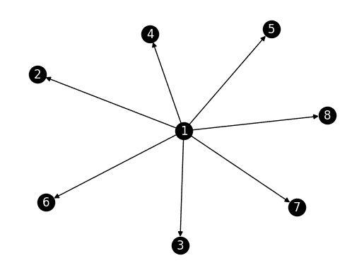
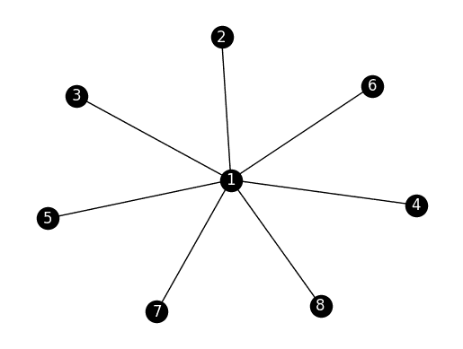

# 7.5\. 应用：图上的随机游走和 PageRank#

> 原文：[`mmids-textbook.github.io/chap07_rwmc/05_pagerank/roch-mmids-rwmc-pagerank.html`](https://mmids-textbook.github.io/chap07_rwmc/05_pagerank/roch-mmids-rwmc-pagerank.html)

正如我们在本章前面提到的，分析随机“扩散”在网络上行走的行者的行为，是一种提取网络结构信息的有力方式。

## 7.5.1\. 图上的随机游走#

我们首先将上一节的理论专门化到图上的随机游走。我们从有向图的情况开始。无向情况导致有用的简化。

**有向情况** 我们首先定义有向图上的随机游走。

**定义** **(有向图上的随机游走)** \(\idx{random walk on a graph}\xdi\) 设 \(G = (V,E)\) 为一个有向图。如果一个顶点没有出边（即以它为起点的边），则向其添加一个自环。\(G\) 上的随机游走是一个时间齐次的马尔可夫链 \((X_t)_{t \geq 0}\)，其状态空间为 \(\mathcal{S} = V\)，转移概率为

\[ p_{i,j} = \P[X_{t+1} = j\,|\,X_{t} = i] = \frac{1}{\delta^+(i)}, \qquad \forall i \in V, j \in N^+(i), \]

其中 \(\delta^+(i)\) 是 \(i\) 的出度，即出边的数量，且 \(N^+(i) = \{j \in V:(i,j) \in E\}\)。\(\natural\)

用话来说，在每一步，我们均匀随机地从当前状态选择一个出边。选择一个自环（即形式为 \((i,i)\) 的边）意味着停留在原地。

设 \(G = (V,E)\) 为一个有 \(n = |V|\) 个顶点的有向图。不失一般性，我们让顶点集为 \([n] = \{1,\ldots,n\}\)。\(G\) 的邻接矩阵表示为 \(A = (a_{i,j})_{i,j}\)。我们定义出度矩阵 \(D\) 为对角矩阵，其对角线元素为 \(\delta^+(i)\)，\(i=1,\ldots,n\)。即，

\[ D = \mathrm{diag}(A \mathbf{1}). \]

**引理** **(关于邻接矩阵的转移矩阵)** \(\idx{transition matrix in terms of adjacency}\xdi\) 满足上述定义条件的 \(G\) 上随机游走的转移矩阵是

\[ P = D^{-1} A. \]

\(\flat\)

*证明:* 该公式立即从定义中得出。\(\square\)

我们将不可约性专门化到有向图上的随机游走的情况。

**引理** **(不可约性)** \(\idx{irreducibility lemma}\xdi\) 设 \(G = (V,E)\) 为一个有向图。\(G\) 上的随机游走是不可约的当且仅当 \(G\) 是强连通的。\(\flat\)

*证明:* 简单地指出，游走的转移图就是 \(G\) 本身。我们之前已经看到，不可约性与转移图是强连通的是等价的。\(\square\)

在无向情况中，随着我们接下来的详细说明，更多的结构会显现出来。

**无向情况** 将之前的定义和观察专门化到无向图，我们得到以下结果。

允许自环将会很方便，即邻接矩阵中的 \(a_{i,i}\) 可以对某些 \(i\) 为 \(1\)。

**定义** **(图上的随机游走)** \(\idx{random walk on a graph}\xdi\) 设 \(G = (V,E)\) 为一个图。如果一个顶点是孤立的，则向其添加一个自环。\(G\) 上的随机游走是一个时间齐次的马尔可夫链 \((X_t)_{t \geq 0}\)，其状态空间为 \(\mathcal{S} = V\)，转移概率为

\[ p_{i,j} = \P[X_{t+1} = j\,|\,X_{t} = i] = \frac{1}{\delta(i)}, \qquad \forall i \in V, j \in N(i) \]

其中 \(\delta(i)\) 是 \(i\) 的度，\(N(i) = \{j \in V: \{i,j\} \in E\}\)。\(\natural\)

正如我们之前所看到的，满足上述定义条件的 \(G\) 上随机游走的转移矩阵是 \(P = D^{-1} A\)，其中 \(D = \mathrm{diag}(A \mathbf{1})\) 是度矩阵。

例如，我们之前已经推导出了在 Petersen 图上随机游走的转移矩阵。

我们将不可约性专门化到图上随机游走的情况。

**引理** **(不可约性)** \(\idx{irreducibility lemma}\xdi\) 设 \(G = (V,E)\) 为一个图。在 \(G\) 上的随机游走是不可约的，当且仅当 \(G\) 是连通的。\(\flat\)

**证明**：我们只证明一个方向。假设 \(G\) 是连通的。那么在任意两个顶点 \(i\) 和 \(j\) 之间存在一个顶点序列 \(z_0 = i, z_1, \ldots, z_r = j\)，使得对于所有 \(\ell = 1,\ldots,r\)，\(\{z_{\ell-1},z_\ell\} \in E\)。特别是，\(a_{z_{\ell-1},z_\ell} > 0\)，这表明 \(p_{z_{\ell-1},z_\ell} > 0\)。这证明了不可约性。\(\square\)

根据前面的引理和**平稳分布的存在性**，如果 \(G\) 是连通的，它就有一个唯一的平稳分布。实际上，我们将在下一小节中看到，计算它是直接的。

**可逆链** 一个马尔可夫链被称为可逆的，如果它满足详细平衡条件。

**定义** **(可逆性)** \(\idx{reversible}\xdi\) 一个转移矩阵 \(P = (p_{i,j})_{i,j=1}^n\) 相对于概率分布 \(\bpi = (\pi_i)_{i=1}^n\) 是可逆的，如果它满足所谓的详细平衡条件

\[ \pi_i p_{i,j} = \pi_j p_{j,i}, \qquad \forall i,j. \]

\(\natural\)

下一个定理解释了为什么这个定义对我们来说是有用的。

**定理** **(可逆性和平稳性)** \(\idx{reversibility and stationarity theorem}\xdi\) 设 \(P = (p_{i,j})_{i,j=1}^n\) 是相对于概率分布 \(\bpi = (\pi_i)_{i=1}^n\) 可逆的转移矩阵。那么 \(\bpi\) 是 \(P\) 的平稳分布。\(\sharp\)

**证明思路**：只需检查定义。

**证明**：对于任何 \(j\)，根据可逆性的定义，

\[ \sum_{i} \pi_i p_{i,j} = \sum_{i} \pi_j p_{j,i} = \pi_j \sum_{i} p_{j,i} = \pi_j, \]

其中我们在最后一个等式中使用了 \(P\) 是随机的。\(\square\)

我们回到图上的随机游走。我们证明它是可逆的，并推导出平稳分布。

**定理** **（图上的平稳分布）** \(\idx{图上的平稳分布}\xdi\) 设\(G = (V,E)\)为一个图。进一步假设\(G\)是连通的。那么\(G\)上随机游走的唯一平稳分布由

\[ \pi_i = \frac{\delta(i)}{\sum_{i \in V} \delta(i)}, \qquad \forall i \in V. \]

\(\sharp\)

*证明思路:* 我们分两部分来证明。首先，我们论证\(\bpi = (\pi_i)_{i \in V}\)确实是一个概率分布。然后我们展示转移矩阵\(P\)相对于\(\bpi\)是可逆的。

*证明:* 我们首先证明\(\bpi = (\pi_v)_{v \in V}\)是一个概率分布。它的条目根据定义是非负的。进一步

\[ \sum_{i \in V} \pi_i = \sum_{i \in V}\frac{\delta(i)}{\sum_{i \in V} \delta(i)} = \frac{\sum_{i \in V} \delta(i)}{\sum_{i \in V} \delta(i)} = 1. \]

剩下的工作是建立可逆性。对于任何\(i, j\)，根据定义，

\[\begin{align*} \pi_i p_{i,j} &= \frac{\delta(i)}{\sum_{i \in V} \delta(i)} \frac{a_{i,j}}{\sum_{k} a_{i,k}}\\ &= \frac{\delta(i)}{\sum_{i \in V} \delta(i)} \frac{a_{i,j}}{\delta(i)}\\ &= \frac{1}{\sum_{i \in V} \delta(i)} a_{i,j}. \end{align*}\]

由于\(a_{j,i} = a_{i,j}\)，改变\(i\)和\(j\)的角色给出相同的表达式。\(\square\)

## 7.5.2\. PageRank#

人们通常对识别网络中的中心节点感兴趣。直观上，它们应该对应于特别有影响力或权威性的实体（例如，根据网络是个人或网页）。有许多方法可以揭示这样的节点。形式上，我们定义了一个[节点中心性](https://en.wikipedia.org/wiki/Centrality)\(\idx{node centrality}\xdi\)的概念，它根据重要性对节点进行排序。在这里，我们关注一个重要的此类概念，PageRank。我们将看到它与图上的随机游走密切相关。

**有向图的中心性概念** 我们从有向情况开始。

设\(G = (V,E)\)为一个有\(n\)个顶点的有向图。我们试图为每个顶点关联一个重要性度量。我们将用这个（行）向量表示：

\[ \mathbf{PR} = (\mathrm{PR}_1, \ldots, \mathrm{PR}_n)^T, \]

其中\(\mathrm{PR}\)代表 PageRank\(\idx{PageRank}\xdi\)。

我们假设每个顶点都与它相关联一定量的影响力，并且它将这种影响力平均分配给它指向的邻居。我们寻求一个满足形式方程的（行）向量\(\mathbf{z} = (z_1,\ldots,z_n)^T\)：

\[ z_i = \sum_{j \in N^-(i)} z_j \frac{1}{\delta^+(j)}, \]

其中\(\delta^+(j) = |N^+(j)|\)是\(j\)的出度，\(N^-(i)\)是具有边\((j,i)\)的顶点\(j\)的集合。注意，我们明确考虑了边的方向。我们认为边\((j,i)\)是\(j\)认为\(i\)有价值的指示。

+   在网络上，例如，一个指向页面的链接表示目标页面有有价值的信息。引用[Wikipedia](https://en.wikipedia.org/wiki/PageRank)：

> PageRank 通过计算指向一个页面的链接数量和质量来确定一个粗略的估计，即该网站的重要性。其基本假设是，更重要的网站更有可能从其他网站获得更多链接。

+   在 X（以前称为 Twitter）上，关注一个账户表明后者是有趣的。

我们已经遇到了这组方程。考虑有向图 \(G\) 上的随机游走（在每个没有出边的顶点上添加一个自环）。也就是说，在每一步，我们随机均匀地选择当前状态的一个出边。然后转移矩阵是

\[ P = D^{-1} A, \]

其中 \(D\) 是对角矩阵，其对角线上的元素是出度。

一个平稳分布 \(\bpi = (\pi_1,\ldots,\pi_n)^T\) 是一个行向量，满足在这种情况下

\[ \pi_i = \sum_{j=1}^n \pi_j p_{j,i} = \sum_{j \in N^-(i)} \pi_j \frac{1}{\delta^+(j)}. \]

因此，\(\mathbf{z}\) 是 \(G\) 上随机游走的平稳分布。

如果图 \(G\) 是强连通的，根据**存在一个平稳分布**，我们知道存在一个唯一的平稳分布。然而，在许多现实世界的有向图中，这个假设并不成立。为了确保仍然可以找到一个有意义的解，我们稍微修改了行走方式。

为了使行走不可约，我们在每一步添加一个小的概率，以均匀选择一个节点着陆。这有时被称为 *传送*。也就是说，我们定义转移矩阵

\[ Q = \alpha P + (1-\alpha) \frac{1}{n} \mathbf{1} \mathbf{1}^T, \]

对于某个 \(\alpha \in (0,1)\)，称为阻尼因子（或传送参数）。一个典型的选择是 \(\alpha = 0.85\)。

注意到 \(\frac{1}{n} \mathbf{1} \mathbf{1}^T\) 是一个随机矩阵。确实，

\[ \frac{1}{n} \mathbf{1} \mathbf{1}^T \mathbf{1} = \frac{1}{n} \mathbf{1} n = \mathbf{1}. \]

因此，\(Q\) 是一个随机矩阵（作为随机矩阵的凸组合）。

此外，\(Q\) 显然是不可约的，因为它严格为正。也就是说，对于任何 \(x, y \in [n]\)，都可以在一步之内从 \(x\) 到达 \(y\)。

\[ Q_{x,y} = \alpha P_{x,y} + (1-\alpha) \frac{1}{n} > 0. \]

这也适用于 \(x = y\)，因此链是懒惰的。

最后，我们定义 \(\mathbf{PR}\) 为 \(Q = (q_{i,j})_{i,j=1}^n\) 的唯一平稳分布，即该方程的解

\[ \mathrm{PR}_i = \sum_{j=1}^n \mathrm{PR}_j \, q_{j,i}, \]

\(\mathbf{PR} \geq 0\)

\[ \sum_{i=1}^n \mathrm{PR}_i = 1. \]

引用[维基百科](https://en.wikipedia.org/wiki/PageRank)：

> 该公式使用了一个随机漫游者的模型，该漫游者在几次点击后到达目标网站，然后切换到随机页面。一个页面的 PageRank 值反映了随机漫游者通过点击链接而停留在该页面的概率。它可以理解为一种马尔可夫链，其中状态是页面，转换是页面之间的链接——所有这些都具有相同的概率。

这里是 PageRank 算法的实现。我们需要一个函数，它接受邻接矩阵 \(A\) 作为输入，并返回相应的转移矩阵 \(P\)。一些顶点没有出边。为了避免除以 \(0\)，我们为所有出度为 \(0\) 的顶点添加一个自环。我们使用 `numpy.fill_diagonal` 来实现这个目的。（下面的 `sinks` 中的布尔值在数值矩阵上下文中使用时自动转换为 `0.0` 和 `1.0`。因此，这实际上只为汇点添加自环——现在没有出边的节点现在有一个指向自己的出边。）

此外，因为邻接矩阵和出度向量具有不同的形状，我们使用 `numpy.newaxis` 将 `out_deg` 转换为列向量，以确保逐列进行除法。（有许多这样做的方法，[但有些比其他方法慢](https://stackoverflow.com/questions/18522216/multiplying-across-in-a-numpy-array)。）

```py
def transition_from_adjacency(A):

    n = A.shape[0]
    sinks = (A @ np.ones(n)) == 0.
    P = A.copy()
    np.fill_diagonal(P, sinks)
    out_deg = P @ np.ones(n)
    P = P / out_deg[:, np.newaxis]

    return P 
```

以下函数添加了阻尼因子。这里 `mu` 将是均匀分布。它将逐行添加到 `P` 中（再次在 `alpha` 缩放后），这次我们不需要重塑 `mu`，因为求和是逐行进行的。

```py
def add_damping(P, alpha, mu):
    Q = alpha * P + (1-alpha) * mu
    return Q 
```

当计算 PageRank 时，我们从左乘。

```py
def pagerank(A, alpha=0.85, max_iter=100):

    n = A.shape[0]
    mu = np.ones(n)/n
    P = transition_from_adjacency(A)
    Q = add_damping(P, alpha, mu)
    v = mu
    for _ in range(max_iter):
        v = v @ Q

    return v 
```

**数值角落：** 让我们尝试一个指向外的星形。在这个过程中，我们检查我们的函数是否按预期工作。

```py
n = 8
G_outstar = nx.DiGraph()
for i in range(1,n):
    G_outstar.add_edge(0,i)

nx.draw_networkx(G_outstar, labels={i: i+1 for i in range(n)}, 
                 node_color='black', font_color='white')
plt.axis('off')
plt.show() 
```



```py
A_outstar = nx.adjacency_matrix(G_outstar).toarray()
print(A_outstar) 
```

```py
[[0 1 1 1 1 1 1 1]
 [0 0 0 0 0 0 0 0]
 [0 0 0 0 0 0 0 0]
 [0 0 0 0 0 0 0 0]
 [0 0 0 0 0 0 0 0]
 [0 0 0 0 0 0 0 0]
 [0 0 0 0 0 0 0 0]
 [0 0 0 0 0 0 0 0]] 
```

我们计算矩阵 \(P\) 和 \(Q\)。我们使用 `numpy.set_printoptions` 来压缩输出。

```py
P_outstar = transition_from_adjacency(A_outstar)
np.set_printoptions(formatter={'float': '{: 0.3f}'.format})
print(P_outstar) 
```

```py
[[ 0.000  0.143  0.143  0.143  0.143  0.143  0.143  0.143]
 [ 0.000  1.000  0.000  0.000  0.000  0.000  0.000  0.000]
 [ 0.000  0.000  1.000  0.000  0.000  0.000  0.000  0.000]
 [ 0.000  0.000  0.000  1.000  0.000  0.000  0.000  0.000]
 [ 0.000  0.000  0.000  0.000  1.000  0.000  0.000  0.000]
 [ 0.000  0.000  0.000  0.000  0.000  1.000  0.000  0.000]
 [ 0.000  0.000  0.000  0.000  0.000  0.000  1.000  0.000]
 [ 0.000  0.000  0.000  0.000  0.000  0.000  0.000  1.000]] 
```

```py
alpha = 0.85
mu = np.ones(n)/n
Q_outstar = add_damping(P_outstar, alpha, mu)
print(Q_outstar) 
```

```py
[[ 0.019  0.140  0.140  0.140  0.140  0.140  0.140  0.140]
 [ 0.019  0.869  0.019  0.019  0.019  0.019  0.019  0.019]
 [ 0.019  0.019  0.869  0.019  0.019  0.019  0.019  0.019]
 [ 0.019  0.019  0.019  0.869  0.019  0.019  0.019  0.019]
 [ 0.019  0.019  0.019  0.019  0.869  0.019  0.019  0.019]
 [ 0.019  0.019  0.019  0.019  0.019  0.869  0.019  0.019]
 [ 0.019  0.019  0.019  0.019  0.019  0.019  0.869  0.019]
 [ 0.019  0.019  0.019  0.019  0.019  0.019  0.019  0.869]] 
```

虽然猜测 \(1\) 是网络中最中心的节点很有诱惑力，但实际上没有边指向它。在这种情况下，星形的中心具有较低的 PageRank 值。

```py
print(pagerank(A_outstar)) 
```

```py
[ 0.019  0.140  0.140  0.140  0.140  0.140  0.140  0.140] 
```

我们然后尝试一个指向内的星形。

```py
n = 8
G_instar = nx.DiGraph()
G_instar.add_node(0)
for i in range(1,n):
    G_instar.add_edge(i,0)

nx.draw_networkx(G_instar, labels={i: i+1 for i in range(n)}, 
                 node_color='black', font_color='white')
plt.axis('off')
plt.show() 
```


```py
A_instar = nx.adjacency_matrix(G_instar).toarray()
print(A_instar) 
```

```py
[[0 0 0 0 0 0 0 0]
 [1 0 0 0 0 0 0 0]
 [1 0 0 0 0 0 0 0]
 [1 0 0 0 0 0 0 0]
 [1 0 0 0 0 0 0 0]
 [1 0 0 0 0 0 0 0]
 [1 0 0 0 0 0 0 0]
 [1 0 0 0 0 0 0 0]] 
```

```py
P_instar = transition_from_adjacency(A_instar)
print(P_instar) 
```

```py
[[ 1.000  0.000  0.000  0.000  0.000  0.000  0.000  0.000]
 [ 1.000  0.000  0.000  0.000  0.000  0.000  0.000  0.000]
 [ 1.000  0.000  0.000  0.000  0.000  0.000  0.000  0.000]
 [ 1.000  0.000  0.000  0.000  0.000  0.000  0.000  0.000]
 [ 1.000  0.000  0.000  0.000  0.000  0.000  0.000  0.000]
 [ 1.000  0.000  0.000  0.000  0.000  0.000  0.000  0.000]
 [ 1.000  0.000  0.000  0.000  0.000  0.000  0.000  0.000]
 [ 1.000  0.000  0.000  0.000  0.000  0.000  0.000  0.000]] 
```

```py
Q_instar = add_damping(P_instar, alpha, mu)
print(Q_instar) 
```

```py
[[ 0.869  0.019  0.019  0.019  0.019  0.019  0.019  0.019]
 [ 0.869  0.019  0.019  0.019  0.019  0.019  0.019  0.019]
 [ 0.869  0.019  0.019  0.019  0.019  0.019  0.019  0.019]
 [ 0.869  0.019  0.019  0.019  0.019  0.019  0.019  0.019]
 [ 0.869  0.019  0.019  0.019  0.019  0.019  0.019  0.019]
 [ 0.869  0.019  0.019  0.019  0.019  0.019  0.019  0.019]
 [ 0.869  0.019  0.019  0.019  0.019  0.019  0.019  0.019]
 [ 0.869  0.019  0.019  0.019  0.019  0.019  0.019  0.019]] 
```

在这种情况下，星形的中心确实具有很高的 PageRank 值。

```py
print(pagerank(A_instar)) 
```

```py
[ 0.869  0.019  0.019  0.019  0.019  0.019  0.019  0.019] 
```

\(\unlhd\)

**无向图的中枢性概念** 我们也可以在无向情况下应用 PageRank\(\idx{PageRank}\xdi\)。

考虑无向图 \(G\) 上的随机游走。也就是说，在每一步，我们随机均匀地选择当前状态的一个邻居。如果需要，为任何孤立顶点添加一个自环。然后转移矩阵是

\[ P = D^{-1} A, \]

其中 \(D\) 是度矩阵，\(A\) 是邻接矩阵。一个稳态分布 \(\bpi = (\pi_1,\ldots,\pi_n)^T\) 是一个行向量，满足在这种情况下

\[ \pi_i = \sum_{j=1}^n \pi_j p_{j,i} = \sum_{j \in N(i)} \pi_j \frac{1}{\delta(j)}. \]

我们已经知道这个方程组的解。在无阻尼的连通情况下，\(G\)上随机游走的唯一平稳分布由下式给出

\[ \pi_i = \frac{\delta(i)}{\sum_{i \in V} \delta(i)}, \qquad \forall i \in V. \]

也就是说，一个节点的中心性与其度数成正比，即它有多少个邻居。考虑到缩放因子，这被称为[度中心性](https://en.wikipedia.org/wiki/Centrality#Degree_centrality)\(\idx{度中心性}\xdi\)。

对于一个可能不连通的一般无向图，我们可以使用阻尼因子来强制不可约性。我们在每一步添加一个小的概率，使得节点均匀选择。也就是说，我们定义转移矩阵

\[ Q = \alpha P + (1-\alpha) \frac{1}{n} \mathbf{1} \mathbf{1}^T, \]

对于某个\(\alpha \in (0,1)\)（称为阻尼因子）。我们定义 PageRank 向量\(\mathbf{PR}\)为\(Q = (q_{i,j})_{i,j=1}^n\)的唯一平稳分布，即

\[ \mathrm{PR}_i = \sum_{j=1}^n \mathrm{PR}_j \, q_{j,i}, \]

有 \(\mathbf{PR} \geq 0\)

\[ \sum_{i=1}^n \mathrm{PR}_i = 1. \]

**数值角落：** 我们再次回顾无向情况下的星形示例。

```py
n = 8
G_star = nx.Graph()
for i in range(1,n):
    G_star.add_edge(0,i)

nx.draw_networkx(G_star, labels={i: i+1 for i in range(n)}, 
                 node_color='black', font_color='white')
plt.axis('off')
plt.show() 
```



我们首先计算不带阻尼的 PageRank 向量。在这里，随机游走是周期性的（为什么？），因此幂迭代可能会失败（试一试！）。相反，我们使用少量阻尼并增加迭代次数。

```py
A_star = nx.adjacency_matrix(G_star).toarray()
print(A_star) 
```

```py
[[0 1 1 1 1 1 1 1]
 [1 0 0 0 0 0 0 0]
 [1 0 0 0 0 0 0 0]
 [1 0 0 0 0 0 0 0]
 [1 0 0 0 0 0 0 0]
 [1 0 0 0 0 0 0 0]
 [1 0 0 0 0 0 0 0]
 [1 0 0 0 0 0 0 0]] 
```

```py
print(pagerank(A_star, max_iter=10000, alpha=0.999)) 
```

```py
[ 0.500  0.071  0.071  0.071  0.071  0.071  0.071  0.071] 
```

中心节点的 PageRank 值确实大约是其他节点的\(7\)倍，正如从它们度数的比例中可以预期的那样。

我们再次尝试，这次增加了更多的阻尼。这次 PageRank 值的比率并不完全等于度数的比率，但中心节点仍然比其他节点具有更高的值。

```py
print(pagerank(A_star)) 
```

```py
[ 0.470  0.076  0.076  0.076  0.076  0.076  0.076  0.076] 
```

\(\unlhd\)

**聊天与学习：** 除了 PageRank 之外，还有许多其他中心性度量，例如中介中心性、接近中心性和特征向量中心性。请你的 AI 聊天机器人解释这些度量，并讨论它们与 PageRank 的相似之处和不同之处。\(\ddagger\)

## 7.5.3\. 个性化 PageRank#

我们回到[MathWorld](https://mathworld.wolfram.com)数据集。回想一下，MathWorld 的每一页都涉及一个特定的数学概念。在一个名为“SEE ALSO”的部分中，列出了其他相关的数学概念，并附有链接到它们的 MathWorld 页面。我们的目标是识别结果图中的“中心”顶点。

**图：** 柏拉图立体（*来源：[Midjourney](https://www.midjourney.com/)*）


\(\bowtie\)

**数值角落：** 我们再次加载数据集。

```py
data_edges = pd.read_csv('mathworld-adjacency.csv')
data_edges.head() 
```

|  | 来自 | 到 |
| --- | --- | --- |
| 0 | 0 | 2 |
| 1 | 1 | 47 |
| 2 | 1 | 404 |
| 3 | 1 | 2721 |
| 4 | 2 | 0 |

第二个文件包含页面的标题。

```py
data_titles = pd.read_csv('mathworld-titles.csv')
data_titles.head() 
```

|  | 标题 |
| --- | --- |
| 0 | 亚历山大的角形球体 |
| 1 | 异域球体 |
| 2 | 安托万角形球体 |
| 3 | 平面 |
| 4 | 普通曲率流形 |

我们通过逐个添加边来构建图。我们首先将`df_edges`转换为 NumPy 数组。

```py
edgelist = data_edges[['from','to']].to_numpy()
print(edgelist) 
```

```py
[[    0     2]
 [    1    47]
 [    1   404]
 ...
 [12361 12306]
 [12361 12310]
 [12361 12360]] 
```

```py
n = 12362
G_mw = nx.empty_graph(n, create_using=nx.DiGraph)
for i in range(edgelist.shape[0]):
    G_mw.add_edge(edgelist[i,0], edgelist[i,1]) 
```

要应用 PageRank，我们构建图的邻接矩阵。我们还定义了一个标题页面向量。

```py
A_mw = nx.adjacency_matrix(G_mw).toarray()
titles_mw = data_titles['title'].to_numpy()
pr_mw = pagerank(A_mw) 
```

我们使用`numpy.argsort`来识别得分最高的页面。我们将其应用于`-pr_mw`以从高到低排序。

```py
top_pages = np.argsort(-pr_mw) 
```

排名前 25 个主题是：

```py
print(titles_mw[top_pages[:25]]) 
```

```py
['Sphere' 'Circle' 'Prime Number' 'Aleksandrov-Čech Cohomology'
 'Centroid Hexagon' 'Group' 'Fourier Transform' 'Tree' 'Splitting Field'
 'Archimedean Solid' 'Normal Distribution' 'Integer Sequence Primes'
 'Perimeter Polynomial' 'Polygon' 'Finite Group' 'Large Number'
 'Riemann Zeta Function' 'Chebyshev Approximation Formula' 'Vector' 'Ring'
 'Fibonacci Number' 'Conic Section' 'Fourier Series' 'Derivative'
 'Gamma Function'] 
```

我们确实得到了数学中的核心概念列表——包括我们之前遇到的一些，例如`正态分布`、`树`、`向量`或`导数`。

\(\unlhd\)

有一种 PageRank 的变体，称为个性化 PageRank（PPR）\(\idx{个性化 PageRank}\xdi\)，旨在根据特定兴趣定制结果。这是通过简单修改算法来实现的。在随机跳跃时，我们不是跳转到均匀随机的页面，而是跳转到任意分布，旨在捕捉某些特定兴趣。例如，在网络的上下文中，这种分布可能是在某人的书签上均匀分布。

我们如下调整`pagerank`：

```py
def ppr(A, mu, alpha=0.85, max_iter=100):
    n = A.shape[0]
    P = transition_from_adjacency(A)
    Q = add_damping(P, alpha, mu)
    v = mu
    for _ in range(max_iter):
        v = v @ Q
    return v 
```

**数值角**：为了测试 PPR，考虑集中在单个主题`正态分布`上的分布。这是主题编号`1270`。

```py
print(np.argwhere(titles_mw == 'Normal Distribution')[0][0]) 
```

```py
1270 
```

```py
mu = np.zeros(n)
mu[1270] = 1 
```

我们现在运行 PPR 并列出前 25 个页面。

```py
ppr_mw = ppr(A_mw, mu)
top_pers_pages = np.argsort(-ppr_mw) 
```

排名前 25 个主题是：

```py
print(titles_mw[top_pers_pages[:25]]) 
```

```py
['Normal Distribution' 'Pearson System' 'Logit Transformation' 'z-Score'
 'Erf' 'Central Limit Theorem' 'Bivariate Normal Distribution'
 'Normal Ratio Distribution' 'Normal Sum Distribution'
 'Normal Distribution Function' 'Gaussian Function'
 'Standard Normal Distribution' 'Normal Product Distribution'
 'Binomial Distribution' 'Tetrachoric Function' 'Ratio Distribution'
 'Kolmogorov-Smirnov Test' 'Box-Muller Transformation' 'Galton Board'
 'Fisher-Behrens Problem' 'Erfc' 'Normal Difference Distribution'
 'Half-Normal Distribution' 'Inverse Gaussian Distribution'
 'Error Function Distribution'] 
```

这确实返回了各种统计概念，尤其是与正态分布相关。

\(\unlhd\)

**聊天与学习** PageRank 算法已被应用于超越网络搜索的各种应用，例如排名科学论文、分析社交网络，甚至排名体育队伍 [[Gle](https://arxiv.org/abs/1407.5107)]。请你的 AI 聊天机器人讨论一些这些应用以及 PageRank 算法如何针对每种情况进行修改。\(\ddagger\)

***自我评估测验*** *(由 Claude、Gemini 和 ChatGPT 协助)*

**1** 考虑以下图上的随机游走：

```py
G = nx.Graph()
G.add_edges_from([(0, 1), (1, 2), (2, 0)]) 
```

这个随机游走的转移矩阵是什么？

a)

\[\begin{split} \begin{bmatrix} 1/3 & 1/3 & 1/3 \\ 1/3 & 1/3 & 1/3 \\ 1/3 & 1/3 & 1/3 \end{bmatrix} \end{split}\]

b)

\[\begin{split} \begin{bmatrix} 0 & 1/2 & 1/2 \\ 1/2 & 0 & 1/2 \\ 1/2 & 1/2 & 0 \end{bmatrix} \end{split}\]

c)

\[\begin{split} \begin{bmatrix} 1 & 0 & 0 \\ 0 & 1 & 0 \\ 0 & 0 & 1 \end{bmatrix} \end{split}\]

d)

\[\begin{split} \begin{bmatrix} 0 & 1 & 0 \\ 0 & 0 & 1 \\ 1 & 0 & 0 \end{bmatrix} \end{split}\]

**2** 在有向图上的随机游走中，从顶点 \(i\) 到顶点 \(j\) 的转移概率由以下公式给出：

a) \(p_{i,j} = \frac{1}{\delta^-(j)}\) 对于所有 \(j \in N^-(i)\)

b) \(p_{i,j} = \frac{1}{\delta^+(j)}\) 对于所有 \(j \in N^+(i)\)

c) \(p_{i,j} = \frac{1}{\delta^-(i)}\) 对于所有 \(j \in N^-(i)\)

d) \(p_{i,j} = \frac{1}{\delta^+(i)}\) 对于所有 \(j \in N^+(i)\)

**3** 有向图上随机游走的转移矩阵 \(P\) 可以用邻接矩阵 \(A\) 表示为：

a) \(P = AD^{-1}\)

b) \(P = A^TD^{-1}\)

c) \(P = D^{-1}A\)

d) \(P = D^{-1}A^T\)

**4** 在无向图上的随机游走中，平稳分布 \(\boldsymbol{\pi}\) 满足：

a) \(\pi_i = \frac{\delta^+(i)}{\sum_{j \in V} \delta^+(j)}\) 对于所有 \(i \in V\)

b) \(\pi_i = \frac{1}{\delta(i)}\) 对于所有 \(i \in V\)

c) \(\pi_i = \frac{1}{|V|}\) 对于所有 \(i \in V\)

d) \(\pi_i = \frac{\delta(i)}{\sum_{j \in V} \delta(j)}\) 对于所有 \(i \in V\)

**5** 个性化 PageRank 与标准 PageRank 的不同之处在于：

a) 它考虑用户的浏览历史

b) 在传送时跳转到非均匀分布

c) 它使用不同的阻尼系数

d) 它只考虑图的一个子集

1 题的答案：b. 理由：每个节点都有 2 度，跳转到每个邻居的概率是 1/2。

2 题的答案：d. 理由：文本中提到，“在每一步，我们均匀随机地从当前状态选择一个出边，”这对应于所有 \(j \in N^+(i)\) 的转移概率 \(p_{i,j} = \frac{1}{\delta^+(i)}\)，其中 \(\delta^+(i)\) 是顶点 \(i\) 的出度，\(N^+(i)\) 是从 \(i\) 出发的边的顶点集。

3 题的答案：c. 理由：文本中提到，“满足上述定义条件的 \(G\) 上的随机游走的转移矩阵是 \(P = D^{-1}A\)，其中 \(D\) 是出度矩阵。”

4 题的答案：d. 理由：文本中提到，“在无阻尼的连通情况下，\(G\) 上随机游走的唯一平稳分布由 \(\pi_i = \frac{\delta(i)}{\sum_{i \in V} \delta(i)}, \forall i \in V\) 给出。”

5 题的答案：b. 理由：文本中提到，“在传送时，我们不是跳转到均匀随机页面，而是跳转到任意分布 \(\boldsymbol{\mu}\)，这个分布旨在捕捉某些特定的兴趣。”

## 7.5.1\. 图上的随机游走#

我们首先将上一节的理论专门化到图上的随机游走。我们首先从有向图的情况开始。无向情况导致有用的简化。

**有向情况** 我们首先定义一个有向图上的随机游走。

**定义** **（有向图上的随机游走）** \(\idx{random walk on a graph}\xdi\) 设 \(G = (V,E)\) 为一个有向图。如果一个顶点没有出边（即以它为源的边），则向它添加一个自环。\(G\) 上的随机游走是一个时间齐次的马尔可夫链 \((X_t)_{t \geq 0}\)，状态空间为 \(\mathcal{S} = V\)，转移概率

\[ p_{i,j} = \P[X_{t+1} = j\,|\,X_{t} = i] = \frac{1}{\delta^+(i)}, \qquad \forall i \in V, j \in N^+(i), \]

\(\delta^+(i)\) 表示顶点 \(i\) 的出度，即出边的数量，且 \(N^+(i) = \{j \in V:(i,j) \in E\}\)。\(\natural\)

用话来说，在每一步，我们从当前状态均匀随机选择一个出边。选择一个自环（即形式为 \((i,i)\) 的边）意味着停留在原地。

设 \(G = (V,E)\) 为一个有向图，有 \(n = |V|\) 个顶点。不失一般性，我们令顶点集为 \([n] = \{1,\ldots,n\}\)。\(G\) 的邻接矩阵表示为 \(A = (a_{i,j})_{i,j}\)。我们定义出度矩阵 \(D\) 为对角矩阵，其对角线元素为 \(\delta^+(i)\)，\(i=1,\ldots,n\)。即，

\[ D = \mathrm{diag}(A \mathbf{1}). \]

**引理** **（邻接矩阵中的转移矩阵）** \(\idx{transition matrix in terms of adjacency}\xdi\) 满足上述定义条件的 \(G\) 上的随机游走的转移矩阵是

\[ P = D^{-1} A. \]

\(\flat\)

*证明* 该公式直接从定义中得出。\(\square\)

我们将不可约性专门化到有向图上的随机游走的情况。

**引理** **（不可约性）** \(\idx{irreducibility lemma}\xdi\) 设 \(G = (V,E)\) 为一个有向图。\(G\) 上的随机游走是不可约的当且仅当 \(G\) 是强连通的。\(\flat\)

*证明* 简单地指出，游走的转移图就是 \(G\) 本身。我们之前已经看到，不可约性与转移图是强连通的等价。\(\square\)

在无向情况下，随着我们接下来详细说明，更多的结构会显现出来。

**无向情况** 将之前的定义和观察专门化到无向图，我们得到以下结果。

将自环允许在内将很方便，即邻接矩阵中的 \(a_{i,i}\) 可以对某些 \(i\) 为 \(1\)。

**定义** **（图上的随机游走）** \(\idx{random walk on a graph}\xdi\) 设 \(G = (V,E)\) 为一个图。如果一个顶点是孤立的，则向其添加一个自环。\(G\) 上的随机游走是一个时间齐次的马尔可夫链 \((X_t)_{t \geq 0}\)，其状态空间为 \(\mathcal{S} = V\)，转移概率

\[ p_{i,j} = \P[X_{t+1} = j\,|\,X_{t} = i] = \frac{1}{\delta(i)}, \qquad \forall i \in V, j \in N(i) \]

其中 \(\delta(i)\) 是 \(i\) 的度数，且 \(N(i) = \{j \in V: \{i,j\} \in E\}\)。\(\natural\)

正如我们之前所看到的，满足上述定义条件的 \(G\) 上随机游走的转移矩阵是 \(P = D^{-1} A\)，其中 \(D = \mathrm{diag}(A \mathbf{1})\) 是度矩阵。

例如，我们之前已经推导出了 Petersen 图上随机游走的转移矩阵。

我们将不可约性专门化到图上的随机游走的情况。

**引理** **（不可约性）** \(\idx{irreducibility lemma}\xdi\) 设 \(G = (V,E)\) 为一个图。\(G\) 上的随机游走是不可约的当且仅当 \(G\) 是连通的。\(\flat\)

**证明**：我们只证明一个方向。假设 \(G\) 是连通的。那么在任意两个顶点 \(i\) 和 \(j\) 之间存在一个顶点序列 \(z_0 = i, z_1, \ldots, z_r = j\)，使得对于所有 \(\ell = 1,\ldots,r\)，\(\{z_{\ell-1},z_\ell\} \in E\)。特别是，\(a_{z_{\ell-1},z_\ell} > 0\)，这表明 \(p_{z_{\ell-1},z_\ell} > 0\)。这证明了不可约性。 \(\square\)

根据前面的引理和**平稳分布的存在性**，如果 \(G\) 是连通的，那么它有一个唯一的平稳分布。实际上，我们将在下一小节中看到，计算它是直接的。

**可逆链** 如果一个马尔可夫链满足详细平衡条件，则称其为可逆链。

**定义** **(可逆性)** \(\idx{reversible}\xdi\) 一个转移矩阵 \(P = (p_{i,j})_{i,j=1}^n\) 如果相对于概率分布 \(\bpi = (\pi_i)_{i=1}^n\) 满足所谓的详细平衡条件，则称其为可逆的

\[ \pi_i p_{i,j} = \pi_j p_{j,i}, \qquad \forall i,j. \]

\(\natural\)

下一个定理解释了为什么这个定义对我们是有用的。

**定理** **(可逆性和平稳性)** \(\idx{reversibility and stationarity theorem}\xdi\) 设 \(P = (p_{i,j})_{i,j=1}^n\) 为一个相对于概率分布 \(\bpi = (\pi_i)_{i=1}^n\) 可逆的转移矩阵。那么 \(\bpi\) 是 \(P\) 的一个平稳分布。 \(\sharp\)

**证明思路**：只需检查定义。

**证明**：对于任何 \(j\)，根据可逆性的定义，

\[ \sum_{i} \pi_i p_{i,j} = \sum_{i} \pi_j p_{j,i} = \pi_j \sum_{i} p_{j,i} = \pi_j, \]

其中在最后一个等式中我们使用了 \(P\) 是随机的。 \(\square\)

我们回到图上的随机游走。我们展示它是可逆的，并推导出平稳分布。

**定理** **(图上的平稳分布)** \(\idx{stationary distribution on a graph}\xdi\) 设 \(G = (V,E)\) 为一个图。进一步假设 \(G\) 是连通的。那么在 \(G\) 上随机游走的唯一平稳分布由下式给出

\[ \pi_i = \frac{\delta(i)}{\sum_{i \in V} \delta(i)}, \qquad \forall i \in V. \]

\(\sharp\)

**证明思路**：我们分两部分来证明。首先，我们论证 \(\bpi = (\pi_i)_{i \in V}\) 确实是一个概率分布。然后我们展示转移矩阵 \(P\) 相对于 \(\bpi\) 是可逆的。

**证明**：我们首先展示 \(\bpi = (\pi_v)_{v \in V}\) 是一个概率分布。它的条目根据定义是非负的。进一步

\[ \sum_{i \in V} \pi_i = \sum_{i \in V}\frac{\delta(i)}{\sum_{i \in V} \delta(i)} = \frac{\sum_{i \in V} \delta(i)}{\sum_{i \in V} \delta(i)} = 1. \]

剩下要建立可逆性。对于任何 \(i, j\)，根据定义，

\[\begin{align*} \pi_i p_{i,j} &= \frac{\delta(i)}{\sum_{i \in V} \delta(i)} \frac{a_{i,j}}{\sum_{k} a_{i,k}}\\ &= \frac{\delta(i)}{\sum_{i \in V} \delta(i)} \frac{a_{i,j}}{\delta(i)}\\ &= \frac{1}{\sum_{i \in V} \delta(i)} a_{i,j}. \end{align*}\]

改变\(i\)和\(j\)的角色会得到相同的表达式，因为\(a_{j,i} = a_{i,j}\)。\(\square\)

## 7.5.2\. PageRank#

人们通常对识别网络中的中心节点感兴趣。直观上，它们应该对应于特别有影响力或权威性的实体（例如，根据网络的不同，可以是个人或网页）。有许多方法可以揭示这样的节点。形式上，定义了一个关于[节点中心性](https://en.wikipedia.org/wiki/Centrality)\(\idx{节点中心性}\xdi\)的概念，该概念按重要性对节点进行排序。在这里，我们关注一个重要的此类概念，即 PageRank。我们将看到它与图上的随机游走密切相关。

**有向图中心性的概念**我们从有向情况开始。

设\(G = (V,E)\)是一个有\(n\)个顶点的有向图。我们试图为每个顶点关联一个重要性度量。我们将用这个（行）向量表示

\[ \mathbf{PR} = (\mathrm{PR}_1, \ldots, \mathrm{PR}_n)^T, \]

其中\(\mathrm{PR}\)代表 PageRank\(\idx{PageRank}\xdi\)。

我们假设每个顶点都与一个与之相关的影响量相关联，并且它将这种影响平均分配给它指向的邻居。我们寻求一个（行）向量\(\mathbf{z} = (z_1,\ldots,z_n)^T\)，它满足以下形式的方程

\[ z_i = \sum_{j \in N^-(i)} z_j \frac{1}{\delta^+(j)}, \]

其中\(\delta^+(j) = |N^+(j)|\)是\(j\)的出度，\(N^-(i)\)是具有边\((j,i)\)的顶点集合\(j\)的集合。注意，我们明确考虑了边的方向。我们认为边\((j,i)\)是\(j\)认为\(i\)有价值的指示。

+   在网络上，例如，指向一个页面的链接表明目标页面有有价值的信息。引用[Wikipedia](https://en.wikipedia.org/wiki/PageRank)：

> PageRank 通过计算指向一个页面的链接数量和质量来确定该网站的大致重要性。其基本假设是，越重要的网站更有可能从其他网站获得更多链接。

+   在 X（以前称为 Twitter）上，关注一个账户表明该账户是有趣的。

我们已经遇到过这组方程。考虑有向图\(G\)上的随机游走（在每个没有出边顶点上添加一个自环）。也就是说，在每一步，我们随机均匀地选择当前状态的一个出边。然后转移矩阵是

\[ P = D^{-1} A, \]

其中\(D\)是对角矩阵，其对角线上的元素是出度。

一个平稳分布\(\bpi = (\pi_1,\ldots,\pi_n)^T\)是一个行向量，满足在这种情况下

\[ \pi_i = \sum_{j=1}^n \pi_j p_{j,i} = \sum_{j \in N^-(i)} \pi_j \frac{1}{\delta^+(j)}. \]

因此，\(\mathbf{z}\)是\(G\)上随机游走的平稳分布。

如果图 \(G\) 是强连通的，我们知道根据*稳态分布的存在性*，存在一个唯一的稳态分布。然而，在许多现实世界的有向图中，这个假设并不成立。为了确保仍然可以找到有意义的解，我们稍微修改了行走。

为了使行走不可约，我们在每一步中添加一个小的概率，使得随机游走能够均匀地到达一个节点。这有时被称为*传送*。也就是说，我们定义转移矩阵

\[ Q = \alpha P + (1-\alpha) \frac{1}{n} \mathbf{1} \mathbf{1}^T, \]

一个典型的选择是 \(\alpha = 0.85\)。

注意到 \(\frac{1}{n} \mathbf{1} \mathbf{1}^T\) 是一个随机矩阵。实际上，

\[ \frac{1}{n} \mathbf{1} \mathbf{1}^T \mathbf{1} = \frac{1}{n} \mathbf{1} n = \mathbf{1}. \]

因此，\(Q\) 是一个随机矩阵（作为随机矩阵的凸组合）。

此外，\(Q\) 显然是不可约的，因为它严格为正。也就是说，对于任意的 \(x, y \in [n]\)，可以从 \(x\) 在一步内到达 \(y\)。

\[ Q_{x,y} = \alpha P_{x,y} + (1-\alpha) \frac{1}{n} > 0. \]

这也适用于 \(x = y\)，因此链是懒惰的。

最后，我们定义 \(\mathbf{PR}\) 为 \(Q = (q_{i,j})_{i,j=1}^n\) 的唯一稳态分布，即

\[ \mathrm{PR}_i = \sum_{j=1}^n \mathrm{PR}_j \, q_{j,i}, \]

对于某个 \(\alpha \in (0,1)\)（称为阻尼因子或传送参数），有 \(\mathbf{PR} \geq 0\)。

\[ \sum_{i=1}^n \mathrm{PR}_i = 1. \]

引用 [维基百科](https://en.wikipedia.org/wiki/PageRank):

> 该公式使用了一个随机游走者的模型，该游走者在多次点击后到达目标网站，然后切换到随机页面。页面的 PageRank 值反映了随机游走者通过点击链接而停留在该页面的概率。它可以理解为一种马尔可夫链，其中状态是页面，转移是页面之间的链接——所有这些都具有相同的概率。

这里是 PageRank 算法的实现。我们需要一个函数，该函数接受邻接矩阵 \(A\) 作为输入，并返回相应的转移矩阵 \(P\)。一些顶点没有出边。为了避免除以 \(0\)，我们为*所有出度为 \(0\) 的顶点*添加一个自环。我们使用 `numpy.fill_diagonal` 来实现这一点。（下面的布尔值在数值矩阵上下文中使用时自动转换为 `0.0` 和 `1.0`。因此，这实际上只为汇点添加自环——现在没有出边的节点现在有一个指向自己的出边。）

此外，由于邻接矩阵和出度向量具有不同的形状，我们使用 `numpy.newaxis` 将 `out_deg` 转换为列向量，以确保除法是[逐列进行的](https://numpy.org/doc/stable/user/basics.broadcasting.html#broadcastable-arrays)。（有几种方法可以做到这一点，[但有些比其他方法慢](https://stackoverflow.com/questions/18522216/multiplying-across-in-a-numpy-array)。）

```py
def transition_from_adjacency(A):

    n = A.shape[0]
    sinks = (A @ np.ones(n)) == 0.
    P = A.copy()
    np.fill_diagonal(P, sinks)
    out_deg = P @ np.ones(n)
    P = P / out_deg[:, np.newaxis]

    return P 
```

以下函数添加了阻尼因子。这里的 `mu` 将是均匀分布。它（在按 `1-alpha` 缩放后）逐行添加到 `P` 中（再次按 `alpha` 缩放）。这次我们不需要重塑 `mu`，因为求和是逐行进行的。

```py
def add_damping(P, alpha, mu):
    Q = alpha * P + (1-alpha) * mu
    return Q 
```

在计算 PageRank 时，我们从左乘。

```py
def pagerank(A, alpha=0.85, max_iter=100):

    n = A.shape[0]
    mu = np.ones(n)/n
    P = transition_from_adjacency(A)
    Q = add_damping(P, alpha, mu)
    v = mu
    for _ in range(max_iter):
        v = v @ Q

    return v 
```

**数值角**: 让我们尝试一个边缘指向外的星星。在这个过程中，我们检查我们的函数是否按预期工作。

```py
n = 8
G_outstar = nx.DiGraph()
for i in range(1,n):
    G_outstar.add_edge(0,i)

nx.draw_networkx(G_outstar, labels={i: i+1 for i in range(n)}, 
                 node_color='black', font_color='white')
plt.axis('off')
plt.show() 
```


```py
A_outstar = nx.adjacency_matrix(G_outstar).toarray()
print(A_outstar) 
```

```py
[[0 1 1 1 1 1 1 1]
 [0 0 0 0 0 0 0 0]
 [0 0 0 0 0 0 0 0]
 [0 0 0 0 0 0 0 0]
 [0 0 0 0 0 0 0 0]
 [0 0 0 0 0 0 0 0]
 [0 0 0 0 0 0 0 0]
 [0 0 0 0 0 0 0 0]] 
```

我们计算矩阵 \(P\) 和 \(Q\)。我们使用 `numpy.set_printoptions` 来压缩输出。

```py
P_outstar = transition_from_adjacency(A_outstar)
np.set_printoptions(formatter={'float': '{: 0.3f}'.format})
print(P_outstar) 
```

```py
[[ 0.000  0.143  0.143  0.143  0.143  0.143  0.143  0.143]
 [ 0.000  1.000  0.000  0.000  0.000  0.000  0.000  0.000]
 [ 0.000  0.000  1.000  0.000  0.000  0.000  0.000  0.000]
 [ 0.000  0.000  0.000  1.000  0.000  0.000  0.000  0.000]
 [ 0.000  0.000  0.000  0.000  1.000  0.000  0.000  0.000]
 [ 0.000  0.000  0.000  0.000  0.000  1.000  0.000  0.000]
 [ 0.000  0.000  0.000  0.000  0.000  0.000  1.000  0.000]
 [ 0.000  0.000  0.000  0.000  0.000  0.000  0.000  1.000]] 
```

```py
alpha = 0.85
mu = np.ones(n)/n
Q_outstar = add_damping(P_outstar, alpha, mu)
print(Q_outstar) 
```

```py
[[ 0.019  0.140  0.140  0.140  0.140  0.140  0.140  0.140]
 [ 0.019  0.869  0.019  0.019  0.019  0.019  0.019  0.019]
 [ 0.019  0.019  0.869  0.019  0.019  0.019  0.019  0.019]
 [ 0.019  0.019  0.019  0.869  0.019  0.019  0.019  0.019]
 [ 0.019  0.019  0.019  0.019  0.869  0.019  0.019  0.019]
 [ 0.019  0.019  0.019  0.019  0.019  0.869  0.019  0.019]
 [ 0.019  0.019  0.019  0.019  0.019  0.019  0.869  0.019]
 [ 0.019  0.019  0.019  0.019  0.019  0.019  0.019  0.869]] 
```

虽然猜测 \(1\) 是网络中最中心的节点很有吸引力，但实际上没有边指向它。在这种情况下，星星的中心具有很低的 PageRank 值。

```py
print(pagerank(A_outstar)) 
```

```py
[ 0.019  0.140  0.140  0.140  0.140  0.140  0.140  0.140] 
```

然后我们尝试一个边缘指向内的星星。

```py
n = 8
G_instar = nx.DiGraph()
G_instar.add_node(0)
for i in range(1,n):
    G_instar.add_edge(i,0)

nx.draw_networkx(G_instar, labels={i: i+1 for i in range(n)}, 
                 node_color='black', font_color='white')
plt.axis('off')
plt.show() 
```


```py
A_instar = nx.adjacency_matrix(G_instar).toarray()
print(A_instar) 
```

```py
[[0 0 0 0 0 0 0 0]
 [1 0 0 0 0 0 0 0]
 [1 0 0 0 0 0 0 0]
 [1 0 0 0 0 0 0 0]
 [1 0 0 0 0 0 0 0]
 [1 0 0 0 0 0 0 0]
 [1 0 0 0 0 0 0 0]
 [1 0 0 0 0 0 0 0]] 
```

```py
P_instar = transition_from_adjacency(A_instar)
print(P_instar) 
```

```py
[[ 1.000  0.000  0.000  0.000  0.000  0.000  0.000  0.000]
 [ 1.000  0.000  0.000  0.000  0.000  0.000  0.000  0.000]
 [ 1.000  0.000  0.000  0.000  0.000  0.000  0.000  0.000]
 [ 1.000  0.000  0.000  0.000  0.000  0.000  0.000  0.000]
 [ 1.000  0.000  0.000  0.000  0.000  0.000  0.000  0.000]
 [ 1.000  0.000  0.000  0.000  0.000  0.000  0.000  0.000]
 [ 1.000  0.000  0.000  0.000  0.000  0.000  0.000  0.000]
 [ 1.000  0.000  0.000  0.000  0.000  0.000  0.000  0.000]] 
```

```py
Q_instar = add_damping(P_instar, alpha, mu)
print(Q_instar) 
```

```py
[[ 0.869  0.019  0.019  0.019  0.019  0.019  0.019  0.019]
 [ 0.869  0.019  0.019  0.019  0.019  0.019  0.019  0.019]
 [ 0.869  0.019  0.019  0.019  0.019  0.019  0.019  0.019]
 [ 0.869  0.019  0.019  0.019  0.019  0.019  0.019  0.019]
 [ 0.869  0.019  0.019  0.019  0.019  0.019  0.019  0.019]
 [ 0.869  0.019  0.019  0.019  0.019  0.019  0.019  0.019]
 [ 0.869  0.019  0.019  0.019  0.019  0.019  0.019  0.019]
 [ 0.869  0.019  0.019  0.019  0.019  0.019  0.019  0.019]] 
```

在这种情况下，星星的中心确实具有很高的 PageRank 值。

```py
print(pagerank(A_instar)) 
```

```py
[ 0.869  0.019  0.019  0.019  0.019  0.019  0.019  0.019] 
```

\(\unlhd\)

**无向图中心性的概念** 我们也可以在无向情况下应用 PageRank\(\idx{PageRank}\xdi\)。

考虑在无向图 \(G\) 上的随机游走。也就是说，在每一步，我们随机均匀地选择当前状态的一个邻居。如果需要，可以向任何孤立顶点添加自环。然后转移矩阵是

\[ P = D^{-1} A, \]

其中 \(D\) 是度矩阵，\(A\) 是邻接矩阵。一个稳态分布 \(\bpi = (\pi_1,\ldots,\pi_n)^T\) 是一个行向量，满足在这种情况下

\[ \pi_i = \sum_{j=1}^n \pi_j p_{j,i} = \sum_{j \in N(i)} \pi_j \frac{1}{\delta(j)}. \]

我们已经知道这个方程组的解。在无阻尼的连通情况下，\(G\) 上随机游走的唯一稳态分布由下式给出

\[ \pi_i = \frac{\delta(i)}{\sum_{i \in V} \delta(i)}, \qquad \forall i \in V. \]

也就是说，一个节点的中心性与其度直接成正比，即它有多少个邻居。考虑到缩放因子，这被称为[度中心性](https://en.wikipedia.org/wiki/Centrality#Degree_centrality)\(\idx{degree centrality}\xdi\)。

对于一个可能不连通的一般无向图，我们可以使用阻尼因子来强制不可约性。我们在每一步都添加一个小的概率，以均匀选择一个节点。也就是说，我们定义转移矩阵

\[ Q = \alpha P + (1-\alpha) \frac{1}{n} \mathbf{1} \mathbf{1}^T, \]

对于某个 \(\alpha \in (0,1)\)，称为阻尼因子。我们定义 PageRank 向量 \(\mathbf{PR}\) 为 \(Q = (q_{i,j})_{i,j=1}^n\) 的唯一平稳分布，即

\[ \mathrm{PR}_i = \sum_{j=1}^n \mathrm{PR}_j \, q_{j,i}, \]

\(\mathbf{PR} \geq 0\)

\[ \sum_{i=1}^n \mathrm{PR}_i = 1. \]

**数值角:** 我们重新审视无向情况下的星形示例。

```py
n = 8
G_star = nx.Graph()
for i in range(1,n):
    G_star.add_edge(0,i)

nx.draw_networkx(G_star, labels={i: i+1 for i in range(n)}, 
                 node_color='black', font_color='white')
plt.axis('off')
plt.show() 
```


我们首先计算不带阻尼的 PageRank 向量。在这里，随机游走是周期的（为什么？），所以幂迭代可能会失败（试试看！）。相反，我们使用少量的阻尼并增加迭代次数。

```py
A_star = nx.adjacency_matrix(G_star).toarray()
print(A_star) 
```

```py
[[0 1 1 1 1 1 1 1]
 [1 0 0 0 0 0 0 0]
 [1 0 0 0 0 0 0 0]
 [1 0 0 0 0 0 0 0]
 [1 0 0 0 0 0 0 0]
 [1 0 0 0 0 0 0 0]
 [1 0 0 0 0 0 0 0]
 [1 0 0 0 0 0 0 0]] 
```

```py
print(pagerank(A_star, max_iter=10000, alpha=0.999)) 
```

```py
[ 0.500  0.071  0.071  0.071  0.071  0.071  0.071  0.071] 
```

中心节点的 PageRank 值确实大约是其他节点的 7 倍，这可以从它们的度数比中预期到。

我们再次尝试使用更多的阻尼。这次 PageRank 值的比率并不完全与度数的比率相同，但中心节点仍然比其他节点具有更高的值。

```py
print(pagerank(A_star)) 
```

```py
[ 0.470  0.076  0.076  0.076  0.076  0.076  0.076  0.076] 
```

\(\unlhd\)

**聊天与学习:** 除了 PageRank 之外，还有许多其他中心性度量，如介数中心性、接近中心性和特征向量中心性。请你的 AI 聊天机器人解释这些度量，并讨论它们与 PageRank 的相似之处和不同之处。 \(\ddagger\)

## 7.5.3\. 个性化 PageRank#

我们回到 [MathWorld](https://mathworld.wolfram.com) 数据集。回想一下，MathWorld 的每一页都涉及特定的数学概念。在一个名为“也见”的部分，列出了其他相关的数学概念，并附有链接到它们的 MathWorld 页面。我们的目标是识别结果图中的“中心”顶点。

**图:** 柏拉图立体 (*来源:* 使用 [Midjourney](https://www.midjourney.com/) 制作)


\(\bowtie\)

**数值角:** 我们再次加载数据集。

```py
data_edges = pd.read_csv('mathworld-adjacency.csv')
data_edges.head() 
```

|  | 从 | 到 |
| --- | --- | --- |
| 0 | 0 | 2 |
| 1 | 1 | 47 |
| 2 | 1 | 404 |
| 3 | 1 | 2721 |
| 4 | 2 | 0 |

第二个文件包含页面的标题。

```py
data_titles = pd.read_csv('mathworld-titles.csv')
data_titles.head() 
```

|  | 标题 |
| --- | --- |
| 0 | 亚历山大角形球体 |
| 1 | 异域球体 |
| 2 | 安托万角形球体 |
| 3 | 平面 |
| 4 | 普通多面体 |

我们通过逐个添加边来构建图。我们首先将 `df_edges` 转换为 NumPy 数组。

```py
edgelist = data_edges[['from','to']].to_numpy()
print(edgelist) 
```

```py
[[    0     2]
 [    1    47]
 [    1   404]
 ...
 [12361 12306]
 [12361 12310]
 [12361 12360]] 
```

```py
n = 12362
G_mw = nx.empty_graph(n, create_using=nx.DiGraph)
for i in range(edgelist.shape[0]):
    G_mw.add_edge(edgelist[i,0], edgelist[i,1]) 
```

为了应用 PageRank，我们构建图的邻接矩阵。我们还定义了一个标题页向量。

```py
A_mw = nx.adjacency_matrix(G_mw).toarray()
titles_mw = data_titles['title'].to_numpy()
pr_mw = pagerank(A_mw) 
```

我们使用 `numpy.argsort`（[链接](https://numpy.org/doc/stable/reference/generated/numpy.argsort.html)）来识别得分最高的页面。我们将其应用于 `-pr_mw` 以从高到低排序。

```py
top_pages = np.argsort(-pr_mw) 
```

前 25 个主题是：

```py
print(titles_mw[top_pages[:25]]) 
```

```py
['Sphere' 'Circle' 'Prime Number' 'Aleksandrov-Čech Cohomology'
 'Centroid Hexagon' 'Group' 'Fourier Transform' 'Tree' 'Splitting Field'
 'Archimedean Solid' 'Normal Distribution' 'Integer Sequence Primes'
 'Perimeter Polynomial' 'Polygon' 'Finite Group' 'Large Number'
 'Riemann Zeta Function' 'Chebyshev Approximation Formula' 'Vector' 'Ring'
 'Fibonacci Number' 'Conic Section' 'Fourier Series' 'Derivative'
 'Gamma Function'] 
```

我们确实得到了数学中的核心概念列表——包括我们之前遇到的一些，如 `正态分布`、`树`、`向量` 或 `导数`。

\(\unlhd\)

存在一种 PageRank 的变体，称为个性化 PageRank（PPR）\(\idx{个性化 PageRank}\xdi\)，旨在根据特定兴趣定制结果。这是通过简单修改算法来实现的。在随机跳跃时，我们不是跳转到均匀随机的页面，而是跳转到任意分布，旨在捕捉某些特定兴趣。例如，在网页的上下文中，这种分布可能是在某人的书签上均匀分布。

我们将 `pagerank` 调整如下：

```py
def ppr(A, mu, alpha=0.85, max_iter=100):
    n = A.shape[0]
    P = transition_from_adjacency(A)
    Q = add_damping(P, alpha, mu)
    v = mu
    for _ in range(max_iter):
        v = v @ Q
    return v 
```

**数值角落**：为了测试 PPR，考虑集中在单个主题 `正态分布` 上的分布。这是主题编号 `1270`。

```py
print(np.argwhere(titles_mw == 'Normal Distribution')[0][0]) 
```

```py
1270 
```

```py
mu = np.zeros(n)
mu[1270] = 1 
```

我们现在运行 PPR 并列出前 25 页。

```py
ppr_mw = ppr(A_mw, mu)
top_pers_pages = np.argsort(-ppr_mw) 
```

前 25 个主题是：

```py
print(titles_mw[top_pers_pages[:25]]) 
```

```py
['Normal Distribution' 'Pearson System' 'Logit Transformation' 'z-Score'
 'Erf' 'Central Limit Theorem' 'Bivariate Normal Distribution'
 'Normal Ratio Distribution' 'Normal Sum Distribution'
 'Normal Distribution Function' 'Gaussian Function'
 'Standard Normal Distribution' 'Normal Product Distribution'
 'Binomial Distribution' 'Tetrachoric Function' 'Ratio Distribution'
 'Kolmogorov-Smirnov Test' 'Box-Muller Transformation' 'Galton Board'
 'Fisher-Behrens Problem' 'Erfc' 'Normal Difference Distribution'
 'Half-Normal Distribution' 'Inverse Gaussian Distribution'
 'Error Function Distribution'] 
```

这确实返回了各种统计概念，尤其是与正态分布相关的内容。

\(\unlhd\)

**CHAT & LEARN** PageRank 算法已被应用于超越网页搜索的各种应用，例如排名科学论文、分析社交网络，甚至排名运动队 [[Gle](https://arxiv.org/abs/1407.5107)]。请向您喜欢的 AI 聊天机器人询问一些这些应用以及 PageRank 算法如何针对每种情况进行修改 \(\ddagger\)

***自我评估测验*** *(由 Claude、Gemini 和 ChatGPT 协助)*

**1** 考虑以下图上的随机游走：

```py
G = nx.Graph()
G.add_edges_from([(0, 1), (1, 2), (2, 0)]) 
```

这个随机游走的转移矩阵是什么？

a)

\[\begin{split} \begin{bmatrix} 1/3 & 1/3 & 1/3 \\ 1/3 & 1/3 & 1/3 \\ 1/3 & 1/3 & 1/3 \end{bmatrix} \end{split}\]

b)

\[\begin{split} \begin{bmatrix} 0 & 1/2 & 1/2 \\ 1/2 & 0 & 1/2 \\ 1/2 & 1/2 & 0 \end{bmatrix} \end{split}\]

c)

\[\begin{split} \begin{bmatrix} 1 & 0 & 0 \\ 0 & 1 & 0 \\ 0 & 0 & 1 \end{bmatrix} \end{split}\]

d)

\[\begin{split} \begin{bmatrix} 0 & 1 & 0 \\ 0 & 0 & 1 \\ 1 & 0 & 0 \end{bmatrix} \end{split}\]

**2** 在有向图上的随机游走中，从顶点 \(i\) 到顶点 \(j\) 的转移概率由以下公式给出：

a) \(p_{i,j} = \frac{1}{\delta^-(j)}\) 对于所有 \(j \in N^-(i)\)

b) \(p_{i,j} = \frac{1}{\delta^+(j)}\) 对于所有 \(j \in N^+(i)\)

c) \(p_{i,j} = \frac{1}{\delta^-(i)}\) 对于所有 \(j \in N^-(i)\)

d) \(p_{i,j} = \frac{1}{\delta^+(i)}\) 对于所有 \(j \in N^+(i)\)

**3** 有向图上随机游走的转移矩阵 \(P\) 可以用邻接矩阵 \(A\) 表示为：

a) \(P = AD^{-1}\)

b) \(P = A^TD^{-1}\)

c) \(P = D^{-1}A\)

d) \(P = D^{-1}A^T\)

**4** 在无向图上的随机游走中，平稳分布 \(\boldsymbol{\pi}\) 满足：

a) \(\pi_i = \frac{\delta^+(i)}{\sum_{j \in V} \delta^+(j)}\) 对于所有 \(i \in V\)

b) \(\pi_i = \frac{1}{\delta(i)}\) 对于所有 \(i \in V\)

c) \(\pi_i = \frac{1}{|V|}\) 对于所有 \(i \in V\)

d) \(\pi_i = \frac{\delta(i)}{\sum_{j \in V} \delta(j)}\) 对于所有 \(i \in V\)

**5** 个人化 PageRank 与标准 PageRank 的不同之处在于：

a) 它考虑用户的浏览历史

b) 传送时跳转到非均匀分布

c) 它使用不同的阻尼因子

d) 它只考虑图的一个子集

1 题的答案：b. 理由：每个节点都有 2 度，转到每个邻居的概率是 1/2。

2 题的答案：d. 理由：文本中提到，“用词来说，在每一步，我们从当前状态均匀随机选择一个出边，”这对应于所有 \(j \in N^+(i)\) 的转移概率 \(p_{i,j} = \frac{1}{\delta^+(i)}\)，其中 \(\delta^+(i)\) 是顶点 \(i\) 的出度，\(N^+(i)\) 是从 \(i\) 出边的顶点集。

3 题的答案：c. 理由：文本中提到，“满足上述定义条件的 \(G\) 上的随机游走转移矩阵是 \(P = D^{-1}A\)，其中 \(D\) 是出度矩阵。”

4 题的答案：d. 理由：文本中提到，“在无阻尼的连通情况下，\(G\) 上随机游走的唯一稳态分布由 \(\pi_i = \frac{\delta(i)}{\sum_{i \in V} \delta(i)}, \forall i \in V\) 给出。”

5 题的答案：b. 理由：文本中提到，“在传送时，我们不是跳转到均匀随机页面，而是跳转到任意分布 \(\boldsymbol{\mu}\)，这个分布旨在捕捉一些特定的兴趣。”
