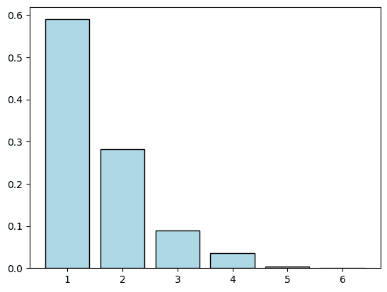
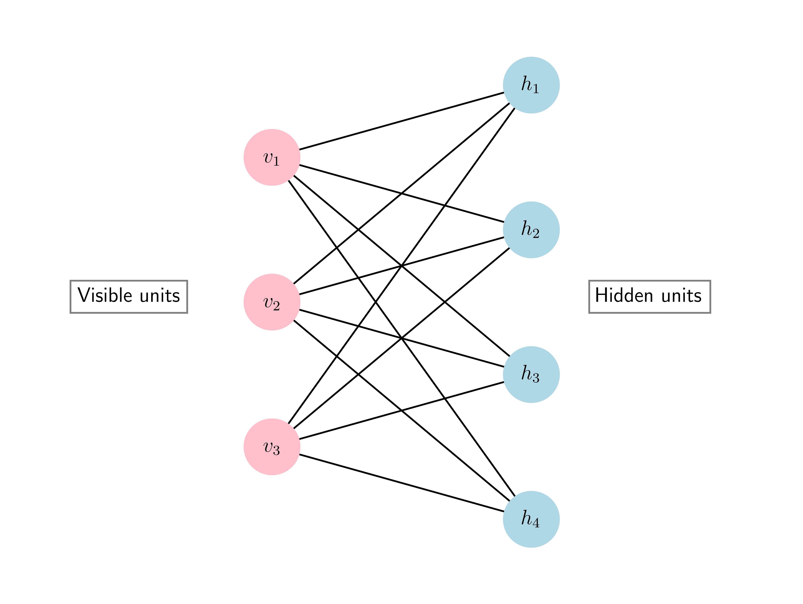
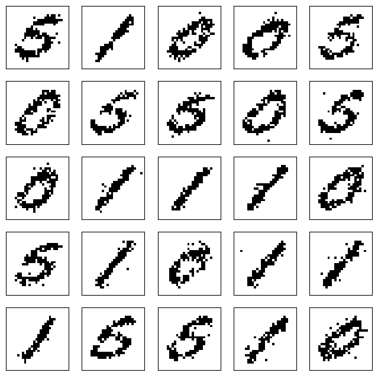

# 7.6\. 进一步应用：吉布斯采样和生成图像

> 原文：[`mmids-textbook.github.io/chap07_rwmc/06_gibbs/roch-mmids-rwmc-gibbs.html`](https://mmids-textbook.github.io/chap07_rwmc/06_gibbs/roch-mmids-rwmc-gibbs.html)

在本节中，我们推导出马尔可夫链的一个重要应用，称为马尔可夫链蒙特卡洛（MCMC）。我们将它专门化到吉布斯采样，并应用于使用受限玻尔兹曼机（RBM）生成手写数字。

## 7.6.1\. 马尔可夫链蒙特卡洛（MCMC）#

假设我们感兴趣的是从目标分布 $\bpi = (\pi_i)_{i \in \S}$ 在集合 $\S$ 上生成样本。我们之前已经做过。例如，我们生成了高斯混合的样本来测试不同维度下的 $k$ 均值聚类。还有更多应用。一个典型应用是估计函数 $f$ 在 $\bpi$ 下的均值：生成 $n$ 个独立的样本 $Z_1,\ldots,Z_n$，所有样本都按照 $\pi$ 分布，然后计算

$$ \frac{1}{n} \sum_{i=1}^n f(Z_i), $$

这根据大数定律，近似等于 $\E[f(Z_1)]$，前提是 $n$ 足够大。此外，这类问题在 [贝叶斯推断](https://en.wikipedia.org/wiki/Bayesian_inference) 中扮演着重要角色。

**从简单分布中进行采样** 当 $\bpi$ 是标准分布或 $\S$ 相对较小时，这可以通过使用随机数生成器有效地完成，就像我们之前做的那样。

**数值角落**：回想一下这是如何工作的。我们首先初始化随机数生成器，并使用 `seed` 来保证可重复性。

```py
seed = 535
rng = np.random.default_rng(seed) 
```

要生成，比如说 $1000$ 个多元正态分布的样本，比如说均值为 $(0, 0)$ 和协方差 $\begin{pmatrix}5 & 0\\0 & 1\end{pmatrix}$，我们使用 `numpy.random.Generator.multivariate_normal`（https://numpy.org/doc/stable/reference/random/generated/numpy.random.Generator.multivariate_normal.html#numpy.random.Generator.multivariate_normal）如下。下面的 `.T` 将输出转置，将 $x$ 和 $y$ 坐标分别分离到单独的数组中。

`rng.multivariate_normal(mean, cov, 1000)` 返回一个 `(1000, 2)` 的数组，其中每一行是一个样本：

```py
[[x1, y1],
 [x2, y2],
 [x3, y3],
 ...
 [x1000, y1000]] 
```

`.T` 将其转置为 `(2, 1000)`：

```py
[[x1, x2, x3, ..., x1000],
 [y1, y2, y3, ..., y1000]] 
```

现在 `x, y = ...` 解包这两行，给你：

+   `x = [x1, x2, x3, ..., x1000]` （所有 x 坐标）

+   `y = [y1, y2, y3, ..., y1000]` （所有 y 坐标）

```py
mean = np.array([0., 0.])
cov = np.array([[5., 0.], [0., 1.]])
x, y = rng.multivariate_normal(mean, cov, 1000).T 
```

计算每个分量的均值，我们得到：

```py
print(np.mean(x)) 
```

```py
-0.035322561120667575 
```

```py
print(np.mean(y)) 
```

```py
-0.009499619370100139 
```

这与预期的答案有些接近：$(0,0)$。

使用更多的样本数量，比如 $10,000$，可以得到更好的结果。

```py
x, y = rng.multivariate_normal(mean, cov, 10000).T
print(np.mean(x))
print(np.mean(y)) 
```

```py
-0.0076273930440971215
-0.008874190869155479 
```

从有限集合上的任意分布进行采样也很简单——只要集合不是太大。这可以使用 `numpy.random.Generator.choice`（https://numpy.org/doc/stable/reference/random/generated/numpy.random.Generator.choice.html）来完成。借用文档中的例子，以下：

```py
aa_milne_arr = ['pooh', 'rabbit', 'piglet', 'christopher']
print(rng.choice(aa_milne_arr, 5, p=[0.5, 0.1, 0.1, 0.3])) 
```

```py
['pooh' 'pooh' 'piglet' 'christopher' 'piglet'] 
```

从集合 $\S = \{\tt{pooh}, \tt{rabbit}, \tt{piglet}, \tt{christopher}\}$ 中生成 $5$ 个样本，相应的概率为 $0.5, 0.1, 0.1, 0.3$。

但当状态空间 $\S$ 非常大时，这可能并不实用。作为一个例子，在本节的后面，我们将学习一个“现实”的手写数字分布。我们将使用 [MNIST 数据集](https://en.wikipedia.org/wiki/MNIST_database) 来实现这一点。

<details class="hide above-input"><summary aria-label="Toggle hidden content">显示代码单元格源代码 隐藏代码单元格源代码</summary>

```py
from torchvision import datasets, transforms
from torch.utils.data import DataLoader

mnist = datasets.MNIST(root='./data', train=True, 
                       download=True, transform=transforms.ToTensor())
train_loader = DataLoader(mnist, batch_size=len(mnist), shuffle=False)

imgs, labels = next(iter(train_loader))
imgs = imgs.squeeze().numpy()
labels = labels.numpy()
imgs = np.round(imgs) 
```</details>

每个图像是 $28 \times 28$，所以（黑白）像素的总数是 $784$。

```py
nx_pixels, ny_pixels = imgs[0].shape
nx_pixels, ny_pixels 
```

```py
(28, 28) 
```

```py
n_pixels = nx_pixels * ny_pixels
n_pixels 
```

```py
784 
```

要指定所有可能的大小为该尺寸的黑白图像的分布，从原则上讲，我们需要为大量状态分配一个概率。我们在这里的空间是 $\S = \{0,1\}^{784}$，想象 $0$ 编码白色，$1$ 编码黑色，并且我们以某种任意方式对像素进行了排序。这个空间有多大？

答案：$2^{784}$。

或者，在基 $10$ 中，我们计算 $\log_{10}(2^{784})$，结果是：

```py
784 * np.log(2) / np.log(10) 
```

```py
236.00751660056122 
```

因此，总数略大于 $10^{236}$。

这对于直接插入 `rng.choice` 来说是太大了！

$\unlhd$

那么接下来该如何进行呢？我们将使用马尔可夫链，具体内容将在下文中详细说明。

**一般设置** MCMC（马尔可夫链蒙特卡洛）背后的思想很简单。要从 $\bpi$ 中生成样本，使用一个马尔可夫链 $(X_t)_{t \geq 0}$，其 *平稳分布* 正是 $\bpi$。实际上，根据 *收敛到平衡定理*，我们知道如果链是不可约的且非周期的，那么当 $t$ 足够大时，时间 $t$ 的分布将接近 $\bpi$；这对于任何初始分布都成立。重复多次会产生许多独立、近似的 $\bpi$ 样本。

现在的问题是：

1.  如何构建一个平稳分布为给定目标分布 $\bpi$ 的转移矩阵 $P$？

1.  如何确保这个马尔可夫链相对容易模拟？

关于第一个问题，我们已经看到如何计算转移矩阵的平稳分布（假设它存在且唯一）。我们如何逆转这个过程？注意一个困难：许多转移矩阵可以具有相同的平稳分布。这实际上是一个祝福，因为它为设计一个“好”的马尔可夫链提供了空间。

**知识检查：** 构建两个具有均匀平稳分布的、状态为 $2$ 的不同转移矩阵。 $\checkmark$

关于第二个问题，请注意，一个显然的满足第一个问题的链是忽略当前状态，并根据 $\bpi$ 选择下一个状态的链。我们已经看到这可能会是一个有问题的选择。

**知识检查：** 证明这个链具有所需的平稳分布。 $\checkmark$

**Metropolis-Hastings** 我们开发了一种标准技术，帮助回答这两个问题。它被称为 [Metropolis-Hastings 算法](https://en.wikipedia.org/wiki/Metropolis%E2%80%93Hastings_algorithm)$\idx{Metropolis-Hastings}\xdi$。它包括两个步骤。我们假设 $\bpi > 0$，即 $\pi_i > 0, \forall i \in \S$。

*建议分布:* 我们首先定义一个建议链，即在 $\S$ 空间上的一个转移矩阵 $Q$。这个链 *不需要* 具有稳态分布 $\bpi$。但它通常是易于模拟的链。另一种思考这个链的方式是，对于每个状态 $x \in \S$，我们都有一个建议分布 $Q(x,\,\cdot\,)$ 用于下一个状态。

例如，在 $28 \times 28$ 灰度图像的空间中，我们可能会随机均匀地选择一个像素，并以 $1/2$ 的概率翻转其值。

**知识检查:** 在前面的例子中，稳态分布是什么？

a) 全白概率为 $1/2$，全黑概率为 $1/2$。

b) 均匀分布。

c) 太复杂而无法计算。

d) 稳态分布是什么？

$\checkmark$

*Hastings 修正:* $\idx{Hastings correction}\xdi$ 在每一步，我们首先根据 $Q$ 选择一个状态，给定当前状态。然后根据一个特别定义的概率接受或拒绝这次移动，这个概率依赖于 $Q$ 以及 $\bpi$。这就是目标分布 $\bpi$ 进入画面的时候，拒绝概率被选择以确保新链具有正确的稳态分布，正如我们稍后将会看到的。但首先我们定义完整的算法。

形式上，算法如下。设 $x_0 \in \S$ 为一个任意起点，并设置 $X_0 := x_0$。

在每个时间 $t \geq 1$：

1- 根据分布 $Q(X_{t-1}, \,\cdot\,)$ 选择一个状态 $Y$，即 $Q$ 的第 $X_{t-1}$ 行。

2- 以概率

$$ \min\left\{1, \frac{\pi_{Y}}{\pi_{X_{t-1}}} \frac{Q(Y, X_{t-1})}{Q(X_{t-1}, Y)} \right\} $$

我们将 $X_{t} := Y$（即，我们接受这次移动），否则我们将 $X_{t} := X_{t-1}$（即，我们拒绝这次移动）。

**知识检查:** 我们应该担心分母 $\pi_{X_{t-1}} Q(X_{t-1}, Y)$ 为 $0$ 吗？ $\checkmark$

我们做出三个观察：

1.  用 $1$ 取最小值确保接受概率确实在 $0$ 和 $1$ 之间。

1.  我们只需要知道 $\bpi$ 的一个缩放因子，因为链只依赖于比率 $\frac{\pi_{Y}}{\pi_{X_{t-1}}}$。缩放因子会相互抵消。这在 MCMC 的许多应用中变得至关重要。我们将在下一小节中看到一个例子。

1.  如果 $Q$ 是对称的，即 $Q(x,y) = Q(y,x)$ 对于所有 $x, y \in \S$ 都成立，那么比率 $\frac{Q(Y, X_{t-1})}{Q(X_{t-1}, Y)}$ 就是 $1$，从而得到一个更简单的接受概率公式。特别是，在这种情况下，向具有更大概率的 $\bpi$ 状态转移总是被接受。

**数值角落：** 假设 $\S = \{1,\cdots, n\} = [n]$ 对于某个正整数 $n$，且 $\bpi$ 与均值为 $\lambda > 0$ 的泊松分布成比例。也就是说，

$$ \pi_i = C e^{-\lambda} \frac{\lambda^i}{i!}, \quad \forall i \in \S $$

对于某个常数 $C$，使得 $\sum_{i=1}^{n} \pi_i = 1$。回想一下，我们不需要确定 $C$，因为根据前面的评论，我们只需要知道目标分布的缩放因子。

要应用 Metropolis-Hastings 算法，我们需要一个提议链。考虑以下选择。对于每个 $1 < i < n$，以 $1/2$ 的概率移动到 $i+1$ 或 $i-1$。对于 $i=1$（分别 $i = n$），以 $1/2$ 的概率移动到 $2$（分别 $n-1$），否则保持在当前位置。例如，如果 $n = 4$，那么

$$\begin{split} Q = \begin{pmatrix} 1/2 & 1/2 & 0 & 0\\ 1/2 & 0 & 1/2 & 0\\ 0 & 1/2 & 0 & 1/2\\ 0 & 0 & 1/2 & 1/2 \end{pmatrix}, \end{split}$$

这确实是一个随机矩阵。它也是对称的，所以根据前面的评论，它不会进入接受概率。

为了计算接受概率，我们只需要考虑相邻整数对，因为它们是唯一在 $Q$ 下具有非零概率的。考虑状态 $1 < i < n$。观察如下

$$ \frac{\pi_{i+1}}{\pi_{i}} = \frac{C e^{-\lambda} \lambda^{i+1}/(i+1)!}{C e^{-\lambda} \lambda^{i}/i!} = \frac{\lambda}{i+1} $$

因此，移动到 $i+1$ 的概率为

$$ \frac{1}{2} \min\left\{1, \frac{\lambda}{i+1}\right\}, $$

其中包含提议分布中的 $1/2$ 因子。同样，可以检查（试一试！）移动到 $i-1$ 发生的概率

$$ \frac{1}{2} \min\left\{1, \frac{i}{\lambda}\right\}. $$

我们以概率 $1 - \frac{1}{2} \min\left\{1, \frac{\lambda}{i+1}\right\} - \frac{1}{2} \min\left\{1, \frac{i}{\lambda}\right\}$ 留在 $i$。 (为什么这保证了它是一个概率？)

对于 $i = 1, n$ 也适用相同的公式。（试一试！）

我们准备应用 Metropolis-Hastings 算法。

```py
def mh_transition_poisson(lmbd, n):
    P = np.zeros((n,n))
    for idx in range(n):
        i = idx + 1 # index starts at 0 rather than 1
        if (i > 1 and i < n):
            P[idx, idx+1] = (1/2) * np.min(np.array([1, lmbd/(i+1)]))
            P[idx, idx-1] = (1/2) * np.min(np.array([1, i/lmbd]))
            P[idx, idx] = 1 - P[idx, idx+1] - P[idx, idx-1]
        elif i == 1:
            P[idx, idx+1] = (1/2) * np.min(np.array([1, lmbd/(i+1)]))
            P[idx, idx] = 1 - P[idx, idx+1]
        elif i == n:
            P[idx, idx-1] = (1/2) * np.min(np.array([1, i/lmbd]))
            P[idx, idx] = 1 - P[idx, idx-1]
    return P 
```

取 $\lambda = 1$ 和 $n = 6$。我们得到以下转移矩阵。

```py
lmbd = 1
n = 6 
```

```py
P = mh_transition_poisson(lmbd, n)
print(P) 
```

```py
[[0.75       0.25       0\.         0\.         0\.         0\.        ]
 [0.5        0.33333333 0.16666667 0\.         0\.         0\.        ]
 [0\.         0.5        0.375      0.125      0\.         0\.        ]
 [0\.         0\.         0.5        0.4        0.1        0\.        ]
 [0\.         0\.         0\.         0.5        0.41666667 0.08333333]
 [0\.         0\.         0\.         0\.         0.5        0.5       ]] 
```

**尝试一下！** 不使用显式循环，通过使用 [广播和向量化](https://numpy.org/doc/stable/user/basics.broadcasting.html) 重写函数 `mh_transition_poisson`。（[在 Colab 中打开](https://colab.research.google.com/github/MMiDS-textbook/MMiDS-textbook.github.io/blob/main/just_the_code/roch_mmids_chap_prob_notebook.ipynb)）

我们使用上一节中的模拟器。我们从均匀分布开始，进行 $100$ 次步骤。

```py
seed = 535
rng = np.random.default_rng(seed)

mu = np.ones(n) / n
T = 100
X = mmids.SamplePath(rng, mu, P, T) 
```

我们的样本是轨迹的最终状态。

```py
X[T] 
```

```py
2.0 
```

我们重复 $1000$ 次。

```py
N_samples = 1000 # number of repetitions

freq_z = np.zeros(n) # init of frequencies sampled
for i in range(N_samples):
    X = mmids.SamplePath(rng, mu, P, T)
    freq_z[int(X[T])-1] += 1 # adjust for index starting at 0

freq_z = freq_z/N_samples 
```

我们绘制频率图。

<details class="hide above-input"><summary aria-label="Toggle hidden content">显示代码单元格源代码 隐藏代码单元格源代码</summary>

```py
plt.bar(range(1,n+1),freq_z, color='lightblue', edgecolor='black')
plt.show() 
```</details> 

如果我们增加参数 $\lambda$（这并不是平均值；为什么？），你预计样本分布会发生什么变化？

**尝试一下！** 重新进行模拟，但这次实现一个通用的 Metropolis-Hastings 算法而不是直接指定转移矩阵。也就是说，实现一个任意 $\bpi$ 和 $Q$ 的算法。假设状态空间是 $[n]$。([在 Colab 中打开](https://colab.research.google.com/github/MMiDS-textbook/MMiDS-textbook.github.io/blob/main/just_the_code/roch_mmids_chap_prob_notebook.ipynb))

$\unlhd$

剩下的任务是证明 $\bpi$ 是 Metropolis-Hastings 算法的平稳分布。我们限制自己考虑对称情况，即对于所有 $x,y$，$Q(x,y) = Q(y,x)$。

**定理** **(Metropolis-Hastings 的正确性)** $\idx{Metropolis-Hastings 的正确性}\xdi$ 考虑在有限状态空间 $\S$ 上具有目标分布 $\bpi$ 和对称提议链 $Q$ 的 Metropolis-Hastings 算法。进一步假设 $\bpi$ 是严格正的，且 $Q$ 在 $\S$ 上是不可约的。结果马尔可夫链相对于 $\bpi$ 是不可约的和可逆的。 $\sharp$

*证明思路:* 这只是写下结果转移矩阵 $P$ 并检查详细平衡条件的问题。由于接受概率的最小值，每次都必须考虑两种情况。

*证明:* 令 $P$ 表示结果马尔可夫链的转移矩阵。我们的第一个任务是计算 $P$。

设 $x, y \in \S$ 是一对不同的状态，使得 $Q(x, y) = Q(y, x) = 0$。那么，从 $x$（分别 $y$），提议链永远不会选择 $y$（分别 $x$）作为可能的下一个状态。因此，在这种情况下，$P(x,y) = P(y, x) = 0$。

因此，设 $x, y \in \S$ 是一对不同的状态，使得 $Q(x, y) = Q(y, x) > 0$。应用 Hastings 修正，我们得到从当前状态 $x$ 移动到 $y$ 的整体概率是

$$ P(x, y) = Q(x, y) \left(1 \land \frac{\pi_{y}}{\pi_{x}}\right) > 0, $$

其中我们使用了 $Q$ 的对称性和记号 $a \land b = \min\{a,b\}$。同样，

$$ P(y, x) = Q(y, x) \left(1 \land \frac{\pi_{x}}{\pi_{y}}\right) > 0. $$

由于 $P(x,y)$ 在 $Q(x,y)$ 严格正的情况下严格正（对于不同的 $x,y$），链 $P$ 与链 $Q$ 具有相同的转移图。因此，因为 $Q$ 是不可约的，所以 $P$ 也是不可约的。

剩下的任务是检查详细平衡条件。有两种情况。不失一般性，假设 $\pi_x \leq \pi_y$。那么 $P$ 的前面公式简化为

$$ P(x, y) = Q(x, y) \quad\text{和}\quad P(y, x) = Q(y, x) \frac{\pi_{x}}{\pi_{y}}. $$

因此，

$$ \pi_x P(x,y) = \pi_x Q(x,y) = \pi_x Q(y,x) = \pi_x \frac{\pi_y}{\pi_y} Q(y,x) = \pi_y P(y,x), $$

其中我们使用了 $Q$ 的对称性来获得第二个等式。这确立了 $P$ 的可逆性并完成了证明。 $\square$

**CHAT & LEARN** 梅特罗波利斯-哈斯蒂斯算法可以用于贝叶斯推理。请你的心仪 AI 聊天机器人解释 MCMC 方法在贝叶斯推理中的应用，并提供一个使用梅特罗波利斯-哈斯蒂斯算法在简单贝叶斯模型中进行参数估计的例子。 $\ddagger$

## 7.6.2\. 吉布斯采样#

我们已经看到，梅特罗波利斯-哈斯蒂斯方法的一个挑战是选择一个好的建议链。吉布斯采样$\idx{Gibbs sampling}\xdi$ 是解决此问题的经典方法，具有许多应用。它适用于状态是向量的情况，通常具有大量坐标，并且目标分布具有我们在前一章中遇到的类似条件独立性属性。

**一般设置** 在这里，我们将假设 $\S = \Z^d$，其中 $\Z$ 是一个有限集合，$d$ 是维度。为了强调状态是向量，我们将使用粗体字母，例如，$\bx = (x_i)_{i=1}^d$，$\by = (y_i)_{i=1}^d$ 等，以表示它们。

我们将需要以下特殊符号。对于向量 $\bx \in \Z^d$ 和索引 $i \in [d]$，我们写

$$ \bx_{-i} = (x_1, \ldots,x_{i-1}, x_{i+1}, \ldots, x_d) $$

对于删除了坐标 $x_i$ 的向量 $\bx$。

如果 $\boldsymbol{\pi}$ 是目标分布，我们让 $\pi_i(x_i|\bx_{-i})$ 表示在分布 $\boldsymbol{\pi}$ 下，给定 $\bX_{-i} = \bx_{-i}$ 时 $X_i = x_i$ 的条件概率，即 $\bX = (X_1,\ldots,X_d) \sim \boldsymbol{\pi}$。我们假设对于所有 $\bx \in \Z^d$，$\pi_{\bx} > 0$。因此，$\pi_i(x_i|\bx_{-i}) > 0$ 也成立（请证明！）。

吉布斯采样的基本版本生成一个向量序列 $\bX_0, \bX_1, \ldots, \bX_t, \ldots$ 在 $\Z^d$ 中，如下所示。我们用 $(X_{t,1}, \ldots, X_{t,d})$ 表示 $\bX_t$ 的坐标。我们用 $\bX_{t,-i}$ 表示除了 $i$ 之外的所有 $\bX_t$ 坐标的向量。

根据在 $\Z^d$ 上的任意初始分布 $\boldsymbol{\mu}$ 选择 $\bX_0$。

在每个时间 $t \geq 1$：

1- 在 $[d]$ 中随机均匀地选择一个坐标 $i$。

2- 根据条件概率 $\pi_i(\,\cdot\,|\bX_{t-1,-i})$ 更新坐标 $X_{t,i}$，同时保持所有其他坐标不变。

我们将在下一小节中特别处理这个实现。但首先，我们论证它具有期望的平稳分布。

只需证明吉布斯采样是梅特罗波利斯-哈斯蒂斯算法的一个特例。为此，我们必须确定适当的建议链 $Q$。

我们声称以下选择是有效的：对于 $\bx \neq \by$，

$$\begin{split} Q(\bx, \by) = \begin{cases} \frac{1}{d} \pi_i(y_i|\bx_{-i}) & \text{if $\by_{-i} = \bx_{-i}$ for some $i \in [d]$}\\ 0 & \text{o.w.} \end{cases} \end{split}$$

条件“$\by_{-i} = \bx_{-i}$ 对于某些 $i \in [d]$”确保我们只考虑影响单个坐标 $i$ 的移动。因子 $1/d$ 表示我们在所有坐标中均匀随机选择该坐标。

对于每个 $\bx$，我们以剩余的概率保持原位。

**知识检查：** 明确写出停留概率 $Q(\bx, \bx)$ 并检查它确实在 $[0,1]$ 范围内。$\checkmark$

通常，这个 $Q$ 不是对称的。对于 $\bx \neq \by$ 且 $Q(\bx, \by) > 0$ 的非匹配坐标 $i$，接受概率是

$$\begin{align*} \min\left\{1, \frac{\pi_{\by}}{\pi_{\bx}} \frac{Q(\by, \bx)}{Q(\bx, \by)} \right\} &= \min\left\{1, \frac{\pi_{\by}}{\pi_{\bx}} \frac{\frac{1}{d} \pi_i(x_i|\by_{-i})}{\frac{1}{d} \pi_i(y_i|\bx_{-i})} \right\}\\ &= \min\left\{1, \frac{\pi_{\by}}{\pi_{\bx}} \frac{\pi_i(x_i|\bx_{-i})}{\pi_i(y_i|\bx_{-i})} \right\}, \end{align*}$$

在第二个等式中，我们使用了 $\bx_{-i} = \by_{-i}$ 这一事实。

回忆条件概率的定义，即一个比率：$\P[A|B] = \P[A\cap B]/\P[B]$。应用该定义，条件概率 $\pi_i(x_i|\bx_{-i})$ 和 $\pi_i(y_i|\bx_{-i})$ 具有相同的分母。另一方面，它们的分子分别是 $\pi_{\bx}$ 和 $\pi_{\by}$。因此，

$$ \min\left\{1, \frac{\pi_{\by}}{\pi_{\bx}} \frac{\pi_i(x_i|\bx_{-i})}{\pi_i(y_i|\bx_{-i})} \right\} = \min\left\{1, \frac{\pi_{\by}}{\pi_{\bx}} \frac{\pi_{\bx}}{\pi_{\by}} \right\} = 1. $$

换句话说，提出的移动总是被接受！因此 $P = Q$，这确实是吉布斯采样。它还通过 *Metropolis-Hastings 正确性* 建立了 $P$ 相对于 $\pi$ 是可逆的。它也是不可约的（为什么？）。

在这里，我们随机选择了一个坐标。实际上，还有其他选择。例如，可以按某种确定性顺序更新每个坐标，或者可以一次更新坐标块。在某些条件下，这些方案仍然可以产生模拟所需分布的算法。我们在此不会详细说明，但我们的实现下面确实使用了块方案。

**示例：限制性玻尔兹曼机（RBM）** 我们在特定的概率模型上实现吉布斯采样，即所谓的限制性玻尔兹曼机（RBM）$\idx{restricted Boltzmann machine}\xdi$，并将其应用于从“现实”分布生成随机图像。有关玻尔兹曼机的更多信息，包括它们的限制性和深度版本，请参阅[这里](https://en.wikipedia.org/wiki/Boltzmann_machine)。我们在此不会详细描述它们，但仅将它们用作复杂分布的示例。

*概率模型:* RBM（限制性玻尔兹曼机）有 $m$ 个可见单元（即观测变量）和 $n$ 个隐藏单元（即隐藏变量）。它由两个部分之间的完全二部图表示。



可见单元 $i$ 与变量 $v_i$ 相关联，隐藏单元 $j$ 与变量 $h_j$ 相关联。我们定义相应的向量 $\bv = (v_1,\ldots,v_m)$ 和 $\bh = (h_1,\ldots,h_n)$。对于我们的目的，假设 $\bv \in \{0,1\}^m$ 和 $\bh \in \{0,1\}^n$ 就足够了。这些被称为二元单元。

概率模型具有多个参数。每个可见单元 $i$ 有一个偏移量 $b_i \in \mathbb{R}$，每个隐藏单元 $j$ 有一个偏移量 $c_j \in \mathbb{R}$。我们用 $\bb = (b_1,\ldots,b_m)$ 和 $\bc = (c_1,\ldots,c_n)$ 表示偏移向量。对于可见单元和隐藏单元的每一对 $(i,j)$（或者换句话说，对于完全二部图中的每条边），都有一个权重 $w_{i,j} \in \mathbb{R}$。我们用 $W = (w_{i,j})_{i,j=1}^{m,n}$ 表示权重矩阵。

为了定义概率分布，我们需要所谓的[能量](https://en.wikipedia.org/wiki/Energy-based_model)$\idx{基于能量的模型}\xdi$（正如你可能已经猜到的，这个术语来自物理学中的相关模型）：对于 $\bv \in \{0,1\}^m$ 和 $\bh \in \{0,1\}^n$,

$$\begin{align*} \cE(\bv, \bh) &= - \bv^T W \bh - \bb^T \bv - \bc^T \bh\\ &= - \sum_{i=1}^m \sum_{j=1}^n w_{i,j} v_i h_j - \sum_{i=1}^m b_i v_i - \sum_{j=1}^n c_j h_j. \end{align*}$$

$\bv$ 和 $\bh$ 的联合分布为

$$ \boldsymbol{\pi}(\bv, \bh) = \frac{1}{Z} \exp\left(- \cE(\bv, \bh)\right), $$

其中 $Z$，[配分函数](https://en.wikipedia.org/wiki/Partition_function_%28statistical_mechanics%29)$\idx{配分函数}\xdi$（一个关于 $W,\bb,\bc$ 的函数），确保 $\boldsymbol{\pi}$ 的和为 $1$。

我们将关注从可见单元的边缘进行采样，即，

$$ \rho(\bv) = \sum_{\bh \in \{0,1\}^n} \boldsymbol{\pi}(\bv, \bh). $$

当 $m$ 和/或 $n$ 很大时，显式地计算 $\rho$ 或 $\boldsymbol{\pi}$（甚至数值上）是不切实际的。

我们接下来为这个模型开发吉布斯采样器。

*吉布斯采样*：我们从联合分布 $\boldsymbol{\pi}$ 中采样，并且只观察 $\bv$。

我们需要计算给定其他每个变量的条件概率。sigmoid 函数，$\sigma(x)$，将再次出现。

```py
def sigmoid(x): 
    return 1/(1 + np.exp(-x)) 
```

固定一个可见单元 $i \in [m]$。对于一对 $(\bv, \bh)$，我们用 $(\bv_{[i]}, \bh)$ 表示相同的一对，其中 $\bv$ 的坐标 $i$ 被翻转。给定其他每个变量，即 $(\bv_{-i},\bh)$，并使用上标 $\text{v}$ 来表示可见单元的概率，$v_i$ 的条件概率为

$$\begin{align*} \pi^{\text{v}}_i(v_i|\bv_{-i},\bh) &= \frac{\boldsymbol{\pi}(\bv, \bh)}{\boldsymbol{\pi}(\bv, \bh) + \boldsymbol{\pi}(\bv_{[i]}, \bh)}\\ &= \frac{\frac{1}{Z} \exp\left(- \cE(\bv, \bh)\right)}{\frac{1}{Z} \exp\left(- \cE(\bv, \bh)\right) + \frac{1}{Z} \exp\left(- \cE(\bv_{[i]}, \bh)\right)}. \end{align*}$$

在这个最后的比率中，配分函数（$Z$）相互抵消。此外，所有指数项中不依赖于第 $i$ 个可见单元的项实际上都提取出来并相互抵消——它们在三个指数项中都是相同的。同样，仅依赖于 $\bh$ 的项也提取出来并相互抵消。

我们剩下的就是：

$$\begin{align*} &\pi^{\text{v}}_i(v_i|\bv_{-i},\bh)\\ &= \frac{\exp\left(\sum_{j=1}^n w_{i,j} v_i h_j + b_i v_i\right)} {\exp\left(\sum_{j=1}^n w_{i,j} v_i h_j + b_i v_i\right) + \exp\left(\sum_{j=1}^n w_{i,j} (1-v_i) h_j + b_i (1-v_i)\right)}, \end{align*}$$

其中我们使用了翻转 $v_i \in \{0,1\}$ 等同于将其设置为 $1 - v_i$ 的事实，这种转换确实将 $0$ 映射到 $1$，将 $1$ 映射到 $0$。

这个表达式不依赖于 $\bv_{-i}$。换句话说，第 $i$ 个可见单元在给定隐藏单元的条件下与所有其他可见单元条件独立。

我们简化了以下表达式

$$\begin{align*} &\pi^{\text{v}}_i(v_i|\bv_{-i},\bh)\\ &= \frac{1} {1 + \exp\left(\sum_{j=1}^n w_{i,j} (1-2 v_i) h_j + b_i (1- 2v_i)\right)}\\ &= \sigma\left(\sum_{j=1}^n w_{i,j} (2 v_i-1) h_j + b_i (2v_i-1)\right). \end{align*}$$

特别是，给定其他所有条件下的第 $i$ 个可见单元的条件均值是

$$\begin{align*} 0 \cdot \pi^{\text{v}}_i(0|\bv_{-i},\bh) + 1 \cdot \pi^{\text{v}}_i(1|\bv_{-i},\bh) &= \pi^{\text{v}}_i(1|\bv_{-i},\bh)\\ &= \sigma\left(\sum_{j=1}^n w_{i,j} h_j + b_i \right)\\ &= \sigma\left((W \bh + \bb)_i \right) \end{align*}$$

类似地，对于给定其他所有条件下的第 $j$ 个隐藏单元的条件概率，我们有

$$\begin{align*} &\pi^{\text{h}}_j(h_j|\bv,\bh_{-j})\\ &= \sigma\left(\sum_{i=1}^m w_{i,j} v_i (2h_j -1) + c_j (2h_j -1)\right). \end{align*}$$

给定其他所有条件下的条件均值是

$$\begin{align*} 0 \cdot \pi^{\text{h}}_j(0|\bv,\bh_{-j}) + 1 \cdot \pi^{\text{h}}_j(1|\bv,\bh_{-j}) &= \pi^{\text{h}}_j(1|\bv,\bh_{-j}) = \sigma\left((W^T \bv + \bc)_j \right). \end{align*}$$

并且第 $j$ 个隐藏单元在给定可见单元的条件下与所有其他隐藏单元条件独立。

我们实现了 RBM 的吉布斯采样器。我们不是随机更新单元，而是使用块方法。具体来说，我们独立地更新所有隐藏单元，给定可见单元；然后我们独立地更新所有可见单元，给定隐藏单元。在每种情况下，这都由上面揭示的条件独立性结构所保证。

我们首先使用之前推导的公式实现条件均值。

```py
def rbm_mean_hidden(v, W, c):
    return sigmoid(W.T @ v + c)

def rbm_mean_visible(h, W, b):
    return sigmoid(W @ h + b) 
```

接下来，我们实现采样器的一步，这包括更新所有隐藏单元，然后更新所有可见单元。

```py
def rbm_gibbs_update(rng, v, W, b, c):
    p_hidden = rbm_mean_hidden(v, W, c)
    h = rng.binomial(1, p_hidden, p_hidden.shape)
    p_visible = rbm_mean_visible(h, W, b)
    v = rng.binomial(1, p_visible, p_visible.shape)
    return v 
```

最后，我们重复这些步骤`k`次。我们只返回可见单元`v`。

```py
def rbm_gibbs_sampling(rng, k, v_0, W, b, c):
    counter = 0
    v = v_0
    while counter < k:
        v = rbm_gibbs_update(rng, v, W, b, c)
        counter += 1
    return v 
```

在这里`v_0`是初始可见单元状态。我们不需要初始化隐藏单元，因为这是在第一次更新步骤中自动完成的。在下一个小节中，我们将$\bv$的初始分布取为独立伯努利分布，成功概率为$1/2$。

**数值角落：**我们将我们的吉布斯采样器应用于生成图像。如前所述，我们使用 MNIST 数据集来学习手写数字图像的“现实”分布。这里的图像由 RBM 的可见单元编码。然后我们从该模型中采样。

我们首先需要在数据上训练模型。我们不会在这里展示如何进行，而是使用[`sklearn.neural_network.BernoulliRBM`](https://scikit-learn.org/stable/modules/generated/sklearn.neural_network.BernoulliRBM.html)。（有关如何进行此训练的一些细节，请参阅[这里](https://scikit-learn.org/stable/modules/neural_networks_unsupervised.html#stochastic-maximum-likelihood-learning)。）

```py
from sklearn.neural_network import BernoulliRBM

rbm = BernoulliRBM(random_state=seed, verbose=0) 
```

为了简化分析和加快训练速度，我们只保留数字 0、1 和 5。

```py
mask = (labels == 0) | (labels == 1) | (labels == 5)
imgs = imgs[mask]
labels = labels[mask] 
```

我们将图像展平（这些图像已经被“四舍五入”为黑白；见第一小节）。

```py
X = imgs.reshape(len(imgs), -1) 
```

现在，我们拟合模型。选择训练算法的超参数是棘手的。以下似乎效果相当好。（有关调整超参数的更系统方法，请参阅[这里](https://scikit-learn.org/stable/modules/grid_search.html)。）

```py
rbm.n_components = 100
rbm.learning_rate = 0.02
rbm.batch_size = 50
rbm.n_iter = 20
rbm.fit(X) 
```

```py
BernoulliRBM(batch_size=50, learning_rate=0.02, n_components=100, n_iter=20,
             random_state=535)
```

**在 Jupyter 环境中，请重新运行此单元以显示 HTML 表示或信任笔记本。**

在 GitHub 上，HTML 表示无法渲染，请尝试使用 nbviewer.org 加载此页面。**

```py
BernoulliRBM(batch_size=50, learning_rate=0.02, n_components=100, n_iter=20,
             random_state=535)
```

我们现在准备好从训练好的 RBM 中采样。我们从`rbm`中提取学习到的参数。

```py
W = rbm.components_.T
W.shape 
```

```py
(784, 100) 
```

```py
b = rbm.intercept_visible_
b.shape 
```

```py
(784,) 
```

```py
c = rbm.intercept_hidden_
c.shape 
```

```py
(100,) 
```

要生成 25 个样本，我们首先生成 25 个独立的初始状态。我们将它们堆叠成一个矩阵，其中每一行是不同的展平随机噪声图像。

```py
n_samples = 25
z = rng.binomial(1, 0.5, (n_samples, n_pixels)) 
```

为了同时处理所有样本，我们对代码进行了一些小的修改。我们使用`numpy.newaxis`将偏移量转换为列向量，然后这些向量自动添加到结果加权和中所有列的末尾。

```py
def rbm_mean_hidden(v, W, c):
    return sigmoid(W.T @ v + c[:,np.newaxis])

def rbm_mean_visible(h, W, b):
    return sigmoid(W @ h + b[:,np.newaxis]) 
```

对于绘图，我们使用了一个[从这里改编的脚本](https://scikit-learn.org/stable/auto_examples/neural_networks/plot_rbm_logistic_classification.html)（在 ChatGPT 的帮助下）。

```py
def plot_imgs(z, n_imgs, nx_pixels, ny_pixels):
    nx_imgs = np.floor(np.sqrt(n_imgs))
    ny_imgs = np.ceil(np.sqrt(n_imgs))
    plt.figure(figsize=(8, 8))
    for i, comp in enumerate(z):
        plt.subplot(int(nx_imgs), int(ny_imgs), i + 1)
        plt.imshow(comp.reshape((nx_pixels, ny_pixels)), cmap='gray_r')
        plt.xticks([]), plt.yticks([])
    plt.show() 
```

我们现在可以运行我们的吉布斯采样器了。结果取决于我们采取的步骤数量。经过 100 步后，结果大致是现实的。

```py
v_0 = z.T
gen_v = rbm_gibbs_sampling(rng, 100, v_0, W, b, c)

plot_imgs(gen_v.T, n_samples, nx_pixels, ny_pixels) 
```



$\unlhd$

**CHAT & LEARN** RBM 可以堆叠形成[深度信念网络（DBN）](https://en.wikipedia.org/wiki/Boltzmann_machine#Deep_Boltzmann_machine)。向您最喜欢的 AI 聊天机器人询问使用 RBM 进行贪婪层预训练 DBN 的过程。讨论这如何用于初始化深度神经网络的权重，并比较与随机初始化的性能。 $\ddagger$

***自我评估测验*** *(在 Claude、Gemini 和 ChatGPT 的帮助下)*

**1** 在马尔可夫链蒙特卡洛（MCMC）的背景下，主要目标是什么？

a) 找到参数的最大似然估计值。

b) 从复杂的目标分布中生成样本。

c) 使用梯度下降优化损失函数。

d) 根据相似性对数据点进行聚类。

**2** 在 Metropolis-Hastings 算法中，提议链 $Q$ 的作用是什么？

a) 它决定了所得马尔可夫链的平稳分布。

b) 它用于计算提议移动的接受概率。

c) 它为马尔可夫链的下一步移动生成候选状态。

d) 它确保所得马尔可夫链是不可约的且非周期的。

**3** Metropolis-Hastings 算法中 Hastings 校正的目的是什么？

a) 确保提议链是对称的。

b) 使所得马尔可夫链不可约且非周期。

c) 确保所得马尔可夫链具有所需的平稳分布。

d) 提高所得马尔可夫链的混合时间。

**4** 在受限玻尔兹曼机（RBM）中，能量函数 $\mathcal{E}(\mathbf{v},\mathbf{h})$ 的作用是什么？

a) 它决定了 Metropolis-Hastings 算法中的接受概率。

b) 它定义了可见单元和隐藏单元的联合概率分布。

c) 它代表训练期间要最小化的成本函数。

d) 它控制 RBM 的学习率。

**5** 在 RBM 的联合概率分布 $\boldsymbol{\pi}(\mathbf{v}, \mathbf{h})$ 中，分函数 $Z$ 用于什么？

a) 它标准化能量函数。

b) 它缩放权重矩阵 $W$。

c) 它确保概率分布的总和为 1。

d) 它调整偏置 $\mathbf{b}$ 和 $\mathbf{c}$。

1 的答案：b. 依据：文本中提到，“MCMC 背后的想法很简单。要从 $\boldsymbol{\pi}$ 中生成样本，使用一个马尔可夫链，其平稳分布就是 $\boldsymbol{\pi}$。”

2 的答案：c. 依据：文本中对提议链的描述如下：“我们首先定义一个提议链，即在空间 $\mathcal{S}$ 上的转移矩阵 $Q$。这个链不需要有平稳分布 $\boldsymbol{\pi}$。但它通常是一个容易模拟的链。”

3 的答案：c. 证明：文本指出哈斯特斯校正“是目标分布 $\boldsymbol{\pi}$ 进入画面，并且拒绝概率被选择以确保新链具有正确的平稳分布，正如我们稍后将会看到的。”

4 的答案：b. 证明：文本定义了 $v$ 和 $h$ 的联合分布为 $\boldsymbol{\pi}(\mathbf{v},\mathbf{h}) = \frac{1}{Z} \exp(-\mathcal{E}(\mathbf{v},\mathbf{h}))$。

5 的答案：c. 证明：文本解释说，$Z$，配分函数，“确保 $\boldsymbol{\pi}$ 的总和确实为 1。”

## 7.6.1\. 马尔可夫链蒙特卡洛（MCMC）#

假设我们感兴趣的是从目标分布 $\bpi = (\pi_i)_{i \in \S}$ 在集合 $\S$ 上生成样本。我们之前已经这样做过了。例如，我们生成了高斯混合的样本来测试不同维度上的 $k$-means 聚类。还有更多应用。一个典型应用是估计在 $\bpi$ 下函数 $f$ 的均值：生成 $n$ 个独立的样本 $Z_1,\ldots,Z_n$，所有样本都服从 $\pi$，然后计算

$$ \frac{1}{n} \sum_{i=1}^n f(Z_i), $$

根据大数定律，这大约等于 $\E[f(Z_1)]$，前提是 $n$ 足够大。此外，这类问题在 [贝叶斯推断](https://en.wikipedia.org/wiki/Bayesian_inference) 中起着重要作用。

**从简单分布中采样** 当 $\bpi$ 是标准分布或 $\S$ 相对较小时，可以通过使用随机数生成器有效地完成，就像我们之前做的那样。

**数值角**: 回想一下这是如何工作的。我们首先初始化随机数生成器，并使用一个 `seed` 来确保可重复性。

```py
seed = 535
rng = np.random.default_rng(seed) 
```

要从多元正态分布中生成，比如说 $1000$ 个样本，均值 $(0, 0)$ 和协方差 $\begin{pmatrix}5 & 0\\0 & 1\end{pmatrix}$，我们使用 `numpy.random.Generator.multivariate_normal` 如下。下面的 `.T` 将输出转置，将 $x$ 和 $y$ 坐标分别分离到单独的数组中。

`rng.multivariate_normal(mean, cov, 1000)` 返回一个 `(1000, 2)` 的数组，其中每一行是一个样本：

```py
[[x1, y1],
 [x2, y2],
 [x3, y3],
 ...
 [x1000, y1000]] 
```

`.T` 将其转置为 `(2, 1000)`：

```py
[[x1, x2, x3, ..., x1000],
 [y1, y2, y3, ..., y1000]] 
```

现在 `x, y = ...` 解包这两行，得到：

+   `x = [x1, x2, x3, ..., x1000]`（所有 x 坐标）

+   `y = [y1, y2, y3, ..., y1000]`（所有 y 坐标）

```py
mean = np.array([0., 0.])
cov = np.array([[5., 0.], [0., 1.]])
x, y = rng.multivariate_normal(mean, cov, 1000).T 
```

计算每个分量的平均值，我们得到：

```py
print(np.mean(x)) 
```

```py
-0.035322561120667575 
```

```py
print(np.mean(y)) 
```

```py
-0.009499619370100139 
```

这与期望答案有些接近：$(0,0)$。

使用更多的样本数量，比如 $10,000$，可以得到更好的结果。

```py
x, y = rng.multivariate_normal(mean, cov, 10000).T
print(np.mean(x))
print(np.mean(y)) 
```

```py
-0.0076273930440971215
-0.008874190869155479 
```

从有限集上的任意分布进行采样也很简单——只要集合不是太大。这可以使用 `numpy.random.Generator.choice` 来完成。借用文档中的例子，以下：

```py
aa_milne_arr = ['pooh', 'rabbit', 'piglet', 'christopher']
print(rng.choice(aa_milne_arr, 5, p=[0.5, 0.1, 0.1, 0.3])) 
```

```py
['pooh' 'pooh' 'piglet' 'christopher' 'piglet'] 
```

从集合 $\S = \{\tt{pooh}, \tt{rabbit}, \tt{piglet}, \tt{christopher}\}$ 中生成 $5$ 个样本，相应的概率为 $0.5, 0.1, 0.1, 0.3$。

但当状态空间 $\S$ 非常大时，这可能并不实用。例如，在本节的后面部分，我们将学习一个“现实”的手写数字分布。我们将使用 [MNIST 数据集](https://en.wikipedia.org/wiki/MNIST_database) 来做到这一点。

<details class="hide above-input"><summary aria-label="Toggle hidden content">显示代码单元格源 隐藏代码单元格源</summary>

```py
from torchvision import datasets, transforms
from torch.utils.data import DataLoader

mnist = datasets.MNIST(root='./data', train=True, 
                       download=True, transform=transforms.ToTensor())
train_loader = DataLoader(mnist, batch_size=len(mnist), shuffle=False)

imgs, labels = next(iter(train_loader))
imgs = imgs.squeeze().numpy()
labels = labels.numpy()
imgs = np.round(imgs) 
```

每个图像是 $28 \times 28$，所以（黑白）像素的总数是 $784$。

```py
nx_pixels, ny_pixels = imgs[0].shape
nx_pixels, ny_pixels 
```

```py
(28, 28) 
```

```py
n_pixels = nx_pixels * ny_pixels
n_pixels 
```

```py
784 
```

为了指定所有可能黑白图像的分布，我们需要原则上为大量状态分配一个概率。我们在这里的空间是 $\S = \{0,1\}^{784}$，想象 $0$ 编码白色，$1$ 编码黑色，并且我们以某种任意方式对像素进行了排序。这个空间有多大？

答案：$2^{784}$。

或者，在基 $10$ 中，我们计算 $\log_{10}(2^{784})$，结果是：

```py
784 * np.log(2) / np.log(10) 
```

```py
236.00751660056122 
```

所以略多于 $10^{236}$。

这太大，不能直接插入 `rng.choice`！

$\unlhd$

那么，我们该如何进行？相反，我们将使用一个马尔可夫链，如以下所述。

**一般设置** MCMC（马尔可夫链蒙特卡洛）背后的思想很简单。要从 $\bpi$ 中生成样本，使用一个马尔可夫链 $(X_t)_{t \geq 0}$，其平稳分布是 $\bpi$。事实上，我们知道从 *收敛到平衡定理*，如果链是不可约的且非周期的，那么当 $t$ 足够大时，时间 $t$ 的分布接近 $\bpi$；这对于任何初始分布都成立。重复多次会产生许多独立、近似的 $\bpi$ 样本。

现在的问题是：

1.  如何构造一个转移矩阵 $P$，其平稳分布是给定的目标分布 $\bpi$？

1.  如何确保这个马尔可夫链相对容易模拟？

关于第一个问题，我们已经看到了如何计算转移矩阵的平稳分布（假设它存在且唯一）。我们如何逆转这个过程？注意一个困难：许多转移矩阵可以具有相同的平稳分布。这实际上是一种祝福，因为它为设计一个“良好”的马尔可夫链提供了空间。

**知识检查**：构造两个具有均匀平稳分布的 $2$ 状态转移矩阵。 $\checkmark$

关于第二个问题，请注意，一个显然的链可以回答第一个问题，那就是忽略当前状态，并根据 $\bpi$ 选择下一个状态。我们已经看到这可能会是一个有问题的选择。

**知识检查：** 证明这个链具有所需的平稳分布。 $\checkmark$

**Metropolis-Hastings** 我们开发了一种标准技术，有助于回答这两个问题。它被称为 [Metropolis-Hastings 算法](https://en.wikipedia.org/wiki/Metropolis%E2%80%93Hastings_algorithm)$\idx{Metropolis-Hastings}\xdi$。它包括两个步骤。我们假设 $\bpi > 0$，即 $\pi_i > 0, \forall i \in \S$。

*建议分布：* 我们首先定义一个建议链，即空间 $\S$ 上的转移矩阵 $Q$。这个链 *不一定* 需要具有平稳分布 $\bpi$。但它通常是易于模拟的链。以另一种方式思考这个链是，对于每个状态 $x \in \S$，我们都有一个建议分布 $Q(x,\,\cdot\,)$ 用于下一个状态。

例如，在 $28 \times 28$ 的黑白图像空间中，我们可能会随机均匀选择一个像素，并以 $1/2$ 的概率翻转其值。

**知识检查：** 在前面的例子中，平稳分布是什么？

a) 以 $1/2$ 的概率全白，以 $1/2$ 的概率全黑。

b) 均匀分布。

c) 太复杂而难以计算。

d) 什么是平稳分布？

$\checkmark$

*Hastings 修正：*$\idx{Hastings correction}\xdi$ 在每一步，我们首先根据 $Q$ 选择一个状态，给定当前状态。然后根据一个特殊定义的概率接受或拒绝这个移动，这个概率依赖于 $Q$ 以及 $\bpi$。这就是目标分布 $\bpi$ 进入画面的时候，拒绝概率被选择以确保新链具有正确的平稳分布，正如我们稍后将会看到的。但首先我们定义完整的算法。

形式上，算法如下。设 $x_0 \in \S$ 为一个任意起点，并设置 $X_0 := x_0$。

在每个时间 $t \geq 1$：

1- 根据分布 $Q(X_{t-1}, \,\cdot\,)$ 选择一个状态 $Y$，即 $Q$ 的第 $X_{t-1}$ 行。

2- 以某种概率

$$ \min\left\{1, \frac{\pi_{Y}}{\pi_{X_{t-1}}} \frac{Q(Y, X_{t-1})}{Q(X_{t-1}, Y)} \right\} $$

我们将 $X_{t} := Y$（即我们接受这个移动），否则我们将 $X_{t} := X_{t-1}$（即我们拒绝这个移动）。

**知识检查：** 我们应该担心分母 $\pi_{X_{t-1}} Q(X_{t-1}, Y)$ 为 $0$ 吗？ $\checkmark$

我们做出三个观察：

1.  使用 $1$ 取最小值确保接受概率确实在 $0$ 和 $1$ 之间。

1.  我们只需要知道 $\bpi$ 的 *缩放因子*，因为链只依赖于比率 $\frac{\pi_{Y}}{\pi_{X_{t-1}}}$。缩放因子会相互抵消。这在 MCMC 的许多应用中变得至关重要。我们将在下一小节中看到一个例子。

1.  如果 $Q$ 是对称的，即对于所有 $x, y \in \S$，有 $Q(x,y) = Q(y,x)$，那么比率和 $\frac{Q(Y, X_{t-1})}{Q(X_{t-1}, Y)}$ 就是 $1$，从而得到一个更简单的接受概率公式。特别是，在这种情况下，在 $\bpi$ 下移动到具有更大概率的状态总是被接受的。

**数值角落:** 假设 $\S = \{1,\cdots, n\} = [n]$ 对于某个正整数 $n$，并且 $\bpi$ 与均值为 $\lambda > 0$ 的泊松分布成比例。也就是说，

$$ \pi_i = C e^{-\lambda} \frac{\lambda^i}{i!}, \quad \forall i \in \S $$

对于某个常数 $C$，使得 $\sum_{i=1}^{n} \pi_i = 1$。回想一下，我们不需要确定 $C$，因为根据之前的注释，只需要知道目标分布的缩放因子。

为了应用 Metropolis-Hastings 算法，我们需要一个提议链。考虑以下选择。对于每个 $1 < i < n$，以 $1/2$ 的概率移动到 $i+1$ 或 $i-1$。对于 $i=1$（分别 $i = n$），以 $1/2$ 的概率移动到 $2$（分别 $n-1$），否则保持在原地。例如，如果 $n = 4$，那么

$$\begin{split} Q = \begin{pmatrix} 1/2 & 1/2 & 0 & 0\\ 1/2 & 0 & 1/2 & 0\\ 0 & 1/2 & 0 & 1/2\\ 0 & 0 & 1/2 & 1/2 \end{pmatrix}, \end{split}$$

这确实是一个随机矩阵。它也是对称的，所以它不会通过之前的注释进入接受概率。

为了计算接受概率，我们只需要考虑相邻整数对，因为它们是唯一在 $Q$ 下具有非零概率的。考虑状态 $1 < i < n$。观察如下

$$ \frac{\pi_{i+1}}{\pi_{i}} = \frac{C e^{-\lambda} \lambda^{i+1}/(i+1)!}{C e^{-\lambda} \lambda^{i}/i!} = \frac{\lambda}{i+1} $$

因此，向 $i+1$ 的移动发生的概率

$$ \frac{1}{2} \min\left\{1, \frac{\lambda}{i+1}\right\}, $$

其中包含来自提议分布的 $1/2$ 因子。同样，可以检查（试试看！）向 $i-1$ 的移动发生的概率

$$ \frac{1}{2} \min\left\{1, \frac{i}{\lambda}\right\}. $$

并且我们以概率 $1 - \frac{1}{2} \min\left\{1, \frac{\lambda}{i+1}\right\} - \frac{1}{2} \min\left\{1, \frac{i}{\lambda}\right\}$ 停留在 $i$ 处。（为什么这保证是一个概率？）

对于 $i = 1, n$ 也适用相同的公式。（试试看！）

我们准备应用 Metropolis-Hastings 算法。

```py
def mh_transition_poisson(lmbd, n):
    P = np.zeros((n,n))
    for idx in range(n):
        i = idx + 1 # index starts at 0 rather than 1
        if (i > 1 and i < n):
            P[idx, idx+1] = (1/2) * np.min(np.array([1, lmbd/(i+1)]))
            P[idx, idx-1] = (1/2) * np.min(np.array([1, i/lmbd]))
            P[idx, idx] = 1 - P[idx, idx+1] - P[idx, idx-1]
        elif i == 1:
            P[idx, idx+1] = (1/2) * np.min(np.array([1, lmbd/(i+1)]))
            P[idx, idx] = 1 - P[idx, idx+1]
        elif i == n:
            P[idx, idx-1] = (1/2) * np.min(np.array([1, i/lmbd]))
            P[idx, idx] = 1 - P[idx, idx-1]
    return P 
```

取 $\lambda = 1$ 和 $n = 6$。我们得到以下转移矩阵。

```py
lmbd = 1
n = 6 
```

```py
P = mh_transition_poisson(lmbd, n)
print(P) 
```

```py
[[0.75       0.25       0\.         0\.         0\.         0\.        ]
 [0.5        0.33333333 0.16666667 0\.         0\.         0\.        ]
 [0\.         0.5        0.375      0.125      0\.         0\.        ]
 [0\.         0\.         0.5        0.4        0.1        0\.        ]
 [0\.         0\.         0\.         0.5        0.41666667 0.08333333]
 [0\.         0\.         0\.         0\.         0.5        0.5       ]] 
```

**TRY IT!** 使用 [广播和向量化](https://numpy.org/doc/stable/user/basics.broadcasting.html) 重写 `mh_transition_poisson` 函数，而不使用显式循环。（[在 Colab 中打开](https://colab.research.google.com/github/MMiDS-textbook/MMiDS-textbook.github.io/blob/main/just_the_code/roch_mmids_chap_prob_notebook.ipynb))

我们使用上一节中的模拟器。我们从均匀分布开始，并采取 $100$ 步。

```py
seed = 535
rng = np.random.default_rng(seed)

mu = np.ones(n) / n
T = 100
X = mmids.SamplePath(rng, mu, P, T) 
```

我们的样本是轨迹的最终状态。

```py
X[T] 
```

```py
2.0 
```

我们重复 $1000$ 次。

```py
N_samples = 1000 # number of repetitions

freq_z = np.zeros(n) # init of frequencies sampled
for i in range(N_samples):
    X = mmids.SamplePath(rng, mu, P, T)
    freq_z[int(X[T])-1] += 1 # adjust for index starting at 0

freq_z = freq_z/N_samples 
```

我们绘制频率图。

<details class="hide above-input"><summary aria-label="Toggle hidden content">显示代码单元格源代码 隐藏代码单元格源代码</summary>

```py
plt.bar(range(1,n+1),freq_z, color='lightblue', edgecolor='black')
plt.show() 
```</details> 

如果我们增加参数 $\lambda$（这并不是平均值；为什么？），你预计样本分布会发生什么变化？

**尝试一下！** 重新进行模拟，但这次实现一个通用的 Metropolis-Hastings 算法，而不是直接指定转移矩阵。也就是说，实现一个针对任意 $\bpi$ 和 $Q$ 的算法。假设状态空间是 $[n]$。([在 Colab 中打开](https://colab.research.google.com/github/MMiDS-textbook/MMiDS-textbook.github.io/blob/main/just_the_code/roch_mmids_chap_prob_notebook.ipynb))

$\unlhd$

剩下的工作是证明 $\bpi$ 是 Metropolis-Hastings 算法的平稳分布。我们限制在对称情况下，即 $Q(x,y) = Q(y,x)$ 对所有 $x,y$ 成立。

**定理** **(Metropolis-Hastings 的正确性)** $\idx{Metropolis-Hastings 的正确性}\xdi$ 考虑在有限状态空间 $\S$ 上具有目标分布 $\bpi$ 和对称提议链 $Q$ 的 Metropolis-Hastings 算法。进一步假设 $\bpi$ 是严格正的，且 $Q$ 在 $\S$ 上是不可约的。所得马尔可夫链是不可约的，并且相对于 $\bpi$ 是可逆的。 $\sharp$

*证明思路*: 这只是写下所得转移矩阵 $P$ 并检查详细平衡条件的问题。由于接受概率中的最小值，每次都必须考虑两种情况。

*证明*: 令 $P$ 表示所得马尔可夫链的转移矩阵。我们的第一个任务是计算 $P$.

令 $x, y \in \S$ 是一对不同的状态，使得 $Q(x, y) = Q(y, x) = 0$。然后，从 $x$（分别 $y$），提议链永远不会选择 $y$（分别 $x$）作为可能的下一个状态。因此，在这种情况下 $P(x,y) = P(y, x) = 0$。

因此，令 $x, y \in \S$ 是一对不同的状态，使得 $Q(x, y) = Q(y, x) > 0$。应用 Hastings 校正，我们得到从当前状态 $x$ 移动到 $y$ 的整体概率是

$$ P(x, y) = Q(x, y) \left(1 \land \frac{\pi_{y}}{\pi_{x}}\right) > 0, $$

其中我们使用了 $Q$ 的对称性和记号 $a \land b = \min\{a,b\}$。同样，

$$ P(y, x) = Q(y, x) \left(1 \land \frac{\pi_{x}}{\pi_{y}}\right) > 0. $$

由于 $P(x,y)$ 在 $Q(x,y)$ 严格正的情况下严格正（对于不同的 $x,y$），因此 $P$ 链与 $Q$ 链具有相同的转移图。因此，因为 $Q$ 是不可约的，所以 $P$ 也是不可约的。

剩下的工作是检查详细平衡条件。有两种情况。不失一般性，假设 $\pi_x \leq \pi_y$。然后 $P$ 的前述公式简化为

$$ P(x, y) = Q(x, y) \quad\text{和}\quad P(y, x) = Q(y, x) \frac{\pi_{x}}{\pi_{y}}. $$

因此，

$$ \pi_x P(x,y) = \pi_x Q(x,y) = \pi_x Q(y,x) = \pi_x \frac{\pi_y}{\pi_y} Q(y,x) = \pi_y P(y,x), $$

其中我们使用了 $Q$ 的对称性来获得第二个等式。这确立了 $P$ 的可逆性，从而完成了证明。$\square$

**CHAT & LEARN** Metropolis-Hastings 算法可以用于贝叶斯推断。请你的喜欢的 AI 聊天机器人解释 MCMC 方法在贝叶斯推断中的应用，并提供一个使用 Metropolis-Hastings 算法在简单贝叶斯模型中进行参数估计的例子。$\ddagger$

## 7.6.2\. Gibbs 抽样#

我们已经看到，Metropolis-Hastings 方法的一个挑战是选择一个好的建议链。Gibbs 抽样$\idx{Gibbs sampling}\xdi$ 是解决此问题的经典方法，它有广泛的应用。它适用于状态是向量的情况，通常具有大量的坐标，并且目标分布具有我们在上一章中先前遇到的某种条件独立性属性。

**一般设置** 在这里，我们将假设 $\S = \Z^d$，其中 $\Z$ 是一个有限集合，$d$ 是维度。为了强调状态是向量，我们将使用粗体字母，例如，$\bx = (x_i)_{i=1}^d$，$\by = (y_i)_{i=1}^d$ 等，以表示它们。

我们将需要以下特殊符号。对于向量 $\bx \in \Z^d$ 和索引 $i \in [d]$，我们写

$$ \bx_{-i} = (x_1, \ldots,x_{i-1}, x_{i+1}, \ldots, x_d) $$

对于向量 $\bx$，其中坐标 $x_i$ 被舍弃。

如果 $\boldsymbol{\pi}$ 是目标分布，我们让 $\pi_i(x_i|\bx_{-i})$ 是在分布 $\boldsymbol{\pi}$ 下，给定 $\bX_{-i} = \bx_{-i}$ 时 $X_i = x_i$ 的条件概率，即 $\bX = (X_1,\ldots,X_d) \sim \boldsymbol{\pi}$。我们假设对于所有 $\bx \in \Z^d$，$\pi_{\bx} > 0$。因此，$\pi_i(x_i|\bx_{-i}) > 0$ 也成立（证明它！）。

Gibbs 抽样的基本版本生成一个向量序列 $\bX_0, \bX_1, \ldots, \bX_t, \ldots$ 在 $\Z^d$ 中，如下所示。我们用 $(X_{t,1}, \ldots, X_{t,d})$ 表示 $\bX_t$ 的坐标。我们用 $\bX_{t,-i}$ 表示 $\bX_t$ 除了 $i$ 以外的所有坐标的向量。

根据 $\Z^d$ 上的任意初始分布 $\boldsymbol{\mu}$ 选择 $\bX_0$。

在每个时间 $t \geq 1$：

1- 在 $[d]$ 中随机均匀地选择一个坐标 $i$。

2- 根据分布 $\pi_i(\,\cdot\,|\bX_{t-1,-i})$ 更新坐标 $X_{t,i}$，同时保持所有其他坐标不变。

我们将在下一小节中实现它。但首先，我们论证它具有期望的平稳分布。

证明 Gibbs 抽样是 Metropolis-Hastings 算法的一个特例。为此，我们必须识别适当的建议链 $Q$。

我们声称以下选择是有效的：对于 $\bx \neq \by$，

$$\begin{split} Q(\bx, \by) = \begin{cases} \frac{1}{d} \pi_i(y_i|\bx_{-i}) & \text{如果对于某些 $i \in [d]$，$\by_{-i} = \bx_{-i}$}\\ 0 & \text{否则} \end{cases} \end{split}$$

条件“对于某些 $i \in [d]$，$\by_{-i} = \bx_{-i}$”确保我们只考虑影响单个坐标 $i$ 的移动。因子 $1/d$ 表示我们在所有坐标中均匀随机选择该坐标。

对于每个 $\bx$，我们以剩余的概率保持原位。

**知识检查：** 明确写出保持概率 $Q(\bx, \bx)$ 并检查它确实在 $[0,1]$ 范围内。 $\checkmark$

通常，这个 $Q$ 不是对称的。对于 $\bx \neq \by$ 且 $Q(\bx, \by) > 0$ 的 $i$ 是不匹配的坐标，接受概率是

$$\begin{align*} \min\left\{1, \frac{\pi_{\by}}{\pi_{\bx}} \frac{Q(\by, \bx)}{Q(\bx, \by)} \right\} &= \min\left\{1, \frac{\pi_{\by}}{\pi_{\bx}} \frac{\frac{1}{d} \pi_i(x_i|\by_{-i})}{\frac{1}{d} \pi_i(y_i|\bx_{-i})} \right\}\\ &= \min\left\{1, \frac{\pi_{\by}}{\pi_{\bx}} \frac{\pi_i(x_i|\bx_{-i})}{\pi_i(y_i|\bx_{-i})} \right\}, \end{align*}$$

其中我们在第二个等式中使用了 $\bx_{-i} = \by_{-i}$。

回忆条件概率的定义为比：$\P[A|B] = \P[A\cap B]/\P[B]$。应用该定义，条件概率 $\pi_i(x_i|\bx_{-i})$ 和 $\pi_i(y_i|\bx_{-i})$ 具有相同的分母。另一方面，它们的分子分别是 $\pi_{\bx}$ 和 $\pi_{\by}$。因此，

$$ \min\left\{1, \frac{\pi_{\by}}{\pi_{\bx}} \frac{\pi_i(x_i|\bx_{-i})}{\pi_i(y_i|\bx_{-i})} \right\} = \min\left\{1, \frac{\pi_{\by}}{\pi_{\bx}} \frac{\pi_{\bx}}{\pi_{\by}} \right\} = 1. $$

换句话说，提出的移动总是被接受！因此 $P = Q$，这确实是吉布斯采样器。它还通过 *Metropolis-Hastings 正确性* 建立了 $P$ 相对于 $\pi$ 是可逆的。它也是不可约的（为什么？）。

在这里，我们随机选择了一个坐标。结果，其他选择也是可能的。例如，可以按某种确定性顺序更新每个坐标，或者可以一次更新坐标块。在某些条件下，这些方案仍然可以产生模拟所需分布的算法。我们在此不会详细说明，但我们的实现下面确实使用了块方案。

**示例：受限玻尔兹曼机 (RBM)** 我们在特定的概率模型上实现吉布斯采样器，即所谓的受限玻尔兹曼机 (RBM)$\idx{受限玻尔兹曼机}\xdi$，并将其应用于从“现实”分布生成随机图像。有关玻尔兹曼机的更多信息，包括其受限和深度版本，请参阅[这里](https://en.wikipedia.org/wiki/Boltzmann_machine)。我们在此不会详细描述它们，但仅将它们用作复杂分布的示例。

*概率模型:* RBM 有 $m$ 个可见单元（即，观测变量）和 $n$ 个隐藏单元（即，隐藏变量）。它由两个之间的完全二部图表示。


可见单元 $i$ 与变量 $v_i$ 相关联，隐藏单元 $j$ 与变量 $h_j$ 相关联。我们定义相应的向量 $\bv = (v_1,\ldots,v_m)$ 和 $\bh = (h_1,\ldots,h_n)$。对于我们的目的，假设 $\bv \in \{0,1\}^m$ 和 $\bh \in \{0,1\}^n$ 就足够了。这些被称为二进制单元。

概率模型有许多参数。每个可见单元 $i$ 有一个偏移量 $b_i \in \mathbb{R}$，每个隐藏单元 $j$ 有一个偏移量 $c_j \in \mathbb{R}$。我们用 $\bb = (b_1,\ldots,b_m)$ 和 $\bc = (c_1,\ldots,c_n)$ 表示偏移向量。对于可见单元和隐藏单元的每一对 $(i,j)$（或者换句话说，对于完全二部图中的每条边），都有一个权重 $w_{i,j} \in \mathbb{R}$。我们用 $W = (w_{i,j})_{i,j=1}^{m,n}$ 表示权重矩阵。

为了定义概率分布，我们需要所谓的[能量](https://en.wikipedia.org/wiki/Energy-based_model)$\idx{energy-based model}\xdi$（正如你可能已经猜到的，这个术语来自物理学中的相关模型）：对于 $\bv \in \{0,1\}^m$ 和 $\bh \in \{0,1\}^n$，

$$\begin{align*} \cE(\bv, \bh) &= - \bv^T W \bh - \bb^T \bv - \bc^T \bh\\ &= - \sum_{i=1}^m \sum_{j=1}^n w_{i,j} v_i h_j - \sum_{i=1}^m b_i v_i - \sum_{j=1}^n c_j h_j. \end{align*}$$

$\bv$ 和 $\bh$ 的联合分布是

$$ \boldsymbol{\pi}(\bv, \bh) = \frac{1}{Z} \exp\left(- \cE(\bv, \bh)\right), $$

其中 $Z$，[配分函数](https://en.wikipedia.org/wiki/Partition_function_%28statistical_mechanics%29)$\idx{partition function}\xdi$（一个关于 $W,\bb,\bc$ 的函数），确保 $\boldsymbol{\pi}$ 的和为 $1$。

我们将关注从可见单元的边缘分布中进行采样，即，

$$ \rho(\bv) = \sum_{\bh \in \{0,1\}^n} \boldsymbol{\pi}(\bv, \bh). $$

当 $m$ 和/或 $n$ 很大时，显式地计算 $\rho$ 或 $\boldsymbol{\pi}$——甚至数值上——是不切实际的。

我们接下来为这个模型开发吉布斯采样器。

*吉布斯采样:* 我们从联合分布 $\boldsymbol{\pi}$ 中采样，并且只观察 $\bv$。

我们需要计算给定每个其他变量的条件概率。sigmoid 函数，$\sigma(x)$，将再次出现。

```py
def sigmoid(x): 
    return 1/(1 + np.exp(-x)) 
```

固定一个可见单元 $i \in [m]$。对于一对 $(\bv, \bh)$，我们用 $(\bv_{[i]}, \bh)$ 表示相同的一对，其中 $\bv$ 的坐标 $i$ 被翻转。给定每个其他变量，即 $(\bv_{-i},\bh)$，使用上标 $\text{v}$ 来表示可见单元的概率，$v_i$ 的条件概率是

$$\begin{align*} \pi^{\text{v}}_i(v_i|\bv_{-i},\bh) &= \frac{\boldsymbol{\pi}(\bv, \bh)}{\boldsymbol{\pi}(\bv, \bh) + \boldsymbol{\pi}(\bv_{[i]}, \bh)}\\ &= \frac{\frac{1}{Z} \exp\left(- \cE(\bv, \bh)\right)}{\frac{1}{Z} \exp\left(- \cE(\bv, \bh)\right) + \frac{1}{Z} \exp\left(- \cE(\bv_{[i]}, \bh)\right)}. \end{align*}$$

在这个最后的比率中，配分函数（$Z$）相互抵消。此外，所有不依赖于第 $i$ 个可见单元的指数项实际上都分解出来并相互抵消——它们在三个指数中都是相同的。同样，只依赖于 $\bh$ 的指数项也分解出来并相互抵消。

我们所剩下的就是：

$$\begin{align*} &\pi^{\text{v}}_i(v_i|\bv_{-i},\bh)\\ &= \frac{\exp\left(\sum_{j=1}^n w_{i,j} v_i h_j + b_i v_i\right)} {\exp\left(\sum_{j=1}^n w_{i,j} v_i h_j + b_i v_i\right) + \exp\left(\sum_{j=1}^n w_{i,j} (1-v_i) h_j + b_i (1-v_i)\right)}, \end{align*}$$

其中我们使用了翻转 $v_i \in \{0,1\}$ 等于将其设置为 $1 - v_i$ 的事实，这种转换确实将 $0$ 转换为 $1$，将 $1$ 转换为 $0$。

这个表达式不依赖于 $\bv_{-i}$。换句话说，第 $i$ 个可见单元在给定隐藏单元的情况下与所有其他可见单元条件独立。

我们简化了表达式

$$\begin{align*} &\pi^{\text{v}}_i(v_i|\bv_{-i},\bh)\\ &= \frac{1} {1 + \exp\left(\sum_{j=1}^n w_{i,j} (1-2 v_i) h_j + b_i (1- 2v_i)\right)}\\ &= \sigma\left(\sum_{j=1}^n w_{i,j} (2 v_i-1) h_j + b_i (2v_i-1)\right). \end{align*}$$

特别是，给定其他所有条件的第 $i$ 个可见单元的条件均值是

$$\begin{align*} 0 \cdot \pi^{\text{v}}_i(0|\bv_{-i},\bh) + 1 \cdot \pi^{\text{v}}_i(1|\bv_{-i},\bh) &= \pi^{\text{v}}_i(1|\bv_{-i},\bh)\\ &= \sigma\left(\sum_{j=1}^n w_{i,j} h_j + b_i \right)\\ &= \sigma\left((W \bh + \bb)_i \right) \end{align*}$$

类似地，对于给定其他所有条件的第 $j$ 个隐藏单元的条件概率，我们有

$$\begin{align*} &\pi^{\text{h}}_j(h_j|\bv,\bh_{-j})\\ &= \sigma\left(\sum_{i=1}^m w_{i,j} v_i (2h_j -1) + c_j (2h_j -1)\right). \end{align*}$$

给定其他所有条件下的条件均值是

$$\begin{align*} 0 \cdot \pi^{\text{h}}_j(0|\bv,\bh_{-j}) + 1 \cdot \pi^{\text{h}}_j(1|\bv,\bh_{-j}) &= \pi^{\text{h}}_j(1|\bv,\bh_{-j}) = \sigma\left((W^T \bv + \bc)_j \right). \end{align*}$$

并且第 $j$ 个隐藏单元在给定可见单元的情况下与所有其他隐藏单元条件独立。

我们实现了 RBM 的吉布斯采样器。我们不是随机更新单元，而是使用了一种分块方法。具体来说，我们独立地更新所有隐藏单元，给定可见单元；然后我们独立地更新所有可见单元，给定隐藏单元。在每种情况下，这都由上面揭示的条件独立性结构所保证。

我们首先使用之前推导出的公式来实现条件均值。

```py
def rbm_mean_hidden(v, W, c):
    return sigmoid(W.T @ v + c)

def rbm_mean_visible(h, W, b):
    return sigmoid(W @ h + b) 
```

我们接下来实现采样器的一步，这包括更新所有隐藏单元，然后更新所有可见单元。

```py
def rbm_gibbs_update(rng, v, W, b, c):
    p_hidden = rbm_mean_hidden(v, W, c)
    h = rng.binomial(1, p_hidden, p_hidden.shape)
    p_visible = rbm_mean_visible(h, W, b)
    v = rng.binomial(1, p_visible, p_visible.shape)
    return v 
```

最后，我们重复这些步骤 $k$ 次。我们只返回可见单元 `v`。

```py
def rbm_gibbs_sampling(rng, k, v_0, W, b, c):
    counter = 0
    v = v_0
    while counter < k:
        v = rbm_gibbs_update(rng, v, W, b, c)
        counter += 1
    return v 
```

这里 $v_0$ 是初始可见单元状态。我们不需要初始化隐藏单元，因为这是在第一次更新步骤中自动完成的。在下一小节中，我们将 $\bv$ 的初始分布设为独立的伯努利分布，成功概率为 $1/2$。

**数值角落：** 我们将我们的吉布斯采样器应用于生成图像。如前所述，我们使用 MNIST 数据集来学习手写数字图像的“真实”分布。这里的图像由 RBM 的可见单元编码。然后我们从该模型中采样。

我们首先需要在数据上训练模型。我们不会在这里展示如何进行，而是使用 `sklearn.neural_network.BernoulliRBM`。 (有关如何进行此训练的详细信息，请参阅 [此处](https://scikit-learn.org/stable/modules/generated/sklearn.neural_network.BernoulliRBM.html)。)

```py
from sklearn.neural_network import BernoulliRBM

rbm = BernoulliRBM(random_state=seed, verbose=0) 
```

为了简化分析和加快训练速度，我们只保留数字 $0$、$1$ 和 $5$。

```py
mask = (labels == 0) | (labels == 1) | (labels == 5)
imgs = imgs[mask]
labels = labels[mask] 
```

我们将图像展平（这些图像已经被“四舍五入”为黑白；请参阅第一小节）。

```py
X = imgs.reshape(len(imgs), -1) 
```

我们现在拟合模型。选择训练算法的超参数是棘手的。以下似乎效果相当好。（有关调整超参数的更系统方法，请参阅 [此处](https://scikit-learn.org/stable/modules/grid_search.html)。）

```py
rbm.n_components = 100
rbm.learning_rate = 0.02
rbm.batch_size = 50
rbm.n_iter = 20
rbm.fit(X) 
```

```py
BernoulliRBM(batch_size=50, learning_rate=0.02, n_components=100, n_iter=20,
             random_state=535)
```

**在 Jupyter 环境中，请重新运行此单元格以显示 HTML 表示或信任笔记本。**

在 GitHub 上，HTML 表示无法渲染，请尝试使用 nbviewer.org 加载此页面。**

```py
BernoulliRBM(batch_size=50, learning_rate=0.02, n_components=100, n_iter=20,
             random_state=535)
```

我们现在准备好从训练好的 RBM 中采样。我们从 `rbm` 中提取学习到的参数。

```py
W = rbm.components_.T
W.shape 
```

```py
(784, 100) 
```

```py
b = rbm.intercept_visible_
b.shape 
```

```py
(784,) 
```

```py
c = rbm.intercept_hidden_
c.shape 
```

```py
(100,) 
```

为了生成 $25$ 个样本，我们首先生成 $25$ 个独立的初始状态。我们将它们堆叠成一个矩阵，其中每一行是一个不同的展平随机噪声图像。

```py
n_samples = 25
z = rng.binomial(1, 0.5, (n_samples, n_pixels)) 
```

为了同时处理所有样本，我们对代码进行了一些小的修改。我们使用 `numpy.newaxis` 将偏移量转换为列向量，然后这些向量自动添加到结果加权和中所有列。

```py
def rbm_mean_hidden(v, W, c):
    return sigmoid(W.T @ v + c[:,np.newaxis])

def rbm_mean_visible(h, W, b):
    return sigmoid(W @ h + b[:,np.newaxis]) 
```

对于绘图，我们使用一个 [从此处改编的脚本](https://scikit-learn.org/stable/auto_examples/neural_networks/plot_rbm_logistic_classification.html)（在 ChatGPT 的帮助下）。

```py
def plot_imgs(z, n_imgs, nx_pixels, ny_pixels):
    nx_imgs = np.floor(np.sqrt(n_imgs))
    ny_imgs = np.ceil(np.sqrt(n_imgs))
    plt.figure(figsize=(8, 8))
    for i, comp in enumerate(z):
        plt.subplot(int(nx_imgs), int(ny_imgs), i + 1)
        plt.imshow(comp.reshape((nx_pixels, ny_pixels)), cmap='gray_r')
        plt.xticks([]), plt.yticks([])
    plt.show() 
```

我们现在准备好运行我们的吉布斯采样器。结果取决于我们采取的步骤数量。经过 $100$ 步后，结果有些逼真。

```py
v_0 = z.T
gen_v = rbm_gibbs_sampling(rng, 100, v_0, W, b, c)

plot_imgs(gen_v.T, n_samples, nx_pixels, ny_pixels) 
```


$\unlhd$

**CHAT & LEARN** RBM 可以堆叠形成[深度信念网络（DBN）](https://en.wikipedia.org/wiki/Boltzmann_machine#Deep_Boltzmann_machine)。询问您最喜欢的 AI 聊天机器人关于使用 RBM 进行贪婪层预训练 DBN 的过程。讨论这如何用于初始化深度神经网络的权重，并比较与随机初始化的性能。 $\ddagger$

***自我评估测验*** *(由 Claude、Gemini 和 ChatGPT 协助)*

**1** 在马尔可夫链蒙特卡洛（MCMC）的背景下，主要目标是什么？

a) 为了找到参数的最大似然估计。

b) 为了从复杂的目标分布中生成样本。

c) 使用梯度下降优化损失函数。

d) 根据相似性对数据点进行聚类。

**2** 在 Metropolis-Hastings 算法中，提议链 $Q$ 的作用是什么？

a) 它确定生成的马尔可夫链的平稳分布。

b) 它用于计算提议移动的接受概率。

c) 它生成马尔可夫链下一步的候选状态。

d) 它确保生成的马尔可夫链是不可约的且非周期的。

**3** Metropolis-Hastings 算法中 Hastings 校正的目的是什么？

a) 确保提议链是对称的。

b) 使生成的马尔可夫链不可约且非周期的。

c) 为了确保生成的马尔可夫链具有所需的平稳分布。

d) 为了提高生成的马尔可夫链的混合时间。

**4** 在受限玻尔兹曼机（RBM）中，能量函数 $\mathcal{E}(\mathbf{v},\mathbf{h})$ 的作用是什么？

a) 它确定 Metropolis-Hastings 算法中的接受概率。

b) 它定义了可见单元和隐藏单元的联合概率分布。

c) 它代表训练期间要最小化的成本函数。

d) 它控制 RBM 的学习率。

**5** 在 RBM 的联合概率分布 $\boldsymbol{\pi}(\mathbf{v}, \mathbf{h})$ 中，分函数 $Z$ 用于什么？

a) 它归一化能量函数。

b) 它缩放权重矩阵 $W$。

c) 它确保概率分布的总和为 1。

d) 它调整偏置 $\mathbf{b}$ 和 $\mathbf{c}$。

1 的答案：b. 理由：文本中提到，“MCMC 背后的想法很简单。要从 $\boldsymbol{\pi}$ 中生成样本，使用一个马尔可夫链，使其平稳分布。”

2 的答案：c. 理由：文本中对提议链的描述如下：“我们首先定义一个提议链，即在空间 $\mathcal{S}$ 上的转移矩阵 $Q$。这个链不需要有平稳分布 $\boldsymbol{\pi}$。但它通常是一个容易模拟的链。”

答案 3：c. 理由：文本中提到 Hastings 校正“是目标分布 $\boldsymbol{\pi}$ 进入场景的地方，拒绝概率被选择以确保新链具有正确的平稳分布，正如我们稍后将会看到的。”

答案 4：b. 理由：文本定义了 $v$ 和 $h$ 的联合分布为 $\boldsymbol{\pi}(\mathbf{v},\mathbf{h}) = \frac{1}{Z} \exp(-\mathcal{E}(\mathbf{v},\mathbf{h}))$.

答案 5：c. 理由：文本解释说，配分函数 $Z$ “确保 $\boldsymbol{\pi}$ 的总和确实为 1。”
