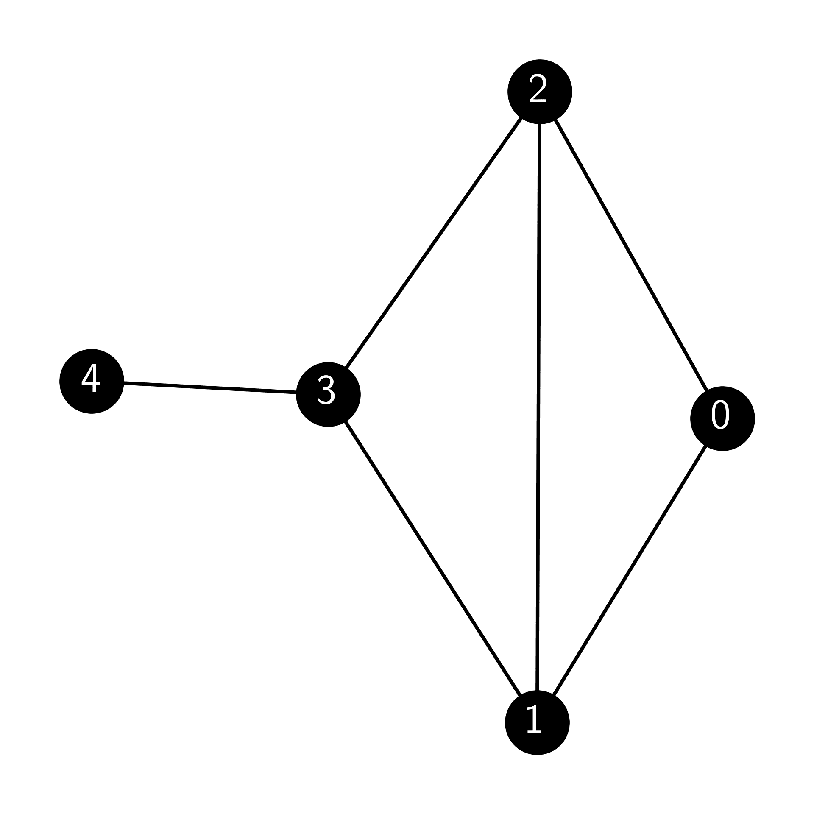
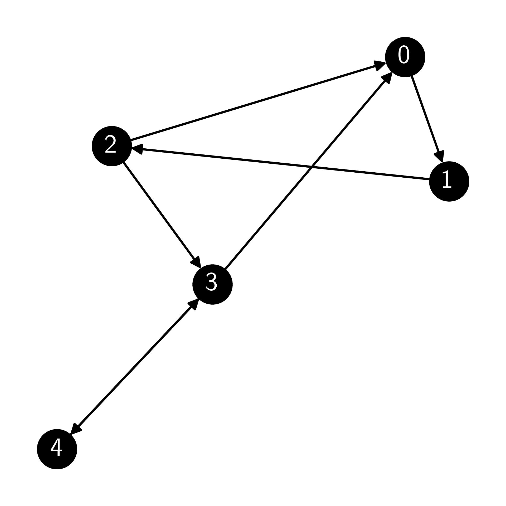
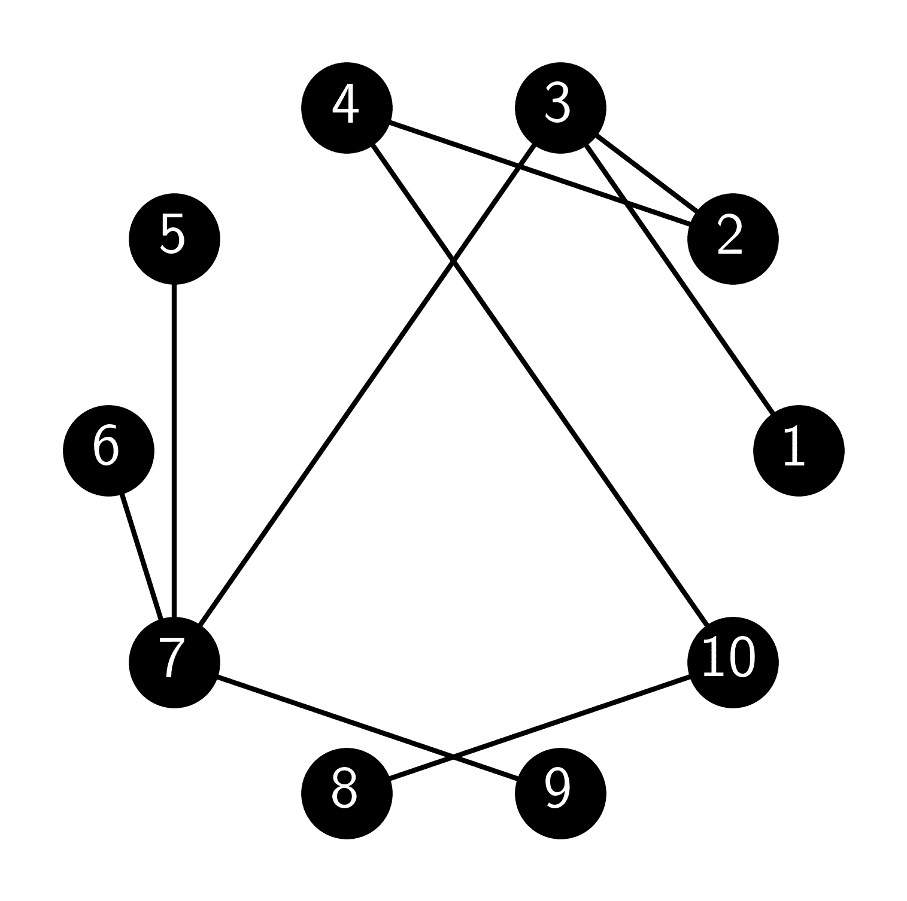
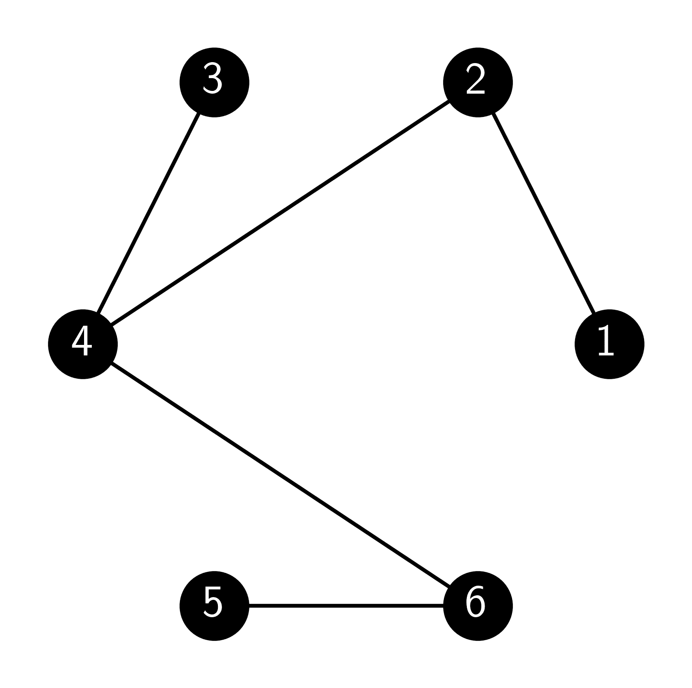

# 7.7\. 练习

> 原文：[`mmids-textbook.github.io/chap07_rwmc/exercises/roch-mmids-rwmc-exercises.html`](https://mmids-textbook.github.io/chap07_rwmc/exercises/roch-mmids-rwmc-exercises.html)

## 7.7.1\. 预习工作表#

*(在克劳德、双子星和 ChatGPT 的帮助下)*

**第 7.2 节**

**E7.2.1** 给定一个状态空间为 $S = \{1, 2, 3\}$ 的马尔可夫链和转移矩阵

$$\begin{split} P = \begin{pmatrix} 0.2 & 0.5 & 0.3 \\ 0.4 & 0.1 & 0.5 \\ 0.6 & 0.3 & 0.1 \end{pmatrix}, \end{split}$$

验证 $P$ 是一个随机矩阵。

**E7.2.2** 对于 E7.2.1 中的马尔可夫链，计算 $P²$。

**E7.2.3** 对于 E7.2.1 中的马尔可夫链，如果初始分布是 $\boldsymbol{\mu} = (0.2, 0.3, 0.5)^T$，计算 $\mathbb{P}[X_2 = 2]$。

**E7.2.4** 考虑一个有状态 $S = \{1, 2\}$ 的马尔可夫链和转移矩阵

$$\begin{split} P = \begin{pmatrix} 0.5 & 0.5 \\ 0.2 & 0.8 \end{pmatrix}. \end{split}$$

如果初始分布是 $\boldsymbol{\mu} = (0.3, 0.7)^T$，计算一步后的分布。

**E7.2.5** 给定一个状态空间为 $S = \{1, 2, 3, 4\}$ 的马尔可夫链和转移矩阵

$$\begin{split} P = \begin{pmatrix} 0 & 1/2 & 0 & 1/2 \\ 1/3 & 0 & 2/3 & 0 \\ 0 & 1/4 & 0 & 3/4 \\ 1/2 & 0 & 1/2 & 0 \end{pmatrix}, \end{split}$$

绘制转移图。

**E7.2.6** 给定一个状态空间为 $S = \{1, 2, 3\}$ 的马尔可夫链和转移矩阵

$$\begin{split} P = \begin{pmatrix} 0.1 & 0.4 & 0.5 \\ 0.2 & 0.6 & 0.2 \\ 0.3 & 0.3 & 0.4 \end{pmatrix}, \end{split}$$

和初始分布 $\boldsymbol{\mu} = (0.1, 0.2, 0.7)^T$，计算 $\mathbb{P}[X_0 = 1, X_1 = 2, X_2 = 3]$。

**E7.2.7** 对于 E7.2.6 中的马尔可夫链，计算 $\mathbb{P}[X_2 = 2 | X_0 = 3]$。

**E7.2.8** 给定一个状态空间为 $S = \{1, 2, 3, 4\}$ 的马尔可夫链和转移矩阵

$$\begin{split} P = \begin{pmatrix} 0.2 & 0.3 & 0.4 & 0.1 \\ 0.1 & 0.4 & 0.2 & 0.3 \\ 0.3 & 0.1 & 0.5 & 0.1 \\ 0.2 & 0.2 & 0.1 & 0.5 \end{pmatrix}, \end{split}$$

验证 $P$ 是一个随机矩阵。

**E7.2.9** 考虑一个有两个状态 $S = \{0, 1\}$ 的马尔可夫链和转移矩阵

$$\begin{split} P = \begin{pmatrix} 1/3 & 2/3 \\ 1/2 & 1/2 \end{pmatrix}. \end{split}$$

如果链从状态 0 开始，经过两步后它处于状态 1 的概率是多少？

**E7.2.10** 状态 $\{1, 2, 3\}$ 上的马尔可夫链有转移矩阵

$$\begin{split} P = \begin{pmatrix} 0 & 1/2 & 1/2 \\ 1/3 & 0 & 2/3 \\ 1/4 & 3/4 & 0 \end{pmatrix}. \end{split}$$

绘制其转移图。

**E7.2.11** 考虑一个状态空间为 $S = \{1, 2, 3\}$ 的马尔可夫链和转移矩阵

$$\begin{split} P = \begin{pmatrix} 1/2 & 0 & 1/2 \\ 0 & 1 & 0 \\ 1/3 & 1/3 & 1/3 \end{pmatrix}. \end{split}$$

如果初始分布是 $\boldsymbol{\mu} = (1/4, 1/2, 1/4)^T$，找到链在时间 2 的边缘分布。

**E7.2.12** 一个三状态马尔可夫链有转移矩阵

$$\begin{split} P = \begin{pmatrix} 1/4 & 1/2 & 1/4 \\ 1/3 & 1/3 & 1/3 \\ 0 & 0 & 1 \end{pmatrix}. \end{split}$$

识别任何吸收状态，即链无法离开的状态。

**E7.2.13** 一个两状态马尔可夫链的转移矩阵

$$\begin{split} P = \begin{pmatrix}1/2 & 1/2 \\ 1 & 0\end{pmatrix}. \end{split}$$

如果初始分布是 $\boldsymbol{\mu} = (1/3, 2/3)^T$，求链在时间 1 的分布。

**E7.2.14** 一个马尔可夫链的转移矩阵

$$\begin{split} P = \begin{pmatrix} 0.2 & 0.8 & 0 \\ 0.5 & 0 & 0.5 \\ 0 & 0.4 & 0.6 \end{pmatrix}. \end{split}$$

如果链当前处于状态 2，经过两步后它处于状态 3 的概率是多少？

**E7.2.15** 考虑一个状态空间 $S = \{1, 2\}$ 和转移矩阵的马尔可夫链

$$\begin{split} P = \begin{pmatrix} 0 & 1 \\ 1 & 0 \end{pmatrix}. \end{split}$$

如果链从状态 1 开始，返回状态 1 的期望步数是多少？

**第 7.3 节**

**E7.3.1** 确定以下转移矩阵是否是不可约的：

$$\begin{split} P = \begin{pmatrix} 0 & 1 & 0 \\ 0 & 0 & 1 \\ 1 & 0 & 0 \end{pmatrix}. \end{split}$$

**E7.3.2** 给出一个 $2 \times 2$ 的转移矩阵，它不是不可约的。

**E7.3.3** 给定转移矩阵 $P = \begin{pmatrix} 0.4 & 0.6 \\ 0.7 & 0.3 \end{pmatrix}$，检查概率分布 $\boldsymbol{\pi} = (0.6, 0.4)^T$ 是否是马尔可夫链的平稳分布。

**E7.3.4** 设 $P = \begin{pmatrix} 0 & 1 \\ 1/2 & 1/2 \end{pmatrix}$ 是一个马尔可夫链的转移矩阵。验证 $\boldsymbol{\pi} = (1/3, 2/3)^T$ 是否是平稳分布。

**E7.3.5** 找到转移矩阵 $P = \begin{pmatrix} 0.5 & 0.5 \\ 0.5 & 0.5 \end{pmatrix}$ 的马尔可夫链的平稳分布。

**E7.3.6** 确定以下马尔可夫链是否是不可约的：

```py
P = np.array([[0.5, 0.5, 0], [0.4, 0.6, 0], [0, 0, 1]]) 
```

**E7.3.7** 验证均匀分布 $\boldsymbol{\pi} = (\frac{1}{3}, \frac{1}{3}, \frac{1}{3})^T$ 是转移矩阵 $P = \begin{pmatrix} 0.4 & 0.3 & 0.3 \\ 0.2 & 0.5 & 0.3 \\ 0.4 & 0.2 & 0.4 \end{pmatrix}$ 的平稳分布。

**E7.3.8** 一个马尔可夫链的转移矩阵 $P = \begin{pmatrix} 1/2 & 1/2 & 0 \\ 0 & 1/3 & 2/3 \\ 1/4 & 1/4 & 1/2 \end{pmatrix}$ 是否是双随机矩阵？

**E7.3.9** 验证对于任何随机矩阵 $P$，向量 $(1, 1, \ldots, 1)$ 是 $P$ 的右特征向量，其特征值为 1。

**E7.3.10** 找到转移矩阵 $P = \begin{pmatrix} 0.6 & 0.4 \\ 0.3 & 0.7 \end{pmatrix}$ 对应于特征值 1 的左特征向量。

**E7.3.11** 对于转移矩阵 $P = \begin{pmatrix} 0.7 & 0.2 & 0.1 \\ 0.4 & 0.4 & 0.2 \\ 0.6 & 0.1 & 0.3 \end{pmatrix}$，通过将最后一个方程替换为 $\sum_{i=1}³ \pi_i = 1$ 后，求解线性方程组 $\boldsymbol{\pi} P = \boldsymbol{\pi}$ 来找到平稳分布。

**第 7.4 节**

**E7.4.1** 给定马尔可夫链的转移矩阵：

$$\begin{split} P = \begin{pmatrix} 0.2 & 0.8 \\ 0.6 & 0.4 \end{pmatrix}, \end{split}$$

确定链是否是懒惰的。

**E7.4.2** 证明具有只包含正项的转移矩阵的有限状态马尔可夫链是非周期的。

**E7.4.3** 给定一个转移矩阵为：

$$\begin{split} P = \begin{pmatrix} 0.4 & 0.6 \\ 0.7 & 0.3 \end{pmatrix}, \end{split}$$

和初始分布 $\boldsymbol{\mu} = (0.2, 0.8)^T$，计算 $\lim_{t \to \infty} \boldsymbol{\mu} P^t$。

**E7.4.4** 对于转移矩阵 $P = \begin{pmatrix} 0.4 & 0.3 & 0.3 \\ 0.2 & 0.5 & 0.3 \\ 0.4 & 0.2 & 0.4 \end{pmatrix}$ 和初始分布 $\boldsymbol{\mu} = (1/3, 1/3, 1/3)^T$，计算 $t=1000$ 时的 $\boldsymbol{\mu} P^t$。

**第 7.5 节**

**E7.5.1** 考虑具有邻接矩阵 $G$ 的无向图

$$\begin{split} A = \begin{pmatrix} 0 & 1 & 1 & 0 \\ 1 & 0 & 1 & 1 \\ 1 & 1 & 0 & 1 \\ 0 & 1 & 1 & 0 \\ \end{pmatrix}. \end{split}$$

计算图的度矩阵 $D$。

**E7.5.2** 对于与 E7.5.1 相同的图，计算图上随机游走的转移矩阵 $P$。

**E7.5.3** 对于与 E7.5.1 相同的图，验证转移矩阵 $P$ 是随机的。

**E7.5.4** 给定 E7.5.1 中的图，计算随机游走的平稳分布 $\boldsymbol{\pi}$。

**E7.5.5** 给定以下有向图的邻接矩阵：

$$\begin{split} A = \begin{pmatrix} 0 & 1 & 0 & 0 \\ 0 & 0 & 1 & 0 \\ 1 & 0 & 0 & 1 \\ 0 & 0 & 1 & 0 \end{pmatrix}, \end{split}$$

计算此图上随机游走的转移矩阵 $P$。

**E7.5.6** 对于以下无向图：



计算此图上随机游走的平稳分布 $\boldsymbol{\pi}$。

**E7.5.7** 给定以下有向图的邻接矩阵：

$$\begin{split} A = \begin{pmatrix} 0 & 1 & 0 & 0 \\ 1 & 0 & 1 & 0 \\ 0 & 1 & 0 & 1 \\ 0 & 0 & 1 & 0 \end{pmatrix}, \end{split}$$

使用阻尼因子 $\alpha = 0.8$ 计算修改后的转移矩阵。

**E7.5.8** 对于 E7.5.7 中的图，使用阻尼因子 $\alpha = 0.8$ 计算针对节点 1 的修改后的转移矩阵。

**E7.5.9** 给定以下有向图：



使用阻尼因子 $\alpha = 0.9$ 计算修改后的转移矩阵。

**E7.5.10** 对于 E7.5.9 中的图，使用阻尼因子 $\alpha = 0.9$ 计算针对节点 2 的修改后的转移矩阵。

**E7.5.11** 考虑具有邻接矩阵 $G$ 的有向图

$$\begin{split} A = \begin{pmatrix} 0 & 1 & 0 & 0 \\ 0 & 0 & 1 & 0 \\ 1 & 0 & 0 & 1 \\ 0 & 0 & 0 & 0 \\ \end{pmatrix}. \end{split}$$

向任何没有出边的顶点添加自环，然后计算新的邻接矩阵 $A'$。

**E7.5.12** 对于 E7.5.11 中的图，计算随机游走的转移矩阵 $P$。

**E7.5.13** 对于 E7.5.11 中的图，计算具有阻尼因子 $\alpha = 0.85$ 的修改后的转移矩阵 $Q$。

**第 7.6 节**

**E7.6.1** 给定目标分布 $\boldsymbol{\pi} = (0.1, 0.2, 0.3, 0.4)^T$ 和一个具有转移矩阵的提议链 $Q$

$$\begin{split} Q = \begin{pmatrix} 0.5 & 0.5 & 0 & 0\\ 0.5 & 0 & 0.5 & 0\\ 0 & 0.5 & 0 & 0.5\\ 0 & 0 & 0.5 & 0.5 \end{pmatrix}, \end{split}$$

计算从状态 2 到状态 1 的提议移动的接受概率。

**E7.6.2** 对于与 E7.6.1 相同的目标分布和提议链，计算从状态 2 到状态 3 的提议移动的接受概率。

**E7.6.3** 给定目标分布 $\boldsymbol{\pi} = (0.1, 0.2, 0.3, 0.4)^T$ 和一个具有转移矩阵的对称提议链 $Q$

$$\begin{split} Q = \begin{pmatrix} 0.5 & 0.25 & 0.25 & 0\\ 0.25 & 0.5 & 0 & 0.25\\ 0.25 & 0 & 0.5 & 0.25\\ 0 & 0.25 & 0.25 & 0.5 \end{pmatrix}, \end{split}$$

计算从状态 1 到状态 2 的提议移动的接受概率。

**E7.6.4** 对于与 E7.6.3 相同的目标分布和对称提议链，计算从状态 2 到状态 1 的提议移动的接受概率。

**E7.6.5** 考虑一个具有目标分布 $\pi(x) = \frac{1}{Z} e^{-x²/2}$ 在状态空间 $S = \mathbb{Z}$（整数）上的 Metropolis-Hastings 算法，并且提议分布 $Q(x, y) = \frac{1}{2}$ 如果 $|x-y| = 1$ 否则 $Q(x, y) = 0$。如果当前状态是 $x = 2$，接受提议移动到 $y = 3$ 的概率是多少？

**E7.6.6** 在状态空间 $S = \mathbb{Z}²$ 的吉布斯采样中，假设当前状态是 $(x_1, x_2) = (3, -1)$。如果第一个坐标根据条件分布 $\pi_1(x_1 | x_2 = -1)$ 更新，并且新的值是 $x_1' = 2$，那么吉布斯采样的新状态是什么？

**E7.6.7** 给定一个具有可见单元 $\mathbf{v} = (v_1, v_2, v_3)$、隐藏单元 $\mathbf{h} = (h_1, h_2)$ 的受限玻尔兹曼机 (RBM)，权重矩阵

$$\begin{split} W = \begin{pmatrix} 1 & -1\\ 2 & 1\\ -1 & 2 \end{pmatrix}, \end{split}$$

可见偏置 $\mathbf{b} = (1, -1, 2)$，以及隐藏偏置 $\mathbf{c} = (-1, 1)$，计算 $\mathbf{v} = (0, 1, 0)$ 和 $\mathbf{h} = (1, 0)$ 的条件概率 $\pi_1^{\text{v}}(1|\mathbf{v}_{-1}, \mathbf{h})$。

**E7.6.8** 对于与 E7.6.7 相同的 RBM，计算 $\mathbf{v} = (0, 1, 0)$ 和 $\mathbf{h} = (1, 0)$ 的条件概率 $\pi_2^{\text{h}}(1|\mathbf{v}, \mathbf{h}_{-2})$。

**E7.6.9** 考虑一个具有两个可见单元和两个隐藏单元的 RBM。权重矩阵是

$$\begin{split} W = \begin{pmatrix} 1 & -2 \\ 3 & 0 \end{pmatrix}. \end{split}$$

如果偏移向量是零向量，可见单元处于状态 $\mathbf{v} = (1, 0)$，而隐藏单元处于状态 $\mathbf{h} = (1, 1)$，计算能量 $\mathcal{E}(\mathbf{v}, \mathbf{h})$。

**E7.6.10** 给定可见单元 $\mathbf{v} = (1, 0)$ 和隐藏单元 $\mathbf{h} = (0, 1)$ 以及权重 $W = \begin{pmatrix}0.4 & -0.2 \\ 0.3 & 0.5\end{pmatrix}$ 和偏置 $\mathbf{b} = (0.1, -0.3)$ 以及 $\mathbf{c} = (0.2, -0.1)$，在 RBM 中计算能量 $\mathcal{E}(\mathbf{v}, \mathbf{h})$。

**E7.6.11** 给定一个二进制向量 $\mathbf{v} = (1, 0, 1)$ 和权重矩阵 $W = \begin{pmatrix}0.5 & -0.2 \\ 0.3 & 0.8 \\ -0.6 & 0.1\end{pmatrix}$，以及偏置向量 $\mathbf{c} = (0.1, -0.3)$，计算 RBM 中隐藏单元的条件均值 $\mathbb{E}[\mathbf{h} | \mathbf{v}]$。

**E7.6.12** 对于向量 $\mathbf{v} = (1, 0, 1)$，权重矩阵 $W = \begin{pmatrix}0.5 & -0.2 \\ 0.3 & 0.8 \\ -0.6 & 0.1\end{pmatrix}$，以及偏置向量 $\mathbf{b} = (0.2, -0.1, 0.3)$，假设 $\mathbf{h} = (0, 1)$，计算 RBM 中可见单元的条件均值 $\mathbb{E}[v_i | \mathbf{h}]$。

## 7.7.2\. 问题#

**7.1** 设 $A_1, \ldots, A_m$ 为互斥事件，设 $B$ 满足 $\P[B] > 0$。证明：

$$ \P[A_1 \cup \cdots \cup A_m|B] = \P[A_1|B] + \cdots + \P[A_m|B]. $$

$\lhd$

**7.2** （改编自 [Nor]）假设 $(X_n)_{n \geq 0}$ 是一个马尔可夫链。证明，对于任意正整数 $k \geq 2$，具有 $Y_n = X_{nk}$ 的随机过程 $(Y_n)_{n \geq 0}$ 也是一个马尔可夫链，并推导出其转移矩阵 $P$ 与 $(X_n)_{n \geq 0}$ 的转移矩阵之间的关系。 $\lhd$

**7.3** 设 $G = (V,E)$ 为彼得森图。考虑在 $G$ 上的以下随机游走。我们从 $X_0 = v_0$ 开始。然后，对于每个 $t\geq 0$，我们让 $X_{t+1}$ 成为 $X_t$ 的一个均匀选择的邻居，与之前的历史独立。形式上，固定 $X_0 = v_0$ 并让 $(Z_t)_{t \geq 0}$ 为一个在 $\{1,2,3\}$ 中取值的独立同分布随机变量序列，满足

$$ \mathbb{P}[Z_t = 1] = \mathbb{P}[Z_t = 2] = \mathbb{P}[Z_t = 3] = 1/3. $$

然后，对于所有 $t \geq 0$，定义：

$$ X_{t+1} = f(X_t, Z_t) = v_{i,Z_t} $$

如果 $X_t = v_i$。

a) 在什么条件下 $x_0,\ldots,x_t$ 使得

$$ \P[X_t = x_t, X_{t-1} = x_{t-1},\ldots, X_0 = x_0] > 0? $$

b) 通过遵循用于天气模型的论证，证明 $(X_t)_{t \geq 0}$ 是一个马尔可夫链。 $\lhd$

**7.4** 设 $(X_t)$ 如问题 7.3 所述。计算

$$ \P[X_T = x_T, X_{T-1} = x_{T-1},\ldots, X_0 = x_0]. $$

仔细证明你的答案。 $\lhd$

**7.5** 考虑以下图上的随机游走，在每一步我们选择一个均匀随机邻居。写出链的转移矩阵。



$\lhd$

**7.6** 设 $a, b \in \mathbb{R}$ 且 $a < 0$，$b > 0$。证明：

$$ |a + b| < |a| + |b|. $$

[*提示:* 考虑 $a + b \geq 0$ 和 $a + b < 0$ 的情况。] $\lhd$

**7.7** 设 $P = (p_{i,j})_{i,j=1}^n$ 为相对于概率分布 $\bpi = (\pi_i)_{i=1}^n$ 可逆的转移矩阵。假设初始分布为 $\bpi$。证明对于任何样本路径 $z_0,\ldots,z_T$，反向路径具有相同的概率，即，

$$ \P[X_T = z_0,\ldots, X_0 = z_T] = \P[X_T = z_T,\ldots, X_0 = z_0]. $$

$\lhd$

**7.8** 设 $\mathbf{x} = (x_1,\ldots,x_n)^T$ 为一个具有 $n$ 个分量的行向量。其 $\ell_1$-范数定义为

$$ \|\mathbf{x}\|_1 = \sum_{i=1}^n |x_i|. $$

设 $P$ 为一个随机矩阵。证明，如果 $\mathbf{x} \geq 0$（即 $\mathbf{x}$ 的所有项都是非负的），那么对于任何正整数 $k$，

$$ \|\mathbf{x} P^k\|_1 = \|\mathbf{x}\|_1\. $$

$\lhd$

**7.9** 设 $A_1,\ldots,A_r$ 为任意事件集合。

a) 证明乘法法则

$$ \P\left[\cap_{i=1}^r A_i\right] = \prod_{i=1}^r \P\left[A_i \,\middle|\, \cap_{j=1}^{i-1} A_j \right], $$

假设上述所有条件概率都定义良好。[*提示:* 应用条件概率的定义并简化。你可能想先尝试 $r=2,3$。]

b) 证明乘法法则也适用于条件概率，即，设 $D$ 为一个附加事件，并证明

$$ \P\left[\cap_{i=1}^r A_i\,\middle|\, D\right] = \prod_{i=1}^r \P\left[A_i \,\middle|\, D \cap \left(\cap_{j=1}^{i-1} A_j\right) \right], $$

假设上述所有条件概率都定义良好。$\lhd$

**7.10** 设 $A_1,\ldots,A_r$ 为 $\Omega$ 的一个划分，设 $B$ 为一个事件。证明全概率公式

$$ \P[B] = \sum_{i=1}^r \P[B|A_i] \P[A_i], $$

假设上述所有条件概率都定义良好。[*提示:* 使用条件概率的定义和不相交并的概率。] $\lhd$

**7.11** 设 $A$ 和 $B$ 为具有正概率的事件。证明贝叶斯定理

$$ \P[A|B] = \frac{\P[B|A]\P[A]}{\P[B]}. $$

[*提示:* 使用条件概率的定义。] $\lhd$

**7.12** 设 $(X_t)_{t \geq 0}$ 为状态空间 $\mathcal{S}$ 上的马尔可夫链。对于任何 $x_{t-1}, x_t \in \mathcal{S}$ 和长度为 $t-1$ 的状态序列的子集 $\mathcal{P} \subseteq \mathcal{S}^{t-1}$，直接从马尔可夫链的定义出发证明

$$ \P[X_t = x_t\,|\,X_{t-1} = x_{t-1}, (X_0,\ldots,X_{t-2}) \in \mathcal{P}] = \P[X_t = x_t\,|\,X_{t-1} = x_{t-1}]. $$

[*提示:* 使用条件概率的定义，对 $\mathcal{P}$ 中的所有路径求和，然后使用马尔可夫链的定义并简化。] $\lhd$

**7.13** 设 $(X_t)_{t \geq 0}$ 为状态空间 $\mathcal{S}$ 上的马尔可夫链。对于任何非负整数 $s < t$，$x_t \in \mathcal{S}$ 和 $(x_0,\ldots,x_s) \in \mathcal{S}^{s+1}$，直接从马尔可夫链的定义出发证明

$$ \P[X_t = x_t\,|\,X_s = x_s,\ldots,X_0 = x_0] = \P[X_t = x_t\,|\,X_s = x_s]. $$

[*提示：对从时间 $s+1$ 到时间 $t-1$ 的所有可能轨迹进行求和，然后使用乘法规则和马尔可夫链的定义。首先解决第 7.9b 问题。] $\lhd$

**7.14** 设 $(X_t)_{t \geq 0}$ 为定义在状态空间 $\mathcal{S}$ 上的马尔可夫链。对于任意非负整数 $s < t$，$x_{s}, x_t \in \mathcal{S}$ 以及长度为 $s$ 的状态序列的子集 $\mathcal{P} \subseteq \mathcal{S}^{s}$，直接从马尔可夫链的定义出发证明：

$$ \P[X_t = x_t\,|\,X_{s} = x_{s}, (X_0,\ldots,X_{s-1}) \in \mathcal{P}] = \P[X_t = x_t\,|\,X_{s} = x_{s}]. $$

[*提示：像第 7.13 问题中那样进行论证，并使用第 7.12 问题。] $\lhd$

**7.15** 设 $(X_t)_{t \geq 0}$ 为定义在状态空间 $\mathcal{S}$ 上的马尔可夫链。对于任意整数 $h \geq 0$，$x_{t-1} \in \mathcal{S}$ 以及长度为 $t-1$ 和 $h+1$ 的状态序列的子集 $\mathcal{P} \subseteq \mathcal{S}^{t-1}$，$\mathcal{F} \subseteq \mathcal{S}^{h+1}$，直接从马尔可夫链的定义出发证明：

$$ \P[(X_t,\ldots,X_{t+h}) \in \mathcal{F}\,|\,X_{t-1} = x_{t-1}, (X_0,\ldots,X_{t-2}) \in \mathcal{P}] = \P[(X_t,\ldots,X_{t+h}) \in \mathcal{F}\,|\,X_{t-1} = x_{t-1}]. $$

另一种说法是：$(X_0,\ldots,X_{t-2})$（即过去）和 $(X_t,\ldots,X_{t+h})$（即未来）在给定 $X_{t-1}$（即现在）的情况下是独立的。[*提示：对 $\mathcal{F}$ 中的所有路径进行求和，并像第 7.14 问题中那样进行论证。] $\lhd$

**7.16** 设 $A,B,C$ 为三个事件。假设 $C$ 与 $A$、$B$ 以及 $A \cap B$ 均独立。证明：

$$ \P[B\,|A \cap C] = \P[B\,|\,A]. $$

$\lhd$

**7.17** 设 $(X_t)_{t \geq 0}$ 为定义在状态空间 $\mathcal{S}$ 上的马尔可夫链。证明对于任意 $s < T$ 以及任意 $x_s,\ldots,x_T \in \mathcal{S}$，

$$ \P[X_{s+1} = x_{s+1}, X_{s+2} = x_{s+2}, \ldots, X_T = x_T\,|\,X_s = x_s] = \prod_{t=s+1}^T \,\P[X_t = x_t\,|\,X_{t-1} = x_{t-1}]. $$

$\lhd$

**7.18** 设 $P, Q \in \mathbb{R}^{n \times n}$ 为随机矩阵。证明 $PQ$ 是随机矩阵。$\lhd$

**7.19** 设 $(X_t)_{t \geq 0}$ 为定义在状态空间 $\mathcal{S}$ 上的马尔可夫链。证明对于任意 $s < t$ 以及任意 $x_s,x_t \in \mathcal{S}$，

$$ \P[X_t = x_t\,|\,X_s = x_s] = (P^{t-s})_{x_s,x_t}. $$

$\lhd$

**7.20** 设 $(X_t)_{t \geq 0}$ 为定义在 $[n]$ 上的马尔可夫链，其转移矩阵为 $P = (p_{i,j})_{i,j=1}^n$。设 $\bpi^{(0)}$ 和 $\bpi^{(1)}$ 为 $P$ 的不同平稳分布（作为行向量）。证明，对于任意 $\alpha \in (0,1)$，

$$ \bpi^{(\alpha)} = (1-\alpha) \bpi^{(0)} + \alpha \bpi^{(1)}, $$

这又是另一个平稳分布。$\lhd$

**7.21** 设 $P = (p_{i,j})_{i,j=1}^n$ 为定义在 $[n]$ 上的转移矩阵。回忆一下，一个平稳分布满足

$$ \sum_{i=1}^n \pi_i p_{i,j} = \pi_j, \qquad \forall j \in \mathcal{S}. $$

证明当 $j = n$ 时的方程是 $j=1,\ldots,n-1$ 时方程的线性组合。[*提示：对 $j$ 上面的求和。] $\lhd$

**7.22** 设 $P = (p_{i,j})_{i,j=1}^n$ 为定义在 $[n]$ 上的转移矩阵。回忆一下，一个平稳分布满足

$$ \sum_{i=1}^n \pi_i p_{i,j} = \pi_j, \qquad \forall j \in \mathcal{S}. $$

在问题 7.21 中，已经证明了对于 $j = n$ 的方程是 $j=1,\ldots,n-1$ 的方程的线性组合。但平稳分布还必须满足 $\sum_{i=1}^n \pi_i = 1$。证明用这个后一个方程替换 $j = n$ 的方程会导致以下系统

$$\begin{split} \begin{pmatrix} ((P - I_{n\times n})_{[:,1:n-1]})^T\\ \mathbf{1}_{1 \times n} \end{pmatrix} \bpi^T = \begin{pmatrix} \mathbf{0}_{(n-1)\times 1}\\ 1 \end{pmatrix}. \end{split}$$

$\lhd$

**7.23** 设 $P \in \mathbb{R}^{n \times n}$ 为一个懒惰的、不可约的转移矩阵。证明 $P²$ 是不可约的。 $\lhd$

**7.24** 证明离散随机变量的**全期望定律**。 $\lhd$

**7.25** 设 $P^{(1)}, P^{(2)},\ldots, P^{(r)} \in \mathbb{R}^{n \times n}$ 为随机矩阵。证明对于任意的 $\alpha_1,\ldots,\alpha_r \in [0,1]$ 且 $\sum_{i=1}^r \alpha_i = 1$，

$$ \sum_{i=1}^r \alpha_i P^{(i)} $$

是随机的。也就是说，随机矩阵的凸组合是一个随机矩阵。 $\lhd$

**7.26** 考虑以下图 $G$。



设 $(X_t)_{t \geq 0}$ 为图 $G$ 上的随机游走，即在每一步选择当前顶点的均匀邻接顶点。

a) 计算随机过程 $(X_t)_{t \geq 0}$ 的转移矩阵 $P$。

b) 假设我们在时间 $0$ 从状态 $3$ 开始，即 $X_0 = 3$。计算 $X_2$ 的分布。

$\lhd$

**7.27** 设 $Q \in \mathbb{R}^{n \times n}$ 为一个具有非负元素的矩阵（其行不一定求和为 $1$）。

a) 证明 $Q$ 的任何特征值 $\lambda$ 都满足

$$ |\lambda| \leq \max_{i} \|Q_{i,\cdot}\|_1. $$

[*提示:* 模仿随机情况的证明。]

b) 使用 (a) 中的论据来证明对应于特征值 $\lambda$ 且 $|\lambda| = \max_i \|Q_{i,\cdot}\|_1$ 的左特征向量 $\mathbf{z} = (z_1,\ldots,z_n)^T$（作为行向量）满足

$$ \|Q_{j,\cdot}\|_1 < \max_{i} \|Q_{i,\cdot}\|_1 \implies z_j = 0. $$

$\lhd$

**7.28** 设 $P \in \mathbb{R}^{n \times n}$ 为一个随机矩阵，考虑其分块形式

$$\begin{split} P = \begin{pmatrix} Q & \mathbf{a}\\ \mathbf{b}^T & c \end{pmatrix} \end{split}$$

其中 $Q \in \mathbb{R}^{(n-1)\times (n-1)}$，$\mathbf{a},\mathbf{b} \in \mathbb{R}^{n-1}$，且 $c \in \mathbb{R}$。

a) 证明，如果 $P$ 是不可约的，那么 $\mathbf{a} \neq 0$。

b) 证明，如果 $P$ 是不可约的，那么 $\mathbf{b} \neq 0$。

$\lhd$

**7.29** 设 $P \in \mathbb{R}^{n \times n}$ 为一个不可约随机矩阵，考虑其分块形式

$$\begin{split} P = \begin{pmatrix} Q & \mathbf{a}\\ \mathbf{b}^T & c \end{pmatrix} \end{split}$$

其中 $Q \in \mathbb{R}^{(n-1)\times (n-1)}$，$\mathbf{a},\mathbf{b} \in \mathbb{R}^{n-1}$，且 $c \in \mathbb{R}$。

a) 证明 $Q - I_{(n-1)\times (n-1)}$ 是非奇异的。[*提示:* 通过反证法论证，如果存在一个非零的（行）向量 $\mathbf{x}$ 使得 $\mathbf{x} (Q-I_{(n-1)\times (n-1)}) = \mathbf{0}$，那么对于 $\mathbf{y} = (\mathbf{x}^T, 0)^T$，有 $\mathbf{y} (P-I_{n\times n}) = \mathbf{0}$。使用问题 7.27 和 7.28。]

b) 使用 (a) 从 $\mathbf{x} (Q-I) = - \mathbf{b}^T$ 的解中找到 $P$ 的唯一平稳分布。这被称为“移除一个方程”的方法。

$\lhd$

**7.30** 回想一下，对于一个向量 $\mathbf{x} = (x_1,\ldots,x_n)$，我们令 $\|\mathbf{x}\|_\infty = \max_{i \in [n]} |x_i|$。证明如果 $Q$ 是一个随机矩阵，那么

$$ \|Q \mathbf{x}\|_\infty \leq \| \mathbf{x}\|_\infty. $$

$\lhd$

**7.31** 设 $P = (p_{i,j})_{i,j=1}^n \in \mathbb{R}^n$ 为一个转移矩阵。

a) 设 $\alpha_1, \ldots, \alpha_m > 0$ 且 $\sum_{i=1}^m \alpha_i = 1$。设 $\mathbf{x} = (x_1,\ldots,x_m) \in \mathbb{R}^n$。证明

$$ \sum_{i=1}^m \alpha_i x_i \leq \max_i x_i, $$

并且当且仅当 $x_1 = x_2 = \cdots = x_m$ 时取等号。

b) 设 $\mathbf{0} \neq \mathbf{y} \in \mathbb{R}^n$ 为 $P$ 的特征值为 $1$ 的右特征向量，即 $P \mathbf{y} = \mathbf{y}$。假设 $\mathbf{y}$ 不是一个常数向量，即存在 $i \neq j$ 使得 $y_i \neq y_j$。设 $k \in [n]$ 使得 $y_k = \max_{i \in [n]} y_i$。证明对于任何 $\ell \in [n]$ 使得 $p_{k,\ell} > 0$，我们必然有

$$ y_\ell = y_k. $$

[*提示:* 使用 $y_k = \sum_{i=1}^n p_{k,i} y_i$ 并应用 (a)。]

c) 假设 $P$ 是不可约的。再次设 $\mathbf{0} \neq \mathbf{y} \in \mathbb{R}^n$ 为 $P$ 的特征值为 $1$ 的右特征向量。使用 b) 证明 $\mathbf{y}$ 必然是一个常数向量。

d) 使用 c) 推断当 $P$ 是不可约时，$\mathrm{dim}(\mathrm{null}(P^T - I)) = 1$。$\lhd$

**7.32** 证明对于一般的（即可能不对称的）$Q$，Metropolis-Hastings 算法的正确性。$\lhd$

**7.33** 在 $28 \times 28$ 的黑白图像空间上，考虑以下马尔可夫链：在每一步，我们随机选择一个像素，并以概率 $1/2$ 翻转其值。

a) 链是不可约的吗？解释。

b) 平稳分布是什么？$\lhd$

**7.34** 构造两个在 3 个状态上的不同转移矩阵，其平稳分布是均匀的。$\lhd$

**7.35** 考虑在有限状态空间 $\mathcal{S}$ 上的“独立采样器”：在每一步，忽略当前状态，并根据目标分布 $\bpi$ 选择下一个状态。证明这个马尔可夫链具有平稳分布 $\bpi$。$\lhd$

**7.36** 在关于截断到支持 $[n]$ 的泊松分布的 Metropolis-Hastings 示例中，推导状态 $i = 1$ 和 $i = n$ 的接受概率。 $\lhd$

**7.37** 对于一般的 Gibbs 抽样，明确写出停留概率 $Q(\bx, \bx)$ 并检查它确实在 $[0,1]$ 范围内。 $\lhd$

**7.38** 假设 $\pi$ 是定义在有限集合 $\mathcal{Z}^d$ 上的严格正概率分布。

a) 对于 $i \in [d]$ 和 $\bx \in \mathcal{Z}^d$，通过应用条件概率的定义给出 $\pi_i(x_i|\bx_{-i})$ 的显式表达式。

b) 证明对于所有 $i \in [d]$ 和所有 $\bx \in \mathcal{Z}^d$，$\pi_i(x_i|\bx_{-i}) > 0$。 $\lhd$

**7.39** 证明当 $\pi$ 是严格正的时，Gibbs 抽样是不可约的。 $\lhd$

## 7.7.1\. 预习工作表#

*(有 Claude，Gemini 和 ChatGPT 的帮助)*

**Section 7.2**

**E7.2.1** 给定一个状态空间为 $S = \{1, 2, 3\}$ 的马尔可夫链和转移矩阵

$$\begin{split} P = \begin{pmatrix} 0.2 & 0.5 & 0.3 \\ 0.4 & 0.1 & 0.5 \\ 0.6 & 0.3 & 0.1 \end{pmatrix}, \end{split}$$

验证 $P$ 是一个随机矩阵。

**E7.2.2** 对于 E7.2.1 中的马尔可夫链，计算 $P²$。

**E7.2.3** 对于 E7.2.1 中的马尔可夫链，如果初始分布是 $\boldsymbol{\mu} = (0.2, 0.3, 0.5)^T$，计算 $\mathbb{P}[X_2 = 2]$。

**E7.2.4** 考虑一个状态为 $S = \{1, 2\}$ 的马尔可夫链和转移矩阵

$$\begin{split} P = \begin{pmatrix} 0.5 & 0.5 \\ 0.2 & 0.8 \end{pmatrix}. \end{split}$$

如果初始分布是 $\boldsymbol{\mu} = (0.3, 0.7)^T$，计算一步后的分布。

**E7.2.5** 给定一个状态空间为 $S = \{1, 2, 3, 4\}$ 的马尔可夫链和转移矩阵

$$\begin{split} P = \begin{pmatrix} 0 & 1/2 & 0 & 1/2 \\ 1/3 & 0 & 2/3 & 0 \\ 0 & 1/4 & 0 & 3/4 \\ 1/2 & 0 & 1/2 & 0 \end{pmatrix}, \end{split}$$

绘制转移图。

**E7.2.6** 给定一个状态空间为 $S = \{1, 2, 3\}$ 的马尔可夫链和转移矩阵

$$\begin{split} P = \begin{pmatrix} 0.1 & 0.4 & 0.5 \\ 0.2 & 0.6 & 0.2 \\ 0.3 & 0.3 & 0.4 \end{pmatrix}, \end{split}$$

以及初始分布 $\boldsymbol{\mu} = (0.1, 0.2, 0.7)^T$，计算 $\mathbb{P}[X_0 = 1, X_1 = 2, X_2 = 3]$。

**E7.2.7** 对于 E7.2.6 中的马尔可夫链，计算 $\mathbb{P}[X_2 = 2 | X_0 = 3]$。

**E7.2.8** 给定一个状态空间为 $S = \{1, 2, 3, 4\}$ 的马尔可夫链和转移矩阵

$$\begin{split} P = \begin{pmatrix} 0.2 & 0.3 & 0.4 & 0.1 \\ 0.1 & 0.4 & 0.2 & 0.3 \\ 0.3 & 0.1 & 0.5 & 0.1 \\ 0.2 & 0.2 & 0.1 & 0.5 \end{pmatrix}, \end{split}$$

验证 $P$ 是一个随机矩阵。

**E7.2.9** 考虑一个有两个状态 $S = \{0, 1\}$ 的马尔可夫链和转移矩阵

$$\begin{split} P = \begin{pmatrix} 1/3 & 2/3 \\ 1/2 & 1/2 \end{pmatrix}. \end{split}$$

如果链从状态 0 开始，经过两步后它处于状态 1 的概率是多少？

**E7.2.10** 状态 $\{1, 2, 3\}$ 上的马尔可夫链具有转移矩阵

$$\begin{split} P = \begin{pmatrix} 0 & 1/2 & 1/2 \\ 1/3 & 0 & 2/3 \\ 1/4 & 3/4 & 0 \end{pmatrix}. \end{split}$$

绘制其转移图。

**E7.2.11** 考虑一个状态空间 $S = \{1, 2, 3\}$ 和转移矩阵

$$\begin{split} P = \begin{pmatrix} 1/2 & 0 & 1/2 \\ 0 & 1 & 0 \\ 1/3 & 1/3 & 1/3 \end{pmatrix}. \end{split}$$

如果初始分布是 $\boldsymbol{\mu} = (1/4, 1/2, 1/4)^T$，找到链在时间 2 的边缘分布。

**E7.2.12** 一个三状态马尔可夫链具有转移矩阵

$$\begin{split} P = \begin{pmatrix} 1/4 & 1/2 & 1/4 \\ 1/3 & 1/3 & 1/3 \\ 0 & 0 & 1 \end{pmatrix}. \end{split}$$

识别任何吸收状态，即链无法离开的状态。

**E7.2.13** 一个两状态马尔可夫链具有转移矩阵

$$\begin{split} P = \begin{pmatrix}1/2 & 1/2 \\ 1 & 0\end{pmatrix}. \end{split}$$

如果初始分布是 $\boldsymbol{\mu} = (1/3, 2/3)^T$，找到链在时间 1 的分布。

**E7.2.14** 一个马尔可夫链具有转移矩阵

$$\begin{split} P = \begin{pmatrix} 0.2 & 0.8 & 0 \\ 0.5 & 0 & 0.5 \\ 0 & 0.4 & 0.6 \end{pmatrix}. \end{split}$$

如果链当前处于状态 2，经过两步后它处于状态 3 的概率是多少？

**E7.2.15** 考虑一个状态空间 $S = \{1, 2\}$ 和转移矩阵

$$\begin{split} P = \begin{pmatrix} 0 & 1 \\ 1 & 0 \end{pmatrix}. \end{split}$$

如果链从状态 1 开始，返回状态 1 的期望步数是多少？

**第 7.3 节**

**E7.3.1** 确定以下转移矩阵是否是不可约的：

$$\begin{split} P = \begin{pmatrix} 0 & 1 & 0 \\ 0 & 0 & 1 \\ 1 & 0 & 0 \end{pmatrix}. \end{split}$$

**E7.3.2** 举一个 $2 \times 2$ 转移矩阵不是不可约的例子。

**E7.3.3** 给定转移矩阵 $P = \begin{pmatrix} 0.4 & 0.6 \\ 0.7 & 0.3 \end{pmatrix}$，检查概率分布 $\boldsymbol{\pi} = (0.6, 0.4)^T$ 是否是马尔可夫链的平稳分布。

**E7.3.4** 设 $P = \begin{pmatrix} 0 & 1 \\ 1/2 & 1/2 \end{pmatrix}$ 为一个马尔可夫链的转移矩阵。验证 $\boldsymbol{\pi} = (1/3, 2/3)^T$ 是否是平稳分布。

**E7.3.5** 找到转移矩阵 $P = \begin{pmatrix} 0.5 & 0.5 \\ 0.5 & 0.5 \end{pmatrix}$ 的马尔可夫链的平稳分布。

**E7.3.6** 确定以下马尔可夫链是否是不可约的：

```py
P = np.array([[0.5, 0.5, 0], [0.4, 0.6, 0], [0, 0, 1]]) 
```

**E7.3.7** 验证均匀分布 $\boldsymbol{\pi} = (\frac{1}{3}, \frac{1}{3}, \frac{1}{3})^T$ 是转移矩阵 $P = \begin{pmatrix} 0.4 & 0.3 & 0.3 \\ 0.2 & 0.5 & 0.3 \\ 0.4 & 0.2 & 0.4 \end{pmatrix}$ 的平稳分布。

**E7.3.8** 一个马尔可夫链具有转移矩阵 $P = \begin{pmatrix} 1/2 & 1/2 & 0 \\ 0 & 1/3 & 2/3 \\ 1/4 & 1/4 & 1/2 \end{pmatrix}$。这个矩阵是双随机矩阵吗？

**E7.3.9** 验证对于任何随机矩阵 $P$，向量 $(1, 1, \ldots, 1)$ 是 $P$ 的特征值为 1 的右特征向量。

**E7.3.10** 找到转移矩阵 $P = \begin{pmatrix} 0.6 & 0.4 \\ 0.3 & 0.7 \end{pmatrix}$ 对应于特征值 1 的左特征向量。

**E7.3.11** 对于转移矩阵 $P = \begin{pmatrix} 0.7 & 0.2 & 0.1 \\ 0.4 & 0.4 & 0.2 \\ 0.6 & 0.1 & 0.3 \end{pmatrix}$，通过解线性方程组 $\boldsymbol{\pi} P = \boldsymbol{\pi}$（用 $\sum_{i=1}³ \pi_i = 1$ 替换最后一个方程）找到平稳分布。

**第 7.4 节**

**E7.4.1** 给定马尔可夫链的转移矩阵：

$$\begin{split} P = \begin{pmatrix} 0.2 & 0.8 \\ 0.6 & 0.4 \end{pmatrix}, \end{split}$$

确定链是否是懒惰的。

**E7.4.2** 证明具有只包含正项的转移矩阵的有限状态马尔可夫链是非周期的。

**E7.4.3** 给定一个转移矩阵为：

$$\begin{split} P = \begin{pmatrix} 0.4 & 0.6 \\ 0.7 & 0.3 \end{pmatrix}, \end{split}$$

和初始分布 $\boldsymbol{\mu} = (0.2, 0.8)^T$，计算 $\lim_{t \to \infty} \boldsymbol{\mu} P^t$。

**E7.4.4** 对于转移矩阵 $P = \begin{pmatrix} 0.4 & 0.3 & 0.3 \\ 0.2 & 0.5 & 0.3 \\ 0.4 & 0.2 & 0.4 \end{pmatrix}$ 和初始分布 $\boldsymbol{\mu} = (1/3, 1/3, 1/3)^T$，计算 $t=1000$ 时的 $\boldsymbol{\mu} P^t$。

**第 7.5 节**

**E7.5.1** 考虑具有邻接矩阵的无向图 $G$：

$$\begin{split} A = \begin{pmatrix} 0 & 1 & 1 & 0 \\ 1 & 0 & 1 & 1 \\ 1 & 1 & 0 & 1 \\ 0 & 1 & 1 & 0 \\ \end{pmatrix}. \end{split}$$

计算图的度矩阵 $D$。

**E7.5.2** 对于与 E7.5.1 相同的图，计算图上随机游走的转移矩阵 $P$。

**E7.5.3** 对于与 E7.5.1 相同的图，验证转移矩阵 $P$ 是随机的。

**E7.5.4** 对于 E7.5.1 中的图，计算随机游走的平稳分布 $\boldsymbol{\pi}$。

**E7.5.5** 给定以下有向图的邻接矩阵：

$$\begin{split} A = \begin{pmatrix} 0 & 1 & 0 & 0 \\ 0 & 0 & 1 & 0 \\ 1 & 0 & 0 & 1 \\ 0 & 0 & 1 & 0 \end{pmatrix}, \end{split}$$

计算此图上随机游走的转移矩阵 $P$。

**E7.5.6** 对于以下无向图：


计算此图上随机游走的平稳分布 $\boldsymbol{\pi}$。

**E7.5.7** 给定以下有向图的邻接矩阵：

$$\begin{split} A = \begin{pmatrix} 0 & 1 & 0 & 0 \\ 1 & 0 & 1 & 0 \\ 0 & 1 & 0 & 1 \\ 0 & 0 & 1 & 0 \end{pmatrix}, \end{split}$$

使用阻尼因子 $\alpha = 0.8$ 计算修改后的转移矩阵。

**E7.5.8** 对于 E7.5.7 中的图，使用阻尼因子 $\alpha = 0.8$ 计算关注节点 1 的修改后的转移矩阵。

**E7.5.9** 给定以下有向图：


使用阻尼系数$\alpha = 0.9$计算修改后的转移矩阵。

**E7.5.10** 对于 E7.5.9 中的图，使用阻尼系数$\alpha = 0.9$计算针对节点 2 的修改后的转移矩阵。

**E7.5.11** 考虑具有邻接矩阵的定向图$G$

$$\begin{split} A = \begin{pmatrix} 0 & 1 & 0 & 0 \\ 0 & 0 & 1 & 0 \\ 1 & 0 & 0 & 1 \\ 0 & 0 & 0 & 0 \\ \end{pmatrix}. \end{split}$$

向任何没有出边的外部顶点添加自环，然后计算新的邻接矩阵$A'$。

**E7.5.12** 对于 E7.5.11 中的图，计算随机游走的转移矩阵$P$。

**E7.5.13** 对于 E7.5.11 中的图，在阻尼系数$\alpha = 0.85$的情况下，计算修改后的转移矩阵$Q$。

**第 7.6 节**

**E7.6.1** 给定一个目标分布$\boldsymbol{\pi} = (0.1, 0.2, 0.3, 0.4)^T$和一个提议链$Q$的转移矩阵

$$\begin{split} Q = \begin{pmatrix} 0.5 & 0.5 & 0 & 0\\ 0.5 & 0 & 0.5 & 0\\ 0 & 0.5 & 0 & 0.5\\ 0 & 0 & 0.5 & 0.5 \end{pmatrix}, \end{split}$$

计算从状态 2 到状态 1 的提议的接受概率。

**E7.6.2** 对于与 E7.6.1 相同的自标分布和提议链，计算从状态 2 到状态 3 的提议的接受概率。

**E7.6.3** 给定一个目标分布$\boldsymbol{\pi} = (0.1, 0.2, 0.3, 0.4)^T$和一个具有转移矩阵的对称提议链$Q$

$$\begin{split} Q = \begin{pmatrix} 0.5 & 0.25 & 0.25 & 0\\ 0.25 & 0.5 & 0 & 0.25\\ 0.25 & 0 & 0.5 & 0.25\\ 0 & 0.25 & 0.25 & 0.5 \end{pmatrix}, \end{split}$$

计算从状态 1 到状态 2 的提议的接受概率。

**E7.6.4** 对于与 E7.6.3 相同的自标分布和对称提议链，计算从状态 2 到状态 1 的提议的接受概率。

**E7.6.5** 考虑一个目标分布为$\pi(x) = \frac{1}{Z} e^{-x²/2}$的 Metropolis-Hastings 算法，在状态空间$S = \mathbb{Z}$（整数集）上，提议分布$Q(x, y) = \frac{1}{2}$当$|x-y| = 1$时，否则为$Q(x, y) = 0$。如果当前状态是$x = 2$，接受移动到$y = 3$的提议的概率是多少？

**E7.6.6** 在状态空间$S = \mathbb{Z}²$的 Gibbs 采样器中，假设当前状态是$(x_1, x_2) = (3, -1)$。如果第一个坐标根据条件分布$\pi_1(x_1 | x_2 = -1)$更新，并且新的值是$x_1' = 2$，Gibbs 采样器的新状态是什么？

**E7.6.7** 给定一个具有可见单元$\mathbf{v} = (v_1, v_2, v_3)$、隐藏单元$\mathbf{h} = (h_1, h_2)$、权重矩阵

$$\begin{split} W = \begin{pmatrix} 1 & -1\\ 2 & 1\\ -1 & 2 \end{pmatrix}, \end{split}$$

可见偏差$\mathbf{b} = (1, -1, 2)$和隐藏偏差$\mathbf{c} = (-1, 1)$，计算$\mathbf{v} = (0, 1, 0)$和$\mathbf{h} = (1, 0)$时的条件概率$\pi_1^{\text{v}}(1|\mathbf{v}_{-1}, \mathbf{h})$。

**E7.6.8** 对于与 E7.6.7 相同的 RBM，计算 $\mathbf{v} = (0, 1, 0)$ 和 $\mathbf{h} = (1, 0)$ 的条件概率 $\pi_2^{\text{h}}(1|\mathbf{v}, \mathbf{h}_{-2})$。

**E7.6.9** 考虑一个具有两个可见单元和两个隐藏单元的 RBM。权重矩阵是

$$\begin{split} W = \begin{pmatrix} 1 & -2 \\ 3 & 0 \end{pmatrix}. \end{split}$$

如果偏移向量是零向量，可见单元处于状态 $\mathbf{v} = (1, 0)$，隐藏单元处于状态 $\mathbf{h} = (1, 1)$，计算能量 $\mathcal{E}(\mathbf{v}, \mathbf{h})$。

**E7.6.10** 给定可见单元 $\mathbf{v} = (1, 0)$ 和隐藏单元 $\mathbf{h} = (0, 1)$，权重 $W = \begin{pmatrix}0.4 & -0.2 \\ 0.3 & 0.5\end{pmatrix}$ 和偏置 $\mathbf{b} = (0.1, -0.3)$ 以及 $\mathbf{c} = (0.2, -0.1)$，计算 RBM 中的能量 $\mathcal{E}(\mathbf{v}, \mathbf{h})$。

**E7.6.11** 给定一个二进制向量 $\mathbf{v} = (1, 0, 1)$、权重矩阵 $W = \begin{pmatrix}0.5 & -0.2 \\ 0.3 & 0.8 \\ -0.6 & 0.1\end{pmatrix}$ 和偏置向量 $\mathbf{c} = (0.1, -0.3)$，计算 RBM 中隐藏单元的条件均值 $\mathbb{E}[\mathbf{h} | \mathbf{v}]$。

**E7.6.12** 对于一个向量 $\mathbf{v} = (1, 0, 1)$、权重矩阵 $W = \begin{pmatrix}0.5 & -0.2 \\ 0.3 & 0.8 \\ -0.6 & 0.1\end{pmatrix}$ 和偏置向量 $\mathbf{b} = (0.2, -0.1, 0.3)$，假设 $\mathbf{h} = (0, 1)$，计算 RBM 中可见单元的条件均值 $\mathbb{E}[v_i | \mathbf{h}]$。

## 7.7.2\. 问题#

**7.1** 设 $A_1, \ldots, A_m$ 是不相交的事件，设 $B$ 使得 $\P[B] > 0$。证明

$$ \P[A_1 \cup \cdots \cup A_m|B] = \P[A_1|B] + \cdots + \P[A_m|B]. $$

$\lhd$

**7.2** (改编自 [Nor]) 假设 $(X_n)_{n \geq 0}$ 是一个马尔可夫链。证明，对于任何正整数 $k \geq 2$，具有 $Y_n = X_{nk}$ 的随机过程 $(Y_n)_{n \geq 0}$ 也是一个马尔可夫链，并推导出其转移矩阵，该矩阵与 $(X_n)_{n \geq 0}$ 的转移矩阵 $P$ 有关。 $\lhd$

**7.3** 设 $G = (V,E)$ 是 Petersen 图。考虑在 $G$ 上的以下随机游走。我们从 $X_0 = v_0$ 开始。然后，对于每个 $t\geq 0$，我们让 $X_{t+1}$ 成为 $X_t$ 的一个均匀选择的邻居，独立于先前历史。形式上，固定 $X_0 = v_0$ 并让 $(Z_t)_{t \geq 0}$ 是一个独立同分布的随机变量序列，取值在 $\{1,2,3\}$ 中，满足

$$ \mathbb{P}[Z_t = 1] = \mathbb{P}[Z_t = 2] = \mathbb{P}[Z_t = 3] = 1/3. $$

然后，对于所有 $t \geq 0$，

$$ X_{t+1} = f(X_t, Z_t) = v_{i,Z_t} $$

如果 $X_t = v_i$。

a) 在什么条件下 $x_0,\ldots,x_t$，

$$ \P[X_t = x_t, X_{t-1} = x_{t-1},\ldots, X_0 = x_0] > 0? $$

b) 通过遵循用于天气模型的论证，证明 $(X_t)_{t \geq 0}$ 是一个马尔可夫链。 $\lhd$

**7.4** 设 $(X_t)$ 如问题 7.3 所述。计算

$$ \P[X_T = x_T, X_{T-1} = x_{T-1},\ldots, X_0 = x_0]. $$

仔细证明你的答案。$\lhd$

**7.5** 考虑以下图上的随机游走，其中在每一步我们选择一个均匀随机邻居。写出链的转移矩阵。


$\lhd$

**7.6** 设 $a, b \in \mathbb{R}$ 且 $a < 0$，$b > 0$。证明

$$ |a + b| < |a| + |b|. $$

[*提示:* 考虑 $a + b \geq 0$ 和 $a + b < 0$ 的情况。]$\lhd$

**7.7** 设 $P = (p_{i,j})_{i,j=1}^n$ 是相对于概率分布 $\bpi = (\pi_i)_{i=1}^n$ 可逆的转移矩阵。假设初始分布是 $\bpi$。证明对于任何样本路径 $z_0,\ldots,z_T$，反向路径具有相同的概率，即

$$ \P[X_T = z_0,\ldots, X_0 = z_T] = \P[X_T = z_T,\ldots, X_0 = z_0]. $$

$\lhd$

**7.8** 设 $\mathbf{x} = (x_1,\ldots,x_n)^T$ 是一个具有 $n$ 个分量的行向量。它的 $\ell_1$-范数定义为

$$ \|\mathbf{x}\|_1 = \sum_{i=1}^n |x_i|. $$

设 $P$ 为一个随机矩阵。证明，如果 $\mathbf{x} \geq 0$（即 $\mathbf{x}$ 的所有元素都是非负的），那么对于任何正整数 $k$，

$$ \|\mathbf{x} P^k\|_1 = \|\mathbf{x}\|_1\. $$

$\lhd$

**7.9** 设 $A_1,\ldots,A_r$ 是任何事件集合。

a) 证明乘法法则

$$ \P\left[\cap_{i=1}^r A_i\right] = \prod_{i=1}^r \P\left[A_i \,\middle|\, \cap_{j=1}^{i-1} A_j \right], $$

假设上述所有条件概率都定义良好。[*提示:* 应用条件概率的定义并简化。你可能想先尝试 $r=2,3$。]$\lhd$

b) 证明乘法法则也适用于条件概率，即设 $D$ 为一个附加事件，并证明

$$ \P\left[\cap_{i=1}^r A_i\,\middle|\, D\right] = \prod_{i=1}^r \P\left[A_i \,\middle|\, D \cap \left(\cap_{j=1}^{i-1} A_j\right) \right], $$

假设上述所有条件概率都定义良好。$\lhd$

**7.10** 设 $A_1,\ldots,A_r$ 是 $\Omega$ 的一个划分，设 $B$ 为一个事件。证明全概率公式

$$ \P[B] = \sum_{i=1}^r \P[B|A_i] \P[A_i], $$

假设上述所有条件概率都定义良好。[*提示:* 使用条件概率的定义和不相交并的概率。]$\lhd$

**7.11** 设 $A$ 和 $B$ 是具有正概率的事件。证明贝叶斯定理

$$ \P[A|B] = \frac{\P[B|A]\P[A]}{\P[B]}. $$

[*提示:* 使用条件概率的定义。]$\lhd$

**7.12** 设 $(X_t)_{t \geq 0}$ 是状态空间 $\mathcal{S}$ 上的马尔可夫链。对于任意 $x_{t-1}, x_t \in \mathcal{S}$ 和长度为 $t-1$ 的状态序列的子集 $\mathcal{P} \subseteq \mathcal{S}^{t-1}$，直接从马尔可夫链的定义出发证明

$$ \P[X_t = x_t\,|\,X_{t-1} = x_{t-1}, (X_0,\ldots,X_{t-2}) \in \mathcal{P}] = \P[X_t = x_t\,|\,X_{t-1} = x_{t-1}]. $$

[*提示：* 使用条件概率的定义，对 $\mathcal{P}$ 中的所有路径求和，然后使用马尔可夫链的定义并简化。] $\lhd$

**7.13** 设 $(X_t)_{t \geq 0}$ 为状态空间 $\mathcal{S}$ 上的马尔可夫链。对于任意非负整数 $s < t$，$x_t \in \mathcal{S}$ 以及 $(x_0,\ldots,x_s) \in \mathcal{S}^{s+1}$，直接从马尔可夫链的定义出发证明

$$ \P[X_t = x_t\,|\,X_s = x_s,\ldots,X_0 = x_0] = \P[X_t = x_t\,|\,X_s = x_s]. $$

[*提示：* 对从时间 $s+1$ 到时间 $t-1$ 的所有可能轨迹求和，然后使用乘法规则和马尔可夫链的定义。先做问题 7.9b。] $\lhd$

**7.14** 设 $(X_t)_{t \geq 0}$ 为状态空间 $\mathcal{S}$ 上的马尔可夫链。对于任意非负整数 $s < t$，$x_{s}, x_t \in \mathcal{S}$ 以及长度为 $s$ 的状态序列的子集 $\mathcal{P} \subseteq \mathcal{S}^{s}$，直接从马尔可夫链的定义出发证明

$$ \P[X_t = x_t\,|\,X_{s} = x_{s}, (X_0,\ldots,X_{s-1}) \in \mathcal{P}] = \P[X_t = x_t\,|\,X_{s} = x_{s}]. $$

[*提示：* 按照问题 7.13 的方式论证，并使用问题 7.12。] $\lhd$

**7.15** 设 $(X_t)_{t \geq 0}$ 为状态空间 $\mathcal{S}$ 上的马尔可夫链。对于任意整数 $h \geq 0$，$x_{t-1} \in \mathcal{S}$ 以及长度为 $t-1$ 和 $h+1$ 的状态序列的子集 $\mathcal{P} \subseteq \mathcal{S}^{t-1}$，$\mathcal{F} \subseteq \mathcal{S}^{h+1}$，直接从马尔可夫链的定义出发证明

$$ \P[(X_t,\ldots,X_{t+h}) \in \mathcal{F}\,|\,X_{t-1} = x_{t-1}, (X_0,\ldots,X_{t-2}) \in \mathcal{P}] = \P[(X_t,\ldots,X_{t+h}) \in \mathcal{F}\,|\,X_{t-1} = x_{t-1}]. $$

另一种说法是：$(X_0,\ldots,X_{t-2})$（即过去）和 $(X_t,\ldots,X_{t+h})$（即未来）在给定 $X_{t-1}$（即现在）的情况下是独立的。[提示：对 $\mathcal{F}$ 中的所有路径求和，并按照问题 7.14 的方式论证。] $\lhd$

**7.16** 设 $A,B,C$ 为三个事件。假设 $C$ 与 $A$、$B$ 以及 $A \cap B$ 均独立。证明

$$ \P[B\,|A \cap C] = \P[B\,|\,A]. $$

$\lhd$

**7.17** 设 $(X_t)_{t \geq 0}$ 为状态空间 $\mathcal{S}$ 上的马尔可夫链。证明对于任意 $s < T$ 以及任意 $x_s,\ldots,x_T \in \mathcal{S}$，

$$ \P[X_{s+1} = x_{s+1}, X_{s+2} = x_{s+2}, \ldots, X_T = x_T\,|\,X_s = x_s] = \prod_{t=s+1}^T \,\P[X_t = x_t\,|\,X_{t-1} = x_{t-1}]. $$

$\lhd$

**7.18** 设 $P, Q \in \mathbb{R}^{n \times n}$ 为随机矩阵。证明 $PQ$ 是随机矩阵。 $\lhd$

**7.19** 设 $(X_t)_{t \geq 0}$ 为状态空间 $\mathcal{S}$ 上的马尔可夫链。证明对于任意 $s < t$ 以及任意 $x_s,x_t \in \mathcal{S}$，

$$ \P[X_t = x_t\,|\,X_s = x_s] = (P^{t-s})_{x_s,x_t}. $$

$\lhd$

**7.20** 设 $(X_t)_{t \geq 0}$ 为 $[n]$ 上的马尔可夫链，其转移矩阵为 $P = (p_{i,j})_{i,j=1}^n$。设 $\bpi^{(0)}$ 和 $\bpi^{(1)}$ 是 $P$ 的不同平稳分布（作为行向量）。证明，对于任何 $\alpha \in (0,1)$,

$$ \bpi^{(\alpha)} = (1-\alpha) \bpi^{(0)} + \alpha \bpi^{(1)}, $$

是另一个平稳分布。[*提示:*] $\lhd$

**7.21** 设 $P = (p_{i,j})_{i,j=1}^n$ 为 $[n]$ 上的转移矩阵。回忆一下，一个平稳分布满足

$$ \sum_{i=1}^n \pi_i p_{i,j} = \pi_j, \qquad \forall j \in \mathcal{S}. $$

证明 $j = n$ 的方程是 $j=1,\ldots,n-1$ 的方程的线性组合。[*提示:* 对 $j$ 上求和。] $\lhd$

**7.22** 设 $P = (p_{i,j})_{i,j=1}^n$ 为 $[n]$ 上的转移矩阵。回忆一下，一个平稳分布满足

$$ \sum_{i=1}^n \pi_i p_{i,j} = \pi_j, \qquad \forall j \in \mathcal{S}. $$

在问题 7.21 中，已经证明对于 $j = n$ 的方程是 $j=1,\ldots,n-1$ 的方程的线性组合。但是，平稳分布还必须满足 $\sum_{i=1}^n \pi_i = 1$。证明用这个后一个方程替换 $j = n$ 的方程会导致以下系统

$$\begin{split} \begin{pmatrix} ((P - I_{n\times n})_{[:,1:n-1]})^T\\ \mathbf{1}_{1 \times n} \end{pmatrix} \bpi^T = \begin{pmatrix} \mathbf{0}_{(n-1)\times 1}\\ 1 \end{pmatrix}. \end{split}$$

$\lhd$

**7.23** 设 $P \in \mathbb{R}^{n \times n}$ 为一个懒惰的、不可约的转移矩阵。证明 $P²$ 是不可约的。 $\lhd$

**7.24** 证明离散随机变量的**全期望定律**。 $\lhd$

**7.25** 设 $P^{(1)}, P^{(2)},\ldots, P^{(r)} \in \mathbb{R}^{n \times n}$ 为随机矩阵。证明对于任何 $\alpha_1,\ldots,\alpha_r \in [0,1]$ 且 $\sum_{i=1}^r \alpha_i = 1$,

$$ \sum_{i=1}^r \alpha_i P^{(i)} $$

是随机的。也就是说，随机矩阵的凸组合仍然是随机矩阵。 $\lhd$

**7.26** 考虑以下图 $G$。


设 $(X_t)_{t \geq 0}$ 为图 $G$ 上的随机游走，即在每一步选择当前顶点的均匀邻接顶点。

a) 计算 $(X_t)_{t \geq 0}$ 的转移矩阵 $P$。

b) 假设我们在时间 $0$ 处于状态 $3$，即 $X_0 = 3$。计算 $X_2$ 的分布。

$\lhd$

**7.27** 设 $Q \in \mathbb{R}^{n \times n}$ 为一个具有非负元素的矩阵（其行不一定求和为 $1$)。

a) 证明 $Q$ 的任何特征值 $\lambda$ 都满足

$$ |\lambda| \leq \max_{i} \|Q_{i,\cdot}\|_1. $$

[*提示:* 模仿随机情况的证明。]

b) 使用 (a) 中的论点来证明对应于特征值 $\lambda$（其中 $|\lambda| = \max_i \|Q_{i,\cdot}\|_1$）的左特征向量 $\mathbf{z} = (z_1,\ldots,z_n)^T$（作为行向量）满足

$$ \|Q_{j,\cdot}\|_1 < \max_{i} \|Q_{i,\cdot}\|_1 \implies z_j = 0. $$

$\lhd$

**7.28** 设 $P \in \mathbb{R}^{n \times n}$ 为一个随机矩阵，考虑其块形式

$$\begin{split} P = \begin{pmatrix} Q & \mathbf{a}\\ \mathbf{b}^T & c \end{pmatrix} \end{split}$$

其中 $Q \in \mathbb{R}^{(n-1)\times (n-1)}$, $\mathbf{a},\mathbf{b} \in \mathbb{R}^{n-1}$, 和 $c \in \mathbb{R}$.

a) 证明如果 $P$ 是不可约的，那么 $\mathbf{a} \neq 0$.

b) 证明如果 $P$ 是不可约的，那么 $\mathbf{b} \neq 0$.

$\lhd$

**7.29** 设 $P \in \mathbb{R}^{n \times n}$ 为一个不可约的随机矩阵，考虑其块形式

$$\begin{split} P = \begin{pmatrix} Q & \mathbf{a}\\ \mathbf{b}^T & c \end{pmatrix} \end{split}$$

其中 $Q \in \mathbb{R}^{(n-1)\times (n-1)}$, $\mathbf{a},\mathbf{b} \in \mathbb{R}^{n-1}$, 和 $c \in \mathbb{R}$.

a) 证明 $Q - I_{(n-1)\times (n-1)}$ 是非奇异的。[*提示:* 通过反证法，如果存在一个非零的（行）向量 $\mathbf{x}$ 使得 $\mathbf{x} (Q-I_{(n-1)\times (n-1)}) = \mathbf{0}$，那么对于 $\mathbf{y} = (\mathbf{x}^T, 0)^T$，我们有 $\mathbf{y} (P-I_{n\times n}) = \mathbf{0}$。使用问题 7.27 和 7.28。]

b) 使用 (a) 从 $\mathbf{x} (Q-I) = - \mathbf{b}^T$ 的解中找到 $P$ 的唯一平稳分布。这被称为“移除一个方程”的方法。

$\lhd$

**7.30** 回想一下，对于一个向量 $\mathbf{x} = (x_1,\ldots,x_n)$，我们令 $\|\mathbf{x}\|_\infty = \max_{i \in [n]} |x_i|$。证明如果 $Q$ 是一个随机矩阵，那么

$$ \|Q \mathbf{x}\|_\infty \leq \| \mathbf{x}\|_\infty. $$

$\lhd$

**7.31** 设 $P = (p_{i,j})_{i,j=1}^n \in \mathbb{R}^n$ 为一个转移矩阵。

a) 令 $\alpha_1, \ldots, \alpha_m > 0$ 且 $\sum_{i=1}^m \alpha_i = 1$。令 $\mathbf{x} = (x_1,\ldots,x_m) \in \mathbb{R}^n$。证明

$$ \sum_{i=1}^m \alpha_i x_i \leq \max_i x_i, $$

并且当且仅当 $x_1 = x_2 = \cdots = x_m$ 时取等号。

b) 令 $\mathbf{0} \neq \mathbf{y} \in \mathbb{R}^n$ 为 $P$ 的一个特征值为 $1$ 的右特征向量，即 $P \mathbf{y} = \mathbf{y}$。假设 $\mathbf{y}$ 不是一个常数向量，即存在 $i \neq j$ 使得 $y_i \neq y_j$。令 $k \in [n]$ 为使得 $y_k = \max_{i \in [n]} y_i$ 的元素。证明对于任何 $\ell \in [n]$ 使得 $p_{k,\ell} > 0$，我们必然有

$$ y_\ell = y_k. $$

[*提示:* 使用 $y_k = \sum_{i=1}^n p_{k,i} y_i$ 并应用 (a)。]

c) 假设 $P$ 是不可约的。再次令 $\mathbf{0} \neq \mathbf{y} \in \mathbb{R}^n$ 为 $P$ 的一个特征值为 $1$ 的右特征向量。使用 b) 证明 $\mathbf{y}$ 必然是一个常数向量。

d) 使用 c) 推出当 $P$ 是不可约的时，$\mathrm{dim}(\mathrm{null}(P^T - I)) = 1$。$\lhd$

**7.32** 证明对于一般的（即可能不对称的）$Q$，Metropolis-Hastings 算法的**正确性**。$\lhd$

**7.33** 在 $28 \times 28$ 的黑白图像空间中，考虑以下马尔可夫链：在每一步，我们随机均匀选择一个像素，并以概率 $1/2$ 翻转其值。

a) 链是不可约的吗？解释。

b) 平稳分布是什么？$\lhd$

**7.34** 构造两个在 3 个状态上的不同转移矩阵，其平稳分布是均匀的。 $\lhd$

**7.35** 考虑有限状态空间 $\mathcal{S}$ 上的“独立采样器”：在每一步，忽略当前状态，并根据目标分布 $\bpi$ 选择下一个状态。证明这个马尔可夫链具有平稳分布 $\bpi$。 $\lhd$

**7.36** 在关于截断到支持 $[n]$ 的泊松分布的 Metropolis-Hastings 例子中，推导状态 $i = 1$ 和 $i = n$ 的接受概率。 $\lhd$

**7.37** 对于一般的吉布斯采样器，明确写出停留概率 $Q(\bx, \bx)$ 并检查它确实在 $[0,1]$ 范围内。 $\lhd$

**7.38** 假设 $\pi$ 是 $\mathcal{Z}^d$ 上的严格正概率分布，其中 $\mathcal{Z}$ 是有限的。

a) 对于 $i \in [d]$ 和 $\bx \in \mathcal{Z}^d$，通过应用条件概率的定义给出 $\pi_i(x_i|\bx_{-i})$ 的显式表达式。

b) 证明对于所有 $i \in [d]$ 和所有 $\bx \in \mathcal{Z}^d$，$\pi_i(x_i|\bx_{-i}) > 0$. $\lhd$

**7.39** 证明当 $\pi$ 是严格正的时，吉布斯采样器是不可约的。 $\lhd$
