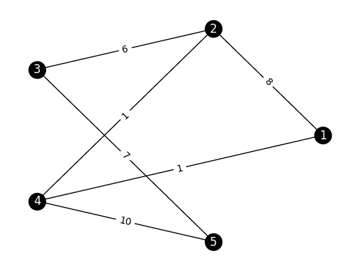

# 7.8\. 在线补充材料

> 原文：[`mmids-textbook.github.io/chap07_rwmc/supp/roch-mmids-rwmc-supp.html`](https://mmids-textbook.github.io/chap07_rwmc/supp/roch-mmids-rwmc-supp.html)

## 7.8.1\. 测验、解答、代码等.#

### 7.8.1.1\. 仅代码#

下面可以访问一个包含本章代码的交互式 Jupyter 笔记本（推荐使用 Google Colab）。鼓励您对其进行尝试。一些建议的计算练习散布在其中。笔记本也可以作为幻灯片查看。

+   [笔记本](https://github.com/MMiDS-textbook/MMiDS-textbook.github.io/blob/main/just_the_code/roch_mmids_chap_rwmc_notebook.ipynb) ([在 Colab 中打开](https://colab.research.google.com/github/MMiDS-textbook/MMiDS-textbook.github.io/blob/main/just_the_code/roch_mmids_chap_rwmc_notebook.ipynb))

+   [幻灯片](https://raw.githack.com/MMiDS-textbook/MMiDS-textbook.github.io/main/just_the_code/roch_mmids_chap_rwmc_notebook_slides.slides.html)

### 7.8.1.2\. 自我评估测验#

通过以下链接可以获取更广泛的自我评估测验的网页版本。

+   [第 7.2 节](https://raw.githack.com/MMiDS-textbook/MMiDS-textbook.github.io/main/quizzes/self-assessment/quiz_7_2.html)

+   [第 7.3 节](https://raw.githack.com/MMiDS-textbook/MMiDS-textbook.github.io/main/quizzes/self-assessment/quiz_7_3.html)

+   [第 7.4 节](https://raw.githack.com/MMiDS-textbook/MMiDS-textbook.github.io/main/quizzes/self-assessment/quiz_7_4.html)

+   [第 7.5 节](https://raw.githack.com/MMiDS-textbook/MMiDS-textbook.github.io/main/quizzes/self-assessment/quiz_7_5.html)

+   [第 7.6 节](https://raw.githack.com/MMiDS-textbook/MMiDS-textbook.github.io/main/quizzes/self-assessment/quiz_7_6.html)

### 7.8.1.3\. 自动测验#

本章的自动生成的测验可以通过以下链接访问（推荐使用 Google Colab）。

+   [自动测验](https://github.com/MMiDS-textbook/MMiDS-textbook.github.io/blob/main/quizzes/auto_quizzes/roch-mmids-rwmc-autoquiz.ipynb) ([在 Colab 中打开](https://colab.research.google.com/github/MMiDS-textbook/MMiDS-textbook.github.io/blob/main/quizzes/auto_quizzes/roch-mmids-rwmc-autoquiz.ipynb))

### 7.8.1.4\. 奇数练习题的解答#

*(由 Claude、Gemini 和 ChatGPT 协助)*

**E7.2.1** 我们需要检查 $P$ 的所有条目都是非负的，并且所有行的和都等于 1。

非负性：$P$ 的所有条目显然都是非负的。

行和：行 1：$0.2 + 0.5 + 0.3 = 1$ 行 2：$0.4 + 0.1 + 0.5 = 1$ 行 3：$0.6 + 0.3 + 0.1 = 1$

因此，$P$ 是一个随机矩阵。

**E7.2.3**

$$\begin{align*} \mathbb{P}[X_2 = 2] &= (\boldsymbol{\mu} P²)_2 \\ &= (0.2, 0.3, 0.5)^T \begin{pmatrix} 0.44 & 0.31 & 0.25 \\ 0.44 & 0.37 & 0.19 \\ 0.36 & 0.33 & 0.31 \end{pmatrix}_2 \\ &= 0.2 \cdot 0.31 + 0.3 \cdot 0.37 + 0.5 \cdot 0.33 \\ &= 0.338. \end{align*}$$

**E7.2.5**

```py
G = nx.DiGraph()
G.add_nodes_from(range(1, 5))
G.add_edges_from([(1, 2), (1, 4), (2, 1), (2, 3), (3, 2), (3, 4), (4, 1), (4, 3)]) 
```

如果且仅当 $p_{i,j} > 0$ 时，转移图从状态 $i$ 到状态 $j$ 有一个有向边，正如定义所述。

**E7.2.7**

$$\begin{align*} \mathbb{P}[X_2 = 2 | X_0 = 3] &= (P²)_{3,2} \\ &= \begin{pmatrix} 0.1 & 0.4 & 0.5 \\ 0.2 & 0.6 & 0.2 \\ 0.3 & 0.3 & 0.4 \end{pmatrix}²_{3,2} \\ &= \begin{pmatrix} 0.29 & 0.38 & 0.33 \\ 0.26 & 0.44 & 0.30 \\ 0.27 & 0.36 & 0.37 \end{pmatrix}_{3,2} \\ &= 0.36. \end{align*}$$

**E7.2.9** 概率由条目 $(P²)_{0,1}$ 给出，其中 $P²$ 是矩阵乘积 $P \times P$。

$$\begin{split} P² = \begin{pmatrix} 1/3 & 2/3 \\ 1/2 & 1/2 \end{pmatrix} \begin{pmatrix} 1/3 & 2/3 \\ 1/2 & 1/2 \end{pmatrix} = \begin{pmatrix} 7/18 & 11/18 \\ 5/12 & 7/12 \end{pmatrix} \end{split}$$

因此，概率是 $\boxed{11/18}$。

**E7.2.11** 时间 2 的边缘分布由 $\boldsymbol{\mu} P²$ 给出。

$$\begin{split} P² = \begin{pmatrix} 1/2 & 0 & 1/2 \\ 0 & 1 & 0 \\ 1/3 & 1/3 & 1/3 \end{pmatrix} \begin{pmatrix} 1/2 & 0 & 1/2 \\ 0 & 1 & 0 \\ 1/3 & 1/3 & 1/3 \end{pmatrix} = \begin{pmatrix} 5/12 & 1/6 & 5/12 \\ 0 & 1 & 0 \\ 4/9 & 4/9 & 1/9 \end{pmatrix} \end{split}$$

因此，

$$\begin{split} \mu P² = (1/4, 1/2, 1/4)^T \begin{pmatrix} 5/12 & 1/6 & 5/12 \\ 0 & 1 & 0 \\ 4/9 & 4/9 & 1/9 \end{pmatrix} = \boxed{(13/36, 19/36, 4/36)^T} \end{split}$$

**E7.2.13** 时间 1 的分布由 $\boldsymbol{\mu} P$ 给出。

$$\begin{split} \boldsymbol{\mu} P = (1/3, 2/3)^T \begin{pmatrix}1/2 & 1/2 \\ 1 & 0\end{pmatrix} = \boxed{(2/3, 1/3)^T} \end{split}$$

**E7.2.15** 链在状态 1 和 2 之间确定性交替。因此，从状态 1 开始，它将在恰好 $\boxed{2}$ 步后返回到状态 1。

**E7.3.1** 是的，矩阵是不可约的。相应的转移图是一个环，它是强连通的。

**E7.3.3** 我们需要检查 $\boldsymbol{\pi} P = \boldsymbol{\pi}$。确实，

$$\begin{split} (0.6, 0.4)^T \begin{pmatrix} 0.4 & 0.6 \\ 0.7 & 0.3 \end{pmatrix} = (0.6 \cdot 0.4 + 0.4 \cdot 0.7, 0.6 \cdot 0.6 + 0.4 \cdot 0.3)^T = (0.52, 0.48)^T \neq (0.6, 0.4)^T, \end{split}$$

因此，$\pi$ 不是马尔可夫链的平稳分布。

**E7.3.5** 设 $\boldsymbol{\pi} = (\pi_1, \pi_2)^T$ 为一个平稳分布。那么，我们需要解以下方程组：

$$\begin{align*} \pi_1 \cdot 0.5 + \pi_2 \cdot 0.5 &= \pi_1 \\ \pi_1 + \pi_2 &= 1 \end{align*}$$

第一个方程简化为 $\pi_1 = \pi_2$，将其代入第二个方程得到 $2\pi_1 = 1$，即 $\pi_1 = \pi_2 = 0.5$。因此，$\boldsymbol{\pi} = (0.5, 0.5)^T$ 是一个平稳分布。

**E7.3.7** 为了验证 $\boldsymbol{\pi}$ 是一个稳态分布，我们需要检查 $\boldsymbol{\pi} P = \boldsymbol{\pi}$。让我们逐步进行矩阵乘法：

$\boldsymbol{\pi} P = (\frac{1}{3}, \frac{1}{3}, \frac{1}{3})^T \begin{pmatrix} 0.4 & 0.3 & 0.3 \\ 0.2 & 0.5 & 0.3 \\ 0.4 & 0.2 & 0.4 \end{pmatrix}$

$= (\frac{1}{3} \cdot 0.4 + \frac{1}{3} \cdot 0.2 + \frac{1}{3} \cdot 0.4, \frac{1}{3} \cdot 0.3 + \frac{1}{3} \cdot 0.5 + \frac{1}{3} \cdot 0.2, \frac{1}{3} \cdot 0.3 + \frac{1}{3} \cdot 0.3 + \frac{1}{3} \cdot 0.4)^T$

$= (\frac{0.4 + 0.2 + 0.4}{3}, \frac{0.3 + 0.5 + 0.2}{3}, \frac{0.3 + 0.3 + 0.4}{3})^T$

$= (\frac{1}{3}, \frac{1}{3}, \frac{1}{3})^T$

$= \boldsymbol{\pi}$

结果等于 $\pi = (\frac{1}{3}, \frac{1}{3}, \frac{1}{3})$。因此，均匀分布 $\pi$ 确实是矩阵 $P$ 的一个稳态分布。注意，转移矩阵 $P$ 是双随机矩阵，因为每一行和每一列的和都等于 1。这一性质确保了均匀分布总是双随机矩阵的稳态分布，如文中所述。

**E7.3.9** 设 $\mathbf{1} = (1, 1, \ldots, 1)$ 为所有元素均为 1 的列向量。对于任何随机矩阵 $P$，我们有：

$$\begin{split} P \mathbf{1} = \begin{pmatrix} p_{1,1} & \cdots & p_{1,n} \\ \vdots & \ddots & \vdots \\ p_{n,1} & \cdots & p_{n,n} \end{pmatrix} \begin{pmatrix} 1 \\ \vdots \\ 1 \end{pmatrix} = \begin{pmatrix} \sum_{j=1}^n p_{1,j} \\ \vdots \\ \sum_{j=1}^n p_{n,j} \end{pmatrix} = \begin{pmatrix} 1 \\ \vdots \\ 1 \end{pmatrix} = \mathbf{1}, \end{split}$$

因为一个随机矩阵的每一行之和都等于 1。因此，$\mathbf{1}$ 是 $P$ 的一个右特征向量，特征值为 1。

**E7.3.11** 设 $\boldsymbol{\pi} = (\pi_1, \pi_2, \pi_3)^T$ 为稳态分布。我们需要解以下方程组：

第一步：根据 $\boldsymbol{\pi} P = \boldsymbol{\pi}$ 写出方程组。

$$\begin{align*} \pi_1 \cdot 0.7 + \pi_2 \cdot 0.4 + \pi_3 \cdot 0.6 &= \pi_1 \\ \pi_1 \cdot 0.2 + \pi_2 \cdot 0.4 + \pi_3 \cdot 0.1 &= \pi_2 \\ \pi_1 \cdot 0.1 + \pi_2 \cdot 0.2 + \pi_3 \cdot 0.3 &= \pi_3 \end{align*}$$

第 2 步：重新排列方程，使右侧为零。

$$\begin{align*} \pi_1 \cdot 0.7 + \pi_2 \cdot 0.4 + \pi_3 \cdot 0.6 - \pi_1 &= 0 \\ \pi_1 \cdot 0.2 + \pi_2 \cdot 0.4 + \pi_3 \cdot 0.1 - \pi_2 &= 0 \\ \pi_1 \cdot 0.1 + \pi_2 \cdot 0.2 + \pi_3 \cdot 0.3 - \pi_3 &= 0 \end{align*}$$

第 3 步：简化方程。

$$\begin{align*} -0.3\pi_1 + 0.4\pi_2 + 0.6\pi_3 &= 0 \\ 0.2\pi_1 - 0.6\pi_2 + 0.1\pi_3 &= 0 \\ 0.1\pi_1 + 0.2\pi_2 - 0.7\pi_3 &= 0 \end{align*}$$

第 4 步：使用条件 $\pi_1 + \pi_2 + \pi_3 = 1$ 消去一个变量，例如 $\pi_3$。

$$ \pi_3 = 1 - \pi_1 - \pi_2 $$

第 5 步：将 $\pi_3$ 的表达式代入第 3 步简化的方程中。

$$\begin{align*} -0.3\pi_1 + 0.4\pi_2 + 0.6(1 - \pi_1 - \pi_2) &= 0 \\ 0.2\pi_1 - 0.6\pi_2 + 0.1(1 - \pi_1 - \pi_2) &= 0 \end{align*}$$

第 6 步：进一步简化方程。

$$\begin{align*} -0.9\pi_1 - 0.2\pi_2 &= -0.6 \\ 0.1\pi_1 - 0.7\pi_2 &= -0.1 \end{align*}$$

第 7 步：使用任何合适的方法（例如替换、消元或矩阵求逆）解两个未知数的线性方程组。

使用替换法：从第二个方程中，用 $\pi_2$ 表示 $\pi_1$：

$$ \pi_1 = 7\pi_2 - 1 $$

将此值代入第一个方程：

$$\begin{align*} -0.9(7\pi_2 - 1) - 0.2\pi_2 &= -0.6 \\ -6.3\pi_2 + 0.9 - 0.2\pi_2 &= -0.6 \\ -6.5\pi_2 &= -1.5 \\ \pi_2 &= \frac{3}{13} \end{align*}$$

现在，将 $\pi_2 = \frac{3}{13}$ 代入 $\pi_1$ 的表达式中：

$$\begin{align*} \pi_1 &= 7 \cdot \frac{3}{13} - 1 \\ &= \frac{21}{13} - \frac{13}{13} \\ &= \frac{8}{13} \end{align*}$$

最后，使用 $\pi_1 + \pi_2 + \pi_3 = 1$ 来找到 $\pi_3$：

$$\begin{align*} \pi_3 &= 1 - \pi_1 - \pi_2 \\ &= 1 - \frac{8}{13} - \frac{3}{13} \\ &= \frac{2}{13} \end{align*}$$

因此，平稳分布是 $(\frac{8}{13}, \frac{3}{13}, \frac{2}{13})^T$。

**E7.4.1** 给定一个马尔可夫链的转移矩阵：

$$\begin{split} P = \begin{pmatrix} 0.2 & 0.8 \\ 0.6 & 0.4 \end{pmatrix}, \end{split}$$

判断链是否懒惰。

**E7.4.3** 给定一个具有转移矩阵的马尔可夫链：

$$\begin{split} P = \begin{pmatrix} 0.4 & 0.6 \\ 0.7 & 0.3 \end{pmatrix}, \end{split}$$

以及初始分布 $\boldsymbol{\mu} = (0.2, 0.8)^T$，计算 $\lim_{t \to \infty} \boldsymbol{\mu} P^t$。

**E7.5.1** 度数矩阵 $D$ 是

$$\begin{split} D = \begin{pmatrix} 2 & 0 & 0 & 0 \\ 0 & 3 & 0 & 0 \\ 0 & 0 & 3 & 0 \\ 0 & 0 & 0 & 2 \\ \end{pmatrix}. \end{split}$$

度数是通过求和 $A$ 的每一行的元素来计算的。

**E7.5.3** 一个随机矩阵的行和为 1。矩阵 $P$ 的行和为 1：

$$ \frac{1}{2} + \frac{1}{2} = 1, \quad \frac{1}{3} + \frac{1}{3} + \frac{1}{3} = 1, \quad \frac{1}{3} + \frac{1}{3} + \frac{1}{3} = 1, \quad \frac{1}{2} + \frac{1}{2} = 1\. $$

因此，$P$ 是一个随机矩阵。

**E7.5.5**

$$\begin{split} P = D^{-1}A = \begin{pmatrix} 1 & 0 & 0 & 0 \\ 0 & 1 & 0 & 0 \\ 0 & 0 & 1/2 & 0 \\ 0 & 0 & 0 & 1 \end{pmatrix} \begin{pmatrix} 0 & 1 & 0 & 0 \\ 0 & 0 & 1 & 0 \\ 1 & 0 & 0 & 1 \\ 0 & 0 & 1 & 0 \end{pmatrix} = \begin{pmatrix} 0 & 1 & 0 & 0 \\ 0 & 0 & 1 & 0 \\ 1/2 & 0 & 0 & 1/2 \\ 0 & 0 & 1 & 0 \end{pmatrix}. \end{split}$$

**E7.5.7** 首先，计算转移矩阵：

$$\begin{split} P = D^{-1}A = \begin{pmatrix} 1 & 0 & 0 & 0 \\ 0 & 1/2 & 0 & 0 \\ 0 & 0 & 1/2 & 0 \\ 0 & 0 & 0 & 1 \end{pmatrix} \begin{pmatrix} 0 & 1 & 0 & 0 \\ 1 & 0 & 1 & 0 \\ 0 & 1 & 0 & 1 \\ 0 & 0 & 1 & 0 \end{pmatrix} = \begin{pmatrix} 0 & 1 & 0 & 0 \\ 1/2 & 0 & 1/2 & 0 \\ 0 & 1/2 & 0 & 1/2 \\ 0 & 0 & 1 & 0 \end{pmatrix}. \end{split}$$

然后，使用阻尼因子计算修改后的转移矩阵：

$$\begin{split} Q = \alpha P + (1-\alpha)\frac{1}{4}\mathbf{1}\mathbf{1}^T = 0.8P + 0.2\begin{pmatrix} 1/4 & 1/4 & 1/4 & 1/4 \\ 1/4 & 1/4 & 1/4 & 1/4 \\ 1/4 & 1/4 & 1/4 & 1/4 \\ 1/4 & 1/4 & 1/4 & 1/4 \end{pmatrix}. \end{split}$$

**E7.5.9** 首先，计算转移矩阵：

$$\begin{split} P = \begin{pmatrix} 0 & 1 & 0 & 0 & 0 \\ 0 & 0 & 1 & 0 & 0 \\ 1/2 & 0 & 0 & 1/2 & 0 \\ 1/2 & 0 & 0 & 0 & 1/2 \\ 0 & 0 & 0 & 1 & 0 \end{pmatrix}. \end{split}$$

然后，使用阻尼因子计算修改后的转移矩阵：

$$\begin{split} Q = 0.9P + 0.1\begin{pmatrix} 1/5 & 1/5 & 1/5 & 1/5 & 1/5 \\ 1/5 & 1/5 & 1/5 & 1/5 & 1/5 \\ 1/5 & 1/5 & 1/5 & 1/5 & 1/5 \\ 1/5 & 1/5 & 1/5 & 1/5 & 1/5 \\ 1/5 & 1/5 & 1/5 & 1/5 & 1/5 \end{pmatrix}. \end{split}$$

**E7.5.11** 新的邻接矩阵 $A'$ 为

$$\begin{split} A' = \begin{pmatrix} 0 & 1 & 0 & 0 \\ 0 & 0 & 1 & 0 \\ 1 & 0 & 0 & 1 \\ 0 & 0 & 0 & 1 \\ \end{pmatrix}. \end{split}$$

在顶点 4 处添加一个自环。

**E7.5.13** 修改后的转移矩阵 $Q$ 为

$$ Q = \alpha P + (1 - \alpha) \frac{1}{n} \mathbf{1}\mathbf{1}^T = 0.85 P + 0.15 \frac{1}{4} \mathbf{1}\mathbf{1}^T. $$

使用 $P$ 和 $\mathbf{1}\mathbf{1}^T$ 的值，我们得到：

$$\begin{split} Q = \begin{pmatrix} 0.0375 & 0.8875 & 0.0375 & 0.0375 \\ 0.0375 & 0.0375 & 0.8875 & 0.0375 \\ 0.4625 & 0.0375 & 0.0375 & 0.4625 \\ 0.0375 & 0.0375 & 0.0375 & 0.8875 \\ \end{pmatrix}. \end{split}$$

**E7.6.1** 接受概率由以下公式给出

$$ \min\left\{1, \frac{\pi_1}{\pi_2}\frac{Q(1, 2)}{Q(2, 1)}\right\} = \min\left\{1, \frac{0.1}{0.2}\frac{0.5}{0.5}\right\} = \frac{1}{2}. $$

**E7.6.3** 由于提议链是对称的，接受概率简化为 $ \min\left\{1, \frac{\pi_2}{\pi_1}\right\} = \min\left\{1, \frac{0.2}{0.1}\right\} = 1. $$

**E7.6.5** 接受概率由以下公式给出

$$ \min \left\{ 1, \frac{\pi(y)}{\pi(x)} \frac{Q(y, x)}{Q(x, y)} \right\} = \min \left\{ 1, \frac{e^{-9/2}}{e^{-2}} \right\} = e^{-5/2}. $$

**E7.6.7** 条件概率由以下公式给出

$$ \pi_1^v(1|\mathbf{v}_{-1}, \mathbf{h}) = \sigma\left(\sum_{j=1}² w_{1,j}h_j + b_1\right) = \sigma(1\cdot 1 + (-1)\cdot 0 + 1) = \sigma(2) \approx 0.881. $$

**E7.6.9** 能量由以下公式给出

$$\begin{split} \mathcal{E}(\mathbf{v}, \mathbf{h}) = -\mathbf{v}^T W \mathbf{h} = -\begin{pmatrix} 1 & 0 \end{pmatrix} \begin{pmatrix} 1 & -2 \\ 3 & 0 \end{pmatrix} \begin{pmatrix} 1 \\ 1 \end{pmatrix} = 1. \end{split}$$

**E7.6.11** 隐藏单元的条件均值是：

$$ \mathbb{E}[h_j | \mathbf{v}] = \sigma \left( \sum_{i} W_{ij} v_i + c_j \right). $$

对于 $h_1$:

$$ \mathbb{E}[h_1 | \mathbf{v}] = \sigma (0.5 \cdot 1 + 0.3 \cdot 0 - 0.6 \cdot 1 + 0.1) = \sigma (0.5 - 0.6 + 0.1) = \sigma (0) = 0.5. $$

对于 $h_2$:

$$ \mathbb{E}[h_2 | \mathbf{v}] = \sigma (-0.2 \cdot 1 + 0.8 \cdot 0 + 0.1 \cdot 1 - 0.3) = \sigma (-0.2 + 0.1 - 0.3) = \sigma (-0.4) = \frac{1}{1 + e^{0.4}} \approx 0.4013. $$

### 7.8.1.5. 学习成果#

+   定义离散时间马尔可夫链及其状态空间、初始分布和转移概率。

+   在现实场景中识别马尔可夫链，例如天气模式或图上的随机游走。

+   构造时间齐次马尔可夫链的转移矩阵。

+   从转移矩阵构建马尔可夫链的转移图。

+   证明马尔可夫链的转移矩阵是一个随机矩阵。

+   应用马尔可夫性质，使用样本路径的分布来计算马尔可夫链中特定事件序列的概率。

+   使用矩阵幂计算马尔可夫链在特定时间的边缘分布。

+   使用模拟生成马尔可夫链的样本路径。

+   定义有限状态、离散时间、时间齐次的马尔可夫链的平稳分布，并以矩阵形式表达定义条件。

+   解释平稳分布与转移矩阵左特征向量的关系。

+   确定给定的概率分布是否是给定马尔可夫链的平稳分布。

+   识别不可约马尔可夫链并解释其在平稳分布背景下的重要性。

+   陈述不可约马尔可夫链平稳分布存在性和唯一性的主要定理。

+   使用特征值方法或通过求解线性方程组（包括“替换方程”方法）数值计算马尔可夫链的平稳分布。

+   定义有限空间离散时间马尔可夫链的非周期性和弱懒惰性。

+   陈述不可约马尔可夫链的平衡收敛定理和遍历定理。

+   通过模拟马尔可夫链并比较每个状态的访问频率与平稳分布来验证遍历定理。

+   解释耦合的概念及其在证明不可约、弱懒惰马尔可夫链的平衡收敛定理中的作用。

+   定义有向和无向图上的随机游走，并以邻接矩阵的形式表达它们的转移矩阵。

+   确定无向图上随机游走的平稳分布并解释其与度中心性的关系。

+   解释可逆性的概念及其与随机游走平稳分布的联系。

+   描述 PageRank 算法及其作为有向图上修改后的随机游走的解释。

+   通过幂迭代找到修改后的随机游走的平稳分布来计算 PageRank 向量。

+   将 PageRank 算法应用于现实数据集以识别网络中的中心节点。

+   解释个性化 PageRank 的概念以及它与标准 PageRank 算法的不同之处。

+   修改 PageRank 算法以实现个性化 PageRank，并根据选择的随机跳跃分布解释结果。

+   描述马尔可夫链蒙特卡罗（MCMC）的概念及其在从复杂概率分布中采样的应用。

+   解释梅特罗波利斯-哈斯特丁斯算法，包括提议分布和接受-拒绝步骤。

+   在给定目标和提议分布的梅特罗波利斯-哈斯特丁斯算法中计算接受概率。

+   通过证明结果马尔可夫链相对于目标分布是不可约和可逆的，来证明梅特罗波利斯-哈斯特丁斯算法的正确性。

+   实现给定概率模型（如受限玻尔兹曼机（RBM））的吉布斯采样算法。

+   分析 RBM 的条件独立性属性及其在吉布斯采样中的作用。

$\aleph$

## 7.8.2\. 其他部分#

### 7.8.2.1\. 加权图上的随机游走#

之前的定义自然地扩展到加权情况。我们再次允许循环，即自权重 $w_{i,i} > 0$。对于加权图 $G$，回想一下，顶点的度定义为

$$ \delta(i) = \sum_{j} w_{i,j}, $$

这包括自权重 $w_{i,i}$，并且我们使用约定 $w_{i,j} = 0$ 如果 $\{i,j\} \notin E$。还要记住 $w_{i,j} = w_{j,i}$。

**定义** **（加权图上的随机游走）** 设 $G = (V,E,w)$ 是一个具有正边权的加权图。假设所有顶点都有正度。$G$ 上的随机游走是一个时间齐次的马尔可夫链 $(X_t)_{t \geq 0}$，其状态空间为 $\mathcal{S} = V$，转移概率

$$ p_{i,j} = \P[X_{t+1} = j\,|\,X_{t} = i] = \frac{w_{i,j}}{\sum_{k} w_{i,k}}, \qquad \forall i,j \in V. $$

$\natural$

再次，很容易看出在 $G$ 上满足上述定义条件的随机游走转移矩阵是 $ P = D^{-1} A, $ 其中 $D = \mathrm{diag}(A \mathbf{1})$ 是度矩阵。

**示例** **（加权图）** 这里是另一个示例。考虑以下 $5$ 个顶点的邻接矩阵。

```py
A_ex = np.array([
    [0, 8, 0, 1, 0],
    [8, 0, 6, 1, 0],
    [0, 6, 0, 0, 7],
    [1, 1, 0, 0, 10],
    [0, 0, 7, 10, 0]]) 
```

确实是一个对称矩阵。

```py
print(LA.norm(A_ex.T - A_ex)) 
```

```py
0.0 
```

我们通过邻接矩阵定义一个图。

```py
n_ex = A_ex.shape[0] # number of vertices
G_ex = nx.from_numpy_array(A_ex) # graph 
```

要绘制它，我们首先通过创建一个字典来定义边标签，将每个边（作为一个元组）分配其权重。这里 `G.edges.data('weight')` （见[`G.edges`](https://networkx.org/documentation/stable/reference/classes/generated/networkx.Graph.edges.html)）遍历边 `(u,v)` 并将它们的权重作为元组的第三个条目 `(u,v,w)`。然后我们使用函数[`networkx.draw_networkx_edge_labels()`](https://networkx.org/documentation/stable/reference/generated/networkx.drawing.nx_pylab.draw_networkx_edge_labels.html#networkx.drawing.nx_pylab.draw_networkx_edge_labels)来添加权重作为边标签。

```py
edge_labels = {}
for (u,v,w) in G_ex.edges.data('weight'):
    edge_labels[(u,v)] = w 
```

```py
pos=nx.circular_layout(G_ex)
nx.draw_networkx(G_ex, pos, labels={i: i+1 for i in range(n_ex)},
                 node_color='black', font_color='white')
edge_labels = nx.draw_networkx_edge_labels(G_ex, pos, edge_labels=edge_labels)
plt.axis('off')
plt.show() 
```



可以使用上述引理计算该图上随机游走的转移矩阵。我们首先计算度矩阵，然后应用公式。

```py
degrees_ex = A_ex @ np.ones(n_ex)
inv_degrees_ex = 1/ degrees_ex
Dinv_ex = np.diag(inv_degrees_ex)
P_ex = Dinv_ex @ A_ex
print(P_ex) 
```

```py
[[0\.         0.88888889 0\.         0.11111111 0\.        ]
 [0.53333333 0\.         0.4        0.06666667 0\.        ]
 [0\.         0.46153846 0\.         0\.         0.53846154]
 [0.08333333 0.08333333 0\.         0\.         0.83333333]
 [0\.         0\.         0.41176471 0.58823529 0\.        ]] 
```

这确实是一个随机矩阵。

```py
print(P_ex @ np.ones(n_ex)) 
```

```py
[1\. 1\. 1\. 1\. 1.] 
```

$\lhd$

**引理：** **无向情况下的不可约性** 设 $G = (V,E,w)$ 是一个具有正边权的图。假设所有顶点都有正度数。如果 $G$ 是连通的，那么随机游走在 $G$ 上是可约的。 $\flat$

**定理：** **图上的平稳分布** 设 $G = (V,E,w)$ 是一个具有正边权的图。进一步假设 $G$ 是连通的。那么在 $G$ 上随机游走的唯一平稳分布由以下公式给出

$$ \pi_i = \frac{\delta(i)}{\sum_{i \in V} \delta(i)}, \qquad \forall i \in V. $$

$\sharp$

**示例：** **(加权图，继续)** 回到我们的加权图示例，我们使用前面的定理来计算平稳分布。请注意，该图确实是连通的，因此平稳分布是唯一的。我们已经计算了度数。

```py
print(degrees_ex) 
```

```py
[ 9\. 15\. 13\. 12\. 17.] 
```

我们接下来计算 $\sum_{i \in V} \delta(i)$。

```py
total_degrees_ex = degrees_ex @ np.ones(n_ex)
print(total_degrees_ex) 
```

```py
66.0 
```

最后，平稳分布是：

```py
pi_ex = degrees_ex / total_degrees_ex
print(pi_ex) 
```

```py
[0.13636364 0.22727273 0.1969697  0.18181818 0.25757576] 
```

我们检查平稳性。

```py
print(LA.norm(P_ex.T @ pi_ex - pi_ex)) 
```

```py
2.7755575615628914e-17 
```

$\lhd$

在加权无向图上的随机游走是可逆的。反之，任何可逆链都可以看作是在适当定义的加权无向图上的随机游走。参见练习。

### 7.8.2.2\. 图上随机游走的谱技术#

在本节中，我们使用谱图理论的技术来分析图上的随机游走。

**通过归一化拉普拉斯矩阵应用谱定理** 我们已经看到如何计算连通加权（无向）图上随机游走的唯一平稳分布 $\bpi$。回想一下，$\bpi$ 是 $P$ 的一个（左）特征向量，其特征值为 $1$（即，$\bpi P = \bpi$)。然而，在这种情况下，矩阵 $P$ 通常不是对称的（参见前面的例子）——尽管邻接矩阵是对称的。因此，我们不能应用谱定理来获取其余的特征向量——如果它们甚至存在。但是，令人惊讶的是，一个具有密切相关谱分解的对称矩阵隐藏在幕后。

回想一下，加权图 $G = (V,E,w)$ 的归一化拉普拉斯矩阵，其中邻接矩阵为 $A$，度矩阵为 $D$，定义为

$$ \mathcal{L} = I - D^{-1/2} A D^{-1/2}. $$

回想一下，在加权情况下，度数定义为 $\delta(i) = \sum_{j:\{i,j\} \in E} w_{i,j}$。因为它是对称的和正半定的，我们可以写成

$$ \mathcal{L} = \sum_{i=1}^n \eta_i \mathbf{z}_i \mathbf{z}_i^T, $$

其中 $\mathbf{z}_i$ 是 $\mathcal{L}$ 的正交归一特征向量，并且特征值满足 $0 \leq \eta_1 \leq \eta_2 \leq \cdots \leq \eta_n$。

此外，$D^{1/2} \mathbf{1}$ 是 $\mathcal{L}$ 的一个特征向量为 $0$ 的特征向量。因此，$\eta_1 = 0$，我们将其设置为

$$ (\mathbf{z}_1)_i = \left(\frac{D^{1/2} \mathbf{1}}{\|D^{1/2} \mathbf{1}\|_2}\right)_i = \sqrt{\frac{\delta(i)}{\sum_{i\in V} \delta(i)}}, \quad \forall i \in [n], $$

这使得 $\mathbf{z}_1$ 成为一个单位范数的向量。

我们回到 $P$ 的特征向量。当一个矩阵 $A \in \mathbb{R}^{n \times n}$ 可对角化时，它具有如下形式的特征分解

$$ A = Q \Lambda Q^{-1}, $$

其中 $\Lambda$ 是一个对角矩阵，其对角线上的元素是 $A$ 的特征值。$Q$ 的列是 $A$ 的特征向量，它们构成了 $\mathbb{R}^n$ 的一个基。然而，与对称情况不同，特征向量不需要是正交的。

**定理** **(图上随机游走的特征分解)** 设 $G = (V,E,w)$ 是一个具有正边权重且没有孤立顶点的图，并且具有度矩阵 $D$。设 $P \in \mathbb{R}^{n \times n}$ 是 $G$ 上随机游走的转移矩阵。设 $\mathbf{z}_1,\ldots,\mathbf{z}_n \in \mathbb{R}^n$ 和 $0 \leq \eta_1 \leq \cdots \eta_n \leq 2$ 是归一化拉普拉斯算子的特征向量和特征值。那么 $P$ 具有以下特征分解

$$\begin{align*} P &= (D^{-1/2} Z)(I - H) (D^{-1/2} Z)^{-1} \end{align*}$$

其中 $Z$ 的列是 $\mathbf{z}_i$，$H$ 是一个对角矩阵，其对角线上的元素是 $\eta_i$。这也可以写成

$$\begin{align*} P &= \mathbf{1}\bpi + \sum_{i=2}^n \lambda_i D^{-1/2} \mathbf{z}_i \mathbf{z}_i^T D^{1/2}, \end{align*}$$

其中

$$ \pi_i = \frac{\delta(i)}{\sum_{j\in V} \delta(j)} \quad \text{and} \quad \lambda_i = 1- \eta_i, \qquad i =1,\ldots,n. $$

$\sharp$

*证明* 我们用 $P$ 来表示 $\mathcal{L}$。回忆一下 $P = D^{-1} A$。因此

$$ \mathcal{L} = I - D^{1/2} P D^{-1/2}. $$

重新排列这个公式

$$ P = I - D^{-1/2} \mathcal{L} D^{1/2}. $$

因此对于所有 $i=1,\ldots,n$

$$\begin{align*} P (D^{-1/2} \mathbf{z}_i) &= (I - D^{-1/2} \mathcal{L} D^{1/2})\,(D^{-1/2} \mathbf{z}_i)\\ &= (D^{-1/2} \mathbf{z}_i) - D^{-1/2} \mathcal{L} D^{1/2} (D^{-1/2} \mathbf{z}_i)\\ &= (D^{-1/2} \mathbf{z}_i) - D^{-1/2} \mathcal{L} \mathbf{z}_i\\ &= (D^{-1/2} \mathbf{z}_i) - D^{-1/2} \eta_i \mathbf{z}_i\\ &= (1 - \eta_i) (D^{-1/2} \mathbf{z}_i). \end{align*}$$

因为 $P$ 是一个转移矩阵，所以它的所有特征值的绝对值都小于等于 1。所以 $|1-\eta_i|\leq 1$，这意味着 $0 \leq \eta_i \leq 2$。

我们还注意到

$$ (D^{-1/2} Z) (D^{1/2} Z)^T = D^{-1/2} Z Z^T D^{1/2} = D^{-1/2} D^{1/2} = I, $$

通过归一化拉普拉斯算子的特征向量的正交性。因此，$D^{-1/2} Z$ 的列，即 $D^{-1/2} \mathbf{z}_i$ 对于 $i=1,\ldots,n$，是线性无关的，并且

$$ (D^{-1/2} Z)^{-1} = (D^{1/2} Z)^T. $$

这给出了第一个结论。

为了得到第二个结论，我们首先注意到（对于类似的计算，请参见 SVD 的定义）

$$\begin{align*} P &= (D^{-1/2} Z)(I - H) (D^{-1/2} Z)^{-1}\\ &= (D^{-1/2} Z)(I - H) (D^{1/2} Z)^T\\ &= D^{-1/2} Z (I - H) Z^T D^{1/2}\\ &= \sum_{i=1}^n \lambda_i D^{-1/2} \mathbf{z}_i \mathbf{z}_i^T D^{1/2}, \end{align*}$$

其中 $\lambda_i = 1- \eta_i$.

然后，我们使用上面关于 $\mathbf{z}_1$ 的表达式。我们有

$$ D^{-1/2} \mathbf{z}_1 = D^{-1/2} \frac{D^{1/2}\mathbf{1}}{\|D^{1/2}\mathbf{1}\|_2} = \frac{\mathbf{1}}{\|D^{1/2}\mathbf{1}\|_2}, $$

而

$$ \mathbf{z}_i^T D^{1/2} = (D^{1/2} \mathbf{z}_1)^T = \left(D^{1/2} \frac{D^{1/2}\mathbf{1}}{\|D^{1/2}\mathbf{1}\|_2}\right)^T = \left(\frac{D \mathbf{1}}{\|D^{1/2}\mathbf{1}\|_2}\right)^T. $$

因此

$$\begin{align*} D^{-1/2} \mathbf{z}_1 \mathbf{z}_1^T D^{1/2} &= \frac{\mathbf{1}}{\|D^{1/2}\mathbf{1}\|_2} \left(\frac{D \mathbf{1}}{\|D^{1/2}\mathbf{1}\|_2}\right)^T\\ &= \mathbf{1} \left(\frac{D \mathbf{1}}{\|D^{1/2}\mathbf{1}\|_2²}\right)^T\\ &= \mathbf{1} \left(\frac{D \mathbf{1}}{\|D \mathbf{1}\|_1}\right)^T\\ &= \mathbf{1} \bpi. \end{align*}$$

这证明了第二个断言。 $\square$

如果 $G$ 是连通的，并且对于所有 $i$ 有 $w_{i,i} > 0$，那么链是不可约的且是懒惰的。在这种情况下，存在唯一的特征值 $1$，而 $-1$ 不是特征值，因此我们必须有 $0 < \eta_2 \leq \cdots \leq \eta_n < 2$.

**极限定理回顾** *收敛到平衡定理* 意味着在不可约、非周期的情形下

$$ \bmu P^t \to \bpi, $$

此外，当 $t \to +\infty$，对于任何初始分布 $\bmu$ 和唯一的平稳分布 $\bpi$。在这里，我们给出了图上随机游走（或更一般地，可逆链）的一个更简单的证明，附带收敛率的额外奖励。这来自于我们在 *幂迭代引理* 中使用的相同论证。

**定义** **（谱间隙）** 设 $G = (V,E,w)$ 是一个具有正边权和没有孤立顶点的图。设 $P \in \mathbb{R}^{n \times n}$ 是 $G$ 上随机游走的转移矩阵。$G$ 的绝对谱间隙定义为 $\gamma_{\star} = 1 - \lambda_{\star}$，其中

$$ \lambda_{\star} = \max\{|\lambda|\,:\, \text{$\lambda$ 是 $P$ 的特征值，且 $\lambda \neq 1$} \}. $$

$\natural$

**定理** **（收敛到平衡：可逆情况）** 设 $G = (V,E,w)$ 是一个具有正边权和对于所有 $x \in V$ 有 $w_{x,x} > 0$ 的连通图。设 $P \in \mathbb{R}^{n \times n}$ 是 $G$ 上随机游走的转移矩阵，$\bpi$ 是其唯一的平稳分布。那么

$$ \bmu P^t \to \bpi, $$

当 $t \to +\infty$ 对于任何初始分布 $\bmu$。

$$ \left|P^t_{x,y} - \pi_y\right| \leq \gamma_\star^t \sqrt{\frac{\bar{\delta}}{\underline{\delta}}}, $$

其中 $\bar{\delta} = \max_x \delta(x)$，$\underline{\delta} = \min_x \delta(x)$ 且 $\gamma_\star$ 是绝对谱间隙。 $\sharp$

*证明:* 与 *幂迭代引理* 类似，使用 *图上随机游走的特征分解*，我们得到

$$\begin{align*} P² &= (D^{-1/2} Z)(I - H) (D^{-1/2} Z)^{-1}(D^{-1/2} Z)(I - H) (D^{-1/2} Z)^{-1}\\ &= (D^{-1/2} Z)(I - H)² (D^{-1/2} Z)^{-1}. \end{align*}$$

通过归纳法，

$$\begin{align*} P^t &= (D^{-1/2} Z)(I - H)^t (D^{-1/2} Z)^{-1}\\ &= \sum_{i=1}^n \lambda_i^t (D^{-1/2} \mathbf{z}_i) (D^{1/2} \mathbf{z}_i)^T\\ &= \mathbf{1} \bpi + \sum_{i=2}^n \lambda_i^t (D^{-1/2} \mathbf{z}_i) (D^{1/2} \mathbf{z}_i)^T, \end{align*}$$

通过与 *图上随机游走特征分解* 证明类似的方法进行计算。

在不可约的懒惰情况下，对于 $i=2,\ldots,n$，当 $t \to +\infty$ 时，$\lambda_i^t \to 0$。

此外，对于所有 $i=2,\ldots,n$，有 $|\lambda_i| \leq (1-\gamma_\star)$。因此，

$$\begin{align*} \left|P^t_{x,y} - \pi_y\right| &= \sum_{i=2}^n \lambda_i^t \delta(x)^{-1/2}(\mathbf{z}_i)_x (\mathbf{z}_i)_y \delta(y)^{1/2}\\ &\leq (1-\gamma_\star)^t \sqrt{\frac{\delta(y)}{\delta(x)}} \sum_{i=2}^n |(\mathbf{z}_i)_x (\mathbf{z}_i)_y|. \end{align*}$$

然后我们使用 *Cauchy-Schwarz* 不等式以及 $Z Z^T = I$（因为 $Z$ 是一个正交矩阵），这表明 $\sum_{i=1}^n (\mathbf{z}_i)_x² = 1$。

我们得到上述结果是

$$\begin{align*} &\leq (1-\gamma_\star)^t \sqrt{\frac{\delta(y)}{\delta(x)}} \sum_{i=2}^n (\mathbf{z}_i)_x² \sum_{i=2}^n (\mathbf{z}_i)_y²\\ &\leq (1-\gamma_\star)^t \sqrt{\frac{\delta(y)}{\delta(x)}}\\ &\leq (1-\gamma_\star)^t \sqrt{\frac{\bar{\delta}}{\underline{\delta}}}. \end{align*}$$

$\square$

我们记录一个直接的推论，它将在下一部分很有用。设 $f : V \to \mathbb{R}$ 是顶点上的一个函数。定义向量 $\mathbf{f} = (f(1),\ldots,f(n))^T$ 并注意，

$$ \bpi \mathbf{f} = \sum_{x \in V} \pi_x f(x). $$

使用 $\ell_\infty$ 范数将非常方便。对于一个向量 $\mathbf{x} = (x_1,\ldots,x_n)^T$，我们令 $\|\mathbf{x}\|_\infty = \max_{i \in [n]} |x_i|$。

**定理** 对于任何初始分布 $\bmu$ 和任何 $t$

$$\begin{align*} \left|\,\E[f(X_t)] - \bpi \mathbf{f}\,\right| \leq (1-\gamma_\star)^t \pi_{\min{}}^{-1} \|\mathbf{f}\|_\infty. \end{align*}$$

$\sharp$

*证明* 根据 *时间边缘定理*，

$$\begin{align*} \left|\,\E[f(X_t)] - \bpi \mathbf{f}\,\right| &= \left|\,\sum_{x} \sum_y \mu_x (P^t)_{x,y} f(y) - \sum_{y} \pi_y f(y)\,\right|. \end{align*}$$

因为 $\sum_{x} \mu_x = 1$，所以右边是

$$\begin{align*} &= \left|\,\sum_{x} \sum_y \mu_x (P^t)_{x,y} f(y) - \sum_x \sum_{y} \mu_x \pi_y f(y)\,\right|\\ &\leq \sum_{x} \mu_x \sum_y \left| (P^t)_{x,y} - \pi_y \right| |f(y)|, \end{align*}$$

根据三角不等式。

现在根据定理，这将是

$$\begin{align*} &\leq \sum_{x} \mu_x \sum_y (1-\gamma_\star)^t \frac{\pi_y}{\pi_{\min{}}} |f(y)|\\ &= (1-\gamma_\star)^t \frac{1}{\pi_{\min{}}} \sum_{x} \mu_x \sum_y \pi_y |f(y)|\\ &\leq (1-\gamma_\star)^t \pi_{\min{}}^{-1} \|\mathbf{f}\|_\infty. \end{align*}$$

这就证明了该命题。 $\square$

我们还证明了一种 *遍历定理* 的版本。

**定理** **（遍历定理：可逆情况）** 设 $G = (V,E,w)$ 是一个具有正边权重的连通图，且对于所有 $x \in V$，$w_{x,x} > 0$。设 $P \in \mathbb{R}^{n \times n}$ 是 $G$ 上随机游走的转移矩阵，$\bpi$ 是其唯一的平稳分布。设 $f : V \to \mathbb{R}$ 是一个关于顶点的函数。那么对于任何初始分布 $\bmu$

$$ \frac{1}{T} \sum_{t=1}^T f(X_{t}) \to \sum_{x \in V} \pi_x f(x), $$

以概率收敛于 $T \to +\infty$。$\sharp$

*证明思路：* 我们使用**切比雪夫不等式**。根据**收敛定理：可逆情况**，期望收敛到极限。为了界定方差，我们使用**图上随机游走的特征分解**。

*证明：* 我们使用**切比雪夫不等式**，类似于我们证明**大数定律**的方法。然而，与那种情况不同，这里的求和项不是独立的，需要一些技巧。再次定义（列）向量 $\mathbf{f} = (f(1),\ldots,f(n))$。然后极限可以写成

$$ \sum_{x \in V} \pi_x f(x) = \bpi \mathbf{f}. $$

根据推论，总和的期望可以如下界定

$$\begin{align*} \left|\,\E\left[\frac{1}{T} \sum_{t=1}^T f(X_{t})\right] - \bpi \mathbf{f}\,\right| &\leq \frac{1}{T} \sum_{t=1}^T\left|\E[f(X_{t})] - \bpi \mathbf{f}\right|\\ &\leq \frac{1}{T} \sum_{t=1}^T (1-\gamma_\star)^t \pi_{\min{}}^{-1} \|\mathbf{f}\|_\infty\\ &\leq \pi_{\min{}}^{-1} \|\mathbf{f}\|_\infty \frac{1}{T} \sum_{t=0}^{+\infty} (1-\gamma_\star)^t\\ &= \pi_{\min{}}^{-1} \|\mathbf{f}\|_\infty \gamma_\star^{-1}\frac{1}{T} \to 0 \end{align*}$$

当 $T \to +\infty$ 时。

接下来我们界定总和的方差。根据**求和的方差**，

$$ \mathrm{Var}\left[\frac{1}{T} \sum_{t=1}^T f(X_{t})\right] = \frac{1}{T²} \sum_{t=1}^T \mathrm{Var}[f(X_{t})] + \frac{2}{T²} \sum_{1 \leq s < t\leq T} \mathrm{Cov}[f(X_{s}),f(X_{t})]. $$

我们使用**图上随机游走的特征分解**分别界定方差和协方差。

为了获得收敛，对方差的一个平凡界限就足够了。然后

$$ 0 \leq \mathrm{Var}[f(X_{t})] \leq \E[f(X_{t})²] \leq \|\mathbf{f}\|_\infty². $$

因此，

$$ 0 \leq \frac{1}{T²} \sum_{t=1}^T \mathrm{Var}[f(X_{t})] \leq \frac{T \|\mathbf{f}\|_\infty²}{T²} \to 0, $$

当 $T \to +\infty$ 时。

界定协方差需要更精细的论证。固定 $1 \leq s < t\leq T$。技巧是条件化 $X_s$ 并使用**马尔可夫性质**。通过协方差和**全期望定律**的定义，

$$\begin{align*} &\mathrm{Cov}[f(X_{s}),f(X_{t})]\\ &= \E\left[(f(X_{s}) - \E[f(X_{s})]) (f(X_{t}) - \E[f(X_{t})])\right]\\ &= \sum_{x} \E\left[(f(X_{s}) - \E[f(X_{s})]) (f(X_{t}) - \E[f(X_{t})])\,\middle|\,X_s = x\right]\,\P[X_s = x]\\ &= \sum_{x} \E\left[f(X_{t}) - \E[f(X_{t})]\,\middle|\,X_s = x\right](f(x) - \E[f(X_{s})]) \,\P[X_s = x]. \end{align*}$$

我们现在使用链的时间齐次性来指出

$$\begin{align*} &\E\left[f(X_{t}) - \E[f(X_{t})]\,\middle|\,X_s = x\right]\\ &= \E\left[f(X_{t})\,\middle|\,X_0 = x\right] - \E[f(X_{t})]\\ &= \E\left[f(X_{t-s})\,\middle|\,X_0 = x\right] - \E[f(X_{t})]. \end{align*}$$

我们现在使用推论。这个表达式的绝对值是

$$\begin{align*} &\left|\E\left[f(X_{t}) - \E[f(X_{t})]\,\middle|\,X_s = x\right]\right|\\ &= \left|\E\left[f(X_{t-s})\,\middle|\,X_0 = x\right] - \E[f(X_{t})]\right|\\ &= \left|(\E\left[f(X_{t-s})\,\middle|\,X_0 = x\right] - \bpi \mathbf{f}) - (\E[f(X_{t})] - \bpi \mathbf{f})\right|\\ &\leq \left|\E\left[f(X_{t-s})\,\middle|\,X_0 = x\right] - \bpi \mathbf{f}\right| + \left|\E[f(X_{t})] - \bpi \mathbf{f}\right|\\ &\leq (1-\gamma_\star)^{t-s} \pi_{\min{}}^{-1} \|\mathbf{f}\|_\infty + (1-\gamma_\star)^t \pi_{\min{}}^{-1} \|\mathbf{f}\|_\infty. \end{align*}$$

将上述结果代入，

$$\begin{align*} &\left|\mathrm{Cov}[f(X_{s}),f(X_{t})]\right|\\ &\leq \sum_{x} \left|\E\left[f(X_{t}) - \E[f(X_{t})]\,\middle|\,X_s = x\right]\right| \left|f(x) - \E[f(X_{s})]\right| \,\P[X_s = x]\\ &\leq \sum_{x} ((1-\gamma_\star)^{t-s} \pi_{\min{}}^{-1} \|\mathbf{f}\|_\infty + (1-\gamma_\star)^t \pi_{\min{}}^{-1} \|\mathbf{f}\|_\infty) \left|f(x) - \E[f(X_{s})]\right| \,\P[X_s = x]\\ &\leq ((1-\gamma_\star)^{t-s} \pi_{\min{}}^{-1} \|\mathbf{f}\|_\infty + (1-\gamma_\star)^t \pi_{\min{}}^{-1} \|\mathbf{f}\|_\infty) \sum_{x} 2 \|\mathbf{f}\|_\infty\P[X_s = x]\\ &\leq 4 (1-\gamma_\star)^{t-s} \pi_{\min{}}^{-1} \|\mathbf{f}\|_\infty², \end{align*}$$

其中我们使用了 $(1-\gamma_\star)^t \leq (1-\gamma_\star)^{t-s}$ 因为 $(1-\gamma_\star) < 1$ 且 $t -s \leq t$.

返回到协方差的求和中，前面的界限给出

$$\begin{align*} &\left|\frac{2}{T²} \sum_{1 \leq s < t\leq T} \mathrm{Cov}[f(X_{s}),f(X_{t})]\right|\\ &\leq \frac{2}{T²} \sum_{1 \leq s < t\leq T} \left|\mathrm{Cov}[f(X_{s}),f(X_{t})]\right|\\ &\leq \frac{2}{T²} \sum_{1 \leq s < t\leq T} 4 (1-\gamma_\star)^{t-s} \pi_{\min{}}^{-1} \|\mathbf{f}\|_\infty². \end{align*}$$

为了评估这个和，我们进行变量替换 $h = t - s$，得到前面的表达式是

$$\begin{align*} &\leq 4 \pi_{\min{}}^{-1} \|\mathbf{f}\|_\infty²\frac{2}{T²} \sum_{1 \leq s \leq T} \sum_{h=1}^{T-s} (1-\gamma_\star)^{h}\\ &\leq 4 \pi_{\min{}}^{-1} \|\mathbf{f}\|_\infty²\frac{2}{T²} \sum_{1 \leq s \leq T} \sum_{h=0}^{+\infty} (1-\gamma_\star)^{h}\\ &= 4 \pi_{\min{}}^{-1} \|\mathbf{f}\|_\infty²\frac{2}{T²} \sum_{1 \leq s \leq T} \frac{1}{\gamma_\star}\\ &= 8 \pi_{\min{}}^{-1} \|\mathbf{f}\|_\infty² \gamma_\star^{-1} \frac{1}{T} \to 0, \end{align*}$$

当 $T \to +\infty$ 时。

我们已经证明了

$$\begin{align*} \mathrm{Var}\left[\frac{1}{T} \sum_{t=1}^T f(X_{t})\right] \leq \|\mathbf{f}\|_\infty² \frac{1}{T} + 8 \pi_{\min{}}^{-1} \|\mathbf{f}\|_\infty² \gamma_\star^{-1} \frac{1}{T} \leq 9 \pi_{\min{}}^{-1} \|\mathbf{f}\|_\infty² \gamma_\star^{-1} \frac{1}{T}. \end{align*}$$

对于任意的 $\varepsilon > 0$

$$\begin{align*} &\P\left[\left|\,\frac{1}{T} \sum_{t=1}^T f(X_{t}) - \bpi \mathbf{f}\,\right| \geq \varepsilon \right]\\ &= \P\left[\left|\,\frac{1}{T} \sum_{t=1}^T f(X_{t}) - \E\left[\frac{1}{T} \sum_{t=1}^T f(X_{t})\right] + \left(\E\left[\frac{1}{T} \sum_{t=1}^T f(X_{t})\right] - \bpi \mathbf{f} \right)\,\right| \geq \varepsilon \right]\\ &\leq \P\left[\left|\,\frac{1}{T} \sum_{t=1}^T f(X_{t}) - \E\left[\frac{1}{T} \sum_{t=1}^T f(X_{t})\right]\,\right| + \left|\,\E\left[\frac{1}{T} \sum_{t=1}^T f(X_{t})\right] - \bpi \mathbf{f} \,\right| \geq \varepsilon \right]\\ &\leq \P\left[\left|\,\frac{1}{T} \sum_{t=1}^T f(X_{t}) - \E\left[\frac{1}{T} \sum_{t=1}^T f(X_{t})\right]\,\right| \geq \varepsilon - \pi_{\min{}}^{-1} \|\mathbf{f}\|_\infty \gamma_\star^{-1}\frac{1}{T}\right]. \end{align*}$$

我们现在可以应用 *切比雪夫不等式* 得到

$$\begin{align*} \P\left[\left|\,\frac{1}{T} \sum_{t=1}^T f(X_{t}) - \bpi \mathbf{f}\,\right| \geq \varepsilon \right] &\leq \frac{9 \pi_{\min{}}^{-1} \|\mathbf{f}\|_\infty² \gamma_\star^{-1} \frac{1}{T}}{(\varepsilon - \pi_{\min{}}^{-1} \|\mathbf{f}\|_\infty \gamma_\star^{-1}\frac{1}{T})²} \to 0, \end{align*}$$

当 $T \to +\infty$。 $\square$

## 7.8.3\. 其他证明#

**收敛定理的证明** 我们在不可约、懒惰情况下证明了收敛到平衡定理。在本节中，$(X_t)_{t \geq 0}$ 是一个在状态空间 $\mathcal{S} = [n]$ 上的不可约、懒惰马尔可夫链，其转移矩阵为 $P = (p_{i,j})_{i,j=1}^n$，初始分布为 $\bmu = (\mu_1,\ldots,\mu_n)$，唯一平稳分布为 $\bpi = (\pi_1,\ldots,\pi_n)$。

我们给出了 *收敛到平衡定理* 的概率证明。证明使用了一个巧妙的方法：耦合。除了 $(X_t)_{t \geq 0}$ 之外，我们还考虑了一个独立的马尔可夫链 $(Y_t)_{t \geq 0}$，它具有相同的转移矩阵，但初始分布为 $\bpi$。根据平稳性的定义，

$$ \P[Y_t = i] = \pi_i, $$

对于所有 $i$ 和所有 $t$。因此，只需证明

$$ |\P[X_t = i] - \pi_i| = |\P[X_t = i] - \P[Y_t = i]| \to 0 $$

当 $t \to +\infty$ 时对所有 $i$ 成立。

*步骤 1：证明联合过程是马尔可夫的。* 我们首先观察到联合过程 $(X_0,Y_0),(X_1,Y_1),\ldots$ 本身就是一个马尔可夫链！让我们检查一下定义。由于 $(X_t)$ 和 $(Y_t)$ 的独立性，

$$\begin{align*} &\P[(X_t,Y_t) = (x_t,y_t)\,|\,(X_{t-1},Y_{t-1}) = (x_{t-1},y_{t-1}),\ldots,(X_0,Y_0) = (x_0,y_0)]\\ &=\frac{\P[(X_t,Y_t) = (x_t,y_t),(X_{t-1},Y_{t-1}) = (x_{t-1},y_{t-1}),\ldots,(X_0,Y_0) = (x_0,y_0)]} {\P[(X_{t-1},Y_{t-1}) = (x_{t-1},y_{t-1}),\ldots,(X_0,Y_0) = (x_0,y_0)]}\\ &=\frac{\P[X_t = x_t,X_{t-1} = x_{t-1},\ldots,X_0 = x_0]\,\P[Y_t = y_t,Y_{t-1} = y_{t-1},\ldots,Y_0 = y_0]} {\P[X_{t-1} = x_{t-1},\ldots,X_0 = x_0]\,\P[Y_{t-1} = y_{t-1},\ldots,Y_0 = y_0]}\\ &=\frac{\P[X_t = x_t,X_{t-1} = x_{t-1},\ldots,X_0 = x_0]} {\P[X_{t-1} = x_{t-1},\ldots,X_0 = x_0]} \frac{\P[Y_t = y_t,Y_{t-1} = y_{t-1},\ldots,Y_0 = y_0]} {\P[Y_{t-1} = y_{t-1},\ldots,Y_0 = y_0]}\\ &=\P[X_t = x_t\,|\,X_{t-1} = x_{t-1}, \ldots,X_0 = x_0] \,\P[Y_t = y_t\,|\,Y_{t-1} = y_{t-1}, \ldots,Y_0 = y_0]. \end{align*}$$

现在我们使用每个都是马尔可夫链的事实来简化这个最后的表达式

$$\begin{align*} &= \P[X_t = x_t\,|\,X_{t-1} = x_{t-1}] \,\P[Y_t = y_t\,|\,Y_{t-1} = y_{t-1}]\\ &= \frac{\P[X_t = x_t,X_{t-1} = x_{t-1}]}{\P[X_{t-1} = x_{t-1}]} \frac{\P[Y_t = y_t,Y_{t-1} = y_{t-1}]}{\P[Y_{t-1} = y_{t-1}]}\\ &= \frac{\P[X_t = x_t,X_{t-1} = x_{t-1}]\,\P[Y_t = y_t,Y_{t-1} = y_{t-1}]}{\P[X_{t-1} = x_{t-1}]\,\P[Y_{t-1} = y_{t-1}]}\\ &= \frac{\P[(X_t,Y_t) = (x_t,y_t),(X_{t-1},Y_{t-1}) = (x_{t-1},y_{t-1})]}{\P[(X_{t-1},Y_{t-1}) = (x_{t-1},y_{t-1})]}\\ &= \P[(X_t,Y_t) = (x_t,y_t)\,|\,(X_{t-1},Y_{t-1}) = (x_{t-1},y_{t-1})]. \end{align*}$$

这就证明了该命题。

*第二步：等待边缘过程相遇。* 耦合论证的想法是考虑 $X_T = Y_T$ 的第一次出现时间 $T$。注意，$T$ 是一个随机时间。但它是一种特殊的随机时间，通常被称为停止时间。也就是说，事件 $\{T=s\}$ 只依赖于时间 $s$ 之前联合链 $(X_t,Y_t)$ 的轨迹。具体来说，

$$ \{T=s\} = \left\{ ((X_0,Y_0),\ldots,(X_{s-1},Y_{s-1})) \in \mathcal{N}²_{s-1}, X_s = Y_s \right\} $$

其中

$$ \mathcal{N}²_{s-1} = \{ ((x_0,y_0),\ldots,(x_{s-1},y_{s-1})) \in [\mathcal{S}\times\mathcal{S}]^{s}\,:\,x_i \neq y_i, \forall 0 \leq i \leq s-1 \}. $$

这里有一个显著的观察。在耦合时间 $T$ 之后，$X_s$ 和 $Y_s$ 的分布是相同的。

**引理** **（耦合后的分布）** 对于所有 $s$ 和所有 $i$，

$$ \P[X_s = i, T \leq s] = \P[Y_s = i, T \leq s]. $$

$\flat$

*证明：* 我们对 $T$ 和 $X_T=Y_T$ 的可能值进行求和，并使用乘法规则

$$\begin{align*} &\P[X_s = i, T \leq s]\\ &= \sum_{j=1}^n \sum_{h=0}^s \P[X_s = i, T=h, X_h = j]\\ &= \sum_{j=1}^n \sum_{h=0}^s \P[X_s = i \,|\, T=h, X_h = j] \,\P[T=h, X_h = j]\\ &= \sum_{j=1}^n \sum_{h=0}^s \P[X_s = i \,|\, ((X_0,Y_0),\ldots,(X_{h-1},Y_{h-1})) \in \mathcal{N}²_{h-1}, (X_h, Y_h) = (j,j)]\\ &\qquad\qquad\qquad\qquad \times \P[((X_0,Y_0),\ldots,(X_{h-1},Y_{h-1})) \in \mathcal{N}²_{h-1}, (X_h, Y_h) = (j,j)]. \end{align*}$$

使用联合过程的马尔可夫性质，形式如 *练习 3.36* 所述，我们得到最后一个表达式是

$$\begin{align*} &= \sum_{j=1}^n \sum_{h=0}^s \P[X_s = i \,|\, (X_h, Y_h) = (j,j)]\\ &\qquad\qquad\times \P[((X_0,Y_0),\ldots,(X_{h-1},Y_{h-1})) \in \mathcal{N}²_{h-1}, (X_h, Y_h) = (j,j)]. \end{align*}$$

由于边缘过程的独立性和它们具有相同的转移矩阵，这是

$$\begin{align*} &= \sum_{j=1}^n \sum_{h=0}^s \P[X_s = i \,|\, X_h = j]\\ &\qquad\qquad\times \P[((X_0,Y_0),\ldots,(X_{h-1},Y_{h-1})) \in \mathcal{N}²_{h-1}, (X_h, Y_h) = (j,j)]\\ &= \sum_{j=1}^n \sum_{h=0}^s \P[Y_s = i \,|\, Y_h = j]\\ &\qquad\qquad\times \P[((X_0,Y_0),\ldots,(X_{h-1},Y_{h-1})) \in \mathcal{N}²_{h-1}, (X_h, Y_h) = (j,j)]. \end{align*}$$

逆向推理给出 $\P[Y_s = i, T \leq s]$ 并完成证明。 $\square$

*步骤 3：限制边缘过程相遇所需的时间长度。* 由于

$$ \P[X_t = i] = \P[X_t = i, T \leq t] + \P[X_t = i, T > t] $$

对于 $\P[Y_t = i]$ 同样适用，使用前面的引理，我们得到

$$\begin{align*} &|\P[X_t = i] - \P[Y_t = i]|\\ &= |\P[X_t = i, T > t] - \P[Y_t = i, T > t]|\\ &\leq \P[X_t = i, T > t] + \P[Y_t = i, T > t]\\ &\leq 2 \P[T > t]. \end{align*}$$

因此，剩下要证明 $\P[T > t]$ 随着 $t \to +\infty$ 趋向于 $0$。

我们注意到 $\P[T > t]$ 作为 $t$ 的函数是非增加的。确实，对于 $h > 0$，我们有以下蕴含关系

$$ \{T > t+h\} \subseteq \{T > t\}, $$

因此，根据概率的单调性

$$ \P[T > t+h] \leq \P[T > t]. $$

因此，剩下要证明以下引理。

**引理** **（耦合时间的尾部）** 存在 $0 < \beta < 1$ 和一个正整数 $m$，使得对于所有正整数 $k$，

$$ \P[T > k m] \leq \beta^{k m}. $$

$\flat$

*证明：* 回忆一下，边缘过程的状态空间是 $[n]$，因此联合过程生活在 $[n]\times [n]$。由于事件 $\{(X_m, Y_m) = (1,1)\}$ 蕴含 $\{T \leq m\}$，为了限制 $\P[T > m]$，我们注意到

$$ \P[T > m] = 1 - \P[T \leq m] \leq 1 - \P[(X_m, Y_m) = (1,1)]. $$

为了限制右侧的概率，我们从任何状态到 $(1,1)$ 在联合过程的转移图中构建一个长度为 $m$ 的路径。

对于 $i \in [n]$，令 $\mathcal{P}_i = (z_{i,0},\ldots,z_{i,\ell_i})$ 是 $(X_t)_{t \geq 0}$ 的转移图中从 $i$ 到 $1$ 的最短路径，其中 $z_{i,0} = i$ 和 $z_{i,\ell_i} = 1$。由于不可约性，对于任何 $i$ 都存在这样的路径。这里 $\ell_i$ 是 $\mathcal{P}_i$ 的长度，我们定义

$$ \ell^* = \max_{i \neq 1} \ell_i. $$

我们通过填充 $1$ 使所有路径的长度相同为 $\ell^*$。也就是说，我们定义 $\mathcal{P}_i^* = (z_{i,0},\ldots,z_{i,\ell_i},1,\ldots,1)$ 使得这条路径现在长度为 $\ell^*$。由于链是懒惰的，这仍然是在 $(X_t)_{t \geq 0}$ 的转移图中的一条路径。

现在，对于任何一对状态 $(i,j) \in [n] \times [n]$，考虑长度为 $m := 2 \ell^*$ 的路径

$$ \mathcal{Q}^*_{(i,j)} = ((z_{i,0},j),\ldots,(z_{i,\ell_i},j),(1,j),\ldots,(1,j),(1,z_{j,0}),\ldots,(1,z_{i,\ell_i}),(1,1),\ldots,(1,1)). $$

用文字描述，我们在路径 $\mathcal{P}_i^*$ 上运行第一组件时，将第二组件留在 $j$，然后我们在路径 $\mathcal{P}_j^*$ 上运行第二组件时，将第一组件留在 $1$。路径 $\mathcal{Q}^*_{(i,j)}$ 是联合链的转换图中的一个有效路径。再次强调，我们使用的是边缘过程是懒惰的这一事实。

用 $\mathcal{Q}^*_{(i,j)}[r]$ 表示路径 $\mathcal{Q}^*_{(i,j)}$ 中的第 $r$ 个状态。回到对 $\P[(X_m, Y_m) = (1,1)]$ 的上界，我们定义 $\beta$ 如下

$$\begin{align*} &\P[(X_m, Y_m) = (1,1)\,|\,(X_0, Y_0) = (i,j)]\\ &\geq \min_{(i,j)} \P[(X_r, Y_r) = \mathcal{Q}^*_{(i,j)}[r], \forall r=0,\ldots,m \,|\,(X_0, Y_0) = (i_0,j_0)]\\ &=: 1-\beta \in (0,1). \end{align*}$$

根据全概率公式，

$$\begin{align*} &\P[(X_m, Y_m) = (1,1)]\\ &= \sum_{(i,j) \in [n]\times [n]}\P[(X_m, Y_m) = (1,1)\,|\,(X_0, Y_0) = (i,j)]\, \P[(X_0, Y_0) = (i,j)]\\ &= \sum_{(i,j) \in [n]\times [n]}\P[(X_m, Y_m) = (1,1)\,|\,(X_0, Y_0) = (i,j)]\, \mu_i \pi_j\\ &\geq \sum_{(i,j) \in [n]\times [n]} \P[(X_r, Y_r) = \mathcal{Q}^*_{(i,j)}[r], \forall r=0,\ldots,m \,|\,(X_0, Y_0) = (i,j)]\, \mu_i \pi_j\\ &\geq (1-\beta) \sum_{(i,j) \in [n]\times [n]} \mu_i \pi_j\\ &= 1-\beta. \end{align*}$$

所以我们有

$$ \P[T > m] \leq \beta. $$

因为

$$ \{T > 2m\} \subseteq \{T > m\}, $$

根据乘法法则，有

$$\begin{align*} \P[T > 2m] &= \P[\{T > 2m\}\cap\{T > m\}]\\ &= \P[T > 2m\,|\, T > m]\,\P[T > m]\\ &\leq \P[T > 2m\,|\, T > m]\,\beta. \end{align*}$$

在时间 $m$ 的所有状态对上求和，我们得到

$$\begin{align*} &\P[T > 2m\,|\, T > m]\\ &= \sum_{(i,j) \in [n]\times [n]} \P[T > 2m\,|\, T > m, (X_m,Y_m) = (i,j)] \,\P[(X_m,Y_m) = (i,j) \,|\, T > m]. \end{align*}$$

如上所述进行论证，注意对于 $i \neq j$

$$\begin{align*} &\P[T \leq 2m\,|\, T > m, (X_m,Y_m) = (i,j)]\\ &\geq \P[(X_{2m},Y_{2m}) = (1,1) \,|\, T > m, (X_m,Y_m) = (i,j)]\\ &= \P[(X_{2m},Y_{2m}) = (1,1) \,|\, (X_m,Y_m) = (i,j), ((X_0,Y_0),\ldots,(X_{m-1},Y_{m-1})) \in \mathcal{N}²_{m-1}]\\ &= \P[(X_{2m},Y_{2m}) = (1,1) \,|\, (X_m,Y_m) = (i,j)]\\ &= \P[(X_{m},Y_{m}) = (1,1) \,|\, (X_0,Y_0) = (i,j)]\\ &\geq 1-\beta, \end{align*}$$

由马尔可夫性质和过程的时齐性得出。

将上述结果代入，并注意到当 $i = j$ 时，$\P[(X_m,Y_m) = (i,j) \,|\, T > m] = 0$，我们得到

$$\begin{align*} &\P[T > 2m\,|\, T > m]\\ &\geq \sum_{\substack{(i,j) \in [n]\times [n]\\i \neq j}} \beta \,\P[(X_m,Y_m) = (i,j) \,|\, T > m]\\ &= \beta. \end{align*}$$

因此，我们已证明 $\P[T > 2m] \leq \beta²$。通过类似的归纳法可以得到结论。 $\square$

## 7.8.1\. 测验、解答、代码等。#

### 7.8.1.1\. 仅代码#

下面可以访问一个包含本章代码的交互式 Jupyter 笔记本（推荐使用 Google Colab）。鼓励您对其进行实验。一些建议的计算练习散布在其中。笔记本也可以作为幻灯片查看。

+   [笔记本](https://github.com/MMiDS-textbook/MMiDS-textbook.github.io/blob/main/just_the_code/roch_mmids_chap_rwmc_notebook.ipynb) ([在 Colab 中打开](https://colab.research.google.com/github/MMiDS-textbook/MMiDS-textbook.github.io/blob/main/just_the_code/roch_mmids_chap_rwmc_notebook.ipynb))

+   [幻灯片](https://raw.githack.com/MMiDS-textbook/MMiDS-textbook.github.io/main/just_the_code/roch_mmids_chap_rwmc_notebook_slides.slides.html)

### 7.8.1.2\. 自我评估测验#

通过以下链接可以访问更广泛的自我评估测验的网络版本。

+   [第 7.2 节](https://raw.githack.com/MMiDS-textbook/MMiDS-textbook.github.io/main/quizzes/self-assessment/quiz_7_2.html)

+   [第 7.3 节](https://raw.githack.com/MMiDS-textbook/MMiDS-textbook.github.io/main/quizzes/self-assessment/quiz_7_3.html)

+   [第 7.4 节](https://raw.githack.com/MMiDS-textbook/MMiDS-textbook.github.io/main/quizzes/self-assessment/quiz_7_4.html)

+   [第 7.5 节](https://raw.githack.com/MMiDS-textbook/MMiDS-textbook.github.io/main/quizzes/self-assessment/quiz_7_5.html)

+   [第 7.6 节](https://raw.githack.com/MMiDS-textbook/MMiDS-textbook.github.io/main/quizzes/self-assessment/quiz_7_6.html)

### 7.8.1.3\. 自动测验#

自动生成的本章测验可以在以下链接中访问（推荐使用 Google Colab）。

+   [自动测验](https://github.com/MMiDS-textbook/MMiDS-textbook.github.io/blob/main/quizzes/auto_quizzes/roch-mmids-rwmc-autoquiz.ipynb) ([在 Colab 中打开](https://colab.research.google.com/github/MMiDS-textbook/MMiDS-textbook.github.io/blob/main/quizzes/auto_quizzes/roch-mmids-rwmc-autoquiz.ipynb))

### 7.8.1.4\. 奇数编号预热练习的解答#

*(在 Claude、Gemini 和 ChatGPT 的帮助下)*

**E7.2.1** 我们需要检查 $P$ 的所有条目都是非负的，并且所有行之和等于一。

非负性：$P$ 的所有条目显然都是非负的。

行和：行 1：$0.2 + 0.5 + 0.3 = 1$ 行 2：$0.4 + 0.1 + 0.5 = 1$ 行 3：$0.6 + 0.3 + 0.1 = 1$

因此，$P$ 是一个随机矩阵。

**E7.2.3**

$$\begin{align*} \mathbb{P}[X_2 = 2] &= (\boldsymbol{\mu} P²)_2 \\ &= (0.2, 0.3, 0.5)^T \begin{pmatrix} 0.44 & 0.31 & 0.25 \\ 0.44 & 0.37 & 0.19 \\ 0.36 & 0.33 & 0.31 \end{pmatrix}_2 \\ &= 0.2 \cdot 0.31 + 0.3 \cdot 0.37 + 0.5 \cdot 0.33 \\ &= 0.338. \end{align*}$$

**E7.2.5**

```py
G = nx.DiGraph()
G.add_nodes_from(range(1, 5))
G.add_edges_from([(1, 2), (1, 4), (2, 1), (2, 3), (3, 2), (3, 4), (4, 1), (4, 3)]) 
```

如果且仅如果 $p_{i,j} > 0$，转移图从状态 $i$ 到状态 $j$ 有一个有向边，正如定义所述。

**E7.2.7**

$$\begin{align*} \mathbb{P}[X_2 = 2 | X_0 = 3] &= (P²)_{3,2} \\ &= \begin{pmatrix} 0.1 & 0.4 & 0.5 \\ 0.2 & 0.6 & 0.2 \\ 0.3 & 0.3 & 0.4 \end{pmatrix}²_{3,2} \\ &= \begin{pmatrix} 0.29 & 0.38 & 0.33 \\ 0.26 & 0.44 & 0.30 \\ 0.27 & 0.36 & 0.37 \end{pmatrix}_{3,2} \\ &= 0.36. \end{align*}$$

**E7.2.9** 概率由 $(P²)_{0,1}$ 给出，其中 $P²$ 是矩阵乘积 $P \times P$。

$$\begin{split} P² = \begin{pmatrix} 1/3 & 2/3 \\ 1/2 & 1/2 \end{pmatrix} \begin{pmatrix} 1/3 & 2/3 \\ 1/2 & 1/2 \end{pmatrix} = \begin{pmatrix} 7/18 & 11/18 \\ 5/12 & 7/12 \end{pmatrix} \end{split}$$

因此，概率是 $\boxed{11/18}$。

**E7.2.11** 时间 2 的边缘分布由 $\boldsymbol{\mu} P²$ 给出。

$$\begin{split} P² = \begin{pmatrix} 1/2 & 0 & 1/2 \\ 0 & 1 & 0 \\ 1/3 & 1/3 & 1/3 \end{pmatrix} \begin{pmatrix} 1/2 & 0 & 1/2 \\ 0 & 1 & 0 \\ 1/3 & 1/3 & 1/3 \end{pmatrix} = \begin{pmatrix} 5/12 & 1/6 & 5/12 \\ 0 & 1 & 0 \\ 4/9 & 4/9 & 1/9 \end{pmatrix} \end{split}$$

因此，

$$\begin{split} \mu P² = (1/4, 1/2, 1/4)^T \begin{pmatrix} 5/12 & 1/6 & 5/12 \\ 0 & 1 & 0 \\ 4/9 & 4/9 & 1/9 \end{pmatrix} = \boxed{(13/36, 19/36, 4/36)^T} \end{split}$$

**E7.2.13** 时间 1 的分布由 $\boldsymbol{\mu} P$ 给出。

$$\begin{split} \boldsymbol{\mu} P = (1/3, 2/3)^T \begin{pmatrix}1/2 & 1/2 \\ 1 & 0\end{pmatrix} = \boxed{(2/3, 1/3)^T} \end{split}$$

**E7.2.15** 链在状态 1 和 2 之间确定性交替。因此，从状态 1 开始，它将在恰好 $\boxed{2}$ 步后返回到状态 1。

**E7.3.1** 是的，矩阵是不可约的。相应的转移图是一个环，它是强连通的。

**E7.3.3** 我们需要检查 $\boldsymbol{\pi} P = \boldsymbol{\pi}$。确实，

$$\begin{split} (0.6, 0.4)^T \begin{pmatrix} 0.4 & 0.6 \\ 0.7 & 0.3 \end{pmatrix} = (0.6 \cdot 0.4 + 0.4 \cdot 0.7, 0.6 \cdot 0.6 + 0.4 \cdot 0.3)^T = (0.52, 0.48)^T \neq (0.6, 0.4)^T, \end{split}$$

所以 $\pi$ 不是马尔可夫链的平稳分布。

**E7.3.5** 设 $\boldsymbol{\pi} = (\pi_1, \pi_2)^T$ 为一个平稳分布。那么，我们需要解以下方程组：

$$\begin{align*} \pi_1 \cdot 0.5 + \pi_2 \cdot 0.5 &= \pi_1 \\ \pi_1 + \pi_2 &= 1 \end{align*}$$

第一个方程简化为 $\pi_1 = \pi_2$，将其代入第二个方程得到 $2\pi_1 = 1$，即 $\pi_1 = \pi_2 = 0.5$。因此，$\boldsymbol{\pi} = (0.5, 0.5)^T$ 是一个平稳分布。

**E7.3.7** 为了验证 $\boldsymbol{\pi}$ 是一个平稳分布，我们需要检查 $\boldsymbol{\pi} P = \boldsymbol{\pi}$。让我们逐步进行矩阵乘法：

$\boldsymbol{\pi} P = (\frac{1}{3}, \frac{1}{3}, \frac{1}{3})^T \begin{pmatrix} 0.4 & 0.3 & 0.3 \\ 0.2 & 0.5 & 0.3 \\ 0.4 & 0.2 & 0.4 \end{pmatrix}$

$= (\frac{1}{3} \cdot 0.4 + \frac{1}{3} \cdot 0.2 + \frac{1}{3} \cdot 0.4, \frac{1}{3} \cdot 0.3 + \frac{1}{3} \cdot 0.5 + \frac{1}{3} \cdot 0.2, \frac{1}{3} \cdot 0.3 + \frac{1}{3} \cdot 0.3 + \frac{1}{3} \cdot 0.4)^T$

$= (\frac{0.4 + 0.2 + 0.4}{3}, \frac{0.3 + 0.5 + 0.2}{3}, \frac{0.3 + 0.3 + 0.4}{3})^T$

$= (\frac{1}{3}, \frac{1}{3}, \frac{1}{3})^T$

$= \boldsymbol{\pi}$

结果等于 $\pi = (\frac{1}{3}, \frac{1}{3}, \frac{1}{3})$。因此，均匀分布 $\pi$ 确实是矩阵 $P$ 的平稳分布。注意，转移矩阵 $P$ 是双随机矩阵，因为每一行和每一列的和都等于 1。这一性质确保了均匀分布总是双随机矩阵的平稳分布，如文中所述。

**E7.3.9** 设 $\mathbf{1} = (1, 1, \ldots, 1)$ 为全 1 的列向量。对于任何随机矩阵 $P$，我们有：

$$\begin{split} P \mathbf{1} = \begin{pmatrix} p_{1,1} & \cdots & p_{1,n} \\ \vdots & \ddots & \vdots \\ p_{n,1} & \cdots & p_{n,n} \end{pmatrix} \begin{pmatrix} 1 \\ \vdots \\ 1 \end{pmatrix} = \begin{pmatrix} \sum_{j=1}^n p_{1,j} \\ \vdots \\ \sum_{j=1}^n p_{n,j} \end{pmatrix} = \begin{pmatrix} 1 \\ \vdots \\ 1 \end{pmatrix} = \mathbf{1}, \end{split}$$

因为随机矩阵的每一行之和都等于 1。因此，$\mathbf{1}$ 是 $P$ 的特征值为 1 的右特征向量。

**E7.3.11** 设 $\boldsymbol{\pi} = (\pi_1, \pi_2, \pi_3)^T$ 为平稳分布。我们需要解以下方程组：

第 1 步：根据 $\boldsymbol{\pi} P = \boldsymbol{\pi}$ 写出方程组。

$$\begin{align*} \pi_1 \cdot 0.7 + \pi_2 \cdot 0.4 + \pi_3 \cdot 0.6 &= \pi_1 \\ \pi_1 \cdot 0.2 + \pi_2 \cdot 0.4 + \pi_3 \cdot 0.1 &= \pi_2 \\ \pi_1 \cdot 0.1 + \pi_2 \cdot 0.2 + \pi_3 \cdot 0.3 &= \pi_3 \end{align*}$$

第 2 步：重新排列方程，使右侧为零。

$$\begin{align*} \pi_1 \cdot 0.7 + \pi_2 \cdot 0.4 + \pi_3 \cdot 0.6 - \pi_1 &= 0 \\ \pi_1 \cdot 0.2 + \pi_2 \cdot 0.4 + \pi_3 \cdot 0.1 - \pi_2 &= 0 \\ \pi_1 \cdot 0.1 + \pi_2 \cdot 0.2 + \pi_3 \cdot 0.3 - \pi_3 &= 0 \end{align*}$$

第 3 步：简化方程。

$$\begin{align*} -0.3\pi_1 + 0.4\pi_2 + 0.6\pi_3 &= 0 \\ 0.2\pi_1 - 0.6\pi_2 + 0.1\pi_3 &= 0 \\ 0.1\pi_1 + 0.2\pi_2 - 0.7\pi_3 &= 0 \end{align*}$$

第 4 步：使用条件 $\pi_1 + \pi_2 + \pi_3 = 1$ 来消除一个变量，例如 $\pi_3$。

$$ \pi_3 = 1 - \pi_1 - \pi_2 $$

第 5 步：将 $\pi_3$ 的表达式代入第 3 步简化后的方程。

$$\begin{align*} -0.3\pi_1 + 0.4\pi_2 + 0.6(1 - \pi_1 - \pi_2) &= 0 \\ 0.2\pi_1 - 0.6\pi_2 + 0.1(1 - \pi_1 - \pi_2) &= 0 \end{align*}$$

第 6 步：进一步简化方程。

$$\begin{align*} -0.9\pi_1 - 0.2\pi_2 &= -0.6 \\ 0.1\pi_1 - 0.7\pi_2 &= -0.1 \end{align*}$$

第 7 步：使用任何合适的方法（例如代入法、消元法或矩阵求逆）求解两个未知数的线性方程组。

使用替换法：从第二个方程中，用 $\pi_2$ 表示 $\pi_1$：

$$ \pi_1 = 7\pi_2 - 1 $$

将其代入第一个方程：

$$\begin{align*} -0.9(7\pi_2 - 1) - 0.2\pi_2 &= -0.6 \\ -6.3\pi_2 + 0.9 - 0.2\pi_2 &= -0.6 \\ -6.5\pi_2 &= -1.5 \\ \pi_2 &= \frac{3}{13} \end{align*}$$

现在，将 $\pi_2 = \frac{3}{13}$ 代回到 $\pi_1$ 的表达式中：

$$\begin{align*} \pi_1 &= 7 \cdot \frac{3}{13} - 1 \\ &= \frac{21}{13} - \frac{13}{13} \\ &= \frac{8}{13} \end{align*}$$

最后，使用 $\pi_1 + \pi_2 + \pi_3 = 1$ 来找到 $\pi_3$：

$$\begin{align*} \pi_3 &= 1 - \pi_1 - \pi_2 \\ &= 1 - \frac{8}{13} - \frac{3}{13} \\ &= \frac{2}{13} \end{align*}$$

因此，平稳分布是 $(\frac{8}{13}, \frac{3}{13}, \frac{2}{13})^T$。

**E7.4.1** 给定马尔可夫链的转移矩阵：

$$\begin{split} P = \begin{pmatrix} 0.2 & 0.8 \\ 0.6 & 0.4 \end{pmatrix}, \end{split}$$

确定链是否是懒惰的。

**E7.4.3** 给定一个具有转移矩阵的马尔可夫链：

$$\begin{split} P = \begin{pmatrix} 0.4 & 0.6 \\ 0.7 & 0.3 \end{pmatrix}, \end{split}$$

和初始分布 $\boldsymbol{\mu} = (0.2, 0.8)^T$，计算 $\lim_{t \to \infty} \boldsymbol{\mu} P^t$.

**E7.5.1** 度矩阵 $D$ 是

$$\begin{split} D = \begin{pmatrix} 2 & 0 & 0 & 0 \\ 0 & 3 & 0 & 0 \\ 0 & 0 & 3 & 0 \\ 0 & 0 & 0 & 2 \\ \end{pmatrix}. \end{split}$$

学位是通过计算矩阵 $A$ 每行的元素之和来计算的。

**E7.5.3** 随机矩阵的行和为 1。矩阵 $P$ 的行和为 1：

$$ \frac{1}{2} + \frac{1}{2} = 1, \quad \frac{1}{3} + \frac{1}{3} + \frac{1}{3} = 1, \quad \frac{1}{3} + \frac{1}{3} + \frac{1}{3} = 1, \quad \frac{1}{2} + \frac{1}{2} = 1\. $$

因此，$P$ 是随机的。

**E7.5.5**

$$\begin{split} P = D^{-1}A = \begin{pmatrix} 1 & 0 & 0 & 0 \\ 0 & 1 & 0 & 0 \\ 0 & 0 & \frac{1}{2} & 0 \\ 0 & 0 & 0 & 1 \end{pmatrix} \begin{pmatrix} 0 & 1 & 0 & 0 \\ 0 & 0 & 1 & 0 \\ 1 & 0 & 0 & 1 \\ 0 & 0 & 1 & 0 \end{pmatrix} = \begin{pmatrix} 0 & 1 & 0 & 0 \\ 0 & 0 & 1 & 0 \\ \frac{1}{2} & 0 & 0 & \frac{1}{2} \\ 0 & 0 & 1 & 0 \end{pmatrix}. \end{split}$$

**E7.5.7** 首先，计算转移矩阵：

$$\begin{split} P = D^{-1}A = \begin{pmatrix} 1 & 0 & 0 & 0 \\ 0 & \frac{1}{2} & 0 & 0 \\ 0 & 0 & \frac{1}{2} & 0 \\ 0 & 0 & 0 & 1 \end{pmatrix} \begin{pmatrix} 0 & 1 & 0 & 0 \\ 1 & 0 & 1 & 0 \\ 0 & 1 & 0 & 1 \\ 0 & 0 & 1 & 0 \end{pmatrix} = \begin{pmatrix} 0 & 1 & 0 & 0 \\ \frac{1}{2} & 0 & \frac{1}{2} & 0 \\ 0 & \frac{1}{2} & 0 & \frac{1}{2} \\ 0 & 0 & 1 & 0 \end{pmatrix}. \end{split}$$

然后，计算带有阻尼因子的修改后的转移矩阵：

$$\begin{split} Q = \alpha P + (1-\alpha)\frac{1}{4}\mathbf{1}\mathbf{1}^T = 0.8P + 0.2\begin{pmatrix} \frac{1}{4} & \frac{1}{4} & \frac{1}{4} & \frac{1}{4} \\ \frac{1}{4} & \frac{1}{4} & \frac{1}{4} & \frac{1}{4} \\ \frac{1}{4} & \frac{1}{4} & \frac{1}{4} & \frac{1}{4} \\ \frac{1}{4} & \frac{1}{4} & \frac{1}{4} & \frac{1}{4} \end{pmatrix}. \end{split}$$

**E7.5.9** 首先，计算转移矩阵：

$$\begin{split} P = \begin{pmatrix} 0 & 1 & 0 & 0 & 0 \\ 0 & 0 & 1 & 0 & 0 \\ 1/2 & 0 & 0 & 1/2 & 0 \\ 1/2 & 0 & 0 & 0 & 1/2 \\ 0 & 0 & 0 & 1 & 0 \end{pmatrix}. \end{split}$$

然后，使用阻尼因子计算修改后的转移矩阵：

$$\begin{split} Q = 0.9P + 0.1\begin{pmatrix} 1/5 & 1/5 & 1/5 & 1/5 & 1/5 \\ 1/5 & 1/5 & 1/5 & 1/5 & 1/5 \\ 1/5 & 1/5 & 1/5 & 1/5 & 1/5 \\ 1/5 & 1/5 & 1/5 & 1/5 & 1/5 \\ 1/5 & 1/5 & 1/5 & 1/5 & 1/5 \end{pmatrix}. \end{split}$$

**E7.5.11** 新的邻接矩阵 $A'$ 是

$$\begin{split} A' = \begin{pmatrix} 0 & 1 & 0 & 0 \\ 0 & 0 & 1 & 0 \\ 1 & 0 & 0 & 1 \\ 0 & 0 & 0 & 1 \\ \end{pmatrix}. \end{split}$$

向顶点 4 添加自环。

**E7.5.13** 修改后的转移矩阵 $Q$ 是

$$ Q = \alpha P + (1 - \alpha) \frac{1}{n} \mathbf{1}\mathbf{1}^T = 0.85 P + 0.15 \frac{1}{4} \mathbf{1}\mathbf{1}^T. $$

使用 $P$ 和 $\mathbf{1}\mathbf{1}^T$ 的值，我们得到：

$$\begin{split} Q = \begin{pmatrix} 0.0375 & 0.8875 & 0.0375 & 0.0375 \\ 0.0375 & 0.0375 & 0.8875 & 0.0375 \\ 0.4625 & 0.0375 & 0.0375 & 0.4625 \\ 0.0375 & 0.0375 & 0.0375 & 0.8875 \\ \end{pmatrix}. \end{split}$$

**E7.6.1** 接受概率由

$$ \min\left\{1, \frac{\pi_1}{\pi_2}\frac{Q(1, 2)}{Q(2, 1)}\right\} = \min\left\{1, \frac{0.1}{0.2}\frac{0.5}{0.5}\right\} = \frac{1}{2}. $$

**E7.6.3** 由于提议链是对称的，接受概率简化为 $ \min\left\{1, \frac{\pi_2}{\pi_1}\right\} = \min\left\{1, \frac{0.2}{0.1}\right\} = 1. $ 

**E7.6.5** 接受概率由

$$ \min \left\{ 1, \frac{\pi(y)}{\pi(x)} \frac{Q(y, x)}{Q(x, y)} \right\} = \min \left\{ 1, \frac{e^{-9/2}}{e^{-2}} \right\} = e^{-5/2}. $$

**E7.6.7** 条件概率由

$$ \pi_1^v(1|\mathbf{v}_{-1}, \mathbf{h}) = \sigma\left(\sum_{j=1}² w_{1,j}h_j + b_1\right) = \sigma(1\cdot 1 + (-1)\cdot 0 + 1) = \sigma(2) \approx 0.881. $$

**E7.6.9** 能量由

$$\begin{split} \mathcal{E}(\mathbf{v}, \mathbf{h}) = -\mathbf{v}^T W \mathbf{h} = -\begin{pmatrix} 1 & 0 \end{pmatrix} \begin{pmatrix} 1 & -2 \\ 3 & 0 \end{pmatrix} \begin{pmatrix} 1 \\ 1 \end{pmatrix} = 1. \end{split}$$

**E7.6.11** 隐藏单元的条件均值是：

$$ \mathbb{E}[h_j | \mathbf{v}] = \sigma \left( \sum_{i} W_{ij} v_i + c_j \right). $$

对于 $h_1$：

$$ \mathbb{E}[h_1 | \mathbf{v}] = \sigma (0.5 \cdot 1 + 0.3 \cdot 0 - 0.6 \cdot 1 + 0.1) = \sigma (0.5 - 0.6 + 0.1) = \sigma (0) = 0.5. $$

对于 $h_2$：

$$ \mathbb{E}[h_2 | \mathbf{v}] = \sigma (-0.2 \cdot 1 + 0.8 \cdot 0 + 0.1 \cdot 1 - 0.3) = \sigma (-0.2 + 0.1 - 0.3) = \sigma (-0.4) = \frac{1}{1 + e^{0.4}} \approx 0.4013. $$

### 7.8.1.5\. 学习成果#

+   定义一个离散时间马尔可夫链及其状态空间、初始分布和转移概率。

+   在现实场景中识别马尔可夫链，例如天气模式或图上的随机游走。

+   构建时间齐次马尔可夫链的转移矩阵。

+   从转移矩阵构建马尔可夫链的转移图。

+   证明马尔可夫链的转移矩阵是一个随机矩阵。

+   将马尔可夫性质应用于使用样本路径的分布来计算马尔可夫链中特定事件序列的概率。

+   使用矩阵幂计算马尔可夫链在特定时间的边缘分布。

+   使用模拟生成马尔可夫链的样本路径。

+   定义有限状态、离散时间、时间齐次马尔可夫链的平稳分布，并以矩阵形式表达定义条件。

+   解释平稳分布与转移矩阵左特征向量之间的关系。

+   确定给定的概率分布是否是给定马尔可夫链的平稳分布。

+   识别不可约马尔可夫链及其在平稳分布背景下的重要性。

+   陈述不可约马尔可夫链平稳分布存在性和唯一性的主要定理。

+   使用特征值方法或通过求解线性方程组（包括“替换方程”方法）来数值计算马尔可夫链的平稳分布。

+   定义有限空间离散时间马尔可夫链的非周期性和弱懒惰性概念。

+   陈述不可约马尔可夫链的收敛到平衡定理和遍历定理。

+   通过模拟马尔可夫链并比较访问每个状态的频率与平稳分布，验证遍历定理。

+   解释耦合的概念及其在证明不可约、弱懒惰马尔可夫链的收敛到平衡定理中的作用。

+   定义有向和无向图上的随机游走，并以邻接矩阵的形式表达它们的转移矩阵。

+   确定无向图上随机游走的平稳分布并解释其与度中心性的关系。

+   解释可逆性的概念及其与随机游走平稳分布的联系。

+   描述 PageRank 算法及其作为有向图上修改后的随机游走的解释。

+   通过寻找修改后的随机游走的平稳分布来计算 PageRank 向量，使用幂迭代。

+   将 PageRank 算法应用于现实世界数据集以识别网络中的中心节点。

+   解释个性化 PageRank 的概念以及它与标准 PageRank 算法的不同之处。

+   修改 PageRank 算法以实现个性化 PageRank，并根据选择的随机跳跃分布解释结果。

+   描述马尔可夫链蒙特卡罗（MCMC）的概念及其在从复杂概率分布中进行采样的应用。

+   解释 Metropolis-Hastings 算法，包括提议分布和接受-拒绝步骤。

+   计算给定目标和提议分布的 Metropolis-Hastings 算法的接受概率。

+   通过证明结果马尔可夫链相对于目标分布是不可约和可逆的，来证明 Metropolis-Hastings 算法的正确性。

+   实现给定概率模型（如受限玻尔兹曼机（RBM））的吉布斯采样算法。

+   分析 RBM 的条件独立性属性及其在吉布斯采样中的作用。

$\aleph$

### 7.8.1.1\. 仅代码#

下面可以访问一个包含本章代码的交互式 Jupyter 笔记本（推荐使用 Google Colab）。鼓励您对其进行实验。一些建议的计算练习散布在笔记本中。笔记本也可以作为幻灯片查看。

+   [笔记本](https://github.com/MMiDS-textbook/MMiDS-textbook.github.io/blob/main/just_the_code/roch_mmids_chap_rwmc_notebook.ipynb) ([在 Colab 中打开](https://colab.research.google.com/github/MMiDS-textbook/MMiDS-textbook.github.io/blob/main/just_the_code/roch_mmids_chap_rwmc_notebook.ipynb))

+   [幻灯片](https://raw.githack.com/MMiDS-textbook/MMiDS-textbook.github.io/main/just_the_code/roch_mmids_chap_rwmc_notebook_slides.slides.html)

### 7.8.1.2\. 自我评估测验#

通过以下链接可以获取更广泛的自我评估测验的网页版本。

+   [第 7.2 节](https://raw.githack.com/MMiDS-textbook/MMiDS-textbook.github.io/main/quizzes/self-assessment/quiz_7_2.html)

+   [第 7.3 节](https://raw.githack.com/MMiDS-textbook/MMiDS-textbook.github.io/main/quizzes/self-assessment/quiz_7_3.html)

+   [第 7.4 节](https://raw.githack.com/MMiDS-textbook/MMiDS-textbook.github.io/main/quizzes/self-assessment/quiz_7_4.html)

+   [第 7.5 节](https://raw.githack.com/MMiDS-textbook/MMiDS-textbook.github.io/main/quizzes/self-assessment/quiz_7_5.html)

+   [第 7.6 节](https://raw.githack.com/MMiDS-textbook/MMiDS-textbook.github.io/main/quizzes/self-assessment/quiz_7_6.html)

### 7.8.1.3\. 自动测验#

本章的自动生成的测验可以通过以下链接访问（推荐使用 Google Colab）。

+   [自动测验](https://github.com/MMiDS-textbook/MMiDS-textbook.github.io/blob/main/quizzes/auto_quizzes/roch-mmids-rwmc-autoquiz.ipynb) ([在 Colab 中打开](https://colab.research.google.com/github/MMiDS-textbook/MMiDS-textbook.github.io/blob/main/quizzes/auto_quizzes/roch-mmids-rwmc-autoquiz.ipynb))

### 7.8.1.4\. 奇数编号预热练习的解答#

*(在克劳德、Gemini 和 ChatGPT 的帮助下)*

**E7.2.1** 我们需要检查 $P$ 的所有条目都是非负的，并且所有行之和等于一。

非负性：$P$ 的所有条目显然都是非负的。

行和：行 1：$0.2 + 0.5 + 0.3 = 1$ 行 2：$0.4 + 0.1 + 0.5 = 1$ 行 3：$0.6 + 0.3 + 0.1 = 1$

因此，$P$ 是一个随机矩阵。

**E7.2.3**

$$\begin{align*} \mathbb{P}[X_2 = 2] &= (\boldsymbol{\mu} P²)_2 \\ &= (0.2, 0.3, 0.5)^T \begin{pmatrix} 0.44 & 0.31 & 0.25 \\ 0.44 & 0.37 & 0.19 \\ 0.36 & 0.33 & 0.31 \end{pmatrix}_2 \\ &= 0.2 \cdot 0.31 + 0.3 \cdot 0.37 + 0.5 \cdot 0.33 \\ &= 0.338. \end{align*}$$

**E7.2.5**

```py
G = nx.DiGraph()
G.add_nodes_from(range(1, 5))
G.add_edges_from([(1, 2), (1, 4), (2, 1), (2, 3), (3, 2), (3, 4), (4, 1), (4, 3)]) 
```

如果且仅如果 $p_{i,j} > 0$，转换图从状态 $i$ 到状态 $j$ 有一个有向边，正如定义所述。

**E7.2.7**

$$\begin{align*} \mathbb{P}[X_2 = 2 | X_0 = 3] &= (P²)_{3,2} \\ &= \begin{pmatrix} 0.1 & 0.4 & 0.5 \\ 0.2 & 0.6 & 0.2 \\ 0.3 & 0.3 & 0.4 \end{pmatrix}²_{3,2} \\ &= \begin{pmatrix} 0.29 & 0.38 & 0.33 \\ 0.26 & 0.44 & 0.30 \\ 0.27 & 0.36 & 0.37 \end{pmatrix}_{3,2} \\ &= 0.36. \end{align*}$$

**E7.2.9** 概率由 $(P²)_{0,1}$ 给出，其中 $P²$ 是矩阵乘积 $P \times P$。

$$\begin{split} P² = \begin{pmatrix} 1/3 & 2/3 \\ 1/2 & 1/2 \end{pmatrix} \begin{pmatrix} 1/3 & 2/3 \\ 1/2 & 1/2 \end{pmatrix} = \begin{pmatrix} 7/18 & 11/18 \\ 5/12 & 7/12 \end{pmatrix} \end{split}$$

因此，概率是 $\boxed{11/18}$。

**E7.2.11** 时间 2 的边缘分布由 $\boldsymbol{\mu} P²$ 给出。

$$\begin{split} P² = \begin{pmatrix} 1/2 & 0 & 1/2 \\ 0 & 1 & 0 \\ 1/3 & 1/3 & 1/3 \end{pmatrix} \begin{pmatrix} 1/2 & 0 & 1/2 \\ 0 & 1 & 0 \\ 1/3 & 1/3 & 1/3 \end{pmatrix} = \begin{pmatrix} 5/12 & 1/6 & 5/12 \\ 0 & 1 & 0 \\ 4/9 & 4/9 & 1/9 \end{pmatrix} \end{split}$$

因此，

$$\begin{split} \mu P² = (1/4, 1/2, 1/4)^T \begin{pmatrix} 5/12 & 1/6 & 5/12 \\ 0 & 1 & 0 \\ 4/9 & 4/9 & 1/9 \end{pmatrix} = \boxed{(13/36, 19/36, 4/36)^T} \end{split}$$

**E7.2.13** 时间 1 的分布由 $\boldsymbol{\mu} P$ 给出。

$$\begin{split} \boldsymbol{\mu} P = (1/3, 2/3)^T \begin{pmatrix}1/2 & 1/2 \\ 1 & 0\end{pmatrix} = \boxed{(2/3, 1/3)^T} \end{split}$$

**E7.2.15** 链在状态 1 和 2 之间确定性交替。因此，从状态 1 开始，它将在恰好 $\boxed{2}$ 步后返回到状态 1。

**E7.3.1** 是的，这个矩阵是不可约的。相应的转换图是一个循环，它是强连通的。

**E7.3.3** 我们需要检查 $\boldsymbol{\pi} P = \boldsymbol{\pi}$。确实，

$$\begin{split} (0.6, 0.4)^T \begin{pmatrix} 0.4 & 0.6 \\ 0.7 & 0.3 \end{pmatrix} = (0.6 \cdot 0.4 + 0.4 \cdot 0.7, 0.6 \cdot 0.6 + 0.4 \cdot 0.3)^T = (0.52, 0.48)^T \neq (0.6, 0.4)^T, \end{split}$$

所以 $\pi$ 不是马尔可夫链的平稳分布。

**E7.3.5** 设 $\boldsymbol{\pi} = (\pi_1, \pi_2)^T$ 为一个平稳分布。那么，我们需要解以下方程组：

$$\begin{align*} \pi_1 \cdot 0.5 + \pi_2 \cdot 0.5 &= \pi_1 \\ \pi_1 + \pi_2 &= 1 \end{align*}$$

第一个方程简化为 $\pi_1 = \pi_2$，将这个结果代入第二个方程得到 $2\pi_1 = 1$，或者 $\pi_1 = \pi_2 = 0.5$。因此，$\boldsymbol{\pi} = (0.5, 0.5)^T$ 是一个平稳分布。

**E7.3.7** 为了验证 $\boldsymbol{\pi}$ 是一个平稳分布，我们需要检查 $\boldsymbol{\pi} P = \boldsymbol{\pi}$。让我们逐步进行矩阵乘法：

$\boldsymbol{\pi} P = (\frac{1}{3}, \frac{1}{3}, \frac{1}{3})^T \begin{pmatrix} 0.4 & 0.3 & 0.3 \\ 0.2 & 0.5 & 0.3 \\ 0.4 & 0.2 & 0.4 \end{pmatrix}$

$= (\frac{1}{3} \cdot 0.4 + \frac{1}{3} \cdot 0.2 + \frac{1}{3} \cdot 0.4, \frac{1}{3} \cdot 0.3 + \frac{1}{3} \cdot 0.5 + \frac{1}{3} \cdot 0.2, \frac{1}{3} \cdot 0.3 + \frac{1}{3} \cdot 0.3 + \frac{1}{3} \cdot 0.4)^T$

$= (\frac{0.4 + 0.2 + 0.4}{3}, \frac{0.3 + 0.5 + 0.2}{3}, \frac{0.3 + 0.3 + 0.4}{3})^T$

$= (\frac{1}{3}, \frac{1}{3}, \frac{1}{3})^T$

$= \boldsymbol{\pi}$

结果等于 $\pi = (\frac{1}{3}, \frac{1}{3}, \frac{1}{3})$。因此，均匀分布 $\pi$ 确实是矩阵 $P$ 的一个平稳分布。注意，转移矩阵 $P$ 是双随机矩阵，因为每一行和每一列之和都为 1。这个性质确保了均匀分布总是双随机矩阵的平稳分布，正如文本中提到的。

**E7.3.9** 设 $\mathbf{1} = (1, 1, \ldots, 1)$ 为全一列向量。对于任何随机矩阵 $P$，我们有：

$$\begin{split} P \mathbf{1} = \begin{pmatrix} p_{1,1} & \cdots & p_{1,n} \\ \vdots & \ddots & \vdots \\ p_{n,1} & \cdots & p_{n,n} \end{pmatrix} \begin{pmatrix} 1 \\ \vdots \\ 1 \end{pmatrix} = \begin{pmatrix} \sum_{j=1}^n p_{1,j} \\ \vdots \\ \sum_{j=1}^n p_{n,j} \end{pmatrix} = \begin{pmatrix} 1 \\ \vdots \\ 1 \end{pmatrix} = \mathbf{1}, \end{split}$$

因为随机矩阵的每一行之和为 1。因此，$\mathbf{1}$ 是 $P$ 的一个特征向量，特征值为 1。

**E7.3.11** 设 $\boldsymbol{\pi} = (\pi_1, \pi_2, \pi_3)^T$ 为平稳分布。我们需要解以下方程组：

第 1 步：根据 $\boldsymbol{\pi} P = \boldsymbol{\pi}$ 写出方程组。

$$\begin{align*} \pi_1 \cdot 0.7 + \pi_2 \cdot 0.4 + \pi_3 \cdot 0.6 &= \pi_1 \\ \pi_1 \cdot 0.2 + \pi_2 \cdot 0.4 + \pi_3 \cdot 0.1 &= \pi_2 \\ \pi_1 \cdot 0.1 + \pi_2 \cdot 0.2 + \pi_3 \cdot 0.3 &= \pi_3 \end{align*}$$

第 2 步：重新排列方程，使右侧为零。

$$\begin{align*} \pi_1 \cdot 0.7 + \pi_2 \cdot 0.4 + \pi_3 \cdot 0.6 - \pi_1 &= 0 \\ \pi_1 \cdot 0.2 + \pi_2 \cdot 0.4 + \pi_3 \cdot 0.1 - \pi_2 &= 0 \\ \pi_1 \cdot 0.1 + \pi_2 \cdot 0.2 + \pi_3 \cdot 0.3 - \pi_3 &= 0 \end{align*}$$

第 3 步：简化方程。

$$\begin{align*} -0.3\pi_1 + 0.4\pi_2 + 0.6\pi_3 &= 0 \\ 0.2\pi_1 - 0.6\pi_2 + 0.1\pi_3 &= 0 \\ 0.1\pi_1 + 0.2\pi_2 - 0.7\pi_3 &= 0 \end{align*}$$

第 4 步：使用条件 $\pi_1 + \pi_2 + \pi_3 = 1$ 消去一个变量，例如 $\pi_3$。

$$ \pi_3 = 1 - \pi_1 - \pi_2 $$

第 5 步：将 $\pi_3$ 的表达式代入第 3 步简化的方程中。

$$\begin{align*} -0.3\pi_1 + 0.4\pi_2 + 0.6(1 - \pi_1 - \pi_2) &= 0 \\ 0.2\pi_1 - 0.6\pi_2 + 0.1(1 - \pi_1 - \pi_2) &= 0 \end{align*}$$

第 6 步：进一步简化方程。

$$\begin{align*} -0.9\pi_1 - 0.2\pi_2 &= -0.6 \\ 0.1\pi_1 - 0.7\pi_2 &= -0.1 \end{align*}$$

第 7 步：使用任何合适的方法（例如，代入法、消元法或矩阵求逆）求解两个未知数的线性方程组。

使用代入法：从第二个方程中，用 $\pi_2$ 表示 $\pi_1$：

$$ \pi_1 = 7\pi_2 - 1 $$

将此代入第一个方程：

$$\begin{align*} -0.9(7\pi_2 - 1) - 0.2\pi_2 &= -0.6 \\ -6.3\pi_2 + 0.9 - 0.2\pi_2 &= -0.6 \\ -6.5\pi_2 &= -1.5 \\ \pi_2 &= \frac{3}{13} \end{align*}$$

现在，将 $\pi_2 = \frac{3}{13}$ 代入 $\pi_1$ 的表达式中：

$$\begin{align*} \pi_1 &= 7 \cdot \frac{3}{13} - 1 \\ &= \frac{21}{13} - \frac{13}{13} \\ &= \frac{8}{13} \end{align*}$$

最后，使用 $\pi_1 + \pi_2 + \pi_3 = 1$ 来找到 $\pi_3$:

$$\begin{align*} \pi_3 &= 1 - \pi_1 - \pi_2 \\ &= 1 - \frac{8}{13} - \frac{3}{13} \\ &= \frac{2}{13} \end{align*}$$

因此，平稳分布是 $(\frac{8}{13}, \frac{3}{13}, \frac{2}{13})^T$。

**E7.4.1** 给定马尔可夫链的转移矩阵：

$$\begin{split} P = \begin{pmatrix} 0.2 & 0.8 \\ 0.6 & 0.4 \end{pmatrix}, \end{split}$$

确定链是否是懒惰的。

**E7.4.3** 给定一个转移矩阵的马尔可夫链：

$$\begin{split} P = \begin{pmatrix} 0.4 & 0.6 \\ 0.7 & 0.3 \end{pmatrix}, \end{split}$$

并且初始分布 $\boldsymbol{\mu} = (0.2, 0.8)^T$，计算 $\lim_{t \to \infty} \boldsymbol{\mu} P^t$。

**E7.5.1** 度矩阵 $D$ 是

$$\begin{split} D = \begin{pmatrix} 2 & 0 & 0 & 0 \\ 0 & 3 & 0 & 0 \\ 0 & 0 & 3 & 0 \\ 0 & 0 & 0 & 2 \\ \end{pmatrix}. \end{split}$$

度数是通过求矩阵 $A$ 每行的元素之和来计算的。

**E7.5.3** 一个随机矩阵的行和为 1。$P$ 的行和为 1：

$$ \frac{1}{2} + \frac{1}{2} = 1, \quad \frac{1}{3} + \frac{1}{3} + \frac{1}{3} = 1, \quad \frac{1}{3} + \frac{1}{3} + \frac{1}{3} = 1, \quad \frac{1}{2} + \frac{1}{2} = 1\. $$

因此，$P$ 是一个随机矩阵。

**E7.5.5**

$$\begin{split} P = D^{-1}A = \begin{pmatrix} 1 & 0 & 0 & 0 \\ 0 & 1 & 0 & 0 \\ 0 & 0 & 1/2 & 0 \\ 0 & 0 & 0 & 1 \end{pmatrix} \begin{pmatrix} 0 & 1 & 0 & 0 \\ 0 & 0 & 1 & 0 \\ 1 & 0 & 0 & 1 \\ 0 & 0 & 1 & 0 \end{pmatrix} = \begin{pmatrix} 0 & 1 & 0 & 0 \\ 0 & 0 & 1 & 0 \\ 1/2 & 0 & 0 & 1/2 \\ 0 & 0 & 1 & 0 \end{pmatrix}. \end{split}$$

**E7.5.7** 首先，计算转移矩阵：

$$\begin{split} P = D^{-1}A = \begin{pmatrix} 1 & 0 & 0 & 0 \\ 0 & 1/2 & 0 & 0 \\ 0 & 0 & 1/2 & 0 \\ 0 & 0 & 0 & 1 \end{pmatrix} \begin{pmatrix} 0 & 1 & 0 & 0 \\ 1 & 0 & 1 & 0 \\ 0 & 1 & 0 & 1 \\ 0 & 0 & 1 & 0 \end{pmatrix} = \begin{pmatrix} 0 & 1 & 0 & 0 \\ 1/2 & 0 & 1/2 & 0 \\ 0 & 1/2 & 0 & 1/2 \\ 0 & 0 & 1 & 0 \end{pmatrix}. \end{split}$$

然后，计算带有阻尼因子的修改后的转移矩阵：

$$\begin{split} Q = \alpha P + (1-\alpha)\frac{1}{4}\mathbf{1}\mathbf{1}^T = 0.8P + 0.2\begin{pmatrix} 1/4 & 1/4 & 1/4 & 1/4 \\ 1/4 & 1/4 & 1/4 & 1/4 \\ 1/4 & 1/4 & 1/4 & 1/4 \\ 1/4 & 1/4 & 1/4 & 1/4 \end{pmatrix}. \end{split}$$

**E7.5.9** 首先，计算转移矩阵：

$$\begin{split} P = \begin{pmatrix} 0 & 1 & 0 & 0 & 0 \\ 0 & 0 & 1 & 0 & 0 \\ 1/2 & 0 & 0 & 1/2 & 0 \\ 1/2 & 0 & 0 & 0 & 1/2 \\ 0 & 0 & 0 & 1 & 0 \end{pmatrix}. \end{split}$$

然后，使用阻尼因子计算修改后的转移矩阵：

$$\begin{split} Q = 0.9P + 0.1\begin{pmatrix} 1/5 & 1/5 & 1/5 & 1/5 & 1/5 \\ 1/5 & 1/5 & 1/5 & 1/5 & 1/5 \\ 1/5 & 1/5 & 1/5 & 1/5 & 1/5 \\ 1/5 & 1/5 & 1/5 & 1/5 & 1/5 \\ 1/5 & 1/5 & 1/5 & 1/5 & 1/5 \end{pmatrix}. \end{split}$$

**E7.5.11** 新的邻接矩阵 $A'$ 是

$$\begin{split} A' = \begin{pmatrix} 0 & 1 & 0 & 0 \\ 0 & 0 & 1 & 0 \\ 1 & 0 & 0 & 1 \\ 0 & 0 & 0 & 1 \\ \end{pmatrix}. \end{split}$$

向顶点 4 添加一个自环。

**E7.5.13** 修改后的转移矩阵 $Q$ 是

$$ Q = \alpha P + (1 - \alpha) \frac{1}{n} \mathbf{1}\mathbf{1}^T = 0.85 P + 0.15 \frac{1}{4} \mathbf{1}\mathbf{1}^T. $$

使用 $P$ 和 $\mathbf{1}\mathbf{1}^T$ 的值，我们得到：

$$\begin{split} Q = \begin{pmatrix} 0.0375 & 0.8875 & 0.0375 & 0.0375 \\ 0.0375 & 0.0375 & 0.8875 & 0.0375 \\ 0.4625 & 0.0375 & 0.0375 & 0.4625 \\ 0.0375 & 0.0375 & 0.0375 & 0.8875 \\ \end{pmatrix}. \end{split}$$

**E7.6.1** 接受概率由

$$ \min\left\{1, \frac{\pi_1}{\pi_2}\frac{Q(1, 2)}{Q(2, 1)}\right\} = \min\left\{1, \frac{0.1}{0.2}\frac{0.5}{0.5}\right\} = \frac{1}{2}. $$

**E7.6.3** 由于提议链是对称的，接受概率简化为 $ \min\left\{1, \frac{\pi_2}{\pi_1}\right\} = \min\left\{1, \frac{0.2}{0.1}\right\} = 1. $$

**E7.6.5** 接受概率由

$$ \min \left\{ 1, \frac{\pi(y)}{\pi(x)} \frac{Q(y, x)}{Q(x, y)} \right\} = \min \left\{ 1, \frac{e^{-9/2}}{e^{-2}} \right\} = e^{-5/2}. $$

**E7.6.7** 条件概率由

$$ \pi_1^v(1|\mathbf{v}_{-1}, \mathbf{h}) = \sigma\left(\sum_{j=1}² w_{1,j}h_j + b_1\right) = \sigma(1\cdot 1 + (-1)\cdot 0 + 1) = \sigma(2) \approx 0.881. $$

**E7.6.9** 能量由

$$\begin{split} \mathcal{E}(\mathbf{v}, \mathbf{h}) = -\mathbf{v}^T W \mathbf{h} = -\begin{pmatrix} 1 & 0 \end{pmatrix} \begin{pmatrix} 1 & -2 \\ 3 & 0 \end{pmatrix} \begin{pmatrix} 1 \\ 1 \end{pmatrix} = 1. \end{split}$$

**E7.6.11** 隐藏单元的条件均值是：

$$ \mathbb{E}[h_j | \mathbf{v}] = \sigma \left( \sum_{i} W_{ij} v_i + c_j \right). $$

对于 $h_1$:

$$ \mathbb{E}[h_1 | \mathbf{v}] = \sigma (0.5 \cdot 1 + 0.3 \cdot 0 - 0.6 \cdot 1 + 0.1) = \sigma (0.5 - 0.6 + 0.1) = \sigma (0) = 0.5. $$

对于 $h_2$:

$$ \mathbb{E}[h_2 | \mathbf{v}] = \sigma (-0.2 \cdot 1 + 0.8 \cdot 0 + 0.1 \cdot 1 - 0.3) = \sigma (-0.2 + 0.1 - 0.3) = \sigma (-0.4) = \frac{1}{1 + e^{0.4}} \approx 0.4013. $$

### 7.8.1.5. 学习成果#

+   定义离散时间马尔可夫链及其状态空间、初始分布和转移概率。

+   在现实场景中识别马尔可夫链，例如天气模式或图上的随机游走。

+   构建一个时间齐次马尔可夫链的转移矩阵。

+   从转移矩阵构建马尔可夫链的转移图。

+   证明马尔可夫链的转移矩阵是一个随机矩阵。

+   应用马尔可夫性质，使用样本路径的分布来计算马尔可夫链中特定事件序列的概率。

+   使用矩阵幂计算马尔可夫链在特定时间的边缘分布。

+   使用模拟生成马尔可夫链的样本路径。

+   定义有限状态、离散时间、时间齐次马尔可夫链的平稳分布，并以矩阵形式表达定义条件。

+   解释平稳分布与转移矩阵左特征向量之间的关系。

+   确定给定的概率分布是否是给定马尔可夫链的平稳分布。

+   识别不可约马尔可夫链，并解释其在平稳分布背景下的重要性。

+   陈述关于不可约马尔可夫链平稳分布存在性和唯一性的主要定理。

+   使用特征值方法或通过求解线性方程组（包括“替换方程”方法）数值计算马尔可夫链的平稳分布。

+   定义有限空间离散时间马尔可夫链的非周期性和弱懒惰性概念。

+   陈述马尔可夫链收敛到平衡态定理和遍历定理。

+   通过模拟马尔可夫链并比较访问每个状态的频率与平稳分布来验证遍历定理。

+   解释耦合的概念及其在证明不可约马尔可夫链收敛到平衡态定理中的作用。

+   定义有向和无向图上的随机游走，并以邻接矩阵的形式表示它们的转移矩阵。

+   确定无向图上随机游走的平稳分布，并解释其与度中心性的关系。

+   解释可逆性的概念及其与随机游走的平稳分布的联系。

+   描述 PageRank 算法及其作为有向图上修改后的随机游走的解释。

+   通过寻找修改后的随机游走的平稳分布来计算 PageRank 向量，使用幂迭代法。

+   将 PageRank 算法应用于实际数据集以识别网络中的中心节点。

+   解释个性化 PageRank 的概念，以及它与标准 PageRank 算法的不同之处。

+   修改 PageRank 算法以实现个性化 PageRank，并根据选择的随机跳跃分布解释结果。

+   描述马尔可夫链蒙特卡洛（MCMC）的概念及其在从复杂概率分布中进行采样的应用。

+   解释 Metropolis-Hastings 算法，包括提议分布和接受-拒绝步骤。

+   计算 Metropolis-Hastings 算法中给定目标和提议分布的接受概率。

+   通过证明结果马尔可夫链相对于目标分布是不可约和可逆的，来证明 Metropolis-Hastings 算法的正确性。

+   实现给定概率模型（如受限玻尔兹曼机（RBM））的 Gibbs 采样算法。

+   分析 RBM 的条件独立性属性及其在 Gibbs 采样中的作用。

$\aleph$

## 7.8.2\. 其他部分#

### 7.8.2.1\. 加权图上的随机游走#

之前的定义自然扩展到加权情况。我们再次允许循环，即自权重$w_{i,i} > 0$。对于加权图$G$，回想一下，顶点的度定义为

$$ \delta(i) = \sum_{j} w_{i,j}, $$

其中包含自权重$w_{i,i}$，并且我们使用约定，如果$\{i,j\} \notin E$，则$w_{i,j} = 0$。还要记住，$w_{i,j} = w_{j,i}$。

**定义** **（加权图上的随机游走）** 设$G = (V,E,w)$是一个具有正边权的加权图。假设所有顶点都有正度。$G$上的随机游走是一个时间齐次的马尔可夫链$(X_t)_{t \geq 0}$，其状态空间为$\mathcal{S} = V$，转移概率

$$ p_{i,j} = \P[X_{t+1} = j\,|\,X_{t} = i] = \frac{w_{i,j}}{\sum_{k} w_{i,k}}, \qquad \forall i,j \in V. $$

$\natural$

再次，很容易看出满足上述定义条件的图$G$上的随机游走转移矩阵是$ P = D^{-1} A, $ 其中 $D = \mathrm{diag}(A \mathbf{1})$ 是度矩阵。

**示例** **（加权图）** 这里是另一个示例。考虑以下 5 个顶点的邻接矩阵。

```py
A_ex = np.array([
    [0, 8, 0, 1, 0],
    [8, 0, 6, 1, 0],
    [0, 6, 0, 0, 7],
    [1, 1, 0, 0, 10],
    [0, 0, 7, 10, 0]]) 
```

它确实是一个对称矩阵。

```py
print(LA.norm(A_ex.T - A_ex)) 
```

```py
0.0 
```

我们从一个邻接矩阵定义一个图。

```py
n_ex = A_ex.shape[0] # number of vertices
G_ex = nx.from_numpy_array(A_ex) # graph 
```

要绘制它，我们首先通过创建一个字典来定义边标签，将每个边（作为一个元组）分配其权重。这里`G.edges.data('weight')`（见[`G.edges`](https://networkx.org/documentation/stable/reference/classes/generated/networkx.Graph.edges.html)）遍历边`(u,v)`，并将它们的权重作为元组的第三个条目`(u,v,w)`。然后我们使用函数[`networkx.draw_networkx_edge_labels()`](https://networkx.org/documentation/stable/reference/generated/networkx.drawing.nx_pylab.draw_networkx_edge_labels.html#networkx.drawing.nx_pylab.draw_networkx_edge_labels)来添加权重作为边标签。

```py
edge_labels = {}
for (u,v,w) in G_ex.edges.data('weight'):
    edge_labels[(u,v)] = w 
```

```py
pos=nx.circular_layout(G_ex)
nx.draw_networkx(G_ex, pos, labels={i: i+1 for i in range(n_ex)},
                 node_color='black', font_color='white')
edge_labels = nx.draw_networkx_edge_labels(G_ex, pos, edge_labels=edge_labels)
plt.axis('off')
plt.show() 
```


在此图上的随机游走转移矩阵可以使用上述引理来计算。我们首先计算度矩阵，然后应用公式。

```py
degrees_ex = A_ex @ np.ones(n_ex)
inv_degrees_ex = 1/ degrees_ex
Dinv_ex = np.diag(inv_degrees_ex)
P_ex = Dinv_ex @ A_ex
print(P_ex) 
```

```py
[[0\.         0.88888889 0\.         0.11111111 0\.        ]
 [0.53333333 0\.         0.4        0.06666667 0\.        ]
 [0\.         0.46153846 0\.         0\.         0.53846154]
 [0.08333333 0.08333333 0\.         0\.         0.83333333]
 [0\.         0\.         0.41176471 0.58823529 0\.        ]] 
```

这确实是一个随机矩阵。

```py
print(P_ex @ np.ones(n_ex)) 
```

```py
[1\. 1\. 1\. 1\. 1.] 
```

$\lhd$

**引理** **（无向情况下的不可约性）** 设 $G = (V,E,w)$ 为一个具有正边权的图。假设所有顶点都有正度。如果 $G$ 是连通的，那么随机游走在 $G$ 上是可约的。$\flat$

**定理** **（图上的平稳分布）** 设 $G = (V,E,w)$ 为一个具有正边权的图。进一步假设 $G$ 是连通的。那么 $G$ 上随机游走的唯一平稳分布由下式给出

$$ \pi_i = \frac{\delta(i)}{\sum_{i \in V} \delta(i)}, \qquad \forall i \in V. $$

$\sharp$

**例证** **（加权图，继续）** 回到我们的加权图例子，我们使用前面的定理来计算平稳分布。注意，该图确实是连通的，因此平稳分布是唯一的。我们已经计算了度数。

```py
print(degrees_ex) 
```

```py
[ 9\. 15\. 13\. 12\. 17.] 
```

接下来，我们计算 $\sum_{i \in V} \delta(i)$。

```py
total_degrees_ex = degrees_ex @ np.ones(n_ex)
print(total_degrees_ex) 
```

```py
66.0 
```

最后，平稳分布是：

```py
pi_ex = degrees_ex / total_degrees_ex
print(pi_ex) 
```

```py
[0.13636364 0.22727273 0.1969697  0.18181818 0.25757576] 
```

我们检查平稳性。

```py
print(LA.norm(P_ex.T @ pi_ex - pi_ex)) 
```

```py
2.7755575615628914e-17 
```

$\lhd$

加权无向图上的随机游走是可逆的。反过来，结果证明任何可逆链都可以看作是在适当定义的加权无向图上的随机游走。参见练习。

### 7.8.2.2\. 图上随机游走的谱技术#

在本节中，我们使用谱图理论的技术来分析图上的随机游走。

**通过归一化拉普拉斯矩阵应用谱定理** 我们已经看到了如何计算连接加权（无向）图上随机游走的唯一平稳分布 $\bpi$。回想一下，$\bpi$ 是 $P$ 的一个（左）特征向量，特征值为 $1$（即，$\bpi P = \bpi$)。然而，在这种情况下，矩阵 $P$ 并不总是对称的（参见前面的例子）——即使邻接矩阵是对称的。因此，我们不能应用谱定理来获取其余的特征向量——如果它们甚至存在的话。但是，令人惊讶的是，一个具有密切相关谱分解的对称矩阵隐藏在幕后。

回想一下，加权图 $G = (V,E,w)$ 的归一化拉普拉斯矩阵，其中邻接矩阵为 $A$，度矩阵为 $D$，定义为

$$ \mathcal{L} = I - D^{-1/2} A D^{-1/2}. $$

回想一下，在加权情况下，度定义为 $\delta(i) = \sum_{j:\{i,j\} \in E} w_{i,j}$。因为它是对称的和半正定的，我们可以写成

$$ \mathcal{L} = \sum_{i=1}^n \eta_i \mathbf{z}_i \mathbf{z}_i^T, $$

其中 $\mathbf{z}_i$ 是 $\mathcal{L}$ 的正交归一特征向量，并且特征值满足 $0 \leq \eta_1 \leq \eta_2 \leq \cdots \leq \eta_n$。

此外，$D^{1/2} \mathbf{1}$ 是 $\mathcal{L}$ 的一个特征向量，特征值为 $0$。因此 $\eta_1 = 0$，我们设

$$ (\mathbf{z}_1)_i = \left(\frac{D^{1/2} \mathbf{1}}{\|D^{1/2} \mathbf{1}\|_2}\right)_i = \sqrt{\frac{\delta(i)}{\sum_{i\in V} \delta(i)}}, \quad \forall i \in [n], $$

这使得 $\mathbf{z}_1$ 成为一个单位范数向量。

我们回到 $P$ 的特征向量。当一个矩阵 $A \in \mathbb{R}^{n \times n}$ 是可对角化的，它具有以下形式

$$ A = Q \Lambda Q^{-1}, $$

其中 $\Lambda$ 是对角矩阵，其对角元素是 $A$ 的特征值。$Q$ 的列是 $A$ 的特征向量，它们构成 $\mathbb{R}^n$ 的一个基。然而，与对称情况不同，特征向量不必是正交的。

**定理** **(图上随机游走的特征分解)** 设 $G = (V,E,w)$ 是一个具有正边权重的图，且没有孤立顶点，并具有度矩阵 $D$。设 $P \in \mathbb{R}^{n \times n}$ 是 $G$ 上随机游走的转移矩阵。设 $\mathbf{z}_1,\ldots,\mathbf{z}_n \in \mathbb{R}^n$ 和 $0 \leq \eta_1 \leq \cdots \eta_n \leq 2$ 是归一化拉普拉斯算子的特征向量和特征值。那么 $P$ 具有以下特征分解

$$\begin{align*} P &= (D^{-1/2} Z)(I - H) (D^{-1/2} Z)^{-1} \end{align*}$$

其中 $Z$ 的列是 $\mathbf{z}_i$，$H$ 是对角矩阵，其对角线上的元素是 $\eta_i$。这也可以写成

$$\begin{align*} P &= \mathbf{1}\bpi + \sum_{i=2}^n \lambda_i D^{-1/2} \mathbf{z}_i \mathbf{z}_i^T D^{1/2}, \end{align*}$$

其中

$$ \pi_i = \frac{\delta(i)}{\sum_{j\in V} \delta(j)} \quad \text{and} \quad \lambda_i = 1- \eta_i, \qquad i =1,\ldots,n. $$

$\sharp$

*证明:* 我们用 $P$ 来表示 $\mathcal{L}$。回忆一下 $P = D^{-1} A$。因此

$$ \mathcal{L} = I - D^{1/2} P D^{-1/2}. $$

重新排列这个公式变为

$$ P = I - D^{-1/2} \mathcal{L} D^{1/2}. $$

因此对于所有 $i=1,\ldots,n$

$$\begin{align*} P (D^{-1/2} \mathbf{z}_i) &= (I - D^{-1/2} \mathcal{L} D^{1/2})\,(D^{-1/2} \mathbf{z}_i)\\ &= (D^{-1/2} \mathbf{z}_i) - D^{-1/2} \mathcal{L} D^{1/2} (D^{-1/2} \mathbf{z}_i)\\ &= (D^{-1/2} \mathbf{z}_i) - D^{-1/2} \mathcal{L} \mathbf{z}_i\\ &= (D^{-1/2} \mathbf{z}_i) - D^{-1/2} \eta_i \mathbf{z}_i\\ &= (1 - \eta_i) (D^{-1/2} \mathbf{z}_i). \end{align*}$$

因为 $P$ 是一个转移矩阵，所以所有特征值的绝对值都受限于 $1$。所以 $|1-\eta_i|\leq 1$，这意味着 $0 \leq \eta_i \leq 2$。

我们还注意到

$$ (D^{-1/2} Z) (D^{1/2} Z)^T = D^{-1/2} Z Z^T D^{1/2} = D^{-1/2} D^{1/2} = I, $$

由归一化拉普拉斯算子特征向量的正交性得出。因此 $D^{-1/2} Z$ 的列，即 $D^{-1/2} \mathbf{z}_i$ 对于 $i=1,\ldots,n$，是线性无关的，

$$ (D^{-1/2} Z)^{-1} = (D^{1/2} Z)^T. $$

这给出了第一个结论。

要得到第二个结论，我们首先注意到（对于类似的计算，请参见奇异值分解的定义）

$$\begin{align*} P &= (D^{-1/2} Z)(I - H) (D^{-1/2} Z)^{-1}\\ &= (D^{-1/2} Z)(I - H) (D^{1/2} Z)^T\\ &= D^{-1/2} Z (I - H) Z^T D^{1/2}\\ &= \sum_{i=1}^n \lambda_i D^{-1/2} \mathbf{z}_i \mathbf{z}_i^T D^{1/2}, \end{align*}$$

其中 $\lambda_i = 1- \eta_i$.

然后我们使用上面关于 $\mathbf{z}_1$ 的表达式。我们有

$$ D^{-1/2} \mathbf{z}_1 = D^{-1/2} \frac{D^{1/2}\mathbf{1}}{\|D^{1/2}\mathbf{1}\|_2} = \frac{\mathbf{1}}{\|D^{1/2}\mathbf{1}\|_2}, $$

while

$$ \mathbf{z}_i^T D^{1/2} = (D^{1/2} \mathbf{z}_1)^T = \left(D^{1/2} \frac{D^{1/2}\mathbf{1}}{\|D^{1/2}\mathbf{1}\|_2}\right)^T = \left(\frac{D \mathbf{1}}{\|D^{1/2}\mathbf{1}\|_2}\right)^T. $$

因此

$$\begin{align*} D^{-1/2} \mathbf{z}_1 \mathbf{z}_1^T D^{1/2} &= \frac{\mathbf{1}}{\|D^{1/2}\mathbf{1}\|_2} \left(\frac{D \mathbf{1}}{\|D^{1/2}\mathbf{1}\|_2}\right)^T\\ &= \mathbf{1} \left(\frac{D \mathbf{1}}{\|D^{1/2}\mathbf{1}\|_2²}\right)^T\\ &= \mathbf{1} \left(\frac{D \mathbf{1}}{\|D \mathbf{1}\|_1}\right)^T\\ &= \mathbf{1} \bpi. \end{align*}$$

这证明了第二个命题。 $\square$

如果 $G$ 是连通的，并且对于所有 $i$，有 $w_{i,i} > 0$，那么链是不可约且懒惰的。在这种情况下，存在唯一的特征值 $1$，而 $-1$ 不是特征值，因此我们必须有 $0 < \eta_2 \leq \cdots \leq \eta_n < 2$。

**极限定理重访** *平衡收敛定理* 意味着在不可约、非周期的情形下

$$ \bmu P^t \to \bpi, $$

当 $t \to +\infty$ 时，对于任何初始分布 $\bmu$ 和唯一的平稳分布 $\bpi$。在这里，我们给出了图上随机游走（或更一般地说，可逆链）的一个更简单的证明，并附带收敛率的额外好处。这遵循了我们用于 *幂迭代引理* 的相同论证。

**定义** **(谱间隙)** 设 $G = (V,E,w)$ 是一个具有正边权重且没有孤立顶点的图。设 $P \in \mathbb{R}^{n \times n}$ 是 $G$ 上随机游走的转移矩阵。$G$ 的绝对谱间隙定义为 $\gamma_{\star} = 1 - \lambda_{\star}$，其中

$$ \lambda_{\star} = \max\{|\lambda|\,:\, \text{$\lambda$ 是 $P$ 的特征值，$\lambda \neq 1$} \}. $$

$\natural$

**定理** **(收敛到平衡：可逆情形)** 设 $G = (V,E,w)$ 是一个具有正边权重的连通图，且对于所有 $x \in V$，有 $w_{x,x} > 0$。设 $P \in \mathbb{R}^{n \times n}$ 是 $G$ 上随机游走的转移矩阵，$\bpi$ 是其唯一的平稳分布。那么

$$ \bmu P^t \to \bpi, $$

当 $t \to +\infty$ 时，对于任何初始分布 $\bmu$。此外，

$$ \left|P^t_{x,y} - \pi_y\right| \leq \gamma_\star^t \sqrt{\frac{\bar{\delta}}{\underline{\delta}}}, $$

其中 $\bar{\delta} = \max_x \delta(x)$，$\underline{\delta} = \min_x \delta(x)$ 和 $\gamma_\star$ 是绝对谱间隙。 $\sharp$

*证明:* 与 *幂迭代引理* 类似，使用 *图上随机游走的特征分解* 我们得到

$$\begin{align*} P² &= (D^{-1/2} Z)(I - H) (D^{-1/2} Z)^{-1}(D^{-1/2} Z)(I - H) (D^{-1/2} Z)^{-1}\\ &= (D^{-1/2} Z)(I - H)² (D^{-1/2} Z)^{-1}. \end{align*}$$

通过归纳法，

$$\begin{align*} P^t &= (D^{-1/2} Z)(I - H)^t (D^{-1/2} Z)^{-1}\\ &= \sum_{i=1}^n \lambda_i^t (D^{-1/2} \mathbf{z}_i) (D^{1/2} \mathbf{z}_i)^T\\ &= \mathbf{1} \bpi + \sum_{i=2}^n \lambda_i^t (D^{-1/2} \mathbf{z}_i) (D^{1/2} \mathbf{z}_i)^T, \end{align*}$$

通过与 *图上随机游走特征分解* 的证明类似的方法进行计算。

在不可约的懒惰情况下，对于 $i=2,\ldots,n$，$\lambda_i^t \to 0$ 当 $t \to +\infty$。

此外，对于所有 $i=2,\ldots,n$，$|\lambda_i| \leq (1-\gamma_\star)$。因此，

$$\begin{align*} \left|P^t_{x,y} - \pi_y\right| &= \sum_{i=2}^n \lambda_i^t \delta(x)^{-1/2}(\mathbf{z}_i)_x (\mathbf{z}_i)_y \delta(y)^{1/2}\\ &\leq (1-\gamma_\star)^t \sqrt{\frac{\delta(y)}{\delta(x)}} \sum_{i=2}^n |(\mathbf{z}_i)_x (\mathbf{z}_i)_y|. \end{align*}$$

然后我们使用 *柯西-施瓦茨不等式* 和 $Z Z^T = I$（因为 $Z$ 是一个正交矩阵），这表明 $\sum_{i=1}^n (\mathbf{z}_i)_x² = 1$。

我们得到上述结果是

$$\begin{align*} &\leq (1-\gamma_\star)^t \sqrt{\frac{\delta(y)}{\delta(x)}} \sum_{i=2}^n (\mathbf{z}_i)_x² \sum_{i=2}^n (\mathbf{z}_i)_y²\\ &\leq (1-\gamma_\star)^t \sqrt{\frac{\delta(y)}{\delta(x)}}\\ &\leq (1-\gamma_\star)^t \sqrt{\frac{\bar{\delta}}{\underline{\delta}}}. \end{align*}$$

$\square$

我们记录一个直接的推论，它将在之后很有用。设 $f : V \to \mathbb{R}$ 是顶点上的一个函数。定义向量 $\mathbf{f} = (f(1),\ldots,f(n))^T$，并注意

$$ \bpi \mathbf{f} = \sum_{x \in V} \pi_x f(x). $$

使用 $\ell_\infty$ 范数将很方便。对于一个向量 $\mathbf{x} = (x_1,\ldots,x_n)^T$，我们令 $\|\mathbf{x}\|_\infty = \max_{i \in [n]} |x_i|$。

**定理** 对于任何初始分布 $\bmu$ 和任何 $t$

$$\begin{align*} \left|\,\E[f(X_t)] - \bpi \mathbf{f}\,\right| \leq (1-\gamma_\star)^t \pi_{\min{}}^{-1} \|\mathbf{f}\|_\infty. \end{align*}$$

$\sharp$

*证明：* 通过 *时间边缘定理*，

$$\begin{align*} \left|\,\E[f(X_t)] - \bpi \mathbf{f}\,\right| &= \left|\,\sum_{x} \sum_y \mu_x (P^t)_{x,y} f(y) - \sum_{y} \pi_y f(y)\,\right|. \end{align*}$$

因为 $\sum_{x} \mu_x = 1$，所以右侧是

$$\begin{align*} &= \left|\,\sum_{x} \sum_y \mu_x (P^t)_{x,y} f(y) - \sum_x \sum_{y} \mu_x \pi_y f(y)\,\right|\\ &\leq \sum_{x} \mu_x \sum_y \left| (P^t)_{x,y} - \pi_y \right| |f(y)|, \end{align*}$$

通过三角不等式。

现在根据定理，这是

$$\begin{align*} &\leq \sum_{x} \mu_x \sum_y (1-\gamma_\star)^t \frac{\pi_y}{\pi_{\min{}}} |f(y)|\\ &= (1-\gamma_\star)^t \frac{1}{\pi_{\min{}}} \sum_{x} \mu_x \sum_y \pi_y |f(y)|\\ &\leq (1-\gamma_\star)^t \pi_{\min{}}^{-1} \|\mathbf{f}\|_\infty. \end{align*}$$

这就证明了该命题。 $\square$

我们还证明了一种 *遍历定理* 的版本。

**定理** **(遍历定理：可逆情况)** 设 $G = (V,E,w)$ 是一个具有正边权重的连通图，且对于所有 $x \in V$，$w_{x,x} > 0$。设 $P \in \mathbb{R}^{n \times n}$ 是 $G$ 上随机游走的转移矩阵，$\bpi$ 是其唯一的平稳分布。设 $f : V \to \mathbb{R}$ 是一个关于顶点的函数。那么对于任何初始分布 $\bmu$

$$ \frac{1}{T} \sum_{t=1}^T f(X_{t}) \to \sum_{x \in V} \pi_x f(x), $$

在概率上，当 $T \to +\infty$ 时。 $\sharp$

*证明思路:* 我们使用 *切比雪夫不等式*。根据 *收敛定理：可逆情况*，期望收敛到极限。为了估计方差，我们使用 *图上随机游走的特征分解*。

*证明:* 我们使用 *切比雪夫不等式*，类似于我们证明 *大数定律* 的方法。然而，与那种情况不同，这里的和中的项不是独立的，需要一些技巧。再次定义（列）向量 $\mathbf{f} = (f(1),\ldots,f(n))$。然后极限可以写成

$$ \sum_{x \in V} \pi_x f(x) = \bpi \mathbf{f}. $$

根据推论，和的期望可以如下估计

$$\begin{align*} \left|\,\E\left[\frac{1}{T} \sum_{t=1}^T f(X_{t})\right] - \bpi \mathbf{f}\,\right| &\leq \frac{1}{T} \sum_{t=1}^T\left|\E[f(X_{t})] - \bpi \mathbf{f}\right|\\ &\leq \frac{1}{T} \sum_{t=1}^T (1-\gamma_\star)^t \pi_{\min{}}^{-1} \|\mathbf{f}\|_\infty\\ &\leq \pi_{\min{}}^{-1} \|\mathbf{f}\|_\infty \frac{1}{T} \sum_{t=0}^{+\infty} (1-\gamma_\star)^t\\ &= \pi_{\min{}}^{-1} \|\mathbf{f}\|_\infty \gamma_\star^{-1}\frac{1}{T} \to 0 \end{align*}$$

当 $T \to +\infty$ 时。

接下来我们估计和的方差。根据 *和的方差*，

$$ \mathrm{Var}\left[\frac{1}{T} \sum_{t=1}^T f(X_{t})\right] = \frac{1}{T²} \sum_{t=1}^T \mathrm{Var}[f(X_{t})] + \frac{2}{T²} \sum_{1 \leq s < t\leq T} \mathrm{Cov}[f(X_{s}),f(X_{t})]. $$

我们使用 *图上随机游走的特征分解*分别估计方差和协方差。

为了获得收敛，对方差的简单估计就足够了。然后

$$ 0 \leq \mathrm{Var}[f(X_{t})] \leq \E[f(X_{t})²] \leq \|\mathbf{f}\|_\infty². $$

因此，

$$ 0 \leq \frac{1}{T²} \sum_{t=1}^T \mathrm{Var}[f(X_{t})] \leq \frac{T \|\mathbf{f}\|_\infty²}{T²} \to 0, $$

当 $T \to +\infty$ 时。

估计协方差需要更精细的论证。固定 $1 \leq s < t\leq T$。技巧是条件化于 $X_s$ 并使用 *马尔可夫性质*。根据协方差和 *全期望定律*的定义，

$$\begin{align*} &\mathrm{Cov}[f(X_{s}),f(X_{t})]\\ &= \E\left[(f(X_{s}) - \E[f(X_{s})]) (f(X_{t}) - \E[f(X_{t})])\right]\\ &= \sum_{x} \E\left[(f(X_{s}) - \E[f(X_{s})]) (f(X_{t}) - \E[f(X_{t})])\,\middle|\,X_s = x\right]\,\P[X_s = x]\\ &= \sum_{x} \E\left[f(X_{t}) - \E[f(X_{t})]\,\middle|\,X_s = x\right](f(x) - \E[f(X_{s})]) \,\P[X_s = x]. \end{align*}$$

我们现在利用链的时间齐次性来指出

$$\begin{align*} &\E\left[f(X_{t}) - \E[f(X_{t})]\,\middle|\,X_s = x\right]\\ &= \E\left[f(X_{t})\,\middle|\,X_0 = x\right] - \E[f(X_{t})]\\ &= \E\left[f(X_{t-s})\,\middle|\,X_0 = x\right] - \E[f(X_{t})]. \end{align*}$$

我们现在使用推论。这个绝对值表达式是

$$\begin{align*} &\left|\E\left[f(X_{t}) - \E[f(X_{t})]\,\middle|\,X_s = x\right]\right|\\ &= \left|\E\left[f(X_{t-s})\,\middle|\,X_0 = x\right] - \E[f(X_{t})]\right|\\ &= \left|(\E\left[f(X_{t-s})\,\middle|\,X_0 = x\right] - \bpi \mathbf{f}) - (\E[f(X_{t})] - \bpi \mathbf{f})\right|\\ &\leq \left|\E\left[f(X_{t-s})\,\middle|\,X_0 = x\right] - \bpi \mathbf{f}\right| + \left|\E[f(X_{t})] - \bpi \mathbf{f}\right|\\ &\leq (1-\gamma_\star)^{t-s} \pi_{\min{}}^{-1} \|\mathbf{f}\|_\infty + (1-\gamma_\star)^t \pi_{\min{}}^{-1} \|\mathbf{f}\|_\infty. \end{align*}$$

将上面的结果代入，

$$\begin{align*} &\left|\mathrm{Cov}[f(X_{s}),f(X_{t})]\right|\\ &\leq \sum_{x} \left|\E\left[f(X_{t}) - \E[f(X_{t})]\,\middle|\,X_s = x\right]\right| \left|f(x) - \E[f(X_{s})]\right| \,\P[X_s = x]\\ &\leq \sum_{x} ((1-\gamma_\star)^{t-s} \pi_{\min{}}^{-1} \|\mathbf{f}\|_\infty + (1-\gamma_\star)^t \pi_{\min{}}^{-1} \|\mathbf{f}\|_\infty) \left|f(x) - \E[f(X_{s})]\right| \,\P[X_s = x]\\ &\leq ((1-\gamma_\star)^{t-s} \pi_{\min{}}^{-1} \|\mathbf{f}\|_\infty + (1-\gamma_\star)^t \pi_{\min{}}^{-1} \|\mathbf{f}\|_\infty) \sum_{x} 2 \|\mathbf{f}\|_\infty\P[X_s = x]\\ &\leq 4 (1-\gamma_\star)^{t-s} \pi_{\min{}}^{-1} \|\mathbf{f}\|_\infty², \end{align*}$$

其中我们使用了 $(1-\gamma_\star)^t \leq (1-\gamma_\star)^{t-s}$ 因为 $(1-\gamma_\star) < 1$ 并且 $t -s \leq t$.

返回到协方差的求和中，前面的界限给出

$$\begin{align*} &\left|\frac{2}{T²} \sum_{1 \leq s < t\leq T} \mathrm{Cov}[f(X_{s}),f(X_{t})]\right|\\ &\leq \frac{2}{T²} \sum_{1 \leq s < t\leq T} \left|\mathrm{Cov}[f(X_{s}),f(X_{t})]\right|\\ &\leq \frac{2}{T²} \sum_{1 \leq s < t\leq T} 4 (1-\gamma_\star)^{t-s} \pi_{\min{}}^{-1} \|\mathbf{f}\|_\infty². \end{align*}$$

为了评估这个和，我们进行变量替换 $h = t - s$ 以得到前面的表达式是

$$\begin{align*} &\leq 4 \pi_{\min{}}^{-1} \|\mathbf{f}\|_\infty²\frac{2}{T²} \sum_{1 \leq s \leq T} \sum_{h=1}^{T-s} (1-\gamma_\star)^{h}\\ &\leq 4 \pi_{\min{}}^{-1} \|\mathbf{f}\|_\infty²\frac{2}{T²} \sum_{1 \leq s \leq T} \sum_{h=0}^{+\infty} (1-\gamma_\star)^{h}\\ &= 4 \pi_{\min{}}^{-1} \|\mathbf{f}\|_\infty²\frac{2}{T²} \sum_{1 \leq s \leq T} \frac{1}{\gamma_\star}\\ &= 8 \pi_{\min{}}^{-1} \|\mathbf{f}\|_\infty² \gamma_\star^{-1} \frac{1}{T} \to 0, \end{align*}$$

随着 $T \to +\infty$.

我们已经证明了

$$\begin{align*} \mathrm{Var}\left[\frac{1}{T} \sum_{t=1}^T f(X_{t})\right] \leq \|\mathbf{f}\|_\infty² \frac{1}{T} + 8 \pi_{\min{}}^{-1} \|\mathbf{f}\|_\infty² \gamma_\star^{-1} \frac{1}{T} \leq 9 \pi_{\min{}}^{-1} \|\mathbf{f}\|_\infty² \gamma_\star^{-1} \frac{1}{T}. \end{align*}$$

对于任意的 $\varepsilon > 0$

$$\begin{align*} &\P\left[\left|\,\frac{1}{T} \sum_{t=1}^T f(X_{t}) - \bpi \mathbf{f}\,\right| \geq \varepsilon \right]\\ &= \P\left[\left|\,\frac{1}{T} \sum_{t=1}^T f(X_{t}) - \E\left[\frac{1}{T} \sum_{t=1}^T f(X_{t})\right] + \left(\E\left[\frac{1}{T} \sum_{t=1}^T f(X_{t})\right] - \bpi \mathbf{f} \right)\,\right| \geq \varepsilon \right]\\ &\leq \P\left[\left|\,\frac{1}{T} \sum_{t=1}^T f(X_{t}) - \E\left[\frac{1}{T} \sum_{t=1}^T f(X_{t})\right]\,\right| + \left|\,\E\left[\frac{1}{T} \sum_{t=1}^T f(X_{t})\right] - \bpi \mathbf{f} \,\right| \geq \varepsilon \right]\\ &\leq \P\left[\left|\,\frac{1}{T} \sum_{t=1}^T f(X_{t}) - \E\left[\frac{1}{T} \sum_{t=1}^T f(X_{t})\right]\,\right| \geq \varepsilon - \pi_{\min{}}^{-1} \|\mathbf{f}\|_\infty \gamma_\star^{-1}\frac{1}{T}\right]. \end{align*}$$

现在我们可以应用 *切比雪夫* 得到

$$\begin{align*} \P\left[\left|\,\frac{1}{T} \sum_{t=1}^T f(X_{t}) - \bpi \mathbf{f}\,\right| \geq \varepsilon \right] &\leq \frac{9 \pi_{\min{}}^{-1} \|\mathbf{f}\|_\infty² \gamma_\star^{-1} \frac{1}{T}}{(\varepsilon - \pi_{\min{}}^{-1} \|\mathbf{f}\|_\infty \gamma_\star^{-1}\frac{1}{T})²} \to 0, \end{align*}$$

当 $T \to +\infty$ 时。 $\square$

### 7.8.2.1\. 加权图上的随机游走#

之前的定义自然地扩展到加权情况。我们再次允许环，即自权重 $w_{i,i} > 0$。对于一个加权图 $G$，回忆一下，顶点的度定义为

$$ \delta(i) = \sum_{j} w_{i,j}, $$

其中包含自权重 $w_{i,i}$，并且我们使用约定，如果 $\{i,j\} \notin E$，则 $w_{i,j} = 0$。还要记住 $w_{i,j} = w_{j,i}$。

**定义:** **(加权图上的随机游走)** 设 $G = (V,E,w)$ 是一个具有正边权的加权图。假设所有顶点都有正度。$G$ 上的随机游走是一个时间齐次的马尔可夫链 $(X_t)_{t \geq 0}$，其状态空间为 $\mathcal{S} = V$，转移概率为

$$ p_{i,j} = \P[X_{t+1} = j\,|\,X_{t} = i] = \frac{w_{i,j}}{\sum_{k} w_{i,k}}, \qquad \forall i,j \in V. $$

$\natural$

再次，我们可以很容易地看出，在 $G$ 上满足上述定义条件的随机游走转移矩阵是 $ P = D^{-1} A, $ 其中 $D = \mathrm{diag}(A \mathbf{1})$ 是度矩阵。

**示例:** **(加权图)** 下面是另一个例子。考虑以下 $5$ 个顶点的邻接矩阵。

```py
A_ex = np.array([
    [0, 8, 0, 1, 0],
    [8, 0, 6, 1, 0],
    [0, 6, 0, 0, 7],
    [1, 1, 0, 0, 10],
    [0, 0, 7, 10, 0]]) 
```

它确实是一个对称矩阵。

```py
print(LA.norm(A_ex.T - A_ex)) 
```

```py
0.0 
```

我们从邻接矩阵定义一个图。

```py
n_ex = A_ex.shape[0] # number of vertices
G_ex = nx.from_numpy_array(A_ex) # graph 
```

要绘制它，我们首先通过创建一个字典来定义边标签，将每个边（作为一个元组）分配其权重。在这里 `G.edges.data('weight')`（见[`G.edges`](https://networkx.org/documentation/stable/reference/classes/generated/networkx.Graph.edges.html)）遍历边 `(u,v)` 并将它们的权重作为元组的第三个条目 `(u,v,w)`。然后我们使用函数[`networkx.draw_networkx_edge_labels()`](https://networkx.org/documentation/stable/reference/generated/networkx.drawing.nx_pylab.draw_networkx_edge_labels.html#networkx.drawing.nx_pylab.draw_networkx_edge_labels)来添加权重作为边标签。

```py
edge_labels = {}
for (u,v,w) in G_ex.edges.data('weight'):
    edge_labels[(u,v)] = w 
```

```py
pos=nx.circular_layout(G_ex)
nx.draw_networkx(G_ex, pos, labels={i: i+1 for i in range(n_ex)},
                 node_color='black', font_color='white')
edge_labels = nx.draw_networkx_edge_labels(G_ex, pos, edge_labels=edge_labels)
plt.axis('off')
plt.show() 
```


可以使用上述引理计算这个图上随机游走的转移矩阵。我们首先计算度矩阵，然后应用公式。

```py
degrees_ex = A_ex @ np.ones(n_ex)
inv_degrees_ex = 1/ degrees_ex
Dinv_ex = np.diag(inv_degrees_ex)
P_ex = Dinv_ex @ A_ex
print(P_ex) 
```

```py
[[0\.         0.88888889 0\.         0.11111111 0\.        ]
 [0.53333333 0\.         0.4        0.06666667 0\.        ]
 [0\.         0.46153846 0\.         0\.         0.53846154]
 [0.08333333 0.08333333 0\.         0\.         0.83333333]
 [0\.         0\.         0.41176471 0.58823529 0\.        ]] 
```

这确实是一个随机矩阵。

```py
print(P_ex @ np.ones(n_ex)) 
```

```py
[1\. 1\. 1\. 1\. 1.] 
```

$\lhd$

**引理** **（无向图中的不可约性）** 设 $G = (V,E,w)$ 是一个具有正边权重的图。假设所有顶点都具有正度数。在 $G$ 上的随机游走是不可约的当且仅当 $G$ 是连通的。$\flat$

**定理** **（图上的稳态分布）** 设 $G = (V,E,w)$ 是一个具有正边权重的图。进一步假设 $G$ 是连通的。那么在 $G$ 上的随机游走的唯一稳态分布由以下公式给出

$$ \pi_i = \frac{\delta(i)}{\sum_{i \in V} \delta(i)}, \qquad \forall i \in V. $$

$\sharp$

**例证** **（加权图，继续）** 回到我们的加权图示例，我们使用前面的定理来计算稳态分布。请注意，该图确实是连通的，因此稳态分布是唯一的。我们已经计算了度数。

```py
print(degrees_ex) 
```

```py
[ 9\. 15\. 13\. 12\. 17.] 
```

我们接下来计算 $\sum_{i \in V} \delta(i)$。

```py
total_degrees_ex = degrees_ex @ np.ones(n_ex)
print(total_degrees_ex) 
```

```py
66.0 
```

最后，稳态分布是：

```py
pi_ex = degrees_ex / total_degrees_ex
print(pi_ex) 
```

```py
[0.13636364 0.22727273 0.1969697  0.18181818 0.25757576] 
```

我们检查稳态性。

```py
print(LA.norm(P_ex.T @ pi_ex - pi_ex)) 
```

```py
2.7755575615628914e-17 
```

$\lhd$

在加权无向图上的随机游走是可逆的。反过来，结果发现任何可逆链都可以看作是在适当定义的加权无向图上的随机游走。参见练习。

### 7.8.2.2\. 图上随机游走的谱技术#

在本节中，我们使用谱图理论的技术来分析图上的随机游走。

**通过标准化拉普拉斯矩阵应用谱定理** 我们已经看到如何计算在连接加权（无向）图上随机游走的唯一平稳分布 $\bpi$。回忆一下，$\bpi$ 是 $P$ 的一个（左）特征向量，其特征值为 $1$（即，$\bpi P = \bpi$)。然而，在这种情况下，矩阵 $P$ 通常不是对称的（参见前一个例子）——即使邻接矩阵是对称的。因此，我们不能应用谱定理来获取其余的特征向量——如果它们甚至存在的话。但是，令人惊讶的是，一个具有密切相关谱分解的对称矩阵隐藏在幕后。

回想一下，加权图 $G = (V,E,w)$ 的标准化拉普拉斯矩阵，其邻接矩阵为 $A$ 和度矩阵 $D$，定义为

$$ \mathcal{L} = I - D^{-1/2} A D^{-1/2}. $$

回想一下，在加权情况下，度定义为 $\delta(i) = \sum_{j:\{i,j\} \in E} w_{i,j}$。因为它是对称的和正半定的，我们可以写成

$$ \mathcal{L} = \sum_{i=1}^n \eta_i \mathbf{z}_i \mathbf{z}_i^T, $$

其中，$\mathbf{z}_i$ 是 $\mathcal{L}$ 的正交特征向量，并且特征值满足 $0 \leq \eta_1 \leq \eta_2 \leq \cdots \leq \eta_n$。

此外，$D^{1/2} \mathbf{1}$ 是 $\mathcal{L}$ 的一个特征向量，其特征值为 $0$。因此，$\eta_1 = 0$，我们设

$$ (\mathbf{z}_1)_i = \left(\frac{D^{1/2} \mathbf{1}}{\|D^{1/2} \mathbf{1}\|_2}\right)_i = \sqrt{\frac{\delta(i)}{\sum_{i\in V} \delta(i)}}, \quad \forall i \in [n], $$

这使得 $\mathbf{z}_1$ 成为一个单位范数向量。

我们回到 $P$ 的特征向量。当一个矩阵 $A \in \mathbb{R}^{n \times n}$ 可对角化时，它具有以下形式的特征分解

$$ A = Q \Lambda Q^{-1}, $$

其中 $\Lambda$ 是对角矩阵，其对角元素是 $A$ 的特征值。$Q$ 的列是 $A$ 的特征向量，它们形成 $\mathbb{R}^n$ 的一个基。然而，与对称情况不同，特征向量不必是正交的。

**定理** **（图上随机游走的特征分解）** 设 $G = (V,E,w)$ 是一个具有正边权和没有孤立顶点的图，并且具有度矩阵 $D$。设 $P \in \mathbb{R}^{n \times n}$ 是 $G$ 上随机游走的转移矩阵。设 $\mathbf{z}_1,\ldots,\mathbf{z}_n \in \mathbb{R}^n$ 和 $0 \leq \eta_1 \leq \cdots \eta_n \leq 2$ 是标准化拉普拉斯矩阵的特征向量和特征值。那么 $P$ 具有以下特征分解

$$\begin{align*} P &= (D^{-1/2} Z)(I - H) (D^{-1/2} Z)^{-1} \end{align*}$$

其中 $Z$ 的列是 $\mathbf{z}_i$，$H$ 是对角矩阵，其对角线上的元素是 $\eta_i$。这也可以写成

$$\begin{align*} P &= \mathbf{1}\bpi + \sum_{i=2}^n \lambda_i D^{-1/2} \mathbf{z}_i \mathbf{z}_i^T D^{1/2}, \end{align*}$$

其中

$$ \pi_i = \frac{\delta(i)}{\sum_{j\in V} \delta(j)} \quad \text{和} \quad \lambda_i = 1- \eta_i, \qquad i =1,\ldots,n. $$

$\sharp$

*证明:* 我们用 $P$ 来表示 $\mathcal{L}$。回忆一下 $P = D^{-1} A$。因此

$$ \mathcal{L} = I - D^{1/2} P D^{-1/2}. $$

重新排列这个公式变为

$$ P = I - D^{-1/2} \mathcal{L} D^{1/2}. $$

Hence for all $i=1,\ldots,n$

$$\begin{align*} P (D^{-1/2} \mathbf{z}_i) &= (I - D^{-1/2} \mathcal{L} D^{1/2})\,(D^{-1/2} \mathbf{z}_i)\\ &= (D^{-1/2} \mathbf{z}_i) - D^{-1/2} \mathcal{L} D^{1/2} (D^{-1/2} \mathbf{z}_i)\\ &= (D^{-1/2} \mathbf{z}_i) - D^{-1/2} \mathcal{L} \mathbf{z}_i\\ &= (D^{-1/2} \mathbf{z}_i) - D^{-1/2} \eta_i \mathbf{z}_i\\ &= (1 - \eta_i) (D^{-1/2} \mathbf{z}_i). \end{align*}$$

因为 $P$ 是一个转移矩阵，所以所有特征值的绝对值都小于等于 $1$。所以 $|1-\eta_i|\leq 1$，这意味着 $0 \leq \eta_i \leq 2$。

我们还注意到

$$ (D^{-1/2} Z) (D^{1/2} Z)^T = D^{-1/2} Z Z^T D^{1/2} = D^{-1/2} D^{1/2} = I, $$

由标准化拉普拉斯算子的特征向量的正交性得出。因此，$D^{-1/2} Z$ 的列，即 $D^{-1/2} \mathbf{z}_i$（对于 $i=1,\ldots,n$），是线性无关的

$$ (D^{-1/2} Z)^{-1} = (D^{1/2} Z)^T. $$

这给出了第一个命题。

要得到第二个命题，我们首先注意到（对于类似的计算，请参阅奇异值分解的定义）

$$\begin{align*} P &= (D^{-1/2} Z)(I - H) (D^{-1/2} Z)^{-1}\\ &= (D^{-1/2} Z)(I - H) (D^{1/2} Z)^T\\ &= D^{-1/2} Z (I - H) Z^T D^{1/2}\\ &= \sum_{i=1}^n \lambda_i D^{-1/2} \mathbf{z}_i \mathbf{z}_i^T D^{1/2}, \end{align*}$$

其中 $\lambda_i = 1- \eta_i$。

我们然后使用上面给出的 $\mathbf{z}_1$ 的表达式。我们有

$$ D^{-1/2} \mathbf{z}_1 = D^{-1/2} \frac{D^{1/2}\mathbf{1}}{\|D^{1/2}\mathbf{1}\|_2} = \frac{\mathbf{1}}{\|D^{1/2}\mathbf{1}\|_2}, $$

而

$$ \mathbf{z}_i^T D^{1/2} = (D^{1/2} \mathbf{z}_1)^T = \left(D^{1/2} \frac{D^{1/2}\mathbf{1}}{\|D^{1/2}\mathbf{1}\|_2}\right)^T = \left(\frac{D \mathbf{1}}{\|D^{1/2}\mathbf{1}\|_2}\right)^T. $$

因此

$$\begin{align*} D^{-1/2} \mathbf{z}_1 \mathbf{z}_1^T D^{1/2} &= \frac{\mathbf{1}}{\|D^{1/2}\mathbf{1}\|_2} \left(\frac{D \mathbf{1}}{\|D^{1/2}\mathbf{1}\|_2}\right)^T\\ &= \mathbf{1} \left(\frac{D \mathbf{1}}{\|D^{1/2}\mathbf{1}\|_2²}\right)^T\\ &= \mathbf{1} \left(\frac{D \mathbf{1}}{\|D \mathbf{1}\|_1}\right)^T\\ &= \mathbf{1} \bpi. \end{align*}$$

这证明了第二个命题。$\square$

如果 $G$ 是连通的，并且对于所有 $i$ 有 $w_{i,i} > 0$，那么链是不可约的且懒惰的。在这种情况下，存在唯一的特征值 $1$，而 $-1$ 不是特征值，因此我们必须有 $0 < \eta_2 \leq \cdots \leq \eta_n < 2$。

**极限定理回顾** *收敛到平衡定理* 意味着在不可约、非周期的情形下

$$ \bmu P^t \to \bpi, $$

当 $t \to +\infty$ 时，对于任何初始分布 $\bmu$ 和唯一的平稳分布 $\bpi$。这里我们给出了图上的随机游走（或更一般地，可逆链）的一个更简单的证明，并附带收敛率的额外好处。这遵循了我们用于 *幂迭代引理* 的相同论证。

**定义** **（谱间隙）** 设 $G = (V,E,w)$ 是一个具有正边权和没有孤立顶点的图。设 $P \in \mathbb{R}^{n \times n}$ 是 $G$ 上随机游走的转移矩阵。$G$ 的绝对谱间隙定义为 $\gamma_{\star} = 1 - \lambda_{\star}$，其中

$$ \lambda_{\star} = \max\{|\lambda|\,:\, \text{$\lambda$ 是 $P$ 的特征值，$\lambda \neq 1$} \}. $$

$\natural$

**定理** **（收敛到平衡：可逆情况）** 设 $G = (V,E,w)$ 是一个具有正边权和对于所有 $x \in V$ 有 $w_{x,x} > 0$ 的连通图。设 $P \in \mathbb{R}^{n \times n}$ 是 $G$ 上随机游走的转移矩阵，$\bpi$ 是其唯一的平稳分布。那么

$$ \bmu P^t \to \bpi, $$

对于任何初始分布 $\bmu$，当 $t \to +\infty$ 时。此外，

$$ \left|P^t_{x,y} - \pi_y\right| \leq \gamma_\star^t \sqrt{\frac{\bar{\delta}}{\underline{\delta}}}, $$

其中 $\bar{\delta} = \max_x \delta(x)$, $\underline{\delta} = \min_x \delta(x)$ 且 $\gamma_\star$ 是绝对谱间隙。 $\sharp$

*证明：* 与 *幂迭代引理* 类似，使用 *图上随机游走的特征分解* 我们得到

$$\begin{align*} P² &= (D^{-1/2} Z)(I - H) (D^{-1/2} Z)^{-1}(D^{-1/2} Z)(I - H) (D^{-1/2} Z)^{-1}\\ &= (D^{-1/2} Z)(I - H)² (D^{-1/2} Z)^{-1}. \end{align*}$$

通过归纳法，

$$\begin{align*} P^t &= (D^{-1/2} Z)(I - H)^t (D^{-1/2} Z)^{-1}\\ &= \sum_{i=1}^n \lambda_i^t (D^{-1/2} \mathbf{z}_i) (D^{1/2} \mathbf{z}_i)^T\\ &= \mathbf{1} \bpi + \sum_{i=2}^n \lambda_i^t (D^{-1/2} \mathbf{z}_i) (D^{1/2} \mathbf{z}_i)^T, \end{align*}$$

通过与 *图上随机游走的特征分解* 的证明类似的计算。

在不可约的懒惰情况下，对于 $i=2,\ldots,n$，当 $t \to +\infty$ 时，$\lambda_i^t \to 0$。

此外，对于所有 $i=2,\ldots,n$，有 $|\lambda_i| \leq (1-\gamma_\star)$。因此，

$$\begin{align*} \left|P^t_{x,y} - \pi_y\right| &= \sum_{i=2}^n \lambda_i^t \delta(x)^{-1/2}(\mathbf{z}_i)_x (\mathbf{z}_i)_y \delta(y)^{1/2}\\ &\leq (1-\gamma_\star)^t \sqrt{\frac{\delta(y)}{\delta(x)}} \sum_{i=2}^n |(\mathbf{z}_i)_x (\mathbf{z}_i)_y|. \end{align*}$$

然后，我们使用 *柯西-施瓦茨不等式* 和 $Z Z^T = I$（因为 $Z$ 是一个正交矩阵），这表明 $\sum_{i=1}^n (\mathbf{z}_i)_x² = 1$。

我们得到上述结果是

$$\begin{align*} &\leq (1-\gamma_\star)^t \sqrt{\frac{\delta(y)}{\delta(x)}} \sum_{i=2}^n (\mathbf{z}_i)_x² \sum_{i=2}^n (\mathbf{z}_i)_y²\\ &\leq (1-\gamma_\star)^t \sqrt{\frac{\delta(y)}{\delta(x)}}\\ &\leq (1-\gamma_\star)^t \sqrt{\frac{\bar{\delta}}{\underline{\delta}}}. \end{align*}$$

$\square$

我们记录一个直接的推论，它将在下一部分中很有用。设 $f : V \to \mathbb{R}$ 是顶点上的一个函数。定义向量 $\mathbf{f} = (f(1),\ldots,f(n))^T$ 并注意，

$$ \bpi \mathbf{f} = \sum_{x \in V} \pi_x f(x). $$

使用 $\ell_\infty$-范数将非常方便。对于一个向量 $\mathbf{x} = (x_1,\ldots,x_n)^T$，我们令 $\|\mathbf{x}\|_\infty = \max_{i \in [n]} |x_i|$。

**定理** 对于任何初始分布 $\bmu$ 和任何 $t$

$$\begin{align*} \left|\,\E[f(X_t)] - \bpi \mathbf{f}\,\right| \leq (1-\gamma_\star)^t \pi_{\min{}}^{-1} \|\mathbf{f}\|_\infty. \end{align*}$$

$\sharp$

*证明:* 通过 *时间边缘定理*，

$$\begin{align*} \left|\,\E[f(X_t)] - \bpi \mathbf{f}\,\right| &= \left|\,\sum_{x} \sum_y \mu_x (P^t)_{x,y} f(y) - \sum_{y} \pi_y f(y)\,\right|. \end{align*}$$

因为 $\sum_{x} \mu_x = 1$，所以右边是

$$\begin{align*} &= \left|\,\sum_{x} \sum_y \mu_x (P^t)_{x,y} f(y) - \sum_x \sum_{y} \mu_x \pi_y f(y)\,\right|\\ &\leq \sum_{x} \mu_x \sum_y \left| (P^t)_{x,y} - \pi_y \right| |f(y)|, \end{align*}$$

通过三角不等式。

现在根据定理，这可以表示为

$$\begin{align*} &\leq \sum_{x} \mu_x \sum_y (1-\gamma_\star)^t \frac{\pi_y}{\pi_{\min{}}} |f(y)|\\ &= (1-\gamma_\star)^t \frac{1}{\pi_{\min{}}} \sum_{x} \mu_x \sum_y \pi_y |f(y)|\\ &\leq (1-\gamma_\star)^t \pi_{\min{}}^{-1} \|\mathbf{f}\|_\infty. \end{align*}$$

这就证明了该命题。$\square$

我们还证明了一种 *遍历定理* 的版本。

**定理** **（遍历定理：可逆情况）** 设 $G = (V,E,w)$ 是一个具有正边权重的连通图，且对于所有 $x \in V$，$w_{x,x} > 0$。设 $P \in \mathbb{R}^{n \times n}$ 是 $G$ 上随机游走的转移矩阵，$\bpi$ 是其唯一的平稳分布。设 $f : V \to \mathbb{R}$ 是一个关于顶点的函数。那么对于任何初始分布 $\bmu$

$$ \frac{1}{T} \sum_{t=1}^T f(X_{t}) \to \sum_{x \in V} \pi_x f(x), $$

在概率上，当 $T \to +\infty$ 时。$\sharp$

*证明思路:* 我们使用 *切比雪夫不等式*。根据 *可逆情况收敛定理*，期望收敛到极限。为了界定方差，我们使用 *图上随机游走的特征分解*。

*证明:* 我们使用 *切比雪夫不等式*，类似于我们证明 *大数定律* 的方法。然而，与那种情况不同，这里的和中的项不是独立的，需要一些技巧。再次定义（列）向量 $\mathbf{f} = (f(1),\ldots,f(n))$。那么极限可以写成

$$ \sum_{x \in V} \pi_x f(x) = \bpi \mathbf{f}. $$

根据推论，和的期望可以如下界定

$$\begin{align*} \left|\,\E\left[\frac{1}{T} \sum_{t=1}^T f(X_{t})\right] - \bpi \mathbf{f}\,\right| &\leq \frac{1}{T} \sum_{t=1}^T \left|\E[f(X_{t})] - \bpi \mathbf{f}\right|\\ &\leq \frac{1}{T} \sum_{t=1}^T (1-\gamma_\star)^t \pi_{\min{}}^{-1} \|\mathbf{f}\|_\infty\\ &\leq \pi_{\min{}}^{-1} \|\mathbf{f}\|_\infty \frac{1}{T} \sum_{t=0}^{+\infty} (1-\gamma_\star)^t\\ &= \pi_{\min{}}^{-1} \|\mathbf{f}\|_\infty \gamma_\star^{-1}\frac{1}{T} \to 0 \end{align*}$$

当 $T \to +\infty$ 时。

接下来我们界定和的方差。根据 *和的方差*，

$$ \mathrm{Var}\left[\frac{1}{T} \sum_{t=1}^T f(X_{t})\right] = \frac{1}{T²} \sum_{t=1}^T \mathrm{Var}[f(X_{t})] + \frac{2}{T²} \sum_{1 \leq s < t\leq T} \mathrm{Cov}[f(X_{s}),f(X_{t})]. $$

我们使用图上的随机游走的**特征分解**分别对方差和协方差进行约束。

为了获得收敛，对方差的一个平凡的约束就足够了。然后

$$ 0 \leq \mathrm{Var}[f(X_{t})] \leq \E[f(X_{t})²] \leq \|\mathbf{f}\|_\infty². $$

因此，

$$ 0 \leq \frac{1}{T²} \sum_{t=1}^T \mathrm{Var}[f(X_{t})] \leq \frac{T \|\mathbf{f}\|_\infty²}{T²} \to 0, $$

当 $T \to +\infty$.

对协方差的约束需要更精细的论证。固定 $1 \leq s < t\leq T$。技巧是条件化于 $X_s$ 并使用**马尔可夫性质**。根据协方差和**全期望定律**的定义，

$$\begin{align*} &\mathrm{Cov}[f(X_{s}),f(X_{t})]\\ &= \E\left[(f(X_{s}) - \E[f(X_{s})]) (f(X_{t}) - \E[f(X_{t})])\right]\\ &= \sum_{x} \E\left[(f(X_{s}) - \E[f(X_{s})]) (f(X_{t}) - \E[f(X_{t})])\,\middle|\,X_s = x\right]\,\P[X_s = x]\\ &= \sum_{x} \E\left[f(X_{t}) - \E[f(X_{t})]\,\middle|\,X_s = x\right](f(x) - \E[f(X_{s})]) \,\P[X_s = x]. \end{align*}$$

我们现在使用链的**时间齐次性**来指出

$$\begin{align*} &\E\left[f(X_{t}) - \E[f(X_{t})]\,\middle|\,X_s = x\right]\\ &= \E\left[f(X_{t})\,\middle|\,X_0 = x\right] - \E[f(X_{t})]\\ &= \E\left[f(X_{t-s})\,\middle|\,X_0 = x\right] - \E[f(X_{t})]. \end{align*}$$

我们现在使用推论。这个表达式的绝对值是

$$\begin{align*} &\left|\E\left[f(X_{t}) - \E[f(X_{t})]\,\middle|\,X_s = x\right]\right|\\ &= \left|\E\left[f(X_{t-s})\,\middle|\,X_0 = x\right] - \E[f(X_{t})]\right|\\ &= \left|(\E\left[f(X_{t-s})\,\middle|\,X_0 = x\right] - \bpi \mathbf{f}) - (\E[f(X_{t})] - \bpi \mathbf{f})\right|\\ &\leq \left|\E\left[f(X_{t-s})\,\middle|\,X_0 = x\right] - \bpi \mathbf{f}\right| + \left|\E[f(X_{t})] - \bpi \mathbf{f}\right|\\ &\leq (1-\gamma_\star)^{t-s} \pi_{\min{}}^{-1} \|\mathbf{f}\|_\infty + (1-\gamma_\star)^t \pi_{\min{}}^{-1} \|\mathbf{f}\|_\infty. \end{align*}$$

将上述结果代入，

$$\begin{align*} &\left|\mathrm{Cov}[f(X_{s}),f(X_{t})]\right|\\ &\leq \sum_{x} \left|\E\left[f(X_{t}) - \E[f(X_{t})]\,\middle|\,X_s = x\right]\right| \left|f(x) - \E[f(X_{s})]\right| \,\P[X_s = x]\\ &\leq \sum_{x} ((1-\gamma_\star)^{t-s} \pi_{\min{}}^{-1} \|\mathbf{f}\|_\infty + (1-\gamma_\star)^t \pi_{\min{}}^{-1} \|\mathbf{f}\|_\infty) \left|f(x) - \E[f(X_{s})]\right| \,\P[X_s = x]\\ &\leq ((1-\gamma_\star)^{t-s} \pi_{\min{}}^{-1} \|\mathbf{f}\|_\infty + (1-\gamma_\star)^t \pi_{\min{}}^{-1} \|\mathbf{f}\|_\infty) \sum_{x} 2 \|\mathbf{f}\|_\infty\P[X_s = x]\\ &\leq 4 (1-\gamma_\star)^{t-s} \pi_{\min{}}^{-1} \|\mathbf{f}\|_\infty², \end{align*}$$

其中我们使用了 $(1-\gamma_\star)^t \leq (1-\gamma_\star)^{t-s}$ 因为 $(1-\gamma_\star) < 1$ 且 $t -s \leq t$.

回到协方差的求和中，前面的约束给出

$$\begin{align*} &\left|\frac{2}{T²} \sum_{1 \leq s < t\leq T} \mathrm{Cov}[f(X_{s}),f(X_{t})]\right|\\ &\leq \frac{2}{T²} \sum_{1 \leq s < t\leq T} \left|\mathrm{Cov}[f(X_{s}),f(X_{t})]\right|\\ &\leq \frac{2}{T²} \sum_{1 \leq s < t\leq T} 4 (1-\gamma_\star)^{t-s} \pi_{\min{}}^{-1} \|\mathbf{f}\|_\infty². \end{align*}$$

为了评估这个和，我们进行变量替换 $h = t - s$，得到前面的表达式是

$$\begin{align*} &\leq 4 \pi_{\min{}}^{-1} \|\mathbf{f}\|_\infty²\frac{2}{T²} \sum_{1 \leq s \leq T} \sum_{h=1}^{T-s} (1-\gamma_\star)^{h}\\ &\leq 4 \pi_{\min{}}^{-1} \|\mathbf{f}\|_\infty²\frac{2}{T²} \sum_{1 \leq s \leq T} \sum_{h=0}^{+\infty} (1-\gamma_\star)^{h}\\ &= 4 \pi_{\min{}}^{-1} \|\mathbf{f}\|_\infty²\frac{2}{T²} \sum_{1 \leq s \leq T} \frac{1}{\gamma_\star}\\ &= 8 \pi_{\min{}}^{-1} \|\mathbf{f}\|_\infty² \gamma_\star^{-1} \frac{1}{T} \to 0, \end{align*}$$

当 $T \to +\infty$.

我们已经证明了

$$\begin{align*} \mathrm{Var}\left[\frac{1}{T} \sum_{t=1}^T f(X_{t})\right] \leq \|\mathbf{f}\|_\infty² \frac{1}{T} + 8 \pi_{\min{}}^{-1} \|\mathbf{f}\|_\infty² \gamma_\star^{-1} \frac{1}{T} \leq 9 \pi_{\min{}}^{-1} \|\mathbf{f}\|_\infty² \gamma_\star^{-1} \frac{1}{T}. \end{align*}$$

对于任意的 $\varepsilon > 0$

$$\begin{align*} &\P\left[\left|\,\frac{1}{T} \sum_{t=1}^T f(X_{t}) - \bpi \mathbf{f}\,\right| \geq \varepsilon \right]\\ &= \P\left[\left|\,\frac{1}{T} \sum_{t=1}^T f(X_{t}) - \E\left[\frac{1}{T} \sum_{t=1}^T f(X_{t})\right] + \left(\E\left[\frac{1}{T} \sum_{t=1}^T f(X_{t})\right] - \bpi \mathbf{f} \right)\,\right| \geq \varepsilon \right]\\ &\leq \P\left[\left|\,\frac{1}{T} \sum_{t=1}^T f(X_{t}) - \E\left[\frac{1}{T} \sum_{t=1}^T f(X_{t})\right]\,\right| + \left|\,\E\left[\frac{1}{T} \sum_{t=1}^T f(X_{t})\right] - \bpi \mathbf{f} \,\right| \geq \varepsilon \right]\\ &\leq \P\left[\left|\,\frac{1}{T} \sum_{t=1}^T f(X_{t}) - \E\left[\frac{1}{T} \sum_{t=1}^T f(X_{t})\right]\,\right| \geq \varepsilon - \pi_{\min{}}^{-1} \|\mathbf{f}\|_\infty \gamma_\star^{-1}\frac{1}{T}\right]. \end{align*}$$

我们现在可以使用**切比雪夫**不等式来得到

$$\begin{align*} \P\left[\left|\,\frac{1}{T} \sum_{t=1}^T f(X_{t}) - \bpi \mathbf{f}\,\right| \geq \varepsilon \right] &\leq \frac{9 \pi_{\min{}}^{-1} \|\mathbf{f}\|_\infty² \gamma_\star^{-1} \frac{1}{T}}{(\varepsilon - \pi_{\min{}}^{-1} \|\mathbf{f}\|_\infty \gamma_\star^{-1}\frac{1}{T})²} \to 0, \end{align*}$$

当 $T \to +\infty$. $\square$

## 7.8.3\. 其他证明#

**收敛定理的证明** 我们在不可约、懒惰情况下证明收敛到平衡定理。在本节中，$(X_t)_{t \geq 0}$ 是状态空间 $\mathcal{S} = [n]$ 上的不可约、懒惰马尔可夫链，其转移矩阵为 $P = (p_{i,j})_{i,j=1}^n$，初始分布 $\bmu = (\mu_1,\ldots,\mu_n)$ 和唯一的平稳分布 $\bpi = (\pi_1,\ldots,\pi_n)$。

我们给出了**收敛到平衡定理**的概率证明。证明使用了一个巧妙的方法：耦合。除了 $(X_t)_{t \geq 0}$ 之外，我们还考虑了一个独立的马尔可夫链 $(Y_t)_{t \geq 0}$，它具有相同的转移矩阵，但初始分布为 $\bpi$。根据平稳性的定义，

$$ \P[Y_t = i] = \pi_i, $$

对于所有 $i$ 和所有 $t$。因此，只需证明

$$ |\P[X_t = i] - \pi_i| = |\P[X_t = i] - \P[Y_t = i]| \to 0 $$

当 $t \to +\infty$ 时，对于所有 $i$。

**步骤 1：证明联合过程是马尔可夫的**。我们首先观察到联合过程 $(X_0,Y_0),(X_1,Y_1),\ldots$ 本身就是一个马尔可夫链！让我们检查一下定义。由于 $(X_t)$ 和 $(Y_t)$ 的独立性，

$$\begin{align*} &\P[(X_t,Y_t) = (x_t,y_t)\,|\,(X_{t-1},Y_{t-1}) = (x_{t-1},y_{t-1}),\ldots,(X_0,Y_0) = (x_0,y_0)]\\ &=\frac{\P[(X_t,Y_t) = (x_t,y_t),(X_{t-1},Y_{t-1}) = (x_{t-1},y_{t-1}),\ldots,(X_0,Y_0) = (x_0,y_0)]} {\P[(X_{t-1},Y_{t-1}) = (x_{t-1},y_{t-1}),\ldots,(X_0,Y_0) = (x_0,y_0)]}\\ &=\frac{\P[X_t = x_t,X_{t-1} = x_{t-1},\ldots,X_0 = x_0]\,\P[Y_t = y_t,Y_{t-1} = y_{t-1},\ldots,Y_0 = y_0]} {\P[X_{t-1} = x_{t-1},\ldots,X_0 = x_0]\,\P[Y_{t-1} = y_{t-1},\ldots,Y_0 = y_0]}\\ &=\frac{\P[X_t = x_t,X_{t-1} = x_{t-1},\ldots,X_0 = x_0]} {\P[X_{t-1} = x_{t-1},\ldots,X_0 = x_0]} \frac{\P[Y_t = y_t,Y_{t-1} = y_{t-1},\ldots,Y_0 = y_0]} {\P[Y_{t-1} = y_{t-1},\ldots,Y_0 = y_0]}\\ &=\P[X_t = x_t\,|\,X_{t-1} = x_{t-1}, \ldots,X_0 = x_0] \,\P[Y_t = y_t\,|\,Y_{t-1} = y_{t-1}, \ldots,Y_0 = y_0]. \end{align*}$$

现在我们利用每个都是独立的马尔可夫链的事实来简化这个最后的表达式

$$\begin{align*} &= \P[X_t = x_t\,|\,X_{t-1} = x_{t-1}] \,\P[Y_t = y_t\,|\,Y_{t-1} = y_{t-1}]\\ &= \frac{\P[X_t = x_t,X_{t-1} = x_{t-1}]}{\P[X_{t-1} = x_{t-1}]} \frac{\P[Y_t = y_t,Y_{t-1} = y_{t-1}]}{\P[Y_{t-1} = y_{t-1}]}\\ &= \frac{\P[X_t = x_t,X_{t-1} = x_{t-1}]\,\P[Y_t = y_t,Y_{t-1} = y_{t-1}]}{\P[X_{t-1} = x_{t-1}]\,\P[Y_{t-1} = y_{t-1}]}\\ &= \frac{\P[(X_t,Y_t) = (x_t,y_t),(X_{t-1},Y_{t-1}) = (x_{t-1},y_{t-1})]}{\P[(X_{t-1},Y_{t-1}) = (x_{t-1},y_{t-1})]}\\ &= \P[(X_t,Y_t) = (x_t,y_t)\,|\,(X_{t-1},Y_{t-1}) = (x_{t-1},y_{t-1})]. \end{align*}$$

这证明了该主张。

**步骤 2：等待边缘过程相遇**。耦合论证的想法是考虑第一个时间 $T$，此时 $X_T = Y_T$。注意，$T$ 是一个随机时间。但它是一种特殊的随机时间，通常被称为停止时间。也就是说，事件 $\{T=s\}$ 只依赖于时间 $s$ 之前联合链 $(X_t,Y_t)$ 的轨迹。具体来说，

$$ \{T=s\} = \left\{ ((X_0,Y_0),\ldots,(X_{s-1},Y_{s-1})) \in \mathcal{N}²_{s-1}, X_s = Y_s \right\} $$

其中

$$ \mathcal{N}²_{s-1} = \{ ((x_0,y_0),\ldots,(x_{s-1},y_{s-1})) \in [\mathcal{S}\times\mathcal{S}]^{s}\,:\,x_i \neq y_i, \forall 0 \leq i \leq s-1 \}. $$

这里有一个值得注意的观察。在耦合时间 $T$ 之后，$X_s$ 和 $Y_s$ 的分布是相同的。

**引理** **(耦合后的分布)** 对于所有 $s$ 和所有 $i$，

$$ \P[X_s = i, T \leq s] = \P[Y_s = i, T \leq s]. $$

$\flat$

*证明：* 我们对 $T$ 和 $X_T=Y_T$ 的可能值进行求和，并使用乘法规则

$$\begin{align*} &\P[X_s = i, T \leq s]\\ &= \sum_{j=1}^n \sum_{h=0}^s \P[X_s = i, T=h, X_h = j]\\ &= \sum_{j=1}^n \sum_{h=0}^s \P[X_s = i \,|\, T=h, X_h = j] \,\P[T=h, X_h = j]\\ &= \sum_{j=1}^n \sum_{h=0}^s \P[X_s = i \,|\, ((X_0,Y_0),\ldots,(X_{h-1},Y_{h-1})) \in \mathcal{N}²_{h-1}, (X_h, Y_h) = (j,j)]\\ &\qquad\qquad\qquad\qquad \times \P[((X_0,Y_0),\ldots,(X_{h-1},Y_{h-1})) \in \mathcal{N}²_{h-1}, (X_h, Y_h) = (j,j)]. \end{align*}$$

使用联合过程的马尔可夫性质，以 *练习 3.36* 中所述的形式，我们得到最后一个表达式是

$$\begin{align*} &= \sum_{j=1}^n \sum_{h=0}^s \P[X_s = i \,|\, (X_h, Y_h) = (j,j)]\\ &\qquad\qquad\times \P[((X_0,Y_0),\ldots,(X_{h-1},Y_{h-1})) \in \mathcal{N}²_{h-1}, (X_h, Y_h) = (j,j)]. \end{align*}$$

通过边缘过程和它们具有相同的转移矩阵的独立性以及这一事实，这可以

$$\begin{align*} &= \sum_{j=1}^n \sum_{h=0}^s \P[X_s = i \,|\, X_h = j]\\ &\qquad\qquad\times \P[((X_0,Y_0),\ldots,(X_{h-1},Y_{h-1})) \in \mathcal{N}²_{h-1}, (X_h, Y_h) = (j,j)]\\ &= \sum_{j=1}^n \sum_{h=0}^s \P[Y_s = i \,|\, Y_h = j]\\ &\qquad\qquad\times \P[((X_0,Y_0),\ldots,(X_{h-1},Y_{h-1})) \in \mathcal{N}²_{h-1}, (X_h, Y_h) = (j,j)]. \end{align*}$$

逆向推理给出 $\P[Y_s = i, T \leq s]$ 并完成证明。 $\square$

*步骤 3：界定边缘过程相遇所需的时间长度。* 由于

$$ \P[X_t = i] = \P[X_t = i, T \leq t] + \P[X_t = i, T > t] $$

对于 $\P[Y_t = i]$ 也同样，使用前面的引理，我们得到

$$\begin{align*} &|\P[X_t = i] - \P[Y_t = i]|\\ &= |\P[X_t = i, T > t] - \P[Y_t = i, T > t]|\\ &\leq \P[X_t = i, T > t] + \P[Y_t = i, T > t]\\ &\leq 2 \P[T > t]. \end{align*}$$

因此，剩下要证明 $\P[T > t]$ 随着 $t \to +\infty$ 趋向于 $0$。

我们注意到 $\P[T > t]$ 作为 $t$ 的函数是非增加的。确实，对于 $h > 0$，我们有以下蕴含关系

$$ \{T > t+h\} \subseteq \{T > t\}, $$

因此，根据概率的单调性

$$ \P[T > t+h] \leq \P[T > t]. $$

因此，剩下要证明以下引理。

**引理** **(耦合时间的尾部)** 存在一个 $0 < \beta < 1$ 和一个正整数 $m$，使得对于所有正整数 $k$，

$$ \P[T > k m] \leq \beta^{k m}. $$

$\flat$

*证明：* 回想一下，边缘过程的状态空间是 $[n]$，因此联合过程生活在 $[n]\times [n]$。由于事件 $\{(X_m, Y_m) = (1,1)\}$ 意味着 $\{T \leq m\}$，为了界定 $\P[T > m]$，我们注意到

$$ \P[T > m] = 1 - \P[T \leq m] \leq 1 - \P[(X_m, Y_m) = (1,1)]. $$

为了界定右侧的概率，我们在联合过程的转移图中从任何状态到 $(1,1)$ 构造一个长度为 $m$ 的路径。

对于 $i \in [n]$，令 $\mathcal{P}_i = (z_{i,0},\ldots,z_{i,\ell_i})$ 为从 $i$ 到 $1$ 的最短路径，其中 $z_{i,0} = i$ 且 $z_{i,\ell_i} = 1$。由于不可约性，对于任何 $i$ 都存在这样的路径。这里 $\ell_i$ 是 $\mathcal{P}_i$ 的长度，我们定义

$$ \ell^* = \max_{i \neq 1} \ell_i. $$

我们通过填充 $1$ 来使所有上述路径具有相同的长度 $\ell^*$。也就是说，我们定义 $\mathcal{P}_i^* = (z_{i,0},\ldots,z_{i,\ell_i},1,\ldots,1)$ 使得这条路径现在长度为 $\ell^*$。这仍然是在 $(X_t)_{t \geq 0}$ 的转移图中的一条路径，因为链是懒惰的。

现在，对于任何一对状态 $(i,j) \in [n] \times [n]$，考虑长度为 $m := 2 \ell^*$ 的路径

$$ \mathcal{Q}^*_{(i,j)} = ((z_{i,0},j),\ldots,(z_{i,\ell_i},j),(1,j),\ldots,(1,j),(1,z_{j,0}),\ldots,(1,z_{i,\ell_i}),(1,1),\ldots,(1,1)). $$

也就是说，我们在第一组件上运行路径 $\mathcal{P}_i^*$ 时，将第二组件留在 $j$，然后在第二组件上运行路径 $\mathcal{P}_j^*$ 时，将第一组件留在 $1$。路径 $\mathcal{Q}^*_{(i,j)}$ 是联合链的转移图中的一个有效路径。再次强调，我们利用边缘过程是懒惰的这一性质。

用 $\mathcal{Q}^*_{(i,j)}[r]$ 表示路径 $\mathcal{Q}^*_{(i,j)}$ 中的第 $r$ 个状态。回到对 $\P[(X_m, Y_m) = (1,1)]$ 的上界，我们定义 $\beta$ 如下

$$\begin{align*} &\P[(X_m, Y_m) = (1,1)\,|\,(X_0, Y_0) = (i,j)]\\ &\geq \min_{(i,j)} \P[(X_r, Y_r) = \mathcal{Q}^*_{(i,j)}[r], \forall r=0,\ldots,m \,|\,(X_0, Y_0) = (i_0,j_0)]\\ &=: 1-\beta \in (0,1). \end{align*}$$

根据全概率公式，

$$\begin{align*} &\P[(X_m, Y_m) = (1,1)]\\ &= \sum_{(i,j) \in [n]\times [n]}\P[(X_m, Y_m) = (1,1)\,|\,(X_0, Y_0) = (i,j)]\, \P[(X_0, Y_0) = (i,j)]\\ &= \sum_{(i,j) \in [n]\times [n]}\P[(X_m, Y_m) = (1,1)\,|\,(X_0, Y_0) = (i,j)]\, \mu_i \pi_j\\ &\geq \sum_{(i,j) \in [n]\times [n]} \P[(X_r, Y_r) = \mathcal{Q}^*_{(i,j)}[r], \forall r=0,\ldots,m \,|\,(X_0, Y_0) = (i,j)]\, \mu_i \pi_j\\ &\geq (1-\beta) \sum_{(i,j) \in [n]\times [n]} \mu_i \pi_j\\ &= 1-\beta. \end{align*}$$

所以我们有

$$ \P[T > m] \leq \beta. $$

因为

$$ \{T > 2m\} \subseteq \{T > m\}, $$

它满足乘法法则，

$$\begin{align*} \P[T > 2m] &= \P[\{T > 2m\}\cap\{T > m\}]\\ &= \P[T > 2m\,|\, T > m]\,\P[T > m]\\ &\leq \P[T > 2m\,|\, T > m]\,\beta. \end{align*}$$

对时间 $m$ 的所有状态对求和，我们得到

$$\begin{align*} &\P[T > 2m\,|\, T > m]\\ &= \sum_{(i,j) \in [n]\times [n]} \P[T > 2m\,|\, T > m, (X_m,Y_m) = (i,j)] \,\P[(X_m,Y_m) = (i,j) \,|\, T > m]. \end{align*}$$

按照上述方式进行论证，注意对于 $i \neq j$

$$\begin{align*} &\P[T \leq 2m\,|\, T > m, (X_m,Y_m) = (i,j)]\\ &\geq \P[(X_{2m},Y_{2m}) = (1,1) \,|\, T > m, (X_m,Y_m) = (i,j)]\\ &= \P[(X_{2m},Y_{2m}) = (1,1) \,|\, (X_m,Y_m) = (i,j), ((X_0,Y_0),\ldots,(X_{m-1},Y_{m-1})) \in \mathcal{N}²_{m-1}]\\ &= \P[(X_{2m},Y_{2m}) = (1,1) \,|\, (X_m,Y_m) = (i,j)]\\ &= \P[(X_{m},Y_{m}) = (1,1) \,|\, (X_0,Y_0) = (i,j)]\\ &\geq 1-\beta, \end{align*}$$

根据马尔可夫性质和过程的时齐性。

将上述结果代入，并注意到当 $i = j$ 时，$\P[(X_m,Y_m) = (i,j) \,|\, T > m] = 0$，我们得到

$$\begin{align*} &\P[T > 2m\,|\, T > m]\\ &\geq \sum_{\substack{(i,j) \in [n]\times [n]\\i \neq j}} \beta \,\P[(X_m,Y_m) = (i,j) \,|\, T > m]\\ &= \beta. \end{align*}$$

因此，我们已经证明了 $\P[T > 2m] \leq \beta²$。通过类似的归纳方法可以得到这个结论。 $\square$
