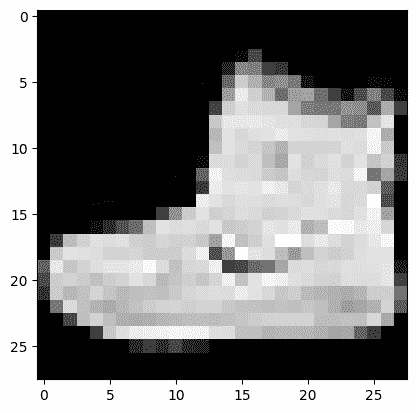

# 8.1. 激励示例：对自然图像进行分类#

> 原文：[`mmids-textbook.github.io/chap08_nn/01_motiv/roch-mmids-nn-motiv.html`](https://mmids-textbook.github.io/chap08_nn/01_motiv/roch-mmids-nn-motiv.html)

在本章中，我们回到分类问题。这次我们考虑更复杂的涉及自然图像的数据集。我们之前已经看到了一个例子，即 MNIST 数据集。我们使用一个称为 Fashion-MNIST 的相关数据集，由 [Zalando Research](https://engineering.zalando.com/tags/zalando-research.html) 开发。以下是他们的 [GitHub 仓库](https://github.com/zalandoresearch/fashion-mnist) 中的引用：

> Fashion-MNIST 是 Zalando 的文章图像数据集——包括 60,000 个训练示例和 10,000 个测试示例。每个示例是一个 28x28 的灰度图像，与 10 个类别中的一个标签相关联。我们希望 Fashion-MNIST 能够直接替换原始 MNIST 数据集，用于基准测试机器学习算法。它具有相同的图像大小和训练/测试分割的结构。

**图：** Fashion-MNIST 样本图像 ([来源](https://github.com/zalandoresearch/fashion-mnist))


\(\bowtie\)

我们首先加载数据并将其转换为适当的矩阵表示。数据可以通过 `torchvision.datasets.FashionMNIST` 访问。

```py
import torch
from torchvision import datasets, transforms
from torch.utils.data import DataLoader, TensorDataset

fashion_mnist = datasets.FashionMNIST(root='./data', train=True, 
                                      download=True, transform=transforms.ToTensor()) 
```

例如，第一张图像及其标签如下。下面的 `squeeze()` 函数移除了图像中的颜色维度，使其变为灰度图。

```py
img, label = fashion_mnist[0]
plt.figure()
plt.imshow(img.squeeze(), cmap='gray')
plt.show() 
```



```py
label 
```

```py
9 
```

这个标签并不特别有意义。可以通过以下方式获取实际类别的名称。

```py
def FashionMNIST_get_class_name(label):

    class_names = ["T-shirt/top", "Trouser", "Pullover", "Dress", 
    "Coat", "Sandal", "Shirt", "Sneaker", "Bag", "Ankle boot"]

    return class_names[label]

print(f"{label}: '{FashionMNIST_get_class_name(label)}'") 
```

```py
9: 'Ankle boot' 
```

本章的目的是开发一些用于解决这类分类问题的数学工具：

+   神经网络，

+   反向传播，

+   随机梯度下降。
