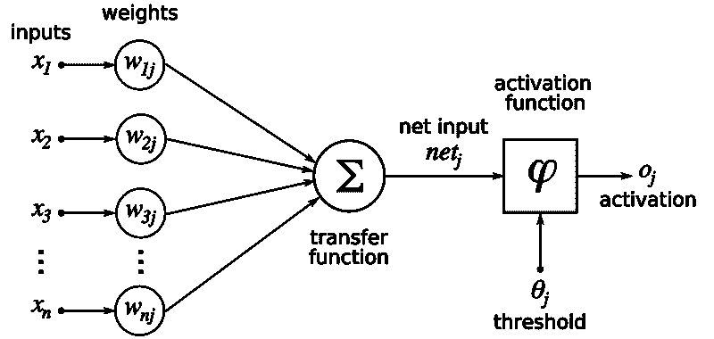
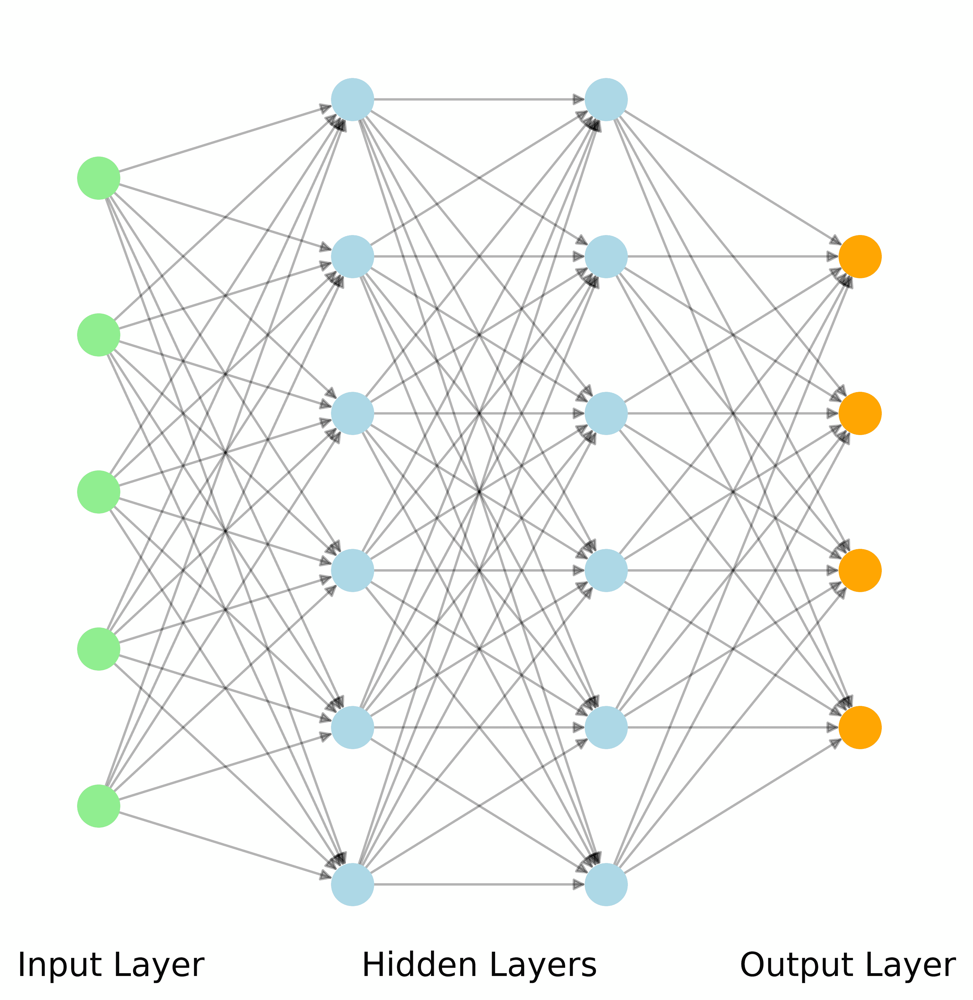

# 8.5. 建块 AI 3：神经网络

> 原文：[`mmids-textbook.github.io/chap08_nn/05_nn/roch-mmids-nn-nn.html`](https://mmids-textbook.github.io/chap08_nn/05_nn/roch-mmids-nn-nn.html)
> 
> 今天的研究论文表明，可以实施约翰·冯·诺伊曼的断言：“用 4 个参数我可以拟合一头大象，用 5 个参数我甚至可以让它晃动它的鼻子”
> 
> 论文在此：[`t.co/SvVrLuRFNy`](https://t.co/SvVrLuRFNy) [pic.twitter.com/VG37439vE7](https://t.co/VG37439vE7)
> 
> — Fermat's Library (@fermatslibrary) [2018 年 2 月 20 日](https://twitter.com/fermatslibrary/status/965971333422120962?ref_src=twsrc%5Etfw)

在本节中，我们介绍神经网络。与之前遇到的例子不同，这个例子不是凸的。根据我们在第三章中发展的理论，从下降方法中找到局部最小值是我们一般所能期望的最好的。然而，在许多应用场景中，随机梯度下降（及其一些变体）在计算适合数据的良好模型方面已被证明非常有效。为什么是这样仍然是一个未解之谜。

我们描述了基本设置，并将其应用于 Fashion-MNIST 数据集的分类。正如我们将看到的，我们将超过多项式逻辑回归（借助不同的优化方法）。我们使用一种特定的架构，称为多层感知器（MLP）$\idx{multilayer perceptron}\xdi$。这些是特殊类别的递进函数。

## 8.5.1. 多层感知器#

前馈神经网络的主层每个都有两个组成部分，一个仿射映射和一个非线性激活函数$\idx{activation function}\xdi$。对于后者，我们在这里限制自己使用 sigmoid 函数$\idx{sigmoid}\xdi$（尽管有[许多其他激活函数的选择](https://pytorch.org/docs/stable/nn.html#non-linear-activations-weighted-sum-nonlinearity)）。

元素版本的对数 sigmoid 函数的雅可比矩阵（我们稍后会用到）

$$ \bsigma(\mathbf{t}) = (\sigma_{1}(\mathbf{t}),\ldots,\sigma_{n}(\mathbf{t})) := (\sigma(t_1),\ldots,\sigma(t_{n})), $$

作为多个变量的函数可以通过$\sigma'$（即单变量情况的导数）来计算。确实，我们在先前的例子中看到$J_{\bsigma}(\mathbf{t})$是对角矩阵，其对角线元素为

$$ \sigma'(t_j) = \frac{e^{-t_j}}{(1 + e^{-t_j})²} = \sigma(t_j) (1 - \sigma(t_j)), \qquad j=1, \ldots, n, $$

我们将其表示为

$$ J_{\bsigma}(\mathbf{t}) = \mathrm{diag}(\bsigma'(\mathbf{t})) = \mathrm{diag}(\bsigma(\mathbf{t}) \odot (\mathbf{1} - \bsigma(\mathbf{t}))), $$

其中 $\bsigma'(\mathbf{t}) = (\sigma'(t_1), \ldots,\sigma'(t_{n}))$ 且 $\mathbf{1}$ 是全一向量。

我们考虑任意数量的层$\idx{layer}\xdi$ $L+2$。作为渐进函数$\idx{progressive function}\xdi$的特殊情况，隐藏层$\idx{hidden layer}\xdi$ $i$，$i=1,\ldots,L$，由一个连续可微的函数 $\mathbf{z}_i := \bfg_{i-1}(\mathbf{z}_{i-1}, \mathbf{w}_{i-1})$ 定义，它接受两个向量值输入：一个来自 $(i-1)$ 层的向量 $\mathbf{z}_{i-1} \in \mathbb{R}^{n_{i-1}}$ 和一个特定于第 $i$ 层的参数向量 $\mathbf{w}_{i-1} \in \mathbb{R}^{r_{i-1}}$

$$ \bfg_{i-1} = (g_{i-1,1},\ldots,g_{i-1,n_{i}}) : \mathbb{R}^{n_{i-1} + r_{i-1}} \to \mathbb{R}^{n_{i}}. $$

$\bfg_{i-1}$ 的输出 $\mathbf{z}_i$ 是一个 $\mathbb{R}^{n_{i}}$ 中的向量，它作为输入传递到第 $(i+1)$ 层。$\bfg_{i-1}$ 的每个组件被称为一个神经元。在这里 $r_{i-1} = n_{i} n_{i-1}$ 和 $\mathbf{w}_{i-1} = (\mathbf{w}^{(1)}_{i-1},\ldots,\mathbf{w}^{(n_{i})}_{i-1})$ 是参数，其中 $\mathbf{w}^{(k)}_{i-1} \in \mathbb{R}^{n_{i-1}}$ 对所有 $k$ 都成立。具体来说，$\bfg_{i-1}$ 由以下给出

$$ \bfg_{i-1}(\mathbf{z}_{i-1},\mathbf{w}_{i-1}) = \bsigma\left(\mathcal{W}_{i-1} \mathbf{z}_{i-1}\right) = \left(\sigma\left(\sum_{j=1}^{n_{i-1}} w^{(1)}_{i-1,j} z_{i-1,j}\right), \ldots, \sigma\left(\sum_{j=1}^{n_{i-1}} w^{(n_{i})}_{i-1,j} z_{i-1,j}\right)\right) $$

其中我们定义 $\mathcal{W}_{i-1} \in \mathbb{R}^{n_{i} \times n_{i-1}}$ 为具有行 $(\mathbf{w}_{i-1}^{(1)})^T,\ldots,(\mathbf{w}_{i-1}^{(n_{i})})^T$ 的矩阵。像之前一样，为了简化符号，我们忽略了线性组合中的常数项（或“偏差变量”$\idx{bias variable}\xdi$）。可以通过向每个神经元添加一个 $1$ 输入来包含它，如下所示。我们在此不详细说明这种复杂性。

**图示：** $g_i$ 的每个组件被称为一个神经元 ([来源](https://commons.wikimedia.org/wiki/File:ArtificialNeuronModel_english.png))



$\bowtie$

输入层$\idx{input layer}\xdi$ 是 $\mathbf{z}_0 := \mathbf{x}$，我们将其称为层 $0$，因此 $n_0 = d$。

与多项式逻辑回归类似，层 $L+1$（即输出层$\idx{output layer}\xdi$）是 softmax 函数

$$ \hat{\mathbf{y}} := \mathbf{z}_{L+1} := \bfg_{L}(\mathbf{z}_{L}, \mathbf{w}_{L}) = \bgamma(\mathcal{W}_L \mathbf{z}_{L}), $$

但这次我们将其与线性变换组合。我们隐含地假设 $\bgamma$ 有 $K$ 个输出，特别是我们有 $n_{L+1} = K$。

因此，具有参数 $\mathbf{w} =(\mathbf{w}_0,\ldots,\mathbf{w}_{L})$ 的分类器在输入 $\mathbf{x}$ 上的输出是

$$ \bfh(\mathbf{w}) = \bfg_{L}(\bfg_{L-1}(\cdots \bfg_1(\bfg_0(\mathbf{x},\mathbf{w}_0),\mathbf{w}_1), \cdots, \mathbf{w}_{L-1}), \mathbf{w}_{L}). $$

使其成为 MLP 的原因是，在每个层上，所有输出都馈入下一层的输入。在图形术语中，连续层之间的边形成一个完全二分图。



我们再次使用交叉熵$\idx{cross-entropy}\xdi$作为损失函数（尽管有许多[其他损失函数的选择](https://pytorch.org/docs/stable/nn.html#loss-functions)）。也就是说，我们设置

$$ \ell(\hat{\mathbf{y}}) = H(\mathbf{y}, \hat{\mathbf{y}}) = - \sum_{i=1}^K y_i \log \hat{y}_i. $$

最后，

$$ f(\mathbf{w}) = \ell(\mathbf{h}(\mathbf{w})). $$

## 8.5.2\. 第一个示例#

在详细说明计算梯度的通用算法之前，我们将我们的第一个渐进示例适应到这个设置中，以说明主要思想。假设$d=3$，$L=1$，$n_1 = n_2 = 2$，$K = 2$，即我们有一个隐藏层，我们的输出是二维的。固定一个数据样本$\mathbf{x} = (x_1,x_2,x_3) \in \mathbb{R}³, \mathbf{y} = (y_1, y_2) \in \mathbb{R}²$。对于$i=0, 1$，我们使用以下符号

$$\begin{split} \mathcal{W}_{0} = \begin{pmatrix} w_0 & w_1 & w_2\\ w_3 & w_4 & w_5 \end{pmatrix} \quad \text{and} \quad \mathcal{W}_{1} = \begin{pmatrix} w_6 & w_7\\ w_8 & w_9 \end{pmatrix} \end{split}$$

然后

$$ \ell(\hat{\mathbf{y}}) = H(\mathbf{y}, \hat{\mathbf{y}}) = - y_1 \log \hat{y}_1 - y_2 \log \hat{y}_2. $$

层函数如下

$$ \bfg_0(\mathbf{z}_0, \mathbf{w}_0) = \bsigma(\mathcal{W}_{0} \mathbf{z}_{0}) \quad\text{with}\quad \mathbf{w}_0 = (w_0, w_1, w_2, w_3, w_4, w_5) $$$$ \bfg_1(\mathbf{z}_1, \mathbf{w}_1) = \bgamma(\mathcal{W}_{1} \mathbf{z}_{1}) \quad\text{with}\quad \mathbf{w}_1 = (w_6, w_7, w_8, w_9). $$

我们试图计算

$$\begin{align*} f(\mathbf{w}) &= \ell(\bfg_1(\bfg_0(\mathbf{x},\mathbf{w}_0),\mathbf{w}_1))\\ &= H(\mathbf{y}, \bgamma(\mathcal{W}_{1} \bsigma(\mathcal{W}_{0} \mathbf{x}))\\ &= - y_1 \log \left[Z^{-1} \exp(w_6\sigma(w_0 x_1 + w_1 x_2 + w_2 x_3) + w_7\sigma(w_3 x_1 + w_4 x_2 + w_5 x_3))\right]\\ & \quad - y_2 \log \left[Z^{-1} \exp(w_8\sigma(w_0 x_1 + w_1 x_2 + w_2 x_3) + w_9\sigma(w_3 x_1 + w_4 x_2 + w_5 x_3))\right] \end{align*}$$

在哪里

$$\begin{align*} Z &= \exp(w_6\sigma(w_0 x_1 + w_1 x_2 + w_2 x_3) + w_7\sigma(w_3 x_1 + w_4 x_2 + w_5 x_3))\\ & \quad + \exp(w_8\sigma(w_0 x_1 + w_1 x_2 + w_2 x_3) + w_9\sigma(w_3 x_1 + w_4 x_2 + w_5 x_3)). \end{align*}$$

在正向阶段，我们计算$f$本身和所需的雅可比矩阵：

$$\begin{align*} &\mathbf{z}_0 := \mathbf{x}\\ & = (x_1, x_2, x_3)\\ &\mathbf{z}_1 := \bfg_0(\mathbf{z}_0, \mathbf{w}_0) = \bsigma(\mathcal{W}_{0} \mathbf{z}_{0})\\ &= \begin{pmatrix} \sigma(w_0 x_1 + w_1 x_2 + w_2 x_3)\\ \sigma(w_3 x_1 + w_4 x_2 + w_5 x_3) \end{pmatrix}\\ &J_{\bfg_0}(\mathbf{z}_0, \mathbf{w}_0) := J_{\bsigma}(\mathcal{W}_{0} \mathbf{z}_{0}) \begin{pmatrix} \mathbb{A}_{2}[\mathbf{w}_0] & \mathbb{B}_{2}[\mathbf{z}_0] \end{pmatrix}\\ &= \mathrm{diag}(\bsigma'(\mathcal{W}_{0} \mathbf{z}_{0})) \begin{pmatrix} \mathcal{W}_{0} & I_{2\times 2} \otimes \mathbf{z}_0^T \end{pmatrix}\\ &= \begin{pmatrix} \mathrm{diag}(\bsigma'(\mathcal{W}_{0} \mathbf{z}_{0})) \mathcal{W}_{0} & \mathrm{diag}(\bsigma'(\mathcal{W}_{0} \mathbf{z}_{0})) \otimes \mathbf{z}_0^T \end{pmatrix}, \end{align*}$$

其中我们使用了**链式法则**来计算 $J_{\bfg_0}$ 的雅可比矩阵。

然后

$$\begin{align*} &\hat{\mathbf{y}} := \mathbf{z}_2 := \bfg_1(\mathbf{z}_1, \mathbf{w}_1) = \bgamma(\mathcal{W}_{1} \mathbf{z}_{1})\\ &= \begin{pmatrix} Z^{-1} \exp(w_6\sigma(w_0 x_1 + w_1 x_2 + w_2 x_3) + w_7\sigma(w_3 x_1 + w_4 x_2 + w_5 x_3))\\ Z^{-1} \exp(w_8\sigma(w_0 x_1 + w_1 x_2 + w_2 x_3) + w_9\sigma(w_3 x_1 + w_4 x_2 + w_5 x_3)) \end{pmatrix}\\ &J_{\bfg_1}(\mathbf{z}_1, \mathbf{w}_1):= J_{\bgamma}(\mathcal{W}_{1} \mathbf{z}_{1}) \begin{pmatrix} \mathbb{A}_{2}[\mathbf{w}_1] & \mathbb{B}_{2}[\mathbf{z}_1] \end{pmatrix}\\ &= [\mathrm{diag}(\bgamma(\mathcal{W}_{1}\mathbf{z}_1)) - \bgamma(\mathcal{W}_{1}\mathbf{z}_1) \, \bgamma(\mathcal{W}_{1}\mathbf{z}_1)^T] \begin{pmatrix} \mathcal{W}_{1} & I_{2\times 2} \otimes \mathbf{z}_1^T \end{pmatrix}\\ &= \begin{pmatrix} [\mathrm{diag}(\bgamma(\mathcal{W}_{1}\mathbf{z}_1)) - \bgamma(\mathcal{W}_{1}\mathbf{z}_1) \, \bgamma(\mathcal{W}_{1}\mathbf{z}_1)^T] \mathcal{W}_{1} & [\mathrm{diag}(\bgamma(\mathcal{W}_{1}\mathbf{z}_1)) - \bgamma(\mathcal{W}_{1}\mathbf{z}_1) \, \bgamma(\mathcal{W}_{1}\mathbf{z}_1)^T] \otimes \mathbf{z}_1^T \end{pmatrix}, \end{align*}$$

其中 $Z$ 是之前引入的，我们使用了上一小节中 $J_{\bgamma}$ 的表达式。

最后

$$\begin{align*} &f(\mathbf{w}) := \ell(\hat{\mathbf{y}}) = H(\mathbf{y}, \hat{\mathbf{y}})\\ &= - y_1 \log \left[Z^{-1} \exp(w_6\sigma(w_0 x_1 + w_1 x_2 + w_2 x_3) + w_7\sigma(w_3 x_1 + w_4 x_2 + w_5 x_3))\right]\\ & \quad - y_2 \log \left[Z^{-1} \exp(w_8\sigma(w_0 x_1 + w_1 x_2 + w_2 x_3) + w_9\sigma(w_3 x_1 + w_4 x_2 + w_5 x_3))\right]\\ &J_{\ell}(\hat{\mathbf{y}}) = - (\mathbf{y} \oslash \hat{\mathbf{y}})^T. \end{align*}$$

我们首先计算关于$\mathbf{w}_1 = (w_6, w_7, w_8, w_9)$的偏导数。对于这一步，我们将$f$视为$\ell(\mathbf{z}_2)$作为$\mathbf{z}_2$的函数以及$\bfg_1(\mathbf{z}_1, \mathbf{w}_1) = \bgamma(\mathcal{W}_1 \mathbf{z}_1)$作为$\mathbf{w}_1$的函数的复合。在这里，$\mathbf{z}_1$不依赖于$\mathbf{w}_1$，因此可以在这个计算中将其视为固定。通过**链式法则**和**Kronecker 积的性质**，我们得到

$$\begin{align*} &\begin{pmatrix}\frac{\partial f(\mathbf{w})}{\partial w_6} & \frac{\partial f(\mathbf{w})}{\partial w_7} & \frac{\partial f(\mathbf{w})}{\partial w_8} & \frac{\partial f(\mathbf{w})}{\partial w_9} \end{pmatrix}\\ &= - (\mathbf{y} \oslash \hat{\mathbf{y}})^T \left\{ \,[\mathrm{diag}(\bgamma(\mathcal{W}_{1}\mathbf{z}_1)) - \bgamma(\mathcal{W}_{1}\mathbf{z}_1) \, \bgamma(\mathcal{W}_{1}\mathbf{z}_1)^T] \otimes \mathbf{z}_1^T \right\}\\ &= \left\{- (\mathbf{y} \oslash \bgamma(\mathcal{W}_{1} \mathbf{z}_{1}))^T \,[\mathrm{diag}(\bgamma(\mathcal{W}_{1}\mathbf{z}_1)) - \bgamma(\mathcal{W}_{1}\mathbf{z}_1) \, \bgamma(\mathcal{W}_{1}\mathbf{z}_1)^T] \right\} \otimes \mathbf{z}_1^T\\ &= (\bgamma(\mathcal{W}_{1}\mathbf{z}_1) - \mathbf{y})^T \otimes \mathbf{z}_1^T\\ &= (\hat{\mathbf{y}} - \mathbf{y})^T \otimes \bsigma(\mathcal{W}_{0} \mathbf{x})^T, \end{align*}$$

其中我们使用了**Hadamard 积的性质**以及$\hat{\mathbf{y}} = \bgamma(\mathcal{W}_{1} \mathbf{z}_{1})$的事实，这与我们在多项式逻辑回归设置中进行的计算类似。

要计算关于$\mathbf{w}_0 = (w_0, w_1, \ldots, w_5)$的偏导数，我们首先需要计算关于$\mathbf{z}_1 = (z_{1,1}, z_{1,2})$的偏导数，因为$f$通过它依赖于$\mathbf{w}_0$。对于这个计算，我们再次将$f$视为$\ell(\bfg_1(\mathbf{z}_1, \mathbf{w}_1))$的复合函数，但这次我们的重点是变量$\mathbf{z}_1$。这几乎与之前的计算相同，只是我们使用了对应于关于$\mathbf{z}_1$的偏导数的$J_{\bfg_1}(\mathbf{z}_1, \mathbf{w}_1)$的块（即“$A$”块）。我们得到

$$\begin{align*} &\begin{pmatrix}\frac{\partial f(\mathbf{w})}{\partial z_{1,1}} & \frac{\partial f(\mathbf{w})}{\partial z_{1,2}} \end{pmatrix}\\ &= - (\mathbf{y} \oslash \hat{\mathbf{y}})^T \left\{ \,[\mathrm{diag}(\bgamma(\mathcal{W}_{1}\mathbf{z}_1)) - \bgamma(\mathcal{W}_{1}\mathbf{z}_1) \, \bgamma(\mathcal{W}_{1}\mathbf{z}_1)^T] \mathcal{W}_{1} \right\}\\ &= - (\mathbf{y} \oslash \bgamma(\mathcal{W}_{1}\mathbf{z}_1))^T \,[\mathrm{diag}(\bgamma(\mathcal{W}_{1}\mathbf{z}_1)) - \bgamma(\mathcal{W}_{1}\mathbf{z}_1) \, \bgamma(\mathcal{W}_{1}\mathbf{z}_1)^T] \mathcal{W}_{1}\\ &= (\bgamma(\mathcal{W}_{1}\mathbf{z}_1) - \mathbf{y})^T \mathcal{W}_{1} \end{align*}$$

向量 $\left(\frac{\partial f(\mathbf{w})}{\partial z_{1,1}}, \frac{\partial f(\mathbf{w})}{\partial z_{1,2}}\right)$ 被称为伴随向量。

现在我们计算 $\mathbf{f}$ 关于 $\mathbf{w}_0 = (w_0, w_1, \ldots, w_5)$ 的梯度。为此，我们将 $f$ 视为 $\ell(\bfg_1(\mathbf{z}_1, \mathbf{w}_1))$ 作为 $\mathbf{z}_1$ 的函数和 $\bfg_0(\mathbf{z}_0, \mathbf{w}_0)$ 作为 $\mathbf{w}_0$ 的函数的组合。在这里，$\mathbf{w}_1$ 和 $\mathbf{z}_0$ 不依赖于 $\mathbf{w}_0$，因此可以在这个计算中视为固定。根据**链式法则**

$$\begin{align*} &\begin{pmatrix}\frac{\partial f(\mathbf{w})}{\partial w_0} & \frac{\partial f(\mathbf{w})}{\partial w_1} & \frac{\partial f(\mathbf{w})}{\partial w_2} & \frac{\partial f(\mathbf{w})}{\partial w_3} & \frac{\partial f(\mathbf{w})}{\partial w_4} & \frac{\partial f(\mathbf{w})}{\partial w_5} \end{pmatrix}\\ &= (\bgamma(\mathcal{W}_{1}\mathbf{z}_1) - \mathbf{y})^T \mathcal{W}_{1} \left[\mathrm{diag}(\bsigma'(\mathcal{W}_{0} \mathbf{z}_{0})) \otimes \mathbf{z}_0^T\right]\\ &= [(\bgamma(\mathcal{W}_{1}\mathbf{z}_1) - \mathbf{y})^T \mathcal{W}_{1} \mathrm{diag}(\bsigma'(\mathcal{W}_{0} \mathbf{z}_{0}))] \otimes \mathbf{z}_0^T\\ &= [(\hat{\mathbf{y}} - \mathbf{y})^T \mathcal{W}_{1} \mathrm{diag}(\bsigma'(\mathcal{W}_{0} \mathbf{z}_{0}))] \otimes \mathbf{z}_0^T\\ &= [(\hat{\mathbf{y}} - \mathbf{y})^T \mathcal{W}_{1} \mathrm{diag}(\bsigma(\mathcal{W}_{0} \mathbf{x}) \odot (\mathbf{1} - \bsigma(\mathcal{W}_{0} \mathbf{x})))] \otimes \mathbf{x}^T \end{align*}$$

在倒数第二行中，我们使用了**克罗内克积的性质 (f**)，在最后一行中，我们使用了 sigmoid 函数的导数表达式。

总结一下，

$$\begin{align*} \nabla f(\mathbf{w})^T &= \begin{pmatrix} [(\hat{\mathbf{y}} - \mathbf{y})^T \mathcal{W}_{1} \mathrm{diag}(\bsigma(\mathcal{W}_{0} \mathbf{x}) \odot (\mathbf{1} - \bsigma(\mathcal{W}_{0} \mathbf{x})))] \otimes \mathbf{x}^T & (\hat{\mathbf{y}} - \mathbf{y})^T \otimes \bsigma(\mathcal{W}_{0} \mathbf{x})^T \end{pmatrix} \end{align*}$$

**数值角**: 我们回到上一节中的具体例子。我们将梯度重新写为

$$\begin{align*} \nabla f(\mathbf{w})^T &= \begin{pmatrix} [(\mathbf{z}_2 - \mathbf{y})^T \mathcal{W}_{1} \mathrm{diag}(\mathbf{z}_1 \odot (\mathbf{1} - \mathbf{z}_1))] \otimes \mathbf{z}_0^T & (\mathbf{z}_2 - \mathbf{y})^T \otimes \mathbf{z}_1^T \end{pmatrix}. \end{align*}$$

我们将使用 `torch.nn.functional.sigmoid` 和 `torch.nn.functional.softmax` 分别来计算 sigmoid 和 softmax 函数。我们还使用 `torch.dot` 来计算两个向量（作为张量）的内积（即点积），以及 `torch.diag` 来创建具有指定对角线元素的对角矩阵。

```py
import torch.nn.functional as F

x = torch.tensor([1.,0.,-1.])
y = torch.tensor([0.,1.])
W0 = torch.tensor([[0.,1.,-1.],[2.,0.,1.]], requires_grad=True)
W1 = torch.tensor([[-1.,0.],[2.,-1.]], requires_grad=True)

z0 = x
z1 = F.sigmoid(W0 @ z0)
z2 = F.softmax(W1 @ z1, dim=0)
f = -torch.dot(torch.log(z2), y)

print(z0) 
```

```py
tensor([ 1.,  0., -1.]) 
```

```py
print(z1) 
```

```py
tensor([0.7311, 0.7311], grad_fn=<SigmoidBackward0>) 
```

```py
print(z2) 
```

```py
tensor([0.1881, 0.8119], grad_fn=<SoftmaxBackward0>) 
```

```py
print(f) 
```

```py
tensor(0.2084, grad_fn=<NegBackward0>) 
```

我们使用 AD（自动微分）来计算梯度 $\nabla f(\mathbf{w})$。

```py
f.backward()
print(W0.grad) 
```

```py
tensor([[-0.1110, -0.0000,  0.1110],
        [ 0.0370,  0.0000, -0.0370]]) 
```

```py
print(W1.grad) 
```

```py
tensor([[ 0.1375,  0.1375],
        [-0.1375, -0.1375]]) 
```

我们使用我们的公式来验证它们与这些结果相匹配。

```py
with torch.no_grad():
    grad_W0 = torch.kron((z2 - y).unsqueeze(0) @ W1 @ torch.diag(z1 * (1-z1)), z0.unsqueeze(0))
    grad_W1 = torch.kron((z2 - y).unsqueeze(0), z1.unsqueeze(0))

print(grad_W0) 
```

```py
tensor([[-0.1110, -0.0000,  0.1110,  0.0370,  0.0000, -0.0370]]) 
```

```py
print(grad_W1) 
```

```py
tensor([[ 0.1375,  0.1375, -0.1375, -0.1375]]) 
```

结果与 AD 输出相匹配。

$\unlhd$

## 8.5.3\. 计算梯度#

现在我们详细说明如何计算一般 MLP（多层感知器）的 $f(\mathbf{w})$ 的梯度。在正向循环中，我们首先设置 $\mathbf{z}_0 := \mathbf{x}$，然后对于 $i = 0,1,\ldots,L-1$

$$\begin{align*} \mathbf{z}_{i+1} &:= \bfg_i(\mathbf{z}_i,\mathbf{w}_i) = \bsigma\left(\mathcal{W}_i \mathbf{z}_i\right)\\ \begin{pmatrix} A_i & B_i \end{pmatrix} &:= J_{\bfg_i}(\mathbf{z}_i,\mathbf{w}_i). \end{align*}$$

要计算 $\bfg_i$ 的雅可比矩阵，我们使用链式法则在复合函数 $\bfg_i(\mathbf{z}_i,\mathbf{w}_i) = \bsigma(\bfk_i(\mathbf{z}_i,\mathbf{w}_i))$ 上进行计算，其中我们定义 $\bfk_i(\mathbf{z}_i,\mathbf{w}_i) = \mathcal{W}_i \mathbf{z}_i$。也就是说，

$$ J_{\bfg_i}(\mathbf{z}_i,\mathbf{w}_i) = J_{\bsigma}\left(\mathcal{W}_i \mathbf{z}_i\right) J_{\bfk_i}(\mathbf{z}_i,\mathbf{w}_i). $$

在我们对多项式逻辑回归的分析中，我们计算了 $\bfk_i$ 的雅可比矩阵。我们得到了

$$ J_{\bfk_i}(\mathbf{z}_i,\mathbf{w}_i) = \begin{pmatrix} \mathbb{A}_{n_{i+1}}[\mathbf{w}_i] & \mathbb{B}_{n_{i+1}}[\mathbf{z}_i] \end{pmatrix}. $$

回想一下

$$ \mathbb{A}_{n_{i+1}}[\mathbf{w}_i] = \mathcal{W}_i. $$

和

$$ \mathbb{B}_{n_{i+1}}[\mathbf{z}_i] = \begin{pmatrix} \mathbf{e}_1 \mathbf{z}_i^T & \cdots & \mathbf{e}_{n_{i+1}}\mathbf{z}_i^T \end{pmatrix} = I_{n_{i+1}\times n_{i+1}} \otimes \mathbf{z}_i^T, $$

其中 $\mathbf{e}_{j}$ 是 $\mathbb{R}^{n_{i+1}}$ 中第 $j$ 个标准基向量。

从之前的计算中，我们得到了雅可比矩阵

$$ \bsigma(\mathbf{t}) = (\sigma_{1}(\mathbf{t}),\ldots,\sigma_{n_{i+1}}(\mathbf{t})) := (\sigma(t_1),\ldots,\sigma(t_{n_{i+1}})), $$

是

$$ J_{\bsigma}(\mathbf{t}) = \mathrm{diag}(\bsigma(\mathbf{t}) \odot (\mathbf{1} - \bsigma(\mathbf{t}))). $$

结合前面的公式，我们得到

$$\begin{align*} J_{\bfg_i}(\mathbf{z}_i,\mathbf{w}_i) &= J_{\bsigma}\left(\mathcal{W}_i \mathbf{z}_i\right) J_{\bfk_i}(\mathbf{z}_i,\mathbf{w}_i)\\ &= \mathrm{diag}\left(\bsigma\left(\mathcal{W}_i \mathbf{z}_i\right) \odot (\mathbf{1} - \bsigma\left(\mathcal{W}_i \mathbf{z}_i\right))\right) \begin{pmatrix} \mathbb{A}_{n_{i+1}}[\mathbf{w}_i] & \mathbb{B}_{n_{i+1}}[\mathbf{z}_i] \end{pmatrix}\\ &=\begin{pmatrix} \widetilde{\mathbb{A}}_{n_{i+1}}[\mathbf{z}_i,\mathbf{w}_i] & \widetilde{\mathbb{B}}_{n_{i+1}}[\mathbf{z}_i,\mathbf{w}_i] \end{pmatrix} \end{align*}$$

其中我们定义

$$ \widetilde{\mathbb{A}}_{n_{i+1}}[\mathbf{z}_i,\mathbf{w}_i] = \mathrm{diag}\left(\bsigma\left(\mathcal{W}_i \mathbf{z}_i\right) \odot (\mathbf{1} - \bsigma\left(\mathcal{W}_i \mathbf{z}_i\right))\right) \mathcal{W}_i, $$

和

$$\begin{align*} \widetilde{\mathbb{B}}_{n_{i+1}}[\mathbf{z}_i,\mathbf{w}_i] &= \mathrm{diag}\left(\bsigma\left(\mathcal{W}_i \mathbf{z}_i\right) \odot (\mathbf{1} - \bsigma\left(\mathcal{W}_i \mathbf{z}_i\right))\right) \left(I_{n_{i+1}\times n_{i+1}} \otimes \mathbf{z}_i^T\right)\\ &= \mathrm{diag}\left(\bsigma\left(\mathcal{W}_i \mathbf{z}_i\right) \odot (\mathbf{1} - \bsigma\left(\mathcal{W}_i \mathbf{z}_i\right))\right) \otimes \mathbf{z}_i^T, \end{align*}$$

其中我们使用了克朗内克积的性质（f）。

对于第 $L+1$ 层（即输出层），我们之前已经计算了由线性变换与 softmax 函数组合的雅可比矩阵。我们得到

$$\begin{align*} &\mathbf{z}_{L+1} := \bfg_{L}(\mathbf{z}_{L}, \mathbf{w}_{L})\\ &= \bgamma(\mathcal{W}_{L} \mathbf{z}_{L})\\ &\begin{pmatrix} A_{L} & B_{L} \end{pmatrix} := J_{\bfg_{L}}(\mathbf{z}_{L}, \mathbf{w}_{L})\\ &= \begin{pmatrix} [\mathrm{diag}(\bgamma(\mathcal{W}_{L}\mathbf{z}_L)) - \bgamma(\mathcal{W}_{L}\mathbf{z}_L) \, \bgamma(\mathcal{W}_{L}\mathbf{z}_L)^T] \mathcal{W}_{L} & [\mathrm{diag}(\bgamma(\mathcal{W}_{L}\mathbf{z}_L)) - \bgamma(\mathcal{W}_{L}\mathbf{z}_L) \, \bgamma(\mathcal{W}_{L}\mathbf{z}_L)^T] \otimes \mathbf{z}_L^T \end{pmatrix}\\ &=: \begin{pmatrix} \widetilde{\mathbb{C}}_K[\mathbf{z}_{L}, \mathbf{w}_{L}]& \widetilde{\mathbb{D}}_K[\mathbf{z}_{L}, \mathbf{w}_{L}] \end{pmatrix} \end{align*}$$

同样，在多项式逻辑回归的情况下，损失和损失梯度是

$$\begin{align*} \mathbf{z}_{L+2} &:= \ell(\mathbf{z}_{L+1}) = - \sum_{i=1}^K y_i \log z_{L+1,i}\\ \mathbf{q}_{L+1} &:= \nabla \ell(\mathbf{z}_{L+1}) = \left(- \frac{y_1}{z_{L+1,1}},\ldots,- \frac{y_K}{z_{L+1,K}}\right). \end{align*}$$

*初始化:* $\mathbf{z}_0 := \mathbf{x}$

*前向循环:* 对于 $i = 0,1,\ldots,L-1$:

$$\begin{align*} \mathbf{z}_{i+1} &:= g_i(\mathbf{z}_i,\mathbf{w}_i) = \bsigma\left(\mathcal{W}_i \mathbf{z}_i \right)\\ \begin{pmatrix} A_i & B_i \end{pmatrix} &:= J_{\bfg_i}(\mathbf{z}_i,\mathbf{w}_i) =\begin{pmatrix} \widetilde{\mathbb{A}}_{n_{i+1}}[\mathbf{z}_i,\mathbf{w}_i] & \widetilde{\mathbb{B}}_{n_{i+1}}[\mathbf{z}_i,\mathbf{w}_i] \end{pmatrix} \end{align*}$$

和

$$\begin{align*} \mathbf{z}_{L+1} &:= \bfg_{L}(\mathbf{z}_{L}, \mathbf{w}_{L}) = \bgamma(\mathcal{W}_{L} \mathbf{z}_{L})\\ \begin{pmatrix} A_{L} & B_{L} \end{pmatrix} &:= J_{\bfg_{L}}(\mathbf{z}_{L}, \mathbf{w}_{L}) = \begin{pmatrix} \widetilde{\mathbb{C}}_K[\mathbf{z}_{L}, \mathbf{w}_{L}]& \widetilde{\mathbb{D}}_K[\mathbf{z}_{L}, \mathbf{w}_{L}] \end{pmatrix}. \end{align*}$$

*损失:*

$$\begin{align*} \mathbf{z}_{L+2} &:= \ell(\mathbf{z}_{L+1})\\ \mathbf{p}_{L+1} &:= \nabla {\ell}(\mathbf{z}_{L+1}) = \left(- \frac{y_1}{z_{L+1,1}},\ldots,- \frac{y_K}{z_{L+1,K}}\right). \end{align*}$$

*反向循环:*

$$\begin{align*} \mathbf{p}_{L} := A_{L}^T \,\mathbf{p}_{L+1} &= \widetilde{\mathbb{C}}_{K}[\mathbf{z}_{L}]^T \mathbf{p}_{L+1}\\ \mathbf{q}_{L} := B_{L}^T \,\mathbf{p}_{L+1} &= \widetilde{\mathbb{D}}_{K}[\mathbf{z}_{L}]^T \mathbf{p}_{L+1} \end{align*}$$

对于 $i = L-1,L-2,\ldots,1,0$：

$$\begin{align*} \mathbf{p}_{i} &:= A_i^T \mathbf{p}_{i+1} = \widetilde{\mathbb{A}}_{n_{i+1}}[\mathbf{z}_i,\mathbf{w}_i]^T \mathbf{p}_{i+1}\\ \mathbf{q}_{i} &:= B_i^T \mathbf{p}_{i+1} = \widetilde{\mathbb{B}}_{n_{i+1}}[\mathbf{z}_i,\mathbf{w}_i]^T \mathbf{p}_{i+1} \end{align*}$$

*输出:*

$$ \nabla f(\mathbf{w}) = (\mathbf{q}_0,\mathbf{q}_1,\ldots,\mathbf{q}_{L}). $$

**数值角**: 我们在 PyTorch 中实现了神经网络的训练。我们再次使用 Fashion-MNIST 数据集。我们首先再次加载它。我们还检查了 GPU 的可用性。

```py
device = torch.device('cuda' if torch.cuda.is_available() 
                      else ('mps' if torch.backends.mps.is_available() 
                            else 'cpu'))
print('Using device:', device) 
```

```py
Using device: mps 
```

```py
from torchvision import datasets, transforms
from torch.utils.data import DataLoader
import torch.nn as nn
import torch.optim as optim

seed = 42
torch.manual_seed(seed)

if device.type == 'cuda': # device-specific seeding and settings
    torch.cuda.manual_seed(seed)
    torch.cuda.manual_seed_all(seed)  # for multi-GPU
    torch.backends.cudnn.deterministic = True
    torch.backends.cudnn.benchmark = False
elif device.type == 'mps':
    torch.mps.manual_seed(seed)  # MPS-specific seeding

g = torch.Generator()
g.manual_seed(seed)

train_dataset = datasets.FashionMNIST(root='./data', train=True, 
                               download=True, transform=transforms.ToTensor())
test_dataset = datasets.FashionMNIST(root='./data', train=False, 
                              download=True, transform=transforms.ToTensor())

BATCH_SIZE = 32
train_loader = DataLoader(train_dataset, batch_size=BATCH_SIZE, shuffle=True, generator=g)
test_loader = DataLoader(test_dataset, batch_size=BATCH_SIZE, shuffle=False) 
```

我们构建了一个两层模型。

```py
model = nn.Sequential(
    nn.Flatten(),                      # Flatten the input
    nn.Linear(28 * 28, 32),            # First Linear layer with 32 nodes
    nn.Sigmoid(),                      # Sigmoid activation function
    nn.Linear(32, 10)                  # Second Linear layer with 10 nodes (output layer)
).to(device) 
```

正如我们在多项式逻辑回归中所做的那样，我们使用 SGD 优化器和交叉熵损失（在 PyTorch 中包括 softmax 函数，并期望标签是实际类别标签而不是 one-hot 编码）。

```py
loss_fn = nn.CrossEntropyLoss()  
optimizer = optim.SGD(model.parameters(), lr=1e-3) 
```

我们训练了 10 个周期。

```py
mmids.training_loop(train_loader, model, loss_fn, optimizer, device, epochs=10) 
```

在测试数据上，我们得到：

```py
mmids.test(test_loader, model, loss_fn, device) 
```

```py
Test error: 64.0% accuracy 
```

令人失望的是，这比我们使用多项式逻辑回归获得的结果差得多。结果是，使用不同的优化器可以得到更好的结果。

```py
loss_fn = nn.CrossEntropyLoss()  
optimizer = optim.Adam(model.parameters())
mmids.training_loop(train_loader, model, loss_fn, optimizer, device, epochs=10) 
```

```py
mmids.test(test_loader, model, loss_fn, device) 
```

```py
Test error: 87.1% accuracy 
```

**聊天与学习**: 我们提到 PyTorch 中除了 SGD 和 Adam 之外还有许多优化器可用。请你的首选 AI 聊天机器人解释并实现一个不同的优化器，例如 Adagrad 或 RMSprop，用于 MLP。将结果与使用 SGD 和 Adam 获得的结果进行比较。（[在 Colab 中打开](https://colab.research.google.com/github/MMiDS-textbook/MMiDS-textbook.github.io/blob/main/just_the_code/roch_mmids_chap_nn_notebook.ipynb)) $\ddagger$

$\unlhd$

**CHAT & LEARN** 正则化技术通常用于防止神经网络过拟合。向你的心仪 AI 聊天机器人询问$L_1$和$L_2$正则化、dropout 和提前停止。讨论这些技术如何融入训练过程及其对学习模型的影响。 $\ddagger$

***自我评估测验*** *(在 Claude、Gemini 和 ChatGPT 的帮助下)*

**1** 在多层感知器（MLP）中 sigmoid 函数的作用是什么？

a) 它被用作训练 MLP 的损失函数。

b) 它被用作 MLP 每一层的非线性激活函数。

c) 它用于计算关于权重的损失函数的梯度。

d) 它用于初始化 MLP 的权重。

**2** 在 MLP 中，输出层中的 softmax 函数的目的是什么？

a) 将非线性引入模型。

b) 将输出归一化成一个概率分布。

c) 计算损失函数的梯度。

d) 减少输出的维度。

**3** 元素级 sigmoid 函数 $\boldsymbol{\sigma}(\mathbf{t}) = (\sigma(t_1), \dots, \sigma(t_n))$ 的雅可比矩阵是什么？

a) $J_{\boldsymbol{\sigma}}(\mathbf{t}) = \mathrm{diag}(\boldsymbol{\sigma}(\mathbf{t}))$

b) $J_{\boldsymbol{\sigma}}(\mathbf{t}) = \boldsymbol{\sigma}(\mathbf{t}) \odot (1-\boldsymbol{\sigma}(\mathbf{t}))$

c) $J_{\boldsymbol{\sigma}}(\mathbf{t}) = \mathrm{diag}(\boldsymbol{\sigma}(\mathbf{t}) \odot (1 - \boldsymbol{\sigma}(\mathbf{t})))$

d) $J_{\boldsymbol{\sigma}}(\mathbf{t}) = \boldsymbol{\sigma}(\mathbf{t})(1 - \boldsymbol{\sigma}(\mathbf{t}))^T$

**4** 在计算 MLP 中损失函数梯度的正向阶段，第$i$个隐藏层的输出是什么？

a) $\mathbf{z}_{i+1} := \mathbf{g}_i(\mathbf{z}_i, \mathbf{w}_i) = \boldsymbol{\sigma}(\mathcal{W}_i \mathbf{z}_i)$

b) $\mathbf{z}_{i+1} := \mathbf{g}_i(\mathbf{z}_i, \mathbf{w}_i) = \mathcal{W}_i \mathbf{z}_i$

c) $\mathbf{z}_{i+1} := \mathbf{g}_i(\mathbf{z}_i, \mathbf{w}_i) = \boldsymbol{\gamma}(\mathcal{W}_i \mathbf{z}_i)$

d) $\mathbf{z}_{i+1} := \mathbf{g}_i(\mathbf{z}_i, \mathbf{w}_i) = \mathcal{W}_i \boldsymbol{\sigma}(\mathbf{z}_i)$

**5** 在计算 MLP 中损失函数的梯度时，反向循环的输出是什么？

a) 关于每一层激活的损失函数的梯度。

b) 关于每一层权重的损失函数的梯度。

c) MLP 的更新权重。

d) 损失函数的值。

1 的答案：b. 理由：文本中提到“前馈神经网络的主要每一层都有两个组成部分，一个是仿射映射，另一个是非线性激活函数。对于后者，我们在这里限制自己使用 sigmoid 函数。”

2 的答案：b. 理由：文本中提到 softmax 函数用于输出层以生成关于可能类别的概率分布。

答案为 3：c. 理由：文本指出逐元素 sigmoid 函数的雅可比矩阵是：

$$ J_{\boldsymbol{\sigma}}(t) = \mathrm{diag}(\boldsymbol{\sigma}'(t)) = \mathrm{diag}(\boldsymbol{\sigma}(t) \odot (1 - \boldsymbol{\sigma}(t))) $$

其中 $\odot$ 表示 Hadamard（逐元素）乘积。

答案为 4：a. 理由：文本定义第 $i$ 个隐藏层的输出为：

$$ \mathbf{z}_{i+1} := \mathbf{g}_i(\mathbf{z}_i, \mathbf{w}_i) = \boldsymbol{\sigma}(\mathcal{W}_i \mathbf{z}_i) $$

其中 $\boldsymbol{\sigma}$ 是 sigmoid 激活函数，$\mathcal{W}_i$ 是第 $i$ 层的权重矩阵。

答案为 5：b. 理由：文本指出反向循环的输出是相对于每层权重的损失函数的梯度：

$$ \nabla f(\mathbf{w}) = (\mathbf{q}_0, \mathbf{q}_1, \dots, \mathbf{q}_L) $$

其中 $\mathbf{q}_i := B_i^T \mathbf{p}_{i+1} = \widetilde{\mathbb{B}}_{n_{i+1}}[\mathbf{z}_i, \mathbf{w}_i]^T \mathbf{p}_{i+1}$ 是相对于第 $i$ 层权重的梯度。

## 8.5.1\. 多层感知器#

前馈神经网络的主要层有两个组成部分，一个仿射映射和一个非线性激活函数$\idx{激活函数}\xdi$。对于后者，我们在这里限制自己使用 sigmoid 函数$\idx{sigmoid}\xdi$（尽管有其他许多[激活函数的选择](https://pytorch.org/docs/stable/nn.html#non-linear-activations-weighted-sum-nonlinearity)）。

sigmoid 函数逐元素版本的雅可比矩阵（我们稍后会用到）

$$ \bsigma(\mathbf{t}) = (\sigma_{1}(\mathbf{t}),\ldots,\sigma_{n}(\mathbf{t})) := (\sigma(t_1),\ldots,\sigma(t_{n})), $$

作为多个变量的函数可以通过 $\sigma'$ 来计算，即单变量情况的导数。实际上，我们在先前的例子中已经看到 $J_{\bsigma}(\mathbf{t})$ 是一个对角矩阵，其对角元素

$$ \sigma'(t_j) = \frac{e^{-t_j}}{(1 + e^{-t_j})²} = \sigma(t_j) (1 - \sigma(t_j)), \qquad j=1, \ldots, n, $$

我们将其表示为

$$ J_{\bsigma}(\mathbf{t}) = \mathrm{diag}(\bsigma'(\mathbf{t})) = \mathrm{diag}(\bsigma(\mathbf{t}) \odot (\mathbf{1} - \bsigma(\mathbf{t}))), $$

其中 $\bsigma'(\mathbf{t}) = (\sigma'(t_1), \ldots,\sigma'(t_{n}))$，$\mathbf{1}$ 是全 1 向量。

我们考虑任意数量的层$\idx{layer}\xdi$ $L+2$。作为渐进函数$\idx{progressive function}\xdi$的特殊情况，隐藏层$\idx{hidden layer}\xdi$ $i$，$i=1,\ldots,L$，由一个连续可微的函数 $\mathbf{z}_i := \bfg_{i-1}(\mathbf{z}_{i-1}, \mathbf{w}_{i-1})$ 定义，它接受两个向量值输入：一个来自 $(i-1)$ 层的向量 $\mathbf{z}_{i-1} \in \mathbb{R}^{n_{i-1}}$ 和一个属于 $i$ 层的参数向量 $\mathbf{w}_{i-1} \in \mathbb{R}^{r_{i-1}}$。

$$ \bfg_{i-1} = (g_{i-1,1},\ldots,g_{i-1,n_{i}}) : \mathbb{R}^{n_{i-1} + r_{i-1}} \to \mathbb{R}^{n_{i}}. $$

$\bfg_{i-1}$ 的输出 $\mathbf{z}_i$ 是 $\mathbb{R}^{n_{i}}$ 中的一个向量，它作为输入传递到 $(i+1)$ 层。$\bfg_{i-1}$ 的每个组成部分被称为神经元。在这里 $r_{i-1} = n_{i} n_{i-1}$ 且 $\mathbf{w}_{i-1} = (\mathbf{w}^{(1)}_{i-1},\ldots,\mathbf{w}^{(n_{i})}_{i-1})$ 是参数，其中 $\mathbf{w}^{(k)}_{i-1} \in \mathbb{R}^{n_{i-1}}$ 对所有 $k$ 都成立。特别是，$\bfg_{i-1}$ 由以下给出

$$ \bfg_{i-1}(\mathbf{z}_{i-1},\mathbf{w}_{i-1}) = \bsigma\left(\mathcal{W}_{i-1} \mathbf{z}_{i-1}\right) = \left(\sigma\left(\sum_{j=1}^{n_{i-1}} w^{(1)}_{i-1,j} z_{i-1,j}\right), \ldots, \sigma\left(\sum_{j=1}^{n_{i-1}} w^{(n_{i})}_{i-1,j} z_{i-1,j}\right)\right) $$

其中我们定义 $\mathcal{W}_{i-1} \in \mathbb{R}^{n_{i} \times n_{i-1}}$ 为具有行 $(\mathbf{w}_{i-1}^{(1)})^T,\ldots,(\mathbf{w}_{i-1}^{(n_{i})})^T$ 的矩阵。像之前一样，为了简化符号，我们忽略了 $\mathbf{z}_{i-1}$ 线性组合中的常数项（或“偏变量”$\idx{bias variable}\xdi$）。可以通过向每个神经元添加一个 $1$ 输入来包含它，如下所示。我们在此不详细说明这种复杂性。

**图示：** $g_i$ 的每个组成部分被称为神经元 ([来源](https://commons.wikimedia.org/wiki/File:ArtificialNeuronModel_english.png))


$\bowtie$

输入层$\idx{input layer}\xdi$是 $\mathbf{z}_0 := \mathbf{x}$，我们将其称为层 $0$，因此 $n_0 = d$。

类似于多项式逻辑回归，层 $L+1$（即输出层$\idx{output layer}\xdi$）是 softmax 函数

$$ \hat{\mathbf{y}} := \mathbf{z}_{L+1} := \bfg_{L}(\mathbf{z}_{L}, \mathbf{w}_{L}) = \bgamma(\mathcal{W}_L \mathbf{z}_{L}), $$

但这次我们通过线性变换来组合它。我们隐含地假设 $\bgamma$ 有 $K$ 个输出，特别是我们有 $n_{L+1} = K$。

因此，具有参数 $\mathbf{w} =(\mathbf{w}_0,\ldots,\mathbf{w}_{L})$ 的分类器在输入 $\mathbf{x}$ 上的输出是

$$ \bfh(\mathbf{w}) = \bfg_{L}(\bfg_{L-1}(\cdots \bfg_1(\bfg_0(\mathbf{x},\mathbf{w}_0),\mathbf{w}_1), \cdots, \mathbf{w}_{L-1}), \mathbf{w}_{L}). $$

这使得这是一个 MLP（多层感知器），因为在每一层，所有输出都馈入下一层的输入。在图形术语中，连续层之间的边形成一个完全二分图。


我们再次使用交叉熵$\idx{cross-entropy}\xdi$作为损失函数（尽管有许多[其他损失函数的选择](https://pytorch.org/docs/stable/nn.html#loss-functions)）。也就是说，我们设置

$$ \ell(\hat{\mathbf{y}}) = H(\mathbf{y}, \hat{\mathbf{y}}) = - \sum_{i=1}^K y_i \log \hat{y}_i. $$

最后，

$$ f(\mathbf{w}) = \ell(\mathbf{h}(\mathbf{w})). $$

## 8.5.2\. 第一个例子#

在详细说明计算梯度的通用算法之前，我们将我们的第一个渐进示例适应到这个设置中，以说明主要思想。假设$d=3$，$L=1$，$n_1 = n_2 = 2$，$K = 2$，即我们有一个隐藏层，我们的输出是二维的。固定一个数据样本$\mathbf{x} = (x_1,x_2,x_3) \in \mathbb{R}³, \mathbf{y} = (y_1, y_2) \in \mathbb{R}²$。对于$i=0, 1$，我们使用以下符号

$$\begin{split} \mathcal{W}_{0} = \begin{pmatrix} w_0 & w_1 & w_2\\ w_3 & w_4 & w_5 \end{pmatrix} \quad \text{和} \quad \mathcal{W}_{1} = \begin{pmatrix} w_6 & w_7\\ w_8 & w_9 \end{pmatrix} \end{split}$$

并令

$$ \ell(\hat{\mathbf{y}}) = H(\mathbf{y}, \hat{\mathbf{y}}) = - y_1 \log \hat{y}_1 - y_2 \log \hat{y}_2. $$

层函数如下

$$ \bfg_0(\mathbf{z}_0, \mathbf{w}_0) = \bsigma(\mathcal{W}_{0} \mathbf{z}_{0}) \quad\text{其中}\quad \mathbf{w}_0 = (w_0, w_1, w_2, w_3, w_4, w_5) $$$$ \bfg_1(\mathbf{z}_1, \mathbf{w}_1) = \bgamma(\mathcal{W}_{1} \mathbf{z}_{1}) \quad\text{其中}\quad \mathbf{w}_1 = (w_6, w_7, w_8, w_9). $$

我们试图计算以下梯度的值

$$\begin{align*} f(\mathbf{w}) &= \ell(\bfg_1(\bfg_0(\mathbf{x},\mathbf{w}_0),\mathbf{w}_1))\\ &= H(\mathbf{y}, \bgamma(\mathcal{W}_{1} \bsigma(\mathcal{W}_{0} \mathbf{x})))\\ &= - y_1 \log \left[Z^{-1} \exp(w_6\sigma(w_0 x_1 + w_1 x_2 + w_2 x_3) + w_7\sigma(w_3 x_1 + w_4 x_2 + w_5 x_3))\right]\\ & \quad - y_2 \log \left[Z^{-1} \exp(w_8\sigma(w_0 x_1 + w_1 x_2 + w_2 x_3) + w_9\sigma(w_3 x_1 + w_4 x_2 + w_5 x_3))\right] \end{align*}$$

其中

$$\begin{align*} Z &= \exp(w_6\sigma(w_0 x_1 + w_1 x_2 + w_2 x_3) + w_7\sigma(w_3 x_1 + w_4 x_2 + w_5 x_3))\\ & \quad + \exp(w_8\sigma(w_0 x_1 + w_1 x_2 + w_2 x_3) + w_9\sigma(w_3 x_1 + w_4 x_2 + w_5 x_3)). \end{align*}$$

在正向阶段，我们计算$f$本身以及所需的雅可比矩阵：

$$\begin{align*} &\mathbf{z}_0 := \mathbf{x}\\ & = (x_1, x_2, x_3)\\ &\mathbf{z}_1 := \bfg_0(\mathbf{z}_0, \mathbf{w}_0) = \bsigma(\mathcal{W}_{0} \mathbf{z}_{0})\\ &= \begin{pmatrix} \sigma(w_0 x_1 + w_1 x_2 + w_2 x_3)\\ \sigma(w_3 x_1 + w_4 x_2 + w_5 x_3) \end{pmatrix}\\ &J_{\bfg_0}(\mathbf{z}_0, \mathbf{w}_0) := J_{\bsigma}(\mathcal{W}_{0} \mathbf{z}_{0}) \begin{pmatrix} \mathbb{A}_{2}[\mathbf{w}_0] & \mathbb{B}_{2}[\mathbf{z}_0] \end{pmatrix}\\ &= \mathrm{diag}(\bsigma'(\mathcal{W}_{0} \mathbf{z}_{0})) \begin{pmatrix} \mathcal{W}_{0} & I_{2\times 2} \otimes \mathbf{z}_0^T \end{pmatrix}\\ &= \begin{pmatrix} \mathrm{diag}(\bsigma'(\mathcal{W}_{0} \mathbf{z}_{0})) \mathcal{W}_{0} & \mathrm{diag}(\bsigma'(\mathcal{W}_{0} \mathbf{z}_{0})) \otimes \mathbf{z}_0^T \end{pmatrix}, \end{align*}$$

我们使用**链式法则**来计算 $J_{\bfg_0}$ 的雅可比矩阵。

然后

$$\begin{align*} &\hat{\mathbf{y}} := \mathbf{z}_2 := \bfg_1(\mathbf{z}_1, \mathbf{w}_1) = \bgamma(\mathcal{W}_{1} \mathbf{z}_{1})\\ &= \begin{pmatrix} Z^{-1} \exp(w_6\sigma(w_0 x_1 + w_1 x_2 + w_2 x_3) + w_7\sigma(w_3 x_1 + w_4 x_2 + w_5 x_3))\\ Z^{-1} \exp(w_8\sigma(w_0 x_1 + w_1 x_2 + w_2 x_3) + w_9\sigma(w_3 x_1 + w_4 x_2 + w_5 x_3)) \end{pmatrix}\\ &J_{\bfg_1}(\mathbf{z}_1, \mathbf{w}_1):= J_{\bgamma}(\mathcal{W}_{1} \mathbf{z}_{1}) \begin{pmatrix} \mathbb{A}_{2}[\mathbf{w}_1] & \mathbb{B}_{2}[\mathbf{z}_1] \end{pmatrix}\\ &= [\mathrm{diag}(\bgamma(\mathcal{W}_{1}\mathbf{z}_1)) - \bgamma(\mathcal{W}_{1}\mathbf{z}_1) \, \bgamma(\mathcal{W}_{1}\mathbf{z}_1)^T] \begin{pmatrix} \mathcal{W}_{1} & I_{2\times 2} \otimes \mathbf{z}_1^T \end{pmatrix}\\ &= \begin{pmatrix} [\mathrm{diag}(\bgamma(\mathcal{W}_{1}\mathbf{z}_1)) - \bgamma(\mathcal{W}_{1}\mathbf{z}_1) \, \bgamma(\mathcal{W}_{1}\mathbf{z}_1)^T] \mathcal{W}_{1} & [\mathrm{diag}(\bgamma(\mathcal{W}_{1}\mathbf{z}_1)) - \bgamma(\mathcal{W}_{1}\mathbf{z}_1) \, \bgamma(\mathcal{W}_{1}\mathbf{z}_1)^T] \otimes \mathbf{z}_1^T \end{pmatrix}, \end{align*}$$

其中 $Z$ 是之前引入的，我们使用了前一小节中 $J_{\bgamma}$ 的表达式。

最后

$$\begin{align*} &f(\mathbf{w}) := \ell(\hat{\mathbf{y}}) = H(\mathbf{y}, \hat{\mathbf{y}})\\ &= - y_1 \log \left[Z^{-1} \exp(w_6\sigma(w_0 x_1 + w_1 x_2 + w_2 x_3) + w_7\sigma(w_3 x_1 + w_4 x_2 + w_5 x_3))\right]\\ & \quad - y_2 \log \left[Z^{-1} \exp(w_8\sigma(w_0 x_1 + w_1 x_2 + w_2 x_3) + w_9\sigma(w_3 x_1 + w_4 x_2 + w_5 x_3))\right]\\ &J_{\ell}(\hat{\mathbf{y}}) = - (\mathbf{y} \oslash \hat{\mathbf{y}})^T. \end{align*}$$

我们首先计算相对于 $\mathbf{w}_1 = (w_6, w_7, w_8, w_9)$ 的偏导数。对于这一步，我们将 $f$ 视为 $\ell(\mathbf{z}_2)$ 作为 $\mathbf{z}_2$ 的函数和 $\bfg_1(\mathbf{z}_1, \mathbf{w}_1) = \bgamma(\mathcal{W}_1 \mathbf{z}_1)$ 作为 $\mathbf{w}_1$ 的函数的组合。在这里，$\mathbf{z}_1$ 不依赖于 $\mathbf{w}_1$，因此可以认为在这个计算中是固定的。通过 **链式法则** 和 **克罗内克积的性质（f**），我们得到

$$\begin{align*} &\begin{pmatrix}\frac{\partial f(\mathbf{w})}{\partial w_6} & \frac{\partial f(\mathbf{w})}{\partial w_7} & \frac{\partial f(\mathbf{w})}{\partial w_8} & \frac{\partial f(\mathbf{w})}{\partial w_9} \end{pmatrix}\\ &= - (\mathbf{y} \oslash \hat{\mathbf{y}})^T \left\{ \,[\mathrm{diag}(\bgamma(\mathcal{W}_{1}\mathbf{z}_1)) - \bgamma(\mathcal{W}_{1}\mathbf{z}_1) \, \bgamma(\mathcal{W}_{1}\mathbf{z}_1)^T] \otimes \mathbf{z}_1^T \right\}\\ &= \left\{- (\mathbf{y} \oslash \bgamma(\mathcal{W}_{1} \mathbf{z}_{1}))^T \,[\mathrm{diag}(\bgamma(\mathcal{W}_{1}\mathbf{z}_1)) - \bgamma(\mathcal{W}_{1}\mathbf{z}_1) \, \bgamma(\mathcal{W}_{1}\mathbf{z}_1)^T] \right\} \otimes \mathbf{z}_1^T\\ &= (\bgamma(\mathcal{W}_{1}\mathbf{z}_1) - \mathbf{y})^T \otimes \mathbf{z}_1^T\\ &= (\hat{\mathbf{y}} - \mathbf{y})^T \otimes \bsigma(\mathcal{W}_{0} \mathbf{x})^T, \end{align*}$$

其中我们使用了 **Hadamard 积的性质** 和 $\hat{\mathbf{y}} = \bgamma(\mathcal{W}_{1} \mathbf{z}_{1})$ 与我们在多项式逻辑回归设置中进行的计算类似的事实。

要计算相对于 $\mathbf{w}_0 = (w_0, w_1, \ldots, w_5)$ 的偏导数，我们首先需要计算相对于 $\mathbf{z}_1 = (z_{1,1}, z_{1,2})$ 的偏导数，因为 $f$ 通过它依赖于 $\mathbf{w}_0$。对于这个计算，我们再次将 $f$ 视为 $\ell(\bfg_1(\mathbf{z}_1, \mathbf{w}_1))$ 的组合，但这次我们的重点是变量 $\mathbf{z}_1$。这几乎与之前的计算相同，除了我们使用与相对于 $\mathbf{z}_1$ 的偏导数相对应的 $J_{\bfg_1}(\mathbf{z}_1, \mathbf{w}_1)$ 块（即“$A$”块）。我们得到

$$\begin{align*} &\begin{pmatrix}\frac{\partial f(\mathbf{w})}{\partial z_{1,1}} & \frac{\partial f(\mathbf{w})}{\partial z_{1,2}} \end{pmatrix}\\ &= - (\mathbf{y} \oslash \hat{\mathbf{y}})^T \left\{ \,[\mathrm{diag}(\bgamma(\mathcal{W}_{1}\mathbf{z}_1)) - \bgamma(\mathcal{W}_{1}\mathbf{z}_1) \, \bgamma(\mathcal{W}_{1}\mathbf{z}_1)^T] \mathcal{W}_{1} \right\}\\ &= - (\mathbf{y} \oslash \bgamma(\mathcal{W}_{1}\mathbf{z}_1))^T \,[\mathrm{diag}(\bgamma(\mathcal{W}_{1}\mathbf{z}_1)) - \bgamma(\mathcal{W}_{1}\mathbf{z}_1) \, \bgamma(\mathcal{W}_{1}\mathbf{z}_1)^T] \mathcal{W}_{1}\\ &= (\bgamma(\mathcal{W}_{1}\mathbf{z}_1) - \mathbf{y})^T \mathcal{W}_{1} \end{align*}$$

向量$\left(\frac{\partial f(\mathbf{w})}{\partial z_{1,1}}, \frac{\partial f(\mathbf{w})}{\partial z_{1,2}}\right)$被称为伴随向量。

现在我们计算相对于$\mathbf{w}_0 = (w_0, w_1, \ldots, w_5)$的$\mathbf{f}$的梯度。为此，我们将$f$视为$\ell(\bfg_1(\mathbf{z}_1, \mathbf{w}_1))$作为$\mathbf{z}_1$的函数和$\bfg_0(\mathbf{z}_0, \mathbf{w}_0)$作为$\mathbf{w}_0$的函数的组合。在这里，$\mathbf{w}_1$和$\mathbf{z}_0$不依赖于$\mathbf{w}_0$，因此可以在这个计算中视为固定。根据**链式法则**

$$\begin{align*} &\begin{pmatrix}\frac{\partial f(\mathbf{w})}{\partial w_0} & \frac{\partial f(\mathbf{w})}{\partial w_1} & \frac{\partial f(\mathbf{w})}{\partial w_2} & \frac{\partial f(\mathbf{w})}{\partial w_3} & \frac{\partial f(\mathbf{w})}{\partial w_4} & \frac{\partial f(\mathbf{w})}{\partial w_5} \end{pmatrix}\\ &= (\bgamma(\mathcal{W}_{1}\mathbf{z}_1) - \mathbf{y})^T \mathcal{W}_{1} \left[\mathrm{diag}(\bsigma'(\mathcal{W}_{0} \mathbf{z}_{0})) \otimes \mathbf{z}_0^T\right]\\ &= [(\bgamma(\mathcal{W}_{1}\mathbf{z}_1) - \mathbf{y})^T \mathcal{W}_{1} \mathrm{diag}(\bsigma'(\mathcal{W}_{0} \mathbf{z}_{0}))] \otimes \mathbf{z}_0^T\\ &= [(\hat{\mathbf{y}} - \mathbf{y})^T \mathcal{W}_{1} \mathrm{diag}(\bsigma'(\mathcal{W}_{0} \mathbf{x}))] \otimes \mathbf{x}^T\\ &= [(\hat{\mathbf{y}} - \mathbf{y})^T \mathcal{W}_{1} \mathrm{diag}(\bsigma(\mathcal{W}_{0} \mathbf{x}) \odot (\mathbf{1} - \bsigma(\mathcal{W}_{0} \mathbf{x})))] \otimes \mathbf{x}^T \end{align*}$$

在倒数第二行我们使用了**克罗内克积的性质 (f**)，并在最后一行给出了 sigmoid 函数导数的表达式。

总结起来，

$$\begin{align*} \nabla f(\mathbf{w})^T &= \begin{pmatrix} [(\hat{\mathbf{y}} - \mathbf{y})^T \mathcal{W}_{1} \mathrm{diag}(\bsigma(\mathcal{W}_{0} \mathbf{x}) \odot (\mathbf{1} - \bsigma(\mathcal{W}_{0} \mathbf{x})))] \otimes \mathbf{x}^T & (\hat{\mathbf{y}} - \mathbf{y})^T \otimes \bsigma(\mathcal{W}_{0} \mathbf{x})^T \end{pmatrix} \end{align*}$$

**数值角:** 我们回到上一节的具体例子。我们将梯度重新写为

$$\begin{align*} \nabla f(\mathbf{w})^T &= \begin{pmatrix} [(\mathbf{z}_2 - \mathbf{y})^T \mathcal{W}_{1} \mathrm{diag}(\mathbf{z}_1 \odot (\mathbf{1} - \mathbf{z}_1))] \otimes \mathbf{z}_0^T & (\mathbf{z}_2 - \mathbf{y})^T \otimes \mathbf{z}_1^T \end{pmatrix}. \end{align*}$$

我们将使用 `torch.nn.functional.sigmoid` [链接](https://pytorch.org/docs/stable/generated/torch.nn.functional.sigmoid.html) 和 `torch.nn.functional.softmax` [链接](https://pytorch.org/docs/stable/generated/torch.nn.functional.softmax.html) 分别用于 sigmoid 和 softmax 函数。我们还使用 `torch.dot` [链接](https://pytorch.org/docs/stable/generated/torch.dot.html) 用于两个向量（作为张量）的内积（即点积），以及 `torch.diag` [链接](https://pytorch.org/docs/stable/generated/torch.diag.html) 用于创建具有指定对角线元素的对角矩阵。

```py
import torch.nn.functional as F

x = torch.tensor([1.,0.,-1.])
y = torch.tensor([0.,1.])
W0 = torch.tensor([[0.,1.,-1.],[2.,0.,1.]], requires_grad=True)
W1 = torch.tensor([[-1.,0.],[2.,-1.]], requires_grad=True)

z0 = x
z1 = F.sigmoid(W0 @ z0)
z2 = F.softmax(W1 @ z1, dim=0)
f = -torch.dot(torch.log(z2), y)

print(z0) 
```

```py
tensor([ 1.,  0., -1.]) 
```

```py
print(z1) 
```

```py
tensor([0.7311, 0.7311], grad_fn=<SigmoidBackward0>) 
```

```py
print(z2) 
```

```py
tensor([0.1881, 0.8119], grad_fn=<SoftmaxBackward0>) 
```

```py
print(f) 
```

```py
tensor(0.2084, grad_fn=<NegBackward0>) 
```

我们使用 AD 计算梯度 $\nabla f(\mathbf{w})$。

```py
f.backward()
print(W0.grad) 
```

```py
tensor([[-0.1110, -0.0000,  0.1110],
        [ 0.0370,  0.0000, -0.0370]]) 
```

```py
print(W1.grad) 
```

```py
tensor([[ 0.1375,  0.1375],
        [-0.1375, -0.1375]]) 
```

我们使用我们的公式来确认它们与这些结果相匹配。

```py
with torch.no_grad():
    grad_W0 = torch.kron((z2 - y).unsqueeze(0) @ W1 @ torch.diag(z1 * (1-z1)), z0.unsqueeze(0))
    grad_W1 = torch.kron((z2 - y).unsqueeze(0), z1.unsqueeze(0))

print(grad_W0) 
```

```py
tensor([[-0.1110, -0.0000,  0.1110,  0.0370,  0.0000, -0.0370]]) 
```

```py
print(grad_W1) 
```

```py
tensor([[ 0.1375,  0.1375, -0.1375, -0.1375]]) 
```

结果与 AD 输出相匹配。

$\unlhd$

## 8.5.3\. 计算梯度#

现在，我们将详细说明如何计算一般 MLP 的 $f(\mathbf{w})$ 的梯度。在正向循环中，我们首先设置 $\mathbf{z}_0 := \mathbf{x}$，然后对于 $i = 0,1,\ldots,L-1$ 进行计算

$$\begin{align*} \mathbf{z}_{i+1} &:= \bfg_i(\mathbf{z}_i,\mathbf{w}_i) = \bsigma\left(\mathcal{W}_i \mathbf{z}_i\right)\\ \begin{pmatrix} A_i & B_i \end{pmatrix} &:= J_{\bfg_i}(\mathbf{z}_i,\mathbf{w}_i). \end{align*}$$

为了计算 $\bfg_i$ 的雅可比矩阵，我们在复合函数 $\bfg_i(\mathbf{z}_i,\mathbf{w}_i) = \bsigma(\bfk_i(\mathbf{z}_i,\mathbf{w}_i))$ 上使用链式法则，其中我们定义 $\bfk_i(\mathbf{z}_i,\mathbf{w}_i) = \mathcal{W}_i \mathbf{z}_i$。也就是说，

$$ J_{\bfg_i}(\mathbf{z}_i,\mathbf{w}_i) = J_{\bsigma}\left(\mathcal{W}_i \mathbf{z}_i\right) J_{\bfk_i}(\mathbf{z}_i,\mathbf{w}_i). $$

在我们对多项式逻辑回归的分析中，我们计算了 $\bfk_i$ 的雅可比矩阵。我们得到了

$$ J_{\bfk_i}(\mathbf{z}_i,\mathbf{w}_i) = \begin{pmatrix} \mathbb{A}_{n_{i+1}}[\mathbf{w}_i] & \mathbb{B}_{n_{i+1}}[\mathbf{z}_i] \end{pmatrix}. $$

回想一下

$$ \mathbb{A}_{n_{i+1}}[\mathbf{w}_i] = \mathcal{W}_i. $$

和

$$ \mathbb{B}_{n_{i+1}}[\mathbf{z}_i] = \begin{pmatrix} \mathbf{e}_1 \mathbf{z}_i^T & \cdots & \mathbf{e}_{n_{i+1}}\mathbf{z}_i^T \end{pmatrix} = I_{n_{i+1}\times n_{i+1}} \otimes \mathbf{z}_i^T, $$

其中，这里的 $\mathbf{e}_{j}$ 是 $\mathbb{R}^{n_{i+1}}$ 中的第 $j$ 个标准基向量。

从之前的计算中，我们计算了

$$ \bsigma(\mathbf{t}) = (\sigma_{1}(\mathbf{t}),\ldots,\sigma_{n_{i+1}}(\mathbf{t})) := (\sigma(t_1),\ldots,\sigma(t_{n_{i+1}})), $$

是

$$ J_{\bsigma}(\mathbf{t}) = \mathrm{diag}(\bsigma(\mathbf{t}) \odot (\mathbf{1} - \bsigma(\mathbf{t}))). $$

结合前面的公式，我们得到

$$\begin{align*} J_{\bfg_i}(\mathbf{z}_i,\mathbf{w}_i) &= J_{\bsigma}\left(\mathcal{W}_i \mathbf{z}_i\right) J_{\bfk_i}(\mathbf{z}_i,\mathbf{w}_i)\\ &= \mathrm{diag}\left(\bsigma\left(\mathcal{W}_i \mathbf{z}_i\right) \odot (\mathbf{1} - \bsigma\left(\mathcal{W}_i \mathbf{z}_i\right))\right) \begin{pmatrix} \mathbb{A}_{n_{i+1}}[\mathbf{w}_i] & \mathbb{B}_{n_{i+1}}[\mathbf{z}_i] \end{pmatrix}\\ &=\begin{pmatrix} \widetilde{\mathbb{A}}_{n_{i+1}}[\mathbf{z}_i,\mathbf{w}_i] & \widetilde{\mathbb{B}}_{n_{i+1}}[\mathbf{z}_i,\mathbf{w}_i] \end{pmatrix} \end{align*}$$

在此我们定义

$$ \widetilde{\mathbb{A}}_{n_{i+1}}[\mathbf{z}_i,\mathbf{w}_i] = \mathrm{diag}\left(\bsigma\left(\mathcal{W}_i \mathbf{z}_i\right) \odot (\mathbf{1} - \bsigma\left(\mathcal{W}_i \mathbf{z}_i\right))\right) \mathcal{W}_i, $$

以及

$$\begin{align*} \widetilde{\mathbb{B}}_{n_{i+1}}[\mathbf{z}_i,\mathbf{w}_i] &= \mathrm{diag}\left(\bsigma\left(\mathcal{W}_i \mathbf{z}_i\right) \odot (\mathbf{1} - \bsigma\left(\mathcal{W}_i \mathbf{z}_i\right))\right) \left(I_{n_{i+1}\times n_{i+1}} \otimes \mathbf{z}_i^T\right)\\ &= \mathrm{diag}\left(\bsigma\left(\mathcal{W}_i \mathbf{z}_i\right) \odot (\mathbf{1} - \bsigma\left(\mathcal{W}_i \mathbf{z}_i\right))\right) \otimes \mathbf{z}_i^T, \end{align*}$$

其中我们使用了**克罗内克积的性质（f）**。

对于 $L+1$ 层（即输出层），我们之前已经计算了由线性变换与 softmax 函数组合的雅可比矩阵。我们得到

$$\begin{align*} &\mathbf{z}_{L+1} := \bfg_{L}(\mathbf{z}_{L}, \mathbf{w}_{L})\\ &= \bgamma(\mathcal{W}_{L} \mathbf{z}_{L})\\ &\begin{pmatrix} A_{L} & B_{L} \end{pmatrix} := J_{\bfg_{L}}(\mathbf{z}_{L}, \mathbf{w}_{L})\\ &= \begin{pmatrix} [\mathrm{diag}(\bgamma(\mathcal{W}_{L}\mathbf{z}_L)) - \bgamma(\mathcal{W}_{L}\mathbf{z}_L) \, \bgamma(\mathcal{W}_{L}\mathbf{z}_L)^T] \mathcal{W}_{L} & [\mathrm{diag}(\bgamma(\mathcal{W}_{L}\mathbf{z}_L)) - \bgamma(\mathcal{W}_{L}\mathbf{z}_L) \, \bgamma(\mathcal{W}_{L}\mathbf{z}_L)^T] \otimes \mathbf{z}_L^T \end{pmatrix}\\ &=: \begin{pmatrix} \widetilde{\mathbb{C}}_K[\mathbf{z}_{L}, \mathbf{w}_{L}]& \widetilde{\mathbb{D}}_K[\mathbf{z}_{L}, \mathbf{w}_{L}] \end{pmatrix} \end{align*}$$

此外，正如多项式逻辑回归的情况一样，损失和损失梯度是

$$\begin{align*} \mathbf{z}_{L+2} &:= \ell(\mathbf{z}_{L+1}) = - \sum_{i=1}^K y_i \log z_{L+1,i}\\ \mathbf{q}_{L+1} &:= \nabla \ell(\mathbf{z}_{L+1}) = \left(- \frac{y_1}{z_{L+1,1}},\ldots,- \frac{y_K}{z_{L+1,K}}\right). \end{align*}$$

**初始化：** $\mathbf{z}_0 := \mathbf{x}$

**前向循环：** 对于 $i = 0,1,\ldots,L-1$：

$$\begin{align*} \mathbf{z}_{i+1} &:= g_i(\mathbf{z}_i,\mathbf{w}_i) = \bsigma\left(\mathcal{W}_i \mathbf{z}_i \right)\\ \begin{pmatrix} A_i & B_i \end{pmatrix} &:= J_{\bfg_i}(\mathbf{z}_i,\mathbf{w}_i) =\begin{pmatrix} \widetilde{\mathbb{A}}_{n_{i+1}}[\mathbf{z}_i,\mathbf{w}_i] & \widetilde{\mathbb{B}}_{n_{i+1}}[\mathbf{z}_i,\mathbf{w}_i] \end{pmatrix} \end{align*}$$

以及

$$\begin{align*} \mathbf{z}_{L+1} &:= \bfg_{L}(\mathbf{z}_{L}, \mathbf{w}_{L}) = \bgamma(\mathcal{W}_{L} \mathbf{z}_{L})\\ \begin{pmatrix} A_{L} & B_{L} \end{pmatrix} &:= J_{\bfg_{L}}(\mathbf{z}_{L}, \mathbf{w}_{L}) = \begin{pmatrix} \widetilde{\mathbb{C}}_K[\mathbf{z}_{L}, \mathbf{w}_{L}]& \widetilde{\mathbb{D}}_K[\mathbf{z}_{L}, \mathbf{w}_{L}] \end{pmatrix}. \end{align*}$$

*损失：*

$$\begin{align*} \mathbf{z}_{L+2} &:= \ell(\mathbf{z}_{L+1})\\ \mathbf{p}_{L+1} &:= \nabla {\ell}(\mathbf{z}_{L+1}) = \left(- \frac{y_1}{z_{L+1,1}},\ldots,- \frac{y_K}{z_{L+1,K}}\right). \end{align*}$$

*反向循环：*

$$\begin{align*} \mathbf{p}_{L} := A_{L}^T \,\mathbf{p}_{L+1} &= \widetilde{\mathbb{C}}_{K}[\mathbf{z}_{L}]^T \mathbf{p}_{L+1}\\ \mathbf{q}_{L} := B_{L}^T \,\mathbf{p}_{L+1} &= \widetilde{\mathbb{D}}_{K}[\mathbf{z}_{L}]^T \mathbf{p}_{L+1} \end{align*}$$

对于 $i = L-1,L-2,\ldots,1,0$：

$$\begin{align*} \mathbf{p}_{i} &:= A_i^T \mathbf{p}_{i+1} = \widetilde{\mathbb{A}}_{n_{i+1}}[\mathbf{z}_i,\mathbf{w}_i]^T \mathbf{p}_{i+1}\\ \mathbf{q}_{i} &:= B_i^T \mathbf{p}_{i+1} = \widetilde{\mathbb{B}}_{n_{i+1}}[\mathbf{z}_i,\mathbf{w}_i]^T \mathbf{p}_{i+1} \end{align*}$$

*输出：*

$$ \nabla f(\mathbf{w}) = (\mathbf{q}_0,\mathbf{q}_1,\ldots,\mathbf{q}_{L}). $$

**数值角落：** 我们在 PyTorch 中实现了神经网络的训练。我们再次使用 Fashion-MNIST 数据集。我们首先再次加载它。我们还检查了 GPU 的可用性。

```py
device = torch.device('cuda' if torch.cuda.is_available() 
                      else ('mps' if torch.backends.mps.is_available() 
                            else 'cpu'))
print('Using device:', device) 
```

```py
Using device: mps 
```

```py
from torchvision import datasets, transforms
from torch.utils.data import DataLoader
import torch.nn as nn
import torch.optim as optim

seed = 42
torch.manual_seed(seed)

if device.type == 'cuda': # device-specific seeding and settings
    torch.cuda.manual_seed(seed)
    torch.cuda.manual_seed_all(seed)  # for multi-GPU
    torch.backends.cudnn.deterministic = True
    torch.backends.cudnn.benchmark = False
elif device.type == 'mps':
    torch.mps.manual_seed(seed)  # MPS-specific seeding

g = torch.Generator()
g.manual_seed(seed)

train_dataset = datasets.FashionMNIST(root='./data', train=True, 
                               download=True, transform=transforms.ToTensor())
test_dataset = datasets.FashionMNIST(root='./data', train=False, 
                              download=True, transform=transforms.ToTensor())

BATCH_SIZE = 32
train_loader = DataLoader(train_dataset, batch_size=BATCH_SIZE, shuffle=True, generator=g)
test_loader = DataLoader(test_dataset, batch_size=BATCH_SIZE, shuffle=False) 
```

我们构建了一个双层模型。

```py
model = nn.Sequential(
    nn.Flatten(),                      # Flatten the input
    nn.Linear(28 * 28, 32),            # First Linear layer with 32 nodes
    nn.Sigmoid(),                      # Sigmoid activation function
    nn.Linear(32, 10)                  # Second Linear layer with 10 nodes (output layer)
).to(device) 
```

正如我们在多项式逻辑回归中所做的那样，我们使用 SGD 优化器和交叉熵损失（在 PyTorch 中包括 softmax 函数，并期望标签是实际类别标签而不是 one-hot 编码）。

```py
loss_fn = nn.CrossEntropyLoss()  
optimizer = optim.SGD(model.parameters(), lr=1e-3) 
```

我们训练了 10 个周期。

```py
mmids.training_loop(train_loader, model, loss_fn, optimizer, device, epochs=10) 
```

在测试数据上，我们得到：

```py
mmids.test(test_loader, model, loss_fn, device) 
```

```py
Test error: 64.0% accuracy 
```

令人失望的是，这个结果与我们使用多项式逻辑回归得到的结果相比明显要差得多。结果证明，使用不同的优化器可以得到更好的结果。

```py
loss_fn = nn.CrossEntropyLoss()  
optimizer = optim.Adam(model.parameters())
mmids.training_loop(train_loader, model, loss_fn, optimizer, device, epochs=10) 
```

```py
mmids.test(test_loader, model, loss_fn, device) 
```

```py
Test error: 87.1% accuracy 
```

**聊天与学习** 我们提到 PyTorch 中除了 SGD 和 Adam 之外还有许多优化器。请你的首选 AI 聊天机器人解释并实现一个不同的优化器，例如 Adagrad 或 RMSprop，用于 MLP。将结果与使用 SGD 和 Adam 得到的结果进行比较。([在 Colab 中打开](https://colab.research.google.com/github/MMiDS-textbook/MMiDS-textbook.github.io/blob/main/just_the_code/roch_mmids_chap_nn_notebook.ipynb)) $\ddagger$

$\unlhd$

**CHAT & LEARN** 正则化技术通常用于防止神经网络过拟合。向你的喜欢的 AI 聊天机器人询问$L_1$和$L_2$正则化、dropout 和提前停止。讨论这些技术如何融入训练过程及其对学习模型的影响。 $\ddagger$

***自我评估测验*** *(由 Claude, Gemini 和 ChatGPT 协助)*

**1** 在多层感知器（MLP）中 sigmoid 函数的作用是什么？

a) 它被用作训练 MLP 的损失函数。

b) 它被用作 MLP 每一层的非线性激活函数。

c) 它用于计算相对于权重的损失函数梯度。

d) 它用于初始化 MLP 的权重。

**2** 在多层感知器（MLP）中，输出层中的 softmax 函数的目的是什么？

a) 为了将非线性引入模型。

b) 将输出归一化成一个概率分布。

c) 为了计算损失函数的梯度。

d) 为了减少输出的维度。

**3** 元素级 sigmoid 函数$\boldsymbol{\sigma}(\mathbf{t}) = (\sigma(t_1), \dots, \sigma(t_n))$的雅可比矩阵是什么？

a) $J_{\boldsymbol{\sigma}}(\mathbf{t}) = \mathrm{diag}(\boldsymbol{\sigma}(\mathbf{t}))$

b) $J_{\boldsymbol{\sigma}}(\mathbf{t}) = \boldsymbol{\sigma}(\mathbf{t}) \odot (1-\boldsymbol{\sigma}(\mathbf{t}))$

c) $J_{\boldsymbol{\sigma}}(\mathbf{t}) = \mathrm{diag}(\boldsymbol{\sigma}(\mathbf{t}) \odot (1 - \boldsymbol{\sigma}(\mathbf{t})))$

d) $J_{\boldsymbol{\sigma}}(\mathbf{t}) = \boldsymbol{\sigma}(\mathbf{t})(1 - \boldsymbol{\sigma}(\mathbf{t}))^T$

**4** 在计算多层感知器中损失函数梯度的正向阶段，第$i$个隐藏层的输出是什么？

a) $\mathbf{z}_{i+1} := \mathbf{g}_i(\mathbf{z}_i, \mathbf{w}_i) = \boldsymbol{\sigma}(\mathcal{W}_i \mathbf{z}_i)$

b) $\mathbf{z}_{i+1} := \mathbf{g}_i(\mathbf{z}_i, \mathbf{w}_i) = \mathcal{W}_i \mathbf{z}_i$

c) $\mathbf{z}_{i+1} := \mathbf{g}_i(\mathbf{z}_i, \mathbf{w}_i) = \boldsymbol{\gamma}(\mathcal{W}_i \mathbf{z}_i)$

d) $\mathbf{z}_{i+1} := \mathbf{g}_i(\mathbf{z}_i, \mathbf{w}_i) = \mathcal{W}_i \boldsymbol{\sigma}(\mathbf{z}_i)$

**5** 在计算多层感知器中损失函数梯度的反向循环中，输出是什么？

a) 相对于每一层激活的损失函数梯度。

b) 相对于每一层权重的损失函数梯度。

c) MLP 的更新权重。

d) 损失函数的值。

答案 1：b. 理由：文本说明“前馈神经网络的每个主要层有两个组成部分，一个仿射映射和一个非线性激活函数。对于后者，我们在这里限制自己使用 sigmoid 函数。”

答案 2：b. 理由：文本说明 softmax 函数用于输出层以生成可能的类别的概率分布。

3 题的答案：c. 证明：逐元素 sigmoid 函数的雅可比矩阵为：

$$ J_{\boldsymbol{\sigma}}(t) = \mathrm{diag}(\boldsymbol{\sigma}'(t)) = \mathrm{diag}(\boldsymbol{\sigma}(t) \odot (1 - \boldsymbol{\sigma}(t))) $$

其中 $\odot$ 表示 Hadamard（逐元素）乘积。

4 题的答案：a. 证明：文本定义了第 $i$ 个隐藏层的输出为：

$$ \mathbf{z}_{i+1} := \mathbf{g}_i(\mathbf{z}_i, \mathbf{w}_i) = \boldsymbol{\sigma}(\mathcal{W}_i \mathbf{z}_i) $$

其中 $\boldsymbol{\sigma}$ 是 sigmoid 激活函数，$\mathcal{W}_i$ 是第 $i$ 层的权重矩阵。

5 题的答案：b. 证明：文本指出反向循环的输出是损失函数相对于每一层权重的梯度：

$$ \nabla f(\mathbf{w}) = (\mathbf{q}_0, \mathbf{q}_1, \dots, \mathbf{q}_L) $$

其中 $\mathbf{q}_i := B_i^T \mathbf{p}_{i+1} = \widetilde{\mathbb{B}}_{n_{i+1}}[\mathbf{z}_i, \mathbf{w}_i]^T \mathbf{p}_{i+1}$ 是相对于第 $i$ 层权重的梯度。
