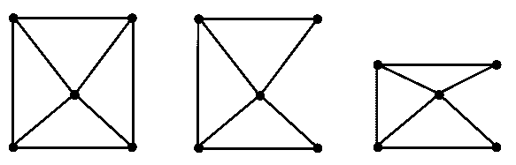
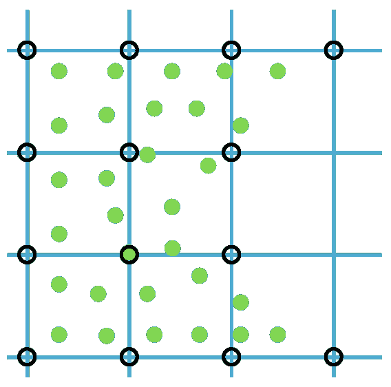
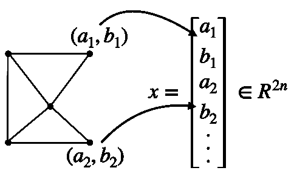

# 固体几何的表示

> 原文：[`phys-sim-book.github.io/lec1.1-solid_rep.html`](https://phys-sim-book.github.io/lec1.1-solid_rep.html)

在日常生活中，固体物体被感知为连续的。然而，在计算机的数字世界中，我们使用离散数字进行表示，因此出现了一系列有趣的方法。

其中一种方法是**参数化**。考虑一个三维球体，它可以描述为 {x∈R3 ∣ ∥x−c∥≤r, c∈R3, r>0}，以点 $  \mathbf{c}  $ 为中心，半径 $  r  $。这种方法不仅适用于球体，还包括半空间、盒子、椭球体、环面等其他形状，这些形状通过使用如符号距离等函数来描述其**内部**。然而，当处理在现实场景中经常遇到的复杂几何形状时，参数化面临挑战。一个新兴的例外是使用高级神经网络表示，这些新方法在有效表示更复杂的几何形状方面显示出希望。

另一种方法是**通过采样进行表示**。这涉及到在物体表面和内部选择点。但仅仅有点是不够的；我们通常需要在这些点之间建立连接，以定义物体的边界，用于渲染和 3D 打印等应用。监测点簇随时间的变化也有助于测量形变。

在连续介质力学中，物体被视为具有连续密度场。在数字上，这种连续性必须以离散的形式表示，通常是通过定义固体几何的**连接性**。

> ***备注 1.1.1（其他固体表示方法）***。还有其他方法可以表示固体几何形状，例如基于体素的方法。这些方法将空间划分为由小盒子组成的 3D 网格，或称为体素，每个体素代表物体的一个部分，类似于 2D 图像中的像素。基于体素的方法有多个优点。首先，它们可以作为离散的集合表示，能够模拟复杂的几何形状并跟踪其随时间的变化。每个体素包含有关其相对于物体表面的位置信息，提供了对连续集合函数的有效离散近似。这对涉及表面演化、形状优化和碰撞检测的算法有益。其次，基于体素的方法有利于构造实体几何（CSG）操作。这种在固体建模中使用布尔运算将简单形状组合成复杂 3D 模型的技术。体素化框架允许在体素网格上直接且高效地执行并、交、差等操作。这使得创建和修改复杂形状变得容易。
> 
> ****示例 1.1.1（网格）.**** 通过直接用边或三角形连接点来创建网格的方法是计算几何中的一种流行技术。这一概念在附图中有说明，其中左侧和中间的图像显示了两种不同的网格。值得注意的是，尽管这些网格使用了相同的采样点或节点，但它们的连接性不同，导致形状各异。图中最右侧的网格展示了从一种形状到另一种形状的转换。这个网格代表了中间网格的变形，通过垂直压缩其上半部分来实现。
> 
> 
> 
> **图 1.1.1.** 网格
> 
> ****示例 1.1.2（粒子和网格）.**** 通过在我们的空间表示中实现均匀网格结构，我们在每个节点位置记录固体物质的范围。这使得我们可以使用我们的采样点来计算每个网格节点的固体密度。这种方法有利于量化固体在网格中的分布，并为原始采样点之间建立连接网络。请参考附图以直观展示这一概念。在图中，采样点以绿色点表示。记录固体密度的网格节点以黑色圆圈表示。这些节点通过网格连接，用蓝色线条表示。
> 
> 
> 
> **图 1.1.2.** 粒子和网格

在现代固体模拟领域，所描述的确定连接性的方法至关重要。第一种方法，通过边或三角形的网格建立连接，是有限元方法（FEM）模拟器的基础。第二种方法，涉及使用均匀网格来计算固体密度并建立连接，对于材料点方法（MPM）模拟器至关重要 [江等人 2016]。本书主要关注前者方法，深入探讨了有限元法的复杂性。有限元法的基于网格的结构特别有效于处理复杂域，通过将其分解成更简单的元素。这使得有限元法成为研究和模拟可变形固体的基本工具，而对于从事这一领域研究的人来说，理解其细微差别至关重要。

初看起来，在 MPM 中使用两种固体几何表示法可能显得多余。然而，这种双重方法为 MPM 带来了显著的优势，尤其是在模拟固体断裂等动态事件时。在这种情况下，有限元法（FEM）需要仔细修改定义原始连接性的边和元素，以准确描述损伤。相比之下，MPM 有效地处理这些场景。均匀网格自然地适应了断裂中身体部分的分离，因为断裂节点处缺乏材料导致相邻网格节点的自动断开。这一特性使得 MPM 在管理固体拓扑结构变化方面表现出色。

然而，当涉及到模拟精度控制时，有限元法（FEM）表现出色。FEM 直接在网格上操作，无需进行信息传递，从而确保更高的精度。这种精度水平使得 FEM 在精确模拟可变形固体方面变得极为宝贵，这也是本书的主要关注点。

将每个采样点的坐标合并成一个扩展向量，记作 $  x\in\mathbb{R}^{dn}  $（参见图下），在保持恒定连接性的情况下，为描述特定的几何配置提供了一种有效的方法。在这种表示中，$ d $ 表示空间的维度（1、2 或 3），而 $ n $ 代表点的总数。同样，速度、加速度和在每个采样点的力等属性可以合并到相应的扩展向量中，分别表示为 $ v $、$ a $ 和 $ f $。这种有组织的数据展示方法不仅有助于全面理解各种参数及其相互关系，而且简化了模拟过程的数学公式化。

**图 1.1.3.** 堆叠位置向量
