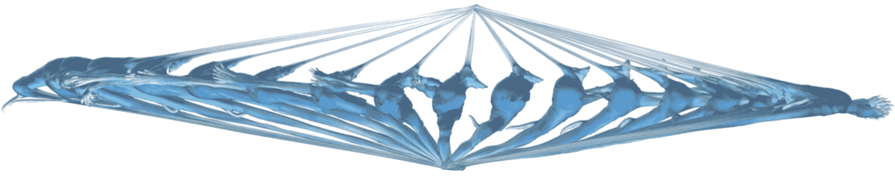

# 时间积分

> 原文：[`phys-sim-book.github.io/lec1.3-time_integration.html`](https://phys-sim-book.github.io/lec1.3-time_integration.html)

牛顿第二定律为一系列以连续形式表达的常微分方程（ODEs）奠定了基础。这类似于我们之前如何使用空间中的采样点来离散地表示连续几何形状。现在，我们采取类似的方法，但在时间领域。通过在时间上采样，我们可以有效地表示时间导数，如 $ \frac{\mathbf{d} x}{\mathbf{d} t} $ 和 $ \frac{\mathbf{d} v}{\mathbf{d} t} $。

> ****定义 1.3.1（时间积分）.**** 当将时间离散化为固定的小间隔时，我们用 $ t^n $ 表示第 $ n $ 步的时间，通常称为**时间步长**。这个间隔的长度，或**时间步长大小**，由 $ \Delta t = t^{n+1} - t^n $ 给出。时间步长计数 $ n $ 通常是从零开始的整数，使得 $ t⁰=0 s $ 成为模拟的起点。

时间步长的概念导致了符号 $ x^n $、$ v^n $ 和 $ f^n $ 的引入，分别表示第 $ n $ 个时间步长处的节点位置、速度和力。术语**时间步进**或**时间积分**指的是从 $ x^n, v^n $ 计算出 $ x^{n+1}, v^{n+1} $ 的过程，在每个增量时间步长 $ n=0,1,2,\dots $。为了直观演示，可以考虑一个装甲车弹弓动画。这个动画中的每一帧都是从左到右逐步计算的，如图下所示。在这种情况下，时间步进反映了电影式的进展，以逐步的方式揭示系统的演变动力学。

**图 1.3.1.** 装甲车弹弓逐帧

在本书的上下文和我们所考察的模拟场景中，必须强调一个关键假设：我们始终拥有模拟开始时初始值 $ x⁰ $ 和 $ v⁰ $ 的确切知识。此外，对于每个时间步长，我们要么有基于物理模型计算 $ f^n $ 的方法，要么我们能够立即获得其精确值，例如恒力如重力。这个假设是我们方法的基础，确保模拟基于已知的初始条件和力，从而允许获得更准确和可靠的成果。
