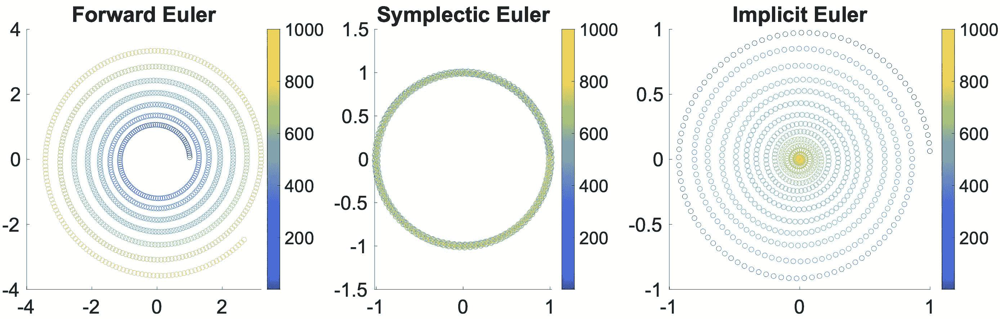

# 显式时间积分

> 原文：[`phys-sim-book.github.io/lec1.4-explicit_time_integration.html`](https://phys-sim-book.github.io/lec1.4-explicit_time_integration.html)

<link rel="stylesheet" href="https://cdn.jsdelivr.net/npm/katex@0.16.4/dist/katex.min.css">

显式时间积分方案提供了一种直接计算 \(x^{n+1}, v^{n+1}\) 的方法，通过将已知值代入简单的公式中，这就是为什么它们被称为**显式**。本节重点介绍两种基本的显式方案：前向欧拉和辛欧拉方法。

### 前向欧拉

为了将我们的连续时间系统转换为离散形式，我们采用前向差分近似。在这个近似中，导数 \((\frac{\mathbf{d} x}{\mathbf{d} t})^n\) 被估计为 \(\frac{x^{n+1} - x^n}{\Delta t}\)，同样，\((\frac{\mathbf{d} v}{\mathbf{d} t})^n\) 被估计为 \(\frac{v^{n+1} - v^n}{\Delta t}\)。上标 \(n\) 代表第 \(n\) 个时间步的状态变量。因此，我们系统的离散形式可以表示为：\(\Delta t x_{n+1} - x_n = M \Delta t v_{n+1} - v_n = v_n = f_n\)。（1.4.1）假设质量在时间上保持恒定，这些方程提供了一个明确的机制来更新我们的状态变量。知道时间步 \(n\) 的当前值 \(x^n\)、\(v^n\) 和 \(f^n\)，我们可以直接确定它们在下一个时间步 \(n+1\) 的值。

> ****方法 1.4.1（牛顿第二定律的前向欧拉时间积分）****。在前向欧拉方法中，下一时间步 \(n+1\) 的状态变量 \(x^{n+1}\) 和 \(v^{n+1}\) 是基于当前值 \(x^n\) 和 \(v^n\) 计算的。更新规则如下：\(x_{n+1}v_{n+1} = x_n + \Delta t v_n = v_n + \Delta t M^{-1} f_n\)。（1.4.2）在这里，\(\Delta t\) 代表时间步长，\(M\) 是质量矩阵，\(f^n\) 是当前时间步 \(n\) 的力。

前向欧拉方法被认为是**无条件不稳定的**，这意味着无论选择多小的时间步长 \(\Delta t\)，对于非常数 \(f\) 的方程，数值解最终会显著增长（**爆炸**），而精确解则不受影响（参见图 1.4.1，左）。

### 辛欧拉

如果我们在位置导数的离散化中将 \(v\) 的上标 \(n+1\) 放置在相同的位置，同时保持速度导数不变，我们得到一个新的更新规则：

> ****方法 1.4.2（牛顿第二定律的辛欧拉时间积分）****。给定当前状态变量、质量矩阵和从 \(t^n\) 到 \(t^{n+1}\) 的时间步长，\(x_{n+1}v_{n+1} = x_n + \Delta t v_{n+1} = v_n + \Delta t M^{-1} f_n\)，（1.4.3）其中 \(n=0,1,2,\dots\)。

经过轻微的修改，积分变为**条件稳定**。这意味着如果 \(\Delta t\) 保持在一个特定问题的限制范围内，我们可以有效地控制解的数值误差。此外，辛欧拉方法显示出系统能量守恒的吸引人特性，如图中所示。

**图 1.4.1（时间积分器的稳定性）**。提供的插图展示了粒子执行恒定圆周运动的情况，分别使用前向欧拉法、辛欧拉法和隐式欧拉法进行模拟，从左到右依次展示。插图中的不同颜色代表时间的推移。值得注意的是，每种方法在模拟中表现出不同的特性：前向欧拉模拟最终经历不稳定性的增长，辛欧拉法紧密遵循理论轨迹，而隐式欧拉法在保持稳定性的同时，逐渐使运动停止。
