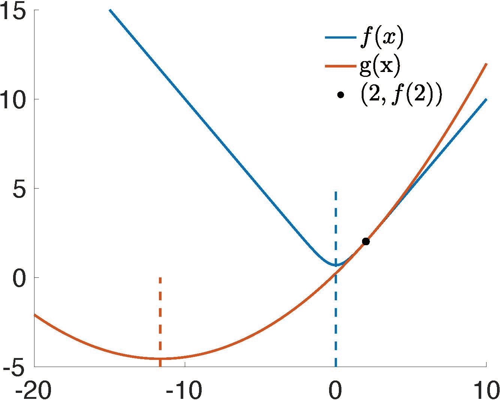

# 牛顿法的收敛性问题

> 原文：[`phys-sim-book.github.io/lec3.1-conv_issue_Newton.html`](https://phys-sim-book.github.io/lec3.1-conv_issue_Newton.html)

在解决隐式欧拉时间积分（见方程(2.1.1)）提出的最小化问题时，采用牛顿法（见算法 1.5.1）是解决非线性方程组的一个可行策略。这涉及到将增量势能的梯度设为零：

∇E(x)=0.

然而，将此方法应用于非线性弹性、特别是 Neo-Hookean 模型等案例时，并不总是能保证收敛。截断误差的存在，尤其是在涉及大时间步长或显著变形的场景中，可能会对收敛过程产生不利影响。

> **示例 3.1.1（牛顿收敛问题的说明）**。为了阐明牛顿法非收敛的问题，让我们考虑一个一维最小化问题，其目标函数为：f(x)=ln(e−x+ex)。我们可以在 x=2 处评估该函数，并使用定义的二次能量 g(x)对其进行近似：g(x)=f(2)+f′(2)(x−2)+21​f′′(2)(x−2)2。f(x)和 g(x)的联合图(图 3.1.1)清楚地表明，下一次迭代将超过实际目标，落在离实际解 x=0 更远的位置（x=−11.645）。后续迭代放大了这个偏差，导致轨迹发散。值得注意的是，这个演示涉及的是一个凸函数 f(x)=ln(e−x+ex)。当牛顿法应用于非凸弹性能量时，问题可能会变得更加复杂。
> 
> 
> 
> **图 3.1.1**. 牛顿法在 x=2 处对 minx​E(x)=ln(e−x+ex)的迭代。
> 
> ***注 3.1.1（能量的凸性）***。凸函数在其定义域内具有对称和正定的二阶导数。相反，在计算机图形学中使用的许多非线性弹性模型中的能量是旋转不变的。这意味着无论对象或元素的旋转方向如何，能量值都保持不变。这种旋转不变性导致**非凸性**，使得优化过程更加复杂。
> 
> **定义 3.1.1（对称正定）**。一个 n×n 的方阵 A∈Rn×n 是对称正定的，如果
> 
> +   A=AT，并且
> +   
> +   vTAv>0 对于所有 v∈Rn,v=0。

与直接求解非线性方程不同，最小化问题提供了一个能量度量，可以使用称为线搜索的技术来确保全局收敛。
