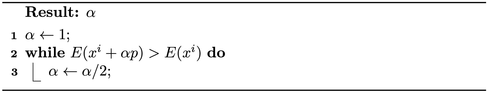

# 线搜索

> 原文：[`phys-sim-book.github.io/lec3.2-line_search.html`](https://phys-sim-book.github.io/lec3.2-line_search.html)

<link rel="stylesheet" href="https://cdn.jsdelivr.net/npm/katex@0.16.4/dist/katex.min.css">

在迭代最小化方法中，线搜索是一种技术，用于在每次迭代中选择步长的一部分，确保目标能量在新点处减少。

**具体来说，对于牛顿法，算法 1.5.1 中的第 4 行从 \(x^i \leftarrow x\) 修改为 \(x^i \leftarrow x^i + \alpha (x - x^i)\)，其中 \(\alpha \in (0,1]\) 是步长，对于减少能量是必不可少的。这导致两个关键问题：这样的 \(\alpha\) 是否总是存在？\(\alpha\) 是如何计算的？**

> ***注 3.2.1（\(\alpha\) 的存在性）。*** 对于在 \(x^i\) 处的平滑目标能量 \(E(x)\)，其中 \(\nabla E(x^i) \neq 0\)，如果搜索方向 \(p=x-x^i\) 是下降的，即 \(p^T \nabla E(x^i) < 0\)，则存在 \(\alpha > 0\) 使得 \(E(x^i + \alpha p) < E(x^i)\)。
> 
> ****方法 3.2.1（回溯线搜索）。**** 给定一个下降方向，我们可以通过从 1 开始简单地将其减半，直到新位置的能量小于当前能量，来找到一个合理的大的 \(\alpha\)（参见 算法 3.2.1）。
> 
> **算法 3.2.1（回溯线搜索算法）。** 
> 
> ***注 3.2.2（其他线搜索方法）。*** 有其他线搜索方法尝试将多项式插值应用于找到 \(\alpha\)，使得新位置的能量更接近线段 \(x^i + s p\)（\(s\in(0,1]\)）上的局部最小值。然而，这些方法通常会产生更高的计算成本，并且不一定能提高整体优化时间的 wall-clock 计时。

现在，使用线搜索，如果牛顿法始终生成下降搜索方向，那么该方法对于任何初始配置和任何具有下界的平滑能量都是保证收敛的。我们知道在迭代 \(i\) 中，\(p = -(\nabla² E(x^i))^{-1} \nabla E(x^i)\)，因此 \(p^T \nabla E(x^i)\) 等于 \(-\nabla E(x^i)^T (\nabla² E(x^i))^{-T} \nabla E(x^i)\)。对于凸能量，\(\nabla² E(x^i)\) 总是对称正定的，\((\nabla² E(x^i))^{-T}\) 也是，这使得 \(p\) 总是下降方向。然而，对于非凸能量，这种保证并不总是成立。解决此问题的一种方法是在局部使用凸能量代理来近似能量。
