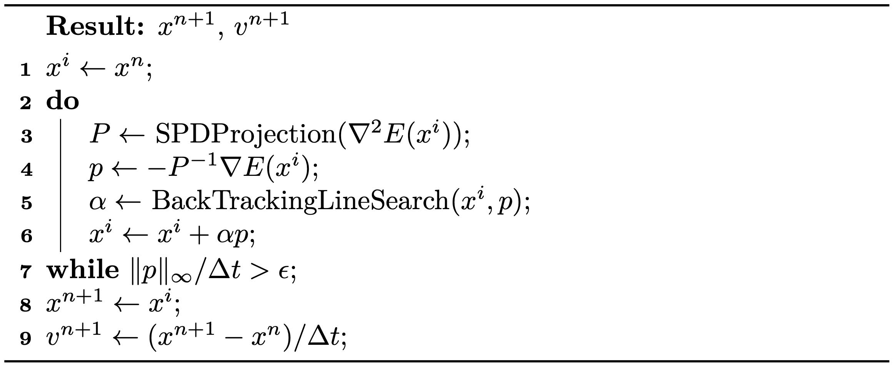

# 基于梯度的优化

> 原文：[`phys-sim-book.github.io/lec3.3-grad_based_opt.html`](https://phys-sim-book.github.io/lec3.3-grad_based_opt.html)

<link rel="stylesheet" href="https://cdn.jsdelivr.net/npm/katex@0.16.4/dist/katex.min.css">

标准牛顿法的搜索方向是通过最小化目标能量的局部二次近似来计算的：p=argΔxmin​(E(xi)+ΔxT∇E(xi)+21​ΔxTPΔx)(3.3.1) 其中 \(P = \nabla² E(x^i)\)。在一般基于梯度的优化方法中，\(p\) 可以通过方程 (3.3.1) 使用任何代理矩阵 \(P\) 来计算。将 \(P = I\) 设置为 \(p = -\nabla E(x^i)\)，正如在标准梯度下降法中使用的那样。这种方法比牛顿法收敛得慢，因为能量近似是低阶的。代理矩阵 \(P\) 越接近 Hessian 矩阵 \(\nabla² E(x^i)\)，收敛速度越快。因此，使用 Hessian 矩阵的 SPD 近似作为代理，确保搜索方向始终是下降的，同时保持接近二次的收敛速度。这类似于在局部使用凸能量代理来近似非凸能量。

获取这种 SPD 近似的一个直接方法首先是将 \(\nabla² E(x^i)\) 投影到其最近的半正定矩阵上，通过求解 Pmin∥P−∇2E(xi)∥F​s.t.vTPv≥0  ∀v=0，然后引入扰动以确保 \(P\) 是可逆的。在这种情况下，解是 \(P = Q \hat{\Lambda} Q^{-1}\)，其中 \(P = Q \Lambda Q^{-1}\) 是特征分解，且 \(\hat{\Lambda}_{ij} = \Lambda_{ij}\) 如果 \(\Lambda_{ij} > 0\)，否则 \(\hat{\Lambda}_{ij} = 0\)。直观地说，\(P\) 是通过将 \(\nabla² E(x^i)\) 的所有负特征值置零来获得的。

> ****定义 3.3.1 (特征分解).**** 矩阵 \(A \in \mathbb{R}^{n \times n}\) 的特征分解为 A=QΛQ−1，其中 \(Q = [q_1, q_2, ..., q_n]\) 由 \(A\) 的特征向量 \(q_i\) 组成，∥qi∥=1；\(\Lambda = [\lambda_1, \lambda_2, ..., \lambda_n]\)，其中 \(\lambda_1 \geq \lambda_2 \geq ..., \lambda_n\) 是 \(A\) 的特征值；且 \(Aq_i = \lambda_i q_i\)。

然而，在模拟中，\(\nabla² E(x^i)\) 通常是一个大型稀疏矩阵，对其进行特征分解将非常昂贵。幸运的是，我们将在本书的后面发现，在固体模拟中，增量势可以表示为在局部模板上定义的能量之和的可分离总和，例如在二维有限元方法 (FEM) 网格中的三角形：E(x)=j∑​Ej​(xj1​,xj2​,...)，其中 \(\mathbf{x}_{jk}\) 是与能量 \(E_j\) 相关的节点。因此，我们可以通过将每个在少量节点上定义的 \(\nabla² E_i\) 的负特征值置零，并将它们聚合起来，方便地获得一个相当合理的 SPD 近似。

> ****示例 3.3.1（局部投影方法）.**** 要在具有 10,201 个节点和 20,000 个三角形的三角形网格上模拟 2D 弹性，Hessian 矩阵 \(\nabla² E(x)\) 是 \(20,402 \times 20,402\)。对于上述描述的局部投影方法，它需要在 \(6 \times 6\) 矩阵上进行 20,000 次特征值分解。考虑到在 \(n \times n\) 矩阵上特征值分解的计算复杂度比 \(O(n²)\) 差，这种粗略估计已经表明，当采用局部投影方法时，对于这个中等规模的问题，速度可以提升超过 \(500\times\)。

此外，由于 \(\nabla² E(x^i)\) 中的质量矩阵是对称正定（SPD）的，并且对称正定矩阵的和仍然是 SPD，因此在投影其他矩阵时不需要扰动。我们现在总结全局收敛的投影牛顿法在向后 Euler 时间积分中的算法 3.3.1。

**算法 3.3.1（向后 Euler 时间积分的投影牛顿法）。** 

> ***注 3.3.1（停止准则）.*** 从方程(3.3.1)中，我们了解到 ∥p∥ 可以解释为从当前估计 \(x^i\) 到最优解的距离的二次近似。因此，我们利用 ∥p∥∞/Δt 作为停止准则的更直观的度量。这种方法将其转换为速度单位，并取每个节点的最大幅度。
