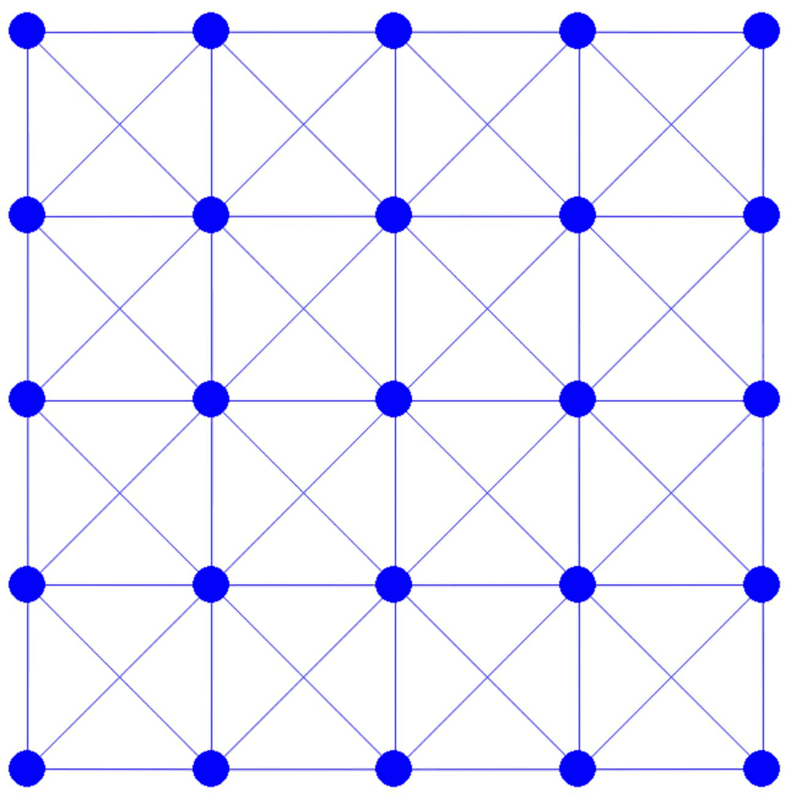

# 空间和时间离散化

> [`phys-sim-book.github.io/lec4.1-discretizations.html`](https://phys-sim-book.github.io/lec4.1-discretizations.html)

<link rel="stylesheet" href="https://cdn.jsdelivr.net/npm/katex@0.16.4/dist/katex.min.css">

在表示实体几何时，我们采用网格结构。我们可以通过连接网格上的节点与边来进一步简化表示。为了便于这个过程，特别是对于正方形这样的几何形状，我们可以编写一个网格生成器。这个生成器允许指定正方形的边长和网格的期望分辨率。

**实现 4.1.1（正方形网格生成，square_mesh.py）。**

```py
import numpy as np
import os

def generate(side_length, n_seg):
    # sample nodes uniformly on a square
    x = np.array([[0.0, 0.0]] * ((n_seg + 1) ** 2))
    step = side_length / n_seg
    for i in range(0, n_seg + 1):
        for j in range(0, n_seg + 1):
            x[i * (n_seg + 1) + j] = [-side_length / 2 + i * step, -side_length / 2 + j * step]

    # connect the nodes with edges
    e = []
    # horizontal edges
    for i in range(0, n_seg):
        for j in range(0, n_seg + 1):
            e.append([i * (n_seg + 1) + j, (i + 1) * (n_seg + 1) + j])
    # vertical edges
    for i in range(0, n_seg + 1):
        for j in range(0, n_seg):
            e.append([i * (n_seg + 1) + j, i * (n_seg + 1) + j + 1])
    # diagonals
    for i in range(0, n_seg):
        for j in range(0, n_seg):
            e.append([i * (n_seg + 1) + j, (i + 1) * (n_seg + 1) + j + 1])
            e.append([(i + 1) * (n_seg + 1) + j, i * (n_seg + 1) + j + 1])

    return [x, e] 
```

在代码中，`n_seg` 代表正方形每边的边数。节点在正方形内均匀分布，并通过水平、垂直和对角线边相互连接。例如，调用 `generate(1.0, 4)` 构建了一个如图 图 4.1.1 所示的网格。这种实现利用了 [Numpy](https://numpy.org/) 库中的数组数据结构，它提供了方便的方法来处理后续步骤所需的向量代数。



**图 4.1.1.** 由上方定义的 `generate(1.0, 4)` 调用生成的 4×4 正方形网格。

对于时间离散化，我们的方法是隐式欧拉法。需要在时间步长 \(n\) 中最小化的增量势能，表示如下：E(x)=21∥x−(xn+hvn)∥M2+h2P(x).(4.1.1) 接下来，我们的焦点转向实现能量值、梯度以及 Hessian 的计算，这包括惯性项和势能 \(P(x)\)。
