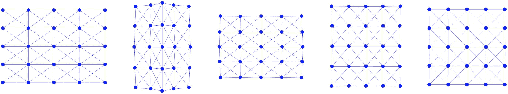

# 带有可视化的模拟器

> [`phys-sim-book.github.io/lec4.5-sim_with_vis.html`](https://phys-sim-book.github.io/lec4.5-sim_with_vis.html)

<link rel="stylesheet" href="https://cdn.jsdelivr.net/npm/katex@0.16.4/dist/katex.min.css">

在收集了所有必要的 2D 质量-弹簧模拟器元素后，下一步是实现模拟器。此实现将以逐步方式进行，并包括可视化功能以增强理解和参与。

**实现 4.5.1（simulator.py）。**

```py
# Mass-Spring Solids Simulation

import numpy as np  # numpy for linear algebra
import pygame       # pygame for visualization
pygame.init()

import square_mesh   # square mesh
import time_integrator

# simulation setup
side_len = 1
rho = 1000  # density of square
k = 1e5     # spring stiffness
initial_stretch = 1.4
n_seg = 4   # num of segments per side of the square
h = 0.004   # time step size in s

# initialize simulation
[x, e] = square_mesh.generate(side_len, n_seg)  # node positions and edge node indices
v = np.array([[0.0, 0.0]] * len(x))             # velocity
m = [rho * side_len * side_len / ((n_seg + 1) * (n_seg + 1))] * len(x)  # calculate node mass evenly
# rest length squared
l2 = []
for i in range(0, len(e)):
    diff = x[e[i][0]] - x[e[i][1]]
    l2.append(diff.dot(diff))
k = [k] * len(e)    # spring stiffness
# apply initial stretch horizontally
for i in range(0, len(x)):
    x[i][0] *= initial_stretch

# simulation with visualization
resolution = np.array([900, 900])
offset = resolution / 2
scale = 200
def screen_projection(x):
    return [offset[0] + scale * x[0], resolution[1] - (offset[1] + scale * x[1])]

time_step = 0
square_mesh.write_to_file(time_step, x, n_seg)
screen = pygame.display.set_mode(resolution)
running = True
while running:
    # run until the user asks to quit
    for event in pygame.event.get():
        if event.type == pygame.QUIT:
            running = False

    print('### Time step', time_step, '###')

    # fill the background and draw the square
    screen.fill((255, 255, 255))
    for eI in e:
        pygame.draw.aaline(screen, (0, 0, 255), screen_projection(x[eI[0]]), screen_projection(x[eI[1]]))
    for xI in x:
        pygame.draw.circle(screen, (0, 0, 255), screen_projection(xI), 0.1 * side_len / n_seg * scale)

    pygame.display.flip()   # flip the display

    # step forward simulation and wait for screen refresh
    [x, v] = time_integrator.step_forward(x, e, v, m, l2, k, h, 1e-2)
    time_step += 1
    pygame.time.wait(int(h * 1000))
    square_mesh.write_to_file(time_step, x, n_seg)

pygame.quit() 
```

在我们的模拟器中进行 2D 可视化时，我们使用[Pygame 库](https://www.pygame.org/)。模拟以一个场景开始，场景中有一个单方形，最初是水平拉伸的。在模拟过程中，正方形开始恢复其原始的水平尺寸。随后，由于惯性，它将开始垂直拉伸，来回振荡，直到最终稳定在其静止形状，如图(图 4.5.1)所示。



**图 4.5.1**。从左到右：初始、中间和最终静态帧的初始拉伸正方形模拟。

除了存储节点位置`x`和边`e`外，我们的模拟还需要为几个其他关键变量分配内存：

+   **节点速度（`v`）**：用于跟踪每个节点随时间的变化。

+   **质量（`m`）**：节点质量通过将正方形的总质量均匀分布在每个节点上计算得出。这是一个初步方法；在未来的章节中，将探讨在有限元方法（FEM）或材料点方法（MPM）中计算节点质量的更详细方法。

+   **边长平方（`l2`）**：在质量-弹簧系统中计算势能时非常重要。

+   **弹簧刚度（`k`）**：一个影响弹簧动态的关键参数。

为了超出我们模拟器的可视化目的，我们启用了将网格数据导出为`.obj`文件的功能。这是通过在模拟的开始和每个帧调用`write_to_file()`函数来实现的。此功能便于使用其他可视化软件来分析和展示模拟结果。

**实现 4.5.2（输出正方形网格，square_mesh.py）。**

```py
def write_to_file(frameNum, x, n_seg):
    # Check if 'output' directory exists; if not, create it
    if not os.path.exists('output'):
        os.makedirs('output')

    # create obj file
    filename = f"output/{frameNum}.obj"
    with open(filename, 'w') as f:
        # write vertex coordinates
        for row in x:
            f.write(f"v {float(row[0]):.6f} {float(row[1]):.6f} 0.0\n") 
        # write vertex indices for each triangle
        for i in range(0, n_seg):
            for j in range(0, n_seg):
                #NOTE: each cell is exported as 2 triangles for rendering
                f.write(f"f {i * (n_seg+1) + j + 1} {(i+1) * (n_seg+1) + j + 1} {(i+1) * (n_seg+1) + j+1 + 1}\n")
                f.write(f"f {i * (n_seg+1) + j + 1} {(i+1) * (n_seg+1) + j+1 + 1} {i * (n_seg+1) + j+1 + 1}\n") 
```

在所有组件正确设置后，下一阶段涉及启动模拟循环。此循环推进时间积分并在每个时间步长可视化结果。要在终端中执行模拟程序，请使用以下命令：

```py
python3 simulator.py 
```

> ***备注 4.5.1（实际考虑）。*** 在我们的模拟器实现到位后，它为我们提供了实验各种优化时间积分方案配置的灵活性。此类测试对于深入了解每个基本组件的作用和影响至关重要。
> 
> 考虑一个例子：如果我们选择不将质量-弹簧海森矩阵投影到对称正定（SPD）形式，在特定条件下可能会出现奇特的行为。例如，以帧率时间步长`h=0.02`和`initial_stretch`为`0.5`运行模拟可能会导致线搜索失败。这反过来又会导致非常小的步长，阻碍优化过程并阻止取得显著进展。
> 
> 虽然在这个简单的二维例子中，线搜索可能看起来是多余的，但在更复杂的 3D 弹性动力学模拟中，尤其是在涉及大变形的模拟中，其必要性变得明显。在这里，线搜索对于确保模拟的收敛至关重要。
> 
> 另一个值得关注的点是传统固体模拟器中应用的停止标准。许多这样的模拟器放弃了动态停止标准，而是在预定次数的迭代后终止优化过程。这种方法虽然简单直接，但在更具挑战性的场景中可能导致数值不稳定性或“爆炸”。这强调了仔细考虑积分方案及其参数以确保稳定和准确模拟的重要性。
