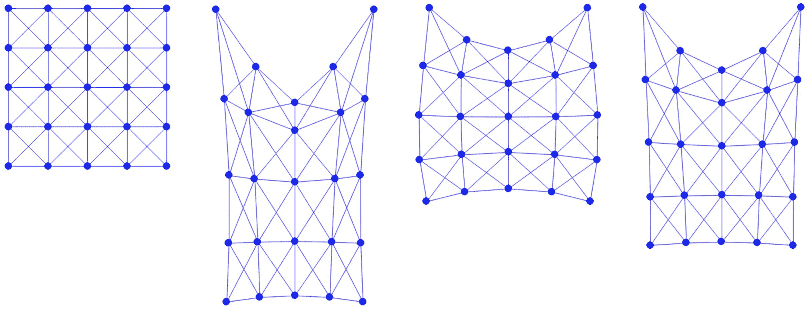

# 案例研究：悬挂方形*

> 原文：[`phys-sim-book.github.io/lec5.3-hanging_square.html`](https://phys-sim-book.github.io/lec5.3-hanging_square.html)

<link rel="stylesheet" href="https://cdn.jsdelivr.net/npm/katex@0.16.4/dist/katex.min.css">

我们用一个简单的案例研究来结束这堂课。基于前一小节开发的 质量-弹簧系统，我们实现了重力能量和粘性 Dirichlet 边界条件来模拟一个悬挂的方形。本节的可执行 Python 项目可以在 `https://github.com/phys-sim-book/solid-sim-tutorial` 下的 `2_dirichlet` 文件夹中找到。[MUDA](https://github.com/MuGdxy/muda) GPU 实现可以在 `https://github.com/phys-sim-book/solid-sim-tutorial-gpu` 下的 `simulators/2_dirichlet` 文件夹中找到。

重力能量具有 P(x)=−xTMg,∇P(x)=−Mg, 和 ∇²P(x)=0，这可以简单地实现：

**实现 5.3.1（GravityEnergy.py）**。

```py
import numpy as np

gravity = [0.0, -9.81]

def val(x, m):
    sum = 0.0
    for i in range(0, len(x)):
        sum += -m[i] * x[i].dot(gravity)
    return sum

def grad(x, m):
    g = np.array([gravity] * len(x))
    for i in range(0, len(x)):
        g[i] *= -m[i]
    return g

# Hessian is 0 
```

然后我们只需确保将重力能量添加到增量势（IP）中：

**实现 5.3.2（向 IP 添加重力，time_integrator.py）**。

```py
def IP_val(x, e, x_tilde, m, l2, k, h):
    return InertiaEnergy.val(x, x_tilde, m) + h * h * (MassSpringEnergy.val(x, e, l2, k) + GravityEnergy.val(x, m))     # implicit Euler

def IP_grad(x, e, x_tilde, m, l2, k, h):
    return InertiaEnergy.grad(x, x_tilde, m) + h * h * (MassSpringEnergy.grad(x, e, l2, k) + GravityEnergy.grad(x, m))   # implicit Euler 
```

对于粘性 Dirichlet 边界条件，我们在计算搜索方向时相应地修改系统：

**实现 5.3.3（自由度消除，time_integrator.py）**。

```py
def search_dir(x, e, x_tilde, m, l2, k, is_DBC, h):
    projected_hess = IP_hess(x, e, x_tilde, m, l2, k, h)
    reshaped_grad = IP_grad(x, e, x_tilde, m, l2, k, h).reshape(len(x) * 2, 1)
    # eliminate DOF by modifying gradient and Hessian for DBC:
    for i, j in zip(*projected_hess.nonzero()):
        if is_DBC[int(i / 2)] | is_DBC[int(j / 2)]: 
            projected_hess[i, j] = (i == j)
    for i in range(0, len(x)):
        if is_DBC[i]:
            reshaped_grad[i * 2] = reshaped_grad[i * 2 + 1] = 0.0
    return spsolve(projected_hess, -reshaped_grad).reshape(len(x), 2) 
```

这里 `is_DBC` 是一个数组，标记节点是否为 Dirichlet，因为我们把 Dirichlet 节点的索引存储在 `DBC` 中：

**实现 5.3.4（DBC 定义，simulator.py）**。

```py
DBC = [n_seg, (n_seg + 1) * (n_seg + 1) - 1]  # fix the left and right top nodes

# ...

# identify whether a node is Dirichlet
is_DBC = [False] * len(x)
for i in DBC:
    is_DBC[i] = True 
```

最后，在确保 `is_DBC` 传递给时间积分器后，我们可以模拟一个具有较小弹簧刚度 `k=1e3` 和帧率时间步长 `h=0.02` 的能量悬挂方形（无初始拉伸）(图 5.3.1)。



**图 5.3.1.** 从左到右：悬挂方形模拟的初始、中间和最终静态帧。
