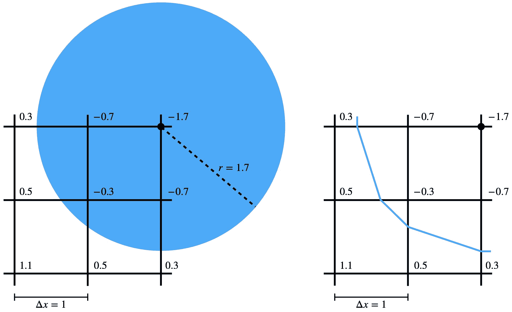

# 符号距离

> 原文：[`phys-sim-book.github.io/lec7.1-signed_dists.html`](https://phys-sim-book.github.io/lec7.1-signed_dists.html)

增量势接触（IPC）方法旨在通过在整个运动过程中保持固体边界之间的**无符号**距离大于零来确保任何余维数的固体之间不发生穿透。这种方法具有鲁棒性，因为它适用于所有固体，而不管其具体特性如何。

然而，当**符号**距离可用时，IPC 的应用不仅变得简单，而且更加流畅。符号距离将无符号距离的概念扩展到包括具有封闭边界的固体几何形状。通过 IPC 强制非穿透，消除了固体内部出现负距离的可能性。因此，在符号距离保持非负（包括正好为零的状态）的情况下，这是一个成功非穿透的指示。

> ****定义 7.1.1（余维数）.**** 如果 $ W $ 是有限维向量空间 $ V $ 的线性子空间，那么 $ W $ 在 $ V $ 中的余维数是它们维度的差：codim(W)=dim(V)−dim(W). 例如，在 3D 中，一个表面有余维数 $ 1 $，而一条线有余维数 $ 2 $。在计算机图形学中，当模拟布料和头发时，通常分别应用余维数 1 和 2 的几何表示以提高效率。然而，它们的符号距离并没有很好地定义。这也解释了为什么无符号距离在建模固体接触时更为通用。

在之前的 章节 中，我们探讨了表示固体几何形状的各种方法。一种显著的方法是解析表示。例如，球心为 $  \mathbf{c}  $ 且半径为 $  r  $ 的 3D 球体可以通过以下参数化来解析描述：

{x∈R3 ∣ ∥x−c∥≤r, c∈R3, r>0}.

这种定义固体几何形状的原则不仅限于简单的球体。许多其他形状，如半空间、盒子、椭球体和环面，也可以类似地参数化。这些参数化的关键在于定义这些对象的“内部”，这通常可以通过符号距离等函数来实现。这些函数提供了一种灵活的工具，以简洁和数学的方式描述广泛的各种简单和复杂形状。

> ****示例 7.1.1（球体符号距离函数）.**** 球心为 $ \mathbf{c} $ 且半径为 $ r $ 的球体的符号距离函数 $ d(\mathbf{x}) $ 及其导数可以定义为：d(x)=∥x−c∥−r,∇d(x)=∥x−c∥x−c​,and∇2d(x)=∥x−c∥3∥x−c∥2I−(x−c)(x−c)T​.​
> 
> ****示例 7.1.2（半空间符号距离函数）.**** 半空间具有法向量 $ \mathbf{n} $ 和 $ d(\mathbf{o}) = 0 $ 的符号距离函数 $ d(\mathbf{x}) $ 及其导数可以定义为：d(x)=nT(x−o),∇d(x)=n,and∇2d(x)=0。(7.1.1)

表示更复杂的几何形状，如在实际场景中常见的那种，可能是一个具有挑战性的任务，因为它们的复杂性。一个有效的替代复杂参数化的方法是使用均匀欧几里得网格。这个网格作为存储实体签名字段的机制，这些距离在每个网格节点上预先计算。当需要计算实体内部任意点的距离时，可以对网格数据进行插值。

> ****示例 7.1.3（网格签名字段）.**** 对于存储在均匀欧几里得网格上的签名字段，其间距为 $ \Delta x $，要查询任意位置 $ \mathbf{x} = (x,y) $ 的距离，其中 $ x = x_i + \alpha \Delta x $ 和 $ y = y_i + \beta \Delta x $ ($ \mathbf{x}_{i,j} = (x_i, y_j) $ 是网格节点的位置，$ 0 \leq \alpha,\beta \leq 1 $)，使用双线性插值（图 7.1.1 右图），d(x)=(1−β)((1−α)d(xi,i)+αd(xi+1,i))+β((1−α)d(xi,i+1)+αd(xi+1,i+1))。从 图 7.1.1 我们还可以看到，为了在这个设置中平滑地近似实体的边界，需要使用更高阶的插值方案，如二次 B 样条插值。
> 
> 
> 
> **图 7.1.1.** 网格节点与球边界之间的签名字段是预先计算并存储的（左图）。通过双线性插值，球边界的一部分被近似为蓝色多段线（右图）。
