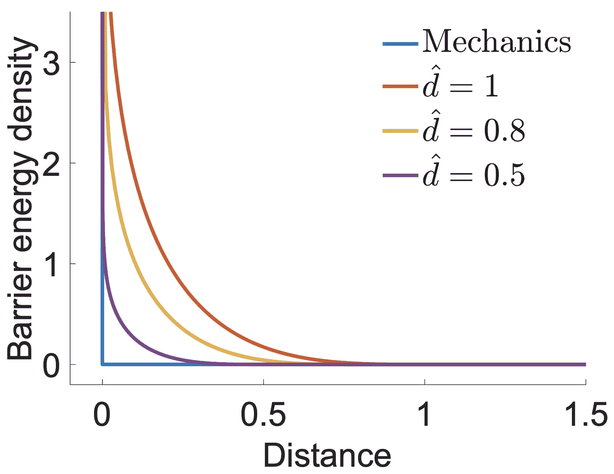

# 距离屏障

> 原文：[`phys-sim-book.github.io/lec7.2-dist_barrier_formulation.html`](https://phys-sim-book.github.io/lec7.2-dist_barrier_formulation.html)

``

### 约束优化

在固体与平面地面等场景交互的情况下，当有符号距离函数 $  d(\mathbf{x})  $ 在障碍物外部是光滑的，我们可以通过引入非穿透约束来建模接触。这些约束使用 $  d(\mathbf{x})  $ 来表述，同时我们旨在最小化系统的增量势能。

假设固体被节点 $ \mathbf{x} $ 密集采样，我们在节点自由度（DOFs）级别应用这些约束，与障碍物相关：

$  xminE(x)s.t.d_{ij} \geq 0 \quad \forall \text{node } i \text{ and obstacle } j. (7.2.1)  $

在这个方程中，$  d_{ij}  $ 代表节点 $  i  $ 和障碍物 $  j  $ 之间的有符号距离。通过确保 $  d_{ij}  $ 是非负的，我们有效地防止了固体与障碍物相交^(1)。

### 接触建模中的对数屏障势能

为了解决接触建模中的不等式约束，我们引入一个屏障势能 $  P_b(\mathbf{x})  $。这个势能将约束问题，如方程 (7.2.1) 所述，转化为一个“无约束”的优化问题：

$  xminE(x)+h²P_b(x).(7.2.2)  $

屏障势能的定义如下：

$  P_b(x) = \sum_{i,j} A_i d^b(d_{ij}(x))  $ 且 \( b(d_{ij}(x)) = \begin{cases} 

在这个公式中，$  b()  $ 代表屏障能量密度函数。当距离趋近于零时，这个函数趋向于无穷大，从而提供强大的排斥力以防止穿透（参见图 7.2.1）。距离阈值 $  \hat{d}  $ 之上不施加接触力，接触刚度 $  \kappa  $ 控制接触力随距离变化的速率，以及 $  A_i  $，节点 $  i  $ 的接触面积，是这个设置中的关键参数。通过在固体边界上积分能量密度，屏障公式有效地模拟了一个厚度为 $  \hat{d}  $ 的势能场。

**图 7.2.1.** 屏障能量密度函数以不同的 $  d^\circ  $ 绘制。$  d^\circ  $ 的减小渐近地符合接触条件的非连续定义。

> ***备注 7.2.1（接触层解释）*** 想象屏障势能 $  P_b(\mathbf{x})  $ 代表一个超薄虚拟材料层的弹性，该层存在于固体边界之外。这个虚拟层有一个有效厚度 $  \hat{d}  $，这与屏障函数中的距离阈值相关。
> 
> 因此，在计算 $  P_b(\mathbf{x})  $ 时使用的积分或求和被体积元素 $  w_i = A_i \hat{d}  $ 加权，其中 $  A_i  $ 表示每个节点的接触面积。当固体接近并开始压缩这个虚拟弹性层时，接触力产生。这些力类似于一种独特的弹性力，通过在固体彼此过于接近时提供排斥效果来防止相互穿透。此模型使我们能够在没有固体实际穿透的情况下模拟接触的物理响应。

使用链式法则，并将距离作为中间变量，我们可以推导出 $  P_b(\mathbf{x})  $ 的梯度 $  \nabla P_b(x) = i,j \sum_{w_i} \frac{\partial d}{\partial b}(d_{ij}(x)) \nabla d_{ij}(x)  $ 和 Hessian 矩阵 $  \nabla² P_b(x) = i,j \sum_{w_i} \left( \frac{\partial² d}{\partial² b}(d_{ij}(x)) \nabla d_{ij}(x) \nabla d_{ij}(x)^T + \frac{\partial d}{\partial b}(d_{ij}(x)) \nabla² d_{ij}(x) \right)  $。（7.2.4）和（7.2.5）。

¹

由于我们在这里使用的是带符号的距离，因此在不引入 $ \epsilon $ 的情况下，可以使用与无符号距离的方程 (2.3.1) 定义不等式约束。
