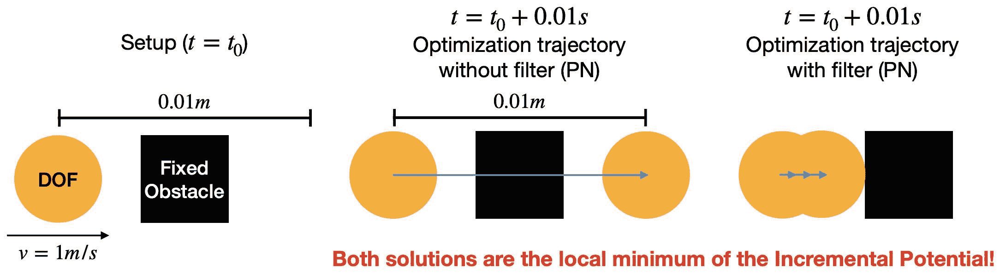

# 溶洞问题

> 原文：[`phys-sim-book.github.io/lec8.1-tunneling.html`](https://phys-sim-book.github.io/lec8.1-tunneling.html)

<link rel="stylesheet" href="https://cdn.jsdelivr.net/npm/katex@0.16.4/dist/katex.min.css">

> ****例 8.1.1（溶洞）.**** 让我们考虑一个简单的说明性例子。在没有如重力等外部力的情况下，对于位于 \(\mathbf{x}_0 = (0, 0)\) 的粒子（无弹性），质量为 \(m\)，初始速度 \(\mathbf{v}_0 = (1, 0)\)，撞击位于 \((0.005, 0) \) 的固定正方形障碍物，第一次时间步的增量势能最小化问题为 xmin(2m∥x−(x0+hv0)∥2+h2Pb(x))。由于 \(\hat{d}\) 通常设置得足够小，例如本例中的 \(10^{-4}m\)，因此粒子尚未接触障碍物，障碍势能 \(P_b(\mathbf{x})\) 在 \(\mathbf{x}_0\) 处尚未激活。这使得方程 (8.1.1) 的问题二次，我们的投影牛顿（PN）方法 (算法 3.3.1) 在第一次迭代时将产生搜索方向 p=hv0，经过线搜索后直接导致 \(\mathbf{x}_0 + h\mathbf{v}_0\) 处增量势能的全局最小值。取 \(h=0.01s\) (图 8.1.1)，粒子将穿过障碍物。然而，由于时间步长较大，粒子穿过障碍物的情况显然是不现实的，因为预期的物理行为是粒子与障碍物碰撞后停止或弹回。

**图 8.1.1**. 溶洞问题的示意图。使用之前介绍的投影牛顿法，可能会出现如中间所示的重影。右侧显示的物理上合理的结果可以通过滤波线搜索方案获得。蓝色箭头显示了优化路径。

从 例 8.1.1 中，我们了解到仅仅确保最终解的符号距离为非负是不够的，特别是在涉及大时间步长、高速冲击或薄障碍物的情况下。这些条件可能导致模拟中的不准确和不现实的结果。

增量势能接触（IPC）方法通过确保整个固体运动轨迹上的距离保持非零来解决此问题。这种方法对于保持模拟的物理准确性和现实性至关重要。

但在离散时间积分的背景下，“运动轨迹”究竟是什么意思？我们将在下面解释这一点。
