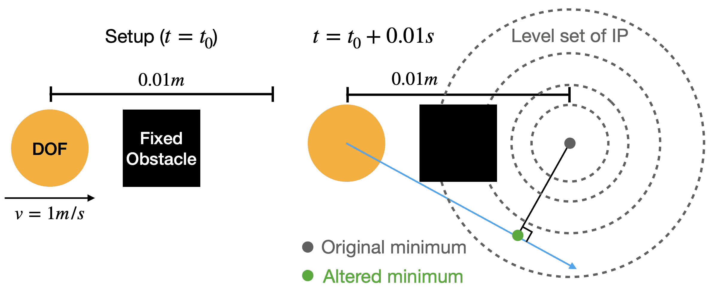
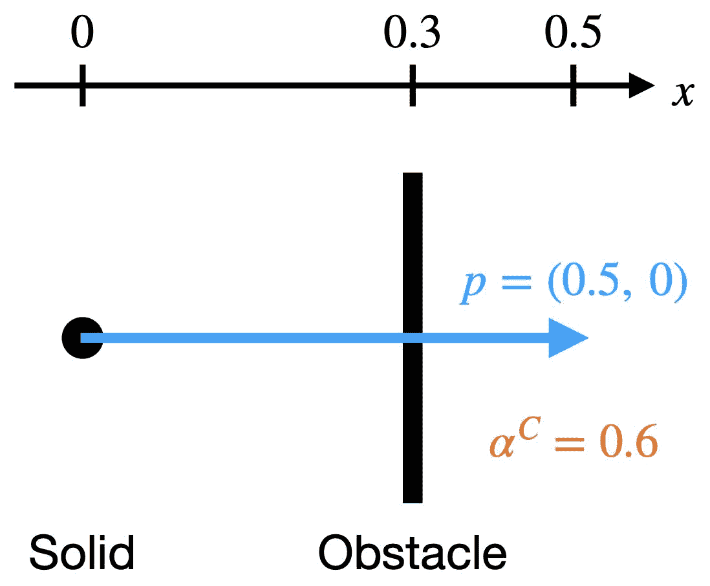
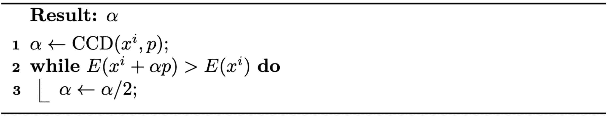
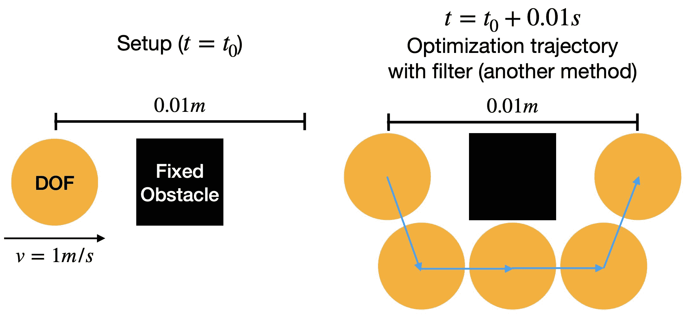

# 无穿透轨迹

> 原文：[`phys-sim-book.github.io/lec8.2-nonpenetration_traj.html`](https://phys-sim-book.github.io/lec8.2-nonpenetration_traj.html)

定义在时间 $ t^n $ 和 $ t^{n+1} $ 分别对应于 $ x^n $ 和 $ x^{n+1} $ 之间的运动轨迹的最直接方法将是连接这两个配置的高维线段。然而，尽管在轨迹上强制执行非负有符号距离可以避免 示例 8.1.1 中的隧穿问题，但这种策略可能会以非物理的方式改变最小化问题（方程 (7.2.1)）的局部最优，从而可能导致不现实的行为（图 8.2.1）。

**图 8.2.1**。对于隧穿示例中的设置，在由 $ x_n $ 和 $ x_{n+1} $ 之间的线段近似运动轨迹上强制执行非负有符号距离会导致非物理的模拟结果。

$ x^n $ 和 $ x^{n+1} $ 之间运动轨迹的更严格定义可以是 {argxmin(21∥x−(xn+hvn)∥M2+h2∑P(x)) h∈[0,tn+1−tn]}。然而，评估此轨迹上的配置需要解决额外的优化问题，这可能会显著复杂化时间积分。

相反，IPC 将优化路径视为运动轨迹的近似。具体来说，对于从 $ x^n $ 到 $ x^{n+1} $ 的求解时间步长，如果优化进行了 $ l $ 次迭代，并且每次线性搜索后我们得到迭代 $ x^i $，则优化路径简单地是高维折线 {(1−β)xi+βxi+1 ∣ β∈[0,1], i=0,1,2,...,l}。现在，时间步长 $ n $ 中的时间积分问题变成了寻找这样的优化路径 $ x⁰, x¹, ..., x^l $，其中 $ x^l $ 在局部上最小化增量势（方程 (7.2.2)），同时满足 djk((1−β)xi+βxi+1)>0∀ node j, obstacle k, β∈[0,1],and i=0,1,2,...,l。这使得可以在 $ x^i $ 和 $ x^{i+1} $ 之间的线段上对每个优化迭代强制执行非负距离约束，这不会改变时间积分问题的局部最优，并且可以有效地处理。

回想一下算法 3.2.1，线搜索方案更新迭代点为 $ x^{i+1} \leftarrow x^i + \alpha p $，这意味着 $ x^{i+1} - x^{i} = \alpha p $。因此，给定一个无穿透的 $ x^i $，为了确保 $ x^i $ 和 $ x^{i+1} $ 之间的线段上的所有配置都是无穿透的，我们只需要找到这样一个 $ \alpha $，使得 $ d_{jk}(x_i + \beta p) \geq 0 $ 对于所有节点 $ j $、障碍物 $ k $ 和 $ \beta \in [0, \alpha] $ 成立。基于这样的直觉，即足够小的 $ \alpha $ 肯定能实现这一点，我们可以在每次迭代中简单地计算这样一个 $ \alpha $ 的上界，并确保回溯线搜索的结果步长小于这个上界。这个上界可以用连续碰撞检测（CCD）方便地计算。

> ****定义 8.2.1（连续碰撞检测（CCD））。**** 对于一个距离函数 $ d_{jk}(x + \alpha p) $，它使用固体的初始无穿透配置 $ x $、预期位移 $ p $ 和步长 $ \alpha $ 定义，CCD 计算给定 $ x $ 和 $ p $ 的步长 $ \alpha^C_{jk} $，使得 $ d_{jk}(x + \alpha p) > 0 $ 对于所有 $ \alpha \in [0, \alpha_{jkC}] $ 成立。（8.2.1）请注意，问题定义隐含地要求 $ d_{jk}(x) > 0 $。在这种设置下，如果我们表示 $ d^a_{jk}(\alpha) = d_{jk}(x + \alpha p) $，则 $ \alpha^C_{jk} $ 简单地是 $ d^a_{jk}(\alpha) $ 的最小正实根（见图 8.2.2 中的示例），或者如果 $ d^a_{jk}(\alpha) $ 没有任何正实根，则 $ \alpha^C_{jk} = \infty $。有许多方法可以获得 $ \alpha^C_{jk} $ 的精确值或保守估计，我们将在本讲座的案例研究中看到一个具体的例子。在为所有节点 $ j $ 和障碍物 $ k $ 计算出 $ \alpha^C_{jk} $ 之后，就可以得到线搜索的步长上界 $ \alpha^C $，即 $ \alpha^C = \min(1, j, kmin \alpha_{jkC}) $。
> 
> 
> 
> **图 8.2.2。** 一个在 (0,0) 处的实心粒子撞击 x=0.3 处固定垂直平面的 CCD 示例。预期位移 $ p=(0.5,0) $，我们得到 $ \alpha^C=0.6 $。

现在，我们可以介绍我们的滤波线搜索方法（算法 8.2.1），它专门设计用来在整个近似运动轨迹上强制执行非穿透约束。这种战略性的强制执行是防止在约束处理不足的模拟中常见隧道问题的关键。

这个新方案在关键方面与传统回溯线搜索方法不同：它初始化步长。不同于从步长 $ 1 $ 开始，滤波线搜索方法从 $ \alpha^C $ 开始。这种修改虽微妙但意义重大。

**算法 8.2.1（滤波回溯线搜索）**。

> ***备注 8.2.1（算法依赖性问题）***。使用优化路径来近似运动轨迹仍然不完美，因为它依赖于算法。除了投影牛顿（PN）方法外，可能存在一种算法会在障碍物周围徘徊，最终在另一侧得到一个配置，仍然提供隧道解决方案（图 8.2.3）。即使使用投影牛顿，虽然在实践中它总是生成直接且物理上合理的轨迹，但没有任何理论保证它永远不会遇到隧道问题。一种直觉是，在每次 PN 迭代中，搜索方向总是显著降低增量势（IP），因此不太可能绕过任何接触点，这通常会导致迭代过程中 IP 的降低不足。实际上，这种问题也发生在无接触的弹性动力学模拟中。弹性能量本身也是非凸的，这可能导致 IP 有多个局部最优解。获得物理行为的关键是**局部最小化** IP，换句话说，找到附近的局部最小值作为解。
> 
> 
> 
> **图 8.2.3**。对于隧道示例中的设置，即使使用过滤线搜索方案，如果应用了除投影牛顿以外的优化方法，仍然可能导致隧道问题。
