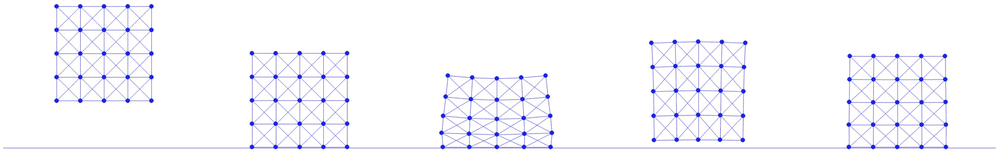

# 案例研究：正方形下落

> 原文：[`phys-sim-book.github.io/lec8.3-square_drop.html`](https://phys-sim-book.github.io/lec8.3-square_drop.html)

``

为了总结，让我们考虑一个案例研究，其中我们模拟一个正方形落在固定的平面地面上。基于我们之前为弹性正方形建立的质点-弹簧模型，我们将其增量势能中加入势垒势，并应用滤波线搜索方案来管理正方形的自由度（DOFs）与地面之间的接触。

本节的可执行 Python 项目可在 `3_contact` 文件夹下的 [`github.com/phys-sim-book/solid-sim-tutorial`](https://github.com/phys-sim-book/solid-sim-tutorial) 找到。[MUDA](https://github.com/MuGdxy/muda) GPU 实现可在 `simulators/3_contact` 文件夹下的 [`github.com/phys-sim-book/solid-sim-tutorial-gpu`](https://github.com/phys-sim-book/solid-sim-tutorial-gpu) 找到。

如果我们进一步将平面地面限制为水平，例如在 $ y=y_0 $ 处，其符号距离函数可以比方程 (7.1.1) 更简单：$ d(x)=xy-y_0 $，$ \nabla d(x)=[0 1] $，$ \nabla²d(x)=0 $。（8.3.1）结合方程 (7.2.4) 和方程 (7.2.5)，我们可以方便地实现此水平地面的势垒势的梯度和 Hessian 计算：

**实现 8.3.1 (势垒能量值、梯度及 Hessian，BarrierEnergy.py)**。

```py
import math
import numpy as np

dhat = 0.01
kappa = 1e5

def val(x, y_ground, contact_area):
    sum = 0.0
    for i in range(0, len(x)):
        d = x[i][1] - y_ground
        if d < dhat:
            s = d / dhat
            sum += contact_area[i] * dhat * kappa / 2 * (s - 1) * math.log(s)
    return sum

def grad(x, y_ground, contact_area):
    g = np.array([[0.0, 0.0]] * len(x))
    for i in range(0, len(x)):
        d = x[i][1] - y_ground
        if d < dhat:
            s = d / dhat
            g[i][1] = contact_area[i] * dhat * (kappa / 2 * (math.log(s) / dhat + (s - 1) / d))
    return g

def hess(x, y_ground, contact_area):
    IJV = [[0] * len(x), [0] * len(x), np.array([0.0] * len(x))]
    for i in range(0, len(x)):
        IJV[0][i] = i * 2 + 1
        IJV[1][i] = i * 2 + 1
        d = x[i][1] - y_ground
        if d < dhat:
            IJV[2][i] = contact_area[i] * dhat * kappa / (2 * d * d * dhat) * (d + dhat)
        else:
            IJV[2][i] = 0.0
    return IJV 
```

对于滤波线搜索，在上一迭代的位置 $ \mathbf{x} $ 和一个特定节点的搜索方向 $ \mathbf{p} $，符号距离函数简单地是 \[ d(\mathbf{x} + \alpha \mathbf{p}) = \mathbf{x}_y + \alpha \mathbf{p}_y - y_0, \] 其中 $ \alpha $ 是步长，当 $ \mathbf{p}_y < 0 $ 时（因为 $ \mathbf{x}_y > y_0 $，当前迭代没有穿透），存在唯一的正实根 $ \alpha = (y_0 - \mathbf{x}_y) / \mathbf{p}_y $。对每个节点取正实根的最小值，然后给出方程 (8.2.1) 中定义的步长上限 $ \alpha_C $：

**实现 8.3.2 (地面 CCD，BarrierEnergy.py)**。

```py
def init_step_size(x, y_ground, p):
    alpha = 1
    for i in range(0, len(x)):
        if p[i][1] < 0:
            alpha = min(alpha, 0.9 * (y_ground - x[i][1]) / p[i][1])
    return alpha 
```

这里我们将上限乘以 $ 0.9\times $，以避免精确接触配置 $ d=0 $ 和 $ b = \infty $（浮点数溢出）。

然后一旦我们确保使用步长上限来初始化线搜索

**实现 8.3.3 (滤波线搜索，time_integrator.py)**。

```py
 # filter line search
        alpha = BarrierEnergy.init_step_size(x, y_ground, p)  # avoid interpenetration and tunneling
        while IP_val(x + alpha * p, e, x_tilde, m, l2, k, y_ground, contact_area, h) > E_last:
            alpha /= 2 
```

并且计算了所有节点的接触面积权重

**实现 8.3.4 (接触面积，simulator.py)**。

```py
contact_area = [side_len / n_seg] * len(x)     # perimeter split to each node 
```

将其传递给我们的模拟器，我们可以模拟质量-弹簧刚度为`k=2e4`和时间步长为`h=0.01`的正方形下落，如图图 8.3.1 所示。



**图 8.3.1**。一个质量-弹簧弹性正方形以 0 初始速度在重力作用下被扔到地面上。这里展示了正方形：刚刚被扔下，第一次接触地面，在这个模拟中压缩到最大，以及变为静态时的帧。

> ***备注 8.3.1（接触层集成）***。由于在实际中，接触力仅作用于固体的边界，因此势垒电势也应仅集成在边界上。这也解释了为什么在我们的案例研究中，接触面积权重简单地按正方形的直径均匀分配到每个边界节点上计算。然而，由于质量-弹簧弹性不能保证所有内部节点都保持在固体的边界内，我们简单地应用势垒电势到正方形的所有节点自由度上。
