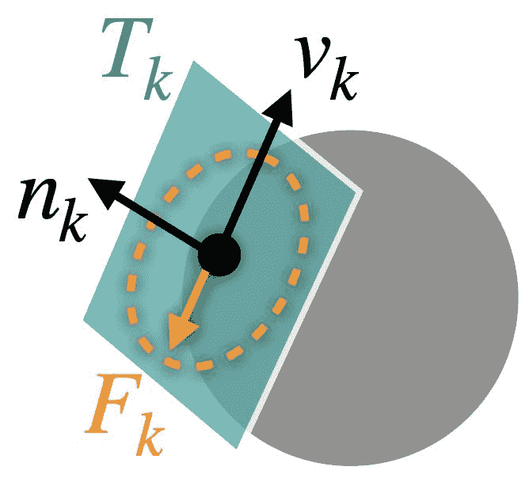
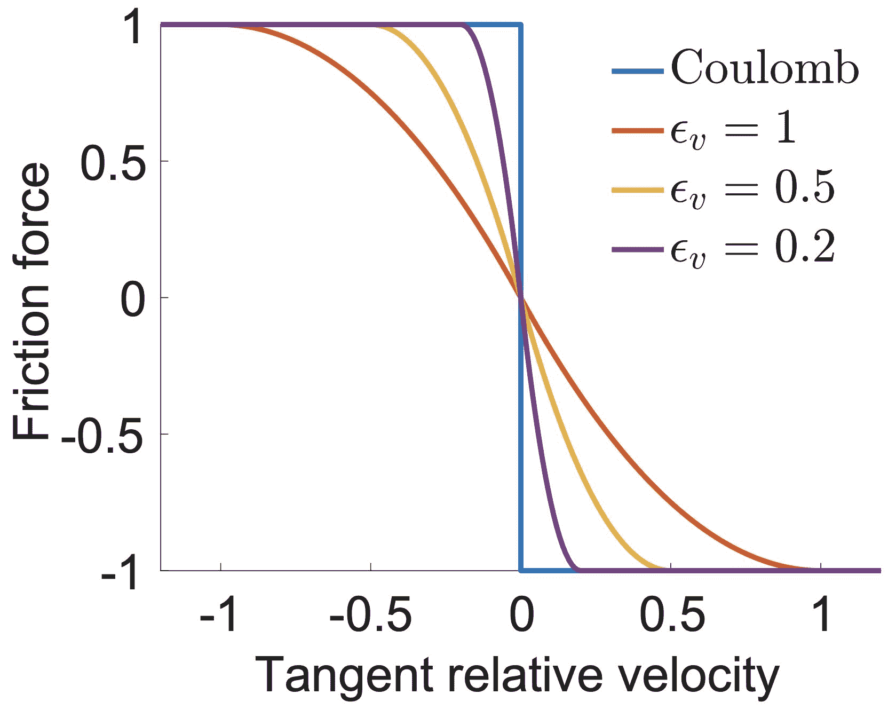

# 平滑动态-静态过渡

> 原文：[`phys-sim-book.github.io/lec9.1-smooth_fric.html`](https://phys-sim-book.github.io/lec9.1-smooth_fric.html)

<link rel="stylesheet" href="https://cdn.jsdelivr.net/npm/katex@0.16.4/dist/katex.min.css">

为了模拟摩擦接触，可以为每个活动的接触点对 k 添加局部摩擦力 Fk。对于这样的每一对 k，在当前状态{x,v}下，可以构建一个一致方向的滑动基 Tk(x)∈Rdm×d，其中 m 是模拟节点的总数，d 是空间维度，使得 vk=Tk(x)Tv∈Rd 提供了与法向梯度在法线方向上的距离正交的局部相对滑动速度。

> ****示例 9.1.1（粒子在球面上滑动）.**** 对于一个速度 vp∈R3 的粒子在速度 vs∈R3（无旋转）的球面上移动，这里的相对滑动速度 vk 可以计算为 vk=(vp−vs)−nk⋅(vp−vs)nk=(I3−nknkT)(vp−vs). 如果我们将该系统的粒子速度和球体速度堆叠，得到 v=[vpT,vsT]T∈R6，我们现在知道 Tk(x)=[I3−nk(x)nk(x)Tnk(x)nk(x)T−I3]∈R6×3。对于更一般的情况，如网格-网格接触，Tk 的形式仅与接触点对 k 的相对速度与模拟节点速度的关系有关。

在满足库仑约束的条件下最大化耗散率定义了摩擦力的变化 Fk(x)=Tk(x) argβ∈RdminβTvk∥β∥≤μλk 且β⋅nk=0,(9.1.1) 其中λk=−wk∂dk∂b 是接触力大小，μ是局部摩擦系数。这等价于 Fk(x)=−μλkTk(x)f(∥vk∥)s(vk),(9.1.2) 其中当∥vk∥>0 时，s(vk)=∥vk∥vk，而当∥vk∥=0 时，s(vk)取与 nk 垂直的任何单位向量。此外，摩擦缩放函数 f 相对于 vk 也是非平滑的，因为当∥vk∥>0 时，f(∥vk∥)=1，而当∥vk∥=0 时，f(∥vk∥)∈[0,1]。这些非平滑性会严重减慢甚至破坏基于梯度的优化的收敛。

**图 9.1.1.** 点在球面上滑动时 Tk, vk, nk 和 Fk 的示意图。

> ***备注 9.1.1（接触力大小）.*** λk=−wk∂dk∂b 是接触力大小，因为在节点 k 处，接触力是−wk∇xkb(dk(x))=−wk∂dk∂b∇xkdk(x)。因此，λk=∥−wk∂dk∂b∇xkdk(x)∥=−wk∂dk∂b，因为∂dk∂b<0 且∥∇xkdk(x)∥=1。

为了实现高效和稳定的优化，可以通过将摩擦速度关系中的 f 替换为一个平滑近似函数来缓解从动态摩擦到静摩擦的过渡。遵循 IPC，我们使用 f1(y)={−ϵv²y²+ϵv²y,1,​y∈0,ϵv),y≥ϵv},(9.1.3) 其中 f1′(ϵv)=0，并定义一个速度大小界限ϵv（以 m/s 为单位），在此界限以下，滑动速度 vk 被视为静摩擦，以定义有界近似误差（[图 9.1.2）。

**图 9.1.2**。摩擦力与滑动速度之间平滑关系的 1D 示意图。随着ϵv 的减小，渐近地匹配了不连续的库仑摩擦模型。
