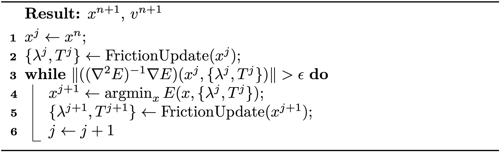

# 固定点迭代

> 原文：[`phys-sim-book.github.io/lec9.3-fixed_point_iter.html`](https://phys-sim-book.github.io/lec9.3-fixed_point_iter.html)

<link rel="stylesheet" href="https://cdn.jsdelivr.net/npm/katex@0.16.4/dist/katex.min.css">

要获得完全隐式摩擦的解，我们可以迭代地在非线性优化（固定 λ 和 T）和摩擦更新之间交替，直到收敛 (算法 9.3.1)。

**算法 9.3.1（完全隐式摩擦的固定点迭代）。** 

如果我们表示 \begin{equation} \begin{aligned} & f_m({ \lambda, T }) = \text{arg}\min_x E(x, { \lambda, T}) \ & f_u(x) = \text{FrictionUpdate}(x), \end{aligned} \end{equation} 那么 算法 9.3.1 实质上是一个固定点迭代，用于找到函数 \begin{equation} (f_m \cdot f_u) (x) \equiv f_m( f_u (x)). \end{equation} 的固定点。

> ****定义 9.3.1.**** x 是函数 f() 的一个固定点，当且仅当 \begin{equation} x = f(x). \end{equation} 固定点迭代通过迭代更新估计值 \begin{equation} x^{i+1} \leftarrow f(x^i) \end{equation} 来找到函数 f() 的固定点，直到收敛。

由于固定点迭代的收敛只能在一个足够接近最终解的初始猜测下实现，因此 算法 9.3.1 的收敛同样需要小的时间步长。然而，请注意，对于固定 {λ,T} 的每次最小化（算法 9.3.1 行 4），仍然保证在任意大的时间步长下收敛。

> ***备注 9.3.1.*** 在实践中，使用帧率时间步长的半隐式摩擦已经可以产生高质量的视觉效果。为了更高的精度，通常需要进行 2 到 3 次固定点迭代来处理摩擦。
