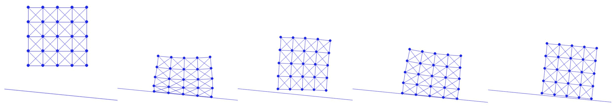

# 从地面到斜率

> 原文：[`phys-sim-book.github.io/lec10.1-ground_to_slope.html`](https://phys-sim-book.github.io/lec10.1-ground_to_slope.html)


在水平地面情况下的方形坠落案例研究中，实现的结果与一般半空间（方程(7.1.1)）相比，简化了距离和距离梯度（方程(8.3.1))：d(x)=nT(x−o),∇d(x)=n, 和 ∇2d(x)=0。(10.1.1) 这就是实现斜率所需的所有内容。定义一个法线方向和一个位于斜率上的点

**实现 10.1.1（斜率设置，simulator.py）。**

```py
ground_n = np.array([0.1, 1.0])     # normal of the slope
ground_n /= np.linalg.norm(ground_n)    # normalize ground normal vector just in case
ground_o = np.array([0.0, -1.0])    # a point on the slope 
```

将它们传递给时间积分器和屏障能量，我们可以修改斜率的屏障能量值、梯度和 Hessian 计算，如下所示

**实现 10.1.2（斜率接触屏障，BarrierEnergy.py）。**

```py
import math
import numpy as np

dhat = 0.01
kappa = 1e5

def val(x, n, o, contact_area):
    sum = 0.0
    for i in range(0, len(x)):
        d = n.dot(x[i] - o)
        if d < dhat:
            s = d / dhat
            sum += contact_area[i] * dhat * kappa / 2 * (s - 1) * math.log(s)
    return sum

def grad(x, n, o, contact_area):
    g = np.array([[0.0, 0.0]] * len(x))
    for i in range(0, len(x)):
        d = n.dot(x[i] - o)
        if d < dhat:
            s = d / dhat
            g[i] = contact_area[i] * dhat * (kappa / 2 * (math.log(s) / dhat + (s - 1) / d)) * n
    return g

def hess(x, n, o, contact_area):
    IJV = [[0] * 0, [0] * 0, np.array([0.0] * 0)]
    for i in range(0, len(x)):
        d = n.dot(x[i] - o)
        if d < dhat:
            local_hess = contact_area[i] * dhat * kappa / (2 * d * d * dhat) * (d + dhat) * np.outer(n, n)
            for c in range(0, 2):
                for r in range(0, 2):
                    IJV[0].append(i * 2 + r)
                    IJV[1].append(i * 2 + c)
                    IJV[2] = np.append(IJV[2], local_hess[r, c])
    return IJV 
```

然后对于连续碰撞检测，我们同样修改实现来计算使用 n 和 o 的线搜索的大可行初始步长：

**实现 10.1.3（斜率 CCD，BarrierEnergy.py）。**

```py
def init_step_size(x, n, o, p):
    alpha = 1
    for i in range(0, len(x)):
        p_n = p[i].dot(n)
        if p_n < 0:
            alpha = min(alpha, 0.9 * n.dot(x[i] - o) / -p_n)
    return alpha 
```

在这里，每个节点的搜索方向被投影到法线方向 n 上，以在计算将距离首次带到 0 的最小步长时分割当前距离。

最后，将斜率从 o−3n^ 绘制为一条线到 o+3n^，其中 n^=[ny，−nx] 指向倾斜方向，

**实现 10.1.4（斜率可视化，simulator.py）。**

```py
 pygame.draw.aaline(screen, (0, 0, 255), screen_projection([ground_o[0] - 3.0 * ground_n[1], ground_o[1] + 3.0 * ground_n[0]]), 
        screen_projection([ground_o[0] + 3.0 * ground_n[1], ground_o[1] - 3.0 * ground_n[0]]))   # slope 
```

我们现在可以模拟一个无摩擦的斜面上的弹性方形坠落（图 10.1.1）。



**图 10.1.1**。一个弹性方形被投掷到一个无摩擦的斜面上，在滑动下弹跳。
