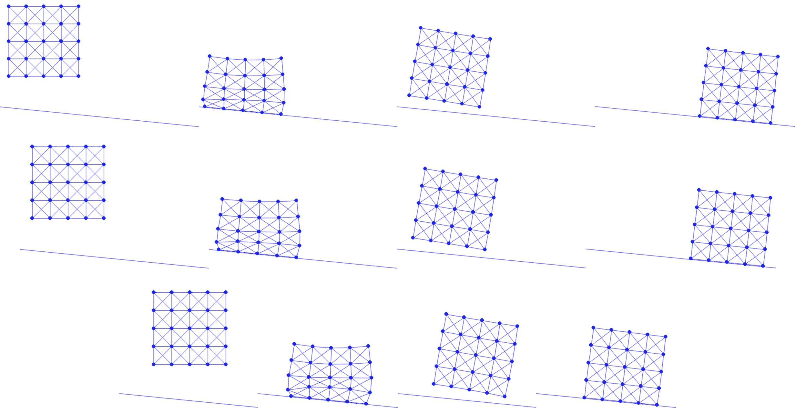

# 斜坡摩擦

> 原文：[`phys-sim-book.github.io/lec10.2-slope_fric.html`](https://phys-sim-book.github.io/lec10.2-slope_fric.html)


现在为了实现斜坡的摩擦力，我们首先根据方程(9.2.2)，方程(9.2.5)和方程(9.2.6)分别实现函数 f0(∥vˉk∥h^)，f1(∥vˉk∥)/∥vˉk∥和(f1′(∥vˉk∥)∥vˉk∥−f1(∥vˉk∥))/∥vˉk∥²。

**实现 10.2.1（摩擦辅助函数，FrictionEnergy.py）。**

```py
import numpy as np
import utils

epsv = 1e-3

def f0(vbarnorm, epsv, hhat):
    if vbarnorm >= epsv:
        return vbarnorm * hhat
    else:
        vbarnormhhat = vbarnorm * hhat
        epsvhhat = epsv * hhat
        return vbarnormhhat * vbarnormhhat * (-vbarnormhhat / 3.0 + epsvhhat) / (epsvhhat * epsvhhat) + epsvhhat / 3.0

def f1_div_vbarnorm(vbarnorm, epsv):
    if vbarnorm >= epsv:
        return 1.0 / vbarnorm
    else:
        return (-vbarnorm + 2.0 * epsv) / (epsv * epsv)

def f_hess_term(vbarnorm, epsv):
    if vbarnorm >= epsv:
        return -1.0 / (vbarnorm * vbarnorm)
    else:
        return -1.0 / (epsv * epsv) 
```

有这些术语可用后，我们可以根据方程(9.2.1)，方程(9.2.3)和方程(9.2.4)分别实现半隐式摩擦能量值、梯度和 Hessian 计算。

**实现 10.2.2（摩擦值、梯度和 Hessian，FrictionEnergy.py）。**

```py
def val(v, mu_lambda, hhat, n):
    sum = 0.0
    T = np.identity(2) - np.outer(n, n) # tangent of slope is constant
    for i in range(0, len(v)):
        if mu_lambda[i] > 0:
            vbar = np.transpose(T).dot(v[i])
            sum += mu_lambda[i] * f0(np.linalg.norm(vbar), epsv, hhat)
    return sum

def grad(v, mu_lambda, hhat, n):
    g = np.array([[0.0, 0.0]] * len(v))
    T = np.identity(2) - np.outer(n, n) # tangent of slope is constant
    for i in range(0, len(v)):
        if mu_lambda[i] > 0:
            vbar = np.transpose(T).dot(v[i])
            g[i] = mu_lambda[i] * f1_div_vbarnorm(np.linalg.norm(vbar), epsv) * T.dot(vbar)
    return g

def hess(v, mu_lambda, hhat, n):
    IJV = [[0] * 0, [0] * 0, np.array([0.0] * 0)]
    T = np.identity(2) - np.outer(n, n) # tangent of slope is constant
    for i in range(0, len(v)):
        if mu_lambda[i] > 0:
            vbar = np.transpose(T).dot(v[i])
            vbarnorm = np.linalg.norm(vbar)
            inner_term = f1_div_vbarnorm(vbarnorm, epsv) * np.identity(2)
            if vbarnorm != 0:
                inner_term += f_hess_term(vbarnorm, epsv) / vbarnorm * np.outer(vbar, vbar)
            local_hess = mu_lambda[i] * T.dot(utils.make_PSD(inner_term)).dot(np.transpose(T)) / hhat
            for c in range(0, 2):
                for r in range(0, 2):
                    IJV[0].append(i * 2 + r)
                    IJV[1].append(i * 2 + c)
                    IJV[2] = np.append(IJV[2], local_hess[r, c])
    return IJV 
```

注意，在 Numpy 中，矩阵-矩阵和矩阵-向量积是通过`dot()`函数实现的。对于隐式欧拉法，v=(x−xn)/h，因此 h^=h。这里`mu_lambda`存储每个节点的μλkn，其中法向力大小λkn 在每一步的开始使用 xn 计算。

**实现 10.2.3（使用μ和λ，time_integrator.py）。**

```py
def step_forward(x, e, v, m, l2, k, n, o, contact_area, mu, is_DBC, h, tol):
    x_tilde = x + v * h     # implicit Euler predictive position
    x_n = copy.deepcopy(x)
    mu_lambda = BarrierEnergy.compute_mu_lambda(x, n, o, contact_area, mu)  # compute mu * lambda for each node using x^n

    # Newton loop 
```

**实现 10.2.4（计算μ和λ，BarrierEnergy.py）。**

```py
def compute_mu_lambda(x, n, o, contact_area, mu):
    mu_lambda = np.array([0.0] * len(x))
    for i in range(0, len(x)):
        d = n.dot(x[i] - o)
        if d < dhat:
            s = d / dhat
            mu_lambda[i] = mu * -contact_area[i] * dhat * (kappa / 2 * (math.log(s) / dhat + (s - 1) / d))
    return mu_lambda 
```

由于斜率是静态的，且法线方向在所有地方都相同，因此 T 是恒定的，因此可以精确地离散化。

最后，我们设置摩擦系数μ并将其传递给时间积分器，我们在其中添加摩擦能量以模拟斜坡上的半隐式摩擦。

```py
mu = 0.11        # friction coefficient of the slope 
```

现在我们准备用不同的摩擦系数测试模拟。由于我们的斜坡有一个倾斜角θ，tan(θ)=0.1，我们测试μ=0.1，0.11 和 0.2（图 10.2.1）。在这里，我们可以看到当μ=0.1 时，提供与斜坡重力分量相同大小动态摩擦力的临界值，正方形在获得初始动量后继续滑动（图 10.2.1 顶部）。当我们设置μ=0.11，略高于临界值时，正方形滑动了一段时间后停止，表明静摩擦力得到了适当的解决（图 10.2.1 中部）。当μ=0.2 时，正方形甚至更早停止（图 10.2.1 底部）。



**图 10.2.1**。当摩擦系数μ=0.1（顶部），0.11（中部）和 0.2（底部）时，我们模拟了一个弹性正方形被投掷到斜坡上。除了顶部的一个正方形持续滑动外，摩擦系数较大的底部两个最终都达到了静态平衡。
