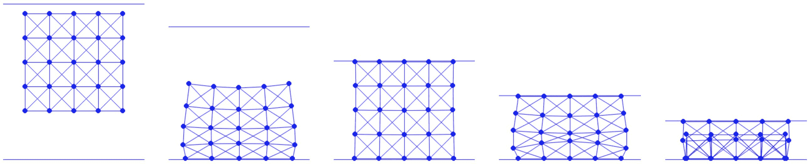

# 案例研究：压缩正方形

> 原文：[`phys-sim-book.github.io/lec11.2-compress_square.html`](https://phys-sim-book.github.io/lec11.2-compress_square.html)


我们使用天花板模拟压缩弹性正方形。本节的可执行 Python 项目可以在 `5_mov_dirichlet` 文件夹下的 [`github.com/phys-sim-book/solid-sim-tutorial`](https://github.com/phys-sim-book/solid-sim-tutorial) 找到。[MUDA](https://github.com/MuGdxy/muda) GPU 实现可以在 `simulators/5_mov_dirichlet` 文件夹下的 [`github.com/phys-sim-book/solid-sim-tutorial-gpu`](https://github.com/phys-sim-book/solid-sim-tutorial-gpu) 找到。

在我们的模拟中，天花板被建模为一个向下法向量 n=(0,−1) 的半空间。天花板到其他模拟的自由度（DOFs）的距离可以使用方程 (7.1.1) 来计算。为了有效地应用惩罚方法，天花板的高度也必须作为一个自由度。

沿着在 斜坡上的正方形 项目中使用的方法，我们选择天花板上的原点 o 作为 DOF 并将其纳入变量 x：

**实现 11.2.1（天花板 DOF 设置，simulator.py）**。

```py
[x, e] = square_mesh.generate(side_len, n_seg)      # node positions and edge node indices
x = np.append(x, [[0.0, side_len * 0.6]], axis=0)   # ceil origin (with normal [0.0, -1.0]) 
```

天花板最初直接位于弹性正方形上方，如图 图 11.2.1 左侧所示。通过这样做，我们确保这个新增加的 DOF 的节点质量与正方形上其他模拟的节点一致，符合我们的实现。

使用这个额外的自由度（DOF），我们可以直接模拟天花板和正方形之间的接触。这是通过增强现有的计算势能值、梯度、海森矩阵和初始步长的函数来实现的：

**实现 11.2.2（势能值，BarrierEnergy.py）**。

```py
 n = np.array([0.0, -1.0])
    for i in range(0, len(x) - 1):
        d = n.dot(x[i] - x[-1])
        if d < dhat:
            s = d / dhat
            sum += contact_area[i] * dhat * kappa / 2 * (s - 1) * math.log(s) 
```

**实现 11.2.3（势能梯度，BarrierEnergy.py）**。

```py
 n = np.array([0.0, -1.0])
    for i in range(0, len(x) - 1):
        d = n.dot(x[i] - x[-1])
        if d < dhat:
            s = d / dhat
            local_grad = contact_area[i] * dhat * (kappa / 2 * (math.log(s) / dhat + (s - 1) / d)) * n
            g[i] += local_grad
            g[-1] -= local_grad 
```

**实现 11.2.4（势能海森矩阵，BarrierEnergy.py）**。

```py
 n = np.array([0.0, -1.0])
    for i in range(0, len(x) - 1):
        d = n.dot(x[i] - x[-1])
        if d < dhat:
            local_hess = contact_area[i] * dhat * kappa / (2 * d * d * dhat) * (d + dhat) * np.outer(n, n)
            index = [i, len(x) - 1]
            for nI in range(0, 2):
                for nJ in range(0, 2):
                    for c in range(0, 2):
                        for r in range(0, 2):
                            IJV[0].append(index[nI] * 2 + r)
                            IJV[1].append(index[nJ] * 2 + c)
                            IJV[2] = np.append(IJV[2], ((-1) ** (nI != nJ)) * local_hess[r, c]) 
```

**实现 11.2.5（初始步长计算，BarrierEnergy.py）**。

```py
 n = np.array([0.0, -1.0])
    for i in range(0, len(x) - 1):
        p_n = (p[i] - p[-1]).dot(n)
        if p_n < 0:
            alpha = min(alpha, 0.9 * n.dot(x[i] - x[-1]) / -p_n) 
```

在这里，对于天花板 o 和节点 x 之间的距离，我们有局部堆叠的数量：d(x,o)=nT(x−o)，∇d(x,o)=[n−n​]，∇2d(x,o)=0。

现在我们将移动边界条件（BC）应用于天花板以压缩弹性正方形。我们将天花板的 DOF，通过节点索引 `(n_seg+1)*(n_seg+1)` 识别，设置为场景中的唯一 Dirichlet 边界条件（DBC）。我们将其分配一个向下的速度 (0,−0.5)。当天花板达到高度 -0.6 时，运动停止：

**实现 11.2.6（DBC 设置，simulator.py）**。

```py
DBC = [(n_seg + 1) * (n_seg + 1)]       # dirichlet node index
DBC_v = [np.array([0.0, -0.5])]         # dirichlet node velocity
DBC_limit = [np.array([0.0, -0.6])]     # dirichlet node limit position 
```

然后我们根据方程 (11.1.1) 实现惩罚项，这本质上是一个用于控制天花板运动的二次弹簧能量：

**实现 11.2.7（弹簧能量计算，SpringEnergy.py）**。

```py
import numpy as np

def val(x, m, DBC, DBC_target, k):
    sum = 0.0
    for i in range(0, len(DBC)):
        diff = x[DBC[i]] - DBC_target[i]
        sum += 0.5 * k * m[DBC[i]] * diff.dot(diff)
    return sum

def grad(x, m, DBC, DBC_target, k):
    g = np.array([[0.0, 0.0]] * len(x))
    for i in range(0, len(DBC)):
        g[DBC[i]] = k * m[DBC[i]] * (x[DBC[i]] - DBC_target[i])
    return g

def hess(x, m, DBC, DBC_target, k):
    IJV = [[0] * 0, [0] * 0, np.array([0.0] * 0)]
    for i in range(0, len(DBC)):
        for d in range(0, 2):
            IJV[0].append(DBC[i] * 2 + d)
            IJV[1].append(DBC[i] * 2 + d)
            IJV[2] = np.append(IJV[2], k * m[DBC[i]])
    return IJV 
```

接下来，我们专注于在适当处理收敛性检查和罚刚度调整的同时优化弹簧能量。在每个时间步的开始，计算每个 DBC 节点的目标位置，并将罚刚度 kM 初始化为 10。如果某些节点达到其预设的限制，我们将目标设置为它们的当前位置：

**实现 11.2.8（DBC 初始化，time_integrator.py）**。

```py
 DBC_target = [] # target position of each DBC in the current time step
    for i in range(0, len(DBC)):
        if (DBC_limit[i] - x_n[DBC[i]]).dot(DBC_v[i]) > 0:
            DBC_target.append(x_n[DBC[i]] + h * DBC_v[i])
        else:
            DBC_target.append(x_n[DBC[i]]) 
```

进入牛顿循环，在每次迭代中，在计算搜索方向之前，我们评估有多少 DBC 节点足够接近其目标位置。我们将这些结果存储在变量`DBC_satisfied`中：

**实现 11.2.9（DBC 满足性检查，time_integrator.py）**。

```py
 # check whether each DBC is satisfied
    DBC_satisfied = [False] * len(x)
    for i in range(0, len(DBC)):
        if LA.norm(x[DBC[i]] - DBC_target[i]) / h < tol:
            DBC_satisfied[DBC[i]] = True 
```

然后，我们只消除那些已经满足边界条件的 DBC 节点的自由度：

**实现 11.2.10（自由度消除，time_integrator.py）**。

```py
 # eliminate DOF if it's a satisfied DBC by modifying gradient and Hessian for DBC:
    for i, j in zip(*projected_hess.nonzero()):
        if (is_DBC[int(i / 2)] & DBC_satisfied[int(i / 2)]) | (is_DBC[int(j / 2)] & DBC_satisfied[int(j / 2)]): 
            projected_hess[i, j] = (i == j)
    for i in range(0, len(x)):
        if is_DBC[i] & DBC_satisfied[i]:
            reshaped_grad[i * 2] = reshaped_grad[i * 2 + 1] = 0.0
    return [spsolve(projected_hess, -reshaped_grad).reshape(len(x), 2), DBC_satisfied] 
```

存储在`DBC_satisfied`中的 BC 满足性信息也用于检查收敛性，并在需要时更新 kM：

**实现 11.2.11（收敛标准，time_integrator.py）**。

```py
 [p, DBC_satisfied] = search_dir(x, e, x_tilde, m, l2, k, n, o, contact_area, (x - x_n) / h, mu_lambda, is_DBC, DBC, DBC_target, DBC_stiff[0], tol, h)
    while (LA.norm(p, inf) / h > tol) | (sum(DBC_satisfied) != len(DBC)):   # also check whether all DBCs are satisfied
        print('Iteration', iter, ':')
        print('residual =', LA.norm(p, inf) / h)

        if (LA.norm(p, inf) / h <= tol) & (sum(DBC_satisfied) != len(DBC)):
            # increase DBC stiffness and recompute energy value record
            DBC_stiff[0] *= 2
            E_last = IP_val(x, e, x_tilde, m, l2, k, n, o, contact_area, (x - x_n) / h, mu_lambda, DBC, DBC_target, DBC_stiff[0], h) 
```

现在，我们继续运行模拟，该模拟涉及将掉落的弹性正方形严重压缩，如图(图 11.2.1)所示。从最终静态帧中，我们可以观察到边缘的弹性弹簧由于极端压缩而反转。这种缺陷在质量-弹簧弹性模型中很典型。在未来的章节中，我们将探讨如何将有限元离散化应用于屏障型弹性模型，例如 Neo-Hookean 模型，以防止此类问题。这种方法类似于我们当前模拟中强制执行非穿透性。



**图 11.2.1**。一个正方形被扔到地面上，并被天花板压缩直到反转。
