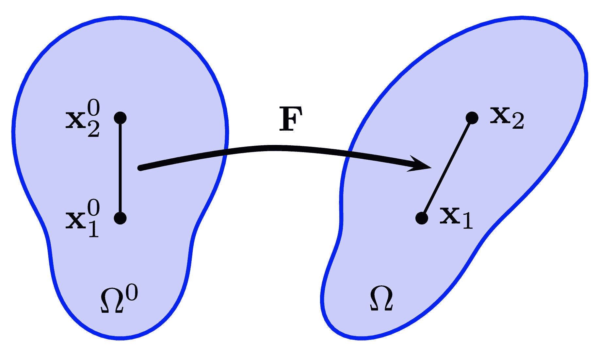

# 变形

> 原文：[`phys-sim-book.github.io/lec12.2-deformation.html`](https://phys-sim-book.github.io/lec12.2-deformation.html)

我们有 X 和 x 分别作为材料坐标和世界坐标，每个都与 Ω0 和 Ωt 相关的域相关联。对于 Ω0 内的任何点 X，映射函数 ϕ 在特定时间 t 将其传输到 Ωt，表示为 x=ϕ(X,t)。

> ****定义 12.2.1 (变形梯度).**** 变形映射 ϕ 的雅可比矩阵被称为变形梯度，在描述弹性物理中至关重要。它通常用 F 表示，并由以下关系定义：F(X,t)=∂X/∂ϕ(X,t)=∂X/∂x(X,t)。离散地，这个雅可比矩阵通常采用小 2×2 或 3×3 矩阵的形式。对于像布料或 3D 中的薄壳这样的材料，F 可能是一个 3×2 矩阵，反映了材料空间的二维性质。因此，F(⋅,t):Ω0→Rd×d 将每个材料点 X 映射到一个 Rd×d 矩阵，该矩阵描述了时间 t 的变形雅可比矩阵。使用指标符号，它可以表示为：Fij=∂Xj/∂ϕi=∂Xj/∂xi，i,j=1,…,d。

我们可以计算方程 (12.1.1) 中指定的变形映射的变形梯度，其中结果是单位矩阵。同样，对于方程 (12.1.2) 中的变形映射，变形梯度 F 等于 R。在这两种情况下，物体没有经历真正的变形；这些仅仅是刚性变换的例子。这种变形梯度不应导致材料内部产生任何内力，除非有意追求艺术效果（例如，在卡通中）。

**图 12.2.1 (变形梯度).**

> ****示例 12.2.1.**** 直观上，变形梯度 F 表示材料内部局部变形的程度。考虑两个相邻的点，x10 和 x20，在模拟开始时嵌入到材料中（如图 12.2.1 所示）。如果 x1 和 x2 代表当前配置中的这些点，那么这些点之间的关系可以表示为：(x2−x1)=F(x20−x10)。这个方程显示了变形梯度如何将点之间的初始距离转换为它们的当前分离，从而量化局部变形。

变形梯度 F 的行列式，通常用 J 表示，至关重要，因为它表征了变形过程中的无穷小体积变化。这可以表示为 J=det(F)。J 的值代表材料在变形配置 Ωt 中无穷小体积与其在 Ω0 中的原始体积之比。例如，在刚体运动中，包括旋转和平移，F 是一个旋转矩阵，因此 J=1。值得注意的是，单位矩阵作为一个旋转矩阵，也会导致 J=1。

如果 J>1，则表示体积增加，而 J<1 表示体积减少。J=0 的情况表明体积实际上已经变为零，这在现实世界中是不可能的，但在数值计算中可能会发生。在三维空间中，这表明材料被压缩到一定程度，可能会塌陷成一个平面、一条线，甚至是一个没有体积的点。相反，J<0 表示材料反转。例如，在二维空间中，如果一个三角形的 J<0，则意味着其中一个顶点穿过了对边，实际上“反转”了三角形，使其面积变为负值。如移动边界条件部分所示，弹性正方形的严重压缩可能导致反转。在这种情况下，J 作为这种缺陷的直接度量，被许多弹性模型所采用，以确保模拟中没有反转。
