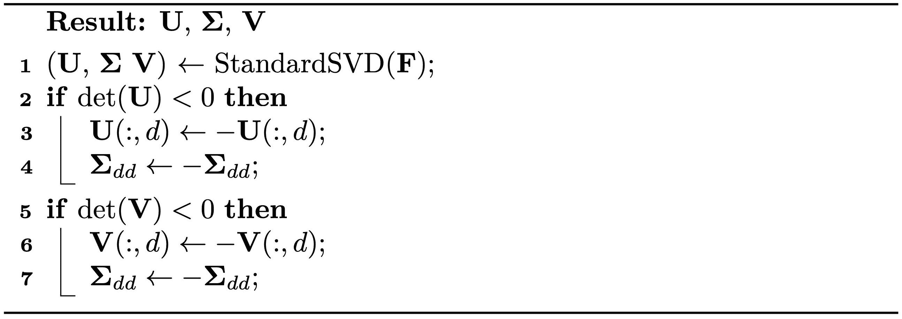

# 极分解奇异值分解

> 原文：[`phys-sim-book.github.io/lec13.2-polar_svd.html`](https://phys-sim-book.github.io/lec13.2-polar_svd.html)

当讨论一般滑移边界条件时，我们介绍了奇异值分解（SVD）的应用。在这里，我们应用了一种称为**极分解奇异值分解**（算法 13.2.1）的变体来分解 F：F=UΣVT，其中 U 和 V 都是 d×d 的旋转矩阵，Σ是一个 d×d 的对角矩阵。与标准奇异值分解不同，标准奇异值分解确保Σii 非负，可能以 det(U)=−1 或 det(V)=−1 为代价，极分解奇异值分解保持 det(U)=1 和 det(V)=1，允许Σii 在必要时为负。

极分解奇异值分解因其与极分解的关系而得名，其中 F 表示为 RS。这种分解可以通过 R=UVT 和 S=VΣVT 重建，其中 R 代表与 F 最接近的旋转，S 是对称的。

**算法 13.2.1（从标准奇异值分解到极分解奇异值分解）。** 

F 的极分解奇异值分解提供了一种更直观的方式来理解变形。如果我们表示σi=Σii，称为**主拉伸**，我们可以将 F 概念化为一系列变换。最初，有一个由 VT 执行的旋转，然后沿着每个轴按σi 缩放尺寸，最后再由 U 执行另一个旋转。这种分解适用于所有可能的 F。

极分解奇异值分解（Polar SVD）也允许仅使用σi 来更方便地表达各向同性应变能密度函数。例如，我们直观的公式（方程(13.1.1)）可以重新表述为：

Ψ(F)=Ψ^(Σ)=4μ(i=1∑d(σi²−1)²)+2λ(i=1∏dσi²−1)²,

其中 J=∏i=1dσi=σ1⋅σ2⋅…⋅σd. 此外，纽曼-胡克应变能密度函数（方程(13.1.2)）可以重新写为：

ΨNH(F)=Ψ^NH(Σ)=2μ(i=1∑dσi²−d)−μln(J)+2λln2(J).

这两种模型在微小变形下都与线性弹性一致。

> ****定义 13.2.1（与线性弹性的一致性）。**** 要验证应变能密度函数Ψ(F)与线性弹性的一致性，我们只需检查以下关系是否都成立：Ψ^(I)=0,∂σi/∂Ψ^(I)=0,以及∂σi/∂σj/∂2Ψ^(I)=2μδij+λ。这里 1≤i,j≤d，且δij=1 如果 i=j，否则为 0。
