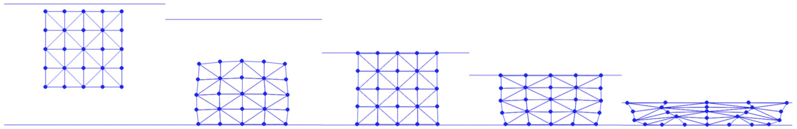

# 非反转的过滤线搜索

> 原文：[`phys-sim-book.github.io/lec15.3-filter_line_search.html`](https://phys-sim-book.github.io/lec15.3-filter_line_search.html)


为了保证在模拟过程中非反转（参见过滤线搜索）就像非穿透性一样，我们可以类似地使用一个临界步长αI 来过滤线搜索初始步长，该步长首先将任何三角形的体积降至 0。这可以通过每个三角形求解一个一维方程来实现：V(xi+αIpi)=0，（15.3.1）并取求解步长的最小值。这里 pi 是节点 i 的搜索方向，在二维中，方程(15.3.1)等价于：det([x21α, x31α])≡x21,1αx31,2α−x21,2αx31,1α=0（15.3.2），其中 xijα=xij+αIpij，xij=xi−xj，pij=pi−pj。展开方程(15.3.2)，我们得到：(x21,1+αIp21,1)(x31,2+αIp31,2)−(x21,2+αIp21,2)(x31,1+αIp31,1)=0，这可以重新组织为一个关于αI 的二次方程：det([p21, p31])(αI)²+(det([x21, p31])+det([p21, x31]))αI+det([x21, x31])=0。在这里，请注意，当节点移动不多或它们的移动几乎不改变当前时间步的三角形面积时，det([p21, p31])可以非常小，因此方程可以退化成一个线性方程。为了稳健地检测这种退化情况，我们不能直接检查 det([p21, p31])是否为 0，因为存在数值误差。实际上，检查 det([p21, p31])是否低于一个 epsilon 仍然很棘手，因为 det([p21, p31])的规模严重依赖于模拟场景的维度和节点速度。因此，我们使用 det([x21, x31])作为缩放，并得到一个缩放但等效的方程：det([x21, x31])det([p21, p31])/(αI)²+det([x21, x31])det([x21, p31])+det([p21, x31])/(αI)+1=0，（15.3.3），其中可以在任何无单位的阈值上安全地进行幅度检查。

在实践中，我们也需要允许一些松弛度，以便所采取的步长不会导致体积恰好为 0。因此，我们解αI，使其首先将任何三角形的体积减少 90%，这可以通过修改方程(15.3.3)中的常数项系数从 1 变为 0.9 来实现：

**实现 15.3.1（过滤线搜索，NeoHookeanEnergy.py）。**

```py
def init_step_size(x, e, p):
    alpha = 1
    for i in range(0, len(e)):
        x21 = x[e[i][1]] - x[e[i][0]]
        x31 = x[e[i][2]] - x[e[i][0]]
        p21 = p[e[i][1]] - p[e[i][0]]
        p31 = p[e[i][2]] - p[e[i][0]]
        detT = np.linalg.det(np.transpose([x21, x31]))
        a = np.linalg.det(np.transpose([p21, p31])) / detT
        b = (np.linalg.det(np.transpose([x21, p31])) + np.linalg.det(np.transpose([p21, x31]))) / detT
        c = 0.9  # solve for alpha that first brings the new volume to 0.1x the old volume for slackness
        critical_alpha = utils.smallest_positive_real_root_quad(a, b, c)
        if critical_alpha > 0:
            alpha = min(alpha, critical_alpha)
    return alpha 
```

在这里，如果方程没有正实根，这意味着对于这个特定的三角形，步长可以任意大，而不会触发反转。

二次方程可以解为

**实现 15.3.2（解二次方程，utils.py）。**

```py
def smallest_positive_real_root_quad(a, b, c, tol = 1e-6):
    # return negative value if no positive real root is found
    t = 0
    if abs(a) <= tol:
        if abs(b) <= tol: # f(x) = c > 0 for all x
            t = -1
        else:
            t = -c / b
    else:
        desc = b * b - 4 * a * c
        if desc > 0:
            t = (-b - math.sqrt(desc)) / (2 * a) # if a > 0, this is either the smaller positive root, or both roots are negative; 
            # if a < 0, there are 1 negative and 1 positive real roots, and we just need the positive one.
            if t < 0:
                t = (-b + math.sqrt(desc)) / (2 * a)
        else: # desv<0 ==> imag, f(x) > 0 for all x > 0
            t = -1
    return t 
```

使用缩放系数，我们只需使用一个无单位的阈值，例如`1e-6`，来检查退化情况。如果没有找到正实根，函数将简单地返回`-1`。

现在我们除了过滤非穿透性初始步长外，还需要过滤：

**实现 15.3.3（应用过滤器，time_integrator.py）。**

```py
 alpha = min(BarrierEnergy.init_step_size(x, n, o, p), NeoHookeanEnergy.init_step_size(x, e, p))  # avoid interpenetration, tunneling, and inversion 
```

确保所有添加的数据结构和修改的函数都反映在时间积分器中，我们最终可以模拟移动边界条件中的压缩正方形示例，并保证无反转（见图 15.3.1 图 15.3.1）。



**图 15.3.1.** 一个正方形被扔到地面上，并在整个模拟过程中被天花板严重压缩，同时保持无反转。地面摩擦系数为 0.11，因此正方形的底部比顶部滑动得少，而天花板处没有摩擦。
