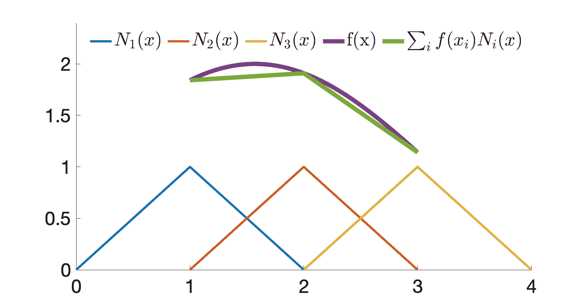

# 离散空间

> 原文：[`phys-sim-book.github.io/lec17.1-discrete_space.html`](https://phys-sim-book.github.io/lec17.1-discrete_space.html)

为了使弱形式中的积分能够进行数值评估，第一步是将光滑向量场 x 和 Q 进行离散化。这使得它们可以通过有限个样本以及适当的插值函数来表示。

> ****例 17.1.1（1D 函数插值）。**** 在 1D 中，为了使用三个样本点 x1=1，x2=2，x3=3 (图 17.1.1)来近似函数 f(x)，我们可以使用插值函数 Ni(x)=1−∣x−xi∣并形成 f(x)≈∑i​f(xi​)Ni​(x)。
> 
> 
> 
> **图 17.1.1**。使用插值函数 N1(x)，N2(x)，N3(x)和样本点 x1=1，x2=2，x3=3，函数 f(x)可以被近似为∑i​f(xi​)Ni​(x)。

给定一组由模拟域中的 a 或 b 索引的样本点，我们可以近似测试函数 Q 和自由度 x 如下：Qi(X,tn)xi(X,tn)≈a∑Qa∣i(tn)Na(X)=a∑Qa∣in(tn)Na(X),≈b∑xb∣i(tn)Nb(X)=b∑xb∣in(tn)Nb(X), 其中 Qa∣in=Qa∣i(tn)表示在时间 tn 时在样本点 a 评估的 Q 的第 i 维，Na(X):Ω0→R 是在样本点 a 处的插值函数。这样，我们同样有：Ai(X,tn)≈b∑Ab∣i(tn)Nb(X)=b∑Ab∣in(tn)Nb(X).(17.1.1) 将这些离散化形式代入弱形式（方程(17.1)）并用指标符号表示求和，我们得到：∫Ω0R(X,0)Qa∣inNa(X)Ab∣inNb(X)dX=∫∂Ω0Qa∣inNa(X)Ti(X,tn)ds(X)−∫Ω0Qa∣inNa,j(X)Pij(X,tn)dX. 在等式左边，我们看到样本值 Qa∣in 和 Ab∣in 实际上与 X 无关，因此我们可以将它们移出积分，得到：MabQa∣inAb∣in=∫∂Ω0Qa∣inNa(X)Ti(X,tn)ds(X)−∫Ω0Qa∣inNa,j(X)Pij(X,tn)dX，其中 Mab=∫Ω0R(X,0)Na(X)Nb(X)dX(17.1.2)是质量矩阵。

> ***注 17.1.1（质量矩阵性质）。*** 质量矩阵 M（方程(17.1.2)）是对称和正半定的，因为它可以表示为：∫Ω0BBTdX，其中 Bi=R(X,0)Ni(X)。因此，对于任何向量 z，zTMz=∫Ω0(zTB)2dX≥0。在实践中，这个质量矩阵可能是奇异的。为了解决这个问题，我们通常使用“质量集中”策略来用对角和正定形式来近似质量矩阵。这是通过将每一行求和并定义：Mablump=δab​c∑Mac 来实现的。

在空间离散化之后，弱形式的解（方程 (17.1)）被限制在 d n 维函数空间中，其中 n 代表样本点的数量，假设所有插值函数都是相互正交的。这意味着弱形式的连续解可能存在于我们的解空间之外。在这种情况下，我们只能基于所选样本点和插值函数提供一个近似解。

> ****定义 17.1.1（正交函数）.**** 与两个向量 a 和 b 的正交性类似，定义为 aTb=0，两个函数 f(x) 和 g(x) 的正交性定义为：∫f(x)g(x)dx=0。正如向量基可以张成有限维空间一样，正交函数可以形成一个函数空间的无限基。从概念上讲，上述积分与向量点积类似。

话虽如此，为了生成可解未知数的方程，任意测试函数 Q 不必覆盖所有可能性以产生无限数量的方程。相反，我们只需要生成一个覆盖整个解空间的有限方程集。因此，对于 a^ 遍历所有样本点，以及 i^=1,2,…,d，我们可以分配测试函数：Qa∣in={1,0,​a=a^ and i=i^otherwise​，从而获得 nd 个方程：Ma^b​Ab∣i^n​=∫∂Ω0​Na^​(X)Ti^​(X,tn)ds(X)−∫Ω0​Na^,j​(X)Pi^j​(X,tn)dX，（17.1.3），从而产生 nd 个未知数和 nd 个方程，使我们更接近离散形式。

方程 (17.1.3) 右侧的两个积分可以解析求解或使用求积规则求解，具体取决于插值函数的具体选择。我们将在未来的讲座中详细讨论这些内容。
