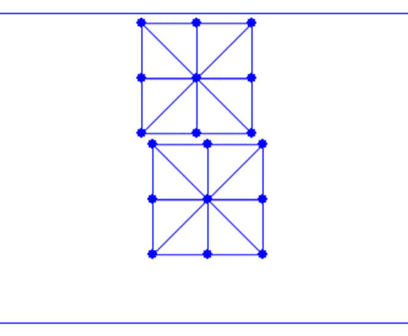

# 场景设置和边界元素收集

> 原文：[`phys-sim-book.github.io/lec21.1-scene_setup.html`](https://phys-sim-book.github.io/lec21.1-scene_setup.html)

<link rel="stylesheet" href="https://cdn.jsdelivr.net/npm/katex@0.16.4/dist/katex.min.css">

首先，我们设置一个新的场景，其中有两个正方形落在地面上，被天花板压缩，使得这些正方形之间将发生自接触。

**实现 21.1.1（模拟设置，simulator.py）。**

```py
# simulation setup
side_len = 0.45
rho = 1000      # density of square
E = 1e5         # Young's modulus
nu = 0.4        # Poisson's ratio
n_seg = 2       # num of segments per side of the square
h = 0.01        # time step size in s
DBC = [(n_seg + 1) * (n_seg + 1) * 2]   # dirichlet node index
DBC_v = [np.array([0.0, -0.5])]         # dirichlet node velocity
DBC_limit = [np.array([0.0, -0.7])]     # dirichlet node limit position
ground_n = np.array([0.0, 1.0])         # normal of the slope
ground_n /= np.linalg.norm(ground_n)    # normalize ground normal vector just in case
ground_o = np.array([0.0, -1.0])        # a point on the slope  
mu = 0.4        # friction coefficient of the slope

# initialize simulation
[x, e] = square_mesh.generate(side_len, n_seg)       # node positions and triangle node indices of the top square
e = np.append(e, np.array(e) + [len(x)] * 3, axis=0) # add triangle node indices of the bottom square
x = np.append(x, x + [side_len * 0.1, -side_len * 1.1], axis=0) # add node positions of the bottom square 
```

在第 17 行，我们将天花板的自由度指数从(n*seg+1)∗(nseg+1)调整为(n*seg+1)∗(nseg+1)∗2，因为我们现在有两个正方形。第 26 行生成顶部的第一个正方形，而第 27 行和第 28 行通过创建副本和偏移量生成底部的第二个正方形。**

**如图图 21.1.1 所示，初始帧现在已经建立。然而，如果没有处理自接触，这两个正方形还不能相互交互。**



**图 21.1.1。** 新的场景设置，有两个正方形要落下。

为了处理接触，我们首先需要收集所有边界元素。在二维中，这涉及到识别边界上将要施加接触力的节点和边，这些力将作用于所有接近但非对角点-边对的边界节点和边。以下函数根据一个三角形网格找到所有边界节点和边：

**实现 21.1.2（收集边界元素，square_mesh.py）。**

```py
def find_boundary(e):
    # index all half-edges for fast query
    edge_set = set()
    for i in range(0, len(e)):
        for j in range(0, 3):
            edge_set.add((e[i][j], e[i][(j + 1) % 3]))

    # find boundary points and edges
    bp_set = set()
    be = []
    for eI in edge_set:
        if (eI[1], eI[0]) not in edge_set:
            # if the inverse edge of a half-edge does not exist,
            # then it is a boundary edge
            be.append([eI[0], eI[1]])
            bp_set.add(eI[0])
            bp_set.add(eI[1])
    return [list(bp_set), be] 
```

这个函数在`simulator.py`中被调用，然后边界元素被传递给时间积分器进行能量、梯度、海森矩阵评估，以及线搜索过滤。**
