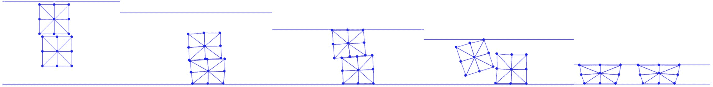

# 连续碰撞检测

> 原文：[`phys-sim-book.github.io/lec21.4-ccd.html`](https://phys-sim-book.github.io/lec21.4-ccd.html)

<link rel="stylesheet" href="https://cdn.jsdelivr.net/npm/katex@0.16.4/dist/katex.min.css">

现在，我们有了解决具有自接触的模拟中搜索方向的所有要素。在获得搜索方向后，我们对点-边对执行线搜索过滤。

**实现 21.4.1（线搜索过滤，BarrierEnergy.py）。**

```py
 # self-contact
    for xI in bp:
        for eI in be:
            if xI != eI[0] and xI != eI[1]: # do not consider a point and its incident edge
                if CCD.bbox_overlap(x[xI], x[eI[0]], x[eI[1]], p[xI], p[eI[0]], p[eI[1]], alpha):
                    toc = CCD.narrow_phase_CCD(x[xI], x[eI[0]], x[eI[1]], p[xI], p[eI[0]], p[eI[1]], alpha)
                    if alpha > toc:
                        alpha = toc 
```

在这里，我们首先对点和边的跨度边界框执行重叠检查，以缩小需要计算碰撞时间的点-边对的数量：

**实现 21.4.2（边界框重叠检查，CCD.py）。**

```py
from copy import deepcopy
import numpy as np
import math

import distance.PointEdgeDistance as PE

# check whether the bounding box of the trajectory of the point and the edge overlap
def bbox_overlap(p, e0, e1, dp, de0, de1, toc_upperbound):
    max_p = np.maximum(p, p + toc_upperbound * dp) # point trajectory bbox top-right
    min_p = np.minimum(p, p + toc_upperbound * dp) # point trajectory bbox bottom-left
    max_e = np.maximum(np.maximum(e0, e0 + toc_upperbound * de0), np.maximum(e1, e1 + toc_upperbound * de1)) # edge trajectory bbox top-right
    min_e = np.minimum(np.minimum(e0, e0 + toc_upperbound * de0), np.minimum(e1, e1 + toc_upperbound * de1)) # edge trajectory bbox bottom-left
    if np.any(np.greater(min_p, max_e)) or np.any(np.greater(min_e, max_p)):
        return False
    else:
        return True 
```

为了计算足够大的保守估计的碰撞时间（TOI），我们不能像在 Filter Line Search 中处理点-地面接触那样直接计算 TOI 并取其一部分。直接计算接触原语对的 TOI 需要解决 2D 和 3D 中的二次或三次根查找问题，这些方法容易产生数值误差，尤其是在距离极小且配置数值退化时（例如，3D 中的几乎平行的边-边对）。

因此，我们实现了加法连续碰撞检测方法（ACCD）[[Li et al. 2021]](bibliography.html#li2021codimensional)，该方法迭代地将接触对沿搜索方向移动，直到达到最小分离距离，以稳健地估计 TOI。

以点-边对为例，ACCD 的关键洞察是，给定当前位置 p、e0、e1 和搜索方向 dp、de0、de1，其 TOI 可以计算为

αTOI=∥dp−((1−λ)de0+λde1)∥∥p−((1−λ)e0+λe1)∥

假设(1−λ)e0+λe1 是 p 将首先与之碰撞的边上的点。问题是，我们事先不知道λ。然而，我们可以推导出αTOI 的下界作为

αTOI≥∥dp∥+∥(1−λ)de0+λde1∥minλ∈[0,1]∥p−((1−λ)e0+λe1)∥≥∥dp∥+max(∥de0∥,∥de1∥)dPE(p,e0,e1)​=αl

通过取一个步长αl，我们保证这对没有穿透。然而，尽管计算简单，αl 可能远小于αTOI。因此，我们迭代地计算αl，并按此量移动参与节点的副本，累积所有αl 以单调地提高αTOI 的估计，直到点-边对达到小于最小分离距离，例如，原始距离的 0.1 倍。实现如下，我们首先移除搜索方向中的共享部分，以便它们具有较小的幅度，从而实现算法的早期终止。

**实现 21.4.3（ACCD 方法实现，CCD.py）。**

```py
# compute the first "time" of contact, or toc,
# return the computed toc only if it is smaller than the previously computed toc_upperbound
def narrow_phase_CCD(_p, _e0, _e1, _dp, _de0, _de1, toc_upperbound):
    p = deepcopy(_p)
    e0 = deepcopy(_e0)
    e1 = deepcopy(_e1)
    dp = deepcopy(_dp)
    de0 = deepcopy(_de0)
    de1 = deepcopy(_de1)

    # use relative displacement for faster convergence
    mov = (dp + de0 + de1) / 3 
    de0 -= mov
    de1 -= mov
    dp -= mov
    maxDispMag = np.linalg.norm(dp) + math.sqrt(max(np.dot(de0, de0), np.dot(de1, de1)))
    if maxDispMag == 0:
        return toc_upperbound

    eta = 0.1 # calculate the toc that first brings the distance to 0.1x the current distance
    dist2_cur = PE.val(p, e0, e1)
    dist_cur = math.sqrt(dist2_cur)
    gap = eta * dist_cur
    # iteratively move the point and edge towards each other and
    # grow the toc estimate without numerical errors
    toc = 0
    while True:
        tocLowerBound = (1 - eta) * dist_cur / maxDispMag

        p += tocLowerBound * dp
        e0 += tocLowerBound * de0
        e1 += tocLowerBound * de1
        dist2_cur = PE.val(p, e0, e1)
        dist_cur = math.sqrt(dist2_cur)
        if toc != 0 and dist_cur < gap:
            break

        toc += tocLowerBound
        if toc > toc_upperbound:
            return toc_upperbound

    return toc 
```

最终的模拟结果在图 21.4.1 中展示。



**图 21.4.1**。两个正方形被扔到地面上并被天花板压缩。地面有摩擦系数 0.4，但两个正方形之间没有摩擦，因此上面的正方形滑到地面上，而没有显著改变下面一个的位置。
