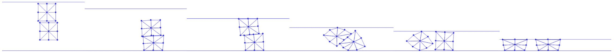

# 摩擦能及其导数

> 原文：[`phys-sim-book.github.io/lec22.3-fric_and_derivatives.html`](https://phys-sim-book.github.io/lec22.3-fric_and_derivatives.html)

``

对于每个摩擦点-边缘对，我们已经预先计算了λ、r 和 n，现在我们可以方便地计算摩擦势能的能量（实现 22.3.1）、梯度（实现 22.3.2）和 Hessian（实现 22.3.3），并将它们添加到优化中。

**实现 22.3.1（摩擦能值，FrictionEnergy.py）**

```py
 # self-contact:
    for i in range(0, len(mu_lambda_self)):
        [xI, eI0, eI1, mu_lam, n, r] = mu_lambda_self[i]
        T = np.identity(2) - np.outer(n, n)
        rel_v = v[xI] - ((1 - r) * v[eI0] + r * v[eI1])
        vbar = np.transpose(T).dot(rel_v)
        sum += mu_lam * f0(np.linalg.norm(vbar), epsv, hhat) 
```

在计算梯度和 Hessian 时，我们使用了相对速度 v^k 作为中间变量，以使实现更加有序。这种方法给出：∇Pf(x)=k∑(∂x/∂v^k)T∂v^k/∂Dk(x)，∇2Pf(x)=k∑(∂x/∂v^k)T∂v^k2/∂2Dk(x)∂x/∂v^k，其中 Dk 相对于 v^k 的导数与摩擦接触中的形式完全相同。

**实现 22.3.2（摩擦能梯度，FrictionEnergy.py）**

```py
 # self-contact:
    for i in range(0, len(mu_lambda_self)):
        [xI, eI0, eI1, mu_lam, n, r] = mu_lambda_self[i]
        T = np.identity(2) - np.outer(n, n)
        rel_v = v[xI] - ((1 - r) * v[eI0] + r * v[eI1])
        vbar = np.transpose(T).dot(rel_v)
        g_rel_v = mu_lam * f1_div_vbarnorm(np.linalg.norm(vbar), epsv) * T.dot(vbar)
        g[xI] += g_rel_v
        g[eI0] += g_rel_v * -(1 - r)
        g[eI1] += g_rel_v * -r 
```

**实现 22.3.3（摩擦能 Hessian，FrictionEnergy.py）**

```py
 # self-contact:
    for i in range(0, len(mu_lambda_self)):
        [xI, eI0, eI1, mu_lam, n, r] = mu_lambda_self[i]
        T = np.identity(2) - np.outer(n, n)
        rel_v = v[xI] - ((1 - r) * v[eI0] + r * v[eI1])
        vbar = np.transpose(T).dot(rel_v)
        vbarnorm = np.linalg.norm(vbar)
        inner_term = f1_div_vbarnorm(vbarnorm, epsv) * np.identity(2)
        if vbarnorm != 0:
            inner_term += f_hess_term(vbarnorm, epsv) / vbarnorm * np.outer(vbar, vbar)
        hess_rel_v = mu_lam * T.dot(utils.make_PSD(inner_term)).dot(np.transpose(T)) / hhat
        index = [xI, eI0, eI1]
        d_rel_v_dv = [1, -(1 - r), -r]
        for nI in range(0, 3):
            for nJ in range(0, 3):
                for c in range(0, 2):
                    for r in range(0, 2):
                        IJV[0].append(index[nI] * 2 + r)
                        IJV[1].append(index[nJ] * 2 + c)
                        IJV[2] = np.append(IJV[2], d_rel_v_dv[nI] * d_rel_v_dv[nJ] * hess_rel_v[r, c]) 
```

在这些实现之后，我们终于可以运行带有摩擦自接触的压缩平方示例（见：图 22.3.1）。从图中可以看出，一旦两个正方形接触，它们之间以及与地面的较大摩擦力会限制任何滑动。这导致正方形在受到天花板的压缩时逆时针旋转。



**图 22.3.1。** 两个正方形被扔到地面上，并被天花板压缩。任何接触表面的摩擦系数为 0.4，这限制了场景中的任何滑动，并导致两个正方形在压缩下逆时针旋转。当它们的界面几乎垂直时，正方形最终分离。
