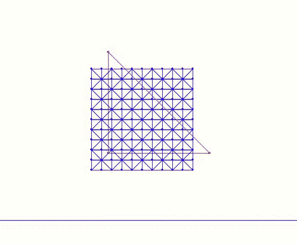

# 案例研究：ABD 方形下落*

> 原文：[`phys-sim-book.github.io/lec25.4-dropping_block.html`](https://phys-sim-book.github.io/lec25.4-dropping_block.html)

<link rel="stylesheet" href="https://cdn.jsdelivr.net/npm/katex@0.16.4/dist/katex.min.css">

现在我们来实现 2D 中的仿射体动力学（ABD），用于方形下落模拟的新胡克版本。这只需要对标准 IPC 模拟代码进行少量修改。完整的实现可以在我们的[固体模拟教程](https://github.com/phys-sim-book/solid-sim-tutorial)的`9_reduced_DOF`文件夹中找到。

我们首先引入一个计算减少基的函数。在 ABD 中，我们只考虑仿射变形。因此，我们使用`method=1`（多项式基）和`order=1`（线性基）来提取线性基：

**实现 25.4.1（计算减少基，utils.py）。**

```py
def compute_reduced_basis(x, e, vol, IB, mu_lame, lam, method, order):
    if method == 0: # full basis, no reduction
        basis = np.zeros((len(x) * 2, len(x) * 2))
        for i in range(len(x) * 2):
            basis[i][i] = 1
        return basis
    elif method == 1: # polynomial basis
        if order == 1: # linear basis, or affine basis
            basis = np.zeros((len(x) * 2, 6)) # 1, x, y for both x- and y-displacements
            for i in range(len(x)):
                for d in range(2):
                    basis[i * 2 + d][d * 3] = 1
                    basis[i * 2 + d][d * 3 + 1] = x[i][0]
                    basis[i * 2 + d][d * 3 + 2] = x[i][1]
        elif order == 2: # quadratic polynomial basis 
            basis = np.zeros((len(x) * 2, 12)) # 1, x, y, x², xy, y² for both x- and y-displacements
            for i in range(len(x)):
                for d in range(2):
                    basis[i * 2 + d][d * 6] = 1
                    basis[i * 2 + d][d * 6 + 1] = x[i][0]
                    basis[i * 2 + d][d * 6 + 2] = x[i][1]
                    basis[i * 2 + d][d * 6 + 3] = x[i][0] * x[i][0]
                    basis[i * 2 + d][d * 6 + 4] = x[i][0] * x[i][1]
                    basis[i * 2 + d][d * 6 + 5] = x[i][1] * x[i][1]
        elif order == 3: # cubic polynomial basis
            basis = np.zeros((len(x) * 2, 20)) # 1, x, y, x², xy, y², x³, x²y, xy², y³ for both x- and y-displacements
            for i in range(len(x)):
                for d in range(2):
                    basis[i * 2 + d][d * 10] = 1
                    basis[i * 2 + d][d * 10 + 1] = x[i][0]
                    basis[i * 2 + d][d * 10 + 2] = x[i][1]
                    basis[i * 2 + d][d * 10 + 3] = x[i][0] * x[i][0]
                    basis[i * 2 + d][d * 10 + 4] = x[i][0] * x[i][1]
                    basis[i * 2 + d][d * 10 + 5] = x[i][1] * x[i][1]
                    basis[i * 2 + d][d * 10 + 6] = x[i][0] * x[i][0] * x[i][0]
                    basis[i * 2 + d][d * 10 + 7] = x[i][0] * x[i][0] * x[i][1]
                    basis[i * 2 + d][d * 10 + 8] = x[i][0] * x[i][1] * x[i][1]
                    basis[i * 2 + d][d * 10 + 9] = x[i][1] * x[i][1] * x[i][1]
        else:
            print("unsupported order of polynomial basis for reduced DOF")
            exit()
        return basis
    else: # modal-order reduction
        if order <= 0 or order >= len(x) * 2:
            print("invalid number of target basis for modal reduction")
            exit()
        IJV = NeoHookeanEnergy.hess(x, e, vol, IB, mu_lame, lam, project_PSD=False)
        H = sparse.coo_matrix((IJV[2], (IJV[0], IJV[1])), shape=(len(x) * 2, len(x) * 2)).tocsr()
        eigenvalues, eigenvectors = eigsh(H, k=order, which='SM') # get 'order' eigenvectors with smallest eigenvalues 
        return eigenvectors 
```

这里，`method=0`指的是全空间模拟，并立即返回，不计算基。

`method=1` 计算多项式基，包括线性、二次和三次函数。对于每个基向量，每个节点的位移分量都表示为节点材料空间坐标的多项式函数。`method=2` 通过线性模态分析计算基，它求解弹性 Hessian 的特征系统，并提取出对应于增加最少能量变形模式的位移场。这将在下一讲中更详细地讨论。

在计算基之后，我们通过投影 Hessian 矩阵和梯度向量将模拟限制在相应的子空间中。这种投影遵循链式法则，如方程式(25.3.1)所述。相关的实现如下：

**实现 25.4.2（计算减少搜索方向，time_integrator.py）。**

```py
def search_dir(x, e, x_tilde, m, vol, IB, mu_lame, lam, y_ground, contact_area, is_DBC, reduced_basis, h):
    projected_hess = IP_hess(x, e, x_tilde, m, vol, IB, mu_lame, lam, y_ground, contact_area, h)
    reshaped_grad = IP_grad(x, e, x_tilde, m, vol, IB, mu_lame, lam, y_ground, contact_area, h).reshape(len(x) * 2, 1)
    # eliminate DOF by modifying gradient and Hessian for DBC:
    for i, j in zip(*projected_hess.nonzero()):
        if is_DBC[int(i / 2)] | is_DBC[int(j / 2)]: 
            projected_hess[i, j] = (i == j)
    for i in range(0, len(x)):
        if is_DBC[i]:
            reshaped_grad[i * 2] = reshaped_grad[i * 2 + 1] = 0.0
    reduced_hess = reduced_basis.T.dot(projected_hess.dot(reduced_basis)) # applying chain rule
    reduced_grad = reduced_basis.T.dot(reshaped_grad) # applying chain rule
    return (reduced_basis.dot(spsolve(reduced_hess, -reduced_grad))).reshape(len(x), 2) # transform to full space after the solve 
```

这些更改使我们能够运行方形下落模拟的 ABD 版本：



**图 25.4.1.** 方形落在地面上的 ABD 模拟。

在这个例子中，我们将刚度参数降低以使物体变得更软，强调 ABD 与标准 IPC 之间的差异。蓝色网格是原始网格（也用于碰撞），而红色三角形可视化减少的自由度。
