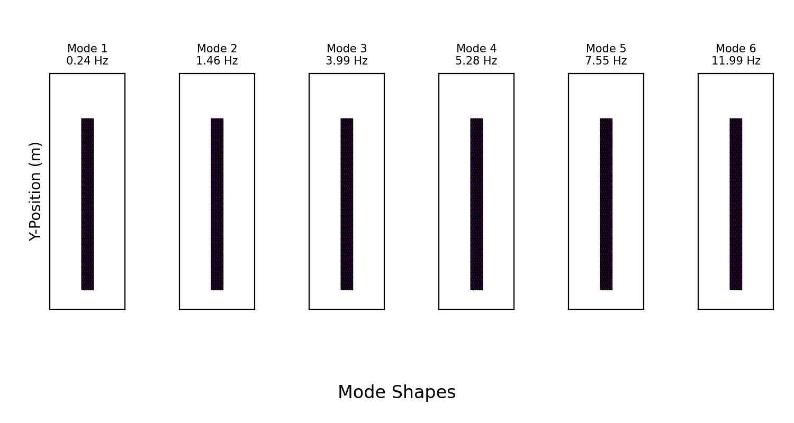
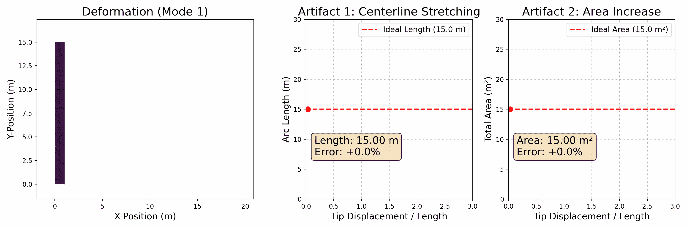

# 线性模态分析演示*

> 原文：[`phys-sim-book.github.io/lec25.7.2-linear_demo.html`](https://phys-sim-book.github.io/lec25.7.2-linear_demo.html)

<link rel="stylesheet" href="https://cdn.jsdelivr.net/npm/katex@0.16.4/dist/katex.min.css">

我们为二维悬臂梁实现了线性模态分析过程，代码位于[solid-sim-tutorial/9_reduced_DOF/linear.py](https://github.com/phys-sim-book/solid-sim-tutorial/blob/main/9_reduced_DOF/linear.py)。

### 可视化模式形状

在方法论中概述的预计算步骤之后，我们使用有限元方法组装了全局质量（M）和刚度（K）矩阵。在将固定边界条件应用于梁的一端后，我们求解了广义特征值问题（Kx=λMx），以找到最低频率的模式形状（ψi）及其相应的频率（ωi=λi）。

通过根据ψi sin(ωit)动画展示梁的变形，可视化了得到的模式。下面的动画显示了以下参数值的前六个模式：

```py
E = 5e7   # Young's modulus
nu = 0.3  # Poisson's ratio
rho = 500 # Density
# Height : length ratio = 1 : 15 
```



**图 26.2.1.** 前六种计算振动模式的可视化。模式按最低频率（左）到最高频率（右）的顺序排列，显示越来越复杂的变形模式，从简单的弯曲到 S 形曲线和压缩形状。

### 大变形伪影

线性模态分析的主要局限性在于，当经历大变形时会产生可见的伪影。为了演示这一点，我们设计了一个专注于第一弯曲模式的第二个实验。

在这个实验中，我们动画展示了梁从其静止状态变形到大变形状态的过程。在变形梁的旁边，我们实时绘制了两个关键指标：

1.  **中心线弧长:** 对于一个真实、不可伸长的物体，其中心线的长度在纯弯曲过程中应保持恒定。

1.  **总面积（二维体积）:** 对于几乎不可压缩的材料，总面积也应得到保留。

随着尖端位移的增加，线性模型错误地预测了**（1）梁的中心线显著拉伸**，和**（2）其总面积显著增加**。



**图 26.2.2.** 线性模型伪影的动画演示。（左）梁根据第一线性模式变形。（中）一个图追踪了中心线长度随尖端位移的错误增加。（右）一个图追踪了总面积的错误减少。

这些伪影发生是因为线性模型无法解释由大旋转引起几何非线性。这种失败是下文所述方法的动机，这些方法专门设计用来克服这些局限性并准确模拟大、物理上合理的运动。
