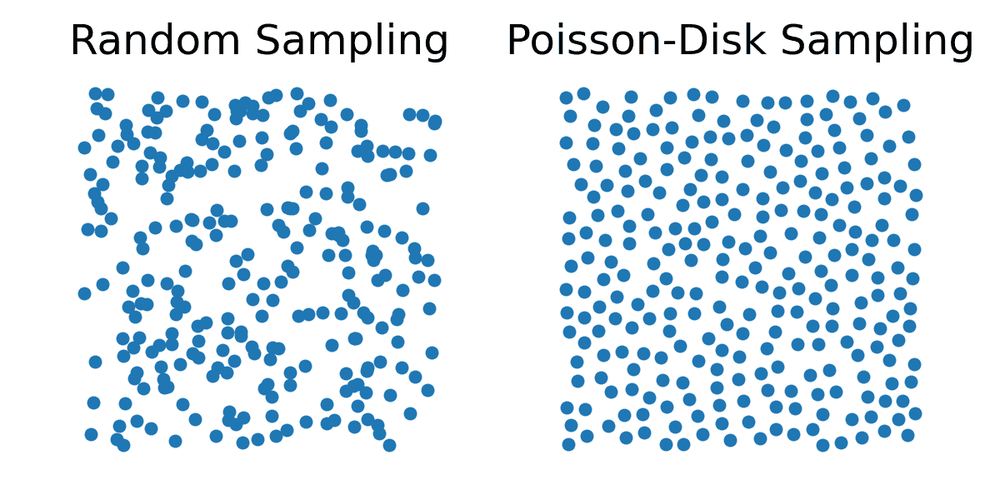

# 材料粒子

> 原文：[`phys-sim-book.github.io/lec26.1-material_particles.html`](https://phys-sim-book.github.io/lec26.1-material_particles.html)

在材料点法（MPM）中，我们将固体离散成有限数量的材料点（也称为粒子），这些点在整个模拟过程中携带材料的完整状态。这些材料点作为物理量的拉格朗日载体，包括：

+   xpn：粒子 p 的位置（在时间 tn 时）

+   vpn：粒子 p 的速度

+   Vpn：粒子 p 的体积

+   mp：粒子 p 的质量（随时间恒定）

+   Fpn：粒子 p 的变形梯度

我们采用惯例，所有与粒子相关的量都用下标 p 表示。

### 采样材料粒子

为了初始化一个材料点法（MPM）模拟，连续固体域被采样成有限数量的粒子。这种采样的质量对数值稳定性和精度有重大影响。

+   **均匀网格采样**。这种方法在笛卡尔网格上以规则间隔放置粒子。虽然实现简单且计算效率高，但它在模拟中引入了网格对齐的伪影，这可能会降低真实性和鲁棒性。

+   **随机采样**。天真地将粒子放置在随机位置可能导致聚类和密度在局部区域的大幅变化，这会降低模拟精度和数值稳定性。

+   **泊松盘采样**。相反，泊松盘采样通常被使用，因为它保证了粒子之间的最小距离，产生更均匀的分布。这提高了插值精度，最小化了数值伪影，并产生了更稳定的接触行为。

**图 27.1.1**. 在单位正方形中具有相同样本数量的随机采样和泊松盘采样的比较：泊松盘采样在点之间产生更均匀的间距。

### 估计粒子体积

由于我们跟踪每个粒子处的变形梯度 Fpn，我们可以通过其行列式来计算体积变化：Vpn≈Jpn⋅Vp0=det(Fpn)⋅Vp0。在这里，Vp0 是粒子 p 的初始体积，通常计算为：Vp0=Nparticles_per_cell⋅Vgrid_cell，我们计算 mp 为：mp=ρ0⋅Vp0，其中ρ0 是静止固体的质量密度。
