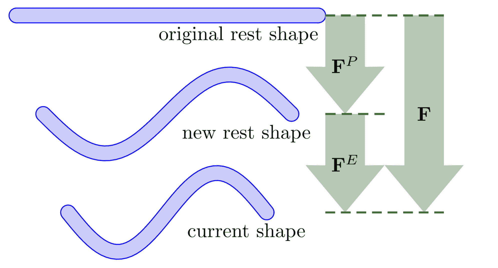

# 塑性流动的离散化

> 原文：[`phys-sim-book.github.io/lec27.1-disc_plastic_flow.html`](https://phys-sim-book.github.io/lec27.1-disc_plastic_flow.html)

通过**乘性分解**将变形梯度 F 分解为弹性和塑性部分，将塑性引入到 MPM 中：

F=FEFP。

在这里，FP 代表累积的不可逆变形，而 FE 捕获从塑性变形配置中恢复的可恢复弹性变形。

这种分解将材料行为分为两部分：

+   **塑性部分**FP 存储永久变化（例如，将金属棒弯曲成弹簧），

+   **弹性部分**FE 存储相对于该形状的当前变形（例如，略微压缩弹簧）。

**图 28.1.1.** 变形梯度的乘性分解。

应力仅使用超弹性本构模型从 FE 计算。当应力超过材料特定的极限时，将触发塑性流动，并更新 FP 以确保应力保持在屈服面内。

> ****定义 28.1.1 (屈服面).**** 我们在由有限元分析（FE）导出的**柯西应力**τ上定义了一个**屈服条件**y(τ)≤0。边界 y(τ)=0 被称为**屈服面**。当弹性应力超过这个表面时，将触发塑性流动以恢复可接受性。

此框架通过从 FE 计算应力并在塑性流动下演化 FP 来清晰地分离可恢复和永久变形。
