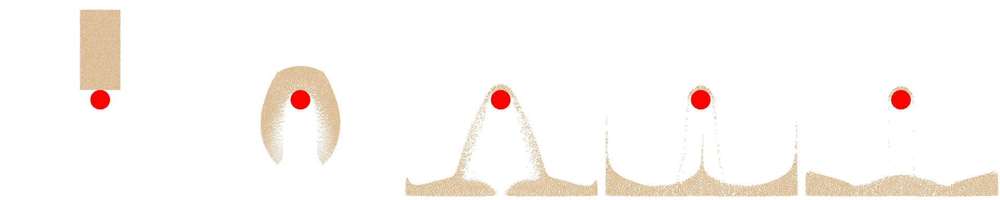

# 仿射粒子-网格转换

> 原文：[`phys-sim-book.github.io/lec30.3-apic_transfer.html`](https://phys-sim-book.github.io/lec30.3-apic_transfer.html)


我们根据模拟设置定义了材料点数据，并添加了两个额外的项：用于 APIC 转换方案的仿射速度场 Cp 和用于体积校正的标量 `log_J_diff`，如 Drucker-Prager 弹塑性中所述。

在粒子到网格（P2G）转换过程中，我们采用**APIC 公式**进行动量交换。我们不是直接传递粒子速度，而是包括局部仿射速度场 Cp。具体来说，动量是通过以下形式传递的：

**实现 31.3.1（APIC 粒子到网格（P2G）的仿射转换，simulator.py）**。

```py
 grid_v[base + offset] += weight * m[p] * (v[p] + C[p] @ dpos) # momentum Transfer, APIC formulation 
```

在这里，`dpos`是粒子到网格节点的偏移量。

在网格到粒子（G2P）转换过程中，我们从背景网格中收集了更新的速度和**仿射速度矩阵 Cp**。仿射矩阵是通过网格速度和位置偏移的加权外积计算得出的。这允许每个粒子保留局部速度变化，与 PIC 相比，显著减少了数值耗散。

**实现 31.3.2（APIC 网格到粒子（G2P）的仿射转换，simulator.py）**。

```py
 new_C += weight * grid_v[base + offset].outer_product(dpos) / D 
```

在这里，D 是使用二次 B 样条插值函数时的一个常数因子：

**实现 31.3.3（用于 APIC 的二次 B 样条，simulator.py）**。

```py
D = (1./4.) * dx * dx # constant D for Quadratic B-spline used for APIC 
```



**图 31.3.1**。一个二维沙块落在静态红色球体碰撞器上的时间序列。沙子在撞击时发生不可逆变形并溅起，展示了颗粒流和摩擦边界响应。
