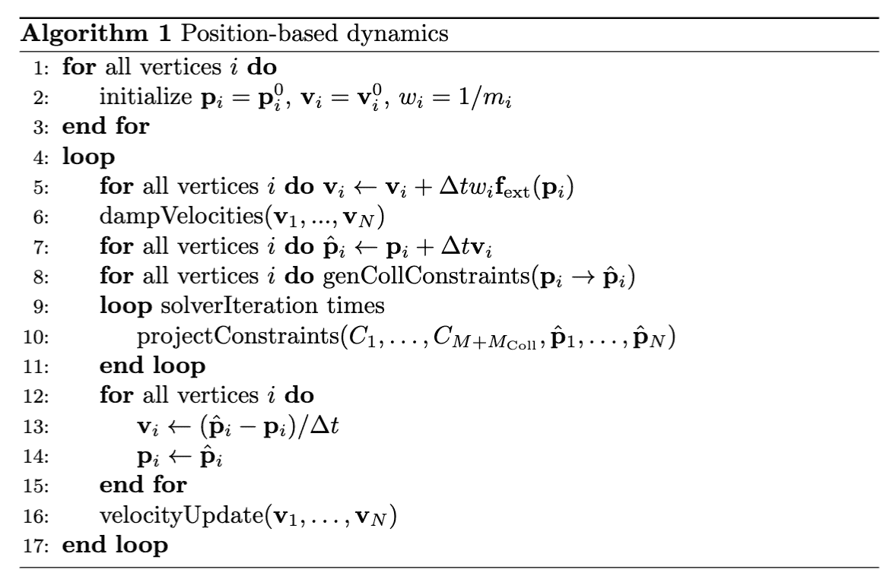

# 核心框架

> 原文：[`phys-sim-book.github.io/lec31.2-core_framework.html`](https://phys-sim-book.github.io/lec31.2-core_framework.html)

PBD 框架通过将物理对象离散化为一组 N 个粒子，并通过 M 个几何约束（关系）定义其行为来模拟物理对象。核心思想是将系统视为一组粒子和约束。在每个时间步，首先使用显式积分方案预测粒子位置，然后迭代求解器调整这些预测位置以满足所有几何约束。我们可以正式定义这样一个系统如下：

> ****定义 32.2.1 (PBD 系统).**** PBD 系统是由一组 N 个粒子和一组 M 个约束组成的元组。
> 
> 每个 **粒子** i∈{1,…,N} 由其位置 pi∈R3、速度 vi∈R3 和质量 mi 表示。为了方便，我们定义逆质量 wi=1/mi，其中 wi=0 对于无限质量（即静态或动力学控制）的粒子。
> 
> 动态行为由一组约束控制。每个约束 j∈{1,…,M} 由一个标量值函数 Cj(p1,…,pnj) 定义，该函数作用于 nj 个粒子的子集。如果对于等式约束，Cj=0，或者对于不等式约束，Cj≥0，则约束得到满足。

模拟以离散时间步长 Δt 进行。PBD 算法的中心循环可以描述如下。

**图 32.2.1 (PBD 主算法).** 循环的核心是一个多阶段过程：速度和位置预测、约束构建、约束求解和状态更新。

注意，由于该算法模拟的是一个二阶 t 的系统，因此在模拟循环开始之前，我们需要指定位置和速度。这种循环结构确保速度通过求解器执行的几何校正隐式更新，从而产生二阶动力学系统的正确行为。
