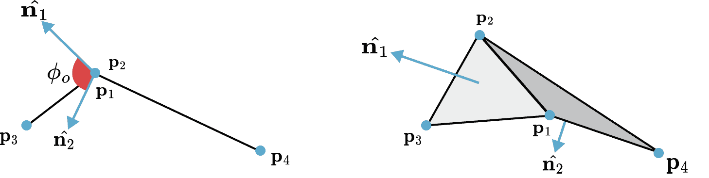

# 布料：拉伸和弯曲

> [`phys-sim-book.github.io/lec32.1-pbd_cloth_constraints.html`](https://phys-sim-book.github.io/lec32.1-pbd_cloth_constraints.html)

在基于位置的动力学（PBD）的背景下，布料的复杂机械行为，如其抗拉伸和弯曲能力，通过一组几何约束进行建模。PBD 框架不是累积力，而是直接通过迭代方式操作网格顶点的位置以满足这些约束。本节将详细阐述布料模拟的基本约束的公式。

### 通过距离约束拉伸阻力

大多数纺织品的显著特征是它们对拉伸的高抵抗力。在 PBD 中，这一特性通过限制连接粒子的距离保持接近其初始或静止距离来强制执行。这是 PBD 生态系统中最简单但最重要的约束之一（我们已经在示例 32.4.1 中看到了这个约束）

> ****示例 33.1.1（拉伸约束）**** 考虑两个粒子，i=1,2，其位置为 p1 和 p2，质量为 m1 和 m2，以及它们之间的静止距离 d。拉伸约束函数 C 定义为当前距离与静止距离之差：C(p1,p2)=∥p1−p2∥−d(33.1.1) 目标是找到校正Δp1 和Δp2，使得 C(p1+Δp1,p2+Δp2)=0。约束函数相对于粒子位置的梯度是：∇p1C=∥p1−p2∥p1−p2=n 和∇p2C=−∥p1−p2∥p1−p2=−n，其中 n 是连接两个粒子的轴上的单位向量。根据一般的 PBD 投影公式(32.4.4)，标量拉格朗日乘数λ计算如下：λ=w1∥∇p1C∥2+w2∥∇p2C∥2C(p1,p2)=w1+w2∥p1−p2∥−d，其中 wi=1/mi 是粒子 i 的逆质量。然后通过将粒子沿着各自的梯度方向移动，并按其逆质量和λ进行缩放来找到位置校正：Δp1=−w1+w2w1(∥p1−p2∥−d)nΔp2=+w1+w2w2(∥p1−p2∥−d)n 这些校正，当应用时，将使粒子移动到正好满足静止长度。请注意，总校正根据粒子的逆质量在粒子之间分配，确保较轻的粒子比较重的粒子移动更多，并且线性动量得到保持（∑miΔpi=0）。

为了实现不同级别的弹性，可以通过通过缩放校正Δpi 由 k 来引入刚度参数 k∈[0,1]。这允许材料具有不同的弹性，从完全刚性（k=1）到完全无刚度（k=0）。

### 二面角弯曲约束

虽然拉伸约束保持了布网的结构完整性，但它们不能防止其不自然地折叠。弯曲阻力，它决定了布料的皱纹和垂坠方式，通过约束相邻三角形的角来建模。

约束定义为一对共享公共边（p1​,p2​）和（p1​,p2​,p4​）的三角形（p1​,p3​,p2​）的三角形。弯曲阻力是两个三角形之间的二面角 ϕ 的函数，这是它们各自法向量 n1​ 和 n2​ 之间的初始角度。约束旨在将此角度恢复到其原始值，ϕ0​。

**[弯曲约束]** 提供的插图显示了 R3 中一对三角形之间的二面角。

约束函数被公式化为：Cbend​(p1​,p2​,p3​,p4​)=arccos(n1​⋅n2​)−ϕ0​(33.1.2) 其中法向量计算如下：n1​n2​​=(p2,1​×p3,1​)/∥p2,1​×p3,1​∥=(p2,1​×p4,1​)/∥p2,1​×p4,1​∥。然后计算此函数相对于四个顶点位置（p1​,p2​,p3​,p4​）的梯度，并使用标准的 PBD 投影机制来推导位置校正。弯曲刚度使用 kbend​ 参数确定。

此公式的显著优点是其与拉伸无关。因为角度由归一化向量定义，所以约束对三角形边长是不变的。

### 等距弯曲

对于几乎不可拉伸的表面，可以使用等距弯曲模型 [[Bergou et al. 2006]](bibliography.html#bergou2006quadratic)。此模型基于弯曲能量的局部 Hessian 提供了一个稳健的公式。

此模型考虑了网格的每个内部边 e0​ 的模板，由相邻于该边的两个三角形的四个顶点组成，标记为 p0​,p1​,p2​,p3​。此模板的局部弯曲能量定义为二次形式：Ebend​(ps​)=21/2i,j∈{0,1,2,3}∑Qij​(pi⊤​pj​)(33.1.3) 其中 ps​=(p0​,p1​,p2​,p3​)T 是模板位置的向量，Q∈R4×4 是一个常数矩阵，表示弯曲能量的局部 Hessian。此矩阵仅取决于模板的原始几何形状，可以预先计算。其条目来自两个三角形内角的正切。

弯曲约束直接从该能量定义：Cbend​(ps​)=Ebend​(ps​)。由于能量在位置上是二次的，其梯度是线性的且易于计算：∂pi​/∂Cbend​​=j∈{0,1,2,3}∑Qij​pj​(33.1.4) 此模型特别适用于服装模拟，其中预期织物将等距变形（即，不拉伸）。
