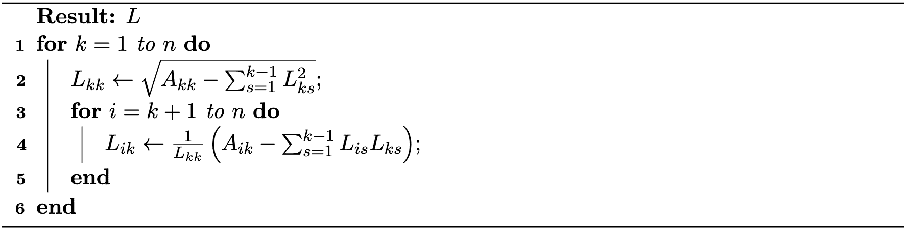

# 直接求解器

> 原文：[`phys-sim-book.github.io/lec33.1-direct_solver.html`](https://phys-sim-book.github.io/lec33.1-direct_solver.html)

直接求解器是一类算法，旨在通过有限步骤计算线性系统的精确解，直到数值精度。在优化和模拟的上下文中，系数矩阵 A 通常是对称正定（SPD），这使得直接求解器对于中等规模的问题既稳健又高效。

### 三角矩阵的前向和回代

当 A 是三角矩阵时，求解 Ax=b 特别直接。如果 A 是下三角矩阵，即 a11a21⋮an1​0a22⋮an2​​⋯⋯⋱⋯000ann​​x1x2⋮xn=b1b2⋮bn​。（34.1.1）该系统可以通过前向代换求解。第 i 个变量通过以下方式求解：xi=aii1(bi−j=1∑i−1aijxj)，i=1,…,n。（34.1.2）这个过程从 i=1 到 n，使用之前计算出的 xj 对于 j<i。

如果 A 是上三角矩阵，则通过回代求解该系统：xi=aii1(bi−j=i+1∑naijxj)，i=n,n−1,…,1。（34.1.3）这个过程从 i=n 开始，向下到 1，使用已经计算出的 xj 对于 j>i。

### Cholesky 分解

对于一般的对称正定矩阵，我们可以使用 Cholesky 分解将问题简化为三角系统。给定 A 为对称正定矩阵，我们可以将 A 分解为 A=LLT，其中 L 是下三角矩阵。

> ****方法 34.1.1（Cholesky 分解）.**** 给定一个对称正定矩阵 A，Cholesky 分解计算一个下三角矩阵 L，使得 A=LLT。算法如下：
> 
> **算法 34.1.1（Cholesky 分解算法）。** 

一旦计算了分解，求解 Ax=b 就简化为两个三角系统：

1.  **前向代换：** 解 Ly=b 得到 y。

1.  **回代：** 解 Lx=y 得到 x。

Cholesky 分解利用了 A 的对称性和正定性，与通用方法如 LU 分解相比，降低了计算成本和内存使用。当系统规模不是太大，或者对于病态系统需要高精度时，直接求解器被广泛使用。对于非常大的或高度稀疏的系统，可能更倾向于使用迭代求解器，如下一节所述。
